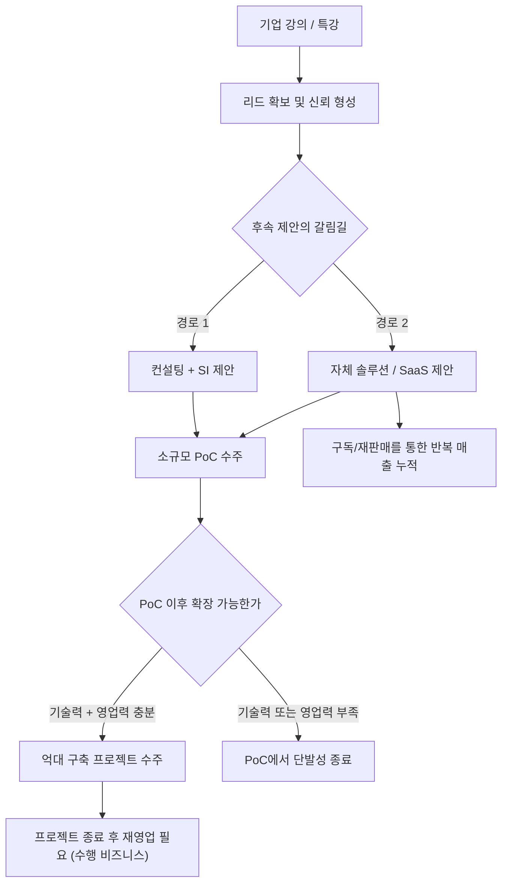
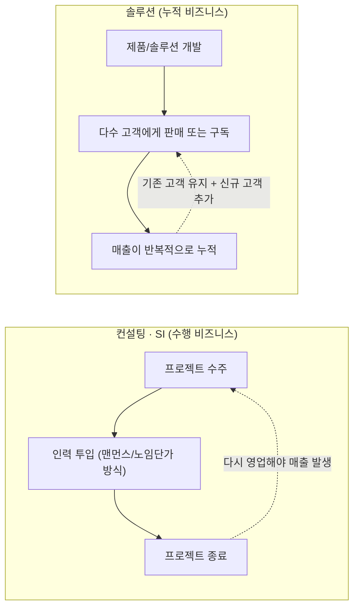

**작성 기준일: 2026년 8월 31일**

> 
> https://www.threads.com/share/BAMHy-3Twp/
> 
> 개인적으로 체감한 AX 사업의 현실
> 
> 1. 기업강의 시장은 저가 경쟁 가속화가 시작되었다. (공급 많음)
> 2. 강의 뒤 이어지는 후속 퍼널은 컨설팅+SI보다 솔루션이 압도적으로 좋다.
> 3. PoC 수주 뒤에 이어지는 억대 구축 프로젝트는 기술력/영업력 없이 불가능하다.
> 4. 과거 SI 및 소프트웨어 노임단가 시절의 공식을 그대로 따르므로 큰 돈을 벌려면 아예 산업군이 다른 곳을 타깃해야 한다.
> 5. 컨설팅/SI는 수행 비즈니스이지 쌓이는 비즈니스는 아니므로 솔루션(SaaS든 단건구매든)을 어떻게든 잘 개발해서 팔아야 더 큰 사업 모멘텀을 가질 수 있다.
> 위 5가지 내용은 올해 뼈를 갈아넣어 얻은 레슨런이다.
> 
> 기술력 좋은 회사들도 어렵다고 한다. 기술 평준화가 진행되어 고객사가 직접 다 구축해버리는 난잡한 상황이 이어지고 있다.
> 
> **re:** 이런 고급정보는 사실 직접 뛰어보지않으면 모르는 고급정보인데 몇분이 이 몇줄에 담긴 진지한 내용을 파악할지는 모르겠지만 저도 현재 SI 쪽 으로 진행중인데 SI 는 길어야 몇년밖에 안되다보니 고민이 많았는데 몇일전 인사이트를 핵폭탄급으로 받아서 현재가진것중에 올인할만한 부분을 찾아서 그쪽으로 가기로 했는데 잘될지는 모르겠습니다 😭
> 
> **re:** AX는 결국 기존 SI에 대기업급 업무 프로세스 명료화, 체계 구축 등에 대한 컨설팅 곁들여진 형태로 되게 애매모호한 비즈니스 성격이 되고 있다고 봅니다.
> 
> 참 어려울 거에요. 견적내기도, 솔루션화 하기도... 내부 AI 구독 플랜으로 커스텀 일정 부분 허용해야할 지도 모르는데 그러면 또 비즈니스 통제력이나 종속성과 차별점이 희석됩니다.
> 
> 클라이언트가 과거와 다르게 좀 더 리터러시가 고도화 된 상태가 되어야 서로가 나름 편해질텐데 기대하긴 어렵습니다.
> 
> **re:** 맞습니다. 지금까진 1-4/5 형태로 이루어졌다면. 결국 점진적으로 고객사가 직접 구축하는 형태로 갈수밖에 없어보입니다. 그렇다면 남은건 좀 더 근본적으로 들어갈수밖에 없어보입니다.
> 
> 말씀하신 특화 솔루션 또는 원천기술 또는 인프라 또는 해당분야의 AX노하우. 가 없다면 내년시장에서는 많이 걸러지지않을까 생각합니다🤔
> 
> 저는 이 시장을 단순하게 AI를 조금 더 활용할 수 있어선 답이 없다고 보고있습니다.
> 
> **re:** 5번 격공합니다. 그래서 어떻게든 경험한 것들을 프레임워크로 만드는데 짜투리 시간 총공세
> 
> **re:** 요즘 그래서 그런지 
> Agent 를 고객사들이 쉽게 만들수있게 하는 제품을 만드는 회사들이 많이 보이던데
> 이 방향은 어떻게 보시나요?
> 

---

## 0. 이 문서에 대한 안내

이 문서는 사용자가 공유한 Threads 게시물(`https://www.threads.com/share/BAMHy-3Twp/`)의 내용을 상세히 풀어 설명하고, 그 안에 담긴 주장들이 2026년 8월 현재 시장 상황과 얼마나 부합하는지를 공개된 자료로 교차 확인한 결과물이다.

먼저 밝혀둘 점이 있다. Threads는 로봇(자동 수집 프로그램)의 접근을 차단하고 있어 원문 페이지를 직접 열람할 수 없었다. 따라서 이 문서는 사용자가 대화창에 직접 붙여넣은 게시물 본문과 댓글 스레드 전체 텍스트를 1차 자료로 삼았으며, 그 위에 국내외 공개 자료를 검색해 사실관계를 보강했다. 게시물 작성자와 댓글 작성자들은 실명이 공개되지 않은 일반 이용자이므로, 이 문서에서도 신원을 특정하거나 추정하지 않고 "원 게시자", "첫 번째 댓글", "두 번째 댓글" 등으로만 지칭한다.

문서 안에서 다루는 정보는 신뢰도에 따라 구분했다.
- **1차 공식 자료**: 정부 공고, 기업 공식 발표
- **다중 매체 교차 확인**: 두 곳 이상의 언론사가 동일 사실을 보도한 경우
- **단일 출처 보도/블로그**: 한 곳의 언론사·기업 블로그·커뮤니티 글에만 등장하는 정보(홍보성일 가능성을 함께 표기)
- **원 게시물의 개인적 견해**: 검증 대상이 아니라 게시자 본인의 현장 체감과 주장

---

## 1. 원문이 다루는 배경: AX 사업이란 무엇인가

본론에 들어가기 전에 "AX"라는 용어부터 짚어야 한다. AX는 AI Transformation(인공지능 전환)의 줄임말로, 단순히 챗봇 하나를 붙이는 수준의 "AI 도입"과는 결이 다르다. 업무 방식과 의사결정 구조, 제품 설계 자체를 AI 중심으로 재구성하는 것을 가리키는 말로 통용되고 있다(출처: 브런치 PM 정리글, 2026년 3월).

이 개념이 실제로 어떻게 구현되고 있는지 국내 사례로 살펴보면, KB국민은행은 머신러닝 기반 기업신용평가로 대출 심사를 자동화했고 AI 보이스피싱 탐지 시스템으로 2025년 한 해 동안 약 1,720억 원의 피해를 예방한 것으로 알려졌다. 카카오뱅크는 대화형 AI 검색과 AI 금융계산기, AI 송금 기능을 잇따라 출시해 출시 4개월 만에 이용자 100만 명을 넘겼고 현재는 약 170만 명이 쓰고 있다고 밝혔다(출처: 브런치 PM 정리글, 2026년 3월 — 언론 재인용 성격의 개인 정리 자료이므로 세부 수치는 참고용으로 볼 것). 제조업 쪽에서는 LS일렉트릭이 설비 데이터를 표준화·통합해 AI가 분석하는 "AI 팩토리" 모델을 실제 공장(엘앤에프 구지 공장)에 구축해 실증을 완료했다고 2026년 3월 밝혔다(출처: ZDNet Korea, 2026.03.03).

정부도 이 흐름을 뒷받침하고 있다. 2026년도 "AX 원스톱 바우처 지원사업"은 수요기업이 주관하고 AI·클라우드·데이터 공급기업이 컨소시엄으로 참여하는 구조로, 과제당 약 13억 원 내외를 2년에 걸쳐 지원하며 국산 AI 모델 적용을 의무화하고 있다(출처: RnDcircle 정부지원사업 공고 정리, 2026.03).

즉 2026년의 AX는 "관심을 가질 만한 신사업"에서 "정부와 대기업, 금융권이 이미 실행 중인 시장"으로 넘어간 상태다. 문제는 바로 여기서 시작된다. 시장이 뜨거워질수록 그 안에서 돈을 버는 방식은 사람들의 기대와 다르게 흘러가고 있다는 것이 원 게시물의 핵심 문제의식이다.

---

## 2. 원 게시자가 정리한 다섯 가지 교훈

원 게시자는 스스로 "올해 뼈를 갈아넣어 얻었다"고 표현할 만큼 실전에서 체득한 다섯 가지 결론을 제시했다. 하나씩 풀어서 설명한다.

### 2-1. 기업 강의 시장은 이미 저가 경쟁이 시작됐다

원 게시자가 첫 번째로 짚은 것은 "공급 과잉"이다. AI 관련 기업 강의·특강 시장에 뛰어드는 강사와 기관이 한꺼번에 늘어나면서 가격이 무너지고 있다는 진단이다.

이 진단은 시장 데이터로도 뒷받침된다. 2026년 기준 중소기업 재직자 대상 정부 AI 훈련은 훈련비의 90% 이상을 지원하거나 사실상 전액 무상으로 제공되는 경우가 많아, 기업 입장에서는 외부 유료 강사를 쓸 이유가 갈수록 줄어들고 있다(출처: 윈스펙 커뮤니티, 2026.06.08). 여기에 더해 교육부와 국가평생교육진흥원이 운영하는 케이무크(K-MOOC)는 이미 약 3,000개 강좌, 회원 177만 명, 누적 수강 신청 444만 건 규모로 성장했고 2026년에는 대규모 언어모델 이해 과정 등 AI 특화 강좌를 신규로 확대하며 전부 무료로 제공한다(출처: MS투데이, 2026.05.19). 유료 민간 강의가 국비 지원 강좌·무료 공개강좌와 동일한 콘텐츠를 놓고 경쟁해야 하는 구조이니, 저가 경쟁이 벌어지는 것은 자연스러운 결과로 보인다.

다만 이렇게 확대된 교육이 실제 조직 변화로 이어지는지는 별개 문제다. 한 인사·교육(HRD) 포럼에서는 전사 차원의 생성형 AI 교육을 진행하고 실제 업무 적용 사례까지 만든 기업에서도 담당자들이 "조직 전체가 변했다고 체감하기는 어렵다"는 취지의 소회를 밝힌 것으로 전해진다(출처: 윈스펙 커뮤니티, 2026.06.08, 코멘토 HRD 포럼 재인용). 강의 자체의 공급은 넘치는데, 강의가 실질적 성과로 이어지는 비율은 낮다는 이중의 압박이 시장에 걸려 있는 셈이다.

### 2-2. 강의 뒤에 붙는 후속 사업은 컨설팅+SI보다 솔루션이 훨씬 유리하다

두 번째 교훈은 비즈니스 모델에 관한 것이다. 강의를 계기로 확보한 고객에게 다음 단계를 제안할 때, 사람이 투입되는 컨설팅·SI(시스템통합) 방식보다 제품화된 솔루션(SaaS든 단건 판매든)을 파는 쪽이 성과가 훨씬 좋다는 것이 원 게시자의 체감이다.

이는 두 비즈니스 모델의 구조적 차이에서 비롯된다. 컨설팅·SI는 사람이 시간을 들여 수행해야 끝나는 "수행형 매출"이다. 반면 솔루션은 한 번 만들어두면 여러 고객에게 반복해서 판매하거나 구독시킬 수 있는 "누적형 매출" 구조를 가진다. 인력을 추가로 투입하지 않아도 매출이 쌓일 수 있다는 점에서 사업의 확장성 자체가 다르다.

### 2-3. PoC 수주 이후의 억대 구축 프로젝트는 기술력과 영업력 없이는 불가능하다

세 번째는 파일럿(PoC, Proof of Concept) 이후 단계의 벽에 관한 이야기다. 소규모 PoC를 따내는 것까지는 상대적으로 쉽지만, 그 이후 실제 억 단위 예산이 들어가는 본 구축 프로젝트로 이어지려면 상당한 기술력과 영업력이 동시에 필요하다는 뜻이다.

실제 국내 AI 개발 외주 시장을 다룬 자료를 보면 이 격차가 왜 발생하는지 짐작할 수 있다. 실용적인 수준의 AI MVP(챗봇, 간단한 RAG 검색 시스템 등)는 2,000만 원에서 5,000만 원 선에서 만들어지는 것이 일반적이며, 이 구간에는 2~5인 규모의 소형 팀도 다수 뛰어들어 있다(출처: TreeSoop, 2026.04.09). 이런 소형 프로젝트에서 대형 구축 프로젝트로 넘어가려면 도메인 지식, 실제 파인튜닝·RAG 파이프라인 설계·온프레미스 배포 경험 등 훨씬 높은 수준의 역량이 요구되는데, 이 구간을 채울 수 있는 업체는 소수에 불과하다는 것이 같은 자료의 진단이다(출처: TreeSoop, 2026.04.09). PoC와 본 구축 사이에 놓인 이 간극이야말로 원 게시자가 말하는 "기술력·영업력 없이는 불가능한" 지점과 정확히 맞아떨어진다.

### 2-4. 옛날 SI·노임단가 공식을 그대로 따르므로, 큰돈을 벌려면 아예 다른 산업군을 타깃해야 한다

네 번째는 AX 사업의 견적 방식 자체가 과거 SI·소프트웨어 산업의 "노임단가(맨먼스 단가)" 공식을 그대로 물려받았다는 지적이다. 사람의 투입 공수(工數)를 기준으로 가격을 매기는 옛 방식이 AI 프로젝트에도 그대로 이식되다 보니, 아무리 AI로 생산성을 높여도 벌 수 있는 돈의 상한선 자체가 과거와 크게 다르지 않다는 것이다. 그래서 원 게시자는 정말 큰 돈을 벌려면 IT 업계의 익숙한 발주처가 아니라 아예 다른 산업군, 즉 이런 노임단가 관행이 없는 영역을 새로 개척해야 한다고 결론짓는다.

이 지적은 SI 업계 자체의 최근 흐름과 함께 놓고 보면 더 입체적으로 이해할 수 있다. 2026년 하반기 SI 산업의 화두는 "실질적인 수익 창출"로 요약되는데, 인프라 설계부터 솔루션 구축, 보안까지 한 번에 제공할 수 있는 대형 SI 기업들은 수주 잔고가 가파르게 늘고 있으며 이들의 성장은 국내가 아니라 북미·유럽·동남아·중동 등 해외 시장 확산에서 나오고 있다(출처: 파이낸셜투데이, 2026.05.30). 즉 대형 계열사 SI는 해외로 활로를 넓히며 성장하고 있는 반면, 원 게시자와 같은 중소 규모 AX 사업자·프리랜서·부티크 컨설팅펌은 국내의 좁은 파이 안에서 옛 공식 그대로 경쟁해야 하는 이중 구조가 존재하는 것으로 보인다. 이는 원문의 "기술력 좋은 회사들도 어렵다"는 진단과 완전히 배치되지는 않는다. 여기서 말하는 "기술력 좋은 회사"는 대형 SI 대기업이 아니라, AX를 전문으로 표방하는 중소 규모 기술 기업을 가리키는 것으로 읽는 것이 자연스럽다.

또한 생성형 AI가 개발 자체를 도와주는 상황이 되면서 SI 업계의 경쟁 구도 자체가 흔들리고 있다는 지적도 있다. 2026년 IT 시장 전망을 다룬 한 매체는 생성형 AI가 실시간으로 화면 구성 요소를 조합해주는 "생성형 UI"가 확산되는 흐름이 SI 업계의 경쟁 구도에까지 영향을 미치고 있다고 짚었다(출처: 컴퓨터월드, 2025.12.31).

### 2-5. 컨설팅·SI는 "수행 비즈니스", 솔루션은 "쌓이는 비즈니스"

다섯 번째는 앞의 네 가지를 관통하는 결론이다. 컨설팅과 SI는 프로젝트가 끝나면 그 자체로 소멸하는 "수행 비즈니스"이고, 다시 영업을 해서 다음 일감을 따내야 매출이 이어진다. 반면 솔루션(SaaS든 단건 구매형 제품이든)은 한 번 만들어두면 여러 고객에게 계속 팔 수 있는 "쌓이는 비즈니스"다. 그러므로 더 큰 사업 모멘텀을 가지려면 어떻게든 솔루션을 잘 만들어서 파는 능력을 갖춰야 한다는 것이 원 게시자의 최종 결론이다.

---

## 3. 왜 "기술 평준화"가 문제의 핵심으로 떠오르는가

원 게시자는 본문 말미에 "기술력 좋은 회사들도 어렵다고 한다"면서 그 원인으로 "기술 평준화"를 지목했다. 고객사가 굳이 외부 업체에 맡기지 않고 스스로 구축해버리는 상황이 이어지고 있다는 것이다.

이 진단을 뒷받침하는 근거는 비교적 명확하다. 현재 오픈AI, 앤스로픽 등 최상위권 AI 모델은 이제 누구나 일정 비용만 지불하면 API 형태로 즉시 접근할 수 있는 범용 인프라가 되었고, 이는 자본력을 갖춘 어떤 기업이든 경쟁사와 동일한 수준의 AI 추론 능력을 자사 시스템에 이식할 수 있음을 뜻한다(출처: SaaS 전환지원센터, 2026). 과거 소프트웨어 시대에는 고도화된 기술력과 개발 역량 자체가 진입장벽이었지만, 지금은 최상위 오픈소스 모델과 고효율 미세조정 기법이 계속 공급되면서 선도 모델과 후발 모델 사이의 추론 능력 격차가 이미 상당히 좁혀졌다는 것이 같은 자료의 분석이다(출처: SaaS 전환지원센터, 2026).

이 흐름은 "고객사가 직접 만드는" 사례로도 이미 나타나고 있다. 이마트는 HR 문의에 답하는 챗봇이나 바이어용 농산물 시세 탐색 에이전트 등을 부서별로 직접 개발해 운용하고 있으며, 본사 직원이 노코드 에이전트 빌더로 자기 업무에 맞는 AI 에이전트를 직접 만드는 사례가 늘어나는 추세라고 전해진다(출처: 이젠아카데미, 2026.06.22). 아모레퍼시픽도 역할별로 특화된 에이전트가 협업하는 구조로 "AI 뷰티 카운슬러"를 구현한 것으로 알려졌다(출처: 이젠아카데미, 2026.06.22). 성공적인 도입 사례들의 공통점은 처음부터 전사 도입을 노리기보다 범위가 좁은 파일럿에서 시작해, 현장 직원이 노코드 도구로 소규모 자동화를 직접 만들고 검증 후 점차 넓혀가는 상향식(bottom-up) 구조를 취했다는 점으로 정리된다(출처: 이젠아카데미, 2026.06.22).

정리하면, 원 게시자가 말한 "기술 평준화"는 막연한 인상이 아니라 (1) 최상위 AI 모델의 API 상품화, (2) 노코드 에이전트 빌더의 보급이라는 두 축이 동시에 진행되면서 실제로 벌어지고 있는 현상으로 볼 수 있다.

---

## 4. 댓글 스레드에서 오간 논의 재구성

원문 게시물 아래로 여러 명이 댓글을 남기며 논의를 이어갔다. 발언자를 특정할 수 없으므로 등장 순서대로 정리한다.

### 첫 번째 반응 — SI 업계에 있는 사람의 고민 토로

한 사람은 이런 "고급 정보"는 직접 부딪혀보지 않으면 알 수 없는 내용이라 공감하면서, 본인도 현재 SI 관련 일을 진행 중이라고 밝혔다. SI는 길어야 몇 년밖에 지속되지 않는 일이라 진로에 대한 고민이 많았는데, 최근 며칠 사이 원 게시물과 같은 통찰을 접하고 나서 지금 가진 역량 중 올인할 만한 방향을 찾아 그쪽으로 방향을 틀기로 했다고 전했다. 다만 본인도 이 선택이 잘 될지는 장담할 수 없다며 다소 불안한 심경을 함께 내비쳤다.

### 두 번째 반응 — AX의 애매한 정체성에 대한 분석

다음 댓글은 AX 사업의 성격 자체를 분석했다. 결국 AX는 기존 SI에 대기업급 업무 프로세스 명료화·체계 구축 같은 컨설팅 요소가 곁들여진, 정체성이 상당히 애매모호한 사업 형태로 굳어지고 있다는 진단이다. 이 때문에 견적을 내는 것도, 무언가를 솔루션화하는 것도 모두 어려운 일이 된다고 지적했다.

특히 흥미로운 지점은 "내부 AI 구독 플랜에서 일정 부분 커스터마이징을 허용해야 할 수도 있는데, 그렇게 하면 오히려 비즈니스에 대한 통제력이나 종속성, 차별점이 희석된다"는 딜레마다. 즉 고객 맞춤형으로 유연하게 대응할수록 사업자 입장에서는 자신만의 제품 경쟁력을 지키기 어려워지는 모순이 발생한다는 뜻이다. 이 댓글은 클라이언트(고객사)의 AI 리터러시가 과거보다 훨씬 높아져야 서로가 편해질 텐데, 그런 변화를 기대하기는 어렵다는 다소 비관적인 전망으로 마무리됐다.

### 세 번째 반응 — 원 게시자의 재응답: 근본으로 들어가야 한다

원 게시자로 추정되는 이가 다시 댓글을 달아 논의를 이어갔다. 지금까지는 "강의 → 컨설팅/SI → 솔루션"의 순서(원문 표현으로는 "1-4/5 형태")로 사업이 흘러갔다면, 앞으로는 점진적으로 고객사가 직접 구축하는 형태로 갈 수밖에 없어 보인다고 진단했다. 그렇다면 사업자 입장에서 남은 선택지는 더 근본적인 영역으로 들어가는 것뿐이라고 봤다.

구체적으로는 앞선 댓글에서 언급된 특화 솔루션, 원천 기술, 인프라, 또는 해당 분야만의 AX 노하우, 이 중 어느 하나도 갖추지 못한 사업자는 내년(2027년) 시장에서 상당수 걸러질 것이라는 전망을 내놓았다. 그러면서 단순히 "AI를 조금 더 잘 활용할 수 있다"는 수준으로는 이 시장에서 답이 나오지 않는다고 단언했다.

### 네 번째 반응 — 다섯 번째 교훈에 대한 강한 공감

다음 댓글은 원문의 다섯 번째 교훈(컨설팅·SI는 수행 비즈니스, 솔루션이 쌓이는 비즈니스라는 결론)에 강하게 공감을 표하면서, 본인도 그래서 그동안 경험한 것들을 하나의 프레임워크로 정리하는 작업에 자투리 시간을 총동원하고 있다고 밝혔다.

### 다섯 번째 반응 — 아직 답이 나오지 않은 질문

스레드의 마지막 댓글은 질문으로 끝난다. 최근 고객사가 에이전트를 쉽게 만들 수 있도록 도와주는 제품(에이전트 빌더류 솔루션)을 내놓는 회사들이 많이 보이는데, 이 방향성을 어떻게 보는지 원 게시자에게 되묻는 내용이다. 사용자가 제공한 텍스트는 여기서 끝나며, 이에 대한 원 게시자의 답변은 포함되어 있지 않았다.

---

## 5. 프레임워크로 정리하기

### 5-1. AX 사업의 퍼널과 그 갈림길

원 게시물과 댓글 전체를 관통하는 구조를 도식으로 정리하면 다음과 같다.

이 도식에서 원 게시자가 강조한 지점은 크게 두 군데다. 첫째, C 지점에서 컨설팅+SI 경로보다 솔루션 경로가 결과적으로 더 유리하다는 것. 둘째, G 지점에서 PoC를 넘어 H(억대 구축)까지 도달하는 것 자체가 기술력과 영업력이 없으면 매우 어렵다는 것이다. 그리고 설령 H에 도달하더라도 그 매출은 J처럼 프로젝트 종료와 함께 다시 원점으로 돌아가는 반면, E에서 K로 이어지는 솔루션 경로만이 반복적으로 쌓이는 매출 구조를 만들어낸다.

### 5-2. 두 비즈니스 모델의 근본적 차이

이 구조 차이가 바로 원문의 첫 번째 교훈부터 다섯 번째 교훈까지를 관통하는 핵심 논리다. 컨설팅·SI 구조는 순환은 하되 매번 처음(S1)으로 돌아가 다시 영업력을 소모해야 하는 반면, 솔루션 구조는 한 번 만든 자산(P1)이 계속 누적되며 성장할 수 있다.

---

## 6. 원문에서 던져진 마지막 질문: "에이전트를 쉽게 만드는 제품"은 답이 될 수 있을까

스레드의 마지막 질문, 즉 고객사가 스스로 에이전트를 쉽게 만들 수 있게 해주는 제품(에이전트 빌더)을 만드는 회사가 늘어나는 흐름을 어떻게 볼지는 원문 안에서 답이 나오지 않았다. 다만 2026년 8월 현재 시점의 시장 상황을 확인해보면, 이 질문에 참고가 될 만한 사실관계를 몇 가지 짚을 수 있다.

먼저 이 흐름은 이미 상당히 진행되어 있다. KT는 2026년 3월 스페인 바르셀로나에서 열린 MWC 2026에서 코딩 지식 없이 드래그 앤 드롭 방식으로 AI 에이전트를 만들 수 있는 "에이전트 빌더"를 공개했다. 미리 준비된 업무 템플릿과 대화 모듈을 조합해 목적 정의, 데이터·시스템 연결, 응답 방식 구성, 배포까지 진행할 수 있는 구조이며, 회의록 자동화 에이전트나 공공기관 문서 작성, 금융사 자산운용 리서치 브리핑 자동화 같은 실제 활용 사례를 함께 시연했다(다중 매체 교차 확인 — 테크월드뉴스·네이트뉴스·알파경제, 2026.03.03~04). 해외에서도 유사한 흐름이 뚜렷하다. 자연어 지시만으로 멀티 에이전트 팀을 구성하고 200개 이상의 MCP(Model Context Protocol) 도구를 연결할 수 있다고 홍보하는 노코드 에이전트 빌더 서비스들이 다수 등장했고(출처: Deep Agent Builder 자사 홈페이지, 2026 — 자사 홍보 자료), 기업용 에이전트 빌더 플랫폼만 9종을 비교하는 해외 리서치 콘텐츠도 나올 만큼 카테고리 자체가 이미 붐비고 있다(출처: opsima.com, 2026.04.26). 시장 조사기관 가트너는 2026년까지 기업용 애플리케이션의 40%가 특정 업무용 AI 에이전트를 내장하게 될 것이라는 전망을 내놓은 것으로 인용되고 있다(출처: Jenova 자사 웹사이트의 가트너 재인용, 2026.01 — 원문 보고서를 직접 확인하지 못했으므로 재인용 정보로 참고할 것).

이 사실관계를 놓고 보면 두 가지 상반된 해석이 모두 가능하다.

**긍정적으로 볼 경우**: 에이전트 빌더 자체를 만들어 파는 사업은 정확히 원 게시자가 강조한 다섯 번째 교훈, 즉 "솔루션을 개발해서 파는" 방향에 부합한다. 한 번 만든 빌더 플랫폼을 여러 고객사에 구독 형태로 판매할 수 있다면 수행형 매출이 아니라 누적형 매출 구조를 만들 수 있고, 앞서 세 번째 댓글에서 언급된 "특화 솔루션·원천기술" 요건도 충족할 가능성이 있다.

**신중하게 볼 경우**: 동시에 이 카테고리 역시 앞서 짚은 "기술 평준화" 흐름에서 자유롭지 않다. 이미 통신 대기업(KT)부터 다수의 스타트업까지 유사한 형태의 제품을 쏟아내고 있고, 해외에서는 비교 콘텐츠가 나올 만큼 경쟁자가 많다. 게다가 에이전트 간 통신·연결 표준(MCP, A2A)이 2026년 들어 리눅스 파운데이션 산하 기구로 이관되며 벤더 중립적인 공통 규격으로 자리잡고 있다는 점도(출처: 프로젝트리서치, 2026.06.17) 특정 업체만의 기술적 차별점을 만들기 어렵게 하는 요인이다. 표준이 공개되고 도구가 보편화될수록, "에이전트를 쉽게 만들어주는 도구"라는 카테고리 자체도 다시 저가 경쟁에 노출될 가능성을 배제할 수 없다.

결국 이 질문에 대한 답은 "에이전트 빌더를 만드느냐 마느냐"가 아니라, 세 번째 댓글에서 언급된 것처럼 특정 산업 도메인에 대한 깊은 노하우나 데이터·인프라 종속성을 얼마나 확보하느냐에 달려 있을 가능성이 크다. 범용 에이전트 빌더는 이미 레드오션에 가까워지고 있지만, 특정 업종(예: 제조 설비 예지보전, 금융 심사, 물류 최적화)에 특화된 에이전트 빌더는 아직 상대적으로 여지가 남아 있는 것으로 보인다.

---

## 7. 종합: 다섯 가지 교훈과 시장 근거 비교

| 원 게시자의 교훈 | 핵심 주장 | 뒷받침하는 시장 근거 |
|---|---|---|
| 1. 기업강의 저가경쟁 | 공급 과잉으로 가격 붕괴 | 국비지원 90%, K-MOOC 무료 3,000강좌 확대 |
| 2. 컨설팅+SI보다 솔루션 | 솔루션 후속 퍼널이 우월 | 수행형(맨먼스) vs 누적형(구독) 구조 차이 |
| 3. PoC 이후 구축은 기술력·영업력 필수 | 소규모와 대형 프로젝트 사이 격차 큼 | MVP 2천만~5천만원대 vs 대형 구축 사이의 역량 격차 |
| 4. 옛 노임단가 공식, 산업군 전환 필요 | 벌 수 있는 돈의 상한이 정해져 있음 | 대형 SI는 해외 확장으로 성장, 국내 중소 AX 사업자는 정체 |
| 5. 컨설팅/SI는 수행, 솔루션은 누적 | 큰 모멘텀은 솔루션에서 나옴 | 모델 API 상품화·기술 평준화로 고객 직접구축 확산 |

이 다섯 가지 교훈과 댓글 스레드의 논의를 종합하면, 2026년 하반기 AX 시장의 구도는 다음과 같이 요약할 수 있다. 시장의 총량 자체는 정부 지원사업과 대기업 투자에 힘입어 계속 커지고 있지만, 그 안에서 컨설팅·SI·강의 형태로 사업을 하는 중소 규모 플레이어들은 (1) 무료·저가 대체재의 확산, (2) AI 모델과 노코드 도구의 상품화로 인한 고객사의 직접 구축 증가라는 두 겹의 압박을 동시에 받고 있다. 이 압박에서 벗어날 수 있는 길은 단순한 AI 활용 능력이 아니라, 특정 산업에 대한 깊은 도메인 지식과 자체 기술·인프라 자산을 솔루션 형태로 축적하는 것이라는 결론이 스레드 전체를 관통하고 있다.

---

## 8. 용어 정리 (한영 병기)

- **AX (AI Transformation)**: 업무 방식·의사결정 구조·제품 설계를 AI 중심으로 재편하는 것. 단순 AI 도구 도입(AI Adoption)보다 넓은 개념.
- **SI (System Integration, 시스템 통합)**: 여러 시스템·소프트웨어를 하나로 엮어 구축해주는 사업 형태로, 인력 투입량(맨먼스)을 기준으로 견적을 매기는 경우가 많다.
- **PoC (Proof of Concept, 개념 검증)**: 본 구축에 앞서 소규모로 기술적 실현 가능성을 검증하는 시범 단계.
- **SaaS (Software as a Service)**: 소프트웨어를 설치형이 아닌 구독형 서비스로 제공하는 방식.
- **노코드 에이전트 빌더 (No-code Agent Builder)**: 코딩 지식 없이 대화형 인터페이스나 드래그 앤 드롭 방식으로 AI 에이전트를 제작할 수 있게 해주는 도구.
- **MCP (Model Context Protocol)**: AI 에이전트가 외부 도구·데이터에 접근할 때 쓰는 연결 표준 규격.
- **A2A (Agent-to-Agent)**: 여러 AI 에이전트끼리 서로 통신하기 위한 표준 규격.

---

## 9. 참고 자료 (신뢰도 구분 포함)

**언론 보도 (다중 매체 교차 확인)**
- 테크월드뉴스, "KT, 노코드 기반 '에이전트 빌더' 공개", 2026.03.04, https://www.epnc.co.kr/news/articleView.html?idxno=329289
- 네이트뉴스, "코딩 없이 드래그로 AI 만든다…KT, 기업용 '에이전트 빌더' 선봬 [MWC 2026]", 2026.03, https://news.nate.com/view/20260304n04839?mid=n1101
- 알파경제, "[MWC26] KT, 노코드 기반 AI 에이전트 제작 플랫폼 '에이전트 빌더' 선보여", 2026.03.03, https://alphabiz.co.kr/news/view/1065569427910702

**언론 보도 (단일 매체)**
- ZDNet Korea, "AI로 더 똑똑하고 안전하게…LS일렉, 제조 AX 솔루션 대거 공개", 2026.03.03, https://zdnet.co.kr/view/?no=20260303091435
- 파이낸셜투데이, "[FT 창간 21주년 특집⑯] 넥스트 코리아 : SI산업", 2026.05.30, https://www.ftoday.co.kr/news/articleView.html?idxno=359693
- 컴퓨터월드, "[커버스토리] 2026년 주요 IT 시장 전망", 2025.12.31, https://www.comworld.co.kr/news/articleView.html?idxno=51882
- MS TODAY, "무료 AI 강의 시대…교육 혁신의 관건은 교사", 2026.05.19, https://www.mstoday.co.kr/news/articleView.html?idxno=101573

**정부·준공식 자료**
- RnDcircle, "2026년도 AX 원스톱 바우처 지원사업(수요기업 AX 전환 과제)", 2026.03.19, https://app.rndcircle.io/gov-grant/041dc659-97ce-4e45-bea0-7c5cdf5f8511
- SaaS 전환지원센터, https://saas.or.kr/

**기업/기관 블로그 (참고용, 일부 자사 홍보 목적 포함)**
- 브런치, "2026 국내 AX 도입 사례, 산업별 한눈에 알아보기", 2026.03.26, https://brunch.co.kr/@a33f93b357b349e/254
- 유캔랩스, "'우리도 AI 했는데 왜 안 바뀔까' — 2026년, AX 성공과 실패를 가른 단 하나의 차이", https://ucanlabs.kr/blog/ucanlabs-e2e-ax-episode0/
- AX 파트너, https://axpartner.co.kr/
- 이젠아카데미 교육그룹, "AI 에이전트 서비스란 무엇인가? 2026년 트렌드와 전망 완전 정리", 2026.06.22
- 윈스펙 커뮤니티, "기업 AI 교육 어떻게 도입할까?", 2026.06.08 / "AI 강의 어떤 게 좋을까?", 2026.06.11
- 가비아 라이브러리, "2026년 기업 직무교육 트렌드", 2026.05.20
- TreeSoop, "2026년 AI 개발 외주 업체 완전 비교", 2026.04.09, https://treesoop.com/blog/ai-dev-outsourcing-complete-comparison-2026
- 프로젝트리서치, "직장인을 위한 AI Agent & Skill 추천 가이드", 2026.06.17
- opsima.com, "2026년 최고의 AI 에이전트 빌더: 기업용 플랫폼 9선 선정", 2026.04.26 (자사 비교 콘텐츠, 광고성 가능)
- Jenova, "AI 에이전트 만들기: 2026년, 코드 없이 맞춤형 AI 에이전트 구축하기", 2026.01.05 (자사 홍보 자료, 가트너 수치는 재인용)
- Deep Agent Builder 자사 홈페이지 (자사 홍보 자료)
- Salesforce, "Agentforce Digital Summit 2026 행사 주요 하이라이트", 2026.07.22 (자사 홍보 자료)

**원 출처 (접근 제한)**
- Threads 게시물, https://www.threads.com/share/BAMHy-3Twp/ — 로봇 접근 차단으로 직접 열람 불가, 사용자 제공 텍스트를 근거로 서술함
