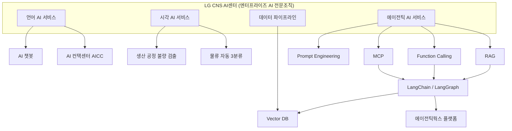
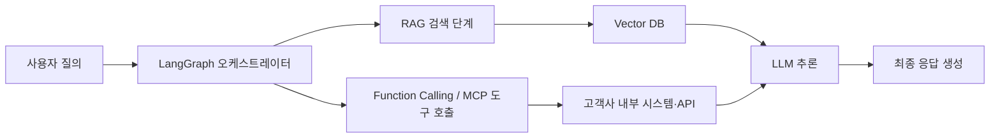

- 작성일: 2026년 8월 31일
- 원문 출처: LG Careers, `https://careers.lg.com/apply/detail?id=1002127`

> 
> 우리는 이런 조직이에요.
> 
> **조직 소개**
> 
> - AI 기술을 고객의 실제 비즈니스에 적용하여 새로운 서비스를 만들고 업무 혁신을 실현합니다.
> - 최신 AI·딥러닝 기술을 분석하고 검증하여 실제 서비스 환경에 적용 가능한 AI 모델을 개발하고 최적화합니다.
> - LLM(초거대언어모델) 기반의 Agentic AI 서비스를 기획하고, RAG·Prompt Engineering·Function Calling·MCP(Model Context Protocol) 등을 활용해 AI > Agent/Multi-Agent 애플리케이션을 개발합니다.
> - LangChain, LangGraph 등 Agent Framework와 Vector DB를 활용하여 고객사 비즈니스 환경에 맞는 AI 모델을 설계하고 구축/운영합니다.
> - 데이터, AI, 클라우드 기술을 접목시킨 언어 AI 서비스(AI 챗봇, AI Contact Center 등)를 제공하며, 시각 AI 영역에서는 생산·물류 공정의 AI Vision 서비스로 불량률 감소와 물류 분류 효율성 개선에 기여합니다.
> - 이미지·비디오 생성형 AI, Vision Language Model(VLM), Multi-Modal AI 기술을 활용하여 새로운 고객가치를 창출하는 AI 서비스를 개발합니다.
> - AI 서비스 운영에 필요한 데이터 수집, 가공, 파이프라인 구축 업무를 수행하며 안정적인 AI 서비스 환경을 제공합니다.
> 
> 
> **전공 분야**
> 
> - 전공 무관
> 
> **필수 사항**
> 
> - 고객 문제를 AI 기술로 해결하고 서비스화하는 과정에 관심이 있는 분
> - AI 기술을 직접 현장에 적용해보고 싶은 분
> - 생성형 AI(LLM)를 활용한 프로젝트 경험이 있으며 Prompt Engineering, RAG 등 AI 서비스 구현 기술에 관심이 있는 분
> - LLM 기반 서비스 또는 AI Agent 개발 프로젝트를 수행한 경험이 있으신 분
> - 딥러닝, 머신러닝에 대해 이해하고 있고, 유관 전공 및 프로젝트 경험을 보유하신 분
>  
> 
> **우대 사항**
> 
> - 텍스트/비전 데이터 전처리, 모델링, 최적화 역량을 갖춘 분
> - Git, Docker·Kubernetes 등 형상관리 및 배포 자동화에 대한 기본 지식이 있는 분
> 

---

## 목차

1. 들어가며 — 이 공고를 읽기 전에 알아야 할 것
2. 이 공고는 어느 회사, 어느 조직의 것인가
3. 조직 소개 원문을 한 줄씩 뜯어보기
4. 더 큰 그림 — LG CNS는 지금 AI 조직을 어떻게 키우고 있는가
5. 핵심 기술 개념을 쉽게 풀어보기
6. 지원 자격 요건이 실제로 의미하는 것
7. 채용 정보 요약과 지원 시 유의사항
8. 기획자·디자이너 관점에서 이 공고를 읽는 법
9. 출처 투명성 표
10. 참고문헌

---

## 1. 들어가며 — 이 공고를 읽기 전에 알아야 할 것

사용자가 붙여넣은 내용은 채용 플랫폼 특유의 압축된 문장으로 되어 있어서, 실제로 이 조직이 무슨 일을 하는지, 왜 이런 기술 스택을 요구하는지가 한눈에 들어오지 않는다. 이 문서는 그 공고 원문을 조항 단위로 풀어 설명하면서, 동시에 이 조직이 속한 회사가 최근 어떤 방향으로 AI 사업을 확장해왔는지를 뉴스와 공식 자료를 통해 교차 확인한 내용을 덧붙인 것이다. RAG, MCP, LangGraph 같은 용어가 왜 이 공고에 등장하는지 궁금한 사람, 즉 개발자가 아니지만 AI 조직의 채용공고를 이해하고 싶은 기획자나 디자이너를 염두에 두고 서술했다.

먼저 결론부터 말하면, 이 공고는 **LG CNS**라는 회사가 운영하는 **AI(AX) 직무** 소개 페이지이며, 2026년 하반기 LG CNS 신입사원 채용의 한 분야로 게재된 것으로 보인다. LG CNS는 IT서비스·시스템통합(SI)을 뿌리로 둔 LG그룹의 IT 계열사로, 최근 수년간 스스로를 'AX(AI Transformation, 인공지능 전환) 전문기업'으로 재정의하며 사업 구조를 재편해왔다[11][43].

## 2. 이 공고는 어느 회사, 어느 조직의 것인가

careers.lg.com은 LG그룹 계열사 전체의 채용 공고를 한곳에 모아둔 통합 채용 플랫폼이다. LG그룹은 계열사마다 별도의 채용 프로세스와 인재상을 갖고 있으며, 지원자는 이 통합 사이트에서 원하는 계열사의 공고를 찾아 지원하는 구조로 되어 있다[11-1]. 따라서 이 링크 하나만으로는 어느 계열사의 공고인지 바로 드러나지 않지만, 조직 소개 문구에 등장하는 세 가지 구체적인 서비스명—AI 챗봇과 AI 컨택센터(AICC), 생산·물류 공정의 AI Vision, 그리고 RAG·MCP·LangChain 기반의 Agentic AI 서비스 기획—은 LG CNS가 공식적으로 운영하고 홍보해온 서비스들과 정확히 일치한다.

구체적으로 LG CNS의 AI 서비스 포털은 자사의 비전 AI 솔루션이 물류센터에서 하루 120만 박스 규모의 화물을 형상·체적 기준으로 자동 3분류하며 정확도 99.8%를 달성했고, 생산 공정에서는 완제품 불량률을 60% 이상 감소시켰다고 공개하고 있다. 이는 채용공고의 "생산·물류 공정의 AI Vision 서비스로 불량률 감소와 물류 분류 효율성 개선에 기여합니다"라는 문장과 사실상 같은 내용을 가리킨다. 이 수치는 2021년 LG CNS AI데이 행사에서 물류 자동 3분류 솔루션으로 처음 소개된 이후, 자사 공식 AI 서비스 포털에 실적 지표로 계속 게시되고 있다[13][14].

AI 컨택센터(AICC) 역시 LG CNS가 수년 전부터 '미래형 컨택센터(FCC, Future Contact Center)' 사업조직을 꾸려 음성인식(STT), 텍스트 분석, 자연어처리(NLP), 음성합성(TTS)을 결합해 제공해온 대표 상품이며, 금융·제조 등 여러 산업의 대형 AICC 사업을 수행해왔다고 LG 공식 보도자료가 밝히고 있다[16]. 이런 정황들을 종합하면 이 공고는 LG CNS의 AI(AX) 직무 소개 페이지일 가능성이 매우 높다. 다만 careers.lg.com의 상세 페이지는 자바스크립트로 동적으로 렌더링되는 구조라 이 문서를 작성하는 시점에 URL을 직접 열람해도 본문 텍스트까지는 자동으로 확인되지 않았다는 점은 밝혀둔다. 이 부분은 뒤의 출처 투명성 표에서 다시 정리한다.

정황상 이 공고는 2026년 하반기에 진행 중인 'LG CNS 신입사원 채용'의 여러 직무소개 페이지 중 하나로 보인다. LG Careers 채용 목록 페이지에는 이 문서 작성 시점을 전후해 "2026년 하반기 LG CNS 신입사원 채용"이라는 공고가 진행 중인 상태로 노출되어 있었다[13][25]. 다만 정확한 접수 마감일자까지는 본 조사에서 확정하지 못했으므로, 실제 지원을 계획한다면 반드시 careers.lg.com에서 최신 마감일을 직접 확인해야 한다.

## 3. 조직 소개 원문을 한 줄씩 뜯어보기

공고의 조직 소개 문단은 크게 세 개의 축으로 나뉜다. 첫째는 AI 기술 자체를 연구·검증·최적화하는 축, 둘째는 그 기술을 실제 서비스로 만드는 축(언어 AI, 시각 AI, 생성형·멀티모달 AI), 셋째는 그 서비스를 지탱하는 데이터 인프라 축이다. 이 순서를 따라가며 원문을 풀어본다.

먼저 "AI 기술을 고객의 실제 비즈니스에 적용하여 새로운 서비스를 만들고 업무 혁신을 실현합니다"라는 문장은 이 조직이 사내 연구소가 아니라 고객사를 상대로 하는 사업 조직임을 명시한다. LG CNS는 자사를 컨설팅 역량과 기술 리더십을 결합해 고객의 숨은 가치를 발굴하는 AX 기업으로 소개하고 있는데[10][43], 이 문장은 그 정체성을 그대로 반영한다.

다음으로 "최신 AI·딥러닝 기술을 분석하고 검증하여 실제 서비스 환경에 적용 가능한 AI 모델을 개발하고 최적화합니다"는 문장은 이 조직이 논문 수준의 최신 기법을 무작정 도입하는 것이 아니라, 실제 프로덕션 환경에서 안정적으로 동작하도록 검증하는 역할까지 포함한다는 뜻이다. 신기술을 실험실 성능이 아니라 실서비스 성능 기준으로 다시 검증하는 이 과정은 엔터프라이즈 AI 조직에서 특히 중요하게 다뤄지는 단계다.

세 번째 문장인 "LLM(초거대언어모델) 기반의 Agentic AI 서비스를 기획하고, RAG·Prompt Engineering·Function Calling·MCP(Model Context Protocol) 등을 활용해 AI Agent/Multi-Agent 애플리케이션을 개발합니다"는 이 공고에서 가장 기술적으로 밀도가 높은 부분이다. 여기에 나열된 네 가지 기술—RAG, 프롬프트 엔지니어링, Function Calling, MCP—은 모두 'LLM이 혼자 답하는 것'을 넘어 'LLM이 외부 데이터와 도구를 활용해 스스로 작업을 수행하는 것'을 가능하게 하는 요소 기술들이다. 각 개념은 5장에서 상세히 풀어 설명한다.

네 번째 문장 "LangChain, LangGraph 등 Agent Framework와 Vector DB를 활용하여 고객사 비즈니스 환경에 맞는 AI 모델을 설계하고 구축/운영합니다"는 앞서 언급한 요소 기술들을 실제로 조립하는 데 쓰는 소프트웨어 도구를 명시한 것이다. LangChain과 LangGraph는 여러 개의 AI 판단 단계를 하나의 흐름으로 엮어주는 오픈소스 프레임워크이고, Vector DB는 RAG가 참조할 문서를 의미 기반으로 검색하기 위한 저장소다.

다섯 번째 문장은 언어 AI와 시각 AI라는 두 개의 구체적 서비스 영역을 명시한다. "데이터, AI, 클라우드 기술을 접목시킨 언어 AI 서비스(AI 챗봇, AI Contact Center 등)를 제공"한다는 부분은 앞서 확인한 LG CNS의 AICC 사업과 정확히 겹치고, "시각 AI 영역에서는 생산·물류 공정의 AI Vision 서비스로 불량률 감소와 물류 분류 효율성 개선"이라는 부분 역시 LG CNS AI 서비스 포털이 공개한 자동 3분류·불량 검출 실적과 겹친다[13].

여섯 번째 문장 "이미지·비디오 생성형 AI, Vision Language Model(VLM), Multi-Modal AI 기술을 활용하여 새로운 고객가치를 창출하는 AI 서비스를 개발합니다"는 텍스트를 넘어 이미지·영상까지 다루는 생성형 AI 영역을 담당한다는 뜻이다. VLM(Vision Language Model)은 이미지를 이해하고 그에 대해 언어로 응답할 수 있는 모델을 가리키며, 최근 엔터프라이즈 AI 조직들이 문서 내 도표 해석, 제조 현장 이미지 판독, 영상 요약 등에 활발히 적용하고 있는 기술 범주다.

마지막 문장 "AI 서비스 운영에 필요한 데이터 수집, 가공, 파이프라인 구축 업무를 수행하며 안정적인 AI 서비스 환경을 제공합니다"는 앞의 화려한 AI 기능들이 실제로 돌아가려면 결국 데이터를 꾸준히 모으고 정제하는 기반 작업이 뒷받침되어야 한다는 점을 명시한 것이다. 흔히 AI 서비스 조직의 업무를 떠올릴 때 가장 눈에 덜 띄지만, 실무에서는 이 데이터 파이프라인 작업이 전체 업무 시간에서 상당한 비중을 차지하는 경우가 많다.

## 4. 더 큰 그림 — LG CNS는 지금 AI 조직을 어떻게 키우고 있는가

이 공고 하나만 보면 추상적인 조직 소개로 느껴지지만, 최근 LG CNS의 행보를 함께 보면 이 조직이 실제로 어떤 제품과 연결되어 있는지가 훨씬 구체적으로 드러난다.

LG CNS는 2024년 1월, AI 기술 연구 조직과 AI 사업 발굴·수행 조직을 하나로 통합한 엔터프라이즈 AI 전문 조직 'AI센터'를 신설했다[6]. 이 통합은 연구와 사업화 사이의 거리를 좁혀, 실험실에서 나온 기술이 더 빠르게 실제 고객 프로젝트로 이어지도록 하려는 조직 개편으로 볼 수 있다. AI센터는 이후 생성형 AI 개발 플랫폼인 'DAP GenAI 플랫폼'을 축으로 사업을 확장해왔고, 이 플랫폼은 LG AI연구원이 개발한 초거대 언어모델 엑사원(EXAONE)과 결합되어 활용되고 있다[7][48].

2025년 2월에는 델 테크놀로지스와 AI 인프라 협력을 위한 업무협약을 체결해, 델의 'AI 팩토리' 생태계에 한국 AX 파트너로 참여하기로 했다. 이 협력을 통해 DAP GenAI 플랫폼과 엑사원을 델의 AI 인프라와 결합하는 방안이 논의되고 있다고 밝혔다[7].

가장 최근의 큰 전환점은 2025년 8월 25일에 열린 'AX 미디어데이'에서 공개된 기업용 에이전틱 AI 플랫폼 '에이전틱웍스(AgenticWorks)'다. LG CNS는 이를 에이전틱 AI 서비스의 설계·구축·운영·관리 전 주기를 지원하는 국내 유일의 6종 모듈형 풀스택 플랫폼이라고 소개했다. 이 플랫폼은 금융·공공 AX 사업에서 검증된 DAP GenAI 플랫폼을 기반으로, 글로벌 AI 기업 코히어(Cohere)와의 기술 협력을 통해 구축되었으며, 엑사원과 LG CNS·코히어가 공동 개발한 추론형 LLM 등 여러 고성능 모델을 함께 활용할 수 있도록 설계되었다[8][9][81]. 에이전틱웍스의 핵심 모듈 중 하나인 '라우터'는 질문의 난이도에 따라 경량 모델과 고성능 모델을 자동으로 나눠 호출해 비용을 절감하는 역할을 하고, '스튜디오'라는 모듈은 코히어의 노스(North) 플랫폼 기능을 구현해 사전제작 에이전트에 RAG 체계를 붙이는 고도화 작업을 지원한다. 보안을 위해 에이전틱웍스는 원칙적으로 온프레미스(사내 서버 구축형)로 배포되며, LG CNS 자체 보안 솔루션과 결합해 운영된다[83]. 같은 행사에서 함께 공개된 업무혁신 서비스 '에이엑스씽크(a:xink)'와 더불어, LG CNS는 이 두 서비스를 묶어 '에이전틱 AI 생태계'라고 부르고 있다[49][81].

바로 이 지점에서 채용공고의 문구들이 하나로 연결된다. 공고가 요구하는 RAG, Function Calling, MCP, LangChain/LangGraph, Vector DB라는 기술 스택은 추상적인 트렌드 나열이 아니라, 에이전틱웍스와 같은 실제 상용 플랫폼을 설계하고 고객사 환경에 맞게 구축·운영하는 데 직접 쓰이는 도구들이다. 아래 도식은 지금까지 확인한 LG CNS AI 조직의 서비스 영역과 이 채용공고에 등장한 기술 요소들이 어떻게 연결되는지를 정리한 것이다.

## 5. 핵심 기술 개념을 쉽게 풀어보기

이 장에서는 공고에 나열된 다섯 가지 핵심 개념—RAG, 프롬프트 엔지니어링, Function Calling, MCP, LangChain/LangGraph와 Vector DB—을 비개발자도 이해할 수 있도록 순서대로 풀어본다. 이 다섯 가지는 서로 독립적인 기술이 아니라, 하나의 질문이 들어와서 답이 나오기까지의 과정에서 각자 다른 역할을 맡는 부품들이라고 생각하면 이해가 쉽다.

### 5.1 RAG — 모델에게 참고자료를 쥐어주는 방법

RAG는 'Retrieval-Augmented Generation'의 약자로, 우리말로는 검색 증강 생성이라고 부른다. LLM은 학습 시점까지의 지식만 알고 있고, 회사 내부 문서나 최신 정보는 모른다. RAG는 사용자의 질문이 들어오면 먼저 관련 문서를 데이터베이스에서 검색해온 뒤, 그 문서 내용을 모델에게 함께 건네주고 "이 자료를 참고해서 답하라"고 시키는 방식이다. 예를 들어 사내 인사 규정에 대한 챗봇을 만든다면, 모델을 다시 학습시키는 대신 인사 규정 문서를 검색 가능한 형태로 저장해두고, 질문이 들어올 때마다 관련 조항을 찾아 모델에게 제공하는 식이다. 이 방식은 모델을 매번 재학습시키지 않고도 최신 정보나 회사 고유의 지식을 반영할 수 있다는 점에서 엔터프라이즈 AI 조직이 가장 널리 쓰는 기법 중 하나다.

### 5.2 Prompt Engineering — 모델에게 일을 시키는 지시문을 설계하는 기술

프롬프트 엔지니어링은 모델에게 전달하는 지시문(프롬프트)을 어떻게 구성해야 원하는 형태의 답을 안정적으로 얻어낼 수 있는지를 설계하는 작업이다. 같은 질문이라도 지시문에 예시를 넣는지, 답변 형식을 얼마나 구체적으로 지정하는지, 단계별로 생각하도록 유도하는지에 따라 결과 품질이 크게 달라진다. 엔터프라이즈 서비스에서는 사용자가 직접 프롬프트를 쓰는 것이 아니라, 서비스 개발자가 미리 잘 설계된 프롬프트 템플릿을 시스템 안에 심어두고 사용자의 입력을 그 템플릿에 끼워 넣는 방식으로 운영하는 경우가 많다.

### 5.3 Function Calling — 모델이 실제로 시스템을 조작하게 하는 방법

Function Calling은 모델이 단순히 텍스트로 답만 하는 것이 아니라, 정해진 형식에 맞춰 "이 함수를 이 값으로 호출해줘"라고 요청하면 그 요청을 실제 프로그램이 실행하고 결과를 다시 모델에게 돌려주는 구조를 말한다. 예를 들어 "이번 달 매출 조회해줘"라는 질문에 모델이 직접 숫자를 지어내는 대신, 매출 조회 함수를 호출하도록 요청을 만들고, 그 함수가 실제 데이터베이스에서 값을 가져와 모델에게 돌려주면 모델은 그 실제 값을 바탕으로 답을 작성한다. 이 구조 덕분에 LLM이 계산기, 사내 시스템, 외부 API 같은 도구를 실제로 다룰 수 있게 된다.

### 5.4 MCP(Model Context Protocol) — AI와 도구를 잇는 공용 규격

MCP는 Function Calling의 개념을 한 단계 표준화한 것으로, AI 모델이 외부 도구나 데이터 소스에 접속하는 방식을 하나의 공통 규격으로 통일한 개방형 프로토콜이다. Anthropic이 2024년 11월 오픈소스로 처음 공개했으며, 이후 OpenAI, 구글 딥마인드, 마이크로소프트 등 주요 AI 기업들이 잇따라 이 규격을 지원하면서 AI 에이전트가 도구에 연결되는 사실상의 표준으로 자리잡았다. 업계 조사에 따르면 MCP의 소프트웨어 개발 키트(SDK)는 2026년 3월 기준 월간 약 9,700만 건 다운로드를 기록했고, 공개된 MCP 서버 수는 9,400개를 넘어섰다[72][76]. 2025년 12월에는 Anthropic이 MCP를 리눅스 재단 산하의 독립 기구인 '에이전틱 AI 파운데이션(AAIF)'에 이관하면서, 특정 기업의 소유물이 아니라 커뮤니티가 운영하는 벤더 중립적 표준으로 전환되었다[72][73]. 이후에도 프로토콜은 계속 발전해, 2026년 7월 28일에는 상태를 서버가 기억하지 않는(stateless) 구조로 개편하고 요청을 캐시할 수 있도록 하는 등 대규모 엔터프라이즈 환경에서의 확장성을 높인 새 버전이 발표되었다[74]. 다만 실제 기업 현장에서의 도입은 아직 진행형이어서, 한 업계 조사에서는 소프트웨어 기업 중 41%가 MCP 서버를 제한적으로 또는 본격적으로 운영 중이라고 답했다는 결과도 있다[77]. 요약하면 MCP는 "AI가 어떤 도구든 USB처럼 꽂아서 쓸 수 있게 해주는 공용 커넥터"라고 비유할 수 있으며, 이 채용공고가 MCP를 명시한 것은 LG CNS의 AI 조직이 이미 업계 표준으로 자리잡은 이 규격을 실제 프로젝트에 적용하고 있거나 적용을 준비하고 있다는 뜻으로 읽을 수 있다.

### 5.5 LangChain과 LangGraph — 여러 단계를 하나의 흐름으로 엮는 프레임워크

RAG, 프롬프트, Function Calling, MCP 같은 요소들을 하나씩 따로 구현하는 것은 비효율적이기 때문에, 이 요소들을 미리 만들어진 부품처럼 조립할 수 있게 해주는 오픈소스 프레임워크가 등장했다. LangChain은 이런 조립을 돕는 대표적인 프레임워크이고, LangGraph는 여기서 한 걸음 더 나아가 "질문을 받는다 → 검색한다 → 도구를 호출한다 → 결과를 판단한다 → 다시 검색이 필요하면 되돌아간다"처럼 여러 단계가 조건에 따라 분기하고 반복될 수 있는 흐름을 그래프 형태로 설계할 수 있게 해준다. 여러 개의 AI 에이전트가 역할을 나눠 협업하는 멀티에이전트 시스템을 만들 때 특히 유용하게 쓰인다.

### 5.6 Vector DB — 의미를 기준으로 검색하는 저장소

일반적인 데이터베이스가 정확한 단어 일치를 기준으로 검색한다면, Vector DB는 문장의 의미를 숫자로 된 좌표(벡터)로 바꿔 저장해두고, 질문의 의미와 가장 가까운 좌표를 가진 문서를 찾아내는 방식으로 동작한다. 예를 들어 "환불 규정이 어떻게 되나요"라는 질문과 "반품 시 처리 절차"라는 문서는 단어가 다르지만 의미가 비슷하기 때문에 Vector DB는 이 둘을 가깝다고 판단해 함께 찾아준다. RAG가 제 역할을 하려면 이런 의미 기반 검색이 필수적이기 때문에, Vector DB는 RAG를 구현하는 데 있어 사실상 핵심 인프라라고 할 수 있다.

아래 도식은 지금까지 설명한 다섯 가지 요소가 실제 사용자 질문 하나가 처리될 때 어떤 순서로 맞물리는지를 단순화해서 보여준다.

### 5.7 VLM과 멀티모달 AI

VLM(Vision Language Model)은 이미지와 텍스트를 함께 이해하는 모델을 말한다. 사진 속 상황을 설명하거나, 표와 그래프가 섞인 문서를 읽고 질문에 답하거나, 제조 현장의 사진을 보고 이상 여부를 판단하는 식의 작업이 가능하다. 멀티모달 AI는 이보다 넓은 개념으로, 텍스트·이미지·음성·영상처럼 서로 다른 형태의 데이터를 함께 다루는 AI 전반을 가리킨다. 공고에서 언급한 "이미지·비디오 생성형 AI"는 이런 멀티모달 기술을 활용해 새로운 이미지나 영상을 만들어내는 응용 분야를 뜻한다.

## 6. 지원 자격 요건이 실제로 의미하는 것

공고의 필수 사항은 두 갈래로 나뉜다. 하나는 "고객 문제를 AI 기술로 해결하고 서비스화하는 과정에 관심이 있는 분"처럼 태도와 관심사에 대한 요건이고, 다른 하나는 "생성형 AI(LLM)를 활용한 프로젝트 경험", "LLM 기반 서비스 또는 AI Agent 개발 프로젝트를 수행한 경험"처럼 구체적인 실무·프로젝트 경험에 대한 요건이다. 전공 무관으로 명시되어 있지만, 딥러닝과 머신러닝에 대한 이해, 그리고 관련 프로젝트 경험을 요구하고 있어 실질적으로는 어느 정도의 실습 경험이 있는 지원자를 염두에 둔 문턱으로 보는 것이 합리적이다.

우대 사항에 나열된 "텍스트·비전 데이터 전처리, 모델링, 최적화 역량"은 5장에서 설명한 기술들을 실제로 구현할 때 반드시 거치게 되는 데이터 가공 능력을 가리킨다. 아무리 좋은 프레임워크가 있어도 학습·검색에 쓰일 데이터가 정제되어 있지 않으면 품질이 떨어지기 때문에, 이 역량은 실무에서 상당히 비중 있게 다뤄진다. "Git, Docker·Kubernetes 등 형상관리 및 배포 자동화에 대한 기본 지식"은 AI 모델을 한 번 만들고 끝내는 것이 아니라, 여러 사람이 함께 버전을 관리하고 실제 서비스 환경에 안정적으로 배포·운영해야 하는 엔지니어링 조직의 특성을 반영한다.

## 7. 채용 정보 요약과 지원 시 유의사항

공고 원문에 명시된 근무지는 본사 또는 프로젝트 현장이며, 채용 인원은 별도로 특정되어 있지 않다(원문 표기: '-'). 전공 분야 제한은 없다. 이는 LG CNS가 여러 차례 진행한 신입 채용에서 공통적으로 나타나는 패턴으로, 실제 배치는 서류·면접 전형을 거치며 프로젝트 수요에 맞춰 결정되는 경우가 많다.

이 문서를 작성하는 시점을 전후로 LG Careers 사이트에는 "2026년 하반기 LG CNS 신입사원 채용"이라는 공고가 진행 중인 상태로 노출되어 있었으나, 정확한 접수 시작일과 마감일은 본 조사에서 신뢰할 수 있는 형태로 확정하지 못했다. 앞서 2026년 상반기 채용에서는 AX/DX Engineer 및 RX(로보틱스·피지컬 AI) 분야를 대상으로 2026년 6월 2일부터 6월 16일까지 접수를 진행한 사례가 확인되었고[22][26], 이번 하반기 공고 역시 유사한 방식으로 진행될 가능성이 높지만, 실제 지원을 계획한다면 반드시 `careers.lg.com`에서 해당 공고의 접수 기간과 세부 요건을 직접 확인해야 한다.

## 8. 기획자·디자이너 관점에서 이 공고를 읽는 법

이 공고를 개발 직군이 아닌 기획자나 디자이너의 시선으로 다시 읽어보면 몇 가지 시사점이 보인다. 첫째, LG CNS AI(AX) 조직이 요구하는 역량은 순수한 모델 개발 능력만이 아니라 "고객 문제를 AI 기술로 해결하고 서비스화하는 과정"에 대한 관심을 첫 번째 필수 요건으로 명시하고 있다는 점이다. 이는 이 조직이 연구소형 조직이 아니라 컨설팅과 서비스 기획이 함께 요구되는 사업 조직임을 보여준다. 둘째, 에이전틱웍스 사례에서 보았듯 실제 상용 플랫폼은 '라우터', '스튜디오' 같은 모듈로 구성되어 있고, 이런 모듈을 기획하려면 RAG나 MCP 같은 개념을 몰라도 되는 것이 아니라 최소한 각 기술이 무엇을 가능하게 하고 무엇을 못 하는지 정도는 이해하고 있어야 고객사와의 요구사항 정의나 UX 설계 단계에서 실현 가능한 제안을 할 수 있다. 셋째, 이 공고가 언어 AI와 시각 AI를 나란히 언급하고 있다는 점은, 앞으로 AI 서비스 기획에서 텍스트 기반 챗봇 기획 역량뿐 아니라 이미지·영상 데이터를 다루는 비전 AI 기획 역량 역시 요구될 가능성이 커지고 있다는 신호로 읽을 수 있다.

## 9. 출처 투명성 표

| 구분 | 내용 | 근거 수준 |
|---|---|---|
| 채용공고 원문(조직 소개, 근무지, 채용인원, 자격요건) | 사용자가 제공한 원문 텍스트 | 확인된 사실(사용자 제공 1차 자료) |
| 이 공고가 LG CNS의 AI(AX) 직무 소개라는 판단 | AI 챗봇·AICC·물류 자동 3분류·불량률 감소 수치가 LG CNS 공식 자료와 일치하는 것에 근거한 추정 | 정황적 해석(직접적 페이지 열람으로 확정하지 못함) |
| LG CNS의 회사 개요, IPO 시점(2025년 2월), AX 전문기업 정체성 | 위키백과, LG CNS 공식 글로벌 사이트, 다수 언론 | 교차 검증된 사실 |
| 물류 자동 3분류 정확도 99.8%, 완제품 불량률 60% 이상 감소 | LG CNS AI 서비스 포털(ai.lgcns.com) 공식 게시 수치 | 회사 자체 공개 수치(단일 1차 출처, 공식 채널) |
| AI센터 신설(2024년 1월) | 머니투데이 및 관련 언론 보도 | 교차 검증된 보도 |
| 에이전틱웍스(AgenticWorks) 출시일(2025년 8월 25일), 6종 모듈, 코히어 협력, 온프레미스 배포 원칙 | LG 공식 보도자료 및 디지털데일리·바이라인네트워크·디일렉 등 다수 언론 | 교차 검증된 사실 |
| MCP의 월간 다운로드 9,700만 건, 리눅스 재단 이관(2025년 12월), 2026년 7월 스펙 개정 | Model Context Protocol 공식 블로그, WorkOS, Toloka 등 업계 자료 | 교차 검증된 사실(업계 조사 특성상 세부 수치는 출처마다 약간의 편차 가능) |
| 2026년 하반기 LG CNS 신입사원 채용의 정확한 접수 시작·마감일 | 조사 시점에 확정하지 못함 | 미확인 — 공식 사이트에서 재확인 필요 |

## 10. 참고문헌

[1] LG Careers, "AI (AX) 직무소개", `https://careers.lg.com/apply/detail?id=1002127`

[2] LG CNS AI Service Portal, "AI Contact Center 란?", `https://ai.lgcns.com/sub_view_1006.html`

[3] LG CNS AI Service Portal, 비전 AI 솔루션 실적 페이지, `https://ai.lgcns.com/sub_view_2001.html`

[4] AI타임스, "[LG CNS AI DAY 2021] 물류 작업 선별과 검수, 비전 기술로 정확도 99% 넘는다", `http://www.aitimes.com/news/articleView.html?idxno=141724`

[5] LG CNS, "AI Contact Center(AICC)", `https://www.lgcns.com/kr/service/ai/ai-contact-center`

[6] LG, 보도자료 "LG CNS AICC 관련", `https://www.lg.co.kr/media/release/25651`

[7] 머니투데이, "AI연구와 사업발굴·수행 통합… LG CNS, AI센터 신설 출범", `https://news.mt.co.kr/mtview.php?no=2024011917505461906`

[8] 디일렉, "LG CNS, 델과 AI 데이터센터 구축 협업한다", `https://www.thelec.kr/news/articleView.html?idxno=32920`

[9] LG, 보도자료 "LG CNS, 기업 업무 생산성 높이는 에이전틱 AI 생태계 본격 가동", `https://www.lg.co.kr/media/release/29289`

[10] 디지털데일리, "LG CNS, 업무혁신 포함 풀스택 AI 플랫폼 '에이전틱웍스' 출시", `https://www.ddaily.co.kr/page/view/2025082507522372536`

[11] 바이라인네트워크, "LG CNS, AX 역량 바탕으로 에이전틱 AI 생태계 본격 확장한다", `https://byline.network/2025/08/82544/`

[12] 디일렉, "LG CNS '에이전틱웍스', 10여곳 실증中...'플랫폼 모듈화'로 고객 잡았다", `https://www.thelec.kr/news/articleView.html?idxno=41658`

[13] LG, 보도자료 "에이전틱 AI부터 피지컬 AI까지, LG CNS가 펼치는 AX 혁신", `https://www.lg.co.kr/media/release/29426`

[14] Wikipedia, "LG CNS", `https://en.wikipedia.org/wiki/LG_CNS`

[15] LG CNS Global, `https://www.lgcns.com/us`, `https://www.lgcns.com/en`

[16] SKKU 화학공학과 공지, "LG CNS 2026년 상반기 AX/DX & RX 분야 신입사원 채용 안내", `https://cheme.skku.edu/2026/06/09/lg-cns-2026%EB%85%84-%EC%83%81%EB%B0%98%EA%B8%B0-ax-dx-rx-%EB%B6%84%EC%95%BC-%EC%8B%A0%EC%9E%85%EC%82%AC%EC%9B%90-%EC%B1%84%EC%9A%A9-%EC%95%88%EB%82%B4/`

[17] LG Careers 채용목록, `https://careers.lg.com/apply?c=CNS`

[18] Model Context Protocol Blog, "The 2026 MCP Roadmap", `https://blog.modelcontextprotocol.io/posts/2026-mcp-roadmap/`

[19] Model Context Protocol Blog, "The 2026-07-28 Specification", `https://blog.modelcontextprotocol.io/posts/2026-07-28/`

[20] WorkOS, "Everything your team needs to know about MCP in 2026", `https://workos.com/blog/everything-your-team-needs-to-know-about-mcp-in-2026`

[21] Toloka, "The future of MCP: 2026 roadmap, enterprise adoption, and what comes next", `https://toloka.ai/blog/the-future-of-mcp-enterprise-adoption/`

[22] Digital Applied, "MCP Adoption Statistics 2026", `https://www.digitalapplied.com/blog/mcp-adoption-statistics-2026-model-context-protocol`

---

*이 문서는 사용자가 제공한 채용공고 원문과 공개된 뉴스·공식 자료를 교차 확인해 작성했으며, 회사의 비공개 내부 정보는 포함하지 않았다. 실제 지원 전에는 반드시 LG Careers 공식 페이지에서 최신 공고 내용과 접수 기간을 다시 확인하기를 권한다.*
