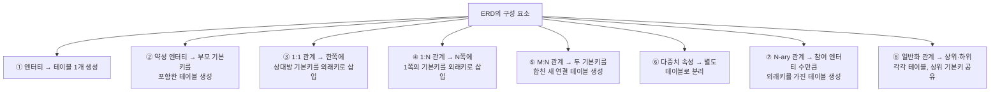
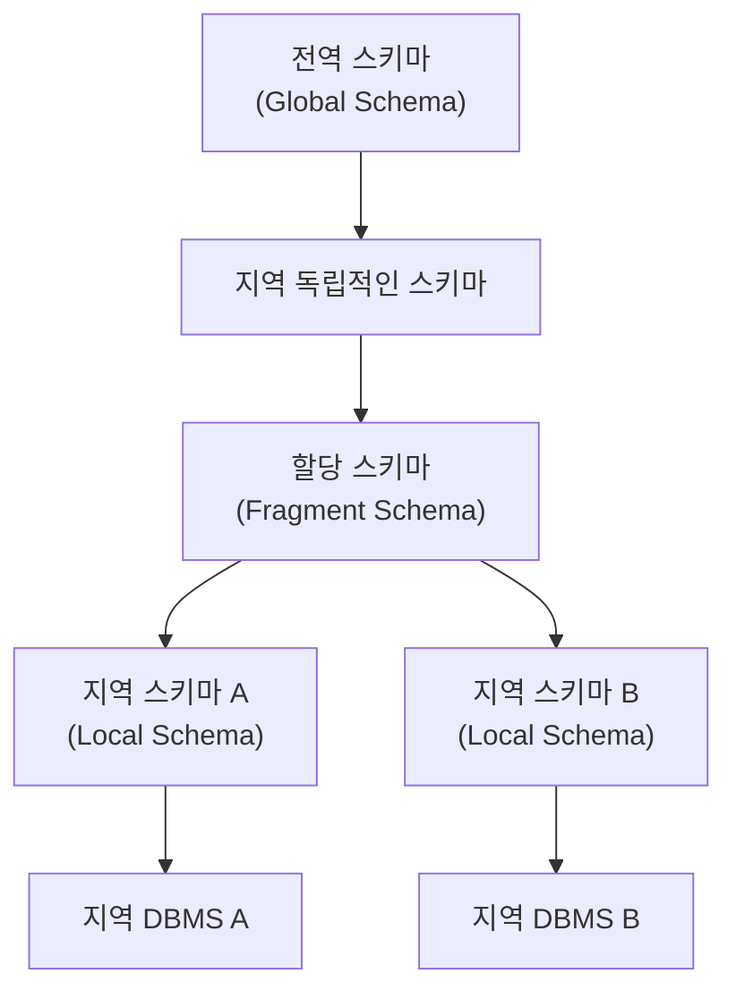

## 들어가며

논리적 모델링 단계에서 우리는 ERD(개체-관계 다이어그램)라는, 사람이 이해하기 좋은 형태로 데이터 구조를 그린다. 하지만 실제로 컴퓨터가 데이터를 저장하고 처리하려면, 이 그림을 실제 데이터베이스가 알아들을 수 있는 "테이블"이라는 형태로 바꿔주어야 한다. 이 문서는 그 변환 과정, 그리고 테이블을 실제로 어떻게 설계하고 운영할지에 관한 다섯 가지 주제, 즉 테이블 전환 규칙, 데이터타입 설계, 인덱스 설계, 뷰 설계, 분산 데이터베이스를 차례로 다룬다. 전문 용어가 많이 등장하지만, 하나하나 일상적인 비유를 곁들여 풀어서 설명하니 차근차근 따라오면 충분히 이해할 수 있다.

---

## 1. 관계형 테이블 전환 및 테이블 설계

### 1-1. 물리적 모델링을 바라보는 두 가지 시선

물리적 모델링이라는 같은 용어를 두고도, 학계와 산업계는 그 범위를 서로 다르게 이해하고 있다. 이 차이를 먼저 짚고 넘어가면 뒤에 나오는 내용이 왜 이렇게 폭넓게 구성되어 있는지 이해하기 쉬워진다.

학계에서는 물리적 모델링을, "논리적 모델링의 결과물인 테이블 구조도를 실제 DBMS(데이터베이스 관리 시스템)에 맞게 구현하는 과정"으로 좁게 정의한다. 이 관점에서 물리적 모델링의 주요 작업은 데이터 타입을 정하고 인덱스를 설계하는 정도에 그친다. 테이블 구조 자체를 다루는 정규화나 역정규화(성능을 위해 일부러 중복을 허용하는 작업)는 논리적 모델링 단계에서 이미 끝낸 일로 본다. 다만 흥미로운 점은, 역정규화라는 작업 자체가 결국 "성능"이라는 물리적인 요구 때문에 이루어지는 것이므로, 논리적 모델링 단계에 있으면서도 물리적 모델링의 필요에 의해 촉발된다는 것이다.

반면 산업계에서는 물리적 모델링을, "논리적 모델링의 결과물인 ERD를 실제 테이블 구조로 전환하는 과정" 전체로 훨씬 넓게 이해한다. 이 관점에서는 테이블과 칼럼을 정의하는 일, 기본키와 외래키를 정하는 일, 정규화와 역정규화, 데이터 타입 설계, 인덱스 설계, 뷰 설계, 분산 설계까지 모두 물리적 모델링의 범위 안에 들어간다. 즉 산업계의 시선이 학계보다 훨씬 폭넓은 작업 범위를 물리적 모델링에 포함시키고 있는 셈이다. 이 문서에서 다루는 다섯 가지 주제(테이블 전환, 데이터타입, 인덱스, 뷰, 분산 데이터베이스)는 바로 이 산업계 관점의 물리적 모델링 범위를 그대로 따르고 있다.

### 1-2. ERD를 테이블로 바꾸는 여덟 가지 규칙

이제 핵심으로 들어가 보자. ERD에는 엔터티(개체), 관계, 속성 같은 요소들이 그림으로 표현되어 있는데, 이것을 실제 테이블로 바꾸려면 정해진 규칙을 따라야 한다. 이 규칙은 마치 설계도(ERD)를 실제 건축 자재 목록(테이블)으로 바꾸는 변환표와 같다. 아래 표에 여덟 가지 상황별 변환 규칙을 정리했다.

| 규칙 | 원본 ERD 요소 | 테이블로 바꾸는 방법 |
|---|---|---|
| ① 엔터티 타입의 변환 | 하나의 엔터티 E (예: "학생") | E마다 테이블 R을 하나 만들고, E가 가진 일반 속성을 모두 R의 칼럼으로 옮긴다. 만약 속성이 여러 하위 요소로 이루어진 복합 속성이라면, 전체를 통째로 넣지 않고 그 하위 요소들만 각각 칼럼으로 넣는다. 그리고 E의 키 속성 중 하나를 골라 R의 기본키로 정한다. |
| ② 약성 엔터티의 변환 | 부모 엔터티 없이는 홀로 존재할 수 없는 약성 엔터티 W (예: 특정 "주문"이 있어야만 존재하는 "주문상세") | W마다 테이블 R을 만들고 W의 일반 속성을 칼럼으로 옮긴다. W를 식별해주는 부모 엔터티 E의 기본키를 R의 외래키로 함께 넣는다. R의 기본키는 이 외래키(E의 기본키)와 W 자신이 가진 부분키를 합쳐서 만든다. |
| ③ 1:1 관계의 변환 | 엔터티 S와 T가 1대1로 연결된 경우 (예: "직원"과 "사원증"이 한 명당 하나씩 대응) | T의 기본키를 S의 외래키로 넣고, 둘 사이의 관계에 딸린 일반 속성도 S에 함께 넣는다. |
| ④ 1:N 관계의 변환 | 엔터티 S(N쪽, 여러 개)와 T(1쪽, 하나)가 1대다로 연결된 경우 (예: 한 "부서"에 여러 "직원"이 소속) | T의 기본키를 S의 외래키로 넣고, 관계에 딸린 일반 속성도 S에 함께 넣는다. |
| ⑤ M:N 관계의 변환 | 엔터티 S와 T가 다대다로 연결된 경우 (예: 한 "학생"이 여러 "과목"을 듣고, 한 "과목"도 여러 "학생"이 듣는 경우) | 이 관계 자체를 위한 새로운 테이블 R을 만든다. 관계에 딸린 일반 속성을 R에 넣고, S와 T의 기본키를 각각 R의 외래키로 넣는다. R의 기본키는 이 두 외래키를 합친 복합키가 된다. |
| ⑥ 다중치 속성의 변환 | 엔터티 E가 값을 하나가 아니라 여러 개 가질 수 있는 속성 MA를 가진 경우 (예: 한 "사람"이 전화번호를 여러 개 가짐) | MA를 위한 새로운 테이블 R을 만들고, MA 자체를 R의 칼럼으로 넣는다. E의 기본키 K를 R의 외래키로 넣고, R의 기본키는 이 외래키와 MA 칼럼을 합쳐서 구성한다. |
| ⑦ N-ary 관계의 변환 (참여 엔터티가 3개 이상) | 세 개 이상의 엔터티가 하나의 관계에 동시에 참여하는 경우 (예: "공급자", "부품", "프로젝트"가 함께 얽힌 관계) | 관계를 위한 새로운 테이블 R을 만들고, 관계에 딸린 일반 속성을 R의 칼럼으로 넣는다. 참여하는 모든 엔터티의 기본키를 R의 외래키로 넣되, R의 기본키는 이 외래키들을 조합해서 구성한다. 다만 어떤 엔터티와의 대응 관계 수가 정확히 1인 경우, 그 엔터티에서 가져온 외래키는 기본키 조합에서 제외한다. |
| ⑧ 일반화 관계의 변환 | 상위 엔터티(예: "차량")와 그로부터 세분화된 하위 엔터티들(예: "승용차", "트럭") | 상위 엔터티와 각 하위 엔터티마다 테이블을 각각 만든다. 그리고 상위 엔터티 테이블의 기본키를 모든 하위 엔터티 테이블에도 똑같이 포함시켜서, 서로 같은 대상을 가리키고 있음을 표시한다. |

이 여덟 가지 규칙을 전체적으로 조망하면 다음과 같은 흐름으로 정리할 수 있다.



핵심 원리를 한 문장으로 요약하면, "1쪽(하나인 쪽)의 기본키를 N쪽(여러 개인 쪽)에 외래키로 넘겨준다"는 것이다. 1:1 관계와 1:N 관계는 이 원리를 그대로 적용하면 되고, M:N 관계나 N-ary 관계처럼 어느 쪽도 "1쪽"이라고 할 수 없는 경우에는 아예 관계 자체를 위한 새로운 테이블을 만들어서 양쪽의 기본키를 모두 가져오는 방식으로 해결한다.

### 1-3. 테이블은 어떤 형태로 만들어질까 — 다섯 가지 테이블 유형

테이블이라고 해서 다 똑같은 방식으로 저장되는 것은 아니다. 실제 상용 DBMS에서는 데이터를 물리적으로 저장하는 방식에 따라 몇 가지 테이블 유형을 제공한다.

가장 흔하게 쓰이는 것은 **힙 구조 테이블(Heap-Organized Table)** 이다. 이는 대부분의 상용 DBMS에서 기본으로 사용하는 표준 테이블 형태로, 레코드가 저장되는 위치는 특정 칼럼 값과 상관없이 그 레코드가 언제 삽입되었는지에 따라 정해진다. 책상 위에 서류를 순서 없이 그냥 쌓아두는 것과 비슷하다고 생각하면 된다.

**클러스터형 인덱스 테이블(Clustered Index Table)** 은 기본키나 인덱스 키 값의 순서에 맞춰 데이터가 실제로 정렬되어 저장되는 테이블이다. 마치 도서관 서가에 책을 청구기호 순서대로 나란히 꽂아두는 것과 같아서, 순서대로 조회할 때 유리하다.

**파티션 테이블(Partitioned Table)** 은 대용량 데이터를 다룰 때 사용한다. 논리적으로는 하나의 테이블처럼 보이지만, 실제로 저장되는 물리적인 데이터는 범위나 특정 값, 해시 값 같은 일정한 기준에 따라 여러 조각으로 나뉘어 저장된다. 이렇게 하면 데이터가 아무리 많아도 성능 저하를 막고 관리를 훨씬 수월하게 할 수 있다. 대형 서점이 재고를 연도별, 장르별 창고에 나누어 보관하면서도 손님에게는 "하나의 서점"으로 보이게 하는 것과 비슷하다.

**외부 테이블(External Table)** 은 데이터베이스 바깥에 있는 일반 파일을, 마치 데이터베이스 안에 있는 일반 테이블처럼 조회할 수 있도록 만든 객체다.

**임시 테이블(Temporary Table)** 은 트랜잭션이나 세션 단위로만 존재하다가 사라지는 임시 저장 공간으로, 작업 중에 잠깐 메모해두는 포스트잇과 같은 역할을 한다.

### 1-4. 테이블을 쪼갤 때 고려할 점 — 수직 분할

테이블 하나가 너무 커지면 오히려 성능에 방해가 될 수 있다. 이럴 때 고려하는 것이 수직 분할, 즉 한 테이블의 칼럼들을 여러 테이블로 나누는 작업이다. 다음과 같은 상황에서는 수직 분할을 고려해볼 만하다.

먼저 칼럼들의 데이터 길이를 모두 합쳤을 때 데이터베이스의 1블록(Block) 크기보다 커지는 경우다. 블록은 데이터베이스가 데이터를 읽고 쓰는 최소 단위이기 때문에, 한 줄(row)이 블록 하나에 다 들어가지 못하면 여러 블록에 걸쳐 저장되어 읽기 속도가 느려진다. 다음으로, 특정 칼럼만 유난히 자주 조회되고 다른 칼럼은 거의 쓰이지 않는 경우, 그리고 서로 다른 사용자 그룹이 각자 다른 칼럼만 사용하는 경우에도 수직 분할이 도움이 된다. 다만 수직 분할을 실행하기 전에 반드시 확인해야 할 것이 있는데, 분할된 이후의 테이블들이 하나의 트랜잭션에 의해 동시에 처리되어야 하거나, 서로 자주 조인(join)해야 하는 상황이 없어야 한다는 점이다. 만약 분할 후에도 매번 두 테이블을 다시 합쳐서 조회해야 한다면, 분할한 의미가 사라지고 오히려 성능이 나빠질 수 있기 때문이다.

---

## 2. 데이터타입 설계

테이블의 각 칼럼에는 문자, 숫자, 날짜, 이미지 등 다양한 형식의 데이터가 들어갈 수 있다. 그런데 설계 단계에서 데이터 타입을 잘못 고르면, 나중에 응용 프로그램을 개발하기 어려워지거나 데이터베이스의 성능이 떨어지는 원인이 된다. 예를 들어 이름을 저장할 칸에 숫자만 저장할 수 있는 타입을 지정했다면 애초에 이름을 저장할 수 없게 된다. 그래서 데이터베이스 설계 단계에서 데이터 타입과 크기를 신중하게 정하는 일이 매우 중요하다.

### 문자형 데이터 타입

문자형에는 세 가지가 있다. **고정길이 문자형**은 정해놓은 크기만큼 항상 똑같이 공간을 차지하는 타입이고, **가변길이 문자형**은 실제로 저장되는 데이터의 길이만큼만 공간을 차지하는 타입이다. 예를 들어 이름을 저장할 때 사람마다 글자 수가 다르므로 가변길이 타입이 공간을 절약하는 데 유리하다.

**문자형 라지 오브젝트(CLOB, Character Large Object)** 는 문자로 이루어진 아주 큰 데이터를 저장하기 위해 따로 만들어진 타입이다. 크기가 워낙 크다 보니 실제 데이터는 테이블 안에 직접 저장되지 않고 테이블 바깥의 별도 공간에 저장되며, 테이블의 칼럼에는 그 데이터가 어디에 있는지를 가리키는 위치 정보(주소)만 저장된다. 마치 큰 소포를 집 안에 두지 않고 별도의 창고에 보관하면서, 집 안에는 "창고 몇 번 칸에 있음"이라고 적힌 보관표만 붙여두는 것과 같다. 책 한 권 분량의 텍스트나 출판물처럼 아주 많은 양의 글자를 저장할 때 유용하게 쓰인다.

### 숫자형 데이터 타입

숫자형은 크게 두 가지로 나뉜다. **실수형**은 부동소수점이나 가변소수점 형태로 소수를 포함한 실수를 표현할 수 있는 타입이고, **정수형**은 정해진 최대 크기 범위 안에서 정수만을 표현하는 타입이다.

### 이진형 데이터 타입

이진형도 문자형과 비슷한 구조를 가진다. **고정 길이 이진형**은 정해놓은 크기만큼 이진 데이터를 저장하는 타입이며, **가변 길이 이진형**은 정해진 크기 한도 내에서 실제 저장되는 크기만큼만 공간을 사용하는 타입이다. **이진 라지 오브젝트(BLOB, Binary Large Object)** 는 이미지, 영상, 음향처럼 커다란 이진 데이터를 저장할 수 있는 타입으로, CLOB과 마찬가지로 실제 데이터는 테이블 외부에 저장되고 테이블의 BLOB 칼럼에는 참조 주소만 저장된다.

### 날짜형 데이터 타입

날짜형은 시간만 저장하는 형태, 날짜만 저장하는 형태, 시간과 날짜를 함께 저장하는 형태로 데이터를 저장할 수 있는 타입이다.

---

## 3. 인덱스 설계

### 인덱스가 하는 일

인덱스를 이해하는 가장 쉬운 방법은 책의 "찾아보기(색인)"를 떠올리는 것이다. 두꺼운 전공 서적에서 특정 단어를 찾을 때, 책 앞장부터 한 장씩 넘기며 찾는 것보다 뒤에 있는 찾아보기 페이지에서 단어를 찾아 해당 쪽수로 바로 넘어가는 것이 훨씬 빠르다. 데이터베이스의 인덱스도 똑같은 역할을 한다. 검색 연산을 빠르게 수행하기 위해, 데이터베이스 레코드의 정보를 미리 정리해둔 별도의 자료 구조가 바로 인덱스다.

인덱스를 활용하면 전체 데이터를 처음부터 끝까지 뒤지지 않고도 원하는 정보를 빠르게 찾아낼 수 있으며, 테이블에 레코드가 아무리 많이 쌓여도 검색 속도에 큰 변화가 생기지 않는다는 장점이 있다. 인덱스는 인덱스를 생성할 때 지정한 칼럼의 값 순서로 정렬되어 있고, 각 값이 테이블의 어느 위치에 실제로 저장되어 있는지도 함께 가지고 있다. 결국 인덱스의 가장 중요한 기능은 데이터에 접근하는 경로를 짧게 줄여줌으로써, 데이터를 탐색하는 속도를 끌어올리는 것이라고 요약할 수 있다.

### 인덱스는 어떻게 설계할까

인덱스를 무작정 많이 만든다고 좋은 것은 아니다. 인덱스를 선정할 때는 그 테이블에 접근하는 모든 경로를 먼저 수집하고, 수집된 결과를 분석해서 종합적으로 판단해야 한다. 일반적으로 다음과 같은 순서로 설계가 이루어진다.


먼저 어떤 질의(쿼리)들이 이 테이블에 어떤 식으로 접근하는지를 모두 모은다. 그다음 각 칼럼에 어떤 값들이 얼마나 다양하게 분포되어 있는지를 조사해서 인덱스를 걸 만한 후보 칼럼을 골라낸다. 이어서 실제로 어떤 접근 경로를 인덱스로 최적화할지 결정하고, 마지막으로 여러 칼럼을 함께 인덱스로 묶을 경우 어떤 순서로 조합할지를 정한다.

### 인덱스 구조의 네 가지 유형

인덱스도 내부적으로 만들어지는 방식에 따라 여러 유형이 있다. **트리 기반 인덱스**는 값들을 나뭇가지처럼 계층 구조로 정리해서 빠르게 찾아가는 가장 일반적인 방식이다. **함수 기반 인덱스**는 칼럼 값을 그대로 인덱스로 쓰는 게 아니라, 특정 함수나 계산식을 적용한 결과값을 미리 계산해서 인덱스로 저장해두는 방식이다. 예를 들어 이름 칼럼을 항상 대문자로 검색한다면, 대문자로 변환한 값을 미리 인덱스로 만들어두는 식이다. **비트맵 조인 인덱스**는 값의 종류가 적은 칼럼(성별, 등급처럼 몇 가지 값만 반복되는 칼럼)을 0과 1의 비트로 표현해서 빠르게 조회할 수 있도록 만든 인덱스로, 특히 여러 테이블을 조인하는 상황에서 유용하다. **도메인 인덱스**는 텍스트 검색이나 공간(위치) 데이터 검색처럼, 일반적인 인덱스로는 다루기 어려운 특수한 업무 영역을 위해 별도로 제공되는 응용 프로그램 전용 인덱스다.

---

## 4. 뷰 설계

### 뷰란 무엇인가

뷰(View)는 하나의 창문에 비유하면 이해하기 쉽다. 집 안에 있는 사람은 창문을 통해 바깥 풍경 중 원하는 일부만 볼 수 있고, 창문 자체가 풍경을 새로 만들어내는 것은 아니다. 데이터베이스의 뷰도 마찬가지다. 하나 또는 여러 개의 실제 테이블에서 원하는 데이터만 골라 모아, 마치 하나의 테이블인 것처럼 가상으로 만들어 놓은 것이 뷰다.

뷰를 사용하면 자주 쓰는 질의를 미리 정의해 둠으로써 반복적인 데이터 조작을 훨씬 효율적으로 수행할 수 있고, 사용자가 실제로 관심을 가지는 데이터에만 집중할 수 있도록 화면을 단순화할 수 있다. 또한 원본 테이블에는 없는, 계산되거나 파생된 정보를 뷰를 통해 보여줄 수도 있고, 특정 사용자가 볼 수 있는 데이터의 범위를 제한하는 보안 수단으로도 활용할 수 있다.

### 뷰 만들기

뷰는 CREATE VIEW 문을 사용해서 기존 테이블로부터 생성한다. 기본적인 구문은 다음과 같다.

```sql
CREATE VIEW View_name
    [(column_name [,column_name…])]
    [WITH ENCRYPTION]
AS select_statement
    [WITH CHECK OPTION]
```

여기서 눈여겨볼 두 가지 옵션이 있다. 하나는 **WITH CHECK OPTION**으로, 이 옵션을 붙이면 뷰를 통해 이루어지는 모든 데이터 수정 작업(입력, 수정)이 반드시 그 뷰를 정의한 SELECT문의 조건을 만족해야만 허용된다. 예를 들어 "재고가 10개 이상인 상품"만 보여주는 뷰에 WITH CHECK OPTION을 걸어두면, 이 뷰를 통해 재고를 9개로 줄이는 수정은 거부된다.

다른 하나는 **WITH ENCRYPTION**으로, 뷰를 만들 때 사용한 SQL 정의문 자체를 다른 사용자가 들여다볼 수 없도록 암호화하는 옵션이다. 한 번 암호화하면 이를 풀기 위해서는 뷰를 아예 삭제하고 새로 만들어야 한다. 참고로 이 두 옵션은 데이터베이스 제품에 따라 지원 여부와 세부 동작이 조금씩 다를 수 있다. WITH CHECK OPTION은 표준 SQL에도 포함된 널리 쓰이는 기능이지만, WITH ENCRYPTION은 일부 DBMS 제품군에서 제공하는 기능이므로, 실제 사용하는 DBMS의 공식 문서를 함께 확인하는 것이 안전하다.

뷰를 만들 때는 몇 가지 제약도 존재한다. 뷰를 사용하는 사람은 뷰가 참조하는 원본 테이블에 대한 SELECT 권한을 가지고 있어야 하고, SELECT INTO 문은 뷰 안에서 사용할 수 없다. 또한 임시 테이블을 대상으로는 뷰를 만들 수 없고, 뷰 위에 트리거나 색인(인덱스)을 별도로 생성할 수도 없다. 그리고 하나의 뷰가 참조할 수 있는 칼럼의 개수에도 상한선(일반적으로 최대 250개)이 있다는 점을 참고하면 좋다.

### 뷰를 통해 데이터를 수정할 때 주의할 점

뷰는 별도의 데이터 복사본을 따로 가지고 있지 않다. 뷰는 그저 원본 테이블을 바라보는 창문일 뿐이므로, 뷰를 통해 데이터를 입력하거나 수정하면 그 변화는 항상 원본 테이블에 그대로 반영된다. 다만 여기에도 몇 가지 제약이 따른다.

뷰에 대한 갱신은 반드시 하나의 원본 테이블에만 영향을 주어야 하며, 여러 개의 원본 테이블에 걸쳐 있는 뷰는 갱신할 수 없다. 계산된 값이나 내장 함수, 계산 함수가 포함된 칼럼에 대해서도 뷰를 통한 갱신은 허용되지 않는다. 예를 들어 "단가 × 수량"으로 계산된 칼럼을 뷰를 통해 직접 수정하려고 하면 오류가 난다. 또한 원본 테이블에 NOT NULL 제약(반드시 값이 있어야 하는 칼럼)이 걸려 있는데 그 칼럼이 뷰에 포함되지 않은 채로 데이터를 입력하려 하면 오류가 발생한다. 그러므로 뷰에 나타나지 않는 칼럼들은 미리 기본값(디폴트 값)이 정의되어 있거나 NULL을 허용하도록 설계되어 있어야 뷰를 통한 입력이 문제없이 이루어진다.

### 기타 알아두면 좋은 점

뷰를 한 번 정의한 뒤에 원본 테이블에 새로운 칼럼이 추가되더라도, 그 칼럼은 자동으로 뷰에 나타나지 않는다. 뷰는 만들어질 당시의 정의를 그대로 유지하기 때문이다. 뷰 자체의 정의(어떤 칼럼을 어떤 조건으로 보여줄지)를 바꾸고 싶다면, 기존 뷰를 삭제하고 처음부터 다시 정의해야 한다. 그리고 원본 테이블(엔터티)이 삭제되더라도 그 테이블을 참조하던 뷰가 자동으로 함께 삭제되지는 않으므로, 뷰는 반드시 별도로 직접 삭제해주어야 한다는 점도 기억해두면 좋다.

---

## 5. 분산 데이터베이스

### 분산 데이터베이스란 무엇인가

여러 지점을 가진 은행을 떠올려보자. 서울 지점의 컴퓨터와 부산 지점의 컴퓨터는 물리적으로 서로 다른 곳에 있지만, 고객이 어느 지점에서 계좌를 조회하든 마치 하나의 시스템에 접속한 것처럼 느껴진다. 분산 데이터베이스가 바로 이런 구조다. 데이터베이스가 네트워크상의 여러 컴퓨터에 물리적으로는 흩어져 있지만, 사용자는 이것을 하나의 데이터베이스처럼 인식할 수 있도록 논리적으로 통합되어 있는 데이터베이스를 분산 데이터베이스라고 부른다. 이를 관리하는 분산 데이터베이스 관리 시스템은, 여러 곳에 흩어진 데이터베이스들이 마치 하나의 논리적인 데이터베이스처럼 보이도록 각 데이터베이스의 정보를 서로 교환하고 조율해주는 역할을 한다.

### 분산 데이터베이스의 구조

분산 데이터베이스는 보통 다음과 같은 계층 구조로 이루어진다. 맨 위에는 전체를 아우르는 전역 스키마(Global Schema)가 있고, 이것이 지역 독립적인 스키마를 거쳐, 데이터를 어떻게 나누어 배치할지를 정하는 할당 스키마(Fragment Schema)로 내려간다. 그리고 그 아래에서 각 지역별 스키마(Local Schema)가 실제 지역 DBMS와 연결되어 데이터를 저장하고 관리한다.



이런 구조 덕분에 사용자는 전체를 하나의 데이터베이스에 질의하는 것처럼 다루지만, 실제로는 데이터가 여러 지역의 DBMS에 나뉘어 저장되고 처리된다.

### 분산 데이터베이스의 장점과 단점

분산 데이터베이스를 도입하면 각 지역이 자신의 데이터를 스스로 제어할 수 있어서 원격지의 데이터에 대한 의존도가 줄어들고, 단일 서버 하나로는 감당하기 어려운 대용량 데이터 처리도 가능해진다. 또한 기존 시스템에 서버를 하나씩 추가하는 방식으로 점진적인 확장이 가능하며, 어느 한 사이트에 장애가 나더라도 그 사이트의 데이터만 일시적으로 사용하지 못할 뿐 전체 시스템이 멈추지 않으므로 신뢰도와 가용성이 높아진다.

반면 단점도 분명히 있다. 데이터를 여러 곳에 나누어 처리하다 보니 시스템의 복잡도가 커지고, 그만큼 소프트웨어 개발 비용도 늘어난다. 여러 지역이 독립적으로 움직이는 만큼 중앙에서의 통제 기능이 상대적으로 취약해지고, 분산 처리 과정에서 오류가 발생할 가능성도 높아진다. 데이터가 실제로 저장된 시스템의 상황(부하, 네트워크 상태 등)에 따라 응답 속도가 들쭉날쭉해질 수 있고, 여러 곳에 흩어진 데이터 사이의 무결성을 완벽하게 보장하기가 쉽지 않다는 점도 유의해야 한다.

### 데이터 투명성 — 사용자가 몰라도 되는 것들

분산 데이터베이스에서 아주 중요한 개념이 하나 있는데, 바로 데이터 투명성(Transparency)이다. 여러 개의 물리적인 데이터베이스를 사용자가 논리적으로 하나의 데이터베이스처럼 인식하려면, 데이터가 실제로 어디에 어떻게 배치되어 있는지를 사용자가 굳이 알 필요가 없어야 한다. 이렇게 "사용자가 몰라도 되는 상태"를 만들어주는 성질을 투명성이라고 부르며, 분산 데이터베이스 관리 시스템은 다음 다섯 가지 투명성을 제공한다.

**분할 투명성**은 사용자가 입력한 하나의 질의를 시스템이 알아서 여러 개의 단편(조각) 질의로 나누어 처리해주는 성질이다. 사용자는 전역 스키마가 실제로 어떻게 여러 조각으로 나뉘어 있는지 몰라도 된다. 이때 데이터를 나누는 방식에는 두 가지가 있는데, 한 테이블(릴레이션)을 칼럼(속성)들의 부분집합으로 나누는 것을 수직 분할이라 하고, 행(튜플)들의 부분집합으로 나누는 것을 수평 분할이라 한다.

**위치 투명성**은 사용자나 애플리케이션이 분산 데이터베이스에 존재하는 데이터가 물리적으로 어느 위치에 있는지 몰라도 되는 성질이다. 즉 사용자는 데이터가 실제로 어디에 저장되어 있든, 또는 자신이 입력하는 시스템이 어디에 있든 상관없이 항상 동일한 명령으로 데이터에 접근할 수 있어야 한다.

**중복 투명성**은 어떤 데이터가 여러 곳에 중복되어 저장되어 있는지, 혹은 어디에 그 중복 데이터가 보관되어 있는지를 사용자가 몰라도 되는 성질이다. 사용자 입장에서는 자신이 사용하는 데이터가 마치 세상에 하나뿐인 것처럼 논리적으로 유일하다고 생각할 수 있어야 한다.

**장애 투명성**은 분산되어 있는 각 컴퓨터 시스템이나 네트워크 중 일부에 장애가 발생하더라도, 데이터의 무결성이 계속 보장되는 성질이다. 분산 데이터베이스는 어느 한 구성 요소에 장애가 생기더라도 트랜잭션이 "전부 성공하거나 전부 실패하거나" 하는 원자성을 그대로 유지해야 한다.

**병행 투명성**은 여러 개의 트랜잭션이 여러 지역에서 동시에 수행되더라도, 그 결과가 마치 순서대로 하나씩 처리된 것처럼 일관성 있게 유지되는 성질을 의미한다. 이를 위해 분산 데이터베이스 관리 시스템은 주로 잠금(Locking) 기법과 타임스탬프(Timestamp) 기법이라는 두 가지 방법을 사용해서 트랜잭션 간의 순서와 일관성을 조율한다.

참고로 일부 데이터베이스 이론서에서는 이 다섯 가지 외에도 "지역사상 투명성"(각 지역 시스템의 실제 명칭과 무관하게 데이터에 접근할 수 있는 성질)을 여섯 번째 투명성으로 함께 다루기도 한다. 다루는 책마다 분류하는 개수가 조금씩 다를 수 있다는 점을 참고해두면 좋다.

---

## 6. 전체 내용 한눈에 정리하기

| 주제 | 핵심 내용 |
|---|---|
| 테이블 전환 | ERD의 엔터티와 관계를, 정해진 여덟 가지 규칙(엔터티, 약성 엔터티, 1:1, 1:N, M:N, 다중치 속성, N-ary, 일반화)에 따라 실제 테이블과 기본키·외래키로 바꾸는 작업 |
| 테이블 설계 | 힙 구조, 클러스터형 인덱스, 파티션, 외부, 임시 테이블 중 상황에 맞는 유형을 고르고, 필요하면 수직 분할로 성능을 높임 |
| 데이터타입 설계 | 문자형(고정/가변/CLOB), 숫자형(실수/정수), 이진형(고정/가변/BLOB), 날짜형 중 저장할 데이터의 성격에 맞는 타입을 신중히 선택 |
| 인덱스 설계 | 책의 찾아보기처럼 검색 속도를 높이는 자료 구조로, 접근 경로 수집부터 칼럼 조합 결정까지 절차를 거쳐 설계하며 트리 기반·함수 기반·비트맵 조인·도메인 인덱스 등의 유형이 있음 |
| 뷰 설계 | 하나 이상의 테이블에서 원하는 데이터만 모은 가상 테이블로, CREATE VIEW로 생성하며 WITH CHECK OPTION·WITH ENCRYPTION 옵션과 여러 제약사항을 함께 이해해야 함 |
| 분산 데이터베이스 | 물리적으로는 여러 컴퓨터에 흩어져 있지만 논리적으로는 하나처럼 보이는 데이터베이스로, 분할·위치·중복·장애·병행 투명성을 통해 사용자가 분산 구조를 의식하지 않도록 함 |

---

## 참고 및 추천 자료

이 문서가 다룬 내용의 원출처로 소개된 참고 도서는 다음과 같다.

[1] Raghu Ramakrishnan, 송병호 역, 『데이터베이스 관리(시스템 데이터베이스 설계 편)』, 경기: 이한출판사, 2001.
[2] 문승천, 『데이터베이스 시스템 총론: 원리와 동향(분산 데이터베이스)』, 경기: 형설출판사, 1998.
[3] 이상구, 장재명, 김한준, 장재한, 『데이터베이스의 이해(물리적 저장 구조와 인덱스 편)』, 경기: 이한미디어, 2012.
[4] 이석호, 『데이터베이스론(물리적 설계 편)』, 서울: 정익사, 2010.
[5] 이춘식, 『아는 만큼 보이는 데이터베이스 설계와 구축(테이블 수직/수평 분할에 의한 성능 향상)』, 서울: 한빛미디어, 2008.

또한 이 문서를 작성하면서 다음 내용을 현재 시점의 자료로 교차 확인했다.

- 보이스-코드 정규형을 포함한 관계형 데이터베이스 정규화 이론의 표준 정의 — 위키백과, IT위키
- WITH CHECK OPTION의 표준 SQL 동작 방식과, WITH ENCRYPTION이 특정 DBMS 제품군에서 제공되는 기능이라는 점 — 여러 DBMS 공식 문서 및 기술 자료
- 함수 기반 인덱스·도메인 인덱스 등 인덱스 유형에 대한 정의 — 데이터베이스 기술 자료
- 분산 데이터베이스 투명성의 종류(분할·위치·지역사상·중복·장애·병행)에 대한 여러 문헌의 분류 방식 — IT위키 및 데이터베이스 학습 자료

---

작성일자: 2026년 8월 31일
