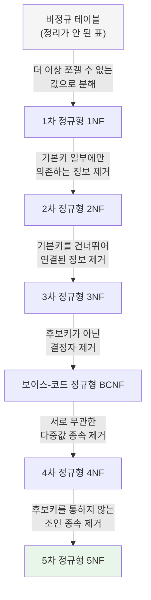
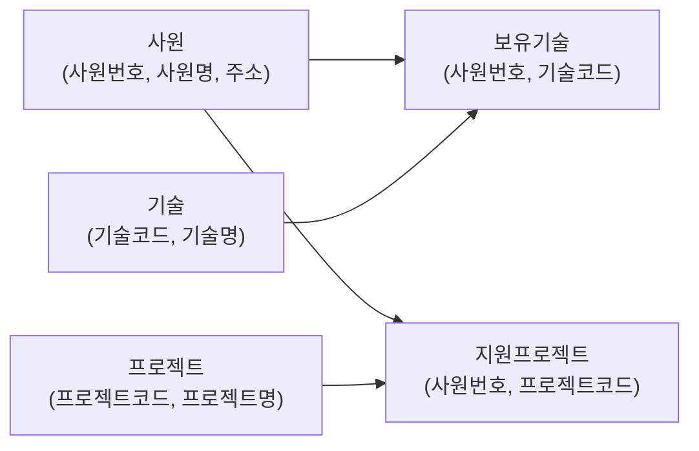
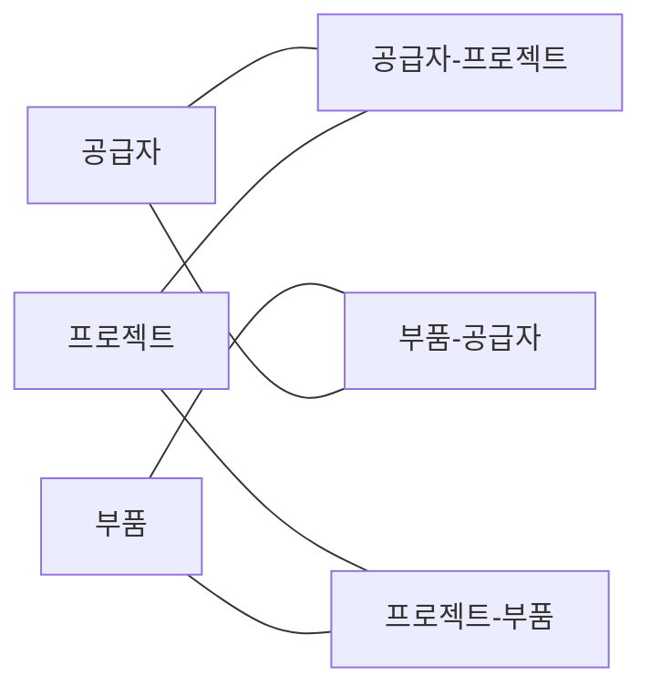

## 들어가며: 정규화가 도대체 왜 필요한가

데이터베이스를 처음 배우는 사람이 가장 헷갈려하는 개념이 바로 정규화(Normalization)다. 하지만 정규화가 풀려고 하는 문제 자체는 사실 매우 일상적이다. 한번 이렇게 생각해보자. 회사에 신입사원이 들어와서 "사원 정보, 그 사원이 배운 기술, 그 사원이 참여한 프로젝트"를 모두 엑셀 한 장짜리 표에 몰아서 적는다고 해보자. 처음에는 편해 보인다. 검색할 때도 그 표 한 장만 열면 되니까. 그런데 시간이 지나면 이상한 일들이 벌어지기 시작한다.

가장 흔한 세 가지 문제를 살펴보면 다음과 같다. 첫째는 삽입 이상이다. 어떤 사원이 회사에 막 입사해서 아직 프로젝트에 투입되지 않았다면, "프로젝트" 칸을 채울 수가 없어서 사원 정보 자체를 등록하지 못하는 상황이 생긴다. 둘째는 수정 이상이다. 한 사원의 부서명이 바뀌었는데, 그 사원이 참여한 프로젝트가 다섯 개라면 그 사원의 이름이 적힌 행이 다섯 줄 존재하게 되고, 부서명을 다섯 군데 모두 고쳐야 한다. 한 곳이라도 빠뜨리면 같은 사람인데 부서가 다르게 기록되는 모순이 생긴다. 셋째는 삭제 이상이다. 어떤 사원이 참여했던 마지막 프로젝트 기록을 지우는 순간, 그 사원에 대한 다른 정보(이름, 부서 등)까지 통째로 사라져 버리는 경우가 있다.

정규화란 바로 이런 문제들을 막기 위해, 하나의 커다란 표를 의미 단위로 잘게 쪼개서 여러 개의 표로 나누는 설계 기법이다. 이렇게 쪼개진 표를 "정규형 테이블"이라고 부르고, 얼마나 잘 쪼개졌는지 그 정도를 "정규형(Normal Form)"이라는 단계로 표현한다. 정규형은 낮은 단계부터 1차 정규형(1NF), 2차 정규형(2NF), 3차 정규형(3NF), 보이스-코드 정규형(BCNF), 4차 정규형(4NF), 5차 정규형(5NF) 순서로 총 여섯 단계가 있으며, 뒤로 갈수록 조건이 더 까다로워진다. 그리고 중요한 특징이 하나 있는데, 상위 단계의 정규형을 만족하는 테이블은 그보다 하위 단계의 정규형 조건도 자동으로 모두 만족한다. 즉 5차 정규형을 만족하는 테이블은 1차부터 4차까지의 조건도 이미 다 충족하고 있는 셈이다.

## 전체 흐름을 한 장으로 보기

여섯 단계를 거치는 과정을 그림으로 표현하면 다음과 같다. 각 화살표에는 그 단계에서 "제거해야 하는 문제"가 무엇인지 적혀 있다. 이 순서를 계단이라고 생각하면 이해하기 쉽다.

실무에서는 흔히 3차 정규형까지만 되어도 "정규화가 잘 되었다"고 말하는 경우가 많다. 대부분의 3차 정규형 테이블은 자연스럽게 보이스-코드 정규형, 4차 정규형, 5차 정규형까지도 만족하는 경우가 많기 때문이다. 4차와 5차 정규형은 이론적으로 중요하지만, 아주 특수한 관계 구조에서만 문제가 되기 때문에 실무에서 직접 신경 쓰는 경우는 상대적으로 드물다. TOPCIT 시험을 준비하는 자료에서도 "특히 3차 정규형과 보이스-코드 정규형의 활용도가 높다"고 소개하고 있는데, 이는 실무 현장의 감각과도 일치한다.

## 시작하기 전에 알아둘 최소한의 용어 다섯 가지

정규화를 설명할 때 계속 등장하는 용어들이 있다. 어렵게 느껴질 수 있지만, 사실 아주 간단한 개념들이다. 미리 익혀두면 뒤에 나오는 설명이 훨씬 쉽게 읽힌다.

**함수적 종속성**이란, "A값을 알면 B값이 자동으로 하나로 정해진다"는 관계를 말한다. 예를 들어 학번을 알면 그 학생의 이름을 알 수 있으므로 "학번 → 이름"이라고 쓰고, 이를 "학번이 이름을 함수적으로 종속시킨다"고 표현한다. 화살표 왼쪽에 있는 값을 **결정자**라고 부른다.

**기본키(또는 후보키)** 란 표에서 각 줄(행)을 서로 구별해주는 값 또는 값들의 조합을 말한다. 주민등록번호처럼 한 사람당 하나만 존재하는 값이 대표적인 예다.

**부분함수종속**이란, 기본키가 두 개 이상의 값으로 이루어진 복합키일 때, 그 복합키 전체가 아니라 일부분만으로도 다른 값이 결정되어 버리는 상황을 말한다.

**이행함수종속**이란, A가 B를 결정하고 B가 다시 C를 결정해서, 결과적으로 A가 C를 건너뛰어 간접적으로 결정하게 되는 상황을 말한다. 마치 친구의 친구를 통해서 알게 된 사람 같은 관계다.

**다치종속과 조인종속**은 뒤에서 4차, 5차 정규형을 설명할 때 자세히 다루겠지만, 미리 한 문장으로 요약하면 다치종속은 "서로 아무 상관 없는 정보 여러 개가 한 사람에게 각각 여러 개씩 딸려 있는 상황"을, 조인종속은 "표를 여러 개로 쪼갰다가 다시 합쳐야만 원래 정보가 정확히 복원되는 상황"을 가리킨다.

---

## 1. 제1정규형(1NF) — 한 칸에는 값을 딱 하나만

### 쉬운 설명

제1정규형의 핵심 규칙은 아주 단순하다. "표의 한 칸(셀)에는 값을 오직 하나만 넣어야 한다"는 것이다. 이렇게 하나만 들어있는 값을 "원자값(atomic value)"이라고 부른다. 예를 들어 도서관 대출 카드에 "빌린 책: 해리포터, 반지의 제왕, 나니아 연대기"처럼 한 칸에 여러 권의 책 제목을 콤마로 나열해서 적어놓았다면, 이 카드는 제1정규형을 만족하지 못하는 것이다. 왜냐하면 "이 사람이 나니아 연대기를 반납했는지"를 확인하려면 그 긴 문자열을 사람이 직접 읽고 분석해야 하기 때문이다. 컴퓨터는 이런 식으로 뭉쳐 있는 값을 효율적으로 검색하거나 수정하기 어렵다.

### 예시로 확인하기

수강 신청 정보를 담은 표가 있다고 하자. 처음에는 이렇게 생겼다.

| 학번 | 이름 | 과목명 |
|---|---|---|
| 1111 | 홍길동 | 데이터베이스, 운영체제 |
| 2222 | 강감찬 | 운영체제, 네트워크, 자료구조 |

여기서 "과목명" 칸에는 여러 과목이 콤마로 묶여 한 칸에 들어가 있다. 이것을 제1정규형으로 바꾸려면, 하나의 과목이 하나의 줄에 오도록 표를 풀어주면 된다. 그리고 이때 기본키는 더 이상 "학번" 하나만으로는 각 줄을 구별할 수 없으므로, "학번"과 "과목명"을 합친 복합키로 지정한다.

| 학번 | 이름 | 과목명 |
|---|---|---|
| 1111 | 홍길동 | 데이터베이스 |
| 1111 | 홍길동 | 운영체제 |
| 2222 | 강감찬 | 운영체제 |
| 2222 | 강감찬 | 네트워크 |
| 2222 | 강감찬 | 자료구조 |

이렇게 하면 이제 각 줄이 "한 학생이 한 과목을 듣는다"는 사실 하나만 담고 있어서, 검색과 수정이 훨씬 깔끔해진다.

---

## 2. 제2정규형(2NF) — 기본키의 '일부분'에만 의존하는 정보 떼어내기

### 쉬운 설명

제2정규형은 기본키가 두 개 이상의 값으로 묶인 복합키일 때만 의미가 있는 개념이다. 만약 기본키가 값 하나짜리라면, 그 표는 제1정규형만 만족해도 자동으로 제2정규형까지 만족한다. 문제는 기본키가 "학번 + 과목코드"처럼 두 개로 묶여 있을 때 발생한다. 이때 어떤 정보가 기본키 전체가 아니라 그중 절반, 즉 "과목코드"만 알아도 결정되어 버린다면, 그 정보는 굳이 학번과 묶어서 매번 반복 저장할 필요가 없다. 이런 상황을 부분함수종속이라 부르고, 제2정규형은 이 부분함수종속을 없애는 작업이다.

### 예시로 확인하기

수강 정보에 학점까지 추가된 표를 살펴보자.

| 학번 | 이름 | 과목코드 | 과목명 | 학점 |
|---|---|---|---|---|
| 1111 | 홍길동 | D11 | 데이터베이스 | A |
| 1111 | 홍길동 | O22 | 운영체제 | B |
| 2222 | 강감찬 | O22 | 운영체제 | A |
| 2222 | 강감찬 | N33 | 네트워크 | A |
| 2222 | 강감찬 | D44 | 자료구조 | B |

이 표의 기본키는 "학번 + 과목코드"다. 그런데 "과목명"이라는 값은 사실 "과목코드"만 알아도 항상 똑같이 정해진다. O22라는 과목코드는 학번이 1111이든 2222든 상관없이 항상 "운영체제"를 가리킨다. 즉 기본키 전체가 아니라 절반(과목코드)만으로 과목명이 결정되는 부분함수종속이 존재하는 것이다. 이 상태로 두면 "운영체제"라는 과목명이 여러 줄에 걸쳐 반복 저장되고, 만약 과목명을 "운영체제론"으로 바꿔야 한다면 관련된 모든 줄을 일일이 찾아 고쳐야 하는 번거로움이 생긴다.

이 문제를 해결하려면 표를 두 개로 나누면 된다. 학번과 과목코드, 학점처럼 정말로 기본키 전체에 의존하는 정보를 담은 표 하나와, 과목코드만 알면 정해지는 정보(과목명)를 담은 표 하나로 분리하는 것이다.

수강 테이블:

| 학번 | 이름 | 과목코드 | 학점 |
|---|---|---|---|
| 1111 | 홍길동 | D11 | A |
| 1111 | 홍길동 | O22 | B |
| 2222 | 강감찬 | O22 | A |
| 2222 | 강감찬 | N33 | A |
| 2222 | 강감찬 | D44 | B |

과목 테이블:

| 과목코드 | 과목명 |
|---|---|
| D11 | 데이터베이스 |
| O22 | 운영체제 |
| N33 | 네트워크 |
| D44 | 자료구조 |

이제 과목명을 바꾸고 싶으면 과목 테이블에서 딱 한 줄만 수정하면 된다.

---

## 3. 제3정규형(3NF) — 기본키를 '건너뛰어' 연결된 정보 떼어내기

### 쉬운 설명

제3정규형은 이행함수종속을 없애는 단계다. 앞서 설명했듯, 이행함수종속이란 A가 B를 결정하고, B가 다시 C를 결정해서, 결과적으로 A가 C를 간접적으로(건너뛰어서) 결정해버리는 관계다. 학생의 예를 들면, 학번을 알면 그 학생이 소속된 학과를 알 수 있고(학번 → 학과), 학과를 알면 그 학과 사무실이 어디에 있는지도 알 수 있다(학과 → 학과사무실). 그런데 이 두 관계를 연결하면 결국 학번만 알아도 학과사무실 위치까지 알 수 있게 된다(학번 → 학과사무실). 문제는 "학과사무실"이라는 정보가 사실 학번이 아니라 학과라는, 기본키도 아닌 다른 일반 속성에 의해 정해진다는 점이다. 이런 간접 연결 고리가 있으면 같은 학과 학생이 여러 명일 때 학과사무실 정보가 학생 수만큼 반복 저장되는 중복이 생긴다.

### 예시로 확인하기

| 학번 | 이름 | 학과 | 학과사무실 |
|---|---|---|---|
| 1111 | 홍길동 | 컴퓨터공학과 | 공학관 |
| 2222 | 강감찬 | 컴퓨터공학과 | 공학관 |
| 3333 | 유관순 | 물리학과 | 자연관 |

이 표는 아직 제3정규형이 아니다. 학번이 학과를 결정하고, 학과가 다시 학과사무실을 결정하는 이행함수종속이 존재하기 때문이다. 컴퓨터공학과 학생이 100명이라면 "공학관"이라는 문자열이 100번 반복 저장되는 셈이다. 만약 컴퓨터공학과 사무실이 다른 건물로 이전한다면, 100줄을 전부 찾아서 고쳐야 한다.

이를 해결하려면 학생 정보와 학과사무실 정보를 분리하면 된다.

학생 테이블:

| 학번 | 이름 | 학과 |
|---|---|---|
| 1111 | 홍길동 | 컴퓨터공학과 |
| 2222 | 강감찬 | 컴퓨터공학과 |
| 3333 | 유관순 | 물리학과 |

학과 테이블:

| 학과 | 학과사무실 |
|---|---|
| 컴퓨터공학과 | 공학관 |
| 물리학과 | 자연관 |

이제 학과사무실이 바뀌어도 학과 테이블에서 딱 한 줄만 고치면 된다.

---

## 4. 보이스-코드 정규형(BCNF) — 3차 정규형보다 한 번 더 깐깐하게 검사하기

### 쉬운 설명

보이스-코드 정규형은 1974년 레이먼드 보이스(Raymond Boyce)와 에드거 코드(Edgar Codd)가 제안한 개념으로, 제3정규형을 좀 더 강하게 만든 버전이라고 해서 흔히 "3.5차 정규형"이라는 별명으로도 불린다. 앞서 배운 제3정규형까지 만족했는데도 여전히 문제가 남는 특수한 경우가 있는데, 바로 기본키(후보키)가 여러 개 존재하는 표에서 발생한다. 규칙을 한 문장으로 요약하면, "결정자 역할을 하는 값은 반드시 후보키여야 한다"는 것이다. 다시 말해, 어떤 값이 다른 값을 결정짓는 힘을 가지고 있다면, 그 값 자체도 표에서 각 줄을 구별해줄 수 있는 자격(후보키)을 갖추고 있어야 한다는 뜻이다. 만약 후보키도 아닌 그냥 평범한 값이 다른 값을 결정해버리고 있다면, 그것이 바로 보이스-코드 정규형을 위반하는 신호다.

### 예시로 확인하기

한 교수가 여러 과목을 가르치고, 각 과목마다 지정된 교재가 있는 상황을 가정해보자. 그리고 여기서는 "교재를 보면 어떤 과목인지도 알 수 있다"는 규칙이 있다고 가정한다(즉 교재명 → 과목명이라는 함수적 종속이 별도로 존재한다).

| 교수 | 과목명 | 교재명 |
|---|---|---|
| P1 | 자료구조 | Book1 |
| P1 | 네트워크 | Book2 |
| P2 | 네트워크 | Book3 |
| P2 | 프로그래밍 | Book4 |
| P3 | 프로그래밍 | Book4 |

이 표의 기본키는 "교수 + 과목명"이다. 그런데 "교재명 → 과목명"이라는 함수적 종속을 보면, 결정자인 "교재명"은 후보키가 아니다(후보키는 어디까지나 "교수+과목명"이기 때문이다). 후보키가 아닌 값이 다른 값을 결정하고 있으므로 이 표는 보이스-코드 정규형을 만족하지 못한다. 이를 해결하려면 "교수-교재" 관계와 "교재-과목" 관계를 분리하면 된다.

교수-교재 테이블:

| 교수 | 교재명 |
|---|---|
| P1 | Book1 |
| P1 | Book2 |
| P2 | Book3 |
| P2 | Book4 |
| P3 | Book4 |

교재-과목 테이블:

| 교재명 | 과목명 |
|---|---|
| Book1 | 자료구조 |
| Book2 | 네트워크 |
| Book3 | 네트워크 |
| Book4 | 프로그래밍 |

---

## 5. 제4정규형(4NF) — 서로 상관없는 여러 값들을 한 표에 섞지 않기

### 쉬운 설명

여기서부터는 조금 더 특수한 상황을 다룬다. 제4정규형이 다루는 문제는 다치종속(Multi-Valued Dependency, MVD)이다. 다치종속이란, 한 사람(또는 한 대상)에게 서로 아무런 관련이 없는 두 가지 종류의 정보가 각각 여러 개씩 딸려 있는 상황을 말한다.

예를 들어 어떤 사원이 "보유한 기술"도 여러 개고 "지원한 프로젝트"도 여러 개인데, 이 두 가지가 서로 아무 관계가 없다고 해보자. 즉 어떤 기술을 어떤 프로젝트에 썼는지는 별도로 관리되지 않고, 그냥 "이 사람은 이런 기술들을 가지고 있다"는 사실과 "이 사람은 이런 프로젝트들에 참여했다"는 사실이 각각 독립적으로 존재할 뿐이다. 이럴 때 두 정보를 억지로 한 표에 몰아넣으면, 실제로는 서로 관계가 없는 조합인데도 마치 관계가 있는 것처럼 데이터가 뒤섞여 저장되는 문제가 생긴다.

### 예시로 확인하기

사원 10번은 MODELING과 DBA라는 두 가지 기술을 보유하고 있고, SI, OO, PA라는 세 개의 프로젝트에 참여했다고 하자. 이 정보를 하나의 표에 억지로 담으면 다음과 같은 모습이 나올 수 있다.

| 사원번호 | 기술코드 | 프로젝트코드 |
|---|---|---|
| 10 | MODELING | SI |
| 10 | MODELING | OO |
| 10 | DBA | PA |
| 20 | DBA | PA |
| 20 | XML | PA |

여기서 핵심은 각 행의 조합이 관계가 있어서 저장된 게 아니라, 그저 "사원번호를 기준으로 기술과 프로젝트가 각각 여러 개씩 나열되는 현상"일 뿐이라는 점이다. 이렇게 설계하면 다음과 같은 세 가지 이상현상이 생긴다.

| 구분 | 이상현상 |
|---|---|
| 입력이상 | 어떤 사원이 새로운 프로젝트에 투입되면, 프로젝트와는 무관하게 그 사원이 가진 기술코드를 다시 입력해야 한다. 이때 그 사원이 지원한 프로젝트가 여러 건이면 그 개수만큼 반복 입력해야 한다. |
| 수정이상 | 어떤 직원이 참여했던 프로젝트 코드를 변경하려면, 그 직원이 보유한 기술의 개수만큼 여러 줄을 함께 변경해야 한다. |
| 삭제이상 | 어떤 직원이 보유한 기술 정보를 삭제하면, 그 기술과 함께 묶여 있던 프로젝트 참여 기록도 같이 지워져 버려서 프로젝트 경력을 알 수 없게 된다. 반대로 프로젝트를 삭제할 때도 그와 엮여 있던 기술 정보만큼 함께 수정되어야 한다. |

이 문제는 "기술"과 "프로젝트"라는 서로 무관한 두 가지 다중값을 별개의 표로 분리하면 해결된다.

보유기술 테이블:

| 사원번호 | 기술코드 |
|---|---|
| 10 | MODELING |
| 10 | DBA |
| 20 | DBA |
| 20 | XML |

지원프로젝트 테이블:

| 사원번호 | 프로젝트코드 |
|---|---|
| 10 | SI |
| 10 | OO |
| 10 | PA |
| 20 | PA |

이렇게 나누면 이제 "사원-기술" 정보를 바꾸는 일이 "사원-프로젝트" 정보에 아무런 영향을 주지 않는다. 전체적으로 보면 이 사례는 사원 테이블(사원번호, 사원명, 주소), 기술 테이블(기술코드, 기술명), 프로젝트 테이블(프로젝트코드, 프로젝트명)까지 포함해서 총 다섯 개의 표로 정리되며, 이 관계를 그림으로 나타내면 다음과 같다.

참고로 이 사례에서 전제가 되는 업무 규칙, 즉 "사원과 프로젝트는 서로 관련이 있고, 사원과 기술도 서로 관련이 있지만, 프로젝트와 기술 사이에는 직접적인 연관성 규칙이 정해져 있지 않다"는 조건이 성립할 때만 4차 정규화 대상이 된다는 점도 함께 기억해두면 좋다. 즉 4차 정규화는 아무 표에나 적용하는 것이 아니라, 이런 식으로 속성 간의 의미적 연관성이 명확히 정의되어 있어야 판단할 수 있는 정규형이다.

---

## 6. 제5정규형(5NF) — 쪼갰다가 다시 합쳐야만 말이 되는 경우

### 쉬운 설명

제5정규형은 여섯 단계 중 가장 이론적이고 까다로운 개념이다. 여기서 다루는 것은 조인종속(Join Dependency, JD)이다. 조인종속이란, 하나의 표를 여러 개의 작은 표로 쪼갠 다음 그 표들을 다시 합쳐야만(조인해야만) 원래의 정확한 정보가 복원되는 관계를 말한다. 제5정규형은 "어떤 표에 존재하는 모든 조인종속이, 그 표의 후보키를 통해서만 성립하는 경우"를 가리킨다. 말이 조금 어렵게 느껴질 수 있는데, 예시를 보면 훨씬 이해하기 쉽다.

핵심 아이디어는 이렇다. 서로 다른 세 가지 대상(예를 들어 공급자, 부품, 프로젝트) 사이에 두 개씩 짝지은 관계는 각각 존재하는데("공급자가 어떤 부품을 취급한다", "그 부품이 어떤 프로젝트에 쓰인다", "그 공급자가 어떤 프로젝트를 지원한다"), 세 가지를 한꺼번에 묶은 "이 공급자가 이 부품을 가지고 이 프로젝트에 참여한다"는 식의 정보는 별도로 정해져 있지 않다고 해보자. 이런 상황에서 세 가지 정보를 억지로 하나의 표에 합쳐 놓으면, 실제로는 존재하지 않는 조합까지 마치 사실인 것처럼 표현되거나, 반대로 정보를 수정할 때 예상치 못한 다른 조합까지 함께 바뀌어버리는 문제가 생긴다.

### 예시로 확인하기

공급자(S1, S2), 프로젝트(P1, P2), 부품(C1, C2)이 뒤섞여 있는 표가 다음과 같다고 하자.

| 공급자 | 프로젝트 | 부품 |
|---|---|---|
| S1 | P1 | C2 |
| S1 | P2 | C1 |
| S2 | P1 | C1 |
| S1 | P1 | C1 |

이 표는 다음과 같은 세 가지 업무 규칙을 전제로 만들어졌다.

| 규칙 | 내용 | 표 생성 여부 |
|---|---|---|
| 1 | 공급자는 특정 부품을 취급한다(공급자-부품 관계 있음) | 생성됨 |
| 2 | 부품은 특정 프로젝트에 사용된다(부품-프로젝트 관계 있음) | 생성됨 |
| 3 | 공급자는 특정 프로젝트를 지원한다(공급자-프로젝트 관계 있음) | 생성됨 |
| 4 | 특정 공급자가 특정 부품을 이용해 특정 프로젝트에 참여했는지에 대한 세 가지 결합 정보는 별도로 존재하지 않는다 | 생성되지 않음 |

즉 공급자-부품, 부품-프로젝트, 공급자-프로젝트라는 세 가지 짝지은 관계는 각각 독립적으로 존재하지만, 이 세 가지를 한꺼번에 연결한 "이 조합 그대로"의 관계는 원래 데이터에 없다. 그런데도 하나의 표로 합쳐서 관리하면, 다음과 같은 이상현상이 생긴다.

| 구분 | 이상현상 |
|---|---|
| 입력이상 | 공급자와 부품에 대한 새로운 관계 정보를 입력하려면, 그와 관련된 공급자-프로젝트 관계와 부품-프로젝트 관계까지 모두 함께 고려해서 추가해야 한다. |
| 수정이상 | 공급자와 부품 관계 정보를 하나만 수정하고 싶어도, 다른 관계 정보와 뒤섞여 저장되어 있기 때문에 여러 건의 기록을 함께 수정해야 한다. |
| 삭제이상 | 공급자와 부품 관계 정보를 삭제하면, 그와 무관해야 할 공급자-프로젝트 관계 정보와 부품-프로젝트 관계 정보까지 덩달아 함께 삭제되어 버린다. |

이 문제를 해결하려면, 세 가지를 하나로 합친 표를 버리고 애초에 독립적이었던 세 개의 짝지은 관계를 각각 별도의 표로 분리해야 한다.

공급자-프로젝트 테이블:

| 공급자 | 프로젝트 |
|---|---|
| S1 | P1 |
| S1 | P2 |
| S2 | P1 |

프로젝트-부품 테이블:

| 프로젝트 | 부품 |
|---|---|
| P1 | C2 |
| P2 | C1 |
| P1 | C1 |

부품-공급자 테이블:

| 부품 | 공급자 |
|---|---|
| C2 | S1 |
| C1 | S1 |
| C1 | S2 |

이렇게 세 개의 표로 나누면, 나중에 필요할 때 이 세 표를 다시 연결(조인)해서 원래의 조합 정보를 정확하게 복원할 수 있으면서도, 평소에는 각 관계를 독립적으로 안전하게 관리할 수 있다. 이 관계를 그림으로 표현하면 다음과 같다.

---

## 7. 여섯 단계 한눈에 정리하기

| 정규형 | 핵심 조건 (한 줄 요약) | 제거하는 문제 | 실무 활용도 |
|---|---|---|---|
| 1차 정규형(1NF) | 모든 칸의 값이 더 이상 쪼갤 수 없는 단일 값이어야 한다 | 한 칸에 여러 값이 뒤섞여 들어있는 문제 | 거의 모든 실무 테이블 설계의 기본 전제 |
| 2차 정규형(2NF) | 1NF를 만족하면서, 기본키의 일부분에만 의존하는 값이 없어야 한다 | 복합키의 일부만으로 결정되는 값의 중복 저장 | 복합키를 쓰는 표에서는 필수 |
| 3차 정규형(3NF) | 2NF를 만족하면서, 기본키를 건너뛰어 간접적으로 연결되는 값이 없어야 한다 | 일반 속성끼리 서로를 결정해버리는 간접 연결 문제 | 실무에서 가장 널리 활용됨 |
| 보이스-코드 정규형(BCNF) | 3NF를 만족하면서, 모든 결정자가 후보키여야 한다 | 후보키가 아닌 값이 다른 값을 결정하는 문제 | 3차 정규형과 함께 실무 활용도가 높음 |
| 4차 정규형(4NF) | BCNF를 만족하면서, 서로 무관한 다중값 종속이 없어야 한다 | 관계없는 여러 다중값 정보를 한 표에 섞는 문제 | 특수한 다대다 관계 설계 시에만 고려 |
| 5차 정규형(5NF) | 4NF를 만족하면서, 후보키를 통하지 않는 조인종속이 없어야 한다 | 쪼갰다가 다시 합쳐야만 정보가 복원되는 문제 | 매우 이론적이며 실무에서 명시적으로 다루는 경우는 드묾 |

---

## 8. 알아두면 좋은 배경 지식

정규화 이론은 관계형 데이터베이스의 창시자인 에드거 코드(Edgar F. Codd)가 처음 제안한 개념에서 출발했으며, 이후 여러 학자들이 이론을 확장하면서 지금의 여섯 단계 체계로 다듬어졌다. 특히 보이스-코드 정규형은 1974년에 레이먼드 보이스와 에드거 코드가 함께 제안한 개념으로, 제3정규형만으로는 해결되지 않는 특수한 중복 문제를 잡아내기 위해 만들어졌다.

이러한 정규화 이론은 데이터베이스 이론 교육 과정과 국내 IT 역량 평가 시험에서도 꾸준히 다뤄지고 있다. 예를 들어 한국의 소프트웨어 역량 검정 시험인 TOPCIT(Test Of Practical Competency in ICT)은 소프트웨어 개발, 데이터 이해와 활용, 시스템 아키텍처, 정보보안이라는 네 가지 기술 영역과 비즈니스 영역으로 구성되어 있으며, 이 중 "데이터 이해와 활용" 영역이 과거의 "데이터베이스" 영역이 개편된 것으로, 데이터베이스 설계 이론뿐 아니라 인공지능·딥러닝 관련 최신 기술 내용까지 폭넓게 다루는 방향으로 범위가 넓어졌다. TOPCIT은 정보통신기획평가원(IITP)이 연구개발 및 사업 관리를 맡고 있으며, 2026년에도 정기 시행 계획이 공고되어 시험이 지속적으로 운영되고 있다.

정규화를 공부할 때 가장 중요한 것은, 각 단계가 "무엇을 제거하는가"를 이해하는 것이다. 1차는 한 칸에 여러 값이 있는 문제를, 2차는 기본키 일부에만 의존하는 문제를, 3차는 기본키를 건너뛰는 간접 연결 문제를, BCNF는 후보키가 아닌 결정자 문제를, 4차는 서로 무관한 다중값이 섞이는 문제를, 5차는 쪼갰다가 다시 합쳐야만 하는 문제를 각각 해결한다는 흐름을 기억하면, 어떤 문제 상황이 주어지더라도 "이건 몇 차 정규화 대상이다"라고 판단하기가 한결 수월해진다.

---

## 참고 자료

이 문서는 데이터베이스 정규화 이론의 표준적인 정의와 예시를 바탕으로 작성되었으며, 다음 자료들을 통해 개념 정의와 현재 시점의 시험 정보를 교차 확인했다.

- 보이스-코드 정규형의 정의 및 역사(1974년 보이스·코드 제안) — 위키백과
- 정규형별 함수적 종속·이행 종속·다치 종속 개념 설명 — IT위키(데이터베이스 정규화, 보이스-코드 정규형 문서)
- BCNF의 "결정자는 후보키여야 한다"는 조건 및 관련 문제 풀이 사례 — 여러 데이터베이스 학습 블로그 자료
- TOPCIT 시험 구성(기술 영역·비즈니스 영역), "데이터 이해와 활용" 영역 개편 이력, 2026년 시행계획 — TOPCIT 공식 홈페이지 및 나무위키 TOPCIT 문서

---

작성일자: 2026년 8월 31일
