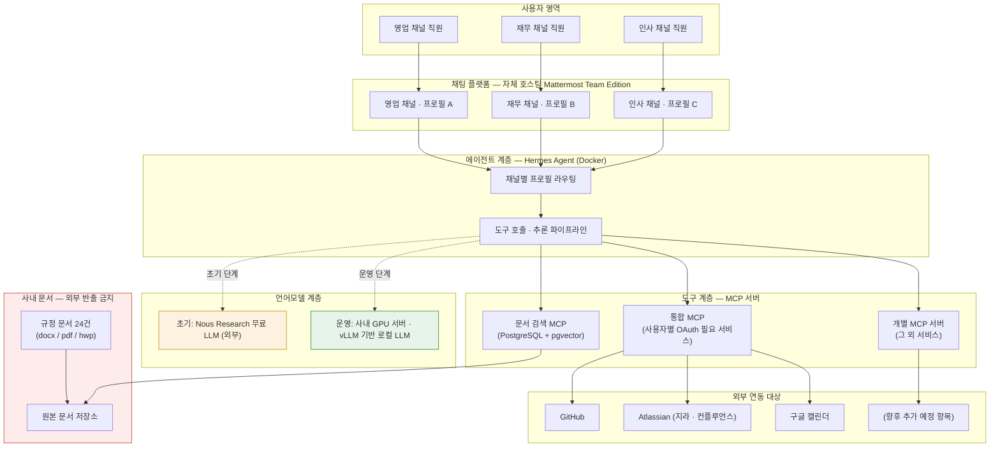
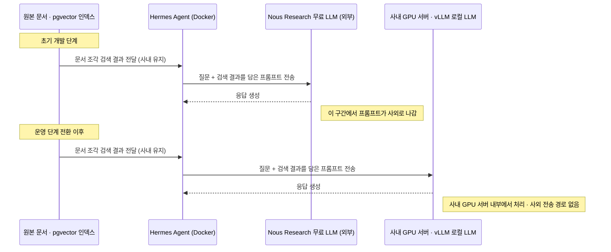
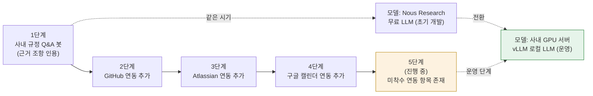

- **작성일**: 2026년 8월 31일
- **원문 출처**: Threads 게시글 (`https://www.threads.com/share/_fVOTZ_lx/`)
- **원문 접근 상태**: Threads는 자동화 접근을 로봇 차단 정책(robots.txt)으로 막고 있어 도구로 직접 열람할 수 없었습니다. 이 문서의 프로젝트 서사는 사용자가 대화 중 직접 옮겨 적은 원문 텍스트를 근거로 재구성했습니다. 다만 그 안에 등장하는 개별 기술 요소(Hermes Agent, Mattermost Team Edition, MCP, pgvector, vLLM, Nous Research)는 각각 공식 문서·GitHub 저장소 등 1차 소스로 별도 검증했습니다. 어느 부분이 "원문 그대로의 서술"이고 어느 부분이 "기술 배경 보충 설명"인지 문서 곳곳에 구분해 표기했습니다.

> 
> https://www.threads.com/share/_fVOTZ_lx/
> 
> 사내 AI 에이전트 구축을 의뢰받아 진행 중이다
> 
> 의뢰의 시작은 사내 규정이었다. 직원이 사내 메신저에서 규정을 물으면 봇이 근거를 인용해 답한다. 여기에 GitHub와 Atlassian, 구글 캘린더 연동이 차례로 붙었고 아직 착수하지 않은 항목도 남아 있다.
> 
> 규정 문서는 24건이었다. 취업규칙, 인사규정, 경조금 및 경조휴가 지급규정 같은 것들이고 형식은 docx와 pdf와 hwp가 섞여 있었다. 이 문서들이 회사 밖으로 나가면 안 된다는 게 첫 번째 조건이었다. 
> 
> 두 번째는 채널마다 답이 달라야 한다는 것이다. 영업 채널과 재무 채널이 같은 문서를 보면 곤란하다.
> 
> 세 번째는 개발이 완료되면 인계해야 한다는 것. 고객사에 전담 운영 인력이 있고, 구축과 초기 운영을 지나면 인계해야 한다.
> 
> 자체 호스팅으로 세팅한 Mattermost Team Edition 에 Hermes Agent를 Docker로 붙이고, 채널마다 프로필을 하나씩 주고, 문서 검색은 사내 PostgreSQL pg_vector 에 붙은 MCP 서버로 돌리는 구성이 됐다. 외부 연동은 두 갈래다. 사용자별 OAuth가 필요한 것들은 통합 MCP 하나로 묶었고, 그 외의 것들은 성격에 맞게 서버를 따로 구성했다. 모델은 처음엔 Nous Research 에서 제공하는 무료 LLM 을 사용하다가, 운영서버에서는 사내 GPU 서버의 vLLM 기반의 로컬 LLM 으로 옮겼다.
> 
> 원본 문서와 인덱스는 사내를 벗어나지 않았다. 외부 모델을 쓰는 동안 프롬프트가 밖으로 나갔지만 로컬 LLM 을 사용하면서 그 경로도 없어졌다.
> 

---

## 목차

1. 한눈에 보는 프로젝트
2. 프로젝트가 시작된 배경과 확장 과정
3. 고객사가 내건 세 가지 조건
4. 전체 시스템 구조
5. 채널별 프로필이라는 설계
6. 외부 서비스 연동 — OAuth 통합형과 개별형의 분리
7. 언어모델의 이동: 무료 외부 모델에서 사내 로컬 모델로
8. 보안 관점에서 본 데이터의 흐름
9. 핵심 용어 해설
10. 진행 경과 타임라인
11. 아직 남은 과제와 인계라는 전제
12. 이 문서의 신뢰도 구분
13. 참고 자료

---

## 1. 한눈에 보는 프로젝트

이 프로젝트는 한 회사가 외부 개발자에게 의뢰한 **사내 전용 AI 에이전트 구축** 작업입니다. 출발점은 단순했습니다. 직원이 회사 메신저에 "육아휴직 규정이 어떻게 되나요"처럼 질문을 던지면, 봇이 실제 규정집의 어느 조항을 근거로 답했는지 밝히면서 대답하는 것이었습니다. 여기서 시작해 GitHub, Atlassian(지라·컨플루언스 계열), 구글 캘린더 연동이 차례로 추가됐고, 아직 손대지 않은 연동 항목도 남아 있는 "진행 중" 상태의 프로젝트입니다.

아래 표는 원문에서 확인되는 프로젝트의 뼈대를 정리한 것입니다.

| 구분 | 내용 |
|---|---|
| 최초 요구사항 | 사내 메신저에서 규정 질의응답, 근거 조항 인용 |
| 이후 추가된 연동 | GitHub, Atlassian, 구글 캘린더 (순차적으로 추가) |
| 남은 연동 | 아직 착수하지 않은 항목 존재 (원문에 구체적 항목은 명시되지 않음) |
| 대상 문서 | 사내 규정 문서 24건 (취업규칙, 인사규정, 경조금·경조휴가 지급규정 등) |
| 문서 형식 | docx, pdf, hwp 혼재 |
| 채팅 플랫폼 | 자체 호스팅 Mattermost Team Edition |
| 에이전트 | Hermes Agent (Docker로 배포) |
| 문서 검색 | 사내 PostgreSQL + pgvector, MCP 서버로 연결 |
| 외부 연동 방식 | OAuth 필요한 것은 통합 MCP 하나로, 그 외는 개별 MCP 서버로 분리 |
| 초기 모델 | Nous Research가 제공하는 무료 LLM |
| 운영 모델 | 사내 GPU 서버의 vLLM 기반 로컬 LLM |
| 계약 조건 | 구축·초기 운영 후 고객사 전담 운영 인력에게 인계 예정 |

---

## 2. 프로젝트가 시작된 배경과 확장 과정

원문에 따르면 의뢰의 출발점은 **사내 규정**이었습니다. 직원이 사내 메신저에서 규정을 물으면 봇이 근거를 인용해 답하는 것, 이것이 요구사항의 전부였던 시점이 있었습니다. 인사·총무 부서에 반복적으로 들어오는 "이럴 때는 어떻게 되나요"류의 질문을, 원본 문서의 조항을 근거로 대는 방식으로 자동화하는 것이 목표였다고 볼 수 있습니다.

이 초기 범위에 시간이 지나며 세 가지 연동이 순서대로 붙었습니다.

- **GitHub** — 코드 저장소나 이슈, PR 관련 정보를 조회할 수 있게 하는 연동으로 추정됩니다.
- **Atlassian** — 지라(이슈 트래킹)나 컨플루언스(사내 위키) 계열 도구 연동으로, 사내 프로젝트 현황이나 문서를 함께 조회하는 용도로 보입니다.
- **구글 캘린더** — 일정 조회·확인 기능으로 보입니다.

원문은 이 세 가지가 "차례로 붙었다"고만 서술할 뿐, 각 연동의 정확한 기능 범위나 도입 순서 사이의 시간 간격은 밝히지 않았습니다. 또한 "아직 착수하지 않은 항목도 남아 있다"는 문장으로 미루어, 이 프로젝트는 완결된 결과물이 아니라 **단계적으로 기능을 넓혀가는 진행형 구축**이라는 점을 알 수 있습니다.

이 확장 패턴 자체는 사내 AI 에이전트 도입 사례에서 흔히 관찰되는 흐름과 일치합니다. 예컨대 국내 제조 AI 기업 VMS Solutions가 공개한 사내 에이전트 구축기에서도, <cite index="8-1">AWS의 Strands Agents SDK와 Amazon Bedrock을 활용해 인프라 운영과 개발 관련 질의를 자동화하는 챗봇 'AIto'를 구축</cite>했고, 이후 <cite index="8-1">사전에 지식베이스에 올려둔 문서를 검색·참고하는 RAG 중심 구조에서, AWS·PostgreSQL·Notion 등 실제 시스템에 연결된 MCP 서버를 통해 실시간 데이터를 조회하는 MCP 기반 AI 에이전트 구조로 전환</cite>하는 단계를 거쳤습니다. 이는 "문서 기반 규정 Q&A"에서 "실시간 시스템 연동"으로 넓어지는 이번 프로젝트의 흐름과 구조적으로 유사한 사례로, 이번 프로젝트가 특이한 설계라기보다는 사내 AI 에이전트 구축에서 반복적으로 나타나는 일반적 발전 경로임을 뒷받침합니다. (단, VMS Solutions 사례는 이번 프로젝트와 별개의 회사·별개의 기술 스택이며, 참고용 비교 사례일 뿐 동일 프로젝트가 아님을 분명히 해둡니다.)

---

## 3. 고객사가 내건 세 가지 조건

원문은 이 프로젝트의 성격을 규정하는 세 가지 조건을 명시하고 있습니다. 이 세 조건은 이후의 모든 기술적 선택(자체 호스팅, Docker 배포, 로컬 LLM 전환 등)을 설명하는 열쇠이기도 합니다.

### 3.1 조건 하나 — 문서가 회사 밖으로 나가면 안 된다

대상 문서는 취업규칙, 인사규정, 경조금 및 경조휴가 지급규정 등 **24건**이며, 형식은 docx·pdf·hwp가 섞여 있었습니다. hwp는 한글과컴퓨터의 워드프로세서 형식으로, 국내 공공기관·기업의 인사 문서에서 여전히 널리 쓰이는 포맷입니다. 이 세 형식이 섞여 있다는 것은, 문서를 벡터 검색이 가능한 형태로 만들기 전에 형식별로 텍스트를 추출·정제하는 전처리 단계가 필요했으리라는 것을 시사합니다. 다만 원문에는 이 전처리를 어떤 도구로 수행했는지에 대한 구체적 서술이 없어, 그 부분은 이 문서에서 추정하지 않았습니다.

"회사 밖으로 나가면 안 된다"는 조건은 이후 설명할 자체 호스팅 인프라 선택, 그리고 프로젝트 후반부의 로컬 LLM 전환을 이끈 근본 제약입니다.

### 3.2 조건 둘 — 채널마다 답이 달라야 한다

"영업 채널과 재무 채널이 같은 문서를 보면 곤란하다"는 문장은, 이 봇이 단일한 지식베이스를 모든 사용자에게 동일하게 노출하는 방식이 아니라 **채널(부서·업무 단위) 단위로 접근 권한이 분리된 구조**여야 한다는 요구입니다. 이는 이어서 설명할 "채널마다 프로필을 하나씩 주는" 설계로 구현되었습니다.

### 3.3 조건 셋 — 개발 완료 후 인계해야 한다

고객사에는 전담 운영 인력이 있고, 구축과 초기 운영 단계를 지나면 이 인력에게 시스템을 인계해야 한다는 조건입니다. 이는 외부 개발자가 영구적으로 시스템을 붙들고 있는 구조가 아니라, **문서화되고 표준화된 형태로 운영권이 넘어가는 것을 전제로 설계**해야 한다는 뜻이기도 합니다. 원문에는 인계의 구체적 시점이나 방식(문서 인수인계, 교육, 소스코드 이관 범위 등)은 서술돼 있지 않습니다.

---

## 4. 전체 시스템 구조

### 4.1 구성 요소 정리

원문에서 확인되는 구성 요소를 정리하면 다음과 같습니다.

- **채팅 플랫폼**: 자체 호스팅으로 세팅한 **Mattermost Team Edition**
- **에이전트**: **Hermes Agent**를 **Docker**로 붙임
- **채널 구성**: 채널마다 프로필을 하나씩 부여
- **문서 검색**: 사내 **PostgreSQL + pgvector**에 붙은 **MCP 서버**
- **외부 연동**: OAuth가 필요한 것은 통합 MCP 하나로, 그 외는 성격에 맞게 개별 서버로 구성
- **언어모델**: 초기 Nous Research 무료 LLM → 운영 단계 사내 GPU 서버의 vLLM 기반 로컬 LLM

### 4.2 구조도

### 4.3 각 계층에 대한 쉬운 설명

**Mattermost Team Edition**은 슬랙과 비슷한 사내 메신저인데, 소스가 공개돼 있고 자체 서버에 설치해 쓸 수 있다는 점이 특징입니다. Mattermost의 Team Edition은 무료로 자체 호스팅이 가능한 버전으로, <cite index="16-1">채널, 다이렉트 메시지, 파일 저장, 웹훅, 검색 기능을 제공</cite>합니다. 클라우드 서비스를 쓰지 않고 회사 서버 안에 직접 설치하기 때문에, 대화 내용과 첨부 문서가 외부 벤더의 서버를 거치지 않는다는 장점이 있습니다. "문서가 회사 밖으로 나가면 안 된다"는 조건과 정확히 맞물리는 선택입니다.

**Hermes Agent**는 미국의 오픈소스 AI 연구소 Nous Research가 만든 자체 호스팅형 AI 에이전트 소프트웨어입니다. <cite index="5-1">Nous Research가 만든 오픈소스 자율 AI 에이전트로, IDE에 종속된 코딩 보조도구나 단일 API를 감싼 챗봇 래퍼와 달리, 자신의 인프라 위에서 동작하며 세션을 거듭할수록 학습한 내용을 기억하고 더 유능해지는 자기개선형 에이전트</cite>로 소개됩니다. 이 프로젝트에서는 그 중에서도 <cite index="1-1">Mattermost를 봇으로 연동하는 기능이 사용됐는데, Mattermost의 REST API(v4)와 웹소켓을 통해 실시간으로 메시지를 주고받으며, 도구 호출·메모리·추론을 포함한 Hermes Agent 파이프라인을 거쳐 응답</cite>하는 구조입니다. 별도의 Mattermost 전용 라이브러리 없이 이미 Hermes가 쓰던 통신 라이브러리로 동작한다는 점에서, 무거운 추가 설치 없이 붙일 수 있는 연동으로 볼 수 있습니다.

"Docker로 붙였다"는 표현은 Hermes Agent를 컨테이너 형태로 패키징해 서버에 배포했다는 뜻입니다. 컨테이너 배포는 실행 환경을 코드로 고정해두기 때문에, 나중에 다른 서버로 옮기거나 운영 인력에게 인계할 때 "이 컨테이너 이미지만 그대로 옮기면 된다"는 이점이 있어, 인계를 전제로 한 3번째 조건과도 맞아떨어지는 선택입니다.

**PostgreSQL + pgvector**는 이 프로젝트의 문서 검색 엔진 역할을 합니다. pgvector는 오픈소스 관계형 데이터베이스인 PostgreSQL에 벡터 유사도 검색 기능을 추가하는 확장 모듈로, 문서를 잘게 나눈 뒤 의미를 담은 숫자 벡터로 바꿔 저장해두고, 질문이 들어오면 그 질문과 의미상 가장 가까운 문서 조각을 찾아내는 데 쓰입니다. 이 프로젝트가 별도의 전용 벡터 데이터베이스 제품을 새로 도입하지 않고 PostgreSQL 확장을 택했다는 점은, 이미 사내에 있을 가능성이 높은 관계형 데이터베이스 인프라를 그대로 활용해 운영 부담과 인계 난이도를 낮추려는 선택으로 해석할 수 있습니다. 이 검색 기능은 MCP 서버 형태로 감싸져 Hermes Agent가 "도구"로 호출하는 구조입니다.

**MCP(Model Context Protocol)** 는 AI 에이전트가 외부 데이터나 도구에 접근할 때 쓰는 공통 규격입니다. <cite index="26-1">로컬 파일이나 데이터베이스 같은 데이터 소스, 검색엔진이나 계산기 같은 도구, 특화된 프롬프트 같은 작업 흐름에 AI 애플리케이션이 접근할 수 있게 해주는 개방형 표준</cite>으로, <cite index="26-1">AI 애플리케이션을 위한 USB-C 포트에 비유</cite>됩니다. Anthropic이 처음 공개한 이후 업계 전반으로 빠르게 퍼졌고, <cite index="29-1">2025년 12월부터는 Linux Foundation 산하의 Agentic AI Foundation이 이 프로토콜을 관장하며, Anthropic·OpenAI·Block이 공동 설립하고 AWS·Google·Microsoft·Cloudflare·Bloomberg가 플래티넘 멤버로 참여</cite>하는 벤더 중립적 표준으로 자리잡았습니다. 이 프로젝트에서는 문서 검색, GitHub, Atlassian, 구글 캘린더 등 서로 다른 시스템에 접근하는 창구를 모두 MCP 서버라는 동일한 규격으로 통일해, Hermes Agent가 어떤 시스템이든 같은 방식으로 "도구 호출"만 하면 되도록 설계한 것으로 볼 수 있습니다.

---

## 5. 채널별 프로필이라는 설계

원문의 "채널마다 프로필을 하나씩 주고"라는 서술은, 하나의 Hermes Agent 인스턴스가 모든 채널에 동일한 지식과 권한으로 응답하는 것이 아니라, **채널마다 별도의 설정(프로필)을 가지고 응답한다**는 뜻입니다. Hermes Agent 문서에서도 이런 설계 방향이 뒷받침됩니다. <cite index="24-1">채팅 앱은 요청을 시작하는 창구일 뿐이고, Hermes는 파일·터미널 도구·MCP 서버·웹 검색·크론 기록·GitHub·Linear·Notion, 그리고 프로젝트별 스킬을 활용해 실제 작업을 수행</cite>할 수 있는데, 이때 <cite index="24-1">채팅 채널은 터미널과 신뢰 수준이 다를 수 있으므로 도구 접근 범위를 신중하게 지정해야 하며, 자격 증명은 소스 코드나 공유 메모가 아니라 활성 프로필 안에 저장</cite>하는 방식이 권장됩니다.

이 원리를 이번 프로젝트의 두 번째 조건("영업 채널과 재무 채널이 같은 문서를 보면 곤란하다")에 대입하면, 아마도 다음과 같은 방식으로 구현됐을 것으로 이해할 수 있습니다.

- 영업 채널에는 영업 관련 문서·도구에만 접근 가능한 프로필을 연결
- 재무 채널에는 재무 관련 문서·도구에만 접근 가능한 프로필을 연결
- 각 프로필은 자신에게 허용된 MCP 도구 목록과 자격 증명만 사용

다만 이 구체적인 권한 분리 로직(어떤 채널이 정확히 어떤 문서 범위에 접근하는지, 규정 문서 24건이 채널별로 어떻게 나뉘는지)은 원문에 명시되어 있지 않아, 이 문서에서는 "프로필 단위로 분리했다"는 원문의 서술 이상으로 세부 구조를 단정하지 않았습니다.

---

## 6. 외부 서비스 연동 — OAuth 통합형과 개별형의 분리

원문은 외부 연동을 두 갈래로 나눴다고 밝힙니다.

> "사용자별 OAuth가 필요한 것들은 통합 MCP 하나로 묶었고, 그 외의 것들은 성격에 맞게 서버를 따로 구성했다."

이 구분을 이해하려면 먼저 **왜 어떤 서비스는 "사용자별 OAuth"가 필요한지**를 짚어야 합니다.

GitHub, Atlassian(지라·컨플루언스), 구글 캘린더 같은 서비스는 보통 "이 요청을 한 사람이 실제로 그 회사 계정으로 로그인한 누구인지"를 서비스 쪽에서 확인하고 싶어 합니다. 그래서 사용자 개개인이 브라우저에서 로그인 절차(OAuth)를 거쳐야 접근이 허용되는 경우가 많습니다. 실제로 Atlassian은 <cite index="44-1">공식 원격 MCP 서버를 통해 지라·컨플루언스·지라 서비스 매니지먼트·비트버킷·컴퍼스를 OAuth 2.1 또는 API 토큰으로 안전하게 연결</cite>할 수 있도록 제공하고 있으며, <cite index="44-1">인증에 OAuth 2.1이나 API 토큰을 사용해 모든 동작이 사용자의 기존 접근 권한을 그대로 따르도록</cite> 설계돼 있습니다.

이런 "사용자별 로그인이 필요한" 서비스들을 하나씩 별도의 MCP 서버로 만들면, 서비스마다 로그인 흐름을 따로 관리해야 하는 부담이 커집니다. 원문에서 "통합 MCP 하나로 묶었다"는 것은, 이런 여러 서비스의 사용자별 로그인 처리를 한곳에서 일괄적으로 담당하는 게이트웨이 성격의 MCP 서버를 두고, GitHub·Atlassian·구글 캘린더 같은 서비스를 그 뒤에 연결했다는 뜻으로 해석할 수 있습니다. (다만 원문에는 이 "통합 MCP"가 어떤 구체적 제품이나 자체 개발물인지는 밝혀져 있지 않으므로, 이 문서에서 특정 상용 제품명을 단정해 붙이지는 않았습니다.)

반대로 "그 외의 것들"은 사용자 개개인의 로그인이 필요 없는 연동으로 추정됩니다. 예를 들어 문서 검색용 pgvector MCP 서버는 애초에 회사 내부 데이터베이스에 서버 대 서버로 접속하는 구조라 개인별 로그인 절차가 필요 없습니다. 이런 것들은 "성격에 맞게" 각각 독립된 서버로 구성했다는 것이 원문의 설명입니다.

---

## 7. 언어모델의 이동: 무료 외부 모델에서 사내 로컬 모델로

원문은 이 프로젝트에서 사용한 언어모델이 시점에 따라 달라졌다고 밝힙니다.

> "모델은 처음엔 Nous Research 에서 제공하는 무료 LLM 을 사용하다가, 운영서버에서는 사내 GPU 서버의 vLLM 기반의 로컬 LLM 으로 옮겼다."

### 7.1 초기 단계 — Nous Research의 무료 LLM

Nous Research는 앞서 소개한 Hermes Agent를 만든 바로 그 연구소이며, 동시에 Hermes 계열 언어모델 자체도 만드는 곳입니다. Nous Research는 자사 모델을 무료로 체험할 수 있는 창구를 여러 개 운영해 왔는데, 대표적으로 <cite index="13-1">hermes.nousresearch.com에서 제공되는 Nous Chat은 현재 무료로 이용</cite> 가능합니다. 원문에서 말하는 "무료 LLM"은 이런 성격의 서비스, 즉 초기 개발·검증 단계에서 비용 부담 없이 빠르게 프로토타입을 돌려볼 수 있는 외부 무료 모델을 가리키는 것으로 이해할 수 있습니다. 개발 초기에는 정식 계약된 유료 API나 사내 인프라를 준비하기 전에, 일단 기능이 제대로 동작하는지부터 검증하는 것이 합리적이므로, 이런 무료 모델을 임시로 쓰는 것은 흔한 개발 관행입니다.

### 7.2 운영 단계 — vLLM 기반 사내 로컬 LLM

운영 서버로 넘어가면서는 외부 API 호출을 완전히 걷어내고, 회사 내부 GPU 서버에서 직접 모델을 돌리는 방식으로 바뀌었습니다. 여기 쓰인 vLLM은 <cite index="35-1">UC 버클리에서 개발한, 대규모 언어모델을 효율적으로 추론하고 서빙할 수 있도록 돕는 오픈소스 라이브러리</cite>로, <cite index="35-1">PagedAttention이라는 기법으로 K·V 캐시 메모리를 효율적으로 관리해, 기존 방식 대비 처리량을 눈에 띄게 향상시키는 것이 핵심 특징</cite>입니다. 국내 실무 사례를 다룬 한 기술 블로그에서도, <cite index="34-1">여러 모델(응답 모델, 추론 모델, 임베딩 모델)을 동시에 서빙해야 하는 프로덕션 환경에서 OpenAI 호환 API를 유지하면서 여러 vLLM 인스턴스를 하나의 설정 파일로 묶어, 클라이언트 코드를 바꾸지 않고도 서빙 엔진을 교체</cite>할 수 있었다는 경험이 소개된 바 있습니다. 즉 vLLM은 사내에 GPU 서버가 있다는 전제 하에, 외부에 어떤 데이터도 나가지 않으면서 비교적 빠른 응답 속도로 여러 사용자의 요청을 동시에 처리하는 데 적합한 선택지로 평가됩니다.

왜 이 전환이 중요한지는 다음 8장의 보안 설명과 직접 이어집니다.

---

## 8. 보안 관점에서 본 데이터의 흐름

원문은 이 프로젝트의 데이터 흐름을 다음 두 문장으로 요약합니다.

> "원본 문서와 인덱스는 사내를 벗어나지 않았다. 외부 모델을 쓰는 동안 프롬프트가 밖으로 나갔지만 로컬 LLM 을 사용하면서 그 경로도 없어졌다."

이 문장을 구조적으로 풀어보면 다음과 같습니다.

- **원본 문서와 인덱스(pgvector에 저장된 벡터 데이터)**: 처음부터 끝까지 사내 PostgreSQL 서버 안에만 존재했습니다. 이는 자체 호스팅 Mattermost, Docker로 배포된 Hermes Agent, 사내 PostgreSQL이라는 인프라 선택 전체가 처음부터 "원본은 절대 밖으로 안 나간다"는 원칙 위에서 설계됐다는 뜻입니다.
- **프롬프트(사용자의 질문 + 검색으로 찾아낸 문서 조각을 조합해 언어모델에 보내는 텍스트)**: 이 부분은 원본 문서 그 자체는 아니지만, 검색된 문서의 내용이 일부 포함될 수 있는 텍스트입니다. 초기 단계에 Nous Research의 외부 무료 LLM을 썼다는 것은, 바로 이 프롬프트가 회사 밖 서버로 전송됐다는 뜻입니다.
- **로컬 LLM 전환 이후**: 프롬프트가 오가는 경로 자체가 사내 GPU 서버 안으로 들어오면서, 문서 내용이 담긴 텍스트가 외부로 나가는 경로가 완전히 사라졌습니다.

즉 이 프로젝트의 초기~운영 전환은 단순한 "성능 개선"이 아니라, **"원본은 애초에 안 나갔지만, 프롬프트는 한동안 나갔었다"는 잔여 리스크를 로컬 LLM 전환으로 마저 제거한 과정**으로 읽을 수 있습니다. 아래는 이 흐름을 시간 축으로 정리한 그림입니다.

이런 "일단 외부 서비스로 빠르게 검증한 뒤, 데이터가 민감한 운영 단계에서는 폐쇄망·사내 인프라로 옮긴다"는 전개 방식은, 사내 데이터를 다루는 국내 기업들의 로컬 LLM 서빙 전환 사례에서도 공통적으로 나타나는 동기입니다. 한 실무 가이드는 이 배경을 <cite index="38-1">클라우드 기반 LLM API가 주는 편리함에도 불구하고, 많은 기업과 개발팀이 데이터 보안, 높은 운영 비용, 서비스 지연 시간 문제 때문에 로컬 환경에서의 LLM 서빙과 추론 성능 최적화 필요성을 크게 느끼고 있다</cite>고 설명합니다.

---

## 9. 핵심 용어 해설

| 용어 | 쉬운 설명 |
|---|---|
| **Mattermost Team Edition** | 슬랙과 비슷한 사내 메신저. 회사 서버에 직접 설치해 쓰는 무료 버전으로, 대화·파일이 외부 클라우드를 거치지 않음 |
| **Hermes Agent** | Nous Research가 만든 오픈소스 AI 에이전트 소프트웨어. 자체 서버에서 돌리며, 메신저·이메일 등 여러 채널에 봇으로 붙일 수 있음 |
| **Docker** | 프로그램과 실행 환경을 하나의 "상자(컨테이너)"로 묶어 어디서든 동일하게 실행할 수 있게 해주는 배포 도구 |
| **MCP (Model Context Protocol)** | AI 에이전트가 데이터베이스, 파일, 외부 서비스 같은 "도구"에 접근할 때 쓰는 공통 규격. 서비스마다 전용 연동을 새로 짤 필요 없이 같은 방식으로 붙일 수 있게 해줌 |
| **PostgreSQL** | 널리 쓰이는 오픈소스 관계형 데이터베이스 |
| **pgvector** | PostgreSQL에 "의미가 비슷한 문서를 찾는" 벡터 검색 기능을 추가하는 확장 모듈 |
| **OAuth** | "이 사람이 실제로 그 계정의 주인이 맞다"는 것을 서비스 제공자가 직접 확인하는 로그인 인증 방식. 회원 개개인이 브라우저로 로그인 절차를 거쳐야 함 |
| **RAG (검색 증강 생성)** | 언어모델이 답을 지어내는 대신, 관련 문서를 먼저 찾아서 그 내용을 근거로 답을 만들게 하는 방식. 규정 근거를 인용하는 이번 봇의 핵심 원리 |
| **vLLM** | UC 버클리에서 개발한 오픈소스 LLM 서빙 엔진. GPU 메모리를 효율적으로 관리해 여러 사용자의 요청을 빠르게 동시 처리하도록 설계됨 |
| **hwp** | 한글과컴퓨터의 워드프로세서 파일 형식. 국내 공공·기업 문서에서 여전히 널리 쓰임 |

---

## 10. 진행 경과 타임라인

원문에 명시된 순서만을 기준으로, 확인 가능한 단계만 시간 축으로 정리했습니다. 각 단계 사이의 실제 소요 기간은 원문에 나와 있지 않아 표시하지 않았습니다.

---

## 11. 아직 남은 과제와 인계라는 전제

원문은 "아직 착수하지 않은 항목도 남아 있다"고 밝혔을 뿐, 그 항목이 무엇인지는 명시하지 않았습니다. 이 문서에서도 그 부분을 추측해 채워 넣지 않았습니다.

다만 프로젝트의 계약 조건 자체가 "구축과 초기 운영을 지나면 고객사 전담 운영 인력에게 인계"하는 것을 전제로 하고 있다는 점은 분명합니다. 이 전제는 지금까지 살펴본 여러 설계 선택과 자연스럽게 맞물립니다.

- Docker 컨테이너 배포 → 실행 환경을 그대로 옮기기 쉬움
- MCP라는 표준 규격으로 도구를 통일 → 새로운 담당자도 동일한 규격만 이해하면 됨
- 채널별 프로필 구조 → 권한 체계가 코드가 아니라 설정값으로 분리돼 있어 파악·인계가 상대적으로 쉬움
- 사내 인프라(자체 Mattermost, 사내 PostgreSQL, 사내 GPU 서버)에 집중 → 외부 벤더 종속성이 낮아 인수 후 운영 부담이 상대적으로 예측 가능

이 항목들은 원문에 "인계를 위해 이렇게 설계했다"고 직접 서술돼 있지는 않으며, 세 가지 조건과 실제 구성 요소를 겹쳐 봤을 때 자연스럽게 이어지는 해석임을 밝혀둡니다.

---

## 12. 이 문서의 신뢰도 구분

이 프로젝트의 성격상, 서로 다른 확실성을 가진 정보가 섞여 있습니다. 아래와 같이 4단계로 구분합니다.

| 등급 | 정의 | 이 문서에서 해당하는 내용 |
|---|---|---|
| **1단계 — 공식 1차 출처** | 해당 기술의 공식 문서·공식 저장소에서 직접 확인 | Hermes Agent의 Mattermost 연동 방식, MCP의 정의와 거버넌스 체계, Atlassian 공식 원격 MCP 서버의 존재 |
| **2단계 — 복수 매체 교차검증** | 둘 이상의 독립된 출처에서 같은 내용을 확인 | vLLM의 특징(PagedAttention, 오픈소스, UC버클리 개발), pgvector의 역할, Nous Chat 무료 제공 사실 |
| **3단계 — 단일 출처** | 사용자가 대화 중 제공한 원문 텍스트에만 근거하며, 다른 경로로 교차 확인하지 못함 | 이 프로젝트의 구체적 진행 경과, 3가지 계약 조건, 24건이라는 문서 수, 채널별 프로필 부여 사실, 언어모델 전환 시점과 순서 — **이 문서의 핵심 서사 전체**가 여기 해당합니다. Threads 원문은 로봇 차단 정책으로 직접 열람할 수 없었고, 게시자·소속 회사·정확한 게시 시점 등을 독립적으로 확인할 방법이 없었습니다. |
| **4단계 — 분석적 종합·편집 판단** | 검증된 사실들을 근거로 한 해석·추론 | "통합 MCP"가 여러 서비스의 OAuth를 일괄 처리하는 게이트웨이 성격일 것이라는 해석, 인계를 염두에 둔 설계로서의 각 선택에 대한 해설, VMS Solutions 사례와의 구조적 유사성 비교 |

**정리하면**: 이 문서에서 다루는 프로젝트 자체의 사실관계는 사용자가 제공한 단일 원문에 의존하고 있으며, 독립적으로 재확인되지 않았습니다. 반면 그 안에 언급된 기술 요소들이 실제로 존재하고 원문의 설명과 부합하는 방식으로 동작한다는 점은 각 기술의 공식 소스로 확인했습니다.

---

## 13. 참고 자료

- Hermes Agent — Mattermost 연동 공식 문서: `https://hermes-agent.nousresearch.com/docs/user-guide/messaging/mattermost`
- Hermes Agent 소개 페이지: `https://hermesagents.net/`, `https://hermesagent.agency/`
- Hermes Agent + Mattermost 게이트웨이 설명: `https://hermes-agent.ai/integrations/mattermost`
- Nous Research 공식 사이트: `https://nousresearch.com/`
- Nous Chat 무료 제공 공지 (Forge Reasoning API 발표문): `https://nousresearch.com/introducing-the-forge-reasoning-api-beta-and-nous-chat-an-evolution-in-llm-inference`
- Model Context Protocol 공식 소개: `https://modelcontextprotocol.io/docs/2026-07-28/getting-started/intro`
- MCP 2026-07-28 스펙 발표문: `https://blog.modelcontextprotocol.io/posts/2026-07-28/`
- MCP 거버넌스(Agentic AI Foundation) 관련: `https://www.200oksolutions.com/blog/best-guide-to-the-model-context-protocol-mcp-in-2026/`
- Atlassian 공식 원격 MCP 서버: `https://github.com/atlassian/atlassian-mcp-server`
- vLLM 서빙 원리 설명: `https://velog.io/@choonsik_mom/vllm에서-LLM-모델-서빙-vj4bddw8`
- vLLM 프로덕션 전환 사례(국내): `https://velog.io/@imkkuk/Ollama에서-vLLM으로-프로덕션-LLM-서빙-4.8배-빠르게-만들기`
- 로컬 LLM 서빙 도입 배경 설명: `https://seekerslab.com/ko/resources/blog/llm-local-serving-optimization-vllm-ollama-1784089117056`
- 비교 사례(VMS Solutions 사내 AI 에이전트 구축기, AWS 기술 블로그): `https://aws.amazon.com/ko/blogs/tech/vms-solutions-strands-sdk-agent`
- 원문 게시글(자동 접근 차단): `https://www.threads.com/share/_fVOTZ_lx/`

---

*이 문서는 원문 게시글의 서술을 바탕으로 하되, 기술적 배경 설명을 덧붙여 재구성한 해설 자료입니다. 원문 자체가 특정 회사명이나 세부 수치를 밝히지 않은 부분은 이 문서에서도 임의로 채워 넣지 않았습니다.*
