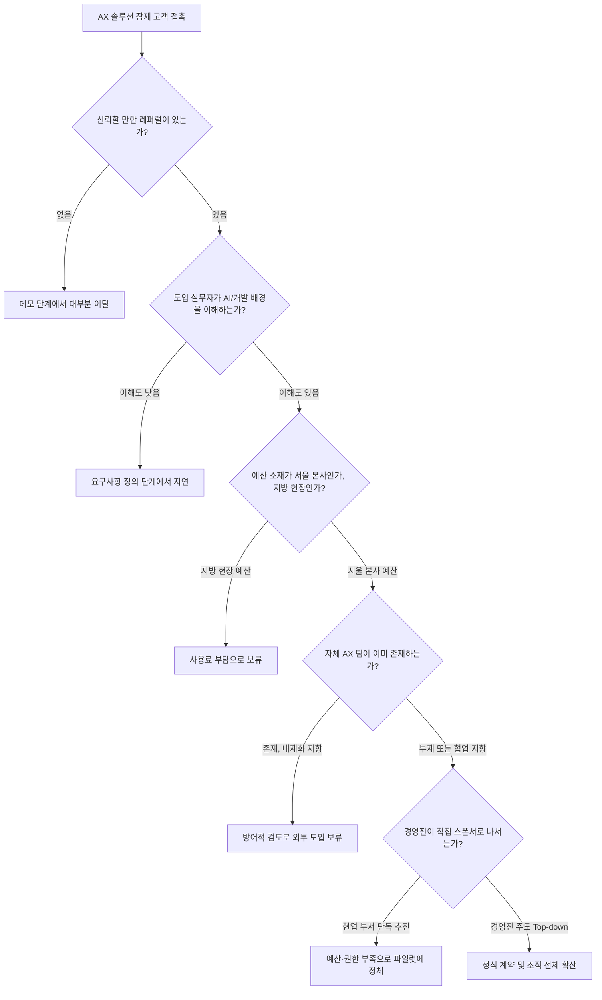

> 
> 올해 내가 체감한 AX 사업의 현실
> 
> - 아무리 기술력과 사용성이 뛰어난 제품을 만들어도 강한 레퍼럴이 아니면 도입이 힘들다.
> - AX 사업에 개발자 출신이 굉장히 드물고 전문성은 더더욱 드물다.
> - 지방에서 사업자는 AI 사용료 자체를 부담스러워 한다. AX 수요가 있는 곳은 지방이 아닌 서울.
> - 큰 조직일 수록 자체 AX 팀이 존재하고 거기서 자존심을 굽히지 않는다면 외부 도입은 힘들다.
> - 현재 AX 사업은 bottom up 으로 뚫는건 힘들다 Top down으로 뚫어야 한다.
> 
> https://www.threads.com/share/BAZMQRZ4Qd/
> 

## 이 글이 다루는 것

원문은 Threads에 올라온 짧은 게시물(threads.com/share/BAZMQRZ4Qd)로, 올해 AX(AI Transformation, AI 전환) 사업을 현장에서 겪으며 체감한 다섯 가지 현실을 정리한 글이다. 요지는 이렇다. 첫째, 기술력과 사용성이 아무리 뛰어나도 강한 레퍼럴 없이는 도입이 힘들다. 둘째, AX 사업에는 개발자 출신이 드물고 전문성은 더더욱 드물다. 셋째, 지방 사업자는 AI 사용료 자체를 부담스러워하며 AX 수요는 지방이 아니라 서울에 몰려 있다. 넷째, 조직이 클수록 자체 AX 팀이 있고 그 팀이 자존심을 굽히지 않으면 외부 도입이 힘들다. 다섯째, 지금의 AX 사업은 bottom-up으로는 뚫기 어렵고 top-down으로 뚫어야 한다.

이 다섯 문장은 짧지만, 하나하나가 2026년 한 해 동안 국내에서 실제로 관측되고 보도된 흐름과 상당 부분 겹친다. 아래에서는 각 항목을 시장 조사·정부 통계·업계 사례로 검증하면서, 왜 이런 현상이 나타나는지, 그리고 이런 환경에서 AX 사업을 어떻게 풀어가야 하는지를 정리한다. 다만 다섯 항목 모두가 동일한 수준의 정량적 근거를 갖춘 것은 아니다. 어떤 항목은 정부 통계와 협회 보고서로 뒷받침되고, 어떤 항목은 업계 관계자들의 반복된 증언 수준에 머문다. 이 차이는 글 뒤쪽의 팩트체크 표에서 항목별로 명시했다.

## AX는 지금 왜 이렇게 시끄러운가

AX는 챗봇을 붙이는 수준의 'AI 도입'과는 결이 다르다. 업무 방식과 의사결정 구조, 제품·서비스 설계 자체를 AI 중심으로 바꾸는 작업을 가리키며, 예를 들어 고객 데이터로 이탈 예측 모델을 만들어 그 결과가 CS 우선순위와 마케팅 설계까지 바꾸는 수준이 되어야 AX라고 부를 수 있다는 정의가 업계에서 통용된다(브런치 PM 칼럼, 2026.3.27). 정부도 이 흐름에 올라타 있다. 과학기술정보통신부·산업통상부·중소벤처기업부는 2026년 산업·제조 AX 사업을 통합 공고했고, 공공 부문 대상 AX 프로젝트, 중소·중견기업 대상 AX 원스톱 바우처(과제당 약 13억 원, 총 260억 원 규모) 등 다수의 지원 사업이 동시에 운영되고 있다(과학기술정보통신부·산업통상부 공고, 2026년 3~4월). 시장 조사 기관 베리리포트는 2026년 국내 기업용 ICT 시장이 약 42조 1천억 원, 이 중 AI 시장이 전년 대비 25% 늘어난 6조 4,190억 원 규모로 성장할 것으로 전망했다(베리리포트, 2026.7.28). 예산과 관심이 이렇게 몰리는 시장이니만큼, 그 이면에서 실제 영업과 도입이 어떤 방식으로 이루어지는지는 AX 사업을 하는 사람이라면 반드시 알아야 할 정보다.

## 현실 ① 기술력만으로는 안 된다 — 레퍼럴이 곧 신뢰다

B2B, 특히 엔터프라이즈 세일즈에서는 "제품만 좋으면 영업 없이도 스스로 팔린다"는 통념이 실제로는 틀린 경우가 많다는 지적이 업계에 반복적으로 나온다(오픈애즈 칼럼). 기업 고객은 개인 소비자와 달리 도입 실패의 책임을 실무자 한 사람이 져야 하는 구조이기 때문에, 검증되지 않은 벤더를 들이는 것 자체가 개인적 리스크가 된다. 그래서 엔터프라이즈 세일즈 경험을 다룬 국내 SaaS 기업 콜라보의 회고에서는, 세일즈 담당자가 기능뿐 아니라 보안·인프라·법적 이슈까지 답할 수 있는 전문가가 되어야 도입 담당자가 그를 믿고 내부 정보를 공유하며 함께 검토를 진행할 수 있다고 설명한다(Callabo 블로그, 2026.6.21). 결국 첫 문을 여는 것은 제품 스펙표가 아니라 "이미 써본 누군가의 보증"이며, 이것이 레퍼럴이 실질적인 진입 장벽으로 작동하는 이유다. 카카오벤처스가 정리한 국내 B2B SaaS 스타트업의 공통 딜레마 역시, 스타트업이 결국 영업으로 돌파구를 만들어야 한다는 점을 짚고 있다(카카오벤처스 블로그, 2025.10.13). AX 솔루션은 일반 SaaS보다 도입 리스크(데이터 접근, 업무 프로세스 변경, 보안 심사)가 더 크기 때문에, 이 레퍼럴 의존도는 오히려 더 심하면 심했지 덜하지 않다고 보는 것이 합리적이다.

## 현실 ② 개발자 출신이 드물고, 전문성은 더 드물다

이 진단은 2026년 상반기부터 계속 나온 'AX 인재전쟁' 보도와 정확히 맞닿아 있다. 시사저널e는 기업들이 모델 개발자를 넘어 AI와 산업·업무를 함께 이해하는 '융합형 인재'를 찾고 있지만, 현장 수요에 맞는 인력은 여전히 부족하다고 짚었다(시사저널e, 2026.7.27). 서울경제는 이 인재난이 채용 방식 자체를 바꾸고 있다고 보도했는데, 크래프톤은 학력·경력 무관 조건으로 AX 개발자를 채용하고 있고, 일부 기업은 FDE(Forward Deployed Engineer, 비개발 조직에 파견돼 자동화 가능 업무를 발굴하고 직접 솔루션을 만드는 역할)를 두 자릿수 규모로 뽑고 있다(서울경제, 2026.3.27). 같은 기사는 한국표준협회 조사를 인용해 기업들이 AI 인재에게 가장 중요하게 보는 역량으로 '실무 프로젝트·현장 적용 경험'(32.9%)을 꼽았다고 전했는데, 이는 거꾸로 말하면 이론이나 자격증만 갖춘 인력은 시장에서 원하는 만큼의 신뢰를 얻지 못한다는 뜻이기도 하다. 채용 공고 시장에서도 삼일회계법인 같은 대형 회계·컨설팅 법인이 Gen AI·AX 개발자·컨설턴트를 프론트엔드부터 백엔드, AI R&D까지 전방위로 뽑고 있는 것을 확인할 수 있다(링커리어 채용공고). 정리하면, 개발 역량과 현업 문제 정의 역량을 동시에 갖춘 사람이 절대적으로 부족한 상태에서 수요만 폭증하고 있는 셈이고, 이 공백을 메우기 위해 저비용으로 신입에게 시니어급 문제 해결을 요구하는 방식(예: 일부 AX 해커톤에 대한 업계 내부 비판, threads.com/@gptaku_ai, 2026.6.23)까지 등장하고 있다.

## 현실 ③ AI 사용료를 부담스러워하는 지방, 수요는 서울에

이 항목은 "지방 대 서울"이라는 지리적 구도보다는 "대기업 대 중소기업"이라는 규모의 구도로 더 정밀하게 뒷받침된다. 대한상공회의소 경제연구원이 2026년 6월 전국 임금근로자 3,000명을 대상으로 실시한 조사에 따르면, 생성형 AI 활용률은 대기업이 66.5%, 중소기업이 52.7%로 13.8%포인트 차이가 났다(파이낸셜뉴스, 2026.6.10). 흥미로운 지점은 그다음이다. 회사의 지원 체계와 근로자의 프롬프트 활용 역량, AI 수용 태도까지 함께 반영해 분석하면 기업 규모 자체에서 비롯되는 순수 격차는 4%포인트 수준으로 줄어든다. 즉 격차의 대부분은 기업 규모 자체가 아니라 '지원 체계가 있느냐 없느냐'에서 갈린다는 뜻이다. 실제로 생성형 AI 도입 로드맵이 없다고 응답한 비율은 중소기업이 70.4%로 대기업(54.4%)보다 훨씬 높았고, 교육·훈련 프로그램 제공 비율은 대기업 34.7%, 중소기업 24.9%, 내부 가이드라인 제공 비율도 각각 33.8%, 24.3%로 벌어져 있었다. 대한상의 연구위원은 이 격차가 방치되면 장기적으로 생산성 격차로 이어질 수 있다고 경고하며, 해법으로 제조업·비수도권을 겨냥한 맞춤형 프로그램 확대를 명시적으로 제안했다. 정부가 별도로 비수도권 맞춤 지원을 강조해야 할 만큼, 서울/수도권과 지방·중소사업자 사이의 AX 체감도 차이는 실재하는 문제로 인식되고 있다는 의미다. 다만 이 조사는 '서울 대 지방'을 직접 비교한 것이 아니라 '대기업 대 중소기업' 비교이므로, 두 구도가 상당 부분 겹치되 완전히 동일한 것은 아니라는 점은 분명히 해둘 필요가 있다.

## 현실 ④ 큰 조직일수록 자체 AX 팀이 있고, 자존심을 굽히지 않는다

대기업이 외부 솔루션 대신 내재화를 택하는 흐름에는 그럴듯한 논리적 배경이 있다. 한 칼럼은 골드만삭스 CEO 데이비드 솔로몬이 초기에 100여 개의 산발적인 PoC를 동시에 시도했다가 뚜렷한 성과를 내지 못했고, 이후 핵심 영역 5~6개에만 집중하는 전략으로 선회했다는 사례를 들며, 기업이 승자가 되려면 외부 업체가 대신 만들어줄 수 없는 '자사 고유의 엔터프라이즈 IQ'를 내재화해야 한다고 주장한다(Giljae Joo 블로그, 2026.7). 이런 논리는 자연스럽게 "우리 데이터와 프로세스는 우리가 제일 잘 안다"는 방어 논리로 이어지고, 결과적으로 외부 벤더가 아무리 좋은 제품을 들고 가도 "그건 우리 내부 AX 팀이 이미 검토했다"는 벽에 부딪히게 만든다. 실제로 이런 조직 신설 사례는 이미 다수 확인된다. 채널코퍼레이션은 한 개발자가 바이브코딩 도구로 코드 리뷰를 자동화한 사례가 사내에서 주목받으면서 TF가 꾸려졌고, 이 TF가 세일즈팀의 회의록 작성 업무까지 자동화한 뒤 결국 고객사의 AX 전환까지 지원하는 정식 조직으로 승격했다(ZDNet Korea, 2026.1.2). LG그룹은 구광모 회장이 사장단 회의에서 "완벽한 계획보다 실행이 우선"이라며 전사적 AX 가속화를 직접 주문했다(서울경제, 2026.3.27). 이런 사례들은 큰 조직일수록 AX를 '사올 것'이 아니라 '키울 것'으로 접근하는 경향이 강하다는 진단과 정확히 부합한다. 다만 이 항목에서 '자존심'이라는 표현 자체는 정량화하기 어려운 정성적 관찰이라는 점은 밝혀둔다.

## 현실 ⑤ Bottom-up으로는 안 뚫린다, Top-down이어야 한다

이 항목은 다섯 가지 중 가장 두꺼운 데이터로 뒷받침되는 진단이다. PwC의 2026년 AI 비즈니스 전망을 인용한 한 컨설턴트의 글은, 크라우드소싱 방식의 bottom-up AI 전략을 기업들이 저지르는 첫 번째 실수로 지목하며, 승리하는 기업들은 명확히 top-down, 리더십 주도 모델로 이동하고 있다고 분석한다(Shawn Kanungo, 2026.4.21). 같은 글은 그 이유로 에이전틱 AI 배포에 드는 비용이 이미 수백만 달러 단위여서 예산을 50개의 작은 실험에 흩뿌리면 어느 실험도 의미 있는 규모에 도달하지 못한다는 점, 그리고 2026년 8월 전면 시행된 EU AI Act 같은 규제 대응에는 중앙화된 거버넌스가 필수적이라는 점을 든다. 삼정KPMG가 정리한 세미나 자료 역시, MIT의 「생성형 AI의 격차: 2025년 기업 내 AI 현황」 보고서를 인용하며 생성형 AI 도입을 추진한 기업 중 95%가 실질적인 성과를 내지 못했다고 전한다(삼정KPMG 뉴스레터, market reader). 데이터 전략 컨설팅사 endjin의 글도 결이 같다. 대다수 AI 이니셔티브가 실패하는 이유는 조직이 top-down 또는 bottom-up 중 한쪽 렌즈만 선택하기 때문이며, 방향 없는 bottom-up 실험은 개인 생산성 차원의 소소한 성과에 그치고 절대 조직 전체로 확산되지 못한다고 지적한다(endjin, 2026.5.8). 다만 이 흐름이 반쪽짜리 진실이라는 반론도 존재한다. Forbes에 실린 한 CEO의 회고는, 톱다운으로 밀어붙인 AI 프로젝트에 1년간 백만 유로를 쓰고도 사업에 도움이 됐다고 말할 수 있는 지출이 단 한 푼도 없었다는 사례를 전하며, 현업의 자발적 동의(buy-in) 없는 top-down 지시는 저항만 만들 뿐 결과를 만들지 못한다고 경고한다(Forbes Councils, 2026.6.5). 즉 정확히 말하면 'bottom-up만으로는 확산이 안 되고, top-down 스폰서십이 반드시 있어야 하되, 그 top-down이 현업의 실행 동의까지 확보해야 한다'는 것이 2026년 현재 컨설팅 업계의 중론에 가깝다.

## 다섯 가지가 하나로 겹치는 지점

이 다섯 현실을 따로 보면 각각 다른 문제처럼 보이지만, 실제 영업 퍼널에 겹쳐 놓으면 하나의 이야기로 연결된다. 레퍼럴이 없는 상태로 문을 두드리고, 실무자가 기술을 이해하지 못해 요구사항 정의 단계에서 지연되고, 예산이 지방 사업장에 있어 비용 부담으로 보류되고, 설령 여기까지 통과해도 본사에 이미 자체 AX 팀이 있어 방어적으로 반응하고, 마지막으로 그 모든 관문을 통과했더라도 경영진의 직접적 스폰서십이 없으면 파일럿 단계에서 정체된다. 이 다섯 관문 중 어느 하나라도 막히면 거래는 죽는다.

## 그래서 어떻게 접근해야 하는가

다섯 가지 관문을 통과하려면 각각에 맞는 전략이 필요하다. 레퍼럴 문제는 기술 세일즈가 아니라 관계 세일즈로 접근해야 풀린다는 뜻이므로, 초기 몇 개 고객사와의 파일럿을 마케팅 도구가 아니라 다음 영업의 통행증으로 설계하고, 그 고객이 다른 의사결정자에게 직접 소개해줄 수 있는 구조(레퍼런스 콜, 케이스 스터디 공동 발표 등)를 처음부터 계약 조건에 넣는 편이 유리하다. 인력 문제는 채용 공고보다 파트너십으로 우회하는 편이 현실적인데, 현업 도메인 지식과 개발 역량을 모두 갖춘 사람을 회사 내부에서 키우는 데는 시간이 오래 걸리므로, FDE형 인력을 프로젝트 단위로 파견하거나 컨소시엄 형태로 결합하는 정부 지원 사업(AX 원스톱 바우처 등)을 활용하는 것이 현실적 대안이 될 수 있다. 지방·비용 문제는 가격 정책과 패키징으로 풀어야 하는데, 대한상의 조사가 보여주듯 격차의 핵심은 기업 규모가 아니라 지원 체계의 유무이므로, 구독료 지원이나 표준 로드맵 제공 같은 저비용 온보딩 패키지를 지방 중소사업자용으로 별도 설계하면 정부 바우처 사업과 결합해 시너지를 낼 여지가 있다. 조직 내재화 문제는 정면 승부보다 보완재 포지셔닝이 낫다. 대기업 자체 AX 팀과 경쟁하는 솔루션이 아니라, 그 팀이 스스로 만들기 부담스러워하는 특정 기능(예: 규제 대응, 특정 도메인 데이터 처리)을 보완하는 도구로 포지셔닝하면 방어적 반응을 줄일 수 있다. 마지막으로 top-down 문제는 영업 대상 자체를 바꾸라는 신호로 읽어야 한다. 현업 부서 담당자를 여러 번 설득하는 것보다, 처음부터 예산 편성권을 가진 임원급(CFO, AX 전담 임원, 사장단)에게 닿을 수 있는 채널을 찾는 것이 훨씬 효율적이며, 동시에 Forbes 사례가 보여주듯 그 임원의 지시가 현업의 실행 동의 없이 일방적으로 떨어지면 오히려 저항을 부르므로 파일럿 설계 단계에서 현업 실무자를 공동 설계자로 끌어들이는 것이 필요하다.

## 팩트체크 표

| 원문 진단 | 검증 상태 | 근거의 성격 | 핵심 출처 |
|---|---|---|---|
| ① 레퍼럴 없이는 도입이 힘들다 | 정성적으로 뒷받침됨 | 국내 AX 특화 통계는 없으나, B2B/엔터프라이즈 세일즈 전반에서 반복 확인되는 업계 정설 | Callabo 블로그(2026.6.21), 오픈애즈 칼럼, 카카오벤처스 블로그(2025.10.13) |
| ② 개발자 출신·전문성 있는 인력이 드물다 | 정성적으로 뒷받침됨(정량 비율 데이터는 없음) | 'AX 인재전쟁' 보도가 다수, 채용 방식 변화(학력 무관, FDE 신설)로 간접 확인 | 시사저널e(2026.7.27), 서울경제(2026.3.27) |
| ③ 지방은 AI 사용료를 부담스러워하고, 수요는 서울에 있다 | 데이터로 뒷받침됨(단, '서울/지방'이 아닌 '대기업/중소기업' 조사) | 대한상의가 3,000명 대상 설문으로 격차와 원인(지원 체계 부재)을 정량화, 정부도 비수도권 맞춤 지원 필요성을 공식 언급 | 대한상공회의소 경제연구원 보고서, 파이낸셜뉴스(2026.6.10) |
| ④ 큰 조직일수록 자체 AX 팀이 있고 자존심을 굽히지 않는다 | 부분적으로 뒷받침됨 | 대기업의 AX 조직 내재화 사례는 다수 확인되나, '자존심'이라는 표현 자체는 정성적 관찰 | ZDNet Korea(2026.1.2), 서울경제(2026.3.27), Giljae Joo 블로그(2026.7) |
| ⑤ Bottom-up은 안 되고 Top-down이어야 한다 | 데이터로 뒷받침됨(단, 무조건적 top-down은 아니라는 반론도 유력) | PwC 2026 전망, MIT 95% 실패 통계가 top-down 우위를 지지하나, Forbes 사례는 현업 동의 없는 top-down의 역효과를 경고 | Shawn Kanungo(2026.4.21), 삼정KPMG 뉴스레터, Forbes Councils(2026.6.5), endjin(2026.5.8) |

## 참고 자료

- 대한상공회의소 경제연구원, 「생성형 AI 활용의 대·중소기업 격차: 역량과 조직환경의 역할」, 2026.6.10 (파이낸셜뉴스 보도)
- 시사저널e, 「[AX 인재전쟁①] 개발자는 있는데 현장형 인재는 없다」, 2026.7.27
- 서울경제, 「학위 없어도 뽑는다…AX 인재 전쟁이 채용의 룰을 바꾼다」, 2026.3.27
- ZDNet Korea, 「"개발만 AI 쓰는 시대 끝났다"…스타트업, 일하는 방식 바꾸는 AX 경쟁 본격화」, 2026.1.2
- Shawn Kanungo, 「Top-Down vs Bottom-Up AI Strategy」, 2026.4.21 (PwC 2026 AI Business Predictions 인용)
- endjin, 「AI Strategy: Think Top-Down, Experiment Bottom-Up」, 2026.5.8
- Forbes Councils, 「Your Board Wants AI. Your Team Fears It. They're Both Right」, 2026.6.5
- 삼정KPMG 뉴스레터(market reader), MIT 「생성형 AI의 격차: 2025년 기업 내 AI 현황」 보고서 인용
- Callabo 블로그, 「B2B SaaS 제품을 대기업에 영업하면서 느낀 5가지」, 2026.6.21
- 베리리포트, 「2026 국내 중소기업 DX·AI 전환 산업 동향과 전망」, 2026.7.28
- 과학기술정보통신부·산업통상부·중소벤처기업부, 2026년 AX 사업 통합 공고 및 AX 원스톱 바우처 공고

---

작성일자: 2026년 9월 1일
