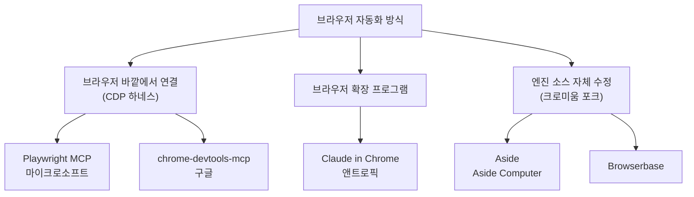

> 
> Aside 쓰면 안 되는 이유
> 
> 1. 생각이 게을러진다. 앱스토어 앱 제출, 각종 상품 등록, 카페24 API 등록, 구글 로그인, 카카오톡 로그인, 구글 클라우드 콘솔 조작, 이메일 컨펌까지 전부다 알아서 해버린다.
> 
> 2. Chrome CDP, Playwright 쓰면 사고력을 기를 수 있다. 벽에도 자주 막히고 안 되는 이유를 찾으며 학습하는데 Aside는 ‘이것도 되겠지’ 하고 그냥 다 맡기게 된다.
> 
> 3. CLI도 잘됨. 손으로 하는 상당부분의 일을 없앴다. 나만 썼으면 좋겠다.
> 
> https://www.threads.com/share/_hIEjPYOG/
> 

## 들어가며 — 공유된 내용은 무엇인가

전달받은 자료는 스레드(Threads)에서 오간 대화 내용이다. 첫 번째 대화창은 "Aside 쓰면 안 되는 이유"라는 제목의 게시물에 달린 댓글들이고, 게시물 본문은 세 가지 이유를 든다. 첫째, 생각이 게을러진다는 것이다. 앱스토어 앱 제출, 각종 상품 등록, 카페24 API 등록, 구글 로그인, 카카오톡 로그인, 구글 클라우드 콘솔 조작, 이메일 컨펌까지 전부 알아서 처리해 버린다는 지적이다. 둘째, Chrome CDP나 Playwright를 직접 다루면 벽에 부딪히며 안 되는 이유를 찾는 과정에서 사고력이 길러지는데, Aside는 "이것도 되겠지" 하고 그냥 맡기게 만든다는 점이다. 셋째, CLI도 잘 작동해서 손으로 하던 상당 부분의 작업을 없애버렸고, 그래서 "나만 썼으면 좋겠다"는 말로 글을 맺는다.

제목과 달리 세 가지 이유는 반어법에 가깝다. 실제로는 Aside가 얼마나 손이 덜 가게 만드는지를 강조하는 내용이고, 댓글 반응도 이 맥락에서 웃음으로 이어진다. half.nomad는 "절대 사용해서는 안 된다고 생각합니다, 제가 대신 부작용을 테스트하겠습니다"라고 적었는데, 부작용을 자처하겠다는 말 자체가 써보고 싶다는 뜻에 가깝다. specal1849는 "깃허브 커밋도 못하게 되었고 이제는 로그인도 못하게 생김"이라며 직접 하던 일이 점점 줄어든다고 자조했고, hongso0921은 맥미니에 로그인만 해두고 산책을 다녀왔더니 메타 픽셀 MCP 연동과 설정까지 다 끝나 있었다며 브라우저 화면이 어떻게 생겼는지 까먹을 정도로 게을러졌다고 썼다. joshproductletter는 "풀악셀 직원 한 명 더 단 느낌"이라고 표현했고, iyen.io는 "IQ가 10 정도 떨어지고 삶의 질은 많이 올랐다"는 농담으로 마무리했다.

세 번째 대화창의 반응도 같은 흐름이다. extrayugen은 "이거 완전 쓰라는 뜻이냐"고 되물었고, memo.workshop은 "써봐야겠다", walkthesky는 "멍청하고 게으른 인간은 나 하나로 족하다"며 자신을 낮추는 농담을 남겼다. 두 번째 대화창은 다른 게시물에 달린 반응으로 보이는데, "혼자서 다해서 힘들다(?)"거나 "자동화의 대중화를 이끌... 윈도우 나오지마"처럼 소수 인원의 제작진이 빠르게 기능을 쏟아내는 상황을 가리키는 내용이 담겨 있다. 다만 이 대화창에 등장하는 특정 인물이 누구인지는 원문 게시물을 확인할 수 없어 단정하지 않는다.

이 대화가 가리키는 대상, 즉 Aside가 실제로 무엇이고 왜 이런 반응을 낳는지를 아래에서 근거를 갖춰 정리한다.

## Aside는 어떤 제품인가

Aside는 크로미움(Chromium) 엔진을 직접 고쳐서 다시 빌드한 독립형 데스크톱 브라우저다. 크롬 확장 프로그램이 아니라 별도로 설치하는 애플리케이션이며, 2026년 6월 23일에 정식 출시됐다. 겉모습은 일반 브라우저와 크게 다르지 않지만, 로그인해 둔 사이트 안에서 사람이 하듯 화면을 읽고 클릭하고 입력하는 에이전트가 브라우저 안에 내장돼 있다는 점이 핵심이다.

제작사인 Aside Computer는 이 접근 방식을 스스로 매니페스토 형태로 설명한다. 요지는 이렇다. 지금의 AI 에이전트 서비스는 서비스마다 통합(연동)을 새로 연결해야 하고, 지원하지 않는 서비스가 나오면 그 자리에서 막힌다. 반면 웹에서 이뤄지는 업무 대부분은 이미 로그인된 브라우저 탭 안에서 벌어진다. 그렇다면 에이전트를 서비스별 연동 대신 브라우저 안에 넣어, 사람이 쓰던 방식 그대로 화면을 보고 조작하게 만드는 편이 낫다는 논리다. 이 구조 덕분에 공식 API가 없는 사내 도구나 카페24 어드민, 구글 클라우드 콘솔처럼 연동을 붙이기 까다로운 화면도 작업 대상이 된다.

## 만든 사람들과 여기까지 온 과정

Aside는 Y Combinator 2025년 가을(F25) 배치 소속 스타트업 Aside Computer가 만들었다. 창업자는 Jun Kim, Chanhee Lee, Sanghun 세 사람이고 모두 한국인이다. Y Combinator 공식 소개 페이지에는 이들이 애초에 기술 영업 통화를 돕는 실시간 코파일럿(영업 상담 중 기술적 질문에 문서와 슬랙, 과거 통화 기록에서 답을 찾아주는 서비스)으로 YC에 지원했다고 나와 있다.

이 팀은 총 일곱 번의 지원 끝에 YC에 합격했고, 그전까지 다섯 번의 피벗을 거쳤다. Aside 최고제품책임자(CPO) Chanhee Lee가 EO 매거진과의 인터뷰에서 밝힌 바에 따르면, YC 배치를 마쳤을 때 이렇다 할 성과가 없었고 그해 12월부터 이듬해 1월까지 이른바 "포스트 YC 블루스"를 심하게 겪었다고 한다. 코드를 한 줄도 더 쓰고 싶지 않았을 정도였다는 표현도 나온다. 배치 초반 회사 계좌에는 약 200달러가 남아 있었다는 설명도 함께 있다.

브라우저 형태의 Aside는 이 침체기를 지난 뒤 나온 여섯 번째 피벗의 결과물이다. 다섯 명이 다섯 달 동안 만들었고, 6월 23일 출시 게시물이 160만 회 이상의 조회수를 기록했다. 출시 2주 만에 사용자 2만 명을 넘겼고, 여기서 나온 매출로 이전 제품을 접었다고 전해진다. TechCrunch가 주목할 만한 AI 브라우저 중 하나로 소개하기도 했다.

## 설치와 처음 실행할 때 벌어지는 일

Aside는 aside.com에서 dmg 파일을 내려받아 설치한다. 파일 용량은 약 314MB이고, 2026년 8월 기준으로 macOS 전용이며 macOS 15.0 이상이 필요하다. 윈도우 버전은 아직 준비 중이라는 외부 보도가 있을 뿐 정식 출시 일정은 공개돼 있지 않다.

첫 실행 시 온보딩 과정에서 눈에 띄는 부분은 보안 설계다. 이메일 인증 다음 단계에서 계정 비밀번호를 만드는데, 이 비밀번호로 데이터를 암호화하면서 "Aside는 이 비밀번호를 재설정해 줄 수 없다"고 명시한다. 회사 쪽에서도 비밀번호를 임의로 초기화할 수 없는 구조라는 뜻이다. 이어서 12단어로 된 복구 키를 발급하고, 파일로 저장했음을 확인하기 전까지는 다음 단계로 넘어갈 수 없게 막아 둔다. 기존 브라우저의 즐겨찾기와 비밀번호 관리자 데이터를 가져오는 절차를 지나면, 이어서 어떤 AI 모델을 쓸지 고르는 화면이 나온다.

여기서 선택지가 하나 더 있다. Aside 자체 요금제로 시작하는 대신, 이미 쓰고 있는 ChatGPT Plus·Pro, Claude Pro·Max, Grok, Kimi Code, GitHub Copilot 구독을 그대로 연결하거나 Google·OpenRouter의 API 키를 입력하는 방식도 지원한다. 새로운 AI 구독을 추가로 결제하지 않고도 Aside를 쓸 수 있게 만든 장치다.

## 핵심 기능 네 가지

실제로 설치해 사용해 본 기록과 공식 문서를 종합하면, Aside를 다른 제품과 구분 짓는 기능은 크게 네 가지로 정리된다.

**연동 설정이 필요 없는 시작.** 서비스별 통합을 연결하거나 API 키를 발급받는 절차 없이, 브라우저에 로그인만 돼 있으면 곧바로 작업을 맡길 수 있다. 설치 후 10분 안에 첫 작업이 끝났다는 실사용 기록도 있다.

**모델을 고르는 자유.** 특정 회사의 모델에 묶이지 않는다. 설정 화면에는 작업 성격별로 네 개의 모델 슬롯이 있는데, 예컨대 빠른 부수 작업에는 GPT-5.6 Luna, 깊은 추론과 화면 해석에는 GPT-5.6 Terra를 지정하는 식이다. CAPTCHA 해석이나 화면 인식 전용 슬롯이 따로 있다는 점도 브라우저 에이전트다운 구성이다.

**열어 볼 수 있는 메모리.** 브라우징 히스토리를 바탕으로 사용자가 무엇을 하는 사람인지 로컬에 기록하는데, 저장 형식이 특이하다. 설정 화면에 MEMORY.md, USER.md, TAXONOMY.md라는 마크다운 파일이 그대로 노출되고, 사용자가 직접 열어서 내용을 수정할 수 있다. AI가 나에 관해 무엇을 기억하는지 블랙박스로 남겨 두지 않겠다는 설계다. 회사는 이 메모리가 기기 밖으로 나가지 않는다고 밝히고 있다.

**에이전트를 전제로 만든 패스워드 매니저.** AI가 로그인 화면에서 막히면 작업이 끊기기 때문에 자동 입력이 필요한데, 그렇다고 AI에게 비밀번호를 그대로 보여 주면 유출 경로가 된다. Aside는 자격 증명을 AI 모델에 노출하지 않은 채로 화면에 채워 넣는 방식을 택했고, 언제 어떤 자격 증명이 쓰였는지 감사 로그를 남긴다. 저장은 기기 내 보안 영역(Secure Enclave) 암호화로 처리한다고 설명한다. 결제나 게시물 작성처럼 되돌리기 어려운 민감한 작업은 Guard 설정에 따라 사용자 승인을 거치도록 돼 있고, 사이트별 접근 권한도 "항상 허용", "잠금 해제 중에만", "허용 안 함" 중에서 고를 수 있다.

## 경쟁 제품과 무엇이 다른가

에이전트형 브라우저 경쟁에는 이미 큰 회사들이 들어와 있다. 2026년 8월 기준으로 정리하면 다음과 같다.

| 구분 | Aside | ChatGPT Atlas | Perplexity Comet | Dia |
|---|---|---|---|---|
| 만든 곳 | Aside Computer (YC F25) | OpenAI | Perplexity | The Browser Company |
| 중심 기능 | 다단계 작업 완수형 에이전트 | 사이드바 ChatGPT + Agent Mode | 검색·리서치 보조 | 탭 맥락 기반 대화·스킬 |
| 모델 | 내장 플랜 또는 타사 구독·API 키 연결 | OpenAI 모델 고정 | 자사 서비스 중심 | 자사 제공 모델 |
| 데이터 위치 | 로컬 우선, 종단 간 암호화 | 클라우드(계정 기반) | 클라우드 | 클라우드 |
| 플랫폼 | macOS | macOS(서비스 종료) | Windows, macOS | macOS |
| 현재 상태 | 서비스 중 | 2026년 8월 9일 서비스 종료 | 서비스 중 | 서비스 중 |

여기서 눈여겨볼 대목은 ChatGPT Atlas의 서비스 종료다. OpenAI는 2025년 10월 21일 Atlas를 출시했지만, 2026년 7월 9일 공지를 통해 8월 9일부로 독립형 브라우저 운영을 중단한다고 발표했다. 출시 292일 만이다. 대신 브라우징 관련 기능은 ChatGPT 데스크톱 앱과 크롬 확장 프로그램, Codex 쪽으로 옮겨졌다. OpenAI 고객지원 페이지는 이 날짜 이후 Atlas가 더 이상 열리지 않거나 페이지를 불러오지 못할 수 있다고 안내했다. Windows·iOS·Android 버전은 예고만 됐을 뿐 정식 출시 없이 서비스가 끝났고, 크롬의 시장 점유율(약 68%)에 의미 있는 변화를 만들지 못했다는 평가도 함께 나온다.

이 대목은 크로미움을 통째로 고쳐 만드는 브라우저 사업이 결코 만만치 않다는 점을 보여준다. Aside 역시 같은 리스크 위에 서 있는 신생 제품이라는 뜻이다.

세 가지 차이로 요약하면 다음과 같다.

- **모델 중립성**: Atlas는 OpenAI 모델에, Comet과 Dia도 각자 회사가 정한 모델 위에서 돌아간다. Aside는 모델을 사용자가 갈아 끼우는 쪽을 택했다.
- **데이터와 자격 증명의 위치**: Atlas의 메모리는 ChatGPT 계정을 따라 클라우드에 쌓인다. Aside는 메모리와 작업 기록을 기기에 두고, 로그인 정보를 에이전트에게도 숨긴다.
- **제품 구조**: Comet은 리서치 보조, Dia는 열린 탭과의 대화에 무게가 있다. Aside는 처음부터 "작업(task)"이 제품의 중심 단위로, 작업마다 세션이 생성되고 단계별 로그가 남으며 반복 작업은 루틴으로 등록해 자동 실행할 수 있다.

다만 공정하게 밝혀 둘 부분이 있다. Aside가 상대하는 곳은 자금과 배포력에서 비교가 되지 않는 회사들이다. Atlas는 ChatGPT 사용자 기반을 그대로 물려받았고 Comet은 이미 무료로 풀려 있다. Aside의 차별점 대부분은 큰 회사가 마음먹으면 뒤따라 만들 수 있는 것들이라, 결국 실행 속도와 완성도의 싸움으로 귀결된다는 시각도 있다.

## CDP, Playwright MCP, Claude in Chrome과는 어떻게 다른가

캡처된 게시물의 두 번째 이유, 즉 "Chrome CDP나 Playwright를 쓰면 사고력이 길러지는데 Aside는 다 맡기게 된다"는 대목은 Aside가 기술적으로 어떤 위치에서 동작하는지와 맞닿아 있다. 브라우저를 다루는 AI 도구는 붙는 위치에 따라 크게 세 갈래로 나뉜다.



Playwright MCP와 chrome-devtools-mcp는 크롬 개발자 도구 제어 규약인 CDP(Chrome DevTools Protocol)로 브라우저 바깥에서 연결해 명령을 주고받는 방식이다. Claude in Chrome은 크롬 확장 프로그램으로, 크롬이 확장에 허용한 범위 안에서 페이지를 읽고 조작한다. Aside는 이들과 달리 크로미움 소스 코드 자체를 고쳐서 다시 빌드한 독립 브라우저다. 비유하자면 앞의 두 방식은 창문 밖에서 집 안을 들여다보며 심부름을 시키는 쪽에 가깝고, 엔진을 고친 쪽은 아예 집 안에 들어와 있는 구조다.

이 차이가 실제로 갈리는 지점은 세 가지다.

첫째, 매일 쓰는 크롬 프로필에 붙는 것부터 막힌다. 구글은 2025년 3월 공식 발표에서 Chrome 136 버전부터 원격 디버깅 스위치(`--remote-debugging-port`, `--remote-debugging-pipe`)가 기본 데이터 디렉터리를 대상으로는 더 이상 작동하지 않는다고 밝혔다. 쿠키와 자격 증명 암호화가 강화된 뒤 공격자들이 원격 디버깅을 악용해 쿠키를 빼내는 사례가 늘었기 때문이라는 설명이 함께 붙어 있다. 그 결과 CDP 기반 하네스는 사용자가 로그인해 둔 기존 크롬 프로필이 아니라 별도 프로필로 크롬을 새로 띄워야 하고, 결국 새로 띄운 창에는 로그인이 돼 있지 않은 경우가 많다.

둘째, 자동화 탐지 신호는 브라우저 엔진 내부에서 결정된다. `navigator.webdriver`라는 값은 지금 이 브라우저가 자동화로 움직이는 중인지 웹페이지에 알려 주는 값인데, 이 값은 크로미움의 렌더링 엔진(Blink) 안에서 정해지기 때문에 바깥에서 켜고 끄기 어렵다. 크로미움을 포크해 브라우저 자동화 서비스를 만드는 Browserbase는 자사 기술 블로그에서 이 값이 실행 방식에 관계없이 항상 false를 반환하도록 소스 코드 수준에서 고쳤다고 공개한 바 있다. 반면 하네스 쪽에서는 Patchright처럼 특정 명령을 쓰지 않고 콘솔 기능 일부를 포기하는 우회 방식으로 대응한다.

셋째, 비밀번호와 2단계 인증, 패스키 처리 방식이다. Aside 공식 문서는 저장된 비밀번호를 AI 모델에게 보여 주지 않은 채 사이트에 입력한다고 설명한다. 임의의 자바스크립트를 실행할 통로가 열려 있는 하네스 구조에서는 비밀번호만 따로 가려서 입력하는 장치를 만들기가 상대적으로 까다롭다.

다만 엔진을 고친 쪽이 항상 유리한 것은 아니다. 크로미움은 약 6주마다 새 버전을 내고 하루에도 수백 건의 커밋이 쌓이기 때문에, 버전이 올라갈 때마다 패치를 다시 맞춰야 하는 유지 비용이 따라붙는다. 일반적인 맥북에서 전체 빌드에 사흘에서 나흘이 걸린다는 설명도 있다. 브라우저 확장 형태인 Claude in Chrome은 쓰던 크롬에 그대로 붙고 사이트별로 접근을 켜고 끌 수 있다는 점에서, 브라우저를 바꾸고 싶지 않은 경우에는 여전히 합리적인 선택지로 꼽힌다. 성능 추적이나 네트워크 요청 검사처럼 디버깅에 특화된 작업은 chrome-devtools-mcp가, 반복 가능한 테스트 자동화는 Playwright MCP가 더 적합하다는 평가도 있다.

## CLI와 코딩 에이전트 연동

캡처된 게시물의 세 번째 이유, "CLI도 잘됨"은 Aside가 브라우저 화면 조작에 그치지 않고 터미널에서도 쓸 수 있다는 점을 가리킨다. 개발자 설정 화면에서 아래 명령으로 CLI를 설치할 수 있다.

```bash
curl -fsSL https://releases.aside.com/install.sh | bash
```

설치 후에는 터미널에서 자연어로 브라우저 작업을 지시할 수 있다. 예를 들어 다음과 같은 명령이 가능하다.

```bash
aside "Open https://example.com. Return exactly three lines: TITLE=<page title>, SUMMARY=<one Korean sentence>, LINKS=<visible link texts>. Do not create files or modify the page."
```

CLI는 하위 명령으로 더 세밀하게 제어할 수 있는데, `exec`는 자연어 작업을 실행할 때, `repl`은 정해진 순서대로 반복 가능한 브라우저 자동화가 필요할 때 쓴다. REPL 모드는 Playwright와 비슷하게 페이지, 탭, 요소 위치, 스크린 캡처, 다운로드, 자바스크립트 실행을 다루는데, 여기서 쓰는 페이지 스냅샷과 요소 참조가 브라우저 에이전트가 실제로 화면을 판단할 때 쓰는 값과 같다는 점이 Aside 측 설명이다.

여기에 더해 Claude Code나 Codex 같은 코딩 에이전트 쪽에서 Aside를 도구로 호출하는 연동도 지원한다. 개발자 설정에서 "Add skill to..."를 통해 Claude Code나 Codex를 선택하고 Aside MCP 서버 연결을 켜면, 코딩 에이전트가 작업 중 필요한 화면 확인이나 로그인 상태 점검, 배포 후 상태 확인을 Aside에 맡길 수 있다. 공식 블로그가 소개하는 활용 사례로는 실패한 CI(지속적 통합) 실행 내역 확인, 릴리스 근거 자료 수집, 스테이징 환경 캡처, 대시보드 모니터링 등이 있다. Aside 쪽은 이런 작업을 "비공개 대시보드 내용을 별도 채팅창에 붙여 넣지 않고도 브라우저에서 확인한 사실을 개발 작업으로 가져오는 것"이라고 설명한다.

## 벤치마크 수치는 어떻게 읽어야 하나

Aside 공식 홈페이지에는 Online-Mind2Web, BU-Bench-V1, Odyssey라는 세 가지 브라우저 에이전트 벤치마크에서 1위를 기록했다는 자료가 게시돼 있다. Online-Mind2Web 기준으로 공개된 수치는 Aside 99.0%, Browser Use 97.7%, GPT-5.4 92.8%, Claude Opus 4.8 84.3%, ChatGPT Atlas 70.2%다.

다만 이 수치는 걸러서 읽을 필요가 있다. 근거로 공개된 저장소를 확인하면 Aside가 자체적으로 실행하고 LLM(거대언어모델)을 이용한 자동 채점으로 매긴 결과이며, 제3자의 독립적인 검증은 아직 이뤄지지 않았다. 실제 웹사이트를 대상으로 한 평가라 사이트 구조가 바뀌면 재현이 어렵다는 지적도 있다. "완성도에 자신이 있다"는 신호 정도로 받아들이는 편이 안전하다.

## 가격 구성

2026년 8월 기준으로 공개된 요금제는 다음과 같다.

| 플랜 | 가격 | 내용 |
|---|---|---|
| Free | $0 | 월 500 크레딧, 루틴 3개, 패스워드 매니저, 메모리, 구독 연결 |
| Pro | $20/월 | 사용량 3배, Ultrabrowse(심층 조사), 무제한 루틴, Channels(Slack·Telegram 원격 제어), 클라우드 핸드오프 |
| Max | $200/월 | 사용량 40배, 얼리 액세스 |
| Enterprise | 문의 | 팀 단위 배포 |

앞서 설명했듯 이미 쓰고 있는 ChatGPT나 Claude 구독, API 키를 연결하면 무료 플랜으로도 모델 비용 부담 없이 쓸 수 있는 구조다. 그래서 가격표 자체보다는 "이미 내고 있는 AI 구독료를 재활용한다"는 틀로 보는 편이 실제 비용 감각에 가깝다는 평가가 있다.

## 캡처된 후기 세 가지를 다시 읽어 보면

게시물이 든 세 가지 "쓰면 안 되는 이유"는 Aside가 실제로 갖춘 기능과 정확히 맞물린다.

첫 번째 이유인 "앱스토어 제출, 카페24 API 등록, 구글 로그인, 카카오톡 로그인, 구글 클라우드 콘솔 조작, 이메일 컨펌까지 알아서 처리한다"는 대목은, 공식 API가 없는 서비스도 로그인 상태를 그대로 활용해 작업 대상으로 삼는 설계와 겹친다. 관련 실사용 후기에서도 네이버 블로그나 브런치, 메일리처럼 공개 API가 마땅치 않은 국내 플랫폼에서 로그인해 클릭하는 반복 작업을 대신 시켰다는 기록이 확인된다.

두 번째 이유인 "CDP·Playwright를 직접 쓰면 사고력이 길러지는데 Aside는 그냥 맡기게 된다"는 대목은 앞서 설명한 엔진 포크 방식의 접근성과 이어진다. 외부 하네스는 로그인 문제나 자동화 탐지, 패스워드 처리 같은 장벽에 부딪히며 문제 해결 과정을 거치게 되는 반면, 엔진 자체를 고친 Aside는 이런 장벽 상당수를 애초에 없애 버린 상태로 제공된다는 차이다.

세 번째 이유인 "CLI도 잘됨"은 앞서 소개한 자연어 CLI와 REPL, 코딩 에이전트 연동 기능을 가리키는 것으로 볼 수 있다.

## 아직 남아 있는 유의점

정리에 앞서 짚어 둘 유의점이 있다.

신생 제품이라 거친 면이 남아 있다. 실사용 후기에서 화면 캡처 단계 오류나 Chromium다운 무게감, 간헐적인 버벅임이 보고된 바 있다. macOS 전용이라 다른 운영체제 사용자는 아직 대상이 아니다.

로컬 우선과 종단 간 암호화라는 설명은 회사 측 발표일 뿐 외부 감사를 거친 것은 아니다. 로그인된 계정을 에이전트가 직접 조작하는 구조는 편리함과 위험이 같은 자리에 있다는 지적도 함께 나온다. 결제나 발송, 게시처럼 되돌리기 어려운 작업은 Guard 승인 단계를 켜 두고, 처음에는 읽기·조사 위주의 작업부터 시작해 범위를 넓혀 가는 방식이 안전하다는 조언이 여러 후기에서 공통적으로 등장한다.

크레딧 소모 방식도 스텝(단계) 단위로 기록되지만, 특정 작업이 몇 스텝이 될지는 실행해 보기 전까지 예측하기 어렵다는 점도 참고할 부분이다.

## 정리

Aside는 "AI 브라우저"라는 다소 넓은 범주 안에서 목표가 뚜렷한 제품이다. 페이지를 요약해 주는 브라우저가 아니라, 로그인해 둔 사이트에 직접 들어가 다단계 작업을 대신 끝내고 오는 브라우저를 지향한다. 세 명의 한국인 창업자가 다섯 번의 피벗과 침체기를 지나 여섯 번째 시도로 내놓은 제품이고, 출시 두 달여 만에 국내 커뮤니티에서도 활발히 회자되고 있다. 모델을 특정 회사에 묶지 않는 구조와 로컬 우선 데이터 처리 방식은 대기업 경쟁작들이 쉽게 택하기 어려운 위치 선정이라는 점에서 지켜볼 가치가 있지만, 벤치마크 수치의 검증 여부나 신생 제품의 안정성, 계정 자격 증명을 맡기는 데 따르는 위험은 별개로 판단해야 할 문제다.

---

## 팩트체크 표

| 항목 | 내용 | 확인 상태 |
|---|---|---|
| 출시일 | 2026년 6월 23일 | 확인됨 (EO 매거진, 준이아빠블로그) |
| 창업자·소속 | Jun Kim, Chanhee Lee, Sanghun / Y Combinator F25 배치 | 확인됨 (Y Combinator 공식 페이지) |
| YC 합격까지 과정 | 7번째 지원, 5번의 피벗, 포스트 YC 블루스 경험 | 확인됨 (EO 매거진 인터뷰) |
| 최초 아이템 | 기술 영업 통화 실시간 코파일럿 | 확인됨 (Y Combinator Launch 페이지) |
| 플랫폼 지원 | macOS 15.0 이상 전용, Windows 준비 중 | 확인됨 (실사용 후기 다수, 공식 안내 근거) |
| 온보딩 보안 구조 | 비밀번호 기반 암호화, 12단어 복구 키, 회사도 재설정 불가 | 확인됨 (실사용 후기, 직접 설치 기록 기반) |
| 메모리 파일 구조 | MEMORY.md, USER.md, TAXONOMY.md 로컬 저장 | 확인됨 (실사용 후기) |
| CLI 설치 명령 | `curl -fsSL https://releases.aside.com/install.sh \| bash` | 확인됨 (Aside 공식 문서) |
| 가격 | Free $0 / Pro $20 / Max $200 / Enterprise 문의 | 확인됨 (실사용 후기 기반 가격표, 변동 가능) |
| 벤치마크 1위 수치 | Online-Mind2Web 99.0% 등 | 회사 자체 발표, 제3자 검증 없음 — 참고용으로만 취급 |
| Chrome 136 원격 디버깅 정책 변경 | 기본 프로필 대상 원격 디버깅 스위치 무력화 | 확인됨 (Google Chrome for Developers 공식 발표) |
| ChatGPT Atlas 서비스 종료 | 2026년 8월 9일, 출시 292일 만 | 확인됨 (OpenAI 공식 고객지원 페이지, 다수 매체) |
| 캡처된 게시물 속 특정 인물 신원 | 두 번째 대화창 속 인물 지칭 | 원문 게시물 미확인으로 단정하지 않음 |

## 참고 자료

- Y Combinator 공식 회사 페이지 (ycombinator.com/companies/aside)
- EO 매거진, "Aside: The AI Browser Born From the Post-YC Blues"
- OpenAI 고객지원 페이지, "Evolving Atlas into ChatGPT for browser-based agentic work"
- Google Chrome for Developers, 원격 디버깅 스위치 정책 변경 공지
- Browserbase 기술 블로그, "Why we forked Chromium"
- Aside 공식 도움말 센터 (docs.aside.com)
- 준이아빠블로그, "Aside 브라우저 사용 후기"·"Aside는 Playwright MCP, 클로드 인 크롬과 뭐가 다를까요?"
- 브런치·메일리 등 국내 실사용 후기 다수

---

작성일: 2026년 9월 1일
