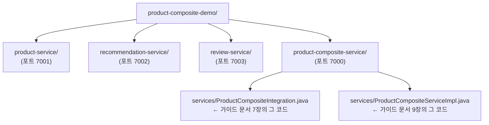
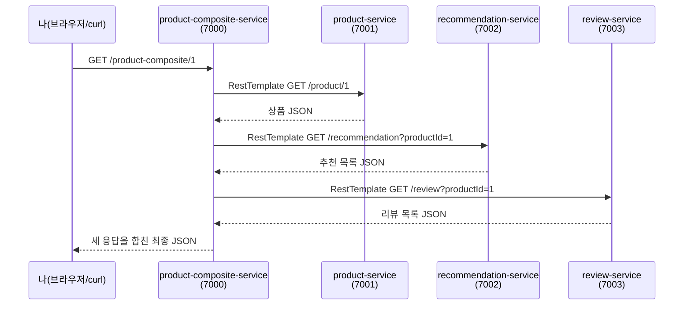
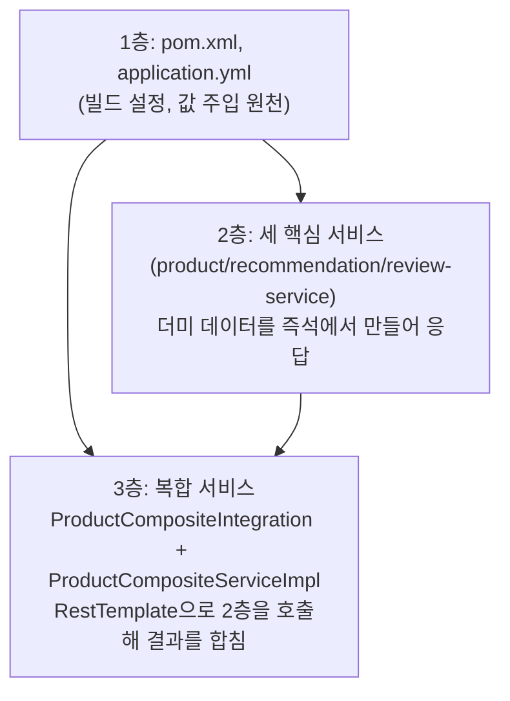

### 대상 파일: [`product-composite-demo.zip`](https://drive.google.com/file/d/1510_-ydPujXVvoNw341rFsGNWO8xHKDp/view?usp=sharing)

## 관련글

[**RestTemplate과 스프링 "주입(Injection)"**](https://k82022603.github.io/posts/resttemplate%EA%B3%BC-%EC%8A%A4%ED%94%84%EB%A7%81-%EC%A3%BC%EC%9E%85(injection)/)

---

## 0. 이 문서에 대하여

앞서 만든 두 개의 설명 문서(RestTemplate과 스프링 의존성 주입, 그리고 자바 제네릭 별첨)에서 다룬 코드를 실제로 손으로 만져볼 수 있도록, 컴파일 가능한 완전한 예제 프로젝트로 만들었습니다. `product-composite-demo.zip` 안에는 서로 독립적으로 실행되는 4개의 스프링 부트 프로젝트가 들어 있습니다.

- `product-service` (포트 7001)
- `recommendation-service` (포트 7002)
- `review-service` (포트 7003)
- `product-composite-service` (포트 7000) — 위 세 서비스를 `RestTemplate`으로 호출해 결과를 하나로 합치는, 우리가 지금까지 배운 그 코드가 들어 있는 핵심 프로젝트

**먼저 솔직하게 말씀드릴 부분이 있습니다.** 이 코드를 작성한 환경은 보안 정책상 스프링 라이브러리가 저장된 저장소(Maven Central)에 직접 접근할 수 없습니다. 그래서 실제로 스프링 부트를 실행해서 "됩니다"까지 이 환경에서 직접 확인하지는 못했습니다. 대신 다음 두 가지 방식으로 정확성을 최대한 검증했습니다.

1. 실제 스프링 프레임워크의 클래스들(`RestTemplate`, `ParameterizedTypeReference`, `@RestController`, `@Value` 등)과 메서드 시그니처가 완전히 동일한 "검증용 껍데기 클래스"를 별도로 만들어, 실제 `javac` 컴파일러로 이 프로젝트의 자바 코드 24개 파일 전체를 컴파일해 문법 오류와 타입 오류가 없음을 확인했습니다. (오류 0건)
2. 사용된 모든 API(에너테이션 형태, 메서드 이름과 인자, 반환 타입 등)는 스프링 공식 문서와 소스코드 기준으로 정확한지 다시 한 번 대조했습니다.

즉 **"자바 문법과 타입은 실제로 컴파일 검증 완료"**, **"스프링 컨테이너가 실제로 뜨고 통신까지 되는지는 사용자분 컴퓨터에서 최종 확인 필요"** 인 상태입니다. 아래 안내를 그대로 따라 하시면 거의 예외 없이 정상적으로 동작할 것입니다. 혹시 오류가 발생하면 마지막의 "문제 해결" 절을 참고해 주세요.

---

## 1. 준비물

| 항목 | 최소 버전 | 확인 방법 |
|---|---|---|
| JDK (자바 개발 키트) | 17 이상 | 터미널에 `java -version` 입력 |
| Maven | 3.6 이상 | 터미널에 `mvn -version` 입력 |
| 인터넷 연결 | 최초 빌드 시 필요 | Maven이 Maven Central에서 라이브러리를 내려받습니다 |

JDK가 없으시다면 Eclipse Temurin(구 AdoptOpenJDK)이나 오라클 공식 사이트에서 17 이상 버전을 설치하시면 됩니다. Maven이 없으시다면 `https://maven.apache.org/download.cgi`에서 내려받아 설치하시거나, macOS라면 `brew install maven`, 우분투/WSL이라면 `sudo apt install maven`으로 설치할 수 있습니다.

이 프로젝트는 스프링 부트 **3.5.16** 버전을 사용하도록 구성했습니다. 이는 2026년 6월에 배포된, 스프링 부트 3.x 계열의 마지막 정식 버전으로, 지금까지 학습하신 원본 자료(스프링 부트 3 기준 서적)와 가장 잘 맞는 버전입니다. 참고로 2026년 9월 현재 스프링 부트의 최신 계열은 4.x이지만, 원본 자료와의 연속성을 위해 이번 예제에서는 3.x 계열의 최종판을 사용했습니다.

---

## 2. 압축 풀기 및 폴더 구조 확인

`product-composite-demo.zip`의 압축을 원하는 위치에 풀면 다음과 같은 구조가 나타납니다.



각 폴더는 완전히 독립된 메이븐(Maven) 프로젝트입니다. 즉 `product-service` 폴더 하나만 떼어내도 그 자체로 빌드하고 실행할 수 있습니다. 이렇게 나눈 이유는, 원래 마이크로서비스 아키텍처 자체가 "서로 독립적으로 배포되고 실행되는 여러 개의 서비스"라는 개념이기 때문에, 그 특성을 그대로 체험하실 수 있도록 하기 위해서입니다.

---

## 3. 실행하기

터미널(또는 명령 프롬프트) 창을 4개 여시고, 각 창에서 아래 명령을 하나씩 실행합니다. 순서는 중요하지 않지만, 이해를 돕기 위해 핵심 서비스 3개를 먼저 띄우고 복합 서비스를 마지막에 띄우는 순서로 안내합니다.

**터미널 1 — 상품 서비스**
```bash
cd product-composite-demo/product-service
mvn spring-boot:run
```

**터미널 2 — 추천 서비스**
```bash
cd product-composite-demo/recommendation-service
mvn spring-boot:run
```

**터미널 3 — 리뷰 서비스**
```bash
cd product-composite-demo/review-service
mvn spring-boot:run
```

**터미널 4 — 상품 복합 서비스**
```bash
cd product-composite-demo/product-composite-service
mvn spring-boot:run
```

각 터미널에 `Started ○○Application in ×.×× seconds`와 비슷한 로그가 뜨면 정상적으로 켜진 것입니다. 처음 실행하실 때는 Maven이 필요한 라이브러리(스프링 부트 관련 jar 파일들)를 인터넷에서 내려받기 때문에 시간이 조금 걸릴 수 있습니다.

### 3-1. 동작 확인하기

네 개가 모두 정상적으로 켜졌다면, 새 터미널 창을 하나 더 열어서 다음과 같이 요청을 보내 보십시오.

```bash
curl http://localhost:7000/product-composite/1
```

(curl이 익숙하지 않으시다면 웹 브라우저 주소창에 `http://localhost:7000/product-composite/1`을 입력하셔도 됩니다.)

정상적으로 동작한다면 다음과 비슷한 JSON 응답을 받으실 수 있습니다. (실제 IP 주소 부분은 실행하시는 컴퓨터 환경에 따라 달라집니다.)

```json
{
  "productId": 1,
  "name": "상품-1",
  "weight": 101,
  "recommendations": [
    { "recommendationId": 1, "author": "김민준", "rate": 4 },
    { "recommendationId": 2, "author": "이서연", "rate": 5 },
    { "recommendationId": 3, "author": "박지호", "rate": 3 }
  ],
  "reviews": [
    { "reviewId": 1, "author": "최유진", "subject": "만족스러운 구매" },
    { "reviewId": 2, "author": "정도윤", "subject": "가격 대비 괜찮음" }
  ],
  "serviceAddresses": {
    "cmp": "127.0.0.1:7000",
    "pro": "127.0.0.1:7001",
    "rec": "127.0.0.1:7002",
    "rev": "127.0.0.1:7003"
  }
}
```

이 응답 하나가 나오기까지 실제로는 아래와 같은 통신이 순서대로 일어난 것입니다.



`productId` 부분을 1이 아닌 다른 숫자(예: `http://localhost:7000/product-composite/42`)로 바꿔서 요청해 보시면, 매번 그 숫자를 기반으로 한 더미 데이터가 만들어져 돌아오는 것도 확인하실 수 있습니다. 실제 데이터베이스는 연결되어 있지 않고, 요청받은 `productId`를 이용해 그 자리에서 즉석으로 데이터를 만들어 응답하도록 구성했기 때문입니다.

세 핵심 서비스도 각각 단독으로 호출해보실 수 있습니다.

```bash
curl http://localhost:7001/product/1
curl "http://localhost:7002/recommendation?productId=1"
curl "http://localhost:7003/review?productId=1"
```

---

## 4. 코드에서 원래 가이드 문서와 무엇이 같고, 무엇을 새로 채웠는가

이 절이 가장 중요합니다. 원본 자료(그리고 첫 번째 가이드 문서)에서 그대로 가져온 부분과, 실제로 동작하게 만들기 위해 새로 채워 넣은 부분을 명확히 구분해서 알려드리겠습니다.

### 4-1. 그대로 가져온 부분 (핵심 학습 대상)

- `product-composite-service/.../services/ProductCompositeIntegration.java`
- `product-composite-service/.../services/ProductCompositeServiceImpl.java`

이 두 파일은 첫 번째 가이드 문서에서 한 줄씩 해설했던 코드와 (패키지 선언 등 형식적인 부분을 제외하면) 동일합니다. 생성자를 통해 `RestTemplate`, `ObjectMapper`, 그리고 `@Value`로 표시된 6개의 설정값을 주입받는 구조, `getForObject()`와 `exchange()` + `ParameterizedTypeReference`를 구분해서 쓰는 구조가 그대로 담겨 있습니다.

### 4-2. 새로 채워 넣은 부분 (동작을 위해 반드시 필요했던 것들)

원본 자료는 "이 부분의 개념을 설명하는 것"이 목적이었기 때문에, 실제로 실행하려면 반드시 있어야 하지만 지면에는 나오지 않았던 부분들이 있었습니다. 이번 예제를 만들면서 다음을 직접 채워 넣었습니다.

| 채워 넣은 것 | 이유 |
|---|---|
| `Product`, `Recommendation`, `Review` DTO 클래스의 전체 필드/생성자/getter | 원본에는 이 클래스들이 사용되는 모습만 나오고 정의 자체는 나오지 않았습니다 |
| `ProductAggregate`, `RecommendationSummary`, `ReviewSummary`, `ServiceAddresses` | 최종 응답의 모양을 정의하는 클래스들로, 역시 정의가 지면에 없었습니다 |
| `createProductAggregate()`의 실제 구현 | 원본 자료에서 "구현이 길어서 생략했다"고 명시적으로 밝힌 부분이라, 실제로 동작하도록 직접 작성했습니다 |
| `ServiceUtil` 클래스의 실제 구현 | 원본에서는 이미 만들어져 있다고 가정하고 사용만 하는 클래스였습니다 |
| `product-service`, `recommendation-service`, `review-service` 세 핵심 서비스 전체 | 원본 자료의 이 부분은 "복합 서비스가 핵심 서비스들을 호출한다"는 개념만 다루고 있어, 호출당하는 쪽인 세 핵심 서비스는 이번에 새로 만들었습니다. 실제 데이터베이스 없이, 요청받은 productId를 기반으로 즉석에서 더미 데이터를 생성해 돌려주도록 최대한 단순하게 만들었습니다 |
| `RestTemplate` 빈을 등록하는 `@Bean` 메서드 | `RestTemplate`이 스프링 컨테이너의 빈으로 존재해야 `ProductCompositeIntegration`의 생성자가 이를 주입받을 수 있는데, 이 등록 부분 역시 원본 지면에는 나오지 않았습니다 |
| 4개의 `application.yml` 설정 파일 | `@Value`가 읽어올 실제 host/port 값들을 지정하는 곳입니다 |
| 4개의 `pom.xml` (메이븐 빌드 설정 파일) | 어떤 라이브러리를 사용할지, 어떻게 빌드할지를 정의합니다 |

---

## 5. 파일 하나씩 짧게 안내

### `pom.xml` — 이 프로젝트가 필요로 하는 재료 목록

```xml
<parent>
    <groupId>org.springframework.boot</groupId>
    <artifactId>spring-boot-starter-parent</artifactId>
    <version>3.5.16</version>
</parent>

<dependencies>
    <dependency>
        <groupId>org.springframework.boot</groupId>
        <artifactId>spring-boot-starter-web</artifactId>
    </dependency>
</dependencies>
```

`spring-boot-starter-web` 하나만 추가해도 내장 톰캣(웹 서버), `@RestController`, `RestTemplate`, Jackson(JSON 변환기)까지 필요한 것들이 한꺼번에 딸려 옵니다. 스프링 부트의 "스타터(starter)"라는 개념이 바로 이렇게 관련 라이브러리들을 묶음으로 미리 구성해둔 것입니다.

### `application.yml` — 값으로 주입될 설정

`product-composite-service`의 `application.yml`을 보시면 다음과 같이 되어 있습니다.

```yaml
server:
  port: 7000

app:
  product-service:
    host: localhost
    port: 7001
  recommendation-service:
    host: localhost
    port: 7002
  review-service:
    host: localhost
    port: 7003
```

이 값들이 정확히 `ProductCompositeIntegration` 생성자의 `@Value("${app.product-service.host}")` 같은 자리로 흘러 들어갑니다. 만약 세 핵심 서비스를 다른 컴퓨터(다른 서버)에서 띄우고 싶다면, 코드는 단 한 줄도 건드리지 않고 이 설정 파일의 `host` 값만 그 서버의 실제 주소로 바꾸면 됩니다. 이것이 호스트/포트 정보를 코드에 직접 적지 않고 "주입"받는 방식을 쓰는 실질적인 이유입니다.

### 각 핵심 서비스의 `Controller` — 더미 데이터를 만들어 응답

예를 들어 `ProductController`는 다음과 같이 되어 있습니다.

```java
public Product getProduct(@PathVariable int productId) {
    return new Product(
        productId,
        "상품-" + productId,
        100 + productId,
        serviceUtil.getServiceAddress()
    );
}
```

실제 데이터베이스 조회 없이, 요청받은 `productId`를 그대로 활용해 이름과 무게를 규칙적으로 만들어냅니다(예: productId가 1이면 이름은 "상품-1", 무게는 101). 이렇게 하면 데이터베이스 설치나 연결 같은 복잡한 준비 과정 없이도, 여러 서비스 간의 통신 구조 자체에만 집중해서 학습하실 수 있습니다.

---

## 6. 직접 실험해보면 좋은 것들

이해를 더 단단히 하고 싶으시다면 다음을 직접 해보시길 권합니다.

1. **`recommendation-service`를 끄고 다시 `curl` 요청해보기.** `ProductCompositeIntegration.getRecommendations()`에서 연결 오류가 발생하면서 `product-composite-service`도 함께 오류를 응답하는 것을 확인하실 수 있습니다. 이는 마이크로서비스 아키텍처의 대표적인 약점(하나가 죽으면 그것에 의존하는 다른 서비스도 영향을 받는 문제)을 직접 체험해보는 좋은 실습입니다. (참고로 원본 자료의 다음 절이 "오류를 어떻게 처리하는지"를 다루는 이유가 바로 이것입니다.)
2. **`application.yml`의 `recommendation-service.port` 값을 일부러 틀린 숫자(예: 9999)로 바꾸고 재시작해보기.** `@Value`로 주입되는 설정값 하나가 전체 URL 조립에 어떻게 영향을 미치는지 체감하실 수 있습니다.
3. **`ProductCompositeIntegration` 생성자에 새 매개변수를 하나 추가해보기.** 예를 들어 `@Value("${app.dummy}") String dummy`를 추가하고 `application.yml`에 `app.dummy: hello`를 넣어보면, "생성자 매개변수 하나 = 주입받는 대상 하나"라는 감각을 직접 느끼실 수 있습니다.
4. **`ProductController`에서 `serviceUtil` 주입을 없애고 직접 `new ServiceUtil(...)`으로 바꿔보기.** 컴파일은 되지만(`ServiceUtil` 생성자가 `@Value`로 `server.port`를 받는 구조라 직접 `new`로 만들려면 포트 값을 문자열로 직접 넣어줘야 합니다), 이 과정에서 "아, 이래서 직접 만들지 않고 주입을 받는 게 더 편하고 안전하구나"를 체감하실 수 있습니다.

---

## 7. 문제 해결 (Troubleshooting)

| 증상 | 원인 후보 | 해결 방법 |
|---|---|---|
| `mvn: command not found` | Maven 미설치 | 1절의 안내대로 Maven 설치 |
| 빌드 중 `Could not resolve dependencies` | 인터넷 연결 문제, 방화벽/프록시 | 인터넷 연결 확인, 회사·학교 네트워크라면 프록시 설정 확인 |
| `Port already in use` | 이미 같은 포트를 쓰는 프로그램이 실행 중 | 각 서비스의 `application.yml`에서 포트 번호를 다른 값으로 변경(모든 관련 위치를 함께 변경해야 합니다) |
| `product-composite-service` 호출 시 500 오류 | 세 핵심 서비스 중 하나 이상이 아직 안 켜져 있거나 꺼짐 | 4개 터미널 모두 정상적으로 "Started" 로그가 떴는지 확인 |
| `Connection refused` | 위와 동일하거나, 방화벽이 localhost 통신을 막음 | 핵심 서비스가 실제로 떠 있는지, 포트 번호가 `application.yml`과 일치하는지 확인 |
| Java 버전 오류(`release version 17 not supported`) | JDK가 17 미만 | JDK 17 이상 설치 후 `JAVA_HOME` 환경변수 재설정 |

---

## 8. 요약

이번에 받으신 예제는 다음 세 층위로 이루어져 있습니다.



원본 가이드 문서에서 개념으로만 이해하셨던 "생성자 주입", "`@Value`를 통한 설정값 주입", "`RestTemplate`의 `getForObject()`와 `exchange()`의 차이", "`ParameterizedTypeReference`를 통한 제네릭 타입 유지"가 이 예제 안에서 실제로 살아 움직이는 코드로 동작합니다. 직접 실행해보시고, 응답이 잘 오는 것을 눈으로 확인하신 뒤 5절과 6절의 코드를 다시 한번 천천히 읽어보시면 개념이 훨씬 더 선명하게 자리 잡으실 것입니다.

---

*이 가이드 문서와 함께 제공되는 `product-composite-demo.zip`의 자바 소스코드는 실제 스프링 프레임워크 API와 동일한 시그니처를 가진 검증용 클래스를 통해 `javac`로 문법·타입 오류가 없음을 확인했습니다. 다만 스프링 부트 애플리케이션의 실제 구동과 네트워크 통신까지는 Maven Central 접근이 제한된 이 작업 환경의 특성상 최종 실행 확인을 사용자 환경에서 진행해주셔야 합니다.*
