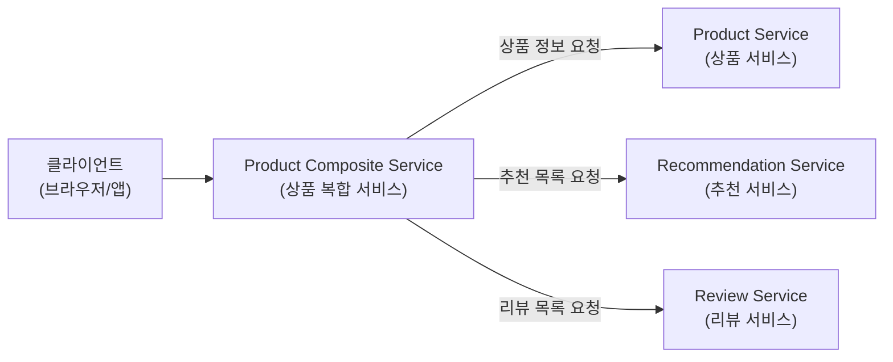
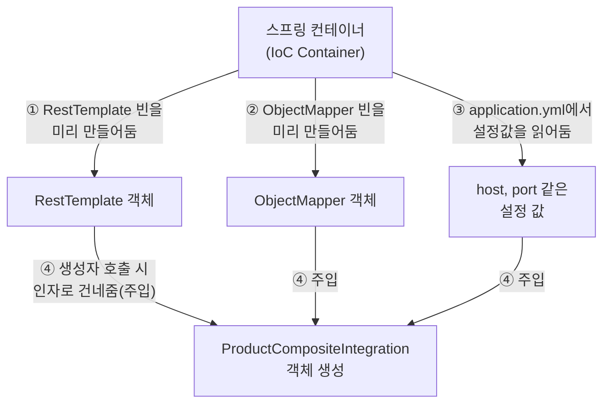
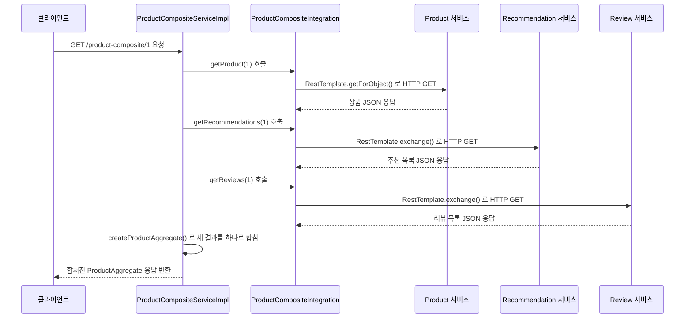
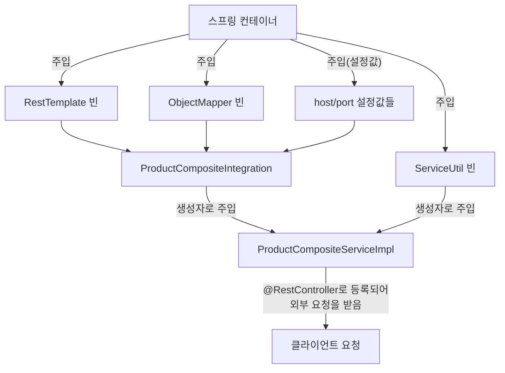
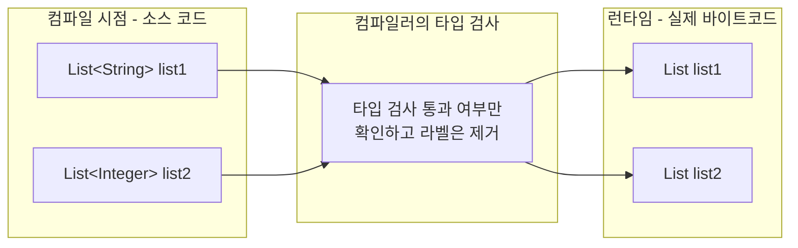

### — "객체와 구성 값은 생성자에 주입된다"는 말이 대체 무슨 뜻인가

---

## 0. 이 문서에 대하여

보내주신 자료는 페이지 하단 문구("스프링 부트 3와 스프링 클라우드를 활용한 마이크로서비스 구축")와 코드의 패키지 이름(`se.magnus.microservices.composite.product.services`)으로 미루어 볼 때, 매그너스 라슨(Magnus Larsson)이 쓴 원서 *Microservices with Spring Boot and Spring Cloud*의 한국어판(위키북스) 3장 "협력하는 마이크로서비스 만들기" 중 일부로 보입니다. 정확히는 상품(Product) 하나에 대해 추천 정보(Recommendation)와 리뷰(Review)까지 한 번에 모아주는 **복합 마이크로서비스(Composite Microservice)** 를 만드는 부분입니다.

이 문서에서는 다음 세 가지를 순서대로, 최대한 쉬운 말로 풀어서 설명합니다.

1. `RestTemplate`이 정확히 무엇이고, 지금(2026년) 시점에서도 써도 되는 물건인지
2. 스프링의 "리액티브(Reactive)"가 무엇이고 왜 지금 당장은 몰라도 되는지
3. 가장 많이 헷갈려 하시는 **"의존성 주입(Dependency Injection)"** 개념 — 특히 "생성자에 주입된다"는 문장의 진짜 의미

기술적인 사실 확인이 필요한 부분(스프링 프레임워크의 최신 버전 정책 등)은 2026년 9월 기준으로 스프링 공식 블로그와 공식 문서를 직접 검색하여 확인한 내용만 담았습니다. 추측이나 짐작으로 채운 부분은 없습니다.

---

## 1. 큰 그림 먼저 보기 — 이 코드는 왜 존재하는가

낱개의 코드를 보기 전에, 이 코드가 전체 시스템에서 어떤 역할을 하는지부터 이해하면 훨씬 쉽습니다.

이 예제 프로젝트는 온라인 쇼핑몰의 "상품 상세 페이지"를 상상하면 됩니다. 상품 상세 페이지에는 세 가지 정보가 동시에 필요합니다.

- 상품 기본 정보 (이름, 가격 등) → **Product 서비스**가 담당
- 이 상품과 관련된 추천 상품 목록 → **Recommendation 서비스**가 담당
- 이 상품에 달린 리뷰 목록 → **Review 서비스**가 담당

이 세 서비스는 각각 독립적으로 실행되는 별개의 마이크로서비스입니다. 그런데 화면 하나를 그리려면 세 곳에 있는 정보를 다 모아야 하죠. 그래서 이 세 서비스를 대신 호출해서 결과를 하나로 합쳐주는 **네 번째 서비스**가 필요한데, 그것이 바로 **Product Composite Service(상품 복합 서비스)** 입니다. "Composite"는 "합성된, 여러 개를 합친"이라는 뜻입니다.



지금 살펴보고 있는 `ProductCompositeIntegration` 클래스는, 바로 이 "복합 서비스"가 나머지 세 서비스에 실제로 네트워크 요청을 보내는 역할을 전담하는 부품입니다. 쉽게 말해 **전화 교환수** 같은 존재입니다. 복합 서비스가 "상품 정보 좀 가져다줘"라고 말하면, 이 클래스가 실제로 Product 서비스에 전화(HTTP 요청)를 걸어서 정보를 받아옵니다.

---

## 2. RestTemplate이란 무엇인가

`RestTemplate`은 스프링 프레임워크가 제공하는 **HTTP 클라이언트**입니다. 즉, 다른 서버에 있는 REST API를 "호출"할 때 쓰는 도구입니다. 우리가 흔히 브라우저 주소창에 URL을 입력하면 웹페이지를 받아오듯, `RestTemplate`은 자바 코드 안에서 다른 서버의 API 주소로 요청을 보내고 응답(JSON 등)을 받아오는 일을 합니다.

이 예제에서 `RestTemplate`이 하는 일을 정리하면 다음과 같습니다.

- Product 서비스에 GET 요청을 보내서 상품 정보를 받아온다
- Recommendation 서비스에 GET 요청을 보내서 추천 목록을 받아온다
- Review 서비스에 GET 요청을 보내서 리뷰 목록을 받아온다

### RestTemplate은 지금(2026년)도 써도 되는가?

이 부분은 실제로 최근 스프링 진영에서 큰 변화가 있었던 주제라, 최신 정보를 정리해서 알려드립니다.

- `RestTemplate`은 스프링 5.0 이후 줄곧 **"유지보수 모드(maintenance mode)"** 상태였습니다. 이는 완전히 없어지는 것은 아니지만 새로운 기능은 더 이상 추가되지 않는다는 뜻입니다.
- 2025년 11월에 나온 **스프링 프레임워크 7.0**부터는 공식 참조 문서에서 `RestTemplate`을 "지원 종료 예정(deprecated)"으로 명시하기 시작했습니다.
- 스프링 팀은 **스프링 프레임워크 7.1(2026년 11월 예정)** 에서 `RestTemplate`에 정식으로 `@Deprecated` 표시를 붙이고, 이후 나올 **스프링 프레임워크 8.0**에서 완전히 제거할 계획이라고 공식 블로그를 통해 밝혔습니다.
- 다만 스프링 팀은 이 릴리스 속도를 감안하면 **최소 2029년까지는 RestTemplate에 대한 오픈소스 지원이 유지될 것**이라고도 함께 밝혔습니다.
- 참고로 이 문서를 작성하는 2026년 9월 현재 스프링 프레임워크의 최신 정식 버전은 **7.0.5(2026년 2월 배포)** 입니다.

즉, 정리하면 이렇습니다.

| 구분 | 상태 |
|---|---|
| 지금 당장 코드가 안 돌아가나? | 아니요, 여전히 정상 동작합니다 |
| 새 프로젝트에 새로 써도 되나? | 스프링 팀은 권장하지 않습니다 |
| 완전히 사라지는 시점 | 스프링 프레임워크 8.0 (구체적 시기는 미정) |
| 최소 지원 보장 시점 | 2029년경까지 |

이 책의 예제는 학습용으로 `RestTemplate`을 사용하고 있고, 코드 안의 주석에서도 "이번 장에서는 스프링의 리액티브 개발을 배우기 전까지는 `RestTemplate`을 계속 사용하겠다"고 스스로 밝히고 있습니다. 즉 저자도 `RestTemplate`이 최종 목적지가 아니라 **학습 편의를 위한 임시 도구**라는 점을 분명히 하고 있는 셈입니다.

### 그럼 지금 새로 시작한다면 무엇을 써야 하나

현재(2026년) 시점에서 스프링이 제공하는 HTTP 클라이언트는 세 가지입니다.

| 클라이언트 | 등장 시기 | 특징 | 지금의 권장 여부 |
|---|---|---|---|
| **RestTemplate** | 스프링 3.0 (2009년) | 동기(blocking) 방식, 오래된 템플릿 메서드 스타일 API | 지원 종료 예정, 신규 사용 비권장 |
| **WebClient** | 스프링 5.0 (2017년) | 비동기·논블로킹(reactive) 방식, 대량 동시 요청에 유리 | 리액티브 스택을 쓸 때 권장 |
| **RestClient** | 스프링 프레임워크 6.1 / 스프링 부트 3.2 (2023년) | 동기 방식이지만 `WebClient`처럼 세련된 플루언트(fluent) API 제공 | **동기 방식 신규 개발 시 가장 권장** |

`RestClient`는 `RestTemplate`의 실질적인 후계자로 보시면 됩니다. `WebClient`처럼 메서드를 연결해서 쓰는 현대적인 문법을 갖췄으면서도, 리액티브 스트림 개념을 몰라도 되고 `.block()` 같은 별도 처리 없이 그냥 동기 방식으로 값을 바로 받아올 수 있습니다. 다만 이 책이 쓰여진 시점 기준으로는 `RestClient`가 아직 언급되지 않고 `RestTemplate`과 `WebClient` 두 가지만 대비되어 설명되고 있는데, 이는 책이 `RestClient`가 아직 대중화되기 전 시점의 스프링 부트 버전을 기준으로 집필되었기 때문으로 보입니다. 학습 자체는 문제없이 진행하시되, 실무에 적용하실 때는 `RestClient`도 함께 알아두시길 권합니다.

---

## 3. 스프링의 "리액티브(Reactive)"란 간단히 무엇인가

책에서 잠깐 언급된 `WebClient`와 리액티브 프로그래밍은 지금 단계에서는 깊이 이해하실 필요가 없습니다. 개념만 아주 간단히 짚고 넘어가겠습니다.

- **RestTemplate 방식(동기/블로킹)**: 식당에서 주문을 하면, 음식이 나올 때까지 종업원이 주방 앞에 가만히 서서 기다립니다. 그 종업원은 그 시간 동안 다른 손님 주문을 받을 수 없습니다.
- **WebClient 방식(비동기/논블로킹, 리액티브)**: 종업원이 주문만 넣어두고 바로 다른 테이블로 이동해 다른 손님을 응대합니다. 음식이 준비되면 그때 알림을 받아서 가져다줍니다.

동시에 처리해야 할 요청이 아주 많을 때는 후자가 훨씬 효율적입니다. 하지만 코드가 더 복잡해지는 대가가 따릅니다. 이 책은 이런 이유로 리액티브 개념은 뒤쪽 장(7장)으로 미뤄두고, 우선은 이해하기 쉬운 `RestTemplate` 방식으로 마이크로서비스 간 통신의 기본 구조부터 익히도록 구성한 것입니다. 순서가 합리적이니 지금은 신경 쓰지 않으셔도 됩니다.

---

## 4. 가장 핵심: 스프링의 "의존성 주입(Dependency Injection, DI)"이란 무엇인가

이제 질문하신 핵심 부분입니다. "객체와 구성 값이 생성자에 주입된다"는 문장이 왜 어렵게 느껴지는지 먼저 말씀드리면, "주입(injection)"이라는 단어 자체가 일상에서 잘 안 쓰는 낯선 번역 투 단어이기 때문입니다. 이 개념은 사실 한 문장으로 요약될 만큼 단순합니다.

> **"어떤 객체가 자기한테 필요한 다른 객체(도구)를, 자기가 직접 만들지 않고 외부에서 이미 만들어진 것을 건네받아 쓴다."**

이것이 의존성 주입의 전부입니다. 아래에서 왜 이렇게 하는지, 그리고 "생성자에 주입"이 정확히 어떤 동작인지 단계적으로 풀어보겠습니다.

### 4-1. 비유로 먼저 이해하기

카페를 하나 차린다고 상상해봅시다.

**주입을 쓰지 않는 방식 (직접 만들기)**

카페 주인이 커피를 내리기 위해, 원두 농장을 직접 차리고, 원두를 직접 재배하고, 로스팅 기계도 직접 만듭니다. 카페(객체) 안에서 필요한 모든 것을 카페 스스로 만들어내는 것입니다.

```java
class Cafe {
    private CoffeeBean bean = new CoffeeBean(); // 카페가 원두를 직접 재배(생성)함

    public Coffee makeCoffee() {
        return brew(bean);
    }
}
```

이 방식의 문제는 무엇일까요?

- 원두 공급처를 바꾸고 싶으면 `Cafe` 클래스의 코드 자체를 뜯어고쳐야 합니다.
- 테스트를 위해 가짜(mock) 원두로 바꿔서 실험해보고 싶어도 그럴 방법이 없습니다.
- `Cafe` 클래스는 "커피를 만드는 일"만 신경 써야 하는데, "원두를 재배하는 일"까지 떠맡고 있어 책임이 너무 많아집니다.

**주입을 쓰는 방식 (배달받기)**

반대로, 카페 주인은 원두를 직접 재배하지 않고 원두 공급업체에서 이미 만들어진 원두를 배달받아서 사용합니다. 카페를 열 때(카페가 만들어질 때) "이 원두를 쓰세요"라고 건네받는 것입니다.

```java
class Cafe {
    private final CoffeeBean bean;

    // 카페를 새로 열 때(생성자 호출 시) 원두를 외부에서 건네받는다
    public Cafe(CoffeeBean bean) {
        this.bean = bean;
    }

    public Coffee makeCoffee() {
        return brew(bean);
    }
}
```

이제 `Cafe`는 원두를 어떻게 재배하는지 전혀 몰라도 됩니다. 그냥 "누군가 나에게 원두를 가져다줄 것"이라는 사실만 믿고, 커피를 내리는 자기 본연의 일에만 집중하면 됩니다. 원두 공급처를 브라질산에서 콜롬비아산으로 바꾸고 싶으면, `Cafe` 클래스는 손대지 않고 배달해주는 원두만 바꾸면 됩니다. 테스트할 때도 가짜 원두를 넣어서 손쉽게 실험할 수 있습니다.

**이 "배달받는 행위"가 바로 "주입(Injection)"입니다.** 그리고 "카페 문을 여는 시점(생성자가 호출되는 시점)에 원두를 건네받는다"가 바로 "생성자 주입(Constructor Injection)"입니다.

### 4-2. 스프링에서는 누가 "배달"을 해주는가

카페 비유에서 "원두 공급업체" 역할을 스프링에서는 **스프링 컨테이너(정확히는 IoC 컨테이너, Inversion of Control 컨테이너)** 가 맡습니다. 애플리케이션이 켜지는 시점에, 스프링은 필요한 객체들(이를 "빈(Bean)"이라고 부릅니다)을 미리 만들어 자기 창고에 보관해 둡니다. 그리고 다른 객체가 그 빈을 필요로 하면, 스프링이 알아서 창고에서 꺼내어 건네줍니다.

"내가 필요한 걸 내가 만들지 않고, 컨테이너가 대신 만들어서 나에게 가져다준다"는 이 흐름을 어렵게 표현한 것이 **제어의 역전(Inversion of Control, IoC)** 입니다. 원래는 객체 스스로가 자기 부품을 만드는 "제어권"을 가지고 있었는데, 그 제어권이 외부(스프링 컨테이너)로 뒤집혀서(역전되어) 넘어갔다는 뜻입니다. 그리고 그 뒤집힌 제어권을 실제로 행사해서 객체에게 부품을 건네주는 구체적인 동작이 바로 "의존성 주입"입니다.



정리하면, `ProductCompositeIntegration` 클래스는 자기가 쓸 `RestTemplate`이나 `ObjectMapper`를 스스로 `new RestTemplate()`처럼 직접 만들지 않습니다. 대신 "나는 이런 것들이 필요해요"라고 생성자를 통해 선언만 해두면, 스프링 컨테이너가 이미 만들어둔 것을 찾아서 알아서 건네줍니다. 이것이 "객체와 구성 값이 생성자에 주입된다"는 문장의 실제 의미입니다.

### 4-3. 왜 굳이 이렇게 번거롭게 하는가

직접 만드는 게 더 간단해 보이는데, 왜 스프링은 이렇게 복잡한 방식을 택했을까요? 크게 세 가지 이유가 있습니다.

1. **느슨한 결합(Loose Coupling)**: 클래스가 특정 구현체에 딱 붙어있지 않고, "이런 기능을 하는 무언가"에만 의존하게 됩니다. 나중에 구현을 바꿔도 이 클래스는 고칠 필요가 없습니다.
2. **테스트 용이성**: 실제 `RestTemplate` 대신 가짜(mock) 객체를 만들어서 생성자에 넣어주면, 실제 네트워크 통신 없이도 이 클래스의 로직만 따로 테스트할 수 있습니다.
3. **책임 분리**: 클래스는 "내가 할 일"에만 집중하고, "내가 쓸 도구를 어떻게 준비할지"는 신경 쓰지 않아도 됩니다.

### 4-4. 주입에는 세 가지 방식이 있다

스프링에서 의존성을 주입받는 방법은 세 가지가 있습니다.

| 방식 | 코드 예시 위치 | 특징 |
|---|---|---|
| **생성자 주입 (Constructor Injection)** | 생성자의 매개변수 | 스프링 공식 문서가 가장 권장하는 방식 |
| **세터 주입 (Setter Injection)** | `setXxx()` 메서드 | 선택적인(필수는 아닌) 의존성에 주로 사용 |
| **필드 주입 (Field Injection)** | 필드에 `@Autowired`를 바로 붙임 | 코드가 짧아 편하지만 비권장 |

지금 보고 계신 예제 코드는 세 가지 중 **생성자 주입** 방식을 쓰고 있습니다.

### 4-5. 왜 스프링은 "생성자 주입"을 가장 추천하는가

이 부분은 스프링 공식 문서(docs.spring.io)에서도 명시적으로 밝히고 있는 내용입니다. 스프링 팀은 일반적으로 생성자 주입을 지지하는데, 그 이유는 다음과 같습니다.

- **불변성(Immutability) 확보**: 생성자 주입을 쓰면 필드를 `final`로 선언할 수 있습니다. `final` 필드는 한 번 값이 채워지면 이후에는 절대 바뀔 수 없으므로, 코드가 훨씬 안전해집니다. (실제로 보여주신 코드에서도 `private final RestTemplate restTemplate;`처럼 `final` 키워드가 붙어 있는 것을 확인하실 수 있습니다.)
- **필수 의존성 보장**: 생성자를 통하지 않고는 아예 객체를 만들 수조차 없기 때문에, 꼭 필요한 부품이 빠진 채로 객체가 반쪽짜리로 생성되는 일이 원천적으로 불가능합니다. 즉 `null` 값으로 인한 오류를 예방합니다.
- **완전히 초기화된 상태 보장**: 생성자를 통해 만들어진 객체는 만들어지는 순간 이미 필요한 모든 부품을 갖춘 "완성된 상태"로 다른 코드에 전달됩니다.
- **테스트 편의성**: 스프링 컨테이너 없이 순수 자바 코드로도 `new ProductCompositeIntegration(가짜객체1, 가짜객체2, ...)`처럼 직접 생성해서 테스트할 수 있습니다.

참고로 스프링 4.3 버전부터는, 생성자가 딱 하나뿐인 클래스라면 `@Autowired` 애너테이션을 생성자 위에 따로 붙이지 않아도 스프링이 알아서 그 생성자를 통해 자동으로 주입해줍니다. 지금 보신 코드에 `@Autowired`가 안 보이는 것도 이 때문일 가능성이 높습니다(생성자가 하나뿐이므로 생략된 것입니다).

---

## 5. "@Value"는 또 다른 종류의 주입 — 설정 값 주입

코드를 보면 생성자 매개변수 위에 `@Value("${app.product-service.host}")` 같은 것이 붙어 있습니다. 이것도 "주입"의 한 종류이지만, 앞서 설명한 `RestTemplate`이나 `ObjectMapper`를 주입받는 것과는 성격이 조금 다릅니다.

| 구분 | 무엇을 주입받나 | 예시 |
|---|---|---|
| **객체(빈) 주입** | 스프링이 미리 만들어둔 완성된 객체 | `RestTemplate restTemplate`, `ObjectMapper mapper` |
| **값(Value) 주입** | 설정 파일(`application.yml` 등)에 적혀 있는 단순한 문자열이나 숫자 값 | `String productServiceHost`, `int productServicePort` |

즉 `@Value("${app.product-service.host}")`는 "`application.yml` 파일 안에서 `app.product-service.host`라는 키로 저장된 값을 찾아서, 그 값을 이 매개변수에 넣어줘"라는 뜻입니다. 예를 들어 설정 파일에 다음과 같이 적혀 있다고 가정해봅시다.

```yaml
app:
  product-service:
    host: localhost
    port: 7001
```

이 경우 `productServiceHost`에는 문자열 `"localhost"`가, `productServicePort`에는 정수 `7001`이 자동으로 채워집니다. `${...}` 표기는 "이 위치에 이 설정값을 끼워 넣어라"는 자리표시자(placeholder) 문법입니다.

이렇게 호스트 주소와 포트 번호를 코드에 직접 하드코딩하지 않고 설정 파일에서 읽어오게 만들면, 개발 환경에서는 `localhost:7001`을, 운영 서버에서는 실제 서버 주소를 쓰는 식으로 **코드 수정 없이 환경만 바꿔서 배포**할 수 있습니다. 이것이 설정 값을 하드코딩하지 않고 주입받는 방식을 쓰는 이유입니다.

---

## 6. ObjectMapper는 무엇인가

한 가지 더 짚고 넘어갈 것이 `ObjectMapper`입니다. 이는 스프링이 내부적으로 사용하는 **Jackson**이라는 라이브러리의 클래스로, **JSON 문자열과 자바 객체를 서로 변환**해주는 역할을 합니다.

- 자바 객체 → JSON 문자열로 바꾸는 것을 "직렬화(Serialization)"라고 합니다.
- JSON 문자열 → 자바 객체로 바꾸는 것을 "역직렬화(Deserialization)"라고 합니다.

이 예제에서는 다른 서비스(Product, Recommendation, Review)를 호출했을 때 **오류가 발생하면 그 오류 메시지가 JSON 형태로 돌아오는데, 그 JSON을 자바 객체로 해석하기 위해** `ObjectMapper`를 함께 주입받아 두는 것입니다(오류 처리 로직은 이 문서가 다루는 페이지 이후에 이어지는 내용으로 보입니다).

---

## 7. 코드 한 줄씩 완전히 뜯어보기 — `ProductCompositeIntegration`

이제 앞서 설명한 개념들을 실제 코드에 그대로 대입해서, 한 줄씩 그 의미를 확인해보겠습니다.

### 7-1. 필드 선언부

```java
private final RestTemplate restTemplate;
private final ObjectMapper mapper;

private final String productServiceUrl;
private final String recommendationServiceUrl;
private final String reviewServiceUrl;
```

이 클래스가 앞으로 사용할 부품들을 미리 "선언"해두는 부분입니다. 모두 `final`로 선언되어 있는데, 이는 앞서 설명한 대로 "생성자에서 딱 한 번 값이 채워지면 이후에는 절대 바뀌지 않는다"는 뜻입니다. 이렇게 하면 이 클래스를 사용하는 다른 개발자가 실수로 중간에 `restTemplate`을 다른 값으로 바꿔치기하는 사고를 원천 차단할 수 있습니다.

### 7-2. 생성자 선언부 (매개변수)

```java
public ProductCompositeIntegration(
    RestTemplate restTemplate,
    ObjectMapper mapper,

    @Value("${app.product-service.host}")
    String productServiceHost,

    @Value("${app.product-service.port}")
    int productServicePort,

    @Value("${app.recommendation-service.host}")
    String recommendationServiceHost,

    @Value("${app.recommendation-service.port}")
    int recommendationServicePort,

    @Value("${app.review-service.host}")
    String reviewServiceHost,

    @Value("${app.review-service.port}")
    int reviewServicePort
)
```

생성자 하나에 총 8개의 매개변수가 있습니다. 앞의 2개(`restTemplate`, `mapper`)는 스프링이 이미 만들어둔 **객체를 통째로** 건네받는 것이고, 뒤의 6개(`...Host`, `...Port`)는 `@Value`를 통해 설정 파일에서 읽은 **문자열/숫자 값**을 건네받는 것입니다. 이 매개변수 목록 전체가 "이 클래스가 정상적으로 동작하기 위해 반드시 필요로 하는 것들의 목록"이라고 보시면 됩니다.

이 생성자가 정의되어 있다는 사실 자체가 스프링에게 이렇게 말하는 것과 같습니다.

> "나(`ProductCompositeIntegration`)를 만들려면 `RestTemplate` 하나, `ObjectMapper` 하나, 그리고 이런저런 이름의 설정값 6개가 필요해. 이걸 다 준비해서 나에게 줘야만 나를 만들 수 있어."

그러면 스프링 컨테이너는 애플리케이션이 시작될 때 이 요구사항을 보고, 자신이 미리 준비해 둔 `RestTemplate` 빈과 `ObjectMapper` 빈을 찾고, `application.yml`에서 해당 설정값들을 읽어서, 이 생성자를 호출하며 순서대로 건네줍니다.

### 7-3. 생성자 본문

```java
{
    this.restTemplate = restTemplate;
    this.mapper = mapper;

    productServiceUrl = "http://" + productServiceHost + ":" +
        productServicePort + "/product/";
    recommendationServiceUrl = "http://" + recommendationServiceHost + ":" +
        recommendationServicePort + "/recommendation?productId=";
    reviewServiceUrl = "http://" + reviewServiceHost + ":" +
        reviewServicePort + "/review?productId=";
}
```

생성자 본문에서 하는 일은 두 가지입니다.

1. 매개변수로 건네받은 `restTemplate`과 `mapper`를 그대로 `this.restTemplate`, `this.mapper`라는 이 객체 자신의 필드에 저장합니다. (매개변수 이름과 필드 이름이 같아서 `this.`를 붙여 구분하고 있습니다.)
2. 건네받은 호스트 주소와 포트 번호 문자열을 조립해서, 각 서비스에 요청을 보낼 때 사용할 **완전한 URL 문자열**을 미리 만들어 둡니다. 예를 들어 호스트가 `localhost`, 포트가 `7001`이라면 `productServiceUrl`은 `"http://localhost:7001/product/"`가 됩니다.

이렇게 생성자가 끝나는 순간, `ProductCompositeIntegration` 객체는 이미 필요한 모든 부품과 정보를 완벽히 갖춘 상태가 됩니다. 그 이후로는 이 객체를 쓰는 다른 코드가 별도의 "초기화" 절차를 신경 쓸 필요 없이 바로 사용하면 됩니다. 이것이 바로 스프링이 생성자 주입을 권장하는 핵심 이유인 "완전히 초기화된 상태 보장"이 실제로 코드에 구현된 모습입니다.

---

## 8. `getProduct()`, `getRecommendations()`, `getReviews()` 메서드 해설

이 세 메서드가 실제로 세 개의 핵심 서비스를 호출하는 부분입니다. 이 셋을 비교해보면 `RestTemplate`을 사용하는 두 가지 서로 다른 방식을 볼 수 있습니다.

### 8-1. `getProduct()` — 단순한 방식 (`getForObject`)

```java
public Product getProduct(int productId) {
    String url = productServiceUrl + productId;
    Product product = restTemplate.getForObject(url, Product.class);
    return product;
}
```

- `productServiceUrl + productId`로 최종 요청 URL을 완성합니다. (예: `http://localhost:7001/product/1`)
- `restTemplate.getForObject(url, Product.class)`는 "이 URL에 GET 요청을 보내고, 돌아온 JSON 응답을 `Product`라는 클래스 형태로 변환(매핑)해서 돌려줘"라는 뜻입니다.
- 응답이 단일 객체(상품 하나)이기 때문에 이 간단한 메서드로 충분합니다.

### 8-2. `getRecommendations()`와 `getReviews()` — 왜 더 복잡한 방식(`exchange`)을 쓰는가

```java
public List<Recommendation> getRecommendations(int productId) {
    String url = recommendationServiceUrl + productId;
    List<Recommendation> recommendations =
        restTemplate.exchange(url, GET, null,
            new ParameterizedTypeReference<List<Recommendation>>() {}).getBody();
    return recommendations;
}
```

여기서는 응답이 단일 객체가 아니라 **리스트(목록)** 입니다. 그런데 자바에는 "제네릭 타입 소거(Generic Type Erasure)"라는 특성이 있어서, 프로그램이 실제로 실행되는 시점(런타임)에는 `List<Recommendation>`이라는 정보에서 `<Recommendation>` 부분이 사라지고 그냥 `List`라는 정보만 남습니다. 즉 `RestTemplate` 입장에서는 "리스트를 받아야 하는 건 알겠는데, 그 안에 무슨 타입의 객체들을 채워야 하는지"를 알 방법이 없어지는 문제가 생깁니다.

이 문제를 해결하기 위해 스프링이 제공하는 도구가 `ParameterizedTypeReference`입니다. 이것은 익명 클래스(뒤에 붙은 `{}`가 그 흔적입니다)를 활용하는 기법으로, 런타임에도 제네릭 타입 정보(`Recommendation`이라는 구체적인 타입)를 잃어버리지 않도록 붙잡아 두는 역할을 합니다. 이걸 사용하려면 `getForObject()` 같은 간단한 메서드로는 부족하고, 더 정교한 제어가 가능한 `exchange()` 메서드를 써야 합니다.

`getReviews()`도 동일한 이유로 같은 패턴을 사용합니다.

```java
public List<Review> getReviews(int productId) {
    String url = reviewServiceUrl + productId;
    List<Review> reviews =
        restTemplate.exchange(url, GET, null,
            new ParameterizedTypeReference<List<Review>>() {}).getBody();
    return reviews;
}
```

### 8-3. 정리 — 언제 무엇을 쓰는가

| 상황 | 사용하는 메서드 | 이유 |
|---|---|---|
| 응답이 단일 객체일 때 | `getForObject()` | 간단하고 직관적 |
| 응답이 제네릭 리스트(`List<T>`)일 때 | `exchange()` + `ParameterizedTypeReference` | 자바의 제네릭 타입 소거 문제를 우회하기 위해 |

---

## 9. 한 단계 위: `ProductCompositeServiceImpl`

지금까지 살펴본 `ProductCompositeIntegration`은 "실제로 네트워크 통신을 담당하는 부품"이었습니다. 이 부품을 가져다 쓰는 상위 계층이 바로 `ProductCompositeServiceImpl`입니다.

```java
package se.magnus.microservices.composite.product.services;

public class ProductCompositeServiceImpl implements ProductCompositeService {

    private final ServiceUtil serviceUtil;
    private ProductCompositeIntegration integration;

    public ProductCompositeServiceImpl(ServiceUtil serviceUtil, ProductCompositeIntegration integration) {
        this.serviceUtil = serviceUtil;
        this.integration = integration;
    }

    @Override
    public ProductAggregate getProduct(int productId) {

        Product product = integration.getProduct(productId);
        List<Recommendation> recommendations = integration.getRecommendations(productId);
        List<Review> reviews = integration.getReviews(productId);

        return createProductAggregate(product, recommendations, reviews, serviceUtil.getServiceAddress());
    }
}
```

여기서도 동일한 원리가 반복됩니다.

- `@RestController`는 "이 클래스가 외부의 HTTP 요청을 받아 처리하는 REST 서비스 창구다"라는 것을 스프링에게 알려주는 애너테이션입니다.
- 이 클래스도 자기가 필요한 두 가지 부품, 즉 `ServiceUtil`(서비스 유틸리티, 예를 들어 이 서비스가 실행 중인 서버 주소 등을 알려주는 도우미)과 앞서 살펴본 `ProductCompositeIntegration`을 **직접 만들지 않고 생성자를 통해 주입받습니다.**
- `getProduct()` 메서드는 실제 비즈니스 로직을 담당합니다. `integration` 객체(교환수)에게 순서대로 "상품 정보 줘", "추천 목록 줘", "리뷰 목록 줘"라고 세 번 요청한 뒤, 그 결과들을 `createProductAggregate()`라는 도우미 메서드로 하나의 응답 객체(`ProductAggregate`)로 합쳐서 반환합니다.

원본 자료에서는 `createProductAggregate()`의 세부 구현이 너무 길고 핵심 개념과는 거리가 있어 지면상 생략되었다고 밝히고 있으며, 필요하면 책에서 제공하는 소스 코드 저장소에서 전체 내용을 확인할 수 있다고 안내하고 있습니다.

### 왜 굳이 두 클래스로 나누었을까

`ProductCompositeServiceImpl`(비즈니스 로직 담당)과 `ProductCompositeIntegration`(외부 통신 담당)을 애초에 하나로 합쳐도 코드는 동작합니다. 그런데도 굳이 둘로 나눈 이유는 **관심사의 분리(Separation of Concerns)** 원칙 때문입니다.

- `ProductCompositeServiceImpl`은 "무엇을, 어떤 순서로 조합할지"라는 비즈니스 규칙에만 집중합니다.
- `ProductCompositeIntegration`은 "실제로 어떻게 네트워크 통신을 할지"라는 기술적인 세부사항에만 집중합니다.

이렇게 나눠두면, 나중에 통신 방식을 `RestTemplate`에서 `WebClient`나 `RestClient`로 바꾸더라도 `ProductCompositeIntegration` 클래스 내부만 고치면 되고, 비즈니스 로직을 담고 있는 `ProductCompositeServiceImpl`은 단 한 줄도 건드릴 필요가 없습니다. 실제로 원본 자료의 맨 앞부분에서도 "나중에 7장에서 `RestTemplate`을 `WebClient`로 교체할 것"이라고 예고하고 있는데, 이런 구조 덕분에 그 교체 작업이 통합 컴포넌트 하나에만 국한될 수 있는 것입니다. 이것이 바로 의존성 주입과 계층 분리를 함께 쓰는 실질적인 이유입니다.

---

## 10. 전체 요청 흐름 한눈에 보기

지금까지 설명한 모든 부품이 실제 요청 하나가 들어왔을 때 어떤 순서로 동작하는지 정리하면 다음과 같습니다.



그리고 이 모든 부품들이 "누가 누구를 만들어서 건네주는가"의 관점에서는 아래와 같이 정리됩니다.



즉 `ProductCompositeIntegration` 자체도 스프링에 의해 자동으로 만들어지는 "빈"이 되어, 그 위 계층인 `ProductCompositeServiceImpl`에게 다시 주입되는 구조입니다. 스프링 애플리케이션 전체가 이런 식으로 "누군가 만들고, 그걸 필요로 하는 곳에 건네주는" 연쇄로 이어져 있다고 이해하시면 전체 그림이 잡히실 것입니다.

---

## 11. 핵심 개념 요약표

| 용어 | 쉬운 설명 |
|---|---|
| **의존성(Dependency)** | 어떤 클래스가 자기 일을 하기 위해 필요로 하는 다른 객체 (예: `RestTemplate`) |
| **주입(Injection)** | 그 의존성을 클래스가 직접 만들지 않고, 외부에서 건네받는 것 |
| **생성자 주입** | 객체가 처음 만들어지는 시점(생성자 호출 시)에 필요한 의존성들을 한꺼번에 건네받는 방식. 스프링이 가장 권장 |
| **IoC 컨테이너 (스프링 컨테이너)** | 애플리케이션이 켜질 때 필요한 객체(빈)들을 미리 만들어두고, 필요한 곳에 자동으로 건네주는 스프링의 핵심 부품 |
| **빈(Bean)** | 스프링 컨테이너가 관리하는, 미리 만들어진 객체 |
| **`@Value`** | 설정 파일(`application.yml` 등)에 있는 문자열/숫자 값을 코드에 끌어다 쓰는 애너테이션. 객체 주입과는 달리 단순 값을 주입 |
| **`final` 필드** | 한 번 값이 정해지면 이후 변경이 불가능한 필드. 생성자 주입과 궁합이 좋음 |
| **`RestTemplate`** | 스프링이 제공하는 동기(blocking) 방식 HTTP 클라이언트. 다른 서버 API 호출에 사용 |
| **`getForObject()`** | 응답이 단일 객체일 때 쓰는 간단한 호출 메서드 |
| **`exchange()`** | 응답이 제네릭 리스트 등 복잡한 타입일 때 쓰는 정교한 호출 메서드 |
| **`ParameterizedTypeReference`** | 자바의 제네릭 타입 소거 문제를 우회해, 런타임에도 `List<Recommendation>` 같은 정확한 타입 정보를 유지시켜주는 스프링 헬퍼 클래스 |
| **`ObjectMapper`** | JSON과 자바 객체를 서로 변환해주는 Jackson 라이브러리의 클래스 |

---

## 별첨. 자바 제네릭(Generics) 완전 정복

본문 8-2절에서 `List<Recommendation>`을 받아오기 위해 왜 `getForObject()`가 아니라 `exchange()`와 `ParameterizedTypeReference`를 써야 하는지를 설명하면서, "자바의 제네릭은 런타임에 타입 정보가 사라진다(타입 소거)"는 이야기를 잠깐 드렸습니다. 이 부분을 제대로 이해하려면 애초에 "제네릭"이 무엇이고 왜 만들어졌는지부터 짚어야 합니다. 이번 별첨에서는 그 부분을 처음부터 끝까지, 최대한 쉬운 비유를 곁들여 설명합니다.

### 별첨-1. 제네릭이 없던 시절: 무슨 문제가 있었나

제네릭은 자바 5(2004년)에서 처음 도입되었습니다. 그 이전에는 `List` 같은 컬렉션에 어떤 타입의 물건이 들어있는지를 컴파일러가 전혀 알지 못했습니다. 예를 들어 옛날 방식으로 리스트를 쓰면 다음과 같았습니다.

```java
List list = new ArrayList();   // 무슨 타입이 들어갈 리스트인지 표시가 없음
list.add("문자열");
list.add(123);                 // 숫자도 그냥 들어감 (컴파일러가 못 막음)

String s = (String) list.get(1); // 강제로 형변환(casting)
// 실행 시점에 아래처럼 터짐
// ClassCastException: java.lang.Integer cannot be cast to java.lang.String
```

이 코드는 컴파일할 때는 아무 문제가 없어 보이지만, 실제로 실행해보면 두 번째로 넣은 정수(`123`)를 문자열로 강제로 바꾸려는 순간 `ClassCastException`이라는 오류가 터집니다. 문제는 이 오류가 **프로그램을 켜서 실제로 그 줄이 실행될 때**에야 비로소 드러난다는 점입니다. 코드를 작성하는 단계(컴파일 시점)에서는 아무도 이 실수를 잡아주지 않습니다.

마치 라벨이 하나도 붙어 있지 않은 상자에 아무 물건이나 담아두는 것과 비슷합니다. 상자를 열어보기 전까지는 안에 사과가 들어있는지 돌멩이가 들어있는지 알 수 없고, 사과인 줄 알고 손을 넣었다가 돌멩이를 만지고 나서야 문제를 깨닫는 셈입니다.

### 별첨-2. 제네릭의 등장: 상자에 라벨을 붙이다

제네릭은 바로 이 문제, 즉 "상자 안에 뭐가 들어있는지 컴파일러도 미리 알 수 있게 하자"는 목적으로 만들어졌습니다. 문법적으로는 `<...>` 꺾쇠괄호 안에 "이 상자에는 이 타입만 넣을 수 있다"는 라벨을 붙이는 것입니다.

```java
List<String> list = new ArrayList<String>(); // "이 리스트에는 String만 들어간다"고 라벨을 붙임
list.add("문자열");
list.add(123); // 컴파일 자체가 안 됨! (컴파일러가 바로 잡아줌)

String s = list.get(0); // 형변환이 필요 없음. 이미 String인 걸 컴파일러가 알고 있음
```

이렇게 하면 두 가지 이득이 생깁니다.

1. **타입 안전성(Type Safety)**: 잘못된 타입의 값을 넣으려는 시도 자체를 컴파일 단계에서 막아줍니다. 오류를 프로그램 실행 후가 아니라 코드를 작성하는 그 순간에 바로 알 수 있습니다.
2. **형변환 생략**: 컴파일러가 이미 "이 상자엔 String만 있다"는 걸 알고 있으므로, 꺼낼 때마다 `(String)`으로 억지로 바꿔줄 필요가 없습니다.

### 별첨-3. 제네릭 기본 문법

**클래스에 타입 매개변수 붙이기**

```java
class Box<T> {
    private T content;

    public void set(T content) { this.content = content; }
    public T get() { return content; }
}
```

여기서 `T`는 실제 타입 이름이 아니라 "나중에 이 자리에 어떤 타입이 올지 모르지만, 일단 자리만 잡아두겠다"는 의미의 **타입 매개변수(Type Parameter)** 입니다. 이 `Box`를 실제로 사용할 때 비로소 `T` 자리에 진짜 타입을 채워 넣습니다.

```java
Box<String> stringBox = new Box<>();
stringBox.set("안녕하세요");

Box<Integer> intBox = new Box<>();
intBox.set(42);
```

`Box<String>`이라고 쓰는 순간 `T`는 전부 `String`으로, `Box<Integer>`라고 쓰는 순간 `T`는 전부 `Integer`로 치환된 것처럼 동작합니다. `Box`라는 설계도 하나로 문자열 상자도, 숫자 상자도, 그 어떤 타입의 상자도 다 찍어낼 수 있는 것입니다.

**타입 매개변수의 관례적인 이름**

자바 커뮤니티에서는 타입 매개변수 이름을 아무렇게나 짓지 않고, 관례적으로 다음과 같은 알파벳 한 글자를 씁니다. 필수 규칙은 아니지만 대부분의 자바 코드(그리고 자바 표준 라이브러리 자체)가 이 관례를 따릅니다.

| 기호 | 의미 | 예시 |
|---|---|---|
| `T` | Type의 약자, 가장 일반적인 타입 | `Box<T>` |
| `E` | Element, 컬렉션의 원소 | `List<E>` |
| `K` | Key, 맵의 키 | `Map<K, V>` |
| `V` | Value, 맵의 값 | `Map<K, V>` |
| `N` | Number, 숫자류 | `Comparator<N extends Number>` |
| `R` | Result, 반환 결과 | `Function<T, R>` |

**메서드에도 독립적으로 붙일 수 있다**

```java
public <T> T findFirst(List<T> list) {
    return list.get(0);
}
```

이 경우 `T`는 그 메서드가 호출될 때마다 새로 정해집니다. `findFirst(문자열리스트)`라고 부르면 `T`는 `String`이 되고, `findFirst(정수리스트)`라고 부르면 `T`는 `Integer`가 됩니다.

### 별첨-4. 와일드카드(`?`)와 상속 — 짧게 짚고 넘어가기

제네릭에는 `List<? extends Number>`(어떤 Number의 하위 타입이든 상관없다), `List<? super Integer>`(어떤 Integer의 상위 타입이든 상관없다)처럼 `?`(와일드카드)를 쓰는 문법도 있습니다. 이는 "이 타입 또는 이 타입의 자식이면 다 받아주겠다"는 유연성을 주기 위한 것인데, 지금 살펴보고 있는 예제 코드에는 나오지 않는 개념이라 깊게 다루지는 않겠습니다. 다만 나중에 다른 라이브러리 코드에서 `<? extends T>` 같은 표현을 만나시면 "타입을 딱 하나로 못 박지 않고, 어느 정도 범위를 허용해주는 것"이라고 이해하시면 됩니다.

### 별첨-5. 핵심 중의 핵심: 타입 소거(Type Erasure)란 무엇인가

이제 본문에서 언급했던 문제의 핵심으로 들어가겠습니다. 자바 제네릭에는 다른 언어의 비슷한 기능과 구별되는 아주 독특한 특징이 있는데, 바로 **컴파일이 끝나고 나면 제네릭 타입 정보가 사라진다**는 것입니다. 이를 "타입 소거(Type Erasure)"라고 부릅니다.

무슨 뜻인지 예를 들어보겠습니다.

```java
List<String> stringList = new ArrayList<>();
List<Integer> intList = new ArrayList<>();

System.out.println(stringList.getClass() == intList.getClass());
// 결과: true !!
```

분명 하나는 문자열 리스트, 하나는 정수 리스트인데, 실제로 실행해서 "이 둘의 진짜 클래스가 같은가"를 물어보면 놀랍게도 `true`가 나옵니다. 왜냐하면 프로그램이 실제로 실행되는 시점(런타임)에는 `List<String>`이든 `List<Integer>`든 그냥 똑같은 `List`일 뿐, `<String>`이나 `<Integer>`라는 라벨은 이미 지워지고 없기 때문입니다.

정리하면 이렇습니다.

- **컴파일하는 동안(작성 단계)**: 컴파일러는 `<String>`, `<Integer>` 라벨을 똑똑히 보고 있으며, 잘못된 타입을 넣으려 하면 그 자리에서 바로 오류를 냅니다.
- **컴파일이 끝난 후(`.class` 파일, 실행 단계)**: 그 라벨들은 전부 지워지고, 그냥 평범한 `List`, `Box` 같은 원래 타입만 남습니다.



### 별첨-6. 왜 자바는 이렇게 이상하게(?) 설계했나

"그럼 그냥 타입 정보를 남겨두면 되지 않나?"라고 생각하실 수 있습니다. 여기에는 역사적인 이유가 있습니다. 자바 5에서 제네릭이 처음 등장했을 때, 이미 세상에는 제네릭 없이 짜여진 자바 코드가 엄청나게 많이 퍼져 있었습니다. 자바 언어를 만드는 팀은 새 기능을 넣으면서도 **기존의 낡은 코드가 여전히 문제없이 돌아가야 한다**는 원칙(하위 호환성, backward compatibility)을 지키고 싶어했습니다.

만약 `List<String>`과 `List<Integer>`를 실행 시점에도 완전히 다른 클래스로 취급하도록 만들었다면, 제네릭이 없던 옛날 코드와 제네릭을 쓰는 새 코드가 서로 뒤섞여 쓰일 때 호환성 문제가 크게 발생했을 것입니다. 그래서 자바 설계자들은 "컴파일하는 동안에만 엄격하게 타입을 검사하고, 실행 파일 안에서는 예전과 똑같이 라벨 없는 `List`로 취급하자"는 절충안을 택했습니다. 이것이 타입 소거 방식이 채택된 배경입니다.

### 별첨-7. 타입 소거 때문에 생기는 부작용

이 설계 때문에 몇 가지 자바 제네릭 특유의 제약이 생깁니다.

- `new T()`처럼 타입 매개변수로 직접 객체를 새로 만들 수 없습니다. (실행 시점에는 `T`가 무엇인지 이미 모르기 때문입니다.)
- `list instanceof List<String>`처럼 제네릭 타입 자체를 검사할 수 없습니다. (`list instanceof List`까지만 가능합니다.)
- 그리고 본문에서 다룬 문제, 즉 **리플렉션(reflection)으로 어떤 객체의 타입 정보를 캐낼 때, `List<Recommendation>`인지 `List<Review>`인지 실행 시점에는 구분할 수 없는 문제**가 생깁니다.

`RestTemplate`이 서버로부터 JSON 응답을 받아서 자바 객체로 변환할 때 쓰는 방식이 바로 이 리플렉션입니다. `RestTemplate` 입장에서는 "리스트를 하나 만들어야 하는데, 그 안에 뭘 채워 넣어야 할지" 실행 시점에는 그 정보를 스스로 알아낼 방법이 없는 것입니다.

### 별첨-8. 그렇다면 `ParameterizedTypeReference`는 이 문제를 어떻게 우회하는가

여기서 흥미로운 사실이 하나 있습니다. 타입 소거는 정확히 말하면 **"객체 인스턴스"에 적용되는 것이지, "클래스 선언 자체"에 적용되는 것이 아닙니다.** 즉 `list1.getClass()`처럼 이미 만들어진 리스트 객체에게 "네 안에 뭐가 들었니"라고 물어보면 대답을 못 하지만, **클래스를 새로 하나 선언할 때 그 클래스가 무엇을 상속받았는지에 대한 정보는 `.class` 파일 안에 그대로 남아있습니다.**

이 틈을 파고든 기법이 바로 본문에서 언급한 `new ParameterizedTypeReference<List<Recommendation>>() {}` 코드입니다. 이 코드를 뜯어보면 다음과 같은 일이 벌어집니다.

```java
new ParameterizedTypeReference<List<Recommendation>>() {}
```

맨 끝에 붙은 중괄호 `{}`가 핵심입니다. 이것은 단순히 `ParameterizedTypeReference<List<Recommendation>>`의 인스턴스를 만드는 것이 아니라, **그것을 상속받는 이름 없는 자식 클래스(익명 클래스)를 그 자리에서 새로 하나 정의하고, 그 클래스의 인스턴스를 만드는 것**입니다.

이렇게 하면 "나는 `ParameterizedTypeReference<List<Recommendation>>`을 상속받은 자식 클래스다"라는 정보가 그 익명 클래스 자체의 메타데이터(`.class` 파일의 클래스 선언 정보)로 고정되어 남습니다. 이 정보는 인스턴스가 아니라 클래스 구조 자체에 새겨지는 정보이기 때문에, 타입 소거의 영향을 받지 않고 실행 시점에도 리플렉션으로 그대로 읽어낼 수 있습니다. 스프링은 바로 이 방법으로 "`List` 안에 `Recommendation`이 들어가야 한다"는 정보를 실행 시점까지 무사히 들고 갈 수 있는 것입니다.

이 기법은 스프링이 처음 고안한 것이 아니라, 2006년 자바 개발자 닐 개프터(Neal Gafter)가 자신의 블로그에서 처음 소개한 **"슈퍼 타입 토큰(Super Type Token)"** 이라는 이름의 기법입니다. 실제로 스프링 프레임워크의 `ParameterizedTypeReference` 클래스 공식 문서(Javadoc)에도 "슈퍼 타입 토큰에 대해 더 알고 싶다면 닐 개프터의 블로그 글을 참고하라"는 안내와 함께 그 출처가 명시되어 있습니다. 참고로 이 기법은 스프링만의 전유물이 아니라, JSON 처리 라이브러리인 Jackson의 `TypeReference`, 구글의 `Guava` 라이브러리의 `TypeToken` 등 자바 생태계 여러 곳에서 동일한 원리로 널리 쓰이고 있습니다.

### 별첨-9. 본문 코드에 다시 대입해서 최종 정리

```java
List<Recommendation> recommendations =
    restTemplate.exchange(url, GET, null,
        new ParameterizedTypeReference<List<Recommendation>>() {}).getBody();
```

이 한 줄을 이제는 다음과 같이 완전히 풀어서 읽으실 수 있을 것입니다.

1. `restTemplate.exchange(...)`로 서버에 GET 요청을 보낸다.
2. 응답으로 돌아오는 JSON을 어떤 자바 타입으로 바꿔야 할지 알려주기 위해, 마지막 인자로 `ParameterizedTypeReference`를 넘긴다.
3. 그런데 `List<Recommendation>`이라는 제네릭 타입은 원래대로라면 실행 시점에 타입 소거로 인해 정보가 사라진다.
4. 이를 피하기 위해 `{}`를 붙여 즉석에서 익명 자식 클래스를 만든다. 이 클래스 자체의 상속 정보(제네릭 타입 인자 포함)는 소거되지 않고 남는다.
5. 스프링은 이 클래스 정보를 리플렉션으로 읽어서 "아, `List` 안에 `Recommendation`을 채워야 하는구나"를 알아내고, JSON을 정확히 `List<Recommendation>`으로 변환해준다.

### 별첨-10. 요약표

| 용어 | 쉬운 설명 |
|---|---|
| **제네릭(Generics)** | 클래스나 메서드가 다룰 데이터의 타입을 `<T>`처럼 매개변수로 지정해, 컴파일 시점에 타입 안전성을 확보하는 자바 문법 |
| **타입 매개변수** | `T`, `E`, `K`, `V`처럼 실제 타입이 정해지기 전 임시로 자리를 잡아두는 이름표 |
| **타입 소거(Type Erasure)** | 컴파일이 끝나면 제네릭 타입 라벨이 사라지고, 실행 시점에는 원래의 raw 타입만 남는 자바의 설계 방식 |
| **하위 호환성** | 제네릭 이전에 짜여진 옛날 코드도 문제없이 계속 동작하게 하려는 목적으로, 자바가 타입 소거 방식을 택한 이유 |
| **슈퍼 타입 토큰(Super Type Token)** | 익명 자식 클래스를 만들어, 타입 소거를 피해 런타임까지 제네릭 타입 정보를 유지시키는 기법(2006년, 닐 개프터 고안) |
| **`ParameterizedTypeReference`** | 스프링이 슈퍼 타입 토큰 기법을 구현해 제공하는 헬퍼 클래스 |

---

## 12. 참고 자료 (2026년 9월 기준 확인)

- Spring 공식 블로그, "The state of HTTP clients in Spring" (2025년 9월 30일) — RestTemplate 지원 종료 로드맵 공식 발표
  https://spring.io/blog/2025/09/30/the-state-of-http-clients-in-spring/
- Spring Framework 7.0 공식 릴리스 노트(GitHub Wiki) — RestTemplate 문서상 지원 종료 명시
  https://github.com/spring-projects/spring-framework/wiki/Spring-Framework-7.0-Release-Notes
- Spring Framework 공식 문서, "Dependency Injection" 챕터 — 생성자 주입 권장 이유 공식 설명
  https://docs.spring.io/spring-framework/reference/core/beans/dependencies/factory-collaborators.html
- Spring Boot 공식 문서, "Spring Beans and Dependency Injection"
  https://docs.spring.io/spring-boot/reference/using/spring-beans-and-dependency-injection.html
- 위키북스, 《스프링 부트 3와 스프링 클라우드를 활용한 마이크로서비스 구축》(매그너스 라슨 저) — 본 문서가 해설하는 원본 예제 코드의 출처로 추정됨 (책 페이지 하단 표기 및 코드 패키지명 기준)
- Neal Gafter의 블로그, "Super Type Tokens" (2006년 12월) — `ParameterizedTypeReference`가 사용하는 기법의 원조 아이디어
  http://gafter.blogspot.com/2006/12/super-type-tokens.html
- Spring Framework 공식 소스코드, `ParameterizedTypeReference.java` Javadoc — 슈퍼 타입 토큰 기법에 대한 스프링 공식 설명 및 출처 명시
  https://github.com/spring-projects/spring-framework/blob/main/spring-core/src/main/java/org/springframework/core/ParameterizedTypeReference.java

---

*이 문서는 업로드해주신 자료의 내용을 바탕으로, 스프링 공식 문서 및 공식 블로그의 최신 내용을 함께 검색·반영하여 작성되었습니다.*
