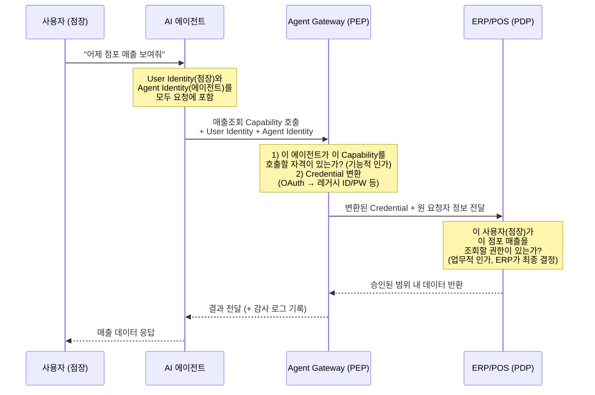
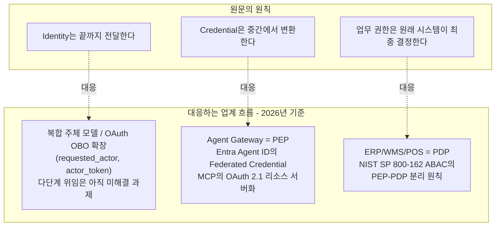

- 원문: "단상 — 누가 요청했고, 누가 실행했는가" (Facebook, 2026)
- 본 문서는 원문의 핵심 통찰을 최신 업계 동향, 표준화 문서, 기업 구현 사례와 교차 검증하여 확장 정리한 자료입니다.

```
단상

누가 요청했고, 누가 실행했는가

Agent를 업무 시스템에 연결하다 보면
결국 가장 어려운 문제는 모델도, MCP도 아니다.

권한이다.

사용자가 Agent에게 말한다.

“어제 점포 매출 좀 보여줘.”
“이 주문 취소해줘.”
“고객 정보를 조회해줘.”

여기서 두 사람(?)을 구분해야 한다.

누가 요청했는가?
→ User Identity

누가 실행했는가?
→ Agent Identity

이 둘을 섞는 순간 사고가 시작된다.

Agent에게 강력한 공용 계정을 하나 주고
ERP, POS, WMS를 마음껏 호출하게 하면 구현은 편하다.

하지만 그 순간 기존 시스템이 수년 동안 만들어놓은
조직, 직책, 점포, 브랜드, 개인정보, 승인 권한이 사라진다.

그렇다고 모든 레거시 권한을
Agent Gateway에 다시 만들 수도 없다.

그래서 나는 원칙을 단순하게 잡는 편이다.

Identity는 끝까지 전달한다.
누가 요청한 일인지 잃어버리지 않는다.

Credential은 중간에서 변환한다.
OAuth, JWT, API Key, Legacy ID/PW가 달라도
MCP와 Adapter 뒤에서 해결한다.

Business 권한은 원래 시스템이 최종 결정한다.
ERP 권한은 ERP가,
WMS 권한은 WMS가 판단한다.

Agent Gateway가 보는 것은 조금 다르다.

“이 Agent가 이 Capability를 호출해도 되는가?”

기존 시스템이 보는 것은 이것이다.

“이 사용자가 이 업무를 해도 되는가?”

둘 다 통과해야 일이 실행된다.

결국 Agent 시대의 인증·인가는
모든 권한을 하나로 합치는 문제가 아니다.

누가 시켰는지 남기고,
누가 실행했는지 남기고,
기존 업무의 권한 체계를 존중하는 것.

Agent가 일을 대신할수록
Identity는 오히려 더 중요해진다.

https://www.facebook.com/share/19KGun53dD/
```

---

## 1. 들어가며: 원문이 말하는 문제의식

원문은 짧지만 상당히 정교한 주장을 담고 있습니다. 요약하면 이렇습니다.

AI 에이전트를 기업 업무 시스템(ERP, POS, WMS 등)에 연결하는 프로젝트를 진행하다 보면, 결국 가장 까다로운 문제는 어떤 언어모델을 쓸지, MCP(Model Context Protocol) 서버를 어떻게 붙일지가 아니라 **권한**이라는 것입니다. 사용자가 에이전트에게 "어제 점포 매출 좀 보여줘"라고 말할 때, 거기에는 실제로 두 개의 서로 다른 주체가 존재합니다. **누가 요청했는가**(User Identity)와 **누가 실행했는가**(Agent Identity)입니다. 이 둘을 구분하지 않고 에이전트에게 강력한 공용 계정 하나를 쥐여주면 구현은 쉬워지지만, 그 순간 조직·직책·점포·브랜드·개인정보·승인 단계별로 오랜 시간에 걸쳐 정교하게 쌓아온 기존 권한 체계가 사실상 무력화됩니다. 그렇다고 그 모든 레거시 권한 규칙을 에이전트 게이트웨이 안에 처음부터 다시 구현하는 것도 현실적이지 않습니다.

그래서 원문은 원칙을 세 층으로 단순화합니다.

1. **Identity(신원)는 요청자에서 실행자까지 끝까지 전달한다** — 누가 시킨 일인지 중간에 잃어버리지 않는다.
2. **Credential(자격증명)은 중간에서 변환한다** — OAuth, JWT, API Key, 레거시 ID/PW가 시스템마다 달라도 이는 게이트웨이와 어댑터 뒤에서 흡수한다.
3. **업무 권한은 원래 시스템이 최종 결정한다** — ERP의 권한은 ERP가, WMS의 권한은 WMS가 판단하도록 남겨둔다.

그 결과 두 개의 서로 다른 질문이 순차적으로 통과되어야 실제 작업이 실행됩니다. 에이전트 게이트웨이는 "이 에이전트가 이 기능(Capability)을 호출해도 되는가"를 묻고, 기존 업무 시스템은 "이 사용자가 이 업무를 해도 되는가"를 묻습니다. 원문은 이를 두고, 에이전트 시대의 인증·인가란 모든 권한 체계를 하나로 통합하는 문제가 아니라 **누가 시켰는지와 누가 실행했는지를 남기고, 기존 업무 권한 체계를 존중하는 문제**라고 결론짓습니다.

이 문서의 목적은 이 통찰이 개인적인 직관에 그치는 것이 아니라, 실제로 2026년 현재 업계 표준화 기구·클라우드 벤더·오픈소스 프로토콜이 거의 동일한 방향으로 수렴하고 있는 흐름이라는 점을 최신 자료로 확인하고, 그 배경 원리를 좀 더 상세히 풀어 설명하는 데 있습니다.

---

## 2. 왜 지금 이 문제가 이렇게 커졌는가

AI 에이전트가 등장하기 전까지 기업 시스템의 접근 주체는 크게 두 가지뿐이었습니다. 사람(사용자 로그인)과 정적인 서비스 애플리케이션(서비스 계정, API 키)입니다. 사람은 아이디·비밀번호·SSO로 인증하고 조직도에 따른 역할 기반 권한(RBAC)을 부여받습니다. 서비스 애플리케이션은 개발자가 미리 등록해둔 안정적인 자격증명을 사용하며, 소유자와 수명주기가 명확합니다.

에이전트는 이 두 범주 어디에도 깔끔하게 들어맞지 않습니다. 마이크로소프트의 공식 문서는 이 문제를 정면으로 지적하면서, 애플리케이션 정체성(전통적으로 서비스 프린시펄로 표현되는)은 조직이 직접 만들고 유지하는 서비스를 전제로 설계되었고 장기적 안정성과 명확한 소유권을 전제로 한다고 설명합니다. 반면 에이전트는 대량으로 빠르게 생성되고 폐기되며, 사람처럼 대화형으로 행동하지만 사람이 아니고, 사람의 위임을 받아 자율적으로 판단하여 여러 시스템에 걸쳐 조치를 취합니다. 즉 에이전트는 사람도 아니고 고정된 애플리케이션도 아닌, 그 사이에 있는 새로운 유형의 행위자입니다.

이 문제는 추상적인 이론이 아니라 실제 사고로 이어지고 있습니다. 업계 보고서들은 2026년 들어 AI 에이전트 키 유출이나 OAuth 토큰 탈취 같은 사건들을 실제 사례로 언급하며, 인증되지 않았거나 지나치게 넓은 권한을 가진 에이전트 자격증명이 공격 표면을 키우고 있다고 지적합니다. OWASP는 2025년 12월 "에이전틱 애플리케이션을 위한 Top 10"을 발표하면서, 최소 권한(least privilege)의 에이전트판 개념으로 "최소 자율성(Least Agency)"이라는 원칙을 제시했습니다. 에이전트가 기술적으로 할 수 있는 것과 실제로 해도 되는 것을 분리해서 통제해야 한다는 뜻입니다. 이는 원문이 말하는 "Capability 호출 가능 여부"와 "업무 수행 가능 여부"의 구분과 정확히 같은 맥락입니다.

시장 규모 면에서도 이 문제의 시급성이 드러납니다. 시장조사 매체들이 인용하는 가트너 전망에 따르면, 2026년 말까지 전체 기업 애플리케이션의 최대 40%가 특정 업무 전담 AI 에이전트를 포함하게 될 것으로 예상되는데, 이는 현재 5% 미만에서 급격히 늘어나는 수치입니다. 동시에 MCP 생태계는 2025년 말 기준 월간 SDK 다운로드 9,700만 건, 활성 서버 1만 개를 넘어섰다고 Anthropic이 공식 발표한 바 있습니다. 즉 에이전트가 실제 업무 시스템을 건드리는 빈도와 범위가 폭발적으로 늘어나는 시점에, 그것을 통제할 신원·권한 체계는 아직 표준화 초기 단계에 있는 것이 2026년의 상황입니다.

---

## 3. 세 가지 층위를 다시 정리하기: Identity, Credential, Authorization

원문의 통찰을 조금 더 엄밀하게 풀어보면, 실제로는 네 가지 개념이 서로 다른 층에서 작동하고 있습니다.

| 층위 | 질문 | 예시 | 결정 주체 |
|---|---|---|---|
| **User Identity (요청자 신원)** | 이 일을 누가 시켰는가? | "홍길동 점장이 요청함" | 사람(조직의 계정 체계) |
| **Agent Identity (실행자 신원)** | 이 일을 실제로 누가 수행했는가? | "매출조회-에이전트 v3, 세션 id abc123" | 에이전트를 배포·소유한 조직/팀 |
| **Credential (자격증명)** | 시스템에 접근할 때 무엇을 제시하는가? | OAuth 토큰, JWT, API 키, 레거시 ID/PW | 인증 서버·게이트웨이 |
| **Business Authorization (업무 권한)** | 이 사람(또는 이 사람을 대신하는 에이전트)이 이 업무를 해도 되는가? | "이 점장은 자기 점포 매출만 볼 수 있음" | 원래 업무 시스템(ERP/POS/WMS) |

이 네 층을 뭉뚱그려 하나의 "에이전트 권한"으로 취급하는 순간 문제가 생깁니다. 예를 들어 에이전트에게 강력한 서비스 계정을 하나 주고 모든 시스템을 호출하게 만들면, Credential 층에서는 문제가 없어 보이지만 Business Authorization 층에서 원래 있던 "점장은 자기 점포만 조회 가능"이라는 규칙이 사라집니다. 반대로 매번 사람의 개인 계정 자격증명을 에이전트에게 그대로 넘기면, 이번에는 Agent Identity가 사라져서 나중에 감사(audit) 로그를 봤을 때 "이 조회를 사람이 직접 했는지 에이전트가 자동으로 했는지" 구분할 수 없게 됩니다.

학계에서도 이 문제를 정면으로 다루고 있습니다. 2026년에 발표된 한 아카이브 논문("Identity Management for Agentic AI")은 에이전트가 어떤 요청을 대리 수행할 때, 그 요청을 승인한 사람과 실제로 자격증명을 제시하며 접근하는 에이전트를 구분해서 취급해야 하며, 이 구분을 강제 집행할 수 있는 지점이 필요하다고 설명합니다. 또 다른 2026년 아카이브 논문("A Five-Plane Reference Architecture for Runtime Governance of Production AI Agents")은 이를 "복합 주체(composite principal) 모델"이라 부르며, 기존 OAuth의 On-Behalf-Of 방식이 위임 주체와 실행 주체를 하나의 토큰으로 뭉개버리는 한계를 지적하고, 위임 체인을 평평하게 뭉개지 않고 각 단계별로 명시적으로 남겨야 한다고 주장합니다. 이는 원문이 "Identity는 끝까지 전달한다"고 표현한 원칙과 사실상 같은 이야기입니다.

---

## 4. Agent Gateway의 역할: PEP와 PDP의 분리

원문에서 "Agent Gateway가 보는 것은 이 Agent가 이 Capability를 호출해도 되는가이고, 기존 시스템이 보는 것은 이 사용자가 이 업무를 해도 되는가이다"라고 한 부분은, 사실 보안·아이덴티티 분야에서 이미 오래전부터 정립된 개념과 정확히 일치합니다. 바로 **정책 집행 지점(Policy Enforcement Point, PEP)** 과 **정책 결정 지점(Policy Decision Point, PDP)** 의 분리입니다. 이는 속성 기반 접근 제어(ABAC)를 다루는 미국 NIST의 표준 문서(SP 800-162)에서 정의된 고전적인 아키텍처 패턴입니다.

2026년의 한 아카이브 논문은 이 패턴을 에이전트 환경에 명시적으로 적용하면서 다음과 같이 설명합니다. PEP는 들어오는 요청을 가로채는 구성요소(API 게이트웨이, 서비스 메시 사이드카, 미들웨어 등)이고, PDP는 정의된 정책에 따라 허용/거부를 실제로 판단하는 전용 서비스입니다. 이렇게 역할을 분리하면 애플리케이션 개발자는 비즈니스 로직에 집중하고, 보안·플랫폼 팀은 정책을 중앙에서 관리할 수 있습니다. 그리고 이 구조에서 특히 중요한 지점은, 에이전트 인식이 안 되어 있는 기존 시스템과 인터페이스할 때 PEP(게이트웨이)가 강력한 번역 계층 역할을 한다는 점입니다. 현대적이고 정보가 풍부한 에이전트 신원 토큰을 받아서, 다운스트림 시스템이 기대하는 단순한 API 키나 레거시 자격증명으로 교환해주는 다리 역할을 하는 것입니다.

원문의 구조를 이 개념에 그대로 대응시키면 다음과 같습니다.

- **Agent Gateway = PEP**: "이 에이전트가 이 Capability를 호출해도 되는가"를 판단하고, Credential을 다운스트림 시스템이 이해하는 형태로 변환합니다.
- **ERP/POS/WMS = PDP(이자 최종 집행자)**: "이 사용자가 이 업무를 해도 되는가"를 최종적으로 판단합니다. 이 판단 로직은 게이트웨이로 옮기지 않고 원래 시스템에 남겨둡니다.

아래는 이 흐름을 단순화한 시퀀스 다이어그램입니다. 매장 점장이 "어제 매출을 보여줘"라고 요청하는 예시를 기준으로 합니다.



여기서 핵심은 화살표가 두 번 꺾인다는 점입니다. 게이트웨이 단계에서 한 번 걸러지고, 원래 시스템 단계에서 다시 한번 걸러집니다. 둘 중 하나만 통과해서는 실행되지 않습니다. 이렇게 이중으로 걸러지는 구조가 있어야, 에이전트에게 광범위한 기능 접근권을 준다 해도 실제 업무 데이터에 대한 최종 결정권은 여전히 원래 시스템(그리고 그 시스템이 오랫동안 축적해온 조직·직책·점포 단위 권한 규칙)에 남아 있게 됩니다.

---

## 5. 업계 표준의 수렴: MCP, OAuth 2.1, 위임 토큰

이 원칙이 단순히 이론적으로 옳은 방향이라는 수준을 넘어, 실제로 2025~2026년 사이 여러 표준화 트랙에서 거의 동시에 같은 방향으로 수렴하고 있다는 점이 흥미롭습니다.

### 5.1 MCP(Model Context Protocol)의 인가 스펙 진화

Anthropic이 2024년 11월 오픈소스로 공개한 MCP는 AI 모델이 외부 도구·데이터에 접근하는 방식을 표준화한 프로토콜로, 2025년 12월 9일 Anthropic이 이를 리눅스 재단 산하에 새로 설립된 Agentic AI Foundation(AAIF)에 기증하면서 벤더 중립적인 거버넌스 체계로 전환되었습니다. 이 기증 발표에서 Anthropic은 MCP가 1년 만에 월간 SDK 다운로드 9,700만 건, 활성 서버 1만 개를 넘어섰다고 밝혔으며, AAIF는 Block의 goose, OpenAI의 AGENTS.md와 함께 창립 프로젝트로 MCP를 포함하고, 아마존·구글·마이크로소프트가 플래티넘 후원사로 참여했습니다.

초기 MCP의 인증 처리 방식은 업계에서 "각자 알아서 토큰을 들고 오라"는 식으로 느슨했다는 평가를 받았습니다. 이후 스펙이 몇 차례 개정되며 이 부분이 크게 강화되었습니다. 2025-06-18 개정판에서 MCP 서버를 OAuth 2.1 리소스 서버로 취급하는 개념이 처음 도입되었고, 2025-11-25 개정판에서 이를 더 구체화했으며, 2026-07-28 개정판은 이를 한층 더 엄격하게 다듬었습니다. 이 최신 개정판에서는 MCP 서버가 클라이언트가 올바른 인가 서버를 자동으로 찾을 수 있도록 OAuth 보호 리소스 메타데이터(RFC 9728)를 구현하도록 요구하고, MCP 클라이언트는 발급받은 토큰이 어느 MCP 서버를 위한 것인지 명시하는 리소스 인디케이터(RFC 8707)를 구현하도록 요구합니다. 이는 악의적인 서버가 다른 서버를 위해 발급된 토큰을 가로채 재사용하는 것을 막기 위한 조치입니다. 또한 기존의 동적 클라이언트 등록(Dynamic Client Registration) 대신 클라이언트 ID 메타데이터 문서(CIMD) 방식을 권장하는 방향으로 바뀌었습니다. 다만 이 세부 스펙 변경 내용은 현재 단일 매체(WorkOS 기술 블로그)의 설명에 주로 의존하고 있어, 정확한 조항 번호나 시행 시점은 Anthropic·MCP 공식 스펙 문서에서 재확인하는 것을 권장합니다.

한 가지 주목할 점은, 여러 산업 분석 자료들이 공통적으로 지적하는 MCP의 근본적 한계입니다. MCP 스펙 자체는 인증(이 요청을 보낸 것이 누구인지 증명하는 것)을 다루지만, 인증이 스펙상 필수가 아니라 선택 사항이기 때문에 형식적으로는 스펙을 준수하면서도 실제로는 인증이 꺼져 있어 사실상 무방비 상태인 배포 사례가 존재한다는 지적입니다. 또한 OAuth 2.1은 "이 에이전트가 누구인지" 증명하는 데는 유용하지만, "누가 이 에이전트에게 권한을 위임했는지", "이 에이전트가 어떤 사람을 대신해서 무엇을 할 수 있는지", "이 위임 체인을 사전 조율 없이 하위 서비스가 검증할 수 있는지" 같은 더 어려운 질문에는 답하지 못한다는 점이 여러 자료에서 반복적으로 지적되고 있습니다. 바로 이 지점이 원문이 말하는 "Identity를 끝까지 전달"해야 하는 이유이기도 합니다. 인증만으로는 부족하고, 위임 체인 전체가 추적 가능해야 한다는 것입니다.

### 5.2 On-Behalf-Of(OBO) 델리게이션과 다단계 위임의 미해결 과제

전통적인 OAuth의 인가 코드(Authorization Code) 흐름은 사람이 브라우저에서 인가 요청을 읽고 동의할 수 있다는 것을 전제로 설계되었습니다. 그러나 사람의 감독 없이 자율적으로 움직이는 에이전트나, 런타임에 동적으로 생성되는 하위 에이전트는 이 흐름을 실행할 수 없습니다. 반대로 클라이언트 자격증명(Client Credentials) 흐름은 사전에 등록된 정적인 서버 간 통신을 위해 설계된 것이라, 런타임에 새로 생성되는 에이전트 신원에는 잘 맞지 않습니다.

이 공백을 메우기 위해 산업계와 표준화 기구 양쪽에서 On-Behalf-Of(OBO) 방식을 에이전트에 맞게 확장하려는 시도가 이어지고 있습니다. IETF(인터넷 기술 표준화 기구)에는 "OAuth 2.0 Extension: On-Behalf-Of User Authorization for AI Agents"라는 인터넷 드래프트가 제출되어 있는데, 에이전트가 위임된 접근이 필요한 특정 주체임을 명시하는 requested_actor 파라미터와, 토큰 교환 과정에서 에이전트를 인증하는 actor_token 파라미터를 도입하는 내용을 담고 있습니다. 클라우드 시큐리티 얼라이언스(CSA) 산하 연구 그룹이 정리한 자료에 따르면, 이런 확장 초안들이 아직 RFC(정식 표준)로 확정되지는 않았기 때문에, 현재로서는 조직들이 OAuth 2.1을 기본선으로 채택하되 향후 이 확장안들이 표준화될 경우를 대비해 인가 서버 설계를 유연하게 가져가는 것이 권장됩니다.

실무적으로 아직 풀리지 않은 문제로 자주 언급되는 것이 **다단계 위임(multi-hop delegation)** 입니다. 사람이 한 명의 에이전트에게 권한을 위임하는 단일 홉(single-hop) 위임, 예컨대 고객 서비스 에이전트가 사람을 대신해 환불을 처리하는 시나리오는 현재 OBO 방식으로도 처리가 가능합니다. 그러나 그 에이전트가 다시 다른 하위 에이전트를 호출하고, 그 하위 에이전트가 또 다른 시스템을 호출하는 식으로 위임이 여러 단계로 이어질 경우, 각 단계에서 권한이 원래 의도한 범위보다 확대되지 않도록(attenuation) 보장하는 표준화된 방법은 아직 업계 전반에 걸쳐 확립되지 않았다는 것이 2026년 상반기 기준 여러 분석 자료의 공통된 평가입니다.

### 5.3 기업들의 실제 구현 사례

이 흐름을 실제 제품으로 구현한 사례들이 2026년 들어 빠르게 늘고 있습니다. 대표적인 것이 마이크로소프트의 **Entra Agent ID**입니다. 이는 2026년 초 프리뷰로 시작해 같은 해 4월 정식 출시(GA)된 것으로 여러 업계 블로그에 보도되었으며, 마이크로소프트 공식 문서에도 관련 GA 공지가 게재되어 있습니다. Entra Agent ID의 설계에서 특히 원문의 논지와 맞닿는 지점은, 에이전트 신원 자체는 고유한 오브젝트 ID와 앱 ID를 갖지만 자체 자격증명(비밀번호, 인증 앱 등)을 갖지 않는다는 점입니다. 대신 "에이전트 신원 청사진(blueprint)"이라는 상위 템플릿이 연합 자격증명(Federated Identity Credential, FIC)을 보유하고, 이를 이용해 개별 에이전트 신원을 대신해 토큰을 발급받는 구조입니다. 즉 Credential은 청사진(게이트웨이에 해당하는 계층)에서 관리되고, 개별 업무 시스템에서는 Agent Identity와 그 배후의 위임 관계가 함께 전달됩니다. 마이크로소프트의 Dataverse(Power Platform 내 데이터 플랫폼) 통합 사례를 설명하는 블로그에서는, 관리자가 에이전트별로 최소 권한 원칙에 따른 전용 보안 역할을 부여하고, 모든 데이터 접근과 변경을 에이전트 신원으로 귀속시켜 감사할 수 있도록 하며, 에이전트가 폐기될 때 수명주기를 관리하는 것을 핵심 가치로 제시하고 있습니다.

구글 클라우드 역시 Gemini Enterprise Agent Platform 안에 **Agent Gateway**라는 이름의 구성요소를 두고 있습니다. 공식 문서에 따르면 이 게이트웨이는 모든 에이전트마다 고유하고 추적 가능한 신원을 인가 결정의 주체(principal)로 사용하며, mTLS와 DPoP를 이용한 종단간 암호화 인증으로 기본 보호되고, IAM 및 시맨틱 거버넌스 정책에 위임된 인가를 제공합니다. 이 역시 "게이트웨이가 Capability 수준을 판단하고, 세부 업무 권한은 IAM/정책 엔진에 위임한다"는 원문의 구조와 같은 방향입니다.

이 밖에도 WorkOS, Auth0(Okta), Stytch 같은 아이덴티티 플랫폼들이 앞다투어 "MCP 호환 OAuth 인가 서버" 기능을 내놓았습니다. 시장 분석 매체의 정리에 따르면 Auth0의 "Auth for MCP" 기능은 2025년 11월 얼리 액세스를 거쳐 2026년 5월 6일 정식 출시(GA)되었고, CIMD 등록과 대리 토큰 교환(on-behalf-of token exchange)을 지원합니다. Composio와 Nango 같은 도구는 조금 더 낮은 추상화 수준에서 인증 인프라 자체를 관리해주는 역할을 합니다. 아래 표는 2026년 상반기 기준 주요 플레이어들의 역할을 정리한 것입니다. (기능 세부사항은 각 벤더의 자체 소개에 크게 의존하므로 참고용으로만 활용하시기 바랍니다.)

| 구분 | 대표 사례 | 핵심 특징 |
|---|---|---|
| 클라우드 통합형 에이전트 신원 플랫폼 | Microsoft Entra Agent ID | 에이전트 전용 신원 구성요소(blueprint), 연합 자격증명, Agent Registry, Zero Trust 정책 확장 |
| 클라우드 게이트웨이형 | Google Cloud Agent Gateway (Gemini Enterprise) | 에이전트 신원을 principal로 사용, mTLS/DPoP 기반 인증, IAM 위임 인가 |
| MCP 전용 인가 서버 | WorkOS AuthKit, Auth0 "Auth for MCP", Stytch | OAuth 2.1 리소스 서버 스펙 준수, PRM/RFC 9728, 엔터프라이즈 SSO 연동 |
| 통합/툴링 계층 | Composio, Nango | 다수의 SaaS 도구에 대한 인증 흐름과 툴 카탈로그를 함께 관리 |
| 위임(OBO) 전문 | Scalekit 등 | 사용자 권한을 에이전트에 안전하게 상속시키는 위임 토큰 발급·검증에 특화 |

---

## 6. 규제·표준화 기구의 움직임

2026년은 정부·표준화 기구 차원에서도 에이전트 신원 문제가 "언젠가 다룰 주제"에서 "지금 당장 다뤄야 할 우선순위"로 승격된 해라고 볼 수 있습니다.

미국 NIST(국립표준기술연구소) 산하 CAISI(AI 표준·혁신 센터)는 2026년 2월 17일 **AI Agent Standards Initiative**를 공식 출범시켰습니다. 이는 세 개의 축으로 구성됩니다. 첫째는 산업계 주도 표준 개발을 지원하고 국제 표준화 기구에서 미국의 주도권을 확보하는 것, 둘째는 MCP 생태계를 포함한 오픈소스 에이전트 프로토콜의 커뮤니티 주도 개발과 유지보수를 촉진하는 것, 셋째는 에이전트 인증, 인가, 신원 인프라에 대한 보안·신원 연구입니다. 이와 별도로 NIST 산하 NCCoE(국가 사이버보안 우수센터)는 2026년 2월 5일 "소프트웨어 및 AI 에이전트 신원·인가 채택 가속화(Accelerating the Adoption of Software and AI Agent Identity and Authorization)"라는 컨셉 페이퍼를 발표했고, 2026년 4월 2일까지 공개 의견을 수렴했습니다. 이 문서의 핵심 질문은 "기업이 기존의 OAuth, SPIFFE/SPIRE, OpenID Connect 같은 신원 표준을 에이전트에도 그대로 적용할 수 있는가, 아니면 처음부터 새로 만들어야 하는가"였고, 잠정적인 결론은 "새로 발명하기보다는 기존 표준을 확장·적용하는 방향"이라고 여러 매체가 보도하고 있습니다.

다만 NIST의 기존 통제 카탈로그(SP 800-53)에는 AI 에이전트를 사람이나 일반 시스템 계정과 구분해서 다루는 통제 항목이 아직 체계적으로 마련되어 있지 않다는 지적도 있습니다. 접근 통제(AC), 식별·인증(IA), 감사·책임추적성(AU) 영역에서 부분적으로만 커버가 되고 있으며, 이 공백을 메우기 위해 AI Agent Standards Initiative, NCCoE 컨셉 페이퍼 등 여러 트랙이 동시에 진행되고 있다는 것이 2026년 중반 기준 보안 업계 분석의 공통된 시각입니다.

유럽에서는 AI 법(EU AI Act)이 고위험 AI 시스템의 행동 로그에 운영자(operator) 신원을 포함하도록 의무화하는 조항을 담고 있다는 점이 아시아 시장 분석 리포트에서 언급되고 있으며, 싱가포르는 국가 차원에서는 처음으로 에이전틱 AI 거버넌스 프레임워크를 발표한 것으로 알려져 있습니다. 이 두 사실은 현재 단일 출처(아시아 웹3 분석 매체)의 요약 설명에 의존하고 있어, 정확한 조항 내용은 EU AI Act 원문이나 싱가포르 정부 공식 발표 자료를 통해 재확인하는 것이 안전합니다.

---

## 7. 한국/아시아 맥락: Know Your Agent(KYA)

원문은 기업 내부 시스템(ERP, WMS)을 중심으로 논지를 전개하고 있지만, 같은 문제의식이 기업 경계를 넘어선 에이전트 간 거래(A2A, Agent-to-Agent) 영역에서도 거의 동일한 형태로 제기되고 있습니다. 2026년 5월 타이거리서치가 발간한 "2026 Know Your Agent: 에이전트 신원 인프라" 리포트는 이를 금융권의 KYC(Know Your Customer) 개념에 빗대어 설명합니다.

리포트의 핵심 논지는 이렇습니다. 1989년 국제자금세탁방지기구(FATF)가 설립되기 전까지는 국제 금융에 신원 확인 공통 기준이 없었고, 이 공백이 자금 출처 추적을 어렵게 만들었습니다. FATF 설립 이후 금융권에 KYC 개인 신원 인증이 의무화되며 불법 자금을 사전에 차단할 수 있게 되었습니다. 리포트는 지금의 AI 에이전트 상황이 이와 유사하다고 봅니다. 에이전트가 사람의 개입 없이 자율적으로 계약·결제·거래를 실행하는 시대가 열렸지만, 그 에이전트가 누구인지, 누구를 대신하는지 검증할 공통 기준이 아직 없다는 것입니다. 특히 이 문제는 중앙화된 하나의 플랫폼(구글, OpenAI, 코인베이스 등) 내부에서 동작하는 에이전트보다는, 개인이 배포한 자율 에이전트가 플랫폼 경계를 넘어 탈중앙화 거래소(DEX)나 에이전트 간 결제, 가맹점 결제를 시작하는 상호운용 환경에서 훨씬 심각해집니다. 리포트는 이를 국내에서는 신분증만으로 자유롭게 다닐 수 있지만 국경을 넘는 순간부터는 방문 목적과 신뢰도를 심사하는 입국 심사를 거쳐야 하는 것에 비유합니다.

리포트는 2026년 상반기 기준 KYA(Know Your Agent) 표준 경쟁에 뛰어든 네 가지 접근을 소개합니다.

- **이더리움 ERC-8004**: 기존 NFT 표준(ERC-721) 위에 신원 레이어를 얹어, 에이전트마다 NFT를 발급해 고유 ID를 부여합니다. 신원뿐 아니라 평판·검증 정보까지 담는 세 개의 온체인 레지스트리(Identity, Reputation, Validation)를 함께 운영합니다.
- **비자(Visa)의 TAP**: 에이전트에게 신원 증명서를 발급하고, 정당성·위임자·결제 수단이라는 세 가지 서명으로 검증하는 구조입니다.
- **Trulioo**: 인증기관(CA)이 SSL 인증서를 발급하는 모델을 차용해, 위임 당사자(DPA)가 위임받은 에이전트(DAP)에게 신원을 발급하는 구조입니다.
- **Sumsub**: 자사의 기존 컴플라이언스 시스템 위에 KYA 기능을 얹는 접근입니다.

이 리포트는 투자 자문이 아닌 정보 제공 목적의 웹3 시장 분석 자료이며, 특정 프로젝트의 채택 여부나 시장 점유율에 대한 전망은 작성 시점(2026년 5월)의 판단이라는 점을 감안해서 참고하시기 바랍니다. 다만 "플랫폼 내부에서는 기존 KYC로 충분하지만, 플랫폼 경계를 넘는 순간부터는 별도의 에이전트 신원 검증이 필요하다"는 구조적 통찰 자체는, 원문이 말한 "레거시 시스템 각각의 업무 권한은 그 시스템이 최종 판단해야 한다"는 원칙과 결이 같습니다. 기업 내부에서는 원문처럼 게이트웨이와 기존 시스템의 역할 분담으로 문제를 풀 수 있지만, 기업 경계를 넘어 에이전트끼리 거래하는 순간부터는 상호 신뢰할 수 있는 공통의 신원 증명 체계 자체가 필요해진다는 것이, 같은 문제의식이 다른 스케일에서 나타난 사례라고 볼 수 있습니다.

---

## 8. 원문의 원칙과 업계 표준을 나란히 놓고 보기

여기까지 살펴본 내용을 원문의 세 가지 원칙과 다시 대응시켜 정리하면 아래와 같습니다.



이 대응 관계에서 얻을 수 있는 실무적 시사점은 다음과 같이 정리할 수 있습니다.

**첫째, 에이전트에게 공용 슈퍼계정을 주지 않는다.** Microsoft Entra Agent ID나 Google Cloud Agent Gateway처럼 에이전트마다 고유하고 추적 가능한 신원을 부여하는 방향이 업계 표준으로 자리 잡고 있습니다. 이는 원문이 경계했던 "강력한 공용 계정" 패턴과 정확히 반대 방향입니다.

**둘째, 게이트웨이의 역할과 업무 시스템의 역할을 섞지 않는다.** 게이트웨이(PEP)는 "이 에이전트가 이 기능을 호출할 자격이 있는가"와 자격증명 변환까지만 담당하고, "이 사용자가 이 업무를 해도 되는가"라는 세밀한 업무 규칙은 원래 시스템(PDP)에 남겨두는 것이 여러 표준화 문서와 실제 구현 사례에서 공통적으로 나타나는 패턴입니다. 모든 레거시 권한 규칙을 게이트웨이에 다시 구현하려는 시도는 이 분리 원칙에 어긋납니다.

**셋째, 위임 체인은 끝까지 살아있어야 한다.** 단일 홉 위임(사람 → 에이전트 1개)은 현재의 OAuth OBO 방식으로도 어느 정도 처리가 가능하지만, 에이전트가 다시 하위 에이전트를 호출하는 다단계 위임에서 권한이 원래 범위보다 확대되지 않도록 보장하는 것은 2026년 중반 현재도 업계 전반에서 미해결 과제로 남아 있습니다. 원문이 강조한 "Identity를 끝까지 전달한다"는 원칙은 이 다단계 위임 문제와도 직결되는 지점입니다.

**넷째, 감사 가능성(auditability)은 신원 분리의 부산물이 아니라 목적 그 자체다.** 여러 자료가 공통적으로 지적하듯, 에이전트 신원을 사람의 신원과 분리해서 남기는 것은 단순한 기술적 정교함이 아니라, 나중에 "이 조치를 누가 승인했고 누가 실행했는지"를 설명할 수 있어야 한다는 책임추적성(accountability) 요구에서 나온 것입니다.

---

## 9. 실무 체크리스트 (교육적 참고용)

에이전트를 사내 업무 시스템에 연동하는 프로젝트를 설계할 때 점검해볼 수 있는 항목을 원문과 본 문서의 내용을 바탕으로 정리하면 다음과 같습니다.

- 에이전트마다 고유한 신원(Agent Identity)이 발급되고 있는가, 아니면 여러 에이전트가 하나의 공용 계정을 공유하고 있는가.
- 요청을 시작한 사람(User Identity)의 정보가 에이전트 실행 전 구간에 걸쳐 손실 없이 함께 전달되고 있는가.
- 게이트웨이(또는 그에 준하는 계층)가 서로 다른 자격증명 형식(OAuth, JWT, API Key, 레거시 ID/PW)을 다운스트림 시스템에 맞게 변환해주고 있는가, 아니면 각 팀이 개별적으로 임시방편을 만들고 있는가.
- 업무 단위의 세부 권한(점포별, 직책별, 브랜드별 등)을 게이트웨이가 새로 구현하고 있지는 않은가. 이 판단은 원래 그 권한을 관리해온 시스템에 남아 있어야 한다.
- 에이전트가 다른 하위 에이전트나 도구를 호출하는 다단계 위임이 존재하는가. 존재한다면 각 단계에서 권한이 원래 범위를 넘어서지 않는지 확인할 방법이 있는가.
- 감사 로그에서 "사람이 직접 한 일"과 "에이전트가 대신 한 일"이 구분되어 남는가.
- 에이전트가 폐기되거나 교체될 때, 그 신원과 자격증명이 함께 회수(deprovisioning)되는 절차가 있는가.

---

## 용어집

| 한국어 | 영어 | 설명 |
|---|---|---|
| 요청자 신원 | User Identity | 실제로 업무를 요청한 사람의 신원 |
| 실행자 신원 | Agent Identity | 요청을 대신 수행하는 AI 에이전트의 신원 |
| 자격증명 | Credential | 시스템 접근 시 제시하는 인증 수단(토큰, 키 등) |
| 업무 권한 | Business Authorization | 특정 업무(데이터 조회, 주문 취소 등)를 수행할 수 있는지에 대한 최종 판단 |
| 정책 집행 지점 | Policy Enforcement Point (PEP) | 요청을 가로채 정책을 적용하는 구성요소(게이트웨이 등) |
| 정책 결정 지점 | Policy Decision Point (PDP) | 정책에 따라 허용/거부를 실제로 판단하는 구성요소 |
| 대리 위임 인증 | On-Behalf-Of (OBO) | 한 주체의 권한을 다른 주체가 대신 사용할 수 있게 하는 인증 흐름 |
| 다단계 위임 | Multi-hop Delegation | 위임이 여러 단계의 에이전트/시스템을 거쳐 이어지는 경우 |
| 권한 축소 | Attenuation | 위임이 반복될수록 권한 범위가 원래보다 넓어지지 않도록 제한하는 것 |
| 비인간 신원 | Non-Human Identity (NHI) | 사람이 아닌 서비스 계정, 에이전트 등의 신원 총칭 |
| 에이전트 신원 실사 | Know Your Agent (KYA) | 금융권 KYC 개념을 에이전트에 적용한 신원 검증 개념 |
| 복합 주체 모델 | Composite Principal Model | 위임 체인을 하나로 뭉개지 않고 각 단계를 명시적으로 표현하는 모델 |

---

## 신뢰도 등급 부속서

본 문서에서 인용한 사실관계를 신뢰도에 따라 4단계로 구분합니다.

**① 공식 1차 출처 (기관·기업 공식 발표)**
- MCP의 Linux Foundation Agentic AI Foundation 기증 (2025년 12월 9일), 월간 SDK 다운로드 9,700만 건, 활성 서버 1만 개 — Anthropic 공식 블로그
- Microsoft Entra Agent ID의 정의, 에이전트 신원의 연합 자격증명 구조, Dataverse 통합 방식 — Microsoft Learn 공식 문서
- Google Cloud Agent Gateway의 기능 정의 — Google Cloud 공식 문서
- NIST CAISI의 AI Agent Standards Initiative 출범(2026년 2월 17일), NCCoE 컨셉 페이퍼 발표(2026년 2월 5일) 및 의견 수렴 마감(2026년 4월 2일) — 복수의 법률/보안 자문사가 NIST 발표를 직접 인용해 보도

**② 복수 매체 교차검증**
- MCP가 초기에는 인증을 필수로 요구하지 않아 사실상 무방비 상태로 배포되는 사례가 존재한다는 지적 — 여러 독립 매체(NHI Mgmt, Iden 등)에서 공통적으로 언급
- OAuth 2.1이 에이전트 신원 인증에는 유용하지만 위임 체인 검증에는 한계가 있다는 지적 — 복수의 보안 기술 블로그에서 공통적으로 언급
- 다단계 위임 문제가 아직 업계 표준으로 해결되지 않았다는 평가 — WorkOS, CSA 등 복수 자료에서 공통적으로 언급
- Microsoft Entra Agent ID가 2026년 4월경 GA(정식 출시)되었다는 시점 — 업계 블로그와 Microsoft 공식 문서 갱신 이력이 대체로 일치

**③ 단일 출처 (추가 검증 권장)**
- MCP 2026-07-28 스펙 개정의 세부 조항(RFC 9728, RFC 8707 관련 세부 내용) — WorkOS 기술 블로그 단일 출처
- 가트너의 "2026년 말 기업 애플리케이션의 최대 40%가 특정 업무 에이전트를 포함할 것"이라는 전망 수치 — MarkTechPost가 인용한 형태로만 확인, 가트너 원 보고서 직접 확인은 하지 못함
- EU AI Act의 고위험 시스템 행동 로그 운영자 신원 포함 의무, 싱가포르의 국가 차원 에이전틱 AI 거버넌스 프레임워크 발표 — 타이거리서치(아시아 웹3 분석 매체)의 요약 설명에 의존
- TrueFoundry의 게이트웨이 지연시간(3~4ms), 처리량(초당 350건 이상) 수치 — 벤더 자체 발표 자료
- KYA 관련 ERC-8004, Visa TAP, Trulioo, Sumsub 각 프로젝트의 구체적 작동 방식 — 타이거리서치 리포트의 요약 설명에 의존

**④ 분석적 종합·편집 판단**
- 원문의 세 가지 원칙(Identity 전달, Credential 변환, 업무 권한은 원 시스템이 결정)을 PEP/PDP 개념, MCP 인가 스펙, Entra Agent ID, OBO 델리게이션과 대응시켜 정리한 부분(4장, 5장, 8장의 대조표와 다이어그램)은 원 자료들을 종합한 본 문서 작성자의 분석적 판단입니다.
- "한국 기업 사례"로 특정 기업명을 언급하지 않은 것은, 원문 자체가 특정 기업을 명시하지 않은 일반론적 단상이었기 때문입니다. 실제 국내 기업 사례가 필요하다면 별도로 조사가 필요합니다.

---

## 참고문헌 (전체 URL)

1. Anthropic, "Donating the Model Context Protocol and establishing the Agentic AI Foundation" — https://www.anthropic.com/news/donating-the-model-context-protocol-and-establishing-of-the-agentic-ai-foundation
2. Model Context Protocol Blog, "MCP joins the Agentic AI Foundation" — https://blog.modelcontextprotocol.io/posts/2025-12-09-mcp-joins-agentic-ai-foundation/
3. Linux Foundation, "Linux Foundation Announces the Formation of the Agentic AI Foundation (AAIF)" — https://www.linuxfoundation.org/press/linux-foundation-announces-the-formation-of-the-agentic-ai-foundation
4. WorkOS, "The biggest MCP spec update ships July 28: What changes for AI agent authentication" — https://workos.com/blog/mcp-2026-spec-agent-authentication
5. Aembit, "MCP, OAuth 2.1, PKCE, and the Future of AI Authorization" — https://aembit.io/blog/mcp-oauth-2-1-pkce-and-the-future-of-ai-authorization/
6. NHI Mgmt, "MCP server authentication in 2026: what practitioners need to know" — https://nhimg.org/articles/mcp-server-authentication-in-2026-what-practitioners-need-to-know/
7. Iden, "AI Agent Identity Management 2026: Standards & Gaps" — https://www.idenhq.com/en/blog/ai-agent-identity-management-2026
8. MarkTechPost, "Best Authentication Platforms for AI Agents and MCP Servers in 2026" — https://www.marktechpost.com/2026/05/25/best-authentication-platforms-for-ai-agents-and-mcp-servers-in-2026/
9. Microsoft Learn, "What is Microsoft Entra Agent ID?" — https://learn.microsoft.com/en-us/entra/agent-id/what-is-microsoft-entra-agent-id
10. Microsoft Learn, "What are agent identities?" — https://learn.microsoft.com/en-us/entra/agent-id/what-are-agent-identities
11. Microsoft Learn, "Overview of agent identities in Microsoft Entra" — https://learn.microsoft.com/en-us/entra/agent-id/agent-identities
12. Microsoft Learn, "What's new in Microsoft Entra Agent ID" — https://learn.microsoft.com/en-us/entra/agent-id/whats-new-agent-id
13. Microsoft Power Platform Blog, "Secured and Governed your AI Agents: Microsoft Entra Agent ID for Dataverse" — https://www.microsoft.com/en-us/power-platform/blog/2026/08/06/microsoft-entra-agent-id-for-dataverse/
14. Big Hat Group, "Microsoft Entra Agent ID Reaches GA: What IT and Security Teams Need to Know" — https://www.bighatgroup.com/blog/entra-agent-id-ga-deep-dive/
15. Cloudpartner, "Microsoft Entra Agent ID: The Identity Layer Your AI Agents Need" — https://learn.cloudpartner.fi/posts/microsoft-entra-agent-id-agentic-identity-ai-agents
16. Google Cloud Docs, "Agent Gateway overview | Gemini Enterprise Agent Platform" — https://docs.cloud.google.com/gemini-enterprise-agent-platform/govern/gateways/agent-gateway-overview
17. Aembit, "AI Agent Gateway" (glossary) — https://aembit.io/glossary/ai-agent-gateway/
18. TrueFoundry, "What is an Agent Gateway? A Complete Guide (2026)" — https://www.truefoundry.com/blog/agent-gateway
19. arXiv, "Identity Management for Agentic AI: The new frontier of authorization, authentication, and security for an AI agent world" — https://arxiv.org/pdf/2510.25819
20. arXiv, "A Five-Plane Reference Architecture for Runtime Governance of Production AI Agents" — https://arxiv.org/pdf/2606.12320
21. Christian Posta, "Explaining OAuth Delegation, 'On Behalf Of', and Agent Identity for AI Agents" — https://blog.christianposta.com/explaining-on-behalf-of-for-ai-agents/
22. Medium (Sourav Kumar), "OAuth delegation for Agents (OBO)" — https://medium.com/@sauravkumarsct/oauth-delegation-for-agents-o-b-o-1e75616c2033
23. Scalekit, "On-Behalf-Of authentication for AI agents: Secure, scoped, and auditable delegation" — https://www.scalekit.com/blog/delegated-agent-access
24. Entrust, "AI Agent Authorization: Why Accountable Delegation is Central to Your Trust Fabric" — https://www.entrust.com/blog/2026/05/ai-agent-authorization-delegation-zero-trust
25. Cloud Security Alliance Labs, "Agent Identity Governance Framework" — https://labs.cloudsecurityalliance.org/agentic/agentic-identity-governance-framework-v1/
26. arXiv, "Authenticated Delegation and Authorized AI Agents" — https://arxiv.org/pdf/2501.09674
27. Pillsbury Law, "NIST Launches AI Agent Standards Initiative and Seeks Industry Input" — https://www.pillsburylaw.com/en/news-and-insights/nist-ai-agent-standards.html
28. Cloud Security Alliance Labs, "NIST AI Agent Security: Red-Teaming Guidance and Enterprise Compliance" — https://labs.cloudsecurityalliance.org/research/csa-research-note-nist-ai-agent-red-teaming-standards-202603/
29. Cloud Security Alliance Labs, "Federal Agentic AI Security: NIST's Emerging Standards Initiative" — https://labs.cloudsecurityalliance.org/research/csa-research-note-nist-ai-agent-standards-federal-framework/
30. Cloud Security Alliance Labs, "NIST AI Agent Standards: What It Means for Enterprise Security" — https://labs.cloudsecurityalliance.org/research/csa-research-note-nist-ai-agent-standards-initiative-2026040/
31. MetricStream, "NIST's AI Agent Standards Initiative: What CISOs Need to Know and How to Prepare" — https://www.metricstream.com/blog/nists-ai-agent-standards-initiative.html
32. WorkOS, "Everything you should know about NIST's AI Agent Standards Initiative" — https://workos.com/blog/nist-ai-agent-standards-initiative-explained
33. BD Emerson, "NIST AI Agent Standards Initiative" — https://www.bdemerson.com/article/nist-ai-agent-standards-initiative
34. Tiger Research, "2026 Know Your Agent: 에이전트 신원 인프라" — https://reports.tiger-research.com/p/2026-know-your-agent-kor
35. Arcade.dev, "Multi-User AI Agent Auth: OAuth & MCP Guide" — https://www.arcade.dev/blog/ai-agent-authentication-authorization/
36. GitHub (rvennam), "agentgateway-auth-patterns" — https://github.com/rvennam/agentgateway-auth-patterns
37. InfoQ, "Building a Least-Privilege AI Agent Gateway for Infrastructure Automation with MCP, OPA, and Ephemeral Runners" — https://www.infoq.com/articles/building-ai-agent-gateway-mcp/
38. Wikipedia, "Model Context Protocol" — https://en.wikipedia.org/wiki/Model_Context_Protocol

---

*이 문서는 AI바이브코딩기초클래스 수업 자료로 작성되었습니다. 원문은 페이스북 개인 게시물로, 자동화된 접근이 차단되어 있어 사용자가 제공한 본문 텍스트를 기준으로 분석했습니다. 위 참고문헌은 2026년 9월 1일 기준 웹 검색으로 확인된 자료이며, 이후 스펙·정책이 개정될 수 있으므로 실무 적용 시 각 공식 문서의 최신판을 다시 확인하시기 바랍니다.*
