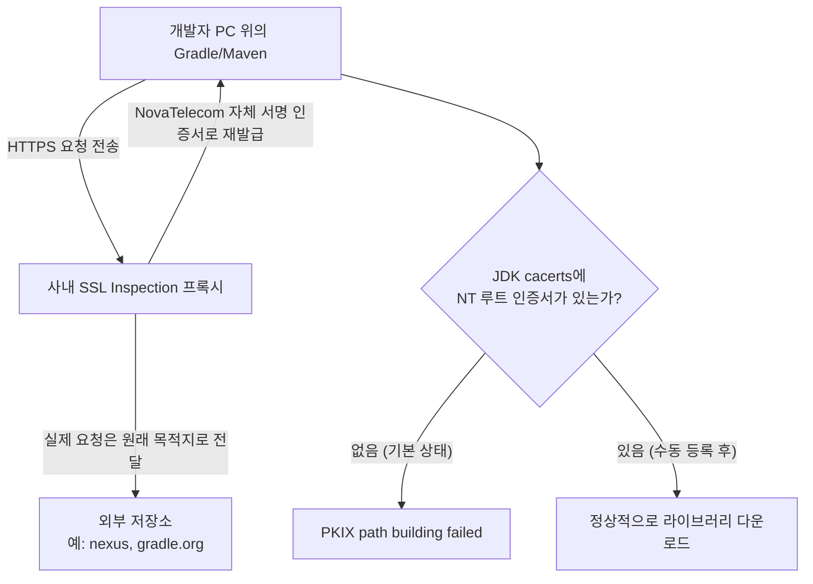
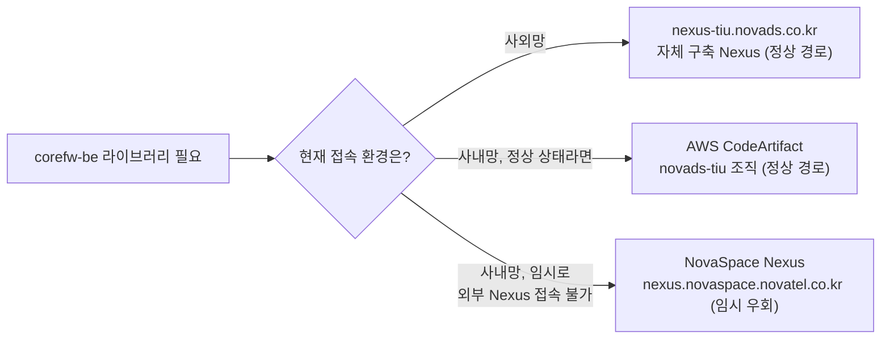
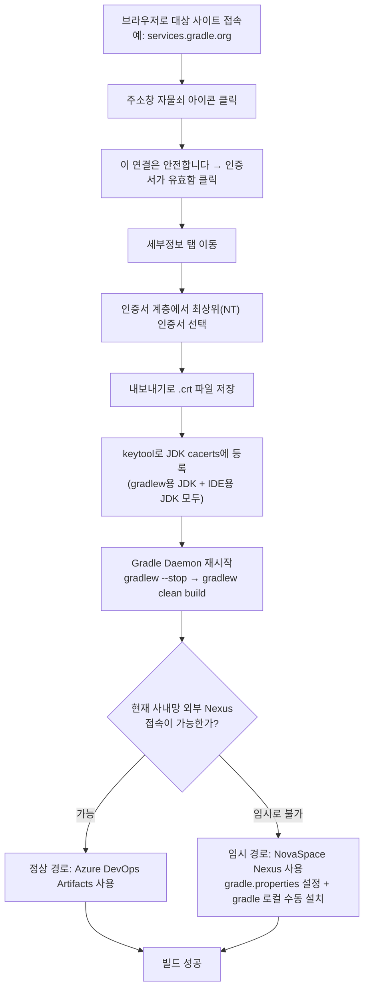

> 이 문서는 원본 사내 위키 자료를 바탕으로 재구성한 것으로, 회사명과 사내 솔루션 명칭은 요청에 따라 모두 가상의 이름으로 치환했다.

---

## 목차

1. 왜 이 문서가 필요한가 — 문제의 출발점
2. 인증서가 왜 필요한가: PKIX 오류의 근본 원인
3. CoreFW 라이브러리 저장소의 전체 구조
4. 인증서를 추출해서 JDK에 등록하는 전 과정
5. Gradle Daemon을 재시작해야 하는 이유
6. npm/Node.js 쪽 SSL 설정과 그 위험성
7. 임시 우회 경로: NovaSpace Nexus 사용법
8. 전체 흐름 한눈에 보기
9. 자료의 출처와 신뢰도 구분
10. 참고: Gradle 최신 버전 정보와 권장 사항
11. 보안 관련 유의사항

---

## 1. 왜 이 문서가 필요한가 — 문제의 출발점

이 가이드가 다루는 대상은 **corefw-be**라는, CoreFW 참조 아키텍처를 따르는 백오피스 애플리케이션이다. 이 애플리케이션을 로컬 PC에서 빌드하려면 Gradle이나 Maven, 그리고 프런트엔드 쪽이라면 yarn(npm)이 회사 내부에서 관리하는 라이브러리 저장소(Repository)에 접속해서 의존성 라이브러리를 내려받아야 한다.

그런데 실제로 사내망 PC에서 빌드를 시도하면 십중팔구 아래와 같은 오류를 만나게 된다.

```
PKIX path building failed: sun.security.provider.certpath.SunCertPathBuilderException:
unable to find valid certification path to requested target
```

이 오류가 왜 나오는지, 어떻게 해결하는지를 이해하려면 먼저 "인증서가 왜 필요한가"부터 짚고 넘어가야 한다. 아래에서부터 하나씩 풀어본다.

---

## 2. 인증서가 왜 필요한가: PKIX 오류의 근본 원인

### 2-1. HTTPS 통신과 신뢰의 사슬(Chain of Trust)

Gradle이나 Maven이 라이브러리를 내려받을 때는 `https://` 로 시작하는 저장소 주소에 접속한다. HTTPS는 통신 내용을 암호화하는 동시에, "지금 내가 접속한 서버가 정말 그 서버가 맞는지"를 검증하는 절차를 포함한다. 이 검증에 쓰이는 것이 바로 **디지털 인증서**다.

서버는 접속해 온 클라이언트에게 자신의 인증서를 제시하고, 클라이언트는 그 인증서가 "믿을 만한 인증기관(CA, Certificate Authority)"이 서명해 준 것인지를 확인한다. 이 확인 과정은 인증서 하나만 보는 게 아니라, 서버 인증서 → 중간 CA 인증서 → 최상위 루트 CA 인증서로 이어지는 사슬을 끝까지 따라가면서, 그 사슬의 끝이 클라이언트가 이미 "신뢰할 수 있다"고 알고 있는 루트 CA와 맞아떨어지는지를 검사한다. 이 사슬을 하나로 잇는 경로를 영어로 **certification path**라고 부르고, 이 경로를 세우는 표준 규격의 이름이 **PKIX**(Public Key Infrastructure using X.509)다. 즉 "PKIX path building failed"는 말 그대로 "신뢰의 사슬을 끝까지 이어 붙이지 못했다"는 뜻의 오류다.

### 2-2. JDK는 자신만의 "신뢰 목록"을 따로 갖고 있다

여기서 중요한 포인트가 있다. 이 신뢰 여부를 판단하는 주체가 웹 브라우저가 아니라 **JDK(자바 개발 도구)**라는 점이다. Gradle과 Maven은 자바로 동작하는 빌드 도구이기 때문에, HTTPS 저장소에 접속할 때 자바가 내장하고 있는 신뢰 저장소를 사용한다. 이 저장소가 바로 **truststore**이며, 실제 파일로는 `$JAVA_HOME/lib/security/cacerts`(자바 9 이상 기준. 자바 8까지는 `$JAVA_HOME/jre/lib/security/cacerts` 경로였는데, 자바 9부터 `jre` 하위 디렉터리 구조가 사라지면서 경로가 한 단계 짧아졌다)라는 파일에 해당한다.

이 cacerts 파일에는 VeriSign, DigiCert, Let's Encrypt처럼 전 세계적으로 널리 알려진 공인 CA들의 인증서가 기본으로 등록되어 있다. 그래서 일반적인 공개 인터넷 사이트에 접속할 때는 별다른 설정 없이도 신뢰 검증이 통과된다.

### 2-3. 사내 프록시가 통신을 "가로채는" 순간 문제가 생긴다

여기서 회사 네트워크의 특성이 등장한다. 많은 기업 네트워크는 보안 정책상 **SSL Inspection**(또는 HTTPS Proxy, TLS 검사 프록시)이라 불리는 장비를 게이트웨이에 배치한다. 이 장비는 사내 PC가 외부 사이트로 보내는 HTTPS 요청을 중간에서 가로채, 원래 서버의 인증서 대신 **회사 자체적으로 발급한 인증서**를 클라이언트에게 내려준다. 이렇게 하면 회사는 암호화된 트래픽 내부를 들여다보며 악성코드나 정보 유출 등을 검사할 수 있다.

문제는 이 회사 CA 인증서가 전 세계 공인 CA 목록에는 당연히 등록되어 있지 않다는 점이다. 사람이 쓰는 웹 브라우저(크롬, 엣지 등)는 회사가 그룹 정책(GPO) 등을 통해 이미 이 회사 인증서를 브라우저나 운영체제 신뢰 저장소에 심어두었기 때문에 평소에는 자물쇠 아이콘이 정상적으로 뜨고 별문제 없이 보인다. 하지만 **JDK의 cacerts는 운영체제나 브라우저의 신뢰 저장소와는 완전히 별개의 파일**이다. 즉 회사가 아무리 PC 전체에 회사 인증서를 배포해 두었어도, JDK 안에는 그 인증서가 들어가 있지 않다. 그 결과 Gradle이나 Maven이 저장소에 접속하려고 하면 "이 인증서를 발급한 CA를 나는 모른다"며 신뢰 사슬을 완성하지 못하고, 위에서 본 PKIX 오류를 던지는 것이다.

### 2-4. 그래서 해결책은 "회사 CA 인증서를 JDK에게도 알려주는 것"

결론적으로 인증서 작업이 필요한 이유는 단순하다. **JDK만 몰랐을 뿐, 이미 회사 네트워크 어딘가에는 정상적으로 발급된 회사 CA 인증서가 존재한다.** 이 인증서 파일을 브라우저에서 추출해서 JDK의 cacerts 파일에 수동으로 추가해 주면, 그다음부터는 Gradle/Maven이 사내 프록시가 재서명한 통신도 정상적으로 신뢰하게 되어 PKIX 오류가 사라진다. 아래 그림은 이 관계를 정리한 것이다.



정리하자면, 인증서 등록 작업은 새로운 보안장치를 하나 더 만드는 것이 아니라, **JDK가 이미 회사 네트워크 안에서 벌어지고 있는 정상적인 보안 검사(SSL Inspection)를 신뢰할 수 있도록, 이미 존재하는 회사 인증서의 사본 하나를 JDK 전용 저장소에 옮겨 심어주는 작업**이라고 이해하면 된다.

---

## 3. CoreFW 라이브러리 저장소의 전체 구조

인증서 문제와 별개로, CoreFW의 의존성 라이브러리를 어디서 받아오는지에 대한 경로 자체가 접속 위치(사외망/사내망)에 따라 다르게 설계되어 있다.

정상적인 상태에서는 두 가지 경로가 있다. 사외망(회사 VPN이 아닌 일반 인터넷 환경)에서는 주관팀이 자체 구축한 Nexus 저장소인 `https://nexus-tiu.novads.co.kr/repository/maven-public/`에 곧바로 접속해서 라이브러리를 참조할 수 있다. 반면 사내망에서는 이 Nexus 대신 노바디에스(NovaDS)의 AWS 랜딩존 안에 있는 관리 조직의 AWS CodeArtifact 저장소(예:`https://novads-tiu-[계정ID].d.codeartifact.[리전]://`) 사용하도록 되어 있으며, 이를 위해서는 빌드 도구 쪽에 별도의 인증 설정이 추가로 필요하다. 두 저장소에 대한 접근 계정 정보는 주팀에 문의하도록 안내되어 있다.

그런데 원본 문서에는 중요한 예외 사항이 굵게 표시되어 있다. **가상의 기준일인 2026년 2월 11일 시점에는 사내망에서 외부 Nexus로의 연결 자체가 막혀 있는 상태**라는 점이다. 이 때문에 위에서 설명한 정상 경로(사내망 → AWS CodeArtifact) 대신, 임시방편으로 **NovaSpace Nexus**라는 사내 전용 저장소를 이용해서 CoreFW를 사용해 볼 수 있도록 별도의 "사내망 개발 환경 설정 가이드"가 마련되어 있다. 이 임시 가이드의 내용은 7장에서 자세히 다룬다.



한 가지 덧붙이자면, 만약 특정 프로젝트가 별도로 자체 Nexus를 구축해서 운영하는 경우라면, 주팀이 그 Nexus에 CoreFW 라이브러리 배포를 지원해 주는 절차도 마련되어 있다고 안내되어 있다.

---

## 4. 인증서를 추출해서 JDK에 등록하는 전 과정

앞서 설명한 원리를 실제로 적용하는 절차는 다음과 같다. 핵심은 "브라우저에서 회사 CA 인증서 파일을 뽑아낸 다음, keytool이라는 자바 표준 도구로 JDK의 cacerts에 넣어주는 것"이다.

### 4-1. 브라우저에서 회사 루트 인증서 추출하기

먼저 아무 HTTPS 사이트에나 접속해서 회사가 재서명한 인증서를 눈으로 확인한다. 원본 가이드에서는 예시로 Gradle 공식 사이트인 `https://services.gradle.org/`를 사용했다(이 사이트는 실제 공개 서비스이므로 그대로 두었다). 접속 후 주소창 왼쪽의 자물쇠(사이트 정보) 아이콘을 클릭하면 "이 연결은 안전합니다"라는 항목이 보이고, 이를 다시 클릭하면 "인증서가 유효함"이라는 세부 메뉴가 나타난다. 여기서 열리는 인증서 뷰어 창의 "세부정보" 탭으로 이동하면 인증서 계층 구조가 트리 형태로 표시되는데, 이 계층에서 가장 위쪽에 있는 최상위(Root) 인증서 — 이 문서에서는 회사명을 가상화해 **"NT"**로 표시한다 — 를 선택한 상태로 "내보내기" 버튼을 눌러 로컬 PC에 `.crt` 파일(예: `NT.crt`)로 저장한다.

여기서 최상위 인증서를 선택해야 하는 이유는, 사내 프록시가 사이트별로 서버 인증서를 개별적으로 재발급하더라도, 그 모든 재발급 인증서에 서명하는 것은 결국 하나의 회사 루트 CA이기 때문이다. 루트 인증서 하나만 JDK에 등록해 두면, 이후 회사 프록시를 거치는 모든 HTTPS 사이트에 대해 공통으로 신뢰가 성립한다.

### 4-2. keytool로 JDK Truststore에 인증서 추가하기

추출한 `.crt` 파일을 실제로 JDK가 사용하는 truststore에 넣어주는 명령은 `keytool -importcert`다. 이 작업은 관리자 권한으로 수행해야 하며, 사용하는 셸(터미널)에 따라 문법이 조금씩 다르다.

**Windows CMD 사용 시**
```
# 인증서 추가
keytool -importcert -trustcacerts -alias nt-root -file "D:\tools\cert\nt\NT.crt" -keystore "%JAVA_HOME%\lib\security\cacerts" -storepass changeit -noprompt

# 추가 확인
keytool -list -keystore "%JAVA_HOME%\lib\security\cacerts" -storepass changeit | findstr nt-root
```

**PowerShell 사용 시**
```
# 인증서 추가
keytool -importcert -trustcacerts -alias nt-root -file "D:\tools\cert\nt\NT.crt" -keystore "$env:JAVA_HOME\lib\security\cacerts" -storepass changeit -noprompt

# 추가 확인
keytool -list -keystore "$env:JAVA_HOME\lib\security\cacerts" -storepass changeit | Select-String nt-root
```

**Git Bash 사용 시**
```
# 인증서 추가
keytool -importcert -trustcacerts -alias nt-root -file "D:/tools/cert/nt/NT.crt" -keystore "$JAVA_HOME/lib/security/cacerts" -storepass changeit -noprompt

# 추가 확인
keytool -list -keystore "$JAVA_HOME/lib/security/cacerts" -storepass changeit | grep nt-root
```

여기서 `-storepass changeit`은 자바가 기본으로 제공하는 cacerts 파일의 기본 비밀번호로, 대부분의 표준 JDK 배포판에서 공통으로 쓰인다. `-alias nt-root`는 등록하는 인증서에 붙이는 식별 이름인데, 만약 이미 같은 이름의 alias가 등록되어 있다면 오류가 나므로, 이런 경우에는 alias 이름을 다른 것으로 바꾸거나 기존 항목을 삭제한 뒤 다시 등록해야 한다.

주의할 점이 두 가지 더 있다. 첫째, `%JAVA_HOME%`으로 지정된 JDK뿐 아니라, IDE(IntelliJ 등)를 통해 빌드하는 경우라면 그 IDE가 내부적으로 사용하는 JDK의 cacerts에도 똑같이 등록해 주어야 한다는 점이다. gradlew 실행용 JDK와 IDE 내장 JDK가 서로 다른 경우가 흔하기 때문에, 둘 중 하나만 등록하고 나머지를 빠뜨리면 그 쪽에서는 계속 PKIX 오류가 재현될 수 있다. 둘째, 이 작업은 JDK 설치본 하나당 한 번만 해주면 되는 일회성 작업이라는 점이다. JDK를 새로 설치하거나 다른 버전으로 바꾸지 않는 한 다시 반복할 필요는 없다.

---

## 5. Gradle Daemon을 재시작해야 하는 이유

인증서를 cacerts에 정상적으로 추가했는데도 빌드가 여전히 실패한다면, 그 원인은 대부분 **Gradle Daemon**에 있다. Gradle(또는 gradlew)은 빌드 속도를 높이기 위해 백그라운드에 상주하는 데몬 프로세스 방식으로 동작하는데, 이 데몬은 처음 시작될 때 cacerts 파일 내용을 한 번 읽어 메모리에 캐싱해 둔다. 문제는 이 캐싱이 "처음 시작 시점"에만 이루어진다는 것이다. 즉 데몬이 이미 실행 중인 상태에서 cacerts 파일을 새로 고쳐도, 그 데몬은 메모리에 들고 있던 예전 신뢰 목록을 계속 사용하기 때문에 여전히 PKIX 오류가 재현될 수 있다.

해결 방법은 아래처럼 데몬을 완전히 종료한 뒤 다시 빌드를 실행해서, 새로 뜨는 JVM이 갱신된 cacerts를 새로 읽어 들이도록 하는 것이다. 이 작업은 corefw-be 프로젝트 폴더 위치에서 수행해야 한다.

```
# Daemon 종료 (기존 JVM 캐시 제거)
./gradlew --stop

# 빌드 재실행 (새 JVM이 업데이트된 cacerts 로드)
./gradlew clean build
```

참고로 Maven은 기본적으로 이런 데몬 방식을 쓰지 않기 때문에, Maven만 사용하는 경우라면 이 재시작 절차는 필요하지 않다.

만약 데몬을 재시작했는데도 동일한 오류가 반복된다면, 원본 가이드는 두 가지 추가 조치를 안내하고 있다. 하나는 프로젝트 폴더 안의 `.gradle` 폴더 자체를 삭제하고 다시 빌드를 수행하는 것이고, 다른 하나는 `%GRADLE_USER_HOME%/wrapper/dists` 경로에 캐시되어 있는 gradle distribution(배포판)을 삭제한 뒤 재실행하거나, 프로젝트 폴더 하위의 `./gradle/wrapper/gradle-wrapper.properties` 파일에서 `distributionUrl` 값의 gradle 버전을 수정해서 새 배포판을 다시 받아오도록 하는 것이다.

---

## 6. npm/Node.js 쪽 SSL 설정과 그 위험성

프런트엔드 빌드 도구(npm, yarn)도 동일한 SSL Inspection 문제를 겪는다. 원본 문서는 이를 회피하기 위한 두 가지 설정을 제시하고 있다.

**윈도우 환경변수로 Node의 TLS 검증을 끄는 방법**
```
set NODE_TLS_REJECT_UNAUTHORIZED=0
```

**npm 설정으로 SSL 엄격 모드를 끄는 방법**
```
npm config set strict-ssl false
```

다만 이 두 설정을 그대로 옮기기 전에, 두 가지를 짚고 넘어가는 것이 정확하다.

첫째, 원본 자료에 표기된 변수명은 철자가 한 글자 빠져 있었는데, Node.js 공식 문서 기준 정확한 철자는 **`NODE_TLS_REJECT_UNAUTHORIZED`**다("UNAUTH**O**RIZED" — O가 빠지면 안 된다). Node.js는 알지 못하는 환경변수 이름을 그냥 무시하기 때문에, 철자가 틀린 채로 설정하면 오류 메시지도 없이 아무 효과가 없는 설정이 되어버린다. 이 문서에서는 정확한 철자로 교정해서 표기했다.

둘째, `NODE_TLS_REJECT_UNAUTHORIZED=0`이나 `strict-ssl false`는 **TLS 인증서 검증 자체를 완전히 꺼버리는 설정**이다. 이는 앞서 2장에서 설명한 "신뢰의 사슬을 검증하는 절차" 자체를 건너뛰는 방식이어서, 회사 프록시가 재서명한 인증서뿐 아니라 진짜 악의적인 중간자 공격(가짜 서버가 위장한 경우)까지도 걸러내지 못하게 된다는 부작용이 있다. Node.js도 이 설정을 사용할 때 "TLS 연결과 HTTPS 요청을 안전하지 않게 만든다"는 경고를 출력할 정도로 공식적으로 비권장하는 방식이다.

더 안전한 대안은, Java 쪽에서 했던 것과 마찬가지로 회사 루트 인증서 파일을 Node.js에게 "추가로 신뢰할 CA"로 알려주는 **`NODE_EXTRA_CA_CERTS`** 환경변수를 사용하는 것이다. 실제로 원본 자료의 환경변수 등록 화면에도 이와 같은 이름의 항목이 인증서 파일 경로(`NT.pem` 형태)로 이미 등록되어 있는 것이 확인되는데, 이 방식이 설정되어 있다면 검증 자체를 끄는 `strict-ssl false`나 `NODE_TLS_REJECT_UNAUTHORIZED=0`보다 원칙적으로 더 안전한 방법이라 할 수 있다. 두 방식이 병행 안내되어 있는 것으로 보아, 팀 내에서는 상황에 따라 편의상 검증을 끄는 방법도 함께 허용하고 있는 것으로 보이지만, 가능하다면 인증서 기반 방식을 우선 시도하는 편이 바람직하다.

---

## 7. 임시 우회 경로: NovaSpace Nexus 사용법

3장에서 언급했듯, 가상의 기준일 시점에는 사내망에서 외부 Nexus로의 연결 자체가 차단되어 있어, 인증서를 아무리 잘 등록해도 그 경로 자체가 막혀 있는 상태다. 이를 우회하기 위해 사내망에 별도로 구축되어 있는 **NovaSpace Nexus**(`nexus.novaspace.novatel.co.kr`)를 임시로 사용하는 방법이 별도 문서로 안내되어 있다.

### 7-1. Gradle에서 NovaSpace Nexus로 연결하기 (백엔드)

프로젝트의 `gradle.properties` 파일에 아래 설정을 추가하면 NovaSpace Nexus를 통해 CoreFW의 백엔드 플러그인, 플랫폼, 라이브러리를 내려받을 수 있다.

```properties
# NovaSpace nexus coreRepositoryUrl account
coreRepo=https://nexus.novaspace.novatel.co.kr/repository/maven-public/
coreRepoRelease=https://nexus.novaspace.novatel.co.kr/repository/maven-releases/
coreRepoSnapshot=https://nexus.novaspace.novatel.co.kr/repository/maven-snapshots/
coreRepoUsername=sample-admin
coreRepoPassword=SampleP@ss123!
```

> ⚠️ 여기 표시된 계정 정보(`sample-admin` / `SampleP@ss123!`)는 예시용으로 만든 가상의 값이다. 원본 자료에는 실제 사내 공용 계정과 비밀번호가 평문으로 노출되어 있었는데, 이런 값은 설령 회사명이나 도메인을 가상화하더라도 그대로 남겨두면 실제 시스템에 유효한 자격증명이 그대로 노출될 위험이 있으므로 이 문서에서는 값 자체도 예시용으로 교체했다. 실제 업무에서는 주팀을 통해 정식 계정을 발급받고, 비밀번호가 평문으로 코드나 문서에 남지 않도록 관리하는 것이 안전하다.

### 7-2. gradle 실행을 위한 로컬 수동 설치 (백엔드)

여기서 한 가지 흥미로운 구조적 문제가 있다. 보통 gradlew(Gradle Wrapper)는 프로젝트에 포함된 `gradle/gradle-wrapper.properties` 파일에 적힌 URL로부터 Gradle 배포판 자체를 자동으로 내려받아 실행한다. 그런데 이 다운로드 요청 역시 JVM이 직접 `gradle.org`에 접속을 시도하는 방식이고, 앞서 살펴본 사내망 외부 연결 차단 상태에서는 이 요청도 막혀버린다. 즉 "빌드 도구를 실행하기 위해 필요한 빌드 도구 자체"를 자동으로 받아올 수 없는 상황인 것이다.

이 때문에 사내망에서는 Gradle을 자동 다운로드에 의존하지 않고 **로컬 PC에 수동으로 설치**해서 사용해야 한다. 절차는 다음과 같다.

1. `https://gradle.org/releases/` 에서 Gradle 바이너리(binary) 버전을 내려받는다. 8버전 이상을 권장한다.
2. 로컬 PC의 원하는 위치에 압축을 해제한다.
3. 압축을 해제한 위치를 `GRADLE_USER_HOME`이라는 이름의 시스템 환경변수로 등록한다.
4. `%GRADLE_USER_HOME%\bin\` 경로를 시스템 Path 환경변수에 추가로 등록한다.
5. 새 터미널을 열어 `gradle --version` 명령으로 정상 동작을 확인한다.

원본 자료에서 실제로 확인된 값들은 다음과 같다(경로의 사용자 계정명 등은 그대로 두었다).

| 환경변수 | 값 |
|---|---|
| `JAVA_HOME` | `D:\jdk\jdk-17` |
| `GRADLE_USER_HOME` | `D:\tools\gradle-8.14.3-bin\gradle-8.14.3` |
| `NODE_EXTRA_CA_CERTS`(추정) | `D:\tools\cert\nt\NT.pem` |

그리고 실제로 `gradle --version`을 실행했을 때 출력된 결과는 다음과 같이 확인된다.

```
Gradle 8.14.3

Build time:   2025-07-04 13:15:44 UTC
Revision:     e5ee1df3d88b8ca3a8074787a94f373e3090e1db

Kotlin:       2.0.21
Groovy:       3.0.24
Ant:          Apache Ant(TM) version 1.10.15 compiled on August 25 2024
Launcher JVM: 17 (Oracle Corporation 17+35-2724)
Daemon JVM:   D:\jdk\jdk-17 (no JDK specified, using current Java home)
OS:           Windows 10 10.0 amd64
```

Gradle 공식 릴리스 노트를 대조해 확인한 결과, 이 빌드 타임(2025-07-04)과 리비전 해시는 실제 **Gradle 8.14.3** 정식 릴리스와 정확히 일치한다. 즉 원본 자료의 설치 과정이 신뢰할 수 있는 공식 배포판을 정상적으로 내려받아 설치한 결과라는 점이 외부적으로도 교차 확인된다.

### 7-3. yarn 실행을 위한 설정 (프런트엔드)

프런트엔드 프로젝트에서는 yarn 설정 파일인 `yarnrc.yml`에 npm 레지스트리 주소를 NovaSpace Nexus로 지정해 준다.

```yaml
npmRegistryServer: 'https://nexus.novaspace.novatel.co.kr/repository/npm-novaspace-group/'
```

이렇게 설정한 뒤 `yarn install`을 실행하면 NovaSpace Nexus를 통해 프런트엔드 라이브러리들이 정상적으로 설치된다.

```
yarn install
```

---

## 8. 전체 흐름 한눈에 보기

지금까지 설명한 절차 전체를 하나의 흐름으로 정리하면 다음과 같다.



---

## 9. 자료의 출처와 신뢰도 구분

이 문서가 다루는 내용의 성격을 투명하게 밝혀 둔다.

| 구분 | 내용 |
|---|---|
| **원본 1차 자료(확인된 사실)** | 사내 위키의 라이브러리 저장소 연결 설정 문서와 사내망 개발 환경 설정 가이드 두 문서에 기재된 절차, 명령어, 실행 결과 화면의 구조를 그대로 옮겨 정리했다. |
| **이번 요청으로 익명화한 부분** | 회사명(원문의 실제 통신사명), 계열 조직명, 사내 저장소·프레임워크 명칭, 인증서 발급 주체명, 도메인 주소, gradle.properties의 접근 계정 값은 요청에 따라 전부 가상의 이름과 값으로 치환했다. 실제 조직·시스템과는 무관하다. |
| **외부 공개 정보로 교차 확인한 부분** | Gradle 8.14.3의 실제 릴리스 날짜(2025-07-04)와 리비전 해시가 Gradle 공식 릴리스 노트와 일치함을 확인했다. `NODE_TLS_REJECT_UNAUTHORIZED`의 정확한 철자, `NODE_EXTRA_CA_CERTS`가 Node.js 공식 환경변수임을 Node.js 공식 문서로 확인했다. |
| **일반 기술 지식(정적 사실)** | HTTPS/TLS 인증서 체인, PKIX 표준, JDK truststore 구조, 자바 9 이후 `jre` 디렉터리 제거(JEP 220) 등은 시간이 지나도 바뀌지 않는 표준 기술 지식을 바탕으로 설명했다. |
| **원문 표기 오류로 판단, 교정한 부분** | Node.js 환경변수 철자가 한 글자 빠져 있던 부분을 정확한 철자로 교정 표기했다. |
| **추정으로 표시한 부분** | 환경변수 캡처 화면에서 이름이 잘려 보인 항목은 문맥상 `NODE_EXTRA_CA_CERTS`로 추정했으며, 확정된 사실이 아니라 추정임을 밝힌다. |

---

## 10. 참고: Gradle 최신 버전 정보와 권장 사항

원본 자료가 작성된 시점에는 Gradle 8.14.3이 설치되어 사용되고 있었다. 이후 공식 릴리스 노트를 확인한 결과, Gradle 팀은 **2026년 1월 23일에 8.14.4를 릴리스**했으며, 이 버전은 두 건의 보안 취약점(저장소 응답 실패 시 악성 아티팩트에 노출될 수 있는 문제, 알 수 없는 호스트의 저장소 비활성화 실패 문제)을 수정한 패치 버전이다. 사내망 특성상 저장소 접근이 이미 여러 겹으로 통제되고 있는 환경이기는 하지만, 원칙적으로는 8.14.3보다 8.14.4로 업그레이드하는 편이 보안 측면에서 더 안전하다. 다만 사내망에서 수동 설치 방식을 쓰고 있는 만큼, 버전 교체 전 주팀 및 corefw-build 모듈과의 호환성 여부를 함께 확인하는 것이 안전하다.

---

## 11. 보안 관련 유의사항

이 문서를 실제 업무에 활용할 때 참고할 만한 유의사항을 정리하면 다음과 같다.

- keytool로 인증서를 등록하는 작업은 JDK 설치본 전체의 신뢰 목록을 바꾸는 관리자 권한 작업이므로, 회사가 배포한 정식 루트 인증서인지 확인한 뒤 진행하는 것이 안전하다.
- `NODE_TLS_REJECT_UNAUTHORIZED=0`이나 `npm config set strict-ssl false`처럼 검증 자체를 끄는 설정은 임시방편으로만 사용하고, 가능하면 `NODE_EXTRA_CA_CERTS`로 회사 인증서를 명시적으로 신뢰 목록에 추가하는 방식으로 전환하는 것이 바람직하다.
- 사내 저장소 접속 정보(계정·비밀번호)는 평문으로 gradle.properties에 저장되는 값이므로, 이 파일을 사내 Git 저장소에 커밋할 때 `.gitignore` 처리를 하거나, 별도의 로컬 전용 설정 파일(`gradle.properties`를 홈 디렉터리의 `~/.gradle/gradle.properties`에 두는 방식 등)로 분리해 관리하는 것이 좋다.
- 이 가이드에 나온 사내망 관련 상태(외부 Nexus 접속 차단 등)는 특정 시점의 스냅샷이다. 네트워크 정책은 이후 변경될 수 있으므로, 실제 작업 전에 최신 공지사항이나 담당 팀 안내를 다시 한번 확인하는 것이 안전하다.
- 이 문서는 교육·자료 정리 목적으로 회사명과 솔루션명을 가상화한 버전이다. 실제 배포·공유 시에도 실제 조직명, 실제 도메인, 실제 자격증명이 섞여 들어가지 않았는지 다시 한번 확인하는 것을 권장한다.

---

*이 문서는 사용자가 제공한 사내 위키 자료를 바탕으로 재구성되었으며, Gradle 및 Node.js 관련 일부 사실은 공식 문서를 통해 교차 확인했다.*
