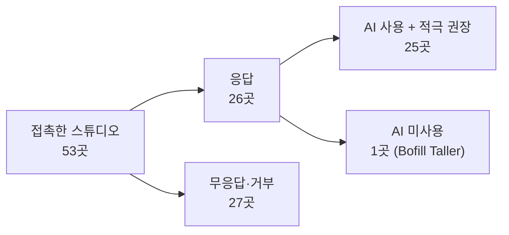
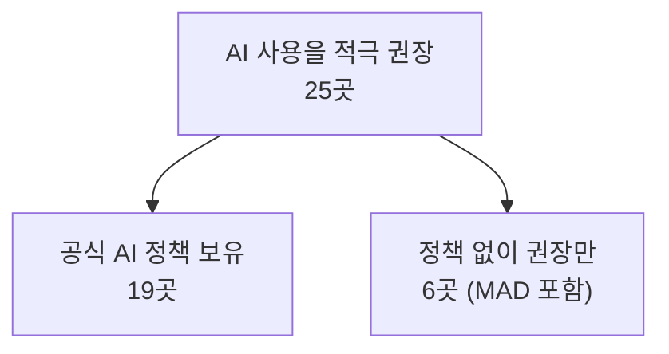
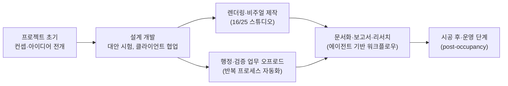
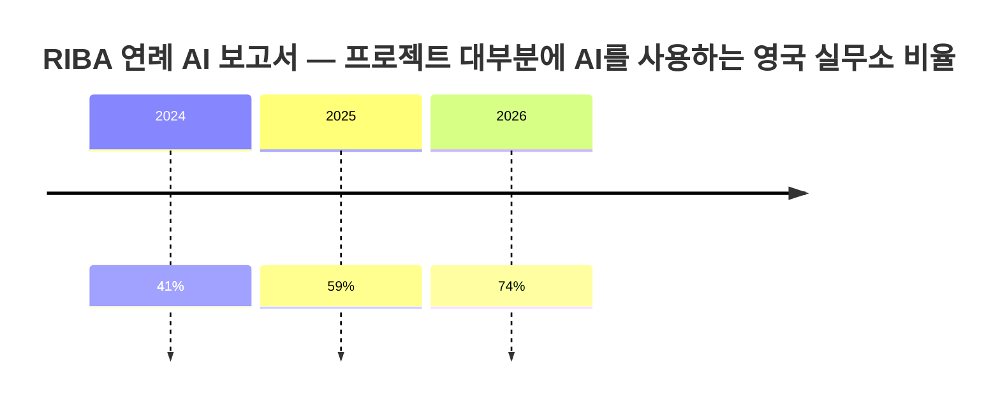

```
https://www.threads.com/share/BAVcpb1Ece/

세계 유명 건축 스튜디오들이 AI를 어떻게 쓰는지 조사한 게 나왔음.

26곳이 답했는데 25곳이 쓰는 정도가 아니라 쓰라고 권장하고 있음.
포스터+파트너스, 자하 하디드, 헤더윅 같은 데들임.

붙인 자리가 생각과 달랐어요.
시안 뽑는 데가 아니라 반복 확인이랑 서류 쪽이 1순위였음.
그걸 덜어내서 설계 볼 시간을 만든다는 얘기임.

절반 넘는 곳은 아예 자기네 걸 따로 만들었고
자료를 밖에 안 내보내려는 게 이유였음.

제일 많이 쓰는 건 Claude가 44%,
이미지는 나노 바나나가 25곳 중 7곳이었음.

근데 숫자 두 개가 안 맞음.
권장하는 데는 25곳인데 정책이 있다는 데는 19곳임.
쓰라고 하면서 어디까지 되는지는 안 정해준 거임.

도구 뭐 쓰냐만 보다 보면 놓치는데
어디까지 쓸지 적어두는 게 먼저인 것 같음.

조사 보고 적는 거임. 기사는 다음 글에 붙임.

 https://www.dezeen.com/2026/08/25/architecture-studios-encouraging-ai-feature/
```


## 이 글이 다루는 내용

건축·디자인 전문매체 Dezeen이 2026년 8월 25일 공개한 조사 기사 "Big-name studios encouraging architects to use AI"(대형 스튜디오들, 건축가들에게 AI 사용을 권장하다)를 원문 그대로 확인하고, 관련된 다른 취재 및 산업 보고서를 함께 교차 검증하여 정리한 글이다. Foster + Partners, Zaha Hadid Architects(ZHA), OMA, SOM, Snøhetta, MAD, Heatherwick Studio 등 세계적인 건축 설계사무소 26곳이 자신들의 AI 활용 방식을 직접 밝혔다는 점에서, 개별 도구 리뷰보다 훨씬 신뢰도 높은 산업 전반의 스냅샷이라고 볼 수 있다.

---

## 조사는 어떻게 이루어졌나

Dezeen은 세계 유수 건축 스튜디오들에 AI 활용 여부를 문의했다. 총 53곳에 접촉했고, 이 중 26곳이 답변을 보내왔으며 27곳은 답변을 거부하거나 응답하지 않았다. 응답한 26곳 가운데 25곳은 단순히 AI를 "쓰고 있다"는 수준을 넘어, 조직 차원에서 AI 사용을 적극적으로 권장하고 있다고 밝혔다. 유일하게 AI를 사용하지 않는다고 답한 곳은 바르셀로나의 Bofill Taller de Arquitectura였는데, 이 스튜디오는 이유를 설명하지 않았고 후속 질문에도 응답하지 않았다.



응답한 스튜디오 목록에는 영국의 ZHA와 Heatherwick Studio, 미국의 HOK와 SOM, 로테르담 기반의 OMA, 인도의 Morphogenesis, 노르웨이의 Snøhetta, 중국의 MAD 등이 포함되어 있다. MAD의 어소시에이트 파트너 티파니 달렌(Tiffany Dahlen)은 "지난 2년간 AI의 컴퓨팅 파워와 정교함이 기하급수적으로 성장했다"며 "디자이너로서 우리는 이 기술을 다른 소프트웨어나 스킬과 마찬가지로 익혀야 하는 대상으로 받아들여야 한다"고 말했다. 그는 이를 손 드로잉에서 CAD로, 다시 Revit으로 넘어갔던 과거의 기술적 전환에 비유하며, "받아들이지 않으면 뒤처지게 된다는 것이 명백하다"고 덧붙였다.

---

## "권장"과 "정책"은 다른 이야기다

이 조사에서 가장 눈에 띄는 대목은 숫자 두 개가 서로 어긋난다는 점이다. AI 사용을 적극 권장한다고 답한 곳은 25곳이었지만, 조직 차원의 공식 AI 정책을 갖추고 있다고 확인한 곳은 19곳에 그쳤다. MAD를 포함한 6곳은 직원들에게 AI 활용을 독려하면서도 공식 정책은 아직 마련하지 못했다고 밝혔다. 달렌은 "아직 공식적인 정책은 없지만, 직원들이 일상 업무에 AI를 통합하도록 독려하고 있다"고 말했다.



정책을 갖춘 곳들의 접근 방식은 저마다 결이 다르다. HOK의 시니어 프린시펄 맷 브레이덴탈(Matt Breidenthal)은 "HOK는 회사 전반에서 책임 있는 AI 사용을 적극 장려하며, 이는 서로 보완적인 두 개의 회사 정책, 즉 AI 사용이 어떻게 이루어져야 하는지를 규정하는 'AI 승인 사용 정책'과 회사의 AI 관련 노력을 어떻게 관리할지 정의하는 'AI 거버넌스 정책'을 통해 뒷받침된다"고 설명했다.

반면 덴마크의 CF Møller는 좀 더 신중한 태도를 드러냈다. 스튜디오 파트너 루네 비에르노 닐센(Rune Bjerno Nielsen)은 "우리는 직원들에게 AI 사용을 권장하지만, 신중하게 접근하라고 말한다"며 "부서나 직무에 따라 AI의 효용은 크게 달라질 수 있고, 실제로 의미 있는 효과를 낼 때만 사용하려 한다. 그렇지 않으면 비용이 지나치게 커지고, 데이터센터가 유발하는 환경적 영향도 고려해야 한다"고 말했다.

포스터+파트너스의 마사 치가리(Martha Tsigkari)와 셰리프 엘타라비시(Sherif Eltarabishy)는 "우리는 데이터, 기밀 유지, 지식재산권과 관련해 실무를 보호하기 위한 공식 AI 정책을 마련했다. 이를 통해 대규모로도 AI를 안전하게 활용할 수 있다"고 밝혔다. ZHA의 닐스 피셔(Nils Fischer)와 샤제이 부샨(Shajay Bhooshan)도 "우리의 초점은 기회와 위험, 특히 데이터 처리와 관련한 위험에 대해 팀에 명확한 가이드를 제공하면서도 실험의 여지를 남겨두는 데 있다"고 답했다.

Heatherwick Studio의 경우, AI 전략의 첫 단계로 AI 활용의 "위험과 기회"를 평가하는 AI 워킹그룹을 먼저 만들었고, 그다음 단계로 정책과 프레임워크를 수립했다. 이 스튜디오의 응용연구·AI 디렉터 파블로 자모라노(Pablo Zamorano)는 "전략의 첫 조치 중 하나가 정책을 마련하는 것이었고, 이는 윤리적 사용, 투명성과 정직성, 품질 보증, 지식재산권, 데이터 프라이버시, 그리고 이 기술에 대한 사용자들의 일반적인 우려에 초점을 맞췄다"고 말했다.

이 간극, 즉 "쓰라고 독려하는 조직의 수"와 "어디까지 써도 되는지 규정한 조직의 수" 사이의 차이는 산업 차원의 통계로도 뒷받침된다. 아래에서 다룰 영국왕립건축가협회(RIBA)의 2026년 AI 보고서 역시 채택 속도에 비해 거버넌스가 뒤따라가지 못하고 있다는 점을 별도로 지적하고 있다.

---

## 어떤 도구를 얼마나 쓰고 있나

Dezeen 조사에서 가장 명확하게 드러난 순위는 도구 선호도다. 대화형 AI 도구 중에서는 Anthropic이 만든 Claude.ai가 조사 대상 스튜디오의 44%가 사용한다고 답해 가장 많이 쓰이는 도구로 나타났다. 그 뒤를 구글의 Gemini(8개 스튜디오)가 이었고, Microsoft Copilot과 ChatGPT는 각각 24%의 스튜디오가 사용한다고 밝혔다.

렌더링·비주얼 콘텐츠 제작 도구로는 Gemini의 Nano Banana가 25곳 중 7곳이 사용한다고 답해 가장 인기가 많았고, Stable Diffusion과 xFigura가 각각 12%의 스튜디오에서 언급됐다.

| 구분 | 도구 | 응답 비율 / 응답 수 |
|---|---|---|
| 대화형 AI | Claude.ai (Anthropic) | 44% |
| 대화형 AI | Gemini (Google) | 8개 스튜디오 |
| 대화형 AI | Microsoft Copilot | 24% |
| 대화형 AI | ChatGPT (OpenAI) | 24% |
| 렌더링·비주얼 생성 | Nano Banana (Gemini 계열) | 25곳 중 7곳 |
| 렌더링·비주얼 생성 | Stable Diffusion | 12% |
| 렌더링·비주얼 생성 | xFigura | 12% |

다만 이 수치들은 배타적 선택이 아니라 복수 응답을 허용한 결과로 보이며(한 스튜디오가 여러 도구를 동시에 쓴다고 답할 수 있음), 합산했을 때 100%를 넘어가는 것도 그 때문이다. 표는 "가장 인기 있는 순서"로 읽는 것이 맞고, "시장 점유율"로 해석하는 것은 정확하지 않다.

또 하나 두드러지는 흐름은 자체 시스템 구축이다. AI를 사용한다고 밝힌 스튜디오 가운데 절반이 넘는 곳이 자체적으로 인하우스 AI 시스템을 만들었다고 답했으며, 여기에는 Foster + Partners, Hassell, Heatherwick Studio, MVRDV, OMA, Gensler가 포함된다. 이런 선택의 배경에는 개인화와 데이터 프라이버시라는 두 가지 이유가 있다고 Dezeen은 짚었다. 외부 도구에 설계 데이터나 클라이언트 정보를 넘기는 데 따르는 위험을 줄이면서도, 자기 조직의 워크플로우에 맞춘 도구를 쓰고 싶어 한다는 뜻이다.

---

## 실제로 무엇에 쓰고 있나 — 반복 업무부터 설계 초기 단계까지

조사에 응한 스튜디오들이 공통적으로 꼽은 AI의 첫 번째 용처는 화려한 디자인 생성이 아니라 반복적인 행정·검증 업무를 덜어내는 일이었다. OMA의 매니징 파트너 데이비드 지아노텐(David Gianotten)은 "오늘날 건축 실무의 상당 부분은 검증 작업으로 채워져 있으며, 이는 갈수록 형식적이고 반복적이며 시간이 많이 드는 일이 되어 디자인적 사고에 쓸 에너지를 갉아먹는다"고 말했다. 그는 "그래서 우리는 팀이 이런 반복 프로세스를 줄이기 위한 방법으로 AI를 적극적으로 탐색하도록 독려한다. 행정·검증 업무를 덜어냄으로써 건축가들이 관찰, 비판적 사고, 아이디어의 형성과 발전에 더 집중할 수 있게 된다"고 설명했다. Snøhetta의 뫼르세트(Mørseth) 역시 "AI는 워크플로우를 간소화하고 건축가와 디자이너들이 비창의적 업무에 쓰는 시간을 줄이는 데 탁월하다"고 맞장구쳤다.

그다음으로 많이 언급된 영역은 설계 초기 단계의 아이디어 전개다. 조사 대상 중 8곳이 초기 디자인 개발 단계에서 AI를 사용한다고 구체적으로 밝혔으며, 이 중 하나인 HOK의 브레이덴탈은 이 방식이 컨셉 단계에서 더 많은 반복 시도를 가능하게 해 의사결정과 창의성을 끌어올린다고 설명했다. 그는 "이런 도구들이 더 민첩하고 창의적이며 통찰력 있는 설계 과정을 위해 의사결정 속도를 높이고 협업을 강화한다는 것을 확인했다"고 말했다. White Arkitekter의 디지털오피스 총괄 피터 레우코비우스(Peter Leuchovius)도 생성형 AI를 설계 초기 단계에서 활용해 아이디어를 더 빠르게 시각화하고 여러 대안을 시험하며 클라이언트가 설계 과정에 더 적극적으로 참여할 수 있게 됐다고 말했다.

렌더링·비주얼 콘텐츠 제작 역시 AI가 가장 크게 파고든 영역 중 하나다. AI 사용을 권장하는 25곳 중 16곳이 렌더링·비주얼 콘텐츠 제작에 AI를 쓴다고 답했다. 원래는 외부 비주얼라이제이션 전문 스튜디오에 맡기던 작업이, 이제는 훨씬 적은 시간과 비용으로 사내에서 처리되는 경우가 늘고 있다. Hassell의 프린시펄 겸 디자인 총괄 사비에르 드 케스텔리에(Xavier De Kestelier)는 이런 변화의 배경으로 AI 인터페이스의 단순함을 꼽으며 "AI가 하는 일은 프로세스를 민주화하는 것이며, 전문적인 렌더링 기술이 없는 팀원도 매우 정교하고 수준 높은 결과물을 만들어낼 수 있게 해준다"고 말했다. CF Møller는 생성형 AI의 영향으로 Photoshop 사용량이 80% 줄었다고 밝혔는데, 이는 렌더링 후반 보정 작업 상당수가 생성형 AI 워크플로우로 대체됐다는 뜻으로 읽힌다.

이 밖에도 리서치, 분석 및 보고서 작성, 데이터 문서화, 모델링 등에서 AI가 활용되고 있다. SOM의 최고 디자인기술책임자(CDTO) 셰인 버거(Shane Burger)는 "우리는 AI와 에이전트 기반 워크플로우를 활용해 문서화 자동화, 데이터 정리, 컴퓨테이셔널 디자인 워크플로우, 장문 문서 검토, 맞춤형 소프트웨어 개발 같은 노동집약적 조율 작업을 간소화한다"고 말했다.



Foster + Partners의 치가리와 엘타라비시는 "우리는 개념 단계부터 준공 후 단계까지, 프로젝트 전체 타임라인에 걸쳐 배치할 수 있는 AI 도구들을 갖추고 있다"고 밝혀, AI 활용이 특정 단계에 국한되지 않고 프로젝트 전 생애주기로 확장되고 있음을 시사했다.

---

## AI가 아직 넘지 못하는 것 — 창의성 논쟁

도구를 이만큼 적극적으로 쓰면서도, 응답한 스튜디오 대부분은 인간의 창의성을 AI가 아직 대체할 수 없는 영역으로 명확히 구분했다. MAD의 달렌은 "AI가 어떤 작업에는 탁월하지만 다른 작업에서는 기준을 통과하지 못한다는 것을 배웠다"며 "때로는 영리하게 내가 생각하지 못한 연결점을 찾아내지만, 다른 때는 그저 반복적이고 부정확하거나 충분히 창의적이지 않다"고 말했다. OMA의 지아노텐은 "창의적 실무로서 우리는 AI가 창의적 작업을 대체하기보다 강화해야 한다고 믿는다"고 밝혔고, White Arkitekter의 레우코비우스는 "AI는 결코 인간의 창의성을 대체하지 못할 것"이라면서도 "다만 제대로 다루면 분명히 그것을 증폭시킬 것"이라고 덧붙였다.

---

## 더 넓은 맥락: 왜 지금 건축 업계가 이렇게 빠르게 움직이는가

### RIBA 2026 AI 보고서 — 채택은 급증, 거버넌스는 지체

영국왕립건축가협회(RIBA)가 2026년 발표한 세 번째 연례 AI 보고서에 따르면, 프로젝트 대부분에 AI를 사용한다고 답한 영국 건축 실무소의 비율은 2024년 41%에서 2025년 59%, 2026년 74%로 가파르게 늘었다. 응답자의 75%는 실무 생산성이 개선됐다고 답했고, 57%는 AI 투자에 대한 긍정적인 회수(ROI)를 경험했다고 밝혔다. 그러나 동시에 59%는 AI 도입이 결국 인력 감축으로 이어질 것이라 우려했고, 61%는 AI가 초급 연차 인력이 실무 경험과 핵심 역량을 쌓기 더 어렵게 만들 것이라는 데 동의했다. RIBA 리서치 총괄 에이드리언 맬리슨(Adrian Malleson)은 이 보고서에 대한 코멘트에서 "실무 현장의 거버넌스는 아직 도입 속도를 따라잡지 못했으며, 공식적인 AI 정책을 갖춘 실무소는 여전히 소수"라고 지적했다.



이 흐름은 Dezeen 조사에서 확인된 "권장 25곳 vs 정책 19곳"이라는 간극과 정확히 같은 방향을 가리킨다. 즉 도구 채택 속도가 규범·정책 수립 속도를 앞지르고 있다는 것이 영국뿐 아니라 세계 유수 스튜디오 차원에서도 반복적으로 관측되는 패턴이라는 뜻이다.

### Anthropic의 노동시장 영향 연구 — "이론적 노출도는 높지만, 실제 영향은 아직 낮다"

Anthropic이 2026년 초 발표한 연구 "Labor Market Impacts of AI: A New Measure and Early Evidence"는 Claude 사용 데이터를 바탕으로 각 직군의 AI "노출도"를 측정했다. 이론적 노출도(해당 직군의 업무 중 AI로 두 배 빠르게 처리할 수 있는 비중)에서 건축·엔지니어링 분야는 약 70%로 조사 대상 중 가장 높은 수준을 기록했고, 예술·디자인·미디어 분야도 68%로 뒤를 이었다. 그러나 실제 관측된 노출도, 즉 현실에서 AI가 대체하고 있는 업무의 비중은 이론치에 비해 훨씬 낮았다. 이 연구는 "이 격차는 AI가 아직 이론적 역량에 도달하지 못했음을 보여준다. 높은 노출도가 아직 실업으로 이어지지 않았다"고 밝혔다. 다만 22~25세의 신규 노동시장 진입자에 대해서는 채용이 다소 둔화됐다는 잠정적 증거가 있다고 언급했는데, 연구진은 이를 AI의 영향으로 단정하지는 않았다. 이는 미국건축가협회(AIA)가 앞서 발표한 조사에서 실제로 AI를 정기적으로 사용하는 현직 건축가가 6%에 불과했다고 밝힌 결과와도 궤를 같이 한다.

### EU AI Act — 렌더링에도 라벨링 의무가 걸린다

건축 렌더링·비주얼 콘텐츠 제작에 AI를 쓰는 흐름이 커지는 가운데, 규제 리스크도 함께 커지고 있다. 2026년 8월 2일 발효된 EU AI Act 제50조는 사실적인 이미지·오디오·영상을 생성하는 경우, 그것이 AI로 생성되었거나 수정되었다는 사실을 공개하도록 요구한다. 로펌 Addleshaw Goddard의 카운슬 시몬 시에니에비치(Szymon Sieniewicz)는 Dezeen과의 인터뷰에서 사람이 걸어다니는 사실적인 배경까지 포함한 AI 생성 렌더링이라면 "AI로 생성되었다는 라벨을 붙여야 한다"고 설명했다. 창작물 성격이 뚜렷한 작품은 예외를 인정받을 여지가 있지만, 분양·마케팅용으로 쓰이는 부동산 렌더링처럼 상업적 커뮤니케이션의 성격이 강한 결과물은 예외 적용을 받기 어렵다는 것이 법률 전문가들의 대체적인 해석이다. 이 조항은 EU 역내에서 공개되는 콘텐츠에 적용되지만, 여러 스튜디오가 이미 클라이언트 프레젠테이션용 렌더링에도 선제적으로 라벨을 붙이고 있다는 보도도 나온다. 25곳 중 16곳이 렌더링·비주얼 제작에 AI를 쓴다고 답한 Dezeen 조사 결과를 고려하면, 이는 상당수 스튜디오가 곧 실무적으로 마주하게 될 문제다.

---

## 정리 — 이 조사가 시사하는 것

이번 조사를 관통하는 흐름을 한 문장으로 요약하면, 건축 업계에서 AI는 이미 "쓸지 말지"를 논의하는 단계를 지나 "얼마나 잘, 그리고 어디까지 통제하며 쓸 것인지"를 논의하는 단계로 넘어갔다는 것이다. 다만 조사에서 드러난 정책·거버넌스의 공백은 몇 가지 실무적인 시사점을 남긴다.

첫째, AI 사용을 조직적으로 권장하기 시작하는 시점과 사용 범위·데이터 처리 기준을 문서화하는 시점 사이에 시차가 크게 벌어질수록, 이후에 발생하는 문제(기밀 유출, 저작권 분쟁, 결과물의 오류 검증 실패 등)를 사후적으로 수습해야 하는 비용이 커진다. HOK나 Foster + Partners처럼 사용 범위와 거버넌스를 별도 정책으로 분리해 관리하는 방식은, 정책 부재 상태에서 권장만 하는 것보다 리스크 관리 측면에서 분명한 이점이 있다.

둘째, 도구 선택보다 앞서야 하는 것은 업무 프로세스의 구조화다. OMA와 SOM의 사례에서 보듯, AI가 가장 먼저 효과를 낸 영역은 화려한 디자인 생성이 아니라 이미 정의되어 있던 반복적 검증·문서화 업무였다. 반대로 말하면, 업무 프로세스 자체가 정리되어 있지 않은 조직에서는 AI를 도입해도 그 효과를 체감하기 어렵다는 뜻이기도 하다.

셋째, 렌더링·비주얼 제작처럼 대외적으로 공개되는 산출물에 AI를 사용하는 경우, EU AI Act 같은 규제가 이미 현실화되고 있다는 점을 감안해 공개 여부와 무관하게 AI 생성 여부를 표기하는 내부 기준을 미리 마련해두는 편이 안전하다. 규제가 시행된 뒤에 대응하는 것보다, 표기 관행을 먼저 갖춰두는 쪽이 이후 발생할 수 있는 법적 리스크를 줄이는 길이다.

---

## 팩트체크

| 항목 | 확인 상태 | 비고 |
|---|---|---|
| Dezeen이 2026년 8월 25일 해당 기사를 게재한 사실 | 검증됨 | Dezeen 원문(dezeen.com/2026/08/25/architecture-studios-encouraging-ai-feature)을 직접 확인, 제공된 원문과 문장 단위로 일치 |
| 응답 26곳 중 25곳이 AI 사용을 적극 권장한다는 수치 | 검증됨 | Dezeen 원문에 명시 |
| Claude.ai 44%, Copilot·ChatGPT 각 24%, Gemini 8곳 등 도구별 수치 | 검증됨 (Dezeen 자체 조사 결과) | Dezeen이 직접 수행한 비공개 설문 결과이며, 별도의 공개 원자료나 제3의 독립 통계로는 교차 검증되지 않음. 표본이 53곳 중 26곳 응답이라는 한계도 있음 |
| AI 정책 보유 19곳, 미보유 6곳 | 검증됨 | Dezeen 원문에 명시 |
| RIBA 2026 AI 보고서의 74%(2026)·59%(2025)·41%(2024) 수치 | 검증됨 | RIBA 공식 발표 자료 및 보도자료로 교차 확인. 다만 이는 영국 내 실무소 대상 통계로, Dezeen이 조사한 세계 대형 스튜디오 표본과는 모집단이 다름 |
| Anthropic 노동시장 영향 연구의 건축·엔지니어링 이론적 노출도 약 70% | 검증됨 | Dezeen의 별도 보도(2026년 3월 11일자)로 확인. 이 수치의 산출 방법론은 Anthropic이 아닌 OpenAI 소속 연구자들이 만든 별도 논문에 기반함 |
| EU AI Act 제50조 발효일(2026년 8월 2일)과 렌더링 라벨링 의무 관련 내용 | 검증됨 | Dezeen의 별도 보도(2026년 8월 10일자) 및 법률 자문 코멘트로 확인 |
| CF Møller의 Photoshop 사용량 80% 감소 | 스튜디오 자체 추정치 | Dezeen에 스튜디오가 직접 밝힌 수치이며, 외부 감사나 별도 자료로 재확인되지는 않음 |

---

## 참고 자료

- Starr Charles, "Big-name studios encouraging architects to use AI", Dezeen, 2026년 8월 25일
- Ben Dreith, "Architects and engineers among professions most automatable by AI according to Anthropic", Dezeen, 2026년 3월 11일
- Rima Sabina Aouf, "Realistic AI architectural renderings must be labelled under EU AI Act", Dezeen, 2026년 8월 10일
- Royal Institute of British Architects(RIBA), "AI Report 2026" 및 관련 보도자료 "AI adoption reaches tipping point across UK architecture", 2026년 7월
- Anthropic, "Labor Market Impacts of AI: A New Measure and Early Evidence", 2026년 3월

---

작성일자: 2026년 9월 1일
