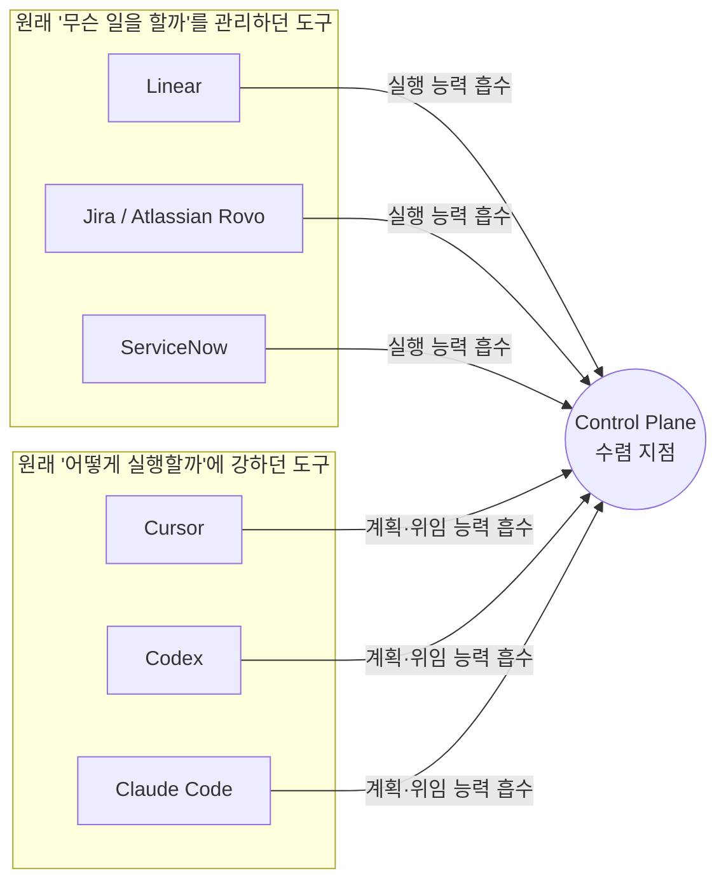
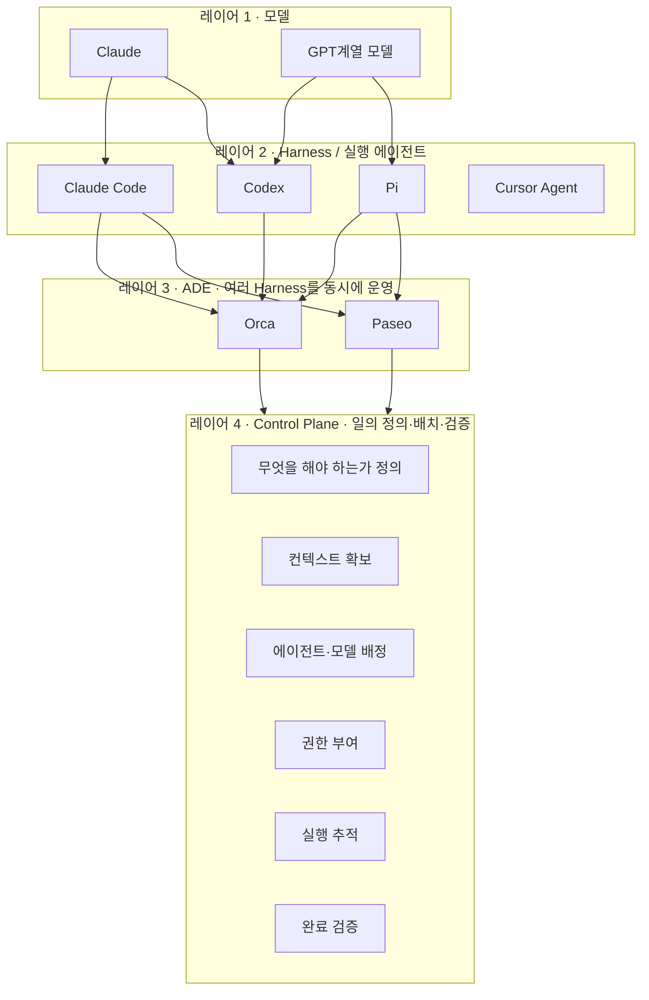

## 이 글의 출발점

이 문서는 Threads에 올라온 한 편의 글([threads.com/share/_nACV87Qb](https://www.threads.com/share/_nACV87Qb/))에서 출발한다. 원문의 핵심 주장은 단순하다. 지금 눈에 보이는 AI Agent 시장의 경쟁 — Linear·Jira·ServiceNow 같은 업무관리 소프트웨어, Claude·Codex 같은 모델 회사의 코딩 에이전트, Cursor 같은 개발 환경, 그리고 Orca·Paseo·Pi 같은 Harness/ADE(Agent Development Environment) — 는 서로 다른 시장에서 경쟁하는 것처럼 보이지만, 실제로는 모두 같은 지점을 향해 수렴하고 있다는 것이다. 그 지점이 바로 "Agentic Work Control Plane"이다.

이 문서는 원문의 논지를 그대로 옮기는 데 그치지 않고, 각 주장이 2026년 9월 현재 실제 시장에서 어느 정도까지 검증되는지를 웹 검색으로 하나씩 대조했다. 결론부터 말하면, 원문이 짚은 수렴 현상 자체는 업계 리서치 기관(Forrester, IBM, Gartner 계열 분석)과 각 벤더의 실제 제품 로드맵에서 상당히 구체적으로 확인된다. 다만 Orca·Paseo·Pi를 하나의 카테고리로 묶은 부분에는 결이 다른 지점이 있어 뒤에서 따로 짚는다.

---

## 1. 지금 시장에서 실제로 벌어지고 있는 일: 두 방향에서의 수렴

원문이 말하는 "관리 도구는 아래로, 실행 도구는 위로"라는 흐름은 비유가 아니라 각 회사의 최근 제품 발표를 보면 그대로 드러난다.

Linear는 원래 이슈 트래킹 도구였지만, 2026년 3월 공개 베타로 나온 Linear Agent와 Loops 기능부터는 워크스페이스 안에서 이슈를 만들고 갱신하고 요약하는 것을 넘어, 정해진 일정이나 이벤트에 따라 백그라운드에서 실행까지 하는 구조로 넘어갔다. 여기에 더해 GitHub Copilot의 클라우드 에이전트가 2026년 7월 23일 Linear 통합 GA(정식 출시)를 발표하면서, PM이 팀원에게 업무를 배정하듯 Linear 이슈를 Copilot에게 그대로 할당하면 Copilot이 격리된 GitHub Actions 환경에서 작업하고 진행 상황을 Linear 타임라인에 실시간으로 스트리밍한 뒤 초안 PR을 여는 흐름이 표준 워크플로로 자리잡았다.

Atlassian(Jira의 모기업)도 같은 방향이다. Rovo라는 이름의 AI 레이어는 2024년 검색·채팅 기능으로 시작했지만, 2026년 5월 Team '26 컨퍼런스를 거치며 자율 에이전트, 노코드 에이전트 빌더(Rovo Studio), 그리고 조직 전체의 사람·프로젝트·문서·코드를 연결하는 "Teamwork Graph"까지 포함하는 넓은 AI 운영 레이어로 확장됐다. Jira 자체 페이지에는 "에이전트를 프로젝트에 내장해 자율적으로 운영하고 딜리버리 속도를 높인다"는 문구가 그대로 실려 있다.

ServiceNow는 이 흐름에서 가장 노골적이다. 2026년 5월 Knowledge 2026 컨퍼런스에서 ServiceNow는 스스로를 "AI Control Tower for Business Reinvention"이라고 재정의했다. AI Agent Orchestrator가 여러 에이전트를 조율하고, AI Control Tower가 거버넌스와 모니터링을 담당하며, Workflow Data Fabric이 실행에 필요한 실시간 데이터를 공급하는 구조다. 이 자리에는 NVIDIA CEO 젠슨 황이 직접 등장해 ServiceNow를 "기업 AI 에이전트의 운영체제가 될 운명"이라고 표현하기도 했다.

반대 방향, 즉 실행 도구가 관리·기획 레이어로 올라오는 흐름도 뚜렷하다. Cursor는 2025년 8월부터 Background Agent(현재는 Cloud Agent로 개명)를 통해 Linear 이슈 컨텍스트를 그대로 읽어 계획을 세우고 구현까지 진행한 뒤 PR을 열도록 했고, 2026년 4월 출시된 Cursor 3는 아예 여러 에이전트를 동시에 돌리는 것을 인터페이스의 중심에 두는 "3 Agents Window" 구조로 전환했다. 이런 흐름은 Codex나 Claude Code 같은 모델 회사발 코딩 에이전트에서도 공통적으로 관찰된다. 원래는 "어떻게 실행할 것인가"에 집중하던 도구들이 태스크 정의, 계획, 위임, 백그라운드 실행 같은 상위 레이어 기능을 계속 흡수하고 있다.

---

## 2. 그 사이의 빈 공간: Harness와 ADE, 그리고 정확한 용어 정리

원문은 Orca, Paseo, Pi를 묶어 "여러 Agent와 모델을 연결하고 실행하는 Harness/ADE"라고 표현했다. 이 부분을 검색으로 대조해 보면, 셋을 완전히 동일 선상에 놓기보다는 층위를 한 단계 나눠 이해하는 편이 더 정확하다.

Pi는 Armin Ronacher(Flask, Jinja2 개발자)와 Mario Zechner가 만든 오픈소스 코딩 에이전트 하네스 자체다. 시스템 프롬프트를 1,000토큰 이하로 최소화하고 "지연 로딩되는 스킬" 구조를 쓰는 것이 특징이며, GitHub 스타 수가 9만 개를 넘는다. 즉 Pi는 Claude Code, Codex, OpenCode와 같은 층위에 있는 "실행되는 에이전트" 중 하나다.

Orca와 Paseo는 이런 개별 하네스들을 여러 개 동시에 띄우고 관리하는 상위 레이어, 즉 ADE(Agent Development Environment)다. Orca는 Y Combinator 출신 4인 팀 Stably AI가 만든 데스크톱 앱으로, Claude Code·Codex·Cursor·Pi를 포함해 터미널에서 돌아가는 거의 모든 에이전트를 지원한다. 첫 커밋 이후 5개월 만에 GitHub 스타 3만 7천 개를 넘었고, 이후에도 계속 늘어 4만 개 초반대에 이르렀다. Paseo는 데스크톱과 모바일에서 Claude Code, Codex, Cursor, OpenCode, Pi 같은 각 제공자의 네이티브 하네스를 그대로 서브프로세스로 실행하면서, 사용자의 기존 구독·스킬·설정·MCP 서버를 그대로 활용하도록 설계됐다는 점이 특징이다.

정리하면, Pi는 "실행 엔진"이고 Orca·Paseo는 "그 실행 엔진들을 여러 개 동시에 배치하고 감독하는 조종석"에 가깝다. 원문의 "Harness/ADE"라는 병렬 표기 자체는 이 구분을 뭉뚱그린 것이긴 하지만, 셋 모두 "어떤 모델·어떤 에이전트를 쓰느냐보다 이 일을 가장 잘 끝내는 조합을 어떻게 구성하느냐가 중요하다"는 철학을 공유한다는 원문의 핵심 주장 자체는 세 제품 모두에서 확인된다. Orca와 Paseo 모두 "당신의 기존 구독(Claude, Codex 등)을 그대로 가져와 쓰라"는 것을 제품 설명 첫머리에 내세우고 있다.

---

## 3. Harness와 Control Plane은 정확히 무엇이 다른가

원문의 논지 중 가장 중요한 부분은 이 구분이다. Harness는 에이전트를 잘 실행시키는 도구고, Control Plane은 일이 실제로 끝났는지를 관리하는 계층이라는 것이다. 이 구분은 실제로 업계에서 "Agent Control Plane"이라는 명칭으로 이미 독립된 카테고리로 자리잡는 중이다.

리서치 기관 Forrester는 2025년 12월 "Agent Control Plane" 시장을 공식 평가 대상으로 발표했고, 이를 "이질적인 AI 에이전트를 목록화하고, 거버넌스하고, 오케스트레이션하고, 보증하는 인프라"로 정의했다. IBM은 자사 설명 페이지에서 개별 에이전트가 도구를 호출하고 태스크를 실행하는 "데이터 플레인"에서 동작하는 반면, Control Plane은 그 위에 앉아 에이전트가 어떻게 배치되고 서로 어떻게 협업하며 어떤 규칙을 따르는지를 결정하는 중앙 통제소 역할을 한다고 설명한다. IBM의 기업가치연구소(IBV) 조사에 따르면 이미 기업의 96%가 어떤 형태로든 AI 에이전트를 사용하고 있다고 답했다.

같은 흐름은 하이퍼스케일러들의 2026년 행보에서도 반복된다. Microsoft는 2026년 5월 1일 Agent 365를 정식 출시하며 마이크로소프트 생태계 전반의 AI 에이전트를 관찰·거버넌스·보안 관리하는 통합 Control Plane을 표방했고, Google은 같은 해 4월 Cloud Next 2026에서 Gemini를 단일 모델이 아니라 데이터 시스템과 애플리케이션, 에이전트 런타임을 잇는 "연결 레이어"로 포지셔닝했다. 컨퍼런스를 취재한 SiliconANGLE은 이를 두고 모델 리더보드 자체가 잘못된 스코어보드일 수 있으며, 기업 가치는 모델 성능 자체보다 인프라·데이터 파이프라인·에이전트 런타임이라는 "시스템 레이어"에서 만들어지고 있다고 짚었다.

이 지점에서 원문의 주장 — "Harness 시장의 벤치마크는 모델 성능, 속도, 토큰 효율, 툴 콜링, 컨텍스트 크기처럼 상대적으로 단순하지만, Work Control Plane의 벤치마크는 일마다 완료 조건이 다르고 조직마다 워크플로가 다르며 사람의 승인까지 필요해 훨씬 어렵다" — 도 업계 논의와 정확히 겹친다. Forrester는 2026년 3월 별도 블로그에서 Control Plane을 실제로 운영 가능하게 만들려면 불완전한 계측, 이식 가능한 에이전트 정체성 부재, 플레인 간 거버넌스 스키마 누락이라는 세 가지 표준화 공백이 남아 있다고 지적했고, NIST도 2026년 2월 AI Agent Standards Initiative를 발족시켜 이 공백을 메우려 하고 있다.

---

## 4. "일이 끝났다"는 것을 어떻게 정의할 것인가

원문이 던지는 질문 — 코드가 생성되면 끝난 것인가, PR이 머지되면 끝난 것인가, 프로덕션에 배포되면 끝난 것인가, 버그가 재발하지 않아야 끝난 것인가, 고객의 문제가 실제로 해결되어야 끝난 것인가 — 은 아직 업계 전체가 합의한 답을 갖고 있지 않다. 다만 이 문제를 정면으로 다루려는 시도는 이미 형성되고 있다. ServiceNow의 Agentic Playbooks나 Agent Orchestrator는 승인, 예외 처리, 부서 간 조율, 규제 통제까지 포함하는 것을 목표로 내세우고 있고, IBM watsonx Orchestrate는 어떤 프레임워크로 만들어진 에이전트든 프레임워크에 구애받지 않고 관리하겠다는 방향을 취하고 있다. 이런 시도들의 공통점은 "에이전트가 얼마나 활발히 움직였는가(activity)"가 아니라 "일이 실제로 완료됐는가(completion)"를 측정 단위로 삼으려 한다는 점인데, 이는 원문이 강조하는 지점과 정확히 일치한다.

다만 냉정하게 보면, 이 완료 정의 문제는 아직 업계 표준이라 부를 만한 것이 없는 영역이다. 리서치 기관들이 "표준화가 시급하다"고 반복해서 지적하고 있다는 사실 자체가, 이 문제가 아직 미해결 상태라는 방증이다. 그래서 원문이 "누가 이 완료를 가장 정확하게 정의하고 측정하느냐가 큰 해자(moat)가 될 수 있다"고 짚은 부분은, 현재로서는 검증된 결론이라기보다는 타당성 있는 예측에 가깝다.

---

## 5. 모델 회사는 왜 서두르지 않아도 되는가

원문은 OpenAI나 Anthropic 같은 모델 회사가 특정 vertical을 직접 점유하기보다는, 범용 에이전트 역량과 툴 사용 능력을 계속 강화하며 시장이 형성되는 것을 지켜볼 유인이 있다고 본다. 이 부분은 Anthropic의 실제 행보로 상당 부분 뒷받침된다. Anthropic은 2026년 3월 Claude Partner Network를 출범시키고 1억 달러 규모의 투자를 커밋하면서 컨설팅·기술·서비스 파트너 트랙을 나눠 Salesforce나 Microsoft가 과거에 썼던 것과 같은 파트너 생태계 확장 전략을 택했다. Deloitte는 47만 명이 넘는 임직원에게 Claude를 배포하는 계약을 맺었고, KPMG는 Claude의 Cowork와 Managed Agents를 자사 플랫폼에 통합해 27만 6천 명 전원에게 제공하기로 했다. 동시에 Anthropic은 Snowflake, Salesforce, Microsoft, NVIDIA와 각각 별도의 전략적 파트너십을 맺어 Claude를 여러 기업용 플랫폼에 직접 심는 방식을 택하고 있다. 이는 원문이 말한 "승자가 명확해지면 직접 진입하거나, 파트너십을 맺거나, 인수하는 선택"이 이미 파트너십 축을 중심으로 현실화되고 있다는 뜻으로 읽힌다. 특정 vertical SaaS를 직접 만들어 경쟁하기보다, 그 SaaS들이 결국 Claude를 채택하도록 만드는 편이 모델 회사 입장에서는 더 낮은 리스크로 더 넓은 사용량을 확보하는 길이기 때문이다.

---

## 6. BYOK를 넘어 BYOS(Bring Your Own Subscription)로

원문이 짚은 "기업은 이미 Anthropic에 거액을 지불하고 있는데, 왜 SaaS 안에서 Claude를 쓰려고 다시 크레딧을 사야 하는가"라는 질문은 2026년 상반기 실제로 업계에서 반복적으로 제기된 논리다. Kilo Code 같은 도구는 2026년 6월 "마크업 0%"를 헤드라인 기능으로 내세우며 자체 API 게이트웨이를 통해 사용자의 기존 구독이나 API 키를 그대로 연결해 제공자 정가로 청구하는 방식을 택했다. 업계 분석 글에서는 이를 두고 "구매자가 200달러짜리 도구가 실제로는 8달러의 API 호출로 돌아간다는 걸 알게 되는 순간, 그 구독은 소프트웨어가 아니라 세금처럼 느껴지기 시작한다"고 표현하기도 했다.

이 흐름은 개발자 개인 차원의 BYOK(Bring Your Own Key)에서, 원문이 예견한 "Bring Your Own Subscription / Bring Your Own AI Capacity"로 확장되는 조짐도 보인다. Paseo와 Orca 모두 "당신의 Claude 또는 Codex 구독을 그대로 가져와 실행한다"는 것을 핵심 가치 제안으로 내세우고 있고, GitHub 공식 저장소 설명에도 "자신의 구독으로 어떤 코딩 에이전트든 돌린다(Run any coding agent with your own subscription)"는 문구가 명시돼 있다. 다만 이것이 아직 개인·소규모 팀 수준을 넘어 SSO, 권한 관리, 감사(audit), 비용 배분, 보안까지 갖춘 엔터프라이즈 스케일로 완전히 확장됐는지는 별개의 문제다. 이 지점이 원문이 지적한 대로, ADE 계열 제품들이 다음 단계로 넘어가야 할 실제 과제로 남아 있다.

---

## 7. 정리 — 누가 무엇을 소유하려 하는가

| 진영 | 대표 사례 | 원래 강점 | 지금 확장하는 방향 |
|---|---|---|---|
| 모델 회사 | Claude(Anthropic), Codex(OpenAI) | Intelligence 자체 | 파트너 생태계 확대, 범용 에이전트·툴 사용 능력 강화 |
| Harness / 실행 에이전트 | Claude Code, Codex, Pi, Cursor Agent | 코드 작성·실행 | 계획, 위임, 백그라운드 실행 등 상위 레이어 흡수 |
| ADE | Orca, Paseo | 여러 Harness를 동시에 배치·관리 | 엔터프라이즈급 거버넌스·비용 배분으로 확장 시도 |
| 업무관리/거버넌스 플랫폼 | Linear, Jira(Atlassian Rovo), ServiceNow | 업무 컨텍스트, 권한, 이력 | 실행 능력을 직접 흡수(자체 에이전트, 오케스트레이터) |
| 하이퍼스케일러 | Microsoft(Agent 365), Google(Gemini), IBM(watsonx) | 인프라, 클라우드 지배력 | 프레임워크 불문 통합 Control Plane 제공 |

이 다섯 진영이 공통으로 노리는 가운데 영역이 원문이 말하는 Agentic Work Control Plane이며, 이 명칭 자체가 이제는 Forrester 같은 리서치 기관이 정식으로 카테고리 평가에 들어갈 만큼 구체화된 시장으로 인정받고 있다.

---

## 8. 팩트체크 요약

| 원문의 주장 | 검증 결과 | 근거 |
|---|---|---|
| Linear·Jira·ServiceNow가 실행 레이어를 흡수하고 있다 | 사실로 확인 | Linear Agent/Loops(2026.3 베타), GitHub Copilot-Linear 통합 GA(2026.7.23), Atlassian Rovo Agents(Team '26, 2026.5), ServiceNow AI Control Tower·Agent Orchestrator(Knowledge 2026) |
| Cursor·Codex·Claude Code가 계획·위임 레이어로 올라오고 있다 | 사실로 확인 | Cursor Background/Cloud Agent, Cursor 3의 "3 Agents Window"(2026.4.2 출시) |
| Orca, Paseo, Pi가 동일한 층위의 "Harness/ADE"다 | 부분적으로 정확, 세분화 필요 | Pi는 개별 실행 하네스(earendil-works 오픈소스)이며, Orca·Paseo는 여러 하네스(Pi 포함)를 동시에 운영하는 ADE. 원문의 "Harness/ADE" 병기 표현 자체와는 어긋나지 않지만 층위 구분이 필요 |
| "Agent Control Plane"이 독립 카테고리로 형성 중이다 | 사실로 확인 | Forrester 공식 카테고리 평가 개시(2025.12), IBM·Microsoft(Agent 365, 2026.5.1 GA)·Google·ServiceNow가 각각 유사 개념 제품 발표 |
| "완료(Completion)" 정의가 핵심 모트가 될 것이다 | 저자의 분석적 전망(현재로선 검증 불가) | 업계에서 완료 측정 표준이 아직 없다는 점은 Forrester·NIST의 표준화 공백 지적으로 뒷받침되지만, 특정 기업이 이를 선점했다는 근거는 없음 |
| 모델 회사가 vertical을 직접 점유하기보다 지켜보는 전략을 취한다 | 사실과 부합 | Anthropic의 Claude Partner Network(2026.3, 1억 달러 투자), Deloitte·KPMG·Snowflake·Salesforce·Microsoft와의 대형 파트너십 다수 확인 |
| BYOK를 넘어 BYOS(Bring Your Own Subscription)가 중요해질 것이다 | 방향성은 확인, 완전한 엔터프라이즈 스케일은 아직 진행형 | BYOK 트렌드 자체는 2026년 상반기 폭넓게 확인(Kilo Gateway 0% 마크업 등), Orca·Paseo가 "당신의 구독으로 실행"을 핵심 가치로 내세움. 다만 SSO·감사·비용배분까지 갖춘 완전한 엔터프라이즈 사례는 아직 뚜렷하지 않음 |

---

## 9. 사업 준비를 위해 남는 질문들

원문이 마지막에 던지는 질문 — 누가 일을 정의하는가, 누가 필요한 컨텍스트를 갖고 있는가, 누가 에이전트를 배치하는가, 누가 완료 여부를 판단하는가 — 은 이 문서에서 검증한 시장 동향과 겹쳐 보면 다음과 같이 재구성할 수 있다.

첫째, 업무 컨텍스트와 거버넌스는 이미 Linear·Jira·ServiceNow 같은 기존 플랫폼이 쥐고 있고, 이들은 실행 능력을 자체 개발하거나 Cursor·Copilot 같은 외부 에이전트를 통합하는 방식으로 빈틈을 메우고 있다. 둘째, 실행 능력은 이미 Claude Code·Codex·Pi 같은 하네스와 이를 다루는 Orca·Paseo 같은 ADE가 상당히 성숙한 상태이며, 이들의 다음 과제는 정확히 원문이 짚은 것처럼 엔터프라이즈급 거버넌스로의 확장이다. 셋째, 이 둘 사이에서 아직 명확한 승자가 없는 것이 "완료를 정의하고 측정하는" 계층이며, 이것이 바로 Forrester가 막 카테고리 평가를 시작한 Agent Control Plane 시장이다.

따라서 이 시장에 사업을 준비한다면, 어떤 모델이나 어떤 에이전트를 더 잘 만드는가보다, 조직마다 다른 "완료 조건"을 어떻게 정형화하고 측정 가능한 형태로 바꿀 것인가, 그리고 그 측정 체계를 기존의 업무관리 컨텍스트(Linear, Jira, ServiceNow류)와 실행 레이어(Claude Code, Codex, Cursor, Orca, Paseo류) 양쪽에 모두 걸치도록 설계할 것인가가 실질적인 질문이 된다.

---

*작성일: 2026년 9월 2일*
