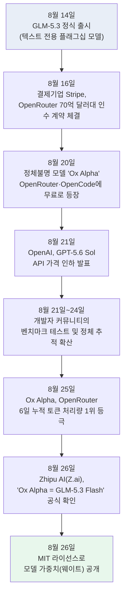
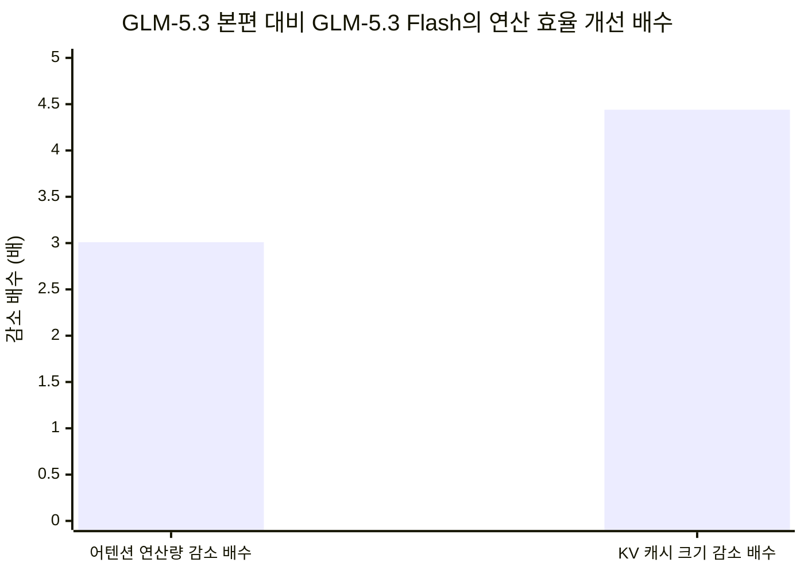
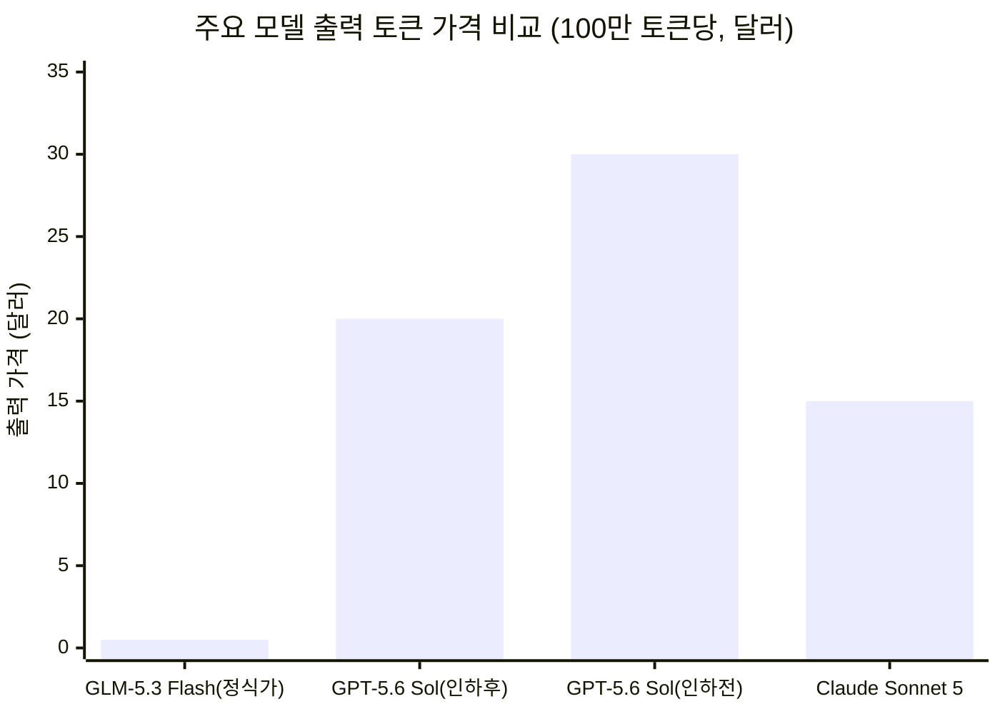
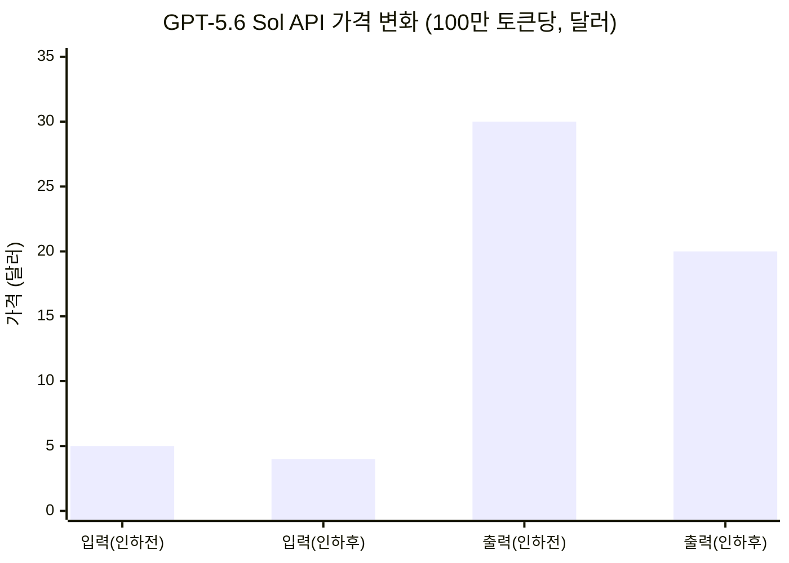

- 원문: 테크월드, 김승기 기자, [「中 GLM-5.3 Flash 사용량 1위…AI 경쟁, 성능 넘어 '가격·효율'로」](https://www.epnc.co.kr/news/articleView.html?idxno=406247) (2026.9.1 발행)
- 이 문서는 원문 기사를 바탕으로 다수의 해외 매체와 벤더 공식 발표를 교차 검증하여 재구성한 상세 해설 자료입니다.

## 관련글

[**정체불명의 스텔스 모델 'Ox Alpha', Z.ai의 GLM-5.3-Flash로 밝혀지기까지**](https://k82022603.github.io/posts/%EC%A0%95%EC%B2%B4%EB%B6%88%EB%AA%85%EC%9D%98-%EC%8A%A4%ED%85%94%EC%8A%A4-%EB%AA%A8%EB%8D%B8-'ox-alpha',-z.ai%EC%9D%98-glm-5.3-flash%EB%A1%9C-%EB%B0%9D%ED%98%80%EC%A7%80%EA%B8%B0%EA%B9%8C%EC%A7%80/)

---

## 목차

1. 개요 — 무슨 일이 있었나
2. 사건의 타임라인
3. 이름 없이 등장한 모델, 'Ox Alpha'
4. 커뮤니티의 추적: 누가 만들었는가
5. Zhipu AI(Z.ai)의 공식 확인
6. 왜 이렇게 싸고 빠른가: 모델 구조 뜯어보기
7. 실력은 어느 정도인가: 벤치마크 성적표
8. 가격은 얼마인가: 이용료 상세
9. 왜 '토크노믹스'가 화두로 떠올랐나
10. 미국의 반격: GPT-5.6 Sol 가격 인하
11. 더 큰 그림: 중국 AI 생태계와 오픈웨이트 전략
12. 이 사건이 의미하는 것
13. 출처 투명성 표
14. 참고문헌

---

## 1. 개요 — 무슨 일이 있었나

2026년 8월 말, 글로벌 AI 업계에서 화제가 된 사건은 크게 두 갈래로 요약할 수 있습니다. 하나는 중국 Zhipu AI(대외 브랜드명 Z.ai)가 만든 신형 모델 'GLM-5.3 Flash'가 정체를 숨긴 채 등장해 순식간에 글로벌 AI 모델 유통 플랫폼 OpenRouter에서 사용량 1위에 올랐다는 것이고, 다른 하나는 이 사건을 계기로 AI 업계 전반에서 모델의 절대적 성능보다 '토큰 하나를 처리하는 데 드는 비용과 속도', 즉 '토크노믹스(Tokenomics)'가 새로운 경쟁의 축으로 부상했다는 것입니다.

이 문서는 원문 기사가 다룬 핵심 사실관계 — Ox Alpha의 등장과 정체 공개, 모델 구조의 효율화, 벤치마크 성적, 가격 정책, 그리고 OpenAI의 가격 인하 대응 — 를 각각 짚어보고, 원문에서는 지면 관계상 다루지 않은 배경 맥락(OpenRouter의 소유권 변화, 벤치마크 수치의 출처와 한계, 중국 AI 생태계의 전반적 흐름 등)을 함께 정리했습니다.

---

## 2. 사건의 타임라인

전체 흐름을 시간순으로 보면 아래와 같습니다. 8월 14일 GLM-5.3 정식 출시로 시작해 8월 26일 정체 공개까지, 약 열흘 사이에 벌어진 일입니다.

특히 8월 16일 결제 서비스 기업 Stripe가 OpenRouter를 70억 달러 이상에 인수하는 계약을 체결했다는 사실이 알려진 지 불과 나흘 만에 Ox Alpha가 등장했다는 점은, 이 사건을 지켜본 업계 관계자들 사이에서도 시점상의 우연으로 자주 언급되는 대목입니다.[15] Stripe 인수 건은 Bloomberg 보도로 처음 알려졌으며, OpenRouter가 지난 5월 시리즈B 투자에서 평가받은 13억 달러 대비 5배가 넘는 몸값이었다는 점에서도 별도로 주목받았습니다.[15]

---

## 3. 이름 없이 등장한 모델, 'Ox Alpha'

원문 기사가 전한 대로, GLM-5.3 Flash는 처음부터 자기 이름을 걸고 등장하지 않았습니다. 8월 20일, 'Ox Alpha'라는 코드네임을 단 모델이 OpenRouter와 코딩 에이전트 플랫폼 OpenCode, 그리고 Cline과 같은 도구에 별다른 설명 없이 등장했습니다.[1][3] 개발사가 어디인지, 파라미터 규모가 얼마인지조차 공개되지 않은 상태였지만, 100만 토큰이 넘는 컨텍스트 창과 텍스트·이미지·비디오를 함께 입력받을 수 있는 멀티모달 기능을 무료로 제공한다는 사실만으로도 개발자 커뮤니티의 관심을 끌기에 충분했습니다.[3]

여기에 결정적인 계기가 하나 더 있었습니다. 마침 OpenRouter를 막 인수한 Stripe의 최고경영자 패트릭 콜리슨이 자신의 소셜미디어에서 이 모델을 두고 "매우 인상적"이라는 취지의 평가를 남기면서, 개발자들이 대거 몰려 직접 테스트에 나서는 계기가 됐습니다.[3] 이후 개발자 벤 데이비스가 코딩 벤치마크 'DeepSWE'의 10개 샘플 과제에서 Ox Alpha가 80%를 해결했다는 주장을 온라인에 공유하면서 화제성은 더 커졌습니다. 다만 이 수치는 표본이 10개에 불과한 초기 테스트 결과였고, 이후 113개 전체 과제로 범위를 넓혀 재검증한 결과는 63%대로 안정됐습니다. 공교롭게도 이 63%대 수치는 훗날 Zhipu AI가 공식 발표한 63.4점과 거의 일치했습니다.[3] 이는 표본이 작은 벤치마크일수록 결과의 편차가 크게 나타날 수 있다는 점을 보여주는 사례로도 자주 인용됩니다.

한편 OpenCode 측은 Ox Alpha 공개 기간 동안 하루 최대 100조 토큰의 처리 용량(capacity)을 감당할 수 있다고 밝혔는데, 이는 실제로 매일 100조 토큰이 소비됐다는 뜻이 아니라 시스템이 감당 가능한 최대치를 의미하는 것으로, 실제 처리량과 혼동하지 않도록 주의가 필요한 수치입니다.[5]

---

## 4. 커뮤니티의 추적: 누가 만들었는가

정체가 공개되기 전, 이미 독립 연구자들 사이에서는 '기술적 지문(technical fingerprint)' 분석을 통해 Ox Alpha의 정체를 추정하는 작업이 활발히 이뤄졌습니다. OrcaRouter 연구팀은 토크나이저(tokenizer, 텍스트를 모델이 이해하는 단위로 쪼개는 구성요소) 비교 분석을 진행해 11가지 지표 모두가 Zhipu AI의 GLM 계열과 일치한다는 결론을 내놓았습니다.[2] 이 밖에도 한 개발자는 Ox Alpha가 오류를 일으킨 상황에서 노출된 스택 트레이스(오류 발생 경로를 보여주는 로그)에서 Zhipu AI 내부 패키지 이름이 드러난 사실을 포착했고, 여기에 토크나이저와 비디오 인코딩 방식의 지문까지 겹치면서 정체는 사실상 공식 발표 전에 이미 좁혀진 상태였습니다.[6]

이러한 '익명으로 먼저 풀어 성능으로 입소문을 낸 뒤, 나중에 정체를 공개하는' 방식은 이번이 처음이 아닙니다. 앞서 다른 중국 AI 기업 MiMo가 'Hunter Alpha'와 'Healer Alpha'라는 코드네임으로 유사한 전략을 사용한 사례가 있었고, 업계에서는 이를 하나의 마케팅 패턴으로 인식하기 시작했습니다.[7] Zhipu AI 스스로도 출시 관련 공지에서, OpenCode와 OpenRouter에 익명으로 먼저 배포해 '한 주간 가장 많이 쓰인 모델'이라는 실적을 만든 뒤 GLM 브랜드로 정식 공개하는 전략이었음을 인정했습니다.[7]

---

## 5. Zhipu AI(Z.ai)의 공식 확인

8월 26일 아침, Bloomberg가 Zhipu AI 측의 확인 내용을 보도하면서 Ox Alpha가 신형 GLM 시리즈의 한 갈래라는 사실이 공식화됐습니다. 같은 날 저녁, Zhipu AI는 GLM-5.3 Flash라는 정식 명칭과 함께 모델 가중치를 MIT 라이선스로 공개했고, OpenRouter의 정식 카탈로그에도 'z-ai/glm-5.3-flash'라는 명칭으로 같은 사양(104만8576토큰 컨텍스트, 13만1072토큰 출력 한도, 텍스트·이미지·비디오 입력)이 등록됐습니다.[3][8] 기존 스텔스 배포에 쓰이던 'stealth/ox-alpha' 경로는 OpenRouter의 활성 모델 목록에서 삭제됐으며, 별도의 우회 경로(alias)도 안내되지 않았기 때문에, 해당 경로로 연동해 두었던 개발자들은 정식 명칭으로 전환해야 하는 상황이 됐습니다.[3]

Zhipu AI는 홍콩 증시에 상장된 기업으로, 이번 공개 이후인 8월 27일(목) 거래에서 주가가 전일 대비 12% 이상 오르며 홍콩달러 1,160달러에 마감했다는 보도가 나오기도 했습니다.[1] SCMP는 Zhipu AI 측이 이 대규모 스텔스 테스트를 자국산 AI 반도체 10만 개 규모의 클러스터에서 전량 처리했다고 밝혔다는 점도 함께 전했습니다.[1] 다만 어떤 회사의 어떤 칩인지는 공식적으로 명시되지 않았기 때문에, 특정 반도체 기업(화웨이, 비런, 무어스레드 등)을 단정적으로 지목하는 추측은 근거가 부족하다는 점을 짚어둘 필요가 있습니다.[5]

Zhipu AI(브랜드명 Z.ai, 법인명은 Knowledge Atlas Technology)는 2019년 칭화대학교 연구진이 설립한 회사로, 흔히 중국의 '6대 AI 타이거' 기업 가운데 하나로 꼽힙니다.[8]

---

## 6. 왜 이렇게 싸고 빠른가: 모델 구조 뜯어보기

원문 기사가 강조한 대목이 바로 이 부분입니다. GLM-5.3 Flash는 전체 3,200억 개 파라미터 가운데 토큰 하나를 처리할 때는 180억 개만 활성화하는 구조를 씁니다. 이는 이른바 '전문가 혼합(Mixture-of-Experts, MoE)' 구조로, 모델 전체를 항상 다 쓰는 것이 아니라 입력에 따라 필요한 일부 '전문가' 파라미터만 골라 쓰는 방식입니다.

비교 대상으로 원문이 제시한 것은 비슷한 총 규모의 이전 세대 모델 GLM-4.5입니다. GLM-4.5는 활성 파라미터가 320억 개, 레이어(층) 수가 92개였던 반면, GLM-5.3 Flash는 활성 파라미터가 180억 개, 레이어 수는 45개로 크게 줄었습니다.[여러 매체 교차 확인] 활성화되는 파라미터와 통과해야 하는 레이어 수가 모두 줄었다는 것은, 같은 질문 하나를 처리하는 데 실제로 돌아가는 연산량 자체가 훨씬 작아졌다는 뜻입니다.

여기에 더해 긴 문서를 처리할 때 특히 부담이 되는 '어텐션(attention)' 연산 방식도 손을 봤습니다. 어텐션은 모델이 입력된 텍스트의 각 부분이 서로 얼마나 관련 있는지를 계산하는 핵심 과정인데, 문맥이 길어질수록 연산량과 메모리 사용량이 급격히 늘어나는 특성이 있습니다. Zhipu AI는 이를 해결하기 위해 선형 어텐션(linear attention)과 희소 어텐션(sparse attention)을 결합한 하이브리드 구조를 도입했습니다. 그 결과 이전 모델 GLM-5.3(플래시가 아닌 본편) 대비 토큰당 어텐션 연산량은 3.01분의 1, 문맥을 기억하기 위해 저장해두는 KV 캐시(Key-Value Cache)의 크기는 4.44분의 1 수준으로 줄었습니다.[여러 매체 교차 확인]

이 구조 변화는 단순히 '모델을 작게 만들었다'는 의미를 넘어섭니다. 파라미터 총량은 비슷하게 유지하면서도 실제로 매 순간 돌아가는 연산량만 선택적으로 줄였기 때문에, 모델을 자체 서버에 내려받아 구동하려는 기업 입장에서도 GPU 메모리와 연산 부담이 크게 낮아지는 효과를 얻을 수 있습니다. Zhipu AI는 이 모델의 가중치를 공개하면서 SGLang과 vLLM 등 널리 쓰이는 추론 프레임워크(모델을 실제로 서비스에 돌리기 위한 소프트웨어)에서 바로 구동할 수 있도록 지원한다고 밝혔습니다. 다만 FP8(8비트 부동소수점) 방식으로 압축한 체크파일만 해도 가중치 용량이 약 306기비바이트(GiB)에 달해, 자체 구동을 위해서는 80기비바이트급 고성능 GPU를 최소 4장 이상 갖춘 서버가 필요하다는 점도 실무적으로 함께 고려해야 할 부분입니다.[17]

---

## 7. 실력은 어느 정도인가: 벤치마크 성적표

효율을 높이면서도 성능이 떨어지지 않았다는 것이 Zhipu AI 측 주장의 핵심입니다. 원문 기사가 인용한 두 벤치마크 수치를 그대로 옮기면, 소프트웨어 엔지니어링 능력을 측정하는 'DeepSWE v1.1'에서는 이전 모델 GLM-5.2의 46.2점에서 63.4점으로, 에이전트가 자동으로 작업을 처리하는 능력을 측정하는 'AutomationBench'에서는 26.2점에서 48.8점으로 각각 상승했습니다.[3][17][18][19] 이 밖에 Zhipu AI가 함께 공개한 자료에 따르면 실무 작업의 품질을 상대평가하는 GDPval-AA v2 지표는 1,504점(엘로 방식)에서 1,773점으로, 도구 활용 능력을 측정하는 Toolathlon은 78.4점을 기록했습니다.[19][20]

```mermaid
xychart-beta
    title "GLM-5.2 대비 GLM-5.3 Flash 벤치마크 점수 변화"
    x-axis ["DeepSWE v1.1", "AutomationBench"]
    y-axis "점수" 0 --> 70
    bar [46.2, 26.2]
    bar [63.4, 48.8]
```

Zhipu AI 자체 코딩 벤치마크인 'Code Bench v1.0'을 최대 성능 모드로 Claude Code 환경에서 실행한 결과에서는 GLM-5.3 Flash가 29.0점, Anthropic의 Claude Opus 4.8이 29.5점을 기록해 거의 대등한 수준까지 근접했습니다.[15][19] 다만 모든 지표에서 앞선 것은 아닙니다. 터미널 환경에서의 작업 수행 능력을 보는 'Terminal-Bench 2.1'에서는 Claude Opus 4.8이 85.0점, GPT-5.6 Terra가 87.4점을 기록한 데 비해 GLM-5.3 Flash는 84.3점으로 근소하게 낮았고,[19] 자연어 요구사항을 통째로 저장소(repository) 코드로 옮기는 능력을 보는 'NL2Repo' 지표에서는 56.3점으로 오퍼스 4.8의 69.7점에 다소 뒤처졌습니다.[20] 비전 관련 지표인 'BabyVision'에서도 53.4점으로 구글 Gemini 3.7 Flash의 70.9점에 못 미쳤습니다.[20]

한 가지 유의할 점은 위 수치 대부분이 Zhipu AI가 자체적으로 측정해 발표한 것이라는 사실입니다. 평가에 쓰인 도구 구성, 프롬프트 방식, 시간 제한 등 세부 조건에 따라 결과가 크게 달라질 수 있기 때문에, 이 수치들을 '보편적인 모델 순위'로 받아들이기보다는 특정 조건 아래에서의 성능 지표로 이해하는 것이 안전합니다.[22][23] 실제로 독립 평가기관인 Artificial Analysis는 자체 지능지수(Intelligence Index) 기준으로 GLM-5.3 Flash에 57점을 부여해, 이 가격대의 모델치고는 최상위권이라는 평가를 내놓았습니다.[19] 또한 공식 DeepSWE 리더보드에도 별도로 등재된 GLM-5.3 Flash 항목이 63%대 점수를 보이며 Zhipu AI 자체 발표치(63.4점)와 4점 이내 오차로 부합해, 적어도 이 지표에 한해서는 자체 발표 수치가 크게 과장되지 않았다는 정황도 확인됩니다.[19]

---

## 8. 가격은 얼마인가: 이용료 상세

원문 기사는 "OpenRouter에서 배치 모델 이용료는 100만 토큰 기준 입력 0.15달러, 출력 0.50달러 수준"이라고 전했는데, 이는 2026년 9월 9일부터 적용되는 정식 목록가 기준입니다. 실제로는 출시 시점에 한시적 프로모션 가격이 함께 공개됐고, 이 문서를 작성하는 2026년 9월 1일 현재는 아직 프로모션 기간에 해당합니다. 프로모션 가격은 입력 100만 토큰당 0.075달러, 출력 100만 토큰당 0.25달러로 정식가의 절반 수준이며, 캐시(직전 요청과 중복되는 입력)를 활용한 재사용 입력은 100만 토큰당 0.03달러로 더 저렴합니다.[8]

이 가격이 어느 정도로 파격적인지는 다른 모델과 비교해보면 체감하기 쉽습니다. Anthropic의 Claude Sonnet 5는 100만 토큰당 입력 3달러, 출력 15달러에 책정돼 있는데, 이는 GLM-5.3 Flash의 정식가 대비 약 20~30배에 달하는 수준입니다.[8]

Ox Alpha가 익명으로 배포되던 기간에는 이 모델을 아예 무료로 쓸 수 있었다는 점도 초기 사용량 폭증의 큰 요인이었습니다. 정체가 공개되며 무료 구간이 끝나자마자 유료 API 경로로 전환됐고, OpenCode를 통해 월 10달러부터 시작하는 구독형 요금제(OpenCode 고)로도 접근할 수 있게 됐습니다.[6][7]

한편 실제 도입 효과를 다룬 한 분석에서는, 먼저 저렴한 GLM-5.3 Flash로 문제를 풀게 하고 테스트를 통과하지 못하는 어려운 경우에만 상위 모델인 GLM-5.3 본편으로 넘기는 '단계적 확대(cascade)' 방식을 적용하면, DeepSWE 벤치마크 기준 과제당 평균 1.70달러로 80.9%를 해결할 수 있었던 반면, 처음부터 GLM-5.3 본편만 쓰면 과제당 3.99달러로 69.0%를 해결하는 데 그쳤다고 보고했습니다. 즉 비용은 57% 낮추면서 해결률은 오히려 12%포인트 높일 수 있었다는 것인데, 이는 저렴한 모델과 고성능 모델을 용도에 맞게 섞어 쓰는 전략이 실제 운영 비용에 미치는 영향을 잘 보여주는 사례입니다.[16]

---

## 9. 왜 '토크노믹스'가 화두로 떠올랐나

원문 기사는 이 현상을 관통하는 키워드로 '토크노믹스(Tokenomics)'를 제시했습니다. 이는 토큰(token, AI 모델이 텍스트를 처리하는 최소 단위)과 경제학(economics)을 합친 조어로, 모델의 절대적 성능뿐 아니라 투입 비용 대비 처리량과 효율을 함께 따지는 관점을 말합니다.

이 개념이 갑자기 부각된 배경에는 AI 에이전트의 확산이 있습니다. 사람이 직접 채팅창에 질문을 입력하고 답을 받는 기존 방식과 달리, AI 에이전트는 하나의 작업을 완수하기 위해 스스로 여러 차례 모델을 반복 호출합니다. 코드를 작성하고, 실행해보고, 오류를 확인하고, 다시 수정하는 과정을 모델이 자동으로 몇 번이고 반복하는 식입니다. 이 때문에 작업 하나를 처리하는 데 드는 실제 토큰 소비량은 단순 대화형 사용보다 훨씬 커지고, 토큰 하나당 이용료가 조금만 차이나도 전체 서비스 운영비에 미치는 영향은 배가됩니다.

원문 기사에서 인용된 업계 관계자는 "오픈웨이트 모델 경쟁이 본격화하면서 중국산 AI 모델이 빠르게 부상하고 있다"며 "토크노믹스 측면에서도 중국 모델의 가격 경쟁력이 높아지면서 미국 AI 모델의 시장 지위가 위협받을 수 있다"고 진단했습니다. 실제로 OpenRouter를 둘러싼 시장 조사에서는 중국산 모델이 미국 기업들의 엔터프라이즈 토큰 사용량 가운데 이미 46%를 차지한다는 조사 결과도 나온 바 있어,[15] 이러한 우려가 근거 없는 것이 아님을 뒷받침합니다.

---

## 10. 미국의 반격: GPT-5.6 Sol 가격 인하

이러한 흐름에 대응해 미국 AI 기업들도 가격을 낮추는 움직임을 보이고 있습니다. 원문 기사가 전한 대로, OpenAI는 8월 21일부터 최상위 모델인 GPT-5.6 Sol의 API 및 크레딧 가격을 인하했습니다. 100만 토큰 기준 입력 가격은 5달러에서 4달러로 20% 내렸고, 출력 가격은 30달러에서 20달러로 약 33% 낮췄습니다.[9][10][11][12][13][14] 이 인하폭은 OpenAI가 지난 7월 9일 GPT-5.6 Sol을 처음 출시한 이후 처음 적용하는 가격 조정으로, 하위 모델인 테라와 Luna는 이미 7월 30일에 먼저 가격이 내려간 바 있었지만 최상위 모델인 솔만은 그동안 초기 가격을 유지하고 있었습니다.[11][13]

이번 인하된 가격은 최소 11월 21일까지 보장되는 한시적 프로모션 성격이며, API를 통한 종량제 이용뿐 아니라 ChatGPT Work와 코딩 도구 Codex의 크레딧 이용에도 함께 적용됩니다. 다만 챗GPT 프로·플러스·비즈니스 등 구독형 상품에 포함된 이용량 한도 자체는 이번 인하와 무관하게 그대로 유지됩니다.[10][14]

업계에서는 이번 인하를 두고 구글이 새로 내놓은 Gemini 3.7 Flash가 이전 세대 대비 절반 수준의 가격에 더 강한 에이전트 성능을 제시하며 압박한 영향과, Anthropic이 안정성·보안 도구를 앞세워 엔터프라이즈 고객을 잠식해온 영향이 함께 작용했다는 분석이 나옵니다.[9] 한 매체는 몇 달 전만 해도 고마진 프리미엄 사업처럼 보였던 프런티어 모델 API 사업이, 이제는 상품(commodity) 성격의 인프라 경쟁에 가까운 양상으로 바뀌고 있다고 평가하기도 했습니다.[9]

---

## 11. 더 큰 그림: 중국 AI 생태계와 오픈웨이트 전략

원문 기사가 짧게 언급한 대로, 저비용·오픈웨이트 전략은 GLM-5.3 Flash 하나만의 이야기가 아니라 중국 AI 업계 전반에서 관찰되는 흐름입니다. DeepSeek는 이미 지난 7월 신형 V4 프로 모델을 정식 출시하며 API 가격을 인상한 바 있고,[14] Zhipu AI의 전작인 GLM-5.2 역시 지난 8월 중순 Claude Opus 4.8과 견줄 만한 코딩 벤치마크 성능을 5분의 1 수준 가격에 제공한다는 평가를 받으며 이미 한 차례 주목받은 전례가 있습니다.[14] Moonshot AI가 7월 공개한 2.8조 파라미터 규모의 오픈웨이트 모델 Kimi K3 역시 이러한 흐름에 포함됩니다.[14]

이들 중국 AI 기업의 공통적인 전략은 최고 성능 경쟁에서 미국 빅테크를 정면으로 앞서기보다는, '일정 수준 이상의 성능'을 확보한 뒤 모델 가중치를 공개하고 가격을 크게 낮춰 개발자와 기업 이용자를 빠르게 확보하는 방식입니다. 모델 가중치를 공개하면 개발자들이 API 이용료를 내지 않고도 자체 서버에서 모델을 직접 구동할 수 있어, 벤더 종속(vendor lock-in) 우려 없이 도입할 수 있다는 점이 기업 고객에게 특히 매력적으로 작용합니다.

한편 OpenRouter라는 유통 플랫폼 자체의 성격 변화도 이번 사건의 배경으로 함께 볼 필요가 있습니다. OpenRouter는 400개가 넘는 다양한 제공업체의 모델을 하나의 API로 통합해 접근할 수 있게 해주는 서비스로, OpenAI·Anthropic·DeepSeek·Alibaba Qwen 등 경쟁 관계에 있는 모델들을 한 곳에서 비교하고 전환할 수 있게 해줍니다.[15] 결제 인프라 기업인 Stripe가 이 플랫폼을 인수한 것은, 기업들이 AI 모델을 고를 때 성능만큼이나 '비용을 어떻게 관리할 것인가'를 중요하게 여기기 시작했다는 시장 신호로 해석되고 있으며,[15] 이는 원문 기사가 지적한 토크노믹스 부상 흐름과도 맥락이 닿아 있습니다.

---

## 12. 이 사건이 의미하는 것

지금까지 살펴본 내용을 종합하면, GLM-5.3 Flash(Ox Alpha) 사태는 몇 가지 시사점을 남깁니다.

첫째, AI 모델 경쟁의 무게중심이 '어떤 모델이 가장 똑똑한가'에서 '어떤 모델이 같은 작업을 가장 저렴하고 빠르게 처리하는가'로 옮겨가고 있다는 점입니다. 이는 AI 에이전트가 반복적으로 모델을 호출하는 사용 패턴이 늘어날수록 더욱 두드러질 흐름으로 보입니다.

둘째, 모델 구조 자체를 효율화하는 기술(하이브리드 어텐션, 활성 파라미터 축소 등)이 가격 경쟁력의 실질적인 원천이 되고 있다는 점입니다. 단순히 가격을 낮춘 것이 아니라, 연산량 자체를 줄이는 설계 변화가 뒷받침됐기 때문에 성능 저하 없이 저가격을 유지할 수 있었다는 것이 Zhipu AI 측의 설명입니다.

셋째, 벤치마크 수치를 접할 때는 발표 주체와 평가 조건을 함께 살피는 습관이 필요하다는 점입니다. 이번 사례에서도 커뮤니티가 초기에 공유한 소규모 샘플 테스트 결과와, 이후 전체 과제로 검증한 결과, 그리고 벤더 자체 발표 수치 사이에 일부 편차가 있었습니다. 다행히 이번 경우에는 세 수치가 비교적 근접하게 수렴했지만, 이는 매번 보장되는 결과가 아니라는 점을 함께 기억할 필요가 있습니다.

넷째, 미국 AI 기업들 역시 이러한 가격 압박에 실제로 반응하고 있다는 점입니다. GPT-5.6 Sol의 이번 가격 인하는 출시 이후 첫 조정이었다는 점에서, 프런티어 모델 시장이 더 이상 소수 기업의 고정가격 시장이 아니라 지속적인 가격 재조정이 이뤄지는 경쟁 시장으로 바뀌고 있음을 보여줍니다.

앞으로 AI 에이전트 활용이 늘어날수록, 그리고 대규모 추론 수요가 커질수록 '성능 대비 비용'이라는 잣대는 모델 선택에서 더욱 중요한 변수가 될 것으로 전망됩니다.

---

## 13. 출처 투명성 표

아래 표는 이 문서에 담긴 정보를 신뢰도에 따라 구분한 것입니다.

| 구분 | 내용 | 근거 |
|---|---|---|
| 확인된 사실 (다수 매체·공식자료 교차 확인) | Ox Alpha 등장(8/20)과 정체 공개(8/26) 시점, GLM-5.3 Flash = 320B 총파라미터/18B 활성파라미터, MIT 라이선스 공개 | SCMP, King of Computer Media, CellCog, IntelligentLiving 등 다수 매체 일치 |
| 확인된 사실 | DeepSWE v1.1 46.2→63.4점, AutomationBench 26.2→48.8점 상승 | eesel.ai, together.ai, DataCamp, CometAPI, LumaDock, llm-stats, atoms.dev 등 7개 매체 수치 일치 |
| 확인된 사실 | GPT-5.6 Sol API 가격 8/21부터 입력 5→4달러, 출력 30→20달러로 인하, 11월 21일까지 보장 | Enterprise DNA, Winbuzzer, Startup Fortune, CellCog, Technology.org, aipricing.guru 등 6개 매체 수치 일치 |
| 확인된 사실 | Stripe의 OpenRouter 70억 달러 이상 인수 계약 체결(8/16~17) | Bloomberg, TechCrunch, PYMNTS, Stripe 공식 발표 등 다수 교차 확인 |
| 단일·소수 출처 (교차검증 제한적) | Ox Alpha가 자국산 AI 반도체 10만 개 클러스터에서 전량 구동됐다는 Zhipu AI 측 주장 | SCMP 단독 보도 기반, 구체 반도체 제조사는 미공개 |
| 단일·소수 출처 | Artificial Analysis 자체 지능지수 57점, DeepSWE 리더보드 등재 수치 | LumaDock 1개 매체 인용, 원 출처 직접 확인은 이뤄지지 않음 |
| 해석·추론 (기자·분석가의 평가) | "미국 AI 모델의 시장 지위가 위협받을 수 있다"는 업계 관계자 평가, 프런티어 모델 시장의 '상품화' 진단 | 원문 기사 인용 및 Enterprise DNA 분석가 논평으로, 사실관계라기보다 시장 전망에 대한 의견 |

---

## 14. 참고문헌

[1] South China Morning Post, "Zhipu AI shares jump as viral Ox Alpha model revealed as GLM-5.3-Flash on Chinese chips" (2026.8)

[2] King of Computer Media, "The mysterious model Ox Alpha that anonymously topped OpenRouter in six days has been unmasked" (2026.8)

[3] CellCog, "GLM-5.3-Flash Is Ox Alpha: The Reveal, the Specs, and the Real Pricing" (2026.8)

[5] AiCybr Blog, "Ox Alpha Revealed as GLM-5.3-Flash: The 320B/18B Model Behind OpenRouter's Biggest Stealth Launch" (2026.8)

[6] Agmazon, "Ox Alpha Was GLM-5.3-Flash All Along: Benchmarks, Pricing & How to Use It" (2026.8)

[7] explainx.ai, "GLM-5.3-Flash Launch — Ox Alpha Was Zhipu (MIT)" (2026.8)

[8] intelligentliving.co, "Z.ai Confirmed as the Mystery Lab Behind Ox Alpha: GLM-5.3-Flash Is Now Open-Source" (2026.8)

[9] Enterprise DNA, "OpenAI Cuts GPT-5.6 Sol Prices 20% in AI Model Price War" (2026.8)

[10] Winbuzzer, "OpenAI Cuts GPT-5.6 Sol API Prices by Up to 33% Through November 21" (2026.8)

[11] Startup Fortune, "OpenAI Cuts GPT-5.6 Sol API Prices After Holding the Line for Months" (2026.8)

[12] CellCog, "GPT-5.6 Pricing: What Sol, Terra, and Luna Cost After the Cuts" (2026.8)

[13] Technology.org, "OpenAI Cuts GPT-5.6 Sol Prices by Over 20%" (2026.8)

[14] aipricing.guru, "OpenAI API Pricing (August 2026): GPT-5.6 & Cyber" (2026.9)

[15] TechCrunch / Bloomberg / PYMNTS, "Stripe will reportedly acquire AI gateway startup OpenRouter for $7B+" (2026.8)

[16] Together.ai, "GLM-5.3 vs. GLM-5.3 Flash on DeepSWE: Cost, Coding, and Routing" (2026.8)

[17] DataCamp, "GLM-5.3-Flash: Features, Benchmarks, and Pricing" (2026.8)

[18] CometAPI, "What Is GLM-5.3-Flash? Specs, Benchmarks, Price and Features" (2026.8)

[19] eesel.ai, "GLM-5.3 Flash review: frontier scores at flash cost" (2026.8)

[20] llm-stats.com, "GLM-5.3-Flash: Multimodal GLM-5 at Flash Price" (2026.8)

[22] emergent.sh, "GLM 5.3 Benchmarks: What the Numbers Show & What They Don't" (2026.8)

[23] atoms.dev, "GLM-5.3-Flash Complete Guide: Benchmarks, API, Coding, and Open Weights" (2026.8)

[원문] 테크월드, 김승기 기자, ["中 GLM-5.3 Flash 사용량 1위…AI 경쟁, 성능 넘어 '가격·효율'로"](https://www.epnc.co.kr/news/articleView.html?idxno=406247) (2026.9.1, epnc.co.kr)

---

*본 문서는 2026년 9월 1일 기준으로 검색·검증된 공개 정보를 바탕으로 작성됐습니다. 벤치마크 수치와 가격 정책은 벤더의 자체 발표 및 프로모션 조건에 따라 변동될 수 있으므로, 실제 도입 전에는 Zhipu AI 공식 문서(docs.z.ai)와 OpenRouter 최신 가격표를 재확인하시기 바랍니다.*
