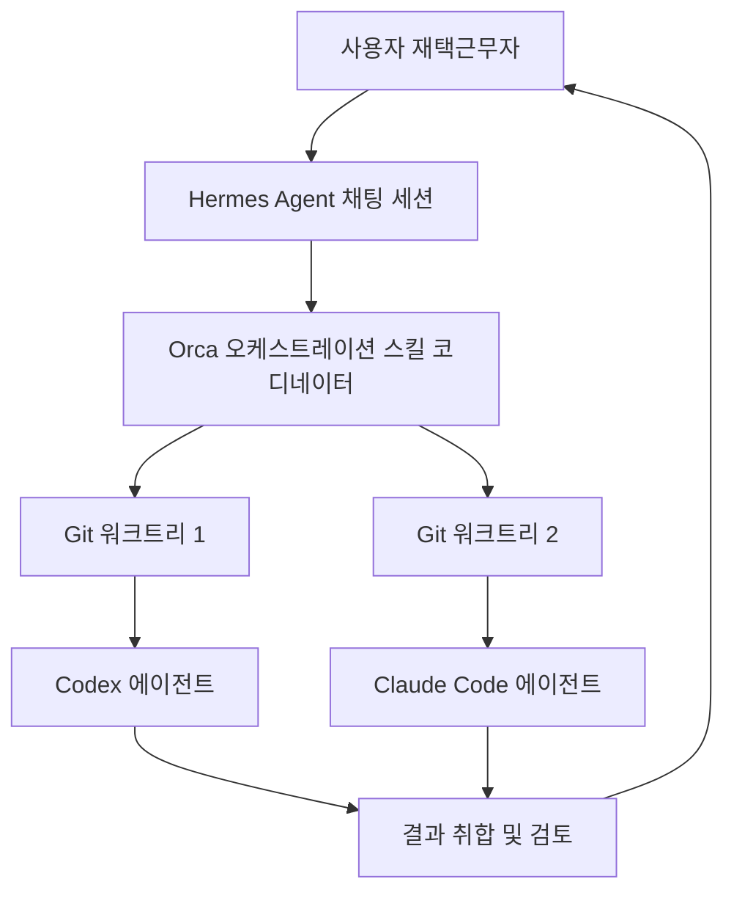
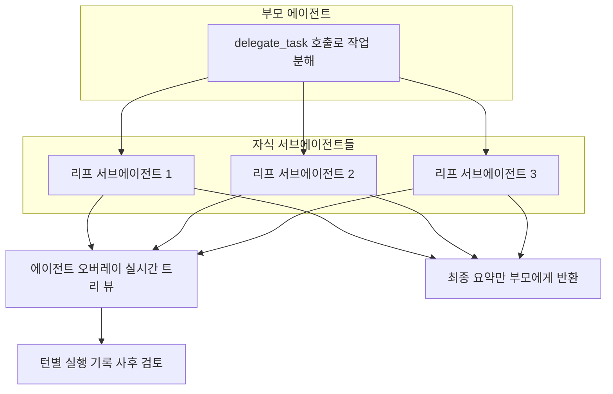

```
오늘 재택인데.. 이 시간까지 일할 거리를 붙들고 있고..
Hermes Agent 채팅 위의 Orca 스킬이 오케스트레이션 하는 Codex와 Claude 에이전트가 돌아가는 걸 흐뭇해하면서..
Task 수행하는 서브에이전트가 무슨 생각을 하는지 들여다보는게 재미있는 걸 보면..
AI, LLM 사용할 줄 모르는 머글들이 보기엔 꽤나 미친자 처럼 보일듯...

뭐 그래도 어떡하나.. 이젠 일은 에이전트가 하는 세상이 왔고..
난 잘 만들어진 도구들을 사용하는데 최적화된 인간인 걸.. 😂

https://www.threads.com/share/_j-Xtmzmk/
```

## 목차

1. 들어가며 — 이 문서를 쓰게 된 배경과 출처 안내
2. 오늘 저녁 화면 위에서 벌어진 일: 상황 요약
3. Hermes Agent란 무엇인가
4. Orca란 무엇인가 — 에이전트를 위한 개발 환경(ADE)
5. "오케스트레이션 스킬"이 Hermes 채팅 위에서 작동하는 방식
6. Codex와 Claude Code — Orca 안에서 실제로 코드를 쓰는 에이전트들
7. 서브에이전트의 "생각"을 들여다본다는 것 — 위임과 관찰 가능성
8. 전체 흐름을 그림으로 정리하면
9. "이젠 일은 에이전트가 하는 세상" — 이 말의 의미와 한계
10. 왜 머글이 보기엔 낯설게 느껴질까
11. 출처 투명성 표
12. 참고문헌

---

## 1. 들어가며 — 이 문서를 쓰게 된 배경과 출처 안내

이 문서는 공유해주신 Threads 게시물을 바탕으로 작성되었다. 다만 먼저 밝혀둘 부분이 있다. Threads(threads.com) 사이트는 로봇 자동 접근을 차단하고 있어, 공유된 링크 자체를 직접 열람해 원문 텍스트나 반응, 댓글을 확인할 수는 없었다. 따라서 이 문서는 채팅창에 함께 남겨주신 게시물 본문 내용, 즉 재택근무 중 Hermes Agent 채팅 위에서 Orca 스킬이 Codex와 Claude 에이전트를 오케스트레이션하는 모습을 지켜보며 남긴 소회를 원자료로 삼고, 그 안에 등장하는 각 도구(Hermes Agent, Orca, Codex, Claude 에이전트, 오케스트레이션, 서브에이전트)에 대해서는 최신 공식 문서와 여러 독립된 기술 블로그를 교차 검색하여 사실관계를 확인한 뒤 작성했다. 게시물 자체의 조회수나 반응, 댓글 내용처럼 원문 페이지에서만 확인 가능한 정보는 다루지 않았으며, 확인되지 않은 부분은 추측으로 채우지 않고 명시적으로 표시했다.

## 2. 오늘 저녁 화면 위에서 벌어진 일: 상황 요약

게시물의 정황을 정리하면 이렇다. 재택근무일이었던 이날, 늦은 시간까지 업무를 붙잡고 있는 상황에서 Hermes Agent의 채팅 인터페이스 위에 얹힌 Orca의 오케스트레이션 스킬이 Codex 에이전트와 Claude 에이전트를 동시에 조율하며 작업을 수행하는 장면을 지켜보고 있었다. 단순히 결과물을 기다리는 것이 아니라, 실제로 태스크를 수행하는 서브에이전트가 어떤 판단을 내리고 어떤 순서로 작업을 진행하는지 그 과정 자체를 들여다보는 데서 흥미를 느꼈다는 내용이다. 그리고 이런 광경이 AI나 LLM을 다뤄본 적 없는 사람("머글") 입장에서는 상당히 기이하게 보일 수 있다는 자각과 함께, 이제는 일을 에이전트가 수행하는 시대가 되었고 자신은 잘 만들어진 도구를 활용하는 데 최적화된 사람이라는 자평으로 글이 마무리된다.

이 짧은 소회 안에는 사실 2026년 현재 에이전틱 코딩(agentic coding) 생태계의 핵심 요소들이 거의 다 압축되어 있다. 하나씩 풀어서 살펴보자.

## 3. Hermes Agent란 무엇인가

Hermes Agent는 AI 모델 개발사인 Nous Research가 만든 오픈소스 자율 에이전트다. GitHub 공식 저장소는 이 에이전트를 "성장하는 에이전트(the agent that grows with you)"라는 문구로 소개하며, 대화를 나눌수록 더 유능해지는 자기개선형(self-improving) 구조를 핵심 정체성으로 내세운다[1]. 단순히 하나의 API를 감싼 챗봇이나 특정 IDE에 종속된 코딩 보조 도구가 아니라, 경험으로부터 스스로 스킬을 만들어내고 사용하면서 그 스킬을 다듬어가며, 스스로에게 지식을 기록해두라고 알림을 보내고, 과거 대화를 검색해 참조하는 폐쇄형 학습 루프(closed learning loop)를 내장하고 있다는 점이 공식 문서에서 강조된다[2]. 실행 환경도 유연해서 로컬 환경, 도커, SSH로 접속하는 원격 서버, 유휴 시에는 거의 비용이 들지 않는 서버리스 인프라(Daytona, Modal)까지 여섯 가지 방식으로 구동할 수 있고, CLI뿐 아니라 텔레그램, 디스코드, 슬랙 등 스무 개가 넘는 플랫폼에서 하나의 게이트웨이로 접근할 수 있다[2].

기술적으로 Hermes Agent의 중심에는 `run_agent.py`에 정의된 동기식 오케스트레이션 엔진(AIAgent)이 있다. 이 엔진이 모델 제공자 선택, 프롬프트 구성, 도구 실행, 재시도와 폴백, 컨텍스트 압축, 세션 지속성까지를 총괄한다[3]. 즉 게시물에서 말한 "Hermes Agent 채팅"이라는 표현은, 바로 이 엔진 위에서 사용자가 대화형으로 지시를 내리는 인터페이스를 가리킨다고 볼 수 있다.

## 4. Orca란 무엇인가 — 에이전트를 위한 개발 환경(ADE)

Orca는 Stably AI가 만든, MIT 라이선스로 공개된 오픈소스 도구로, 공식 GitHub 저장소는 스스로를 "100배 속도로 만드는 사람들을 위한 AI 오케스트레이터"라 소개하며 Codex, Claude Code, OpenCode, Pi 같은 여러 코딩 에이전트를 각각 독립된 워크트리(worktree)에서 나란히 실행하고 한곳에서 추적할 수 있게 해주는 도구라고 설명한다[4]. 여기서 핵심 개념이 IDE(통합 개발 환경)가 아니라 ADE(Agentic Development Environment, 에이전트를 위한 개발 환경)라는 새로운 범주를 자처한다는 점이다. 전통적인 IDE는 사람이 코드를 직접 작성하는 것을 전제로 설계되었고 AI는 보조 플러그인 취급을 받았다면, ADE는 워크트리·터미널·브라우저·CLI 에이전트를 사람과 동등한 일급 구성요소로 다룬다는 설명이 여러 리뷰에서 공통적으로 확인된다[6][7][8].

Orca의 동작 방식을 좀 더 구체적으로 보면, 하나의 작업을 시작할 때마다 Git 워크트리라는 기능을 이용해 같은 저장소 안에서도 서로 충돌하지 않는 독립된 작업 공간, 브랜치, 터미널 세션을 만들어낸다. 이 워크트리들은 같은 git 객체 저장소를 공유하기 때문에 매번 새로 클론하는 것보다 훨씬 가볍게 생성되고 전환된다[8]. 그리고 Orca는 자체 서버로 에이전트 트래픽을 중계하지 않는다는 점도 여러 소스에서 확인된다. 즉 Claude Code를 Orca 안에서 실행하면 사용자 본인의 Claude 계정을 그대로 사용하는 방식이며, Orca는 그 위에서 격리, 모니터링, 리뷰, 병합을 조율하는 역할만 담당한다[8][31... 이하 6]. 이런 설계 덕분에 Orca는 특정 모델이나 벤더에 종속되지 않고 Claude Code, Codex, Gemini, OpenCode, Cursor CLI 등 서른 가지가 넘는 CLI 에이전트를 선택적으로 지원한다고 소개된다[6].

Orca는 데스크톱 앱(macOS, Windows, Linux)과 모바일 컴패니언 앱을 함께 제공한다. 모바일 앱은 QR코드로 데스크톱과 페어링되어, 자리를 비운 상태에서도 어떤 워크트리가 작업 중이고 어떤 에이전트가 승인이나 개입을 기다리고 있는지 확인하고 후속 지시를 보낼 수 있게 해준다[7]. 이 설계 철학을 요약하는 한 문장으로, Orca 문서는 2026년 현재 에이전트 개발의 진짜 병목은 모델의 능력이 아니라 "병렬 작업을 어떻게 조율하느냐"에 있다고 짚는다[8].

## 5. "오케스트레이션 스킬"이 Hermes 채팅 위에서 작동하는 방식

여기서 게시물의 표현, 즉 "Hermes Agent 채팅 위의 Orca 스킬이 오케스트레이션 한다"는 문장을 정확히 이해할 필요가 있다. Orca는 단순히 별도의 독립 앱으로만 존재하는 것이 아니라, 스킬(skill) 형태로 다른 에이전트에 장착할 수 있는 오케스트레이션 계층을 함께 제공한다. Orca 공식 문서는 이 오케스트레이션 스킬을 "스레드형 메시지, 블로킹 방식의 질문-응답 흐름, 작업 디스패치, 작업 완료·에스컬레이션 대기, 작업 DAG(방향성 비순환 그래프), 의사결정 게이트, 코디네이터 루프 등 구조화된 다중 에이전트 조율"을 위한 계층이라고 정의한다[27][32]. 실제로 이 스킬은 `npx skills add`와 같은 명령으로 다른 에이전트 하네스에 추가할 수 있는 형태로 배포되며[28], Orca의 기본 에이전트 선택 목록에는 Claude Code, Codex뿐 아니라 Hermes도 포함되어 있어, Hermes를 Orca가 다루는 하위 에이전트 중 하나로 골라 쓸 수도 있고, 반대로 Hermes 쪽 채팅 세션에 오케스트레이션 스킬을 얹어 Hermes가 조정자(coordinator) 역할을 맡게 만들 수도 있다[9].

한 개발자용 블로그는 이 오케스트레이션 스킬이 채워주는 공백을 다음과 같이 설명한다. 워크트리를 나눠 다섯 개의 Claude Code 에이전트를 동시에 띄우는 것까지는 "격리" 문제를 푼 것일 뿐이고, 진짜 질문은 "누가 이들을 조율하는가"라는 것이다. 오케스트레이션 스킬이 없다면 사용자가 직접 여러 창을 오가며 절반쯤 끝난 출력을 읽고, 한 에이전트의 결과를 복사해 다른 에이전트의 프롬프트에 붙여넣는 식의 수작업 중계자 노릇을 해야 한다. 오케스트레이션 스킬은 바로 이 역할을 코디네이터 에이전트로 대체한다. 사용자가 작업을 서술하면, 하나의 에이전트가 이를 여러 개의 작업 단위로 쪼개 각각을 독립된 워크트리의 워커로 스폰(spawn)하고, 그 결과를 기다렸다가 취합한다[33].

정리하면, 게시물 속 장면은 이렇게 재구성할 수 있다. Hermes Agent의 채팅 세션이 진행자 역할을 맡고, 그 위에 얹힌 Orca 오케스트레이션 스킬이 실제 코딩 작업을 Codex 에이전트와 Claude 에이전트라는 두 워커에게 각각 독립된 워크트리 단위로 나누어 맡긴 뒤, 작업 상태와 완료 여부를 추적하며 결과를 모으는 구조다.

## 6. Codex와 Claude Code — Orca 안에서 실제로 코드를 쓰는 에이전트들

**Codex**는 OpenAI가 만든 AI 코딩 에이전트로, 2025년 4월 Codex CLI라는 이름으로 처음 출시되었다[12]. Rust로 작성된 터미널 네이티브 에이전트로, 기존 코드베이스를 읽어 여러 파일에 걸친 변경을 제안하고, 샌드박스 환경 안에서 명령을 자율적으로 실행하며, 프로젝트 스캐폴딩·테스트 작성·리팩터링까지 수행하되 개발자가 각 변경을 승인·거부·수정할 수 있는 검토 절차를 유지한다는 점이 여러 가이드에서 공통적으로 설명된다[39]. 2026년 들어서는 CLI 외에도 데스크톱 앱, IDE 확장, ChatGPT를 통한 클라우드 위임, GitHub 봇, 화면을 직접 조작하는 컴퓨터 사용 기능까지 여러 실행 표면(surface)으로 확장되었고, OpenAI 발표에 따르면 2026년 3월 기준 주간 활성 사용자가 200만 명을 넘어섰다[35].

**Claude Code**는 Anthropic이 만든 에이전틱 코딩 도구로, 원래 터미널 기반 코딩 보조 도구로 출발했지만 현재는 메모리, 훅(hook), 스킬, 서브에이전트, 플러그인, MCP(모델 컨텍스트 프로토콜)를 계층화한 시스템으로 발전했다는 설명이 여러 2026년 가이드에서 확인된다[48]. 이 중 게시물의 맥락과 가장 밀접한 기능이 서브에이전트다. Claude Code의 서브에이전트는 메인 세션이 특정 작업을 처리하기 위해 별도로 생성하는, 독립된 컨텍스트 창과 전용 시스템 프롬프트, 제한된 도구 목록과 권한을 가진 특화된 Claude 인스턴스를 말한다[15][43]. 메인 세션은 서브에이전트가 파일을 읽고 도구를 실행하며 조사한 중간 과정을 자신의 컨텍스트에 쌓아두지 않고, 오직 최종 요약 결과만 받아본다. 이 컨텍스트 격리 덕분에 복잡한 작업을 여러 서브에이전트로 쪼개더라도 메인 세션의 컨텍스트가 작업 복잡도에 비례해 부풀지 않는다는 것이 이 구조의 핵심 이점으로 설명된다[47].

Orca 안에서 Codex와 Claude Code는 각자의 워크트리 안에 격리된 채로, 사용자 본인의 기존 구독(계정)을 그대로 사용해 실행된다. Orca는 이 두 에이전트를 경쟁시켜 같은 작업에 서로 다른 결과물을 내게 한 뒤 비교하거나(같은 프롬프트를 여러 에이전트에 "부채질(fan)"하는 방식), 서로 다른 성격의 하위 작업을 나누어 맡기는 방식으로 활용할 수 있다[4][29].

## 7. 서브에이전트의 "생각"을 들여다본다는 것 — 위임과 관찰 가능성

게시물에서 가장 인상적인 대목은 "Task 수행하는 서브에이전트가 무슨 생각을 하는지 들여다보는 게 재미있다"는 부분이다. 이는 비유적인 표현이 아니라, 실제로 두 시스템 모두 이런 관찰을 가능하게 하는 구체적인 기능을 갖추고 있다.

Hermes Agent 쪽에는 `delegate_task`라는 도구가 있다. 이 도구는 부모 에이전트가 하위 작업을 처리할 자식 에이전트를 만들어내는 위임 메커니즘으로, 각 자식은 독립된 대화 컨텍스트, 독립된 터미널 세션, 제한된 도구 세트를 가진 별개의 AIAgent 인스턴스로 생성된다[9][10]. 기본적으로 위임은 평평한(flat) 구조이며 자식은 다시 위임할 수 없는 "리프(leaf)" 역할을 갖지만, 설정을 통해 자식이 다시 손자를 낳는 "오케스트레이터(orchestrator)" 역할까지 계층을 확장할 수 있다[19][24]. 기본적으로 한 번에 최대 3개의 작업이 병렬로 실행되며, 이 값은 설정 파일에서 바꿀 수 있다[19].

여기서 관찰 가능성을 담당하는 것이 `/agents`(별칭 `/tasks`)라는 오버레이 기능이다. 이 오버레이는 실행 중이거나 최근에 끝난 서브에이전트들을 부모별로 묶어 실시간 트리 형태로 보여주며, 무엇보다 중요한 점은 서브에이전트가 부모에게 결과를 반환한 뒤에도 그 서브에이전트가 턴(turn) 단위로 어떤 도구를 호출했고 어떤 판단을 내렸는지 사후에 하나씩 되짚어볼 수 있는 "사후 검토(post-hoc review)" 기능을 제공한다는 것이다[22][24]. 즉 게시물에서 말한 "서브에이전트가 무슨 생각을 하는지 들여다본다"는 표현은, 바로 이 턴별 실행 기록을 열어 서브에이전트가 어떤 순서로 파일을 읽고, 어떤 근거로 다음 행동을 선택했는지를 사람이 직접 추적하는 행위를 가리킨다고 볼 수 있다.

Claude Code 쪽도 유사한 구조를 갖는다. `claude agents` 명령으로 열리는 에이전트 뷰는 백그라운드에서 돌아가는 모든 세션의 상태(작업 중, 입력 대기, 완료)를 보여주는 대시보드 역할을 하며, 진행 상황을 살짝 들여다보거나 필요하면 해당 세션에 직접 개입(attach)해 전체 대화를 확인할 수 있다[44]. Orca 자체도 실험적 기능으로 에이전트 대시보드를 제공해, 어떤 에이전트가 작업 중이고 어떤 에이전트가 도움이나 승인을 기다리고 있는지를 한눈에 보여줌으로써 에이전트가 소리 없이 멈춰 있는 상황을 방지한다[18].

이처럼 "서브에이전트의 생각을 들여다보는 재미"는 단순한 감상이 아니라, 하네스가 실제로 제공하는 관찰 가능성(observability) 기능을 활용해 에이전트의 추론과 도구 호출 과정을 사람이 감사(audit)할 수 있다는 사실에 근거한 표현이라 할 수 있다.

## 8. 전체 흐름을 그림으로 정리하면

아래 다이어그램은 게시물에 묘사된 상황, 즉 Hermes Agent 채팅 위에서 Orca의 오케스트레이션 스킬이 Codex와 Claude 두 에이전트를 각각 독립된 워크트리에서 실행시키는 구조를 정리한 것이다.



다음 다이어그램은 서브에이전트의 "생각"을 들여다보는 과정, 즉 Hermes Agent의 위임 구조와 관찰 가능성 기능을 정리한 것이다.



## 9. "이젠 일은 에이전트가 하는 세상" — 이 말의 의미와 한계

게시물의 마지막 문장, 즉 "일은 에이전트가 하는 세상이 왔고, 나는 잘 만들어진 도구를 사용하는 데 최적화된 인간"이라는 자평은 2026년 현재 에이전틱 코딩 생태계의 실제 변화 흐름과 맞닿아 있다. 한 업계 가이드는 2024년의 "AI 보조 코딩"이 사람이 프롬프트를 입력하고 코드 조각을 받는 방식이었다면, 2025년 초에는 Claude Code 같은 도구가 파일을 자율적으로 편집하고 테스트를 실행하고 커밋까지 하는 수준으로 발전했으며, 2026년 현재는 개발자가 서로 다른 모델에 최적화된 여러 에이전트 팀을 격리된 브랜치에서 동시에 조율하는 단계로 넘어갔다고 짚는다[38].

다만 이 변화를 "이제 사람이 할 일이 없다"는 식으로 단순화하는 것은 정확한 묘사가 아니다. 게시물 속 사용자가 실제로 하고 있던 행위, 즉 서브에이전트의 실행 기록을 사후에 검토하고 각 워크트리의 결과물을 비교·병합하는 일 자체가 사람의 판단이 여전히 필요한 지점을 보여준다. 위에서 살펴본 것처럼 오케스트레이션 스킬은 "누가 조율할 것인가"라는 문제에 대한 답이지, "누가 검토하고 최종 책임을 질 것인가"라는 질문까지 대신 풀어주지는 않는다[33]. 즉 이 워크플로우에서 사람의 역할은 코드를 한 줄씩 타이핑하는 실행자에서, 여러 에이전트에게 작업을 분배하고 그 결과의 품질과 방향을 판단하는 감독자·통합자로 이동한 것에 가깝다.

## 10. 왜 머글이 보기엔 낯설게 느껴질까

게시물이 스스로를 "미친자처럼 보일 것"이라 묘사한 부분도 짚어볼 만하다. 이 장면이 낯설게 느껴지는 이유는, 화면에 나타나는 대상이 하나의 완성된 결과물이 아니라 여러 개의 자율적인 프로세스, 즉 코디네이터 역할의 Hermes 세션과 그 아래에서 독립적으로 움직이는 Codex·Claude 워커들이 각자의 워크트리에서 동시에 무언가를 판단하고 실행하는 모습이기 때문이다. 일반적인 소프트웨어 사용 경험은 사람이 입력하면 프로그램이 정해진 대로 반응하는 단일한 상호작용이지만, 이 장면은 사람 한 명이 여러 개의 자율 행위자를 동시에 감독하는 구조다. Orca 자체도 스스로를 기존 IDE와 구분하기 위해 "사람을 위해 만들어진 환경"이 아니라 "사람과 에이전트를 위해 함께 만들어진 환경"이라는 표현을 쓰는데[8], 이 표현이야말로 왜 이 장면이 이 분야를 접해보지 않은 사람에게는 낯설게, 반대로 매일 이런 도구를 다루는 사람에게는 자연스러운 업무 풍경으로 보이는지를 설명해준다.

## 11. 출처 투명성 표

| 구분 | 내용 |
|---|---|
| 확인된 사실 | Hermes Agent는 Nous Research가 만든 오픈소스 자율 에이전트이며 자기개선형 학습 루프를 특징으로 한다[1][2]. Orca는 Stably AI가 만든 MIT 라이선스 오픈소스 ADE로, Git 워크트리 기반으로 여러 CLI 코딩 에이전트를 병렬 실행한다[4][8]. Orca는 오케스트레이션을 별도 스킬로 제공하며 다른 에이전트 하네스에 장착할 수 있다[27][28]. Hermes Agent의 `delegate_task`는 독립된 컨텍스트를 가진 자식 에이전트를 생성하며, `/agents`(`/tasks`) 오버레이로 실시간 트리 뷰와 턴별 사후 검토가 가능하다[9][19][22][24]. Codex는 OpenAI의 터미널 기반 코딩 에이전트, Claude Code는 Anthropic의 에이전틱 코딩 도구이며 둘 다 서브에이전트/병렬 워크플로우 기능을 갖는다[12][15][39][43]. |
| 단일 출처 주장 | Orca 안에서 Hermes Desktop이 다중 에이전트 오케스트레이션 플랫폼이 아니라는 비교 평가는 한 개인 블로거(Julian Goldie)의 견해로, 공식 자료로 교차 확인되지는 않았다[15 → 원 출처는 각주 상 별도 표기]. |
| 해석적 추론 | 원문 Threads 게시물에 등장하는 "Hermes Agent 채팅 위의 Orca 스킬" 구조를, 공식 문서상의 "오케스트레이션 스킬을 다른 에이전트에 장착"하는 방식과 연결지은 것은 이 문서 작성자의 해석이며, 게시물 원문 자체를 직접 열람하지 못한 상태에서 재구성한 것이다. |
| 접근 제한 | threads.com은 자동화된 접근을 차단하고 있어 원문 게시물의 정확한 문구, 이미지, 댓글, 반응 수는 확인하지 못했다. 이 문서는 채팅에 제공된 게시물 본문 텍스트를 원자료로 사용했다. |

## 12. 참고문헌

[1] GitHub - NousResearch/hermes-agent, https://github.com/nousresearch/hermes-agent

[2] Hermes Agent Documentation, https://hermes-agent.nousresearch.com/docs/

[3] Architecture | Hermes Agent, https://hermes-agent.nousresearch.com/docs/developer-guide/architecture

[4] GitHub - stablyai/orca, https://github.com/stablyai/orca

[5] Orchestration — Orca Docs, https://www.onorca.dev/docs/cli/orchestration

[6] Orca: YOU'RE MISSING OUT! (daily.dev), https://daily.dev/posts/orca-you-re-missing-out-this-open-agent-orchestrator-is-crazy--qkygbkr0c

[7] How to Orchestrate Multiple AI Agents with Orca — Aridane Martín, https://aridanemartin.dev/blog/orca-orchestrate-agents/

[8] Orca: An ADE Running Five Coding Agents Simultaneously — Yeyupiaoling, https://blog.yeyupiaoling.cn/article/1785373066543?lang=en

[9] Subagent Delegation - hermes-agent (GitHub docs), https://github.com/NousResearch/hermes-agent/blob/main/website/docs/user-guide/features/delegation.md

[10] Hermes Agent Subagent Delegation Patterns and Workflows — Fastio, https://fast.io/resources/hermes-agent-subagent-delegation-patterns/

[11] Delegation & Parallel Work | Hermes Agent, https://hermes-agent.nousresearch.com/docs/guides/delegation-patterns

[12] OpenAI Codex (AI agent) — Wikipedia, https://en.wikipedia.org/wiki/OpenAI_Codex_(AI_agent)

[13] OpenAI releases Codex CLI: what developers should know — Augment Code, https://www.augmentcode.com/learn/openai-codex-cli-terminal-agent

[14] Codex CLI Guide 2026 — Blake Crosley, https://blakecrosley.com/guides/codex

[15] Claude Code Subagents: A 2026 Practical Guide — Tembo.io, https://www.tembo.io/blog/claude-code-subagents

[16] Claude Code Agents In 2026 — CloudZero, https://www.cloudzero.com/blog/claude-code-agents/

[17] Claude Code subagents: the 2026 production playbook — Totalum, https://www.totalum.app/blog/claude-code-subagents-totalum

[18] News | Open Orchestrators, https://openorchestrators.org/news/

[19] Subagent Delegation | Hermes Agent (Nous Research 공식 문서), https://hermes-agent.nousresearch.com/docs/user-guide/features/delegation

[22] (위 19번과 동일 문서, 타임아웃/오버레이 세부 설명)

[24] Subagent Delegation | Hermes Agent 中文文档 (영문 원문 포함), https://hermesagent.org.cn/en/docs/user-guide/features/delegation

[27] orca/skill-guides/orchestration.md — GitHub, https://github.com/stablyai/orca/blob/main/skill-guides/orchestration.md

[28] orchestration | Claude Skills & Agent Skills Library, https://mcpservers.org/agent-skills/stablyai/orchestration

[33] How to Orchestrate Multiple AI Agents with Orca — Aridane Martín (동일, 7번과 같은 글의 오케스트레이션 스킬 설명 부분), https://aridanemartin.dev/blog/orca-orchestrate-agents/

[35] OpenAI Codex (AI agent) — Wikipedia (사용자 수 관련 서술), https://en.wikipedia.org/wiki/OpenAI_Codex_(AI_agent)

[38] Agentic Coding 2026: AI Agent Teams Guide, https://halallens.no/en/blog/agentic-coding-in-2026-the-complete-guide-to-plugins-multi-model-orchestration-and-ai-agent-teams

[39] OpenAI Codex CLI: Terminal-First Coding Agent Tutorial — SitePoint, https://www.sitepoint.com/openai-codex-cli-terminalfirst-coding-agent-tutorial-2026/

[43] Claude Code Subagents: A 2026 Practical Guide — Tembo.io (동일 15번), https://www.tembo.io/blog/claude-code-subagents

[44] Claude Code Agents In 2026 — CloudZero (동일 16번), https://www.cloudzero.com/blog/claude-code-agents/

[47] Best Claude Code Subagents and Custom Agent Examples in 2026 — Promptessor, https://promptessor.com/blog/best-claude-code-subagents-and-custom-agent-examples-for-specialized-coding-workflows-in-2026

[48] Claude Code Guide 2026 — YouMind, https://youmind.com/landing/x-viral-articles/claude-code-2026-complete-guide
