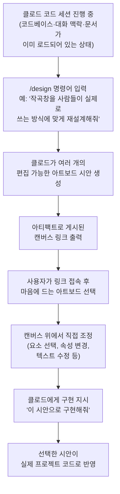
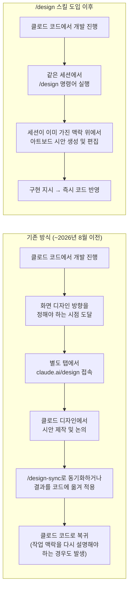
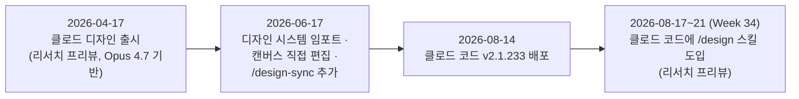

*작성 기준일: 2026년 9월 2일 / 최신 웹 검색 및 앤트로픽 공식 문서 교차검증 기반*

---

## 0. 이 문서에 대하여

이 문서는 앤트로픽(Anthropic)이 클로드 코드(Claude Code)에 새로 추가한 `/design` 스킬을 다룹니다. 원 게시물에서 링크한 유튜브 영상과 스레드(Threads) 게시물은 자동 접근이 차단되어 있어 (유튜브는 요청 제한 응답, 스레드는 접근 정책상 차단) 직접 열람하지 못했습니다. 대신 이 문서는 앤트로픽 공식 문서(code.claude.com)와 앤트로픽 뉴스(anthropic.com), 그리고 테크크런치·벤처비트 등 복수의 독립 매체 보도를 교차 검증하여 작성했습니다. 문서 말미에 출처별 신뢰도를 4단계로 구분한 부록을 첨부했습니다.

---

## 1. 한눈에 보는 핵심 요약

앤트로픽은 2026년 8월 17일부터 21일 사이(클로드 코드 주간 업데이트 기준 'Week 34'), 클로드 코드의 CLI와 데스크톱 앱에 `/design`이라는 새 스킬을 리서치 프리뷰(research preview, 정식 출시 전 실험적 공개 단계) 형태로 추가했습니다. 이 스킬은 별도 제품인 클로드 디자인(Claude Design)의 '아트보드' 작업 방식을 클로드 코드 안으로 그대로 가져온 것입니다. 사용자가 `/design`과 함께 원하는 화면에 대한 요청을 입력하면, 클로드는 곧바로 코드를 작성하는 대신 여러 개의 편집 가능한 시안(아트보드)을 생성해 캔버스 형태로 게시합니다. 사용자는 그중 하나를 골라 캔버스 위에서 직접 다듬은 뒤, 클로드에게 "이걸로 구현해줘"라고 지시하면 그 시안이 실제 프로젝트 코드로 바뀝니다.

이 업데이트가 실무적으로 의미 있는 이유는 단순히 새 명령어가 하나 추가된 것이 아니라, 지금까지 클로드 디자인과 클로드 코드 사이를 오가며 발생했던 '맥락 단절'을 없앴다는 점입니다. 이 부분은 아래 4장과 5장에서 자세히 다룹니다.

이 스킬이 요구하는 최소 버전은 v2.1.233이며(2026년 8월 14일 배포), 이용 가능한 요금제는 Pro, Max, Team, Enterprise입니다. 클로드 아티팩트(Artifacts) 기능을 기반으로 동작합니다.

---

## 2. 클로드 디자인이란 무엇인가 — 2026년 4월의 출발점

`/design` 스킬을 이해하려면 그 뿌리인 클로드 디자인부터 짚어야 합니다.

앤트로픽 랩스(Anthropic Labs)는 2026년 4월 17일, 클로드 오퍼스 4.7(Claude Opus 4.7) 공개와 거의 동시에 클로드 디자인을 리서치 프리뷰로 출시했습니다. 앤트로픽의 공식 발표에 따르면, 이 도구는 사용자가 프로토타입, 슬라이드, 원페이저 같은 시각적 결과물을 클로드와 대화하며 함께 만들어갈 수 있도록 설계됐습니다. 특히 디자인 배경이 없는 창업자, 프로덕트 매니저, 마케터가 자신의 아이디어를 시각적으로 표현하고 공유하는 데 어려움을 겪는다는 문제의식에서 출발했다고 앤트로픽은 설명했습니다.

클로드 디자인은 claude.ai/design이라는 별도 주소에서 접근하는 독립된 작업 공간입니다. 채팅 패널에 원하는 결과물을 설명하면 화면 오른편의 실시간 캔버스에 실제로 동작하는 결과물이 만들어지는 구조이며, 여기서 만들어지는 결과물은 정적인 그림 파일이 아니라 HTML, React, SVG 등으로 구성된 살아있는 코드입니다. 즉 클릭이 가능하고 상호작용을 테스트할 수 있는 상태로 만들어집니다. 기술적으로는 앤트로픽이 당시 "가장 강력한 비전 모델"이라고 소개한 클로드 오퍼스 4.7을 기반으로 하며, 고해상도 화면 정보를 처리해 기존 디자인 파일이나 코드베이스의 스타일을 참고하는 정확도가 높다는 평가를 받았습니다. 요금제는 Pro, Max, Team, Enterprise 구독에 포함되며, Enterprise 플랜에서는 관리자가 별도로 활성화해야 사용할 수 있습니다.

출시 직후 반응도 상당했습니다. 여러 매체는 출시 첫 주에만 100만 명 이상이 클로드 디자인을 사용했다고 보도했으며, 벤처비트는 이 출시가 앤트로픽이 단순 모델 제공사에서 풀스택 제품 회사로 옮겨가고 있다는 신호로 해석했습니다. 같은 시기 앤트로픽의 최고제품책임자(CPO) 마이크 크리거가 피그마(Figma) 이사회에서 사임한 사실이 알려지면서, 클로드 디자인이 피그마·캔바(Canva) 같은 기존 디자인 도구 시장을 직접 겨냥한다는 해석도 함께 나왔습니다. 다만 이 해석 부분은 매체별 논조 차이가 있는 분석적 평가이므로, 사실관계(출시일, 담당 모델, 요금제)와는 구분해서 받아들일 필요가 있습니다.

---

## 3. 진화 1단계 — 2026년 6월, 디자인 시스템과 코드 연동의 등장

클로드 디자인은 출시 두 달 뒤인 2026년 6월 17일, 출시 이후 첫 대규모 업데이트를 맞습니다. 이 업데이트로 세 가지가 새로 생겼습니다.

첫째, 디자인 시스템 임포트 기능입니다. 깃허브 저장소나 기존 디자인 파일, 또는 파일을 직접 올려서 회사·팀의 디자인 시스템(색상, 폰트, 컴포넌트 등)을 클로드 디자인으로 가져올 수 있게 됐습니다. 이후 클로드가 만드는 모든 결과물은 이 컴포넌트를 기준으로 만들어지고, 완성 전에 디자인 시스템과 맞는지 스스로 점검하는 과정을 거칩니다.

둘째, 캔버스 위에서의 직접 편집입니다. 그전까지는 대화로 수정을 요청해야 했지만, 이제 요소를 선택하고 속성을 조정하거나 텍스트를 바로 고치는 등 실제 편집 도구에 가까운 조작이 가능해졌습니다.

셋째, 가장 중요한 변화로 꼽히는 `/design-sync` 명령어입니다. 이 명령어는 클로드 코드의 터미널에서 실행하는 명령으로, 로컬 코드베이스에 이미 존재하는 디자인 시스템을 클로드 디자인 쪽으로 끌어오거나, 반대로 클로드 디자인에서 만든 결과물을 코드 쪽으로 밀어 넣는 양방향 동기화를 지원합니다. 여러 매체가 이를 "클로드 디자인과 클로드 코드를 잇는 양방향 다리"라고 표현했는데, 다만 이 시점의 연동은 어디까지나 '동기화'였습니다. 즉 두 작업 공간은 여전히 물리적으로 분리돼 있었고, 사용자는 시안을 다듬으려면 여전히 claude.ai/design으로 탭을 옮겨야 했습니다. 이 한계를 없앤 것이 바로 다음 장에서 다룰 8월 업데이트입니다.

참고로 이 6월 업데이트는 내보내기 형식도 확장해 HTML, PPTX, PDF, ZIP, 공유 링크, 캔바 연동을 지원하게 됐지만, 영상(MP4) 내보내기는 이 시점까지도 지원하지 않는다는 점을 짚은 매체가 있습니다. 이는 사용법과 직접 관련은 없지만 클로드 디자인의 기능 범위를 이해하는 데 참고할 만합니다.

---

## 4. 이번 업데이트의 핵심 — 클로드 코드 안의 `/design` 스킬

### 4-1. 발표 개요

2026년 8월 17일, 앤트로픽의 클로드 코드 관련 공식 계정과 앤트로픽 디자인팀 소속으로 알려진 네이트 패럿(Nate Parrott)의 개인 계정이 각각 X(옛 트위터)에 `/design` 명령어 공개 소식을 알렸습니다. 이 내용은 같은 주 앤트로픽의 공식 문서 사이트(code.claude.com)의 주간 업데이트 페이지(Week 34, 2026년 8월 17~21일)에도 정식으로 게재되었습니다. 공식 문서의 설명을 그대로 옮기면 다음과 같습니다.

> `/design` 스킬은 클로드 디자인의 아트보드 작업 방식을 CLI와 클로드 코드 데스크톱으로 가져오며, 아티팩트(artifacts) 위에서 동작한다. 브리프(요청 내용)와 함께 실행하면 클로드가 편집 가능한 아트보드로 구성된 캔버스를 게시한다. 하나를 골라 다듬은 뒤 클로드에게 구현을 맡기면 된다. Pro, Max, Team, Enterprise에서 사용 가능하며 v2.1.233 이상이 필요하다.

공식 문서가 제시한 사용 예시 명령어는 다음과 같습니다.

```text
> /design redesign the composer based on what people actually use it for
> (작곡창을 사람들이 실제로 쓰는 방식에 맞게 재설계해줘)
```

이 명령을 실행하면 클로드는 게시된 캔버스로 이동할 수 있는 링크를 출력하고, 사용자는 그 링크에서 여러 아트보드 중 하나를 선택한 뒤 어떤 시안을 구현할지 클로드에게 알려주는 방식으로 진행됩니다.

이 스킬은 현재 '리서치 프리뷰' 단계입니다. 이는 앤트로픽이 새 기능을 정식 출시 전에 먼저 공개해 사용자 피드백을 받는 단계를 가리키는 표현으로, 향후 명령어의 동작 방식이나 세부 옵션이 바뀔 수 있다는 뜻입니다. 실제로 이 문서 작성 시점 기준, 앤트로픽 공식 문서 지도(sitemap)에는 `/design`을 다루는 별도의 상세 레퍼런스 페이지가 아직 없고, 위에서 인용한 주간 업데이트 요약이 공식 설명의 전부입니다. 따라서 세부 옵션이나 제약 조건에 대해서는 앞으로 문서가 보강될 가능성이 있습니다.

### 4-2. 아트보드란 무엇인가

'아트보드(artboard)'라는 용어에 익숙하지 않은 분들을 위해 설명하면, 이는 피그마 같은 디자인 도구에서 오래 쓰여 온 개념으로, 하나의 화면이나 컴포넌트를 담아 놓고 그 위에서 바로 조작할 수 있는 작업 캔버스를 뜻합니다. 정적인 결과물을 눈으로만 보는 것이 아니라, 요소를 클릭해서 선택하고 속성을 바꾸고 글자를 고칠 수 있는 '살아있는 작업판'이라는 점이 핵심입니다. `/design` 스킬이 만들어내는 아트보드도 같은 개념으로, 클로드 아티팩트 위에서 동작하는 편집 가능한 화면입니다.

### 4-3. 실제 작업 흐름

아래는 공식 문서의 설명과 여러 매체의 사용기를 종합해 정리한 전형적인 작업 흐름입니다.



여기서 중요한 점은, 이 다섯 단계가 전부 하나의 클로드 코드 세션 안에서 끊기지 않고 이어진다는 것입니다. 세션이 이미 갖고 있던 코드베이스 구조, 지금까지의 대화 맥락, 프로젝트 문서, 그동안 내린 여러 의사결정들이 시안을 만들고 구현하는 전 과정에 그대로 이어집니다.

---

## 5. 무엇이 실제로 달라지는가 — 기존 방식과의 비교

`/design` 스킬 이전에도 클로드 디자인과 클로드 코드를 연결하는 방법은 있었습니다(앞서 설명한 `/design-sync`). 하지만 그 연결은 '동기화'였을 뿐, 물리적으로 다른 두 작업 공간을 오가야 하는 구조는 그대로였습니다. 여러 매체가 이 부분을 두고 "탭을 옮겨가며 claude.ai/design과 터미널을 오가던 개발자들에게는 실질적인 시간 절약"이라고 평가한 이유가 여기에 있습니다.



정리하면, 이번 업데이트가 바꾼 것은 '디자인 기능의 유무'가 아니라 '디자인 작업이 일어나는 위치'입니다. 클로드 디자인이라는 별도 제품 자체는 계속 존재하고 계속 발전하고 있지만, 최소한 클로드 코드 안에서 화면 시안을 빠르게 탐색하고 다듬는 작업만큼은 더 이상 다른 창을 열 필요가 없어진 것입니다. 원문 게시물에서 표현한 "클로드 디자인 ↔ 클로드 코드 왕복이 끝났다"는 문장은 이 지점을 가리키는 것으로 보이며, 공식 발표와 독립 매체 보도가 공통적으로 설명하는 변화의 핵심과 일치합니다.

바이브코딩 프로젝트 진행 관점에서 보면 이 변화가 갖는 의미가 더 뚜렷해집니다. 기획, 디자인, 개발이 한 방향으로 순서대로 흘러가는 경우는 드물고, 실제로는 개발 도중 갑자기 "이 화면 레이아웃이 이상한데 다른 방향은 없을까"라는 디자인 판단이 필요한 순간이 수시로 끼어듭니다. 지금까지는 그때마다 작업 공간을 옮기고 맥락을 다시 설명해야 했다면, 이제는 같은 세션 안에서 여러 시안을 비교해보고 바로 결정을 내린 뒤 이어서 개발을 계속할 수 있습니다.

---

## 6. 세 갈래로 나뉜 클로드 디자인 계열 도구 정리

현재 시점 기준으로 '클로드 디자인'이라는 이름 아래 서로 다른 세 가지 진입 경로가 존재합니다. 헷갈리기 쉬운 부분이라 표로 정리했습니다.

| 도구 | 실행 위치 | 주요 역할 | 도입 시점 |
|---|---|---|---|
| 클로드 디자인 (claude.ai/design) | 별도 웹 애플리케이션 | 프로토타입, 슬라이드, 원페이저 등 완결된 시각 결과물 제작. 디자인 시스템 관리, 캔바 등 외부 연동의 중심지 | 2026년 4월 17일 |
| `/design-sync` | 클로드 코드 (CLI) | 로컬 코드베이스의 디자인 시스템을 클로드 디자인으로 가져오거나, 클로드 디자인에서 만든 결과물을 코드 쪽으로 내보내는 양방향 동기화 | 2026년 6월 17일 |
| `/design` 스킬 | 클로드 코드 (CLI·데스크톱) | 코드 세션을 벗어나지 않고 그 자리에서 편집 가능한 아트보드 시안을 만들고 바로 구현까지 연결 | 2026년 8월 17일 (리서치 프리뷰) |

세 도구는 경쟁 관계가 아니라 상호 보완적인 관계로 설명됩니다. 여러 매체가 짚은 실질적인 구분 기준은 "무엇을 만드는가"가 아니라 "지금 내가 어디에 있는가"입니다. 이미 완성된 프레젠테이션이나 브랜드 전체를 아우르는 결과물이 필요하다면 여전히 claude.ai/design이 적합하고, 코드 작업 도중 화면 하나의 방향을 빠르게 탐색하고 싶다면 `/design`이 적합하며, 팀의 디자인 시스템 자체를 두 공간 사이에서 일관되게 유지하고 싶다면 `/design-sync`가 그 역할을 맡습니다.

---

## 7. 전체 타임라인



---

## 8. 같은 주에 함께 발표된 다른 업데이트 (참고)

`/design` 스킬이 포함된 같은 주간 업데이트(Week 34)에는 두 가지 기능이 더 함께 공개되었습니다. 직접적인 주제는 아니지만 같은 배포 묶음이라 참고삼아 짧게 정리합니다.

- **Concise 출력 스타일**: 클로드가 서두 설명이나 진행 상황 나열 없이 바로 결과부터 제시하도록 만드는 새로운 기본 출력 스타일입니다. `/config`의 'Output style' 메뉴에서 켤 수 있습니다. 다만 오류 보고, 보안 경고, 위험한 작업에 대한 확인 요청처럼 반드시 온전히 전달돼야 하는 내용은 이 스타일에서도 축약되지 않습니다.
- **휴대폰에서 내 컴퓨터의 세션 시작하기**: `claude remote-control` 명령을 실행해 둔 컴퓨터가 클로드 앱의 'Code' 탭 상단에 기기 카드로 표시되어, 휴대폰에서 바로 그 컴퓨터의 세션을 시작할 수 있게 됐습니다. 이와 함께 원격 제어(Remote Control) 기능 자체도 리서치 프리뷰 단계를 벗어났습니다.

---

## 9. 알려진 한계와 주의할 점

정확한 판단을 위해, 아직 확정되지 않았거나 출처가 제한적인 부분도 함께 밝혀 둡니다.

- **리서치 프리뷰 단계라는 점**: 앤트로픽 스스로 이 기능을 리서치 프리뷰로 표시하고 있습니다. 정식 기능이 되기 전까지는 명령어의 동작 방식, 세부 옵션, 제한 사항이 예고 없이 바뀔 수 있습니다.
- **토큰(작업 비용) 소모**: 한 매체는 시각적 아트보드를 만들고 다듬는 과정이 일반적인 텍스트·코드 프롬프트보다 토큰을 더 많이 소모하는 경향이 있다고 지적했습니다. 다만 이는 앤트로픽 공식 자료가 아닌 단일 매체의 사용기에 기반한 내용으로, 공식 수치로 확인되지는 않았습니다.
- **계정별 편집 권한 차이**: 한 독립 분석 글은 계정이 '저장' 권한을 허용하는 경우에만 요소 선택, 속성 패널, 텍스트 직접 수정, 실행취소/다시실행, 모두에게 공유되는 새 버전 저장이 가능하고, 그렇지 않으면 보고 내보내기만 가능한(PNG·PDF) 미리보기 형태로 제공된다고 설명했습니다. 이 부분은 해당 글쓴이가 "공식 문서에는 명시되어 있지 않다"고 스스로 밝힌 내용이라, 확정된 사실이 아니라 관찰에 근거한 추정으로 분류해 두는 것이 정확합니다.
- **공식 레퍼런스 문서 부재**: 이 문서 작성 시점 기준으로 앤트로픽 공식 문서 지도에는 `/design`을 별도로 다루는 상세 레퍼런스 페이지가 없고, 주간 업데이트 요약 한 단락이 공식 설명의 전부입니다. 추후 별도 문서 페이지가 생길 가능성이 있습니다.

---

## 10. 용어 정리

| 용어 | 설명 |
|---|---|
| 아트보드 (artboard) | 화면이나 컴포넌트 하나를 담아 그 위에서 요소를 직접 조작할 수 있는 작업 캔버스 개념. 피그마 등 기존 디자인 도구에서 쓰이던 표현 |
| 아티팩트 (artifacts) | 클로드 코드 세션의 작업 결과를 claude.ai에서 열람·공유할 수 있는 살아있는 웹페이지 형태로 게시하는 기능 |
| 리서치 프리뷰 (research preview) | 정식 출시 전, 실험적으로 먼저 공개해 사용자 피드백을 받는 단계 |
| `/design-sync` | 클로드 코드 터미널에서 실행하는 명령. 로컬 코드베이스의 디자인 시스템을 클로드 디자인으로 가져오거나, 반대로 내보내는 양방향 동기화 기능 |
| 디자인 시스템 (design system) | 색상, 폰트, 컴포넌트 등 하나의 프로젝트·브랜드가 일관되게 사용하는 디자인 규칙과 자산의 집합 |

---

## 11. 사실 확인 등급 부록

이 문서에서 다룬 주요 사실을 신뢰도 기준으로 분류했습니다.

**① 공식 1차 출처 (앤트로픽 공식 발표·문서)**
- `/design` 스킬 발표 내용, 예시 명령어, 요금제(Pro/Max/Team/Enterprise), 최소 버전(v2.1.233), 리서치 프리뷰 상태, 아티팩트 기반 동작 — 출처: code.claude.com Week 34 업데이트 페이지
- 클로드 디자인 출시일(2026년 4월 17일), 담당 모델(Claude Opus 4.7), 리서치 프리뷰 상태, 요금제 — 출처: anthropic.com 뉴스("Introducing Claude Design by Anthropic Labs")

**② 복수 매체 교차검증**
- 클로드 디자인 6월 17일 업데이트(디자인 시스템 임포트, 캔버스 직접 편집, `/design-sync` 도입) — TechRepublic, BigGo Finance, AI Catchup 등 복수 매체 일치
- `/design` 스킬이 기존의 클로드 디자인·클로드 코드 간 탭 전환 부담을 줄인다는 평가 — explainx.ai, pasqualepillitteri.it 등 복수 매체 공통 서술
- 클로드 디자인 출시 첫 주 100만 명 이상 사용 — VentureBeat, BigGo Finance 등에서 반복 언급

**③ 단일 출처 (교차검증되지 않은 개별 매체·글쓴이 관찰)**
- `/design` 사용 시 토큰 소모가 상대적으로 크다는 지적 — aitoolsreview.co.uk
- 계정 저장 권한에 따른 편집 기능 차등 여부 — blakecrosley.com(글쓴이 스스로 "공식 문서에 없음"이라 명시)
- 네이트 패럿 개인 계정의 발표 경위 — explainx.ai

**④ 분석적 종합·편집 판단 (이 문서 작성 과정에서의 해석)**
- "왕복이 끝났다"는 표현이 가리키는 실질적 의미 해설(5장)
- 바이브코딩 프로젝트에서 기획·디자인·개발이 비선형적으로 오가는 현실과 이번 업데이트의 연결(5장 마지막 단락)
- 세 도구(클로드 디자인 / `/design-sync` / `/design` 스킬)의 역할 구분표(6장)

---

## 12. 참고 자료 (전체 URL)

1. Anthropic, "Week 34 · August 17–21, 2026" (공식 문서) — https://code.claude.com/docs/en/whats-new/2026-w34
2. Anthropic, "Introducing Claude Design by Anthropic Labs" (공식 뉴스) — https://www.anthropic.com/news/claude-design-anthropic-labs
3. TechCrunch, "Anthropic launches Claude Design, a new product for creating quick visuals" — https://techcrunch.com/2026/04/17/anthropic-launches-claude-design-a-new-product-for-creating-quick-visuals/
4. VentureBeat, "Anthropic just launched Claude Design..." — https://venturebeat.com/technology/anthropic-just-launched-claude-design-an-ai-tool-that-turns-prompts-into-prototypes-and-challenges-figma
5. TechRepublic, "Anthropic Adds Brand Controls, Code Sync to Claude Design" — https://www.techrepublic.com/article/news-anthropic-claude-design-overhaul-enterprise-teams/
6. BigGo Finance, "Anthropic Supercharges Claude Design With Direct Code Handoff and Cross-Project Systems" — https://finance.biggo.com/news/4535a14d-ea20-4047-9b2d-166397850c7c
7. AI Catchup, "Claude Design's `/design-sync` Makes Claude Design and Claude Code a Two-Way Workflow" — https://aicatchup.com/news/claude-design-sync-claude-code-two-way
8. explainx.ai, "Claude Code /design Command: UI Artboards (Aug 2026)" — https://explainx.ai/blog/claude-code-design-command-artboards-research-preview-2026
9. explainx.ai, "Claude Design June 2026: Design Systems & /design-sync" — https://explainx.ai/blog/claude-design-june-2026-update-design-sync-2026
10. Pasquale Pillitteri, "Claude Code Can Design Now: the /design Skill" — https://pasqualepillitteri.it/en/news/11689/claude-code-design-skill-artboards
11. AIToolsReview, "Claude Code /design: The Artboard Skill, Explained (August 2026)" — https://aitoolsreview.co.uk/insights/claude-code-design-skill
12. blakecrosley.com, "Claude Code /design Skill: What the Research Preview Does" — https://blakecrosley.com/blog/claude-code-design-skill
13. AlternativeTo, "Claude Code brings new /design skill for editable UI artboards" — https://alternativeto.net/news/2026/8/claude-code-brings-new-design-skill-for-editable-ui-artboards/
14. Anthropic Claude Code 공식 문서 지도(sitemap) — https://code.claude.com/docs/llms.txt

---

*참고: 원 게시물에 포함된 유튜브 링크(youtu.be/zRGctvGgiZ8)와 스레드 링크는 자동 접근 제한으로 직접 확인하지 못했습니다. 해당 영상·게시물의 구체적인 실전 사례 내용은 이 문서에 포함되어 있지 않으며, 위 내용은 공식 문서와 독립 매체 보도만을 근거로 작성되었습니다.*
