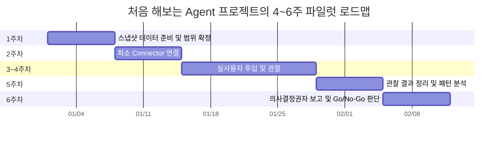
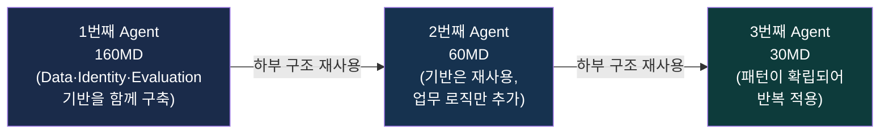

```
단상

한 번도 해보지 않은 것의 공수는 어떻게 계산할까
GE와 GE Agent 개발 공수를 이야기하다가 결국 이런 질문에 도착했다.
“아무리 어려운 Agent라도 100MD면 끝나는 것 아닌가?”
아마 Agent 자체만 보면 그럴 수도 있다.
문제는 Agent 뒤에 숨어 있는 것들이다.
Data, API, MCP, Identity, Authorization, Approval, Audit, Evaluation, Observability, 그리고 오래된 Legacy.
그래서 200MD짜리 Agent가 보이면 먼저 의심해야 한다.
정말 Agent가 200MD인 것인지,
아니면 회사가 그동안 만들지 않았던 Capability를 Agent 이름으로 한꺼번에 만들고 있는 것인지.
더 어려운 문제는 우리가 GE를 한 번도 운영해본 적이 없다는 것이다.
경험이 없는데 처음부터 정교한 WBS와 공수를 만드는 것은 꽤 이상한 일이다.
그래서 나는 조금 다르게 제안했다.
우선 4~6주만 해보자.
처음부터 실시간 데이터 파이프라인을 만들지 않는다.
데이터를 스냅샷으로 업로드한다.
Connector도 필요한 만큼만 연결한다.
멋진 Agent Platform도 잠시 잊는다.
대신 실제 사용자를 붙인다.
“무엇을 물어보는가?”
“어떤 답에서 멈추는가?”
“어떤 데이터를 다시 찾는가?”
“어디까지 하면 사람에게 가치가 생기는가?”
를 관찰한다.
그리고 그 결과를 의사결정권자에게 직접 보여준다.
슬라이드에
“Agent 20개를 만들겠습니다”라고 쓰는 것보다,
실제 사용자가
“이거 있으면 매일 아침 이 업무는 안 해도 되겠는데요.”
라고 말하는 장면 하나가 훨씬 강하다.
그 이후에 파이프라인을 만들고,
MCP를 만들고,
Identity를 연결하고,
업무 상태를 변경하게 만들면 된다.
첫 번째 Agent의 목표는 완벽한 운영 시스템을 만드는 것이 아니다.
무엇을 만들어야 할지를 배우는 것이다.
그리고 두 번째 Agent부터 공수가 줄어들어야 한다.
160MD → 60MD → 30MD.
그래야 Platform이다.
처음 해보는 일에서 가장 위험한 것은 느리게 만드는 것이 아니다.
모르는 상태에서 너무 빨리 크게 만드는 것이다.

https://www.facebook.com/share/p/1RwGZWELaZ/
```


## 이 글이 다루는 내용

원문은 "GE"와 "GE Agent" 개발 공수를 논의하는 과정에서 나온 짧은 단상(斷想)이다. 참고로 원문에서 "GE"가 구체적으로 무엇을 지칭하는지는 명시되어 있지 않다. General Electric 같은 실존 기업명이 아니라, 논의 맥락상 특정 조직이 구축하려는 에이전트 기반 시스템(플랫폼 또는 프로젝트)을 가리키는 내부 용어로 보이지만, 정확한 전체 명칭이나 정의는 원문에 나와 있지 않으므로 이 문서에서는 원문 그대로 "GE"라는 표기를 유지하고 임의로 뜻을 추정하지 않는다.

글의 핵심 주제는 하나다. **"한 번도 만들어 본 적 없는 시스템의 개발 공수(工数, Man-Day 기준 작업량)를 어떻게 산정해야 하는가"** 라는 질문이다. 특히 지금 한국 기업들이 앞다투어 도입하려는 "AI Agent(에이전트)" 프로젝트에서 이 질문이 왜 특히 까다로운지, 그리고 그 대안으로 어떤 접근이 더 합리적인지를 짧은 개인적 성찰의 형태로 풀어낸 글이다.

아래에서는 원문의 논리를 단계별로 풀어서 설명하고, 각 주장이 실제 업계 데이터나 최근 보고서와 얼마나 부합하는지도 함께 짚어본다.

---

## 1. 발단이 된 질문: "아무리 어려운 Agent라도 100MD면 끝나는 것 아닌가?"

논의의 출발점은 이런 반문이었다. Agent 하나를 만드는 데 100인일(100 Man-Day, 통상 1인이 100일 또는 5인이 20일 작업하는 규모)이면 충분하지 않겠느냐는 것이다.

원문은 이 반문에 절반은 동의한다. Agent라는 소프트웨어 컴포넌트 자체, 즉 "사용자의 질문을 이해하고, 적절한 도구를 호출하고, 답을 생성하는" 핵심 로직만 떼어놓고 보면 100MD로도 충분할 수 있다. 문제는 Agent가 실제로 기업 환경에서 작동하려면 그 로직 뒤에 훨씬 많은 것들이 함께 갖춰져 있어야 한다는 점이다.

## 2. Agent 뒤에 숨어 있는 것들

원문은 이 숨은 요소들을 다음과 같이 나열한다: Data, API, MCP, Identity, Authorization, Approval, Audit, Evaluation, Observability, 그리고 오래된 Legacy 시스템.

이해를 돕기 위해 각 요소가 실제로 무엇을 의미하는지 조금 더 풀어서 설명하면 다음과 같다.

| 요소 | 의미 | 왜 공수가 드는가 |
|---|---|---|
| Data | Agent가 참조할 사내 데이터(문서, DB, 로그 등) | 여러 시스템에 흩어진 데이터를 정리·표준화·최신화해야 함 |
| API | 사내 시스템과 연결하는 통로 | 없는 API는 새로 만들어야 하고, 있는 API도 인증·속도·안정성을 다시 검증해야 함 |
| MCP (Model Context Protocol) | AI 모델이 외부 도구·데이터에 표준화된 방식으로 접속하는 프로토콜 | 각 사내 시스템마다 MCP 서버를 만들거나 붙여야 하고, 도구 단위 권한 설계가 필요함 |
| Identity | Agent가 "누구를 대신해" 행동하는지 식별하는 체계 | 사람 계정과 별도로 Agent(비인간 주체)의 신원을 관리하는 체계가 새로 필요함 |
| Authorization | Agent가 무엇에 접근·실행할 수 있는지 정하는 권한 체계 | 최소 권한 원칙에 따라 도구·데이터 단위로 세밀하게 설계해야 함 |
| Approval | 민감한 작업 전에 사람이 승인하는 절차 | 자동화와 사람 개입 사이의 경계를 업무별로 다시 설계해야 함 |
| Audit | 누가, 언제, 무엇을, 왜 했는지 기록하는 체계 | Agent가 대신 수행한 행동까지 추적 가능해야 함 |
| Evaluation | Agent 응답의 정확성·품질을 측정하는 체계 | 정답셋 구축, 반복 테스트 파이프라인이 필요함 |
| Observability | Agent가 실제로 어떻게 동작하고 있는지 모니터링하는 체계 | 장애·이상 행동을 실시간으로 파악할 수 있어야 함 |
| Legacy | 오래되어 문서화나 표준화가 안 된 기존 시스템 | 현대적 인터페이스가 없어 개별적으로 뜯어봐야 함 |

이 목록에서 알 수 있듯, Agent라는 이름으로 불리는 프로젝트의 실체는 대부분 "Agent 로직" 자체가 아니라 그 주변을 둘러싼 인프라와 거버넌스 체계다. 최근 업계 자료들도 이 지점을 반복해서 지적한다. 한 데이터 거버넌스 분석 보고서는 120개 이상의 기업 배포 사례를 분석한 결과 에이전트 파일럿의 88%가 프로덕션 단계에 도달하지 못하며, 그 병목은 모델 품질이 아니라 거버넌스와 평가 체계의 공백이라고 밝혔다. 원문이 나열한 Identity, Authorization, Audit, Evaluation 같은 항목이 정확히 이 "거버넌스·평가 공백"에 해당한다.

## 3. 그래서 "200MD짜리 Agent"를 보면 의심해야 한다

원문의 두 번째 주장은 이렇다. 어떤 회사가 "Agent 하나에 200MD가 든다"는 견적을 받았다면, 그 200MD가 정말로 Agent 개발에 쓰이는 것인지, 아니면 그 회사가 그동안 만들어본 적 없는 역량(Capability)을 "Agent"라는 이름표를 붙여 한꺼번에 만들고 있는 것인지 구분해야 한다는 것이다.

다시 말해, 견적서에 적힌 "Agent 개발"이라는 한 줄 안에 실제로는 데이터 파이프라인 구축, API 신규 개발, Identity 체계 신설, Audit 로그 시스템 도입 같은 완전히 별개의 프로젝트들이 뒤섞여 있을 수 있다는 뜻이다. 이 두 가지를 구분하지 않으면, 두 번째·세 번째 Agent를 만들 때도 매번 비슷한 규모의 공수가 반복해서 청구되는 상황이 벌어진다. 인프라와 거버넌스는 한 번 만들면 재사용되어야 하는데, 그것이 "Agent 개발비"에 매번 숨어 들어가면 재사용 여부를 아무도 검증할 수 없기 때문이다.

## 4. 더 근본적인 문제: 우리는 이걸 운영해 본 적이 없다

원문이 짚는 더 어려운 문제는 따로 있다. 바로 조직이 GE(또는 Agent 시스템)를 실제로 운영해 본 경험이 전혀 없다는 사실이다.

경험이 없는 상태에서 정교한 WBS(Work Breakdown Structure, 작업 분해 구조)와 정밀한 공수 산정표를 처음부터 만드는 것은 원문의 표현대로 "꽤 이상한 일"이다. 소프트웨어 공학에서는 이런 현상을 오래전부터 "불확실성의 원뿔(Cone of Uncertainty)"이라는 개념으로 설명해왔다. 프로젝트 초기, 즉 아직 아무것도 만들어보지 않은 시점의 견적은 실제 결과와 몇 배씩 차이가 날 수 있으며, 실제로 무언가를 만들어보고 데이터를 쌓아야만 그 오차 범위가 좁아진다는 것이다. 처음 해보는 일에서 "정밀한 척하는 견적"은 정밀한 것이 아니라, 불확실성을 감춘 것에 가깝다.

## 5. 제안하는 대안: 처음부터 크게 짓지 않고, 4~6주만 해본다

이 지점에서 원문은 구체적인 대안을 제시한다. 요약하면 다음과 같다.

- 처음부터 실시간 데이터 파이프라인을 만들지 않는다. 대신 데이터를 스냅샷(특정 시점 상태를 그대로 떠낸 정적 데이터) 형태로 업로드해서 시작한다.
- Connector(외부 시스템 연결 모듈)도 반드시 필요한 만큼만 최소로 연결한다.
- 화려한 Agent Platform을 처음부터 구축하려는 욕심은 잠시 내려놓는다.
- 대신 실제 사용자를 붙여서 다음 네 가지를 관찰한다.
  1. 사용자가 무엇을 물어보는가
  2. 어떤 지점에서 답이 막히는가
  3. 사용자가 어떤 데이터를 결국 직접 다시 찾으러 가는가
  4. 어디까지 자동화되면 실제로 사람에게 가치가 생기는가

이렇게 4~6주간 관찰한 결과를 의사결정권자에게 직접 보여주는 것이 원문이 제시하는 마지막 단계다.

이 접근은 개인적인 직관에 그치지 않고, 실제로 2026년 현재 업계에서 표준으로 자리 잡아가는 패턴과 거의 일치한다. 한 AI 에이전트 용어집은 AI 파일럿을 "실제 워크플로우를 대상으로 품질·비용·채택률을 측정하기 위해 시간과 범위를 제한해 배포하는 것"이라 정의하며, 통상 4~12주 기간에 1~3개 사용 사례, 10~100명 규모의 사용자를 대상으로 사전에 합의된 성공 지표를 두고 진행하는 것이 2026년 기업 도입의 표준 패턴이라고 설명한다. 또 다른 실무 가이드는 엔터프라이즈 AI 파일럿에서 가장 큰 위험은 모델 자체가 아니라 불명확한 소유권, 느린 데이터 접근, 뒤늦은 보안 이슈, 그리고 측정 가능한 성과 대신 데모만 만들어내는 파일럿이라고 지적하며, 좁은 범위·최소한의 거버넌스·실제 사용자·사전 정의된 성공 기준을 갖추면 30일 안에도 현실적인 파일럿이 가능하다고 설명한다. 원문이 제안하는 "4~6주, 스냅샷 데이터, 최소 Connector, 실사용자 관찰"이라는 조합은 이 업계 표준과 방향이 같다.

아래는 이 파일럿 단계를 시간 순서로 정리한 흐름이다.



## 6. 왜 사용자의 한마디가 슬라이드 20장보다 강한가

원문은 이 부분에서 인상적인 대비를 제시한다. 슬라이드에 "Agent 20개를 만들겠습니다"라고 적어놓는 것보다, 실제 사용자가 "이거 있으면 매일 아침 이 업무는 안 해도 되겠는데요"라고 말하는 장면 하나가 훨씬 설득력이 크다는 것이다.

이는 단순한 수사가 아니라 실제 의사결정 구조와도 맞닿아 있다. 계획 단계의 약속(20개를 만들겠다)은 검증되지 않은 미래에 대한 예측이지만, 파일럿 단계에서 나온 실사용자의 반응(이 업무가 사라진다)은 이미 검증된 과거의 사실이다. 예산과 조직의 지지를 얻어야 하는 의사결결정권자 입장에서는 후자가 훨씬 리스크가 낮은 근거가 된다.

이 원칙이 왜 중요한지는 최근 실패 사례들을 보면 더 분명해진다. MIT의 NANDA 이니셔티브가 발표한 "The GenAI Divide: State of AI in Business 2025" 보고서는 150명의 리더 인터뷰, 350명의 직원 설문, 300건의 공개 AI 배포 사례 분석을 바탕으로, 생성형 AI 파일럿 프로그램 중 약 5%만이 뚜렷한 매출 성과를 냈고 나머지 대다수는 손익에 별다른 영향을 주지 못한 채 정체되어 있다고 밝혔다. 특히 전문 벤더의 도구를 구매하고 파트너십을 맺은 경우 성공률이 약 67%였던 반면, 조직이 자체적으로 내부에서 구축한 경우 성공률은 그 3분의 1 수준에 그쳤다고 지적한다. 슬라이드 위의 청사진과 실제 운영 사이의 간극이 얼마나 큰지를 보여주는 수치다.

Gartner 역시 2025년 6월 보고서에서 비슷한 경고를 내놓았다. 비용 급증과 불분명한 사업 가치를 이유로 2027년 말까지 에이전틱 AI 프로젝트의 40% 이상이 취소될 것이라 예측했으며, 수많은 벤더가 실질적인 자율 실행 능력 없이 기존 챗봇·RPA 제품을 "에이전트"로 재포장하는 이른바 "에이전트 워싱(agent washing)" 현상까지 지적했다. Gartner 애널리스트는 "지금 대부분의 에이전틱 AI 프로젝트는 하이프에 의해 주도되는 초기 단계의 실험이거나 개념 증명(PoC)에 불과하며, 이로 인해 조직이 대규모 배포에 드는 실제 비용과 복잡성을 제대로 인식하지 못한 채 프로젝트가 좌초되는 경우가 많다"고 설명했다.

이런 통계들은 원문이 경계하는 상황, 즉 "실제로 검증하지 않은 채 큰 그림부터 그리는 접근"이 왜 위험한지를 뒷받침한다.

## 7. 파일럿 이후: 그제서야 본격적으로 짓는다

원문은 파일럿에서 멈추라는 이야기를 하는 것이 아니다. 파일럿으로 무엇이 진짜 필요한지 확인한 다음에는, 실시간 데이터 파이프라인을 구축하고, MCP를 제대로 연결하고, Identity 체계를 붙이고, 마지막으로 Agent가 실제 업무 상태를 변경(즉 조회를 넘어 쓰기·실행까지)할 수 있게 만드는 단계로 넘어가야 한다고 말한다.

즉 순서가 중요하다는 것이다. 거버넌스와 인프라를 먼저 완벽하게 갖춰놓고 Agent를 얹는 것이 아니라, 작은 Agent로 먼저 "무엇이 필요한지"를 알아낸 다음 그 학습 결과에 맞춰 인프라를 짓는 순서다.

## 8. 첫 번째 Agent의 목표는 완벽한 시스템이 아니라 "학습"이다

원문에서 가장 압축적인 문장은 이것이다. "첫 번째 Agent의 목표는 완벽한 운영 시스템을 만드는 것이 아니다. 무엇을 만들어야 할지를 배우는 것이다."

이 관점은 앞서 언급한 소프트웨어 공학의 불확실성 원뿔 개념과도 맞닿아 있다. 아무것도 만들어보지 않은 상태의 계획은 근본적으로 추측에 가깝고, 오직 실제로 하나를 만들어보고 사용자에게 붙여봐야만 다음 계획의 오차 범위가 줄어든다. 첫 번째 Agent를 "제품"이 아니라 "탐침(probe)"으로 보는 태도인 셈이다.

## 9. 공수가 줄어드는 것이 진짜 Platform이라는 증거다

원문은 이 논리를 하나의 숫자 흐름으로 정리한다. 두 번째 Agent부터는 공수가 줄어들어야 한다는 것이다. 160MD → 60MD → 30MD.

이 흐름이 성립하려면, 첫 번째 Agent를 만들며 갖춘 Data 연결, Identity 체계, Evaluation 파이프라인, Observability 같은 하부 구조가 두 번째·세 번째 Agent에서 그대로 재사용되어야 한다. 재사용되지 않고 매번 처음부터 다시 만든다면 공수는 줄어들지 않고, 그것은 "Platform이 만들어지고 있지 않다"는 뜻이 된다. 즉 공수 감소 곡선 자체가 조직이 제대로 된 재사용 가능한 기반을 쌓고 있는지를 보여주는 지표라는 것이다.



## 10. 정리: 가장 위험한 것은 느린 것이 아니라, 모른 채로 크게 짓는 것

원문의 마지막 문장은 전체 글의 결론이자 요약이다. "처음 해보는 일에서 가장 위험한 것은 느리게 만드는 것이 아니다. 모르는 상태에서 너무 빨리 크게 만드는 것이다."

이 결론을 요약하면 다음과 같은 대비로 정리할 수 있다.

| 구분 | 빅뱅형 접근 | 파일럿형 접근 |
|---|---|---|
| 시작점 | 처음부터 정교한 WBS와 전체 공수 산정 | 4~6주 소규모 검증부터 시작 |
| 데이터 | 실시간 파이프라인부터 구축 | 스냅샷 데이터로 먼저 확인 |
| 연결 범위 | 가능한 모든 Connector·시스템 연동 | 꼭 필요한 최소 Connector만 |
| 의사결정 근거 | "Agent 20개를 만들겠다"는 계획서 | 실사용자의 실제 반응 |
| 두 번째 시도부터 | 공수가 줄어들지 않을 위험 | 재사용 기반으로 공수가 감소 |
| 첫 결과물의 목적 | 완성된 운영 시스템 | 무엇을 만들어야 할지에 대한 학습 |

---

## 원문 내용과 외부 검증 정보 구분 (팩트체크)

이 문서는 원문에 담긴 개인적 성찰과, 그 주장을 뒷받침하기 위해 별도로 확인한 외부 자료를 함께 다루고 있다. 두 종류를 구분해서 표기한다.

| 내용 | 성격 | 확인 상태 |
|---|---|---|
| "GE", "GE Agent"의 정확한 정의 | 원문 표현 | 원문에 명시되어 있지 않아 확인 불가. 임의로 추정하지 않음 |
| Agent 뒤에 숨은 요소들(Data, API, MCP, Identity 등)에 대한 주장 | 원문의 개인적 견해 및 실무 경험에 기반한 주장 | 검증 대상이 아닌 의견. 다만 업계 보고서(Atlan)의 거버넌스·평가 공백 지적과 방향이 일치함 |
| 4~6주 파일럿, 스냅샷 데이터, 최소 Connector 제안 | 원문의 제안 | 2026년 업계 표준 파일럿 패턴(4~12주, 실사용자, 사전 성공 지표)과 부합 |
| 160MD → 60MD → 30MD 공수 감소 수치 | 원문에서 예시로 제시한 구체적 숫자 | 특정 프로젝트의 실측치인지, 예시로 든 가상의 수치인지 원문에서 확인되지 않음. 공수 감소라는 방향성 자체는 재사용 가능한 인프라 구축 시 합리적인 기대이나, 정확한 수치는 검증 대상이 아님 |
| "생성형 AI 파일럿의 95%가 뚜렷한 성과를 내지 못한다" | 외부 자료 | MIT NANDA "The GenAI Divide: State of AI in Business 2025" 보고서(2025년 8월 공개)로 확인됨 |
| "에이전틱 AI 프로젝트의 40% 이상이 2027년까지 취소될 것" | 외부 자료 | Gartner 보고서(2025년 6월 공개)로 확인됨 |
| "에이전트 파일럿의 88%가 프로덕션에 도달하지 못한다" | 외부 자료 | Atlan의 데이터 거버넌스 분석 글(2026년 7월 공개, DigitalApplied 분석 인용)로 확인됨 |

---

## 참고 자료 (외부 검증 출처)

- MIT NANDA, "The GenAI Divide: State of AI in Business 2025" (2025.08 공개, Fortune 등 다수 매체 보도) — https://fortune.com/2025/08/18/mit-report-95-percent-generative-ai-pilots-at-companies-failing-cfo
- Gartner, "Gartner Predicts Over 40% of Agentic AI Projects Will Be Canceled by End of 2027" (2025.06 공개) — https://oodaloop.com/briefs/technology/over-40-of-agentic-ai-projects-will-be-scrapped-by-2027-gartner-says
- Atlan, "How to Prepare Enterprise Data for AI Agents" (2026.07 공개, DigitalApplied 분석 인용) — https://atlan.com/know/ai-agent/data-for-ai/how-to-prepare-enterprise-data-for-ai-agents/
- StackAI, "How to Pilot Enterprise AI in 30 Days" (2026.02 공개) — https://www.stack-ai.com/insights/how-to-pilot-enterprise-ai-in-30-days-the-fast-track-implementation-guide
- aiagentrank.io, AI Pilot 용어 정의 — https://aiagentrank.io/glossary/ai-pilot

---

작성일자: 2026년 9월 3일
