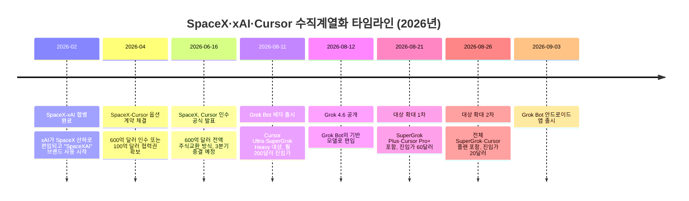
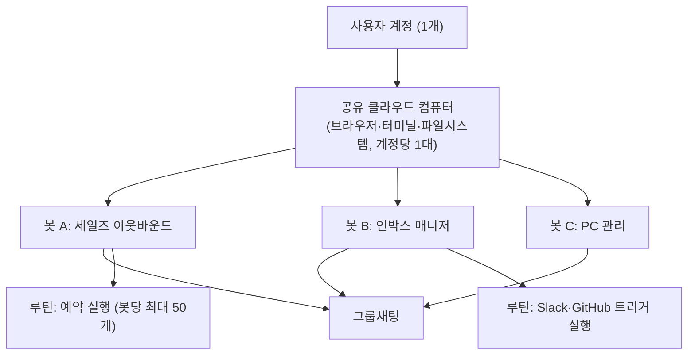
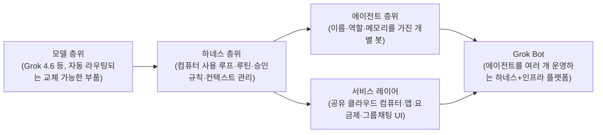

```
Grok Bot 후기입니다.

설치나 처음 세팅 과정이 매끄럽습니다.
주어진 VM만 사용하는 건 줄 알았는데
별도로 머신을 등록해서 사용할 수도 있어서
기존 서버 등록해서 쉽게 사용할 수 있었습니다.

우선 Hermes에서 사용하던 크론잡들을 옮겼습니다.
처음엔 어떤 봇을 추가할까 고민됐는데
사용하다보니 자연스럽게 늘어났습니다.

프로젝트를 담당하는 봇들, 
주제별로 상담하는 봇들,
PC를 관리하는 봇 등
봇은 컨텍스트를 격리하기 때문에 나눠주시는 것이 좋습니다.

저는 습관처럼 세션을 정리하는 버릇이 있는데
봇은 하나의 세션을 사용하면서 컨텍스트를 자동으로 관리해주기 때문에
처음엔 어색했지만 편하긴 했습니다.

이렇게 생성한 봇들은 주제에 맞춰서 그룹채팅을 생성할 수 있습니다.
쓰다보니 회사 메신저를 하는 기분이었습니다.
스타트업 대표가 되어서 직원들과 메신저로 대화하는 느낌.
직원들은 그룹채팅에서 서로를 멘션하며 이야기도 하고
자신들끼리 일대일 채팅으로 이야기도 하더라구요.

이제부터는 단점입니다.

안드로이드 앱은 아직 최적화가 안되어서 그런지
버벅거리고 발열이 있었습니다. 특히 그룹채팅에서.

Cursor Pro 플랜을 사용했는데
개발 사용량에 비해서 그록봇 사용량이 너무 적었습니다.
하루만에 일주일 한도의 70%를 썼네요.
물론 초반에 이것저것 세팅하느라 그럴 수 있으나
확실히 부족한 느낌입니다.

사용하는 모델은 Grok 4.6만 사용하는게 아닙니다.
이것저것 자동으로 라우팅해주는 방식인데
편할 수도 있지만 일관되지 않은 품질을 받는다는 느낌입니다.
복잡한 것을 없애려고 한 건 좋지만 Grok 4.6만 쓰고 싶긴 합니다.

마지막으로 복잡한 플랜도 아쉽습니다.
X, Grok, Cursor, Bot이 서로 복잡하게 되어있습니다.
엮으려면 통합된 플랜으로 깔끔하게 엮던지
아니면 아예 깔끔하게 분리해서 원하는 구독을 선택할 수 있게 해줘야 합니다.
지금은 어중간합니다.

 https://www.threads.com/share/__vydPAUt/
```

## 목차

1. 이 문서에 대하여
2. Grok Bot이란 무엇인가
3. 탄생 배경: SpaceX·xAI·Cursor 수직계열화 6개월
4. 아키텍처: 봇, 공유 컴퓨터, 루틴, 메모리
5. 후기 속 긍정적 경험 검증
   5.1 설치와 온보딩이 매끄러웠다는 후기
   5.2 "별도 머신을 등록해서 사용했다"는 주장에 대한 검증
   5.3 크론잡을 루틴으로 옮기기
   5.4 봇의 컨텍스트 격리와 세션 자동 관리
   5.5 그룹채팅과 봇 간 협업 — 스타트업 대표가 된 기분
6. 후기 속 아쉬운 점 검증
   6.1 안드로이드 앱의 버벅임과 발열
   6.2 사용량 소진 속도 — 하루 만에 70%
   6.3 "그록 4.6만 쓰고 싶다" — 자동 모델 라우팅의 딜레마
   6.4 복잡하게 얽힌 구독 구조
7. 15일 사이 세 번 바뀐 가격 정책
8. 유사 제품과의 비교: Hermes Agent, OpenClaw류와 무엇이 다른가
9. 종합 평가
10. 출처 신뢰도 표
11. 참고문헌
12. 부록: Grok Bot은 AI Agent일까, Harness일까, 그냥 Model일까

---

## 1. 이 문서에 대하여

이 문서는 2026년 9월 초 Threads에 올라온 Grok Bot 사용 후기 한 편을 출발점으로 삼아, 그 안에 담긴 주장 하나하나를 공개된 공식 문서와 여러 매체의 보도를 대조해 가며 검증하고 배경을 보충한 자료다. 원본 후기는 설치 과정의 편의성, 기존 서버 등록 가능 여부, 크론잡 이전 경험, 봇의 컨텍스트 격리, 그룹채팅에서의 협업 경험을 긍정적으로 평가하는 한편, 안드로이드 앱의 최적화 부족, Cursor Pro 플랜 기준으로 본 사용량 소진 속도, 모델 자동 라우팅 방식, 그리고 X·Grok·Cursor·Bot 사이에 얽힌 구독 구조를 아쉬운 점으로 지적하고 있다. 이 문서는 후기 작성자의 주관적 체감을 그대로 옮기는 대신, 어디까지가 xAI(현재는 SpaceX 산하 "SpaceXAI" 브랜드)의 공식 문서로 확인되는 사실이고 어디부터가 개인의 체감이나 단일 출처 주장인지를 구분해서 정리하는 데 초점을 맞춘다. Grok Bot은 2026년 8월 11일 베타로 출시된 지 아직 한 달이 채 되지 않은 제품이라, 문서 곳곳에서 다루는 가격과 제공 범위는 이 글을 쓰는 시점(2026년 9월 4일) 기준으로도 계속 바뀌고 있다는 점을 먼저 밝혀 둔다.

## 2. Grok Bot이란 무엇인가

Grok Bot은 xAI가 "Grok"이라는 챗봇 브랜드 아래 내놓은 완전히 별개의 제품으로, 질문에 답하는 대화형 AI가 아니라 실제 업무를 처음부터 끝까지 대신 처리하는 것을 목표로 하는 상시 가동형 에이전트 서비스다. 공식 소개 문구는 사용자가 직접 데려다 쓸 수 있는 "AI 팀메이트"이자 "디지털 노동력"이라는 표현으로 요약된다. 사용자는 "봇(Bot)"이라 불리는 하나의 지속적이고 이름을 가진 에이전트를 만들고, 그 봇에게 실제 업무 도구에 로그인할 권한을 준 뒤, 여러 단계로 이어지는 작업을 감독 없이 끝까지 처리하도록 맡길 수 있다[16]. 기존의 챗봇형 AI 도구가 "90% 완성된 결과물"을 채팅창에 남겨 두고 나머지를 사람이 마무리하게 만드는 경향이 있었다면, Grok Bot은 작업의 산출물이 실제 사람이 쓰던 도구 — CRM, 인박스, 벤더 포털, 발주 시스템 등 — 안에 그대로 도착하게 만드는 것을 차별점으로 내세운다[4]. 초기 사용자들 사이에서는 "에이전트에게 프롬프트를 준다"기보다 "유능한 팀원에게 일을 넘긴다"는 표현이 자주 인용된다[4].

봇을 구동하는 기반 모델은 xAI의 최신 플래그십 모델인 Grok 4.6이지만, 정작 Grok Bot 안에는 사용자가 모델을 직접 고르는 선택지가 없다. 제품은 정해진 여러 모델 사이에서 자동으로 라우팅하고, 문제가 생기면 다른 모델로 자동 전환하는 방식으로 동작한다고 설명되어 있다[11][1]. 이 부분은 후기의 불만과도 직결되므로 6장에서 다시 자세히 다룬다.

## 3. 탄생 배경: SpaceX·xAI·Cursor 수직계열화 6개월

Grok Bot을 제대로 이해하려면 이 제품이 출시되기까지 벌어진 지분 구조 변화를 먼저 짚어야 한다. 2026년 2월, xAI는 일론 머스크가 이끄는 우주기업 SpaceX와 합병되었고, 이때부터 xAI라는 별도 법인은 사실상 해체되어 SpaceX 산하의 AI 브랜드인 "SpaceXAI"로 흡수되었다. 머스크 본인이 "xAI는 별도 회사로서는 해체되고, 그저 SpaceX의 AI 제품군인 SpaceXAI가 될 것"이라고 표현한 바 있어, SpaceXAI라는 이름은 법적 실체라기보다 하나의 사업 부문 브랜드에 가깝다[62].

이 합병 이후 SpaceX는 4월에 AI 코딩 도구 Cursor의 모회사 Anysphere를 600억 달러에 인수하거나 100억 달러를 지불하고 협력을 이어갈 수 있는 권리를 확보하는 옵션 계약을 맺었고, 6월 16일에는 이 옵션을 실제 인수로 전환해 전액 주식 교환 방식의 600억 달러 규모 계약을 공식 발표했다[59][60][61]. 이는 벤처캐피탈 투자를 받은 스타트업으로는 사상 최대 규모의 인수로 기록되었으며, 거래 종결 시점은 2026년 3분기로 예정되어 있었다[60][61]. 인수 배경에는 Grok이 코딩 시장에서 Claude Code나 Cursor 자체 대비 뚜렷한 경쟁력을 갖추지 못했다는 평가, 그리고 xAI가 2025년 한 해 동안 매출 대비 훨씬 큰 폭의 영업손실을 기록하고 있던 재무 상황이 함께 작용한 것으로 여러 매체가 분석하고 있다[61][62][63].

이 흐름의 마지막 조각이 바로 2026년 8월이다. 8월 11일 Grok Bot이 베타로 출시되었고, 바로 다음 날인 8월 12일에는 새 플래그십 모델 Grok 4.6이 공개되었으며, Cursor 인수 거래 종결일로 예정되어 있던 시점과도 며칠 차이밖에 나지 않았다[1][20]. 즉 Grok Bot은 "AI 코딩" 역량을 사들이고 자체 모델을 고도화한 뒤 이 둘을 하나의 에이전트 제품으로 묶어낸, 2월부터 8월까지 이어진 6개월짜리 수직계열화 전략의 결과물로 볼 수 있다[1].



## 4. 아키텍처: 봇, 공유 컴퓨터, 루틴, 메모리

Grok Bot의 핵심 단위는 "봇"이다. 공식 문서는 봇을 "하나의 지속적이고 이름을 가진 에이전트, 즉 한 명의 AI 팀메이트"로 정의하며, 각 봇은 브라우저·파일시스템·터미널을 갖춘 클라우드 리눅스 환경 위에서 동작한다고 설명한다[1][16].

다만 여기서 초기 마케팅 문구와 실제 문서 사이에 미묘한 차이가 있다는 점을 짚어야 한다. 출시 초기 홍보 페이지는 "봇마다 자신만의 컴퓨터를 갖는다"는 인상을 강하게 주었지만, 실제 공식 문서(컴퓨터와 앱 사용법 페이지)는 그 컴퓨터가 개별 봇이 아니라 사용자 계정 단위로 할당된다고 명시하고 있다. 즉 한 계정 아래 여러 봇을 만들어도 그 봇들은 파일, 브라우저 세션, 로그인 정보를 공유하는 단 하나의 클라우드 컴퓨터를 함께 쓰며, 봇마다 주어지는 것은 그 컴퓨터 위의 "화면" 하나뿐이다. 문서는 이 화면들이 "별개의 작업 공간"일 뿐 "별개의 보안 경계"는 아니라고 못박고 있어, 한 계정 안의 봇들 사이에는 서로 접근하면 안 되는 자격 증명이나 파일을 두지 말라고 권고한다[14]. 이 지점은 여러 독립 매체에서도 "출시 초기 보도가 잘못 이해했던 부분"으로 별도로 짚을 만큼 자주 오해를 낳았다[18][19].



봇이 반복 업무를 처리하는 방식으로는 "루틴(Routine)"이 있다. 사용자가 화면 녹화 방식으로 워크플로를 한 번만 보여주면, 봇이 이를 재사용 가능한 루틴으로 저장하고 이후 스스로 반복 실행한다. 이는 프롬프트를 정교하게 작성하는 능력이 아니라 업무를 "보여주는" 방식에 의존한다는 점에서, 프롬프트 엔지니어링에 익숙하지 않은 기획자·디자이너 등 비개발 직군의 진입 장벽을 낮추려는 설계로 읽힌다[1]. 루틴은 예약 실행뿐 아니라 Slack 메시지 수신이나 GitHub 알림 같은 이벤트를 트리거로 삼아 실행되도록 설정할 수 있고, 특정 단계마다 사람의 승인을 요구하는 규칙도 걸 수 있다. 다만 봇 한 개당 저장 가능한 루틴은 50개, 보관되는 실행 기록은 20개로 제한되어 있다[3]. 오랫동안 아무 반응이 없으면 루틴이 스스로 일시 정지되기도 한다[11].

메모리 측면에서는 과거 대화와 과업 사이의 맥락, 사용자의 선호를 누적해 쓸수록 나아지는 구조라고 설명되어 있으며[1], 저장된 스킬은 같은 계정의 다른 봇들 사이에서도 공유해 쓸 수 있다[11]. 다만 이 "쓸수록 좋아진다"는 표현은 아직 독립적으로 검증된 성능 지표가 아니라 제품이 지향하는 경험으로 받아들이는 편이 안전하다는 지적도 함께 나온다[2].

## 5. 후기 속 긍정적 경험 검증

### 5.1 설치와 온보딩이 매끄러웠다는 후기

원본 후기는 설치와 초기 세팅 과정이 매끄러웠다고 평가했다. 공식 온보딩 절차를 보면 이 체감은 제품 설계와 대체로 일치한다. Grok Bot은 Cursor 계정으로 로그인하며, 조직에서 SSO를 요구하면 그 절차를 따르고, 첫 실행 시 어떤 도구를 쓰는지 몇 가지 질문에 답하면 그에 맞춰 첫 팀메이트 후보를 추천해 주는 방식으로 시작된다. 이 질문에 답한다고 해서 실제로 도구가 연결되거나 수정되는 것은 아니며, 어디까지나 추천을 위한 참고 정보로만 쓰인다[15]. 사용자는 추천된 팀메이트 중 하나를 고르거나 "직접 만들기"를 선택해 이름, 담당 업무, 세부 지침을 직접 정의할 수 있다[15]. 데스크톱 앱은 macOS, Windows, Linux를 지원하며, 클라우드 데이터 저장을 전제로 하기 때문에 Cursor의 "레거시 프라이버시 모드"를 쓰고 있던 계정은 먼저 데이터 설정을 바꿔야 Grok Bot을 시작할 수 있다는 제약이 있다[15].

### 5.2 "별도 머신을 등록해서 사용했다"는 주장에 대한 검증

후기에는 "주어진 VM만 사용하는 줄 알았는데 별도로 머신을 등록해서 기존 서버를 그대로 쓸 수 있었다"는 대목이 있다. 이 부분은 이번 조사에서 공식 문서나 다른 독립 매체 어디에서도 대응하는 근거를 찾지 못했다. xAI의 공식 문서는 일관되게 "봇은 사용자 계정에 할당된 하나의 지속적인 클라우드 컴퓨터를 공유해서 쓴다"고만 설명하고 있으며[14][16], 사용자가 이미 갖고 있던 외부 서버나 VM을 그 컴퓨터 대신 등록해 쓸 수 있다는 내용은 확인되지 않는다. 오히려 한 매체는 "SpaceXAI는 자체 호스팅형 Grok Bot을 문서화하지 않는다"고 명시적으로 적고 있다[25]. 가능성은 두 가지로 좁혀진다. 하나는 후기 작성자가 실제로 문서화되지 않은 베타 기능이나 엔터프라이즈용 옵션을 경험했을 가능성이고, 다른 하나는 "커넥터로 기존에 쓰던 서비스 계정을 연결한 경험"을 "서버를 등록했다"고 표현했을 가능성이다. 두 경우 모두 이 문서가 조사한 범위 안에서는 독립적으로 확인할 수 없었으므로, 이 특정 주장은 검증되지 않은 개인 경험으로 분류해 둔다.

### 5.3 크론잡을 루틴으로 옮기기

후기 작성자는 기존에 다른 에이전트 하네스(Hermes Agent)에서 쓰던 크론잡을 Grok Bot의 루틴으로 옮겼다고 언급했다. 이는 4장에서 설명한 루틴 패널의 예약·트리거 실행 기능과 정확히 대응하는 사용 방식이며, 공식 문서 역시 "예약된 브라우저 모니터링을 매일 돌리는" 식의 운영을 루틴의 대표 사례로 들고 있어[1], 후기의 경험은 제품이 실제로 지원하는 기능 범위 안에 있다고 볼 수 있다.

### 5.4 봇의 컨텍스트 격리와 세션 자동 관리

후기는 프로젝트별 봇, 주제별 상담 봇, PC 관리 봇처럼 용도별로 봇을 나눠 쓰는 것이 좋다고 조언하면서, 그 이유로 봇이 컨텍스트를 격리해서 관리한다는 점을 들었다. 이는 공식 문서의 설계 원칙과 일치한다. 각 봇의 프로필에는 그 봇이 맡을 업무에 대해 항상 유효한 규칙만 담고, 그 주의 구체적인 맥락은 프로필이 아니라 메시지로 전달하라는 안내가 공식 튜토리얼에도 나온다[11]. 또한 후기는 세션을 습관적으로 정리하던 자신의 방식과 달리, 봇은 하나의 세션을 계속 쓰면서 컨텍스트를 자동으로 관리해 준다는 점이 처음엔 낯설었지만 편했다고 적었다. 이 체감 역시 "이전에 중단된 대화를 다시 이어가거나 멈춰 있던 업무를 스스로 재확인하는 것을 지향한다"는 제품 설명과 방향이 맞다[2]. 다만 이 지속성이 완벽하게 신뢰할 만한 수준으로 검증되었다고 보기는 이르며, 한 매체는 이를 "AI 비서"보다는 "특정 직원의 업무 방식을 익혀 가는 디지털 팀원"에 가까운 지향점으로 이해하는 편이 안전하다고 덧붙이고 있다[2].

### 5.5 그룹채팅과 봇 간 협업 — 스타트업 대표가 된 기분

후기에서 가장 인상적으로 묘사된 부분은 여러 봇을 주제별 그룹채팅으로 묶어 쓰면서 "스타트업 대표가 되어 직원들과 메신저로 대화하는 기분"이 들었다는 대목이다. 이 경험 역시 공식 기능과 맞아떨어진다. 하나의 그룹채팅에는 2개에서 6개까지의 봇을 넣을 수 있고, 봇들은 서로 메시지를 주고받으며 스레드 안에서 맥락을 공유하고, 그룹채팅 안에서 스스로 역할을 나누기도 한다[11][4]. xAI 내부에서도 "참모장" 역할의 봇 하나를 상위에 두고, 수신함 관리·경비 처리·채용·버그 수정 등을 맡는 전문 봇들을 그 아래 배치해 운영하는 방식이 소개된 바 있다[4]. 봇들이 그룹에 보내는 인수인계 메시지는 텍스트로만 구성된다는 제약도 문서에 명시되어 있다[11]. 다만 계정 하나에 만들 수 있는 봇과 그룹채팅의 총합은 50개로 제한되어 있어, 후기처럼 봇을 자연스럽게 늘려 가다 보면 이 상한선에 부딪힐 수 있다는 점은 참고할 만하다[3].

## 6. 후기 속 아쉬운 점 검증

### 6.1 안드로이드 앱의 버벅임과 발열

후기는 안드로이드 앱이 아직 최적화되지 않은 것 같다며 특히 그룹채팅에서 버벅임과 발열을 지적했다. 이 불만은 시점을 따져 보면 상당히 설득력이 있다. Grok Bot은 출시 초기 macOS와 iOS 위주로 제공되다가[56], 안드로이드 지원은 그로부터 한참 뒤인 2026년 9월 초에야 별도로 발표되었다[20]. 즉 이 문서를 작성하는 시점을 기준으로 안드로이드 앱은 나온 지 며칠도 되지 않은 상태이며, iOS나 데스크톱 대비 성숙도가 낮을 것이라는 추정은 자연스럽다. 다만 구글 플레이 스토어에 올라온 초기 이용자 후기 중에는 "빠르고 매끄럽다"는 긍정적인 평가도 함께 섞여 있어[51], 버벅임과 발열이 모든 이용자에게 동일하게 나타나는 보편적 현상인지, 아니면 특정 기기나 특정 그룹채팅 규모에서 두드러지는 현상인지는 이 문서가 확인한 자료만으로는 단정하기 어렵다.

### 6.2 사용량 소진 속도 — 하루 만에 70%

후기는 Cursor Pro 플랜을 기준으로 개발 작업량 대비 Grok Bot 사용량이 지나치게 적어서, 세팅만 했을 뿐인데 하루 만에 주간 한도의 70%를 썼다고 지적했다. 이 체감은 다른 독립적인 보도와도 방향이 일치한다. 한 매체는 2026년 8월 26일자 사용자 보고를 인용해 약 10분 만에 주간 한도의 40%가 소진된 사례를 전하고 있고, 발매 첫 주 이용자들이 하루 이틀의 집중 사용만으로 주간 할당량을 다 써 버렸다는 보고도 함께 소개하고 있다[9]. xAI는 각 요금제에 포함된 주간 사용량의 정확한 크기를 공개하지 않고 있으며[9][68][69], 이 때문에 이용자 입장에서는 자신의 사용 패턴이 한도 대비 얼마나 되는지 미리 가늠하기가 어렵다. 온디맨드 사용이 켜져 있는 계정은 주간 한도 소진 이후에도 모델·토큰 비용 기준으로 추가 과금을 받으며 계속 쓸 수 있지만, 이 추가 사용량에 대한 지출 상한선(spend cap) 역시 이 문서 작성 시점까지 공식적으로 발표되지 않았다[8][9]. 후기 작성자가 "초반 세팅 때문일 수 있다"고 스스로 여지를 남긴 것처럼, 실제로 8월 24일부터 26일 사이에는 Cursor 포럼에서 봇이 멈추거나 응답이 불안정하다는 보고가 이어지기도 해[9], 초기 세팅 단계의 시행착오와 서비스 자체의 불안정성이 겹쳐서 사용량을 더 빨리 갉아먹었을 가능성도 있다.

### 6.3 "그록 4.6만 쓰고 싶다" — 자동 모델 라우팅의 딜레마

후기는 Grok Bot이 Grok 4.6 단일 모델만 쓰는 게 아니라 여러 모델 사이에서 자동으로 라우팅하는 방식이라, 편리할 수는 있지만 품질이 일관되지 않게 느껴진다고 지적했다. 이는 공식 문서로도 명확히 확인되는 사실이다. 한 튜토리얼은 "Grok Bot에는 모델 선택 화면이 없다. 제품이 정해진 모델 집합 사이에서 라우팅하며 자동 장애 조치를 수행한다"고 못박고 있고, SpaceXAI 스스로도 모든 봇 실행에 적용되는 단일 기본 모델을 문서화하지 않는다고 밝히고 있다[11]. Grok 4.6은 이 라우팅 대상에 포함되어 있을 뿐, 사용자가 지정해서 고정할 수 있는 대상이 아니다[11][17]. 이런 설계는 "복잡성을 없애 누구나 쓰기 쉽게 만든다"는 목표에는 부합하지만, 코딩처럼 결과물의 품질 편차에 민감한 작업에서는 후기 작성자처럼 "어떤 모델이 응답했는지 알 수 없어 일관성이 떨어진다"는 불만으로 이어지기 쉽다. 이는 제품 철학과 숙련된 개발자의 통제 욕구가 충돌하는 지점이라고 볼 수 있다.

### 6.4 복잡하게 얽힌 구독 구조

후기는 X, Grok, Cursor, Bot 네 가지가 서로 복잡하게 얽혀 있어 통합이든 완전한 분리든 한쪽으로 정리되었으면 좋겠다고 지적했다. 이 불만 역시 공식 자료로 뒷받침된다. Grok Bot 사용량은 Grok 계정이나 X 계정이 아니라 어디까지나 Cursor 계정을 기준으로 집계된다. SuperGrok이나 X Premium+ 구독을 Cursor 계정에 연결하면 그 구독이 살아 있는 동안 같은 Cursor 계정에 Grok Bot 사용권을 부여하는 방식이며, 이는 별도의 두 번째 사용량 계측 체계를 만드는 것이 아니고 기존 Cursor 플랜 자체를 바꾸는 것도 아니다[6]. 즉 이용자는 (1) 어떤 Cursor 플랜에 가입했는지, (2) 그 위에 어떤 SuperGrok이나 X Premium+ 구독을 연결했는지, (3) 그 연결이 살아 있는 동안에만 사용권이 부여된다는 조건, 이 세 가지를 동시에 신경 써야 한다. 이런 이유로 커뮤니티 포럼에서도 "20달러짜리 Cursor Pro 요금제 안의 $20 크레딧과 Grok Bot 사용량이 서로 같은 자원인지 다른 자원인지 헷갈린다"는 질문이 실제로 올라오기도 했다[7]. 8장에서 다시 정리하겠지만, Grok Bot에 접근할 수 있는 경로만 최소 8가지 조합(SuperGrok/Plus/Heavy, Cursor Pro/Pro+/Ultra, Cursor Teams Standard/Premium)에 달한다는 점도[69] 후기의 "어중간하다"는 평가에 힘을 싣는다.

## 7. 15일 사이 세 번 바뀐 가격 정책

Grok Bot의 가격 정책은 출시 이후 극히 짧은 기간 동안 세 차례나 바뀌었다는 점에서 이례적이다. 아래 표는 확인된 변경 시점과 내용을 정리한 것이다.

| 시점 | 변경 내용 | 개인 진입가(월) | 출처 |
|---|---|---|---|
| 2026-08-11 (베타 출시) | SuperGrok Heavy, Cursor Ultra, Cursor Teams Premium 대상으로만 제공 | 약 200달러 | [68][69] |
| 2026-08-21 (1차 확대) | SuperGrok Plus, Cursor Pro+ 추가, 일부 무료 체험 도입 | 약 60달러 | [68][9] |
| 2026-08-26 (2차 확대) | 전체 SuperGrok(기본 포함)·Cursor Pro·Cursor Teams Standard까지 확대 | 20달러(Cursor Pro), 30달러(SuperGrok 기본) | [65][9][69] |

이 표에서 알 수 있듯, 발매 15일 만에 개인 진입 가격은 200달러에서 20달러로 10분의 1 수준까지 낮아졌다[9]. 다만 진입 가격이 낮아진 것과 별개로, 주간 사용량 한도의 구체적인 크기나 온디맨드 초과 사용분의 지출 상한선은 이 문서 작성 시점까지 공개되지 않고 있다[8][68][69]. 후기 작성자가 겪은 "저렴해진 요금제로 들어왔더니 정작 쓸 수 있는 양은 넉넉하지 않더라"는 경험은, 진입 장벽을 낮추는 데는 성공했지만 실제 사용량 배분은 아직 넉넉하지 않은 이 과도기적 상태를 그대로 반영하고 있는 것으로 보인다.

## 8. 유사 제품과의 비교: Hermes Agent, OpenClaw류와 무엇이 다른가

후기 작성자가 기존에 Hermes Agent에서 크론잡을 옮겨 온 경험에서 드러나듯, Grok Bot은 Hermes Agent나 OpenClaw 같은 자체 호스팅형 멀티 에이전트 하네스와 종종 같은 선상에서 비교된다. 가장 근본적인 차이는 인프라를 누가 소유하느냐에 있다. 한 비교 매체는 이 차이를 "Grok Bot은 xAI의 클라우드 인프라 위에서 돌아가는 반면, Hermes Agent나 Buzz, OpenClaw는 모두 사용자 자신의 기기에서, 자신의 데이터와 자신이 고른 모델 제공자로 돌아간다. 스택 전체를 사용자가 소유한다"고 정리한다[17]. 실제로 한 국내 이용자의 초기 소감에서도 "Grok Bot은 클라우드에서 AI를 구동시키는 방식이라 kimi claw처럼 동작한다고 보면 되고, OpenClaw나 Hermes 같은 개념이지만 서비스 형태라 별도로 맥미니 같은 홈서버를 구축할 필요가 없다는 게 장점"이라는 평가가 나온 바 있다[56].

이 차이는 곧바로 장단점으로 이어진다. 서비스형이기 때문에 하드웨어를 직접 구축하고 유지보수할 필요가 없다는 점은 분명한 편의지만, 그 대가로 사용자는 인프라·모델 선택권·요금 구조 모두를 xAI가 정하는 대로 따라야 한다. 자체 하네스를 쓸 때는 사용자가 GLM이나 Claude, GPT 등 원하는 모델을 직접 배정하고 요금도 API 단가 그대로 지불하는 반면, Grok Bot에서는 6장에서 다룬 것처럼 모델 선택권 자체가 없고 요금 구조도 짧은 기간에 여러 번 바뀌었다. 결국 Grok Bot은 "인프라 관리의 번거로움을 없애는 대신 통제권을 내주는" 서비스형 접근을 택하고 있는 셈이며, 이는 하네스를 직접 조립해 쓰는 데 익숙한 숙련 사용자보다 처음부터 완제품을 원하는 비개발 직군에 더 맞는 설계로 보인다.

## 9. 종합 평가

원본 후기를 관통하는 정서는 "편의성은 확실히 높였지만, 그 편의성이 통제권과 예측 가능성을 일부 희생한 대가로 얻어졌다"는 것으로 요약할 수 있다. 설치와 온보딩, 루틴으로의 크론잡 이전, 봇 단위의 컨텍스트 격리, 그룹채팅을 통한 봇 간 협업까지 — 후기가 긍정적으로 평가한 항목들은 대부분 공식 문서에 설계된 대로 작동하고 있는 것으로 확인된다. 반면 안드로이드 앱의 미숙함은 그 기능이 나온 지 며칠 되지 않았다는 시점을 고려하면 이해할 만한 성장통에 가깝고, 사용량 소진 속도에 대한 불만은 진입 가격은 낮아졌지만 사용량 한도 자체는 넉넉해지지 않은 과도기의 부작용으로 읽힌다. 모델 자동 라우팅과 복잡한 구독 구조에 대한 불만은 제품의 근본적인 설계 철학, 즉 "선택지를 줄여 쉽게 만든다"는 방향과 "숙련된 사용자가 원하는 세밀한 통제"가 정면으로 충돌하는 지점이어서, 단기간에 해소되기보다는 제품이 성숙해 가는 과정에서 계속 논쟁거리로 남을 가능성이 높다. 다만 "기존 서버를 등록해서 썼다"는 대목만큼은 이 문서가 확인한 공식 자료 범위 안에서는 근거를 찾지 못했으므로, 이 부분은 별도의 확인이 필요한 개인 경험으로 남겨 둔다.

## 10. 출처 신뢰도 표

| 구분 | 내용 |
|---|---|
| 공식 문서로 확인된 사실 | Grok Bot 8월 11일 베타 출시, 계정당 컴퓨터 1대 공유, 봇 간 보안 경계 없음, 그룹채팅 봇 2~6개, 루틴 봇당 50개·실행기록 20개, 모델 선택 화면 없이 자동 라우팅, Cursor 계정 기준 사용량 계측, SuperGrok/X Premium+ 연결은 사용권 부여이지 별도 계측이 아님, 안드로이드 출시가 데스크톱·iOS보다 훨씬 늦었다는 시점 |
| 여러 매체가 일치해서 보도한 내용 | SpaceX-xAI 2월 합병, SpaceX-Cursor 6월 600억 달러 인수 발표, 가격 정책이 8/11→8/21→8/26 세 단계로 낮아진 흐름, 8월 말 사용량 소진 관련 다수 이용자 보고 |
| 단일 출처 주장(교차 확인 안 됨) | 10분 만에 주간 한도 40% 소진 사례, DEV Community 리뷰어의 구체적 실패 사례, 8/24~26 안정성 저하 보고 |
| 원본 후기의 개인 경험(공식 자료로 검증 불가) | "기존 서버를 별도로 등록해서 사용할 수 있었다"는 주장 — 공식 문서 및 조사한 매체 어디에서도 대응 근거를 찾지 못함 |
| 이 문서의 해석 | 8장의 "서비스형 vs 자체 호스팅형" 비교, 9장의 종합 평가는 사실관계를 바탕으로 한 필자의 해석이며 xAI의 공식 입장이 아님 |

## 11. 참고문헌

[1] Grok Bot/그록봇과 함께하는 AX 디자인, brunch.co.kr — https://brunch.co.kr/@ghidesigner/532

[2] 일론 머스크 Grok Bot 공개, 머니업그레이드 — https://wikidocs.net/blog/@yuncastle/28439/

[3] 그록봇(Grok Bot) 가격·설치·슬랙 연동 총정리, gpters.org — https://www.gpters.org/news/post/grok-bot-guide-price-setup-5JRJexbz1E9YgB2

[4] Grok Bot 완전 정리: 진짜 일을 맡기는 AI 팀원, apptics.co.kr — https://apptics.co.kr/grok-bot-완전-정리-진짜-일을-맡기는-ai-팀원-xai-에이전트-전격/

[5] Grok Bot 공개, 각자 컴퓨터를 가진 24시간 AI 에이전트, 감자나라ai — https://potato-ai.xyz/xai-grok-bot-always-on-work-agents/

[6] Plans and billing, Cursor Docs — https://cursor.com/help/grok-bot/plans

[7] Is Grok Bot usage separate from Cursor plan?, Cursor Community Forum — https://forum.cursor.com/t/is-grok-bot-usage-separate-from-cursor-plan/169658

[8] Grok Bot pricing 2026: real plan costs and the uncapped meter, eesel AI — https://www.eesel.ai/blog/grok-bot-pricing

[9] Grok Bot Comes to Cursor Pro: The $20 Route, Explained, CellCog — https://cellcog.ai/blog/grok-bot-cursor-pro/

[10] Grok Bot Pricing Explained: What It Actually Costs, CellCog — https://cellcog.ai/blog/grok-bot-pricing/

[11] Grok Bot Tutorial: Skills, Routines, and Approvals, DataCamp — https://www.datacamp.com/tutorial/grok-bot-tutorial

[12] Grok Models & Pricing, SpaceXAI Docs — https://docs.x.ai/developers/models

[13] Get Started: Grok 4.6, SpaceXAI Docs — https://docs.x.ai/developers/grok-4-6

[14] Use the computer and apps, SpaceXAI Docs — https://docs.x.ai/grok-bot/computer-and-apps

[15] Get started, SpaceXAI Docs — https://docs.x.ai/grok-bot/get-started

[16] Grok Bot, SpaceXAI Docs (Overview) — https://docs.x.ai/grok-bot/overview

[17] Grok Bot Alternatives: 10 Cheaper AI Agents (2026), Marblism — https://www.marblism.com/blog/grok-bot-alternatives

[18] Grok Bot: xAI's AI Teammates Get Their Own Computer, digitalapplied.com — https://www.digitalapplied.com/blog/grok-bot-ai-teammates-launch-cloud-computer-2026

[19] What Is Grok Bot? How It Works, Pricing, and Alternatives, atomicbot.ai — https://atomicbot.ai/blog/what-is-grok-bot

[20] Grok Bot is now available on Android, The Tech Outlook — https://www.thetechoutlook.com/new-release/software-apps/grok-bot-is-now-available-on-android/

[51] Grok Bot - Apps on Google Play — https://play.google.com/store/apps/details?id=ai.x.grok.bot

[59] 스페이스X, 코딩 플랫폼 커서 인수, ZDNet Korea — https://zdnet.co.kr/view/?no=20260617092106

[60] 머스크의 90조 원 베팅… 스페이스X, AI 코딩 '커서' 인수, 플래텀 — https://platum.kr/archives/289220

[61] SpaceX Acquires Cursor: What the $60B Deal Means for Developers, Developers Digest — https://www.developersdigest.tech/blog/spacex-cursor-acquisition-developer-guide-2026

[62] SpaceX Cursor acquisition, Go To Agency — https://go-to-agency.com/en/blog/spacex-acquires-cursor-60-billion

[63] 머스크의 SpaceX, Cursor 인수에 $60 Billion, TradingKey — https://www.tradingkey.com/kr/analysis/stocks/us-stocks/261973254-spacex-acquires-cursor-60b-bolster-xai-ecosystem-challenge-openai-anthropic-tradingkey

[65] Grok Bot is now included with more plans, x.ai — https://x.ai/news/grok-bot-more-plans

[68] Grok Bot Pricing 2026: Plans, Usage Limits, Free Trial, Platforms, aibuilderclub.com — https://www.aibuilderclub.com/blog/grok-bot-pricing

[69] Grok Bot Pricing Explained: What It Actually Costs, CellCog — https://cellcog.ai/blog/grok-bot-pricing/

[56] Threads @kresnik00 게시물 — https://www.threads.com/@kresnik00/post/Db9V7xEE-uh/

[원본] 검토 대상 후기, Threads — https://www.threads.com/share/__vydPAUt/

---

*이 문서는 2026년 9월 4일 기준으로 웹에서 확인 가능한 공개 자료를 근거로 작성되었습니다. Grok Bot은 베타 단계 제품으로 가격·제공 범위·기능이 이 문서 작성 이후에도 계속 바뀔 수 있으므로, 실제 구독이나 도입을 결정하기 전에는 SpaceXAI 공식 문서(docs.x.ai/grok-bot)와 Cursor 공식 도움말 페이지에서 최신 내용을 다시 확인하는 것을 권장합니다.*

---

## 12. 부록: Grok Bot은 AI Agent일까, Harness일까, 그냥 Model일까

본문에서는 Grok Bot이 무엇을 하는 제품인지, 후기의 주장이 어디까지 맞는지를 다뤘다. 이 부록은 한 걸음 더 나아가 Grok Bot을 "모델·하네스·에이전트"라는 세 개념의 층위로 분해해 어느 자리에 놓이는지를 정리한다. 결론부터 말하면 Grok Bot은 세 개념 중 어느 하나로 딱 떨어지지 않으며, **모델을 하네스로 감싸서 여러 개의 에이전트 인스턴스를 동시에 띄우는 제품·플랫폼**에 가장 가깝다. 이 부록에서 제시하는 분류는 본문 2장과 4장, 6.3절에서 확인한 사실을 근거로 한 필자의 해석이며, xAI가 공식적으로 이런 3단 구분을 제시한 적은 없다는 점을 먼저 밝혀 둔다.

### 12.1 모델(Model) 층위 — Grok Bot은 모델이 아니다

Grok 4.6은 Grok Bot 안에서 쓰이는 기반 모델 가운데 하나일 뿐이다. 사용자는 모델을 직접 고르거나 고정할 수 없으며, 제품은 정해진 모델 집합 사이에서 자동으로 라우팅하고 문제가 생기면 다른 모델로 넘어가는 방식으로 동작한다[11]. 즉 "이 작업은 Grok 4.6이 처리했다"고 확정할 근거 자체가 사용자에게 주어지지 않는다. 모델은 Grok Bot이라는 제품 아래에 숨어 있는, 언제든 교체될 수 있는 부품에 해당한다.

### 12.2 하네스(Harness) 층위 — Grok Bot이 가장 강하게 갖고 있는 성격

하네스는 모델을 도구 호출 루프에 끼워 넣는 스캐폴딩, 즉 컨텍스트를 어떻게 구성하고 언제 도구를 호출하며 언제 사람의 승인을 받을지를 결정하는 로직을 말한다. Grok Bot에는 이 층위가 뚜렷하게 존재한다. 본문 4장에서 다룬 컴퓨터 사용 루프(브라우저·터미널·파일시스템 조작), 루틴의 트리거·승인 규칙, "한 번 시연하면 재사용 가능한 루틴으로 저장"하는 학습 메커니즘, 여러 봇이 하나의 공유 컴퓨터 위 스레드에서 맥락을 주고받는 방식이 모두 하네스가 담당하는 영역이다[1][11][14]. Grok Bot이 체감상 강력하게 느껴지는 이유의 상당 부분은 모델 자체의 지능보다 이 하네스 설계에서 비롯될 가능성이 크다.

### 12.3 에이전트(Agent) 층위 — 개별 "봇" 단위에서 성립

이름과 역할, 누적되는 메모리를 가진 지속적 개체라는 정의에 부합하는 것은 Grok Bot 전체가 아니라 그 안에서 만들어지는 "봇" 하나하나다. 세일즈 아웃바운드를 담당하는 봇, 인박스를 관리하는 봇처럼 개별 봇은 에이전트로 부르기에 정확하다. 반면 여러 봇을 동시에 띄우고 그룹채팅으로 조율하는 Grok Bot 전체는 에이전트 하나가 아니라 에이전트를 여러 개 생성·운영하는 플랫폼이다.

### 12.4 순수 하네스와도 구분되는 지점 — 완제품 서비스 레이어

다만 Grok Bot을 단순히 "하네스"라고 부르기에는 한 단계 더 나아간 부분이 있다. Hermes Agent나 Codex CLI 같은 순수 하네스는 사용자가 직접 모델을 붙이고 직접 실행 환경을 관리하는 도구인 반면, Grok Bot은 그 위에 계정 단위 공유 클라우드 컴퓨터, 데스크톱·모바일 앱, 청구·요금 체계, 봇 개수 상한(계정당 50개), 그룹채팅 UI까지 완제품 형태로 얹혀 있다[3][14]. 이는 사용자가 부품을 조립해 만드는 하네스가 아니라, 처음부터 다 조립된 상태로 판매되는 서비스형 제품에 해당한다. 8장에서 다룬 "서비스형 vs 자체 호스팅형" 비교와 같은 맥락이다.



### 12.5 역설: 하네스가 감춰져 있다는 것 자체가 논쟁거리

한 가지 짚어 둘 역설이 있다. 일반적으로 "하네스 설계가 모델 성능보다 중요하다"는 관점에서는 사용자가 하네스를 직접 들여다보고 조정할 수 있다는 전제가 깔려 있다. 그런데 Grok Bot에서는 오히려 이 하네스가 사용자에게 불투명하게 감춰져 있다. 어떤 모델이 응답을 생성했는지도 알 수 없고(12.1절), 라우팅 판단 기준도 공개되어 있지 않다[11]. 본문 6.3절에서 다룬 "일관성이 떨어진다"는 후기의 불만은 결국 이 지점, 즉 하네스가 사용자 대신 판단을 대신 내려 버리는 설계 철학과 숙련된 사용자가 원하는 세밀한 통제권이 충돌하는 데서 비롯된다.


