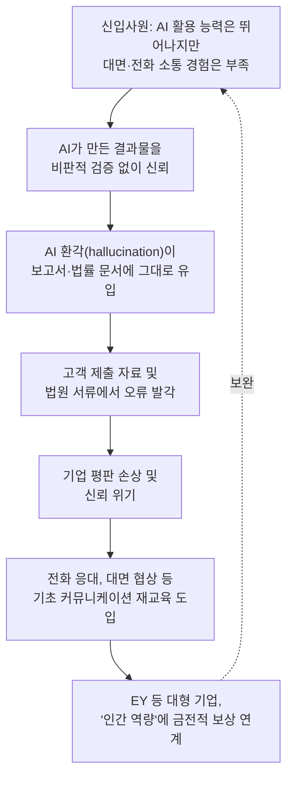
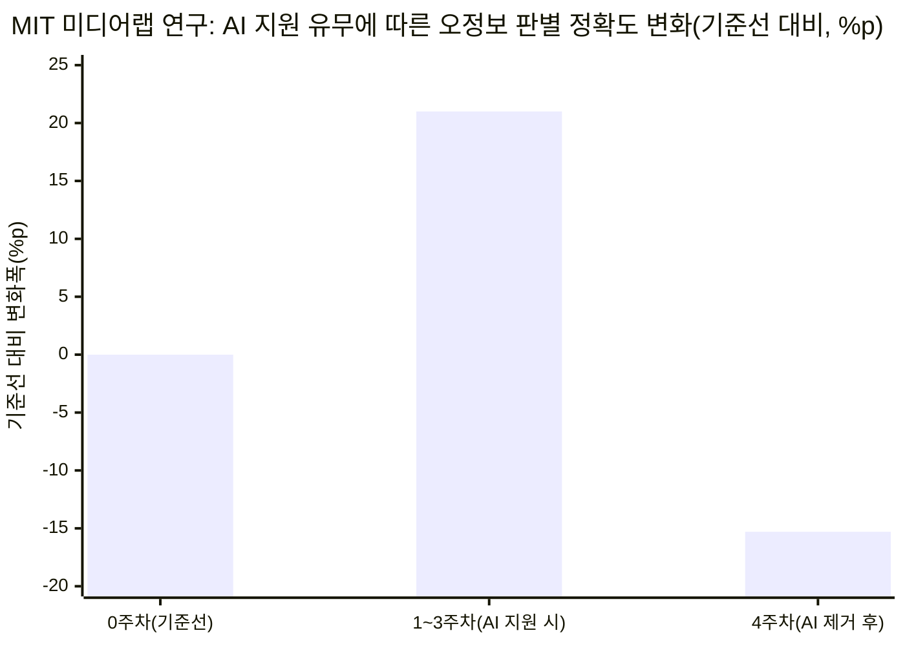
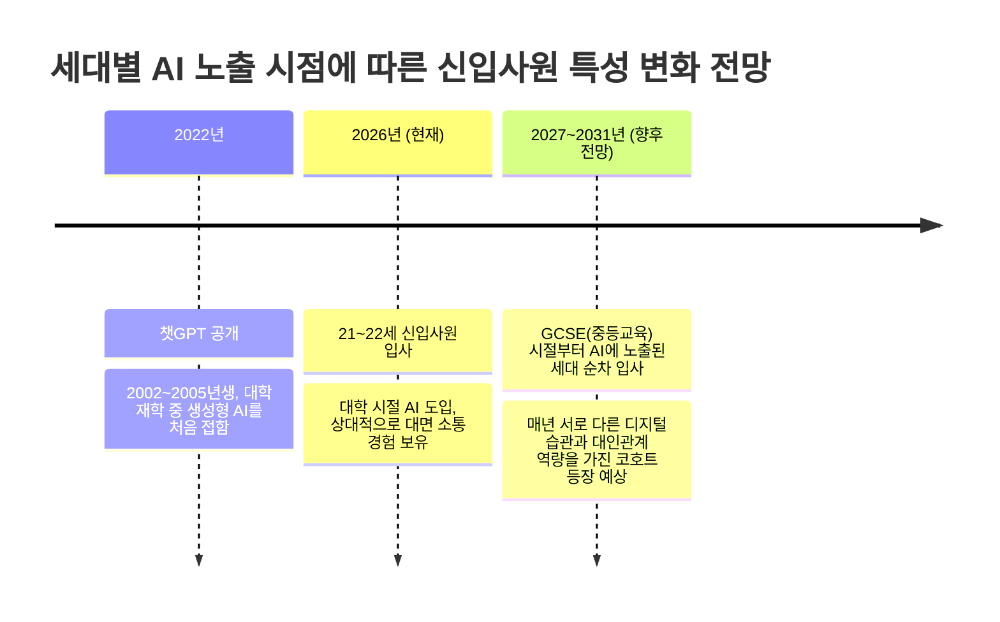

- 작성일: 2026년 9월 4일
- 원문 출처: City AM, Maria Ward-Brennan, ["The common sense deficit hitting the City's professional services firms"](https://www.cityam.com/the-common-sense-deficit-hitting-the-citys-professional-services-firms/) (2026년 9월 2일 게재, 9월 2일 11:03 업데이트)

```
https://www.threads.com/share/BBrzXfJZr8/

런던 금융가에 비상이 걸렸음.

AI를 능숙하게 다루는
신입 사원들이 들어왔는데,
오히려 지식 공백이 생겼음.

기술은 앞서가지만
기초적인 상식과 판단력이
사라지고 있는 것임.

AI가 업무 효율을 높일 거란
기대와는 정반대 상황임.

오히려 전문 서비스의 핵심인
인간의 비판적 사고를
마비시키고 있음.

AI가 만든 환각을
신입들이 그대로 믿고
보고서에 옮기는 게 문제임.

실제로 런던의 로펌들은
신입 변호사들을 대상으로
강제 커뮤니케이션 교육을
시작했음.

전화로 고객을 응대하거나
AI 도구 없이 스스로
판단하는 법을 가르치는 것임.

기술 숙련도가 높을수록
인간 고유의 상식은
퇴보하는 역설이 발생함.

미국 EY는 이 문제를 해결하려
1억 달러(약 738억 원)를
투입하기로 했음.

판단력과 적응력을 보여준
직원에게 보너스를 주는
제도까지 도입함.

MIT 연구에 따르면
AI 의존도가 높을수록
오정보를 판별하는 능력이
급격히 떨어진다고 함.

2022년 챗GPT 출시 이후
대학 시절부터 AI를 써온
21~22세 신입들이
조직의 미래를 짊어지고 있음.

AI가 결과물을 자동화하는 시대,
인간만이 제공할 수 있는
'판단'이라는 가치는
어떻게 보존되어야 할까?

```


---

## 목차

1. 들어가며 — 왜 지금 시티(the City)가 이 문제로 시끄러운가
2. 원문 기사 요약 — City AM이 던진 핵심 메시지
3. 배경 1 — 무너지는 '피라미드' 모델: 컨설팅·회계 업계의 신입 채용 구조 변화
4. 배경 2 — 골드만삭스가 짚어낸 주니어 화이트칼라의 구조적 취약성
5. 핵심 역설 — 기술은 앞서가지만 상식은 뒤처진 세대
6. 현장의 대응 ① — 런던 로펌들의 강제 커뮤니케이션 교육
7. 현장의 대응 ② — AI 환각(hallucination)이 법정과 보고서에 남긴 상처
8. 근거 자료 — MIT 미디어랩이 밝혀낸 'AI 의존의 역설'
9. 기업의 해법 — EY의 1억 달러 베팅과 빅4의 움직임
10. 앞으로의 전망 — 해마다 달라질 신입사원, 끝나지 않는 숙제
11. 종합 정리 및 시사점
12. 출처 신뢰도 표
13. 참고문헌

---

## 1. 들어가며 — 왜 지금 시티(the City)가 이 문제로 시끄러운가

런던의 금융·법률·컨설팅 업계가 밀집한 시티(the City)에서 올여름 조용하지만 심각한 논의가 이어졌다. 주제는 다름 아닌 '신입사원'이다. 표면적으로는 이상하게 들릴 수 있다. 지금 입사하는 20대 초반의 신입사원들은 이전 어떤 세대보다 인공지능(AI) 도구를 능숙하게 다룬다. 그런데 정작 업계 리더들이 걱정하는 것은 AI 활용 능력이 아니라, 그 반대편에 있는 것 — 전화 응대, 고객 설득, 스스로 판단을 내리는 능력 같은 '기초 체력'이 부족하다는 점이다. City AM의 전문서비스 편집장 마리아 워드-브레넌(Maria Ward-Brennan)이 2026년 9월 2일 보도한 기사는 이 현상을 "상식 결핍(common sense deficit)"이라는 표현으로 요약했다[1]. 이 보고서는 해당 기사의 내용을 뼈대로 삼되, 기사가 인용한 배경 자료(MIT 미디어랩 연구, 골드만삭스 보고서, EY의 보상 정책 등)를 직접 확인하고 최신 사실관계를 덧붙여 전체 맥락을 상세히 풀어낸다.

## 2. 원문 기사 요약 — City AM이 던진 핵심 메시지

기사의 논지는 크게 세 갈래다. 첫째, 전문서비스 업계를 지탱해온 '피라미드' 조직 구조 — 소수의 파트너가 다수의 주니어 인력을 두고 지식노동을 판매하는 방식 — 가 AI로 인해 흔들리고 있다는 것이다. 둘째, 그 결과 기업들은 채용과 훈련 전략을 다시 짜야 하는 압박에 직면했다. 셋째, 가장 핵심적인 역설로서, 2002년에서 2005년 사이에 태어나 대학 재학 중에 챗GPT(2022년 출시)를 접한 이번 신입 코호트는 기술적으로는 앞서 있지만, 전화로 고객에게 연락하거나 영업을 제안하거나 AI 도구 없이 스스로 판단을 내리는 것과 같은 더 단순한 역량이 부족하다는 점이다[1]. 기사는 이 문제가 얼마나 심각한지 보여주는 사례로 런던의 로펌들이 신입 변호사를 대상으로 한 의무적 커뮤니케이션 교육을 도입하고 있다는 사실, 미국 EY가 판단력과 적응력 같은 인간적 역량에 1억 달러(약 738억 원)를 투자하기로 했다는 월스트리트저널 보도, 그리고 AI에 대한 과도한 의존이 비판적 사고력과 허위정보 판별 능력을 저하시킨다는 MIT의 6월 연구를 근거로 들었다[1].

## 3. 배경 1 — 무너지는 '피라미드' 모델: 컨설팅·회계 업계의 신입 채용 구조 변화

시티 전문서비스 업계의 전통적인 사업 모델은 오랫동안 '피라미드'로 불려왔다. 소수의 고임금 파트너가 꼭대기에 있고, 그 아래 넓은 저변에 다수의 신입 애널리스트나 어소시에이트가 실무 조사와 문서 작성 같은 반복 업무를 처리하는 구조다. 이 모델은 신입 인력을 저렴하고 풍부한 자원으로 활용해 매출을 키우고, 그중 일부만 승진시켜 파트너로 남기는 방식으로 수십 년간 작동해왔다.

그런데 최근 이 구조에 균열이 가고 있다는 신호가 잇따르고 있다. 맥킨지와 보스턴컨설팅그룹(BCG)은 2026년 신입 컨설턴트의 초봉을 3년 연속으로 동결했으며, 이는 컨설팅 업계의 피라미드 모델에 대한 압박이 커지고 있음을 보여주는 신호로 해석됐다[13]. 영국에서는 신입 채용 한 자리에 몰리는 지원자 수가 2022~2023년 평균 86명에서 최근 약 140명으로 늘어났다는 영국 학생고용주협회(Institute for Student Employers)의 집계도 함께 보도됐다[13]. 컨설팅 전문 매체 컨설턴시닷유케이(Consultancy.uk)는 맹그로브컨설팅(Mangrove Consulting)의 파트너 닉 파이(Nick Pye)를 인용해, 소수 파트너와 다수 주니어로 구성된 전통적 피라미드 구조 자체가 AI로 인해 낡은 것이 될 수 있다는 견해를 전했다[14]. 실제로 지난 1년 사이 세계 주요 컨설팅사들은 조용히 신입 채용 규모를 줄여왔고, 절반 이상의 신입 직무 공고가 AI 관련 역량을 요구하는 것으로 나타났다[14].

빅4 회계·컨설팅사(딜로이트, EY, KPMG, PwC)의 경우 2022년 이후 초봉이 오르지 않았고, 업계 고위 임원들은 향후 1년 내 주요 서비스 기업들의 졸업생 채용 규모가 최대 절반까지 줄어들 수 있다고 내다봤다는 보도도 있다[13]. 별도로 영국 가디언지를 인용한 보도에 따르면, 빅4 기업들의 졸업생 채용 공고는 2025년 기준 전년 대비 44% 감소한 것으로 나타났다[15]. 이런 흐름은 "일을 배우면서 익히는" 전통적 모델에서, AI로 보강된 더 날씬한 인력 구조로 업계가 이동하고 있음을 시사한다[15].

## 4. 배경 2 — 골드만삭스가 짚어낸 주니어 화이트칼라의 구조적 취약성

City AM 원문 기사는 골드만삭스의 별도 연구를 함께 링크로 소개했는데, 이 연구는 신입 사원 문제의 구조적 배경을 이해하는 데 중요한 단서를 제공한다. 골드만삭스는 800개가 넘는 직업군의 고용 현황을 분석한 결과, AI로 인한 채용 압박이 경력이 오래된 근로자보다 신입 근로자에게 훨씬 강하게 나타난다는 사실을 확인했다[2]. 특히 경영컨설팅, 광고, 소프트웨어 출판, 콜센터처럼 AI 자동화에 크게 노출된 산업에서는 2022년 하반기 이후 채용 공고 증가세가 뚜렷하게 둔화됐다[2]. 신입 근로자에 대한 영향은 미국에서 0.2%포인트 이상, 호주에서는 0.6%포인트 이상으로 추정됐다[2].

이 연구가 발표된 시점의 영국 노동시장 상황도 함께 짚을 필요가 있다. 영국 통계청(ONS) 자료에 따르면 2026년 5~7월 3개월간 구인 건수는 70만 7,000건으로 5년 만에 최저치를 기록했고, 기업 급여명부에 등록된 근로자 수는 6개월 연속 감소했으며, 민간부문의 실질임금 상승률은 2020년 10월 이후 가장 낮은 2.8%로 둔화됐다[2]. 다만 골드만삭스 스스로도 이 광범위한 영국 경기 둔화의 원인이 AI 하나만은 아니라고 선을 그었다[2].

미국 시장을 대상으로 한 골드만삭스의 별도 분석(2026년 6월 발표)은 좀 더 구체적인 수치를 제시했다. 이 분석에 따르면 AI로 인한 순고용 손실은 초기 월 1만 6,000개 수준에서 이후 데이터센터 건설 등 인프라 투자로 인한 상쇄 효과로 월 1만 1,000개 수준까지 줄었지만, 그 감소분의 상당 부분을 20대 청년층, 즉 Z세대가 떠안고 있다는 점은 변하지 않았다[3]. 아마존, 오라클, 메타 같은 대형 고용주들이 AI 투자를 확대하는 동시에 대규모 감원을 단행한 것도 이런 흐름에 힘을 보탰다[3]. 골드만삭스는 Z세대 근로자들이 데이터 입력, 고객 서비스, 법률 지원, 청구 처리처럼 반복적이고 AI가 대체하기 쉬운 업무에 유독 집중되어 있어, 선임급 근로자와 달리 숙련된 경험이나 전문적 판단력이라는 완충장치 없이 그대로 노출되는 구조적 취약성을 안고 있다고 분석했다[3].

## 5. 핵심 역설 — 기술은 앞서가지만 상식은 뒤처진 세대

여기서 City AM 기사가 짚은 진짜 역설이 드러난다. 채용 문 자체가 좁아지는 동시에, 어렵게 그 문을 통과한 신입사원들마저 조직이 기대하던 만큼의 역할을 하지 못하고 있다는 것이다. 원문 기사는 이번 신입 코호트를 2002년에서 2005년 사이에 태어난 세대로 특정했다. 이들은 대학 재학 중이던 시기에 챗GPT(2022년 출시)가 등장하며 생성형 AI 붐을 정면으로 겪었다. 밀레니얼 세대나 베이비붐 세대가 커리어 중반에 AI에 적응해야 했던 것과 달리, 이들은 애초에 AI와 함께 사회화 과정을 거친 첫 세대라는 점에서 근본적으로 다르다[1].

문제는 이들이 신기술에는 능숙한 반면, 전화로 고객에게 먼저 연락하거나, 영업 기회를 스스로 포착해 제안하거나, AI 도구의 도움 없이 판단을 내리는 것과 같은 더 단순하지만 근본적인 역량에서는 취약함을 보인다는 점이다[1]. 이는 단순한 '요즘 애들' 식의 세대 불평이 아니라, 지식을 판매하는 것이 본업인 산업 — 즉 로펌, 회계법인, 컨설팅사 — 에서 벌어지고 있기 때문에 특히 심각하게 받아들여진다. 아래는 이 문제가 어떻게 하나의 순환 구조로 이어지는지를 정리한 것이다.



## 6. 현장의 대응 ① — 런던 로펌들의 강제 커뮤니케이션 교육

이 문제에 가장 먼저, 가장 구체적으로 반응한 곳은 런던의 로펌들이었다. City AM의 별도 취재에 따르면 여러 시티 로펌이 신입 변호사를 대상으로 전화 응대와 대면 고객 응대를 포함한 커뮤니케이션 교육 프로그램을 의무화하고 있다[10]. 애들셔우 고다드(Addleshaw Goddard)의 '얼리 커리어스(early careers)' 팀은 일부 신입 변호사들이 전문서비스 환경에 대한 노출 경험이 제한적이어서 직장 내 기대치, 소통, 자신감 측면에서 추가 지원이 필요할 수 있다고 판단해 관련 교육을 도입했다고 City AM에 밝혔다[10]. 이 프로그램은 업무용 기술 사용법 코칭, 직장 예절, '비즈니스 커뮤니케이션', 그리고 서로 다른 세대의 동료들과 협업하는 방법까지 포괄한다[10]. 애들셔우 고다드의 얼리 커리어스 매니저 아이샤 사이드(Aisha Saeed)는 견습생부터 정식 자격을 갖춘 변호사에 이르는 여러 경력 경로를 설계하는 과정에서 커뮤니케이션을 핵심 중점 분야로 식별했다고 설명했다[10].

또 다른 로펌의 최고인사책임자(Chief People Officer)도 신입 변호사를 대상으로 한 전화 교육을 의무화하고 있다고 City AM에 확인해 주었다. 그는 이 교육이 소통, 협업, 관계 구축에 초점을 맞추고 있으며, 서로 다른 소통 스타일을 이해하고 고객과 동료에 맞춰 접근 방식을 조정하는 법을 배우는 과정을 포함한다고 설명했다. 그는 오늘날의 변호사들은 이전 세대보다 더 다양한 상황을 다뤄야 하기 때문에, 훨씬 폭넓은 커뮤니케이션 도구함이 필요하다고 덧붙였다[10]. 이는 단순히 "전화를 무서워하는 젊은 세대"라는 통속적 이미지를 교정하려는 차원을 넘어, 업계 스스로가 AI 시대에 필요한 인재상을 근본적으로 다시 정의하고 있다는 신호로 읽을 수 있다.

## 7. 현장의 대응 ② — AI 환각(hallucination)이 법정과 보고서에 남긴 상처

City AM 기사는 AI 환각이 이미 시티 전문서비스 업계에 실질적인 평판 리스크로 작용하고 있다고 지적했다. 신입 직원들이 AI의 오류를 미처 걸러내지 못해 클라이언트 보고서와 법률 문서에 그대로 흘러 들어간 사례가 늘고 있다는 것이다[1]. 이는 막연한 우려가 아니라 실제 판례로 확인되는 문제다. 2026년 6월 리걸치크(Legal Cheek) 보도에 따르면, 대형 로펌 핀센트 메이슨스(Pinsent Masons)는 AI에 기반한 허위 진술을 법원에 제출한 사실이 드러나 런던 법원으로부터 강한 질책을 받았고, 미국의 설리번앤크롬웰(Sullivan & Cromwell) 역시 4월 법정 서류에서 AI '환각'이 있었음을 인정해야 했다[11].

한 영국 인권 관련 블로그가 소개한 구체적 판례(Cork v Smith 사건)는 이 문제가 어떻게 발생하는지를 잘 보여준다. 핀센트 메이슨스 소속의 한 주니어 어소시에이트 변호사가 도산법 관련 쟁점을 AI로 조사하는 과정에서, AI가 실제로는 존재하지 않는 도산 규칙(Insolvency Rule) 조항의 내용을 그럴듯하게 지어냈고, 이 내용이 법원에 제출하는 서한에 그대로 반영됐다[12]. 해당 판결을 다룬 블로그는 법조인은 자신이나 소속 로펌의 이름으로 제출되는 모든 인용문, 판례, 법리를 원자료와 대조해 직접 검증할 의무가 있으며, 설령 오류가 고의가 아니라 부주의에서 비롯됐더라도 사법 시스템이 법률 전문가의 신뢰성과 정직성에 의존하는 만큼 그 결과는 여전히 심각할 수 있다고 지적했다[12].

이런 사례는 영국에 국한된 현상이 아니다. AI 법률 기술 분야를 다루는 한 업계 보고서는 2026년 4월 기준 전 세계적으로 AI가 만들어낸 허위 내용이 포함된 법원 소송 건이 1,313건 문서화됐고, 이 중 496건에 자격을 갖춘 변호사가 연루됐다고 집계했다[해당 수치는 업계 자체 조사 자료로, 별도 공신력 있는 기관의 교차 검증은 확인되지 않았다]. 다만 이 보고서와는 별개로, 영국 상급심판소(Upper Tribunal)가 2026년에 내린 한 판결문에서는 판사들이 직접 "지어낸 법적 권위(fictitious authorities)"를 인용하는 사례가 2025년 하반기 들어 눈에 띄게 늘었다고 명시한 바 있다[37]. 이런 배경 속에서 시티 로펌들이 커뮤니케이션 교육뿐 아니라 AI 사용에 대한 검증 절차를 함께 강화하고 있는 것은 자연스러운 흐름이라 할 수 있다.

## 8. 근거 자료 — MIT 미디어랩이 밝혀낸 'AI 의존의 역설'

City AM 기사가 인용한 MIT의 6월 연구는 단순한 일화가 아니라 동료 심사를 거친 학술 연구다. MIT 미디어랩의 안쿠 라니(Anku Rani), 발데마르 단리(Valdemar Danry), 폴 푸 리앙(Paul Pu Liang), 앤드루 리프먼(Andrew Lippman), 패티 마에스(Pattie Maes) 연구진은 이 논문을 2026년 CHI(Conference on Human Factors in Computing Systems)에서 발표했다[6][4]. 연구는 4주에 걸쳐 67명의 참가자를 추적하며, 이들에게 뉴스 관련 헤드라인과 이미지 쌍을 제시하고 진위 여부를 판단하게 했다[4].

연구 결과는 흥미로운 양면성을 보였다. AI 챗봇의 도움을 받을 수 있었던 초기 단계에서는 참가자들의 허위정보 판별 정확도가 뚜렷하게 향상됐다 — 이 상승폭은 21%로 보고됐다[4][6]. 그런데 4주 차에 AI 지원을 제거하자, 참가자들의 독립적 판별 능력은 단순히 원래 수준으로 돌아가는 데 그치지 않고, 실험 시작 시점(기준선)보다 오히려 15.3%포인트나 낮아졌다[4]. 연구진은 이 하락이 주로 가짜 뉴스를 식별하는 능력의 저하에서 비롯됐으며, 진짜 뉴스에 대한 정확도는 큰 변화가 없었다고 설명했다[4]. 연구진은 논문에서 현재의 AI 대화 방식이 오류 신념을 그때그때 교정하는 데는 효과적이지만, 이용자가 스스로 판별 기술을 키우도록 돕지는 못하며, 오히려 지속적인 판별 능력보다 '의존성'을 만들어낸다고 결론지었다[6].

아래는 이 연구가 보고한 두 가지 핵심 수치 변화를, 기준선을 0으로 둔 상대적 변화폭으로 정리한 것이다.



MIT 뉴스는 이 현상을 '만성적인 AI 의존 역설(AI dependency paradox)'이라 부르며, 2025년 발표된 또 다른 연구에서 AI를 사용한 의사들이 스스로 암을 진단하는 능력이 오히려 저하됐다는 결과와 유사한 패턴이 여러 지식 영역에서 관찰되고 있다고 덧붙였다[19]. 특히 연구진은 감정적으로 격앙된 속보성 뉴스 상황에서 AI 모델이 더 취약하게 오류를 낼 수 있다고 지적했는데, 이는 AI 모델의 학습 데이터로 쓰이는 인간 제작 뉴스 콘텐츠 자체의 신뢰도가 갈수록 낮아지고 있다는 점과도 맞물려 있다고 분석했다[19]. 이 연구가 다룬 대상이 '허위정보 판별'이라는 특정 과업이라는 점에서, City AM 기사가 말하는 '신입사원의 판단력 결핍'과 정확히 같은 현상이라고 단정하기는 어렵다. 다만 AI 지원에 익숙해질수록 독립적 판단 근육이 약화된다는 핵심 메커니즘만큼은 두 사안이 공유하고 있다고 볼 수 있다.

## 9. 기업의 해법 — EY의 1억 달러 베팅과 빅4의 움직임

City AM 기사가 소개한 가장 상징적인 대응은 EY(언스트앤영)의 인센티브 개편이다. 월스트리트저널 보도를 인용한 여러 매체에 따르면, EY 미국 법인은 2026 회계연도에 1억 달러를 투입해 판단력, 적응력, 혁신성 같은 인간적 역량을 보여주는 직원들에게 보너스를 지급하기로 했다[7][8][9]. 개별 직원에게 주는 소액 즉석 포상금은 최대 500달러이며, 팀이나 개인이 회사에 의미 있는 성과를 냈다고 인정될 경우 받을 수 있는 포상금은 기존 프로그램 상한의 5배인 최대 2만 5,000달러까지 늘어난다[7][8][9]. 특히 이번 프로그램은 상한선이 정해져 있지 않고 직급에 관계없이 동료가 서로를 추천할 수 있다는 점이 특징이다[9].

EY 아메리카의 인재·문화 최고책임자 지니 칼리어(Ginnie Carlier)는 무엇을 포상하는지가 곧 그 조직이 무엇을 가치 있게 여기는지를 보여준다고 언급하며, 이 보상 정책이 모든 직급에 걸친 직원 개발 전략의 일부라고 설명했다[7][2]. 이 정책이 흥미로운 것은 단순히 AI를 배척하는 방향이 아니라는 점이다. 해당 프로그램은 AI 실험과 혁신 시도 자체도 함께 포상 대상으로 삼고 있으며[2], 실제로 EY의 AI 관련 매출은 2025년 전년 대비 30% 성장한 것으로 보고됐다[2]. 즉 EY의 메시지는 "AI를 쓰지 말라"가 아니라 "AI를 잘 쓰되, 그 위에 인간만이 발휘할 수 있는 판단력을 얹으라"는 쪽에 가깝다.

이런 흐름은 EY만의 것이 아니다. KPMG는 올여름 감사(audit) 인턴십 프로그램을 개편해 비판적 사고력에 더 무게를 두는 방향으로 조정했고, PwC 미국 법인은 AI 활용 역량과 공감능력 같은 인간적 자질을 결합한 교육과정을 새로 도입했다[2]. 이는 빅4 전체가 한목소리로 "AI 활용 능력만으로는 부족하다"는 진단에 도달했음을 보여준다.

## 10. 앞으로의 전망 — 해마다 달라질 신입사원, 끝나지 않는 숙제

City AM 기사가 던지는 가장 중요한 통찰 중 하나는, 이 문제가 한 번의 훈련 프로그램 개편으로 해결될 수 있는 일회성 이슈가 아니라는 점이다. 앞으로 최소 5년간, 매년 들어오는 신입사원들은 AI가 자신의 삶에 진입한 시점이 각기 달라 서로 다른 역량 프로필을 가질 것이라고 기사는 전망했다[1]. 예를 들어 현재 21~22세로 대학 재학 중에 생성형 AI를 접한 코호트는, 앞으로 몇 년 뒤 중등교육(GCSE) 시절부터 AI를 접한 더 어린 코호트보다 오히려 대인관계 및 소통 역량 면에서 나을 수도 있다는 것이 기사의 시각이다[1]. 다시 말해, AI 노출이 더 이른 시기에 시작될수록 이런 상식 결핍 문제가 완화되기는커녕 더 심화될 수 있다는 우려다.



이 전망은 기사 저자의 해석에 해당하며, 별도의 종단적(longitudinal) 학술 연구로 아직 검증된 것은 아니라는 점을 밝혀둔다. 다만 앞서 살펴본 MIT 연구가 AI 의존이 실제로 독립적 판단 능력을 약화시킨다는 것을 실증적으로 보여준 만큼, AI 노출이 이를수록 이런 경향이 강화될 수 있다는 가설 자체는 설득력을 가진다.

## 11. 종합 정리 및 시사점

이 사안을 관통하는 핵심은 다음과 같다. 첫째, AI는 전문서비스 업계의 전통적 피라미드 구조를 뒤흔들며 신입 채용의 문 자체를 좁히고 있다. 둘째, 그럼에도 어렵게 채용된 신입사원들은 기술적 능숙함과는 별개로, 전화 응대나 독립적 판단처럼 지식노동의 근간이 되는 기초 역량에서 오히려 이전 세대보다 취약한 모습을 보이고 있다. 셋째, 이 취약성은 단순한 불편함을 넘어 AI 환각이 걸러지지 않은 채 법원 서류나 클라이언트 보고서에 유입되는 실질적 평판 리스크로 이어지고 있다. 넷째, 이에 대응해 런던 로펌들은 커뮤니케이션 재교육을, EY 같은 빅4 기업들은 인간적 역량에 대한 금전적 인센티브를 각각 도입하고 있다. 다섯째, 이 문제는 AI가 각 세대의 삶에 진입한 시점에 따라 매년 다른 양상으로 반복될 가능성이 높아, 업계가 단발성 대책이 아닌 지속적인 적응 전략을 마련해야 한다는 과제를 남긴다.

결국 City AM 기사가 말하고자 하는 바는, AI가 지식노동의 결과물을 자동화하는 시대에도 상식(common sense)과 건전한 판단(sound judgement), 그리고 인간적 유대(human connection)라는 시대를 초월한 가치가 오히려 더 중요해지고 있다는 점이다[1]. 다음 세대의 리더를 길러내야 하는 전문서비스 기업들에게, 이것은 단순한 기술 도입 이상의 조직 설계와 인재 개발 전략의 문제로 다가오고 있다.

## 12. 출처 신뢰도 표

| 구분 | 내용 | 신뢰도 |
|---|---|---|
| 확인된 사실 | City AM 원문 기사의 핵심 주장(피라미드 모델 압박, 신입 커뮤니케이션 훈련 도입, EY 1억 달러 투자, MIT 연구 인용) | 원문 기사 및 관련 1차 보도로 교차 확인됨 |
| 확인된 사실 | EY 미국 법인의 1억 달러 인간 역량 보상 프로그램 세부 내용(포상 상한액, 대상 역량) | 다수의 독립 매체(Fortune, CBS News, Entrepreneur 등)가 월스트리트저널 보도를 일관되게 인용 |
| 확인된 사실 | MIT 미디어랩의 AI 의존-판별력 저하 연구(21% 상승 후 15.3%p 하락) | MIT 공식 뉴스룸 및 CHI 2026 학술 논문 원문으로 직접 확인 |
| 확인된 사실 | 골드만삭스의 주니어 화이트칼라 고용 압박 연구 수치 | City AM 및 Fortune 등 복수 매체가 골드만삭스 리서치 노트를 인용해 일관되게 보도 |
| 확인된 사실 | 핀센트 메이슨스, 설리번앤크롬웰의 AI 환각 관련 법원 질책 사례 | Legal Cheek, UK Human Rights Blog 등 법률 전문 매체 보도로 확인 |
| 단일 출처 주장 | 전 세계 AI 환각 관련 소송 1,313건, 변호사 연루 496건이라는 수치 | 법률 AI 서비스 업체 자체 조사 자료로, 별도 독립 검증은 확인되지 않음 — 참고용으로만 활용 권장 |
| 기사 저자의 해석·전망 | "매년 서로 다른 AI 노출 시점을 가진 신입 코호트가 향후 5년간 반복적으로 입사할 것"이라는 전망 | City AM 기사 저자의 분석적 견해이며, 별도의 종단 연구로 검증된 사실은 아님 |
| 원문 이미지 미확인 | 사용자가 제공한 Threads 게시글 원문(요약 카드뉴스 형태) | Threads 플랫폼 특성상 직접 접근이 제한되어 있어, 제공된 텍스트를 1차 자료로 활용했으며 본 보고서는 City AM 원문 기사를 기준으로 재구성함 |

## 13. 참고문헌

[1] City AM (Maria Ward-Brennan), "The common sense deficit hitting the City's professional services firms," 2026년 9월 2일. https://www.cityam.com/the-common-sense-deficit-hitting-the-citys-professional-services-firms/

[2] City AM, "Goldman: Junior white-collar workers squeezed hardest by AI hiring slump." https://www.cityam.com/goldman-junior-white-collar-workers-squeezed-hardest-by-ai-hiring-slump/

[3] Fortune, "Gen Z is losing the most in the AI economy—and Goldman warns it's about to get worse," 2026년 6월 1일. https://fortune.com/2026/06/01/how-many-jobs-is-ai-destroying-goldman-sachs-11000-per-month-gen-z-economy/

[4] MIT News, "The consequences of relying on AI for accurate news," 2026년 6월 9일. https://news.mit.edu/2026/consequences-of-relying-on-ai-for-accurate-news-0609

[5] MIT Media Lab, "AI's impact on cognitive ability: MIT study reveals more troubling data." https://www.media.mit.edu/articles/ai-s-impact-on-cognitive-ability-mit-study-reveals-more-troubling-data/

[6] Rani, A., Danry, V., Liang, P.P., Lippman, A., Maes, P., "Dialogues with AI Reduce Beliefs in Misinformation but Build No Lasting Discernment Skills," Proceedings of the 2026 CHI Conference on Human Factors in Computing Systems. https://dl.acm.org/doi/10.1145/3772318.3790656

[7] Fortune, "As Gen Z flocks back to accounting, EY is investing $100 million in bonuses for employees who prove they have human skills," 2026년 9월 1일. https://fortune.com/2026/09/01/accounting-firm-ernst-and-young-ey-100-million-investment-employee-bonuses-future-focused-human-skills-ai-era/

[8] CBS News, "Ernst & Young to award $100 million in bonuses for employees who show people skills," 2026년 9월 1일. https://www.cbsnews.com/news/ernst-young-human-focused-skills/

[9] Entrepreneur, "Ernst & Young Is Paying Employees $100 Million in Bonuses Just for Being Human." https://www.entrepreneur.com/business-news/ernst-young-is-paying-employees-100-million-in-bonuses-just-for-being-human

[10] City AM, "City firms mandate phone and face-to-face comms bootcamps for Gen Z lawyers." https://www.cityam.com/city-firms-mandate-phone-and-face-to-face-communication-bootcamps-for-gen-z-lawyers/

[11] Legal Cheek, "AI law firm wins court case in UK first," 2026년 6월 22일. https://www.legalcheek.com/2026/06/ai-law-firm-wins-court-case-in-uk-first/

[12] UK Human Rights Blog, "Another cautionary tale about AI 'hallucinations' in legal research," 2026년 6월 4일. https://ukhumanrightsblog.com/2026/06/04/another-cautionary-tale-about-ai-hallucinations-in-legal-research/

[13] ESCP, "What AI really means for graduate jobs." https://escp.eu/thechoice/tomorrow-choices/what-ai-really-means-for-graduate-jobs/

[14] Consultancy.uk, "AI may up-end the consulting pyramid," 2026년 2월 19일. https://www.consultancy.uk/news/43210/ai-may-up-end-the-consulting-pyramid

[15] People Matters, "Big Four cut entry level jobs amid AI and cost pressures." https://www.peoplematters.in/amp/news/recruiting-and-onboarding/big-four-cut-entry-level-jobs-amid-ai-and-cost-pressures-42164

[19] MIT News (동일 기사 내 인용), "The consequences of relying on AI for accurate news" — 'AI 의존 역설' 및 2025년 의료진 대상 연구 언급 부분. https://news.mit.edu/2026/consequences-of-relying-on-ai-for-accurate-news-0609

[37] UK Upper Tribunal, "UK and R (on the application of Munir) v Secretary of State for the Home Department [2026] UKUT 00081 (IAC)" — AI 환각·감독 의무 관련 판결문. https://tribunalsdecisions.service.gov.uk/utiac/2026-ukut-00081
