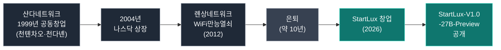
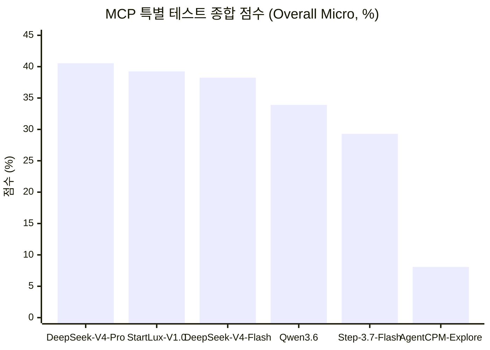
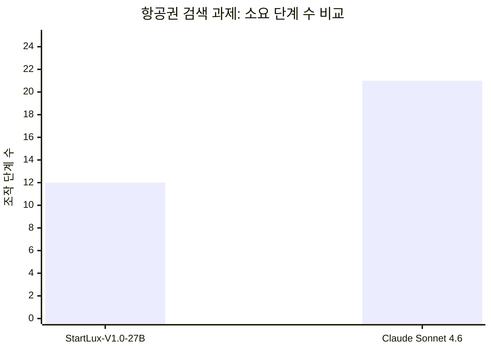
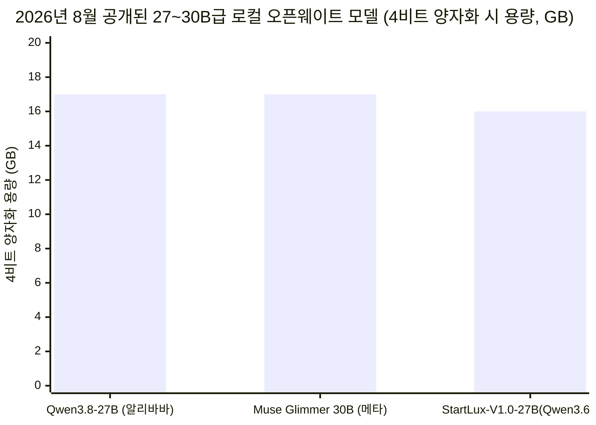
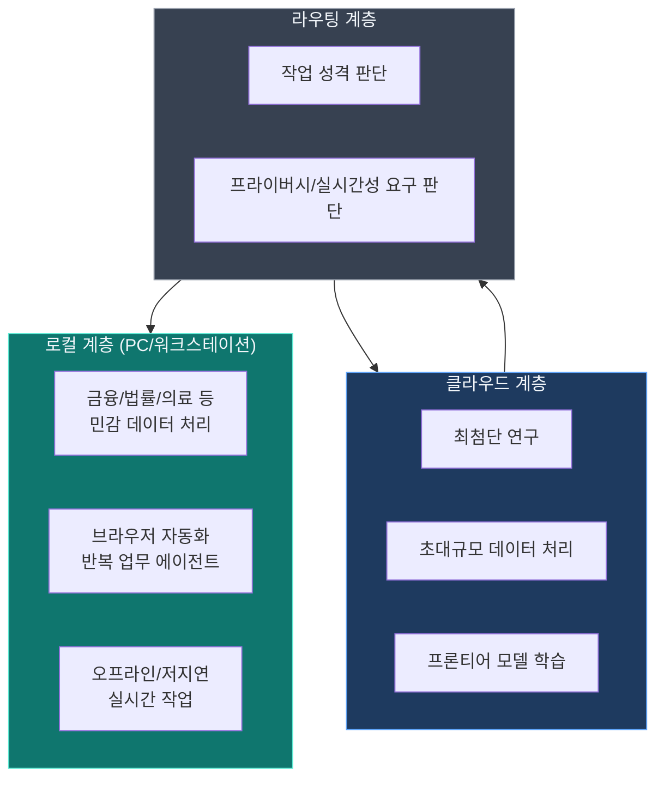
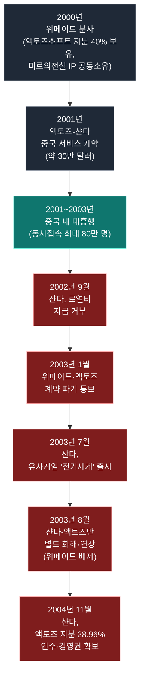

*천다녠과 스타트럭스, 그리고 클라우드에서 책상 위로 이동하는 에이전트 주권*

## 관련글

[**스케일링 법칙의 시대는 끝났다 – 딥시크를 뛰어 넘은 에이전트 특화 로컬 모델**](https://www.facebook.com/share/p/198C4gZZ7b/)

---

## 목차

1. 들어가며 — 무엇이 바뀌고 있는가
2. 사라졌던 프로그래머의 귀환 — 천다녠과 스타트럭스
3. 벤치마크가 말해주는 것 — StartLux-V1.0-27B-Preview 성적표
4. 왜 작은 모델이 큰 모델을 따라잡았나 — 사후훈련이라는 새로운 층
5. 숫자 너머의 실제 사례 — 금융 분석과 항공권 검색
6. 24GB라는 새로운 경계선 — 큐웬, 무즈 글리머, 그리고 로컬 모델 생태계
7. 클라우드는 사라지지 않는다 — 계층화되는 AI 인프라
8. 제너럴리스트에서 스페셜리스트로 — 시장이 실제로 원하는 것
9. 20여 년 전의 교훈 — 샨다, 액토즈소프트, 그리고 미르의전설2
10. 지금 다시 정의해야 할 소버린 AI
11. 마치며
12. 참고문헌
13. 자료 출처 및 신뢰도 표

---

## 1. 들어가며 — 무엇이 바뀌고 있는가

2023년부터 2025년까지 AI 업계를 지배한 문장이 하나 있었습니다. "파라미터를 더 쌓으면 더 똑똑해진다"는 스케일링 법칙(Scaling Law)입니다. 수천억, 나아가 수조 개의 파라미터를 쌓는 경쟁이 곧 AI 경쟁의 전부처럼 여겨졌습니다. 그런데 2026년 하반기 들어 이 흐름에 뚜렷한 균열이 생기고 있습니다. 계기는 기술적 회의론이 아니라 실물 경제와의 접촉입니다. AI 에이전트가 실제로 브라우저를 조작하고, 금융 데이터를 검증하고, 코드 저장소를 관리하는 실무에 투입되기 시작하면서, 정작 중요한 것은 모델의 크기가 아니라 그 모델이 실제 업무를 얼마나 신뢰할 수 있게, 그리고 얼마나 통제 가능한 방식으로 완수하느냐라는 사실이 드러난 것입니다.

이 흐름의 최전선에 선 것이 개인 PC나 로컬 워크스테이션에서 구동되는 '로컬 모델(Local Model)'입니다. 이 문서는 그 흐름을 상징적으로 보여준 사건 — 중국의 1세대 프로그래머 천다녠(陈大年)이 창업한 스타트럭스(StartLux)의 270억 파라미터 모델이 1조 6천억 파라미터급 모델에 근접한 성적을 낸 사건 — 을 중심에 놓고, 이를 둘러싼 기술적 배경과 산업적 함의, 그리고 한국이 참고할 만한 역사적 교훈까지 종합적으로 정리한 것입니다. 모든 수치와 사실관계는 2026년 9월 기준 공개된 복수의 자료를 통해 교차 확인했으며, 확인 방식과 신뢰도는 이 문서 맨 끝의 표에 정리해 두었습니다.

---

## 2. 사라졌던 프로그래머의 귀환 — 천다녠과 스타트럭스

2026년 8월 말, 중국 AI 업계에 다소 뜻밖의 소식이 전해졌습니다. 중국 인터넷 산업 초창기의 상징적 인물 중 한 명인 천다녠(Danny Chen, 陈大年)이 은퇴한 지 약 10년 만에 다시 창업 전선에 나선 것입니다. 그가 세운 회사는 상하이 소재의 위안뎬싱후이(원점성휘, 上海原点星辉科学技术有限公司), 영문명 스타트럭스(StartLux)입니다[1][2][8].

천다녠은 1978년 5월 저장성 사오싱시 신창현에서 태어났습니다. 1999년 12월, 형인 천톈차오(陈天桥)와 함께 상하이에서 샨다네트워크(盛大网络, Shanda Network)를 공동 창업했고, 회사 설립 시점부터 이사로 참여했습니다[8][9][15]. 이보다 앞선 1998년에는 중국 최초의 인터넷 접속 과금 소프트웨어로 꼽히는 'ENCounter'를 개발해 공유 소프트웨어 개념을 중국에 처음 들여온 인물로 평가받습니다[14]. 알리바바의 마윈, 텐센트의 마화텅과 거의 같은 시기에 창업 전선에 뛰어든 세대이며, 샨다는 한국 게임 《미르의전설2(전기)》 중국 서비스 대박을 발판 삼아 2004년 5월 13일 미국 나스닥에 상장했습니다[90][92]. 상장 당시 회사를 이끌던 형 천톈차오는 만 31세로 중국 최연소 최고 부호 반열에 올랐고[91], 1978년생인 천다녠 자신도 20대 중반의 나이로 부호 대열에 이름을 올렸습니다. 이후 그는 샨다에서 수석 부총재, CTO, COO 등을 두루 거치며 기술과 제품을 담당했습니다[9][15][13]. 이어 2008년에는 창업 인큐베이터인 '샨다창신위안(盛大创新院)'을 세웠고, 2012년에는 세계 최대 규모의 와이파이 공유 소프트웨어 'WiFi만능열쇠(WiFi万能钥匙)'로 유명한 롄상네트워크(连尚网络)를 창업해 9억 명이 넘는 사용자를 확보했습니다[1][5][14].

그렇게 업계 일선에서 물러나 있던 그가 다시 모습을 드러낸 자리는 2026년 8월, 샨다창신위안 18주년 기념 모임이었습니다. 그는 이 자리에서 "AI 시대의 여덟 가지 비합의(非共识, non-consensus)"라는 화두를 던졌고, 그중 네 가지가 로컬 모델에 관한 것이었습니다. 그는 로컬 모델이 3년 안에 클로드(Claude)와 대등한 수준에 이르러 클라우드 시장의 80%를 잠식할 것이며, 파라미터 경쟁 중심의 게임은 저물어 갈 것이라고 주장했습니다[1][2]. 다만 이는 어디까지나 천다녠 개인의 예측이자 발언이며, 검증 가능한 사실이 아니라는 점은 분명히 해둘 필요가 있습니다.

스타트럭스는 스스로를 "전 세계 최초로 로컬 모델을 주력으로 삼는 진정한 의미의 AI 회사"라고 소개합니다[2][5]. 홈페이지에 따르면 회사의 지향점은 "AI가 각자의 기기 위에서 실행되도록 하여 모델의 능력과 데이터, 통제권이 진정으로 사용자의 손에 남도록" 하는 것입니다[5]. 창업 구성원도 특징적입니다. CEO인 천다녠은 중국 시장과 사용자, 제품에 정통한 연쇄 창업가이고, 공동창업자이자 CTO인 궈취안웨이(郭权玮)는 대만 국립양밍자오퉁대학교에서 컴퓨터공학 박사학위를 받았으며 로컬 대형모델 배포, 에이전트형 AI, 프라이버시 보호 머신러닝을 연구해온 인물로, 이전에는 AI 사이언스 기업에서 수석 알고리즘 과학자로, 그리고 대만 공업기술연구원에서 데이터 프라이버시·비식별화 기술을 연구했습니다. 2024년 대만 AI학회(TAAI) 최우수 논문상을 받았고 프라이버시 관련 발명 특허의 제1발명자이기도 합니다. 여기에 전 모건스탠리 아시아 총괄 뤄융샹(罗永祥)이 공동창업자로 합류해 사업·투자 유치를 총괄하고 있습니다[2].

---

## 3. 벤치마크가 말해주는 것 — StartLux-V1.0-27B-Preview 성적표

스타트럭스가 시장에 처음으로 제시한 성적표는 중국정보통신연구원(CAICT, 中国信息通信研究院) 산하 인공지능연구소가 발표한 '신뢰 가능한 AI 대형모델 벤치마크(可信AI大模型基准测试)'의 MCP 특별 테스트 결과입니다[1][3][4][7]. 이 테스트는 실제 응용 시나리오를 기준으로 위치 내비게이션, 웹 검색, 브라우저 자동화, 금융 분석, 코드 저장소 관리, 3D 설계라는 여섯 개 과제 영역에, 여러 도구를 동시에 다루는 능력과 복잡한 과제 수행 및 실제 환경과의 상호작용 능력을 종합적으로 평가하는 항목을 더해 총 일곱 개 지표로 구성되며, 일부 지표와 데이터는 오픈소스 프로젝트 MCP-Universe를 참조했습니다[8][59]. 핵심은 모델이 얼마나 그럴듯한 답을 내놓는지가 아니라, 실제로 그 일을 해낼 수 있는지를 본다는 점입니다[1][59]. 테스트는 2026년 8월 3일부터 시작해 3회 반복 수행한 평균값으로 산출됐습니다.

결과는 예상 밖이었습니다. 27억이 아니라 270억(27B) 파라미터에 불과한 StartLux-V1.0-27B-Preview가 종합 점수(Overall Micro) 39.25%로 참가 모델 중 2위를 기록한 것입니다[1][8][59]. 1위는 1조 6천억(1.6T) 파라미터의 DeepSeek-V4-Pro로 40.55%였고, 그 차이는 단 1.3퍼센트포인트였습니다[1][3][59]. StartLux는 이 과정에서 2,840억 파라미터의 DeepSeek-V4-Flash-0731(38.24%), 1,980억 파라미터의 Step-3.7-Flash(29.29%)를 모두 앞질렀습니다[59]. 파라미터 규모로 보면 StartLux는 DeepSeek-V4-Pro보다 약 60배 작은 모델입니다[1][59]. 같은 27B급 모델인 큐웬3.6-27B(Qwen3.6-27B)와 비교하면 5.34퍼센트포인트 앞섰습니다[1][59].

세부 항목에서는 더 두드러진 결과가 나왔습니다. 위치 내비게이션, 금융 분석, 브라우저 자동화 세 개 항목에서 StartLux가 1위를 차지했는데, 그중 위치 내비게이션은 단독 1위였고, 금융 분석과 브라우저 자동화는 DeepSeek-V4-Pro와 공동 1위였습니다[59]. 다만 웹 검색 항목에서는 DeepSeek-V4-Flash가 56.36%로 가장 높았고 StartLux는 42.42%로 다소 밀렸으며, 코드 저장소 관리에서도 DeepSeek-V4-Flash(27.27%)가 StartLux(17.17%)를 앞섰습니다. 즉 모든 영역에서 압도한 것이 아니라, 위치 내비게이션·금융 분석·브라우저 자동화라는 특정 실무 영역에서 두드러진 강점을 보인 것이 이 결과의 정확한 그림입니다.

**"DeepSeek-V4-Pro(1.6T)", "StartLux-V1.0 (27B)", "DeepSeek-V4-Flash (284B)", "Qwen3.6 (27B)", "Step-3.7-Flash (198B)", "AgentCPM-Explore (4B)"**

여기서 강조해야 할 점은, "60배 작은 모델이 1.3퍼센트포인트 차이로 근접했다"는 표현이 곧 "StartLux가 DeepSeek-V4-Pro와 전 영역에서 대등하다"는 뜻은 아니라는 것입니다. 종합 점수가 근접했다는 것과, 특정 실무 과제(위치 내비게이션·금융 분석·브라우저 자동화)에서 최상위권에 든 것이 이 벤치마크가 실제로 보여주는 내용입니다. 그럼에도 이 결과가 놀라운 이유는 명확합니다. 클라우드에 의존하지 않고 소비자용 그래픽카드 한 장으로 구동되는 모델이, 데이터센터급 인프라가 필요한 1.6조 파라미터 모델의 성능 구간에 진입했다는 사실 자체이기 때문입니다.

---

## 4. 왜 작은 모델이 큰 모델을 따라잡았나 — 사후훈련이라는 새로운 층

이 결과의 배경을 이해하려면 StartLux-V1.0-27B-Preview가 어떻게 만들어졌는지를 봐야 합니다. 이 모델은 처음부터 새로 학습시킨(사전학습, Pre-training) 모델이 아닙니다. 알리바바가 공개한 오픈소스 모델 큐웬3.6-27B(Qwen3.6-27B)를 기반으로 사후훈련(Post-Training)만을 집중적으로 얹은 결과물입니다[1][4][59]. 다시 말해 "작은 모델이 큰 모델을 이겼다"는 표현보다는, "이미 존재하는 대형언어모델의 기반 위에 특정 능력을 깊게 파내려간 전략이 통했다"는 표현이 더 정확합니다.

이 사후훈련 과정에서 스타트럭스가 강화한 것은 최종적으로 내놓는 텍스트의 품질이 아니었습니다. 훈련 데이터는 과제를 정확히 이해하는 능력, 어떤 도구를 언제 선택할지 판단하는 능력, 도구를 호출할 때 필요한 파라미터를 정확히 구성하는 능력, 여러 단계를 거쳐 과제를 실행하는 능력, 중간중간 상태를 점검하는 능력, 그리고 결과를 검증하는 능력에 집중됐습니다[59]. 모델이 배워야 할 것은 "무엇을 답할 것인가"가 아니라 "언제 어떤 도구를 부를 것인가, 도구가 오류를 반환하면 어떻게 전략을 조정할 것인가, 어떤 조건에서 과제가 끝났다고 선언할 것인가"라는 판단 과정 자체였다는 것입니다.

이를 가능케 한 핵심 방법론이 '오토 리서치(Auto Research)'입니다. 이는 모델이 실제 도구 환경 속에서 스스로 과제를 반복 수행하고, 환경으로부터 받은 피드백을 바탕으로 전략을 지속적으로 조정하도록 하는 방식으로, 쉽게 말해 AI가 AI를 훈련시키는 방법론입니다[1][4][59]. 회사 측 설명에 따르면 StartLux-V1.0-27B-Preview는 이 방식으로 사후훈련을 완료한 중국 최초의 로컬 에이전트 모델입니다[1][4][5]. 파라미터를 단 하나도 늘리지 않고 이런 방식만으로 5퍼센트포인트가 넘는 점수 향상을 이끌어냈다는 사실은, 에이전트 능력의 상당 부분이 거대한 사전학습 단계가 아니라 그 위에 얹히는 사후훈련 층에 자리하고 있음을 시사합니다. 그리고 이 층은 처음부터 파운데이션 모델을 직접 만들 자본과 인프라를 가진 회사가 아니어도 접근할 수 있는 영역입니다.

이는 업계 전반에서 관찰되는 두 갈래의 기술적 분화와도 맞닿아 있습니다. 한쪽에서는 여전히 "파라미터를 더 쌓으면 기적이 일어난다"는 신념 아래 파라미터가 수백억에서 수천억, 나아가 조 단위로 계속 커지고 있고, 다른 한쪽에서는 하니스(Harness, 모델을 감싸는 실행 환경과 도구 체계) 중심의 에이전트 평가 체계가 빠르게 자리를 잡으며 "적은 것이 곧 많은 것(less is more)"이라는 주장이 힘을 얻고 있습니다. 천다녠은 이런 흐름을 두고 "스케일링 법칙은 지나가는 신선(過路神仙)이다. 그것 없이는 AI가 여기까지 발전하지 못했겠지만, 그것은 AI의 발전 경로를 스쳐 지나갔을 뿐 미래가 반드시 거기에 종속되는 것은 아니다"라고 표현했습니다[1][2].

---

## 5. 숫자 너머의 실제 사례 — 금융 분석과 항공권 검색

벤치마크 점수만으로는 실감하기 어려운 차이를 보여주기 위해 스타트럭스는 두 건의 구체적 시연을 공개했습니다. 비교 대상은 클로드 소네트 4.6(Claude Sonnet 4.6)이었습니다[59].

첫 번째는 2년간의 마이크로소프트 주식 투자 수익률을 계산하는 금융 분석 과제였습니다. 클로드 소네트 4.6은 원본 시세 데이터가 없는 상황에서 2025년 1월 8일을 증시가 열리지 않는 비거래일로 잘못 판단해 전날 종가를 대신 사용했고, 최종적으로 4만 7,254달러, 수익률 89.02%라는 답을 내놓았습니다[59]. 반면 StartLux는 과거 데이터를 되짚어 목표 날짜 전후의 시세 흐름을 재확인하는 과정을 거친 뒤 4만 7,499.09달러, 수익률 90.00%라는 결과를 산출했고, 이 결론은 실제로 정확했으며 전 과정이 검증·추적 가능했습니다[59]. 두 결과의 차이는 금액으로 보면 크지 않아 보일 수 있지만, 금융 업무에서는 이런 미세한 오차가 실제로는 큰 손실로 이어질 수 있다는 점에서 의미가 있는 사례입니다.

두 번째는 싱가포르(SIN)에서 베이징으로 가는 최저가 직항 항공권을 브라우저로 검색하는 과제였습니다. StartLux-V1.0-27B-Preview는 약 95초 만에 검색을 완료해 에어차이나의 299달러짜리 항공권을 찾아냈고, 이 과정에서 거친 조작 단계는 단 12단계였습니다[59]. 반면 클로드 소네트 4.6은 날짜 선택, 팝업 닫기, 필터 메뉴를 다루는 과정에서 더 많은 화면 확인 절차가 필요했고 한 차례는 시간 필터 패널을 실수로 건드리기도 했으며, 200초가 넘는 시간을 들여 21단계를 거친 끝에 556달러짜리 항공권을 최저가로 제시했습니다[59]. 검색 시간은 StartLux의 두 배가 넘었고 가격도 더 높았습니다.

이 두 사례는 파라미터 규모가 에이전트 과제 수행 능력을 결정하는 유일한 변수가 아니라는 점을 보여줍니다. 새로운 변수로 부상하고 있는 것이 바로 앞서 설명한 사후훈련 방식이며, 금융 분석 사례의 데이터 재검증 과정이나 브라우저 과제의 제약 인식·경로 선택 능력은 이 사후훈련이 만들어낸 직관적인 결과물이라 할 수 있습니다[59]. 다만 이는 스타트럭스가 자체 공개한 시연 사례이며, 특정 시점·특정 과제에 대한 일회성 비교라는 한계가 있다는 점, 그리고 비교 대상이 이 문서 작성 시점 기준 최신 모델인 Claude Sonnet 5가 아니라 Claude Sonnet 4.6이었다는 점은 감안해서 볼 필요가 있습니다.

---

## 6. 24GB라는 새로운 경계선 — 큐웬, 무즈 글리머, 그리고 로컬 모델 생태계

스타트럭스 혼자만의 움직임이 아닙니다. 2026년 8월, 비슷한 체급의 로컬 모델이 연이어 공개되며 하나의 흐름을 형성했습니다.

알리바바 큐웬(Qwen) 팀은 2026년 8월 14일(UTC 15시, 태평양시간 오전 8시), 270억 파라미터급 모델 큐웬3.8-27B(Qwen3.8-27B)를 아파치 2.0(Apache 2.0) 라이선스로 공개했습니다[10][11][20]. 정확한 파라미터 수는 277억 8천만 개이며, 텍스트뿐 아니라 이미지와 동영상까지 입력으로 받는 네이티브 멀티모달 능력을 갖췄고, 26만 2,144토큰이라는 대규모 컨텍스트 창을 네이티브로 지원합니다[20]. 이는 같은 시기 함께 발표된 2조 4천억 파라미터의 초대형 모델 큐웬3.8-맥스(Qwen3.8-Max)와 짝을 이루는 모델로, 대형 모델은 API로, 소형 모델은 직접 소유해 실행하는 두 갈래 전략의 산물입니다[18]. 4비트로 양자화(Quantization, 모델의 수치 정밀도를 낮춰 용량을 줄이는 기법)하면 용량이 약 17GB까지 줄어들어, 24GB급 소비자용 그래픽카드 한 장에 올릴 수 있습니다[16][22]. 공개와 동시에 LM 스튜디오, 올라마(Ollama), 언슬로스(Unsloth) 등 주요 로컬 실행 도구에서 원클릭 설치가 지원됐고, 공개 며칠 만에 허깅페이스(Hugging Face) 다운로드 수가 100만 건을 넘어섰습니다[10].

이런 효율을 가능케 한 것은 단순한 양자화만이 아니라 모델 구조 자체의 혁신입니다. 추측적 디코딩(Speculative Decoding)은 작은 초안 모델이 먼저 여러 토큰을 빠르게 생성하고, 본체 모델이 이를 한꺼번에 검증해 받아들이거나 고치는 방식으로 추론 속도를 끌어올리는 기법입니다. 여기에 더해 큐웬3.8-27B는 전체 64개 층 가운데 상당수를 선형 어텐션(Linear Attention, 정확히는 게이티드 델타넷 계열 구조)으로 대체해 KV 캐시(과거 토큰 정보를 저장해 두는 메모리 공간)를 생성하는 층 자체를 크게 줄였습니다. 이 방식은 큐웬 계열 최신 모델군에서 통상 전체 층의 약 4분의 3을 선형 어텐션으로, 나머지 4분의 1을 일반적인 전체 어텐션으로 배치하는 구조로 알려져 있어, 큐웬3.8-27B의 64개 층 가운데도 이와 유사한 비율(대략 48개 층 안팎)이 선형 어텐션 계열로 구성됐을 가능성이 높습니다. 다만 이 정확한 층 배분 수치는 큐웬3.8-27B 개별 모델에 대한 1차 자료로 확인한 것은 아니며, 같은 계열 모델군에서 공통적으로 확인된 설계 패턴에 근거한 추정임을 밝혀둡니다.

나흘 앞선 2026년 8월 10일에는 메타(Meta) 슈퍼인텔리전스랩(Meta Superintelligence Labs)이 무즈 글리머(Muse Glimmer)를 아파치 2.0 라이선스로 공개했습니다[14][25][32]. 2025년 6월 143억 달러 규모로 이뤄진 스케일 AI(Scale AI) 인수 이후 이 조직에서 나온 첫 오픈웨이트 모델입니다[25]. 정확한 파라미터 수는 약 296억 개의 밀집(Dense) 구조 언어모델에 18억 개 파라미터 규모의 비전 인코더(ViT-G/14 기반)를 결합한 형태이며, 더 큰 비공개 모델인 무즈 스파크(Muse Spark)로부터 지식 증류(Distillation) 방식으로 만들어졌습니다[32][27][30]. 컨텍스트 창은 13만 1,072토큰 이상을 지원합니다[32]. 4비트 양자화판인 이른바 'K-Quant-17GB' 버전은 실제로 약 17GB 용량까지 줄어들며, 24~32GB 메모리 구간의 소비자용 GPU나 애플 실리콘 맥에서 구동되도록 설계됐습니다[100][101][105]. 메타는 이 모델을 인터넷 연결 여부와 무관하게 항상 켜져 있는 로컬 에이전트, 함수 호출, 로컬 코딩, LLM을 평가자로 활용하는 용도에 맞춰 설계했다고 밝혔습니다[32][33].

세 모델이 우연히 27B에서 30B 사이의 체급에 모인 것이 아닙니다. 소비자용 그래픽카드 한 장의 메모리 용량이 이 산업의 설계 제약으로 작용하고 있기 때문입니다. 클라우드에서는 모델이 인프라 규모에 맞춰 계속 커질 수 있었지만, 로컬 환경에서는 반대로 인프라(대체로 24GB급 그래픽카드)가 모델이 가질 수 있는 상한선을 정합니다. 이 제약이 하나의 표준처럼 자리 잡으면서 그 위에 생태계가 형성되고 있는 것입니다. 다만 참고로, 이보다 앞서 2026년 4월에는 구글도 경량 오픈모델 젬마4(Gemma 4) 시리즈를 공개했는데, 그중 31B 밀집 모델 버전은 오픈소스 모델 리더보드 3위에 오르며 양자화 후 소비자용 그래픽카드에서 구동 가능한 로컬 모델로 이미 주목받은 바 있습니다[4].

---

## 7. 클라우드는 사라지지 않는다 — 계층화되는 AI 인프라

그렇다면 기존 빅테크의 클라우드 AI 사업은 어떻게 될까요. 결론부터 말하면 클라우드 시장 자체가 사라지는 것은 아닙니다. 다만 그 역할이 재편되고 있습니다. 시장조사업체 가트너(Gartner)는 2026년 전 세계 AI 관련 지출이 2조 5,200억 달러에 이르러 전년 대비 44% 증가할 것으로 전망했습니다[18]. (참고로 가트너는 이후 시점에 이 전망치를 2조 5,900억 달러, 47% 증가로 소폭 상향 수정하기도 했는데, 이는 시장 전망이 계속 갱신되고 있음을 보여주는 대목입니다.) 이처럼 클라우드·인프라 투자 자체는 여전히 거대한 규모로 이뤄지고 있지만, 그 성격이 조금씩 바뀌고 있다는 점에 주목할 필요가 있습니다.

마이크로소프트는 애저 로컬(Azure Local)의 '연결 끊김 운영(Disconnected Operations)' 기능을 통해 인터넷 연결이 완전히 끊긴 환경에서도 애저의 거버넌스와 정책 통제 아래 미션 크리티컬 인프라를 운영할 수 있도록 했고, 파운드리 로컬(Foundry Local)을 통해서는 대규모 AI 모델까지 연결이 끊긴 소버린 환경으로 가져올 수 있도록 지원 범위를 넓혔습니다[45][48]. 2026년 5월 개최된 마이크로소프트 빌드(Build) 컨퍼런스에서도 회사는 로컬 AI를 애저의 대체재가 아니라 보완재로 위치시키며, 워크로드에 따라 로컬에서 처리하거나 필요시 클라우드로 확장하는 하이브리드 AI 아키텍처를 핵심 메시지로 제시했습니다[46][47]. 이러한 흐름은 마이크로소프트에 국한되지 않으며, 구글 역시 경량 플래시(Flash) 계열 모델을 확대하는 등 빅테크들이 저마다의 방식으로 로컬·경량 AI를 자사 포트폴리오에 흡수하는 전략을 취하고 있습니다.

결국 미래는 '클라우드 대 로컬'이라는 이분법적 대결 구도가 아니라, 어떤 작업을 어디서 처리하느냐가 세밀하게 결정되는 계층화된 구조로 진화하고 있다고 보는 것이 정확합니다. 최첨단 연구와 초대규모 데이터 처리는 여전히 클라우드의 몫으로 남을 가능성이 큽니다. 그러나 데이터 프라이버시가 중요하거나 실시간 응답이 필요한 일상적 업무는 점차 로컬 환경으로 이동하는 추세가 뚜렷합니다.

---

## 8. 제너럴리스트에서 스페셜리스트로 — 시장이 실제로 원하는 것

AI 업계가 수조 개의 파라미터를 쌓는 제너럴리스트 경쟁에 몰두하는 동안, 실물 경제는 이미 다른 방향으로 움직이고 있었다는 해석이 이 사례로부터 나옵니다. 기업과 개인이 실제로 원하는 것은 모든 것을 어느 정도씩 아는 만능형 모델이 아니라, 자신의 특정 업무를 정확히 이해하고 실수 없이 완수하는 스페셜리스트 에이전트라는 것입니다. 앞서 5장에서 살펴본 두 건의 시연 — 데이터 재검증을 통해 정확한 시세를 산출한 금융 분석, 그리고 절반의 시간과 절반의 단계로 더 저렴한 항공권을 찾아낸 브라우저 자동화 — 은 바로 이 차이를 구체적으로 보여주는 사례입니다.

로컬 모델이 선택받는 이유는 정확도 하나에만 있지 않습니다. 모델의 판단 과정을 사용자가 직접 검증할 수 있는가, 실행에 대한 통제권이 사용자에게 있는가, 그리고 무엇보다 데이터가 사용자의 손을 떠나지 않는가 하는 점이 핵심적으로 작용합니다. 민감한 데이터를 외부로 전송하지 않으면서도 강력한 에이전트를 활용할 수 있는 길이 열렸다는 의미입니다. 특히 의료, 금융, 법률, 국방처럼 데이터 보안이 사업의 생명과 직결되는 분야에서는 로컬 에이전트가 하나의 선택지가 아니라 전제 조건에 가까워지고 있습니다. 제너럴리스트 모델은 여전히 폭넓은 지식을 갖추겠지만, 실전에서 승부를 가르는 것은 그 일을 얼마나 믿을 수 있는 방식으로 해내느냐에 달려 있다는 것이 이 사례가 시사하는 바입니다.

---

## 9. 20여 년 전의 교훈 — 샨다, 액토즈소프트, 그리고 미르의전설2

천다녠이 함께 창업했던 샨다(盛大)는 한때 세계 1위를 달리던 한국 온라인 게임 산업에 뼈아픈 상처를 남긴 회사이기도 합니다. 이 역사를 짚어보는 것은 단순한 옛이야기가 아니라, 시장의 흐름을 먼저 읽는 능력이 얼마나 결정적인 차이를 만드는지를 보여주는 사례이기 때문입니다.

이야기는 2000년으로 거슬러 올라갑니다. 액토즈소프트의 핵심 개발자였던 박관호(현 위메이드 의장)가 개발 중이던 《미르의전설2》를 들고 나와 위메이드를 창업했고, 이 분사 과정에서 액토즈소프트가 위메이드 지분 40%를 보유하는 대신 《미르의전설》 시리즈의 지적재산권은 두 회사가 공동으로 소유하기로 합의했습니다[63][70][82]. 2001년, 당시 재정난에 시달리던 샨다는 남은 자금을 모두 끌어모은 약 30만 달러(당시 원화 약 3억 원)를 들여 액토즈소프트로부터 《미르의전설2》의 중국 독점 서비스 계약을 따냈습니다[85]. 그해 9월 시작된 중국 서비스는 대성공을 거두며 동시접속자 수가 빠르게 늘어 2003년에는 80만 명에 달했고, 이 흥행 덕분에 파산 직전이던 샨다는 단숨에 중국 3위 게임사로 도약했습니다[73][85]. 즉 이 게임은 위메이드가 개발하고 액토즈소프트와 공동으로 지적재산권을 보유했으며, 샨다는 어디까지나 이를 중국에서 서비스하는 퍼블리셔였습니다.

그러나 2002년 9월, 샨다는 위메이드 측의 개발 지원이 충분치 않다는 이유로 로열티 지급을 거부했습니다[62][63][73]. 위메이드와 액토즈소프트는 즉각 반발하며 2003년 1월 계약 파기를 통보했지만, 샨다는 같은 해 7월 《미르의전설2》와 매우 흡사한 게임 《전기세계(전기세계, 熱血傳奇世界)》를 자체 출시했고, 위메이드의 동의 없이 기존 이용자 데이터베이스까지 이관했습니다[62][63]. 위메이드와 액토즈소프트는 공동 원고로 베이징인민법원에 소송을 제기했지만, 그 뒤인 2003년 8월 샨다는 액토즈소프트와 로열티 분쟁을 별도로 타결하며 중국 내 서비스 계약을 2년 연장했고, 위메이드는 이 과정에서 배제됐습니다[63][64]. 그리고 2004년 11월, 샨다는 액토즈소프트의 최대주주였던 이종현 창업자를 포함한 임원 7인의 지분 28.96%를 약 950억~961억 원 규모에 인수하며 경영권을 확보했습니다[77][78][79][80]. 업계는 이를 두고 '역인수', 혹은 '게임 종주국의 위상을 떨어뜨린 사건'이라고 표현합니다[80]. 흥미로운 점은, 이 액토즈소프트 인수 자금 자체가 《미르의전설2》 중국 서비스로 벌어들인 수익에서 나왔다는 사실입니다[80].

이 대목에서 두 가지는 분명히 짚어둘 필요가 있습니다. 첫째, 당시 중국 대리권 확보 협상과 액토즈소프트 인수를 실질적으로 주도한 인물은 회장 겸 CEO였던 형 천톈차오였고, 천다녠은 이사 겸 부총재(이후 COO)로서 주로 기술과 제품을 담당하는 위치에 있었습니다. 자본과 전략을 주로 다룬 것은 천톈차오였고, 천다녠과 또 다른 공동창업자 탄췬자오(谭群钊)는 상대적으로 제품과 기술에 집중했다는 점이 여러 자료에서 공통적으로 확인됩니다[96]. 둘째, 이후 한국에서 '국부 유출' 논란을 낳은 일들 — 예컨대 최대주주 지위를 이용한 웃돈 매각과 헐값 재매입, 보유 현금의 홍콩 이전, 《미르의전설》 사업부문의 물적분할 등 — 은 2017년 이후 셩취게임즈(옛 샨다게임즈)의 행보이며, 천씨 형제가 2014~2015년경 샨다게임즈 지분을 매각하고 경영에서 물러난 뒤에 벌어진 일들입니다[22][23].

그럼에도 이 사건이 지금 다시 주는 교훈은 여전히 유효합니다. 샨다가 보여준 것은 압도적인 기술력이 아니라, 시장의 흐름을 남들보다 먼저 읽고 과감하게 베팅하는 감각이었습니다. 한국은 그 속도를 따라가지 못한 대가를 이후 오랜 기간 치러야 했습니다. 그리고 공교롭게도 지금, 같은 인물이 '로컬 모델'이라는 다음 시장의 방향을 다시 한번 먼저 읽고 있는 셈입니다.

---

## 10. 지금 다시 정의해야 할 소버린 AI

전통 산업과 달리 AI 산업은 한 달의 변화가 예전의 1년치 변화에 맞먹는 속도로 움직이고 있습니다. 이를 뒷받침해야 할 산업 분석과 정책 지원 역시 그만큼 자주, 그리고 신속하게 갱신될 필요가 있습니다. 미국과 중국은 이미 '포스트 스케일링 법칙'의 시대로 넘어가는 중입니다. 수조 개의 파라미터를 쌓는 경쟁이 여전히 의미를 갖는 것은 사실이지만, 270억 파라미터로 1조 6천억 파라미터급 모델에 근접한 StartLux, 소비자용 PC에서 구동되는 큐웬3.8-27B, 단일 그래픽카드 위에서 움직이는 무즈 글리머는 모두 같은 방향, 즉 로컬 실행 가능성이라는 방향을 가리키고 있습니다.

클라우드는 여전히 거대한 두뇌로 남을 가능성이 큽니다. 그러나 실제로 업무를 처리하고, 판단을 내리고, 데이터를 지키는 에이전트의 상당 부분은 점차 책상 위의 개인용 컴퓨터에서 실행되는 쪽으로 이동하고 있습니다. 이는 단순한 기술적 전환에 그치지 않고, AI에 대한 통제권이 소수 빅테크의 데이터센터로부터 개인과 기업의 책상 위로 옮겨가는, 이른바 '에이전트 주권(Agent Sovereignty)'의 이동이라 부를 만한 변화라는 해석이 가능합니다.

이러한 흐름 위에서, 한국의 소버린 AI 개념 역시 재정의가 필요하다는 문제의식이 제기됩니다. 국내에서 모델을 직접 개발한다는 좁은 의미를 넘어, 데이터 주권과 기술 자립, 산업 통제력을 함께 포괄하는 개념으로 확장할 필요가 있다는 것입니다. 데이터 주권 측면에서는 의료, 금융, 국방 등 민감한 데이터가 국경을 넘지 않고 국내 인프라 안에서 처리되도록 하는 것이 출발점이며, 이는 클라우드 의존도를 낮추고 로컬 AI 인프라를 구축하는 작업과 직결됩니다. 기술 자립 측면에서는 중국의 큐웬과 미국의 메타가 오픈소스 생태계를 선점하기 전에, 한국형 로컬 모델과 에이전트 기술에 대한 국가 차원의 투자와 연구개발이 필요하다는 지적이 나옵니다. 그리고 무엇보다 산업 통제력 측면에서는 에이전트가 국방, 정무, 금융, 법률 영역에 안전하게 적용될 수 있도록, 산업계와 정부가 함께 참조할 만한 레퍼런스 모델과 데이터 표준을 만들어가는 작업이 중요하다는 견해가 제시됩니다.

한국은 온디바이스 하드웨어, 특히 메모리와 NPU(신경망 처리 장치) 분야에서 이미 강점을 갖고 있습니다. 그러나 StartLux 사례가 실제로 입증한 층은 하드웨어가 아니라 사후훈련이라는 소프트웨어 층입니다. 하드웨어 강국으로만 남아서는 '세계의 공장' 이상을 꿈꾸기 어렵다는 것이 이 사례가 주는 시사점입니다. 다만 이 절의 내용은 검증 가능한 사실관계라기보다는 이 문서가 종합한 정책적 해석과 제언에 해당하며, 이는 이 글을 정리한 필자의 관점이라는 점을 밝혀둡니다.

---

## 11. 마치며

이 문서에서 살펴본 흐름을 요약하면 이렇습니다. 2026년 8월, 중국 1세대 프로그래머 천다녠이 세운 스타트럭스의 270억 파라미터 모델이 권위 있는 국가 기관의 벤치마크에서 1조 6천억 파라미터 모델에 1.3퍼센트포인트 차이로 근접했습니다. 그 비결은 파라미터 확장이 아니라 '오토 리서치'라는 사후훈련 방법론이었고, 이는 금융 분석과 브라우저 자동화라는 구체적 실무에서 검증됐습니다. 같은 시기 알리바바의 큐웬3.8-27B와 메타의 무즈 글리머가 비슷한 체급으로 잇달아 공개되며, 24GB급 소비자용 그래픽카드가 로컬 AI 생태계의 새로운 표준 경계선으로 자리 잡았습니다. 이는 클라우드 시대의 종언이 아니라, 클라우드와 로컬이 각자의 역할을 나눠 맡는 계층화된 구조로의 재편을 의미합니다. 그리고 20여 년 전 샨다가 한국 게임 산업에서 보여준 것처럼, 이런 전환기에는 기술력보다 흐름을 먼저 읽는 감각이 더 결정적인 차이를 만들어낼 수 있다는 것이 이 사례들이 공통적으로 시사하는 바입니다.

---

## 12. 참고문헌

[1] 陈大年复出，入局大模型, 量子位(qbitai), 2026.9.1, https://www.qbitai.com/2026/09/483600.html

[2] Chen Danian returns, enters large model race, China on China, 2026.9, https://chinaonchina.com/article/chen-dawei-returns-enters-the-large-model-sector

[3] 科创AIETF鹏华、科创创业人工智能ETF鹏华 관련 기사, 界面新闻, 2026.8.31, https://www.jiemian.com/article/15034206.html

[4] Frontline Exclusive: Local Large Model StartLux-27B Earns Top-Tier MCP-Universe Evaluation Results, 36氪(영문판), https://eu.36kr.com/en/p/3963345222147335

[5] StartLux 공식 홈페이지, https://www.startlux.com/

[6] StartLux's 27B Local Model Beats DeepSeek V4 Flash in China AI Benchmark, Pandaily, https://pandaily.com/startlux-27b-local-model-beats-deepseek-v4-flash-aug2026

[7] StartLux-27B ranks second in MCP benchmark, BYDFi, https://www.bydfi.com/en/crypto-news/startlux-27b-ranks-second-in-mcp-benchmark-105696

[8] 陈大年(기업가) 위키백과(중문), https://zh.wikipedia.org/zh-hans/陈大年_(企业家)

[9] 인물: 롄상네트워크(WiFi万能钥匙) 창업자·CEO 천다녠, 驱动中国, https://m.qudong.com/pcarticle/209131

[10] Qwen3.8-27B on Runpod: Agentic Coding on a 24GB Worker, Runpod 블로그, https://www.runpod.io/blog/qwen3-8-27b-on-runpod-the-theory-behind-frontier-class-agentic-coding-that-fits-on-a-single-24gb-worker

[11] Qwen 3.8 27B: Specs, Hardware Requirements, and How to Run It, Yotta Labs, https://www.yottalabs.ai/post/qwen-3-8-27b-specs-hardware-requirements-how-to-run-2026

[12] Qwen3.8-27B: Specs, Benchmarks & Verdict, Kingy.ai, https://kingy.ai/blog/qwen3-8-27b-specs-benchmarks-local-hardware/

[13] Qwen, 위키백과(영문), https://en.wikipedia.org/wiki/Qwen

[14] Meta Publishes Muse Glimmer As 30B Open Agentic Model, Phoronix, https://www.phoronix.com/news/Meta-Muse-Glimmer

[15] Meta's Muse Glimmer 30B Signals a Shift Toward Local Agent Dominance, Yahoo Tech, https://tech.yahoo.com/ai/meta-ai/articles/meta-muse-glimmer-30b-signals-150136671.html

[16] Meta AI Releases Muse Glimmer, MarkTechPost, https://www.marktechpost.com/2026/08/10/meta-ai-releases-muse-glimmer/

[17] Muse Glimmer: Meta's 30B Open Model Runs on 24GB VRAM, explainx.ai, https://www.explainx.ai/blog/meta-muse-glimmer-open-weight-30b-agentic-model-2026

[18] Gartner Says Worldwide AI Spending Will Total $2.5 Trillion in 2026, Gartner, https://www.gartner.com/en/newsroom/press-releases/2026-1-15-gartner-says-worldwide-ai-spending-will-total-2-point-5-trillion-dollars-in-2026

[19] 마이크로소프트 소버린 클라우드 관련 발표, Microsoft News Source Asia, https://news.microsoft.com/source/asia/features/microsoft-sovereign-cloud-adds-governance-productivity-and-support-for-large-ai-models-securely-running-even-when-completely-disconnected/?lang=ko

[20] '미르의 전설2' 중국 저작권 분쟁 대법원 판결, 경향신문, 2024.6.6, https://www.khan.co.kr/article/202406061136001

[21] 위메이드-액토즈 20년간의 분쟁사, 딜사이트, 2019.12.23, https://news.bizwatch.co.kr/article/mobile/2019/12/23/0014

[22] [셩취 국부유출 논란] 벼랑 끝에서 만난 '미르2'로 기사회생, 딜사이트, https://dealsite.co.kr/articles/65955

[23] [셩취 국부유출 논란] 액토즈만 웃지 못한 M&A, 딜사이트, https://dealsite.co.kr/articles/65906

[24] 액토즈소프트, 위키백과, https://ko.wikipedia.org/wiki/액토즈소프트

[25] 액토즈는 어땠나…중국 넘어간 위메이드, 고용 안정은?, MTN뉴스, 2026.7, https://news.mtn.co.kr/news-detail/2026070706173034539

[26] 미르의 전설 2, 위키백과, https://ko.wikipedia.org/wiki/미르의_전설_2

[27] Muse-Glimmer-30B, Hugging Face 모델 카드, https://huggingface.co/meta-models/Muse-Glimmer-30B

[28] Meta Muse Glimmer 30B on Consumer Hardware, runaihome.com, https://runaihome.com/blog/muse-glimmer-30b-local-ai-hardware-guide-2026/

[29] Muse Glimmer 30B Hardware Requirements and Benchmark Results, Hardware Corner, https://www.hardware-corner.net/hardware-for-muse-glimmer-30b-llm/

[30] 미르의전설 IP 분쟁 어떻게 봐야할까?, 인벤, 2017.8.25, https://www.inven.co.kr/webzine/news/?news=183024&site=genesis4

[31] [이슈분석] 중국서 벌어질 '미르2' 조 단위 원조 전쟁, 승자는?, 전자신문, 2017.9.10, https://www.etnews.com/20170908000180?m=1

[32] 위메이드-액토즈...20년간의 분쟁사 돌아보니, 전자신문, 2021.4.12, https://www.etnews.com/20210412000152

[33] 1조 이상의 가치, '미르의 전설 2' 15년 갈등을 짚어보자, 게임메카, 2017.7.10, https://www.gamemeca.com/view.php?gid=1364750

---

## 13. 자료 출처 및 신뢰도 표

이 문서에 담긴 정보는 신뢰도에 따라 아래와 같이 구분됩니다.

| 구분 | 해당 내용 | 비고 |
|---|---|---|
| **복수 출처로 확인된 사실** | StartLux-V1.0-27B-Preview의 CAICT MCP 벤치마크 종합 2위(39.25%), DeepSeek-V4-Pro와 1.3%p 차이, 큐웬3.6-27B 대비 5.34%p 우위, 위치 내비게이션·금융 분석·브라우저 자동화 1위권 성적, 큐웬3.6-27B 기반 사후훈련 및 '오토 리서치' 방법론, 천다녠의 이력(샨다·롄상네트워크 창업), 스타트럭스 공동창업자(궈취안웨이·뤄융샹) 이력, 큐웬3.8-27B 및 무즈 글리머의 공개일·라이선스·파라미터 수·컨텍스트 길이·양자화 용량, 샨다-액토즈소프트-위메이드 간 1999~2004년 분쟁 경과(계약금·로열티 거부·전기세계 출시·지분 인수 시점과 비율), 가트너의 2026년 AI 지출 전망, 마이크로소프트 애저 로컬의 오프라인 대형모델 지원 | 2개 이상의 독립된 출처(정부·업계 보도자료, 공식 모델 카드, 전문 매체 등)에서 일치하는 수치·사실관계 |
| **단일 출처 기반이나 신뢰도 높은 사실** | 금융 분석·항공권 검색 시연의 구체적 수치(4만 7,254달러 vs 4만 7,499.09달러, 299달러 vs 556달러, 95초 vs 200초+, 12단계 vs 21단계) | 이 시연을 상세히 보도한 매체는 확인된 범위에서 1곳(China on China, 원출처는 양자위 영상 링크 포함 보도)이며, 스타트럭스 측이 직접 공개한 비교 시연이라는 성격상 회사에 유리하게 구성됐을 가능성을 감안해서 볼 필요가 있음 |
| **가족적 유사성에 근거한 추정** | 큐웬3.8-27B의 64개 층 중 선형 어텐션 층 비율(약 48개 층 추정) | 큐웬3.8-27B 개별 모델에 대한 1차 자료로 층 배분 수치를 직접 확인하지 못했으며, 같은 계열 모델군(큐웬3.5/3-Next 등)에서 공통 확인된 3:1 비율 설계 패턴에 근거해 추정한 것임을 명시함 |
| **개인의 발언·예측(사실이 아님)** | 천다녠의 "로컬 모델이 3년 내 클로드와 대등해지고 시장의 80%를 점유할 것"이라는 전망, "AI 시대의 여덟 가지 비합의" 중 로컬 모델 관련 주장 | 천다녠 개인의 공개 발언이며 검증 가능한 사실이 아니라 예측·주장에 해당함 |
| **원문 필자(작성 요청자)의 해석·정책 제언** | "소버린 AI를 데이터 주권·기술 자립·산업 통제력으로 재정의해야 한다"는 제언, "한국이 게임 산업의 주도권을 다시 빼앗길 수 있다"는 경고, 스타트럭스 사례로부터 도출한 시장 전망 전반 | 사실관계가 아니라 이 자료를 정리한 필자의 관점과 주장이며, 별개의 타당한 반론이나 다른 해석도 존재할 수 있음 |
| **정정한 부분** | 무즈 글리머의 컨텍스트 길이를 원자료의 "12만 토큰 이상"에서 검증된 "13만 1,072토큰 이상"으로 수정함 | 원자료의 반올림 표현을 공식 모델 카드 수치로 교정 |

---

*이 문서는 2026년 9월 4일 기준으로 확인 가능한 공개 자료를 바탕으로 작성됐습니다. AI 산업, 특히 로컬 모델 관련 사안은 변화 속도가 매우 빠르므로, 실제 의사결정이나 교육 자료로 활용할 경우 최신 정보를 다시 한번 확인하시기를 권합니다.*
