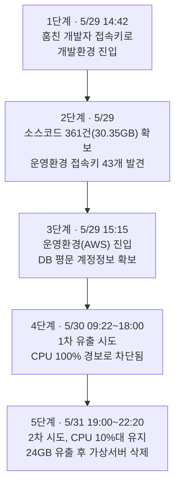
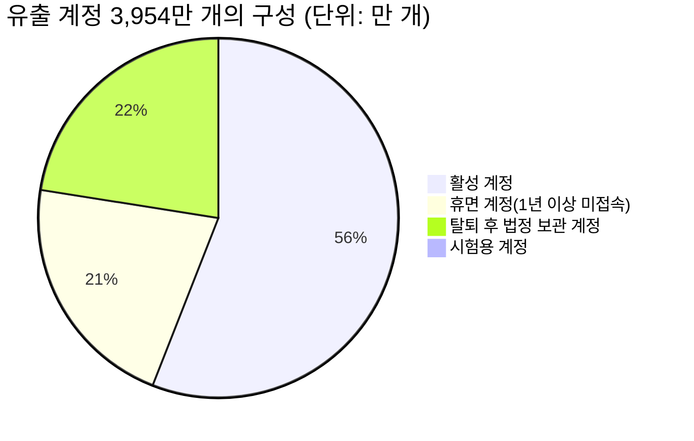

*작성 기준일: 2026년 9월 4일 · 원 자료: 솔루션뉴스 심층분석 기사 및 과학기술정보통신부 민관합동조사단 조사 결과(2026.9.3 발표)*

## 관련글

[**티빙 해킹 개발자 접속키 탈취→소스코드 속 '만능 열쇠' 43개 확보 (심층분석)**](https://www.solnews.co.kr/news/articleView.html?idxno=84748)

---

## 목차

1. 이 글을 시작하며
2. 사건 한눈에 보기
3. 핵심 질문에 대한 답: AWS 접속키가 맞는가, 왜 이렇게까지 위험한가
4. 먼저 알아야 할 용어: 개발환경, 운영환경, 접속키, 하드코딩
5. 사흘간의 침입 경로 — 다섯 단계로 재구성한 해킹 시나리오
6. 얼마나, 무엇이 새어나갔나
7. 왜 막지 못했나 — 기술이 아니라 사람과 체계의 문제
8. 첫 열쇠는 어떻게 도둑맞았나 — 끝내 밝혀지지 않은 시작점
9. 신고는 왜 늦었고, 법은 어떻게 바뀌는가
10. 티빙의 사과와 보상, 그리고 앞으로의 투자 계획
11. 다른 기업이 새겨야 할 다섯 가지 교훈
12. 이용자가 지금 해야 할 일
13. 출처 및 사실 확인표

---

## 1. 이 글을 시작하며

2026년 9월 3일, 과학기술정보통신부 민관합동조사단은 국내 온라인동영상서비스(OTT) 티빙(TVING)에서 일어난 개인정보 유출 사고의 조사 결과를 발표했다. 사고 자체는 지난 5월 말에 이미 알려졌지만, 이번 발표는 그동안 베일에 가려 있던 침입 경로를 시간 단위로 복원해 보여줬다는 점에서 의미가 크다. 해커가 어떤 문을 어떻게 열고 들어갔는지, 그 과정에서 티빙이 몇 번이나 막을 기회를 놓쳤는지가 구체적인 숫자와 시각으로 드러났다.

이 문서는 솔루션뉴스가 조사단 발표를 바탕으로 작성한 심층분석 기사를 원 자료로 삼고, 사고 초기 보도(6월)와 국회를 통해 공개된 자료 등 여러 매체의 교차 보도를 함께 확인해 정리한 것이다. 특히 이용자께서 직접 물으신 "AWS 접속키가 맞는가, 보안에 취약한가"라는 질문에 대해서는 별도 장을 두어 상세히 답한다.

---

## 2. 사건 한눈에 보기

사고는 2026년 5월 29일부터 31일까지 사흘에 걸쳐 진행됐다. 해커는 티빙 개발자 한 사람의 개발환경 접속키 하나만으로 개발 시스템에 침투했고, 그 안에서 찾아낸 또 다른 열쇠로 실제 서비스가 돌아가는 운영 시스템까지 들어갔다. 최종적으로 이용자 계정 3,954만 개의 정보가 유출됐다.

발단은 역설적으로 해킹 탐지 시스템이 아니라 서버 과부하였다. 5월 30일 저녁 데이터베이스 서버의 CPU 사용률이 100%까지 치솟으면서 경보가 울렸고, 이를 계기로 티빙은 비인가 접근 사실을 알아챘다. 6월 1일 한국인터넷진흥원(KISA)에 신고가 접수됐고, 다음 날 과기정통부가 현장조사에 들어가 6월 3일 민관합동조사단이 꾸려졌다. 그로부터 석 달가량 지난 9월 3일, 조사단은 포렌식 분석과 접속기록 대조를 거쳐 최종 결과를 내놓았다.

조사단이 짚은 핵심은 하나의 기술적 실수가 아니라 여러 단계에 걸쳐 반복된 관리 부실이었다. 접속키가 소스코드 안에 그대로 적혀 있었고, 개발자 한 명에게 필요 이상의 권한이 주어져 있었으며, 이상 징후를 감지하고도 최고책임자에게 보고되기까지 14시간이 걸렸다. 2024년 모의해킹에서 이미 지적됐던 취약점은 손대지 않은 채 방치돼 있었다.

---

## 3. 핵심 질문에 대한 답: AWS 접속키가 맞는가, 왜 이렇게까지 위험한가

결론부터 말하면, 맞다. 이번 사고에서 해커가 확보한 '운영환경 접속키'는 아마존웹서비스(AWS) 클라우드에 접근하기 위한 접속키다. 과기정통부 조사단이 9월 3일 발표에서 밝힌 내용에 따르면 티빙의 운영환경은 클라우드 서비스인 AWS에서 서버를 빌려 쓰는 공간이라고 명시돼 있다. 이는 사고 초기인 6월, 국회 과학기술정보방송통신위원회 소속 의원실을 통해 공개된 KISA 침해사고 신고서 내용과도 일치한다. 당시 이미 보안 전문가들은 개발 플랫폼(깃허브)에 노출된 자격증명과 아마존웹서비스의 핵심 액세스 키 관리 부실이 사고의 주요 원인으로 추정된다고 분석한 바 있다. 즉 초기 보도와 이번 최종 조사 결과가 같은 방향을 가리키고 있는 셈이다.

그렇다면 AWS 접속키(Access Key)가 왜 그렇게 위험한 물건인지 짚어볼 필요가 있다. AWS 접속키는 클라우드 위에 떠 있는 서버, 데이터 저장소, 데이터베이스 등 거의 모든 자원에 명령을 내릴 수 있는 인증 수단이다. 비유하자면 아이디와 비밀번호를 한 쌍으로 묶어 프로그램이 사람 대신 자동으로 로그인할 수 있게 만든 열쇠에 가깝다. 문제는 이 열쇠가 부여받은 권한(IAM 권한)의 범위에 따라 서버 생성과 삭제, 대용량 데이터 조회, 저장소 접근까지 폭넓게 할 수 있다는 점이다. 이번 사고에서 실제로 악용된 두 개의 키도 각각 대용량 데이터 가공·클라우드 저장소 접근 권한과 가상서버 생성 권한을 갖고 있었다.

이 열쇠가 위험해지는 결정적인 이유는 보관 방식에 있다. 정상적인 보안 관행이라면 접속키는 별도의 비밀 관리 도구(시크릿 매니저)에 암호화해서 보관하고, 코드에는 그 금고를 열어 값을 불러오는 절차만 남겨야 한다. 그런데 티빙의 361개 개발 프로젝트를 뒤진 결과 무려 43개의 운영환경 접속키가 발견됐고, 이 중 41개는 소스코드 안에 문자 그대로 적혀 있는 하드코딩 상태였으며 나머지 3개는 프로그램 설정 파일에 암호화 없이 평문으로 저장돼 있었다. 게다가 개발자 8명의 업무용 단말기에서도 개발환경 접속키 37개와 운영환경 접속키 52개가 암호화 없이 저장돼 있던 사실이 포렌식 과정에서 추가로 확인됐다.

이렇게 되면 접속키 하나를 훔치는 것과 소스코드 저장소 하나를 통째로 훔치는 것이 사실상 같은 결과를 낳는다. 코드를 열어보기만 하면 그 안에 다른 모든 문의 열쇠가 나열돼 있는 셈이기 때문이다. 더구나 티빙은 개발자 전원에게 361개 프로젝트 전체에 대한 접근 권한을 부여하고 있었다. 업무에 필요한 범위만 열어주는 최소 권한 원칙이 지켜지지 않아, 개발자 한 명의 계정만 뚫려도 사실상 회사 전체 코드베이스와 그 안에 박힌 모든 운영 접속키에 접근할 수 있는 구조였다. 열쇠 하나가 곧 만능 열쇠였던 셈이다.

정리하면, AWS 접속키 자체가 원천적으로 취약한 기술은 아니다. 문제는 그 강력한 권한을 가진 열쇠를 암호화하지 않은 채 소스코드 안에 방치하고, 접근 권한을 지나치게 넓게 부여하며, 2024년 모의해킹에서 같은 문제가 지적됐음에도 고치지 않은 관리 방식에 있었다.

---

## 4. 먼저 알아야 할 용어: 개발환경, 운영환경, 접속키, 하드코딩

이번 사고를 이해하려면 몇 가지 용어를 먼저 정리해 두는 것이 좋다.

**개발환경**은 개발자들이 소스코드를 저장하고 함께 수정하는 협업 공간이다. 건물에 비유하면 아직 완성되지 않은 설계도가 쌓여 있는 도면실에 해당한다. 이 공간에 들어가려면 개발자마다 발급된 접속키가 필요하다.

**운영환경**은 실제로 이용자가 쓰는 서비스가 돌아가는 공간이다. 티빙의 경우 이 공간은 아마존웹서비스(AWS)라는 클라우드 서비스에서 서버를 빌려 구축돼 있었다. 도면실이 아니라 사람들이 실제로 드나드는 완공된 건물에 해당한다.

**접속키(Access Key)** 는 사람이나 프로그램이 특정 시스템에 들어가거나 명령을 내릴 수 있도록 인증해 주는 디지털 열쇠다. 아이디·비밀번호와 비슷하지만, 주로 사람이 아닌 프로그램이나 자동화된 작업이 서버에 접근할 때 쓰인다.

**하드코딩(hard-coding)** 은 이런 접속키나 비밀번호 같은 민감한 값을 별도의 안전한 장소에 두지 않고 프로그램 소스코드 안에 문자 그대로 적어 넣는 관행을 말한다. 개발 편의를 위해 흔히 저지르는 실수지만, 소스코드가 유출되는 순간 그 안의 열쇠도 함께 넘어간다는 점에서 심각한 보안 취약점으로 꼽힌다. 조사단은 이번 사고를 두고 "집 열쇠를 현관 앞 화분 밑에 두고 다니다가 화분째 도둑맞은 격"이라고 표현했다.

---

## 5. 사흘간의 침입 경로 — 다섯 단계로 재구성한 해킹 시나리오

조사단은 개발자 단말기 9대(노트북 8대, PC 1대)를 포렌식 분석하고 보안장비·데이터베이스·시스템 접속기록을 맞춰 보며 해커의 이동 경로를 다섯 단계로 복원했다.

**1단계 (5월 29일 오후 2시 42분)**: 해커는 티빙 개발자 한 명의 개발환경 접속키를 들고 개발환경에 진입했다. 이 접속키를 언제, 어떻게 훔쳤는지는 조사단도 끝내 밝혀내지 못했다(8장에서 자세히 다룬다). 진입한 해커는 접근 가능한 개발 프로젝트 361건 전부를 가져갔다. 총 용량은 30.35기가바이트였고, 처음에는 14건만 빼냈다가 이후 2차 공격에서 전부를 훑었다. 이 프로젝트들에는 이용자 맞춤 콘텐츠 추천 알고리즘, 검색 알고리즘, 회원 관리·인증 체계, 결제 관리, 유료 서비스 운영 로직 등 티빙 서비스의 핵심 기술이 담겨 있었다.

**2단계**: 소스코드를 뒤지던 해커는 361개 프로젝트 안에서 운영환경 접속키 43개를 발견했다. 41개는 소스코드에 하드코딩돼 있었고, 3개는 설정 파일에 평문으로 저장돼 있었다. 이는 3장에서 설명한 대로 사실상 만능 열쇠 뭉치를 통째로 손에 넣은 것과 같았다.

**3단계 (5월 29일 오후 3시 15분)**: 개발환경에 들어온 지 불과 33분 만에 해커는 운영환경, 즉 AWS 클라우드 위에서 실제로 서비스가 돌아가는 공간에 발을 들였다. 확보한 43개 키의 권한을 하나씩 살피며 정보를 빼낼 통로를 찾았고, 이 가운데 대용량 데이터 가공·클라우드 저장소 접근 권한을 가진 키 1개와 가상서버 생성 권한을 가진 키 1개, 총 2개가 실제 공격에 쓰였다. 두 키 모두 개발자 노트북에도 저장돼 있었다. 이 과정에서 해커는 이용자 정보가 담긴 데이터베이스에 접속하는 아이디와 비밀번호가 암호화 없이 평문으로 저장돼 있는 것을 발견했다.

**4단계 (5월 30일 오전 9시 22분~오후 6시)**: 해커는 클라우드 저장소에 정보 유출용 공격 도구(자체 제작 스크립트 20종)를 심고 대량의 이용자 정보를 조회하기 시작했다. 그러나 대량 조회로 DB 서버 작업량이 폭증하면서 오후 6시 CPU 사용률이 100%까지 치솟았고, 경보가 울려 티빙이 해당 작업을 차단했다. 1차 시도는 여기서 저지됐다. 다만 조사단에 따르면 당시 티빙은 이 경보를 해킹 시도로 인식하지 못했다. CPU 부하 같은 단순 지표만 감시했을 뿐, 네트워크·데이터 흐름을 실시간으로 살펴 비정상 행위를 잡아내는 체계나 다중인증(MFA) 같은 접근 통제가 없었기 때문이다.

**5단계 (5월 31일 저녁 7시~10시 20분)**: 해커는 물러나지 않고 방법을 바꿔 돌아왔다. 앞서 확보해 둔 가상서버 생성 키를 이용해 운영환경 안에 자신만의 가상서버를 세우고, 이용자 정보 24기가바이트를 그 서버로 옮긴 뒤 외부 해외 서버로 전송했다. 작업이 끝나자 가상서버를 삭제해 흔적을 지웠다. 이번에는 CPU 사용률을 10% 안쪽으로 유지하며 천천히 정보를 빼냈고, 그 결과 경보가 울리지 않았다. 전날 경보에 걸렸던 경험을 학습해 방어 체계의 감지 기준 아래로 파고든 것으로 조사단은 판단했다.

---

## 6. 얼마나, 무엇이 새어나갔나

최종 유출 규모는 계정 3,954만 개다. 이 가운데 로그인이 가능한 활성 계정이 2,206만 개, 1년 이상 접속 기록이 없는 휴면 계정이 850만 개, 이미 탈퇴했지만 법적 보관 의무에 따라 남아 있던 계정이 887만 개, 시험용 계정이 11만 개다.

한 사람이 여러 계정을 만들 수 있는 구조라 중복도 상당수 섞여 있었고, 한 명이 13개 계정을 보유한 사례도 확인됐다. 가입 경로별로는 네이버·카카오·애플 등 SNS 간편가입이 2,247만 개로 가장 많았고, CJ ONE 통합회원이 863만 개, 티빙 자체가입이 726만 개였다.

참고로 사고 발생 직후인 6월과 7월에는 언론에서 피해 규모를 1,953만 명(사람 수 기준 추정치)으로 보도한 바 있다. 이번 9월 발표의 3,954만 개는 '사람 수'가 아니라 '계정 수' 기준이며, 앞서 설명한 휴면·탈퇴·중복 계정을 모두 포함한 최종 확정치다. 두 숫자가 서로 다른 것은 집계 기준(사람 vs 계정)과 시점(중간 추정치 vs 최종 확정치)의 차이 때문이며, 상충하는 오류가 아니라는 점을 밝혀둔다.

유출된 정보 항목은 20개 항목, 70종에 이른다. 아이디, 이름, 생년월일, 성별, 휴대전화번호, 이메일, 본인확인정보(CI), 프로필명, 결제이력, 제휴 서비스 정보 등이다. CI는 주민등록번호를 대신해 개인을 식별하는 고유값으로, 유료 결제나 성인 인증 과정에서 생성된다. CI가 있는 계정 1,904만 개(중복 제거 시 1,324만 개)는 평균 11개 항목이, CI가 없는 계정 2,040만 개는 평균 5개 항목이 유출됐다.

암호화 여부가 실질적인 피해 수준을 갈랐다. 비밀번호와 환불 계좌번호는 되돌릴 수 없는 방식으로 암호화돼 있어 해커가 원문을 복원할 수 없다. 반면 휴대전화번호 뒷자리와 이메일 아이디 부분은 암호화돼 있었지만, 이를 풀 수 있는 암호화 키까지 함께 유출됐다. 조사단은 이를 사실상 평문으로 유출된 것과 같은 수준으로 판단했다. 자물쇠는 걸려 있었지만, 그 열쇠를 자물쇠 바로 옆에 걸어둔 셈이다.

발표 시점까지 유출 정보를 악용한 구체적 피해 사례나 다크웹 거래 정황은 확인되지 않았다. 다만 조사단은 전화번호와 이메일이 스미싱이나 보이스피싱에 쓰이거나 다크웹에서 거래될 가능성이 있다고 보고 실시간 감시를 강화하고 있다. 정확한 개인정보 유출 규모에 대한 별도 발표는 개인정보보호위원회 몫으로 남아 있다.

---

## 7. 왜 막지 못했나 — 기술이 아니라 사람과 체계의 문제

조사단이 짚은 근본 원인은 특정 기술의 결함이 아니라 조직 운영 방식이었다.

사고 당시 티빙 임직원은 265명이었고 이 중 개발자가 149명이었다. 반면 정보보호 전담 인력은 외주 인력을 빼면 4명 안팎에 불과했다. 개발자 37명당 보안 담당자가 1명꼴이었던 셈이다. 조사단은 이 정도 인원으로는 상시 보안관제와 취약점 점검, 비정상 행위 감시를 동시에 수행하기 어렵다고 평가했다.

위기 대응 속도도 느렸다. 5월 30일 오후 6시 이상징후가 발생했지만, 침해사고 대응을 총괄해야 할 정보보호 전담조직과 최고정보보호책임자(CISO)에게 상황이 실제로 공유된 것은 약 14시간이 지난 5월 31일 오전 10시 10분이었다. 그 사이 해커는 다음 공격을 준비하고 있었다. 부서 간 상황 전파와 협업 체계가 미흡했다는 것이 조사단의 지적이다.

업무용 PC의 백신 설치나 최신 버전 유지 같은 기본적인 보안 점검도 소홀했던 것으로 나타났다. 이는 티빙 자체 정보보호지침에 명시돼 있던 사항이었음에도 지켜지지 않았다.

한 가지 더 눈여겨볼 대목은 티빙의 정보보호 투자가 오히려 줄어드는 추세였다는 점이다. 한국인터넷진흥원(KISA) 정보보호공시 자료에 따르면 티빙의 정보보호 투자액은 2023년 21억 9,667만 원에서 2024년 18억 3,940만 원으로 줄었고, 2025년에는 17억 6,509만 원으로 더 감소했다. 같은 기간 전체 정보통신(IT) 인력 대비 정보보호 인력 비중도 2023년 8.8%에서 2025년 5.7%로 낮아졌다. 티빙이 한국프로야구(KBO) 온라인 중계권 확보 등 콘텐츠 경쟁력 강화에 대규모 투자를 이어가는 동안, 정보보호 투자의 우선순위는 상대적으로 밀렸던 것 아니냐는 지적이 사고 직후부터 업계에서 제기돼 왔다.

무엇보다 뼈아픈 대목은 이 모든 취약점이 이미 예고돼 있었다는 사실이다. 2024년 진행된 모의해킹에서 접속키가 소스코드에 그대로 노출돼 있다는 지적을 티빙은 이미 받은 바 있다. 그러나 이를 고치지 않았다. 조사단은 "키 관리체계가 정비돼 있었다면 개발환경 접근을 차단할 수 있었고, 운영환경에는 들어가지 못했을 것"이라고 판단했다.

---

## 8. 첫 열쇠는 어떻게 도둑맞았나 — 끝내 밝혀지지 않은 시작점

다섯 단계 가운데 가장 근본적인 질문, 즉 해커가 처음 개발자 접속키를 어떻게 훔쳤는지는 이번 조사에서도 끝내 밝혀지지 않았다.

조사단은 다섯 가지 가능성을 놓고 정밀 조사를 벌였다. 해당 개발자의 회사·개인 메일을 뒤져 피싱 메일 수신 여부를 확인했고, 개발자 단말기 9대를 포렌식해 악성코드 감염 흔적을 찾았다. 소프트웨어 개발·배포 과정에 악성 코드가 끼어드는 공급망 공격 가능성, 직원 간 접속키 무단 공유 가능성, VPN 장비의 보안 취약점이 뚫렸을 가능성도 함께 살폈다. 그러나 어느 쪽도 확정적으로 확인되지 않았다.

원인은 증거 부족이었다. 티빙의 VPN 접속기록은 단 6일치만 남아 있었다. 새로 도입한 장비에 로그 관리 정책이 제대로 적용되지 않은 탓이었다. 개발환경 접속기록은 90일치가 보관돼 있었지만, 만약 접속키를 훔친 시점이 그보다 이전이었다면 그 흔적은 이미 지워진 뒤였을 가능성이 크다. 해커가 정확히 언제부터 그 열쇠를 손에 쥐고 있었는지는 아무도 알 수 없는 상태로 남았다.

다만 포렌식 과정에서 부수적으로 드러난 사실은 있다. 앞서 3장에서 언급한 대로 개발자 8명의 단말기에서 개발환경 접속키 37개와 운영환경 접속키 52개가 암호화 없이 저장돼 있었고, 사내 메신저를 통해 접속키를 주고받은 정황도 확인됐다. 조사단은 접속키의 발급·사용·변경·폐기와 정기 점검을 위한 관리 절차 자체가 티빙 내부에 존재하지 않았다고 지적했다. 열쇠가 어떻게 도둑맞았는지는 몰라도, 도둑맞기 쉬운 환경이었다는 사실만큼은 분명하게 확인된 셈이다.

---

## 9. 신고는 왜 늦었고, 법은 어떻게 바뀌는가

법 위반 사항도 이번 조사에서 함께 드러났다. 정보통신망법은 침해사고를 인지한 뒤 24시간 안에 신고하도록 규정하고 있다. 티빙은 인지 시점을 5월 31일 오후 3시 9분이라고 신고했지만, 조사단은 정보보안팀에 실제로 상황이 전파된 같은 날 오전 10시 10분을 인지 시점으로 판단했다. 실제 신고는 6월 1일 오후 3시 8분에 이뤄졌다. 조사단의 기준으로 보면 24시간을 넘긴 것이며, 이는 3,000만 원 이하의 과태료 대상이다.

과기정통부는 티빙에 9월 중 재발방지 이행계획을 제출하도록 하고, 10~12월 이행 여부를 내년 1월부터 점검할 예정이다. 이행이 미흡할 경우 시정명령이 내려진다.

| 시행일 | 법률 | 주요 내용 |
|---|---|---|
| 2026년 9월 11일 | 개정 개인정보보호법 | 반복적이거나 고의·중과실에 의한 대규모 유출 시 전체 매출의 최대 10%까지 징벌적 과징금 부과 가능 |
| 2026년 10월 1일 | 개정 정보통신망법 | 주요 기업의 보안 인력·예산 확충 의무화, 정부가 해킹 정황을 확보하면 기업 신고 전이라도 조사 착수 가능, 재발방지 대책 불성실 이행 시 이행강제금 부과 |

공교롭게도 이번 조사 결과 발표는 개정 개인정보보호법 시행을 불과 일주일가량 앞두고 나왔다. 정확한 개인정보 유출 규모와 그에 따른 과징금 수위는 앞으로 개인정보보호위원회의 별도 제재 절차를 통해 확정될 예정이다.

---

## 10. 티빙의 사과와 보상, 그리고 앞으로의 투자 계획

과기정통부 조사 결과가 발표된 같은 날, 최주희 티빙 대표는 설명회를 열고 고객들에게 큰 심려와 불안을 끼친 점을 사과하며 조사 결과를 겸허히 받아들이고 시정 조치와 재발 방지 대책을 끝까지 이행하겠다고 밝혔다. 사고 발생 직후인 6월에도 최 대표는 외부의 비인가 접근으로 이용자 개인정보가 유출된 사실을 확인했다며, 책임은 전적으로 티빙에 있다고 밝힌 바 있다.

보상안으로는 해킹·피싱 안심보험 1년(1인당 최대 300만 원 보장), 티빙포인트 5,000원, 프리미엄급 시청 환경 업그레이드, 웨이브·CGV 할인쿠폰 중 하나를 선택할 수 있도록 했다. 9월 7일부터 30일까지 신청하면 10월 6일부터 적용된다.

티빙은 이번 사고를 계기로 2030년까지 정보보호 투자를 직전 5년 평균의 4배 수준으로 늘리고, 올해 30억 원 수준이던 보안 지출을 120억 원 규모로 확대하며, 보안 인력을 5년 안에 3배로 늘리겠다는 계획도 함께 내놓았다. 이는 앞서 7장에서 살펴본, 최근 3년간 오히려 감소해 온 정보보호 투자 추세를 되돌리겠다는 의미로 해석할 수 있다.

---

## 11. 다른 기업이 새겨야 할 다섯 가지 교훈

이번 사고는 기술적으로 전혀 새로운 수법이 아니었다. 조사단의 지적을 뒤집어 읽으면 그대로 다른 기업이 참고할 예방책이 된다.

첫째, 접속키는 코드 밖에 둬야 한다. 열쇠를 별도의 금고, 즉 시크릿 관리 도구에 암호화해 보관하고 코드에는 그 금고를 여는 절차만 남기는 방식이 필요하다. 키는 정기적으로 교체하고, 누가 언제 사용했는지 이력을 남겨야 한다.

둘째, 권한은 꼭 필요한 만큼만 줘야 한다. 개발자 한 명이 전체 프로젝트를 볼 수 있으면 그 한 명의 열쇠가 곧 회사 전체의 마스터키가 된다. 프로젝트별, 역할별로 접근 권한을 잘게 나눠두면 한 곳이 뚫리더라도 피해가 그 안에서 멈춘다.

셋째, 감시는 부하가 아니라 흐름을 봐야 한다. CPU 사용률 같은 단순 지표만 보면 해커가 속도를 늦추는 순간 놓치게 된다. 평소와 다른 대량 조회, 낯선 IP의 접속, 새로 생성된 가상서버 같은 행위 자체를 잡아내는 체계를 갖추고, 허가된 IP만 접속을 허용하거나 다중인증(MFA)을 요구하는 방식으로 문턱을 높여야 한다.

넷째, 접속기록은 길게 남겨야 한다. 6일치 접속기록만으로는 사고의 시작점조차 찾을 수 없었다. 조사도, 재발 방지 대책 수립도 결국 로그에서 출발한다.

다섯째, 경고는 고쳐야 경고다. 2024년 모의해킹이 이미 찾아낸 취약점을 그때 손봤다면 이번 사고는 전혀 다른 결말을 맞았을 것이다. 취약점을 찾아내는 일과 그것을 실제로 고치는 일을 하나로 묶어 관리하는 체계가 필요하다.

---

## 12. 이용자가 지금 해야 할 일

비밀번호는 되돌릴 수 없는 방식으로 암호화돼 있어 상대적으로 안전하지만, 이름과 전화번호, 이메일, 생년월일이 함께 유출됐다는 점은 가볍게 볼 사안이 아니다. 이 정보만으로도 사기범이 개인 맞춤형 문자를 보내기에는 충분하다. "티빙 보상 신청"이나 "계정 보안 점검"을 내세운 문자나 메일에 담긴 링크는 누르지 말고, 보상 신청은 반드시 티빙 앱이나 공식 홈페이지에서 직접 진행해야 한다.

티빙과 같은 비밀번호를 다른 서비스에서도 사용하고 있었다면 지금이라도 바꿔두는 편이 안전하다. 통신사와 금융사가 제공하는 명의도용 방지 서비스를 켜두면, 유출된 개인정보를 이용한 휴대전화 개통이나 대출 시도를 막는 데 도움이 된다.

---

## 13. 출처 및 사실 확인표

아래 표는 이 문서에 담긴 정보를 확인 수준에 따라 구분한 것이다. ①은 과기정통부 민관합동조사단이 9월 3일 공식 발표한 내용, ②는 사고 초기(6월) 여러 매체가 보도한 정황, ③은 이 문서 작성 과정에서 명확히 확인되지 않아 판단을 유보한 부분이다.

| 구분 | 내용 |
|---|---|
| 확인된 사실 (①) | 사고 기간(5/29~31), 해커의 5단계 침입 경로, 운영환경 접속키 43개(하드코딩 41개+평문 3개) 발견, 유출 계정 3,954만 개와 그 구성, 유출 항목 20개·70종, 보안 전담 인력 4명 안팎, 이상징후 보고까지 14시간 소요, 2024년 모의해킹 지적 방치, VPN 로그 6일 보관, 신고 지연에 따른 과태료 대상, 티빙의 보상안 및 향후 보안 투자 계획 |
| 초기 보도로 뒷받침된 사실 (②) | 운영환경 접속키가 AWS 클라우드 접속키라는 점, 소스코드가 깃허브(GitHub) 기반 개발환경에 저장돼 있었다는 점, 티빙의 정보보호 투자가 2023~2025년 감소 추세였다는 점 |
| 확정되지 않은 부분 (③) | 해커가 최초 개발자 접속키를 훔친 구체적 경로(피싱·악성코드·공급망 공격·키 공유·취약점 등 다섯 시나리오 모두 미확정), 유출 정보의 실제 악용 사례 및 다크웹 거래 여부(발표 시점까지 미확인), 개인정보보호위원회의 최종 유출 규모 및 과징금 산정 결과(별도 절차 진행 중) |

**참고 자료**

[1] 솔루션뉴스, 이승훈 기자, 「티빙 해킹 개발자 접속키 탈취→소스코드 속 '만능 열쇠' 43개 확보 (심층분석)」, 2026.9.4, https://www.solnews.co.kr/news/articleView.html?idxno=84748

[2] 디지털타임스, 「과기정통부, 티빙(TVING) 침해 사고 조사 착수」, 2026.6.3, https://www.dt.co.kr/article/12065711

[3] 헤럴드경제, 박혜림 기자, 「티빙 개인정보 유출에 과기정통부 조사 착수…최주희 대표 "끝까지 책임지겠다"」, 2026.6.3~4, https://www.heraldk.com/article/2026060315014370491

[4] 뉴스토마토, 이지은 기자, 「보안 투자 줄였다…티빙 해킹 후폭풍」, 2026.6.4, https://newstomato.com/ReadNews.aspx?no=1302952

[5] 이데일리, 윤정훈 기자(다음뉴스 경유), 「티빙 해킹, 단순 정보유출 넘어 클라우드 계정 관리 논란으로 확산」, https://v.daum.net/v/Y2xTjfMVDp

[6] SBS Biz, 안지혜 기자, 「티빙 유출 조사 발표 9월로…1953만 계정 보상은?」, https://biz.sbs.co.kr/amp/article/20000331795

[7] 뉴스서울, 「과기정통부, 티빙(TVING) 침해 사고 조사 착수」, https://www.newsseoul.co.kr/news/view/1065616210314767

---

*이 문서는 공개된 언론 보도를 바탕으로 작성됐으며, 원문 기사의 표현을 그대로 옮기지 않고 내용을 재구성했습니다. 세부 수치나 표현의 정확성은 원 출처(특히 [1])를 함께 확인하시길 권합니다.*
