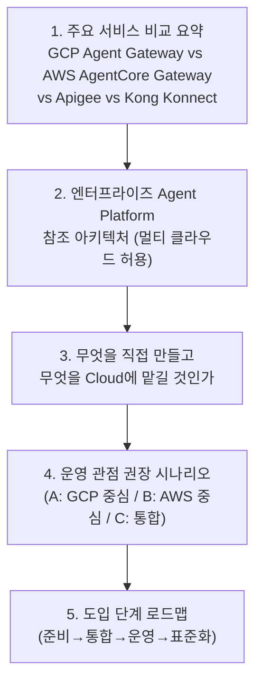
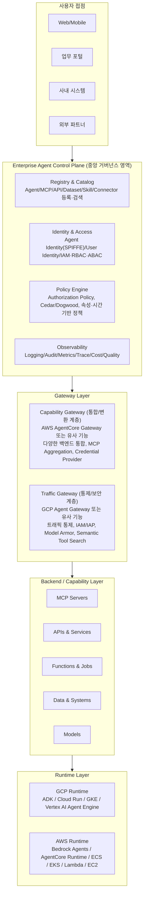
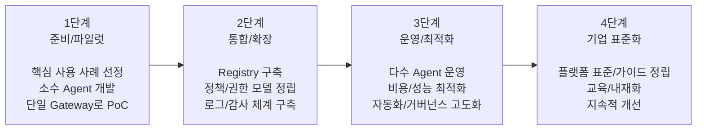

- **대상 자료**: (1) GCP Agent Gateway / AWS AgentCore Gateway / Apigee / Kong Konnect 비교표 및 엔터프라이즈 Agent Platform 참조 아키텍처 정리 자료, (2) "Gateway를 보면 Agent Platform의 철학이 보인다"는 제목의 단상(에세이)
- **작성 기준일**: 2026년 9월 5일
- **작성 방식**: 웹 검색을 통해 각 제품·기능의 최신 공식 문서 및 발표 자료를 교차 확인한 뒤 서술


```
단상

Gateway를 보면 Agent Platform의 철학이 보인다

요즘 Agent Platform을 보다 보면
이름은 비슷한데 철학은 꽤 다르다.

Google에는 Agent Gateway가 있고,
AWS에는 AgentCore Gateway가 있다.

처음엔 둘 다
“Agent가 Tool을 호출할 때 중간에서 연결해주는 것”
정도로 생각하기 쉽다.

그런데 조금만 깊게 보면 차이가 재미있다.

Google은 묻는다.

“이 Agent가 지금 이 Capability를 사용해도 되는가?”

그래서 Identity, Registry, IAM, Policy, Gateway가 강하게 연결된다.

Agent가 누구인지,
어떤 Tool을 호출했는지,
그 Tool을 호출할 권한이 있는지,
민감정보나 Prompt Injection 위험은 없는지.

Gateway가 일종의 Enforcement Point가 된다.

반면 AWS는 이렇게 묻는 느낌이다.

“Agent에게 이 수많은 시스템을 어떻게 쉽게 Tool로 제공할 것인가?”

OpenAPI, Lambda, MCP Server, 여러 Backend를 Target으로 묶고
하나의 MCP Server처럼 Agent에게 제공한다.

Credential도 대신 관리하고,
API를 Tool로 바꾸고,
여러 Tool을 검색하게 해준다.

말하자면 AWS Gateway는
Capability Hub에 가깝다.

그래서 둘 중 누가 더 좋냐고 물으면 답이 애매하다.

Google은
Governance를 잘한다.

AWS는
Integration을 잘한다.

그리고 기업에서는 둘 다 필요하다.

Agent가 10개일 때는 개발자가 코드에 권한 체크를 넣어도 된다.

Agent가 1,000개,
Tool이 5,000개가 되면 이야기가 달라진다.

그때부터 중요한 것은
Agent를 얼마나 잘 만들었느냐가 아니다.

누가 어떤 Capability를 소유하는지,
누가 사용할 수 있는지,
어떤 Identity로 호출했는지,
문제가 생기면 어디에서 차단할 수 있는지가 중요해진다.

그래서 나는 Agent Platform을 이렇게 보고 싶다.

Registry는 무엇이 존재하는지를 관리하고,
Identity는 누가 실행하는지를 증명하고,
Policy는 무엇을 허용할지 결정하고,
Gateway는 그것을 실제로 강제한다.

그리고 그 아래 Runtime은 바뀌어도 된다.

GCP일 수도 있고,
AWS일 수도 있고,
Cloud Run일 수도 있고,
AgentCore Runtime일 수도 있다.

좋은 Agent Platform은
Cloud를 선택하는 것이 아니라,

Cloud가 바뀌어도 기업의 Identity, Policy, Capability 모델은 남게 만드는 것이라고 생각한다.

결국 Gateway를 보면
그 회사가 Agent를 어떻게 생각하는지가 보인다.

연결할 대상으로 보는지,

통제해야 할 Digital Worker로 보는지.

아마 앞으로 Agent Platform의 경쟁은
모델보다 이쪽에서 더 재미있어질 것 같다.

https://www.facebook.com/share/p/1Be1TMrvX1/

```

---

## 0. 이 문서를 읽기 전에

이 문서는 두 가지 자료를 함께 다룹니다.

첫째는 GCP Agent Gateway, AWS AgentCore Gateway, Apigee(GCP), Kong Konnect라는 네 가지 "Agent Gateway" 계열 제품을 비교한 표와, 이를 실제 엔터프라이즈 환경에 적용할 때의 참조 아키텍처, 빌드-vs-바이(직접 구축 vs 클라우드 활용) 판단 기준, 운영 시나리오, 도입 로드맵을 정리한 자료입니다.

둘째는 이 비교표 위에서 저자가 던진 질문, 즉 "Google과 AWS는 똑같이 'Gateway'라는 이름을 쓰지만 실제로는 전혀 다른 철학으로 Agent Platform을 설계하고 있다"는 단상입니다.

두 자료는 서로 다른 층위에 있습니다. 앞의 자료가 "무엇이 존재하는가"를 정리한 사실 기반 비교표라면, 뒤의 단상은 그 사실들 위에서 저자가 끌어낸 해석입니다. 아래에서는 먼저 비교표와 아키텍처 자료를 항목별로 상세히 풀어 설명한 뒤, 단상의 논지를 별도 장에서 정리하고, 마지막에 두 자료를 교차 검증한 결과를 붙였습니다.

---

## 1. 큰 그림: 이 자료가 다루는 다섯 개의 층위

정리된 자료는 아래와 같이 다섯 개 섹션으로 구성되어 있습니다.



즉 이 자료는 "제품 비교 → 아키텍처 설계 → 자체 구축 판단 → 실제 운영 시나리오 → 단계별 로드맵"이라는 흐름으로, 하나의 제품을 소개하는 것이 아니라 여러 클라우드의 Gateway 제품군을 놓고 기업이 어떻게 의사결정을 내려야 하는지를 안내하는 실무 참고 자료의 성격을 띠고 있습니다.

---

## 2. 첫 번째 표 상세 해설: 네 가지 Gateway 계열 비교

표는 GCP Agent Gateway, AWS AgentCore Gateway, Apigee(GCP), Kong Konnect라는 서로 다른 출신의 네 제품을 열두 개 항목(핵심 목적, 주요 역할, MCP 지원, API→MCP 변환, 여러 MCP 통합, 검색/맞견, 아이덴티티, 정책/권한, AI 안전, 확장 기능, 주요 강점, 적합한 경우)으로 나란히 놓고 비교합니다. 이 네 제품은 이름은 비슷하지만 태생이 다릅니다. GCP Agent Gateway와 AWS AgentCore Gateway는 2026년에 새로 등장한 "에이전트 전용" 게이트웨이인 반면, Apigee와 Kong Konnect는 원래 전통적인 API 관리(API Management) 플랫폼이었다가 MCP(Model Context Protocol) 지원 기능을 얹은 제품입니다. 이 출신의 차이가 표의 모든 항목에 그대로 반영되어 있습니다.

### 2-1. GCP Agent Gateway — "이 에이전트가 이 행동을 해도 되는가"를 통제하는 네트워킹 계층

GCP Agent Gateway는 2026년 4월 Google Cloud Next '26에서 발표된 Gemini Enterprise Agent Platform의 구성 요소 중 하나로, 사용자-에이전트, 에이전트-에이전트, 에이전트-도구 사이의 모든 상호작용을 안전하고 통제된 방식으로 연결하기 위한 프로그래머블 데이터 플레인으로 소개되었습니다. 공식 문서는 이를 "복잡한 네트워킹 세부사항을 관리할 필요 없이 에이전트 통신 규칙을 정의하고 안전·보안·접근 제어 정책을 강제하는 네트워킹 추상화 계층"으로 정의하고 있습니다.

표에서 "핵심 목적"을 Governance/Network Gateway로, "MCP 지원"을 "MCP 트래픽 통제(Proxy), Tool 속성 기반 정책 적용"으로 적은 것은 이 제품의 실제 동작 방식과 일치합니다. GCP Agent Gateway는 MCP 서버 자체를 만들어주는 도구가 아니라, 이미 존재하는 MCP 트래픽이 지나가는 길목에서 레지스트리에 등록된 메타데이터를 조회해 세밀한 접근 정책을 강제하는 역할을 합니다.

가장 특징적인 부분은 "아이덴티티" 항목입니다. GCP의 Agent Identity는 SPIFFE(Secure Production Identity Framework For Everyone) 표준을 기반으로 하며, 에이전트를 배포하는 순간 Google Cloud가 고유한 SPIFFE 식별자와 24시간마다 자동 갱신되는 X.509 인증서를 발급합니다. 이 인증서는 서비스 계정처럼 여러 워크로드가 공유하거나 위조·복제(impersonation)할 수 없고, 발급된 액세스 토큰은 해당 에이전트의 인증서에 암호학적으로 결합되어 토큰 탈취를 막습니다. 실제 인증 방식은 두 단계로 나뉘는데, Gateway로 들어오는 1차 접근에는 mTLS(상호 TLS)를, Gateway를 넘어선 외부 상호작용에는 DPoP(Demonstration of Proof-of-Possession)를 사용하는 이중 결합(double binding) 구조를 취합니다. 이는 표에 적힌 "SPIFFE 기반 Agent Identity + IAM/IAP"라는 설명과 정확히 일치합니다.

정책 측면에서는 IAM(자원 단위 권한), IAP(Identity-Aware Proxy, 리소스 접근 제어), 그리고 Authorization Policy가 결합되어 "리소스·도구 수준의 제어"를 구현합니다. AI 안전 기능으로는 Model Armor를 Gateway 리소스에 직접 연결할 수 있는데, 이는 2026년 기준 정식 출시(GA)된 기능으로, 프롬프트 인젝션 탐지, 탈옥(jailbreak) 시도 차단, 악성 URL 탐지, 그리고 신용카드번호·이메일 등 민감정보를 판별해 마스킹하는 민감정보 보호(Sensitive Data Protection/DLP) 기능을 Gateway를 통과하는 프롬프트와 응답 양쪽에 적용합니다.

확장 기능 쪽에는 커스텀 검사(Silverfort 등 서드파티 신원 보안 업체와의 런타임 통합), 로깅/감사, VPC 통합, Private Google Access 등이 포함되어 있으며 이는 Google이 "Agent Gateway ISV 생태계"라는 이름으로 서드파티 보안 공급업체들과의 연동을 공식적으로 확장하고 있는 흐름과 맞닿아 있습니다.

요약하면 GCP Agent Gateway는 "무엇을 연결할 것인가"보다 "이미 연결된 것을 어떻게 통제·감사할 것인가"에 초점을 맞춘 제품입니다.

### 2-2. AWS AgentCore Gateway — "이 수많은 백엔드를 어떻게 하나의 도구 묶음으로 보여줄 것인가"에 집중하는 통합 허브

AWS AgentCore Gateway는 Amazon Bedrock AgentCore라는 더 큰 제품군의 한 구성 요소로, 조직 내부의 API, AWS Lambda 함수, 이미 존재하는 MCP 서버 등 다양한 백엔드(Target)를 하나의 관리형 MCP 엔드포인트로 통합해서 제공하는 것이 핵심 기능입니다. 표의 "MCP 지원"란에 적힌 "MCP Server 역할 수행(통합 MCP 엔드포인트 제공)"이라는 설명, "API→MCP 변환"란의 "OpenAPI/Lambda/Smithy → MCP Tool 자동 변환"이라는 설명은 실제 AWS 공식 문서의 설명과 일치합니다. 공식 문서는 이를 "조직 도구에 대한 단일하고 안전한 진입점을 제공하며, 보안 인증·인가·자격 증명 관리를 위해 AgentCore Identity에 의존한다"고 설명합니다.

여러 MCP 통합 측면에서 AWS는 두 가지 무기를 갖고 있습니다. 첫째는 시맨틱 도구 검색(semantic tool search)으로, 게이트웨이가 제공하는 특수한 검색 도구(x_amz_bedrock_agentcore_search)를 통해 268개가 넘는 API 오퍼레이션 중 실제로 필요한 10~15개만 골라서 에이전트에게 보여줄 수 있습니다. 이는 도구가 너무 많아 에이전트가 혼란을 겪는 "tool overload" 문제를 완화하기 위한 기능입니다. 둘째는 2026년 4월 프리뷰로 출시된 AWS Agent Registry로, 조직 내에 흩어진 에이전트·도구·MCP 서버·스킬을 중앙에서 검색·거버넌스할 수 있는 카탈로그입니다. 이 레지스트리는 키워드 검색과 시맨틱 검색을 함께 지원하며, 승인 워크플로를 통해 등록된 항목을 관리자가 검토한 뒤 조직 전체에 공개할 수 있고, 현재 미국 서부(오리건), 아시아태평양(도쿄, 시드니), 유럽(아일랜드), 미국 동부(버지니아 북부) 등 AgentCore가 제공되는 5개 리전에서 프리뷰로 이용할 수 있습니다.

아이덴티티와 정책 항목은 표에 "AgentCore Identity(IAM/OAuth/JWT 등)"와 "Cedar/Dogwood Policy Engine"으로 요약되어 있는데, 이는 AWS의 최신 발표 내용을 정확히 반영한 것입니다. AgentCore의 정책 엔진은 Cedar라는 언어로 작성된 정책을 평가합니다. Cedar는 원래 AWS가 만들어 오픈소스로 공개하고 2025년 말 CNCF(Cloud Native Computing Foundation) 샌드박스 프로젝트로 기부한 인가(authorization) 언어로, "동일한 요청에는 항상 동일한 결정"이 나오는 무상태(stateless) 특성을 가지고 있어 자동화된 수학적 검증(formal verification)이 가능하다는 장점이 있습니다. 다만 Cedar는 "지금 이 순간의 요청"만 판단할 수 있고 "이전에 무슨 일이 있었는지"는 알 수 없다는 한계가 있었습니다. 이를 보완하기 위해 AWS는 2026년 8월 무렵 Dogwood라는 새 정책 언어를 오픈소스(Apache 2.0)로 공개했습니다. Dogwood는 Cedar를 대체하지 않고 확장하는 방식으로, "시간적 조건(temporal condition)"을 추가해 에이전트의 과거 행동 이력을 참조하는 정책을 표현할 수 있게 해줍니다. AWS가 예시로 드는 시나리오는 "특정 주식에 대한 매도는, 같은 종목·같은 수량에 대해 지난 1시간 이내에 승인 도구가 긍정 응답을 반환한 경우에만 허용한다"는 식의 정책입니다. 기존 Cedar 정책은 그대로 유효한 Dogwood 정책이 되므로 재작성이 필요 없다는 점도 명시되어 있습니다.

AI 안전 항목의 "Bedrock Guardrails(콘텐츠·주제·PII 필터링)"는 AWS Bedrock이 오래전부터 제공해 온 콘텐츠 필터링, 금지 주제 차단, 민감정보 마스킹 기능으로, AgentCore Gateway를 지나는 트래픽에도 연동해 적용할 수 있습니다.

확장 기능에서 표가 짚은 "Lambda Interceptors(요청/응답 검사)"는 실제로 존재하는 기능으로, Gateway가 대상(Target)을 호출하기 전에 실행되는 REQUEST 인터셉터와 응답을 반환하기 전에 실행되는 RESPONSE 인터셉터를 각각 최대 1개씩 Lambda 함수로 등록해, 세밀한 접근 제어나 요청/응답 변환, 커스텀 인가 로직을 끼워 넣을 수 있습니다. "Credential Provider(자격증명 중개)"는 AgentCore Identity의 자격 증명 볼트(vault)와 자격 증명 공급자(credential provider) 기능을 가리키는 것으로, API 키나 OAuth 토큰 같은 민감한 자격 증명이 에이전트 컨테이너 안으로 들어가지 않고 Gateway와 Target 사이에서만 오가도록 설계되어 있습니다.

요약하면 AWS AgentCore Gateway는 "이미 존재하는 수많은 시스템을 어떻게 에이전트가 쉽게 쓸 수 있는 도구로 바꿔줄 것인가"에 초점을 맞춘 통합(Integration) 허브에 가깝습니다.

### 2-3. Apigee(GCP) — API 관리 플랫폼에서 자라난 MCP 프록시

Apigee는 원래 API 라이프사이클 관리, 트래픽 제어, 분석을 담당하는 전통적인 API 관리 플랫폼이며, 여기에 MCP 지원 기능이 추가된 형태입니다. 실제로 Apigee는 API Hub라는 카탈로그 안에서 기존에 등록된 API 프록시들을 선택해 자동으로 "MCP Discovery Proxy"라는 하나의 통합 프록시로 묶어주는 기능을 제공합니다. 이때 필요한 것은 각 API 프록시가 가지고 있는 OpenAPI 3.0 규격의 명세서이며, Apigee는 이 명세서를 파싱해 MCP 도구로 자동 변환합니다. 표의 "API→MCP 변환"란에 "OpenAPI→MCP Proxy(MCP Toolkit)"라고 적힌 것이 바로 이 기능을 가리킵니다.

접근 통제 방식도 API 관리 플랫폼 출신답게 독특합니다. MCP는 REST API와 달리 모든 도구 호출이 하나의 엔드포인트(예: /mcp)로 들어오고 실제 어떤 작업(operation)인지는 JSON-RPC 요청 본문 안에 담겨 있습니다. Apigee는 ParsePayload라는 정책을 이용해 이 본문 안의 오퍼레이션 이름을 추출한 뒤, 이를 기존의 API 상품(API Product) 개념에 매칭시켜 도구별로 인증, 쿼터(사용량 제한), 노출 여부를 개별적으로 제어합니다. 표에서 "검색/맞견"을 "API Catalog(검색/거버넌스)"로, "정책/권한"을 "Org/Env/제품별 접근제어, Quota, Spike Arrest"로 표현한 것은 API 관리 플랫폼 특유의 조직(Org)-환경(Env)-제품(Product) 계층 구조와 트래픽 급증 방지(Spike Arrest) 기능을 반영한 것입니다.

요약하면 Apigee는 "오래전부터 잘 관리해온 API 자산을 그대로 MCP 도구로 재포장해 노출한다"는 성격이 강하며, API 거버넌스와 수익화(monetization) 생태계가 이미 갖춰진 조직에 적합합니다.

### 2-4. Kong Konnect — 플러그인 기반의 유연한 멀티/하이브리드 게이트웨이

Kong Konnect 역시 Apigee와 비슷하게 전통적인 API 게이트웨이에서 출발했지만, 확장 방식이 플러그인 아키텍처라는 점이 다릅니다. Kong은 AI MCP Proxy라는 플러그인(ai-mcp-proxy)을 통해 크게 두 가지 방식을 지원합니다. 하나는 일반 REST API로 정의된 Kong 서비스(Service)를 MCP 도구로 변환하는 "conversion" 모드이고, 다른 하나는 이미 존재하는 외부 MCP 서버를 그대로 노출하고 보호하는 "listener/프록시" 모드입니다. 여기에 더해 Kong Konnect는 자체적으로 호스팅하는 Kong Konnect MCP 서버를 함께 제공하는데, 이 서버는 Konnect 내부의 제어 평면(control plane), 서비스, 라우트, 컨슈머, 플러그인 등을 자연어로 질의·관리할 수 있게 해주는 운영용 MCP 서버로, Kong의 자체 AI 어시스턴트인 KAi를 구동하는 데도 같은 도구 세트가 쓰입니다.

표의 "여러 MCP 통합"란에 적힌 "여러 MCP 서버를 Aggregation 가능"이라는 설명, "확장 기능"란의 "플러그인 생태계, Mesh/멀티클러스터, 분산 트래픽 제어"라는 설명은 Kong 특유의 플러그인 생태계와, 여러 데이터 플레인(온프레미스, 여러 클라우드에 흩어진 Kong Gateway 인스턴스들)을 하나의 제어 평면으로 관리하는 하이브리드 아키텍처의 강점을 반영합니다. Kong은 OAuth 2.1 같은 MCP 표준 보안 메커니즘과, 기존에 이미 검증된 API 게이트웨이 플러그인(트래픽 변환, 인증, 레이트 리미팅 등)을 그대로 MCP 트래픽에도 적용할 수 있다는 점을 강점으로 내세웁니다.

요약하면 Kong Konnect는 "특정 클라우드에 종속되지 않고, 온프레미스부터 여러 퍼블릭 클라우드까지 흩어진 마이크로서비스·MCP 서버를 하나의 플러그인 생태계로 묶어 관리한다"는 성격이 강하며, 멀티/하이브리드 클라우드 환경과 다양한 런타임이 혼재된 조직에 적합합니다.

### 2-5. 네 제품을 한 줄로 비교하면

| 제품 | 태생 | 핵심 질문 |
|---|---|---|
| GCP Agent Gateway | 2026년 신설된 에이전트 전용 네트워킹/거버넌스 계층 | "이 에이전트가 지금 이 행동을 해도 되는가?" |
| AWS AgentCore Gateway | 2026년 신설된 에이전트 전용 도구 통합 허브 | "이 수많은 백엔드를 어떻게 하나의 도구 세트로 보여줄 것인가?" |
| Apigee | 전통 API 관리 플랫폼 + MCP 확장 | "이미 관리 중인 API 자산을 어떻게 MCP로 재포장할 것인가?" |
| Kong Konnect | 전통 API 게이트웨이 + 플러그인 확장 | "여러 클라우드/온프레미스에 흩어진 서비스를 어떻게 하나의 플러그인 체계로 묶을 것인가?" |

---

## 3. 두 번째 자료 해설: 엔터프라이즈 Agent Platform 참조 아키텍처

두 번째 자료는 위에서 비교한 개별 제품들을 실제 기업 환경에 어떻게 배치하는지를 보여주는 참조 아키텍처입니다. 특정 벤더 하나를 쓰는 그림이 아니라, 여러 클라우드를 함께 쓰는 것을 전제로 그려져 있다는 점이 특징입니다. 구조는 위에서 아래로 크게 네 개 층으로 나뉩니다.



### 3-1. Enterprise Agent Control Plane — 중앙 거버넌스 영역

가장 위에 놓인 중앙 통제 영역은 네 가지 기능으로 구성됩니다.

- **Registry & Catalog**: 에이전트, MCP 서버, API, 데이터셋, 스킬, 커넥터를 등록·검색하고 메타데이터를 관리하는 카탈로그입니다. GCP의 Agent Registry, AWS의 Agent Registry(프리뷰)가 여기에 해당합니다.
- **Identity & Access**: 에이전트 신원(GCP는 SPIFFE 기반, AWS는 AgentCore Identity), 사용자 신원, IAM/RBAC/ABAC 같은 접근 제어 모델을 담당합니다.
- **Policy Engine**: 무엇을 허용할지 결정하는 인가 규칙 엔진으로, AWS의 Cedar/Dogwood, GCP의 Authorization Policy가 여기에 해당합니다.
- **Observability**: 로깅, 감사, 지표, 추적, 비용, 품질을 모니터링하는 영역입니다.

이 네 기능이 "연동 및 네트워크"를 통해 VPC/VNet Private Link Peering, Private Google Access, Direct Connect/VPN, 온프레미스 시스템, 인터넷/SaaS까지 이어지도록 설계되어 있다는 점에서, 이 참조 아키텍처는 단일 클라우드가 아니라 멀티/하이브리드 클라우드를 전제로 하고 있음을 알 수 있습니다.

### 3-2. Gateway Layer — 두 가지 성격의 게이트웨이를 나란히 배치

이 아키텍처의 가장 흥미로운 지점은 Gateway Layer를 하나가 아니라 두 개로 나눠 그렸다는 것입니다.

- **Capability Gateway(통합/변환 계층)**: "AWS AgentCore Gateway 또는 유사 기능"이라고 명시되어 있으며, 역할은 다양한 백엔드(Target) 통합, API/Lambda/Smithy → MCP 변환, 여러 MCP를 하나로 묶는 Virtual MCP Server 구성, 자격증명 중개(Credential Provider, OAuth/API Key/SigV4), 시맨틱 도구 검색을 담당합니다.
- **Traffic Gateway(통제/보안 계층)**: "GCP Agent Gateway 또는 유사 기능"이라고 명시되어 있으며, 역할은 에이전트 트래픽 통제(수신·발신), IAM/IAP 기반 세밀한 권한 제어, 도구 수준 권한 제어(읽기/쓰기 등), Model Armor·AI Safety 검사, 서비스 확장(Service Extensions) 연동을 담당합니다.

즉 이 아키텍처는 "먼저 여러 백엔드를 하나의 도구 세트로 통합(Capability Gateway)한 다음, 그 위에 트래픽 통제와 보안 정책을 강제하는 계층(Traffic Gateway)을 얹는" 이중 구조를 제안하고 있습니다. 이는 앞서 2장에서 살펴본 "AWS는 통합에 강하고 GCP는 통제에 강하다"는 특성을 그대로 아키텍처 설계에 반영한 것으로, 특정 벤더 하나에 의존하지 않고 두 성격의 게이트웨이를 함께 배치해 서로의 약점을 보완하려는 의도로 읽을 수 있습니다.

### 3-3. Backend/Capability Layer와 Runtime Layer

Gateway Layer 아래에는 실제 도구와 데이터가 위치한 Backend/Capability Layer(MCP 서버, API/서비스, 함수/배치 작업, 데이터/시스템, 모델)가 있고, 그 아래에는 에이전트가 실제로 실행되는 Runtime Layer가 있습니다. GCP 쪽은 Agent Development Kit(ADK), Cloud Run, GKE, Vertex AI Agent Engine을, AWS 쪽은 Bedrock Agents, AgentCore Runtime, ECS, EKS, Lambda, EC2를 예시로 들고 있습니다. 이 구조에서 핵심은 "Runtime은 언제든 바뀔 수 있는 하위 계층"이라는 설계 철학입니다. 즉 위쪽의 Registry, Identity, Policy, Gateway가 잘 정의되어 있다면 그 아래 어떤 클라우드의 실행 환경을 쓰든 기업의 거버넌스 모델 자체는 유지될 수 있다는 것이 이 아키텍처의 전제입니다.

---

## 4. 세 번째 자료 해설: 무엇을 직접 만들고, 무엇을 클라우드에 맡길 것인가

세 번째 표는 아키텍처의 각 영역(Agent 개발 프레임워크, Agent Runtime, Registry & Catalog, Identity & Access, Policy(권한/거버넌스), Gateway-통합/변환, Gateway-통제/보안, AI Safety, 관찰성/감사, 네트워크/연결, 백엔드 시스템 연동)마다 "직접 구축"이 필요한지, "Cloud 활용"이 가능한지를 정리한 의사결결정 표입니다. 전체적인 패턴을 보면 다음과 같은 원칙이 드러납니다.

- **거의 항상 직접 구축이 필요한 영역**: Registry & Catalog는 조직 고유의 메타데이터 스키마가 필요하므로 "✓(고유 메타)" 표시가 붙어 있고, Identity & Access는 조직의 정책·구조를 반영해야 하므로 "✓(정책/구조)"가, Policy(권한/거버넌스)는 비즈니스 규칙이 조직마다 다르므로 "✓(비즈니스 규칙)"가 붙어 있습니다. 즉 "우리 조직의 규칙이 무엇인가"를 정의하는 영역은 클라우드 제품을 가져다 쓰더라도 그 안의 내용은 직접 채워야 한다는 뜻입니다.
- **선택적으로 직접 구축하는 영역**: Agent Runtime은 "선택적"으로 표시되어 있어, ADK/Bedrock Agents 같은 관리형 서비스를 쓸 수도 있고 자체 오케스트레이션 프레임워크를 구축할 수도 있다는 뜻입니다.
- **필요 시에만 직접 구축하는 영역**: Gateway(통합/변환), Gateway(통제/보안), 관찰성/감사는 "필요 시 확장"으로 표시되어 있어, 기본적으로는 클라우드가 제공하는 AgentCore Gateway/Agent Gateway/Apigee/Kong 등을 활용하되 조직 특수 요구사항이 있을 때만 커스텀 로직(Lambda 인터셉터, Service Extensions 등)을 추가하라는 뜻입니다.
- **Hybrid로 설계하는 영역**: 네트워크/연결은 "Hybrid 설계"로 표시되어, VPC/PSC/Private Link/VPN을 목적에 맞게 혼합해서 구성해야 함을 나타냅니다.
- **주로 클라우드에 맡기는 영역**: Agent 개발 프레임워크는 ADK나 Bedrock Agents 같은 관리형 프레임워크를 그대로 활용하는 경우가 대부분이고, AI Safety는 Model Armor/Guardrails 같은 관리형 서비스를 활용하는 것이 일반적입니다.

표 하단의 각주에도 명시되어 있듯이, 이 구분은 고정된 규칙이 아니라 "조직의 보안 정책, 운영 역량, 규제 요구사항에 따라 조정"되어야 하는 참고 기준입니다.

---

## 5. 네 번째 자료 해설: 운영 관점 권장 시나리오 A/B/C

네 번째 섹션은 앞의 아키텍처를 실제로 어떤 조합으로 채택할지에 대한 세 가지 시나리오를 제시합니다.

- **시나리오 A (보안/거버넌스 최우선)**: GCP 중심 아키텍처로, Agent Gateway + Agent Registry + Model Armor + IAM/IAP 중심의 조합을 택합니다. 대규모 조직, 규제 산업(금융, 의료 등)에 적합하다고 설명되어 있습니다. 이는 앞서 살펴본 GCP Agent Gateway의 강점(SPIFFE 기반 신원, IAM/IAP 통합, Model Armor)을 그대로 반영한 시나리오입니다.
- **시나리오 B (빠른 통합/생산성 최우선)**: AWS 중심 아키텍처로, AgentCore Gateway로 API/Lambda를 MCP로 빠르게 통합하고 이후 정책을 강화해 나가는 방식입니다. 기준 API/Lambda 자산이 많은 조직에 적합하다고 설명되어 있습니다. 이 역시 AWS AgentCore Gateway의 강점(OpenAPI/Lambda/Smithy 변환, 다양한 백엔드 통합)을 반영합니다.
- **시나리오 C (멀티 클라우드/하이브리드, 권장)**: AWS Gateway(통합) + GCP Gateway(통제)를 함께 사용하고 런타임은 필요에 따라 선택하는 방식으로, 유연성과 거버넌스의 균형을 맞추는 것이 목표라고 설명되어 있습니다. 이 시나리오는 3장에서 살펴본 참조 아키텍처의 "Capability Gateway + Traffic Gateway" 이중 구조와 정확히 대응됩니다.

세 시나리오 중 "권장"이라는 표시가 붙은 것은 시나리오 C이며, 이는 이 자료 전체가 "하나의 클라우드에 올인하기보다 AWS의 통합 강점과 GCP의 통제 강점을 함께 가져가는 것이 합리적"이라는 관점을 취하고 있음을 보여줍니다. 이는 뒤에서 다룰 단상 에세이의 결론("Google은 Governance를 잘하고 AWS는 Integration을 잘하며, 기업에서는 둘 다 필요하다")과도 일치합니다.

---

## 6. 다섯 번째 자료 해설: 도입 단계 로드맵(권장)

마지막 섹션은 도입을 네 단계로 나눈 로드맵입니다.



이 로드맵의 핵심은 순서입니다. 1단계에서는 아직 Registry나 정교한 정책 없이 단일 Gateway로 소규모 파일럿을 진행하고, 2단계에 가서야 비로소 Registry를 구축하고 정책/권한 모델을 정립합니다. 즉 "처음부터 완벽한 거버넌스 체계를 만들고 시작하라"는 것이 아니라 "먼저 작게 검증하고, 규모가 커지기 시작할 때 거버넌스 인프라(Registry, Policy, 로그/감사)를 갖추라"는 점진적 접근을 권장하고 있습니다. 이는 뒤에서 다룰 단상의 핵심 주장, 즉 "에이전트가 10개일 때는 개발자가 코드에 권한 체크를 넣어도 되지만, 1,000개, 5,000개가 되면 이야기가 달라진다"는 대목과 정확히 맞닿아 있습니다.

---

## 7. 단상 해설: "Gateway를 보면 Agent Platform의 철학이 보인다"

이제 두 번째 자료인 단상(에세이)의 논지를 정리합니다. 이 글은 위의 비교표와 아키텍처 자료를 관찰한 뒤 저자가 내린 해석으로, 사실 확인이 아니라 저자 개인의 분석적 견해라는 점을 먼저 밝혀둡니다.

### 7-1. 두 회사가 던지는 서로 다른 질문

저자는 Google의 Agent Gateway와 AWS의 AgentCore Gateway가 이름은 비슷하지만 실제로는 서로 다른 질문에서 출발한다고 봅니다.

- Google이 던지는 질문: **"이 Agent가 지금 이 Capability를 사용해도 되는가?"** — 이는 Identity, Registry, IAM, Policy, Gateway가 강하게 연결된 통제(enforcement) 중심의 질문입니다. 에이전트가 누구인지, 어떤 도구를 호출했는지, 그 도구를 호출할 권한이 있는지, 민감정보 유출이나 프롬프트 인젝션 위험은 없는지를 Gateway가 실행 시점(enforcement point)에서 판단한다는 것입니다.
- AWS가 던지는 질문: **"Agent에게 이 수많은 시스템을 어떻게 쉽게 Tool로 제공할 것인가?"** — 이는 여러 백엔드를 Target으로 묶어 하나의 MCP 서버처럼 제공하고, 자격 증명을 대신 관리하고, API를 도구로 변환하고, 여러 도구를 검색 가능하게 만드는 통합(integration) 중심의 질문입니다. 저자는 이런 성격의 AWS Gateway를 "Capability Hub"에 가깝다고 표현합니다.

저자는 이 차이를 "Google은 Governance를 잘하고 AWS는 Integration을 잘한다"는 한 문장으로 요약하며, 어느 한쪽이 우월하다고 결론 내리지 않고 "기업에서는 둘 다 필요하다"고 봅니다. 이는 2장에서 확인한 두 제품의 실제 기능 차이(GCP는 SPIFFE 신원·IAM/IAP·Model Armor 중심, AWS는 OpenAPI/Lambda 변환·Credential Provider·시맨틱 검색 중심), 그리고 5장에서 확인한 "시나리오 C(통합 아키텍처)가 권장"이라는 결론과 서로 부합합니다.

### 7-2. 규모의 논리 — 왜 10개일 때와 1,000개일 때가 다른가

저자가 제시하는 핵심 논거는 규모(scale)에 관한 것입니다. 에이전트가 10개 수준일 때는 개발자가 애플리케이션 코드 안에 권한 체크 로직을 직접 넣어도 큰 문제가 없습니다. 그러나 에이전트가 1,000개, 도구가 5,000개 규모로 늘어나면 상황이 달라집니다. 이 지점부터는 "에이전트를 얼마나 잘 만들었는가"보다 다음 네 가지 질문이 더 중요해진다는 것이 저자의 주장입니다.

1. 누가 어떤 Capability(도구, API, 데이터)를 소유하는가
2. 누가 그것을 사용할 수 있는가
3. 어떤 Identity로 호출했는가
4. 문제가 생겼을 때 어디에서 차단할 수 있는가

이 네 가지 질문에 답하기 위한 구조로 저자는 다음과 같은 역할 분담을 제시합니다.

- **Registry**: 무엇이 존재하는지를 관리한다
- **Identity**: 누가 실행하는지를 증명한다
- **Policy**: 무엇을 허용할지 결정한다
- **Gateway**: 그것을 실제로 강제한다

이 네 가지 요소는 3장에서 살펴본 참조 아키텍처의 "Enterprise Agent Control Plane"에 있는 네 구성 요소(Registry & Catalog, Identity & Access, Policy Engine, Observability + Gateway Layer)와 정확히 대응됩니다. 즉 저자의 단상은 개인적인 사변이 아니라, 실제로 업계가 수렴하고 있는 아키텍처 패턴을 언어화한 것으로 볼 수 있습니다.

### 7-3. Runtime은 바뀌어도 되는 하위 계층이다

저자는 이 네 가지 요소(Registry, Identity, Policy, Gateway) 아래에 있는 Runtime은 "바뀌어도 되는" 계층이라고 말합니다. GCP일 수도, AWS일 수도, Cloud Run일 수도, AgentCore Runtime일 수도 있다는 것입니다. 그리고 좋은 Agent Platform이란 "특정 클라우드를 선택하는 것"이 아니라 "클라우드가 바뀌어도 기업의 Identity, Policy, Capability 모델이 남도록 만드는 것"이라고 정의합니다.

이 관점은 3장에서 확인한 참조 아키텍처의 설계 원칙, 즉 Control Plane(중앙 거버넌스)과 Runtime Layer(실행 환경)를 명확히 분리해 그린 구조와 정확히 일치합니다. 다시 말해 이 단상은 그림으로 표현된 아키텍처의 설계 의도를 말로 풀어쓴 해설이라고도 볼 수 있습니다.

### 7-4. 결론 — Gateway는 그 회사가 에이전트를 무엇으로 보는지 드러낸다

저자는 글을 다음과 같이 맺습니다. Gateway를 보면 그 회사가 에이전트를 "연결할 대상"으로 보는지, 아니면 "통제해야 할 Digital Worker(디지털 노동자)"로 보는지가 드러난다는 것입니다. 그리고 앞으로 Agent Platform 경쟁은 모델(LLM 자체의 성능) 영역보다 오히려 이 거버넌스·통합 계층에서 더 치열해질 것이라는 전망으로 마무리합니다.

이 전망이 실제로 맞아떨어지고 있는지는 이 문서 작성 시점(2026년 9월)에서 판단하기는 이르지만, 적어도 두 회사가 2026년 상반기에 나란히 "에이전트 전용 Gateway"라는 신제품군을 내놓았고, AWS가 8월에 Cedar를 확장하는 Dogwood라는 새로운 정책 언어까지 추가로 공개하며 거버넌스 기능을 계속 강화하고 있다는 점에서, 저자가 주목한 "Gateway 경쟁"이 실제로 빠르게 진행되고 있는 영역이라는 점은 현재 확인 가능한 사실입니다.

---

## 8. 표와 에세이를 함께 읽으면 보이는 것

두 자료를 나란히 놓고 보면, 에세이의 추상적인 주장 하나하나가 표의 구체적인 항목과 짝을 이루고 있음을 확인할 수 있습니다.

| 에세이의 주장 | 표/아키텍처의 근거 |
|---|---|
| "Google은 '이 Agent가 이 Capability를 써도 되는가'를 묻는다" | GCP 행: 아이덴티티(SPIFFE+IAM/IAP), 정책/권한(리소스·도구 수준 제어), AI 안전(Model Armor) |
| "AWS는 '이 시스템을 어떻게 도구로 제공할 것인가'를 묻는다" | AWS 행: API→MCP 변환(OpenAPI/Lambda/Smithy), 확장 기능(Credential Provider, 빠른 API/MCP 변환) |
| "Registry는 무엇이 존재하는지 관리한다" | 아키텍처의 Registry & Catalog 블록 |
| "Identity는 누가 실행하는지 증명한다" | 아키텍처의 Identity & Access 블록 |
| "Policy는 무엇을 허용할지 결정한다" | 아키텍처의 Policy Engine 블록 (Cedar/Dogwood, IAM/IAP) |
| "Gateway는 그것을 실제로 강제한다" | 아키텍처의 Capability Gateway + Traffic Gateway 이중 구조 |
| "Runtime은 바뀌어도 된다" | 아키텍처의 Runtime Layer(GCP Runtime / AWS Runtime)가 Control Plane과 분리되어 그려진 구조 |
| "기업에서는 둘 다 필요하다" | 5장의 시나리오 C(통합 아키텍처)가 "권장"으로 표시됨 |

이처럼 단상은 표와 아키텍처 자료를 관찰한 뒤 나온 해석이며, 표는 그 해석의 사실적 근거를 제공하는 관계에 있습니다.

---

## 9. 용어 해설

| 용어 | 설명 |
|---|---|
| MCP (Model Context Protocol) | AI 에이전트가 외부 도구·데이터 소스와 표준화된 방식으로 통신하기 위한 개방형 프로토콜. 2026년 7월 28일 무상태(stateless) 구조로 전환하는 대규모 개정판이 발표되었다 |
| SPIFFE | Secure Production Identity Framework For Everyone의 약자로, 워크로드(사람이 아닌 소프트웨어 개체)에 암호학적으로 검증 가능한 신원을 부여하는 업계 표준 |
| mTLS | 상호 TLS(mutual TLS)로, 클라이언트와 서버가 서로의 인증서를 검증해 통신을 암호화·인증하는 방식 |
| DPoP | Demonstration of Proof-of-Possession의 약자로, 발급된 토큰이 특정 클라이언트에 의해서만 사용될 수 있음을 암호학적으로 증명하는 OAuth 확장 메커니즘 |
| IAM | Identity and Access Management. 사용자·서비스가 어떤 자원에 접근할 수 있는지를 관리하는 체계 |
| IAP | Identity-Aware Proxy. Google Cloud에서 리소스 앞단에 놓여 신원 기반 접근 제어를 수행하는 프록시 |
| Cedar | AWS가 만들고 CNCF 샌드박스 프로젝트로 기부한 오픈소스 인가(authorization) 정책 언어. 요청 하나하나를 독립적으로 판단하는 무상태 특성을 가짐 |
| Dogwood | Cedar를 확장해 에이전트의 과거 행동 이력을 참조하는 "시간적 조건(temporal condition)"을 표현할 수 있게 한 오픈소스 정책 언어(Apache 2.0). 2026년 8월 공개 |
| Model Armor | Google Cloud의 AI 보안 서비스로, 프롬프트 인젝션·탈옥 탐지, 악성 URL 탐지, 민감정보(PII) 탐지·마스킹을 수행 |
| Bedrock Guardrails | AWS Bedrock의 콘텐츠 안전 기능으로, 유해 콘텐츠 필터링, 금지 주제 차단, 민감정보 마스킹을 제공 |
| RBAC / ABAC | Role-Based / Attribute-Based Access Control. 각각 역할 기반, 속성 기반으로 접근 권한을 부여하는 방식 |
| Spike Arrest | Apigee 등 API 관리 플랫폼에서 급격한 트래픽 증가로부터 백엔드를 보호하는 속도 제한 정책 |
| FDE | Forward Deployed Engineer의 약자로, 고객사에 상주하며 맞춤형 구현을 지원하는 엔지니어링 모델(이번 자료의 직접적인 주제는 아니나 관련 논의에서 자주 함께 언급됨) |

---

## 10. 사실관계 검증 (4단계 출처 신뢰도)

| 단계 | 검증 내용 |
|---|---|
| **1. 공식 1차 출처로 확인된 사실** | GCP Agent Gateway가 Gemini Enterprise Agent Platform의 일부이며 2026년 4월 Google Cloud Next '26에서 발표된 점(Google Cloud 공식 블로그·문서), Agent Identity가 SPIFFE 기반이며 mTLS+DPoP 이중 인증 구조를 쓴다는 점(Google Cloud 공식 문서), Model Armor가 프롬프트 인젝션·PII 탐지 기능을 제공한다는 점(Google Cloud 공식 문서), AWS AgentCore Gateway가 OpenAPI/Lambda/MCP 서버를 통합 MCP 엔드포인트로 제공한다는 점과 AgentCore Identity에 의존한다는 점(AWS 공식 블로그·문서), AWS Agent Registry가 2026년 4월 프리뷰로 출시되었고 5개 리전에서 제공된다는 점(AWS 공식 발표), Cedar가 CNCF 샌드박스 프로젝트로 기부되었고 Dogwood가 이를 확장하는 시간적 정책 언어로 2026년 8월경 오픈소스 공개되었다는 점(AWS 공식 오픈소스 블로그), Apigee의 MCP Discovery Proxy가 OpenAPI 명세를 MCP 도구로 자동 변환한다는 점(Google Cloud 공식 문서), Kong의 ai-mcp-proxy 플러그인이 REST API를 MCP 도구로 변환하거나 기존 MCP 서버를 프록시할 수 있다는 점(Kong 공식 블로그·문서), AgentCore Gateway의 Lambda 기반 REQUEST/RESPONSE 인터셉터 기능(AWS 공식 문서) |
| **2. 복수 매체 교차검증된 사실** | Dogwood의 동작 방식(시간적 조건, Cedar와의 호환성, 주식 거래 승인 예시)이 The New Stack, InfoQ, DEV Community 등 복수의 독립 매체에서 AWS 공식 발표와 일치하는 내용으로 보도됨 |
| **3. 단일 출처 기반 사실** | AWS Agent Registry의 시맨틱+키워드 하이브리드 검색 세부 동작 방식은 AWS 공식 블로그 한 곳의 설명에 주로 의존함 |
| **4. 분석적 종합·편집 판단** | "GCP는 Governance, AWS는 Integration에 강하다"는 성격 규정, "시나리오 C가 권장된다"는 판단, "Gateway가 그 회사의 에이전트관을 드러낸다"는 단상 저자의 해석은 검증 가능한 사실이 아니라 자료 작성자·에세이 저자의 분석적 견해이며, 이 문서에서도 해석으로 명시하여 사실과 구분했습니다 |

---

## 11. 참고자료

- Google Cloud, "Introducing Agent Gateway ISV ecosystem for security and governance" — https://cloud.google.com/blog/products/identity-security/introducing-agent-gateway-isv-ecosystem-for-security-and-governance
- Google Cloud, "Agent Gateway overview" (Gemini Enterprise Agent Platform 공식 문서) — https://docs.cloud.google.com/gemini-enterprise-agent-platform/govern/gateways/agent-gateway-overview
- Google Cloud, "Agent Identity overview" — https://docs.cloud.google.com/iam/docs/agent-identity-overview
- Google Cloud, "Model Armor overview" — https://docs.cloud.google.com/model-armor/overview
- Google Cloud, "Get started with Apigee and MCP" — https://docs.cloud.google.com/apigee/docs/api-platform/apigee-mcp/apigee-mcp-quickstart
- Google Cloud, "Manage MCP proxies (API hub)" — https://docs.cloud.google.com/apigee/docs/apihub/manage-mcp-proxies
- Virtualization Review, "Google Cloud Next '26: Gemini Enterprise Agent Platform Leads AI-Centric News" — https://virtualizationreview.com/articles/2026/04/24/google-cloud-next-26-gemini-enterprise-agent-platform-leads-ai-centric-news.aspx
- AWS, "Govern AI agent tool access with Amazon Bedrock AgentCore Gateway" — https://aws.amazon.com/blogs/machine-learning/govern-ai-agent-tool-access-with-amazon-bedrock-agentcore-gateway/
- AWS, "The future of managing agents at scale: AWS Agent Registry now in preview" — https://aws.amazon.com/blogs/machine-learning/the-future-of-managing-agents-at-scale-aws-agent-registry-now-in-preview
- AWS, "AWS Agent Registry for centralized agent discovery and governance is now available in Preview" (What's New) — https://aws.amazon.com/about-aws/whats-new/2026/04/aws-agent-registry-in-agentcore-preview
- AWS Open Source Blog, "Introducing Dogwood: runtime verification for AI agents" — https://aws.amazon.com/blogs/opensource/introducing-dogwood-runtime-verification-for-ai-agents/
- AWS Security Blog, "Why Policy in Amazon Bedrock AgentCore chose Cedar for securing agentic workflows" — https://aws.amazon.com/blogs/security/why-policy-in-amazon-bedrock-agentcore-chose-cedar-for-securing-agentic-workflows/
- AWS 공식 문서, "Using interceptors with Gateway" — https://docs.aws.amazon.com/bedrock-agentcore/latest/devguide/gateway-interceptors.html
- The New Stack, "Your AI agent's next tool call may be valid but wrong. AWS's Dogwood promises to fix that." — https://thenewstack.io/aws-dogwood-agent-policies/
- InfoQ, "AWS Open-Sources Dogwood, Extending Cedar to Govern Sequences of Agent Tool Calls" — https://www.infoq.com/news/2026/08/aws-dogwood-agent-policy/
- InfoQ, "AWS Launches Agent Registry in Preview to Govern AI Agent Sprawl across Enterprises" — https://infoq.com/news/2026/04/aws-agent-registry-preview
- Kong Inc., "Kong AI/MCP Gateway and Kong MCP Server Technical Breakdown" — https://konghq.com/blog/engineering/ai-gateway-mcp-gateway-mcp-server-breakdown
- Kong 공식 문서, "Kong Konnect MCP Server" — https://developer.konghq.com/konnect-platform/konnect-mcp/
- Kong 공식 문서, "Configure Kong AI Gateway on-prem (AI MCP Proxy plugin)" — https://developer.konghq.com/ai-gateway/configure-on-prem/

---

## 12. 투명성 노트

- 이 문서는 사용자가 공유한 비교표·아키텍처 자료와 단상(에세이) 원문 텍스트를 그대로 반영하여 작성했으며, 각 제품·기능에 대한 사실 여부는 2026년 9월 5일 기준 웹 검색을 통해 별도로 확인했습니다.
- 에세이 원문이 게시된 Facebook 링크(https://www.facebook.com/share/p/1Be1TMrvX1/)는 접근 시 로그인 인증이 필요한 경우가 많아 별도로 열어보지 않았으며, 대신 사용자가 대화 중 직접 붙여넣은 원문 텍스트를 기준으로 해설했습니다.
- Dogwood, AWS Agent Registry, GCP Agent Gateway처럼 2026년 상반기~하반기에 등장한 매우 최신 기능들은 현재도 프리뷰/실험적(experimental) 단계인 항목이 있으므로(예: AWS Agent Registry는 프리뷰, Dogwood 참조 구현체는 프로덕션 비권장으로 명시됨), 실제 도입 시에는 각 클라우드의 최신 공식 문서를 다시 확인하는 것을 권장합니다.
- "GCP는 Governance에 강하고 AWS는 Integration에 강하다"는 성격 규정과 "Gateway가 그 회사의 에이전트관을 드러낸다"는 결론은 검증 가능한 사실이 아니라 자료 작성자와 에세이 저자의 분석적 해석이라는 점을 다시 한번 밝힙니다.
