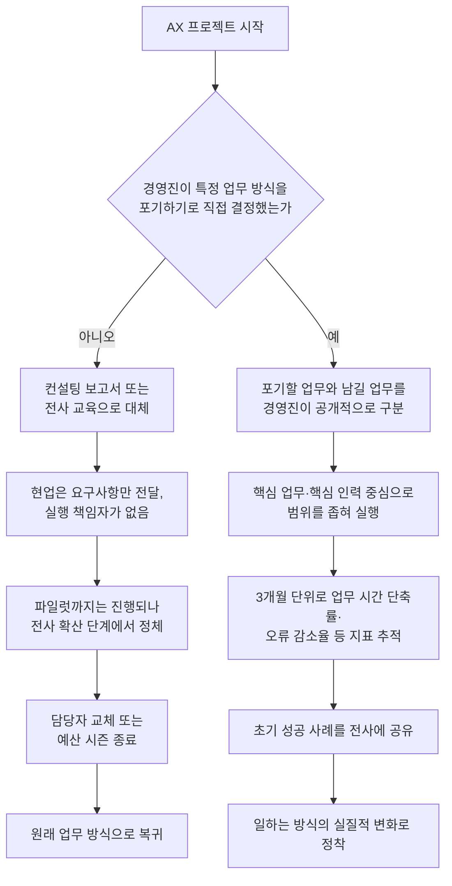

> 
> "컨설팅 3개월 받고 남은 건 PDF 한 개였음" — 어느 대표님.
> 
> 솔직히 그 말 반박 못 함. 외부에서 아무리 깊게 들어가도 절대 못 만드는 게 하나 있음. 우리 회사가 뭘 포기할지 정하는 일.
> 
> AX는 결국 기존 업무 방식을 하나씩 버리는 과정인데, 뭘 버릴지는 그 일로 20년 먹고산 사람만 안다. 컨설턴트는 "이 프로세스 비효율적입니다"까진 말해도 "그거 없애도 회사 안 망함"은 못 말함. 책임을 못 지니까.
> 
> 그래서 진짜 시작점은 툴 선정 회의가 아니라, 대표가 "이건 안 해도 된다"고 도장 찍는 순간임. 그거 없이 시작한 프로젝트는 6개월 뒤 원래 방식으로 돌아가 있더라.
> 
> 당신 회사는 뭘 버릴 수 있어?
> 
> AX
> 
>  https://www.threads.com/share/BAgc6NfMJB/
> 

## 이 글이 다루는 이야기

최근 소셜미디어에서 퍼진 짧은 글이 하나 있다. 어느 대표가 남긴 말이라며 소개된 문장은 이랬다. "컨설팅 3개월 받고 남은 건 PDF 한 개였음." 글쓴이는 이 말을 반박할 수 없다고 인정하면서, 외부 컨설턴트가 아무리 깊게 들어가도 절대 대신해줄 수 없는 일이 하나 있다고 주장한다. 바로 "우리 회사가 뭘 포기할지 정하는 일"이다.

글의 핵심 논지는 이렇게 이어진다. AI 전환(AX)은 결국 기존 업무 방식을 하나씩 버리는 과정인데, 무엇을 버려도 되는지는 그 일을 오래 해온 내부 사람만 판단할 수 있다는 것이다. 컨설턴트는 "이 프로세스가 비효율적입니다"까지는 말할 수 있어도 "그거 없애도 회사 안 망합니다"라는 말은 하지 못한다. 그 결정에 대한 책임을 질 수 없는 위치이기 때문이다. 그래서 진짜 AX의 출발점은 툴을 고르는 회의가 아니라, 대표이사가 "이건 안 해도 된다"고 스스로 결정하고 도장을 찍는 순간이라는 것이 글의 결론이다. 그 결정 없이 시작된 프로젝트는 몇 달 뒤 원래 방식으로 되돌아가 있더라는 관찰도 덧붙여져 있다.

이 문장 자체는 익명의 개인 경험담이라 사실관계를 검증할 방법이 없다. 다만 이 글이 짚은 구조적 문제—컨설팅과 교육만으로는 조직이 움직이지 않는다는 것, 결국 리더의 결단이 있어야 한다는 것—는 실제로 국내외 여러 조사기관과 현업 실무자들의 보고서에서 반복적으로 확인되는 패턴이다. 아래에서는 그 근거를 하나씩 짚어본다.

---

## "PDF 한 장"으로 끝나는 프로젝트, 얼마나 흔한가

먼저 이 이야기가 예외적인 사례인지부터 확인할 필요가 있다. 결론부터 말하면, 전혀 예외적이지 않다.

미국 RAND 연구소의 조사에 따르면 기업 AI 프로젝트의 80% 이상이 실패로 끝나며, 이는 일반적인 기술 프로젝트 실패율의 두 배에 달하는 수준이다. 맥킨지의 2025년 AI 현황 보고서는 더 극적인 수치를 제시한다. 전 세계 기업의 88%가 이미 AI를 도입했지만, 그중 실질적인 성과를 냈다고 답한 기업은 6%에 불과했다. 국내 사정도 크게 다르지 않다. 팀스파르타가 2026년에 발표한 기업 AX 교육 트렌드 리포트에서는 체계적으로 AI를 실행하고 있다고 볼 수 있는 기업이 전체의 3.6%에 그친다는 결과가 나왔고, 업계 정리 자료들이 인용하는 딜로이트의 2026년 보고서 역시 AI 도입 성과를 기대한 기업은 74%였지만 실제로 성과를 만들어낸 곳은 20% 수준에 머물렀다고 전한다.

리서치 기관 가트너는 한발 더 나아가 구체적인 경고를 내놓았다. AI에 적합한 데이터 관리 체계를 갖추지 못한 조직은 2026년까지 진행 중인 AI 프로젝트의 60%를 폐기하게 될 것이라는 전망이다. 프리랜서 매칭 플랫폼 크몽의 AX 상담 사례에서도 비슷한 하소연이 반복된다고 한다. "AI를 도입했는데 아무것도 바뀌지 않았다, 돈만 썼다"는 상담이 신규 문의에서 자주 나오는 유형 중 하나이며, 그 안을 들여다보면 기술은 납품받았지만 아무도 쓰지 않거나, 시범 적용(파일럿)까지는 성공했지만 전사 확산 단계에서 멈춰버리는 경우가 공통적으로 발견된다는 것이다.

즉 "3개월 걸려 PDF 한 장"이라는 표현은 과장이 아니라, 여러 조사에서 반복 확인되는 실패율의 체감판이라고 볼 수 있다.

---

## 왜 컨설턴트는 "안 해도 된다"고 말하지 못하는가

그렇다면 왜 이런 구조가 반복되는가. 여기서 원문 글의 논지가 힘을 얻는다. 컨설턴트가 "이건 없애도 된다"는 말을 하지 못하는 이유는 단순히 소극적이어서가 아니라, 구조적으로 그 말을 할 자격이 없기 때문이다.

한국앤컴퍼니그룹의 디지털전략실 임원이 2026년 5월 '엔터프라이즈 AI 서울' 행사에서 밝힌 방향도 같은 맥락이다. AX는 단순히 AI 기능을 시스템에 추가하는 일이 아니라, 기업의 의사결정과 운영 방식 자체를 데이터 기반 체계로 바꾸는 조직 운영 방식·업무 프로세스 전반의 체질 개선이라는 점이 강조됐다. 문제는 이 체질 개선의 대상, 즉 "무엇을 그만둘 것인가"를 결정하는 일은 그 업무를 20년간 해온 현업 담당자와, 그 결과에 책임을 지는 경영진의 몫이라는 데 있다. 외부 컨설턴트는 프로세스의 비효율을 진단할 수는 있어도, 그 프로세스를 없앴을 때 발생할 위험을 대신 짊어질 수 없다. 책임질 수 없는 결정은 권고안에 머물 뿐, 실행으로 이어지지 않는다.

이뉴스24가 보도한 한 교수의 분석도 이 지점을 뒷받침한다. AX 성공 조건으로 꼽히는 것은 기술 도입 자체가 아니라 사업 재설계였다. AI를 비용 절감이나 인력 감축 수단으로만 접근한 기업들은 장기적으로 성과를 내기 어려웠다는 진단과 함께, 주요 그룹 총수들이 AX에 직접 나서고 있다는 사실 자체가 이 과제를 기업 생존과 직결된 문제로 보고 있다는 방증이라는 해석이 제시됐다.

---

## 실패하는 조직의 공통 패턴 다섯 가지

팀스파르타의 AX사업본부장이 2026년 7월 조선에듀에 기고한 연재글은 수많은 AX 컨설팅 현장을 거치며 반복적으로 관찰된 실패 패턴 다섯 가지를 정리했다. 이 목록은 원문 글이 말한 "책임질 수 있는 결정이 없으면 원래대로 돌아간다"는 주장과 정확히 맞닿아 있다.

**첫째, 전 직원 교육에만 힘을 쏟는다.** 교육 이수율과 실제 성과는 비례하지 않는다. 조직의 변화는 언제나 핵심 업무와 그 업무를 결정하는 리더에서부터 시작되는데, 정작 이 리더들이 가장 바쁘다는 이유로 학습 기회를 놓치는 경우가 많다.

**둘째, 기술을 IT 조직만의 과제로 떠넘긴다.** 가트너가 임원들을 대상으로 실시한 설문에서 동료 임원이 AI에 능숙하다고 답한 비율은 26%에 그쳤고, 최고정보책임자(CIO)의 44%, 최고정보보호책임자(CISO)의 46%만이 CEO가 요구하는 수준의 AI 지식을 갖췄다는 평가를 받았다. 기술을 전담하는 임원들조차 이 정도 수준이라면, 실무를 IT에만 맡겨두는 방식으로는 격차가 메워지지 않는다.

**셋째, 배우기만 하고 직접 풀어보지 않는다.** 지식 전달형 교육에 그치고, 실제 업무 데이터를 다루는 캡스톤 프로젝트나 해커톤 같은 실전형 문제 해결 경험으로 이어지지 않는 경우다.

**넷째, 도입 자체를 성과로 착각한다.** 라이선스를 구매하고 시스템을 구축한 순간 프로젝트가 끝났다고 여기는 경우로, 명확한 핵심성과지표(KPI)와 실행 로드맵 없이 시작된 프로젝트는 담당자가 바뀌거나 예산 시즌이 지나면 조용히 방치된다.

**다섯째, 구성원의 불안을 외면한다.** "이 도구가 들어오면 내 역할이 사라지는가"라는 질문에 조직이 명확히 답하지 못하면, 겉으로는 따르는 척하면서 익숙한 방식을 고수하는 보이지 않는 저항이 생긴다.

---

## 흐름으로 보는 분기점

아래 흐름도는 앞서 정리한 내용을 하나의 의사결정 경로로 압축한 것이다. 갈림길은 기술 도입 시점이 아니라, 그보다 훨씬 앞선 "누가 무엇을 포기하기로 결정했는가"에 있다.

---

## 실패 경로와 성공 경로 비교

| 구분 | 정체되는 프로젝트 | 정착되는 프로젝트 |
|---|---|---|
| 출발점 | 툴 선정 회의, 컨설팅사 선정 | 경영진의 "이건 안 해도 된다" 결정 |
| 결정 주체 | 외부 컨설턴트 또는 IT 부서 | 업무를 가장 잘 아는 현업 리더와 경영진 |
| 초기 대상 | 전 직원 일괄 교육 | 핵심 업무·핵심 인력으로 범위를 좁힘 |
| 성과 측정 | 도입률, 교육 이수율, 계정 수 | 업무 시간 단축률, 오류 감소율 등 3개월 단위 추적 |
| 조직 반응 | 겉으로만 따르는 보이지 않는 저항 | 역할 변화를 구체적으로 설명해 불안을 참여로 전환 |
| 결과물 | 책장에 꽂히는 보고서 | 일하는 방식 자체의 변화 |

---

## 팩트체크: 원문 주장과 검증 자료

| 원문 속 표현 | 성격 | 검증 상태 |
|---|---|---|
| "컨설팅 3개월 받고 남은 건 PDF 한 개였음" | 익명 대표의 개인 경험담으로 인용된 문장 | 출처와 당사자를 특정할 수 없어 사실관계 검증 불가 (일화성 진술) |
| 컨설턴트는 "안 해도 된다"를 말하지 못한다 | 저자의 구조적 분석 | 직접 검증된 통계는 아니나, 실패 원인을 다룬 여러 업계 보고서의 논지와 방향이 일치함 |
| AX는 결국 무엇을 버릴지 정하는 과정이다 | 저자의 주장 | 팀스파르타·한국앤컴퍼니그룹 등의 발표 내용과 궤를 같이함(사업 재설계·조직 체질 개선 강조) |
| 도장 없이 시작한 프로젝트는 원래 방식으로 돌아간다 | 저자의 관찰 | 팀스파르타 실패 패턴 분석(4번 항목: 도입을 성과로 착각) 및 크몽 AX 상담 사례와 부합 |
| 기업 AI 프로젝트 80% 이상 실패 | 검색으로 확인된 수치 | RAND 연구소 보고서 인용(2차 출처 경유) — 원 보고서 직접 대조는 이뤄지지 않음 |
| 전 세계 기업 88% AI 도입, 성과 낸 곳 6% | 검색으로 확인된 수치 | 맥킨지 2025년 AI 현황 보고서 인용(2차 출처 경유) |
| 국내 체계적 AI 실행 기업 3.6% | 검색으로 확인된 수치 | 팀스파르타 2026년 기업 AX 교육 트렌드 리포트 |
| 2026년까지 AI 프로젝트 60% 폐기 전망 | 검색으로 확인된 수치 | 가트너 전망치(2차 출처를 통해 확인) |
| 동료 임원 중 26%만 AI 능숙, CIO 44%·CISO 46%만 CEO 요구 수준 충족 | 검색으로 확인된 수치 | 가트너 임원 대상 설문(팀스파르타 기고문 인용) |

표에서 보듯, 원문 글의 핵심 서사(대표의 발언)는 검증 불가능한 일화이지만, 그 위에 쌓인 구조적 주장은 여러 독립된 조사기관과 실무자들의 자료로 뒷받침된다. "일화는 사실 여부를 알 수 없지만, 그 일화가 가리키는 현상은 데이터로 확인된다"는 것이 이 문서의 결론에 가깝다.

---

## 그래서, 무엇을 준비해야 하는가

여러 자료를 종합하면 AX를 시작하기 전에 경영진이 스스로에게 던져야 할 질문은 명확해진다.

- 우리 조직에서 없애도 회사가 망하지 않는 업무 방식은 무엇인가. 이 질문에 답할 수 있는 사람은 컨설턴트가 아니라 그 일을 오래 해온 내부 리더다.
- 전 직원 교육이 아니라, 매출과 고객 경험에 직접 연결된 핵심 업무·핵심 인력부터 좁혀서 시작할 수 있는가.
- 성과를 도입률이 아니라 업무 시간 단축률, 오류 감소율 같은 구체적 지표로 3개월 단위로 추적할 준비가 되어 있는가.
- "이 도구가 들어오면 내 역할은 사라지는가"라는 구성원의 질문에 조직 차원에서 구체적으로 답할 수 있는가.
- 기술 로드맵을 IT 부서에만 맡기지 않고, 사업 부서와 경영진이 처음부터 함께 설계하는 거버넌스가 있는가.

이 질문들에 답하지 못한 채 시작된 프로젝트는, 여러 조사기관이 공통적으로 지적하듯 몇 달 뒤 조용히 원래 업무 방식으로 돌아갈 가능성이 높다.

---

## 참고 자료

- 박영진, "[박영진의 AI 인재전략] AX 전환이 실패하는 조직의 특징", 조선에듀, 2026년 7월 9일 (스파르타클럽 브런치 재게재, 2026년 7월 22일)
- "AX 전환 실패율 80%, 기업 해커톤이 뒤집습니다", EO(이오플래닛), 2026년 5월 31일 — RAND 연구소·맥킨지 2025 AI 현황 보고서 인용
- "AX 성공 기업이 갖춘 세 가지 데이터 조건", 스파르타클럽 브런치 — 가트너·IBM·Capital One 조사 인용
- "AX 컨설팅 업체 선택 기준 5가지 [크몽 AX 인사이트]", 크몽로그 (EO 이오플래닛 재게재)
- "한국앤컴퍼니그룹, AX 혁신 아젠다 제시…AI, 실질적 업무 성과와 연결", 헤럴드경제, 2026년 5월 27일
- "[현장] 오픈AI·팔란티어·코히어가 제시한 AX 시대 기업 생존 조건은?", 지디넷코리아(다음뉴스 게재), 2026년 5월 27일
- 이뉴스24, AX 성공 조건 관련 전문가 인터뷰 기사
- "기업 AX(AI 전환)의 성공 조건 3가지", 브런치, 똑똑한개발자
- "2026 원티드 AX 인사이트 리포트", 원티드
- 교보문고 전자책, AI 전환 관련 저서(2026년 발간) — 기업 88% AI 사용 중이나 전사적 성과 기업은 20% 미만이라는 저자 분석 인용

원문 게시물: Threads (URL: threads.com/share/BAgc6NfMJB)

---

작성일: 2026년 9월 5일
