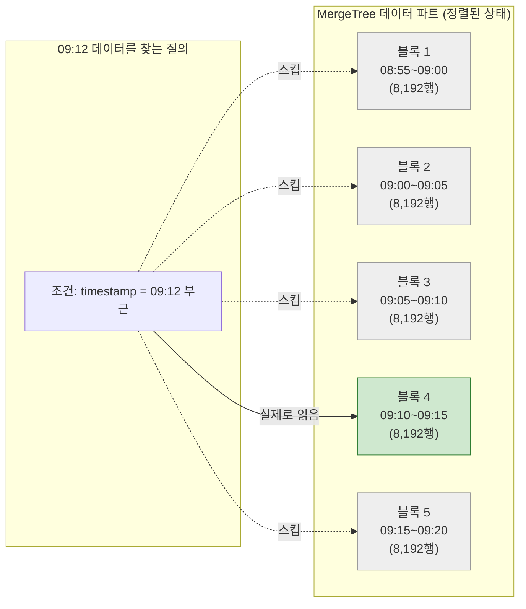
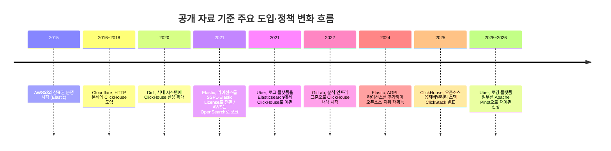
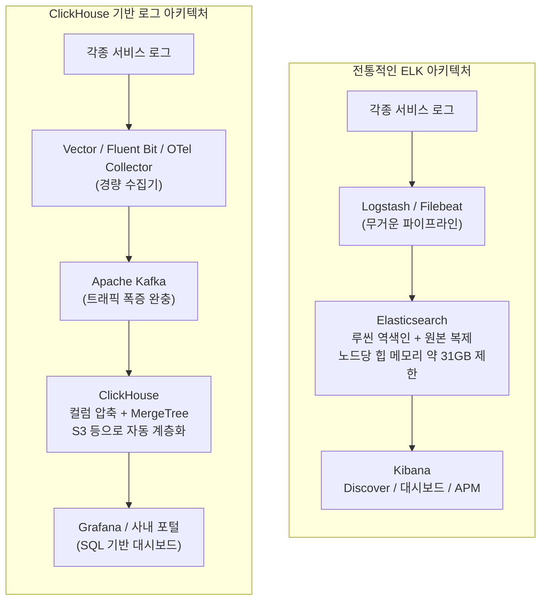
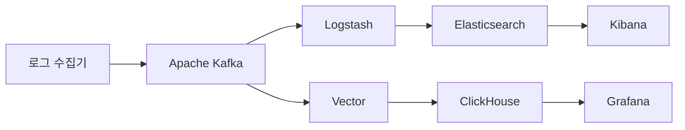

*최종 검토: 2026년 9월 6일 · 원문 출처(Threads 게시물 및 블로그) 내용을 바탕으로 공개된 1차·2차 자료를 교차 검증하여 재구성한 해설 문서입니다.*

> 
> https://www.threads.com/share/_ycjRjumg/
> 
> 요즘 업계에서 ELK 대신 클릭하우스로 전환하고 있는 분위기
> 
> - ELK 대비 인프라 비용의 혁신적인 절감(최대 70~90%)
> - 수십억 건 대용량 통계/집계의 초고속 처리
> - ELK와 달리 강력한 표준 SQL 지원
> - 초당 수십만 건 폭증하는 로그의 안정적 적재
> - 우버, 클라우드플레어, 이베이, 깃랩외 수많은 이커머스, 핀테크 유니콘 기업들까지 앞다투어 로그 및 시계열 분석의 중심축을 ClickHouse로 전환중
> - 오픈소스이므로 언제든 설치 사용 가능, 단 대시보드 환경은 별도 구성 필요
> 
> 인프라, 백엔드 담당자라면 로컬에 클릭하우스 한번 체험해보는 것도 좋을듯
> 
> https://tailwind-nextjs-starter-blog.vercel.app/blog/20260905-elk-to-clickhouse
> 

---

## 이 문서에 대하여

이 문서는 "요즘 업계에서 ELK 대신 ClickHouse로 전환하고 있다"는 취지의 Threads 게시물과, 같은 저자가 작성한 블로그 글("ELK에서 ClickHouse로: 대규모 로그·이벤트 분석 아키텍처 전환 이유와 비교 분석")의 내용을 상세하게 풀어 설명하는 것을 목적으로 합니다. 다만 원문에 등장하는 기업 사례나 수치는 그대로 옮기지 않고, 각각을 실제 공개된 엔지니어링 블로그·공식 문서·업계 보도와 대조하여 사실 여부를 확인한 뒤 서술했습니다. 확인되지 않은 부분은 "확인되지 않음"이라고 명시했고, 최근 들어 상황이 바뀐 부분(라이선스 정책, 일부 기업의 재전환 등)은 최신 정보로 갱신했습니다. 참고로 원문이 게시된 두 개의 링크(Threads, 블로그)는 로봇 접근이 차단되어 있거나 서버 오류가 발생해 직접 열람할 수 없었기 때문에, 사용자가 제공한 본문 텍스트와 별도의 공개 검색 결과를 근거로 이 문서를 작성했습니다.

---

## 1. 무슨 이야기를 하고 있는 글인가 — 핵심 요약

원문이 전달하려는 메시지는 단순합니다. 지난 10여 년간 로그와 이벤트 데이터를 다루는 업계의 사실상 표준이었던 ELK(Elasticsearch, Logstash, Kibana) 스택이, 최근에는 ClickHouse라는 컬럼 지향 분석 데이터베이스로 빠르게 대체되고 있다는 것입니다. 그 근거로 원문은 다음 다섯 가지를 제시합니다.

첫째, ELK 대비 인프라 비용을 최대 70~90% 수준까지 절감할 수 있다는 점입니다. 둘째, 수억에서 수십억 건에 이르는 대용량 로그를 집계하고 통계를 내는 작업이 훨씬 빠르다는 점입니다. 셋째, ClickHouse는 표준 SQL(정확히는 SQL에 가까운 자체 방언)을 지원해 학습 장벽이 낮다는 점입니다. 넷째, 초당 수십만 건씩 폭증하는 로그를 안정적으로 받아낼 수 있다는 점입니다. 다섯째, 우버·클라우드플레어·이베이·깃랩 등 글로벌 빅테크와 다수의 이커머스·핀테크 기업들이 이미 이 전환을 실행에 옮기고 있다는 점입니다. 마지막으로 ClickHouse는 오픈소스이므로 누구나 로컬 환경에서 바로 설치해 체험해볼 수 있지만, Kibana처럼 완성된 대시보드 UI는 따로 없기 때문에 Grafana 같은 시각화 도구를 별도로 붙여야 한다는 실무적 조언으로 마무리됩니다.

이 다섯 가지 주장 하나하나가 실제로 어느 정도까지 사실인지, 그리고 그 이면에 있는 기술적 원리는 무엇인지를 아래에서 차례로 짚어보겠습니다.

---

## 2. 왜 이런 전환이 일어나는가 — 두 시스템이 세상을 보는 방식의 차이

### 2-1. 도서관 사서와 회계사 비유

원문은 Elasticsearch를 "책 속의 단어를 찾아주는 도서관 사서"에, ClickHouse를 "장부에서 특정 열만 짚어 계산하는 회계사"에 비유합니다. 이 비유는 실제 두 시스템의 내부 구조를 상당히 정확하게 반영하고 있습니다.

Elasticsearch의 검색 엔진은 아파치 루씬(Apache Lucene)입니다. 루씬은 문서가 들어올 때마다 문장을 단어 단위로 쪼개어, 어떤 단어가 어떤 문서에 들어있는지를 미리 목록으로 만들어 둡니다. 이를 역색인(Inverted Index)이라고 부릅니다. 도서관 사서가 책 뒤편에 색인 카드를 만들어 두는 것과 같은 방식으로, 사람이 입력하는 자연어 검색어에 대해 관련도 점수를 매기고 오타를 보정해가며 가장 알맞은 문서를 찾아주는 데 최적화되어 있습니다.

반면 ClickHouse는 OLAP(Online Analytical Processing, 온라인 분석 처리)에 특화된 데이터베이스입니다. 일반적인 데이터베이스가 한 사람의 정보(이름, 나이, 주소 등)를 가로 한 줄로 묶어 저장하는 것과 달리, ClickHouse는 '이름'만 모아둔 파일, '나이'만 모아둔 파일처럼 세로 한 열 단위로 데이터를 나누어 저장합니다. 이를 컬럼 지향 저장소(Columnar Storage)라고 부르며, 이는 ClickHouse 고유의 발명이 아니라 Vertica, Google BigQuery, Amazon Redshift 등 기존 OLAP 데이터베이스들이 공유하는 오래된 설계 철학입니다. ClickHouse의 특별함은 이 철학을 오픈소스로, 그리고 매우 공격적인 성능 튜닝과 함께 구현했다는 데 있습니다.

### 2-2. 운영팀이 실제로 던지는 질문의 성격

원문의 핵심 논지는, 실무에서 로그 시스템에 던지는 질문의 대다수가 "특정 단어가 어디에 있는지 찾아줘"가 아니라 "특정 시간대·특정 서비스로 범위를 좁힌 뒤 개수를 세거나 평균·백분위수를 계산해줘"라는 통계성 질의라는 것입니다. 예를 들어 "새벽 2시부터 3시 사이의 에러 로그를 보여줘", "결제 API의 p99 지연 시간을 그래프로 그려줘" 같은 질문들입니다.

이런 유형의 질의는 굳이 형태소 분석이나 관련도 점수 계산 같은 무거운 전문 검색 기능을 필요로 하지 않습니다. 그런데 ELK 스택으로 이런 질의를 처리하면, 시스템은 매번 역색인을 만들고 원본 문서를 별도로 복제해 저장하는 등, 통계 계산에는 필요하지 않은 부가 작업을 함께 짊어지게 됩니다. 이 지점이 바로 최근 몇 년간 옵저버빌리티(observability, 시스템 관측성) 업계에서 "우리가 지금 쓰고 있는 도구가 우리 문제에 비해 지나치게 무겁다"는 문제의식이 확산된 배경입니다. 실제로 ClickHouse 사가 2026년에 발간한 옵저버빌리티 비용 최적화 관련 자료에서도, 높은 관측성 비용과 느린 대시보드는 가격 문제가 아니라 아키텍처 실패의 신호라고 지적하며 ELK나 LGTM(Loki·Grafana·Tempo·Mimir) 같은 분절된 스택을 하나의 컬럼형 저장소로 통합할 것을 권고하고 있습니다.

---

## 3. ClickHouse는 왜 이렇게 빠르고 저렴한가 — 네 가지 설계 원칙

원문이 설명하는 ClickHouse의 속도 비결은 대체로 정확한 기술 설명입니다. 이를 조금 더 체계적으로 정리하면 다음 네 가지 원칙으로 압축됩니다.

**첫째, 필요한 열만 읽는다.** 만약 로그 테이블에 50개의 컬럼이 있는데 '응답 시간의 평균'만 구하고 싶다면, ClickHouse는 디스크에서 해당 컬럼 하나만 읽어옵니다. 문서 전체를 통째로 읽어야 하는 행 기반 시스템이나 Elasticsearch에 비해 물리적으로 읽어야 할 데이터 양 자체가 극적으로 줄어듭니다.

**둘째, 같은 성격의 데이터끼리 모여 있어 압축 효율이 매우 높다.** 시간처럼 연속적으로 증가하는 값은 이전 값과의 차이만 저장하는 델타 인코딩 방식으로, 로그 레벨(INFO/WARN/ERROR)처럼 반복되는 문자열은 사전 기반의 LowCardinality 인코딩으로 압축합니다. 그 결과 원본 대비 5배에서 10배, 조건에 따라 그 이상까지 압축되는 경우도 보고됩니다. 반면 Elasticsearch는 빠른 검색을 위한 역색인과, 통계 계산을 위한 컬럼 캐시(doc_values)를 원본 JSON과 별도로 함께 유지하기 때문에 저장 공간이 원본보다 오히려 불어나는 경향이 있습니다.

**셋째, CPU의 SIMD(Single Instruction Multiple Data) 명령어를 적극적으로 활용한 벡터화 연산을 수행한다.** 숫자를 하나씩 처리하는 대신 한 번의 CPU 명령으로 여러 개의 값을 동시에 계산함으로써 집계 속도를 끌어올립니다.

**넷째, 촘촘한 인덱스 대신 희소 인덱스(Sparse Index)와 정렬 키를 사용해 불필요한 데이터 블록을 통째로 건너뛴다.** 아래 다이어그램은 이 스킵 동작의 개념을 보여줍니다.

이 방식은 정렬 키(ORDER BY로 지정한 컬럼)를 기준으로 데이터가 물리적으로 정렬되어 저장되어 있기 때문에 가능합니다. 약 8,192행마다 하나의 표식(mark)만 남기고, 조건에 맞지 않는 구간은 아예 열어보지도 않고 건너뜁니다. 이 인덱스 구조는 워낙 가벼워서 수십억 건 규모의 인덱스도 서버 메모리에 손쉽게 올라갑니다.

다만 이 원칙에는 중요한 전제가 하나 있습니다. 스킵이 효율적으로 작동하려면 질의 조건이 정렬 키와 맞아떨어져야 한다는 점입니다. 정렬 키와 무관한 컬럼으로 필터링하면 ClickHouse도 전체 테이블을 훑어야 하므로, 테이블 설계 시 어떤 컬럼으로 자주 조회할지를 미리 고려해 ORDER BY를 설계하는 것이 실무에서 성능을 좌우하는 핵심 작업입니다.

---

## 4. 실제로 전환한 기업들 — 확인된 사례와 확인되지 않은 사례

원문은 "우버, 클라우드플레어, 이베이, 깃랩 외 수많은 이커머스·핀테크 유니콘 기업들이 앞다투어 전환 중"이라고 서술합니다. 이 부분은 개별 기업 단위로 검증이 필요한 대목이라, 공개된 엔지니어링 블로그와 공식 문서를 하나씩 확인했습니다.

**클라우드플레어(Cloudflare)** 는 가장 오래되고 확실하게 검증되는 사례입니다. 2018년 자사 블로그를 통해 초당 600만 건의 HTTP 요청 분석을 ClickHouse로 처리한다고 공개한 이래, 2026년 현재 자체 블로그에서 수십 개의 클러스터에 걸쳐 100페타바이트가 넘는 데이터를 ClickHouse에 저장하고 있다고 밝히고 있습니다. 다만 클라우드플레어는 로그 저장을 위해 애초부터 Elasticsearch를 메인으로 쓰다가 걷어낸 것이 아니라, 2016~2018년 무렵부터 대규모 분석 워크로드를 위해 처음부터 ClickHouse를 도입한 초기 채택자(early adopter)에 가깝습니다.

**우버(Uber)** 의 사례는 조금 더 복잡한 서사를 갖고 있습니다. 우버는 2021년 자사 기술 블로그에서 로그 분석 플랫폼을 구축하며 ClickHouse를 채택했다고 소개했는데, 이 글에서 우버 엔지니어들은 Elasticsearch가 우버 규모의 로깅 워크로드를 감당하기에는 운영·하드웨어 비용이 지나치게 커서 결국 이관할 수밖에 없었다고 명시적으로 밝힌 바 있습니다. 그런데 최근 자료를 보면 이야기가 한 번 더 전개됩니다. 업계 분석 자료에 따르면 우버는 'Sawmill'이라는 이름의 로깅 플랫폼을 ClickHouse에서 Apache Pinot으로 다시 이관하는 작업을 진행 중이며, 여기에 더해 정형화되지 않은 대용량 로그(Spark 생태계 로그 등)에 대해서는 CLP(Compressed Log Processor)라는 자체 개발 압축 기법을 도입해 169배에 달하는 압축률을 달성했다고 밝혔습니다. 즉 우버의 여정은 "Elasticsearch에서 ClickHouse로 한 번 옮기고 끝"이 아니라, 로그의 성격(정형/비정형)과 워크로드 특성에 따라 최적의 저장소를 계속해서 재평가하고 있는 현재진행형 사례로 이해하는 것이 정확합니다.

**깃랩(GitLab)** 은 2022년부터 ClickHouse를 도입해 현재는 Contribution Analytics, CI/CD 분석, GitLab Duo(AI 기능) 사용 지표 추적 등 여러 분석 기능의 표준 저장소로 삼고 있음을 공식 문서와 기술 블로그를 통해 밝히고 있습니다. 다만 이는 로그 검색 대체라기보다는 자사 제품 내 분석 기능을 위한 OLAP 데이터베이스 채택에 가까우며, 트랜잭션 데이터는 여전히 PostgreSQL이 담당하는 이원화 구조입니다.

**디디추싱(Didi), 그리고 언급되는 JD.com·씨트립(Ctrip)·빌리빌리(Bilibili)** 역시 ClickHouse 공식 기술 블로그에 실린 사례 연구를 통해 확인됩니다. 디디추싱은 2024년 발표한 글에서 Elasticsearch의 쓰기 처리량 병목과 저장 비용 문제로 로그 검색 시스템을 ClickHouse로 이관했으며, 이를 통해 옵저버빌리티 하드웨어 비용을 30% 이상 절감했다고 밝혔습니다.

**이베이(eBay)** 에 대해서는 공개된 자료로 직접적인 확인이 되지 않았습니다. 이베이가 공개적으로 소개해온 실시간 분석 스택은 자체 개발한 스트림 처리 프레임워크인 Pulsar(오픈소스로 공개됨, 메시징 시스템인 Apache Pulsar와는 다른 프로젝트)이며, 여기에 연동되는 저장소로는 주로 Druid와 Cassandra가 언급됩니다. 이베이가 Elasticsearch를 사내 서비스형으로 운영해온 사례는 확인되지만, ClickHouse로의 전환을 다룬 이베이 자체의 공개 자료는 검색되지 않았습니다. 따라서 이 부분은 원문의 주장을 그대로 사실로 단정하기보다는 "공개 자료로는 확인되지 않는 사례"로 분류해두는 것이 정직한 태도라고 판단했습니다.

이 밖에도 SigNoz, VictoriaLogs 같은 오픈소스 옵저버빌리티 도구들이 ClickHouse를 기본 저장 엔진으로 채택하고 있고, ClickHouse 사 스스로도 2025년 5월 ClickStack이라는 이름의 오픈소스 옵저버빌리티 스택(ClickHouse + OpenTelemetry + HyperDX)을 발표하며 이 흐름을 제품화하고 있습니다. 종합하면, "다수의 빅테크가 로그·이벤트 분석의 중심을 ClickHouse 계열로 옮기고 있다"는 원문의 큰 방향성 자체는 여러 독립적인 사례로 뒷받침되지만, 개별 기업명을 하나하나 인용할 때는 이처럼 사례별 맥락과 최신 동향까지 함께 확인할 필요가 있습니다.

---

## 5. ELK 운영의 실질적 고통 — 그리고 최신 라이선스 상황

### 5-1. JVM 힙 메모리와 가비지 컬렉션 정지

Elasticsearch는 자바로 작성되어 JVM 위에서 동작합니다. 자바의 포인터 압축 기술(Compressed Ordinary Object Pointers) 특성상 힙 메모리를 약 32GB 이상으로 늘리면 오히려 메모리 관리 효율이 떨어지기 때문에, 실무에서는 노드당 힙 메모리를 31GB 안팎으로 제한하는 것이 오랜 관행으로 자리잡았습니다. 이 때문에 물리 서버에 128GB, 256GB의 메모리를 꽂아도 Elasticsearch 노드 하나가 이를 온전히 활용하지 못하고, 한 대의 서버 안에 여러 노드를 쪼개어 띄우는 방식으로 대응해야 하는 경우가 많습니다. 대규모 집계 질의가 몰릴 때 가비지 컬렉터가 전체 작업을 일시 정지시키는 현상(이른바 'Stop-the-world')이 발생하면 노드가 클러스터에서 일시적으로 이탈하는 문제로 이어지기도 합니다.

ClickHouse는 순수 C++로 작성되어 있어 가비지 컬렉터 자체가 존재하지 않습니다. 메모리 사용량은 질의별로 설정된 제한값에 따라 관리되며, 제한을 초과하면 해당 질의만 오류를 내고 종료될 뿐 노드 전체가 멈추는 구조는 아닙니다. 이 부분은 오랫동안 Elasticsearch 대규모 운영자들 사이에서 널리 알려진 운영상의 어려움이며, 기술적으로도 잘 뒷받침되는 설명입니다.

### 5-2. 스토리지 비용과 계층화

ClickHouse는 로컬 SSD와 Amazon S3, MinIO, Google Cloud Storage 같은 오브젝트 스토리지를 하나의 저장소 정책 안에서 함께 다루는 기능을 공식적으로 지원합니다. 최근 며칠치 데이터는 빠른 로컬 디스크에 두고, 일정 기간이 지난 데이터는 자동으로 저렴한 오브젝트 스토리지로 옮기면서도 조회 질의는 동일한 SQL로 그대로 사용할 수 있습니다. 이 계층화 기능 덕분에 장기 보관이 필요한 로그를 값비싼 SSD에 무한정 쌓아두지 않아도 된다는 점은, 클라우드 비용 절감(FinOps)이 화두인 요즘 상황과 맞물려 전환을 이끄는 실질적인 동기가 되고 있습니다.

### 5-3. 라이선스 이슈 — 2021년의 SSPL 전환과 2024년의 방향 전환

원문은 "2021년 Elastic이 SSPL로 라이선스를 바꾸면서 라이선스 리스크에 대한 불안감이 커졌고, 이로 인해 AWS 진영이 OpenSearch로 갈라져 나왔다"고 설명합니다. 이는 역사적 사실로 정확합니다. 2021년 초 Elastic은 AWS와의 상표권 관련 갈등을 계기로 Elasticsearch와 Kibana를 아파치 2.0 라이선스에서 SSPL(Server Side Public License)과 자체 Elastic License의 이중 라이선스 구조로 전환했고, 그 결과 AWS는 마지막 아파치 2.0 버전을 기반으로 OpenSearch 프로젝트를 별도로 포크했습니다.

다만 여기서 반드시 갱신해야 할 최신 정보가 있습니다. Elastic은 2024년 8월, 기존 SSPL·Elastic License에 더해 OSI(Open Source Initiative)가 승인한 AGPL v3(GNU Affero General Public License) 라이선스를 하나의 선택지로 추가했습니다. Elastic 창업자 겸 CTO인 샤이 바논(Shay Banon)은 이를 두고 "OSI가 승인한 오픈소스 라이선스를 다시 도입하게 되어 기쁘다"고 밝혔으며, 이로써 Elasticsearch와 Kibana는 공식적으로 다시 오픈소스로 분류될 수 있게 되었습니다. 기존 SSPL·Elastic License 사용자에게는 변화가 없고 바이너리 배포 방식도 그대로 유지되지만, 새로운 사용자나 커뮤니티 기여자에게는 AGPL이라는 익숙한 오픈소스 라이선스 선택지가 열린 것입니다. 따라서 "Elastic의 라이선스 정책 때문에 불안하다"는 이유만으로 전환을 검토하고 있다면, 2024년 이후의 이러한 변화를 함께 고려할 필요가 있습니다. 다만 ClickHouse는 애초부터 지금까지 변함없이 가장 관대한 축에 속하는 아파치 2.0 라이선스를 유지하고 있다는 점에서, 라이선스의 단순성과 예측 가능성 면에서는 여전히 ClickHouse가 우위에 있다고 볼 수 있습니다.

---

## 6. 두 아키텍처의 구조와 특성 한눈에 보기

### 6-1. 데이터 파이프라인 비교

### 6-2. 핵심 특성 비교표

| 비교 항목 | Elasticsearch (ELK) | ClickHouse |
|---|---|---|
| 데이터 저장 방식 | 문서 중심 행 기반(JSON Document) | 분석 중심 열 기반(Columnar) |
| 핵심 인덱싱 원리 | 루씬 역색인(단어→문서 매핑) | 정렬 기반 희소 인덱스 + 스킵 인덱스 |
| 질의 언어 | Query DSL, Lucene Query, ES\|QL | ClickHouse SQL(표준 SQL에 가까운 방언) |
| 디스크 사용량 | 원본 대비 1.2~2배로 증가하는 경향 | 원본 대비 5~10배 이상 압축되는 경향 |
| 대규모 집계·통계 | 상대적으로 느리고 메모리 부담이 큼 | SIMD 벡터 연산으로 매우 빠름 |
| 자연어 전문 검색 | 매우 강력(형태소 분석, 오타 보정, 관련도 점수) | 기본 수준(문자열 포함 검사, 정규식, 블룸 필터) |
| 단일 행 수정·삭제 | 문서 단위 실시간 Update/Delete 가능 | 비동기 뮤테이션 방식, 비용이 큼 |
| 실행 환경 | JVM(가비지 컬렉션 부담 존재) | 순수 C++ 네이티브(GC 없음) |
| 메모리 확장성 | 노드당 약 31GB 힙 권장 상한 | 물리 RAM을 폭넓게 활용 |
| 장기 데이터 보관 | 고가의 고속 스토리지 유지 부담 | 오브젝트 스토리지로 자동 계층화 |
| 라이선스 | SSPL / Elastic License(2024년부터 AGPL 옵션 추가) | Apache License 2.0(변동 없음) |
| 대표적 시각화 도구 | Kibana(자체 내장) | Grafana 등 외부 도구 연동 필요 |

이 표에서 특히 강조할 부분은 마지막 두 행입니다. Elasticsearch는 Kibana라는 완성형 UI가 기본으로 제공되기 때문에 별도 구축 없이 바로 로그를 눈으로 확인할 수 있는 반면, ClickHouse는 데이터베이스 엔진 그 자체이므로 Grafana 같은 시각화 계층을 직접 연결하고 SQL 질의를 작성할 줄 알아야 합니다. 원문에서 "대시보드 환경은 별도 구성이 필요하다"고 짚은 부분은 정확한 지적입니다.

---

## 7. 모든 경우에 정답은 아니다 — ClickHouse의 한계

기술 선택에 만능 해법은 없습니다. ClickHouse에도 명확한 약점이 있으며, 이를 무시하고 무조건적인 전환을 밀어붙이는 것은 또 다른 형태의 실수가 될 수 있습니다.

**진짜 자연어 검색이 필요한 경우**입니다. 사용자가 입력한 오타 섞인 검색어를 보정하고, 한국어 형태소를 분석해 "사과를", "사과가", "사과"를 같은 단어로 인식하며, 검색 의도와의 관련도에 따라 결과를 정렬해야 하는 작업은 여전히 Elasticsearch의 영역입니다. ClickHouse도 토큰 기반 블룸 필터나 정규식 검색 같은 문자열 검색 기능을 제공하지만, 이는 어디까지나 "이 블록에 이 문자열이 존재하는가"를 빠르게 판별하는 수준이지, 의미 기반의 전문 검색 엔진이 하는 역할을 대체하지는 못합니다.

**개별 행을 즉시 수정하거나 삭제해야 하는 경우**입니다. ClickHouse는 한 번 쓰인 데이터가 바뀌지 않는 것을 전제로 설계된 추가 전용(Append-only) 시계열 데이터베이스에 가깝습니다. 개인정보 보호 규정에 따라 특정 사용자의 로그를 즉시 삭제해야 하는 상황에서 ALTER TABLE ... DELETE를 실행하면, 해당 조건을 포함하는 데이터 파트 파일 전체를 백그라운드에서 다시 써야 하므로 비용이 상당히 큽니다. 실시간으로 상태가 바뀌는 트랜잭션성 데이터를 ClickHouse에 올리는 것은 권장되지 않습니다.

**완성형 UI와 SQL 학습 곡선의 문제**입니다. Kibana는 비개발자도 마우스 클릭만으로 로그 흐름을 확인할 수 있는 친절한 제품인 반면, ClickHouse는 SQL 작성 능력을 요구합니다. 조직 내에 SQL에 익숙하지 않은 구성원이 많다면 초기 정착 과정에서 상당한 학습 비용이 발생할 수 있습니다.

---

## 8. 현실적인 전환 전략 — 빅뱅이 아니라 점진적 이중화

이미 거대한 규모로 운영되고 있는 ELK 클러스터를 하루아침에 걷어내는 것은 권장되지 않습니다. 실무에서 검증된 접근 방식은 카프카를 완충 지대로 삼아 두 시스템에 동시에 데이터를 흘려보내는 이중 쓰기(Dual-write) 방식입니다.

기존 ELK 기반 모니터링 체계를 그대로 유지한 상태에서 동일한 로그 스트림을 ClickHouse에도 함께 적재하고, Grafana에 동일한 대시보드를 구성해 한두 달간 수치와 누락 여부를 나란히 비교합니다. 속도와 비용 절감 효과가 충분히 검증되고 팀원들이 새로운 도구에 익숙해진 뒤에, 기존 ELK 파이프라인의 보관 기간을 점진적으로 줄여나가며 전환을 마무리하는 것이 안전합니다.

기술적으로 자주 언급되는 실무 팁 두 가지도 짚어둘 필요가 있습니다. 첫째, 긴 에러 메시지 안의 특정 단어를 빠르게 찾고 싶다면 토큰 블룸 필터(tokenbf_v1) 같은 스킵 인덱스를 message 컬럼에 걸어두면, 해당 단어가 들어있지 않은 데이터 블록을 통째로 건너뛸 수 있어 검색 속도가 크게 개선됩니다. 둘째, 테이블을 처음 설계할 때 파티션을 하루 단위로 지나치게 잘게 쪼개는 것은 흔한 실수입니다. 파티션이 과도하게 세분화되면 디스크에 파트 파일이 수만 개로 불어나 백그라운드 병합(merge) 작업이 서버 자원을 크게 잡아먹게 됩니다. 하루 수십 테라바이트 이상의 초대형 트래픽이 아니라면 월 단위 파티션(toYYYYMM)으로 넉넉하게 묶고, 세밀한 시간 조회는 ORDER BY에 포함된 타임스탬프 조건으로 처리하는 편이 훨씬 안정적입니다.

---

## 9. 결론 — 문제의 본질이 무엇인지 먼저 물어야 한다

정리하면, 형태소 분석과 동의어 처리, 오타 보정, 관련도 점수 기반의 전문 검색이 중심이라면 Elasticsearch를 계속 유지하는 것이 합리적입니다. 반대로 수억에서 수십억 건 규모의 로그·메트릭을 초고속으로 집계하고, 스토리지 비용을 여러 배 절감하며, JVM 메모리 관리의 부담에서 벗어나고 싶다면 ClickHouse가 매우 설득력 있는 대안입니다.

다만 이 글에서 확인했듯이, 실제 업계의 흐름은 원문이 그리는 것처럼 "모두가 일제히, 그리고 영구적으로 ClickHouse로 옮겨가는" 단순한 직선적 서사는 아닙니다. 클라우드플레어처럼 처음부터 ClickHouse를 채택해 지금까지 유지·확장하는 사례가 있는가 하면, 우버처럼 한 번 ClickHouse로 옮긴 뒤에도 로그의 성격에 따라 또 다른 저장소(Pinot, 자체 압축 알고리즘)로 워크로드를 계속 재배치하는 사례도 있습니다. Elastic 역시 2021년 라이선스를 좁힌 뒤 2024년에는 오픈소스 라이선스를 다시 넓히는 등, 정책을 고정된 것이 아니라 계속 조정해가고 있습니다. 결국 중요한 것은 특정 기업이 무엇을 썼는지를 그대로 따라가는 것이 아니라, "내가 풀려는 문제가 단어 검색인가, 아니면 시계열 데이터의 대규모 통계 분석인가"를 스스로 물어보고, 그 답에 맞는 도구를 고르는 것입니다.

---

## 10. 용어 해설(Glossary)

- **OLAP(Online Analytical Processing)**: 대량의 데이터를 집계·통계 분석하는 데 최적화된 데이터 처리 방식. 트랜잭션 처리(OLTP)와 대비되는 개념입니다.
- **컬럼 지향 저장소(Columnar Storage)**: 데이터를 가로(행) 단위가 아니라 세로(열) 단위로 묶어 디스크에 저장하는 방식으로, 특정 컬럼만 읽어야 하는 집계 질의에 유리합니다.
- **역색인(Inverted Index)**: 단어를 키로, 그 단어가 등장하는 문서 목록을 값으로 갖는 색인 구조. 전문 검색 엔진의 핵심 자료구조입니다.
- **MergeTree**: ClickHouse의 기본 테이블 엔진 계열로, 데이터를 정렬된 상태로 저장하고 백그라운드에서 여러 데이터 파트를 주기적으로 병합합니다.
- **희소 기본 인덱스(Sparse Primary Index)**: 모든 행이 아니라 일정 간격(기본값 8,192행)마다 표식을 남겨두는 인덱스 방식으로, 인덱스 자체의 크기를 작게 유지하면서 불필요한 데이터 블록을 건너뛸 수 있게 해줍니다.
- **SIMD(Single Instruction Multiple Data)**: 하나의 CPU 명령으로 여러 데이터를 동시에 처리하는 하드웨어 가속 기법.
- **LowCardinality**: 값의 종류가 적은 문자열 컬럼(로그 레벨, 지역명 등)을 정수 사전으로 치환해 저장 공간과 처리 속도를 개선하는 ClickHouse의 압축 기법.
- **SSPL(Server Side Public License)**: 클라우드 사업자가 소프트웨어를 서비스로 제공할 경우 관련 인프라 코드 전체를 공개하도록 요구하는 라이선스로, OSI의 오픈소스 정의를 충족하지 못합니다.
- **AGPL(GNU Affero General Public License) v3**: 네트워크를 통해 소프트웨어를 서비스로 제공하는 경우에도 소스 코드 공개 의무를 부과하는 카피레프트 라이선스로, OSI가 승인한 오픈소스 라이선스입니다.
- **압축 포인터(Compressed Ordinary Object Pointers, Compressed OOPs)**: 자바 객체 참조를 32비트로 압축해 메모리를 절약하는 JVM 기술로, 힙 크기가 일정 수준(통상 32GB 부근)을 넘어서면 이 압축 효과가 사라져 오히려 비효율이 커집니다.
- **가비지 컬렉션(Garbage Collection, GC)**: 더 이상 사용되지 않는 메모리를 자동으로 회수하는 런타임 기능. 자바(JVM) 환경에서는 대규모 회수 작업 중 애플리케이션이 일시 정지되는 현상이 발생할 수 있습니다.
- **ClickStack**: ClickHouse, OpenTelemetry, HyperDX를 결합해 2025년 공개된 오픈소스 옵저버빌리티 스택으로, 로그·메트릭·트레이스를 하나의 컬럼형 데이터베이스에 통합하는 것을 목표로 합니다.

---

## 11. 사실 확인 신뢰도 부록(4단계 기준)

각 주요 서술을 근거의 성격에 따라 4단계로 분류했습니다.

**1단계 — 공식 1차 자료로 확인됨**
- Cloudflare가 2018년부터 ClickHouse를 대규모 HTTP 로그 분석에 사용해왔고, 2026년 현재 100페타바이트 이상의 데이터를 다수 클러스터에 보관 중이라는 사실 (Cloudflare 공식 블로그)
- Uber가 2021년 Elasticsearch에서 ClickHouse 기반 로그 플랫폼으로 이관했다는 사실, 그리고 Elasticsearch가 우버 규모에서 운영·하드웨어 비용 문제를 겪었다는 진술 (Uber 공식 블로그)
- GitLab이 2022년부터 ClickHouse를 분석 인프라 표준으로 채택했고, Contribution Analytics·GitLab Duo 지표 등에 활용 중이라는 사실 (GitLab 공식 문서 및 핸드북, ClickHouse 공식 블로그)
- Didi가 Elasticsearch에서 ClickHouse로 로그 시스템을 이관해 하드웨어 비용을 30% 이상 절감했다는 사실 (ClickHouse 공식 블로그에 게재된 Didi 기고문)
- Elastic이 2021년 SSPL·Elastic License로 전환했고, 2024년 8월 AGPL v3를 추가 옵션으로 도입해 OSI 공인 오픈소스 지위를 재획득했다는 사실 (Elastic 공식 발표 및 다수 IT 매체 보도)
- ClickHouse가 Apache License 2.0을 일관되게 유지하고 있다는 사실 (ClickHouse 공식 GitHub 저장소 라이선스 파일)

**2단계 — 다수 매체·독립 소스로 교차 확인됨**
- 로그 분석 질의의 대다수가 전문 검색보다 시간·조건 기반 집계 통계에 가깝다는 업계의 일반적 인식 (여러 옵저버빌리티 관련 기술 블로그에서 공통적으로 언급)
- ClickHouse의 컬럼 압축률이 원본 대비 5~10배 수준에 이른다는 수치 (ClickHouse 공식 자료 및 제3자 기술 블로그 다수에서 유사한 범위로 보고)
- JD.com, Ctrip, Bilibili 등이 ClickHouse 기반 로그 시스템을 성공적으로 구축했다는 사실 (Didi 기고문 내 언급, ClickHouse 커뮤니티 사례 소개 자료)

**3단계 — 단일 소스 또는 벤더 자체 자료에 의존**
- Cloudflare가 96조 건의 이벤트를 스캔하는 단일 질의를 2초 이내에 처리했다는 구체적 수치 (ClickHouse 자사 블로그에 실린 사례로, 독립적인 제3자 검증 자료는 확인되지 않음)
- 우버가 로깅 플랫폼 'Sawmill'을 ClickHouse에서 Apache Pinot으로 재이관하고 있다는 서술 (경쟁 OLAP 벤더인 StarTree의 분석 자료에 근거하므로, 우버 자체의 공식 확인과 함께 다소 유보적으로 받아들일 필요가 있음)

**4단계 — 확인되지 않음(원문의 주장이나 공개 자료로 뒷받침되지 않음)**
- 이베이(eBay)가 로그·이벤트 분석의 중심을 ClickHouse로 전환했다는 주장. 이베이가 공개한 실시간 분석 스택은 자체 개발 프레임워크인 Pulsar와 Druid, Cassandra 조합이며, ClickHouse 전환을 다룬 이베이 자체의 공개 자료는 검색되지 않았습니다.
- "ELK 대비 인프라 비용을 최대 70~90% 절감"이라는 구체적 절감률. 여러 사례에서 비용 절감이 보고되기는 하나(30%, 5~10배 스토리지 절감 등 사례마다 수치가 상이), "70~90%"라는 특정 범위를 공통적으로 뒷받침하는 벤치마크나 사례 연구는 확인되지 않았습니다. 실제 절감률은 데이터 특성, 보관 기간, 하드웨어 구성에 따라 크게 달라질 수 있습니다.

---

## 12. 참고 자료

- Uber Engineering, "Fast and Reliable Schema-Agnostic Log Analytics Platform" — https://www.uber.com/en/blog/logging/
- Uber Engineering, "Reducing Logging Cost by Two Orders of Magnitude using CLP" — https://www.uber.com/en-GB/blog/reducing-logging-cost-by-two-orders-of-magnitude-using-clp/
- StarTree, "The Evolution of OLAP at Uber: A Journey Toward Consolidation" — https://startree.ai/resources/the-evolution-of-olap-at-uber-a-journey-toward-consolidation/
- Cloudflare Blog, "HTTP Analytics for 6M requests per second using ClickHouse" — https://blog.cloudflare.com/http-analytics-for-6m-requests-per-second-using-clickhouse/
- Cloudflare Blog, "Our billing pipeline was suddenly slow. The culprit was a hidden bottleneck in ClickHouse" — https://blog.cloudflare.com/clickhouse-query-plan-contention/
- ClickHouse Blog, "Trouble will find you: How Cloudflare uses ClickHouse to scale analytics at quadrillion-row scale" — https://clickhouse.com/blog/cloudflare
- ClickHouse Blog, "How GitLab serves sub-second analytics to 50 million users" — https://clickhouse.com/blog/how-gitlab-uses-clickhouse-to-scale-analytical-workloads
- GitLab 공식 문서, "ClickHouse" — https://docs.gitlab.com/integration/clickhouse/
- GitLab Handbook, "ClickHouse Usage at GitLab" — https://handbook.gitlab.com/handbook/engineering/architecture/design-documents/clickhouse_usage/
- ClickHouse Blog, "Didi Migrates from Elasticsearch to ClickHouse for a new Generation Log Storage System" — https://clickhouse.com/blog/didi-migrates-from-elasticsearch-to-clickhouse-for-a-new-generation-log-storage-system
- ClickHouse Resource Hub, "How to engineer cost-efficient open source observability with ClickHouse (ClickStack) — 2026 technical playbook" — https://clickhouse.com/resources/engineering/observability-cost-optimization-playbook
- Dotan Horovits(Medium), "ClickHouse: Breaking the Speed Limit for Observability and Analytics" — https://horovits.medium.com/clickhouse-breaking-the-speed-limit-for-observability-and-analytics-2004160b2f5e
- eBay Innovation Blog, "Announcing Pulsar: Real-time Analytics at Scale" — https://innovation.ebayinc.com/stories/announcing-pulsar-real-time-analytics-at-scale
- IT Brief, "Elastic reintroduces open source licence for Elasticsearch & Kibana" — https://itbrief.co.uk/story/elastic-reintroduces-open-source-licence-for-elasticsearch-kibana
- FOSSA, "Fall 2024 Software Licensing Roundup" — https://fossa.com/blog/fall-2024-software-licensing-roundup
- BigDATAwire, "Elastic Announces Open Source License for Elasticsearch and Kibana Source Code" — https://www.bigdatawire.com/this-just-in/elastic-announces-open-source-license-for-elasticsearch-and-kibana-source-code
- ClickHouse GitHub, "Changelog 2026" (26.3 LTS 등 최신 릴리스 내역) — https://clickhouse.com/docs/whats-new/changelog
- 원문 게시 위치(직접 열람 불가, 사용자 제공 본문 기준): Threads 게시물 https://www.threads.com/share/_ycjRjumg/ 및 블로그 https://tailwind-nextjs-starter-blog.vercel.app/blog/20260905-elk-to-clickhouse

*참고: 위 목록 중 원문 게시 위치로 표시된 두 링크는 접근 제한(로봇 차단) 및 서버 오류로 인해 직접 확인하지 못했습니다. 이 문서의 검증 내용은 사용자가 제공한 본문 텍스트와, 그 밖의 항목들에 대한 별도의 공개 검색 결과에 근거합니다.*
