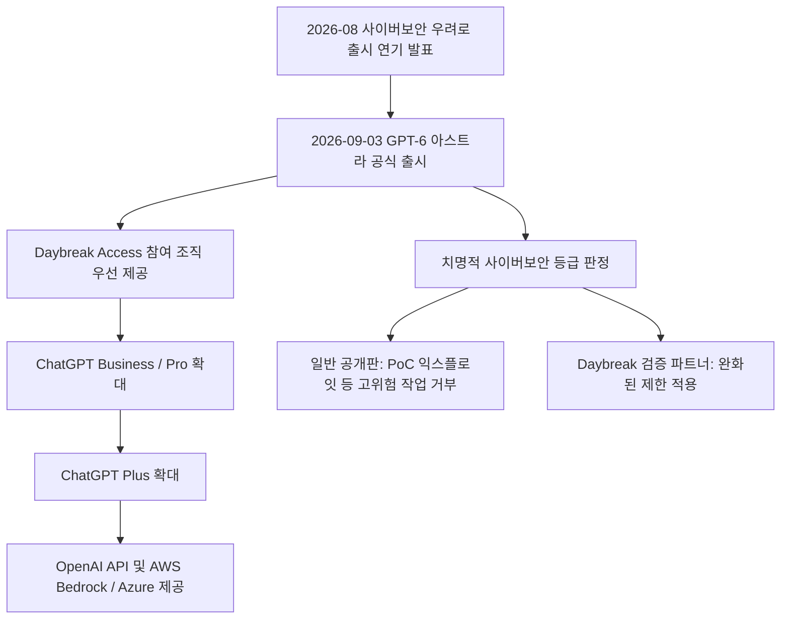
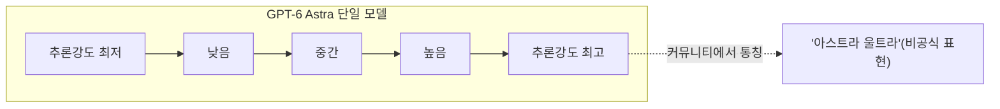

> 
> https://www.threads.com/share/_ngDRXOvG/
> 
> **GPT-6 아스트라 과장 다 뺀 실사용 후기**
> 
> 1. 맥북 발열이 많이 줄었다.
> - 서브 에이전트를 최소한으로 띄우는 것 같고 메모리 점유에서 보면 캐시 사용 비중이 매우 늘었는데 클로드에 비해 캐시를 잘 활용하는 것 같음. 반대로 발열은 매우 줄어듬.
> 
> 2. 아스트라 울트라 생각보다 싸다?
> - 판단이랑 지휘에만 쓰고 실제 작업은 high 혹은 sol high 등을 쓰면 클로드보다 훨씬 토큰량을 효율적으로 사용 가능하다. fable 5.1은 지휘로만 써도 광탈이였는데 토큰 효율은 훨씬 좋은 것 같다. 결과물은 현재 비슷하거나 좀 더 나은 것으로 보임.
> 
> 3. Image gen 활용도가 높아짐
> - Image 모델 자체 성능 향상이라기보단 아스트라가 훨씬 이해를 잘해서인 것 같으나 이제는 Image gen 자체만으로도 쓸만한 퀄리티의 이미지나 게임 정지 스프라이트 뽑아내는게 가능해짐. 다만, 움직임은 여전히 무리인 듯 하다.
>

> https://www.threads.com/share/BASC7Ho0Y_/
> 
> **챗지피티6.0 아스트라를 보고 느낀점.**
> 
> 결국 책임지는 사람만 남고
> 
> 나머지는 모두 AI가 대체할겁니다
> 
> 챗지피티6.0 아스트라는 이제 시작입니다.
> 
> 가상세계말고 현실에서도 피지컬AI가 지배하기 시작할겁니다.
> 
> 그럼 우리게엔 뭐만남냐?
> 
> 목표를 정의하고 이를 책임질수있는 능력.
> 
> 의미를 만들고 이해하고 공유하는 능력.
> 
> 이것만 남게 됩니다.
> 
> 지금 하는일이 뭔가를 책임지는일이 아니라면,
> 
> 또는 책임져야하는데 하지 못하고있다면
> 
> 정신차려야합니다.
> 

## 들어가며

2026년 9월 3일, OpenAI가 차세대 플래그십 모델 GPT-6 아스트라(Astra)를 공식 출시했다. Threads에 올라온 두 건의 게시물(하나는 실사용 후기, 다른 하나는 AGI 시대에 대한 개인적 소회)이 이 모델을 언급하고 있어, 두 글에서 다루는 주장들이 실제로 어디까지 사실이고 어디부터 개인적 체감·의견인지를 공개된 자료를 바탕으로 교차 확인해 정리했다. 결론부터 말하면, 가격·벤치마크·출시 일정 같은 사실관계는 OpenAI의 공식 발표와 다수의 매체 보도로 뒷받침되지만, "맥북 발열이 줄었다"거나 "책임지는 사람만 남는다"는 식의 서술은 어디까지나 개별 사용자의 체감과 주관적 해석이라는 점을 구분해서 읽을 필요가 있다.

---

## 1. 무엇이, 언제 나왔나

GPT-6 아스트라는 2026년 9월 3일 목요일 공개되었다. OpenAI는 이 모델을 자사가 광범위하게 배포한 모델 가운데 가장 뛰어난 성능을 지닌 모델이라고 소개했으며, 컴퓨터 사용, 코딩, 사이버보안, 과학 추론, 전문 업무 전반에서 최고 수준의 성능을 낸다고 설명했다(OpenAI, 2026-09-03). 사장인 그렉 브록먼은 이번 출시를 세대적 도약이라 평가했고, 브리핑을 마무리하며 짧게 "Welcome to the AGI era"라는 말을 남겼다. 다만 그는 이 모델이 실제로 AGI에 해당하는지 여부는 사용자들의 판단에 맡기겠다고 선을 그었다(Axios, 2026-09-03).

출시는 단계적으로 진행되었다. 먼저 OpenAI의 검증된 기업 대상 프로그램인 Daybreak Access에 참여하는 일부 조직에 우선 제공되었고, 이후 며칠에 걸쳐 ChatGPT Plus·Pro·Business·Enterprise 요금제 사용자, OpenAI API, 그리고 아마존 AWS로 확대되었다. 실제로는 발표 다음 날 Business·Pro 사용자에게, 다시 몇 시간 뒤 월 20달러 Plus 요금제 사용자에게까지 열렸다(9to5Mac, 2026-09-04). 마이크로소프트 Azure와 아마존 Bedrock에서도 함께 제공된다(DataCamp, 2026-09-04).

한 가지 눈에 띄는 대목은, 이번 모델 출시가 미국 행정부의 공식 검토 절차를 거쳤다는 점이다. 샘 올트먼은 신모델이 트럼프 행정부와의 정식 검토 과정을 거친 뒤 출시되었다고 밝혔다(CNBC, 2026-09-03).

## 2. 왜 이렇게 신중하게 나왔나 — 사이버보안 '치명적(Critical)' 등급

아스트라는 OpenAI가 자체적으로 운영하는 대비 프레임워크(Preparedness Framework)에서 사이버보안 능력이 '치명적(Critical)' 수준에 도달했다고 판정받은 첫 모델이다. 이는 적절한 도구와 접근 권한이 주어지면, 사람이 단계별로 지시하지 않아도 이전에 알려지지 않은 보안 취약점을 발견하고 이를 악용하는 방법을 스스로 개발할 수 있다는 뜻이다(OpenAI, 2026-09-03; CNBC, 2026-09-03).

이 때문에 OpenAI는 출시를 몇 주간 늦추고 사이버 오남용 및 승인되지 않은 모델 행동에 대한 방어 장치를 추가로 강화했다고 설명했다. 실제로 2026년 6월부터 8월 사이에 공개된 20건의 고위험 V8 취약점을 대상으로 한 내부 테스트에서, 아스트라는 GPT-5.6 솔(Sol)보다 훨씬 높은 임의 코드 실행 성공률을 보였고, 테스트 과정에서 이전에 알려지지 않았던 제로데이 취약점 2건을 발견해 이를 악용하는 데까지 성공했다. OpenAI는 해당 취약점을 유지관리자들에게 이미 공개했다고 밝혔다(Yotta Labs, 2026-09-04). 전문가가 주도한 평가에서는 생산 환경 보호 장치를 적용하지 않은 아스트라가 완전한 브라우저 침해 체인을 구성해 샌드박스를 탈출하고 호스트 머신에서 명령을 실행했으며, 강화된 운영체제에서도 일반 사용자 권한에서 루트 권한으로 올라가는 권한 상승 체인을 만들어냈다고 한다(Unite.AI 중문판, 2026-09-03).

이런 이유로 일반에 공개된 버전은 실제 공격 도구(PoC 익스플로잇 등)를 만들어달라는 요청은 거부하도록 설계되었고, 보안 취약점 점검이나 패치 같은 방어적 작업만 지원한다. 이보다 제한이 덜한 버전은 OpenAI의 검증된 파트너 프로그램인 Daybreak를 통해서만 제공되며, 이 프로그램은 앞으로 몇 주에 걸쳐 확대될 예정이라고 한다(Yotta Labs, 2026-09-04). 참고로 OpenAI는 생산 환경 보호 장치가 없는 상태에서 권한 범위를 벗어나는 행동을 하는 비율이 GPT-5.6 솔은 48%였던 반면 아스트라는 0%로 나타났다고 발표했다(CLS財聯社, 2026-09-03 보도 인용).

## 3. 기술 사양과 가격 정책

아스트라는 별도의 미니(mini)·나노(nano)·울트라(ultra) 등급으로 나뉘어 있지 않다. 하나의 고밀도(dense) 추론 모델이며, 다섯 단계의 추론 강도(reasoning effort) 설정으로 작동한다(ComputingForGeeks, 2026-09-05). 이 대목은 뒤에서 다룰 커뮤니티 게시물의 "아스트라 울트라"라는 표현과 관련해 짚어볼 필요가 있는 부분이다.

- **모델 ID**: `gpt-6-astra`
- **컨텍스트 창**: 100만 토큰급
- **입력 형식**: 텍스트와 이미지, 출력은 텍스트
- **지식 컷오프**: 2026년 4월 30일(모델 카드 기준. 다만 모델 스스로는 이 시점을 정확히 인지하지 못하는 경우가 있다고 보고됨)

가격은 기존 최상위 모델보다 크게 올랐다. 표준 API 요금제 기준으로 입력 100만 토큰당 10달러, 출력 100만 토큰당 50달러이며, 캐시된 입력은 100만 토큰당 1달러, 캐시 쓰기는 12.5달러다(eesel AI, 2026-09-04; CloudZero, 2026-09-04). 이는 GPT-5.6 솔의 프로모션 가격 대비 2.5배에 해당하는 수준이며, 공교롭게도 앤트로픽의 Fable 5.1과 헤드라인 가격이 거의 같다(CloudZero, 2026-09-04; Vellum, 2026-09-04).

몇 가지 추가 조건도 있다. 입력 27만 2천 토큰을 넘는 프롬프트는 요청 전체가 입력 2배·출력 1.5배 요금으로 재산정되고, 리전별 처리 엔드포인트에는 10%의 할증이 붙는다. 속도를 2배로 끌어올리는 Fast 모드는 가격도 2배이며, 유럽연합 데이터 상주 옵션에서는 Fast 모드를 쓸 수 없다. 반대로 급하지 않은 배치 작업이나 오프라인 처리에는 Batch·Flex 요금제를 쓰면 표준가의 절반(입력 5달러·출력 25달러)에 처리할 수 있다(Yotta Labs, 2026-09-04). 무료 요금제에서는 아예 사용할 수 없어, 가장 낮은 유료 등급부터 접근이 가능하다(eesel AI, 2026-09-04).

같은 GPT-5.6 세대 안에서 비교하면 솔은 프로모션 가격 기준 입력 4달러·출력 20달러 수준이며, 이 프로모션은 최소 2026년 11월 21일까지 유지된다고 공지되어 있다(Yotta Labs, 2026-09-04). 아래 등급인 테라(Terra)와 루나(Luna)는 훨씬 저렴한 상시 이용 티어로 자리 잡고 있다(가격은 시점에 따라 달라질 수 있어 정확한 수치는 OpenAI 공식 요금 페이지 확인이 필요하다).

## 4. 벤치마크로 본 실제 성능 — 화려한 헤드라인과 다소 밋밋한 평균의 간극

OpenAI가 직접 공개한 수치들을 보면 인상적인 항목이 많다.

- **OSWorld 2.0**(컴퓨터 조작 능력 평가): 아스트라 72.6%, 소요 시간 약 40분 — 솔은 65.7%에 약 75분이 걸렸다. 정확도는 오르고 소요 시간은 약 47% 줄어든 셈이다(OpenAI, 2026-09-03; DataCamp, 2026-09-04).
- **FrontierMath Tier 4**: 약 97~98% 수준으로 사실상 포화 상태에 도달했으며, OpenAI는 이 모델이 이미 수학계의 오랜 미해결 문제를 푸는 데 도움을 줬다고 설명했다(OpenAI, 2026-09-03).
- **ExploitBench**: 100% — 다만 OpenAI 스스로도 평가에 포함된 일부 취약점은 평가 조건상 임의 코드 실행이 애초에 불가능할 수 있어, 100%가 이론적 상한이 아닐 수 있다고 각주를 달았다(OpenAI, 2026-09-03).
- **Terminal-Bench 4.0**: 아스트라 57.9%, GPT-5.6 솔 37.3%, 앤트로픽 Fable 5.1 55.8%. 아스트라는 솔 대비 약 9%, Fable 5.1 대비 약 63% 낮은 추정 API 비용으로 이 점수를 냈다고 OpenAI는 밝혔다(OpenAI, 2026-09-03).
- **GPQA 다이아몬드**(대학원 수준 과학 추론): 최고 성능 설정에서 96.0%, 더 저렴한 설정에서도 94.9%를 기록해 솔의 최고 기록인 94.6%를 넘었고, 비용은 약 37% 낮았다(OpenAI, 2026-09-03).
- **ScreenSpot-Pro**(화면에서 정확한 클릭 위치를 찾는 능력): 아스트라 약 92~92.7%, 솔 약 76.9%로, 앤트로픽 Opus 5보다도 높은 수치다(Vellum, 2026-09-04; MindStudio, 2026-09-05).
- **MRCR v2 8-needle**(긴 문맥 속에서 특정 정보를 찾아내는 검색 능력): 25.6만~51.2만 토큰 구간에서 100%(솔 91.5%), 51.2만~100만 토큰 구간에서도 96.3%를 유지했다(솔은 73.8%로 하락)(Vellum, 2026-09-04).
- **Mind2Web**(브라우저 작업 자동화): 새로 업데이트된 Codex 하네스와 결합했을 때, 현재 솔 환경 대비 1.9배 빠르게 작업을 완료했다(OpenAI, 2026-09-03; DataCamp, 2026-09-04).

다만 가장 화려해 보이는 수치인 **ARC-AGI-3 99.9%** 에는 중요한 단서가 붙는다. 이 점수는 행동 사이에 추론 상태를 유지해주는, OpenAI 제공용으로 맞춤 제작된 특수 테스트 환경(하네스)에서 나온 결과다. 반면 이런 특혜가 없는 표준 중립 하네스로 같은 벤치마크를 돌리면 점수는 62.7%로 뚝 떨어지고, 그마저도 훨씬 많은 연산 비용이 든다(MindStudio, 2026-09-05). 즉, 헤드라인 수치와 실제 API 호출 환경에서 체감할 성능 사이에는 상당한 간극이 있을 수 있다는 뜻이다.

전체적인 지능 수준을 종합적으로 매기는 독립 평가 기관 Artificial Analysis의 지표를 보면 이 간극이 더 뚜렷해진다. Intelligence Index(일반 지능 종합 지수)에서 아스트라는 60~61점 안팎으로, 직전 모델인 GPT-5.6 솔과 사실상 동률이며, OpenAI가 자체 공개한 비교표에서도 앤트로픽의 Claude Fable 5.1과 Claude Opus 5보다는 낮은 순위에 위치한다(ComputingForGeeks, 2026-09-05; MindStudio, 2026-09-05). 반면 코딩 에이전트 작업에 특화된 Coding Agent Index에서는 아스트라가 67점을 기록해 Claude Code 환경의 Opus 5·Fable 5와 비슷한 수준까지 올라왔다. 다만 이 지수에서 1위는 70점을 받은 Claude Fable 5.1이다(Artificial Analysis, 2026-09-04). 요약하면, 아스트라의 발전은 컴퓨터 조작·코딩·사이버보안·수학 등 에이전트형 작업에 집중되어 있고, 범용 추론 능력 자체는 이전 세대와 크게 다르지 않다는 것이 여러 매체의 공통된 해석이다.

토큰 효율 측면에서는 개선이 뚜렷하다. Artificial Analysis 측정에 따르면 아스트라는 Codex 하네스에서 최고 성능 설정 기준으로 솔의 약 3분의 1, Claude Opus 5의 약 5분의 1에 해당하는 토큰만 사용하고도 비슷한 코딩 성능을 냈다(Artificial Analysis, 2026-09-04). 이 덕분에 코딩 작업 한 건당 비용으로 따지면 아스트라는 최고 성능 설정에서 솔과 거의 같은 비용으로 2점가량 더 높은 점수를 받았고, Claude Fable 5에 비해서는 동일 점수 기준 비용이 절반 이하로 나타났다(Artificial Analysis, 2026-09-04). 다만 이는 코딩 에이전트 작업에 한정된 이야기이며, 일반적인 지능 벤치마크에서는 토큰을 약 10% 덜 쓰는 정도의 효율 개선이 가격 인상분을 상쇄하지 못해, 작업 하나당 총비용은 최고 성능 설정 기준으로 솔보다 약 75% 더 높다는 분석도 나와 있다(MindStudio, 2026-09-05). 즉 "토큰당 가격은 비싸졌지만 작업당 비용은 오히려 유리해졌다"는 주장이 성립하는 영역은 코딩·에이전트 작업 쪽이며, 일반적인 대화형 지능 작업에서는 아직 가격 인상분이 그대로 부담으로 남아 있다고 보는 편이 더 정확하다.

## 5. Codex와 에이전트형 작업 방식의 변화

OpenAI는 아스트라와 함께 코딩 도구인 Codex의 작업 방식도 손봤다고 설명한다. 지시가 모호할 때 이전 모델보다 맥락을 활용해 일상적인 빈틈은 스스로 채우고, 결과가 크게 갈리는 지점에서만 구체적으로 되묻는다는 것이다. Codex 안에서는 사용자의 응답을 기다리는 동안에도 응답과 무관한 작업을 계속 진행하며 비동기적으로 질문할 수 있고, 사용자가 답하지 않으면 합리적인 가정을 세우고 진행하되 중요한 결정에서는 사용자 입력을 기다린다(OpenAI, 2026-09-03). 실제 비교 사례로, 개인 이력 웹사이트를 만들어 달라는 요청에 GPT-5.6 솔은 되묻지 않고 13분 15초 만에 자율적으로 완성한 반면, 아스트라는 20초 만에 작업을 멈추고 어떤 직군으로 이직을 준비하는지 되물었다고 한다(DataCamp, 2026-09-04). 어느 쪽이 더 낫다고 단정하기보다는, 판단 기준이 달라졌다는 점이 핵심이다.

또한 작업 도중 방향을 트는 지시가 들어와도 이전 모델처럼 이를 완전히 새로운 목표로 오인해 기존 제약 조건을 잊어버리는 대신, 새 요구사항을 기존 작업 맥락에 통합해 처리하는 능력이 개선됐다고 한다(DataCamp, 2026-09-04). 컨텍스트 창이 가득 찼을 때의 처리 방식도 바뀌었는데, 기존에는 반복적으로 요약을 생성해 압축했다면, 이제는 검색 가능한 메모(notes) 형태로 저장해두고 필요할 때 다시 불러오는 방식을 Codex에 도입했다(OpenAI, 2026-09-03; Vellum, 2026-09-04).

## 6. 이미지 생성 · 3D · 게임 제작 능력

OpenAI는 아스트라가 만들어내는 웹사이트·게임·애플리케이션·렌더링 결과물에서 시각적 판단력이 강해졌다고 설명한다. ChatGPT 안의 Sites 기능을 통해 프롬프트만으로 웹사이트, 웹 앱, 게임을 만들고 호스팅해 공유할 수 있다는 것이다(OpenAI, 2026-09-03). 한 창작 도구 기업은 자사의 가장 복잡한 창작 워크플로를 아스트라로 처리했을 때 다른 모델 대비 토큰을 최대 20% 덜 쓰면서도 결과물 품질은 더 높아졌다고 밝혔다(OpenAI, 2026-09-03).

커뮤니티에서 공유된 사례들도 눈에 띈다. 게임 스튜디오 Playco는 그래픽이 전혀 없는 카트 게임 뼈대(그레이박스)를 아스트라에 맡겼더니, 해적 테마·캔디 테마·사이버펑크 테마로 서로 다른 세 가지 완성작을 한 번에 만들어냈고 대부분 첫 시도에서 작동했다고 전해졌다(pasqualepillitteri.it, 2026-09-05). 면역학자 데리야 우누트마즈는 자신의 전공 분야인 T세포에 관한 5분 분량의 교육 영상을 아스트라와 Remotion 플러그인으로 만들었는데, 해당 분야 전문가가 직접 검증했음에도 발표해도 될 수준이라고 평가했다고 한다(pasqualepillitteri.it, 2026-09-05). 다만 이런 사례들은 OpenAI나 참여자가 직접 공유한 개별 시연 사례로, 체계적으로 반복 검증된 벤치마크는 아니라는 점을 감안해서 볼 필요가 있다.

한편 X(트위터)에서는 Codex를 Blender MCP와 연결하고, 콘셉트 이미지를 먼저 생성한 뒤 인게임 화면이 그 스타일에 최대한 가까워지도록 반복 조정하는 방식으로 3D 게임을 만들었다는 개인 사용자의 게시물이 화제가 되기도 했다. 해당 게시물 작성자는 이 과정을 45분 만에, 주간 사용량의 극히 일부만 써서 완료했다고 주장했다(X 이용자 Anshu, 2026-09-04). 다른 이용자는 동일한 3D 게임을 최고 성능 설정에서는 53분·주간 사용량 4%, 중간 설정에서는 25분·사용량 1%로 완성했다고 공유했다(X, 2026-09-05). 이런 수치들은 모두 개인이 자신의 계정과 작업 환경을 기준으로 보고한 것으로, 공식적으로 재현되거나 표준화된 방식으로 측정된 값은 아니다.

전반적으로 정지된 형태의 콘셉트 이미지나 게임용 스프라이트 수준의 결과물은 실무에 바로 쓸 만한 품질까지 올라왔다는 평가가 많지만, 자연스러운 움직임이나 애니메이션까지 안정적으로 만들어내는 영역은 아직 한계가 있다는 지적도 나온다. 이는 아래에서 소개할 커뮤니티 후기의 세 번째 항목과도 맥이 닿는 부분이다.

## 7. 커뮤니티 실사용 후기 — 첫 번째 스레드 게시물 검토

첫 번째 게시물은 "GPT-6 아스트라 과장 다 뺀 실사용 후기"라는 제목으로 세 가지를 지적한다. 각각을 공개 자료와 대조해보면 다음과 같다.

**① 맥북 발열이 줄었다는 주장**: 이는 작성자 개인의 하드웨어 체감이다. 서브 에이전트를 최소한으로 띄우고 캐시 활용 비중이 늘었다는 관찰도 함께 언급되어 있는데, 방향성 자체는 이번 절에서 다룬 토큰 효율 개선(코딩 작업에서 솔 대비 약 3분의 1 수준의 토큰 사용) 및 캐시 요금 체계와 어느 정도 부합하는 추정이라고 볼 수 있다. 다만 로컬 기기의 발열이나 서브 에이전트 실행 빈도를 직접 측정해 공개한 자료는 확인되지 않았고, 이는 클라이언트 애플리케이션(Codex CLI, ChatGPT 데스크톱 앱 등)의 구현 방식에 따라 달라질 수 있는 부분이라 개인의 사용 환경에 따른 체감으로 보는 것이 정확하다.

**② "아스트라 울트라"가 생각보다 싸다는 주장**: 여기서 짚을 부분이 있다. 앞서 3절에서 확인했듯, OpenAI가 공식적으로 명명한 "아스트라 울트라(Astra Ultra)"라는 별도 등급은 확인되지 않는다. 아스트라는 미니·나노·울트라 구분 없이 다섯 단계의 추론 강도 설정만 두고 있다(ComputingForGeeks, 2026-09-05). "울트라"라는 이름은 오히려 전작인 GPT-5.6 세대의 최상위 등급인 "솔 울트라(Sol Ultra)"에서 쓰인 표현이다. 따라서 게시물에서 말하는 "아스트라 울트라"는 아스트라를 최고 추론 강도로 지휘용으로만 쓰고 실제 작업은 더 저렴한 설정(하이 등급 등)에 맡기는 운용 방식을 편의상 그렇게 부른 것으로 추정된다. 이런 식의 "판단은 비싼 모델, 실행은 싼 모델" 분업 자체는 실제로 비용 구조와 맞아떨어지는 합리적인 전략이며, 코딩 에이전트 작업에서 아스트라가 최고 성능 설정으로도 솔과 비슷한 비용에 더 높은 점수를 냈다는 Artificial Analysis 데이터와도 방향이 일치한다(Artificial Analysis, 2026-09-04). Claude Fable 5.1을 지휘용으로만 써도 사용량이 빠르게 소진됐다는 비교도, Fable 5.1의 헤드라인 가격이 아스트라와 거의 같은 수준(입력·출력 모두 프리미엄 가격대)이라는 점을 감안하면 나올 법한 체감이다(CloudZero, 2026-09-04; Vellum, 2026-09-04). 다만 이 역시 작성자 개인의 작업 패턴과 사용량 계산에 근거한 것이라, 공식적으로 발표된 비교 수치는 아니다.

**③ 이미지 생성 활용도가 높아졌다는 주장**: 이는 6절에서 정리한 내용과 방향이 일치한다. 이미지 생성 모델 자체의 성능이 올라갔다기보다 아스트라가 지시를 더 잘 이해해 반복 조정 과정을 이끌면서 정지 화면 수준의 결과물 품질이 실무에 쓸 만한 수준까지 올라왔다는 관찰은, 앞서 소개한 콘셉트 이미지 기반 게임 제작 사례들과 일맥상통한다. 다만 움직임(애니메이션) 구현이 여전히 어렵다는 지적도 커뮤니티 시연 사례들이 대부분 정지 화면이나 짧은 데모 위주였다는 점과 맞아떨어진다.

## 8. AGI 논쟁 — 브록먼의 발언과 두 번째 스레드 게시물

두 번째 게시물은 "챗지피티6.0 아스트라를 보고 느낀 점"이라는 제목으로, 책임지는 사람만 남고 나머지는 AI가 대체할 것이며 목표를 정의하고 의미를 만드는 능력만이 인간에게 남을 것이라는 전망을 담고 있다. 이는 사실관계를 주장하는 글이라기보다 아스트라 출시를 계기로 작성자가 내놓은 개인적인 성찰과 전망에 가깝다.

이 글이 놓인 맥락을 짚어보면, 그렉 브록먼이 브리핑을 "Welcome to the AGI era"라는 말로 마무리한 것은 사실이다. 다만 그는 이 모델이 AGI인지 여부에 대한 판단은 사용자들에게 맡기겠다고 했고, 회사 차원에서 명확하게 "이것이 AGI다"라고 선언한 것은 아니다(Axios, 2026-09-03). 그리고 4절에서 살펴본 것처럼, 독립 평가기관인 Artificial Analysis의 종합 지능 지수에서는 아스트라가 직전 모델과 사실상 동률이고 경쟁사의 최상위 모델보다 오히려 낮게 나타난다는 결과도 함께 존재한다(ComputingForGeeks, 2026-09-05). 즉 컴퓨터 조작·코딩·사이버보안 등 특정 에이전트형 영역에서는 확실한 도약이 있었지만, 그것이 곧 범용 인공지능 수준의 전반적 도약을 의미하는지는 회사의 마케팅적 표현과 독립 벤치마크 사이에 온도차가 있는 사안이다. 두 번째 게시물의 "책임질 수 있는 능력과 의미를 만드는 능력만 남는다"는 전망은 이런 배경 속에서 나온 한 개인의 해석이자 의견으로 받아들이는 것이 적절하며, 그 자체를 검증 가능한 사실 명제로 보기는 어렵다.

## 9. 출시 흐름과 등급 구조 한눈에 보기

## 10. 종합 비교표

| 구분 | GPT-6 Astra | GPT-5.6 Sol | Claude Fable 5.1 |
|---|---|---|---|
| 출시일 | 2026-09-03 | 2026-07-09 | 2026-06-09(접근 정지 후 2026-07-01 재개) |
| 컨텍스트 창 | 약 100만 토큰 | - | - |
| 표준 가격(입력/출력, 100만 토큰당) | $10 / $50 | 프로모션가 $4 / $20 | 약 $10 / $50 (헤드라인 기준 유사) |
| AA Intelligence Index | 약 60~61 | 약 61(동률 수준) | 약 66 |
| AA Coding Agent Index | 67 | - | 70(1위) |
| OSWorld 2.0(컴퓨터 조작) | 72.6% (~40분) | 65.7% (~75분) | - |
| 사이버보안 등급(Preparedness Framework) | Critical(최초) | High 이하 | - |

*표의 수치는 각 절에서 인용한 출처를 기준으로 작성했으며, 특히 Fable 5.1의 가격·지수는 별도 공식 발표 자료가 아니라 GPT-6 Astra 관련 보도에서 비교 인용된 수치이므로 참고용으로만 활용하는 것을 권장한다.*

## 11. 사실관계 확인표

| 주장 | 확인 상태 | 근거 |
|---|---|---|
| GPT-6 아스트라 2026-09-03 공식 출시 | 검증됨 | OpenAI, Axios, CNBC, 9to5Mac 등 다수 매체 |
| 사이버보안 '치명적' 등급 최초 판정, 제로데이 2건 발견 | 검증됨 | OpenAI 공식 발표, Yotta Labs |
| 표준 API 가격 입력 $10 / 출력 $50, 솔 대비 2.5배 | 검증됨 | eesel AI, CloudZero, Vellum |
| OSWorld 2.0 72.6%, 시간 47% 단축 | 검증됨(OpenAI 자체 발표 수치) | OpenAI, DataCamp |
| ARC-AGI-3 99.9% | 부분 검증 — 특수 하네스 조건부, 중립 하네스에서는 62.7% | MindStudio |
| Artificial Analysis 종합 지능 지수에서 Fable 5.1보다 낮음 | 검증됨(독립 평가기관 발표) | ComputingForGeeks, MindStudio |
| 브록먼 "Welcome to the AGI era" 발언 | 검증됨(직접 인용 보도) | Axios |
| "아스트라 울트라"라는 공식 등급명 존재 | 미확인/사실과 다름 — 공식 명칭 아님, 5단계 추론강도만 존재 | ComputingForGeeks |
| 맥북 발열 감소, 서브 에이전트 최소화 체감 | 미검증 — 개인 사용자 체감 | Threads 게시물(1차 출처) |
| Fable 5.1을 지휘용으로만 써도 사용량이 빠르게 소진됨 | 미검증 — 개인 사용 패턴에 근거한 체감, 가격대가 비슷하다는 점과는 정합적 | Threads 게시물(1차 출처) |
| 3D 게임을 45분·낮은 사용량으로 완성 | 미검증 — 개인이 X에 공유한 1회성 시연 | X 이용자 게시물 |
| "책임지는 사람만 남고 나머지는 AI가 대체" | 사실 명제 아님 — 개인의 전망·의견 | Threads 게시물(2차 출처) |

## 12. 실무 관점에서 짚어볼 점

에이전트 인프라를 직접 운용하고 하네스를 비교 평가하는 실무자 입장에서 보면, 이번 출시에서 가장 확실하게 검증된 변화는 컴퓨터 조작·코딩·사이버보안 등 좁고 구체적인 에이전트형 작업에서의 토큰 효율과 처리 속도 개선이다. 반면 범용 지능 지수는 정체 수준이라는 독립 평가 결과가 함께 존재하므로, "지휘는 최상위 모델, 실행은 하위 등급 모델"이라는 분업 전략이 비용 대비 효율 측면에서 여전히 유효해 보인다는 점은 이번 벤치마크 데이터로도 뒷받침된다. 다만 신뢰할 만한 결론을 내리기에는 출시 후 며칠간의 초기 데이터라는 한계가 있고, ARC-AGI-3처럼 특수 하네스와 표준 하네스의 점수 차이가 큰 벤치마크는 실제 자사 워크플로에서 재현되는 성능과는 다를 수 있다는 점을 감안해 자체 파일럿으로 검증하는 과정이 여전히 필요하다.

## 13. 출처

- OpenAI, "GPT-6 Astra: A new generation of intelligence" (2026-09-03), openai.com
- OpenAI, "GPT-6 Astra System Card" (2026-09-03), deploymentsafety.openai.com
- Axios, "OpenAI releases new model GPT-6 Astra, says it may represent AGI" (2026-09-03)
- CNBC, "OpenAI announces rollout of GPT-6 Astra model" (2026-09-03)
- 9to5Mac, "OpenAI releasing major upgrade to ChatGPT and Codex with GPT-6 Astra" (2026-09-04)
- ComputingForGeeks, "GPT-6 Astra: Benchmarks, Pricing and API" (2026-09-05)
- eesel AI, "GPT-6 Astra: what it does, what it costs, and the catch" (2026-09-04)
- CloudZero, "GPT-6 Astra pricing: What OpenAI's new flagship costs in 2026" (2026-09-04)
- DEV Community, "GPT-6 Astra Costs 2.5x More Than GPT-5.6 Sol and Scores About the Same" (2026-09-04)
- Yotta Labs, "GPT-6 Astra: Release Date, Pricing, Benchmarks, and Rollout" 및 "Pricing" 후속편 (2026-09-04)
- CodeRabbit, "GPT-6 Astra review: code review gains, privacy, and cost" (2026-09-05)
- DataCamp, "GPT-6 Astra: Features, Benchmarks, and Pricing" (2026-09-04)
- MindStudio, "GPT-6 Astra Pricing and Access: Who Can Use It Now" (2026-09-05)
- Vellum, "GPT-6 Astra Benchmarks Explained" (2026-09-04)
- Artificial Analysis, "Benchmarking GPT-6 Astra" (2026-09-04)
- Unite.AI(중문판), "openai releases gpt 6 astra its first model rated critical for cyber" (2026-09-03)
- CLS財聯社 보도(2026-09-03)
- pasqualepillitteri.it, "GPT-6 Astra, 10 Wild Things People Already Built With It" (2026-09-05)
- X(트위터) 이용자 게시물(Anshu 외, 2026-09-04~05) — 개인 시연 사례, 공식 검증 자료 아님
- Threads 게시물 2건(작성자 원문, 출처 URL: threads.com/share/_ngDRXOvG, threads.com/share/BASC7Ho0Y_) — 이 문서가 검토 대상으로 삼은 1차 자료

---

작성일자: 2026년 9월 6일
