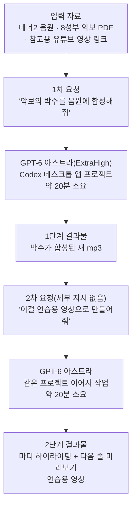

## 목차

1. 들어가며 — 이 게시물이 설명하는 것
2. 사용된 도구들의 실체 확인
3. 다뤄진 악보 — Jake Runestad의 "Alleluia"
4. 사용자가 원래 원했던 것
5. 실제로 일어난 두 단계의 작업
6. 화면 구성 뜯어보기
7. 왜 이것이 어려운 문제였다고 알려져 있었나
8. "고넥터"라는 표현에 대하여
9. 남은 질문들 — 확인된 것과 확인되지 않은 것
10. 정리
11. 출처 투명성 표
12. 참고문헌

---

## 1. 들어가며 — 이 게시물이 설명하는 것

이번 게시물은 합창을 취미로 하는 사용자가 GPT-6 아스트라를 이용해 개인 파트 연습 도구를 만든 경험담이다. 앞선 두 건의 게시물이 제3자 제품이나 논문의 주장을 검증하는 내용이었다면, 이번 것은 다시 사용자 본인의 실제 사용 경험을 다룬다는 점에서 지난번 GJC·OMO 게시물과 성격이 비슷하다. 다만 이번에는 함께 첨부된 화면 구성이 있어서, 결과물이 실제로 어떤 형태로 나왔는지를 조금 더 구체적으로 짚어볼 수 있다.

이 문서의 목적은 두 가지다. 첫째, 게시물에 등장하는 도구와 개념들(GPT-6 아스트라의 추론 강도 설정, 코덱스 데스크톱 앱, Jake Runestad의 악보)이 실재하는지 확인하는 것. 둘째, 사용자가 설명한 작업 과정과 첨부된 화면 구성을 최대한 정확하게, 과장이나 추측 없이 정리해서 전달하는 것이다. "완벽하게 해냈다"거나 "현존 최강의 도구가 될 것 같다"는 평가는 사용자 본인의 주관적 만족도이므로, 이 문서는 그 평가 자체를 검증하지 않고 사실과 구분해서 다룬다.

## 2. 사용된 도구들의 실체 확인

### GPT-6 아스트라의 "ExtraHigh" 추론 강도

사용자가 언급한 "ExtraHigh"는 실재하는 설정이다. GPT-6 아스트라는 API와 챗GPT 양쪽에서 추론에 들이는 노력(reasoning effort)을 낮음(low)부터 중간(medium), 높음(high), 그리고 그 위 단계인 엑스트라 하이(xhigh, 게시물의 "ExtraHigh"에 해당), 최고 단계인 맥스(max)까지 조절할 수 있도록 설계되어 있다[1][2]. 즉 사용자가 "Effort는 Max를 셋팅해야 할지 아니면 ExtraHigh로 할지 애매하다"고 표현한 것은 실제로 존재하는 다섯 단계의 설정 중 상위 두 단계를 놓고 고민했다는 뜻이며, 임의로 지어낸 용어가 아니다.

### Codex 데스크톱 앱

"Codex 데스크톱 앱에서 프로젝트로 셋팅해서 시켰다"는 부분도 실재하는 작업 방식이다. OpenAI의 코덱스(Codex)는 2025년 5월 명령줄(CLI) 도구로 처음 나왔고, 2026년 2월 macOS용 독립 데스크톱 앱으로 확장됐다[3][4]. 이후 2026년 7월 9일, OpenAI는 이 독립 코덱스 앱을 새로 개편한 챗GPT 데스크톱 앱 안으로 통합해, 챗GPT 데스크톱 앱 안에 대화(Chat)·업무(Work)·코덱스(Codex)라는 세 가지 모드 중 하나로 자리잡게 했다[5]. 코덱스는 저장소나 작업 폴더 단위로 "프로젝트"를 만들어 그 안에서 에이전트에게 장시간 작업을 맡기고 진행 상황을 관리하는 구조를 갖고 있으므로, 사용자가 "프로젝트로 셋팅해서 시켰다"고 표현한 것은 이 앱의 실제 사용 방식과 정확히 일치한다.

### "고넥터(Gonnector)"라는 표현

게시물 태그에 반복해서 등장하는 "고넥터" 또는 "Gonnector"라는 단어는 검색으로 그 정체를 확인하지 못했다. 일반적인 "커넥터(connector, 서로 다른 앱을 연결해주는 소프트웨어)"라는 개념과는 발음이 비슷하지만 철자와 쓰임이 다르며, 알려진 제품명이나 서비스명으로는 검색되지 않았다. 문맥상 게시물 작성자 본인의 개인 브랜드나 커뮤니티 이름, 혹은 반복적으로 사용하는 개인 해시태그일 가능성이 높아 보이지만, 이는 추정이며 확인된 사실이 아니라는 점을 밝혀둔다.

## 3. 다뤄진 악보 — Jake Runestad의 "Alleluia"

화면에 표시된 곡은 미국 작곡가 제이크 루네스타드(Jake Runestad, 1986년생)가 2014년에 쓴 무반주 합창곡 "Alleluia"로 특정된다. 루네스타드는 미니애폴리스를 기반으로 활동하는 작곡가로, 미국합창지휘자협회(ACDA)의 레이먼드 C. 브록 커미션을 역대 최연소로 수상했고, 2022년에는 합창 교향곡 "Earth Symphony"로 에미상을 받는 등 미국 합창 음악계에서 왕성하게 활동하는 인물이다[6][7]. 그의 "Alleluia"는 SATB(소프라노·알토·테너·베이스) 편성에 각 성부가 다시 둘로 나뉘는 디비지(divisi) 구조를 가진 곡으로, 여러 미국 학교 합창 프로그램의 오디션 지정곡으로도 쓰이고 있으며, 6/8박자를 기본으로 2/4·3/4·5/8 등 박자가 계속 바뀌는 복잡한 리듬 구조와, 중간에 등장하는 활기찬 "춤추는" 듯한 섹션으로 잘 알려져 있다[8]. 화면에 표시된 20~28마디 구간에서 6/8, 2/4, 3/4, 5/8박자가 연이어 바뀌고 "Dancing"이라는 섹션 표시가 붙어 있는 것은 이 곡의 실제 악보 구조와 정확히 일치한다. 사용자가 "8성부 모두 들어있는 악보"라고 표현한 것 역시, 이 곡이 소프라노1·2, 알토1·2, 테너1·2, 베이스1·2로 나뉘는 8성부 디비지 구조를 갖는다는 사실과 부합한다.

## 4. 사용자가 원래 원했던 것

사용자는 시창(악보만 보고 바로 노래하는 능력)이 되지 않아 파트 연습을 혼자 하기 어렵다는 문제를 안고 있었다. 그가 원한 것은 두 단계로 나뉜다. 우선은 악보에서 자신이 맡은 성부만 정확히 뽑아내 사람 음성(또는 차선책으로 피아노)으로 연주한 음원을 만드는 것이었고, 더 나아가서는 그 음원을 단순 MP3가 아니라 영상으로 만들어 지금 연주되고 있는 마디를 실시간으로 짚어주고, 다음 줄의 악보도 미리 보여주면서 재생되는 형태를 원했다. 그는 이런 시도를 이전에 GPT-5.6 솔(Sol)이나 클로드 페이블 5(Fable 5)로도 해봤지만 여러 이유로 쉽지 않았다고 밝혔다.

## 5. 실제로 일어난 두 단계의 작업

### 1단계 — 박수가 합성된 새 음원

춘천에서 열리는 합창대회를 앞두고 마무리 연습을 하던 사용자는, 박자 감각 연습을 위해 악보에 표기된 박수 부분을 자신이 갖고 있던 테너2 음원(원래는 박수가 들어있지 않음)에 합성해달라고 요청했다. 이때 제공한 자료는 8성부가 모두 담긴 악보 PDF 파일(박수 부분도 기보되어 있음), 원래 갖고 있던 테너2 음원, 그리고 참고용으로 다른 합창단이 박수와 8성부를 모두 연주한 영상 링크였다. 이 요청은 팀 협업 기능이나 특정 전문가 페르소나 설정 없이, GPT-6 아스트라의 기본(바닐라) 상태 그대로 코덱스 데스크톱 앱의 프로젝트 기능에 맡겨졌다. 사용자는 다른 일을 하다가 약 20분 뒤 화면을 확인했을 때 작업이 이미 완료되어 있었고, 결과로 나온 mp3 파일을 들어보니 원하던 대로 정확했다고 밝혔다.

### 2단계 — 악보 연동 연습용 영상

첫 결과물에 만족한 사용자는 이어서 "이걸 악보까지 포함한 연습용 동영상으로 만들어보자"고 추가로 제안했다. 이때 그는 이전부터 고민해왔던 세부 요구사항(어떤 구간을 어떻게 강조할지, 다음 줄을 어떻게 미리 보여줄지 등)을 전혀 설명하지 않고 "응 그거 해줘" 정도로만 지시했다고 밝혔다. 이는 모델이 스스로 어디까지 판단해서 만들어낼 수 있는지를 확인하려는 의도적인 테스트였다. 약 20분 뒤 나온 결과물이 함께 첨부된 화면이며, 사용자는 이 결과가 자신이 예전부터 머릿속으로 그려왔던 것과 거의 일치했다고 평가했다.

## 6. 화면 구성 뜯어보기

첨부된 화면은 실제로 완성된 연습용 영상 재생 화면으로 보인다. 화면 위쪽에는 곡 제목 "ALLELUIA"와 작곡가 "Jake Runestad"가 표시되고, 오른쪽에는 지금 표시 중인 성부와 음원이 "테너 악보 / 테너2 음원"이라고 명시되어 있으며, 박수 표시를 켜고 끌 수 있는 버튼도 보인다. 그 아래에는 "현재 22마디"라는 진행 표시와 함께 해당 구간의 섹션 이름("Dancing")과 위치 정보("20-23마디 / 원본 4쪽")가 나온다.

악보 부분은 20마디부터 23마디까지 네 마디가 한 줄에 표시되고, 그중 재생 중인 22마디 구간이 옅은 색으로 강조되어 있다. 가사는 "Al-le-lu-ia. Al-le-lu-ia!"로 이어지며, 22마디 구간 아래에는 "이 구간에는 박수가 없습니다"라는 안내 문구가 별도로 표시되어 현재 구간에 박수 파트가 없다는 것을 알려준다. 화면 아래쪽에는 "다음 단 24-28마디"라는 제목으로 다음에 이어질 다섯 마디 분량의 악보가 미리 표시되며, 가사는 "Al---le-lu-ia. Ah___ Al-le-"로 이어진다. 그 아래에는 "분할된 테너 오선은 아래 성부(T2)를 따라 부르세요"라는 안내가 있어, 테너 파트가 두 갈래로 나뉘는 구간에서 사용자가 맡은 테너2를 정확히 짚어주고 있다. 화면 맨 아래에는 재생 진행 막대와 시간 표시(00:31 / 03:06)가 있어, 전체 3분 6초 길이의 영상 중 31초 지점을 재생하고 있는 상태임을 보여준다.

이 화면 구성을 종합하면, 사용자가 처음에 바랐던 조건들 — 자신의 성부만 정확히 짚어주는 것, 현재 재생 구간을 마디 단위로 강조하는 것, 다음 줄을 미리 보여주는 것 — 이 실제로 모두 구현되어 있는 것으로 보인다. 다만 이 화면이 어떤 방식으로 생성됐는지(어떤 렌더링 도구나 코드가 쓰였는지)에 대한 기술적인 세부사항은 게시물에 설명되어 있지 않으며, 이 문서 역시 그 내부 구현 방식을 확인할 방법은 없다.

## 7. 왜 이것이 어려운 문제였다고 알려져 있었나

사용자는 "악보를 보고 연주하는 도구를 Sol이나 Fable 5에서도 시도했지만 여러 이유로 쉬운 문제가 아니었다"고 언급했다. 이는 업계에서 일반적으로 알려진 사실과 부합하는 서술이다. 악보 이미지(광학 음악 인식, OMR)를 정확한 음표·박자·가사 정보로 변환하는 것 자체가 손글�씨 인식보다 훨씬 오차가 크고 까다로운 작업으로 알려져 있고[9], 여기에 더해 여러 성부가 뒤섞인 오디오에서 특정 성부만 분리하거나, 반대로 악보에 맞춰 사람 목소리를 새로 합성하는 작업, 그리고 그 결과를 다시 시간축에 맞춰 악보와 동기화해 영상으로 만드는 작업까지 모두 요구되는 복합 과제이기 때문이다. 사용자가 "완전 바닐라 버전"이라는 표현을 쓴 것은 별도의 전문 워크플로나 페르소나 설정 없이 기본 상태의 모델에게 이 복합 과제를 통째로 맡겼다는 뜻이며, 이 지점이 그가 결과에 놀란 이유로 보인다. 다만 이 성공 사례가 이 모델이 모든 악보·모든 곡에서 동일하게 통할 것이라는 보장은 아니며, 어디까지나 이번 한 곡, 한 사용자의 경험이라는 점은 유의할 필요가 있다.

## 8. "고넥터"라는 표현에 대하여

앞서 언급했듯 "고넥터"는 확인되지 않은 표현이다. 다만 게시물 전체에서 반복적으로 등장하는 것으로 보아, 이 사용자가 자신의 소셜 미디어 활동에 일관되게 붙이는 개인 태그이거나 소속 커뮤니티를 가리키는 이름일 가능성이 있다. 이 부분은 검증 가능한 근거가 없으므로 추정 이상의 설명은 제공하지 않는다.

## 9. 남은 질문들 — 확인된 것과 확인되지 않은 것

이 게시물에서 확인 가능한 사실과 확인 불가능한 부분을 구분하면 다음과 같다. GPT-6 아스트라의 추론 강도 단계(xhigh/max 포함), 코덱스 데스크톱 앱의 존재와 프로젝트 기반 작업 방식, Jake Runestad의 "Alleluia"라는 곡의 실재 여부와 그 구조적 특징은 모두 독립적으로 확인됐다. 반면 실제 작업이 정확히 20분씩 두 차례 걸렸다는 소요 시간, mp3 결과물의 음질이나 정확도에 대한 평가, 화면에 나온 영상이 생성된 구체적인 기술적 과정은 사용자 개인의 서술에 의존할 수밖에 없으며 제3자가 재현하거나 검증할 수 없다. "Fable 5도 제대로 못했다"는 비교 평가나 "현존 최강의 합창 연습 도구가 될 것"이라는 전망 역시 사용자 개인의 주관적 판단이다. 사용자 본인도 게시물 말미에서 "Fable 5.1에는 아직 이 작업을 시켜보지 않았다"고 밝히며, 향후 결과를 지켜봐야 한다는 유보적인 태도를 취하고 있다.

## 10. 정리

이번 게시물은 실재하는 도구들(GPT-6 아스트라의 상위 추론 강도 설정, 코덱스 데스크톱 앱)을 이용해, 실재하는 합창곡(Jake Runestad의 "Alleluia")의 개인 파트 연습 자료를 만들어낸 사용자의 경험담이다. 첨부된 화면 구성은 사용자가 원래 원했던 조건들 — 성부 특정, 마디 단위 강조, 다음 줄 미리보기 — 을 실제로 갖추고 있는 것으로 보인다. 다만 이 결과물이 만들어진 정확한 기술적 과정과, "완벽했다"는 평가 자체는 검증할 수 없는 개인의 경험과 판단이라는 점을 분명히 해둔다. "고넥터"라는 표현의 정체는 확인하지 못했다.

## 11. 출처 투명성 표

| 구분 | 내용 |
|---|---|
| 확인된 사실 | GPT-6 아스트라에 low/medium/high/xhigh(ExtraHigh)/max 다섯 단계의 추론 강도 설정이 존재한다는 점, 코덱스 데스크톱 앱이 실재하며 2026년 7월 9일부터 챗GPT 데스크톱 앱 안의 한 모드로 통합됐다는 점, Jake Runestad가 2014년에 작곡한 무반주 합창곡 "Alleluia"가 실재하며 SATB 8성부 디비지·복합 박자·"춤추는" 섹션 구조를 갖는다는 점 |
| 화면에서 직접 확인되는 내용 | 곡 제목·작곡가·성부 표시, 현재 재생 마디 강조, 다음 줄 미리보기, 박수 유무 안내, 재생 진행 시간 표시 등 화면 구성 자체 |
| 검증 불가(사용자 개인 서술) | 두 차례 작업이 각각 약 20분씩 걸렸다는 소요 시간, mp3·영상 결과물의 실제 음질과 정확도, 화면이 생성된 구체적인 기술적 절차 |
| 확인되지 않음 | "고넥터(Gonnector)"라는 표현의 정확한 의미나 소속 |
| 개인적 평가·전망(제3자 검증 불가) | "완벽하게 해냈다", "기존 유료 솔루션보다 낫다", "현존 최강의 합창 연습 도구가 될 것", "Astra 전후로 AI 모델의 방향성이 달라질 것" 등 사용자 본인의 주관적 평가와 전망 |

## 12. 참고문헌

[1] LiteLLM, "Day 0 Support: GPT-6 Astra," docs.litellm.ai/blog/gpt_6_astra — reasoning_effort 파라미터에 low부터 xhigh까지 설정 가능하다는 기술 문서.

[2] getdeploying.com, "GPT-6 Astra" 모델 요약 페이지 — "Reasoning effort is adjustable from low up to a max setting" 서술.

[3] Wikipedia, "OpenAI Codex (AI agent)" — 코덱스의 출시 이력(2025년 CLI, 2026년 2월 데스크톱 앱).

[4] Gigazine, "OpenAI releases app version of Codex," 2026-02-03.

[5] heyuan110.com, "Codex App Guide (2026): Setup, Workflows, and Real Pitfalls," 2026-07-12 — 코덱스 앱이 2026년 7월 9일 챗GPT 데스크톱 앱의 한 모드로 통합됐다는 서술.

[6] news.clemson.edu, "Clemson University Choirs has commissioned a new choral piece from Emmy Award-winning composer Jake Runestad."

[7] musicweb-international.com, Jake Runestad "Sing, Wearing the Sky" 음반 리뷰 — 작곡가 약력.

[8] tpsmea.org, "2027 All-State Choir Repertoire List" — Jake Runestad "Alleluia," SATB a cappella로 명시된 지정곡 목록.

[참고] montclair.edu 연주회 프로그램북 — Jake Runestad "Alleluia"(2014) 연주 기록.

[9] 일반적으로 알려진 광학 음악 인식(Optical Music Recognition)의 기술적 난점에 대한 업계 통념(구체적 논문 인용 없이 통념 수준으로 서술).
