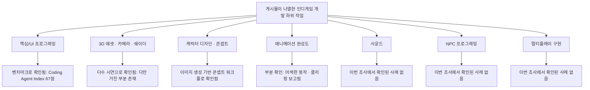

```
https://www.threads.com/share/BAV-S8EyzI/

전 인디게임 개발자 출신인데
Astra 이거 뭐야 너무 무섭다

Astra 선에서 인디게임 90%는 
정리되겠는데??

지금 Astra가 토큰을 많이 먹네 
어쩌니 하는데

게임 개발 해본 사람들은 알 거임.

캐릭터 디자인, 애니메이션 제작, UI 디자인, 핵심 프로그래밍, UI 프로그래밍, 카메라 프로그래밍, 쉐이더, 사운드

여기에 상황에 따라 NPC 프로그래밍, 3D 에셋제작, 멀티플레이 구현 등등

사실 저것도 뭉뚱그려 말했지만 
세부적으로 해야 할 게 무지하게 많음.

저거 혼자서 다한다고 치면
최소 1~2년임. 

그런데 이걸 대충 기획서 끄적이면
알아서 2시간 만에 만들어주는 거임

30만 원으로 1~2년을 번 셈이 되는거임.

진짜 Astra 보고 
현타 오는 게임개발자들 
진짜 많을 듯…

```

## 들어가며

Threads 이용자 ever_route(전 인디게임 개발자 출신이라고 밝힘)가 올린 게시물이 화제가 됐다. 요지는 간단하다. GPT-6 아스트라 앞에서 인디게임 개발의 90%가 정리될 것 같다는 것, 그리고 캐릭터 디자인·애니메이션·UI 디자인·핵심 프로그래밍·UI 프로그래밍·카메라 프로그래밍·쉐이더·사운드에 상황에 따라 NPC 프로그래밍·3D 에셋 제작·멀티플레이 구현까지 더해지는 인디게임 개발 전 과정을, 혼자 하면 최소 1~2년 걸리는 일을 대략적인 기획서만으로 2시간 만에 만들어준다는 주장이다. 이 문서는 이 주장과 뒤이어 달린 댓글들의 내용을, 이번 주 공개된 GPT-6 아스트라 관련 공식 발표 및 매체 보도와 대조해 어디까지가 확인 가능한 사실이고 어디부터가 한 개발자의 체감·과장·농담인지 정리한 것이다.

---

## 1. 게시물과 댓글 스레드 요약

게시물 본문의 흐름은 이렇다. 작성자는 먼저 "Astra 이거 뭐야 너무 무섭다"며 자신의 반응을 밝히고, 아스트라 선에서 인디게임의 90%가 정리될 것 같다고 전망한다. 뒤이어 "지금 아스트라가 토큰을 많이 먹네 어쩌니" 하는 세간의 비용 논쟁을 언급하면서, 정작 게임을 만들어본 사람이라면 그런 비용 논쟁보다 더 중요한 지점이 있다고 짚는다. 게임 하나를 완성하려면 캐릭터 디자인, 애니메이션 제작, UI 디자인, 핵심 프로그래밍, UI 프로그래밍, 카메라 프로그래밍, 쉐이더, 사운드가 기본으로 들어가고, 상황에 따라 NPC 프로그래밍, 3D 에셋 제작, 멀티플레이 구현까지 더해진다는 것이다. 이걸 혼자 다 하면 최소 1~2년이 걸리는데, 대략적인 기획서만 던져주면 아스트라가 2시간 만에 만들어주는 셈이니, 30만 원으로 1~2년의 시간을 산 것과 마찬가지라는 게 결론이다.

댓글 스레드에서는 다양한 반응이 이어졌다. studio_rlc는 만드는 사람은 늘어나는데 실제 사용할 유저는 한정돼 있으니 오히려 마케팅 비용이 늘어날 거라는 우려를 제기했고, 작성자도 이에 공감했다. hi_bom.bom은 시간과 수고를 돈으로 산다고 생각하면 그 정도 금액은 충분히 지불할 만하다는 의견을 냈고, 작성자는 5년 전 30만 원에 게임 에셋 하나를 샀던 것과 비교하며 지금은 같은 금액으로 게임 제작과 풀 에셋, 수정사항 반영까지 되는 세상이라고 답했다. ai.rusk는 "시작도 못하고 정리된 1인"이라는 자조적인 댓글을 남겼고 작성자는 "시작했지만 정리된 1인"이라고 맞받았다. dev.illumination은 쉐이더를 잘 다루는 점이 신기하다고 했고 작성자도 쉐이더가 게임 개발의 꽃이라며 동의했다. kim.yeonhak은 실제로 저걸로 서비스를 하냐고 의문을 제기했고, 작성자는 첨부된 시연 장면이 아스트라로 만든 프로토타입으로 보인다고 답했다. jin_2o2는 어떤 도구로 개발하는지, MCP 방식으로 연결해 개발하는지 물었고, 작성자는 사람마다 다르며 three.js로 웹 게임을 만드는 사람도 있고 옛날 PSP용 게임을 만드는 사람도 있으며 최근에는 유니티용 MCP도 잘 나와 있어 더 쉬울 것 같다고 답했다. jindotnyang은 앞으로는 점점 기획력 승부가 될 것 같다는 전망을 남겼다.

---

## 2. 게임 제작 관련, 실제로 확인되는 아스트라의 능력

먼저 짚어야 할 것은, "게임을 통째로 자동 생성한다"는 인상 자체는 과장이 아니라는 점이다. OpenAI는 출시 발표에서 아스트라가 프롬프트만으로 웹사이트·웹 앱·게임을 만들고 호스팅까지 할 수 있다고 소개했고, 집을 블렌더(Blender)로 모델링한 뒤 이를 언리얼 엔진 5 기반의 걸어 다닐 수 있는 공간으로 바꾸는 시연을 공개했다(OpenAI, 2026-09-03). 출시 광고 영상에서는 사람이 음성만으로 노란 원을 로켓선으로, 다시 완전한 3D 게임으로 몇 분 만에 바꿔달라고 요청하는 장면도 포함됐다(VentureBeat, 2026-09-04).

가장 구체적인 사례는 게임 스튜디오 Playco다. Playco는 그래픽이 전혀 없는 카트 게임의 뼈대(그레이박스) 하나를 아스트라에게 맡겨 해적 테마·캔디 테마·사이버펑크 테마로 서로 다른 세 가지 완성작을 뽑아냈고, 이전 모델 대비 수작업 수정이 50% 줄었다고 발표했다(The Neuron, 2026-09-04). 다만 이 수치를 그대로 "완전 자동화"로 읽는 것은 무리라는 지적도 나왔다. 한 게임 업계 매체는 AI가 생성한 코드가 컴파일은 되지만 물리 연산 오류, 충돌 판정 오류, 붕 떠 있는 UI 요소처럼 실제로는 손이 많이 가는 문제들이 여전히 남아 있다고 지적하면서, Playco의 사례를 "AI가 개발자를 대체한 이야기가 아니라 마침내 쓸 만한 주니어 팀원이 생긴 이야기"로 규정했다(Glodaxia News, 2026-09-04).

OpenAI 개발자 블로그에는 실제로 Codex 안에서 아스트라를 이용해 "Void Explorer"라는 우주 탐사 게임을 만든 사례가 공개돼 있다. 이 게임은 2,048개의 항성계와 1만 개가 넘는 절차적으로 생성된 행성을 담고 있으며, 별에서 행성 대기권을 지나 지표면까지 끊김 없이 이동할 수 있도록 설계됐다고 한다. 개발자는 사실적인 우주 묘사가 마음에 들지 않아 이미지 생성 기능으로 먼저 분위기를 여러 번 조정한 뒤, 그 결과물을 참고 자료로 삼아 게임에 반영하는 방식으로 작업했다고 설명한다(OpenAI Developers 블로그, 2026-09-05). 이 밖에 기술 리뷰어 매튜 버먼은 단일 프롬프트로 '폴 가이즈' 스타일의 플레이 가능한 게임을 만들었고, 닷새에 걸쳐 자율적으로 작동한 '심시티' 스타일 시뮬레이션에서는 소방서·경찰서·병원·원자력 발전소 같은 시설 하나하나를 스스로 만들어냈다고 보도됐다(Stork.AI, 2026-09-05). 아스트라가 실험적인 장기 추론 환경에서 게임을 위한 파서, 월드 상태 모델, 탐색 알고리즘, 플래너, 지속 메모까지 스스로 만들어내며 마치 사람 엔지니어가 낯선 문제에 접근하는 방식과 비슷하게 움직였다는 관찰도 보도됐다(The Neuron, 2026-09-04).

---

## 3. "혼자 하면 1~2년, 아스트라로는 2시간" — 항목별로 뜯어보기

게시물이 나열한 하위 작업들을 하나씩 놓고, 현재까지 공개된 자료로 어디까지 뒷받침되는지 짚어보면 다음과 같다.

- **핵심 프로그래밍·UI 프로그래밍**: 코딩 에이전트로서의 아스트라 성능은 여러 독립 벤치마크로 뒷받침된다. Artificial Analysis의 Coding Agent Index에서 67점을 받아 Claude 진영의 Opus 5·Fable 5와 비슷한 수준까지 올라왔다(Artificial Analysis, 2026-09-04). 이 항목은 가장 근거가 탄탄한 부분이다.
- **카메라 프로그래밍·3D 에셋·쉐이더**: 블렌더·언리얼 엔진·유니티·고닷(Godot) 등 표준 3D 도구를 사람 아티스트처럼 조작하는 시연이 다수 공개됐고, 일부 리뷰어는 애니메이션이 다소 어색하거나 충돌 판정이 어긋나는 등 거친 부분은 남아 있지만 이전에는 볼 수 없었던 수준의 종단간(end-to-end) 처리 능력이라고 평가했다(MindStudio, 2026-09-04). 댓글에서 dev.illumination이 언급한 "쉐이더를 잘 다룬다"는 체감도 이런 시연 흐름과 방향이 일치한다.
- **캐릭터 디자인·애니메이션**: 콘셉트 이미지를 생성해 스타일을 정하고 이를 참고 삼아 게임에 반영하는 워크플로가 OpenAI 개발자 블로그에도 소개돼 있어(OpenAI Developers, 2026-09-05), 정지된 형태의 캐릭터·콘셉트 디자인은 상당 부분 뒷받침된다. 다만 자연스러운 애니메이션의 완성도에 대해서는 "어색한 애니메이션, 일부 클리핑"이 남아 있다는 평가가 함께 보고된다(MindStudio, 2026-09-04).
- **사운드**: 이번에 확인한 자료들 중 아스트라가 게임 음악이나 효과음을 직접 생성했다는 구체적인 사례나 벤치마크는 확인되지 않았다. 게시물이 나열한 항목 중 가장 근거가 약한 부분이다.
- **NPC 프로그래밍·멀티플레이 구현**: 이 두 항목 역시 이번 조사에서는 아스트라가 이를 구체적으로 수행했다는 사례가 확인되지 않았다. 코딩 능력 전반의 향상으로 미루어 어느 정도 도움이 될 것으로 추정할 수는 있지만, 이는 추정이지 확인된 사실이 아니다.

이런 항목별 확인 결과를 종합하면, 프로토타입 단계 — 콘셉트를 잡고 그래픽 얼개와 기본 동작을 갖춘 게임을 빠르게 뽑아내는 단계 — 에서는 게시물의 주장이 상당 부분 근거를 찾을 수 있다. 반면 사운드, NPC AI, 멀티플레이 네트워크 코드처럼 실제 서비스 단계에서 필요한 세부 항목들까지 "2시간 만에 다 끝난다"고 보기에는 아직 공개된 근거가 부족하다. 게임 개발 도구를 만드는 한 회사는 아스트라가 프로토타입 루프를 바꿔놓을 것은 분명하지만 유니티나 고닷 개발자를 대체하지는 못할 것이며, 사람이 여전히 취향과 시스템 전반을 책임지는 영역으로 남는다고 평가했다(GuardingPearSoftware, 2026-09-05). "30만 원으로 1~2년을 벌었다"는 표현은 이런 맥락에서 프로토타입 제작 단계에 한정된, 작성자 개인의 체감에 가까운 압축된 표현으로 보는 것이 정확하다.

비용 산정 부분도 짚어볼 필요가 있다. 게시물과 댓글에서 언급된 "30만 원"이 정확히 어떤 요금제나 사용량을 기준으로 한 것인지는 게시물 자체에 명시돼 있지 않다. 다만 이번 조사에서 확인한 아스트라의 표준 API 요금은 입력 100만 토큰당 10달러, 출력 100만 토큰당 50달러이며, ChatGPT 구독 요금제 중 가장 상위 등급인 Pro 요금제는 월 200달러(원화로 약 27만~30만 원 안팎) 수준으로 알려져 있어, "30만 원"이라는 표현은 개인 구독료 규모와 대체로 맞아떨어지는 어림값으로 보인다. 다만 이는 추정이며, 게시물 작성자가 실제로 얼마의 비용을 지출했는지 공식적으로 확인된 자료는 아니다.

---

## 4. 게시물에 함께 올라온 시연 장면에 대하여

게시물 첫 장에는 "choi.openai"라는 이용자명이 표시된, 숲속을 배경으로 한 등각(isometric) 판타지 RPG 형태의 게임 장면이 함께 실려 있다. 화면 속 게임 이름은 "The Sunken Weald"로 보인다. 이번 조사에서는 이 특정 데모를 OpenAI 공식 자료나 주요 매체 보도에서 별도로 확인할 수 없었다. 즉 이 장면은 개인 창작자가 아스트라로 만들어 직접 공유한 결과물로 추정되며, 언론이나 OpenAI가 별도로 검증하거나 소개한 사례는 아니라는 점을 밝혀둔다.

---

## 5. 업계의 엇갈린 반응 — 기회론과 우려론

게임 업계 반응은 뚜렷하게 갈린다. 한쪽에서는 아스트라가 3D 모델링과 게임 개발 워크플로를 훨씬 빠르고 접근하기 쉽게 만든다고 반기는 반면, 다른 쪽에서는 영상 클립이나 위키 링크, 게임 화면 하나만 있어도 거의 동일한 클론을 만들어 수익화를 시도하는 "표절 기계"로 악용될 수 있다는 우려도 함께 제기됐다(Creative Bloq, 2026-09-05). 더 넓은 시각에서는 아스트라급 모델이 이번 출시로 위협받을 수 있는 직군 목록에 게임 개발을 포함한 여러 직종을 나열하는 보도도 나왔다(Ladbible, 2026-09-04). 반면 주니어 개발자에 미치는 영향을 짚은 한 매체는, 이런 모델이 등장한다고 해서 주니어 직군 자체가 사라진다고 단정할 근거는 없으며, 오히려 에이전트가 만든 결과물의 차이(diff)를 검토하고 실패 경로를 테스트하며 병합이 안전한지 설명하는 능력처럼 사람만이 할 수 있는 판단 영역이 더 중요해질 것이라고 짚었다(DevsUnite, 2026-09-04).

---

## 6. 다이어그램으로 보는 항목별 확인 수준



---

## 7. 종합 판단

게시물의 핵심 관찰 — 아스트라가 게임 프로토타입 제작 속도를 극적으로 끌어올렸다는 것 — 은 Playco 사례, OpenAI 자체 시연, 여러 리뷰어의 독립적인 체험기로 뒷받침되는 방향이 맞다. 다만 "인디게임 개발의 90%가 정리된다"거나 "1~2년 걸릴 일이 2시간 만에, 30만 원으로 끝난다"는 서술은 프로토타입 단계의 체감을 게임 개발 전체 공정으로 일반화한 표현에 가깝다. 특히 사운드, NPC AI, 멀티플레이 네트워크 코드처럼 실제 상용 서비스에 필요한 항목들에 대해서는 이번 조사에서 아스트라가 이를 구체적으로 처리했다는 근거를 찾지 못했다. 게임 업계 관련 매체들 역시 공통적으로 "완전 자동화"보다는 "쓸 만한 주니어 팀원이 생겼다" 혹은 "프로토타입 루프가 바뀌었다"는 절제된 표현을 선호하는 편이었다.

---

## 8. 사실관계 확인표

| 주장 | 확인 상태 | 근거 |
|---|---|---|
| OpenAI가 아스트라의 게임·3D 제작 시연을 공개함 (블렌더→언리얼 엔진 5 등) | 검증됨 | OpenAI, VentureBeat |
| Playco가 그레이박스 하나로 세 가지 테마 게임을 만들고 수작업 50% 절감 | 검증됨(기업 자체 발표) | The Neuron |
| 생성된 게임 코드에 물리·충돌·UI 배치 오류 등 거친 부분이 남아있다는 지적 | 검증됨(업계 평가) | Glodaxia News, MindStudio |
| 코딩 에이전트 벤치마크(Coding Agent Index)에서 67점, Claude 계열과 대등 | 검증됨(독립 평가기관) | Artificial Analysis |
| 아스트라가 사운드·음악을 직접 생성해 게임에 적용한 사례 | 미확인 | 이번 조사에서 근거 찾지 못함 |
| 아스트라가 NPC AI·멀티플레이 네트워크 코드를 완성한 사례 | 미확인 | 이번 조사에서 근거 찾지 못함 |
| "인디게임 개발 90%가 정리된다" | 개인 전망 — 사실 명제로 보기 어려움 | Threads 게시물(1차 출처) |
| "1~2년짜리 작업을 2시간, 30만 원에 완료" | 개인 체감·추정 — 공식 비용·시간 데이터로 뒷받침되지 않음 | Threads 게시물(1차 출처) |
| 게시물 속 "The Sunken Weald" 시연 게임 | 미확인 — 개인 창작자의 자체 공유물로 추정, 별도 매체 보도 없음 | Threads 게시물(1차 출처) |
| 아스트라가 게임 클론·표절에 악용될 수 있다는 우려 | 검증됨(업계 우려로 보도됨) | Creative Bloq |

---

## 9. 출처

- OpenAI, "GPT-6 Astra: A new generation of intelligence" (2026-09-03), openai.com
- OpenAI Developers 블로그, "How I build games with Astra" (2026-09-05), developers.openai.com
- VentureBeat, "'Welcome to the AGI era': OpenAI launches GPT-6 Astra" (2026-09-04)
- The Neuron, "GPT-6 Astra: Everything You Need to Know About OpenAI's New Model" (2026-09-04)
- Stork.AI, "GPT-6 Astra Review: AI Builds Playable Games From a Single Prompt" (2026-09-05)
- MindStudio, "GPT-6 Astra: What OpenAI's New Flagship Model Actually Does" (2026-09-04)
- Signals(ForwardFuture), "Astra: The Full Review" (2026-09-04)
- Glodaxia News, "Playco GPT-6 Astra: 50% fewer fixes, but AI game prototyping still has [limits]" (2026-09-04)
- GuardingPearSoftware, "Will GPT-6 Astra change game development forever?" (2026-09-05)
- Creative Bloq, "OpenAI's controversial ChatGPT-6 Astra advert paints a sad vision of the future" (2026-09-05)
- Ladbible, "People fear mindblowing new Open AI model will 'destroy every job on earth' after watching advert" (2026-09-04)
- Ladbible, "The 40 jobs most under threat after ChatGPT and OpenAI level up overnight" (2026-09-04)
- DevsUnite, "Is GPT-6 Astra Coming for Junior Developers? Here's What Actually Changes" (2026-09-04)
- Artificial Analysis, "Benchmarking GPT-6 Astra" (2026-09-04)
- Threads 게시물(ever_route, 2026-09-06 기준 8시간 전 게시) 및 댓글 스레드 — 이 문서가 검토 대상으로 삼은 1차 자료 (threads.com/share/BAV-S8EyzI)

---

작성일자: 2026년 9월 6일
