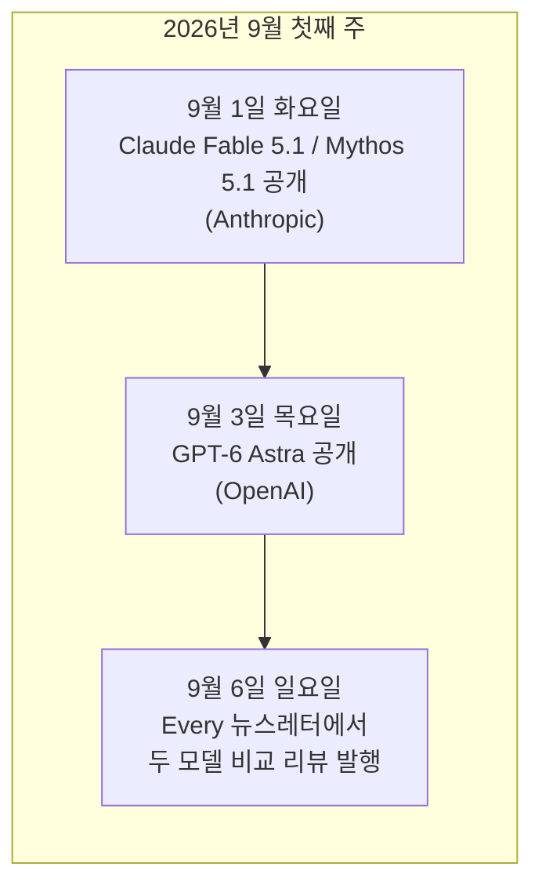
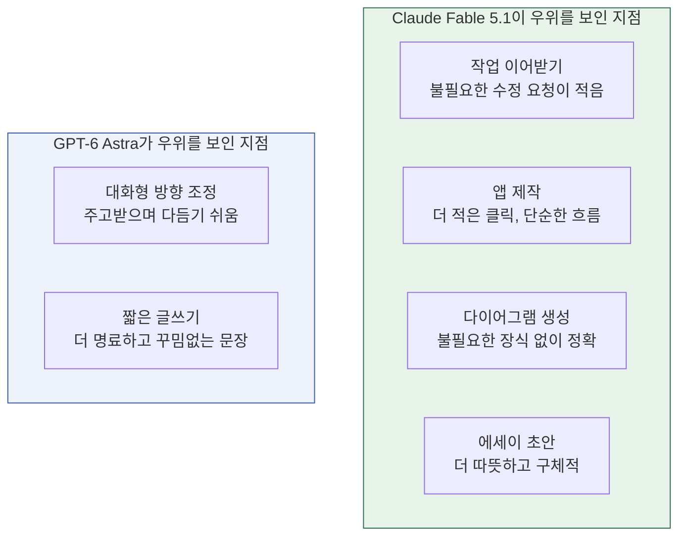
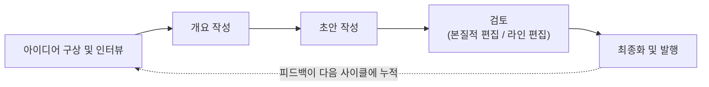
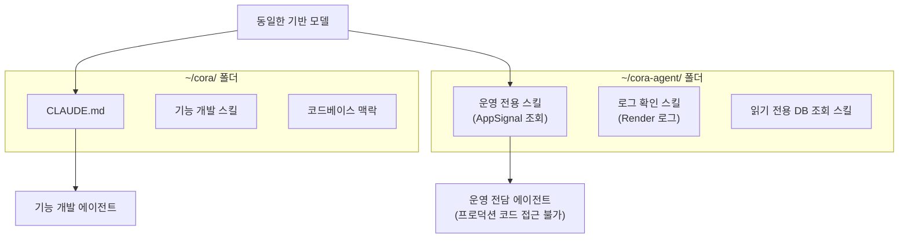
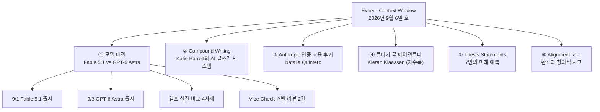

- 원문: Every, *Context Window* 뉴스레터, "A Split Verdict on Fable vs. Astra" (작성: Every Staff, 2026년 9월 6일 발행)
- 원문 URL: https://every.to/context-window/a-split-verdict-on-fable-vs-astra

---

## 1. 이 글이 다루는 곳: Every와 Context Window

먼저 출처부터 짚고 넘어가겠습니다. **Every**는 미국의 AI 전문 미디어이자 소프트웨어 스튜디오로, Dan Shipper가 공동창업자 겸 CEO를 맡고 있습니다. AI 뉴스와 분석 뉴스레터(Context Window, Source Code, Working Overtime 등 다수의 섹션으로 구성)를 발행하는 동시에, Cora(AI 이메일 비서), Spiral, Sparkle 같은 실제 AI 소프트웨어 제품도 함께 만드는 것이 특징입니다. 즉 이 매체는 "AI를 다루는 기자"가 아니라 "AI로 직접 제품을 만들고, 신모델이 나올 때마다 자기 업무에 실전 투입해보는 실무자 집단"이 쓰는 콘텐츠라는 점에서 다른 테크 저널리즘과 결이 다릅니다.

**Context Window**는 그중에서도 매주 일요일에 발행되는 "AI 업계 위클리 다이제스트" 성격의 코너로, 이번 호는 Every Staff 공동 명의로 작성되었고 분량은 약 7분 분량(발행 페이지 기준)입니다. 이번 호의 핵심 필자는 Katie Parrott(스태프 라이터)이며, Kate Lee가 도입부를 정리했습니다.

이번 호가 다루는 주제는 네 가지입니다.

1. 같은 주에 사흘 간격으로 출시된 두 개의 초대형 AI 모델 — Anthropic의 **Claude Fable 5.1**과 OpenAI의 **GPT-6 Astra** — 을 Every 팀이 실전 비교한 결과
2. Katie Parrott이 공개한 AI 글쓰기 방법론 "**Compound Writing**"
3. Anthropic의 신규 자격증(certification) 교육 과정을 Every 직원 10명이 이수한 후기
4. Kieran Klaassen이 4월에 쓴 글 "The Folder Is the Agent"(폴더가 곧 에이전트다)의 재수록

아래에서 순서대로, 그리고 각 사안의 배경까지 포함해 상세히 풀어보겠습니다.

---

## 2. 배경: 왜 이번 주가 특별했나 — 두 개의 프론티어 모델이 사흘 간격으로 출시되다

이번 호의 제목이자 핵심 사건은 "같은 주에 두 개의 최상위권 모델이 연달아 나왔다"는 것입니다. 시간 순서를 정리하면 다음과 같습니다.

### 2-1. Claude Fable 5.1 (Anthropic)

Anthropic은 2026년 9월 1일, **Claude Fable 5.1**과 **Claude Mythos 5.1**을 동시에 공개했습니다. 두 이름은 사실상 같은 모델을 가리키며 차이는 안전장치(safeguard) 수준입니다. Fable 5.1은 일반 사용자에게 공개되는 버전으로 프로덕션 수준의 안전장치가 적용되어 있고, Mythos 5.1은 사이버보안·생명과학 분야에서 검증된 소수 기관에만 제한적으로 제공되는, 같은 가중치를 쓰지만 일부 안전장치가 완화된 버전입니다. (이 두 모델의 관계는 이 문서 서두에 이미 안내된 바와 동일합니다 — Fable과 Mythos는 같은 모델을 서로 다른 안전 수준으로 배포한 것입니다.)

Anthropic은 Fable 5.1을 "코딩과 지식노동을 위한 세계에서 가장 발전된 모델"이라고 소개했으며, 기존 Fable 5, Opus 5, 그리고 OpenAI의 GPT-5.6 Sol을 여러 벤치마크에서 앞섰다고 밝혔습니다. 가격 정책 측면에서 가장 눈에 띄는 변화는 입력·출력 토큰당 가격(100만 토큰당 입력 10달러, 출력 50달러)은 Fable 5와 동일하게 유지하되, **캐시 읽기(cache read) 비용을 100만 토큰당 1달러에서 0.25달러로 75% 인하**했다는 점입니다. Anthropic은 이 변화로 일반적인 업무 환경에서는 약 25%, 코딩·에이전트 작업처럼 캐시 재사용이 많은 워크로드에서는 최대 약 45%까지 실질 비용이 절감될 것으로 추정한다고 밝혔습니다(단, 이는 Anthropic이 2026년 8월 자체 사용량을 근거로 추정한 수치이므로 특정 업무 조합을 전제로 한 벤더 측 추정치로 이해할 필요가 있습니다).

기술 사양으로는 컨텍스트 창 100만 토큰, 최대 출력 12.8만 토큰, 텍스트와 이미지 입력을 지원하며 API 식별자는 `claude-fable-5-1`입니다. Claude API, AWS, Google Cloud, Microsoft Azure를 통해 곧바로 일반에 공개(GA)되었다는 점도 특징입니다 — 즉 일부 기업에만 열어주는 단계적 프리뷰가 아니라 발표 즉시 전면 공개된 것입니다.

### 2-2. GPT-6 Astra (OpenAI)

OpenAI는 이틀 뒤인 9월 3일 목요일, 차세대 모델 **GPT-6 Astra**를 공개했습니다. OpenAI 사장 Greg Brockman은 이 모델을 "세대적 도약(generational leap)"이라 칭했고, 향후 이 모델의 등장이 AGI(범용인공지능)의 시작으로 평가될 수도 있다는 취지의 발언을 하기도 했습니다. OpenAI 리서치 부사장 Aidan Clark는 이 모델이 자사 역대 최대 규모의 사전학습을 거쳤으며, 텍사스 스타게이트(Stargate) 부지에서 처음으로 10만 개 이상의 GPU를 동원한 학습이었다고 밝혔습니다.

다만 주목할 부분은, GPT-6 Astra가 OpenAI의 대비 프레임워크(Preparedness Framework) 기준으로 사이버보안 영역에서 "치명적(Critical)" 등급에 도달한 첫 모델이라는 점입니다. 이 때문에 공개 방식이 단계적으로 설계되었습니다 — 우선 사이버보안 분야의 신뢰된 파트너 프로그램("Daybreak")에 참여하는 소수 기업에 먼저 제한적으로 공개되었고, 일반 유료 사용자(ChatGPT Plus/Pro/Business/Enterprise, API, AWS 경로)에게는 이후 순차적으로 확대되었습니다. 일반 공개 버전은 사이버 공격에 악용될 수 있는 고난도 요청(예: 실제 취약점 공격 코드 생성 등)을 거부하도록 제한되어 있습니다.

가격은 100만 토큰당 입력 10달러, 출력 50달러로 Fable 5.1과 동일한 수준이며, 이는 이전 플래그십이었던 GPT-5.6 Sol의 프로모션 가격(입력 4달러, 출력 20달러) 대비 2.5배에 해당합니다. 컨텍스트 창은 약 105만 토큰, 최대 출력 12.8만 토큰이며 API 식별자는 `gpt-6-astra`입니다. 컴퓨터 사용(다른 화면을 사람처럼 조작하는 기능) 능력이 이번 모델의 대표 특징으로 강조되었습니다.

> 참고: Every 뉴스레터 원문에서는 이 모델을 "GPT-6 Astra"라고만 표기하고 있으며, 실제로 이 이름이 GPT-6 자체를 가리키는 정식 명칭이라는 점은 OpenAI가 공식적으로 확인한 사실입니다.

### 2-3. 왜 이 타이밍이 의미가 있는가

두 회사가 같은 주에, 그것도 사흘 간격으로 최상위 모델을 내놓은 것은 우연이 아니라 프론티어 경쟁이 그만큼 촘촘해졌다는 신호로 읽힙니다. Every 팀에게 이는 단순한 벤치마크 숫자 비교를 넘어, "실제 업무에 어떤 모델을 투입할 것인가"라는 실전적 질문을 던지는 계기가 되었습니다.

---

## 3. Every 팀의 실전 비교 — "캠프"에서 무슨 일이 있었나

Every는 유료 구독자 전용으로 "캠프(camp)"라는 실시간 세션을 운영하는데, 이번 주에는 이 캠프에서 Fable 5.1과 Astra의 결과물을 나란히 놓고 비교했습니다. Dan Shipper가 강조한 이 비교 세션의 전제는 다음과 같습니다 — **"좋은 결과물"이라는 기준 자체가 절대적이지 않다**는 것입니다. 더 예쁜 앱이 클릭 수가 더 적은 앱에 밀릴 수도 있고, 더 강력한 초안이 오히려 다루기 어려운 모델에서 나올 수도 있다는 것이 이들의 관찰이었습니다.

캠프에서 실제로 비교한 네 가지 사례를 정리하면 다음과 같습니다.

### 3-1. 일상 협업 파트너로서의 우열은 "갈렸다"

Compound Engineering 플러그인을 운영하는 **Kieran Klaassen**은 Fable을 선호했습니다. 이유는 Fable이 만든 결과물 위에 새로 작업을 얹을 때, 원치 않는 추가사항을 "빼달라"고 별도로 요청할 필요 없이 자연스럽게 이어붙이기가 더 쉬웠다는 것입니다.

반면 **Katie Parrott**은 글쓰기 작업에 한해서는 다른 경험을 보고했습니다. Astra는 대화를 주고받으며 방향을 조정하기가(steering) 훨씬 수월했던 반면, Fable은 초반에 훨씬 더 많은 맥락(context)을 미리 제공해야 원하는 결과가 나왔다는 것입니다. 즉 "어떤 모델이 협업자로서 더 나은가"라는 질문에 대해 팀 내에서도 통일된 답이 나오지 않았고, 이는 각자가 찾는 협업 방식(맥락을 미리 다 주고 맡기는 방식 vs. 대화하며 조정해나가는 방식)이 달랐기 때문이라는 게 이들의 결론이었습니다.

### 3-2. 앱을 만들 때는 Fable이 클릭 수가 더 적었다

수석 편집자 **Jack Cheng**은 손글씨로 쓴 일기를 디지털화해주는 앱을 두 모델에게 각각 만들어달라고 요청했습니다. Fable이 만든 앱은 맥북 카메라에 종이를 대고 스페이스바를 누르면 자동으로 다음 장으로 넘어가는 단순한 흐름이었던 반면, Astra가 만든 앱은 시각적으로는 더 따뜻한 느낌을 주었지만 버튼 수가 더 많고, 스캔한 페이지를 처리하는 과정에서 사용자가 내려야 할 결정도 더 많았습니다. Dan Shipper는 이 사례에서 Fable의 "더 단순한 접근"에 손을 들어줬습니다.

### 3-3. 다이어그램 정확도에서는 Fable이 우위

평가 총괄(head of evals) **Mike Taylor**는 Compound Engineering의 작업 흐름을 표현한 도식(슬라이드)을 두 모델에 요청했는데, 기존 모델들이 이 도식을 제대로 그려내지 못했던 반면 Fable 5.1은 실제로 쓸 수 있는 수준의 결과물을 만들어냈습니다. Astra는 거의 근접했지만, Mike가 보기에 아무 의미 없는 붉은색 장식 요소를 추가해 넣었고, 이 사례에서는 그런 불필요한 장식이 오히려 감점 요인으로 작용했습니다.

### 3-4. 에세이 초안 대결에서도 Fable 승

Katie Parrott은 자신이 쓰고 있던 "After Automation, Dan Is Wrong"이라는 제목의 에세이 초안을 두 모델에게 맡겨 Dan Shipper가 지켜보는 가운데 비교했습니다. Fable의 초안이 그녀가 원했던 따뜻함과 구체적 디테일을 더 잘 담아냈다고 평가했습니다. Astra는 더 짧은 글쓰기 테스트에서는 더 명료하고 꾸밈없는 문장을 낸 반면, 때때로 두 아이디어를 그 사이 연결 고리를 설명하지 않은 채 나란히 붙여놓는 경향을 보였습니다. 두 초안 모두 결국 수정이 필요했고, "협업자로서는 Astra를 선호한다"는 그녀의 개인적 성향이 "어느 초안을 최종적으로 쓸 것인가"라는 판단까지 결정짓지는 않았다고 밝혔습니다.

### 3-5. 네 가지 비교를 한눈에

### 3-6. 별도 진행된 "Vibe Check" 라이브 리뷰

이 캠프 비교와는 별개로, Every는 두 모델 각각에 대해 "Vibe Check"라 불리는 발매 당일 실사용 리뷰 시리즈도 진행했습니다.

- **"Vibe Check: GPT-6 Astra Is a Big Upgrade With Some Bad Habits"**(Katie Parrott, Dan Shipper 등): GPT-6 Astra는 글쓰기, 컴퓨터 사용, 시각 디자인 면에서 상당한 진보를 이뤘다고 평가받았습니다. Katie는 Astra를 활용해 이 리뷰 원고 자체를 약 25분 만에 초안 작성했고, 자체 지표인 "Every Senior Engineer Bench"에서 이전 모델 GPT-5.6의 56점 대비 71점(100점 만점)을 기록했다고 보도되었습니다. 다만 리뷰팀은 Astra가 간단한 작업조차 불필요하게 랜딩페이지 스타일로 과도하게 부풀리는 경향, 그리고 자신의 작업이 언제 끝났는지 스스로 판단하기 어려워하는 경향을 지적했습니다. 최종 결론은 "그럼에도 프로덕션 수준의 결과물을 내는 감각은 여전히 Fable 5.1이 더 낫다"는 것이었습니다.

- **"Vibe Check: Fable 5.1—Anthropic Is So Back (Again)"**(Katie Parrott, Dan Shipper): Fable 5.1은 무거운 코딩 작업을 이전과 동일하게 잘 처리하면서도, 이전 세대 모델 특유의 "클로드스러운(Claudeish)" 말투 대신 더 평이하고 읽기 쉬운 문장을 쓰게 되었다고 평가받았습니다. Marcus Moretti는 Fable 5.1이 Opus 5와 비슷한 수준의 에이전트 작업 결과를 약 60%의 시간과 절반의 토큰만으로 달성했다고 측정했다고 보도되었습니다. Kieran은 단 하나의 프롬프트만으로 Every의 제품 Proof의 작동 버전을 다시 만들어냈다고 합니다. 다만 이 리뷰가 지적한 약점도 있는데, 프롬프트에서 명시적으로 지정한 제한(예: 인용문은 8~12개로 제한)을 Fable 5.1이 크게 벗어나 43개의 인용문을 반환했고, 그중 일부는 원문 어디에서도 찾을 수 없는 내용이었다는 사례가 보고되었습니다. 이는 곧 이 문서 뒷부분에서 다룰 "지시 준수(instruction-following)"와 "환각(hallucination)" 문제와도 연결되는 대목입니다.

캠프 비교와 Vibe Check 리뷰를 종합하면, Every 팀의 전반적 결론은 **"코딩·구조화된 실무 산출물에서는 Fable 5.1이, 대화형 글쓰기·컴퓨터 조작 같은 영역에서는 Astra가 강점을 보이되, 절대적 우열보다는 작업 성격과 협업 스타일에 따라 갈린다"** 는 것으로 요약할 수 있습니다.

---

## 4. Compound Writing — 글쓰기에도 "재사용 가능한 시스템"을

이번 호에서 시작된 새 연재 "**How We Write Now**"의 첫 편은 Katie Parrott이 2년간 다듬어온 AI 글쓰기 방법론 **Compound Writing**을 오픈소스로 공개한 것을 다룹니다.

### 4-1. 배경 스토리

Katie Parrott은 2023년(관련 인터뷰에서는 2024년 초로 언급되기도 함) 암호화폐 회사에서 편집자 겸 고스트라이터로 일하다 해고된 후, 커리어 코치를 고용할 형편이 되지 않아 대신 월 20달러짜리 ChatGPT 구독을 선택했습니다. 이 즉흥적인 습관이 2년에 걸쳐 정교한 시스템으로 발전한 것이 Compound Writing입니다.

### 4-2. 핵심 개념

Compound Writing은 Kieran Klaassen이 만든 **Compound Engineering**(소프트웨어 개발용 AI 워크플로 방법론, GitHub에서 1만 4천 개 이상의 스타를 받은 플러그인)을 글쓰기 영역에 맞게 각색한 것입니다. 핵심 전제는 "AI가 글을 쓰는 것이 아니라, 사람이 AI와 함께 글을 쓴다"는 것이며, 좋은 글은 영리한 프롬프트 한 줄에서 나오는 것이 아니라 **좋은 재료(맥락, 톤, 사례, 페르소나 등)와 반복적인 주고받기**에서 나온다는 철학입니다.

작동 방식은 코딩과 유사한 반복 루프로 구성됩니다 — 아이디어 구상 및 인터뷰(ideate & interview) → 개요 작성(outline) → 초안(draft) → 검토(review) → 최종화(finalize)의 순서를 반복하며, 매 세션의 결과가 다음 세션에 쌓여(compound) 처음부터 다시 시작하지 않아도 되게 만드는 것이 목표입니다. 특히 눈에 띄는 부분은 "리뷰" 단계에서 그녀가 존경하는 작가들의 프레임워크를 코드화한 "스킬(skill)"을 활용한다는 점입니다 — 예를 들어 커트 보니것(Kurt Vonnegut)의 이야기 구조 원칙에 기반한 리뷰 스킬, 알프레드 히치콕(Alfred Hitchcock)의 서스펜스 구성 원칙에 기반한 리뷰 스킬 등입니다. 리비전 단계도 세분화되어 있는데, 큰 틀의 구조와 논지를 보는 "본질적 편집(substantive edit)", 문장 단위의 품질을 보는 "라인 편집(line edit)", 그리고 발행 직전의 최종 점검으로 나뉩니다.

### 4-3. Compound Writing의 순환 구조

### 4-4. 왜 오픈소스로 공개했나

Katie Parrott은 이 방법론을 자신만 쓰는 비밀 노하우로 남기지 않고 플러그인과 가이드 형태로 공개했습니다. 그녀는 향후 열릴 Every의 컨퍼런스 "Thesis"(2026년 11월 5일)에서 이 주제로 발표할 예정이며, 그녀의 핵심 메시지는 "**앞으로는 AI의 능력(capability)보다 접근성(access)이 더 중요해질 것**"이라는 것입니다. 즉, AI 기술 자체의 발전보다 그 기술을 실제로 실험하고 익힐 시간과 자원을 가진 사람에게만 혜택이 집중되는 것이 문제이며, "모두가 함께 탈 수 있는 미래"가 훨씬 바람직한 비전이라는 것이 그녀의 주장입니다.

---

## 5. Anthropic 인증(Certification) 교육 — 15시간을 들여 얻은 것

Every의 컨설팅 총괄 **Natalia Quintero**가 작성한 이 코너는, Every 직원 10명(전체 인원의 약 3분의 1)이 Anthropic이 새로 내놓은 자격증 교육 과정을 이수한 후기를 담고 있습니다.

### 5-1. 과정 구성

Anthropic 인증을 받으려면 다음 네 가지 과정을 모두 이수해야 합니다.

1. Introduction to Agent Skills (에이전트 스킬 입문)
2. Building with Claude API (Claude API로 개발하기)
3. Introduction to Model Context Protocol, MCP (모델 컨텍스트 프로토콜 입문)
4. Claude Code in Action (실전 Claude Code)

전체 과정을 마치는 데 걸리는 시간은 1인당 대략 10~15시간이며, 텍스트 기반 튜토리얼과 짧은 동영상, 실습 예제가 섞여 있는 구성으로, Natalia Quintero는 이를 예전 edX 강의들과 비슷한 형식이라고 표현했습니다.

> 참고로 별도 취재에 따르면, Anthropic은 2026년 3월 Claude Partner Network와 함께 첫 자격증(Claude Certified Architect — Foundations)을 선보인 뒤 같은 해 7월까지 Associate·Developer·Architect 세 가지 역할, Foundations·Professional 두 단계에 걸쳐 총 4개의 정식 시험(프록터 감독 방식)으로 확장했습니다. 다만 Every 기사에서 언급하는 "4개 코스 인증"은 이 정식 프록터 시험과는 별개로, Anthropic Academy에서 제공하는 무료 학습 과정을 이수하는 방식의 인증으로 보이며, 두 체계가 정확히 어떻게 연결되는지는 Every 기사 자체에서는 명확히 설명하지 않고 있습니다. 이 부분은 Anthropic의 공식 발표를 통해 추가로 확인이 필요한 지점입니다.

### 5-2. 평가: "워크플로가 아니라 어휘를 가르친다"

Every 팀의 핵심 평가는 이렇습니다 — 이 과정들은 "이 도구로 당신의 업무를 어떻게 바꿀 것인가"에 대한 구체적인 실행 지침(playbook)을 주지 않습니다. 즉 워크플로를 매핑하고, AI로 자동화할 만한 업무를 식별하고, 그것을 스킬로 코드화하는 방법을 알려주는 과정이 아니라는 것입니다.

대신 이 교육의 진짜 가치는 **업계 전체가 공통으로 쓰는 용어를 정렬(align)해주는 것**에 있다고 평가했습니다. "스킬(skill)", "MCP", "API" 같은 핵심 도구들에 대해 각 AI 랩(연구소)이 어떻게 정의하는지 공통되고 깊이 있는 이해를 갖게 해주었고, 이는 이 분야를 덜 위협적으로 느끼게 만드는 효과도 있었다고 합니다. Natalia Quintero는 이를 "AI 101" 강의로서는 성공적이라 평가하면서도, "그 이상으로 나아가지는 못한다"고 결론지었습니다. 팀 전체는 Anthropic이 자체 문서(공식 documentation)가 이 교육용 동영상보다 오히려 더 낫다는 데 의견을 모았다고 밝혔으며, 흥미롭게도 강의 중 한 과정은 API에서 더 이상 제공되지 않는(deprecated) 구형 Sonnet 모델을 기준으로 여전히 운영되고 있다는 점도 지적되었습니다.

### 5-3. 왜 이 지적이 중요한가

이 대목은 단순한 강의 후기 이상의 의미를 갖습니다. 최근 더 안정적인 모델들이 나오면서, 사람들이 각자의 역할과 커리어에 맞는 AI 워크플로를 스스로 구축할 수 있게 된 흐름이 있는데, Anthropic의 이번 교육은 그와 반대로 "기초 개념"을 가르치는 쪽을 택했다는 것입니다. Every 팀은 이 교육의 진짜 가치가 새로운 아이디어를 촉발하는 데 있는 것이 아니라, 업계가 용어와 정의를 정렬하는 데 있으며 — 이는 결코 사소한 작업이 아니라고 평가하면서도 — 현재로서는 어쩌면 그 누구도 그 이상을 해내지 못하고 있는 것일 수도 있다는 여운을 남기며 코너를 마무리합니다.

---

## 6. "폴더가 곧 에이전트다" — Kieran Klaassen 글 재수록

이번 호는 Kieran Klaassen이 다음 주에 발행할 새 글(사람이 프로덕션의 병목이 아니게 된 이후에도 어떻게 계속 "복리적으로" 성장할 수 있는가를 다루는 글)을 예고하며, 그에 앞서 그가 4월에 썼던 원조 격 글 "**The Folder Is the Agent**"를 재수록했습니다.

### 6-1. 핵심 아이디어

Cora(Every의 AI 이메일 비서)의 총괄 매니저인 Kieran Klaassen은 원래 여러 AI 에이전트를 "무리(swarm)"로 조율해 자신을 배가시키려는 시도를 3개월간 해봤지만 성과를 내지 못했습니다. 에이전트 10개를 동시에 돌리면 결국 10개의 결과물을 놓고 어떤 것을 신뢰할지 판단해야 하는 문제로 돌아왔다는 것입니다.

그가 도달한 결론은 단순합니다 — **"폴더 하나에 `CLAUDE.md`(또는 `AGENT.md`) 파일과 몇 가지 스킬 정의, 그리고 수개월간 쌓인 맥락만 있으면, 그것 자체가 이미 하나의 에이전트다"** 는 것입니다. 화려한 오케스트레이션 시스템을 설계하는 대신, 잘 정돈된 폴더 하나를 큐레이션하는 방향으로 사고를 전환한 것입니다.

### 6-2. 실제 운용 사례

Kieran은 이런 방식으로 여러 프로젝트에 걸쳐 총 **44개의 에이전트**를 운영하고 있다고 밝혔습니다. 예를 들어 `~/cora/` 폴더는 실제 기능(feature)을 만드는 에이전트로 동작하는 반면, `~/cora-agent/`라는 별도 폴더는 같은 모델을 쓰지만 완전히 다른 역할을 합니다 — 애플리케이션 코드 자체는 전혀 갖고 있지 않아 프로덕션 코드를 실수로 건드릴 수 없고, 대신 다음과 같은 운영(ops) 전용 스킬만 갖습니다.

- AppSignal을 조회해 에러와 성능 문제를 점검하는 스킬
- Render 서버 로그를 실시간으로 확인하는 스킬
- 운영 데이터베이스의 읽기 전용 복제본(Postgres read replica)에서 라이브 데이터에 영향을 주지 않고 사용자 데이터를 조회하는 스킬

즉 "같은 모델이라도 어떤 폴더(맥락)에 배치하느냐에 따라 완전히 다른 전문 에이전트가 된다"는 것이 이 글의 핵심 주장이며, Kieran은 이를 두고 "**당신은 오케스트레이션을 즉흥적으로(vibe) 할 수 없다 — 먼저 만들고, 써보고, 신뢰를 쌓은 다음에야 오케스트레이션할 수 있다**" 는 말로 요약했습니다.

### 6-3. 개념도

---

## 7. Thesis Statements — 프론티어 사고자 7인의 짧은 예측 모음

이번 호는 별도로 "Thesis Statements" 코너를 소개하며, AI와 인간 노동의 미래에 대해 각 분야 실무자·사상가들이 내놓은 짧고 구체적인(반박 가능한) 주장들을 모았다고 밝혔습니다. 참여자와 주장을 정리하면 다음과 같습니다.

| 발언자 | 소속/역할 | 주장 요지 |
|---|---|---|
| Christine Choi | M13 파트너 겸 브랜드커뮤니케이션 총괄 | 우리의 일은 "경로 최적화"가 아니라 "목적지 발견"이 될 것 |
| Hilary Gridley | 프로덕트 리더, Writerbuilder 뉴스레터 저자 | 미술 교육이 기술 업무를 위한 최고의 훈련이 될 것 |
| Sam Pasupalak | Skyfall AI 공동창업자 겸 CEO | 진보는 인간 지혜의 깊이로 측정될 것 |
| Micah Rich | Every AI 교육 총괄 | AI는 정신을 위한 "미장플라스(mise en place, 사전 준비)"가 될 것 |
| Victor Riparbelli | Synthesia 공동창업자 겸 CEO | 기계는 우리가 서로를 대하는 방식으로 우리를 만나게 될 것 |
| Emmett Shine | Little Plains 공동창업자 겸 디자이너 | 느낄 수는 있지만 설명할 수 없는 것에 대해 보상받게 될 것 |
| Ben Tossell | Ben's Bites 창업자 | AI는 탁월함의 하한선은 낮추고 상한선은 높일 것 |

이 코너는 2026년 11월 5일 개최 예정인 Every의 첫 컨퍼런스 "**Thesis: 2027**" 을 홍보하는 성격도 겸하고 있습니다.

---

## 8. Alignment 코너 — "틀린 답이 오히려 옳은 질문으로 이어질 때"

이번 호의 마지막 분석 코너는 Ashwin Sharma가 작성했으며, 신약 개발(drug discovery) 분야의 한 연구 사례를 다룹니다.

### 8-1. 연구 내용

연구자들은 분자 구조만으로 독성 등 분자적 성질을 예측하도록 모델에 요청한 뒤, 여기에 AI가 생성한 분자 설명(텍스트)을 추가로 제공했을 때 예측 정확도가 어떻게 달라지는지 실험했습니다. 그런데 이 AI 생성 설명 안에는 명백한 환각(hallucination) — 즉 사실과 다른 내용 — 이 섞여 있었음에도 불구하고, 일부 모델은 분자 구조 정보만 주어졌을 때보다 이 환각 섞인 텍스트가 추가로 주어졌을 때 오히려 더 나은 예측 성능을 보였습니다.

### 8-2. 왜 이런 일이 벌어지는가

연구진의 해석은, 틀린 설명이라 하더라도 모델로 하여금 반사실적(counterfactual) 가능성을 고려하게 만드는 계기가 되었고, 그것이 결과적으로 더 나은 예측으로 이어졌을 수 있다는 것입니다. 부정확한 설명이 오히려 문제에 접근하는 새로운 경로를 열어준 셈으로, "틀린 문으로 들어갔지만 우연히 맞는 열쇠를 찾은" 것에 비유할 수 있습니다.

### 8-3. Ashwin Sharma의 해석

이 현상은 창의적 사고와 닮아 있다는 것이 필자의 관찰입니다 — 우리도 완전히 틀린 방향으로 생각을 전개하다가 그 과정에서 원래는 떠올리지 못했을 유용한 연결고리를 발견하는 경우가 있다는 것입니다. 따라서 독창성이 요구되는 작업에서는 환각을 "버려야 할 오류"가 아니라 "검증해볼 가치가 있는 가설"로 취급하는 접근이 유효할 수 있다는 것이 이 코너의 결론입니다. 다만 이는 신약 개발이라는 특정 실험적 맥락에서 관찰된 현상이며, 모든 업무 영역에 그대로 일반화할 수 있는 결론은 아니라는 점에 유의할 필요가 있습니다.

---

## 9. 전체 구조 한눈에 보기

---

## 10. 요약 정리

- 2026년 9월 첫째 주, Anthropic의 **Claude Fable 5.1**(9/1)과 OpenAI의 **GPT-6 Astra**(9/3)가 사흘 간격으로 출시되었고, Every 팀은 자체 캠프와 개별 리뷰를 통해 두 모델을 실전 비교했습니다.
- 비교 결과는 단순한 우열이 아니라 **작업 성격에 따라 갈렸습니다** — 앱 제작·다이어그램·에세이 초안·전반적인 코딩 실무에서는 Fable 5.1이, 대화형 조정과 짧은 글쓰기에서는 Astra가 강점을 보였습니다. 다만 Fable 5.1은 지정된 인용 개수 제한을 크게 초과해 반환하는 등 지시 준수 측면의 약점도 함께 보고되었습니다.
- 이와 별개로 Every는 자체 지표(Every Senior Engineer Bench)에서 Astra가 이전 세대(GPT-5.6) 대비 유의미하게 상승한 점수를 기록했다고 보도했으며, Fable 5.1은 Opus 5와 비슷한 에이전트 작업 결과를 훨씬 적은 시간·토큰으로 달성했다고 보도했습니다. 이 수치들은 모두 Every 자체 측정 및 보도에 근거한 것으로, 독립적인 제3의 벤치마크 기관이 검증한 공식 수치는 아니라는 점에 유의할 필요가 있습니다.
- Katie Parrott은 2년간 다듬어온 AI 글쓰기 방법론 **Compound Writing**을 오픈소스로 공개했으며, 이는 Kieran Klaassen의 Compound Engineering을 글쓰기에 맞게 각색한 것으로 "아이디어 구상 → 개요 → 초안 → 검토 → 최종화"의 반복 루프로 구성됩니다.
- Every 직원 10명이 Anthropic의 4개 과정 인증 교육(약 10~15시간)을 이수했으며, 이 교육의 실질적 가치는 새로운 업무 아이디어 제공보다는 업계 공통 용어를 정렬하는 데 있다는 평가를 받았습니다.
- Kieran Klaassen의 4월 글 "The Folder Is the Agent"가 재수록되었으며, 핵심 주장은 "정교한 다중 에이전트 오케스트레이션 시스템을 설계하기보다, 잘 정돈된 폴더(맥락+스킬) 하나가 곧 하나의 전문 에이전트가 될 수 있다"는 것입니다. 그는 이 방식으로 44개의 특화된 에이전트를 운영하고 있다고 밝혔습니다.

---

## 부록: 사실 확인(fact-check) 메모

이 문서를 작성하며 원문 뉴스레터의 내용과 함께, 2026년 9월 7일 기준 최신 웹 검색을 통해 다음 사항들을 교차 확인했습니다.

- Claude Fable 5.1 / Mythos 5.1의 2026년 9월 1일 출시, 가격 정책(입력 $10/출력 $50, 캐시 읽기 $1→$0.25), 컨텍스트 창 100만 토큰 등은 Anthropic 공식 모델 문서 및 다수의 독립 매체(VentureBeat, MacRumors 등) 보도로 확인되었습니다.
- GPT-6 Astra의 2026년 9월 3일 출시, "Critical" 사이버보안 등급 도달, 단계적 공개 방식, 가격 정책 등은 위키백과 항목 및 CNBC·Axios·Fortune 등 복수 매체 보도로 교차 확인되었습니다.
- Every의 자체 지표("Every Senior Engineer Bench" 71점 대 56점), 카메라 일기 앱 비교, 다이어그램 비교, 에세이 초안 비교 등 캠프 내 세부 일화는 원문 뉴스레터 텍스트 및 관련 팟캐스트 요약 기사(BigGo Finance 등)에 근거한 것으로, Every 자체 보도 외의 독립적인 제3자 검증 수치는 확인되지 않았습니다. 이 부분은 "Every 팀의 자체 평가"로 이해하는 것이 정확합니다.
- Anthropic 인증 교육의 4개 과정 구성과 10~15시간 소요, 팀 평가 내용은 Every 원문 기사로 확인되었습니다. 다만 이 무료 학습형 인증과 별도로, Anthropic이 3~7월에 걸쳐 확장한 프록터 감독형 유료 시험(Claude Certified Architect 등) 체계가 존재하며, 두 체계의 정확한 관계는 Every 기사만으로는 완전히 특정되지 않아 추가 확인이 필요한 부분으로 남겨둡니다.
- Kieran Klaassen의 "The Folder Is the Agent" 원문(2026년 4월 발행, 이번 호에 재수록)의 핵심 내용(44개 에이전트 운영, `~/cora/`와 `~/cora-agent/` 폴더 구조 등)은 Every 원문 및 이를 인용한 제3자 블로그(Ivan Kuznetsov 등)를 통해 교차 확인되었습니다.

---

작성일자: 2026-09-07
