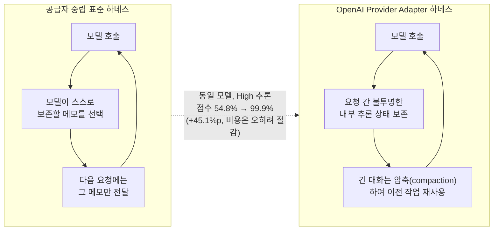
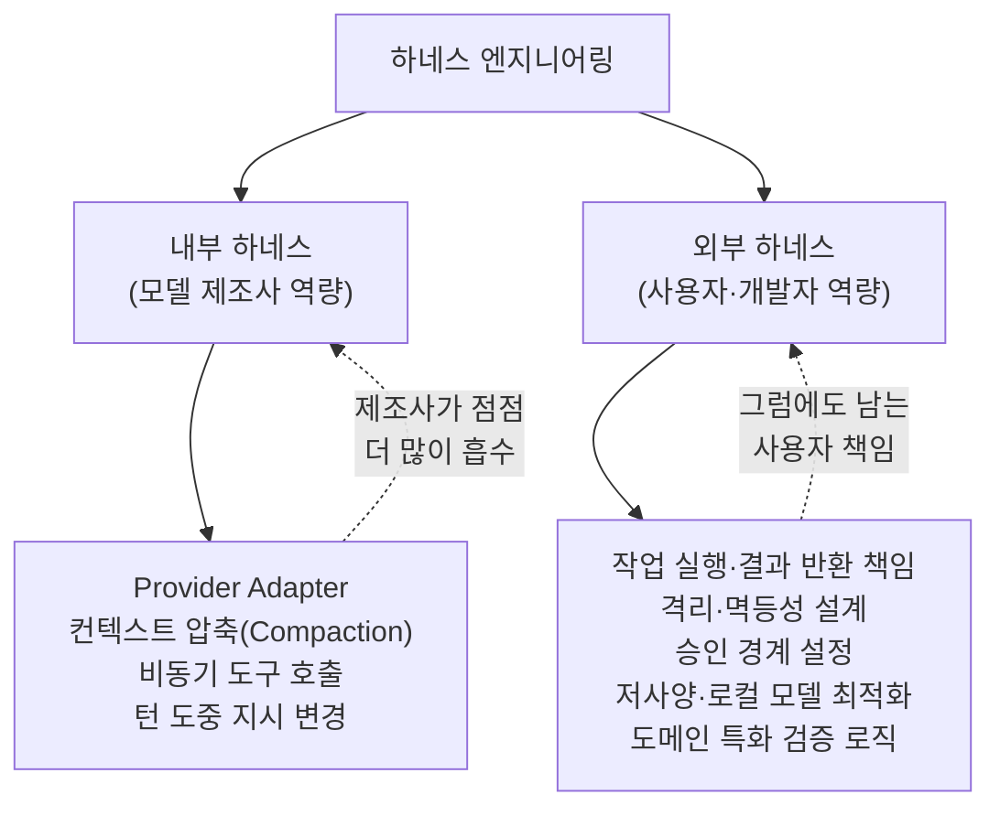
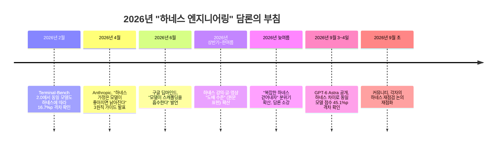

**정리 기준일: 2026년 9월 7일**

```
https://www.threads.com/share/BATIyzwPZU/

요즘 하네스에 대한 이야기가 사라진 이유
1. 올해 상반기~한여름까지는
하네스 엔지니어링 얘기가 진짜 도배 수준이었음
2. 프롬프트 다음이 컨텍스트고, 그다음이 하네스다, 모델보다 환경을 짜는 게 핵심이다… 이런 식의 글·강의·영상이 계속 나왔었음
3. 그런데 지금은 좀 가라앉은 편임. 모델이 좋아지면서 “굳이 복잡한 하네스 계속 만들지 말고 슬슬 걷어내자”, 
“새 모델 나오면 하네스도 다시 검증해야 한다” 같은 말이 나오기 시작했음

지금은 Astra가 나와서
또 다시 자신의 하네스를 점검해볼 차례기도 함
다들 어떻게 하고 계심까??
```

---

## 1. 이 글이 다루는 원문의 내용

이번에 살펴본 스레드(Threads) 게시물은 "요즘 하네스에 대한 이야기가 사라진 이유"라는 제목으로, 필자가 2026년 상반기부터 최근까지 이어져 온 "하네스 엔지니어링" 담론의 부침을 스스로 정리한 단상이다. 요지는 세 가지로 요약된다.

첫째, 2026년 상반기부터 한여름까지는 하네스 엔지니어링 이야기가 그야말로 "도배 수준"이었다고 필자는 회고한다. "프롬프트 다음이 컨텍스트고, 그다음이 하네스다", "모델보다 환경을 짜는 게 핵심이다"라는 식의 글과 강의, 영상이 끊임없이 쏟아졌다는 것이다.

둘째, 그런데 최근 들어 이 담론이 눈에 띄게 가라앉았다는 관찰이다. 모델 자체의 성능이 좋아지면서 "굳이 복잡한 하네스를 계속 만들지 말고 슬슬 걷어내자", "새 모델이 나오면 기존 하네스도 다시 검증해야 한다"는 식의 태도가 확산되었다는 진단이다.

셋째, 그런데 마침 이 글이 올라온 시점에 OpenAI의 GPT-6 Astra가 공개되었고, 이 때문에 각자 자신의 하네스를 다시 점검해볼 시점이 되었다는 문제 제기로 글을 맺는다. 이어진 답글 두 개에서는 상반된 실천이 소개된다. 하나는 "그냥 다 걷어내고 자기 취향과 작업 규약만 남겼다"는 최소주의적 입장이고, 다른 하나는 "하네스는 이제 필수가 되었다"며 하네스를 **내부 하네스**(모델 제조사가 기본으로 제공하는 역량)와 **외부 하네스**(사용자·개발자가 직접 설계하는 역량)로 구분하는 좀 더 정교한 관점이다. 이 관점에 따르면 내부 하네스 역량이 좋아질수록 사용자가 짊어져야 할 외부 하네스 부담은 줄어들지만, 저사양 모델이나 로컬 환경처럼 성능·비용 최적화가 중요한 영역에서는 오히려 외부 하네스 엔지니어링의 중요성이 부각되고 있다고 본다.

이 게시물 아래에는 스무 개 남짓한 댓글이 달려 다양한 실무자 시각을 보여준다. 이 문서는 원문의 주장과 댓글들의 다양한 시각을 정리하는 동시에, 그 배경이 되는 실제 사건 — 특히 원문이 언급한 "Astra"와 ARC Prize의 9월 3일 리포트 — 을 웹 검색으로 직접 확인하여 사실관계를 검증한 내용을 담고 있다.

---

## 2. 먼저, "하네스 엔지니어링"이란 무엇인가

논의를 따라가려면 용어부터 정리할 필요가 있다. **에이전트 하네스(agent harness)** 는 모델 그 자체가 아니라, 모델을 둘러싸고 그것을 실제로 작동하는 에이전트로 만들어주는 소프트웨어 계층을 가리킨다. 구체적으로는 어떤 도구를 쓸 수 있게 할지, 대화가 길어질 때 문맥을 어떻게 유지·압축할지, 실행 루프를 언제 멈추고 언제 사람의 승인을 받을지, 실패했을 때 어떻게 재시도할지를 결정하는 장치들의 총합이다. 업계에서는 흔히 "에이전트 = 모델 + 하네스"라는 등식으로 이를 요약한다. 이 개념은 AI 안전성 평가기관인 METR이 2023년에 "스캐폴딩(scaffolding)"이라는 이름으로 처음 제시했고, 2026년 들어서는 "하네스 엔지니어링"이라는 이름으로 프롬프트 엔지니어링, 컨텍스트 엔지니어링에 이은 "AI 엔지니어링 성숙도의 3단계"로 자리 잡았다는 것이 업계의 통설이다.

핵심 통찰은 이렇다. 하네스의 각 구성 요소는 사실 "모델이 스스로 하지 못하는 어떤 일"에 대한 가정을 코드로 박아 넣은 것이다. 예컨대 "모델이 컨텍스트 한계를 못 느끼고 갑자기 작업을 끊어버리니, 하네스가 대신 남은 토큰을 계산해줘야 한다"는 식이다. 문제는 모델이 좋아질수록 이런 가정들이 하나둘 낡아버린다는 점이다. Anthropic은 2026년 4월에 발표한 하네스 설계 가이드에서 이를 정확히 짚었다. 이 가이드는 세 가지 실천 원칙을 제시하는데, ① 모델이 이미 알고 있는 도구 위에서 만들 것, ② 모델의 역량이 향상됨에 따라 하네스에 박아 넣은 가정들을 계속 재검토하고 걷어낼 것, ③ 그럼에도 UX·비용·안전 관련 경계는 신중하게 설정해서 남겨둘 것이다. Anthropic 공동창업자 크리스 올라(Chris Olah)의 표현을 빌리면, 생성형 AI 시스템은 "만들어진다(built)"기보다 "길러진다(grown)"는 성격이 강해서, 정확히 어떤 능력이 언제 나타날지 예측하기 어렵고, 그래서 하네스 설계자는 모델의 역량 변화에 맞춰 계속 가정을 다시 시험해봐야 한다는 것이다.

---

## 3. 왜 상반기~한여름에 하네스 이야기가 "도배 수준"이었나

원문 필자의 회고는 실제 벤치마크 데이터로도 뒷받침된다. 2026년 2월, 터미널 작업 수행 능력을 겨루는 Terminal-Bench 2.0 리더보드에서 같은 Claude Opus 4.6 모델이 하네스만 바꿔가며 받은 점수는 58.0%에서 74.7%까지 벌어졌다(신뢰구간이 2.5~2.9포인트 수준이므로 이 16.7포인트 격차는 잡음이 아니라 실제 격차로 해석된다). 가장 높은 점수를 기록한 것은 KRAFTON AI가 만든 Terminus-KIRA라는 하네스였다. 반대로 같은 시기 SWE-bench Verified의 bash-only 부문에서는 아홉 개 프런티어 모델을 동일한 mini-swe-agent 하네스에 태워 비교했더니 점수가 66.6%~76.8%로, 이번엔 하네스가 아니라 모델 자체의 차이가 10.2포인트만큼 드러났다. 즉 2026년 초의 데이터는 "모델도 중요하지만 하네스도 그에 못지않게, 때로는 그 이상으로 결과를 좌우한다"는 사실을 숫자로 보여주었고, 이것이 상반기 내내 하네스 담론이 뜨거웠던 실질적 근거였다.

이 시기에 Anthropic은 장시간 자율 실행되는 코딩 작업을 위한 "플래너(Planner)–제너레이터(Generator)–평가자(Evaluator)" 3중 에이전트 아키텍처를 공개하기도 했다. 계획을 세우는 에이전트, 실제로 작업을 수행하는 에이전트, 그 결과를 채점하는 에이전트를 서로 분리한 구조다. Anthropic Labs의 엔지니어링 리드 프리트비 라자세카란(Prithvi Rajasekaran)은 "작업을 수행하는 에이전트와 그것을 평가하는 에이전트를 분리하는 것이 자기 과대평가 문제를 해결하는 강력한 방법으로 확인됐다"고 밝혔는데, 실제로 모델이 자신의 결과물을 스스로 채점하면 특히 디자인처럼 주관적인 영역에서 결과를 후하게 평가하는 경향이 관찰되었기 때문이다. 이 시기에 함께 유명해진 것이 이른바 "랄프 루프(Ralph Loop)"다. Anthropic의 보리스 체르니(Boris Cherny)가 정식화한 이 패턴은 컨텍스트 윈도우의 한계를 코드가 아니라 디스크에 상태를 기록하는 방식으로 우회한다. 즉 에이전트의 연속성이 대화 기록이 아니라 디스크 위의 진행 상황 파일(할 일 목록 등)에서 나오도록 설계하는 것이다.

---

## 4. 최근 담론이 가라앉은 이유 — "모델이 좋아지면 걷어내자"는 흐름

원문 필자가 관찰한 대로, 여름을 지나면서 분위기는 확실히 바뀌었다. 이 변화를 뒷받침하는 근거도 실제로 확인된다. 구글 딥마인드의 로건 킬패트릭(Logan Kilpatrick)은 2026년 6월 "모델이 그 스캐폴딩을 먹어치우고, 그것이 네이티브 모델 시스템의 일부가 된다"고 발언하며, 상당 부분의 하네스 기능이 향후 12개월 안에 모델 자체에 흡수될 것이라 내다봤다. 이는 이 프로젝트의 필자가 직접 경험한 사례 — 자체 구축한 오케스트레이션 계층(agent-grid)의 비용 상한·도구 제한·폴백 로직·검증 기능을 Claude 4.8이 모델 차원에서 흡수하면서 공개를 접었던 일 — 와 정확히 같은 방향의 관찰이다. 실제로 Terminal-Bench의 후속 버전인 2.1 리더보드에서는 추론 강도(reasoning effort)와 제출 시점을 맞춰서 비교하면 하네스에 따른 점수 격차가 0.2~8.1포인트로 좁혀진 것으로 나타나, "하네스 격차가 좁아지고 있다"는 인상을 뒷받침한다. 댓글 중 하나가 "루프 엔지니어링도 결국 하네스"라며 외부 도구를 엮는 어려움을 지적했고, 다른 댓글은 "새 모델이 나오면 관련 스킬을 검토하고 개선하라"고 스스로에게 지시했다는 스펙 주도 개발 경험을 전했는데, 이는 정확히 "하네스는 계속 재검증해야 하는 대상"이라는 흐름을 보여준다. 또 다른 댓글은 "그런 것들은 유효기간이 길어야 두 달이라 두 달에 한 번씩 스킬이고 뭐고 싹 리셋하는 게 낫다"는 다소 급진적인 입장을 밝히기도 했다.

---

## 5. 반전의 계기 — GPT-6 Astra와 ARC-AGI-3 (2026년 9월 3일)

원문이 언급한 "Astra"는 OpenAI가 2026년 9월 3일 공개한 GPT-6 Astra를 가리킨다. 9월 3일에는 신뢰할 수 있는 일부 파트너를 대상으로 한 제한적 프리뷰로 먼저 공개되었고, 바로 다음 날인 9월 4일부터 유료 사용자 전체에게 배포되었다(사이버보안 등 일부 영역에서는 특정 요청을 거부하는 제한된 버전이다). OpenAI 사장 그렉 브록먼(Greg Brockman)은 발표 브리핑에서 최종 판단은 다른 이들에게 맡긴다면서도 개인적으로는 "우리가 거기(AGI)에 도달했다고 생각한다"는 취지로 발언했다고 워싱턴포스트가 보도했다. 다만 OpenAI 헌장이 정의하는 AGI, 즉 "경제적으로 가치 있는 대부분의 작업에서 인간을 능가하는 고도로 자율적인 시스템"이라는 기준에 비춰보면 출시 당일 벤치마크만으로 이를 입증하기는 어렵다는 것이 검증 매체들의 공통된 지적이다. 실제로 벤치마크를 함께 운영한 ARC Prize 재단조차 "이것이 AGI라고 주장하는 것은 아니다"라는 입장을 분명히 했고, 공동창업자 마이크 크노프(Mike Knoop)는 "아직 이것을 AGI라고 부를 만한 증거는 부족하다"고 밝혔다.

그런데 이번 담론에서 더 중요한 것은 AGI 여부가 아니라, **바로 이 벤치마크 결과가 하네스 논쟁에 결정적인 새 증거를 제공했다**는 점이다. ARC Prize는 GPT-6 Astra를 두 가지 서로 다른 실행 환경(하네스)에 태워 ARC-AGI-3라는 벤치마크를 돌렸다. 하나는 ARC Prize가 모든 모델에 공통으로 적용하는 **공급자 중립 표준 하네스**로, 모델이 스스로 어떤 메모를 다음 요청에 남길지 결정하게 하는 방식이다. 다른 하나는 OpenAI가 직접 제공한 **프로바이더 어댑터(Provider Adapter) 하네스**로, 요청과 요청 사이에 겉으로 드러나지 않는 내부 추론 상태를 그대로 보존하고, 대화가 길어지면 이를 압축(compaction)해서 이전 작업을 재활용할 수 있게 해주는 방식이다. 결과는 다음과 같았다.

| 하네스 구성 | 추론 강도 | ARC-AGI-3 점수 | 평가 비용(추정) |
|---|---|---|---|
| 공급자 중립 표준 하네스 | Max | 62.7% | 약 $26,098 |
| 공급자 중립 표준 하네스 | High | 54.8% | 약 $40,705 |
| OpenAI Provider Adapter 하네스 | High | **99.9%** | 약 $18,817 |

*(출처: ARC Prize 공식 블로그 및 결과 페이지, 2026년 9월 3~4일 게시)*

가장 눈여겨봐야 할 비교는 표의 두 번째와 세 번째 행이다. **추론 강도를 High로 똑같이 맞춘 상태에서 하네스만 표준에서 프로바이더 어댑터로 바꿨을 뿐인데 점수가 54.8%에서 99.9%로, 무려 45.1퍼센트포인트 뛰어올랐다.** 모델 자체는 전혀 바뀌지 않았다. 게다가 비용은 오히려 더 저렴해졌다. ARC Prize가 두 하네스가 공통으로 풀어낸 167개의 게임-추론 문제를 놓고 비교했을 때, 프로바이더 어댑터 쪽이 토큰을 49% 덜 쓰면서 처리 속도도 약 3.66배 빨랐다.

이 수치는 앞서 소개한 댓글 하나(ARC Prize의 9/3 리포트를 인용하며 "모델이 좋아진다고 하네스가 덜 중요해지는 게 아니라 점수·비용 양쪽에서 하네스 차이가 더 벌어지는 쪽에 가깝다"고 주장한 댓글)의 근거였다. 실제 확인 결과 이 댓글이 인용한 수치(표준 하네스 62.7%/약 2만6천 달러, 프로바이더 어댑터 99.9%/약 1만9천 달러)는 ARC Prize가 공식적으로 발표한 "최고 관측 점수(best observed score)" 기준과 정확히 일치한다. 다만 정밀하게 보면 이 두 수치는 각각 Max와 High라는 서로 다른 추론 강도에서 나온 최고치를 비교한 것이라, 완전히 동일한 조건의 비교는 아니다. 하네스 하나의 순수한 효과만 보려면 같은 추론 강도(High)로 맞춘 54.8% 대 99.9%, 즉 45.1퍼센트포인트 차이가 더 엄밀한 비교치다. 어느 쪽으로 계산해도 결론은 같다 — **하네스만 바꿔도 모델 성능 인식이 완전히 달라질 수 있다는 것**이다.

한 가지 덧붙일 사실 확인이 있다. GPT-6 Astra 출시 이후 여러 매체가 지적했듯, 출시 초기 공개된 일부 벤치마크 수치는 이후 조용히 수정되었다. Astra의 환각률은 최초 4.2%로 공개됐다가 한때 2%로 바뀐 뒤 다시 4.2%로 되돌아왔고, ARC Prize의 표준 하네스 점수도 ARC Prize 공동창업자 프랑수아 숄레(François Chollet)가 별도 게시물에서 "66%"라고 언급한 반면 공식 발표 표에는 "62.7%"로 기재되는 등 출처 간 약간의 불일치가 존재한다. 이 문서에서는 ARC Prize의 공식 블로그·결과 페이지에 실린 수치를 1차 기준으로 삼았다.



이 결과가 왜 하네스 담론을 다시 불붙였는지는 분명하다. 여름 동안 퍼져 있던 "모델이 좋아지면 하네스는 점점 덜 필요해진다"는 낙관론과 정면으로 배치되는 사례이기 때문이다. 정확히 말하면 이 사례가 반박하는 것은 "하네스가 아예 필요 없어진다"는 극단적 주장이지, "직접 만들던 커스텀 하네스를 계속 무겁게 유지해야 한다"는 주장은 아니다. 오히려 이 사례의 핵심은 **하네스 자체가 사라지는 것이 아니라, 그 하네스를 누가 제공하느냐(사용자가 직접 짜는 외부 하네스 vs. 모델 제조사가 기본 제공하는 내부 하네스)의 무게중심이 이동하고 있다**는 것에 가깝다.

---

## 6. 왜 이 담론이 "가라앉았다"고 느껴졌는지에 대한 더 정확한 설명

여기서 짚어야 할 부분이 있다. 여름 동안 하네스 담론이 조용해진 것은 하네스 자체가 덜 중요해졌기 때문이라기보다, **하네스의 상당 부분을 모델 제조사가 기본 기능으로 흡수해 가면서, 사용자가 직접 손으로 짜야 했던 부분이 줄어들었기 때문**이라는 설명이 더 정확해 보인다. 이번 GPT-6 Astra의 사례에서도 이 흡수 현상이 그대로 확인된다. OpenAI에 따르면 이번 모델의 API(Responses API)에는 다음과 같은 기능들이 기본으로 들어갔다.

- **과거 문맥 검색**: 요약에서 누락된 세부사항을 이전 메시지나 도구 실행 결과에서 직접 다시 찾아올 수 있는 기능(출시 시점 기준 실험적 기능으로 표시됨)
- **비동기 도구 호출**: 느린 작업을 시작해두고 그 결과를 기다리는 동안 다른 독립적인 작업을 계속 진행할 수 있는 기능
- **턴 도중 지시 변경(mid-turn steering)**: 웹소켓 연결을 통해 작업이 진행되는 도중에도 요구사항을 바꿔 지시할 수 있는 기능

이 세 가지는 모두 과거에는 개발자가 직접 하네스 코드로 구현해야 했던 기능들이다. 이런 기능이 모델 제공자 쪽에서 기본으로 제공되기 시작하면, 사용자 입장에서는 "굳이 복잡한 하네스를 계속 만들지 않아도 된다"고 느끼게 된다. 이것이 바로 원문의 답글 중 하나가 제시한 "내부 하네스와 외부 하네스" 구분이 정확히 짚어낸 지점이다 — 제조사가 제공하는 내부 하네스 역량이 좋아질수록 사용자가 짊어져야 할 외부 하네스의 부담은 줄어든다는 것이다.

다만 같은 발표 자료에서 OpenAI 스스로도 분명히 밝히고 있듯, 이 새 기능들이 모든 책임을 대신해주는 것은 아니다. 비동기 도구 호출에서 실제 작업 실행과 올바른 호출 ID로 결과를 반환하는 책임은 여전히 애플리케이션(즉 하네스)에 있고, 턴 도중 지시 변경 기능도 이미 실행된 작업을 되돌리거나 진행 중인 도구 호출을 취소해주지는 않는다. 두 개의 비동기 도구가 같은 시스템에 동시에 쓰기 작업을 수행한다면 격리와 멱등성(idempotency), 승인 경계를 설계하는 책임은 여전히 애플리케이션 쪽에 남아있다. 즉 "모델 성능이 좋아져도 이런 엔지니어링 책임은 사라지지 않는다"는 것이 정확한 요약이다.



---

## 7. 두 갈래로 갈리는 업계의 시각 — "흡수된다" vs. "이동할 뿐이다"

이 지점에서 업계의 시각은 뚜렷하게 두 갈래로 나뉜다. 앞서 소개한 구글 딥마인드 로건 킬패트릭의 발언, 즉 "모델이 스캐폴딩을 먹어치운다"는 입장이 하나다. 반면 Anthropic은 결이 다른 진단을 내놓았다. 하네스가 낡은 가정을 담고 있다는 점에는 동의하면서도, Anthropic의 결론은 "흥미로운 하네스 조합의 공간이 모델이 좋아진다고 줄어드는 것이 아니라, 그 위치가 이동할 뿐이다"라는 것이다. 즉 저수준의 반복 작업(예: 컨텍스트가 꽉 찼을 때 무엇을 끊어낼지)은 모델에 흡수되지만, 그보다 상위의 판단(예: 여러 하위 에이전트에게 작업을 어떻게 분배하고, 어떤 결과가 나왔을 때 사람의 승인을 받아야 하는지)에 대한 하네스 설계는 계속 새로운 형태로 필요해진다는 관점이다.

원문 댓글들 가운데서도 이와 같은 시각이 여럿 발견된다. "패러다임이 바뀌면서 이전 것이 무효화되는 게 아니라 스태킹된다"며 프롬프트·컨텍스트·하네스가 모두 계속 중요하되 새 모델이 나올 때마다 손봐야 할 뿐이라는 의견, "여전히 하네스는 중요하며 새 모델이 나올 때마다 기존 하네스의 유지보수를 1순위로 진행해야 한다"는 의견, "프로젝트가 무거울수록 하네스 개념이나 시스템은 꼭 필요하다"는 의견이 이런 관점에 해당한다. 반대로 "모델이 더 똑똑해지고 컨텍스트를 잘 주입한다면 하네스나 루프는 필요 없어지고, 그저 일을 어떻게 쪼개서 순차적으로 시키고 어떤 결과물을 원하는지 알려주는 능력만 중요해진다"는 댓글은 킬패트릭 쪽의 "흡수론"에 가깝다.

흥미로운 반론도 있다. "그래프 엔지니어링부터 탈락자가 나온다. 직관적이지 않아졌기 때문"이라는 댓글이나 "하네스 세팅을 하다가 이게 뭔지 싶어서 나가떨어졌다"는 댓글은, 하네스 엔지니어링이 실제로는 상당한 학습 곡선을 요구하는 전문 영역이 되어버렸다는 진입장벽 문제를 지적한다. 이는 "오히려 예전에 하네스를 너무 무겁게 만들고 있었던 것 아니냐"는 자성적 댓글과도 통한다. 학계에서도 이런 우려를 반영하는 연구가 나오고 있다. 예컨대 하네스 자체를 자동으로 탐색·최적화하는 "메타 하네스(Meta-Harness)" 연구는, 사람이 일일이 손으로 설계하는 대신 에이전트가 하네스 코드 자체를 탐색해 성능과 비용의 파레토 최적 조합을 자동으로 찾아내도록 하는 접근을 제시한다. 댓글 중 "이젠 메타 하네스가 중요하다고 본다"는 언급도 이런 흐름을 정확히 짚은 것으로 보인다.

---

## 8. 종합 판단 — 지금 시점에서 하네스 엔지니어링을 어떻게 바라봐야 하는가

지금까지 확인한 사실들을 종합하면, "하네스 담론이 사라졌다"는 원문의 관찰과 "하네스는 여전히, 혹은 오히려 더 중요해졌다"는 댓글들의 반론은 사실 서로 모순되지 않는다. 둘 다 같은 현상의 다른 절반을 보고 있을 뿐이다.

한편으로는 분명히 축소되는 영역이 있다. 문맥 관리, 재시도 로직, 도구 호출 중 비동기 처리처럼 "모델이 스스로 하지 못해서 하네스가 대신 처리해주던 저수준 배관 작업"은 모델 제조사의 API 계층으로 빠르게 흡수되고 있다. 실행층(execution layer)에 해당하는 이런 작업은, 이번 GPT-6 Astra의 Provider Adapter 사례처럼 사용자가 직접 코드를 짜지 않아도 되는 방향으로 계속 옮겨갈 가능성이 높다. Terminal-Bench 2.0에서 2.1로 넘어가며 하네스 간 점수 격차가 좁아진 현상도 이 흐름과 궤를 같이한다.

다른 한편으로는 오히려 중요성이 커지는 영역이 있다. **언제 어떤 하네스 구성 요소를 걷어낼지, 무엇을 남겨둬야 안전한지, 저사양·로컬 모델처럼 제조사의 최신 인프라 혜택을 받지 못하는 환경에서 어떻게 성능·비용을 최적화할지, 여러 하위 에이전트에게 작업을 어떻게 분배하고 그 결과를 무엇으로 검증할지**를 판단하는 능력이다. 이는 판단층(judgment layer)에 가까운 작업이며, Anthropic이 강조한 "하네스에 박아 넣은 가정을 모델이 좋아질 때마다 다시 시험해보라"는 원칙, 그리고 원문 답글이 말한 "외부 하네스 엔지니어링 역량"이 정확히 이 영역을 가리킨다. GPT-6 Astra가 기본 제공하는 비동기 도구 호출과 지시 변경 기능조차 "실행 관리와 승인 경계 설계는 여전히 애플리케이션의 책임"이라고 OpenAI 스스로 명시한 것도 같은 맥락이다.

결국 이번 국면에서 재확인된 것은 하네스 엔지니어링의 "종말"이 아니라 **분업 구조의 재편**이다. 모델을 새로 낼 때마다 기존에 손으로 짰던 하네스의 어떤 부분이 모델 쪽으로 흡수되었는지 점검하고, 그 자리에서 걷어낼 것은 걷어내되, 여전히 사람의 판단이 필요한 부분(작업 분배 전략, 검증 기준, 비용·안전 경계)에는 계속 투자하는 것이 실무적으로 합리적인 태도로 보인다. 원문 필자가 던진 질문 — "Astra가 나온 지금, 다들 어떻게 하고 계심까" — 에 대한 답은, 결국 "전면 재정비"와 "필수 유지" 사이의 이분법이 아니라 **"어느 하네스 구성 요소가 이번 세대 모델에서 흡수되었는지를 먼저 확인하고, 남은 부분에 집중하는 것"** 이 되어야 할 것이다.



---

## 9. 용어 해설

| 용어 | 설명 |
|---|---|
| 하네스(Harness) / 에이전트 하네스 | 모델을 둘러싸고 도구 제공, 문맥 관리, 재시도, 상태 기록, 실행 순서 결정 등을 담당하는 소프트웨어 계층. "에이전트 = 모델 + 하네스"로 요약됨 |
| 스캐폴딩(Scaffolding) | 하네스와 거의 같은 의미로 쓰이는 용어. 2023년 METR이 처음 제시한 표현 |
| 컨텍스트 엔지니어링(Context Engineering) | 프롬프트 엔지니어링 다음 단계로 꼽히는, 모델에 어떤 정보를 어떤 순서·형태로 넣어줄지 설계하는 작업 |
| 컴팩션(Compaction, 문맥 압축) | 길어진 대화의 상태와 추론 과정을 더 적은 토큰으로 요약해 이어가는 기법. 압축 과정에서 세부 제약조건이 누락될 수 있다는 한계가 있음 |
| 표준(중립) 하네스 | ARC Prize 등 벤치마크 기관이 모든 모델에 동일하게 적용하는 공급자 중립적 실행 환경 |
| 프로바이더 어댑터(Provider Adapter) 하네스 | 모델 제공사(예: OpenAI)가 자사 모델에 맞춰 직접 제공하는 실행 환경. 요청 간 내부 추론 상태 보존, 문맥 압축 등을 포함 |
| ARC-AGI-3 | ARC Prize 재단이 만든 벤치마크로, 에이전트가 낯선 게임 환경의 규칙을 스스로 파악하고 상호작용하며 목표를 달성하는 능력을 측정 |
| 비동기 도구 호출(Async Tool Calling) | 모델이 도구 실행을 시작해두고 그 결과를 기다리는 동안 다른 독립적인 작업을 계속 진행할 수 있게 하는 기능 |
| 턴 도중 지시 변경(Mid-turn Steering) | 모델이 작업을 수행하는 도중에도 웹소켓 등을 통해 요구사항을 바꿔 지시할 수 있는 기능 |
| 랄프 루프(Ralph Loop) | Anthropic의 보리스 체르니가 정식화한 패턴으로, 에이전트의 연속성을 대화 기록이 아니라 디스크에 기록된 진행 상황 파일에서 확보하는 설계 |
| 플래너-제너레이터-평가자 아키텍처 | 계획 수립, 실제 작업 수행, 결과 평가를 각각 다른 에이전트로 분리해 자기 과대평가 편향을 줄이는 설계 |
| 메타 하네스(Meta-Harness) | 사람이 손으로 설계하는 대신, 에이전트가 하네스 코드 자체를 탐색·최적화하도록 하는 접근을 가리키는 연구 용어 |
| 내부 하네스 / 외부 하네스 | 이번 원문 스레드에서 쓰인 구분으로, 모델 제조사가 기본 제공하는 역량(내부)과 사용자·개발자가 직접 설계하는 역량(외부)을 나눈 개념 |

---

## 10. 출처 신뢰도 표기

이 문서에서 인용한 사실관계는 신뢰도에 따라 아래 네 단계로 구분해 표기한다.

**① 공식 1차 출처**
- ARC Prize 공식 블로그 "OpenAI's GPT-6 Astra on ARC-AGI-3" (arcprize.org/blog/astra)
- ARC Prize 공식 결과 페이지 "GPT-6 Astra – ARC-AGI Results" (arcprize.org/results/openai-gpt-6-astra)
- OpenAI 공식 발표 "GPT-6 Astra: A new generation of intelligence" (openai.com/index/gpt-6-astra)
- Anthropic 공식 블로그 "Agent Harness Design: 3 Patterns for Harnessing Claude's Intelligence" (claude.com/blog/harnessing-claudes-intelligence)

**② 복수 매체 교차검증**
- ARC-AGI-3 표준/프로바이더 어댑터 점수·비용 수치는 The New Stack, TheNextWeb, Kingy AI, officechai.com, GeekNews(fewshotacademy.com 요약) 등 다수 매체가 ARC Prize 원자료를 인용해 서로 일치하는 수치를 보도함
- GPT-6 Astra의 9월 3일 출시, AGI 논쟁, ARC Prize의 "AGI 아니다" 입장은 Washington Post, Wikipedia("GPT-6 Astra" 항목) 등에서 교차 확인됨

**③ 단일 출처(분석적 성격)**
- Terminal-Bench 2.0/2.1 하네스별 점수 격차(16.7포인트 → 0.2~8.1포인트로 축소) 수치는 datanorth.ai의 단일 분석 글에서 확인. 원자료인 Terminal-Bench/Artificial Analysis 리더보드와 방향성은 일치하나, 구체적인 격차 수치 자체는 교차검증되지 않음
- 구글 딥마인드 로건 킬패트릭의 "모델이 스캐폴딩을 흡수한다" 발언은 위 datanorth.ai 글에서 인용된 것으로, 발언 원본(1차 소스)은 별도로 확인하지 못함

**④ 분석적 종합·편집 판단**
- "담론이 가라앉은 것은 하네스의 중요성이 줄어서가 아니라 내부 하네스로 흡수되었기 때문"이라는 이 문서 8절의 종합 해석
- 원문 스레드 게시물과 댓글에 담긴 각 개인의 실무 경험·의견(하네스 세팅의 어려움, 두 달 주기 리셋론, 그래프 엔지니어링 탈락자 등)은 검증 대상이 아닌 개인 견해로, 사실관계로 취급하지 않음

---

## 11. 참고문헌

1. ARC Prize, "OpenAI's GPT-6 Astra on ARC-AGI-3" — https://arcprize.org/blog/astra
2. ARC Prize, "GPT-6 Astra – ARC-AGI Results" — https://arcprize.org/results/openai-gpt-6-astra
3. OpenAI, "GPT-6 Astra: A new generation of intelligence" — https://openai.com/index/gpt-6-astra/
4. OpenAI, "Async tool calling" 개발자 가이드 — https://developers.openai.com/api/docs/guides/async-tool-calling
5. OpenAI, "Mid-turn steering" 개발자 가이드 — https://developers.openai.com/api/docs/guides/steering
6. Anthropic, "Agent Harness Design: 3 Patterns for Harnessing Claude's Intelligence" — https://claude.com/blog/harnessing-claudes-intelligence
7. InfoQ, "Anthropic Designs Three-Agent Harness Supports Long-Running Full-Stack AI Development" — https://infoq.com/news/2026/04/anthropic-three-agent-harness-ai/
8. The New Stack, "OpenAI will sell you Astra, but not the system that scored 98.6% on ARC-AGI-3" — https://thenewstack.io/openai-astra-harness-arc-agi-3/
9. TheNextWeb, "Astra's AGI score came from a harness, not the model" — https://thenextweb.com/news/openai-astra-arc-agi-3-harness-62-7-vs-99-9-benchmark-revisions
10. Kingy AI, "Astra Scored 98.6% on ARC-AGI-3. NVIDIA Already Hit 100%. What Did Either Result Prove?" — https://kingy.ai/news/astra-arc-agi-3-benchmark-paradox/
11. officechai.com, "GPT-6 Astra 'Major Breakthrough' On ARC-AGI-3 With Score Of 62%" — https://officechai.com/ai/gpt-6-astra-major-breakthrough-on-arc-agi-3-with-score-of-62/
12. GeekNews(뉴스 요약, 원문은 fewshotacademy.com), "GPT-6 Astra: 하네스가 곧 제품이다" — https://news.hada.io/topic?id=33301 (원문: https://fewshotacademy.com/blog/gpt-6-astra-the-harness-is-the-product)
13. Wikipedia, "GPT-6 Astra" 항목 — https://en.wikipedia.org/wiki/GPT-6_Astra
14. The Washington Post, OpenAI 그렉 브록먼 관련 보도 (2026.9.3) — https://www.washingtonpost.com/technology/2026/09/03/openai-greg-brockman-says-its-new-model-astra-is-agi/
15. datanorth.ai, "What is Harness Engineering? The AI Agent Scaffolding Guide" — https://datanorth.ai/blog/harness-engineering-the-complete-guide-to-ai-agent-scaffolding
16. Faros, "Harness Engineering: A Guide to AI Coding Agents" — https://www.faros.ai/blog/harness-engineering
17. Snorkel AI, "Terminal-Bench 2.1: LLM Terminal Agent Benchmark" — https://snorkel.ai/leaderboard/terminal-bench-2-1/
18. arXiv, "Meta-Harness: End-to-End Optimization of Model Harnesses" — https://arxiv.org/pdf/2603.28052
19. Vellum, "GPT-6 Astra Benchmarks Explained" — https://www.vellum.ai/blog/gpt-6-astra-benchmarks-explained
20. 원 게시물(Threads) — https://www.threads.com/share/BATIyzwPZU/

---

*본 문서는 사용자가 제공한 스레드 게시물과 댓글 내용을 웹 검색을 통해 사실 검증하여 작성한 자료입니다. 커뮤니티 댓글에 담긴 개인 의견·경험은 별도로 검증하지 않았으며, 벤치마크 수치와 모델 출시 정보는 위 참고문헌의 1차·2차 출처를 기준으로 확인했습니다.*
