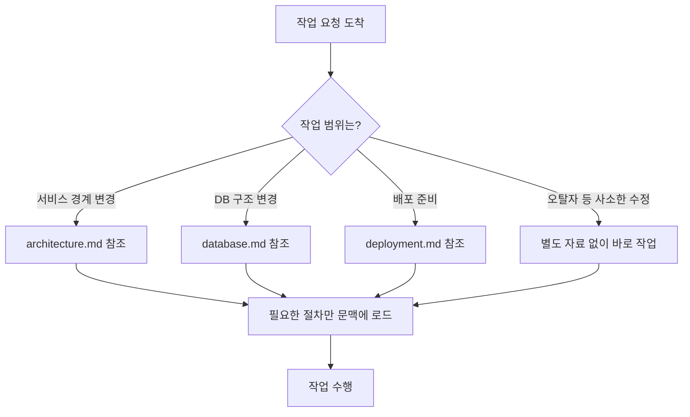
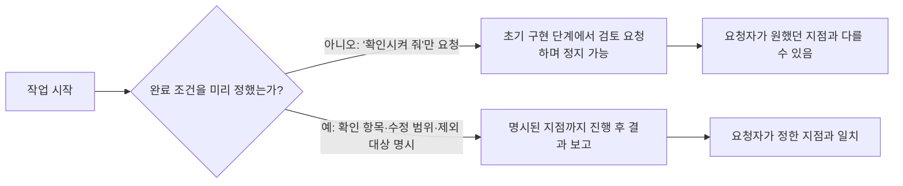
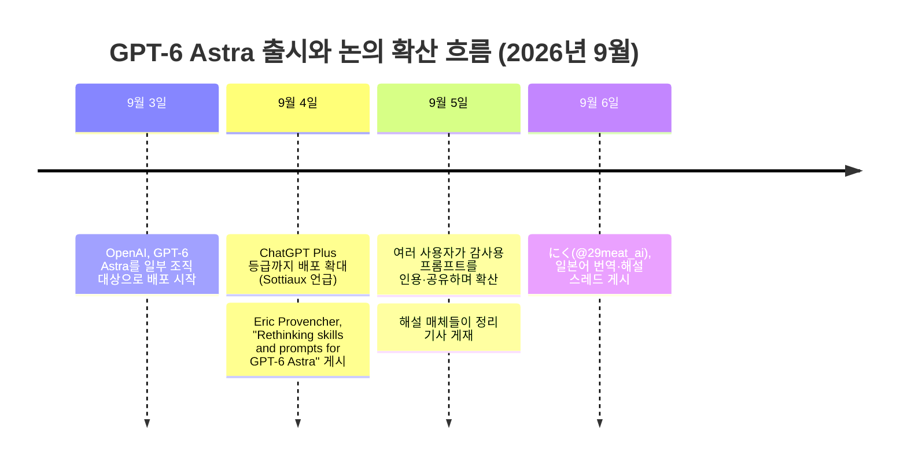

## 이 문서에 대하여

이 문서는 X(구 트위터)에 게시된 두 개의 글을 바탕으로 작성되었다. 하나는 OpenAI Codex 팀의 Eric Provencher가 2026년 9월 4일에 올린 ["Rethinking skills and prompts for GPT-6 Astra"](https://developers.openai.com/blog/rethinking-skills-and-prompts-for-gpt-6-astra)라는 아티클이고, 다른 하나는 이 아티클을 일본어로 옮기고 해설을 덧붙여 9월 6일 게시한 にく([@29meat_ai](https://x.com/29meat_ai/status/2096415124143972582))의 스레드다. 공유받은 자료는 후자의 전체 본문이며, 이 문서는 그 내용을 한국어로 상세히 풀어 설명하면서 원문 아티클과 관련 보도를 웹 검색으로 다시 확인해 사실관계를 보강한 것이다.

핵심 주제는 하나다. AI 코딩 에이전트에게 매번 붙여 온 "이 자료를 꼭 읽어라", "반드시 테스트해라", "작업 전에 확인받아라" 같은 지시문들이, 모델이 더 똑똑해진 뒤에도 여전히 유효한가 하는 질문이다. Provencher는 GPT-6 Astra라는 새 모델의 등장을 계기로, Skills 파일과 AGENTS.md, 그리고 평소의 작업 지시문을 다시 점검할 것을 제안한다.

---

## 1. 배경: GPT-6 Astra는 무엇인가

논의의 출발점을 이해하려면 먼저 GPT-6 Astra 자체를 짚어야 한다. OpenAI는 2026년 9월 3일 GPT-6 Astra를 일부 조직에 한정해 배포하기 시작했다고 공식 발표했으며, 이후 며칠에 걸쳐 ChatGPT Plus·Pro·Business·Enterprise 사용자와 API, AWS로 확대하겠다고 밝혔다. OpenAI는 이 모델을 "세계에서 가장 지능적이고 정렬(aligned)된 모델"이라고 소개했고, 사전학습·강화학습·정렬 연구의 성과를 결합한 결과물이라고 설명했다.

같은 날 Codex를 이끄는 Thibault Sottiaux는 배포가 ChatGPT Plus 등급까지 도달했다고 알렸다. 다만 실제 화면에서는 다소 복잡한 구조로 나타난다. Plus 요금제 사용자는 ChatGPT의 "Work"(장시간 작업을 처리하는 에이전트 모드)와 "Codex"(소프트웨어 개발 전용 모드)에서만 Astra를 쓸 수 있고, 일반 대화창인 "Chat"에서는 여전히 이전 모델인 GPT-5.6 Sol이 기본으로 남아 있다. Chat에서 Astra를 쓰려면 Pro 이상 요금제가 필요하다.

Astra는 컴퓨터 사용, 브라우징, 소프트웨어 엔지니어링, 사이버보안, 과학 분야에서 이전 모델 대비 크게 향상된 성능을 보인다고 OpenAI는 밝혔다. 다만 이 문서가 다루는 핵심 논지는 벤치마크 수치가 아니라, "모델이 더 똑똑해졌을 때 우리가 써 온 지시문은 그대로 유효한가"라는 실무적 질문이다.

---

## 2. 원문의 출처와 확산 경로

이 논의가 어떻게 퍼졌는지를 표로 정리하면 다음과 같다.

| 단계 | 작성자 / 계정 | 형식 | 시점(2026년) | 내용 |
|---|---|---|---|---|
| 원문 | Eric Provencher (@pvncher, OpenAI Codex DX 소속) | X 아티클 | 9월 4일 | "Rethinking skills and prompts for GPT-6 Astra" — Skills, AGENTS.md, 작업 지시문을 새 모델에 맞게 재검토하자는 제안 |
| 확산 | Joe Devon 등 다수 사용자 | X 인용 게시 | 9월 4~5일 | Provencher의 글을 인용하며, Codex에게 직접 감사를 맡기는 프롬프트를 공유 |
| 해설 | にく (@29meat_ai) | X 스레드(장문) | 9월 6일 | Provencher의 원문을 일본어로 옮기고, 다섯 개 절로 구조화해 해설. 원문에 없는 응용 예시는 "응용예"로 별도 표기 |

Provencher는 OpenAI에서 Codex의 개발자 경험(DX)을 담당하는 인물로 소개되며, 코드 편집 도구 "repoprompt"를 만든 사람으로도 알려져 있다. 다만 그의 정확한 사내 직함이나 이력에 대한 상세 정보는 이번 검색 범위에서 1차 출처로 확인되지 않아, 이 문서에서는 보도된 소개 문구를 그대로 인용하는 수준에 그친다.

にく의 스레드는 원문의 취지를 해치지 않는 선에서 실제 업무 상황(코딩이 아닌 콘텐츠 제작이나 문의 폼 제작 등)에 빗댄 예시를 여러 개 덧붙였다. 이 문서에서도 원문의 예시와 にく가 만든 응용 예시를 구분해서 설명한다.

---

## 3. 핵심 논지: "예전 모델을 위한 지시가 새 모델의 발목을 잡는다"

Provencher가 던지는 첫 번째 메시지는 이렇다. 지난 1년 가까이 코딩 에이전트를 실무에 써 온 사람이라면, Skills와 AGENTS.md, 평소 작업 지시문 안에 상당한 양의 지시가 쌓여 있을 가능성이 크다. 이 지시들은 대부분 "모델이 실수하지 않도록 옆에서 손을 잡아 주는" 성격을 띤다. 자료를 안 읽고 고쳐서 문제가 생겼다면 "먼저 읽어라"라는 규칙을 추가하고, 허락 없이 진행해서 문제가 생겼다면 "진행 전에 확인받아라"라는 규칙을 추가하는 식이다.

문제는 이런 규칙들이 특정 시점의 특정 모델의 약점을 보완하기 위해 쓰였다는 점이다. 모델이 바뀌면 그 규칙이 여전히 필요한지는 다시 따져봐야 한다. Provencher는 새 모델이 나올 때마다 이런 재검토가 필요했지만, GPT-6 Astra에서는 그 필요성이 어느 때보다 크다고 말한다. 그 근거로 그는 Astra가 문맥의 미묘한 차이나 모호함을 다루는 능력이 이전 모델보다 향상되었다는 점을 든다. 과거에는 도움이 되었던 세세한 지정이, 지금은 오히려 결과를 방해할 수 있다는 것이다.

여기서 주의할 점이 하나 있다. "모델이 똑똑해졌으니 설명을 그만두자"는 이야기가 아니라는 것이다. Provencher도 필요한 자료를 안내하는 일, 안전하게 진행할 수 있는 범위를 알려 주는 일, 완성까지 필요한 작업을 설명하는 일은 계속 필요하다고 본다. 다시 말해 이번 재검토의 대상은 "지시의 양" 자체가 아니라, 그 지시가 실제로 어떤 역할을 하고 있는가다.

이 구분을 위해 원문과 にく의 해설은 몇 가지 대비를 제시한다. "이 자료에 설계상 제약이 적혀 있다"는 자료를 찾는 데 필요한 안내다. 반면 "어떤 수정이든 매번 이 자료를 처음부터 전부 읽어라"는 읽는 시점까지 일률적으로 고정해 버린 규칙이다. 자료의 존재를 알리는 것과, 매번 전부를 읽게 강제하는 것은 다르다. 마찬가지로 "운영 환경 접근은 금지"와 "로컬에서 테스트를 실행하기 전에도 매번 확인받아라"는 막고 있는 행동 자체가 다르다. 전자를 지키고 싶다고 해서 후자까지 반드시 필요한 것은 아니다.

이러한 재검토는 대화창의 한 줄짜리 지시문에만 국한되지 않는다. Skills, AGENTS.md, 평소의 작업 요청문이 모두 검토 대상이며, 한 곳만 고치고 다른 곳에 같은 제약이 남아 있으면 점검이 끝난 것이 아니다.

---

## 4. 줄여야 할 지시 — 매번의 전체 읽기, 지나치게 세세한 절차

가장 먼저 손봐야 할 대상은 작업 내용과 무관하게 일률적으로 발동하는 "읽기 규칙"이다. Provencher는 오탈자 하나를 고치는 작업에까지 방대한 자료나 리포지토리 전체 안내를 읽히는 것은 과도하다고 지적한다.

자료를 읽으면 그 내용이 모델이 작업 중 참조하는 정보, 즉 문맥(컨텍스트)에 포함된다. 관계없는 설명까지 읽어 들이면 쓸 수 있는 문맥이 소모되고 작업이 느려진다. 문맥이 계속 쌓이면 대화나 작업 이력을 압축하는 처리, 이른바 컴팩션(compaction)에도 가까워진다. 그래서 참조할 자료의 개수를 무작정 줄이기보다, 지금 맡은 작업에 정말 필요한 자료가 무엇인지를 구분하는 쪽으로 접근해야 한다.

### 예시 1 — 원문에 제시된 예시(にく의 일본어 번역을 재구성)

수정 전 지시는 "편집 전에 반드시 architecture.md, database.md, deployment.md를 모두 읽을 것"이었다. 서비스 간 경계를 다루는 architecture.md, 데이터베이스 구조를 다루는 database.md, 배포 준비를 다루는 deployment.md 세 개를 예외 없이 모두 읽으라는 규칙이다.

수정 후 지시는 "서비스 간 경계를 다룰 때는 architecture.md를, 데이터베이스 구조를 바꿀 때는 database.md를, 배포를 준비할 때는 deployment.md를 참조할 것"으로 바뀐다. 세 자료에 대한 안내 자체는 그대로 남아 있다. 달라진 것은 그 자료를 여는 조건이다. 화면의 오탈자 하나를 고치는 요청에는 세 자료를 모두 열 필요가 없어지고, 데이터베이스 구조를 바꾸는 작업이라면 database.md로 곧장 연결된다. 그렇다고 다른 자료를 아예 참조하지 못하게 막은 것은 아니며, 작업이 여러 영역에 걸치면 필요한 자료도 하나 이상일 수 있다.

### 예시 2 — にく가 만든 응용 예시(코딩이 아닌 콘텐츠 제작 사례)

이 예시는 Provencher 본인이 제시한 것이 아니라, にく가 기사·영상·SNS 게시물 제작을 Codex에 맡기는 상황에 빗대어 만든 응용 사례임을 밝혀 둔다.

수정 전은 "콘텐츠 제작에서는 기사·영상·SNS 게시물의 모든 절차를 읽을 것"이다. 수정 후는 "기사 집필에는 writing.md, 영상 제작에는 video.md, SNS 게시물 작성에는 social.md를 참조하고, 여러 형식을 함께 요청받으면 해당하는 절차를 모두 참조한다"로 바뀐다. 기사 한 편만 요청받았다면 기사용 절차로 진입하고, 기사와 그 홍보 게시물을 함께 요청받았다면 두 절차 모두로 진입한다. 영상 제작 요청이 없는데도 영상 제작의 전체 공정을 읽어 들이는 일은 사라진다.

### 점진적 공개(progressive disclosure)라는 개념

원문은 필요한 설명을 단계적으로 전달하는 이 방식을 "progressive disclosure"라고 부른다. 입구에는 어디로 가야 할지 판단하는 데 필요한 최소한의 안내만 두고, 상세한 지식이나 절차는 그 뒤에 연결된 자료로 분리하는 방법이다. 여러 작업 절차를 갖는 Skill이라면, 최초 문서는 관련 문서나 실행 스크립트로 안내하는 역할만 하는, 최소한의 라우터(router)에 가까워야 한다는 것이 Provencher의 설명이다.

같은 취지에서, 이전 모델을 보조하기 위해 매번 반복시켜 온 테스트 지시에도 같은 잣대가 적용된다. 다만 원문도 니쿠의 해설도 "Astra는 테스트가 필요 없다"고 말하지는 않는다. 문제 삼는 대상은 테스트 자체가 아니라, 지시문이 불필요한 확인을 중복해서 요구하고 있지는 않은가 하는 부분이다. 실제로 어떤 변경에 어떤 검증이 필요한지와, 무엇을 하든 일률적으로 반복시키는 조건은 구분해서 점검할 수 있다.

---

## 5. 좁혀야 할 지시 — Skill은 언제 호출되어야 하는가

두 번째로 점검할 대상은 Skill이 "언제" 쓰이는가다. Skill을 많이 설치한다고 해서 모델이 더 잘 골라 쓰는 것은 아니다. Provencher는 여러 개의 Skill을 프로젝트에 무작정 내려받아 채워 넣는 방식을 경계한다.

Codex가 실제 작업에서 Skill을 고를 때, 처음부터 모든 Skill의 본문을 읽는 것이 아니라 각 Skill의 이름과 설명만을 먼저 문맥에 올려 두고 그것을 근거로 이번 작업에 어떤 Skill이 필요한지 판단한다. 그런데 이 설명이 지나치게 길거나 Skill의 개수가 많아지면, Codex가 문맥에 맞추기 위해 설명을 축약해 버린다. 그 결과 모델에게는 각 Skill의 설명 일부만 보이게 되어 오히려 고르기가 어려워진다. 필요한 절차가 잘 저장되어 있어도, 입구의 설명이 충분히 전달되지 않을 수 있다는 뜻이다.

Provencher는 설명끼리 서로 모순되거나, "무엇에든 나를 써 달라"는 식으로 지나치게 광범위하게 적힌 설명도 문제로 짚는다. 이런 설명은 실제 작업에 도움이 되지 않는 지시를 불필요하게 불러들이는 원인이 될 수 있다. 그러므로 설명에 전문용어를 잔뜩 넣어 담당 범위를 넓게 보이도록 쓰는 것은 바람직하지 않으며, 이번 작업에서 이 Skill을 불러야 하는지 아닌지가 분명하게 읽히는 설명이 되어야 한다.

### 예시 — 데이터베이스 마이그레이션 Skill

수정 전 설명은 "PostgreSQL의 스키마 마이그레이션을 생성·검증한다. 데이터베이스, 쿼리, 모델, 퍼시스턴스(영속화)에 관련된 작업에 사용한다"였다. 여기서 스키마 마이그레이션이란 데이터를 담는 표나 항목 등의 구조를 변경하고 그 변경을 실제로 적용하는 작업을 말하고, 쿼리는 데이터를 조회·조작하기 위한 요청, 퍼시스턴스는 데이터를 나중에 쓸 수 있도록 저장해 두는 것을 뜻한다. 문제는 첫 문장이 "마이그레이션을 생성·검증한다"는 전문 역할을 밝혀 놓고도, 둘째 문장에서는 데이터베이스와 관련된 훨씬 넓은 작업까지 사용 조건에 포함시켰다는 점이다. 단순히 기존 데이터를 조회하는 쿼리를 확인하고 싶은 작업에도 "데이터베이스와 관련 있다"는 이유만으로 이 마이그레이션 전용 Skill이 불려 나올 여지가 생긴다.

수정 후 설명은 "PostgreSQL의 스키마 마이그레이션을 생성·검증한다. 마이그레이션의 추가·변경, 또는 적용 절차 검토에 사용한다"로 좁혀진다. 마이그레이션을 생성·검증한다는 전문 역할은 그대로 유지하면서, 사용 조건을 마이그레이션의 추가, 변경, 적용 절차 검토로 한정한 것이다. 좁혔다고 해서 전문성 자체를 잃은 것은 아니며, 구조 변경을 어떻게 적용할지 검토하는 작업이라면 여전히 이 Skill의 대상이다. 이때 확인할 점은 "이 Skill이 무엇에 능한가"만이 아니라 "어떤 요청에는 쓰고 어떤 요청까지는 확장하지 않는가"가 설명만으로 읽히는가이다.

---

## 6. 명확히 해야 할 지시 — 승인 범위와 완료 조건

세 번째는 반대 방향의 작업이다. 지금까지가 "줄이고 좁히는" 이야기였다면, 이 부분은 오히려 분명하게 "덧붙여야 할" 지시를 다룬다. 읽기와 절차를 줄이는 것만으로는 작업이 중간에 멈춰 버리는 문제까지 해결되지 않기 때문이다.

Provencher는 Astra가 신중하게 작업에 임하는 한편, 어디까지 진행해도 되는지에 대해서는 조심스러운 태도를 보일 수 있다고 말한다. 특히 예전 모델이 허락 없이 멋대로 진행해 문제가 됐던 경험 때문에 "반드시 먼저 확인받아라"라고 강하게 써 둔 경우라면, 그 경계를 다시 점검해 볼 필요가 있다. 여기서 지적하는 위험은 그 확인 지시를 무시하게 만들자는 것이 아니라, 정말로 진행해도 좋았을 지점에서까지 모델이 멈춰 버릴 수 있다는 데 있다. 즉 확인 지시를 없애는 문제가 아니라, 애초에 무엇을 허용했는지를 다시 쓰는 문제다.

### 승인 범위를 명확히 하는 예시(원문)

원문에는 일회성 테스트 데이터를 쓰고 운영 환경에는 접근하지 않는, 로컬 테스트에 한정된 허용 예시가 있다. 그 내용을 옮기면 다음과 같다. "로컬 테스트는 일회성 테스트 데이터를 사용하며 운영 환경에는 접근하지 않는다. 테스트를 실행하고, 요청받은 변경으로 인한 실패를 수정하고, 영향받은 테스트를 다시 실행하는 단계까지는 매번 승인을 구하지 않고 진행하라."

여기서 남겨 둔 것은 대상 환경과 작업 범위다. 바뀐 것은 그 범위 안에서도 매번 승인을 요구하던 조건이다. "일회성 테스트 데이터", "운영 환경 미접근"이라는 조건은 장식이 아니라 이 지시를 써도 되는지를 판단하는 전제 그 자체다. 실제로는 운영 환경에 연결되는 테스트인데 문장에만 "운영 환경에 접근하지 않는다"고 적어 둔다고 해서 환경이 바뀌는 것은 아니다. 확인할 수 없는 조건은 확인되지 않은 채로 남겨 두어야 한다. 또한 허용된 수정 범위도 "요청받은 변경으로 인한 실패"로 한정되어 있어서, 테스트에서 발견된 문제를 모두 고쳐도 좋다고 범위를 넓힌 지시는 아니다. 재실행 대상도 "영향받은 테스트"로 한정되어, 매번 전체 테스트를 반복하라는 일률적 지정과는 다르다.

### 완료 조건을 명확히 하는 예시(にく의 응용 예시)

Provencher는 오래 이어서 작업하는 이전 모델(GPT-5.6 Sol)에 익숙해져 있던 사용자라면, Astra가 멈추는 방식을 신중하게 느낄 수 있다고 설명한다. 초기 구현이 끝난 시점에서, 아직 작업이 남아 있어도 검토를 요청하며 돌아오는 경우가 있다는 것이다. 그래서 작업을 시작하기 전에 완성의 조건을 미리 정해 두라고 권한다. 구현까지가 필요한지, 실행해서 확인하는 것까지가 필요한지, 확인 과정에서 발견한 결함을 고치는 것까지가 필요한지를 요청자가 먼저 정리해야 한다는 것이다.

にく는 이 설명을 문의 폼(問い合わせフォーム) 제작 사례에 빗대어 응용 예시를 만들었다. 이 역시 Provencher 본인의 예시가 아니며, 실제로 동작을 검증한 결과도 아니라는 점을 밝혀 둔다.

수정 전 요청은 "문의 폼을 만들어 줘. 구현되면 확인시켜 줘"다. 이 경우 초기 구현 시점에서 멈춰도 지시를 벗어난 것은 아니다. 아직 정하지 않은 설계 부분을 확인하기 위한 정지라면 그 자체로 의미가 있다.

수정 후 요청은 다음과 같다. "문의 폼을 만들어 줘. 이번에는 로컬에서, 필수 항목 미입력과 잘못된 이메일 주소를 감지할 수 있고, 테스트 전송 후 완료 화면이 표시되는 것까지 확인해 줘. 이번 변경으로 생긴 결함은 고치고, 확인 결과와 함께 보고해 줘. 실제 서비스 공개와 실제 메일 발송은 하지 마." 여기서는 미입력 검증, 잘못된 이메일 형식 감지, 테스트 전송 후 화면 표시라는 구체적인 확인 대상을 명시했고, 그 과정에서 발견된 결함을 고치는 것까지를 포함시켰다. 동시에 실제 서비스 공개와 실제 메일 발송은 대상에서 명시적으로 제외해, 화면상의 테스트 전송을 확인하는 일과 실제 수신자에게 메일을 보내는 일을 혼동하지 않도록 했다.

---

## 7. 마지막 제안 — 스스로의 설정을 "감사"하기

Provencher는 원문 말미에서, 이 글의 내용을 근거로 Astra에게 직접 감사(audit)를 맡기는 방법을 제안한다. 여기서 감사란 현재 저장되어 있는 지시문을 읽고, 중복이나 상충, 재검토할 만한 지점을 짚어 보게 하는 작업을 뜻한다. 실제로 여러 사용자가 "이 글을 읽고 내 프로젝트 안의 Skills와 AGENTS.md 파일을 감사해 달라"는 형태의 프롬프트를 X에 공유하며 확산시켰다.

이때 강조되는 것은 파일을 먼저 바꾸지 말고 감사만 진행하라는 접근이다. 원래의 지시와, 어떻게 바꿀 수 있는지에 대한 제안을 나란히 비교할 수 있는 자료를 먼저 확보하자는 취지다.

원문에 남아 있는 또 다른 유의점도 짚을 필요가 있다. 리포지토리에 넣어 둔 Skills나 지시문은 작성자 본인뿐 아니라 다른 협업자의 에이전트도 함께 사용한다. 그 협업자가 반드시 같은 Astra를 쓰는 것은 아니다. Provencher는 GPT-5.6 Sol이나 다른 모델(원문의 표현으로는 Sol이나 Luna)에는 도움이 되는 설명이 Astra에는 오히려 제약을 지나치게 거는 경우가 있을 수 있다고 지적한다. 공유되는 규칙을 바꿀 때는 누가 어떤 모델로 그것을 쓰는지도 함께 판단 근거로 삼아야 한다는 뜻이다. 사용 현황이 불분명하다면 "Astra만 쓴다"고 임의로 추정해 삭제하기보다, 확인되지 않은 부분을 남겨 둔 채로 수정 후보만 확인하는 편이 안전하다.

---

## 8. Codex 바깥에서도 통하는 이야기인가

이 논의는 OpenAI의 Codex와 GPT-6 Astra를 대상으로 쓰였지만, "더 유능한 모델일수록 손을 덜 잡아 줘도 된다"는 논지 자체는 특정 회사의 도구에 한정되지 않는다. 실제로 이 주제를 다룬 여러 해설 기사들은 Codex의 개념을 다른 코딩 에이전트 환경의 개념과 짝지어 설명한다. 예를 들어 Codex의 AGENTS.md는 Claude Code의 CLAUDE.md와, Codex의 Skill 파일은 Claude Code의 Agent Skills(SKILL.md)와 같은 역할을 한다. 두 환경 모두 이름과 설명만 먼저 문맥에 올려 두고 본문은 필요할 때 불러오는 점진적 공개 구조를 따른다는 공통점이 있다.

다만 이 대응 관계는 세부 구현까지 동일하다는 뜻은 아니다. 각 환경마다 정확한 문법이나 로딩 방식에는 차이가 있을 수 있으므로, 특정 플랫폼에 그대로 옮겨 적용하기보다는 "모델이 바뀌면 예전 지시문의 유효성을 다시 확인한다"는 원칙 자체를 참고하는 편이 안전하다.

---

## 9. 사실확인 표

아래 표는 이 문서에서 다룬 내용을 출처의 신뢰도에 따라 구분한 것이다. 복수의 독립된 매체에서 일치하는 정보는 "검증됨"으로, 한 곳에서만 확인된 정보는 "단일 출처"로, 매체마다 표기가 갈리는 부분은 "표기 불일치"로 분류했다.

| 항목 | 판정 | 비고 |
|---|---|---|
| GPT-6 Astra가 2026년 9월 3일 일부 조직 대상으로 배포 시작 | 검증됨 | OpenAI 공식 발표, 9to5Mac, Codex 관련 해설 매체에서 일치 |
| ChatGPT Plus/Pro/Business/Enterprise로 순차 확대, Plus는 Work·Codex 모드에서만 이용 가능 | 검증됨 | OpenAI 공식 발표 및 NotebookCheck 보도에서 일치 |
| Eric Provencher가 OpenAI Codex DX(개발자 경험) 소속이라는 점 | 검증됨(다만 상세 이력은 미확인) | 복수 매체가 "Codex DX, OpenAI"로 소개. 정확한 직함·경력 전체는 1차 인사자료로 확인되지 않음 |
| 아티클 제목 "Rethinking skills and prompts for GPT-6 Astra" | 검증됨 | X 게시물 원문 및 다수의 해설 매체(영어·중국어·일본어·러시아어)에서 동일하게 인용 |
| 아티클 게시 시점 | 표기 불일치 | X 게시물 타임스탬프 및 러시아어 매체는 9월 4일로 표기하나, 영어권 해설 매체(explainx.ai) 한 곳은 9월 5일로 표기함 |
| 핵심 논지(예전 모델용 지시가 새 모델에는 과도할 수 있다) | 검증됨 | 다수의 독립 매체가 동일한 취지로 요약 |
| Skill 설명이 너무 많으면 Codex가 이를 축약해 표시한다는 메커니즘 | 검증됨 | 원문 인용과 해설 매체에서 일치 |
| Codex의 skill-creator가 이 논의를 반영해 "최근 업데이트"되었다는 서술 | 단일 출처 | explainx.ai 한 곳에서만 확인. 다만 openai/codex 저장소의 skill-creator 자체는 Astra 출시 이전인 8월 초에도 이미 존재가 확인됨 |
| Codex CLI의 특정 버전 번호·PR 번호 등 세부 엔지니어링 정보 | 미확인/이 문서에서 다루지 않음 | 단일 블로그에서만 언급되어 이 문서에서는 인용을 피함 |
| にく(@29meat_ac) 스레드의 게시일(9월 6일)과 본문 구성 | 원본 자료로 확인 | 사용자가 제공한 원문 텍스트 및 첨부 자료 자체에서 확인 |
| Provencher가 제시한 로컬 테스트 승인 예시, 완료 조건 예시 | 원문 인용으로 검증됨 | 검색 결과에 등장한 X 게시물 발췌와 해설 매체의 인용이 일치 |
| にく가 만든 "응용예"(콘텐츠 제작, 문의 폼 제작 등) | 2차 창작물로 분류 | Provencher 원문에는 없는, にく가 원문의 논지를 다른 업무에 적용해 본 예시임을 원문 스스로도 명시 |

---

## 10. 요약

이 논의를 한 문장으로 정리하면 다음과 같다. 모델이 바뀌면, 그 이전 모델을 보조하기 위해 쌓아 온 지시문도 함께 재검토해야 한다. Provencher가 제시하는 점검 방향은 네 갈래로 나뉜다. 첫째, 작업 내용과 무관하게 매번 전체를 읽히는 규칙은 조건부로 좁힌다. 둘째, Skill의 설명은 실제 담당 범위와 호출 조건이 일치하도록 좁힌다. 셋째, 예전 모델의 실수를 막기 위해 넣어 둔 "매번 확인" 규칙은, 안전이 확인된 범위 안에서는 승인 없이 진행할 수 있도록 다시 쓴다. 넷째, 어디까지 진행하면 완성인지를 작업을 맡기기 전에 구체적으로 정해 둔다.

그리고 이 모든 재검토는 한 번에 밀어붙이는 대규모 삭제가 아니라, 우선 감사부터 진행해 무엇을 남기고 무엇을 조정할지 목록으로 확인한 다음, 사람이 그 목록을 보고 실행 여부를 판단하는 순서로 진행하는 것이 바람직하다는 것이 원문과 이를 옮긴 にく 스레드가 공통으로 강조하는 지점이다.

---

작성일: 2026년 9월 7일
