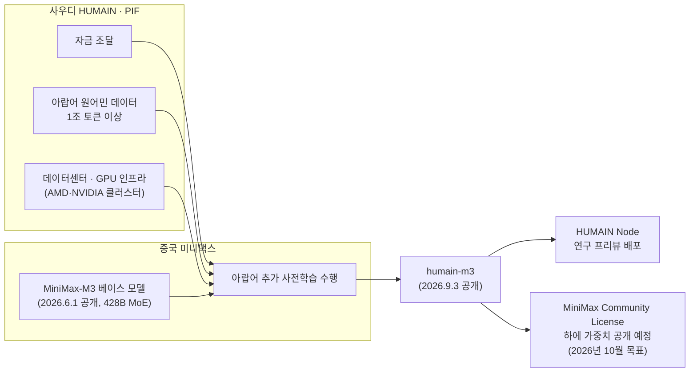
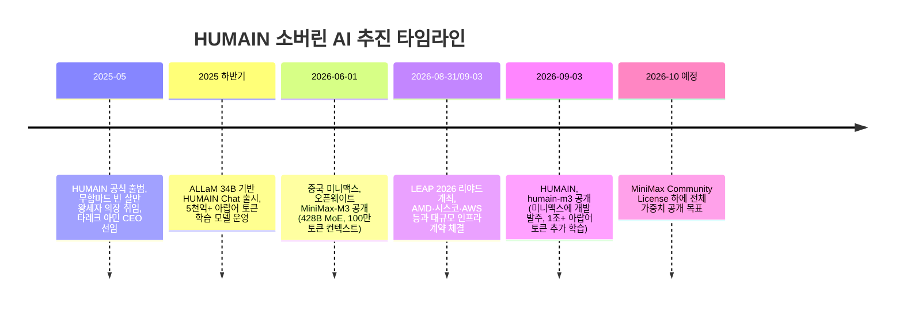

>
> 사우디가 소버린AI 모델을 중국 오픈웨이트 기반으로 완성했다. 사우디 왕세자 무함마드 빈 살만이 직접 주도하는 프로젝트 HUMAIN-M3 는1조 개 이상의 아랍어 원어민 토큰을 활용하여 추가 사전 훈련을 진행했고 이렇게 완성된 모델은 7개 공개 아랍어 벤치마크에서 글로벌 프론티어 모델 모두를 앞섰다. 이를 가능하게 한 것은 중국 오픈웨이트 모델 미니맥스 Minimax-M3 였다. 사우디는 돈, 아랍어 데이터, 데이터센터를 제공했고 미니맥스는 자사의 모델에 아랍어 사전훈련을 완료하여 사우디에 납품했다.  이로서 사우디는 소버린 AI를 수개월만에 완성했다. 수개월만에 글로벌 프론티어 모델 급에 달하는 멀티 모달 아랍어 모델을 갖게 되었고 HUMAIN Node 에 배포하여 향후 가중치를 공개할 예정이다. 사우디 왕세자는 이 모델로 석유산업 AX를 본격적으로 진행할 것이다. 중국 AI와 중동 오일머니가 서로를 알아보는 데는 오랜 시간이 걸리지 않았다. 원래 필요한 것이 다른 두 사람은 쉽게 친해진다.
>
>https://www.facebook.com/share/p/19886ZzFLb/
>

## 개요

2026년 9월 3일, 리야드에서 열린 사우디아라비아의 대표 테크 컨퍼런스 LEAP 2026에서 사우디 국부펀드(PIF) 산하 AI 기업 HUMAIN이 아랍어 특화 대형언어모델 "humain-m3"를 공개했다. 이 모델은 사우디가 자국의 소버린(주권형) AI 역량을 상징하는 프로젝트로 내세운 결과물이지만, 그 기술적 뿌리는 사우디가 아니라 중국 상하이에 본사를 둔 AI 기업 미니맥스(MiniMax Group Inc.)가 지난 6월 1일 공개한 오픈웨이트 모델 "MiniMax-M3"에 있다. HUMAIN은 자금과 아랍어 데이터, 데이터센터 인프라를 제공했고, 미니맥스는 자사의 M3 베이스 모델에 1조 개 이상의 아랍어 원어민 토큰으로 추가 사전학습을 수행해 완성된 모델을 HUMAIN에 납품했다. 이렇게 몇 달 만에 완성된 humain-m3는 HUMAIN이 공개한 7개 아랍어 벤치마크 평가에서 평균 89.37%를 기록하며 GPT-5.6 SOL(87.30%), Opus 5(87.34%) 등 글로벌 프론티어 모델들을 앞섰다고 발표되었다. 다만 이 결과는 7개 항목 중 5개에서 앞선 것이며, 나머지 2개 항목에서는 근소한 차이로 뒤처졌다는 점은 원문 발표 자료에서도 확인된다.

이 사건은 단순한 모델 하나의 출시를 넘어, 중국의 오픈웨이트 AI 생태계가 걸프 지역 오일머니와 만나 소버린 AI를 초고속으로 구축하는 새로운 패턴을 보여준다는 점에서 주목할 만하다.

## HUMAIN은 어떤 회사인가

HUMAIN은 2025년 5월, 도널드 트럼프 미국 대통령의 중동 순방에 맞춰 공식 출범한 사우디 국영 AI 기업이다. 사우디 왕세자 무함마드 빈 살만이 이사회 의장을 맡고 있으며, 사우디 국부펀드(Public Investment Fund, PIF)가 소유하고 있다. 초대 CEO로는 아람코 디지털(Aramco Digital) 전 CEO였던 타레크 아민(Tareq Amin)이 선임되었으며, 그는 라쿠텐 모바일에서 세계 최초의 완전 가상화 클라우드 네이티브 모바일 네트워크를 구축한 경력을 지닌 인물이다. HUMAIN은 출범 이후 AI 인프라(데이터센터), AI 클라우드, 데이터·모델, 애플리케이션·솔루션의 4개 계층으로 사업을 전개해왔으며, 엔비디아·AMD·퀄컴 등과 대규모 반도체·인프라 계약을 잇달아 체결해왔다.

HUMAIN의 이전 대표 모델은 아랍어 특화 모델 ALLaM(알람)이었다. ALLaM 34B는 5천억 개 이상의 아랍어 토큰으로 학습된 자체 개발 모델로 소개되어 왔으며, 사우디 데이터·AI청(SDAIA)의 초기 아랍어 챗봇 개발 경험이 그 토대가 되었다. 이번 humain-m3는 이 ALLaM의 뒤를 잇는 차세대 플래그십 모델로 발표되었다.

## humain-m3, 무엇이 발표되었나

humain-m3는 428억이 아니라 4,280억(428B) 개의 총 파라미터를 가진 Mixture-of-Experts(MoE, 전문가 혼합) 구조의 모델로, 토큰당 실제로 활성화되는 파라미터는 230억(23B) 개다. 이 구조는 미니맥스가 2026년 6월 1일 공개한 오픈웨이트 모델 MiniMax-M3의 아키텍처를 그대로 계승한 것이다. 당시 미니맥스는 M3를 100만 토큰 컨텍스트 윈도우와 텍스트·이미지·비디오 네이티브 입력을 결합한 최초의 오픈웨이트 모델이라고 소개하며, 코딩과 에이전트 성능이 전작 M2보다 강화되었다고 밝힌 바 있다.

HUMAIN은 이 MiniMax-M3를 그대로 가져다 쓴 것이 아니라, 미니맥스에 모델 개발을 발주(commission)하는 형태로 계약했다. 미니맥스는 자사의 M3 베이스 위에 1조 개가 넘는 아랍어 원어민 토큰으로 추가 사전학습을 수행해 이를 HUMAIN에 납품했다. 즉 처음부터 끝까지 자체 개발한 모델이 아니라, 중국 랩이 만든 기반 모델에 아랍어 특화 학습을 얹어 완성한 협업의 산물이라는 것이다. 이 모델은 발표 당일부터 HUMAIN Node라는 자사 플랫폼을 통해 연구 프리뷰(research preview) 형태로 공개되었다.

## 사우디와 미니맥스, 역할은 어떻게 나뉘었나

이번 프로젝트에서 양측이 각각 무엇을 투입했는지는 여러 외신 보도를 종합하면 비교적 명확하게 드러난다.

HUMAIN 측은 이 모델이 단순히 기존 모델에 라벨만 바꿔 단 것이 아니라는 점을 강조했다. 타레크 아민 CEO는 발표 성명에서 "아랍어는 수억 명이 사용하는 언어이지만 AI의 프론티어에서 심각하게 소외되어 있다"며 "humain-m3로 이를 바꾸는 데 투자하고 있다"고 밝혔다. 그는 자신의 링크드인 게시글에서도 "이것은 모델을 수입해서 HUMAIN 라벨을 붙이는 일이 아니다"라고 별도로 언급하며, 자사가 미니맥스뿐 아니라 미스트랄·코히어 등과도 협업해왔다는 점을 부연했다(Briefs, 2026.9.4 보도). 다만 이 모델이 파라미터 구성 등에서 MiniMax-M3와 사실상 동일한 아키텍처를 공유한다는 점이 커뮤니티에서 지적되며 논쟁이 일었다는 보도도 나왔다(Startup Fortune, 2026.9월).

## 벤치마크 성적표, 실제로 얼마나 앞섰나

HUMAIN이 자체 공개한 결과에 따르면 humain-m3는 7개의 공개 아랍어 벤치마크에서 다음과 같은 성적을 기록했다. 이 수치는 HUMAIN Node의 모델 페이지에 게재된 것으로, 아직 독립적인 제3자 검증을 거친 결과는 아니라는 점을 전제로 봐야 한다.

| 벤치마크 | 측정 영역 | humain-m3 | GPT-5.6 SOL | Opus 5 | MiniMax-M3(기준) |
|---|---|---|---|---|---|
| AlGhafa | 아랍어 핵심 이해력 | 86.45% | - | - | 75.31% |
| ArabicMMLU | 아랍어 원어 지식 | 90.70% | - | - | 81.80% |
| Arabic EXAMS | 학업 시험 능력 | 67.67% | - | - | - |
| MadinahQA | 아랍어 어학 능력 | 95.44% | - | - | - |
| AraTrust | 신뢰성·진실성 | 97.53% | 93.42% | - | - |
| ALRAGE | 검색증강생성(RAG) | 94.63% | 94.91% | - | 79.32% |
| Translated MMLU | 번역 지식 | 93.20% | - | 93.78% | - |
| **평균(7개 항목 동일 가중)** | | **89.37%** | **87.30%** | **87.34%** | **80.34%** |

이 표에서 확인할 수 있듯, humain-m3는 7개 항목 중 5개 항목에서 비교 대상 프론티어 모델들을 앞섰지만, ALRAGE(검색증강생성) 항목에서는 GPT-5.6 SOL(94.91%)에, Translated MMLU(번역 지식) 항목에서는 Opus 5(93.78%)에 근소하게 뒤처졌다. 따라서 "모든 벤치마크에서 모든 글로벌 프론티어 모델을 앞섰다"는 서술은 정확하지 않으며, 정확히는 "가중 평균 및 7개 중 5개 항목에서 우위를 보였다"는 것이 사실에 부합한다.

주목할 부분은 미니맥스의 기준 체크포인트(MiniMax-M3 자체) 대비 상승 폭이다. 아랍어 추가 사전학습만으로 AlGhafa는 75.31%에서 86.45%로 약 11포인트, ArabicMMLU는 81.80%에서 90.70%로 약 9포인트, ALRAGE는 79.32%에서 94.63%로 15포인트 이상 상승했다. 이는 베이스 모델의 범용 성능은 그대로 두고, 특정 언어(아랍어)에 대한 집중 학습만으로도 해당 언어권에서 프론티어급 성능을 얻어낼 수 있음을 보여주는 사례로 해석할 수 있다.

## 공개 일정과 HUMAIN Node

humain-m3는 현재 두 개의 티어로 제공되고 있다. 사우디 정렬(alignment) 가드레일이 적용되고 사고 과정(thinking)과 스트리밍이 꺼진 채로 지연 시간이 다소 있는 '리미티드 프리뷰' 티어와, 사고 과정과 스트리밍이 모두 켜져 있고 지연 시간이 짧은 전체 체크포인트를 제공하는 '리서치 프리뷰' 티어다. HUMAIN은 이 프리뷰 기간 동안 아랍어 방언 전반에 걸친 성능·안전성·정렬성을 초기 사용자들과 함께 평가하고, 사용자 피드백을 다음 체크포인트에 반영하겠다고 밝혔다.

가중치 전체 공개는 안전성 학습(safety training)을 마친 뒤, MiniMax Community License 하에 발표 다음 달인 2026년 10월을 목표로 이뤄질 예정이라고 보도되었다(Dimsum Daily, 2026.9.4). 이 모델은 HUMAIN Node 플랫폼에 처음으로 프리뷰 형태로 올라온 모델이며, HUMAIN 측에 따르면 이 플랫폼에는 이미 100개 이상의 프론티어·독점·오픈소스 모델이 올라와 있고 향후 더 폭넓은 접근을 열 예정이다. Node는 여러 모델을 단일 API, 단일 키, 단일 청구서로 사용할 수 있게 하고 팀별 지출 한도를 설정할 수 있는 통합 플랫폼으로 소개되고 있다.

## 미니맥스 주가 반응과 중국 AI의 중동 진출

이번 발표 직후 홍콩 증시에 상장된 미니맥스(주식코드 00100)의 주가는 약 10% 급등했다. 이는 사우디라는 국가 단위 고객이 자국의 국가 AI 전략의 근간으로 중국 오픈웨이트 모델을 채택했다는 상징성이 시장에서 긍정적으로 받아들여졌기 때문으로 풀이된다. 미니맥스 입장에서 이번 계약은 자사의 사업 모델, 즉 베이스 모델을 공급하고 각국의 소버린·지역 사업자가 이를 자국어 데이터로 커스터마이징하게 하는 전략의 유효성을 입증한 사례로 평가된다.

블룸버그는 이번 사례를 두고 HUMAIN이 "점점 더 중요해지는 이 기술에 대한 통제권을 강화하려는 국가들의 대열에 합류했다"고 평가했다. 실제로 사우디 외에도 각국이 소버린 AI를 추진하는 흐름은 뚜렷하다. 프랑스에서 인도에 이르기까지 여러 국가가 자국 AI 모델 확보 경쟁에 뛰어들고 있으며, 한국 정부도 지난 1월 국가 AI 모델 개발 숏리스트에서 네이버를 제외한 바 있는데, 그 사유는 네이버의 공모 제출물에 중국산 비전 인코더가 일부 사용된 사실이 확인되었기 때문이었다(Briefs, 2026.9월 보도). 이 사례와 비교하면, HUMAIN은 오히려 중국 모델 사용 사실을 처음부터 공개적으로 인정하고 발표했다는 점에서 접근 방식의 차이가 있다.

## 더 큰 그림: LEAP 2026과 사우디의 AI 인프라 드라이브

이번 humain-m3 발표는 진공 상태에서 나온 것이 아니라, LEAP 2026(2026년 8월 31일~9월 3일, 리야드 개최)이라는 대형 행사의 흐름 속에서 나왔다. 이 행사에서는 AMD·시스코·HUMAIN이 공동으로 미국 외 지역 최대 규모의 AMD 추론 클러스터를 가동했다고 발표했으며, HUMAIN은 올해 안에 AMD GPU 1만 3천 개를 배치하고 2027년부터 최대 250메가와트 규모의 추가 인프라를 구축할 계획이라고 밝혔다. 동시에 HUMAIN은 엔비디아의 최신 HGX B300 블랙웰 울트라 시스템 기반 AI 클라우드도 가동했으며 이미 클러스터 가동률이 90%를 넘는다고 발표했다. 아람코 디지털 역시 같은 행사에서 산업용 엣지 AI 스택 'iCONNA'를 공개하며 자국 450MHz 통신망과 산업 IoT, AI 솔루션을 결합한 실시간 산업 의사결정 체계를 선보였다.

이러한 흐름은 무함마드 빈 살만 왕세자가 추진하는 '비전 2030'의 연장선에 있다. 그는 오일 파워로 누려온 것과 같은 국제적 영향력을 AI를 통해서도 확보하겠다는 목표를 여러 차례 밝혀왔으며, HUMAIN은 그 실행 조직으로 기능하고 있다. HUMAIN의 CEO가 아람코 디지털 출신이라는 점, 그리고 아람코 디지털이 HUMAIN과 별개로 산업용 AI 스택을 계속 발전시키고 있다는 점은 사우디의 AI 전략이 석유산업을 포함한 국가 전반의 디지털 전환(AX)과 맞닿아 있음을 시사한다. 다만 humain-m3 자체가 석유산업 AX를 위해 설계되었다거나, 이 모델의 발표와 함께 왕세자가 석유산업 AX를 위한 구체적 실행 계획을 별도로 공표했다는 내용은 이번 취재 범위 내 공개 자료에서는 확인되지 않았다는 점을 밝혀둔다. 이는 사우디의 전반적인 국가 전략 방향성으로는 타당한 추론이지만, humain-m3 발표 자체에 직접 결부된 확정 사실은 아니다.

## 타임라인으로 보는 전개 과정

## 팩트체크: 검증된 사실과 검증되지 않은 서술

| 구분 | 내용 | 판정 |
|---|---|---|
| humain-m3가 미니맥스 M3 기반이라는 점 | 다수의 복수 매체(블룸버그, Unite.AI, Startup Fortune, 로이터 계열 보도 인용 매체 등)가 일치되게 보도 | 사실로 확인됨 |
| 1조 개 이상 아랍어 원어민 토큰 추가 사전학습 | HUMAIN 공식 발표 및 다수 매체 보도 일치 | 사실로 확인됨 |
| 428B 총 파라미터, 23B 활성 파라미터 MoE 구조 | HUMAIN 공식 발표 및 복수 매체 보도 일치 | 사실로 확인됨 |
| 7개 벤치마크 평균 89.37%, GPT-5.6 SOL·Opus 5 대비 우위 | HUMAIN Node 게재 자료 기준, 제3자 독립 검증은 아직 없음 | HUMAIN 자체 발표치이며 외부 검증 대기 중 |
| "글로벌 프론티어 모델 모두를 모든 항목에서 앞섰다" | 실제로는 7개 항목 중 5개에서 우위, 2개(ALRAGE, Translated MMLU)에서는 근소 열세 | 과장된 서술, 정정 필요 |
| 왕세자가 이 모델 프로젝트를 "직접 주도"했다는 서술 | 무함마드 빈 살만이 HUMAIN 이사회 의장인 것은 사실이나, humain-m3라는 개별 모델 프로젝트에 대한 개인적·기술적 직접 지휘를 명시한 공개 자료는 확인되지 않음 | 조직상 최상위 책임자라는 의미로는 타당하나, "직접 주도"라는 구체적 서술은 근거 불충분 |
| 향후 가중치 공개 예정 | HUMAIN 발표, MiniMax Community License 하에 2026년 10월 목표라는 보도 존재 | 사실로 확인됨(목표 시점이며 확정된 것은 아님) |
| 이 모델로 "석유산업 AX를 본격적으로 진행할 것" | HUMAIN·아람코 디지털이 별도로 산업용 AI(iCONNA 등)를 추진 중인 것은 사실이나, humain-m3 발표에 직접 결부된 석유산업 AX 계획 발표는 확인되지 않음 | 근거 불충분, 추론적 서술 |
| 미니맥스 주가 약 10% 급등 | 홍콩 증시 보도(Dimsum Daily) 확인 | 사실로 확인됨 |
| "레이블만 바꿔 달았다"는 논란과 CEO의 반박 | Briefs, Startup Fortune 등에서 보도되었으나 커뮤니티발 논쟁의 구체적 진원지·규모는 단일 매체 서술에 의존 | 부분적으로 확인됨, 세부 정황은 추가 검증 필요 |

## 정리하며

이번 humain-m3 발표는 소버린 AI를 둘러싼 국제 경쟁의 새로운 방정식을 보여준다. 처음부터 프론티어급 모델을 자체 개발하려면 수년의 시간과 막대한 연구 인력이 필요하지만, 이미 검증된 오픈웨이트 베이스 모델을 발주하고 자국어 데이터로 집중 학습시키는 방식을 택하면 이를 몇 달로 단축할 수 있다는 것이 이번 사례가 보여주는 핵심이다. 사우디는 자금과 데이터, 인프라를 제공하고 중국의 미니맥스는 검증된 아키텍처와 엔지니어링 역량을 제공하는 구조 속에서, 양측은 각자 필요한 것을 정확히 주고받았다. 다만 HUMAIN 스스로도 인정하듯 이 모델의 성능 수치는 아직 회사 자체 발표에 머물러 있으며, 독립적인 제3자 검증과 실사용자 피드백을 거친 뒤에야 그 실질적 위상이 판가름날 것으로 보인다.

---

작성일자: 2026년 9월 7일
