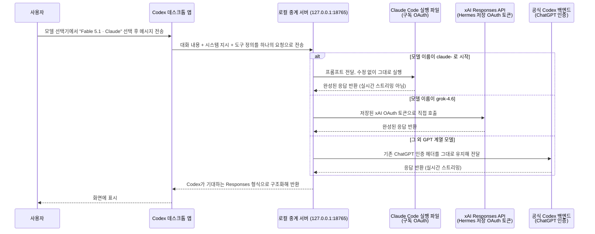

- 작성일: 2026년 9월 8일
- 대상 게시물: Threads 사용자 `dayum_gud`가 올린 두 건의 글 (`https://www.threads.com/share/BBIRhysDvG/` 계열)
- 이 문서는 사용자가 공유한 대화 캡쳐 네 장(Codex 데스크톱 앱 화면 두 장, 별도 대화창 화면 두 장)과 댓글창 화면 두 장을 근거로 하며, 부족한 배경 지식은 웹 검색으로 별도 확인했습니다. Threads 원문 자체는 로봇 접근이 차단되어 있어 직접 열람하지 못했고, 사용자가 넘겨준 내용과 공개적으로 확인 가능한 정보만으로 작성했습니다.

> 
> 뼈빠지게 하네스 만들고 있다가 Astra 가 갑자기 하는말이 ....
> 
> codex desktop app 내부의 모델 선택기 리스트에 claude 모델들과 grok 모델 선택 가능하게 할 수 있을것 같다고 해서 그러라고 했다... 기분 좋아서 effort high 로 올려줌
> 
> https://www.threads.com/share/BBIRhysDvG/
> 

---

## 1. 한 줄 요약

`dayum_gud`라는 사용자가 OpenAI의 **Codex 데스크톱 앱**(구 Codex 앱, 2026년 7월부터 ChatGPT 데스크톱 앱과 통합)의 모델 선택 메뉴에, 원래는 없던 **Claude 계열 모델(Fable 5.1·Sonnet 5·Opus 5)**과 **Grok 4.6**을 실제로 골라서 쓸 수 있게 만들었다고 주장하는 글입니다. 방법은 새로운 API 키를 발급받은 게 아니라, 자신이 이미 갖고 있던 **Claude 구독(Claude Code 로그인)**과 **Grok 구독(SuperGrok/X Premium+ 로그인)**의 인증 정보를 로컬에서 가로채 그대로 재사용하는 방식이었습니다. 본인 표현으로는 "일하다가 GPT-6 Astra가 갑자기 이렇게 하면 될 것 같다고 제안해서 시켜봤다"는 것이고, 실제로 두 모델 모두 응답이 돌아오는 것을 확인했다는 내용입니다.

핵심만 먼저 짚으면 이렇습니다.

- **작동은 한다.** 게시물에 첨부된 대화 내용을 보면 Codex 데스크톱 앱에서 "Fable 5.1 · Claude"를 고른 뒤 보낸 테스트 메시지에 실제로 응답이 돌아왔고, Grok 4.6을 고른 별도 세션에서도 정상 응답과 함께 "reasoning effort가 medium으로 제대로 전달됐다"는 확인까지 받았습니다.
- **새 계정이나 새 API 키를 만든 게 아니다.** 이미 갖고 있던 Claude 구독과 Grok 구독의 로그인 상태를 그대로 우회 경로에 흘려보내는 구조입니다.
- **이 방식은 Anthropic 소비자 이용약관을 명확히 위반합니다.** 2026년 2월 Anthropic이 약관에 "Free·Pro·Max 구독으로 받은 OAuth 인증은 Claude Code와 claude.ai 전용이며, 다른 도구·서비스에서 쓰면 안 된다"는 조항을 명문화했고, 4월부터는 이를 실제로 단속하기 시작했습니다. 비슷한 방식을 쓰던 구글 Gemini 구독자들이 계정 제한을 당한 사례도 이미 나온 바 있습니다.
- **비슷한 시도를 하는 도구·프로젝트가 이미 커뮤니티에 여럿 존재합니다.** 방향은 반대(Claude Code 쪽에 Codex·Grok을 끼워 넣는 것)지만 원리가 완전히 같은 오픈소스 프로젝트가 이미 공개돼 있고, Codex 쪽에 외부 모델을 끼워 넣는 프로젝트도 존재합니다. 즉 이 게시물은 아예 새로운 발견이라기보다는, 이미 커뮤니티에 퍼져 있는 "구독 재사용형 로컬 브릿지" 패턴을 Codex 데스크톱 앱이라는 특정 타깃에 맞게 개인이 직접 구현해본 사례로 보는 편이 정확합니다.

아래에서 하나씩 자세히 풀어보겠습니다.

---

## 2. 게시물 흐름 그대로 따라가 보기

`dayum_gud`는 3시간 전(글 작성 시점 기준) 두 건의 게시물을 연달아 올렸습니다.

**첫 번째 글**은 "Grok test 완.. 컨텍스트 소모가 조금 확대되고, 컨텍스트 윈도우 사이즈 조절이 좀 필요하겠지만... 된다니까 되는 중 🤷"라는 문구와 함께, 별도로 만든 "Grok 4.6 응답과 effort 확인"이라는 이름의 대화창을 첨부했습니다. 이 대화창에서 사용자는 "300 토큰 이내로 답변해봐. 지금 이 메시지가 Grok 4.6에게 도달하는지 체크하고 싶다. 그리고 나는 effort를 medium으로 설정했는데 실제 응답도 그런지 체크해줘"라고 요청했고, 응답은 "도달했습니다. 이 턴의 활성 모델은 Grok 4.6이고, 요청에 실린 reasoning effort는 medium입니다. UI에서 medium으로 고른 설정이 실제 호출에 그대로 들어간 상태입니다"였습니다. 이 대화창 자체는 Codex 앱이 아니라 별도의 채팅 UI로 보이는데, 하단 모델 표시줄에는 "Grok 4.6 · xAI Medium"이라고 떠 있습니다.

**두 번째 글**(2/2 표시)에는 "일단 됩니다.. 뭐 말만 하면 다 되는 세상이네 개쉽네"라는 문구와 함께, 이번에는 **Codex 데스크톱 앱** 화면을 그대로 붙여 넣었습니다. 상단에는 "Grok 4.6 · xAI에서 Fable 5.1 · Claude(으)로 모델이 변경되었습니다"라는 시스템 알림이 있고, 사용자가 "테스트 메세지다. 응답만 반환해, 500토큰 정도로"라고 보낸 뒤, 40초의 작업 시간을 거쳐 아주 긴 설명형 응답이 돌아왔습니다. 그리고 화면 오른쪽 아래에는 모델 선택 드롭다운이 펼쳐져 있는데, 원래 Codex 앱에 있는 GPT 계열 모델들(GPT-5.6 Sol/Terra/Luna, Daybreak Blue, GPT-5.5, GPT-5.4 Mini, GPT-5.3 Codex Spark) 밑에 **"Fable 5.1 · Claude"(체크 표시로 현재 선택됨), "Sonnet 5 · Claude", "Opus 5 · Claude", "Grok 4.6 · xAI"** 네 개 항목이 나란히 추가돼 있는 게 보입니다.

댓글창에서는 두 가지 질문이 오갔습니다. 한 사람이 "이거 open codex 안 하고 네이티브에서 작동되는 건가요?"라고 묻자 작성자는 "네 100% 네이티브 입니다. 오픈코덱스 없이요.."라고 답했습니다(여기서 "오픈코덱스"는 뒤에서 설명할 오픈소스 프록시 프로젝트 OpenCodex를 가리키는 것으로 보입니다). 다른 사람이 "?!어떻게 명령하셨습니까,,,,???"라고 묻자 작성자는 "나 claude 랑 grok 구독자임. Codex desktop app 에서 claude, grok 모델 선택 가능하게 해줘"라고, 자신이 AI에게 내렸다는 지시문을 그대로 공유했습니다. 즉 이 작업 자체를 사람이 한 줄 한 줄 코딩한 게 아니라, AI 코딩 도구에게 자연어로 "이렇게 만들어줘"라고 시켜서 나온 결과물이라는 뜻입니다.

---

## 3. Codex 데스크톱 앱 화면에 달린 설명 텍스트, 있는 그대로 정리

Codex 앱 화면에서 40초 작업 후 나온 응답 본문은 스스로 무엇을 했는지를 상당히 자세하게 설명하고 있습니다. 요점만 정리하면 다음과 같습니다.

**연결 구조**: Codex 앱은 대화 내용, 시스템 지시, 도구 정의를 하나의 Responses 요청으로 묶어 `127.0.0.1:18765`라는 로컬 주소로 보냅니다. 이 주소에는 로컬에서 돌아가는 프록시(중계) 서버가 떠 있고, 이 서버가 요청에 실린 모델 이름을 보고 갈 길을 나눕니다.

- 모델 이름이 `claude-`로 시작하면 → 수정하지 않은 **공식 Claude Code 실행 파일**을 구독 OAuth 인증으로 그대로 호출합니다.
- 모델 이름이 `grok-4.6`이면 → **Hermes**라는 별도 도구에 저장돼 있던 **xAI OAuth 토큰**으로 xAI의 Responses API를 직접 호출합니다.
- 그 외 GPT 계열 모델 요청은 → 원래 쓰던 ChatGPT 인증 헤더를 그대로 유지한 채 공식 Codex 백엔드로 그대로 전달합니다.

그리고 "어느 경로에서도 새 API 키를 발급하거나 토큰을 파일에 복사하지 않았다"는 점을 스스로 강조하고 있습니다. 즉 별도의 유료 API 사용량이 새로 발생하는 구조가 아니라, 이미 로그인돼 있던 구독 세션을 그 자리에서 재사용하는 구조라는 뜻입니다.

**확인됐다고 주장하는 세 가지**:
1. Codex 앱이 `claude-fable-5-1`을 실제 선택 가능한 모델로 인식하고 요청을 보냈다.
2. 로컬 서버가 그 요청을 받아 Claude 구독 경로로 라우팅했고, 구조화된 응답을 Codex가 기대하는 형식으로 되돌려줬다.
3. 스트리밍 이벤트가 정상적으로 닫혀서 이 메시지가 화면에 문제없이 표시됐다.

**스스로 인정한 한계**:
- Claude와 Grok 경로는 응답이 완성된 뒤 한 번에 표시되므로, GPT 경로처럼 글자가 실시간으로 흐르듯 나오지 않는다(스트리밍이 안 된다).
- 이미지 입력, 음성, 장시간 대화의 자동 압축, 작업 도중 모델 전환은 아직 검증하지 않았다.
- 작업을 중단해도 이미 시작된 상위 모델 요청이 즉시 취소되지는 않는다.
- 문제가 생기면 `/Users/m5max/.codex/subscription-...` 경로에 관련 로그가 남는다.
- 원래대로 되돌리려면 `outputs/rollback-subscription-models.py`라는 되돌리기 스크립트를 실행하면 되고, 이 스크립트는 이번에 추가한 설정만 제거하고 기존 Codex 설치 파일은 건드리지 않는다.

여기서 파일 경로에 등장하는 사용자 이름(`m5max`)은 이 작업을 실제로 수행한 컴퓨터의 로컬 계정명으로 보이며, 게시물 작성자 본인의 것으로 추정됩니다.

---

## 4. 이게 왜 기술적으로 가능한가 — 세 가지 배경 지식

이 사례를 이해하려면 서로 다른 세 회사의 인증 구조를 알아야 합니다.

### 4.1 Codex 데스크톱 앱은 원래 모델을 어떻게 고르나

Codex는 OpenAI가 만든 코딩 에이전트로, 2026년 7월 9일 GPT-5.6(Sol·Terra·Luna 세 등급)이 정식 출시되면서 기존 Codex 앱과 ChatGPT 데스크톱 앱이 하나로 합쳐졌습니다. 이후 9월 4일에는 로컬 환경에서 쓸 수 있는 GPT-6 Astra까지 추가됐습니다. 게시물의 모델 목록에 보이는 "Daybreak Blue"는 OpenAI가 승인된 방어 보안 담당자에게만 별도로 여는 접근 등급으로, 검열 수위를 낮춘 플래그십 모델(현재는 GPT-5.6 Sol 기반)에 접근하게 해주는 이름입니다. 즉 화면에 나열된 GPT 계열 이름들은 실제로 2026년 9월 현재 Codex 앱에 존재하는 항목들이 맞습니다. 이 목록에 원래는 없던 Claude·Grok 항목 네 개가 얹힌 것이 이번 게시물의 핵심입니다.

### 4.2 Claude 구독 인증(OAuth)은 원래 무엇을 위한 것인가 — 2026년 9월 8일 원문 재확인

Claude Code(Anthropic의 공식 터미널 코딩 도구)는 Free·Pro·Max 구독 계정으로 로그인하면 별도의 API 요금 없이 구독에 포함된 사용량만큼 Claude를 쓸 수 있습니다. 이 로그인 방식이 바로 OAuth 인증입니다.

이 부분은 2026년 2월 보도 당시와 지금(9월 8일) 문구가 달라져 있어, Anthropic 공식 사이트 두 곳을 직접 다시 열어 확인했습니다.

**① 소비자 서비스 약관 본문(anthropic.com/legal/consumer-terms, 2025년 10월 8일 발효, 오늘 기준 최신본)** — 이른바 "3.7 조항"으로 커뮤니티에서 불리는 부분은 실제로는 제3조(서비스 이용)의 금지 행위 목록 중 일곱 번째 항목입니다. 문구를 우리말로 옮기면, "Anthropic API 키를 통해 접근하거나 Anthropic이 별도로 명시적으로 허용하는 경우가 아닌 한, 봇·스크립트 등 자동화된 비인간적 수단으로 서비스에 접근하는 행위"를 금지 행위로 규정하고 있습니다. 이 조항 자체는 2024년부터 존재해왔고 오늘 확인한 시점까지 문구가 바뀌지 않았습니다.

**② Claude Code 전용 안내 페이지(code.claude.com/docs/ko/legal-and-compliance)** — 2026년 2월 19~20일 개정 당시 다수 매체가 인용했던 문구는 "OAuth 토큰을 다른 도구·서비스에서 쓰면 허용되지 않으며 소비자 서비스 약관 위반"이라는, 위반 여부를 직접적으로 단정하는 문장이었습니다. 그런데 오늘 같은 페이지를 다시 열어보니 그 문장은 더 이상 없고, 대신 다음과 같이 다소 완화되고 표적이 좁혀진 표현으로 바뀌어 있었습니다.

- OAuth 인증은 Free·Pro·Max·Team·Enterprise 구독 플랜 구매자를 위해 "독점적으로 의도"됐으며, Claude Code 및 기타 네이티브 Anthropic 애플리케이션의 "일반적인 사용"을 지원하도록 설계됐다는 설명.
- Agent SDK를 포함해 Claude 기능을 활용하는 제품·서비스를 만드는 개발자는 Claude Console이나 지원되는 클라우드 제공자를 통한 API 키 인증을 써야 한다는 안내.
- Anthropic은 제3자 개발자가 claude.ai 로그인을 대신 제공하거나, 사용자를 대신해 Free·Pro·Max 플랜 자격 증명으로 요청을 라우팅하는 것을 허용하지 않는다는 문장.
- 이런 제한을 시행할 권리를 사전 통지 없이 보유한다는 문장.

즉 "이건 명백한 약관 위반이다"라고 단정하던 2월 당시의 직설적인 표현은, 지금은 "OAuth는 애초에 이런 용도로 만든 게 아니고, 제3자가 남의 구독 인증을 대신 굴리는 서비스를 만드는 건 허용 안 한다"는 좀 더 절제된 표현으로 다시 쓰인 상태입니다. 아마도 2~4월 사이 있었던 "고객 적대적"이라는 격한 반발(7절 참고)을 거치며 문구를 다듬은 것으로 보이나, Anthropic이 이런 표현 변경의 이유를 공개적으로 설명한 자료는 확인하지 못했습니다.

**그래서 결론이 달라지나?** 문구는 순화됐지만 실질은 크게 다르지 않습니다. 소비자 약관 제3조 일곱 번째 항목(자동화·비인간적 접근 금지, API 키 예외)은 그대로 살아있고, Claude Code 페이지도 여전히 "OAuth는 Claude Code·네이티브 앱의 일반적 개인 사용을 위한 것"이라고 못 박고 있습니다. Codex 앱이 자기 안에서 Claude Code 실행 파일을 자동으로 대신 호출해 구독 인증을 흘려보내는 구조는, 문구가 어느 버전이든 "API 키 없이 스크립트로 자동화된 접근을 한다"는 점과 "Claude Code 바깥의 다른 애플리케이션에서 OAuth를 쓴다"는 점 모두에 해당하므로, 여전히 Anthropic이 의도한 사용 범위 밖에 있다고 보는 게 합리적입니다. 다만 "이는 명백히 약관 위반"이라고 못 박았던 예전 표현만큼 문구가 단정적이지는 않다는 점은 정확히 짚어드립니다.

### 4.3 Grok 구독 인증과 "Hermes"는 무엇인가

게시물에 등장하는 "Hermes"는 Nous Research가 만든 오픈소스 멀티 프로바이더 에이전트 CLI인 **Hermes Agent**를 가리키는 것으로 보입니다. Hermes Agent는 xAI의 SuperGrok 또는 X Premium+ 구독으로 브라우저 기반 OAuth 로그인을 하면, 별도의 xAI API 키 없이도 Grok 모델을 쓸 수 있게 해주는 기능을 공식적으로 제공합니다. 로그인 정보는 `~/.hermes/auth.json`에 저장되고 자동으로 갱신됩니다. 그런데 이 인증서를 xAI가 공식적으로 "Codex 같은 제3자 앱에서 마음껏 재사용해도 된다"고 명문화한 것은 아닙니다. 오히려 관련 문서에는 "xAI 백엔드가 OAuth API 표면에 자체적인 허용목록(allowlist)을 두고 있어서, 구독이 정상인데도 표준 SuperGrok 가입자를 거부(HTTP 403)하는 사례가 관찰된다"는 경고가 함께 적혀 있습니다. 즉 Anthropic처럼 "절대 금지"라고 약관에 명시하지는 않았지만, 그렇다고 완전히 승인·보장된 경로도 아니고, xAI 쪽에서 임의로 막을 수 있는 회색 지대에 가깝습니다.

정리하면 Claude 쪽은 **"쓰면 명백한 약관 위반"**, Grok 쪽은 **"공식적으로 막아놓진 않았지만 안정적으로 보장되지도 않는 회색 지대"**로, 두 회사의 태도에 뚜렷한 차이가 있습니다.

---

## 5. 전체 구조를 그림으로

아래는 게시물 본문 설명을 바탕으로 재구성한 요청 흐름입니다.

이 구조에서 눈여겨볼 부분은, 로컬 중계 서버가 **새로운 계정을 만들거나 새로운 결제 수단을 등록하지 않는다**는 점입니다. 대신 이미 컴퓨터 안에 로그인돼 있던 두 개의 서로 다른 구독 세션(Claude Code 로그인, Hermes의 xAI 로그인)을, 세 번째 프로그램(Codex 앱)이 자기 것인 양 빌려 쓰는 형태입니다. 사람으로 비유하면 헬스장 회원권을 다른 지점 출입증으로 복제해서 쓰는 것과 비슷한 그림입니다. 운동은 똑같이 할 수 있지만, 헬스장 본사 입장에서는 "이 출입증은 원래 지점에서만 쓰라고 발급한 것"이라는 계약이 깨진 셈입니다.

---

## 6. 이미 존재하는 비슷한 도구들 — 새로운 발견이라기보다는 알려진 패턴

이번 게시물이 특별한 이유는 "된다"는 걸 Codex 데스크톱 앱이라는 GUI 프로그램에서 직접 확인했다는 점이지만, **구독 인증을 재사용해 다른 회사 모델을 끼워 넣는 로컬 중계 서버**라는 아이디어 자체는 이미 개발자 커뮤니티에 여러 형태로 공개돼 있습니다.

| 프로젝트 | 방향 | 방식 |
|---|---|---|
| `claude-code-with-codex`(별칭 `claude-codex`) | **Claude Code** 안에 ChatGPT(Codex)·Grok·Kimi·Cursor 모델을 끼워 넣음 | 로컬 `127.0.0.1:18765`에 프록시를 띄우고, `/model`에서 Opus를 고르면 Claude 구독으로, Sonnet을 고르면 ChatGPT 구독으로 나가도록 환경 변수로 매핑. Claude 쪽 요청은 "구독 토큰을 그대로 전달"한다고 문서에 명시돼 있음 |
| `claude-code-proxy` | **Claude Code** 안에 ChatGPT·Kimi·Cursor·Grok 모델을 끼워 넣음 | 마찬가지로 `127.0.0.1:18765` 포트를 기본값으로 사용하는 별개 프로젝트 |
| `Devil Codex` | **Codex** 안에 Claude Code·Antigravity·Kimi·GLM·Copilot 등 다양한 구독형 provider를 끼워 넣음 | "Codex 로그인 모델은 순정 경로를 유지하고, 외부 모델은 자체 provider 프록시로 연결"한다고 스스로 설명. Codex의 네이티브 모델 선택기에 GPT-5.6 Sol·Terra·Luna 같은 항목까지 보강해서 노출하는 것을 특징으로 내세움 |
| `OpenCodex` | **Codex**와 **Claude Code** 양쪽 모두에 Gemini·Claude·xAI·DeepSeek·Kimi·로컬 모델을 자유롭게 조합 | `/model` 메뉴에 외부 모델이 추가되는 것을 국내 블로그에서도 사용법으로 소개한 바 있음. 댓글창에서 작성자가 "오픈코덱스 없이요"라고 밝힌 바로 그 프로젝트로 추정됨 |

표에서 보듯 **이 게시물이 보여준 것과 정확히 반대 방향(Claude Code에 Codex·Grok을 끼워 넣기)의 도구는 이미 널리 공개돼 있고, 같은 포트 번호(18765)를 기본값으로 쓰는 프로젝트까지 존재**합니다. 반대로 **Codex 쪽에 Claude·Grok을 끼워 넣는 방향**은 `Devil Codex`나 `OpenCodex` 같은 프로젝트가 이미 다루고 있는 영역입니다. 따라서 `dayum_gud`의 시도는 아예 없던 것을 처음 만들어낸 게 아니라, 커뮤니티에 이미 퍼져 있는 "구독 재사용형 로컬 브릿지"라는 잘 알려진 패턴을, AI 코딩 도구에게 자연어로 지시해서 자기 컴퓨터에 맞게 직접 구현해본 사례로 이해하는 것이 정확합니다. 실제로 댓글에서 "어떻게 명령하셨습니까"라는 질문에 작성자가 프롬프트 원문을 그대로 공개한 것도, 이게 복잡한 해킹이라기보다는 AI에게 통째로 맡긴 자동화 작업이었음을 뒷받침합니다.

---

## 7. 반드시 알아야 할 위험 — 약관 위반과 실제 제재 사례

이 부분이 이 게시물을 다룰 때 가장 중요하게 짚어야 할 지점입니다. "된다"와 "해도 된다"는 다른 문제입니다.

**Anthropic의 입장 변화 타임라인**
- 2025년 말: 구독 OAuth 토큰을 서드파티 도구에서 우회 사용하는 방법이 커뮤니티에 퍼지기 시작. 월 200달러 구독으로 시가 1,000달러가 넘는 API 사용량을 대체할 수 있다는 점 때문에 빠르게 확산.
- 2026년 1월: Anthropic 엔지니어가 "Claude Code 하네스를 스푸핑(위장)하는 도구에 대한 보호 조치를 강화했다"고 공식적으로 밝힘. 이때 일부 계정이 정지됐다가 복구되는 일도 있었음.
- 2026년 2월 19~20일: Anthropic이 소비자 이용약관을 개정해 "OAuth 토큰을 Claude Code·claude.ai 외부에서 쓰면 약관 위반"이라는 조항을 명문화. Agent SDK조차 예외가 아니라고 못 박음. 이 조치 직후 오픈소스 프로젝트 OpenCode가 "Anthropic의 법적 요청"을 이유로 Claude 지원 기능을 스스로 제거함.
- 2026년 2월 24일: 구글도 비슷한 방식(서드파티 도구 OpenClaw를 통한 OAuth 접속)으로 Gemini에 접속한 AI Ultra 구독자(월 249.99달러 요금제)들의 계정을 사전 경고 없이 제한한 사례가 확인됨. Anthropic이 약관을 개정한 지 불과 이틀 만에 벌어진 일로, 업계 전반이 비슷한 방향으로 움직이고 있음을 보여주는 사례로 받아들여짐.
- 2026년 4월 4일: Anthropic이 구독 계정으로 서드파티 하네스(OpenClaw 등)를 쓰는 경우 별도 과금을 적용하기 시작. 공식 Claude Code는 API 호출 시 "나는 진짜 Claude Code다"라는 고유 식별 정보를 함께 보내는 방식으로 정품 여부를 가림.

즉, Codex 데스크톱 앱이 자기 내부에서 "수정하지 않은 공식 Claude Code 실행 파일"을 자동으로 실행해 구독 인증을 흘려보내는 이번 방식은, Anthropic이 2월에 명문화하고 4월부터 실제로 단속에 들어간 바로 그 사용 방식에 정확히 해당합니다. (다만 4절에서 다시 확인했듯, 2월 당시 "명백한 약관 위반"이라고 직접 못 박았던 Claude Code 페이지 문구는 오늘 시점 기준으로는 다소 완화된 표현으로 바뀌어 있습니다. 실질적인 금지 범위는 유지되는 것으로 보이지만, "위반이다"라는 단정적 문장 자체는 지금 원문에서 확인되지 않는다는 점은 유의해야 합니다.) 커뮤니티 반응을 보면 계정이 즉시 영구 정지되기보다는 사전 안내나 일시 제한, 별도 과금 전환 같은 비교적 완충적인 조치부터 이뤄진 사례가 많지만, "안내 없이 계정이 막혔다"는 경험담도 함께 보고되고 있어 위험이 없다고 보기는 어렵습니다.

**Grok/xAI 쪽**은 위에서 설명했듯 명시적인 금지 조항이 확인되지는 않지만, xAI 백엔드가 임의로 특정 접속 패턴을 차단(HTTP 403)한 사례가 이미 보고돼 있어, "안 걸린다"고 단정할 근거도 없습니다.

정리하면, 이 방식은 **기술적으로는 작동하지만, 적어도 Claude 쪽에서는 명백히 약관 위반이며 실제 단속 사례도 있는 상태**입니다. 게시물 작성자가 "혹시 몰라 되돌리기 스크립트까지 만들어뒀다"고 언급한 것도, 본인 스스로 이런 리스크를 어느 정도 인지하고 있었다는 정황으로 볼 수 있습니다.

---

## 8. 2026년 9월 현재 모델 지형도 — 화면에 뜬 이름들 정리

화면 속 모델 목록이 실제로 존재하는지 궁금할 수 있어 정리했습니다. 이름들은 모두 실재하는 모델·등급명이 맞습니다.

| 이름 | 제공사 | 비고 |
|---|---|---|
| GPT-5.6 Sol / Terra / Luna | OpenAI | 2026년 6월 26일 제한 프리뷰, 7월 9일 정식 출시. 하나의 세대를 지능·비용 순으로 세 등급(Sol 최상위, Terra 균형, Luna 경제형)으로 나눈 구성. 같은 날 Codex 앱과 ChatGPT 데스크톱 앱이 통합됨 |
| GPT-6 Astra | OpenAI | 2026년 9월 4일부터 로컬(CLI/데스크톱) 환경에 추가된 최신 모델. 게시물 작성자가 언급한 "Astra"가 바로 이 모델로 추정됨 |
| Daybreak Blue | OpenAI | 승인된 방어 보안 담당자 전용 접근 등급. 검열 완화 플래그십 모델(현재 GPT-5.6 Sol 기반)에 취약점 탐지·코드 리뷰·사고 대응 목적으로 접근하게 해줌. 별도 신원 확인과 승인 절차가 필요 |
| GPT-5.5, GPT-5.4 Mini, GPT-5.3 Codex Spark | OpenAI | 이전 세대 모델들. GPT-5.4 계열은 2026년 8월 31일 서비스 종료 예정으로 안내됨 |
| Fable 5.1 · Claude | Anthropic | Claude 최상위(Mythos급) 라인업 중 하나로, 생물·사이버보안·LLM 연구개발 관련 안전장치가 추가된 버전 |
| Sonnet 5 · Claude | Anthropic | 균형형 모델 |
| Opus 5 · Claude | Anthropic | 최상위 성능 모델 중 하나 |
| Grok 4.6 · xAI | xAI(현 SpaceXAI) | 2026년 8월 12일 출시. 50만 토큰 컨텍스트, Artificial Analysis Intelligence Index 기준 61점으로 GPT-5.6 Sol과 동률, Claude Opus 5보다 근소하게 낮은 수준으로 평가됨. 코딩·장기 에이전트 작업에 강점을 두고 출시됨 |

즉 이 화면은 합성이나 조작이 아니라, 실제로 2026년 9월 시점에 존재하는 모델 이름들에 원래 없던 항목 네 개(Claude 세 종, Grok 한 종)가 추가로 얹힌 형태라는 것을 확인할 수 있습니다.

---

## 9. 댓글창 반응

댓글창에서 오간 대화는 두 가지로 요약됩니다.

1. **"OpenCodex를 쓴 거냐"는 질문**에 작성자는 그런 별도 오픈소스 프록시 프로젝트를 설치한 게 아니라 "100% 네이티브"라고 답했습니다. 즉 기존에 공개된 프로젝트를 그대로 내려받아 쓴 게 아니라, 자신의 Codex 설치본 자체를 손봐서 만들었다는 취지로 읽힙니다.
2. **"어떻게 시켰냐"는 질문**에는 자신이 AI에게 내린 지시문("나 claude 랑 grok 구독자임. Codex desktop app 에서 claude, grok 모델 선택 가능하게 해줘")을 그대로 공개했습니다. 복잡한 개발 지식보다는, 무엇을 원하는지를 명확한 자연어 한두 문장으로 전달한 것이 핵심이었다는 뜻입니다.

전체적으로 댓글창의 분위기는 "말 몇 마디로 이런 것까지 되는구나"라는 놀라움 쪽에 가까웠고, 약관 위반 가능성을 지적하는 댓글은 첨부된 내용 안에서는 확인되지 않았습니다.

---

## 10. 정리 — 이 사례가 보여주는 것

이 게시물은 크게 두 가지 층위에서 볼 수 있습니다.

**첫 번째 층위(기술)**: AI 코딩 도구에게 "이 앱 모델 선택기에 다른 회사 모델도 고를 수 있게 해줘"라고 한글 두 문장으로 지시했더니, 로컬 중계 서버를 세우고 요청을 모델 이름별로 나눠 보내는 구조를 실제로 만들어냈다는 점에서, 지금의 AI 코딩 도구가 "API 문서를 읽고 프록시 서버를 짜는" 수준의 실행 작업을 상당히 자율적으로 처리할 수 있음을 보여주는 사례입니다. 이런 종류의 로컬 브릿지 자체는 `claude-code-with-codex`, `claude-code-proxy`, `Devil Codex`, `OpenCodex` 등으로 이미 커뮤니티에 여러 형태로 존재하던 잘 알려진 패턴이라, 완전히 새로운 기술적 발견이라기보다는 그 패턴을 개인이 원하는 방향(Codex 안에 Claude·Grok 끼워 넣기)으로 손쉽게 재현해본 사례에 가깝습니다.

**두 번째 층위(약관과 리스크)**: 적어도 Claude 쪽에서는, 2026년 2월 이후 이런 사용 방식이 소비자 이용약관에 명시적으로 금지돼 있고 4월부터 실제 단속도 이뤄지고 있다는 점에서, "기술적으로 가능하다"와 "안전하게 계속 써도 된다"는 완전히 다른 문제입니다. Grok 쪽은 아직 이 정도로 명확히 금지되진 않았지만, xAI 백엔드의 임의 차단 사례가 이미 보고돼 있어 안정성을 보장할 수 없는 상태입니다. 작성자 본인이 되돌리기 스크립트까지 준비해둔 것도, 이런 불확실성을 어느 정도 감안한 행동으로 보입니다.

---

## 부록 A. 용어 설명

| 용어 | 설명 |
|---|---|
| OAuth 인증 | 아이디·비밀번호를 직접 입력하는 대신, 브라우저 로그인을 거쳐 발급받는 임시 접속 인증서. 여기서는 Claude Pro/Max나 SuperGrok 구독에 로그인했을 때 발급되는 것을 가리킴 |
| 로컬 중계 서버(프록시) | 사용자 컴퓨터 안에서만 돌아가는 작은 프로그램으로, 한 프로그램이 보낸 요청을 가로채 다른 곳으로 대신 전달해주는 역할을 함 |
| 하네스(harness) | AI 모델을 실제 작업에 연결하기 위한 주변 장치 전체(파일 읽고 쓰기, 명령 실행, 승인 절차 등을 관리하는 실행 계층)를 가리키는 표현. 이 문서에서 사용자가 평소 쓰는 표현이기도 함 |
| Responses API | OpenAI가 자사 모델과 대화를 주고받을 때 쓰는 표준 요청·응답 형식. Codex 앱은 이 형식으로 로컬 중계 서버와 통신함 |
| Hermes(Hermes Agent) | Nous Research가 만든 오픈소스 멀티 프로바이더 에이전트 CLI. 여러 AI 회사의 OAuth 로그인을 대신 관리해주는 역할을 함 |
| Daybreak Blue/Red | OpenAI가 승인된 보안 담당자에게만 여는 검열 완화 모델 접근 등급. Blue는 방어용, Red는 승인된 공격 시뮬레이션(레드팀)용 |

## 부록 B. 출처 신뢰도 구분

**공식 1차 출처**
- Anthropic 공식 문서, "법률 및 규정 준수"(code.claude.com/docs/ko/legal-and-compliance) — OAuth 토큰 사용 제한 조항 원문. 2026년 9월 8일 직접 재열람하여 현재 문구로 갱신 확인
- Anthropic 공식 문서, "Consumer Terms of Service"(anthropic.com/legal/consumer-terms, 2025년 10월 8일 발효) — 제3조 일곱 번째 금지 행위 항목("3.7 조항") 원문. 2026년 9월 8일 직접 재열람
- OpenAI 공식 발표, "Expanding Daybreak as the Cyber Defense Window Narrows"(openai.com) — Daybreak Blue/Red 설명
- xAI/SpaceXAI Grok 4.6 공식 발표 및 개발자 문서(docs.x.ai) 인용 2차 정리 자료
- Hermes Agent 공식 문서(hermes-agent.nousresearch.com) — xAI OAuth 처리 방식

**복수 매체 교차검증**
- GPT-5.6 정식 출시(2026년 7월 9일) 및 Codex·ChatGPT 데스크톱 앱 통합 — 국내외 다수 매체 보도
- Grok 4.6 출시일(2026년 8월 12일)과 벤치마크 수치 — DataNorth AI, DataCamp, CoderSera, EvoLink 등 다수 매체 교차 확인
- Anthropic 2026년 2월 약관 개정과 4월 단속, 구글 OpenClaw 계정 제한 사례 — 박재홍의 실리콘밸리 블로그, 클리앙, 브런치 등 복수 국내 필자가 각기 다른 시점에 동일 사실 보도

**단일 출처 / 커뮤니티 프로젝트 문서**
- `claude-code-with-codex`(GitHub, fcakyon), `claude-code-proxy`(GitHub, raine), `Devil Codex`(GitHub) — 프로젝트 자체 README 기준. 각 프로젝트의 실사용 안정성이나 최신 동작 여부는 별도로 검증하지 않음
- OpenCodex 소개 글(이랜서 블로그) — 단일 출처

**분석적 종합(이 문서 작성자의 해석)**
- "이 게시물이 새로운 발견이라기보다 기존 패턴의 재현"이라는 평가
- Claude와 Grok 두 회사의 약관 태도 차이에 대한 비교 서술
- 게시물 속 파일 경로·사용자명 등을 근거로 한 추정("실제 수행 환경으로 보임" 등)

---

## 부록 C. 참고 링크

- Anthropic, Claude Code 법률 및 규정 준수: https://code.claude.com/docs/ko/legal-and-compliance
- Anthropic, 소비자 서비스 약관 원문(영문): https://www.anthropic.com/legal/consumer-terms
- OpenAI, GPT-5.6 안내: https://help.openai.com/ko-kr/articles/20001354-gpt-56-in-chatgpt
- OpenAI, Daybreak 확장 발표: https://openai.com/index/expanding-daybreak-as-the-cyber-defense-window-narrows/
- OpenAI, 사이버보안용 AI(Daybreak Blue/Red) 소개: https://openai.com/business/solutions/cybersecurity/
- Hermes Agent, xAI Grok OAuth 가이드: https://hermes-agent.nousresearch.com/docs/guides/xai-grok-oauth
- grok-cli(GitHub): https://github.com/andystore888/grok-cli
- claude-code-with-codex(GitHub): https://github.com/fcakyon/claude-code-with-codex
- claude-code-proxy(GitHub): https://github.com/raine/claude-code-proxy
- Devil Codex(GitHub): https://github.com/neneee0181/Devil-Codex
- OpenCodex 소개(이랜서 블로그): https://www.elancer.co.kr/blog/detail/1152
- Grok 4.6 출시 정리(DataNorth AI): https://datanorth.ai/news/xai-releases-grok-4-6
- Grok 4.6 상세 가이드(CoderSera): https://codersera.com/blog/grok-4-6-launch-guide-2026/
- Codex 나무위키 문서: https://namu.wiki/w/Codex
- Anthropic 약관 개정 관련 국내 분석(박재홍의 실리콘밸리): https://wikidocs.net/blog/@jaehong/8009/, https://wikidocs.net/blog/@jaehong/10634/
- 구글 OpenClaw 계정 제한 관련 보도(클리앙): https://www.clien.net/service/board/news/19149063
- Claude Code OAuth 위험 정리(TILNOTE): https://tilnote.io/en/pages/699696c1f517fe713cbc8698
