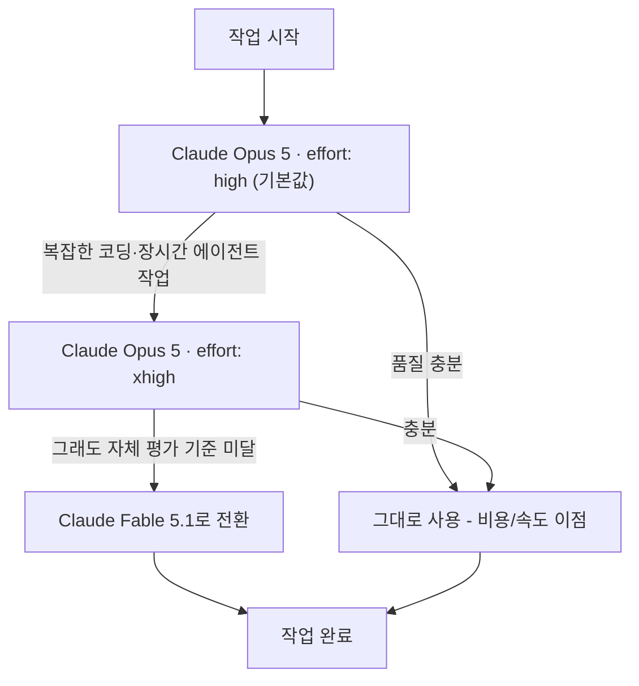
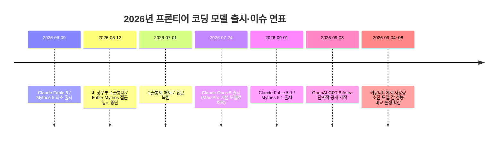

- **작성 기준일: 2026년 9월 8일**
- **대상 게시물: Threads 스레드 (원문 링크: https://www.threads.com/share/BAYScZmBRr/) — 댓글창 캡처 1건 + 원 게시자 본문 텍스트 1건**

```
진성 클코단원으로서 이거 하나는 확실하다.

Opus 5.0은 xhigh로 써도 똥멍청이고
Fable 5.1은 low로 써도 똑똑함.

이 둘 사이에는 넘지 못하는 그 어떤 벽이 존재함.

내가 이걸 어뜨케 알았냐면
Fable 5.1 low로 계속 작업하다가.
Fable 주간한도 걸려서 Opus xhigh로 작업시켜봤는데
임마가 자기는 그런거 못한다고 하는거임. 어처구니가 없어서 진짜.

문제는 어려운 일도 아니었음. 

결국 클로드에서 살아남은건 Fable 뿐임.
아니다.
이제 페이블도 아스트라한테 따잇당했는데.

Fable 5.2 기다려본다. 마지막 기회준다.

 https://www.threads.com/share/BAYScZmBRr/

```


---

## 1. 이 문서의 목적

전달해주신 자료는 두 부분으로 구성되어 있습니다.

1. Threads의 한 게시물에 달린 댓글 4개(인기순 정렬)
2. 그 아래에 별도로 붙여넣어주신, 같은 계정(또는 같은 스레드)으로 추정되는 원문 텍스트 — "진성 클코단원으로서 이거 하나는 확실하다"로 시작하는 글

두 부분 모두 결론적으로 같은 주제, 즉 **"OpenAI가 2026년 9월 초에 내놓은 GPT-6 Astra와 Anthropic의 최신 클로드 모델(오퍼스 5, 페이블 5.1)을 실제 코딩 작업에 써봤더니 사용량 한도가 순식간에 소진되고, 모델 간 체감 성능 차이가 크더라"** 는 실사용자들의 경험담을 다루고 있습니다. 이 문서는 각 발언을 하나씩 짚어가며 (1) 어떤 배경 지식이 필요한지, (2) 실제로 검증 가능한 사실은 무엇인지, (3) 과장되었거나 개인적 체감에 그치는 부분은 무엇인지를 최신 자료를 근거로 정리합니다.

---

## 2. 댓글창 내용 하나씩 뜯어보기

### 2.1 heedo.park — "아무리 뛰어도 우사인 볼트 설렁설렁 뛰는 것보다 느린 느낌"

이 댓글은 원 게시물(본문이 캡처에는 포함되어 있지 않음)에 대한 비유적 반응으로 보입니다. 인간이 아무리 최선을 다해도 압도적인 상대는 힘을 빼고도 앞선다는 뜻의 흔한 비유이며, 맥락상 최신 AI 모델(뒤이은 댓글들의 흐름을 보면 GPT-6 Astra)의 성능 도약을 인간의 노력과 대비해 표현한 것으로 추정됩니다. 다만 이 댓글이 달린 원본 게시물 본문 자체가 자료에 포함되어 있지 않아, 정확히 무엇을 가리키는 비유인지는 단정할 수 없습니다. 이 부분은 추측이 아니라 "확인 불가"로 남겨둡니다.

### 2.2 hwiwoo_kim — "astra가 그 주간 한도 30%를 24시간 만에 태웠다"

여기서 "그쫀쿠"는 욕설을 순화해 표기한 인터넷 은어(강조 표현)로, "그거 정말/엄청"에 가까운 뜻입니다. 즉 이 댓글은 "GPT-6 Astra를 썼더니 주간 사용 한도의 30%를 하루 만에 소진했다"는 불평입니다.

이 발언은 실제로 근거가 있습니다. OpenAI의 코딩 도구 Codex 저장소에는 이와 거의 동일한 사례가 이슈로 등록되어 있습니다. ChatGPT Pro 20x(월 200달러) 요금제 사용자가 GPT-6 Astra Ultra로 약 1시간짜리 코딩 작업(서브에이전트 3개 동원)을 돌렸더니 주간 한도의 약 30%가 소진되었다는 보고입니다. 또한 여러 이용자가 200달러짜리 Pro 요금제 한도를 단일 에이전트 작업으로 약 14시간 만에 모두 소진했다고 공유했고, 이 때문에 OpenAI의 엔지니어링 리드가 한도 리셋 가능성을 시사하는 글을 올리기도 했습니다. 정리하면, **"Astra가 한도를 순식간에 태운다"는 체감은 개인의 과장이 아니라 출시 직후 실제로 광범위하게 보고된 현상**입니다.

### 2.3 taehyeong_lim(작성자 표시) — "코덱스 200불로 올리고 미소녀 격투게임 몇 번 만들었더니 80% 소진"

여기서 "코덱스"는 OpenAI의 에이전트형 코딩 도구 Codex를 가리키고, "200불"은 ChatGPT Pro의 최상위 요금제(월 200달러, 통칭 20x 티어)를 뜻합니다. 이 발언 역시 위 2.2와 같은 계열의 경험담으로, 애니메이션풍 대전 게임을 몇 차례 시험 삼아 만들어보는 정도의 작업만으로 월 200달러 요금제 한도의 80% 가까이를 썼다는 내용입니다.

공식 자료를 보면 이 체감이 왜 발생하는지 설명이 됩니다. 요금제별 5시간 단위 Astra 사용 한도는 공식 문서 기준으로 Plus/Business Standard가 5~45회, Pro 100달러가 25~225회, Pro 200달러가 100~900회 수준으로 안내되어 있고, Business Premium만 5시간 단위 한도 자체가 없습니다. 즉 최상위 유료 요금제라 해도 절대적인 사용 횟수 자체가 넉넉하지 않은 데다, Astra는 추론에 훨씬 많은 연산을 쓰기 때문에 이전 모델(GPT-5.6 Sol) 대비 대략 절반 수준의 메시지 수만 처리할 수 있다는 보고도 있습니다. 여기에 서브에이전트를 여러 개 동원하는 작업 방식이 겹치면 한도 소진 속도가 눈에 띄게 빨라집니다.

### 2.4 duck9ooo — "작업은 페이블, 작업로그는 소넷, 오퍼스는 병렬로 쉬운 일"

이 댓글은 불평이 아니라 **모델을 역할별로 나눠 쓰는 실용적인 전략**을 소개하는 내용입니다.

- **페이블(Claude Fable 5.1)**: 가장 어렵고 긴 작업에 투입
- **소넷(Claude Sonnet 5)**: 상대적으로 가볍고 정형화된 작업(작업 로그 작성 등)에 투입해 비용과 속도를 아낌
- **오퍼스(Claude Opus 5)**: 병렬로 여러 개를 동시에 돌려도 부담이 적은 쉬운 작업에 투입

이 전략은 실제로 Anthropic이 공식 문서에서 권장하는 방향과 맞닿아 있습니다. Anthropic은 "대부분의 작업은 오퍼스 5를 기본으로 쓰고, 오퍼스 5를 높은 노력 단계(effort)로 돌려도 부족할 때만 페이블 5.1로 올려라"라고 명시하고 있습니다. 오퍼스 5는 페이블 5.1의 절반 가격(토큰당 5달러/25달러 대 10달러/50달러)이기 때문에, 병렬로 여러 개를 돌려도 되는 쉬운 작업에는 오퍼스가 비용 효율적이라는 논리가 성립합니다. 소넷을 로그 작성 같은 경량 작업에 쓰는 것도 같은 맥락의 합리적 분업입니다.

---

## 3. 게시물 본문 상세 해설 — "클코단원"의 개인 평가

원문:

> 진성 클코단원으로서 이거 하나는 확실하다. Opus 5.0은 xhigh로 써도 똥멍청이고 Fable 5.1은 low로 써도 똑똑함. 이 둘 사이에는 넘지 못하는 그 어떤 벽이 존재함. ... Fable 주간한도 걸려서 Opus xhigh로 작업시켜봤는데 임마가 자기는 그런거 못한다고 하는거임. ... 결국 클로드에서 살아남은건 Fable 뿐임. 아니다. 이제 페이블도 아스트라한테 따잇당했는데. Fable 5.2 기다려본다. 마지막 기회준다.

"클코단원"은 Claude Code를 꾸준히 쓰는 이용자를 자조적으로 부르는 커뮤니티 은어입니다. 이 글을 항목별로 짚어보겠습니다.

### 3.1 "Opus 5.0은 xhigh로 써도 똥멍청이" — 용어부터 바로잡기

먼저 용어 정리가 필요합니다. Anthropic이 공식적으로 부르는 이름은 "Claude Opus 5"이며 "5.0"이라는 버전 표기는 존재하지 않습니다. 다만 이용자들 사이에서 "5.0"이라고 편하게 부르는 관행이 있어 문맥상 같은 모델(Claude Opus 5)을 가리키는 것으로 보입니다.

"xhigh"는 실제로 존재하는 설정값입니다. Claude Opus 5는 응답 생성 시 얼마나 깊이 사고할지를 조절하는 **effort(노력 단계)** 파라미터를 제공하며, 단계는 low → medium → high → xhigh → max 5단계입니다. 기본값은 high이고, Anthropic은 "어려운 코딩·에이전트 작업에는 xhigh까지 올려서 써라"라고 권장합니다. 즉 글쓴이가 "xhigh로 써도"라고 표현한 것은 실제로 오퍼스 5가 낼 수 있는 최상위에 가까운 사고 강도를 이미 써봤다는 뜻이 됩니다.

다만 "똥멍청이"라는 평가 자체는 객관적 벤치마크 수치가 아니라 개인의 주관적 체감입니다. 이 체감이 완전히 근거 없는 것은 아닙니다. 독립 벤치마크 매체(CodeRabbit 등)의 실측에 따르면, 오퍼스 5는 노력 단계를 xhigh로 올린다고 해서 항상 품질이 올라가는 것은 아니며, 코드 리뷰 같은 과제에서는 오히려 xhigh가 더 적은 항목을 짚어내면서 노이즈는 여전히 남는 등 "더 많이 생각한다고 항상 더 잘하는 것은 아니다"라는 결과가 보고된 바 있습니다. 또한 한 벤치마크(FrontierCode)에서는 오퍼스 5가 medium 단계에서 최고 점수를 기록하고, high로 올려도 점수는 그대로거나 소폭 하락하면서 비용만 약 2배로 뛴 사례도 있습니다. 즉 "effort를 올린다고 무조건 똑똑해지지 않는다"는 것은 검증된 경향이지만, 그렇다고 오퍼스 5가 전반적으로 "멍청하다"고 단정할 근거는 아닙니다. 이 부분은 이용자 개인이 마주친 특정 작업에서의 실패 경험이 강하게 반영된 주관적 평가로 보는 것이 정확합니다.

### 3.2 "Fable 5.1은 low로 써도 똑똑함"

이 부분은 Anthropic의 공식 발표 내용과 상당히 일치합니다. Anthropic은 페이블 5.1을 발표하며 "노력 단계를 low나 medium으로 낮춰도 이전 모델(페이블 5)의 high 단계와 비슷하거나 더 나은 결과를 훨씬 저렴한 비용으로 낼 수 있다"고 명시했습니다. 즉 "낮은 노력 단계로도 똑똑하다"는 체감은 회사가 직접 내세우는 셀링 포인트와 정확히 일치하는 관찰입니다.

다만 페이블 5.1은 오퍼스 5보다 토큰당 가격이 정확히 2배(10달러/50달러 대 5달러/25달러)이고, Claude Code 기준 기본 노력 단계도 high로 더 높게 설정되어 있어, 저노력 단계에서도 강력하다는 것이 "무조건 저렴하다"는 뜻은 아닙니다.

### 3.3 "Fable 주간 한도 걸려서 Opus xhigh로 시켰더니 못한다고 거부"

이 사례는 검증이 어려운 개인 경험담입니다. 어떤 구체적 작업이었는지 원문에 나오지 않기 때문에, 오퍼스 5가 실제로 능력이 부족해서 거부했는지, 안전 가드레일(예: 특정 민감 영역에 대한 정책적 제한)에 걸려 거부했는지, 혹은 프롬프트·컨텍스트 차이로 인한 우연한 실패였는지 구분할 수 없습니다. 다만 앞서 언급했듯 오퍼스 5와 페이블 5.1 사이에는 실제로 성능 격차가 존재하며, Anthropic 스스로도 "오퍼스 5를 xhigh까지 올려도 부족한 경우에만 페이블 5.1로 넘어가라"고 안내하고 있으므로, "오퍼스가 못 하는 일을 페이블이 해낸다"는 구도 자체는 회사 공식 가이드라인상 있을 수 있는 시나리오입니다. 다만 그 격차를 "넘지 못하는 벽"이라고 표현할 만큼 극단적인지는 벤치마크상 확인되지 않으며, Anthropic이 공개한 코딩 벤치마크(Claude Code 하네스 기준)에서는 오퍼스 5가 30.0%, 페이블 5(구버전)가 21.4%로 오히려 오퍼스가 앞선 사례도 있어, 두 모델의 우열은 과제 종류에 따라 갈립니다.

### 3.4 "결국 살아남은 건 Fable뿐" → "이제 페이블도 아스트라한테 밀렸다" — 이 부분이 가장 사실관계 확인이 필요한 주장

이 주장은 명확히 검증이 필요합니다. 결론부터 말하면 **"GPT-6 Astra가 페이블 5.1을 전면적으로 눌렀다"는 단순한 구도는 사실이 아니며, 벤치마크와 항목에 따라 승패가 엇갈립니다.**

GPT-6 Astra는 2026년 9월 3일부터 단계적으로 공개된 OpenAI의 최신 플래그십 모델로, 컴퓨터 사용·브라우징·소프트웨어 엔지니어링·사이버 보안·과학 분야에서 새로운 최고 수준을 냈다고 발표되었습니다. 특히 추상적 추론 능력을 측정하는 ARC-AGI-3 벤치마크에서 OpenAI 자체 하네스 기준 99.9%라는 압도적인 수치를 냈고, 최고 난도의 수학 벤치마크인 FrontierMath Tier 4에서도 97.6%를 기록했습니다. 다만 ARC-AGI-3를 운영하는 독립 기관 ARC Prize Foundation은 이 99.9%가 OpenAI 자체의 "Provider Adapter" 하네스(추론 상태를 호출 간에 유지해주는 방식)를 썼을 때의 결과이며, 공급자 중립적인 표준 하네스로 같은 문제를 풀렸을 때는 62.7%로 크게 낮아진다고 명시했습니다. 즉 이 수치 차이의 상당 부분은 모델 자체의 능력이 아니라 주변 소프트웨어(하네스)의 차이에서 온다는 것이 독립 평가 기관의 공식 입장입니다.

코딩 성능만 놓고 보면 결과는 더 엇갈립니다.

- OpenAI가 자체 공개한 수치로는 Astra가 Terminal-Bench 4.0과 Terminal-Bench Science, DeepSWE 등에서 페이블 5.1을 근소하게 앞섭니다.
- 반면 독립 평가 기관인 Artificial Analysis의 종합 지능 지수에서는 페이블 5.1이 66점으로 Astra(61점, 이전 모델 GPT-5.6 Sol과 동일한 점수)를 앞섰고, 코딩 에이전트 지수에서도 페이블 5.1(Claude Code 환경, 70점)이 Astra(Codex 환경, 67점)보다 높게 나왔습니다. 다만 이 비교는 서로 다른 실행 환경(하네스)에서 측정된 것이라 격차의 일부는 모델이 아니라 환경 차이에서 비롯될 수 있다는 단서가 붙어 있습니다.
- 과제당 비용으로 보면 Astra가 과제당 약 1.67달러, 페이블 5.1이 약 3.76달러로 Astra 쪽이 상당히 저렴하다는 독립 측정 결과도 있습니다. 다만 토큰당 단가(입력 10달러/출력 50달러)는 두 모델이 동일합니다.

정리하면, GPT-6 Astra는 수학·사이버 보안·컴퓨터 사용 등 특정 영역에서는 확실히 앞서 있고 효율(비용 대비 성능)에서도 강점이 있지만, "종합 지능"이나 "에이전트형 코딩" 영역의 독립 평가에서는 여전히 페이블 5.1이 앞선다는 결과도 함께 존재합니다. 따라서 원문의 "페이블도 아스트라한테 밀렸다"는 표현은 특정 벤치마크(주로 OpenAI가 자체 홍보한 수치)만 놓고 보면 일리가 있지만, 독립 기관의 종합 평가까지 감안하면 다소 단순화·과장된 결론입니다.

### 3.5 "Fable 5.2 기다려본다"

2026년 9월 8일 기준으로 검색해본 결과, Anthropic이 "Claude Fable 5.2"라는 이름의 후속 모델을 공식 발표하거나 예고했다는 근거는 확인되지 않았습니다. 가장 최신 공개 모델은 2026년 9월 1일 출시된 Claude Fable 5.1(및 제한적 접근 모델인 Claude Mythos 5.1)입니다. 따라서 이 문장은 사실 보도가 아니라 **글쓴이 개인의 기대·바람**으로 이해하는 것이 정확합니다.

---

## 4. 등장 모델 배경 정리

### 4.1 Claude Opus 5

2026년 7월 24일 출시된 모델로, Claude Code와 Max 요금제의 기본 모델로 자리잡았습니다. 이전 세대(오퍼스 4.8) 대비 심층 추론, 장시간 에이전트형 코딩, 대규모 리팩터링 작업에서 큰 개선이 있었다고 발표되었으며, 페이블 5의 절반 가격(토큰당 입력 5달러/출력 25달러)으로 제공되는 것이 특징입니다. effort(노력 단계) 설정으로 low·medium·high·xhigh·max를 선택할 수 있고, 기본값은 high입니다. 참고로 오퍼스 5는 high 이하로 낮추지 않는 한 "생각(thinking)"을 완전히 끌 수 없도록 설계되어 있어서, thinking을 끈 상태로 xhigh나 max를 요청하면 오류가 발생합니다.

### 4.2 Claude Fable 5.1 / Mythos 5.1

Fable과 Mythos는 오퍼스보다 상위 등급으로 분류되는 "Mythos 계열" 모델의 두 갈래입니다. 두 모델은 같은 기반 모델을 공유하지만, Fable 쪽에는 생물학·사이버 보안·LLM 연구개발 관련 추가 안전장치가 적용되어 있고, Mythos 쪽은 일반 공개가 아니라 미국 정부와 협력한 제한적 접근 프로그램(Project Glasswing 등)을 통해서만 제공됩니다. 최초 버전인 Fable 5·Mythos 5는 2026년 6월 9일 출시되었으나, 미국 상무부의 수출통제 조치로 6월 12일부터 접근이 일시 중단되었고, 이후 해당 통제가 해제되면서 7월 1일 다시 정상화되었습니다. 이후 개선판인 Fable 5.1·Mythos 5.1이 2026년 9월 1일 출시되었으며, Anthropic은 이 개선판이 코딩·지식노동·장기 문제 해결에서 새로운 기준을 세웠다고 밝혔습니다. 다만 회사의 공식 권장 사항은 "대부분의 작업은 더 저렴한 오퍼스 5를 우선 사용하고, 오퍼스 5의 xhigh 단계로도 부족할 때만 페이블 5.1로 올리라"는 것으로, 페이블 5.1을 무조건 상위 선택지로 밀지는 않습니다.

### 4.3 GPT-6 Astra

OpenAI가 2026년 9월 3일부터 단계적으로 공개한 최신 플래그십 모델로, 컴퓨터 사용·브라우징·소프트웨어 엔지니어링·과학·전문 업무 전반에서 최고 수준의 성능을 낸다고 발표되었습니다. 특히 사이버 보안 능력이 크게 향상되어 OpenAI 자체 안전 프레임워크상 "Critical(위험)" 등급 문턱을 처음으로 넘은 모델로 분류되었고, 이 때문에 방어적 목적(취약점 점검·패치)의 활용은 허용하되 공격적 악용 가능성에 대한 안전장치를 대폭 강화했다고 밝혔습니다. 가격은 오퍼스 5보다 2배 비싼, 페이블 5.1과 동일한 수준(토큰당 입력 10달러/출력 50달러)입니다. Codex(OpenAI의 에이전트형 코딩 도구)에서도 동일한 effort 체계(low·medium·high·xhigh·max)를 지원합니다.

### 4.4 "effort(노력 단계)"란 무엇인가

effort는 모델이 답을 내놓기 전에 얼마나 깊이, 얼마나 많은 토큰을 들여 "생각"할지를 이용자가 직접 조절하는 설정입니다. 낮게 설정하면 빠르고 저렴하지만 얕은 답이 나올 수 있고, 높게 설정하면 느리고 비싸지만 복잡한 문제에서 더 나은 결과를 기대할 수 있습니다. 다만 여러 독립 벤치마크가 공통적으로 보여주는 사실은 "더 높은 effort가 항상 더 나은 결과를 보장하지는 않는다"는 것입니다. 특정 과제에서는 medium이 high보다 오히려 점수가 높거나 비용 대비 효율이 훨씬 좋았던 사례가 보고되어 있어, 각자의 실제 작업에서 직접 비교해보는 것이 권장됩니다.

아래는 오퍼스 5 기준 Anthropic의 공식 권장 흐름입니다.



---

## 5. 2026년 9월 초 주요 모델 출시 연표



---

## 6. 벤치마크 비교표

아래 수치는 발표 주체가 서로 다르고 측정 하네스(실행 환경)도 다르므로, 절대적 우열보다는 "어떤 영역에서 어떤 모델이 강점을 보이는가"를 파악하는 용도로 참고하시기 바랍니다.

| 벤치마크 / 지표 | GPT-6 Astra | Claude Fable 5.1 | 비고 |
|---|---|---|---|
| ARC-AGI-3 (OpenAI 자체 Provider Adapter 하네스) | 99.9% | 해당 벤치마크 공개치 없음 | ARC Prize는 이 수치가 하네스 효과를 크게 반영한다고 지적 |
| ARC-AGI-3 (공급자 중립 표준 하네스, ARC Prize 독립 측정) | 62.7% | — | 이전 1위였던 Claude Opus 5는 30.0~30.2% |
| FrontierMath Tier 4 | 97.6% | 87.8% | OpenAI 발표 수치 기준 |
| ExploitBench(공격 취약점 벤치마크) | 100% | 약 70% | 사이버 보안 관련, Astra가 OpenAI 기준 "Critical" 등급 최초 진입 |
| Terminal-Bench 4.0 | 57.7~57.9% | 55.8% | 근소한 차이 |
| Terminal-Bench Science 0.1 | 64.6% | 52.6% | Astra 우위 |
| Artificial Analysis 종합 지능 지수(독립 평가) | 61 | 66 | 페이블 5.1 우위 |
| Artificial Analysis 코딩 에이전트 지수(독립 평가) | 67 (Codex 환경) | 70 (Claude Code 환경) | 서로 다른 실행 환경 비교라는 단서 있음 |
| 과제당 평균 비용(Artificial Analysis 추정) | 약 1.67달러 | 약 3.76달러 | Astra가 더 저렴 |
| 토큰당 가격(입력/출력, 1백만 토큰 기준) | 10달러/50달러 | 10달러/50달러 | 동일 |

---

## 7. 사용량 한도 문제, 왜 이렇게 화제가 되었나

이번 논쟁이 커진 결정적 배경은 세 모델(오퍼스 5, 페이블 5.1, GPT-6 Astra) 모두 "서브에이전트를 여러 개 동시에 띄워 작업을 나눠 처리하는" 방식을 적극적으로 쓴다는 데 있습니다. 서브에이전트를 여러 개 굴리면 작업 속도는 빨라지지만, 그만큼 토큰 소모(=사용 한도 소모)도 곱절로 늘어납니다. 실제로 페이블 5.1은 출시 초기에 Max 요금제 이용자들 사이에서 "5시간 한도가 30분 만에, 심지어 프롬프트 한 번으로 소진됐다"는 불만이 다수 보고되었고, Anthropic은 출시 시점에 한도를 초기화하고 9월 중순까지 주간 사용량을 늘려주는 임시 조치를 취하기도 했습니다. GPT-6 Astra 쪽도 사정은 비슷해서, 공식 문서 기준 월 200달러 Pro 요금제조차 5시간당 100~900회 수준의 메시지 한도만 제공되며, 커뮤니티에서는 단일 에이전트 작업만으로 이 한도를 반나절 만에 모두 소진했다는 보고가 다수 나왔습니다.

즉 댓글창에 나온 "한도가 순식간에 사라진다"는 불만은 특정 회사만의 문제가 아니라, 2026년 9월 현재 최상위 등급 모델들이 공통으로 겪고 있는 "고성능·고비용 모델을 서브에이전트 구조로 굴릴 때 발생하는 구조적 부작용"으로 이해하는 것이 정확합니다.

---

## 8. 정리 — 사실과 개인 체감을 구분하기

| 주장 | 판정 | 근거 요약 |
|---|---|---|
| Astra가 주간 한도 30%를 24시간 만에 소진했다 | 사실에 부합 | Codex 저장소 이슈, 다수의 이용자 보고와 일치 |
| 코덱스 200달러 요금제로 짧은 작업만 했는데 80% 소진 | 사실에 부합 | 공식 요금제 한도표 및 "14시간 만에 소진" 등 다수 사례와 정합 |
| Fable 5.1은 낮은 effort로도 강력하다 | 사실에 부합 | Anthropic 공식 발표 내용과 일치 |
| Opus 5는 xhigh로도 형편없다 | 개인 체감(주관적 평가) | 객관적으로는 과제별로 갈리며, "effort를 올려도 항상 좋아지진 않는다"는 경향은 검증되었으나 "전반적으로 멍청하다"는 결론은 아님 |
| 오퍼스와 페이블 사이에 "넘지 못하는 벽"이 있다 | 과장/개인 체감 | Anthropic 공개 벤치마크에서는 오히려 오퍼스 5가 페이블 5(구버전)를 앞선 항목도 존재 |
| 이제 Fable도 Astra에 완전히 밀렸다 | 부분적으로만 사실 | 수학·사이버보안·컴퓨터 사용 등 일부 영역은 Astra 우위, 종합 지능·코딩 에이전트 독립 지수는 여전히 Fable 5.1 우위 |
| Fable 5.2가 곧 나온다 | 근거 없음(개인 기대) | 2026년 9월 8일 기준 공식 발표·예고 확인되지 않음 |

전체적으로 이 스레드는 "출시 직후 실사용자들이 각자의 워크플로에서 겪는 생생한 체감"과 "특정 벤치마크만 골라 강조한 다소 성급한 결론"이 뒤섞인 전형적인 커뮤니티 게시물입니다. 사용량 소진 문제처럼 다수의 독립적 보고가 일치하는 부분은 신뢰도가 높지만, "어느 모델이 결국 최고냐"는 결론은 어떤 벤치마크와 어떤 실행 환경을 기준으로 삼느냐에 따라 뒤집힐 수 있는, 아직 정리되지 않은 논쟁으로 보는 것이 정확합니다.

---

## 9. 한국어·용어 해설

- **클코단원**: Claude Code를 상시적으로 쓰는 이용자를 가리키는 커뮤니티 은어
- **효과(effort) / 노력 단계**: 모델이 답변 전에 얼마나 깊이 사고할지를 조절하는 설정. low·medium·high·xhigh·max 5단계
- **주간 한도(weekly limit)**: 5시간 단위의 단기 한도와 별개로, 7일 누적 기준으로 부여되는 사용량 상한
- **서브에이전트(sub-agent)**: 하나의 작업을 여러 개의 하위 작업으로 쪼개 병렬로 처리하는 에이전트 구조. 처리 속도는 빨라지지만 토큰 소모량도 늘어남
- **하네스(harness)**: 모델 자체가 아니라 모델을 감싸는 주변 소프트웨어(도구 호출, 상태 유지, 메모리 관리 등)를 뜻하며, 같은 모델이라도 하네스에 따라 벤치마크 점수가 크게 달라질 수 있음
- **Mythos 계열**: Anthropic이 오퍼스보다 상위 등급으로 분류하는 모델 계열. 공개 배포판이 Fable, 제한적 접근판이 Mythos

---

## 10. 출처 신뢰도 등급

**[공식 1차 출처]**
- OpenAI, "GPT-6 Astra: A new generation of intelligence" (openai.com)
- OpenAI, GPT-6 Astra 안전 개요 및 시스템 카드 (openai.com, deploymentsafety.openai.com)
- OpenAI, GPT-6 Astra API 문서 (developers.openai.com)
- Anthropic, "Introducing Claude Fable 5.1 and Claude Mythos 5.1" (anthropic.com)
- Anthropic, Claude Opus 5 공식 문서 — What's new, Prompting guide, Effort 문서 (platform.claude.com)

**[복수 매체 교차검증]**
- GPT-6 Astra vs Claude Fable 5.1 벤치마크 비교: DataCamp, MindStudio(2건), alphacorp.ai, kie.ai, Coursiv, DEV Community 등 다수 매체가 유사한 수치(ARC-AGI-3 하네스 격차, Artificial Analysis 지수 등)를 교차 보도
- GPT-6 Astra 요금제별 한도: OpenAI Codex 공식 GitHub 이슈 트래커 및 codexusage.dev 정리 문서가 서로 부합

**[단일 출처 / 커뮤니티 보고 성격]**
- Codex 사용량 소진 관련 X(옛 트위터) 트렌드 요약 2건 — 다수 이용자 사례를 그록(Grok)이 요약한 형태로, 개별 사례의 진위는 각 게시자 개인 보고에 의존
- CodeRabbit, ClaudeFolio, wmedia.es, note.com(oji-tec) — effort 단계별 실측 사례를 다룬 개별 매체·개인 블로그

**[분석적 종합·편집 판단]**
- 3.1~3.4절의 "사실 부합/개인 체감/과장" 판정, 8절의 종합 정리표, 전체 구도 해석은 위 출처들을 종합해 이 문서 작성자가 판단한 내용입니다.

---

## 11. 참고문헌

1. OpenAI, "GPT-6 Astra: A new generation of intelligence" — https://openai.com/index/gpt-6-astra/
2. OpenAI, GPT-6 Astra API 모델 문서 — https://developers.openai.com/api/docs/models/gpt-6-astra
3. OpenAI, "Safety overview: GPT-6 Astra" — https://openai.com/index/safety-overview-gpt-6-astra/
4. OpenAI Deployment Safety Hub, GPT-6 Astra 시스템 카드 — https://deploymentsafety.openai.com/gpt-6-astra
5. CNBC, "OpenAI announces rollout of GPT-6 Astra model" (2026-09-03) — https://www.cnbc.com/2026/09/03/open-ai-astra-gpt-6-cyber.html
6. DataCamp, "GPT-6 Astra: Features, Benchmarks, and Pricing" — https://www.datacamp.com/blog/gpt-6-astra
7. DataCamp, "GPT-6 Astra vs Claude Fable 5.1: Benchmarks and Pricing" — https://www.datacamp.com/blog/gpt-6-astra-vs-claude-fable-5-1
8. Anthropic, "Introducing Claude Fable 5.1 and Claude Mythos 5.1" — https://www.anthropic.com/claude-fable-and-mythos-5-1
9. Anthropic Platform Docs, "What's new in Claude Opus 5" — https://platform.claude.com/docs/en/about-claude/models/whats-new-opus-5
10. Anthropic Platform Docs, "Prompting Claude Opus 5" — https://platform.claude.com/docs/en/build-with-claude/prompt-engineering/prompting-claude-opus-5
11. Anthropic Platform Docs, "Effort" — https://platform.claude.com/docs/en/build-with-claude/effort
12. CodeRabbit, "Claude Opus 5 Benchmarks for AI Code Review" — https://www.coderabbit.ai/blog/opus-5-model-review
13. ClaudeFolio, "What Effort Level Should You Set Claude Opus 5?" — https://claudefolio.com/blog/why-you-should-run-claude-opus-5-at-medium-effort
14. wmedia.es, "Opus 5 in Claude Code: 8 tips from Anthropic" — https://wmedia.es/en/tips/claude-code-opus-5-prompting-tips
15. note.com(oji-tec), "Claude Code의 effort 5단계 정리" — https://note.com/oji_tec6706/n/nae6ffb5cd26e?hl=en
16. OpenAI Codex GitHub, Issue #43029 (Astra Ultra 20x Pro 주간 한도 30% 소진) — https://github.com/openai/codex/issues/43029
17. codexusage.dev, "GPT-6 Astra Codex Usage Limits: Quota, Plus vs Pro & Resets" — https://www.codexusage.dev/limits/astra
18. MindStudio, "GPT-6 Astra Benchmarks: Is It Really Better Than Fable 5.1?" — https://www.mindstudio.ai/blog/gpt-6-astra-benchmarks-analysis
19. MindStudio, "GPT-6 Astra Benchmarks: How It Really Compares to Fable 5.1 and Gemini" — https://www.mindstudio.ai/blog/gpt6-astra-benchmark-comparison
20. patmcguinness (Substack), "Claude Fable 5.1, GPT-6 Astra, and the New AI Model Stack" — https://patmcguinness.substack.com/p/claude-fable-51-gpt-6-astra-and-the
21. DEV Community, "GPT-6 Astra vs Fable 5.1 vs Gemini 3.8 Flash: The Ultimate Comparison" — https://dev.to/gabrielanhaia/gpt-6-astra-vs-fable-51-vs-gemini-38-flash-the-ultimate-comparison-24g0
22. alphacorp.ai, "GPT-6 Astra vs Claude Fable 5.1: Benchmarks, Pricing and Which Is Better" — https://alphacorp.ai/blog/gpt-6-astra-vs-claude-fable-5-1-benchmarks-pricing-and-which-is-better
23. kie.ai, "GPT-6 Astra vs Claude Fable 5.1: Which Wins?" — https://kie.ai/blog/gpt-6-astra-vs-claude-fable-5-1
24. Coursiv, "Claude vs ChatGPT: GPT-6 Astra vs Fable 5.1 (2026)" — https://coursiv.io/blog/gpt-6-astra-vs-claude-fable-5-1
25. ayautomate.com, "Claude Fable 5.1 vs Opus 5: Full Benchmark Comparison" — https://www.ayautomate.com/blog/claude-fable-5-1-vs-opus-5
26. ayautomate.com, "8 things that changed in Claude Fable 5.1" — https://www.ayautomate.com/blog/claude-fable-5-1-whats-new
27. ITNEXT, "Claude Code Now Has Opus 5 and Fable 5 — But They're Almost Unusable" — https://itnext.io/claude-code-now-has-opus-5-and-fable-5-but-theyre-almost-unusable-42bdb24328e8
