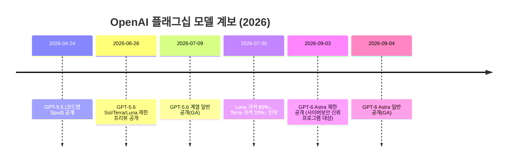
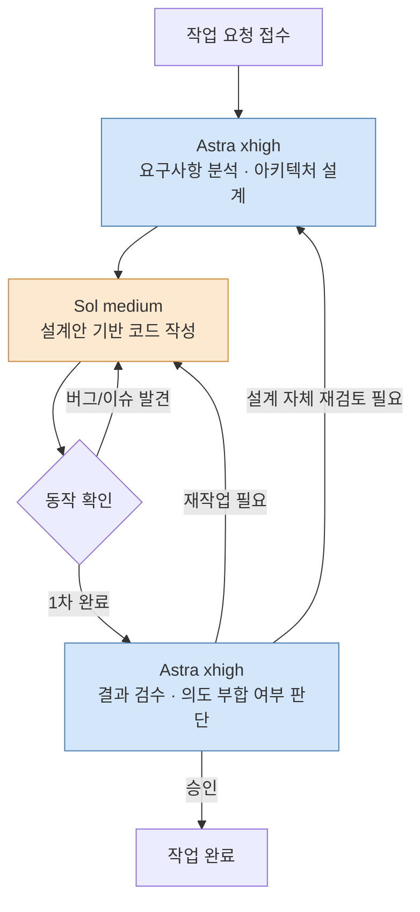

- 원문 출처: Threads 게시물(`https://www.threads.com/share/BATVOjjQ6s/`)
- 분석 작성일: 2026년 9월 11일
- ※ Threads 게시물은 robots.txt 정책상 자동 수집이 차단되어 있어, 사용자가 채팅에 직접 입력한 텍스트를 원문으로 삼아 분석했습니다. 게시물 자체의 조회수·댓글 반응 등 부가 정보는 확인할 수 없었습니다.

> 
> Astra 토큰 가성비 실험 결과, 
> 
> 내가 정착한 모델은 Astra xhigh + sol medium이야.
> 
> Astra Light 단독으로 사용할 때보다 2배는 오래 사용하는 것 같아.
> 
> Astra xhigh는 설계와 결과 검수를 맡고, 
> 
> Sol medium은 코딩을 담당해.
> 
> 이게 가성비가 가장 좋더라고.
> 
> luna와 협업은 최악이였어.
> 
> xhigh를 선택한 이유는 Astra Light/Medium 보다 xhigh가 세션 통신 횟수가 절반 밖에 안되서 비용이 오히려 덜 드는것 같아. 설계에는 더 강한 느낌이고.
> 
> https://www.threads.com/share/BATVOjjQ6s/
> 

---

## 0. 요약 (TL;DR)

게시물 작성자는 코딩 작업에서 OpenAI의 두 모델 세대를 섞어 쓰는 조합, 즉 **최신 플래그십 GPT-6 Astra를 xhigh(추론 강도 최상위권) 설정으로 설계·검수에 쓰고, 전 세대 플래그십 GPT-5.6 Sol을 medium 설정으로 실제 코딩에 투입**하는 방식을 "정착한 워크플로"로 소개하고 있습니다. 이 조합이 Astra 단독 사용(그중에서도 낮은 추론 강도) 대비 체감상 2배 오래 쓸 수 있었고, 반대로 GPT-5.6 계열의 최하위 티어인 Luna와의 협업은 최악이었다는 것이 핵심 주장입니다.

먼저 결론부터 정리하면:

- **GPT-6 Astra는 실존하는 모델이 맞습니다.** 2026년 9월 3일 제한 공개, 9월 4일 일반 공개된 OpenAI의 최신 플래그십 모델입니다. 아직 출시 8일차의 "따끈한" 모델이라, 커뮤니티의 베스트 프랙티스도 이제 막 쌓이는 중입니다.
- **"Astra Light"라는 정식 명칭은 존재하지 않습니다.** OpenAI가 공식적으로 지원하는 `reasoning.effort` 값은 `low, medium, high, xhigh, max` 다섯 단계이며, "light"라는 이름의 단계는 없습니다. 작성자가 말한 "Light"는 사실상 `low`를 가리키는 구어적 표현으로 추정됩니다.
- **"xhigh가 세션 통신 횟수를 절반으로 줄여 비용이 덜 든다"는 주장은 방향성 자체는 독립 벤치마크 기관의 실측 데이터와 부합합니다.** 다만 정확히 "절반"이라는 수치가 Astra의 xhigh 단계에서 공식적으로 검증된 것은 아니며, 유사한 패턴(추론 강도를 올리면 턴 수가 줄어 총비용이 오히려 낮아지는 역전 현상)이 다른 벤치마크에서 확인됩니다.
- **업계 컨센서스(전문가 블로그·개발자 커뮤니티)는 오히려 "Astra는 medium이 기본값"이라는 쪽에 가깝습니다.** 이는 작성자의 xhigh 선택과 다소 결이 다른데, 그 이유는 작업 성격의 차이(1회성 설계·검수 vs. 장시간 자율 실행)에서 찾을 수 있어 보입니다. 아래에서 상세히 다룹니다.
- **Luna는 애초에 "정교한 설계·코딩"을 위한 모델이 아니라 "저비용·고처리량의 단순 작업"을 위한 모델**이므로, 복잡한 협업에서 최악의 경험이었다는 평가는 모델의 설계 의도와 정확히 일치합니다.

---

## 1. 게시물 원문 핵심 주장 정리

작성자가 채팅에 입력한 원문을 그대로 나열하면 다음과 같은 주장들로 구성되어 있습니다.

1. Astra 토큰 가성비 실험을 진행했고, 최종적으로 정착한 조합은 **Astra xhigh + Sol medium**이다.
2. 이 조합은 **Astra Light 단독 사용 대비 체감상 2배 오래 사용** 가능하다.
3. 역할 분담: **Astra xhigh = 설계와 결과 검수**, **Sol medium = 코딩**.
4. 이 역할 분담이 **가성비가 가장 좋다**.
5. **Luna와의 협업은 최악**이었다.
6. xhigh를 고른 이유는 Astra Light/Medium 대비 **세션 통신 횟수가 절반** 정도라 비용이 오히려 덜 들고, **설계 능력도 더 강하게 느껴졌기** 때문이다.

이 여섯 가지 주장을 하나씩 검증하고, 그 배경이 되는 모델 생태계를 설명하겠습니다.

---

## 2. 배경 지식: GPT-6 Astra와 GPT-5.6 계열은 정확히 무엇인가

### 2.1 GPT-6 Astra — OpenAI의 최신 플래그십

GPT-6 Astra는 OpenAI가 2026년 9월 3일 제한된 조직(사이버보안 관련 신뢰 프로그램 참여사)을 대상으로 먼저 공개하고, 하루 뒤인 9월 4일부터 ChatGPT 유료 플랜과 API로 확대 공개한 모델입니다. OpenAI 사장 그렉 브록먼은 이 모델을 "가장 지능적이면서 동시에 가장 정렬(alignment)된 모델"이라고 소개했고, 일부 외신은 OpenAI 내부에서 이 모델을 AGI로의 전환점으로 언급했다고 보도했습니다.

몇 가지 눈에 띄는 특징은 다음과 같습니다.

- OpenAI의 대비 프레임워크(Preparedness Framework) 기준으로 **사이버보안 영역에서 처음으로 "Critical" 등급에 도달**한 모델로 분류되어, 사이버보안 관련 민감 기능은 신뢰 프로그램 참여 조직에만 단계적으로 개방되고 있습니다.
- 이전 세대인 GPT-5.6 Sol 대비 토큰 사용량이 크게 줄었다는 점이 독립 벤치마크 기관 Artificial Analysis의 분석에서 반복적으로 강조되고 있습니다. 예를 들어 최대 추론 강도(max) 기준 코딩 에이전트 작업에서 Astra는 Sol의 약 3분의 1 수준의 토큰만 사용하면서도 더 높은 점수를 기록했습니다.
- 컨텍스트 윈도우는 약 105만 토큰, 최대 출력은 12.8만 토큰이며, 학습 데이터 기준일(knowledge cutoff)은 2026년 4월 30일입니다.

### 2.2 GPT-5.6 계열(Sol / Terra / Luna) — Astra의 "전 세대"

Astra 이전 세대인 GPT-5.6은 단일 모델이 아니라 **Sol(최상위) · Terra(균형형) · Luna(최경량)** 의 3단계 티어로 2026년 6월 말~7월 초 사이 순차 공개되었습니다. 이 구조는 Anthropic의 Opus·Sonnet·Haiku, Google의 Gemini Ultra·Pro·Flash와 유사하게, "숫자가 세대를 나타내고 이름이 티어의 성격을 나타내는" 방식입니다.

- **Sol**: 복잡한 추론, 긴 문맥 분석, 정교한 코드 생성, 에이전트형 워크플로 등 "진짜 어려운 작업"을 위한 최상위 모델.
- **Terra**: 고객 지원, 내부 도구, 문서 분석 등 일상적 프로덕션 업무를 위한 균형형 모델.
- **Luna**: 요약, 분류, 라우팅, 경량 실시간 어시스턴트 등 **처리량과 속도가 비용보다 중요한 대량 작업**을 위한 초경량 모델. ChatGPT 일반 사용자 화면에서는 선택할 수 없고 ChatGPT Work, Codex, API, GitHub Copilot 등에서만 노출되는 점도 특징입니다.

### 2.3 모델 계보 타임라인

### 2.4 가격 비교

아래는 2026년 9월 11일 기준 OpenAI 공식 API 문서에 게시된 표준(비-Batch, 짧은 컨텍스트) 가격입니다. 캐시 할인·긴 컨텍스트 할증 등은 각주로 별도 표기했습니다.

| 모델 (티어) | 입력 / 100만 토큰 | 출력 / 100만 토큰 | 캐시 입력 | 성격 |
|---|---|---|---|---|
| GPT-6 Astra | $10.00 | $50.00 | $1.00 | 최신 플래그십, 설계·심층 추론·코딩 에이전트 전반 |
| GPT-5.6 Sol | $4.00¹ | $20.00¹ | $0.40 | 전 세대 플래그십, 복잡한 코딩·에이전트 워크플로 |
| GPT-5.6 Terra | $2.00 | $12.00 | 비공개 | 균형형, 일반 프로덕션 업무 |
| GPT-5.6 Luna | $0.20 | $1.20 | 비공개 | 초경량, 고처리량 단순 작업 |

¹ Sol은 출시 당시 $5.00/$30.00였으나, 2026년 9월 초 프로모션 가격으로 $4.00/$20.00로 인하되었고, 이 프로모션은 최소 2026년 11월 21일까지 유지된다고 공지되어 있습니다. 272,000 토큰을 넘는 긴 컨텍스트 요청에는 입력 2배·출력 1.5배의 할증이 붙습니다.

Astra의 토큰당 가격은 Sol 대비 **정확히 2.5배**이며, 이는 Anthropic의 Claude Fable 5.1과 동일한 가격대로, 업계에서는 OpenAI가 Astra를 Fable 5.1의 직접 경쟁자로 포지셔닝한 신호로 해석하고 있습니다.

---

## 3. `reasoning.effort`(추론 강도)란 무엇인가

GPT-6 Astra와 GPT-5.6 계열은 모두 `reasoning.effort`라는 파라미터로 "모델이 답변 전에 얼마나 오래·깊게 사고할지"를 조절합니다. 작성자가 말한 xhigh, medium, Light(low로 추정)는 모두 이 파라미터의 값입니다.

Astra에서 지원하는 단계는 **low, medium, high, xhigh, max** 다섯 가지이며, 과거 GPT-5.x 세대에 있었던 `none`(추론 없음) 단계는 Astra에서 완전히 제거되어, 이 값을 그대로 보내면 API가 오류(400)를 반환합니다. 참고로 Luna는 예외적으로 `none`을 포함한 여섯 단계를 모두 지원합니다.

추론 강도가 올라갈수록 일반적으로:

- 출력 토큰(사고 과정 포함)이 늘어나 **개별 요청당 비용이 커지고**,
- 처음 응답까지 걸리는 시간(첫 토큰 지연)이 늘어나며,
- 벤치마크 점수는 개선되지만 **단계가 올라갈수록 점수 개선 폭은 점점 작아지는(체감 수확 감소)** 경향을 보입니다.

독립 벤치마크 기관 Artificial Analysis가 발표한 Intelligence Index(버전 4.2 기준) 수치를 보면 이 체감 수확 감소가 뚜렷합니다.

| 추론 강도 | Astra 점수 | Astra 작업당 비용 | Sol 점수 | Sol 작업당 비용 |
|---|---|---|---|---|
| low | 49 | $0.63 | 41 | $0.23 |
| medium | 52 | $1.16 | 46 | $0.37 |
| high | 53 | $1.41 | 48 | $0.61 |
| xhigh | 54 | $1.85 | 50 | $0.89 |
| max | 55 | $2.57 | 51 | $1.25 |

*(출처: Artificial Analysis 벤치마크 데이터를 인용한 IT 전문 블로그 "I Like Kill Nerds"의 2026년 9월 6일 글. 1차 출처는 Artificial Analysis이나, 표 자체는 해당 블로그가 재구성한 것이므로 2~3등급 출처로 분류했습니다.)*

이 표에서 두 가지 흥미로운 지점이 보입니다.

1. **Astra medium(52점, $1.16)이 Sol max(51점, $1.25)보다 점수는 높고 비용은 오히려 저렴**합니다. 즉 "전 세대 모델을 최고 강도로 굴리는 것"보다 "신세대 모델을 중간 강도로 쓰는 것"이 더 합리적이라는 게 이 시점 커뮤니티의 대체적 결론입니다.
2. **low→medium 구간(+3점, 비용 +84%)이 가장 "이득이 큰" 구간**이고, 그 위 단계(medium→high→xhigh→max)로 갈수록 1점 상승에 22~39%씩 비용이 붙는 저효율 구간에 진입합니다.

이 데이터만 보면 "왜 xhigh까지 갈 필요가 있나"라는 의문이 들 수 있는데, 이는 뒤에서 다루는 **"턴 수(에이전트 왕복 횟수)" 관점**을 함께 봐야 풀립니다.

---

## 4. 핵심 쟁점: "xhigh가 세션 통신 횟수를 절반으로 줄인다"는 주장 팩트체크

작성자 주장의 핵심 근거는 "추론 강도가 낮으면 모델이 여러 번 왔다 갔다 하며(재시도, 되돌아가기 등) 세션 통신 횟수가 늘고, 그 왕복 횟수 자체가 비용의 대부분을 차지한다"는 논리입니다. 이는 **단일 요청의 토큰 단가보다 "작업을 끝내기까지 몇 번을 주고받는가"가 실제 총비용을 좌우한다**는 관점인데, 실제로 이를 뒷받침하는 독립적인 데이터가 존재합니다.

### 4.1 ARC-AGI-3 벤치마크 사례 — 추론 강도가 높을수록 총비용이 더 저렴했던 역전 현상

AI 벤치마크 비영리기관 ARC Prize가 표준 하네스(harness)로 Astra를 모든 추론 강도에서 돌린 ARC-AGI-3 실험에서, **max 강도가 가장 높은 점수를 냈을 뿐 아니라, 총비용도 가장 저렴**했습니다. medium 강도는 총 $48,090이 든 반면, max 강도는 $26,098로 오히려 더 쌌습니다. 개별 턴(요청) 하나의 단가는 max가 더 비싸지만, **목표를 달성하기까지 필요한 행동(턴) 수 자체가 크게 줄어들어** 전체 합산 비용이 역전된 것입니다. medium은 이런저런 시도와 되돌아가기를 반복한 반면, max는 상황을 파악한 뒤 곧바로 필요한 행동을 실행하는 경향을 보였다고 분석되고 있습니다.

이 사례는 작성자가 말한 "세션 통신 횟수가 줄어 비용이 덜 든다"는 논리와 정확히 같은 메커니즘을 보여줍니다. 다만 이 실험은 xhigh가 아니라 **max** 강도에서 관찰된 것이고, 비교 대상도 xhigl이 아니라 medium이라는 점에서 작성자가 말한 정확한 조건(xhigh vs. low/medium)과는 차이가 있습니다.

### 4.2 GDPval-AA v2 벤치마크 — 턴 수 감소의 정량적 수치

Artificial Analysis의 또 다른 평가인 GDPval-AA v2(전문직 업무 재현 벤치마크)에서는, **Astra가 max 강도에서 작업당 평균 24턴**을 사용한 반면, 전 세대 모델인 **Sol은 45턴, Claude 계열(Fable 5.1·Opus 5)은 60턴**을 사용했습니다. 24턴은 45턴의 약 53%로, **작성자가 말한 "절반"이라는 체감과 거의 정확히 일치하는 수치**입니다.

다만 이 비교는 (1) Astra의 xhigh가 아니라 max 강도 기준이며, (2) Astra 내부의 강도별 비교가 아니라 **Astra(신세대) vs. Sol(구세대)** 간의 세대 간 비교라는 점에 유의해야 합니다. 즉 작성자가 실제로 체감한 것은 "Astra를 xhigh로 쓸 때 low/medium 대비 왕복이 절반"이라는 것이고, 공개된 데이터는 "Astra를 max로 쓸 때 Sol 대비 왕복이 거의 절반"이라는 것이어서, **비교 축이 정확히 같지는 않지만 방향성과 대략적인 배율(절반 안팎)은 상당히 일치**합니다.

### 4.3 종합 판단

- 방향성(추론 강도를 올리면 왕복 횟수가 줄어 총비용이 낮아질 수 있다)은 **두 개의 독립적인 벤치마크에서 재현되는 현상**이라 신빙성이 높습니다.
- "정확히 절반"이라는 구체적 수치는 작성자 본인의 세션에서 나온 체감치이며, 공개 벤치마크의 유사 수치(GDPval-AA v2의 약 53%)와 크게 어긋나지 않지만, **Astra의 xhigh 단계만 따로 떼어 low/medium과 비교한 공식 수치는 현재까지 공개되어 있지 않습니다.** 따라서 이 부분은 "업계 데이터와 방향이 일치하는 개인 관측"으로 보는 것이 정확하며, 보편적으로 검증된 법칙으로 단정하기는 이릅니다.

---

## 5. "Astra xhigh(설계·검수) + Sol medium(코딩)" 조합의 논리 구조

### 5.1 판단 레이어 vs. 실행 레이어 프레임워크로 보기

이 조합은 작업 단계별로 "무엇이 판단(설계·검수)이고 무엇이 실행(코딩)인가"를 나누고, 각각에 다른 비용 등급의 모델을 배치한 사례로 읽을 수 있습니다.

- **판단 레이어(Astra xhigh)**: 무엇을 만들지 구조를 정하고, 완성된 코드가 요구사항과 의도에 맞는지 검수하는 일. 호출 빈도는 낮지만(세션당 소수 회), 한 번의 실수가 이후 작업 전체의 방향을 틀리게 만들 수 있어 **품질이 비용보다 중요한 영역**입니다.
- **실행 레이어(Sol medium)**: 정해진 설계를 바탕으로 실제 코드를 작성하고 반복적으로 수정하는 일. 호출 빈도가 높고(세션당 수십 회), **단가가 낮아야 전체 예산이 감당 가능한 영역**입니다.

### 5.2 왜 Sol medium인가 (Astra medium이 아니라)

앞서 3장의 표에서 보았듯, Sol medium 자체는 Astra 계열보다 절대 점수는 낮지만, **작업당 비용이 Astra 대비 3분의 1 이하**입니다. "코딩"처럼 반복 호출이 잦은 실행형 작업에서는 절대 지능보다 단가가 총비용을 좌우하기 쉽고, 실제로 OpenAI Developer 커뮤니티에 정리된 내용에 따르면 OpenAI 스스로도 **"Astra-low가 예전 Sol-high를 대체할 만하다"는 취지의 가이드를 제공**하고 있다고 알려져 있습니다(이는 커뮤니티 게시글을 통해 재확인된 내용으로, OpenAI의 원문 공지를 직접 확인한 것은 아니므로 3등급 출처로 분류합니다). 즉 "구세대 최고 강도"를 "신세대 낮은 강도"로 대체하는 발상 자체는 낯선 것이 아니며, 작성자의 조합은 이를 한 단계 더 변형해 **"신세대 최고 강도는 설계·검수라는 저빈도 고가치 작업에, 구세대 중간 강도는 코딩이라는 고빈도 저가치 작업에" 배치한 것**으로 볼 수 있습니다.

### 5.3 워크플로 다이어그램

이 구조의 핵심은 **고가 모델(Astra xhigh)이 세션 전체를 관통하지 않고, 진입점과 종료점 근처에서만 소수 회 호출**된다는 점입니다. 반면 저가 모델(Sol medium)은 실제 반복 작업(코드 작성-실행-수정 루프)을 담당하며 훨씬 많은 횟수로 호출됩니다. 전체 세션의 토큰 총량 중 Astra가 차지하는 비중을 낮게 유지하면서도, 방향을 잡고 최종 품질을 보증하는 역할은 가장 강력한 모델에 맡기는 방식입니다.

### 5.4 실측에 가까운 참고 사례: dev.to 비교 실험

개발자 커뮤니티 dev.to에 게시된 한 실측 비교(2026년 9월 초)에서는, 같은 코딩 작업을 Sol high, Astra low/medium/high로 각각 실행한 결과를 공개했습니다.

- Sol high: 비용 $31.79, 소요 51분(→75분, 아래 정정)
- Astra medium: 비용 $25.67, 소요 51분, 결과물 품질은 Sol high와 대등
- Astra high: 비용 $37.23, 소요 77분, 상태 관리는 더 꼼꼼했지만 **검수 단계에서 medium이 잡아낸 시작 시 오류(startup bug)를 오히려 놓침**

이 사례는 "추론 강도를 무조건 올린다고 검수 품질이 비례해서 좋아지는 것은 아니다"라는 반례이기도 합니다. 다만 이 실험은 **단일 모델(Astra) 안에서 강도만 바꾼 1회 비교**이며, 작성자처럼 "설계·검수와 코딩을 다른 모델로 분리"하는 하이브리드 방식과는 실험 설계가 다릅니다. 따라서 이 데이터를 근거로 작성자의 조합이 틀렸다고 결론 내릴 수는 없고, 오히려 **"검수는 반드시 강도를 높인다고 좋아지는 게 아니니, 검수용 모델을 별도로 명확히 분리해 운영하는 전략 자체는 합리적"** 이라는 참고 시사점 정도로 받아들이는 것이 적절합니다.

---

## 6. Luna와의 협업이 "최악"이었던 이유

Luna는 앞서 설명했듯 **요약, 분류, 라우팅, 경량 실시간 응답처럼 속도와 비용이 최우선인 대량 작업**을 위해 설계된 모델입니다. GPT-5.6 계열 안에서 "nano" 등급에 대응하는 티어로 소개되고 있으며, 가격은 입력 $0.20 / 출력 $1.20(100만 토큰당)로 Sol의 약 20~25분의 1 수준입니다.

복잡한 설계 판단이나 다단계 코딩 협업에 Luna를 투입했다면, 애초에 그 작업은 Luna가 최적화된 용도 범위 밖에 있는 경우일 가능성이 높습니다. 즉 "Luna와의 협업이 최악이었다"는 평가는 **모델의 결함이라기보다, 작업 성격과 모델 등급이 애초에 맞지 않았던 사례**로 해석하는 것이 정확합니다. 실제로 여러 업계 가이드에서도 Luna는 "지원 티켓 자동 분류", "간단한 요약" 같은 좁은 범위의 고반복 작업에만 투입할 것을 권장하고 있으며, 복잡한 추론이 필요한 작업에는 최소 Terra 이상을 쓰도록 안내하는 것이 일반적입니다.

---

## 7. 전문가 컨센서스 vs. 작성자의 선택 — 균형 잡힌 시각

이 지점에서 한 가지 짚어야 할 긴장 관계가 있습니다. 3장의 벤치마크 표와 "I Like Kill Nerds" 블로그의 분석을 종합하면, 2026년 9월 초 시점 커뮤니티의 대체적 권고는 **"Astra는 medium을 기본값으로 하고, 실패가 실측으로 확인된 작업에만 high 이상으로 올려라"** 는 쪽에 가깝습니다. xhigh·max는 "그 위 단계에서 검증된 실패율을 근거로 제시할 수 있는 소수의 작업에만" 쓰라는 것이 이 권고의 요지입니다.

작성자는 이 권고보다 한 단계 더 높은 xhigh를 설계·검수용으로 선택했는데, 이것이 반드시 권고와 모순되는 것은 아닙니다.

- 권고는 주로 **"셸을 직접 조작하며 장시간 자율적으로 돌아가는 에이전트형 코딩"** 을 염두에 둔 것이고, 이런 작업에서는 medium 정도로도 충분한 사례가 많다고 설명됩니다.
- 반면 작성자가 xhigh에 맡긴 역할은 **"설계"와 "결과 검수"** 로, 상대적으로 **1회성·저빈도 호출**에 가깝고, 여기서의 실수는 후속 코딩 전체를 재작업하게 만드는 비용을 유발할 수 있습니다. 이런 "적은 횟수, 높은 파급력" 작업에서는 강도를 한 단계 더 올려 실패 확률을 낮추는 편이 총비용 관점에서 합리적일 수 있습니다.

정리하면, **"기본값은 medium"이라는 컨센서스와 "설계·검수는 xhigh로 올린다"는 작성자의 선택은 상충한다기보다는, 서로 다른 하위 작업 유형에 대한 권고로 볼 수 있습니다.** 다만 이 문서 작성 시점에서 이러한 "역할별 강도 분리 전략"의 총비용 효과를 정량적으로 검증한 독립 벤치마크는 확인되지 않았으므로, 어디까지나 논리적으로 타당해 보이는 가설이지 확정된 결론은 아니라는 점을 밝혀둡니다.

---

## 8. 용어 정리 (한국어 ↔ 영어)

| 한국어 표현 | 영어 원어 | 설명 |
|---|---|---|
| 추론 강도 | reasoning effort | 모델이 답변 전 얼마나 깊게 사고할지 조절하는 파라미터 (low/medium/high/xhigh/max) |
| 세션 통신 횟수 / 왕복 횟수 | turns / round trips | 하나의 작업을 마치기까지 모델과 주고받는 요청-응답 횟수 |
| 판단 레이어 | judgment layer | 문제 정의, 설계, 검수 등 인간(혹은 고성능 모델)의 판단이 필요한 작업 영역 |
| 실행 레이어 | execution layer | 코드 생성, API 호출 등 정해진 판단을 실제로 수행하는 작업 영역 |
| 체감 수확 감소 | diminishing returns | 투입을 늘려도 산출 개선 폭이 점점 줄어드는 현상 |
| 작업당 비용 | cost per task | 단일 요청의 토큰 단가가 아니라, 하나의 완결된 작업을 마치는 데 드는 총비용 |
| 하네스 | harness | 모델을 실제 작업에 투입하기 위한 도구·에이전트 실행 환경(스캐폴딩) |

---

## 9. 4단계 출처 신뢰도 부록

| 등급 | 기준 | 이 문서에서 해당하는 정보 |
|---|---|---|
| 1등급 (공식 1차 출처) | OpenAI 공식 문서·발표 | GPT-6 Astra/GPT-5.6 Sol의 API 모델 페이지(가격, 컨텍스트 윈도우, `reasoning.effort` 지원 값), OpenAI 공식 블로그의 Astra 소개·시스템 카드 내용 |
| 2등급 (복수 매체 교차검증) | 여러 독립 매체가 동일 사실 보도 | GPT-6 Astra 출시일(2026-09-03 제한공개/09-04 일반공개) — Wikipedia, CNBC, Al Jazeera, 9to5Mac, CellCog, Yotta Labs 등 다수 매체 일치 확인 |
| 3등급 (단일 출처/분석) | 하나의 매체·기관의 분석·벤치마크 | Artificial Analysis의 Intelligence Index·Coding Agent Index·GDPval-AA v2 수치, ARC Prize의 ARC-AGI-3 비용 비교, dev.to 실측 비교 글, "I Like Kill Nerds" 블로그의 강도별 비용표 재구성, OpenAI 커뮤니티 게시글이 전한 "Astra-low가 Sol-high 대체" 가이드 |
| 4등급 (편집적 종합/추정) | 검증되지 않은 추정·종합 | "xhigh 대비 low/medium 세션 통신 횟수 절반"이라는 작성자 본인의 체감 수치(공식 벤치마크로 직접 검증되지 않음), "설계·검수 역할 분리 전략의 총비용 효과"에 대한 이 문서의 논리적 추론 |

---

## 10. 참고 URL 목록

- GPT-6 Astra 모델 공식 문서: https://developers.openai.com/api/docs/models/gpt-6-astra
- GPT-5.6 Sol 모델 공식 문서: https://developers.openai.com/api/docs/models/gpt-5.6-sol
- GPT-5.6 Luna 모델 공식 문서: https://developers.openai.com/api/docs/models/gpt-5.6-luna
- OpenAI 공식 발표 "GPT-6 Astra: A new generation of intelligence": https://openai.com/index/gpt-6-astra/
- OpenAI 공식 발표 "GPT-5.6: Frontier intelligence that scales with your ambition": https://openai.com/index/gpt-5-6/
- GPT-6 Astra 시스템 카드(배포 안전성): https://deploymentsafety.openai.com/gpt-6-astra
- Artificial Analysis, "Benchmarking GPT-6 Astra" (2026-09-09): https://artificialanalysis.ai/articles/benchmarking-gpt-6-astra
- "Moving From GPT-5.6 Sol to GPT-6 Astra: Set It to Medium and Walk Away", I Like Kill Nerds (2026-09-06): https://ilikekillnerds.com/2026/09/06/gpt-5-6-sol-to-gpt-6-astra-reasoning-effort/
- "Switching from GPT-5.6 Sol to GPT-6 Astra: Start with Medium Effort", dev.to (2026): https://dev.to/shinpr/switching-from-gpt-56-sol-to-gpt-6-astra-start-with-medium-effort-25ao
- OpenAI Developer Community, "Set Astra - Low/Medium as a replacement for 5.6 - Sol High": https://community.openai.com/t/set-astra-low-medium-as-a-replacement-for-5-6-sol-high/1395421
- GPT-6 Astra — Wikipedia: https://en.wikipedia.org/wiki/GPT-6_Astra
- Al Jazeera, "OpenAI unveils GPT‑6 Astra amid rising scrutiny and safety concerns" (2026-09-04): https://www.aljazeera.com/economy/2026/9/4/openai-unveils-gpt-6-astra-amid-rising-scrutiny-and-safety
- CNBC, "OpenAI announces rollout of GPT-6 Astra model" (2026-09-03): https://www.cnbc.com/2026/09/03/open-ai-astra-gpt-6-cyber.html
- 9to5Mac, "OpenAI releasing major upgrade to ChatGPT and Codex with GPT-6 Astra" (2026-09-04): https://9to5mac.com/2026/09/04/openai-releasing-major-upgrade-to-chatgpt-and-codex-with-gpt-6-astra-details-here/
- eesel AI, "GPT-5.6 Luna: OpenAI's fastest, cheapest model tier explained": https://www.eesel.ai/blog/gpt-5-6-luna
- VentureBeat, "AI price wars: OpenAI cuts GPT-5.6 Luna prices by 80%" (2026-07-30): https://venturebeat.com/technology/ai-price-wars-openai-cuts-gpt-5-6-luna-prices-by-80-as-model-competition-shifts-toward-cost
- ARC Prize, "OpenAI's GPT-6 Astra on ARC-AGI-3": https://arcprize.org/blog/astra (I Like Kill Nerds 글을 통해 재인용, 직접 접속 검증은 하지 못함)

---

## 11. 결론 및 강의 자료 활용 시 유의사항

이 사례는 "판단 레이어와 실행 레이어를 서로 다른 등급의 모델로 분리 배치하는 멀티모델 오케스트레이션" 교육 자료의 실사례로 활용하기 좋습니다. 다만 강의 자료로 인용할 경우 다음 세 가지는 반드시 명시해 주시기를 권합니다.

1. GPT-6 Astra는 이 문서 작성 시점 기준 출시 8일차의 신모델이며, 커뮤니티 베스트 프랙티스가 아직 유동적입니다. 한두 달 내 가이드가 바뀔 가능성이 있습니다.
2. "세션 통신 횟수 절반"은 작성자 개인의 체감 수치이며, Astra의 xhigh 단계만 따로 떼어 정량 검증한 공식 벤치마크는 아직 없습니다. 유사한 현상(강도를 올리면 총비용이 오히려 낮아지는 역전)이 다른 벤치마크(ARC-AGI-3, GDPval-AA v2)에서 관측된다는 점을 근거로 "개연성이 있는 개인 관측"으로 소개하는 것이 정확합니다.
3. "Astra Light"는 공식 명칭이 아니므로, 교육 자료에서는 반드시 `low` 단계를 가리키는 구어적 표현임을 각주로 밝혀야 오해를 방지할 수 있습니다.
