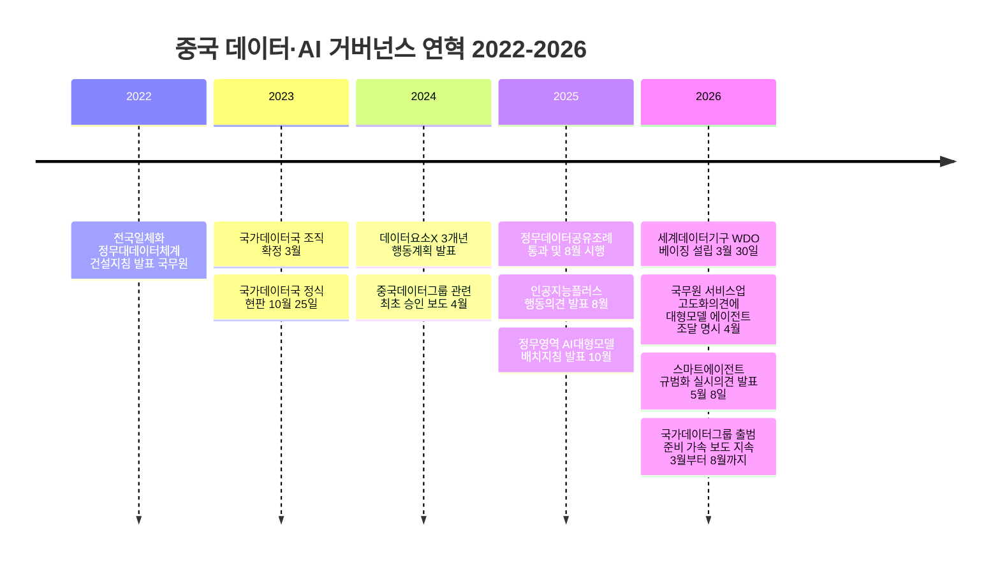
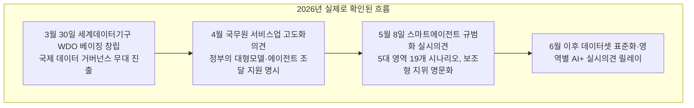

- **작성일:** 2026년 9월 11일
- **대상 원문:** 페이스북 게시글(2026년 게시, URL: https://www.facebook.com/share/p/19MFJkpEYV/) — Threads/Facebook 텍스트는 로봇 배제 정책(robots.txt)으로 자동 접근이 차단되어, 사용자가 본문에 붙여넣은 텍스트를 원문으로 삼아 검증했다.

> 
> 
> 조직의 AX를 담당해 본 사람이라면 흩어진 데이터가 통합만 되어도 체감되는 속도감과 효율을 알 것이다. 생각지도 못한 솔루션이 도출되고 저비용 고효율의 방안이 실행된다. 중국 정부가 2026년 초 가장 먼저 한 일은 국가데이터국 가동이다. 물리적인 부처의 벽은 허물지 못하더라고 각 부처의 데이터는 죄다 끌어 모았다. 그리고 범부처 상단에 두고 정부파운데이션 모델을 돌린다. 
>
> 요즘들어 중국 정부가 내놓는 정책들을 자세히 살펴보면 과거와 다르게 놀라울 만큼 정교하고 시계열 적 계산을 철저히 해 두며 시시각각 수정된다. 꿀과 고기를 바라는 관료의 언어가 아니다. 예상컨데 행정 에이전트들이 시뮬레이션을 돌리고 정책을 고안하면 각 부처에서 승인해 올리는 것 같다. 수치들이 너무나 정교하게 계산되고 머뭇거림 없이 집행된다. 2026년은 중국이라는 국가 전체가 에이전트 엔진을 가동하는 원년이 될 듯 싶다.
> 

---

## 1. 원문이 주장하는 세 가지 핵심 명제

원문은 크게 세 가지를 주장하고 있다.

1. **"중국 정부가 2026년 초 가장 먼저 한 일은 국가데이터국 가동이다."** 부처 간 데이터를 모두 끌어모으는 조직적 조치가 2026년 초에 처음 이루어졌다는 것이다.
2. **"범부처 상단에 두고 정부파운데이션 모델을 돌린다."** 흩어진 부처 데이터를 통합한 뒤, 그 위에 단일한 정부 전용 파운데이션 모델을 얹어 전 부처가 이를 공유·활용하는 구조가 만들어졌다는 것이다.
3. **"행정 에이전트들이 시뮬레이션을 돌리고 정책을 고안하면 각 부처에서 승인해 올리는 것 같다."** 이는 원문 스스로 "예상컨데"라고 표현을 단 추정이며, 정책의 정교함·신속한 수정·수치의 정밀함이 이런 구조를 방증한다는 논리다.

이 세 명제를 하나씩 1차 자료와 교차 검증한 결과를 먼저 요약하면 다음과 같다.

| 주장 | 검증 결과 | 근거 신뢰도 |
|---|---|---|
| ① 국가데이터국이 2026년 초에 처음 가동되었다 | **사실과 다름.** 국가데이터국은 2023년 10월 25일에 이미 정식 현판식을 갖고 출범했다. 2026년 초는커녕 2년 넘게 운영되어 온 기관이다. | 공식 1차 출처(신화사·국무원 발표) + 복수 매체 교차검증 |
| ② 부처 데이터를 모아 단일 "정부파운데이션모델"을 상단에서 돌린다 | **확인되지 않음.** 중국의 실제 구조는 국가급 지침·표준을 내리고, 실제 대형모델 구축·운용은 성·시·부처 단위로 분산되어 각기 다른 업체(랑차오, 텐센트클라우드 등)의 모델을 쓰는 파편화된 형태다. 전 부처를 관통하는 단일 정부파운데이션모델의 존재는 공개 자료로 확인되지 않는다. | 복수 매체 교차검증 + 정부 문건 원문 |
| ③ 행정 에이전트가 정책을 시뮬레이션·설계하고 부처는 승인만 한다 | **미확인 추정.** 오히려 2026년 5월 발표된 국가급 에이전트 정책은 대형모델·에이전트를 "보조형"으로 명문화하고, 사용자(공무원)가 최종 결정권을 갖도록 규정했다. 정책 초안을 에이전트가 만들고 부처가 도장만 찍는다는 근거는 현재 공개된 문건에서 확인되지 않는다. | 정부 문건 원문(1차) 기준 반증 존재 |

아래에서는 이 표가 나온 근거를 항목별로 상세히 풀어 설명한다.

---

## 2. 국가데이터국(国家数据局), 언제 태어난 조직인가

국가데이터국은 2026년의 산물이 아니다. 시계열을 정리하면 다음과 같다.

- **2023년 3월 7일~10일**: 제14기 전국인민대표대회 제1차 회의에서 「국무원 기구개혁방안」이 심의·통과되었고, 여기서 국가데이터국을 새로 조직하기로 확정되었다. 데이터 기초 제도 구축, 데이터 자원의 통합·공유·개발 이용 총괄, 디지털중국·디지털경제·디지털사회 규획 총괄이 핵심 임무로 명시됐다.
- **2023년 10월 25일**: 국가데이터국이 베이징에서 정식으로 현판식을 갖고 출범했다. 초대 국장은 류례훙(刘烈宏), 부국장은 선주린(沈竹林)이 임명되었다. 이 기관은 국무원 직속이지만 국가발전개혁위원회(NDRC)가 관리하는 형태로 설계되었다.
- **2024년 1월**: 국가데이터국을 포함한 17개 부처가 공동으로 「데이터요소×(数据要素×) 3개년 행동계획(2024~2026)」을 발표했다. 데이터를 생산요소로 규정하고, 산업별 고품질 데이터셋 구축과 대형모델 학습 데이터 확보를 핵심 과제로 제시했다.
- **2025년 5월~8월**: 국무원이 「정무데이터공유조례(政务数据共享条例)」(국무원령 제809호)를 공포했다. 이 조례는 2025년 5월 9일 국무원 상무회의를 통과했고, 5월 28일 리창 총리가 서명·공포했으며, 2025년 8월 1일부터 시행되었다. 부처 간 데이터 공유의 목록 관리, 공유 의무, 안전 책임 소재 등을 법제화한 최초의 행정법규로, "부처 간 데이터 칸막이"를 실제로 허무는 법적 근거가 여기서 처음 마련됐다.
- **2025년 8월**: 국무원이 「인공지능+ 행동 실시에 관한 의견」을 발표하며, 처음으로 국가 차원의 AI 전면 확산 로드맵(2027년 6대 영역 심화 융합, 2030년 전면 확산, 2035년 지능사회 진입)을 제시했다.
- **2025년 10월**: 중앙network정보화판공실(网信办)이 「정무영역 인공지능 대형모델 배치응용지침」을 발표했다. 이는 정무 분야 대형모델 응용에 관한 최초의 공개된 전문 정책문건이다.

즉, "데이터를 모으는 국가 기관을 만드는 일"과 "부처 간 데이터 공유의 법적 의무화"는 각각 2023년과 2025년에 이미 완료된 사건이며, 2026년에 새로 시작된 것이 아니다. 원문의 "2026년 초 가장 먼저 한 일"이라는 표현은 시점 자체가 사실과 어긋난다.

---

## 3. 원문이 착각했을 가능성이 있는 지점 — "국가데이터국"과 "국가데이터그룹"의 혼동

2026년 들어 중국 매체에서 유독 자주 등장한 단어는 국가데이터국이 아니라 **국가데이터그룹(国家数据集团)** 이다. 이름이 비슷해 혼동하기 쉽지만 성격이 전혀 다른 두 조직이다.

| 구분 | 국가데이터국 国家数据局 | 국가데이터그룹 国家数据集团 |
|---|---|---|
| 성격 | 정부 행정기관(국무원 직속, 발개위 관리) | 국유기업(국무원 국유자산감독관리위원회 산하로 추진 중인 신설 央企) |
| 역할 | 정책 설계자·업계 감독자·전국 총괄 조정자 | 데이터 자산의 시장화 운영 주체(에너지·교통·금융·의료·정무 등 데이터의 시장 유통·거래를 담당할 사업 주체로 거론됨) |
| 설립 시점 | 2023년 10월 25일 정식 출범, 현재까지 3년째 운영 중 | 2026년 9월 현재 기준으로 아직 정식 출범(挂牌)하지 않음. 2025년 2월경부터 국무원 국자위 주도로 준비가 시작되었다는 매체 보도가 이어졌고, 2026년 3월부터는 "곧 출범할 것"이라는 보도가 반복적으로 나왔지만, 정식 출범을 공식 확인한 국무원·국자위의 1차 발표는 검색 시점까지 확인되지 않았다 |
| 비고 | 이미 3개 통신사(차이나텔레콤·차이나모바일·차이나유니콤)에 이어 등장한 데이터 분야 신설 央企로 자주 소개됨. 지방에는 이미 21개 안팎의 국유 데이터그룹이 성·시 단위로 존재(푸젠성 빅데이터그룹, 구이저우 등) | — |

정리하면, 2026년 초부터 여름까지 중국 매체를 뜨겁게 달군 뉴스는 "이미 있던 국가데이터국이 새로 가동됐다"는 것이 아니라 "국유기업으로서 국가데이터그룹이 곧 출범할 것"이라는, 아직 완료되지 않은 준비 단계의 소식이었다. 원문 작성자가 이 두 가지를 하나로 섞어 "국가데이터국 가동"이라는 표현을 쓴 것으로 추정된다. 다만 이 부분조차 "2026년 초"에 완료된 사건이 아니라 "2026년 내내 준비 중"인 사건이라는 점에서, 원문의 시점 서술은 어느 쪽으로 봐도 정확하지 않다.

---

## 4. 2026년에 실제로 일어난 일들 — 진짜 뉴스만 추려보면

원문의 시점 설정은 틀렸지만, 2026년에 중국의 데이터·AI 거버넌스가 실제로 급물살을 탄 것은 사실이다. 검증된 사건만 시간순으로 정리한다.

- **2026년 3월 30일**: 세계데이터기구(World Data Organization, WDO)가 베이징에서 정식 창립됐다. 데이터 발전과 거버넌스를 다루는 세계 최초의 전문 국제기구를 표방하며, 200여 개 회원과 40여 개국이 참여했다. 창립 대회에는 국무원 부총리 딩쉐샹이 참석했고, 시진핑 국가주석이 축전을 보냈다. 본부가 베이징에 설치됐다는 점에서 "데이터 거버넌스의 베이징 시대"라는 평가가 중국 매체 사이에서 나왔다. 이는 국내 데이터 통합이 아니라 국제 데이터 거버넌스 무대에서 중국의 위상을 높이려는 대외적 움직임이라는 점에 유의할 필요가 있다.
- **2026년 4월 14일 제정, 4월 21일 공개**: 국무원이 「서비스업 확대·품질제고 추진에 관한 의견」(국발〔2026〕7호)을 발표했다. 이 문건에서 처음으로 국가급 문건에 "대형모델·에이전트 서비스 조달 지원"이 명시적으로 들어갔다. 이전까지 AI 지원 정책이 주로 공급 측(연구개발 보조금, 산업단지, 인재 양성)에 집중되어 있었다면, 이번에는 정부 스스로 수요자로서 대형모델·에이전트를 사겠다고 선언한 점이 특징이다.
- **2026년 5월 8일**: 국가网信办·국가발전개혁위원회·공업정보화부가 공동으로 「스마트에이전트 규범화 응용과 혁신발전 실시의견」을 발표했다. 중국 최초의 에이전트(智能体) 전문 국가정책으로, 과학연구·산업발전·소비진작·민생복지·사회거버넌스 5대 영역, 19개 전형 시나리오로 에이전트 응용 범위를 구획했다. 과학연구 영역에는 "이론추론·시뮬레이션(모의방안설계)" 에이전트가 언급되지만, 이는 어디까지나 연구개발용 시뮬레이션이지 국가 거시정책을 설계하는 용도로 못박힌 것이 아니다. 오히려 이 문건은 "사용자 본인만 결정할 수 있는 영역, 사용자 승인이 필요한 영역, 에이전트 자율 결정이 가능한 영역"을 구분하고, 에이전트의 자율적 결정에 대해서도 "사용자가 알권리와 최종 결정권을 가진다"고 명문화했다. 즉 공식 문건 자체가 에이전트를 정책 결정의 주체가 아니라 보조 도구로 규정하고 있다.
- **2026년 6월~8월**: 국가데이터국이 「업종별 고품질 데이터셋 건설행동 실시방안」(국수과기〔2026〕25호, 6월 8일)을 발표하는 등 데이터셋 표준화 작업이 이어졌고, 상무부 등 8개 부처가 「인공지능+소비 발전 가속화 실시의견」(6월 9일)을 내는 등 영역별 "AI+" 실시의견이 릴레이로 발표됐다. 이는 하나의 거대한 정부파운데이션모델이 아니라, 영역별·부처별로 세분화된 정책 문건이 계속 쌓여가는 방식이다.

---

## 5. "정부파운데이션모델이 전 부처 위에서 돈다"는 그림, 실제로는 어떤가

원문이 그리는 그림은 다음과 같다: 흩어진 부처 데이터를 국가 기관이 전부 끌어모으고, 그 위에 단일한 정부 전용 파운데이션 모델을 얹어, 모든 부처가 이 하나의 모델을 공유해 쓴다는 구조다. 이는 매우 단순하고 강력한 이미지이지만, 실제 공개 자료가 보여주는 그림은 훨씬 더 복잡하고 파편화되어 있다.

첫째, 중국이 실제로 구축해 온 것은 "국가정무대데이터플랫폼(国家政务大数据平台)"이라는 데이터 허브 개념이다. 이는 기존의 공유플랫폼·개방플랫폼·기초DB(인구·법인·자연자원·경제·전자증조)·주제DB(의료건강·사회보장·생태환경 등)를 통합·정비하는 데이터 유통 인프라이지, 그 자체가 하나의 "대형언어모델"은 아니다. 즉 데이터를 모으는 배관망은 국가 차원에서 설계되어 있지만, 그 위에서 실제로 추론을 수행하는 모델은 국가가 하나로 통일해 놓은 것이 아니다.

둘째, 실제 "정무대모형(政务大模型)" 시장은 철저히 파편화되어 있다. 국제데이터공사(IDC)가 발표한 「중국 정무대모형 및 응용시장 점유율 보고서」에 따르면 랑차오클라우드(浪潮云)가 이 시장에서 1위를 차지하고 있으며, 그 외에도 각 성·시가 자체적으로 서로 다른 벤더의 모델을 도입해 쓰고 있다. 베이징·상하이·광저우·선전 등 1선 도시들이 각기 다른 방식으로 정무대모형을 구축한 사례가 다수 보고되어 있고, 쑤저우공업원구, 구이안신구, 허베이성, 장닝구 등 지방정부 단위의 개별 구축 사례도 이어지고 있다. 이는 하나의 정부파운데이션모델이 아니라, 표준과 지침만 국가가 내리고 실제 구축·운영은 지방과 부처가 각자 알아서 하는 "분산형 정무 AI 생태계"에 가깝다.

셋째, 중국정보통신연구원(CAICT)이 2026년 2월 발간한 「정부 디지털지능화 전환발전 연구보고서」도 같은 그림을 보여준다. 이 보고서는 정무클라우드 시장 규모(2024년 1189.4억 위안)와 각지의 서로 다른 실천 사례를 병렬적으로 소개하며, "단일 조달·공급"이라는 과거 모델의 한계를 지적하고 "자원통합·기술반복·시나리오임파워먼트"라는 세 가지 방향으로의 전환을 제안하고 있다. 즉 중국 정부 스스로도 아직 자원이 흩어져 있다는 것을 인정하고, 앞으로 통합해 나가야 할 과제로 서술하고 있는 것이지, 이미 완성된 상태로 서술하고 있지 않다.

결론적으로, "범부처 데이터를 다 모아 그 위에 하나의 정부파운데이션모델을 두고 전 부처가 이를 쓴다"는 서술은 방향성으로서는 중국 정부가 지향하는 바와 일치하지만, 2026년 9월 현재 시점에서 이미 완성된 사실로 서술하기는 어렵다. 실제로는 "국가가 표준·지침·법적 근거(정무데이터공유조례)를 정하고, 데이터 유통 배관망을 깔아주되, 그 위에서 돌아가는 모델은 지방·부처·민간벤더가 각자 구축한다"는, 훨씬 더 다충적이고 느슨한 구조다.

---

## 6. "행정 에이전트가 정책을 시뮬레이션해서 만들고, 부처는 승인만 한다"는 추정

이 부분은 원문 스스로 "예상컨데"라는 표현을 명시적으로 붙인 추정이다. 저자 본인도 이것이 확인된 사실이 아니라 정황을 보고 세운 가설임을 인정하고 있다. 다만 이 가설이 얼마나 근거가 있는지는 짚어볼 가치가 있다.

가장 관련성이 높은 공식 문건은 앞서 소개한 2026년 5월 8일자 「스마트에이전트 규범화 응용과 혁신발전 실시의견」이다. 이 문건은 에이전트의 활용 범위를 과학연구, 산업발전, 소비진작, 민생복지, 사회거버넌스 5대 영역으로 나누고 있으며, 과학연구 영역에는 분명히 "이론 추론과 시뮬레이션 에이전트를 통해 잠재적 기술경로를 발굴한다"는 내용이 들어 있다. 그러나 이는 어디까지나 과학기술 연구개발 분야에서의 시뮬레이션(신약 개발, 소재 설계 등에 쓰이는 방식과 유사한 개념)이지, 거시경제 정책이나 국가 전략을 설계하는 용도로 명시된 것은 아니다.

오히려 이 문건에서 가장 눈여겨봐야 할 대목은 "결정 권한의 명확화"와 "행위 관리·통제 강화" 조항이다. 문건은 "사용자 본인만 결정할 수 있는 영역, 사용자 승인이 필요한 영역, 에이전트가 자율적으로 결정할 수 있는 영역"의 경계를 명확히 하도록 요구하고 있으며, "사용자는 에이전트의 자율적 결정에 대해 알권리와 최종 결정권을 가지며, 에이전트의 집행은 사용자가 위임한 권한 범위를 넘어설 수 없다"고 명문화하고 있다. 또한 규칙 내장, 행위 울타리(行为围栏) 기술을 발전시키고, 블록체인 등을 활용해 주요 응용 시나리오에서 에이전트 행위를 검증·추적 가능하게 만들라고 요구한다.

이와 유사하게, 정무 분야에 특화된 2025년 10월 「정무영역 인공지능 대형모델 배치응용지침」 해설 자료에서도 대형모델의 위상을 "보조형(辅助型)"으로 명시하고, "정책 제정의 과학성, 행정 집행의 정밀성, 공공서비스의 보편성을 지능화 수단으로 향상시키는 것"을 목표로 서술하면서도, 중대 심사·승인은 반드시 사람이 최종 심사하도록(重大审批保留人工终审) 하는 원칙을 각종 정무지능체 도입 가이드에서 반복적으로 강조하고 있다.

즉, 공식적으로 공개된 정책 문건들을 기준으로 보면, "에이전트가 정책을 설계하고 부처가 도장만 찍는다"는 그림과는 정반대로, 오히려 "에이전트의 자율성을 어디까지 허용할지 그 경계를 국가가 서둘러 법제화하고, 최종 판단권은 사람에게 남겨두려는" 움직임이 뚜렷하다. 물론 공식 문건에 쓰인 내용과 실제 관료 사회의 운영 방식 사이에 괴리가 있을 가능성은 항상 존재하며, 비공개 영역에서 정책 초안 작성에 AI가 어느 정도 활용되고 있는지는 외부에서 검증하기 어려운 것이 사실이다. 그런 의미에서 이 부분은 "확인된 사실이 아니다"라고 결론짓는 것이 정확하며, "사실무근이다"라고 단정하는 것 역시 성급하다. 공개된 근거로 뒷받침되지 않는 추정으로 분류하는 것이 가장 정확한 평가다.

정책이 "놀라울 만큼 정교하고 시계열적 계산을 철저히 해두며 시시각각 수정된다"는 인상 평가 자체도 마찬가지다. 이는 정량적으로 검증 가능한 명제라기보다 원문 저자 개인의 인상 비평에 가깝다. 실제로 2025~2026년 사이 중국의 AI·데이터 정책이 이전보다 빈도 높게, 영역별로 세분화되어 쏟아져 나온 것은 사실이지만(위 4장에서 정리한 일지가 이를 보여준다), 이것이 "관료의 판단이 아니라 에이전트 시뮬레이션의 산물이기 때문"이라는 인과관계를 뒷받침하는 근거는 확인되지 않는다. 정책 발표 빈도와 세분화 정도가 높아진 것은, 데이터요소×3개년 계획(2024~2026)과 15차 5개년 계획(2026~2030) 개시 시점이 겹치면서 여러 부처가 동시다발적으로 실시 문건을 쏟아내는 행정 관행의 결과로도 충분히 설명 가능하다.

---

## 7. 판단 레이어와 실행 레이어로 다시 읽어보면

이 사안을 "판단 레이어 대 실행 레이어" 틀로 다시 정리하면 그림이 한결 선명해진다.

**실행 레이어**에서는 이미 상당한 자동화가 확인된다. 중국정보통신연구원과 각종 정무지능체 사례 보고서에 따르면, 정무대모형의 문자+로봇 응대가 대민 창구 업무의 약 3분의 1을 대체하고 있고, 지능형 배차·예심사가 절반가량의 인력 업무를 대체하고 있다는 통계가 제시되어 있다. 어느 성회 도시의 "지랴오퉁반(智聊通办)" 통합 지능체 사례에서는 지능형 서식 작성으로 신고 작성 시간이 평균 92% 단축되고, 최단 60초 만에 신고가 완료되며, 160종 정책 부합성 서류의 자동 생성 통과율이 95%에 달한다는 사례도 보고됐다. 즉 정형화되고 반복적인 행정 처리는 이미 광범위하게 에이전트·대형모델로 넘어가고 있다.

**판단 레이어**, 즉 무엇을 우선순위로 둘지, 어떤 트레이드오프를 감수할지, 정치적으로 어떤 방향을 택할지는 여전히 사람의 몫으로 남아 있고, 오히려 최근 문건들은 이 경계를 법제화하는 데 공을 들이고 있다. 이는 하네스 엔지니어링의 관점에서 보면, 국가 차원에서 "실행 레이어의 하네스"—권한 통제, 행위 울타리, 감사 추적, 책임 소재 규정—를 먼저 세팅해 두고, 그 위에서 실행 자동화를 확산시키는 순서로 진행되고 있다고 해석할 수 있다. 모델이 아무리 발전해도 이 통제 장치(하네스)는 토큰 생성만으로 대체되지 않는다는 원칙이, 중국의 국가급 정책에서도 그대로 관찰되는 셈이다.

---

## 8. 종합 평가

원문이 포착한 방향성 자체—중국이 데이터 통합과 AI 정책을 국가 차원에서 밀어붙이고 있고, 2026년이 그 흐름의 중요한 분기점이라는 인식—은 큰 틀에서 틀리지 않았다. 실제로 2026년은 세계데이터기구 창립, 국가급 에이전트 전문 정책 발표, 정부 조달에 대형모델·에이전트를 명시하는 등 굵직한 이정표가 몰린 해가 맞다. 다만 구체적인 사실관계 세 가지—① 국가데이터국이 2026년 초에 처음 가동됐다는 시점, ② 부처 상단에 단일 정부파운데이션모델이 이미 돌아가고 있다는 구조, ③ 행정 에이전트가 정책을 설계하고 부처는 승인만 한다는 메커니즘—는 모두 공개된 1차 자료로 뒷받침되지 않거나 명백히 반증된다. 특히 ①은 시점 자체가 3년 가까이 틀렸다는 점에서 가장 명확한 오류이며, 이는 아마도 2026년 내내 화제였던 "국가데이터그룹" 출범 준비 뉴스를 "국가데이터국 가동"으로 착각한 데서 비롯된 것으로 보인다.

앞으로 지켜봐야 할 지점은 국가데이터그룹의 실제 출범 여부와 시점, 그리고 15차 5개년 계획 기간 동안 "전국일체화 산업망(算力网)"과 정무대모형 표준체계 2.0이 실제로 얼마나 통합된 형태로 수렴하는지다. 지금 시점에서는 통합을 향한 제도적 기반(법규, 표준, 조달 정책)이 빠르게 갖춰지고 있는 단계이지, 통합이 완성되어 단일한 정부 AI 두뇌가 가동 중인 단계는 아니라고 보는 것이 정확하다.

---

## 9. 용어 사전 (한국어 – 영어 – 중국어)

| 한국어 | 영어 | 중국어 원문 |
|---|---|---|
| 국가데이터국 | National Data Administration | 国家数据局 |
| 국가데이터그룹(추진 중) | National Data Group (proposed SOE) | 国家数据集团 |
| 데이터요소×3개년 행동계획 | "Data Element ×" Three-Year Action Plan | "数据要素×"三年行动计划 |
| 정무데이터공유조례 | Regulation on Sharing of Government Affairs Data | 政务数据共享条例 |
| 전국일체화 정무대데이터체계 | National Integrated Government Big Data System | 全国一体化政务大数据体系 |
| 국가정무대데이터플랫폼 | National Government Affairs Big Data Platform | 国家政务大数据平台 |
| 정무대모형(정무용 대형언어모델) | Government-affairs Large Language Model | 政务大模型 |
| 스마트에이전트 규범화 응용과 혁신발전 실시의견 | Implementation Opinion on Standardized Application and Innovative Development of Intelligent Agents | 智能体规范应用与创新发展实施意见 |
| 세계데이터기구 | World Data Organization (WDO) | 世界数据组织 |
| 인공지능+ 행동 실시의견 | Opinion on Deeply Implementing the "AI+" Initiative | 关于深入实施"人工智能+"行动的意见 |
| 십오오(15차 5개년) 규획 | 15th Five-Year Plan (2026–2030) | "十五五"规划 |
| 동수서산(동부 데이터, 서부 연산) | Eastern Data, Western Computing Project | 东数西算工程 |

---

## 10. 출처 및 신뢰도

**[신뢰도 1단계: 공식 1차 출처]**
- 신화사, "신화시점: 국가데이터국 정식 현판에 초점", 2023.10.25 — https://www.news.cn/politics/2023-10/25/c_1129938681.htm
- 중국 위키백과, "국가데이터국" 항목(조직 확정·직능 근거 명시) — https://zh.wikipedia.org/zh-hans/国家数据局
- 중국정부망, 「정무데이터공유조례」 전문(국무원령 제809호) — https://www.gov.cn/zhengce/content/202506/content_7026294.htm
- 국가발전개혁위원회, "리창, 국무원령 서명·정무데이터공유조례 공포" — https://www.ndrc.gov.cn/xwdt/spfg/mtjj/202506/t20250604_1398246.html
- 국가발전개혁위원회, "스마트에이전트 정식 규범 제정, 3대 핵심방향 방출" — https://www.ndrc.gov.cn/wsdwhfz/202605/t20260515_1405212.html
- 신화망, "세계데이터기구 성립"(2026.3.30, 베이징) — http://www.news.cn/tech/20260331/47abfde621644718981fd491444cf9cf/c.html
- 국가데이터국, "업종별 고품질 데이터셋 건설행동 실시방안 인쇄발부 통지"(2026.6.8) — https://www.nda.gov.cn/sjj/zwgk/tzgg/0608/20260608172117399715004_pc.html
- 중앙网信办(국가인터넷정보판공실), "정무영역 인공지능 대형모델 배치응용지침" 및 전문가 해설 3편 — https://www.cac.gov.cn/2025-10/10/c_1761819469929310.htm , https://www.cac.gov.cn/2025-10/10/c_1761819470118621.htm , https://www.cac.gov.cn/2025-10/10/c_1761819470255103.htm

**[신뢰도 2단계: 복수 매체 교차검증]**
- 신화망·중국중앙TV(CCTV), "2026년 중국 AI 발전 추세 전망"(양쪽 동일 내용 보도, 2026.1.28) — https://www.news.cn/politics/20260128/25f6978fe8cf41bda53b78bcf7106fec/c.html , https://news.cctv.cn/2026/01/28/ARTIEvCAzmKkHNEUbwOAS6et260128.shtml
- 중국신문망(中新网), "세계데이터기구 베이징 안착, 글로벌 데이터 거버넌스 책임 부각" — https://www.chinanews.com.cn/cj/2026/03-31/10596088.shtml
- 인민망, "세계데이터기구, 더 많은 국가에 디지털 배당 공유하게 하다" — http://finance.people.com.cn/n1/2026/0401/c1004-40692742.html
- 신랑재경, "국가데이터그룹 곧 출범: 데이터요소 개혁 선도"(2026.3.29) — https://finance.sina.com.cn/china/2026-03-29/doc-inhsttra9799693.shtml
- 163닷컴(网易订阅), "국가데이터그룹 출범 임박, 국가데이터국이 있는데 왜 새 央企가 또 필요한가"(2026.5.26) — https://www.163.com/dy/article/KTT56LRG0511N341.html
- 즈후(知乎) 심층분석, "국무원, 서비스업 확대·품질제고 의견 발문으로 에이전트 조달 지원 명시"(국발〔2026〕7호 원문 인용) — https://zhuanlan.zhihu.com/p/2032781940194006301
- 안전내참(安全内参), "에이전트, 정식으로 감독 주기에 진입: 중국, 에이전트 시대 거버넌스 기반 구축 시작"(2026.5.8 문건 해설) — https://www.secrss.com/articles/90111

**[신뢰도 3단계: 단일 출처 또는 상충되는 정보 — 교차검증 필요]**
- 소후닷컴(搜狐), "국가데이터집단유한공사, 2024년 4월 12일 이미 승인·현판"이라는 서술 — 그러나 같은 매체·유사 매체의 2026년 3~5월 보도들은 국가데이터그룹이 "아직 준비 단계이며 곧 출범 예정"이라고 서술해 서로 배치된다. 이 문서에서는 두 정보가 상충함을 명시하고 어느 한쪽을 단정하지 않았다. — https://www.sohu.com/a/1034776898_122631800 , https://xueqiu.com/9371102218/380645656
- 쉐추(雪球) 게시글, "국가데이터그룹, 2025년 2월부터 준비 시작, 2026년 3월 기준 아직 미출범" — https://xueqiu.com/4051442683/383324517

**[신뢰도 4단계: 분석적 종합·편집 판단 — 이 문서 저자의 해석]**
- 3장의 "원문 저자가 국가데이터국과 국가데이터그룹을 혼동했을 가능성" 부분
- 6장의 "정책 발표 빈도 증가는 에이전트 시뮬레이션이 아니라 계획 개시 시점이 겹친 행정 관행으로도 설명 가능하다"는 대안적 해석
- 7장의 "판단 레이어/실행 레이어" 프레임을 적용한 해석 전체

**[참고: 시장 동향 자료]**
- 중국정보통신연구원(CAICT), 「2025년 정부 디지털지능화 전환발전 연구보고서」(2026.2 발간) — https://www.caict.ac.cn/kxyj/qwfb/ztbg/202603/P020260309362062809415.pdf
- 랑차오(浪潮), "중국 정무대모형 시장, 랑차오 1위"(IDC 보고서 인용) — https://inspur.com/lcjtww/445068/445237/2026013009152750998/index.html
- 중신망(中新网), "정무대모형 응용 가속, AI+거버넌스 새 초점으로"(2026.1.16) — https://www.chinanews.com.cn/cj/2026/01-16/10553026.shtml
