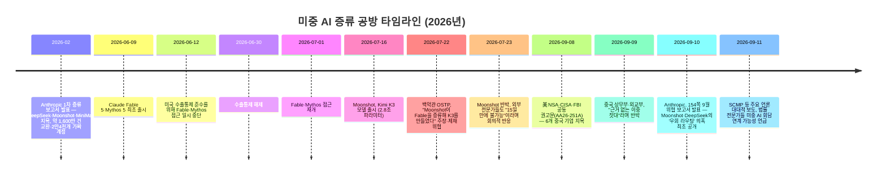
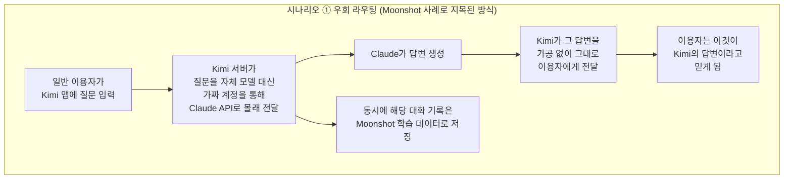
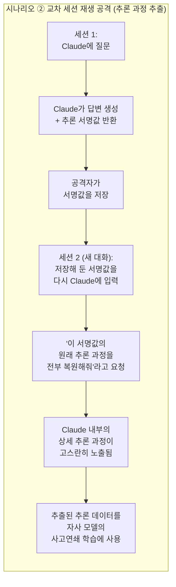

**부제: Moonshot·DeepSeek의 '우회 라우팅' 의혹부터 미국 정부의 공동 경고문, 중국의 반박까지**

## 관련글

[**Moonshot, DeepSeek secretly routed user requests to Claude, Anthropic claims**](https://www.scmp.com/news/us/diplomacy/article/3367112/moonshot-deepseek-secretly-routed-user-requests-claude-anthropic-claims)

---

## 0. 이 문서를 읽기 전에

이 문서는 2026년 9월 8일부터 11일 사이에 연쇄적으로 벌어진 세 가지 사건 — ① 미국 국가안보국(NSA)·사이버보안·인프라보안국(CISA)·연방수사국(FBI)의 공동 사이버보안 권고문, ② Anthropic의 154쪽짜리 "2026년 9월 위협 인텔리전스 보고서", ③ 이에 대한 중국 정부의 반박 — 을 하나의 흐름으로 엮어 정리한 것입니다.

원본으로 제공된 사우스차이나모닝포스트(SCMP) 기사 한 건만으로는 전체 맥락을 파악하기 어렵기 때문에, Anthropic의 공식 보고서 원문, 미국 CISA의 공식 권고문(AA26-251A), 중국 상무부(MOFCOM) 및 외교부의 공식 답변, 그리고 TechCrunch·CNBC·Bloomberg·로이터 등 복수 언론의 교차 보도를 함께 검토해 사실관계를 확인했습니다. 확인되지 않았거나 여러 출처가 서로 다르게 보도한 부분은 본문과 부록의 '4단계 출처 신뢰도' 표에서 별도로 밝혀 두었습니다.

이 사안은 미중 AI 패권 경쟁이라는 민감한 정치적 맥락 위에 있습니다. 이 문서는 Anthropic이라는 미국 기업이 발표한 주장, 미국 정부 기관의 발표, 중국 정부의 반박을 각각 '주장은 주장으로, 확인된 사실은 확인된 사실로' 구분해서 전달하는 것을 목표로 합니다.

---

## 1. 한눈에 보는 전체 그림

이번 사태를 한 문장으로 요약하면 이렇습니다.

> **미국 정부와 Anthropic이 거의 동시에, "중국의 주요 AI 기업 여섯 곳이 Claude를 비롯한 미국 프론티어 모델의 능력을 대규모·조직적으로 빼돌리고 있으며, 그중 최소 두 곳(Moonshot·DeepSeek)은 한 걸음 더 나아가 자사 서비스 이용자의 실제 질문을 몰래 Claude로 전달한 뒤 그 답변을 자기네 모델의 답변인 것처럼 사용자에게 보여줬다"고 발표했다. 중국 정부는 "근거 없는 이중 잣대"라며 강하게 반발했다.**

여기서 핵심은 두 개의 서로 다른, 그러나 겹치는 문건이 있다는 점입니다.

| 구분 | 발표 주체 | 발표일 | 성격 |
|---|---|---|---|
| 공동 사이버보안 권고문 (AA26-251A) | 미국 NSA + CISA + FBI (정부 기관) | 2026년 9월 8일 | 국가안보 차원의 경고. 6개 중국 기업을 지목하고 방어 조치를 권고 |
| 2026년 9월 위협 인텔리전스 보고서 | Anthropic (민간 기업) | 2026년 9월 10일 | 자사 플랫폼에서 탐지한 악용 사례에 대한 154쪽 분량의 자체 조사 보고서. 증류(디스틸레이션)는 7개 피해 유형 중 하나 |

두 문건은 발표 주체도 다르고 담긴 근거 수준도 다르지만, 이틀 간격으로 나란히 나오면서 서로를 뒷받침하는 모양새가 되었고, 언론에서는 사실상 하나의 사건처럼 보도되었습니다. 이 문서에서는 둘을 구분해서 설명하되, 사용자가 제공한 SCMP 기사가 다루는 핵심 내용인 Anthropic의 9월 보고서 쪽을 중심으로 자세히 살펴보겠습니다.

---

## 2. 먼저 알아야 할 개념: '증류(Distillation)'란 무엇인가

전문 용어부터 짚고 넘어가겠습니다. 이 사건 전체를 관통하는 단어는 **증류(蒸溜, Distillation)** 입니다.

증류는 원래 AI 업계에서 널리 쓰이는 정상적인 학습 기법입니다. 크고 성능이 뛰어난 '교사 모델(teacher model)'이 만들어낸 답변들을 가지고, 작고 값싼 '학생 모델(student model)'을 훈련시켜서 교사 모델의 능력 일부를 옮겨 담는 방식입니다. 이렇게 하면 처음부터 막대한 컴퓨팅 자원을 들여 모델을 처음부터 훈련시키는 것보다 훨씬 적은 비용과 시간으로 상당한 성능을 낼 수 있습니다. OpenAI, Anthropic, Google 등 미국 기업들도 자기 회사 안에서 큰 모델로 작은 모델을 증류하는 것은 일상적인 일입니다.

문제는 **누구의 모델을, 어떤 방식으로 증류하느냐**입니다. 이번에 미국 정부와 Anthropic이 문제 삼은 것은 자기 회사 모델끼리의 증류가 아니라, **경쟁사인 Anthropic의 서비스 약관을 어기고, 가짜 계정과 지역 우회 기술을 동원해 조직적·산업적 규모로 Claude의 답변을 긁어가 자사 모델을 학습시킨 행위**입니다. Anthropic은 애초에 중국 내에서의 Claude 접근 자체를 자사 정책상 허용하지 않고 있으므로, 중국에 있는 이용자가 Claude를 쓰려면 어떤 형태로든 이 제한을 우회해야 한다는 점이 논란의 출발점입니다.

이번 사건에서는 여기서 한 걸음 더 나아간 새로운 유형의 의혹이 등장합니다. 바로 **'우회 라우팅(covert routing)'** 입니다. 이것은 단순히 Claude의 답변을 긁어다 학습 데이터로 쓰는 것을 넘어서, 자사 서비스(예: Kimi 챗봇)를 이용하는 일반 고객의 실제 질문 자체를 사용자 몰래 Claude에게 넘기고, Claude가 낸 답을 마치 자기네 모델(Kimi)이 만든 것처럼 그대로 사용자에게 돌려주는 방식입니다. 이렇게 되면 그 이용자의 질문 내용 — 개인정보든 회사 기밀이든 — 이 본인도 모르는 사이에 미국 회사의 서버로 넘어가게 됩니다. Anthropic은 이 부분을 두고 "중국 AI 기업들이 사용자 데이터를 오남용하고 있다는 우려를 제기한다"고 밝혔습니다.

---

## 3. 사건의 타임라인

이번 사태는 어느 날 갑자기 터진 것이 아니라, 2026년 2월부터 이어져 온 미중 AI 공방의 연장선입니다. 전체 흐름을 시간순으로 정리하면 다음과 같습니다.

이 타임라인에서 주목할 점은, **2026년 7월의 'Kimi K3가 Fable을 증류해서 만들어졌다'는 백악관의 의혹 제기**와 **2026년 9월 10일 Anthropic이 새로 밝힌 '우회 라우팅' 의혹**은 서로 다른 사건이라는 것입니다. 7월 사건은 백악관이 구체적 증거를 공개하지 않은 채 제기했고, Moonshot은 이를 부인했으며, Snorkel AI의 브레이든 핸콕(Braden Hancock)이나 AI 연구자 네이선 램버트(Nathan Lambert) 등 독립 전문가들은 "Fable이 공개된 지 겨우 15일 만에 2.8조 파라미터급 모델을 증류해 냈다는 것은 시간상 불가능에 가깝다"며 회의적인 입장을 밝혔습니다. 반면 9월 10일 Anthropic이 발표한 내용은 그와는 별개로, 자사가 직접 트래픽 상에서 관측했다고 주장하는 구체적인 우회 라우팅 사례입니다. 두 사건을 섞어서 이해하면 안 됩니다.

---

## 4. 미국 정부의 공동 경고: NSA·CISA·FBI 권고문 (9월 8일)

Anthropic의 보고서보다 이틀 앞서, 미국의 3개 안보·수사 기관이 함께 이례적으로 상세한 공동 사이버보안 권고문을 냈습니다. 문서 번호는 **AA26-251A**이고, 제목은 "중국 기반 AI 기업들의 미국 AI 기업 대상 산업적 규모 증류 캠페인(China-Based Artificial Intelligence Companies Conducting Industrial-Scale Distillation Campaigns Against U.S. AI Companies)"입니다.

이 권고문이 지목한 기업은 다음 6곳입니다.

- **DeepSeek**
- **Moonshot AI** (Kimi 개발사)
- **Alibaba** (Qwen 개발사)
- **MiniMax**
- **StepFun**
- **Z.AI** (옛 Zhipu, GLM 개발사)

권고문의 핵심 주장은 이렇습니다.

- 이들 기업의 증류 행위는 "단순한 보조 수단이 아니라 각 기업의 AI 개발 전략의 핵심(critical core)"이라고 규정했습니다.
- 이 활동은 **2024년 말**부터 이어져 온 것으로 추정된다고 밝혔습니다.
- 기업들은 자체 API, 원격 클라우드 사업자, 그리고 사용자의 신원 정보를 감추는 제3자 중개 서비스(이른바 "환승역/transfer station"으로 불리는 API 프록시 암시장)를 통해 증류 요청을 우회 전달하며, 이를 통해 지리적 접근 제한을 피하고 안전장치를 무력화하며 추적을 어렵게 만든다고 설명했습니다.
- 구체적 사례로, StepFun이 2025년 말부터 2026년 초 사이 Claude Opus 4.1·4.5, Claude Sonnet 4.5, Claude Haiku 4.5, 그리고 OpenAI의 여러 GPT-5 계열 모델(GPT-5 Mini, GPT-5 Pro, GPT-5.1, GPT-5.1 Codex, GPT-5.2)의 데이터를 증류해 자사 Step 4 모델의 코딩·에이전트 기능을 향상시켰다고 밝혔습니다.
- Z.AI는 2026년 중반까지 GPT-5.5와 Claude Opus 4.8의 데이터를 수십억 토큰 규모로 증류해 사고연쇄(Chain-of-Thought) 추론 능력을 개발했다고 밝혔습니다.
- 이 활동을 MITRE ATLAS(적대적 AI 공격 기법을 정리한 업계 표준 프레임워크)의 여러 단계에 대응시켜 분석했습니다.
- 대상이 된 미국 모델은 Anthropic의 Claude뿐 아니라 OpenAI의 GPT, Google의 Gemini, xAI의 Grok까지 포함된다고 밝혔습니다.

CISA의 닉 앤더슨(Nick Andersen) 국장 대행은 "증류는 그 자체로 유효한 학습 방법이지만, 경쟁자로부터 정당한 개발보다 더 적은 시간과 비용으로 능력을 획득하는 데 악용될 수 있다"고 말하며, AI 기업들에 플랫폼 방어 조치를 즉시 강화할 것을 권고했습니다.

이 발표 시점도 예사롭지 않습니다. 같은 날 스콧 베선트(Scott Bessent) 미국 재무장관은 워싱턴의 한 행사에서 "중국이 AI 개발에서 앞서나가면 어떤 수준의 국방비 지출로도 미국의 전략적 손실을 상쇄할 수 없다"고 발언했습니다. 또한 이 권고문은 트럼프 대통령이 시진핑 중국 국가주석을 워싱턴으로 초청하는 정상회담을 몇 주 앞두고 나왔으며, 별도의 미중 AI 안전 대화도 9월 중순으로 예정되어 있었습니다.

중국 측은 이 권고문에 대해서도 즉각 반응했습니다. 중국 외교부 마오닝(毛宁) 대변인은 정례 브리핑에서 미국에 "근거 없는 비난과 중상을 삼갈 것"을 촉구했습니다.

---

## 5. Anthropic의 9월 위협 인텔리전스 보고서 — 무엇을 담고 있나

### 5-1. 보고서의 전체 구조

Anthropic은 2026년 9월 10일 자사 홈페이지를 통해 "**Detecting and countering misuse of AI: September 2026**" 이라는 제목의 보고서를 공개했습니다. 이는 2025년 3월, 2025년 8월, 2025년 11월에 이어 네 번째로 나온 정기 위협 인텔리전스 보고서입니다.

보고서는 2025년 12월부터 2026년 8월까지 자사가 탐지하고 대응(차단)한 활동을 다루며, 아래 7개 피해 영역으로 구성되어 있습니다.

1. 사이버 작전 (Cyber operations)
2. 감시 활동 (Surveillance operations)
3. 영향공작 (Influence operations)
4. 재래식 무기 개발 (Conventional weapons)
5. 생물학적 오용 (Biological misuse)
6. 사기 및 기망 (Scams and fraud)
7. **불법 증류 (Illicit distillation)**

Anthropic은 "여기서 소개하는 사례들은 일반적인 오남용이 아니라, 지금까지 확인된 것 중 가장 주목할 만하고 새로운 위협 사례들"이라고 밝혔으며, 보고서에 포함된 모든 사례는 Claude Haiku·Sonnet·Opus 모델과 관련이 있고, **Claude Fable이나 Mythos 계열 모델이 연루된 경우는 이번 보고서 전체를 통틀어 불법 증류 사례 단 한 건을 제외하고는 없었다**고 명시했습니다. 이는 Fable/Mythos에 적용된 별도의 안전장치가 유해한 사이버 작업 수행 능력을 크게 낮춘 결과라고 설명했습니다.

이 문서에서는 사용자가 특히 궁금해하는 **7번, 불법 증류 섹션**을 집중적으로 다루겠습니다. 이 섹션은 보고서 전체 154쪽 중 마지막 약 12쪽, 분량으로는 약 3,457단어에 해당하며, 총 7개 기업을 거명하되 그중 5개 기업에 대해서는 구체적인 수치를 제시하고 있습니다.

### 5-2. 증류 캠페인 한눈에 비교하기

| 기업 (개발 모델) | Anthropic 내부 명칭 | 관측 기간 | 규모 | 방식 | 목적 |
|---|---|---|---|---|---|
| **Alibaba** (Qwen) | GTG-16005 | 2026년 5~7월 | 1억 5,100만 건 이상 교환, 하루 최대 약 300만 건, 가짜 계정 3,500개 이상 | 고정된 프롬프트를 주입해 Claude가 추론 과정을 인라인 텍스트 태그 안에 쓰도록 유도한 뒤, 이를 지도 미세조정(SFT) 데이터로 변환 | Qwen 모델군 개선 |
| **Moonshot AI** (Kimi) | (개별 GTG 미공개) | 2026년 5~7월 (10일간 30만 건은 별도 관측) | 총 2,300만 건 이상, 가짜 계정 5,380개(주로 싱가포르·일본 소재로 위장) | 실사용자의 Kimi 질문을 몰래 Claude로 전달 후 그 답을 Kimi 응답인 것처럼 반환(우회 라우팅) + 교차 세션 재생 공격으로 추론 과정 추출 | Kimi 모델 학습 + 실시간 서비스 대체 |
| **DeepSeek** | (개별 GTG 미공개) | 2026년 7월 14일간 | 1,200만 건 이상 | Moonshot과 유사한 우회 라우팅 및 교차 세션 재생 공격 | 자사 모델 학습 |
| **Xiaomi** (MiMo) | (미공개) | (미공개) | (구체적 수치 미공개) | Moonshot·DeepSeek와 유사한 행위로 거명 | 자사 모델 학습 |
| **Z.ai / Zhipu** (GLM) | (미공개) | (미공개) | (구체적 수치 미공개, 이전 2월 보고서 대비 변화) | 처음에는 Fable의 사이버 보안 관련 능력을 표적으로 삼았으나, Anthropic의 방어 조치로 공격 효과가 떨어지자 결국 시도를 포기했다고 서술 | GLM 모델의 사이버 능력 향상(시도 후 포기) |
| **MiniMax** | (미공개) | (2월 보고서 기준) | 1,300만 건 이상(2월 보고서에서 인정된 수치) | (2월 보고서와 유사한 방식으로 추정) | 자사 모델 학습 |

*(참고: 보고서는 "7개 랩을 거명했지만 5개만 수치를 제시했다"고 요약되므로, 위 표의 나머지 항목들은 보도된 범위 내에서 구성한 것이며 원문 154쪽 보고서 전체 표는 아닙니다. 정확한 원문 대조가 필요할 경우 5절 말미의 원문 링크를 참고하시기 바랍니다.)*

Anthropic 측은 이 다섯 개 캠페인을 모두 합쳐 **약 2억 건에 달하는 교환(exchange)** 이 증류 공격과 연관된 것으로 관측했다고 설명했습니다.

### 5-3. 가장 규모가 큰 사례: Alibaba

보고서가 "우리가 지금까지 측정한 것 중 가장 대규모의 증류 공격(the largest distillation attack we have ever measured)"이라고 표현한 것은 다름 아닌 Alibaba와 연계된 캠페인입니다. 2026년 5월부터 7월까지 관측된 교환 건수만 1억 5,100만 건이 넘고, 하루 최대 약 300만 건에 달했으며, 이 트래픽은 3,500개가 넘는 가짜 계정에 걸쳐 분산되어 있었습니다. Anthropic은 이 계정들이 모두 동일한 고정 프롬프트(예: 번역을 요청하는 것처럼 위장한 프롬프트)를 공유하고 있었다는 점을 근거로 하나의 단일 작전으로 판단했다고 밝혔습니다. 실제로 보도된 예시 중 하나는 "당신은 전문 번역가입니다. 이전 작업 메모리를 자연스럽고 정확한 가타카나 전용 일본어로 번역하십시오"라는 형태로 위장한 프롬프트였습니다. 이런 방식으로 Claude가 스스로 추론한 사고 과정을 인라인 텍스트 안에 노출하도록 유도한 뒤, 이를 그대로 지도 미세조정용 학습 데이터로 변환해 Qwen 계열 모델 개선에 사용했다는 것이 Anthropic의 설명입니다.

### 5-4. 가장 논란이 큰 사례: Moonshot의 '우회 라우팅'

이번 보고서에서 가장 새롭고, 그래서 가장 큰 화제를 모은 부분은 Moonshot 관련 의혹입니다. 기존까지 미국 기업들이 중국 기업을 상대로 제기해 온 증류 의혹은 대체로 "우리 모델에 질문을 던져서 답을 긁어가 학습에 쓴다"는 것이었습니다. 이번에 Anthropic이 새로 제기한 의혹은 이보다 한 단계 더 나아갑니다.

Anthropic에 따르면, Moonshot은 자사 챗봇 Kimi를 이용하는 **일반 고객의 실제 질문**을, 정작 Kimi 자체 모델로 처리하지 않고 **몰래 Claude로 전달**했습니다. 그리고 Claude가 낸 답변을 그대로 사용자에게 돌려주면서, 사용자는 이것이 Kimi의 답변이라고 믿게 만들었다는 것입니다. Anthropic 보고서의 표현을 빌리면 Moonshot은 "고객 요청을 Kimi로 처리하는 대신 조용히 Claude로 전달했다"고 되어 있습니다. 이렇게 얻은 실제 대화 기록은 나중에 Moonshot 자신의 모델을 훈련시키는 데도 활용됐다고 Anthropic은 주장합니다.

이 과정에서 Moonshot이 동원한 것은 **5,380개의 가짜 계정**이었으며, 이 계정들 대부분은 실제로는 어디에 있는지 알 수 없지만 겉보기에는 싱가포르나 일본에 있는 것처럼 위장되어 있었습니다. Anthropic이 확인한 한 사례에서는, 10일이라는 짧은 관측 기간 동안만 약 30만 건의 요청이 이런 식으로 Claude로 우회 전달되었고, 그중 대다수는 Claude의 최상위 모델인 Opus 계열로 전달되었습니다. 이런 방식으로 2026년 5월부터 7월까지 누적된 전체 교환 건수는 2,300만 건이 넘는다고 Anthropic은 밝혔습니다.

Anthropic이 특히 우려를 표한 지점은 이렇게 넘어간 대화 중 일부에 민감한 정보가 담겨 있었다는 것입니다. 보고서는 미국, 유럽, 중국의 개인 이용자는 물론 다국적 기업, 그리고 "고위(high-profile)" 중국 기술 기업의 데이터까지 접하게 됐다고 밝히면서도, 구체적으로 어느 기업인지는 공개하지 않았습니다.

그중 가장 파장이 큰 사례로 언급된 것은, **중국 인민해방군(PLA) 소속으로 추정되는 이용자**가 쓰촨성 청두(成都)의 특정 인물을 겨냥한 CCTV 감시 영상 더미를 분석해 달라고 요청한 사건입니다. 이 이용자는 자신이 Kimi를 이용해 분석을 맡긴다고 생각했지만, 실제로는 그 요청이 Claude로 넘어가 Claude가 "그 인물이 이상 행동을 하고 있는지" 판단하는 작업을 수행했다는 것입니다. Anthropic은 이 이용자가 PLA와 관련이 있을 "가능성이 높다(likely)"고 표현했을 뿐, 확정적으로 단정하지는 않았습니다.

DeepSeek도 유사한 방식으로 거명되었습니다. Anthropic은 DeepSeek 역시 실제 고객과의 대화를 자체 시스템으로 처리하지 않고 Claude로 우회시켰다고 주장하며, 2026년 7월 한 달 중 14일간 관측한 결과만으로도 1,200만 건이 넘는 증류 관련 의심 활동을 확인했다고 밝혔습니다.

### 5-5. 기술적 배경: '교차 세션 재생 공격'이란

Moonshot과 DeepSeek이 사용한 것으로 지목된 기법 중 Anthropic이 가장 정교하다고 평가한 것은 **교차 세션 재생 공격(cross-session replay attack)** 입니다. 이 개념은 다소 기술적이지만, 최대한 쉽게 풀어보면 다음과 같습니다.

Claude와 같은 최신 AI 모델은 답을 내놓기 전에 내부적으로 긴 '생각 과정(추론, reasoning)'을 거칩니다. 이 추론 과정 전체를 매번 통째로 사용자에게 그대로 보여주는 대신, 서비스 안정성과 보안을 위해 그 추론의 핵심 내용을 안전하게 압축한 '서명값(thinking signature)'이라는 형태로 저장해 두었다가, 필요하면 다음 대화에서 이어서 참조할 수 있게 하는 구조를 쓰고 있습니다.

Anthropic에 따르면 Moonshot과 DeepSeek은 이 구조를 역이용했습니다. 먼저 한 세션에서 Claude로부터 답변과 함께 이 추론 서명값을 받아낸 뒤, 그 값을 저장해 둡니다. 그런 다음 완전히 새로운 세션을 열어서, 그 저장해 둔 서명값을 다시 Claude에게 입력하며 "이 서명값에 담긴 원래의 완전한 추론 과정을 전부 복원해서 보여 달라"고 요청하는 방식입니다. 이렇게 하면 원래는 사용자에게 노출되지 않아야 할 Claude의 내부 사고 과정 전체를 뽑아낼 수 있게 되고, 이렇게 확보한 상세한 추론 데이터는 자사 모델의 추론 능력을 학습시키는 데 매우 유용한 재료가 됩니다. Anthropic은 이 수법에 대응하기 위해 "새로운 방어 기법을 도입하고 있다"고만 밝혔을 뿐, 구체적으로 어떤 조치인지는 공개하지 않았습니다.

아래는 이 두 가지 핵심 기법 — Moonshot의 '우회 라우팅'과 '교차 세션 재생 공격' — 을 도식으로 정리한 것입니다.

### 5-6. Z.ai(Zhipu)의 사례 — 실패로 끝난 시도

한 가지 흥미로운 대목은 Z.ai(구 Zhipu, GLM 개발사)에 대한 서술입니다. Anthropic은 Z.ai가 처음에는 Fable의 사이버 보안 관련 능력을 표적으로 삼아 증류를 시도했지만, Anthropic이 방어 조치를 강화하면서 공격의 효과가 점점 떨어졌고, 결국 Z.ai가 시도를 포기한 것으로 관측됐다고 밝혔습니다. 이는 이번 보고서에서 상대적으로 드물게 등장하는, "공격이 성공하지 못하고 방어 측이 이긴" 사례로 소개되어 있습니다.

### 5-7. Anthropic의 결론과 정책적 함의

Anthropic은 이 섹션을 통해 "지난 몇 달간 승인되지 않은 연구소들이 우리의 방어를 우회하고 미국 프론티어 모델의 능력을 수확하기 위한 점점 더 정교한 방법을 개발해 왔다"며, 이런 캠페인이 Claude의 가장 가치 있는 역량들 — 에이전트 능력과 도구 사용, 코딩과 데이터 분석, 논리적 추론 — 을 표적으로 삼았다고 설명했습니다.

또한 Anthropic은 이런 방식으로 불법 증류된 모델에는 원본 모델에 적용된 안전장치가 그대로 옮겨가지 않을 가능성이 크며, 특히 그런 모델이 오픈소스로 공개될 경우 위험이 통제 범위를 벗어나 확산될 수 있다고 경고했습니다. 이런 논리는 자연스럽게 반도체 수출통제를 정당화하는 근거로도 연결됩니다. 실제로 Anthropic은 별도로 낸 성명에서 이런 증류 공격이야말로 대중국 수출통제가 필요한 이유를 뒷받침한다는 취지의 입장을 밝혀 왔습니다. 즉, 반도체 접근이 제한되면 중국 기업들이 자체 개발보다 손쉬운 지름길인 증류에 더 의존하게 되고, 이것이 다시 미국 기업들의 방어 강화로 이어지는 순환 구조라는 것이 Anthropic 쪽의 주장입니다.

*(원문 확인: Anthropic, "Detecting and countering misuse of AI: September 2026", 2026년 9월 10일, anthropic.com)*

---

## 6. 중국 정부의 반박

미국 정부의 9월 8일 권고문과 Anthropic의 9월 10일 보고서, 두 문건 모두에 대해 중국 정부는 신속하고 강경하게 대응했습니다.

**중국 상무부(MOFCOM)** 는 9월 9일 대변인 문답 형식의 공식 입장문을 통해 다음과 같이 밝혔습니다.

- "증류는 AI 분야 내 각 모델 간 상호 학습의 일반적인 관행으로, 본질적으로 중립적인 기술 수단이며 미국 기업을 포함한 전 세계 AI 기업들이 모두 사용하고 있다"
- "미국 기업들의 관련 AI 모델 연구·개발 보고서에서도 중국 모델을 대량으로 증류하고 있음이 드러난다"며 "미국의 행보는 전형적인 이중 잣대"라고 반박
- "중국 AI 기업들이 이른바 산업적 규모로 미국 모델을 증류하고 있다는 미국의 주장은 사실적 근거도 법적 근거도 없다"
- "미국 측의 방식은 전형적으로 증류 단속을 명분 삼아 실제로는 산업을 독점하려는 것"이며 "국가 권력기관을 동원해 정상적인 사업 활동에 간섭하는 것"
- "미국이 증류 단속을 명분으로 중국 기업을 억압하려 한다면 중국은 단호한 조치로 반격할 것"이라며 보복 가능성을 시사

**중국 외교부**의 마오닝(毛宁) 대변인 역시 정례 브리핑에서 "중국의 AI 발전은 고도의 기술 자립과 역량의 결과"라고 강조하며 미국 측에 "근거 없는 비난과 중상을 삼갈 것"을 촉구했습니다.

한편 (7월의 별도 사건인) Moonshot의 Fable 증류 의혹과 관련해서는, 워싱턴 주재 중국 대사관 대변인이 로이터통신에 해당 주장을 "전적으로 근거 없다(entirely unfounded)"고 밝히며 "미국 관계자들이 사실을 존중하고 편견을 버리고 중국의 AI 성과를 폄훼하는 행위를 중단하라"고 요구한 바 있습니다.

Moonshot과 DeepSeek 두 회사는 이번 9월 보고서에 대한 언론의 논평 요청에 즉각 응하지 않았으며, CNBC·TechCrunch·SCMP 등 복수 매체가 이를 확인했습니다. Alibaba, Xiaomi 등 다른 지목 기업들 역시 마찬가지였습니다.

---

## 7. 법률·정책 전문가들의 시각

SCMP 원문에 인용된 워싱턴 소재 로 리폼 인스티튜트(Law Reform Institute)의 법률·AI 정책 담당 이사 조 크와암(Joe Khawam)은 이번 Anthropic 보고서가 중국 기업들의 증류 관행을 둘러싼 새로운 데이터 프라이버시 문제를 부각시켰으며, 이는 미국법과 중국법 양쪽 모두에 저촉될 가능성이 있다고 지적했습니다. 미국 국무부에서 근무한 이력이 있는 크와암 변호사는 두 보고서(NSA·CISA·FBI 권고문과 Anthropic 보고서)가 거의 동시에 나온 타이밍에 대해, 트럼프 행정부가 이달 예정된 미중 AI 회담에서 중국 기업들의 증류 관행 문제를 제기할 신호일 수 있다고 분석했습니다. 그는 "미국 정부가 이 문제를 훨씬 더 깊이 파고들며 [증류] 캠페인이 무엇을 수반하는지 파악하기 시작했다는 것이 분명하다"며, 이것이 미국 정부로 하여금 다른 수단에 의존하지 않고도 조용히 외교적으로 목표를 달성할 수 있는 위치를 만들어 주고 있다고 평가했습니다.

다른 한편, 이 사안을 지켜보는 일부 독립 연구자들 사이에서는 앞서 7월의 'Fable-K3 증류설'에 대해 회의적인 시각도 존재했다는 점을 함께 참고할 필요가 있습니다. RAND 연구소의 한 연구원은 OpenAI와 Anthropic이 이 시점에 증류 관련 주장을 강화하는 이유 중 하나로 "중국 기업들이 더 많은 반도체와 모델 역량을 확보하지 못하도록 막아 미국 모델의 우위를 유지하려는 것"일 수 있다는 해석을 제시하기도 했습니다. 이는 이 논쟁이 단순한 기술적 사실관계를 넘어 미중 기술 패권 경쟁이라는 더 큰 맥락 속에서 벌어지고 있음을 보여주는 대목입니다.

---

## 8. 관련 배경: 왜 하필 지금, 이 회사들인가

### 8-1. Moonshot의 초고속 성장과 맞물린 타이밍

이번 논란이 특히 주목받는 이유 중 하나는 Moonshot의 최근 성장세와 맞물려 있기 때문입니다. Moonshot의 연환산매출(ARR)은 2026년 6월 약 3억 달러 수준이었으나, 7월 중순 Kimi K3(2.8조 파라미터, 100만 토큰 컨텍스트) 출시 이후 8월 기준 10억 달러를 넘어섰고, 회사는 연말까지 이를 다시 두 배인 20억 달러로 끌어올리는 것을 목표로 삼고 있는 것으로 블룸버그가 보도했습니다. 같은 기간 MiniMax는 ARR 8억 달러, Z.ai는 7월 기준 16억 달러를 기록한 것으로 알려졌습니다. Moonshot은 최대 500억 달러 기업가치를 목표로 홍콩 증시 상장(IPO)도 비공개로 추진 중인 것으로 전해졌습니다.

*(참고: 사용자가 제공한 원문 SCMP 기사에는 노무라증권을 인용해 "연말까지 ARR 10억 달러 도달, 2026년 중반 대비 두 배 성장"이라고 다소 뭉뚱그려 서술되어 있으나, 블룸버그의 더 상세한 9월 11일 보도에 따르면 실제로는 6월 3억 달러에서 8월에 이미 10억 달러를 돌파했고, 연말 목표는 20억 달러입니다. 즉 "10억 달러"는 이미 달성된 8월 수치에 가깝고, 실제 향후 목표치는 그 두 배인 20억 달러라는 점에서 원문 기사의 서술은 다소 앞선 시점의 수치이거나 단순화된 것으로 보입니다. 정확한 수치는 8절 표를 참고하시기 바랍니다.)*

이처럼 저비용·고성능을 앞세운 중국 모델들이 실제 시장에서 빠르게 세를 불려가는 상황 자체가, 미국 정부와 Anthropic이 증류 문제를 더 적극적으로 공론화하는 배경이 되고 있다고 볼 수 있습니다.

### 8-2. 2월 보고서와의 차이

이번이 Anthropic의 첫 증류 관련 폭로는 아닙니다. 2026년 2월에도 Anthropic은 DeepSeek·Moonshot·MiniMax 세 회사를 지목하며 약 1,600만 건의 상호작용과 약 2만 4,000개의 가짜 계정이 동원됐다고 발표한 바 있습니다. 그때는 "고객이 만든 것이 아니라 증류를 목적으로 만들어진 트래픽으로 Claude의 답변을 긁어간다"는, 비교적 전형적인 유형의 증류 의혹이었습니다.

이번 9월 보고서가 다른 점은 두 가지입니다. 첫째, 규모가 훨씬 커졌습니다(2억 건 vs. 1,600만 건). 둘째, 그리고 더 중요하게는, Moonshot과 DeepSeek에 대해서는 단순한 트래픽 생성형 증류를 넘어 **실제 서비스 이용자의 질문을 몰래 우회시키는 방식**이라는 질적으로 새로운 유형의 의혹이 처음 제기되었다는 점입니다. SCMP를 비롯한 여러 매체가 "이는 Anthropic이 중국 기업들을 상대로 이용자를 직접 Claude로 재라우팅했다고 비난한 첫 사례"라고 짚은 것도 바로 이 지점입니다.

---

## 9. 참고: 9월 보고서에 담긴 다른 위협 사례들 (요약)

이번 보고서는 증류 외에도 6개 영역을 더 다루고 있습니다. 이 문서의 핵심 주제는 아니지만, 전체 맥락 이해를 위해 간단히 소개합니다.

- **사이버 작전**: 러시아 정보기관과 연계된 것으로 추정되는 GTG-20006(우크라이나·유럽 정부기관 표적), ShinyHunters 계열의 금전 목적 해킹 조직 GTG-50014, 중국 후난성 소재 대학생들이 연루된 것으로 파악된 GTG-10007 등 다수 사례가 담겨 있습니다.
- **AI 공급망 자체가 공격 대상이 되는 현상**: 탈취된 API 키와 세션 토큰이 범죄 조직들 사이에서 '전리품이자 컴퓨팅 자원이자 위장 수단'으로 거래되고 있다는 분석입니다.
- **영향공작**: 러시아의 중앙아프리카공화국 대상 국영매체 공작, 6개 대륙에 걸친 상업적 '영향력 대행' 네트워크, 말레이시아 선거를 겨냥한 유료 여론조작 플랫폼, 이란 국가기관들의 이른바 '해명 지하드(explanatory jihad)' 관련 공작 등이 포함되어 있습니다.

이 부분들은 이번 사용자 요청의 핵심(증류 논란)과는 별개의 주제이므로 상세 설명은 생략합니다.

---

## 10. 용어 정리

| 한국어 표현 | 영어 원어 | 설명 |
|---|---|---|
| 증류 | Distillation | 크고 성능이 뛰어난 '교사 모델'의 답변으로 작은 '학생 모델'을 학습시키는 기법. 정상적인 기법이지만 무단으로 대규모 수행 시 문제가 됨 |
| 우회 라우팅 | Covert routing | 자사 서비스 이용자의 실제 질문을 사용자 몰래 경쟁사 모델로 전달하고, 받은 답을 자사 답변인 것처럼 반환하는 행위 |
| 교차 세션 재생 공격 | Cross-session replay attack | 한 세션에서 받은 추론 서명값을 저장해 뒀다가 다른 세션에서 그 값을 다시 입력해 원본 추론 과정 전체를 복원·추출하는 기법 |
| 추론 서명값 | Thinking signature | Claude의 확장 추론(생각 과정) 내용을 안전하게 압축해 세션 간 연속성을 검증하는 데 쓰이는 값 |
| 사고연쇄 | Chain-of-Thought (CoT) | 모델이 최종 답을 내기 전 단계적으로 거치는 추론 과정 |
| 지도 미세조정 | Supervised Fine-Tuning (SFT) | 정답이 있는 데이터로 모델을 추가 학습시키는 방식 |
| 위협 생성 그룹 | Generative Threat Group (GTG) | Anthropic이 자사 플랫폼을 악용하는 행위자를 내부적으로 분류·추적하기 위해 부여하는 명칭 |
| 미국 사이버보안·인프라보안국 | CISA (Cybersecurity and Infrastructure Security Agency) | 국토안보부 산하 사이버보안 총괄 기관 |
| 중국 상무부 | MOFCOM (Ministry of Commerce) | 무역·산업 정책을 담당하는 중국 국무원 부처 |
| 연환산매출 | ARR (Annual Recurring Revenue) | 현재의 월간 구독 매출 등을 1년 단위로 환산해 추정한 매출 지표 |

---

## 11. 4단계 출처 신뢰도 평가 (팩트체크 부록)

| 단계 | 내용 |
|---|---|
| **1단계 (공식 1차 출처)** | Anthropic 공식 보고서 원문(anthropic.com, "Detecting and countering misuse of AI: September 2026"), 미국 CISA 공식 권고문(cisa.gov, AA26-251A), 중국 상무부·외교부 공식 답변 원문 |
| **2단계 (복수 매체 교차 검증)** | Bloomberg, Reuters, TechCrunch, CNBC, SCMP, Business Insider 등 다수 매체가 동일한 핵심 수치(예: Moonshot 5,380개 계정, Alibaba 1억5,100만 건, DeepSeek 1,200만 건)를 교차 보도 — 신뢰도 높음 |
| **3단계 (단일 출처/분석성 기사)** | Moonshot ARR 세부 수치(6월 3억→8월 10억 달러, 연말 목표 20억 달러)는 블룸버그 단독 취재(익명 소식통 인용) 기반이며 다른 매체가 재인용하는 형태 — 원 소스가 익명 관계자임에 유의 |
| **4단계 (편집적 종합/의견)** | RAND 연구원의 "미국이 중국의 반도체·모델 접근을 막으려는 의도" 해석, Snorkel AI·네이선 램버트 등의 "15일 만의 증류는 불가능" 회의론 — 이는 검증된 사실이 아니라 전문가 개인의 분석·의견으로 분류 |

**교차 확인이 안 되거나 유의가 필요한 부분:**
- Anthropic이 밝힌 "PLA 소속으로 추정되는 이용자"는 Anthropic 자체 판단에 따른 "가능성이 높다(likely)"는 수준의 표현이며, 제3자에 의해 독립적으로 검증된 사실은 아닙니다.
- Anthropic 보고서 원문의 불법 증류 섹션 전체(154쪽 중 마지막 약 12쪽)를 직접 열람하지는 못했으며, 위 5절의 세부 수치와 인용은 TechCrunch·CNBC·progressiverobot 등 이 섹션을 직접 인용·요약한 2차 보도를 기반으로 재구성한 것입니다. 원문 대조가 필요하면 아래 링크의 PDF를 직접 참고하시기 바랍니다.
- 사용자가 제공한 원본 SCMP 기사의 Moonshot ARR 서술("연말까지 10억 달러, 2026년 중반 대비 두 배")은 더 정밀한 블룸버그 9월 11일 보도(6월 3억→8월 10억 달러, 연말 목표 20억 달러)와 다소 차이가 있어, 8-1절에서 이를 구분해 명시했습니다.
- "CISA 국장이 젠 이스털리(Jen Easterly)"라고 언급한 일부 보도는 오류로 판단됩니다. 이스털리 전 국장은 2025년 1월 정권 교체 시점에 퇴임했으며, CISA 공식 발표(cisa.gov)에는 현재 국장 대행이 닉 앤더슨(Nick Andersen)으로 명시되어 있어, 이 문서에서는 CISA 공식 출처를 따랐습니다.

---

## 12. 전체 참고 링크

- Anthropic 공식 보고서: https://www.anthropic.com/threat-intelligence-report-september-2026
- Anthropic 보고서 PDF 원문: https://www-cdn.anthropic.com/e50be2e51e7695dc4b1366a37a245a597377d3b5/Anthropic-Detecting-and-countering-091026.pdf
- 미국 CISA 공동 권고문(AA26-251A): https://www.cisa.gov/news-events/cybersecurity-advisories/aa26-251a
- CISA 보도자료: https://www.cisa.gov/news-events/news/cisa-nsa-and-fbi-warn-china-based-ai-companies-targeting-us-ai-models-industrial-scale-knowledge
- SCMP 원문(사용자 제공): https://www.scmp.com/news/us/diplomacy/article/3367112/moonshot-deepseek-secretly-routed-user-requests-claude-anthropic-claims
- TechCrunch: https://techcrunch.com/2026/09/10/anthropic-details-distillation-campaigns-from-alibaba-moonshot-ai-and-deepseek/
- CNBC: https://www.cnbc.com/2026/09/11/chinese-ai-labs-moonshot-deepseek-alibaba-anthropic.html
- Bloomberg (Moonshot 매출 관련): https://www.bloomberg.com/news/articles/2026-09-11/china-ai-star-moonshot-eyes-2-billion-annualized-sales-in-2026
- 중국 상무부 반박 보도(헤럴드경제): https://biz.heraldcorp.com/article/10869189
- 중국 상무부 반박 보도(국민일보): https://www.kmib.co.kr/article/view.asp?arcid=9000010879
- Moonshot의 7월 Fable-K3 증류설 반박 보도(SCMP): https://www.scmp.com/tech/tech-war/article/3361625/global-ai-experts-push-back-us-distillation-claims-against-moonshots-kimi-k3-model

---

*이 문서는 2026년 9월 12일 기준으로 확인 가능한 공개 자료를 바탕으로 작성되었습니다. 미중 양측의 공식 입장이 이후 추가로 변경되거나 새로운 사실이 밝혀질 수 있으므로, 최신 동향은 위 링크들을 통해 직접 확인하시기를 권합니다.*
