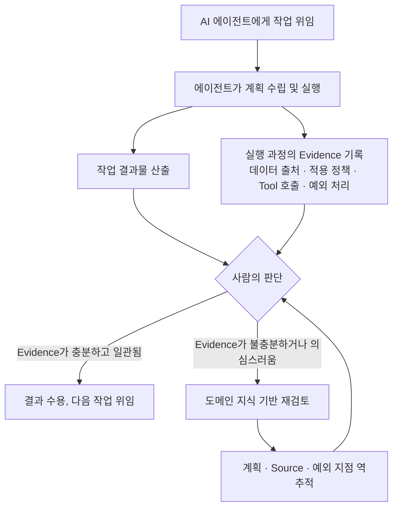
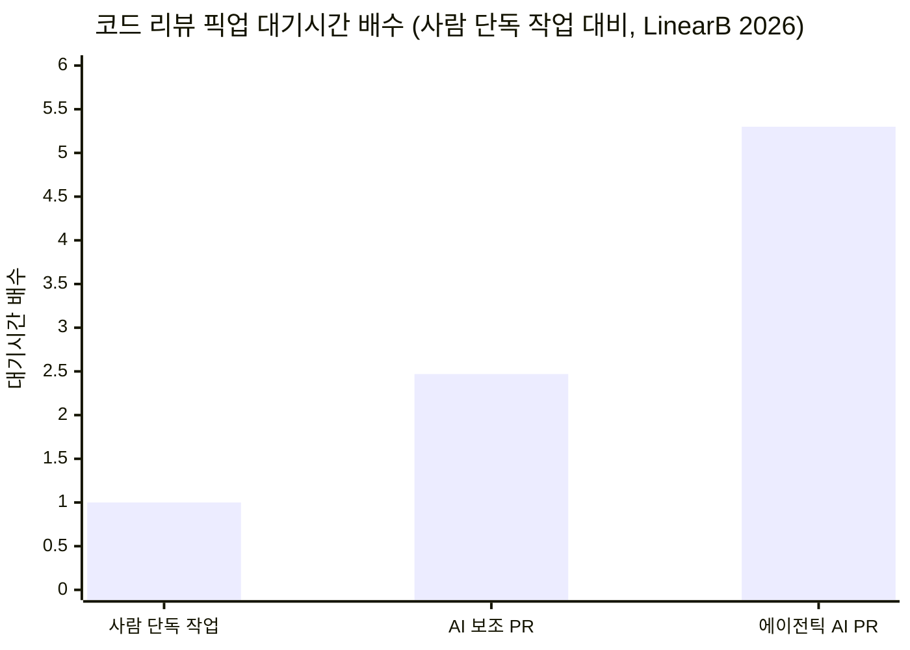
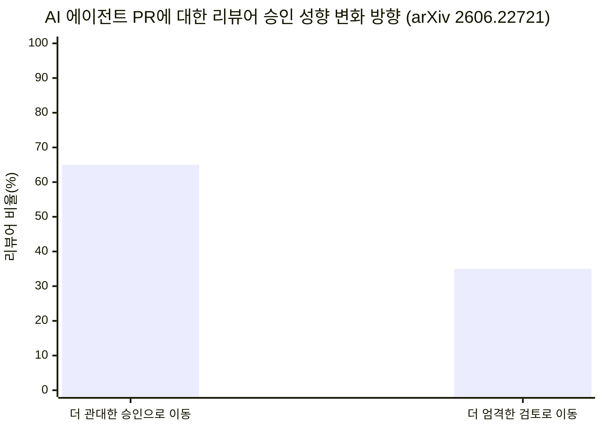
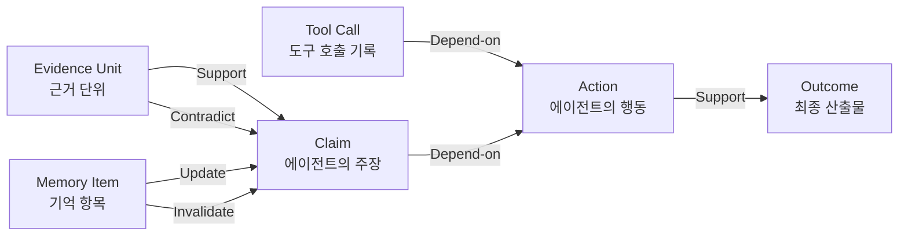
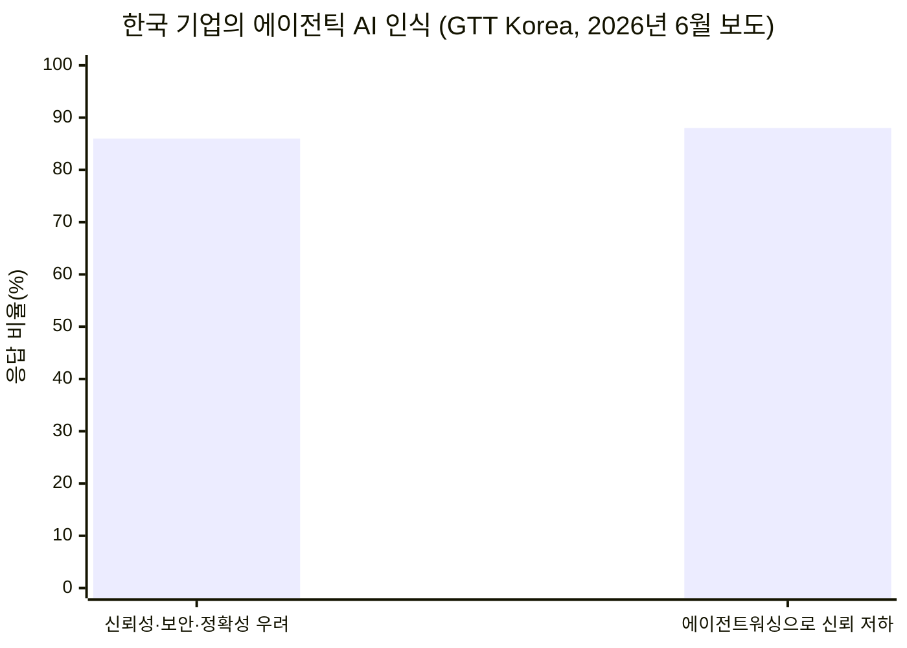

## 목차

1. 들어가며 — 하나의 단상에서 시작된 질문
2. AI 리터러시 교육은 왜 격차를 줄이지 못하는가
3. 병목의 이동 — 생성에서 검토로
4. 습관화의 함정 — 검토는 시간이 지나면 무뎌진다
5. Forward Deployed Engineer의 부상이 말해주는 것
6. Evidence Tracing과 Execution Provenance — AI 행동의 서사를 기록하는 기술
7. 한국 기업 현장의 신뢰 격차
8. "95% 실패" 통계를 어떻게 읽어야 하는가
9. 왜 도메인 전문가가 먼저 알아채는가
10. 그렇다면 무엇을 가르쳐야 하는가
11. 마치며
참고문헌
출처 투명성 표

---

## 1. 들어가며 — 하나의 단상에서 시작된 질문

이 글은 하나의 단상에서 출발한다. AI 시대에 사람에게 정말로 필요한 능력은 AI보다 결과물을 잘 만드는 능력이 아니라, AI가 만든 결과물을 보고 "이걸 믿어도 되는가"를 판단하는 능력일지도 모른다는 문제 제기다. AI Literacy를 가르치고, FDE를 키우고, 프롬프트를 잘 쓰게 만드는 교육이 계속되고 있는데도 정작 "AI를 어떻게 잘 쓸 것인가"라는 질문 자체가 해소되지 않고 있다면, 우리가 가르치고 있는 능력 자체가 잘못된 과녁을 겨누고 있는 것은 아닌지 되짚어볼 필요가 있다는 것이다.

이 단상이 흥미로운 지점은, 단순한 직관이나 불만이 아니라 실제로 2025년부터 2026년 사이 업계 전반에서 독립적으로 관찰되고 있는 여러 흐름과 정확히 맞닿아 있다는 사실이다. 코드 리뷰 병목 현상에 대한 산업계 데이터, 에이전트 실행 근거를 기록하는 학술 연구, Forward Deployed Engineer라는 직군의 폭발적 성장, 그리고 한국을 포함한 여러 나라 기업들이 에이전틱 AI 도입에서 겪고 있는 신뢰 문제까지 — 이 모든 것이 결국 하나의 질문으로 수렴한다. AI가 일을 더 많이 할수록, 사람이 해야 할 일은 정말로 줄어드는가, 아니면 성격이 바뀌는가.

이어지는 장들에서는 이 질문을 뒷받침하거나 반박할 수 있는 최신 자료들을 하나씩 짚어본다. 다만 미리 밝혀두어야 할 것이 있다. 아래에서 다루는 통계와 연구 중 일부는 동료 심사를 거치지 않은 예비 보고서이거나, 관련 도구를 판매하는 업체 자신의 블로그에 실린 주장이다. 이런 경우는 본문과 말미의 출처 투명성 표에서 명확히 구분해 표시했다.

---

## 2. AI 리터러시 교육은 왜 격차를 줄이지 못하는가

기업들은 이미 막대한 자원을 AI 교육에 쏟고 있다. 그런데 2026년에 발표된 여러 조사는 한결같이 같은 그림을 보여준다. DataCamp가 YouGov와 함께 미국과 영국의 기업 리더 500명 이상을 대상으로 진행한 2026년 조사에 따르면, 이미 AI 교육에 투자하고 있음에도 응답자의 다수가 여전히 조직 내 AI 역량 부족을 호소했다[21][22]. 같은 조사에서 리더의 약 59~60%가 AI 스킬 갭이 존재한다고 답했는데, 이는 교육을 안 해서가 아니라 교육이 작동하지 않고 있다는 뜻이다[22][23].

원인으로 지목되는 것은 교육의 형식이다. 가장 흔한 교육 방식인 영상 기반 강의나 온라인 세션 혼합형이 응답자의 40%를 차지했는데, 이런 방식은 배운 것을 실제 업무에 적용하기 어렵다는 지적을 받는다. 응답자의 23%는 영상 강의로는 실제 상황에 적용하기 어렵다고 답했고, 21%는 어디서부터 시작해야 할지조차 모르겠다고 답했다[21][22]. 이는 "AI를 설명하는 영상을 보는 것"과 "AI를 실제로 잘 쓰는 것"이 전혀 다른 층위의 문제라는 뜻이다.

기업용 학습 플랫폼 Docebo가 직원 2천 명을 대상으로 진행한 조사 결과도 비슷하다. 기업 L&D 리더의 절반 이상에게 AI 리터러시가 최우선 학습 과제로 꼽혔지만, 정작 직원의 66%는 교육에서 충분한 지원을 받지 못한다고 느꼈고, 85%는 그 교육이 자신의 구체적인 업무에 AI를 어떻게 적용해야 하는지 알려주지 못한다고 답했다[24]. 교육의 양과 실제 역량 사이의 간극이 이렇게 크다는 것은, 문제의 본질이 "얼마나 가르쳤는가"가 아니라 "무엇을 가르쳤는가"에 있음을 시사한다.

흥미로운 지점이 하나 있다. 일부 리터러시 프레임워크는 이미 이 문제를 감지하고 정의를 스스로 수정하고 있다. 한 조사기관은 "AI User" 단계의 역량을 정의하면서, 단순히 도구를 다룰 줄 아는 것이 아니라 AI의 결과물을 비판적으로 평가하고 언제 결과를 신뢰하고 언제 검증해야 하는지 아는 능력을 명시적으로 포함시켰다[23]. 다시 말해 업계 스스로도 "AI 리터러시"의 핵심이 도구 조작법이 아니라 신뢰와 검증 사이의 판단력이라는 쪽으로 정의를 옮겨가고 있는 셈이다. 다만 정의가 바뀌는 속도보다 실제 교육 프로그램이 그 정의를 따라잡는 속도가 훨씬 느리다는 것이 지금의 현실이다.

한 가지 더 눈여겨볼 변화는, AI 리터러시가 더 이상 순수한 인사·교육 이슈로만 취급되지 않는다는 점이다. EU AI Act 제4조는 AI를 제공하거나 활용하는 기업에게 관련 직원의 AI 리터러시를 충분한 수준으로 확보하도록 의무화하고 있다[25]. 즉 유럽에서는 AI 리터러시가 거버넌스와 컴플라이언스의 영역으로 들어가고 있다. 그런데 이 규제조차 "무엇을 가르쳐야 충분한 리터러시인가"에 대해서는 구체적인 답을 주지 않는다. 결국 그 답은 각 조직이 스스로 찾아야 한다.

---

## 3. 병목의 이동 — 생성에서 검토로

단상에서 제기한 핵심 주장 중 하나는 "사람의 일이 Do에서 Review로, 생성에서 판단으로 이동한다"는 것이었다. 이는 추상적인 주장이 아니라 소프트웨어 개발 현장에서 가장 먼저, 그리고 가장 선명하게 수치로 관찰되고 있는 현상이다.

개발자 생산성을 추적하는 LinearB의 2026년 소프트웨어 엔지니어링 벤치마크 보고서는, 에이전틱 AI가 만든 풀리퀘스트(PR)의 픽업 시간, 즉 리뷰어가 실제로 검토를 시작하기까지 걸리는 시간이 사람이 혼자 작업한 PR보다 5.3배 길다는 것을 발견했다. AI의 도움을 받았지만 에이전트가 자율적으로 작업하지는 않은 PR도 2.47배 더 오래 대기했다[17]. CircleCI의 2026년 데이터는 이 현상을 다른 각도에서 확인해준다. 개별 기능 브랜치의 처리량은 전년 대비 59% 증가했지만, 실제로 메인 브랜치에 병합되는 처리량은 오히려 감소한 팀이 많았다는 것이다[17]. 즉 AI 덕분에 코드를 "만드는" 속도는 빨라졌지만, 그것을 "병합해도 안전하다고 판단하는" 속도는 따라가지 못하고 있다.

이 현상을 요약하는 문장이 있다. 병목이 코드를 작성하는 일에서 그 코드를 병합해도 되는지 판단하는 일로 옮겨갔다는 것이다[19]. GitHub 자체 데이터도 이를 뒷받침한다. 2026년 5월 기준 GitHub Copilot의 코드 리뷰 기능은 6천만 건 이상의 리뷰를 처리했고, GitHub 전체 코드 리뷰의 5건 중 1건 이상에 에이전트가 관여하고 있다[19]. 코드 감사 도구 업체 Sonar가 개발자 1,100명 이상을 대상으로 진행한 2026년 조사에서는, 개발자들이 자신이 커밋하는 코드의 42%를 AI가 생성했거나 AI의 도움을 받은 것으로 인식하고 있었고, 38%는 AI가 만든 코드를 검토하는 데 사람이 쓴 코드보다 더 많은 노력이 든다고 답했다[19]. 여기에 더해 Stack Overflow의 2025년 설문에서는 AI 결과물의 정확성에 대한 개발자들의 신뢰도가 29%까지 떨어진 것으로 나타났는데, 이는 AI가 그럴듯해 보이지만 틀릴 수 있는 결과물을 만들어내는 경우가 늘면서 "빠르게 훑어봐서는 걸러지지 않는" 오류가 늘고 있다는 뜻으로 해석된다[17].

이런 변화를 가리키는 용어도 등장했다. 사람이 모든 검토 주기에 관여하는 human-in-the-loop 방식에서, 사람이 프로세스 전체를 관장하되 필요할 때만 개입하는 human-on-the-loop 방식으로의 전환이다[15]. 이 전환이 필요한 이유는 명확하다. 모든 산출물을 사람이 매번 처음부터 검토하는 구조로는, AI가 만들어내는 산출물의 양적 증가를 사람의 검토 역량이 절대로 따라잡을 수 없기 때문이다. Anthropic의 Claude Code 총괄 개발자가 이제는 프롬프트를 직접 쓰기보다는 프롬프트를 반복 실행하는 절차, 즉 루프를 설계하는 일을 하고 있다고 언급한 것도 같은 맥락에서 이해할 수 있다. AI를 한 번 시켜서 결과를 받는 것이 아니라, AI가 스스로 여러 차례 실행과 검증을 반복하도록 짜는 것 자체가 새로운 작업 단위가 되고 있는 것이다[15].

아래 도식은 이 흐름을 정리한 것이다.

아래 도표는 LinearB 2026년 데이터를 기반으로 한 것이다.

---

## 4. 습관화의 함정 — 검토는 시간이 지나면 무뎌진다

단상에서 지적한 것 가운데 가장 예리한 부분은 "결과와 함께 온 Evidence를 읽고 Outcome을 받아들일지 결정하는 것"이 생각보다 어렵다는 대목이다. 그런데 이보다 한 걸음 더 나아간, 상당히 불편한 연구 결과가 있다. 2026년에 발표된 한 연구는 실제 코드 리뷰 데이터를 분석해, AI 에이전트가 만든 PR에 대한 사람 리뷰어의 승인율이 시간이 지날수록 올라가고, 반대로 검토의 꼼꼼함은 낮아지는 경향을 확인했다[20].

이 연구는 리뷰어들 가운데 승인 패턴에 의미 있는 변화가 있었던 사람들만 따로 떼어 분석했는데, 그중 65%는 더 관대하게 승인하는 방향으로, 35%는 더 엄격해지는 방향으로 이동했다. 에이전트별로 나누어 보면 GitHub Copilot이 만든 PR에 대해서는 승인율이 9.1퍼센트포인트 상승했고, Devin이 만든 PR에 대해서는 3.8퍼센트포인트 상승했다[20]. 연구진은 이 현상이 리뷰어가 AI를 신뢰할 근거가 쌓여서 나타난 합리적 신뢰 조정인지, 아니면 단순히 반복 노출에 익숙해져 경계심이 무뎌지는 습관화 현상인지 정확히 구분하기는 어렵다고 인정하면서도, 리뷰 노력을 함께 분석한 결과 습관화 쪽에 더 가깝다는 잠정적 결론을 냈다. 연구진은 이에 대한 대응으로 한 사람이 특정 에이전트의 PR을 지나치게 많이 연속으로 검토하지 않도록 순환시키는 정책이나, 승인이 계속 이어지는 구간을 자동으로 표시해 다시 살펴보게 하는 감사 장치를 제안했다[20].

이 결과가 단상의 문제의식과 정확히 맞아떨어지는 지점이 있다. 단상은 "AI가 일을 많이 할수록 사람이 편해지는 것만은 아니다"라고 썼는데, 이 연구는 그보다 한발 더 나아가 "사람이 편해지려는 방향으로 스스로를 길들인다"는 위험까지 보여준다. 검토라는 행위 자체가 반복되면 그 반복 속에서 마모될 수 있다는 것이다. 이는 판단력을 기르는 교육만으로는 충분하지 않고, 판단력이 무뎌지는 것을 막는 별도의 제도적 장치, 즉 순환 배치나 표본 재검토 같은 구조적 안전판이 함께 필요하다는 뜻이기도 하다.

---

## 5. Forward Deployed Engineer의 부상이 말해주는 것

단상은 "FDE를 키워야 한다"는 교육 담론을 예로 들면서 문제를 제기했는데, 정작 2026년에 Forward Deployed Engineer(FDE)라는 직군 자체가 업계에서 폭발적으로 주목받고 있는 이유를 들여다보면 단상의 문제의식과 묘하게 겹치는 지점이 있다.

FDE라는 용어는 Palantir가 만든 것으로, 군사 용어인 "전방 배치"에서 이름을 따왔다. 최전선에 배치되어 현장 가까이에서 즉각 대응하는 군인처럼, 소프트웨어 엔지니어가 고객사 내부에 직접 들어가 실제 데이터와 실제 워크플로우를 다루며 커스텀 소프트웨어를 설계하고 만들고 배포한다는 개념이다[1][2]. Palantir는 이 모델을 약 20년 전부터 운영해왔고, Palantir 출신 FDE들이 지금 업계 곳곳에서 창업자나 임원으로 활동하고 있다[2]. Palantir가 표방하는 이 역할의 핵심 가치는 "Intelligence + Trust", 즉 강력한 AI 역량을 제공하면서도 고객의 데이터와 지적재산이 다른 누군가의 모델에 흡수되지 않도록 보호하는 것이다[1].

2026년에 와서 달라진 것은 이 모델의 규모다. OpenAI와 Anthropic이 2026년 5월 나란히 전담 FDE 사업부를 출범시켰고[6], Anthropic은 Blackstone, Hellman & Friedman과 함께 설립한 엔터프라이즈 AI 서비스 회사 "Ode with Anthropic"을 2026년 7월 공식 출범시켰다. 이 회사에는 Goldman Sachs, General Atlantic, Apollo, GIC, Sequoia 등이 투자자로 참여했다[2]. Palantir 혼자 20년에 걸쳐 키워온 독특한 조직 모델이, 이제는 AI 업계 전체가 수렴하는 배치 방식이 된 것이다[2].

왜 이런 일이 벌어질까. 한 분석은 이렇게 설명한다. FDE라는 역할이 존재하는 이유는 프론티어 AI 모델이 데모에서 보여주는 능력과, 규제가 있고 문서화도 절반쯤밖에 안 되어 있는 실제 기업 환경 안에서 안정적으로 작동하는 능력 사이의 거리가 크게 벌어졌기 때문이라는 것이다[5]. 다시 말해 모델 자체는 이미 충분히 똑똑한데, 그 똑똑함을 실제 업무의 특수성과 예외 상황에 맞게 맞물리게 하고, 그것이 제대로 작동하는지 검증하는 역할이 새로운 병목이자 새로운 가치의 원천이 되었다는 것이다. FDE에게 요구되는 핵심 질문도 이와 같다. 어떤 것을 자동화하고 어떤 것은 여전히 사람의 판단에 맡겨야 하는가[4]. 이는 단상이 던진 질문, 즉 AI에게 일을 맡기는 사람에게 필요한 능력이 결과물을 잘 만드는 능력이 아니라 그 결과물을 믿어도 되는지 판단하는 능력이라는 주장과 방향이 같다.

다만 이 대목에서 짚어둘 것이 있다. FDE에 관한 정보 대부분이 2026년 상반기에서 여름 사이 쏟아진 매우 최근의 콘텐츠이고, 그중 상당수는 FDE 채용이나 컨설팅, 교육 프로그램을 판매하는 업체들의 블로그에서 나온다는 점이다. 직군 자체의 존재와 확산은 여러 독립적 매체에서 교차 확인되지만, 연봉 전망이나 시장 성장률 같은 세부 수치는 출처의 상업적 이해관계를 감안해서 읽을 필요가 있다.

---

## 6. Evidence Tracing과 Execution Provenance — AI 행동의 서사를 기록하는 기술

단상은 "AI의 머릿속을 보자는 이야기가 아니다. 우리가 관찰할 수 있는 AI 행동의 서사까지 함께 봐야 한다는 이야기"라고 썼다. 흥미롭게도 이 문제의식은 지금 AI 에이전트 연구 커뮤니티에서 진지하게 다뤄지고 있는 학술적 주제와 거의 그대로 겹친다.

2026년 발표된 한 서베이 논문은 이 문제를 "Evidence Tracing"과 "Execution Provenance"라는 두 개념으로 정리한다. Evidence Tracing은 에이전트의 주장, 결정, 행동을 뒷받침하거나, 반박하거나, 무효화하거나, 영향을 미치는 근거 단위들을 식별하고 기록하고 서로 연결하는 메커니즘을 가리킨다. Execution Provenance는 검색된 문서, 도구 호출 등을 포함해 에이전트의 실행이 어떻게 펼쳐졌는지를 나타내는 더 넓은 범위의 구조화된 표현을 가리킨다[7]. 이 논문이 제안하는 스키마에는 근거 단위, 도구 호출, 기억 항목, 주장, 행동이라는 객체 유형과 함께, Support(뒷받침), Depend-on(의존), Contradict(모순), Update(갱신), Invalidate(무효화)라는 관계 유형이 정의되어 있다[11].

이 연구가 이런 틀을 제안하게 된 배경에는 실패 사례 분석이 있다. 멀티 에이전트 시스템의 실패 원인을 분석한 MAST 연구는 다중 에이전트 실패가 명세 불일치, 에이전트 간 조율 실패, 취약한 검증, 그리고 연쇄적으로 이어지는 실행 오류에서 비롯된다는 것을 보여주었다[7]. 결국 신뢰할 수 있는 에이전트 시스템을 만들려면, 에이전트 행동 아래에 깔린 근거와 실행 단계를 기록하고 연결하고 그 위에서 추론할 수 있는 메커니즘이 필요하다는 결론에 이른다[7].

이런 학술적 논의는 실제 산업 도구로도 빠르게 옮겨가고 있다. 2026년 기준으로 언급되는 대표적인 에이전트 옵저버빌리티 플랫폼으로는 Braintrust, LangSmith, Arize Phoenix, Helicone, Galileo, Datadog LLM Observability, AgentOps 등이 있다[9]. 이 도구들이 공통적으로 하는 일은 도구 선택, 도구 인자, 모델 응답, 기억 읽기와 쓰기, 상태 전이, 결정 분기 같은 실행의 모든 단계를 구조화된 흔적, 즉 트레이스로 남겨서, 에이전트가 무엇을 어떤 순서로 어떤 입력과 출력을 가지고 수행했는지 나중에 재구성할 수 있게 하는 것이다[11]. 컨설팅펌 McKinsey가 낸 2026년 AI 신뢰 관련 보고서는 트레이스 수준의 가시성 부족과 품질 측정 부재를 에이전트 도입이 정체되는 주요 원인 중 하나로 꼽았다[8].

실무적으로 강조되는 원칙도 단상의 문제의식과 정확히 통한다. 한 가이드는 사고가 터진 뒤에 되짚어보는 것이 아니라 첫 실행부터 트레이싱을 켜두어야 하며, 되도록 OpenTelemetry와 호환되는 형식으로 흔적을 남겨야 하고, 무엇보다 단순한 실행 로그가 아니라 검증 결과 자체를 기록해서 에이전트가 "완료했다"고 보고한 것이 실제로 객관적인 근거와 맞아떨어지는지 확인할 수 있어야 한다고 말한다[10]. 이것이 바로 단상이 말한 "실제로 원 시스템에서 완료됐는지"를 확인하는 능력의 기술적 대응물이다.

---

## 7. 한국 기업 현장의 신뢰 격차

이 흐름은 한국 기업 현장에서도 그대로 확인된다. CIO Korea는 2025년 말 기사에서, B2B 기업의 거의 절반이 에이전트를 도입하고 있으면서도 실제로는 자율성을 부여하지 않고 있다는 조사 결과를 인용했다. 이 경우 에이전트의 모든 행동을 사람이 매번 검토하고 승인해야 하는데, 이는 효율성과 생산성, 속도를 높이려던 애초의 도입 목적을 스스로 훼손하는 구조라는 지적이다[26]. 같은 기사는 신뢰는 쌓기는 어렵고 잃기는 쉬운데, 에이전트가 약속하는 경제적 잠재력이 기업 리더들에게 더 많은 신뢰를 요구하고 있다는 역설적 상황을 짚었다[26].

2026년 6월 GTT Korea가 보도한 조사에서는 이 신뢰 격차가 더 구체적인 숫자로 드러난다. 기업 리더의 86%가 신뢰성, 보안, 개인정보 보호, 정확성을 자율 에이전트 구현의 주요 장애물로 꼽았고, 88%는 이른바 "에이전트워싱"이 AI 전반에 대한 신뢰를 낮췄다고 응답했다[27]. 여기서 말하는 에이전트워싱이란, 실제로는 기존 챗봇이나 규칙 기반 자동화에 지나지 않는 제품을 마케팅 목적으로 "AI 에이전트"라고 부르는 관행을 가리키는 용어로, 리서치 기업 Gartner가 2025년 6월 처음 명명했다[48][49]. 이 용어가 나온 배경에는 실제 도입 성숙도와 시장의 과장된 기대 사이의 간극이 있다. Gartner는 이런 흐름을 반영해 2027년 말까지 에이전틱 AI 프로젝트의 40% 이상이 취소될 것이라는 전망을 냈고[48][51], 이 전망은 한국 매체에서도 반복적으로 인용되고 있다[28].

한국데이터경제신문이 2026년에 보도한 분석은 여기에 몇 가지 수치를 더한다. IDC 조사에서는 AI 파일럿의 88%가 프로덕션 단계에 도달하지 못했고, 실패한 AI 에이전트 프로젝트의 평균 직접 비용은 약 34만 달러, 원화로 약 4억 9,700만 원에 이르는 것으로 나타났다. 이 비용에는 LLM API 비용, 클라우드 인프라, 개발자 인건비, 통합 도구 라이선스, 보안 감사 비용, 벤더 계약 비용이 포함된다[28]. 같은 기사가 인용한 Workday 조사에 따르면 한국 기업의 78%가 에이전트를 초기 프로덕션(42%) 또는 롤아웃(36%) 단계에서 운영하고 있다고 답했는데, 이는 도입 자체는 활발하게 이루어지고 있지만 실제 활용의 깊이에서 병목이 발생하고 있는 구조를 보여준다[28].

이 세 개의 기사를 나란히 놓고 보면 하나의 그림이 보인다. 한국 기업들은 에이전트를 도입하는 데는 적극적이지만, 그 에이전트가 실제로 무엇을 근거로 판단했는지 확인할 방법이 마땅치 않아서 결국 사람이 모든 행동을 다시 검토하게 되고, 그 결과 애초에 에이전트를 도입한 목적인 속도와 효율이 오히려 희생되는 악순환에 놓여 있다는 것이다. 이는 단상이 말한 "판단을 위한 Evidence"가 갖춰지지 않으면 자율성도, 효율성도 함께 무너진다는 주장을 현장 데이터로 뒷받침하는 사례라고 볼 수 있다.

---

## 8. "95% 실패" 통계를 어떻게 읽어야 하는가

기업 AI 도입 실패를 이야기할 때 가장 자주 인용되는 숫자가 있다. "생성형 AI 파일럿의 95%가 측정 가능한 성과를 내지 못한다"는 통계다. 이 숫자는 2025년 7월 MIT Project NANDA가 발표한 "The GenAI Divide: State of AI in Business 2025"라는 보고서에서 나왔다[12][14]. 여러 매체는 이 보고서가 리더 150명 인터뷰, 직원 350명 설문, 공개된 AI 배포 사례 300건 분석을 바탕으로 한다고 전했다[14].

다만 이 통계를 인용할 때는 몇 가지를 함께 짚어야 한다. 먼저 이 보고서는 스스로 "예비 결과"라고 밝히고 있으며, 정식 동료 심사를 거친 학술 논문이 아니라 워킹페이퍼 형태로 공개된 것이다. 또한 저자 그룹이 소속된 Project NANDA 자체가 에이전틱 AI 인프라를 연구하고 구축하는 조직이라는 점도 이해관계 측면에서 함께 고려할 필요가 있다. 이 통계에 대한 한 비평은 원본 PDF에 인터뷰 대상자가 52명으로 기재되어 있는데도 여러 매체에서는 150명으로 보도되었다는 불일치를 지적했고, MIT가 호스팅하던 원본 링크는 현재 다른 곳으로 리다이렉트되고 있어 미러링된 사본을 통해서만 원문을 확인할 수 있는 상태라고 밝혔다[13]. 이런 점들은 이 보고서가 가치가 없다는 뜻이 아니라, "MIT가 공식적으로 발표한, 동료 심사를 거친 확정된 연구 결과"로 받아들이기보다는 "AI 인프라 업계의 한 연구 그룹이 낸 예비 조사 결과"로 신중하게 받아들여야 한다는 뜻이다.

그렇다면 "95%"라는 정확한 숫자는 접어두더라도, 방향성 자체는 다른 독립적인 자료들과 일치하는가. 그렇다고 볼 수 있는 근거가 있다. Gartner는 2027년 말까지 에이전틱 AI 프로젝트의 40% 이상이 취소될 것이라고 전망했고[48][51], IDC는 AI 파일럿의 88%가 프로덕션에 도달하지 못한다고 밝혔다[28]. 이 두 수치는 서로 다른 조사기관이 서로 다른 방법론으로 낸 결과이지만, 모두 "생성형 AI 파일럿 대다수가 실질적 성과로 이어지지 못한다"는 동일한 방향을 가리킨다. 그리고 더 중요한 것은, 이 실패의 원인으로 지목되는 것이 한결같이 모델의 지능 부족이 아니라 통합, 거버넌스, 검증 체계의 부재라는 점이다[12][28]. 이 지점에서만큼은 여러 독립 출처가 수렴하고 있다고 볼 수 있다.

---

## 9. 왜 도메인 전문가가 먼저 알아채는가

단상은 "발주 결과가 이상한지, 인원 집계 기준이 이상한지, 계약 검토에서 무엇이 빠졌는지는 프롬프트 교육을 많이 받은 사람이 아니라 그 일을 아는 사람이 먼저 눈치챈다"고 썼다. 이 주장을 뒷받침하는 근거는 코드 리뷰의 미래를 다루는 연구에서도 발견된다.

한 연구는 코드 리뷰의 효과성을 리뷰 자체의 한 단계가 아니라 전체 생애주기의 결과로 다뤄야 한다고 제안하면서, 앞으로 리뷰어의 역할이 코드를 한 줄 한 줄 검사하는 수동적 검사자에서, 에이전트를 감독하는 관리자로 바뀌어야 한다는 미래상을 제시했다[18]. 코드 자체를 검증하는 일은 자동화된 검사 도구가 상당 부분 대체할 수 있지만, 이 변경이 실제 업무 의도와 아키텍처에 부합하는지 판단하는 일은 결국 그 도메인을 아는 사람의 몫으로 남는다는 것이다.

취리히의 한 연구도 비슷한 원칙을 제안한다. 코드 생성 이전에 명세를 먼저 검증하고, 결정론적으로 검증 가능한 부분은 자동화된 검증에 맡기고, 명세만으로는 잡아낼 수 없는 구조적 문제에 대해서만 AI나 사람의 리뷰를 투입해야 한다는 것이다[16]. 이 원칙을 일반화하면, 정형화할 수 있는 검증은 기계가 담당하고, 정형화하기 어려운 맥락적 판단, 즉 "이 발주 수량이 실제 현장 상황에 맞는가", "이 계약 조항이 우리 업계 관행에서 빠지면 안 되는 조항인가" 같은 판단은 결국 그 업무를 오래 다뤄본 사람만이 할 수 있다는 뜻이 된다. 이것이 바로 프롬프트 스킬의 상품화가 이미 상당히 진행된 지금, 도메인 지식과 검증 능력이 오히려 더 희소하고 더 값진 자산으로 남는 이유이기도 하다.

---

## 10. 그렇다면 무엇을 가르쳐야 하는가

지금까지 살펴본 자료들을 종합하면, 교육의 방향을 다시 설계할 때 고려할 만한 지점들이 드러난다.

첫째, 도구 사용법 교육에서 근거 판독 교육으로 무게중심을 옮길 필요가 있다. 지금 산업 전반이 구축하고 있는 옵저버빌리티 인프라, 즉 트레이스와 프로버넌스 기록은 결국 사람이 그것을 읽고 판단할 수 있을 때만 의미가 있다. 트레이스를 남기는 기술은 빠르게 성숙하고 있지만, 그 트레이스를 읽고 "이 결과를 받아들여도 되는가"를 판단하는 능력을 기르는 교육은 상대적으로 뒤처져 있다.

둘째, 일반적인 AI 리터러시 교육과 도메인별 검증 교육을 구분해서 설계할 필요가 있다. 발주 업무를 하는 사람에게 필요한 검증 능력과, 계약 검토를 하는 사람에게 필요한 검증 능력은 서로 다르다. 범용 프롬프트 교육이 이 간극을 메워주지 못한다는 것은 이미 여러 조사에서 확인된 바다[21][22][24].

셋째, 검토 역량이 시간이 지나면서 무뎌질 수 있다는 것을 전제로 한 제도적 안전판이 필요하다. 습관화 연구가 보여주듯, 사람이 한 번 판단력을 갖췄다고 해서 그 판단력이 계속 유지되는 것은 아니다. 순환 배치, 표본 재검토, 승인 스트릭 감사 같은 장치를 교육과 함께 설계해야 판단력이 실제로 작동하는 상태를 유지할 수 있다[20].

넷째, "완료됐다"는 보고 자체를 그대로 믿지 않고 검증하는 습관을 조직 문화로 만들어야 한다. 실무 가이드가 강조하듯, 실행 로그가 아니라 검증 결과를 기록해서 에이전트의 "완료" 보고를 객관적 근거와 대조하는 것이 핵심이다[10]. 이는 개인의 역량 문제가 아니라 조직이 어떤 절차와 도구를 갖추고 있느냐의 문제이기도 하다.

---

## 11. 마치며

단상이 던진 질문으로 돌아가 보면, 지금까지 살펴본 자료들은 그 질문이 단순한 개인적 직관을 넘어선다는 것을 보여준다. 코드 리뷰의 병목 이동, 검토의 습관화, FDE라는 직군의 부상, 에이전트 실행 근거를 기록하려는 학술적·산업적 시도, 그리고 한국을 포함한 여러 나라 기업들이 겪고 있는 신뢰 격차까지, 서로 다른 영역에서 독립적으로 관찰된 흐름들이 결국 같은 지점을 가리키고 있다.

AI에게 일을 맡기려면 사람이 AI보다 그 일을 잘할 필요는 없다. 그러나 적어도, 그 일이 제대로 됐다는 증거는 읽을 수 있어야 한다. 이 문장이 단순한 아포리즘이 아니라 지금 산업 전반이 씨름하고 있는 실제 문제라는 것을, 위의 자료들이 뒷받침해준다.

---

## 참고문헌

[1] IIT, "What Is a Forward Deployed Engineer? Inside Tech's Hottest New Job", 2026-08-06, https://www.iit.edu/blog/forward-deployed-engineer

[2] Hatchworks, "What Is a Forward Deployed Engineer? The Model Getting Enterprise AI Into Production", 2026-08-04, https://hatchworks.com/blog/fde/forward-deployed-engineer/

[3] Wikipedia, "Forward Deployed Engineer", https://en.wikipedia.org/wiki/Forward_Deployed_Engineer

[4] Rocketlane, "Forward Deployed Engineer (FDE): The Essential 2026 Guide", 2026-02-26, https://www.rocketlane.com/blogs/forward-deployed-engineer

[5] Adnan Masood, Medium, "What Is a Forward-Deployed Engineer?", 2026-06-20, https://medium.com/@adnanmasood/what-is-a-forward-deployed-engineer-0483919fedc2

[6] jobsbyculture, "Forward Deployed Engineer: The Fastest-Growing AI Role in 2026", 2026-07-14, https://jobsbyculture.com/blog/forward-deployed-engineer-boom-2026

[7] arXiv, "From Agent Traces to Trust: A Survey of Evidence Tracing and Execution Provenance in LLM Agents", 2026-06, https://arxiv.org/html/2606.04990v1

[8] Confident AI, "Top 8 AI Agent Observability Platforms for 2026", 2026-07-28, https://www.confident-ai.com/knowledge-base/compare/best-ai-agent-observability-tools-2026

[9] MLflow, "What Is Agent Observability? A 2026 Developer Guide", 2026-06-11, https://mlflow.org/articles/what-is-agent-observability-a-2026-developer-guide/

[10] OpenHands, "What Is AI Agent Observability? How to Trace, Govern, and Control Agents at Scale", 2026-08-25, https://www.openhands.dev/blog/ai-agent-observability

[11] Braintrust, "Agent observability: The complete guide for 2026", 2026-06-21, https://www.braintrust.dev/articles/agent-observability-complete-guide-2026

[12] Healthcare IT News, "MIT: 95% of enterprise AI pilots fail to deliver measurable ROI", 2025-10-09, https://www.healthcareitnews.com/news/mit-95-enterprise-ai-pilots-fail-deliver-measurable-roi

[13] NewMR(Patreon), "Myth Number 2: MIT Showed That 95% of AI Pilots Fail", 2026-05-31, https://www.patreon.com/NewMR/posts/myth-number-2-95-159701952

[14] Yahoo Finance(Fortune), "MIT report: 95% of generative AI pilots at companies are failing", https://finance.yahoo.com/news/mit-report-95-generative-ai-105412686.html

[15] Codecentric, "AI Code Review: Why Loops Without Tests Are Dangerous", 2026-07-05, https://www.codecentric.de/en/knowledge-hub/blog/ai-code-review-loop-verification

[16] Codex Knowledge Base, "The Human Review Bottleneck: Practical Code Review Strategies for Agent Output", 2026-05-24, https://codex.danielvaughan.com/2026/05/24/human-review-bottleneck-code-review-strategies-agent-output/

[17] Codacy Blog, "AI Is Breaking Code Review: How Engineering Teams Fix the PR Bottleneck", 2026-06-12, https://blog.codacy.com/ai-breaking-code-review-how-engineering-teams-survive-pr-bottleneck

[18] arXiv, "Rethinking Code Review in the Age of AI: A Vision for Agentic Code Review", https://arxiv.org/pdf/2605.17548

[19] Milestone, "AI Is Writing More Code. Review Is Becoming the Bottleneck.", https://mstone.ai/blog/ai-code-review-bottleneck/

[20] arXiv, "Habituation at the Gate: Rising Approval and Declining Scrutiny in Human Review of AI Agent Code", https://arxiv.org/pdf/2606.22721

[21] DataCamp, "AI Skills Gap in 2026: Why Training Isn't Enough", 2026-03-12, https://www.datacamp.com/blog/the-ai-skills-gap-in-2026-why-most-ai-training-isn-t-translating-to-workforce-capability

[22] DataCamp, "Why Traditional AI Training Isn't Working in 2026", 2026-03-23, https://www.datacamp.com/blog/why-traditional-ai-training-isn-t-working-in-2026

[23] Tess Group, "AI Literacy: How to Build an AI-Ready Workforce in 2026", 2026-04-13, https://tessgroup.co.uk/blog/ai-literacy-how-to-build-an-ai-ready-workforce

[24] AI Literacy Institute, "AI Literacy Review – May 5, 2026", 2026-05-05, https://ailiteracy.institute/ai-literacy-review-may-5-2026/

[25] TechnoEdge, "EU AI Act AI Literacy Training in 2026", https://technoedgels.com/eu-ai-act-ai-literacy-training-in-2026-what-multinational-enterprises-need-to-teach-employees-managers-and-ai-teams/

[26] CIO Korea, "에이전틱 AI, 신뢰 부족이 가장 큰 걸림돌로 떠오르다", 2025-11-14, https://www.cio.com/article/4089883/

[27] GTT Korea, "에이전틱 AI 실제 운영 10%뿐...모델보다 지식 기반·거버넌스 점검 시급", 2026-06-02, https://www.gttkorea.com/news/articleView.html?idxno=25882

[28] 한국데이터경제신문, "[AI 도구 해부학] 에이전틱 AI 프로젝트 실패율 88%, 기업이 빠지는 7가지 함정 분석", https://www.dataeconomy.co.kr/news/articleView.html?idxno=42541

[48] Explore Agentic, "Agent washing, explained", 2026-04-16, https://exploreagentic.ai/glossary/agent-washing/

[49] OneReach.ai, "What Is AI Agent Washing, and How to Navigate Past It?", 2026-07-10, https://onereach.ai/blog/what-ai-agent-washing-looks-like-and-how-to-navigate-past-it/

[51] PROS, "Agent-Washing: How to Spot Hype and Separate Buzzwords from Real Agentic AI", 2026-03-18, https://pros.com/learn/blog/agent-washing-spot-hype-separate-buzzwords-from-real-agentic-ai/

---

## 출처 투명성 표

| 구분 | 해당 내용 | 비고 |
|---|---|---|
| 복수 독립 출처로 교차 확인된 사실 | FDE 개념의 Palantir 기원과 2026년 업계 전반 확산, 코드 리뷰 병목의 생성→검토 이동, 한국 기업의 낮은 에이전트 자율성·신뢰도, "에이전트워싱" 용어와 Gartner의 프로젝트 취소 전망 | [1][2][6], [17][19], [26][27][28], [48][51] |
| 동료 심사 여부 불명확한 학술 프리프린트(arXiv) | Evidence Tracing/Execution Provenance 서베이, Habituation at the Gate 연구 | 2026년 arXiv 게재. 정식 저널·컨퍼런스 심사 통과 여부는 별도 확인 필요 |
| 업계·벤더 자체 조사 및 블로그 (상업적 이해관계 있음) | 옵저버빌리티 도구 업체(Confident AI, Braintrust, MLflow, OpenHands)의 시장 설명, 개발 도구 업체(LinearB, Sonar, CircleCI)의 자체 통계, FDE 채용·컨설팅 업체의 시장 전망 | 수치 자체는 인용하되, 발행 주체가 관련 제품·서비스의 이해관계자임을 감안해서 읽어야 함 |
| 단일 출처·교차검증이 어려운 주장 | "생성형 AI 파일럿 95% 실패" 통계(MIT Project NANDA) | 동료 심사를 거치지 않은 예비 보고서이며, 저자 그룹이 에이전틱 AI 인프라 연구 조직이라는 이해관계가 있음. 인터뷰 대상자 수도 보도마다 52명/150명으로 엇갈림. 방향성(파일럿 대다수 실패)은 Gartner·IDC 등 별도 출처와 일치하나, 정확한 수치는 신중하게 취급할 것 |
| 필자의 해석·논평 | 서두의 단상 원문(필자가 직접 작성해 페이스북에 게시한 글), 그리고 이를 확장한 2~10장의 논의 구성과 결론 | 사실 진술이 아닌 개인적 견해이며, 위 각주로 인용된 자료들을 바탕으로 필자가 구성한 해석임 |
