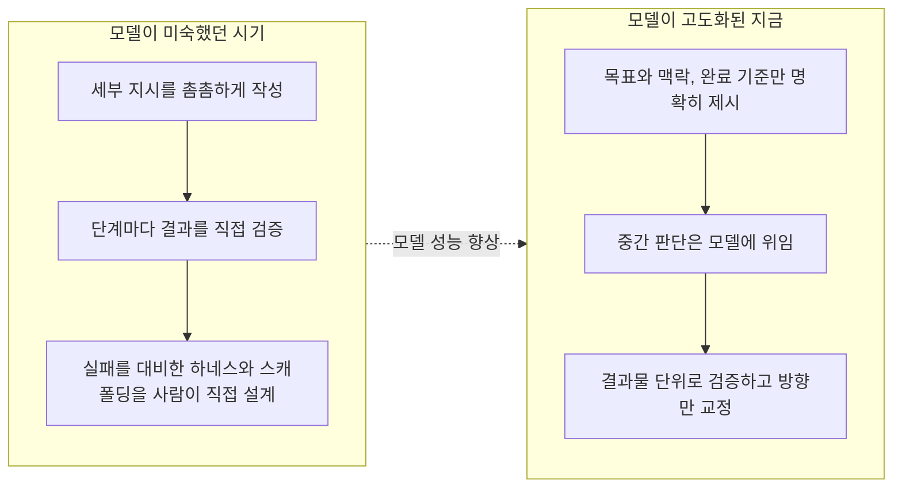
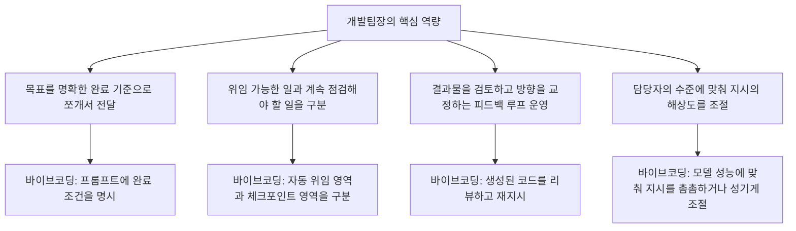

> 
> 현재 바이브코딩을 잘하는 법은 아주 쉽게 설명하자면 개발팀장처럼 하는 것임.
> 
> 그래서 책낸사람 강의하는 사람 대부분 개발팀장출신이고 나름 자기 확신들이 있음.
> 
> 그들에게 바이비코딩은 자연스럽게 말 잘듣는 팀임. 모델이 후질 땐 말 잘듣는 멍청한 팀원을 데리고 일하는 요령을 썼고 모델이 좋아지면 그냥 상황은 말잘듣는 똑똑한 팀원을 데리고 일하는 요령을 쓰는 것임.
> 
> 개발 팀장이 아닌 사람에겐 대부분 신기해보일 뿐임.
> 
> 그럼 진짜 교육은 개발팀이 없는 사람에게 개발팀장일을 가르치는거라 할 수 있음.
> 
> https://www.facebook.com/share/p/1GMvTgfVce/
> 

## 원문이 던진 질문을 풀어보는 심층 해설

---

## 목차

1. 들어가며 — 이 글이 다루는 원문과 문제의식
2. 원문 주장의 구조를 세 문장으로 뜯어보기
3. "개발팀장의 일"이란 원래 무엇인가
4. 왜 지금 이 비유가 실제로 세계 곳곳에서 반복되고 있는가
5. 모델이 멍청했을 때와 똑똑해진 지금, 관리 기술은 어떻게 달라지는가
6. 개발팀장에게는 당연하지만 남에게는 신기해 보이는 이유 — 암묵지의 문제
7. 그렇다면 "진짜 교육"은 무엇을 가르쳐야 하는가
8. 국내 바이브코딩 교육 시장은 이 가설과 얼마나 맞아떨어지는가
9. 이 비유가 갖는 한계와 반론
10. 마치며
11. 출처 투명성 표
12. 참고문헌

---

## 1. 들어가며 — 이 글이 다루는 원문과 문제의식

이 문서는 페이스북에 올라온 짧은 글 하나를 출발점으로 삼는다. 원문은 대략 이런 취지였다. 바이브코딩을 잘하는 법을 아주 쉽게 설명하면 그것은 개발팀장처럼 행동하는 것과 같다는 것이다. 그래서 바이브코딩 책을 내거나 강의를 하는 사람 중 상당수가 개발팀장 출신이며, 그들 나름의 확신을 가지고 있다는 관찰이 이어진다. 그들에게 바이브코딩은 자연스럽게 "말을 잘 듣는 팀"을 다루는 일이다. 모델의 성능이 떨어졌을 때는 말을 잘 듣지만 실력은 부족한 팀원을 데리고 일하는 요령을 썼고, 모델이 좋아진 지금은 말을 잘 듣는 똑똑한 팀원을 데리고 일하는 요령을 쓰는 것뿐이라는 논지다. 반면 개발팀을 이끌어 본 적이 없는 사람에게는 이 모든 과정이 그저 신기한 마법처럼 보인다. 그래서 결론적으로, 진짜 필요한 교육은 개발팀이 없는 사람에게 개발팀장의 일하는 방식을 가르치는 일이라는 것이다.

이 페이스북 게시물 자체는 로봇 배제 규칙(robots.txt) 때문에 본문 전체를 직접 불러올 수 없었다. 따라서 이 문서는 사용자가 전달한 원문 텍스트를 1차 자료로 삼고, 그 주장이 실제로 국내외 실무 담론과 얼마나 겹치는지를 웹 검색으로 교차 검증하는 방식으로 작성되었다. 즉 이 글의 목적은 원문의 주장을 그대로 되풀이하는 것이 아니라, 그 주장이 근거가 있는 관찰인지, 어디까지가 사실이고 어디부터가 저자 개인의 해석인지를 구분해서 보여주는 데 있다.

---

## 2. 원문 주장의 구조를 세 문장으로 뜯어보기

원문의 논리를 분해하면 세 개의 독립적인 주장이 겹쳐 있다는 것을 알 수 있다.

첫째, 바이브코딩을 잘하는 핵심 역량은 코딩 기술이 아니라 관리(매니지먼트) 역량이라는 주장이다. 프롬프트를 얼마나 정교하게 쓰느냐보다, 일을 쪼개고 맡기고 확인하는 능력이 결과물의 질을 좌우한다는 것이다.

둘째, 이 관리 역량은 모델의 성능과 무관하게 본질적으로 동일한 기술이며, 다만 모델의 수준에 따라 적용 방식이 달라진다는 주장이다. 모델이 미숙했던 시절에는 세세하게 지시하고 매 단계를 검증하는 "저연차 팀원 관리법"이 필요했고, 모델이 고도화된 지금은 목표와 맥락만 던져주고 스스로 판단하게 하는 "고연차 팀원 관리법"이 통한다는 것이다.

셋째, 이 관리 역량은 원래 조직에서 팀을 이끌어 본 사람들에게는 이미 체화된 암묵지이기 때문에, 그들에게는 바이브코딩이 낯설지 않지만, 그런 경험이 없는 사람에게는 결과물이 마법처럼 느껴진다는 주장이다. 그래서 저자는 진짜 필요한 교육의 정의를 다시 쓴다. 프롬프트 문법을 가르치는 것이 아니라, 팀장의 일머리를 가르치는 것이 핵심이라는 것이다.

이 세 주장은 서로 다른 층위에 있다. 첫째와 둘째는 실제로 2025년 하반기부터 2026년 사이 국내외 실무 담론에서 반복적으로 확인되는, 상당히 근거가 탄탄한 주장이다. 셋째는 원문 저자의 개인적 관찰이자 해석이며, 정량적으로 검증된 통계라기보다는 시장에서 관찰되는 하나의 경향에 가깝다. 아래에서 순서대로 짚어본다.

---

## 3. "개발팀장의 일"이란 원래 무엇인가

원문의 비유를 이해하려면 먼저 개발팀장이 실제로 무슨 일을 하는 사람인지 짚고 넘어갈 필요가 있다. 국내 개발 조직 문화를 다룬 실무 회고에 따르면, 개발팀장은 스스로 코드를 짜기보다 팀원들이 더 일을 잘할 수 있도록 지원하는 역할에 더 가깝고, 동시에 팀원과 임원(혹은 CTO) 사이를 연결하는 중간 관리자 역할을 겸한다[1]. 구체적으로는 팀의 목표(KPI)를 달성하기 위해 일의 진행 상황을 지속적으로 점검하는 지표를 고민하고, 팀원이 더 나은 환경에서 일할 수 있도록 위쪽에 개선을 요청하며, 무엇보다 팀원 한 사람 한 사람이 어떤 상황에 있고 무엇을 잘하는지를 파악하는 데 상당한 시간을 쓴다[1].

이 정의를 그대로 옮겨 놓고 보면, 실은 바이브코딩을 하는 사람이 매일 하는 일과 거의 겹친다는 것을 알 수 있다. 목표를 명확히 정의하는 일, 작업을 쪼개서 적절한 단위로 지시하는 일, 결과물이 나오면 그것을 검증하고 피드백을 주는 일, 그리고 그 피드백을 반복하며 결과물의 완성도를 높여가는 일이 그것이다. 다만 팀원이 사람이 아니라 AI 모델이라는 점만 다를 뿐이다.

---

## 4. 왜 지금 이 비유가 실제로 세계 곳곳에서 반복되고 있는가

원문의 저자가 우연히 떠올린 개인적 감상처럼 보일 수 있지만, 실제로 2026년에 들어서면서 이 "팀장 비유"는 국내외 실무자 담론에서 놀라울 정도로 독립적으로 반복해서 등장하고 있다. 몇 가지 근거를 짚어본다.

구글의 개발자 경험 담당 시니어 엔지니어링 리더인 애디 오스마니(Addy Osmani)는 자신의 블로그 글에서, AI 코딩 에이전트를 잘 다루려면 관리자가 필요하다는 주장을 정면으로 펼쳤다. 그는 실제 업무를 위임할 때 흔히 빠지는 함정으로, 제품의 의도나 API 설계의 트레이드오프, 아키텍처의 경계, 장기적인 유지보수 판단처럼 실제로는 사람이 해야 할 일까지 지나치게 위임해 버리는 경우를 꼽았다[2]. 그는 기계적인 구현이나 상용구 리팩터링, 강한 검토를 전제로 한 테스트 생성처럼 완전히 위임 가능한 일과, 공유 인터페이스나 데이터 마이그레이션처럼 중간중간 점검이 필요한 일을 구분해야 한다고 설명하면서, 결국 여러 에이전트를 동시에 굴리게 되면 사람은 코드를 디버깅하는 대신 팀을 이끄는 일을 하게 된다고 정리했다[2]. 그가 내린 결론은 원문의 주장과 사실상 동일하다. 뛰어난 테크리드나 매니저를 만드는 역량, 즉 명확성, 위임, 피드백 루프, 비동기 커뮤니케이션이 AI 코딩에도 그대로 옮겨간다는 것이다[2].

이런 흐름은 개인의 주장에 그치지 않고 채용 시장의 통계로도 확인된다. 개발 조직 전문 매체 리드데브(LeadDev)는 에이전트형 코딩 시대에 엔지니어링 매니저에 대한 수요가 오히려 늘고 있다고 보도하면서, 그 이유로 위임과 맥락 설정, 작업 분해라는 매니저의 핵심 역량이 AI 에이전트를 감독하는 일과 정확히 맞아떨어지기 때문이라고 분석했다[3]. 이 기사에 따르면 이제 개별 개발자에게도 여러 에이전트를 동시에 관리하기 위한 테크리드 수준의 역량이 요구되면서 기존의 위계 구조가 무너지고 있고, 기업들은 관리 계층을 줄이면서 개발자 개개인이 제품 성과 전체를 책임지는 "미니 CEO"처럼 행동하기를 기대하고 있다고 전한다[3]. 한 실무자의 표현을 빌리면, 사람으로 구성된 팀 대신 개별 기여자 각자가 관리자처럼 행동하는 상황이 된 것이다[3].

같은 흐름을 다른 각도에서 보여주는 자료도 있다. 뉴스레터 AI 리더십 엣지(AI Leadership Edge)가 인용한 2026년 조사에 따르면, AI 도구를 쓰는 엔지니어들은 이제 새 코드를 작성하는 시간보다 생성된 코드를 검토하는 시간을 더 많이 쓰는 역전 현상이 나타났고, 반대로 엔지니어링 매니저들은 지난 10년 사이 가장 기술적으로 손을 많이 대는 상태가 되었다고 한다[4]. 이 조사를 진행한 매체는 엔지니어와 매니저의 역할이 서로의 방향으로 수렴하면서 점점 비슷해지고 있다고 결론지었다[4]. 조직 내 실제 업무 분담을 관찰한 결과, 개발자와 관리자 사이의 경계가 흐려지고 있다는 뜻이다.

이런 관점을 에이전트 관리에 특화된 실무 프레임워크로 구체화한 사례도 있다. 뉴스레터 "Product with Attitude"에 실린 한 게재글은 AI 에이전트 관리가 프롬프트 엔지니어링과는 다른 문제라고 못박으면서, 다섯 명의 사람으로 이루어진 팀이든 다섯 개의 에이전트로 이루어진 팀이든 진짜 관리의 본질은 완료 기준을 명확히 하는 것, 한 번에 하나의 일에 집중하도록 작업량을 제한하는 것, 그리고 의사결정 권한을 분명히 부여하는 것 세 가지로 요약된다고 주장했다[5]. 이 글은 이런 원칙을 "정의하고, 전달하고, 이끈다(Define-Deliver-Drive)"는 이름의 프레임워크로 정리하면서, 스펙 없이, 온보딩 없이, 의사결정 구조 없이, 검토 없이 일하는 팀이 실패하는 방식을 에이전트도 그대로 반복한다고 지적했다[5].

Anthropic이 자체적으로 발간한 2026년 에이전트형 코딩 동향 보고서 역시 비슷한 방향을 가리킨다. 이 보고서는 고객들과의 실제 작업 경험을 근거로, 현재 실무자들은 자신의 업무 중 완전히 위임할 수 있는 비중이 0에서 20퍼센트 수준에 불과하다고 보고하며, AI를 효과적으로 쓰려면 신중한 사전 설계와 프롬프트 작성, 적극적인 감독, 검증, 그리고 인간의 판단이 특히 위험 부담이 큰 작업에서는 여전히 필수적이라고 밝혔다[6]. 이는 "그냥 시키면 알아서 다 한다"는 통념과는 다르게, AI를 다루는 일이 상당한 관리 노동을 요구한다는 점을 보여준다.

국내에서도 이와 같은 문제의식이 독립적으로 관찰된다. 한 스레드(Threads) 이용자는 바이브코딩을 하다 보니 사장이 옆에 직원 한 명을 두고 이렇게 만들어라 저렇게 만들어라 지시하는 것과 크게 다르지 않다는 감상을 남겼는데, 직원은 자신의 역량 안에서 열심히 결과물을 만들고 사장은 코딩을 몰라 그 과정을 지켜볼 뿐이며, 결국 잘 모르는 사람이 아는 사람을 믿을 수밖에 없는 구조는 예나 지금이나 다르지 않다고 정리했다[7]. 이 관찰은 원문 저자의 주장과 본질적으로 같은 구조를 다른 언어로 표현한 것이다.

정리하면, "바이브코딩을 잘한다는 것은 사람을 관리하듯 AI를 관리하는 것이다"라는 주장은 특정 개인의 독창적인 통찰이라기보다, 2026년 상반기부터 국내외에서 여러 실무자와 매체가 서로 다른 사례를 근거로 거의 동시에 도달한 공통된 관찰에 가깝다. 이 점에서 원문의 첫 번째 주장은 상당히 신빙성이 높다고 볼 수 있다.

---

## 5. 모델이 멍청했을 때와 똑똑해진 지금, 관리 기술은 어떻게 달라지는가

원문의 두 번째 주장, 즉 모델의 수준에 따라 관리 방식이 달라진다는 지적도 실제 기술 담론에서 뒷받침되는 부분이 있다. 다만 여기서는 "필요한 기술이 완전히 사라진다"는 식의 과장된 결론과, "기술의 형태가 달라질 뿐 여전히 필요하다"는 좀 더 정확한 결론을 구분해서 볼 필요가 있다.

에이전트 성능은 모델 자체의 능력뿐 아니라 그 모델을 감싸는 시스템, 즉 시스템 프롬프트와 도구 구성, 실행 훅, 맥락 관리 방식을 통칭하는 "하네스(harness)"의 설계에 크게 좌우된다는 점은 여러 연구에서 확인된다. 예를 들어 2026년 2월 공개된 한 실험에서는 엔지니어 세 명이 다섯 달 동안 코드를 한 줄도 직접 타이핑하지 않고 100만 줄 규모의 프로덕션 애플리케이션을 완성했는데, 이때 핵심 변수는 더 똑똑한 모델이 아니라 에이전트가 실수하지 않도록 감싸는 하네스의 설계였다고 보고되었다[8]. 같은 시기 랭체인(LangChain)은 코딩 에이전트 벤치마크에서 모델을 바꾸지 않고 하네스만 개선해서 순위를 서른 위권에서 다섯 위권으로 끌어올렸다는 사례도 함께 보고되었다[8]. 이는 모델 성능이 낮을 때는 사람이 정교한 스캐폴딩(비계, 보조 장치)을 직접 설계해서 모델의 부족한 부분을 메꿔줘야 한다는 뜻이다. 이것이 원문에서 말하는 "말은 잘 듣지만 실력이 부족한 팀원을 다루는 요령"에 해당한다고 볼 수 있다.

반대로 모델이 좋아지면서 나타나는 변화도 실무자들 사이에서 이미 논의되고 있다. 한 실무 가이드는 한때 "모델이 똑똑해지면 프롬프트 기술은 필요 없어진다"는 말이 돌았고, 실제로 2026년 모델들은 다소 어설픈 문장도 잘 알아듣게 되었다는 점을 인정하면서도, 업무의 승부처는 평범한 답이 아니라 상황에 정확히 들어맞는 답이기 때문에 맥락을 구조화해서 전달하는 능력 자체는 여전히 유효하다고 지적한다[9]. 즉 모델이 좋아졌다고 해서 관리 기술 자체가 사라지는 것이 아니라, 그 기술이 적용되는 층위가 "이렇게 해라, 저렇게 해라"는 세세한 지시에서 "이런 목표와 맥락을 줄 테니 알아서 판단해라"는 위임으로 옮겨간다고 보는 편이 더 정확하다.

이 변화를 가장 직접적으로 언급한 자료 중 하나는 국내의 한 프롬프트 엔지니어링 실무 자료다. 이 자료는 실무 환경에서는 고성능 추론 모델과 가볍고 빠른 경량 모델을 동시에 사용해야 하는데, 일 잘하는 관리자는 모델의 수준에 맞춰 지시 방식을 다르게 가져간다고 설명한다. 스스로 판단하고 계획을 세우는 추론 모델은 노련한 고참 동료를 대하듯 다루는 편이 낫고, 복잡한 문제라도 목표만 명확히 던져주면 알아서 해결책을 찾아온다는 것이다[10]. 이 설명은 원문이 말한 "똑똑한 팀원을 데리고 일하는 요령"과 정확히 같은 내용을 가리키고 있으며, 국내 실무자 사이에서도 독립적으로 같은 결론에 도달했다는 점에서 눈여겨볼 만하다.

아래는 이 변화를 도식으로 정리한 것이다.

이 도식에서 강조할 점은, 왼쪽에서 오른쪽으로 넘어간다고 해서 "관리 자체가 필요 없어지는 것"이 아니라 "관리의 해상도가 촘촘한 지시에서 성긴 위임으로 바뀔 뿐"이라는 것이다. 실제로 앞서 인용한 Anthropic의 2026년 보고서가 지적하듯, 지금도 실무자들이 완전히 위임할 수 있다고 느끼는 작업의 비중은 여전히 0에서 20퍼센트 수준에 머물러 있다[6]. 원문이 말한 "똑똑한 팀원을 다루는 요령"이라는 표현은 낭만적으로 들릴 수 있지만, 실제로는 여전히 상당한 감독과 검증을 요구하는 일이라는 뜻이다.

---

## 6. 개발팀장에게는 당연하지만 남에게는 신기해 보이는 이유 — 암묵지의 문제

원문의 세 번째 주장, 즉 팀장 경험이 있는 사람에게는 자연스럽지만 그렇지 않은 사람에게는 마법처럼 보인다는 대목은 검증 가능한 통계라기보다 하나의 해석에 가깝다. 다만 이 해석을 뒷받침할 만한 정황은 존재한다.

앞서 살펴본 리드데브의 보도는, 에이전트형 코딩 시대에 개발자 개개인에게 요구되는 역량이 사실상 테크리드나 매니저의 역량과 같아지고 있다고 지적했다[3]. 이는 뒤집어 말하면, 그런 역량을 한 번도 훈련받은 적이 없는 사람에게는 이 전환이 결코 자연스럽지 않다는 뜻이기도 하다. 위임하는 법, 완료 기준을 정의하는 법, 피드백 루프를 설계하는 법은 학교에서 가르치는 프로그래밍 문법과는 완전히 다른 종류의 기술이며, 보통은 실제 조직에서 사람을 이끌어 본 경험을 통해서만 체득된다. 관리 경험이 있는 사람에게는 "일을 쪼개서 맡기고 검증한다"는 동작이 이미 몸에 밴 습관이지만, 그런 경험이 없는 사람에게는 그 절차 자체를 처음부터 언어화해서 배워야 하는 새로운 지식이 된다.

이런 구도는 지식 그 자체가 아니라 지식을 다루는 절차, 즉 암묵지(tacit knowledge)의 문제로 볼 수 있다. 암묵지는 말로 설명하기 어렵지만 실제 행동 속에 녹아 있는 지식을 가리키는 개념으로, 팀장 경험자가 가진 위임과 검증의 감각이 바로 이런 종류에 속한다. 이 감각을 가진 사람은 바이브코딩을 접했을 때 "아, 이건 내가 늘 하던 일이잖아"라고 느끼지만, 이런 감각이 없는 사람은 같은 결과물을 보고도 그 이면의 절차를 재구성하지 못한 채 그저 신기하다고만 느끼게 된다. 원문이 말한 "개발팀장이 아닌 사람에게는 대부분 신기해 보일 뿐"이라는 표현은 바로 이 암묵지의 격차를 가리키고 있다고 해석할 수 있다.

---

## 7. 그렇다면 "진짜 교육"은 무엇을 가르쳐야 하는가

원문의 결론, 즉 진짜 필요한 교육은 개발팀이 없는 사람에게 개발팀장의 일하는 방식을 가르치는 것이라는 주장은 앞서 살펴본 여러 근거들과 자연스럽게 이어진다. 애디 오스마니의 글이 제시한 프레임을 다시 가져오면, 그는 소프트웨어 개발 생명주기 전체를 위임(delegate), 검토(review), 소유(own)라는 세 부분으로 나누어야 한다고 설명했다[2]. 이 구분을 교육의 언어로 옮기면 다음과 같이 정리할 수 있다.

첫째, 무엇을 완전히 맡길 수 있는지와 무엇은 곁에서 계속 점검해야 하는지를 구분하는 판단력을 가르쳐야 한다. 기계적인 구현이나 반복적인 보일러플레이트, 문서화처럼 위험 부담이 낮은 일은 맡기고, 데이터 마이그레이션이나 공유 인터페이스 변경처럼 실수의 파급력이 큰 일은 중간 점검 지점을 두고 진행하는 감각이 여기에 해당한다[2].

둘째, "정의-전달-주도(Define-Deliver-Drive)" 프레임워크가 제시하듯, 완료의 기준을 검증 가능한 형태로 명확히 하는 습관, 한 번에 너무 많은 일을 동시에 벌이지 않는 절제, 그리고 결정 권한을 누가 갖는지를 분명히 하는 습관을 가르쳐야 한다[5]. 이 세 가지는 사람으로 이루어진 팀에서든 AI 에이전트로 이루어진 팀에서든 똑같이 적용되는 원칙이다.

셋째, 모델의 수준에 따라 관리의 해상도를 바꾸는 감각을 가르쳐야 한다. 모델이 실수하기 쉬운 영역에서는 세부 지시와 단계별 검증을 촘촘히 하고, 모델이 스스로 판단할 수 있는 영역에서는 목표와 맥락만 던져주고 결과 단위로 검증하는 전환의 감각이다[10].

넷째, 결과물을 검토하는 능력, 즉 리뷰 역량을 가르쳐야 한다. Anthropic의 보고서가 지적하듯 실무자들이 완전히 위임할 수 있는 작업의 비중이 여전히 제한적이라는 점을 감안하면[6], 결국 사람의 시간은 새로 만드는 일에서 검토하고 판단하는 일로 옮겨가고 있으며, 이 검토 능력이야말로 교육에서 가장 소홀히 다뤄지기 쉬운 부분이다.

이를 도식으로 정리하면 다음과 같다.

이 도식이 보여주듯, 바이브코딩 교육의 본질을 "어떤 프롬프트 문구를 쓰면 좋은가"에 국한한다면 이는 핵심을 비켜가는 것이다. 오히려 위임하고 검증하는 절차 자체를 가르치는 쪽이 더 본질에 가깝다는 것이 원문 주장과 국내외 실무 담론이 공통으로 가리키는 지점이다.

---

## 8. 국내 바이브코딩 교육 시장은 이 가설과 얼마나 맞아떨어지는가

원문은 책을 내거나 강의를 하는 사람 대부분이 개발팀장 출신이라고 언급했다. 이 부분은 정확한 통계로 확인하기는 어려웠다는 점을 먼저 밝혀둔다. 국내 바이브코딩 관련 도서와 강의 시장을 검색해 본 결과, 저자와 강사들의 이력은 실제로 다양했다. 예컨대 한빛미디어에서 출간된 "혼자 공부하는 바이브 코딩 with 클로드 코드"의 저자 조태호는 개발 교육 콘텐츠 제작자로 잘 알려져 있고[11], 골든래빗에서 출간된 "요즘 바이브 코딩 클로드 코드 완벽 가이드"의 저자 최지호는 임페리얼 칼리지 런던을 졸업하고 소프트웨어 엔지니어로 일하다 코드팩토리라는 회사를 창업한 이력을 갖고 있다[12]. 패스트캠퍼스가 운영하는 "실리콘밸리 바이브코딩" 강의는 실리콘밸리 현직 엔지니어의 실무 경험을 내세우고 있다[13].

이 사례들만 놓고 보면 "대부분이 개발팀장 출신"이라는 원문의 표현을 문자 그대로 통계적 사실로 단정하기는 어렵다. 다만 방향성 자체는 완전히 틀린 관찰도 아니다. 창업자, 테크리드, 시니어 엔지니어처럼 크든 작든 팀을 이끌거나 조직화된 개발 프로젝트를 총괄해 본 경험을 가진 사람들이 이 시장에서 눈에 띄게 많은 것은 사실이며, 이는 앞서 살펴본 국제적인 관찰, 즉 에이전트형 코딩 시대에는 매니저형 역량을 가진 사람이 유리하다는 리드데브의 분석과도[3] 결이 맞는다. 따라서 이 문서에서는 원문의 이 대목을 검증된 통계가 아니라, 저자 개인이 시장을 관찰하며 얻은 타당성 있는 직관으로 다루는 것이 정확하다고 판단했다.

---

## 9. 이 비유가 갖는 한계와 반론

이 비유를 지나치게 확장해서 받아들이는 것에는 주의가 필요하다. 몇 가지 반론을 짚어본다.

첫째, "팀장처럼 하면 된다"는 말은 팀장의 역할이 무엇인지 이미 아는 사람에게만 실질적인 지침이 된다. 팀장 경험이 전혀 없는 사람에게 이 비유는 오히려 순환논리처럼 들릴 수 있다. 팀장처럼 하라는 말 자체가, 팀장이 무엇을 어떻게 하는지에 대한 구체적인 설명 없이는 실행 가능한 지침이 되지 못하기 때문이다. 그래서 이 문서의 7장에서 설명한 것처럼, "팀장처럼"이라는 비유를 위임의 범위 설정, 완료 기준 정의, 검증 루프 운영, 지시 해상도 조절이라는 네 가지 구체적인 행동으로 분해하는 작업이 반드시 뒤따라야 한다.

둘째, 앞서 언급한 것처럼 모델이 아무리 좋아져도 완전 위임이 가능한 작업의 비중은 여전히 제한적이라는 점을 감안하면[6], "똑똑한 팀원을 다루는 요령"이라는 표현이 자칫 검증을 소홀히 해도 된다는 오해로 이어질 위험이 있다. 실제로는 모델이 좋아질수록 사람의 시간이 코드를 쓰는 일에서 코드를 검토하는 일로 옮겨간다는 것이 여러 조사에서 공통으로 확인되는 지점이며[4], 이는 일이 줄어드는 것이 아니라 일의 종류가 바뀌는 것에 가깝다.

셋째, 팀 관리 경험이 반드시 AI 위임 능력으로 곧바로 전이된다고 단정할 근거는 아직 충분하지 않다. 사람을 관리하는 일과 확률적으로 결과를 내놓는 모델을 관리하는 일은 유사점이 많지만, 사람은 스스로 질문하고 애매함을 되물을 수 있는 반면 모델은 그렇지 못한 경우가 많아 맥락을 사전에 훨씬 더 촘촘하게 준비해야 한다는 실무적 차이도 존재한다[14]. 따라서 "팀장 경험자는 자동으로 바이브코딩을 잘한다"는 명제보다는 "팀장 경험을 통해 체득한 위임과 검증의 감각이 바이브코딩에 유리한 출발점을 제공한다"는 정도로 표현을 조정하는 편이 더 정확하다.

---

## 10. 마치며

원문이 던진 통찰, 즉 바이브코딩을 잘하는 핵심이 프롬프트 문법이 아니라 사람을 관리하듯 AI를 관리하는 감각에 있다는 주장은 개인의 참신한 착상에 그치지 않고, 2026년 현재 국내외 실무 담론에서 여러 갈래로 독립적으로 확인되는 관찰이다. 애디 오스마니의 위임-검토-소유 프레임, 리드데브가 보도한 엔지니어링 매니저 수요 증가, Anthropic의 자체 보고서가 보여준 제한적 위임 비율, 그리고 국내 실무자들이 남긴 사장과 직원의 비유까지, 모두가 같은 방향을 가리키고 있다. 반면 책을 내거나 강의를 하는 사람 대부분이 개발팀장 출신이라는 대목은 통계로 확인된 사실이라기보다 저자의 타당성 있는 직관으로 보는 것이 정확하며, 이 문서는 그 경계를 분명히 하고자 했다.

결국 이 논의가 남기는 실천적 함의는 분명하다. 바이브코딩 교육의 다음 단계는 더 많은 프롬프트 예시를 모으는 것이 아니라, 위임의 범위를 정하고, 완료의 기준을 명확히 하고, 검증의 루프를 설계하고, 상대의 수준에 맞춰 지시의 해상도를 조절하는 이 관리의 기본기를 팀을 이끌어 본 적 없는 사람에게도 체계적으로 가르치는 일이라는 것이다.

---

## 11. 출처 투명성 표

| 구분 | 내용 | 근거 수준 |
|---|---|---|
| 확인된 다중 출처 사실 | 에이전트형 코딩 시대에 위임·맥락설정·작업분해 같은 매니저 역량 수요가 늘고 있다는 관찰 | 국내외 복수 매체(리드데브, AI 리더십 엣지, 애디 오스마니)에서 독립적으로 확인됨 |
| 확인된 다중 출처 사실 | 하네스(시스템 프롬프트·도구·검증 루프) 설계가 모델 자체 성능만큼 결과를 좌우한다는 점 | 실무 사례 보도와 국내 기술 블로그에서 교차 확인됨 |
| 단일 출처·기업 자체 보고 | 실무자가 완전히 위임 가능하다고 느끼는 작업 비중이 0~20%라는 수치 | Anthropic 자체 발간 보고서 1건에 근거 |
| 원문 저자의 관찰·해석 | "책을 내거나 강의를 하는 사람 대부분이 개발�팀장 출신"이라는 주장 | 검색으로 확인한 개별 저자 이력은 배경이 다양했으며, 통계적으로 검증되지 않은 저자의 직관으로 판단됨 |
| 개인·해석적 주장 | 팀장 경험이 자동으로 바이브코딩 역량으로 전이된다는 암묵적 전제 | 유사성은 있으나 인과관계를 입증하는 연구는 확인되지 않음 |
| 접근 불가 | 원문 페이스북 게시물 전체 본문 | robots.txt로 직접 수집 불가, 사용자가 제공한 텍스트를 1차 자료로 사용 |

---

## 12. 참고문헌

[1] 어쩐지 오늘은, "초보 개발 팀장의 1년 회고 - 좋은 팀장이 되기 위한 노력들", https://zzsza.github.io/diary/2020/04/26/novice-leader-retrospect/

[2] Addy Osmani, "Your AI coding agents need a manager", https://addyosmani.com/blog/coding-agents-manager/

[3] LeadDev, "Demand for engineering managers is surging in the agentic coding era", https://leaddev.com/career-development/demand-for-engineering-managers-is-surging-in-the-agentic-coding-era

[4] Nick Talwar, "When engineers manage agents and managers manage code", AI Leadership Edge (Substack), https://nicktalwar.substack.com/p/when-engineers-manage-agents-and

[5] Kacper Wojaczek (guest post), "AI agent management framework 2026", Product with Attitude (Karo Zieminski, Substack), https://karozieminski.substack.com/p/ai-agent-management-framework-2026

[6] Anthropic, "2026 Agentic Coding Trends Report", https://resources.anthropic.com/2026-agentic-coding-trends-report

[7] Threads 이용자 게시물(@skirish_), 바이브코딩과 사장·직원 비유, https://www.threads.com/@skirish_/post/DW50FwAEbwT

[8] 박재홍의 실리콘밸리, "하네스 엔지니어링: AI 에이전트 시대, 경쟁력은 모델이 아니라 '마구'에서 나온다", https://wikidocs.net/blog/@jaehong/9481/

[9] 오픈위키, "프롬프트 엔지니어링 실무 역량 키우기(2026)", https://wikidocs.net/blog/@openwiki/23582/

[10] ProB AI 연구소, "일회성 질문은 그만, 조직의 무기가 되는 프롬프트 엔지니어링", https://prob.co.kr/prompt-engineering-asset-strategy/

[11] 예스24, "혼자 공부하는 바이브 코딩 with 클로드 코드"(조태호 저, 한빛미디어), https://www.yes24.com/product/goods/167573138

[12] 예스24, "요즘 바이브 코딩 클로드 코드 완벽 가이드"(최지호 저, 골든래빗), https://www.yes24.com/product/goods/151850127

[13] 패스트캠퍼스, "실리콘밸리 바이브코딩" 강의 소개 페이지, https://fastcampus.co.kr/data_online_svvibecoding

[14] news.hada.io, "바이브 코딩에는 컨텍스트 엔지니어링이 필요하다", https://news.hada.io/topic?id=22341

---

*이 문서는 AI바이브코딩기초클래스 자료로 작성되었으며, 사용자가 제공한 페이스북 게시물 원문을 1차 자료로 삼고 2026년 9월 기준 웹 검색으로 교차 검증한 내용을 담고 있습니다. 표에 명시한 것처럼 일부 주장은 검증된 사실이 아니라 원문 저자의 관찰·해석임을 유의해 주십시오.*
