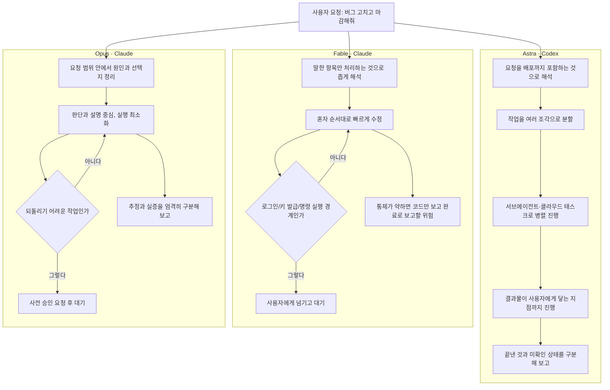
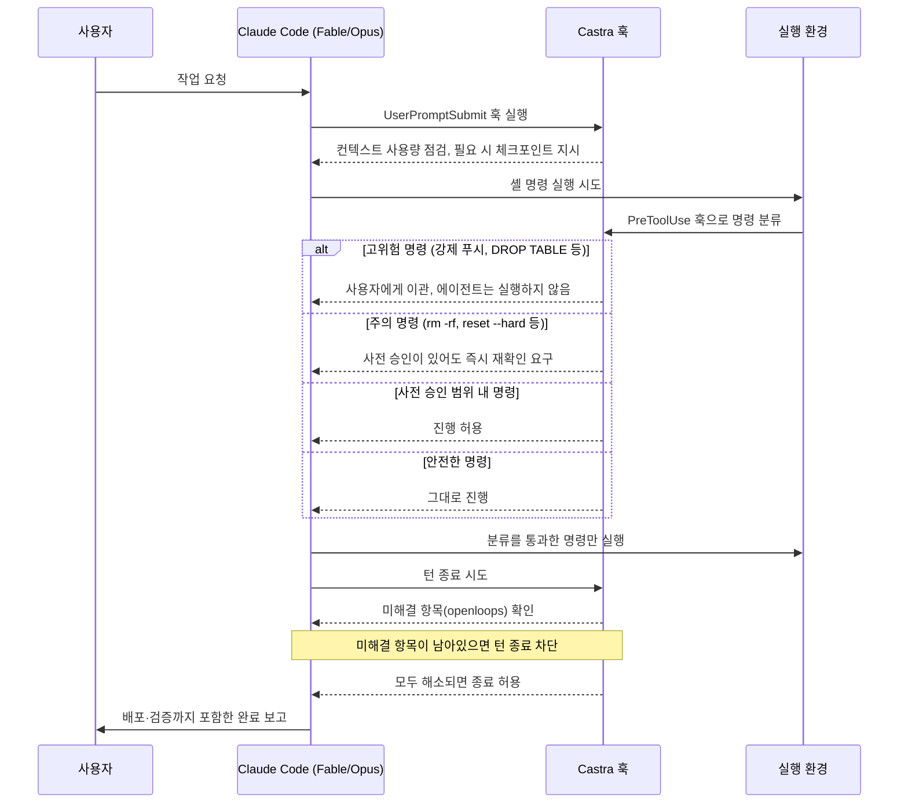

작성일: 2026년 9월 14일


```

아스트라 vs 페이블 5.1
비슷한 두뇌를 가지고도 왜 퍼포먼스 차이가 나냐면,

두 모델을 뜯어서 행동 패턴과 훅을 분석해보니
결정적으로 일하는 순서와 태도가 다르다.

아스트라는 넓게 잡고 끝까지 밀어붙이는 반면
페이블은 빠르게 고치지만 경계에서 멈춘다.

아스트라는 끝낸 것, 확인하지 않은 것을 정확히 나눈다
페이블은 코드만 보고 고쳤다고 말한다.

비슷한 두뇌를 가지고도 일하는 순서때문에
퍼포먼스가 안나오는 구조임.

결론은 일하는 순서와 훅을 교체하고
물리적으로 안되는 것들은 플러그인 달아서 보완해봄.

클로드를 아스트라처럼 일하게 한다는 뜻에서 'Castra'
나는 아무 하네스 없이 이거 하나만 쓰고 있는데

네이티브 아스트라만큼은 아니지만
네이티브 페이블 보다는 나음.

https://www.threads.com/share/_5EjQK7c0/

```

```
클로드 프로 2~3년 쓰다가 아스트라 대박이라길래 넘어가봄.

결론은 일주일 만에 다시 클로드 복귀함.

체감 토큰 소모량이 너무 심함.
공식 발표는 모르겠는데 페이블 대비 토큰 소모 속도가 체감상 훨씬 큼.

해지한 가장 큰 이유는 '알잘딱깔센'이 안 됨.
시킨 건 하는데 딱 거기까지만 잘함. 그 이상 융통성이 없음.

예를 들어 모션 그래픽 작업 시켜보면 내가 프롬프트로 적어준 거 외에는 창의성을 아예 안 씀.

결국 원하는 퀄리티 뽑으려면 내가 레퍼런스 다 찾아오고, 
거의 모션 그래픽 전문가 빙의해서 A to Z 다 떠먹여 줘야 됨. 일 시키다 피로감 이슈 터짐.

대충 의도만 툭 던져도 알아서 센스 있게 살 붙여주는 맛은 여전히 클로드가 잘하는 듯.

https://www.threads.com/share/BASHsoYRlh/

```

---
>
>**Q. Castra가 하네스가 맞긴 맞는거야?**
>
>네, 맞습니다. GitHub에 공개된 실제 프로젝트(beyondworks/castra)가 스스로를 "Claude Code를 위한 실행 자세(execution posture) 하네스"라고 명시적으로 소개하고 있습니다.
>
>다만 정확히 짚자면, 이건 모델을 새로 감싸는 독립된 실행 환경이라기보다는 **Claude Code 위에 얹는 가벼운 규칙·훅 모음**에 가깝습니다.
>
>- 규칙 팩(텍스트) 1개 + 훅(코드) 3개 + 스크립트 2개 정도로 구성
>- 모델 자체를 바꾸거나 더 똑똑하게 만들지 않음
>- Claude Code가 이미 갖고 있는 훅 시스템(UserPromptSubmit, PreToolUse, Stop)에 걸어서, "일을 끝까지 안 밀어붙이고 한 걸음 앞에서 멈추는" 지점 네 곳을 강제로 잡아주는 역할만 함
>
>그래서 "하네스"라는 표현 자체는 정확하지만, 뉘앙스로는 완전히 새로운 실행 계층이라기보다 **기존 Claude Code 하네스에 끼워 넣는 보강용 미들웨어**라고 보는 게 더 정확합니다. 개발자도 저장소 README에서 "이건 벤치마크로 효과를 측정한 게 아니라 규칙을 명문화한 것뿐"이라고 직접 한계를 밝혀두었습니다.
>


## 0. 이 문서의 목적과 자료 구성

이 문서는 두 종류의 자료를 바탕으로 작성했다.

1. 사용자가 업로드한 비교표 한 장. Astra(Codex), Fable(Claude), Opus(Claude) 세 에이전트를 "관점"이라는 축으로 나누어, 한 줄 요약부터 보완 방법까지 아홉 가지 항목을 나란히 적어 놓은 표다.
2. Threads에 올라온 게시물 두 건의 본문. 첫 번째는 "Castra"라는 이름의 작업 방식 교정 도구를 소개하는 글이고, 두 번째는 클로드 프로를 2~3년 써 온 사용자가 Astra로 옮겼다가 일주일 만에 다시 클로드로 돌아온 경험담이다. Threads는 로봇 배제 규칙(robots.txt)으로 외부에서 직접 열람할 수 없기 때문에, 이 문서는 사용자가 붙여넣은 원문 텍스트를 그대로의 근거로 삼았고, 이를 뒷받침하거나 반박할 수 있는 공개 자료를 별도로 찾아 대조했다.

아래 모든 서술에서 출처가 필요한 사실관계는 본문 중간에 각주 번호 [n]으로 표시했고, 문서 맨 끝의 "참고자료"에서 실제 URL을 확인할 수 있다. 추측이나 확인되지 않은 내용은 "~로 보인다", "~라는 보고가 있다" 같은 표현으로 명확히 구분했고, 9장의 4단계 사실관계 부록에서 신뢰도별로 다시 정리했다.

---

## 1. 배경: 세 이름이 각각 무엇을 가리키는가

비교표의 세 열은 "모델 이름"이자 동시에 "그 모델이 돌아가는 도구 이름"이기도 하다. 먼저 이 관계부터 짚고 넘어가는 게 표를 읽는 데 도움이 된다.

### 1.1 Astra (Codex) — OpenAI의 GPT-6 Astra와 Codex

GPT-6 Astra는 OpenAI가 2026년 9월 3일에 공개한 모델로, 회사 스스로 "지금까지 나온 모델 중 가장 지능적이고 정렬이 잘 된 모델"이라고 소개했다. 컴퓨터 사용, 브라우징, 소프트웨어 엔지니어링, 사이버보안, 과학, 전문 업무 전반에서 프런티어급 성능을 낸다고 밝혔고, FrontierMath Tier 4에서 98%, ARC-AGI-3에서 99.9%, ExploitBench에서 100%라는 수치를 공개했다[1][4]. 다만 이 발표 하루 뒤인 9월 4일부터 Business·Pro 요금제(월 100달러·200달러)로 점진 배포가 시작된 상태였고, 정식으로 모든 사용자에게 열린 것은 아니었다[4].

여기서 "Codex"는 Astra라는 모델이 실제로 코드를 다루는 데 사용되는 OpenAI의 개발자용 에이전트 제품 이름이다. 즉 표의 "Astra (Codex)"는 "Codex라는 도구 위에서 GPT-6 Astra 모델이 작동하는 방식"을 가리킨다고 보면 정확하다. Codex는 터미널(CLI), 데스크톱 앱, IDE 확장, 그리고 클라우드에서 격리된 컨테이너로 작업을 위임할 수 있는 "Codex Cloud" 기능을 함께 제공한다[6]. 클라우드로 위임된 작업은 GitHub·GitLab·Linear·Slack 등에서 시작할 수 있고, 여러 작업을 동시에 병렬로 돌릴 수 있으며, 하나의 컨테이너는 최대 12시간까지만 유지된다[6]. Codex는 또한 "서브에이전트"라는 위임 계층을 기본 지원해서, 하나의 메인 작업이 검증·테스트·조사 같은 하위 작업을 별도의 작업자에게 나눠 맡기고 결과를 취합하는 방식도 공식적으로 권장한다[7]. GPT-6 Astra는 이 문맥 보존 기능도 강화되어, 컨텍스트 창이 가득 차도 이전 대화 내용을 요약으로 뭉개지 않고 검색 가능한 형태로 남겨 둔다[1][4].

안전성 측면에서는 GPT-6 Astra가 OpenAI의 준비 프레임워크(Preparedness Framework) 기준으로 "치명적(Critical)" 수준의 사이버보안 역량에 처음 도달한 모델로 분류됐다는 점도 함께 밝혀졌다[2][4]. 내부 배포 시뮬레이션에서는 전작인 GPT-5.6 Sol 대비 고위험 정렬 이탈 플래그가 절반 수준으로 줄었다고 보고됐다[2].

### 1.2 Fable (Claude) — Anthropic의 Claude Fable 5.1

Fable은 Anthropic의 최상위 모델 계보 이름이다. 2026년 6월 9일 Claude Fable 5와 Claude Mythos 5가 함께 출시됐는데, 이 둘은 같은 기반 모델이고 Mythos 쪽이 안전장치가 약한 버전으로, 생명과학·사이버보안 등 제한된 신뢰 기관에만 제공되는 구조였다. 이후 2026년 9월 1일 Anthropic은 후속작인 Claude Fable 5.1과 Claude Mythos 5.1을 함께 출시했다[8][9]. 표의 "Fable (Claude)"은 이 최신 버전, 즉 Claude Fable 5.1을 가리키는 것으로 보는 것이 가장 합리적이다(다만 원본 게시글에는 정확한 하위 버전이 명시되어 있지 않다).

가격 구조가 독특한데, 입력 100만 토큰당 10달러, 출력 100만 토큰당 50달러라는 기본 요금은 이전 버전 Fable 5와 동일하게 유지됐지만, 캐시로 다시 읽는 토큰의 가격만 100만 토큰당 1달러에서 0.25달러로 75% 인하됐다[9][10]. Anthropic은 이 인하 효과가 코드베이스나 시스템 지시문처럼 같은 맥락을 반복해서 참조하는 에이전틱 작업에서 특히 크게 나타나, 복잡한 코딩 작업의 경우 비용을 최대 45%가량 줄일 수 있다고 추정했다(다만 이는 Anthropic 자체의 8월 4주간 사용량 측정치에 근거한 벤더 추정치이므로 그대로 보증된 수치는 아니다)[10]. Anthropic의 공식 문서는 Fable 5.1을 "일반적인 작업에는 Opus 5를 먼저 쓰고, Opus 5를 고효과 설정으로 써도 기준을 못 넘기는 고난도 추론·장기 에이전틱 작업에만 Fable 5.1로 올리라"는 식으로 포지셔닝하고 있다[14]. 즉 Fable은 처음부터 "기본값"이 아니라 "에스컬레이션용 최상위 모델"로 설계된 셈이다.

### 1.3 Opus (Claude) — Anthropic의 Claude Opus 5

Claude Opus 5는 2026년 7월 24일 출시된 모델로, "Fable 5의 프런티어 지능에 근접하면서 가격은 절반"이라는 포지셔닝으로 소개됐다. 가격은 입력 100만 토큰당 5달러, 출력 100만 토큰당 25달러이고, 100만 토큰 컨텍스트 창을 지원한다[13][24]. 이 문서를 작성하는 시점(2026년 9월 14일) 기준으로 Anthropic이 공식 문서에 올려 둔 현재 모델 라인업은 Fable 5.1, Opus 5, Sonnet 5, Haiku 4.5이며, "Opus 5.1"이라는 이름의 모델은 공식적으로 발표되지 않았다. 이 부분은 뒤에서 다시 다룬다(9장 참고).

### 1.4 세 이름을 한 줄로 정리하면

| 표기 | 회사 | 모델 | 실행 도구 | 최신 공개일 |
|---|---|---|---|---|
| Astra (Codex) | OpenAI | GPT-6 Astra | Codex (CLI·데스크톱·클라우드) | 2026-09-03 |
| Fable (Claude) | Anthropic | Claude Fable 5.1 | Claude Code 등 | 2026-09-01 |
| Opus (Claude) | Anthropic | Claude Opus 5 | Claude Code 등 | 2026-07-24 |

세 모델 모두 2026년 여름~가을 사이 두 달 안에 나온, 사실상 동시대 최신 세대라는 점이 눈에 띈다. 특히 Fable 5.1과 GPT-6 Astra는 이틀 차이로 연달아 출시됐다[18].

---

## 2. 세 모델의 벤치마크상 위치

비교표는 "일하는 태도"를 다루지만, 그 밑바탕이 되는 원시 성능 차이도 함께 봐야 표를 오독하지 않는다. 여러 매체와 Anthropic·OpenAI 공식 자료, 그리고 독립 평가기관인 Artificial Analysis의 수치를 모아 보면 다음과 같다.

| 벤치마크 | Astra (GPT-6) | Fable 5.1 | Opus 5 | GPT-5.6 Sol |
|---|---|---|---|---|
| Terminal-Bench 4.0 (터미널 에이전트 작업) | 57.7%[14] | 55.8%[10][14] | 52.3%[14] | 37.3%[10] |
| DeepSWE v1.1 (에이전틱 코딩) | 74.1%[14][19] | 67.4%[16] | 73.7%[14] | 72.7%[19] |
| FrontierMath Tier 4 v2 (고난도 수학) | 97.6%[14][15] | 87.8%[14][15] | 73.2%[14] | — |
| AutomationBench (사무 자동화) | 41.4%[15][17] | 31.4%[15][17] | 26.9%[17] | 18.1%[15] |
| Humanity's Last Exam (도구 사용) | 57.2%[15] | 65.0%[15][16] | 63.6%[15] | — |
| Artificial Analysis 코딩 에이전트 지수 | 62[16][20] | 62(동률)[16][20] | 60[20] | 55[20] |

몇 가지 해석 포인트가 있다.

첫째, 터미널 작업처럼 "길고 지저분한 다단계 작업에서 도구를 계속 갈아 끼우며 오류를 스스로 복구하는" 유형의 벤치마크에서는 Astra가 가장 앞선다[19]. 이건 표의 "진행 방식"·"맡기기 좋은 일" 항목에서 Astra가 "여러 작업자에게 나눠 동시에 진행"하고 "발행까지 이어지는 작업"에 강하다고 적은 것과 방향이 일치한다.

둘째, 일반 코딩 벤치마크(DeepSWE, FrontierCode)에서는 세 모델의 격차가 매우 좁다. Artificial Analysis의 독립 집계에서는 Codex 위의 Astra와 Claude Code 위의 Fable 5.1이 코딩 에이전트 지수에서 동률(62점)을 기록했고, Opus 5가 근소하게 뒤처지는 구도다[16][20]. 다만 이 지수는 서로 다른 하네스(Codex vs Claude Code)에서 측정된 값이라, 점수 차이 중 일부는 모델이 아니라 스캐폴딩(하네스) 차이에서 왔을 가능성이 있다는 단서가 함께 달려 있다[16].

셋째, 비용 효율성 측면에서는 Astra가 뚜렷하게 앞선다. Artificial Analysis는 Astra가 같은 작업을 처리할 때 Codex 안에서 최고 강도(max effort)로 돌린 GPT-5.6 Sol 대비 약 3분의 1의 토큰만 쓰고, Claude Code 안에서 xhigh 강도로 돌린 Claude Opus 5 대비로는 약 5분의 1의 토큰만 쓴다고 측정했다[16]. 이 대목은 뒤에서 살펴볼 두 번째 Threads 게시물의 "토큰 소모가 체감상 훨씬 크다"는 주장과 정면으로 배치되는 지점이라, 6장에서 따로 다룬다.

넷째, 안전성·정렬 지표에서는 Astra가 간접 프롬프트 인젝션 방어 벤치마크(Gray Swan IPI Arena)에서 15회 시도 기준 공격 성공률 8.5%를 기록해, 전작 GPT-5.6 Sol의 27.0%보다 크게 개선됐다고 보고됐다[2]. 동시에 사이버보안 위험도 자체는 "치명적" 등급으로 분류될 만큼 높아졌다는 점도 함께 명시됐다[2][4].

---

## 3. 원본 비교표, 항목별 서술형 해설

여기서부터는 업로드된 표의 아홉 개 행을 하나씩 풀어서 설명한다. 표의 원문 표현을 그대로 옮기되, 왜 그런 차이가 나는지는 1~2장에서 확인한 배경 지식으로 보강했다.

### 3.1 한 줄 요약

표는 Astra를 "넓게 잡고 끝까지 밀어붙인다", Fable을 "빠르게 고치지만 경계에서 멈춘다", Opus를 "신중하게 따지고 승인을 기다린다"로 요약한다. 이 세 문장은 사실 같은 축(개입 범위와 속도) 위에서 세 지점을 짚고 있다고 읽을 수 있다. Astra는 범위를 넓게, 끝까지, Fable은 범위를 좁게, 빠르게, Opus는 범위를 좁게, 천천히. Codex가 클라우드 컨테이너에서 배포·설치까지 마치고 검증 결과를 들고 돌아오는 위임형 워크플로를 기본으로 지원한다는 점[6][7]과, Claude 계열이 위험한 셸 명령이나 되돌리기 어려운 작업 앞에서 사용자 확인을 구하는 방향으로 설계되어 있다는 점이 이 요약과 맞아떨어진다.

### 3.2 요청 범위 해석

Astra는 "마감해줘" 같은 표현을 발행(배포)까지 포함하는 것으로 넓게 해석한다고 되어 있다. 이는 Codex Cloud가 "위임하고 다른 일을 하라(delegate and stay in flow)"는 마케팅 문구대로, 작업을 통째로 맡기는 사용 패턴을 전제로 설계되었다는 점[6]과 통한다. 반면 Fable은 사용자가 말한 항목만 처리하고, 빠진 부분은 사용자가 다시 짚어야 한다고 되어 있다. Opus는 그 중간으로, 요청 범위 안에서 원인과 선택지를 정리하는 데 집중한다.

### 3.3 진행 방식

Astra는 여러 작업자에게 나눠 동시에 진행한다. 이는 앞서 살�펴본 Codex의 서브에이전트·병렬 클라우드 태스크 기능과 정확히 일치하는 설명이다. 개발자 문서에서도 "독립적으로 병렬 실행이 가능한 작업으로 쪼개고, 각 작업자에게 서로 다른 파일을 맡기라"는 식의 공식 가이드가 제공된다[7]. Fable은 혼자 순서대로 빠르게 진행하고, Opus는 판단과 설명이 중심이고 실행은 상대적으로 적다.

### 3.4 멈추는 지점

이 항목이 세 모델의 위험 관리 철학 차이를 가장 잘 보여준다. Astra는 결과물이 사용자에게 닿는 지점, 즉 발행·설치가 확인되는 순간까지 간다. Fable은 로그인, 키 발급, 명령 실행처럼 경계가 뚜렷한 지점에서 사용자에게 넘긴다. Opus는 되돌리기 어려운 작업 직전에 미리 승인을 요청한다. 뒤에서 다룰 "Castra" 도구가 정확히 겨냥하는 지점이 바로 이 "Fable이 멈추는 지점"이라, 3.4는 5장과 바로 연결된다.

### 3.5 보고 방식

Astra는 끝낸 일과 "미확인" 상태인 일을 나눠 적는다. Opus는 "추정"과 "실증"을 가장 엄격하게 구분한다. 반면 Fable은 제대로 통제하지 않으면 코드만 보고 "고쳤다"고 말해버릴 위험이 있다고 지적한다. 이는 뒤에서 소개할 Castra 프로젝트가 README에서 직접 예로 드는 실패 패턴과 거의 같다: 원인 진단은 맞지만 그 수정이 실제 운영 환경에 반영됐는지, 테스트가 진짜 버그가 있는 상태에서 실패했다가 통과한 것인지 확인하지 않은 채 "완료"라고 보고하는 패턴이다[20].

### 3.6 대표적인 실패

Astra의 대표 실패는 자원을 많이 써서 한도에 걸려 중간에 끊기거나, 범위가 지나치게 불어나는 것이다. 넓게 해석하고 끝까지 밀어붙이는 성향의 반대급부다. Fable의 대표 실패는 첫 가설에 매몰되거나, 할 수 있는 일도 사용자에게 떠넘기는 것이다. Opus의 대표 실패는 진행이 느려지고, "그래서 고친 거냐"는 되물음을 계속 유발하는 것이다. 세 실패 패턴 모두 3.1의 한 줄 요약이 그대로 부메랑처럼 돌아오는 구조라는 점이 흥미롭다.

### 3.7 사용자 부담

Astra를 쓸 때 사용자 부담은 방향 제시와 새 요청 수준으로 가볍다는 평가다. Fable은 교정과 "직접 해봐" 요청을 반복해야 해서 무겁다. Opus는 승인·확인 질문에 계속 답해야 하는 중간 수준의 부담이 있다. 이 평가는 아래 6장에서 다룰 두 번째 Threads 게시물의 체감(Astra가 오히려 사용자에게 더 많은 것을 떠넘긴다는 불만)과 다소 상충하는 지점이 있어, 두 자료를 같이 읽을 때 긴장이 생긴다.

### 3.8 맡기기 좋은 일

Astra에는 여러 부분에 걸친 기능 구현, 제품 마감, 발행까지 이어지는 작업을 맡기기 좋다고 되어 있다. Fable에는 사용자가 곁에서 지켜보는 짧은 버그 수정, 빠른 반복 작업이 맞다. Opus에는 원인 진단, 라이브 서비스 반영처럼 위험한 변경, 설계 검토가 맞다.

### 3.9 보완 방법

Astra 쪽 보완책은 범위와 예산에 상한을 두고, 작업이 끊기더라도 이어받을 수 있는 체크포인트를 남기게 하는 것이다. Opus 쪽은 사전 승인 범위를 넓게 주고, 결론과 완료 여부를 먼저 말하게 하는 것이다. Fable 쪽 보완책이 특히 구체적인데, "관찰 후 수정", "경계도 가능한 수단으로 직접 처리"를 계약(지시문·규칙) 수준으로 못 박아 두는 방식이고, 괄호 안에 "Castra 적용 뒤 교정이 줄었음"이라는 메모가 달려 있다. 이 메모가 다음 장에서 다룰 실제 오픈소스 도구를 가리키고 있다.

---

## 4. 작업 흐름을 그림으로 보면

세 모델이 같은 "버그 수정 후 배포" 요청을 받았을 때 어떻게 갈라지는지를 순서도로 정리하면 다음과 같다. 3장에서 서술한 아홉 개 항목의 논리를 하나의 흐름으로 압축한 것이다.



이 그림에서 알 수 있듯, 세 모델의 차이는 "능력"보다는 "언제 멈추고, 멈춘 뒤 누구에게 공을 넘기는가"에 있다. 2장의 벤치마크 표가 보여주듯 세 모델의 원시 코딩 성능 자체는 종이 한 장 차이에 가깝고, 실제로 사용자가 체감하는 차이는 이 흐름도의 분기점, 즉 하네스와 기본 태도 쪽에서 훨씬 크게 벌어진다.

---

## 5. 첫 번째 게시물 분석: "Castra"란 무엇인가

### 5.1 게시물이 말하는 내용

첫 번째 Threads 게시물은 Astra와 Fable(Claude) 두 모델의 행동 패턴과 훅(hook)을 분석해 보니, 비슷한 두뇌를 가지고도 일하는 순서와 태도가 달라 성능 차이가 난다는 주장을 담고 있다. 글쓴이는 일하는 순서와 훅을 교체하고, 물리적으로 안 되는 부분은 플러그인으로 보완하는 방식을 시도했고, 그 결과물에 "클로드를 아스트라처럼 일하게 한다"는 뜻에서 "Castra"라는 이름을 붙였다고 밝혔다. 네이티브 Astra만큼은 아니지만 네이티브 Fable보다는 낫다는 평가도 덧붙였다.

### 5.2 실제로 존재하는 도구인가

검색 결과, "Castra"라는 이름의 오픈소스 프로젝트가 GitHub에 실제로 공개되어 있는 것을 확인했다[20]. 이 프로젝트는 정확히 게시물의 설명과 일치하는 성격을 갖고 있다. 공식 소개 문구를 그대로 풀어 쓰면, "코딩 에이전트는 한 걸음을 남겨두고 멈춘다. Castra는 그 한 걸음이다"라는 컨셉으로, Claude Code 전용의 "실행 자세(execution posture) 하네스"를 표방한다[20]. 이 프로젝트가 첫 번째 게시물이 말하는 Castra와 동일한 것인지 100% 확정할 수는 없지만(사람 이름·조직이 게시물에 명시되어 있지 않음), 이름·목적·대상 도구(Claude Code)·핵심 컨셉이 정확히 일치하므로, 적어도 게시물이 가리키는 실체가 실제로 존재한다는 점은 공개 저장소로 교차 확인된다.

### 5.3 무엇을 어떻게 하는 도구인가

GitHub 저장소의 설명에 따르면 Castra는 모델 자체를 더 똑똑하게 만드는 도구가 아니라, 능력 있는 모델이 일을 마무리 짓지 못하고 슬쩍 멈춰버리는 네 지점을 없애는 규칙과 후킹(hooking) 모음이다[20]. 저장소가 예로 드는 전형적인 실패 패턴은 3.5·3.9에서 살펴본 Fable 행의 서술과 거의 동일하다: 원인 진단은 정확하게 해놓고, "이건 서버에 배포되면 적용됩니다"라는 식으로 마지막 한 걸음을 남의 일로 돌려버리는 패턴이다[20].

구성은 크게 네 가지다.

1. **자세 팩(정적 규칙)**: 27개 항목으로 구성된 텍스트 규칙 모음으로, 모든 작업에 매번 로드된다. "부탁드려요" 같은 요청형 표현도 작업 수행에 대한 승인으로 간주하라, 기능이 없어 보인다고 바로 포기하지 말고 실제로 존재하는지 먼저 확인하라, "테스트 통과"라는 주장은 그 자체로 검증 대상이니 감사하라는 식의 원칙들이 담겨 있다[20]. 다만 이 규칙 팩은 안전 기준 자체를 낮추지는 않는다고 명시되어 있다. 파괴적인 작업은 여전히 확인을 거쳐야 하고, 별도의 비공개 규칙(시크릿 룰)도 그대로 우선한다고 밝히고 있다[20].
2. **예산 훅**: 사용자 프롬프트가 들어올 때마다 실제 컨텍스트 창 사용량을 확인해서, 일정 수준을 넘으면 큰 작업 전에 체크포인트를 남기라고 알려주고, 위험 수준을 넘으면 아예 새 창에서 이어가도록 유도하는 훅이다[20].
3. **가디언 훅**: 셸 명령을 실행하기 직전에 가로채서 네 단계(사용자에게 이관/즉시 확인/사전 승인 범위 내 진행/그대로 진행)로 분류한다. 강제 푸시, 히스토리 재작성, 데이터베이스 테이블 삭제, 디스크 포맷, 환경변수 파일 읽기 같은 명령은 사용자에게 이관하고, 재귀적 삭제나 강제 리셋 같은 명령은 사전 승인이 있어도 매번 즉시 확인을 요구한다[20].
4. **오픈루프 훅**: 턴이 끝나려는 시점에 아직 해결되지 않은 항목이 남아 있으면 턴 종료 자체를 막는 훅이다[20].

### 5.4 작동 흐름

위 네 가지 훅이 어떤 순서로 개입하는지를 그림으로 정리하면 다음과 같다.



### 5.5 저장소가 스스로 밝히는 한계

저장소의 "이것은 아닙니다" 섹션도 짚어둘 필요가 있다. 개발자 스스로 이 도구가 벤치마크로 효과를 측정한 결과물이 아니라 규칙을 명문화한 것일 뿐이며, 탈옥(jailbreak)이나 안전장치 우회가 아니라 오히려 확인 절차를 하나 더 추가하는 도구이고, 모델 자체를 바꾸는 마법이 아니라 순수한 영어 규칙과 300줄 안팎의 파이썬·셸 코드로 이루어져 있다고 명시한다[20]. 즉 게시물의 "네이티브 Astra만큼은 아니다"라는 표현과, 저장소의 "효과 크기는 측정되지 않았다"는 고지가 서로 어긋나지 않는다. 이 도구는 성능을 새로 만들어내는 게 아니라, Fable/Opus가 이미 갖고 있는 능력 중 "멈추는 습관" 때문에 발휘되지 못하던 부분을 풀어주는 역할에 가깝다고 이해하는 게 정확하다.

---

## 6. 두 번째 게시물 분석: 체감 후기와 벤치마크 데이터의 간극

### 6.1 게시물이 말하는 내용

두 번째 게시물은 클로드 프로를 2~3년 써 온 사용자가 Astra로 넘어갔다가 일주일 만에 다시 클로드로 돌아왔다는 경험담이다. 두 가지 이유를 든다. 첫째, 공식 발표와 무관하게 체감상 토큰 소모 속도가 Fable 대비 훨씬 크다는 것. 둘째, 해지를 결정한 더 큰 이유로, 시킨 일은 정확히 하지만 그 이상의 융통성이 없다는 것이다. 모션 그래픽 작업을 예로 들며, 프롬프트에 적어주지 않은 부분에는 창의성을 전혀 쓰지 않아서 결국 레퍼런스를 사용자가 다 찾아다 줘야 했다는 경험을 전한다. 반대로 의도만 던져도 알아서 센스 있게 살을 붙여주는 점은 여전히 클로드가 낫다고 평가한다.

### 6.2 토큰 소모 체감 — 벤치마크와 배치되는 지점

이 주장은 2장에서 정리한 독립 벤치마크 결과와 정면으로 부딪힌다. Artificial Analysis의 측정에 따르면 Astra는 오히려 같은 작업을 Codex 안에서 Sol 대비 약 3분의 1, Claude Code 안의 Opus 5(xhigh) 대비 약 5분의 1의 토큰만으로 해결한다고 보고됐다[16]. 즉 공개된 집계 데이터만 놓고 보면 Astra가 Fable/Opus보다 토큰을 더 아껴 쓰는 쪽에 가깝다.

이 모순을 어떻게 이해해야 할까. 몇 가지 가능한 설명을 나열하되, 어느 쪽도 확정된 사실은 아니라는 점을 먼저 밝혀둔다.

- **작업 유형 차이**: 벤치마크는 대부분 코딩·터미널·수학 과제로 구성되어 있고, 게시물이 예로 든 모션 그래픽 같은 창작 작업은 어느 벤치마크에도 포함되어 있지 않다. 창작형 작업에서는 토큰 소모 패턴이 코딩 작업과 다르게 나타날 가능성이 있다.
- **비교 대상의 차이**: 벤치마크 수치는 특정 강도(Sol의 max effort, Opus 5의 xhigh)로 고정한 상태에서 측정됐다[16]. 실제 사용자가 평소 쓰는 기본 설정은 이런 최고 강도가 아닐 수 있어, 같은 "Astra 대 Claude" 비교라도 조건이 다를 수 있다.
- **체감과 실측의 괴리**: 구독형 요금제에서는 실제 토큰 수보다 "사용량이 얼마나 빨리 줄어드는가"라는 크레딧 소진 체감이 사용자 인식을 좌우하기 쉽다. Codex는 ChatGPT의 5시간 단위 공유 사용량 한도 안에서 로컬·클라우드 작업이 함께 소진되는 구조라[5][6], 클라우드 위임 작업이 늘어나면 체감 소진 속도가 빨라졌을 가능성도 배제할 수 없다.

결론적으로, 이 항목은 "복수 매체가 교차 검증한 벤치마크 수치"와 "한 명의 사용자가 남긴 단일 체감 후기"가 서로 다른 방향을 가리키는 사례로 보는 것이 정확하다. 어느 한쪽이 틀렸다고 단정할 근거는 없다.

### 6.3 창의적 유연성 — 부분적으로 뒷받침되는 지점

두 번째 주장, 즉 Astra가 지시받지 않은 부분에는 창의성을 더하지 않는다는 체감은 OpenAI 자신의 공식 발표 문구와 방향이 겹치는 구석이 있다. OpenAI는 GPT-6 Astra의 강점 중 하나로 "회사의 톤, 템플릿, 디자인 기준을 더 잘 따라서, 첫 결과물이 팀이 바로 쓸 수 있는 수준에 더 가깝다"는 점을 들었다[8]. 이는 뒤집어 보면 "주어진 기준을 정확히 따르는 데 최적화되어 있다"는 뜻이고, 사용자가 기준 자체를 주지 않았을 때는 알아서 판단해 채워 넣는 폭이 상대적으로 좁을 수 있다는 해석과 자연스럽게 연결된다. 안전성 지표에서도 Astra는 정렬 이탈(스스로 판단해서 지시를 벗어나는 행동)이 전작보다 줄었다고 보고됐는데[2], 이 역시 "시킨 범위를 벗어나지 않는" 성향과 같은 방향을 가리킨다. 다만 이건 어디까지나 방향이 겹친다는 정황이지, 모션 그래픽 작업에 대한 직접적인 벤치마크나 다수 사용자의 교차 검증된 보고가 있는 것은 아니므로, 확정된 사실이 아니라 하나의 그럴듯한 설명으로만 받아들이는 게 맞다.

### 6.4 사용자 부담 항목과의 교차 검토

흥미로운 지점은, 원본 비교표의 3.7("사용자 부담") 행이 Astra를 "방향 제시와 새 요청 정도로 가볍다"고 적어둔 것과, 두 번째 게시물이 "레퍼런스를 다 찾아오고 전문가 빙의해서 A to Z 떠먹여 줘야 한다"고 적은 것이 서로 반대 방향을 가리킨다는 점이다. 둘 다 Astra(Codex)를 대상으로 한 서술인데도 부담의 방향이 갈린다. 가장 그럴듯한 설명은 작업 종류의 차이다. 비교표는 코딩·에이전틱 작업을 염두에 둔 서술로 보이고, 두 번째 게시물은 모션 그래픽이라는 비(非)코딩 창작 작업을 다루고 있다. 즉 두 자료가 모순된다기보다는, "Astra가 잘하는 영역"과 "Astra가 아직 약한 영역"을 각각 가리키고 있을 가능성이 크다.

---

## 7. 종합: 판단 레이어와 실행 레이어로 다시 보기

세 모델의 차이를 "판단 레이어(문제 정의, 원인 규명, 선택지 비교, 승인)"와 "실행 레이어(코드 작성, 명령 실행, 배포, 반복 수정)"로 나눠서 보면 표 전체가 한 줄로 꿰어진다.

- **Astra(Codex)** 는 실행 레이어를 최대한 넓게 흡수하려는 쪽에 가깝다. 병렬 작업자, 클라우드 컨테이너, 배포까지 이어지는 완결형 워크플로가 이를 뒷받침한다. 그 대가로 판단 레이어의 개입 지점(멈춰서 사용자에게 확인받는 지점)이 상대적으로 뒤로 밀려 있고, 그래서 "자원 한도 초과"나 "범위 확대" 같은 실패가 대표적으로 나타난다.
- **Opus(Claude)** 는 반대로 판단 레이어를 두껍게 유지한다. 되돌리기 어려운 작업 앞에서 미리 승인을 구하고, 추정과 실증을 엄격히 구분해 보고하는 습관 자체가 판단 레이어의 산출물이다. 그 대가로 실행 속도가 느려지고, 사용자가 승인 질문에 계속 답해야 하는 부담이 생긴다.
- **Fable(Claude)** 는 실행은 빠르지만 판단 레이어와 실행 레이어 사이의 "경계 처리"가 아직 다듬어지지 않은 상태로 보인다. 로그인·키 발급·명령 실행 같은 명확한 경계에서는 깔끔하게 사용자에게 넘기지만, 그 경계가 명확하지 않은 애매한 지점(배포 여부 확인, 테스트가 진짜로 버그 상태에서 실패했는지 확인 등)에서는 스스로 "완료"라고 판단해버리는 실패가 나타난다. Castra 같은 하네스가 하는 일이 정확히 이 애매한 경계를 명시적인 규칙과 훅으로 대신 그어주는 것이다.

이 구도에서 Castra 프로젝트는 "모델의 판단력을 높이는 도구"가 아니라 "실행 레이어의 마지막 한 걸음을 판단 레이어의 몫으로 남겨두지 않도록, 그 경계를 코드로 대신 그어주는 도구"라고 정리할 수 있다. 모델 자체를 재훈련하는 게 아니라, 하네스 쪽에서 경계를 명시적으로 코드화한다는 점에서, 최근 프런티어 모델들이 하네스 기능을 점점 흡수해 가는 큰 흐름과는 결이 조금 다르다. Castra는 "모델이 하네스를 흡수하기 전까지, 그 빈틈을 외부 규칙으로 메우는" 성격의 도구에 가깝다.

---

## 8. 한영 용어 대조표

| 한국어 | 영어 | 설명 |
|---|---|---|
| 하네스 | harness | 모델을 감싸는 실행 환경·규칙·도구 모음 |
| 훅 | hook | 특정 시점(프롬프트 입력, 명령 실행 전, 턴 종료 등)에 자동으로 개입하는 코드 |
| 오케스트레이션 | orchestration | 여러 에이전트·작업을 조율하는 상위 계층 |
| 에이전틱 | agentic | 스스로 계획을 세우고 도구를 사용해 작업을 수행하는 성질 |
| 컨텍스트 윈도우 | context window | 모델이 한 번에 참조할 수 있는 입력 범위 |
| 체크포인트 | checkpoint | 작업 상태를 기록해 이후 세션에서 이어받을 수 있게 하는 지점 |
| 오픈 루프 | open loop | 아직 검증·마무리되지 않은 미해결 작업 항목 |
| 서브에이전트 | subagent | 메인 작업이 위임하는 하위 작업 처리 단위 |
| 클라우드 태스크 | cloud task | 로컬이 아닌 원격 컨테이너에서 실행되는 위임 작업 |
| 프런티어 모델 | frontier model | 해당 시점 최고 수준 성능의 모델 |
| 리즈닝 이펙트 | reasoning effort | 추론에 투입하는 연산 강도 설정값 |
| 폴백 | fallback | 특정 조건에서 다른 모델·경로로 전환하는 동작 |
| 세이프가드 | safeguard | 모델의 출력을 제한하는 안전장치 |
| 실행 자세 | execution posture | 모델이 작업을 얼마나 끝까지 밀어붙이는지에 대한 태도 값 |
| 정렬 이탈 | misalignment | 모델이 의도된 지시·제약을 벗어나는 행동 |

---

## 9. 사실관계 확인 부록 (4단계 신뢰도)

**1급 · 공식 1차 소스**
- OpenAI 공식 발표·시스템 카드: GPT-6 Astra 출시일(2026-09-03), 벤치마크 수치, 사이버보안 위험 등급, Codex 기능 설명[1][2][3][4][5]
- Anthropic 공식 문서: Claude Fable 5.1 출시일(2026-09-01), 현재 공식 모델 라인업(Fable 5.1, Opus 5, Sonnet 5, Haiku 4.5)[8]
- GitHub 공식 저장소: Castra 프로젝트의 실제 존재, 구성 요소, 작동 방식, 개발자가 스스로 밝힌 한계[20]

**2급 · 복수 매체 교차 검증**
- Terminal-Bench 4.0, DeepSWE, FrontierMath 등 벤치마크 수치는 VentureBeat, Officechai, Vellum, DataCamp, NextBigFuture, MindStudio, CodingFleet, Artificial Analysis 등 다수 매체에서 유사한 값으로 반복 보도됨[9][10][12][14][15][16][17][18][19]. 다만 매체마다 소수점 단위로 수치가 미세하게 다르게 인용되는 경우가 있어(예: Terminal-Bench에서 Astra를 57.7%로 적은 곳과 58.2%로 적은 곳이 공존), 정확한 소수점보다는 순위와 대략적인 격차를 신뢰하는 것이 안전하다.
- Codex의 병렬 작업·서브에이전트·클라우드 태스크 기능은 OpenAI 고객센터 문서와 개발자 가이드 여러 곳에서 일관되게 설명됨[5][6][7].

**3급 · 단일 소스 (추가 검증 필요)**
- Threads 게시물 두 건의 원문 전체는 Threads가 robots.txt로 외부 접근을 차단하고 있어 이 문서 작성 시점에 직접 재확인할 수 없었다. 이 문서는 사용자가 제공한 텍스트를 그대로의 출처로 삼았으며, 게시물 작성자의 신원이나 실제 Castra 프로젝트와의 연관성은 별도로 확인되지 않았다.
- 두 번째 게시물의 "체감 토큰 소모량" 주장과 "모션 그래픽 창의성 부족" 주장은 한 사용자의 개인 경험담으로, 다수 사용자가 동일하게 보고한 정황은 확인하지 못했다.
- "Claude Opus 5.1"의 존재 여부는 이 문서 작성 시점 기준으로 출처마다 엇갈린다. 일부 매체는 2026년 9월 1일 출시된 것처럼 구체적인 벤치마크까지 붙여 보도했지만[42], 비슷한 시기의 다른 매체들은 같은 날짜 기준으로 Anthropic이 공식 발표한 적이 없고 "marshmallow"라는 코드네임의 조기 접근 유출 정황만 있다고 보도했다[21][22][23]. Anthropic의 공식 문서에 현재 등재된 모델명에도 Opus 5.1은 없다. 따라서 이 문서에서는 Opus 5.1 관련 보도를 미확인 상태로 분류하고, 표의 "Opus (Claude)"는 공식적으로 확인되는 Claude Opus 5를 가리키는 것으로 처리했다.

**4급 · 분석적 종합 (필자의 해석)**
- 7장의 "판단 레이어·실행 레이어" 틀로 세 모델의 행동 패턴을 재구성한 부분은 표와 벤치마크 데이터를 근거로 한 해석이며, Anthropic·OpenAI가 공식적으로 사용하는 분류 체계는 아니다.
- 6장에서 제시한 "토큰 소모 체감과 실측 데이터가 왜 어긋나는가"에 대한 세 가지 설명(작업 유형 차이, 비교 조건 차이, 체감과 실측의 괴리)은 확인된 사실이 아니라 가능성 있는 해석이다.

---

## 10. 참고자료

[1] OpenAI, "GPT-6 Astra: A new generation of intelligence," https://openai.com/index/gpt-6-astra/

[2] OpenAI Deployment Safety, "GPT-6 Astra System Card," https://deploymentsafety.openai.com/gpt-6-astra

[3] Codex Knowledge Base, "GPT-6 Astra Arrives: Configuring OpenAI's Most Capable Model in Codex CLI," https://codex.danielvaughan.com/2026/09/03/gpt-6-astra-codex-cli-configuration-context-notes-safety/

[4] 9to5Mac, "OpenAI releasing major upgrade to ChatGPT and Codex with GPT-6 Astra, details here," https://9to5mac.com/2026/09/04/openai-releasing-major-upgrade-to-chatgpt-and-codex-with-gpt-6-astra-details-here/

[5] OpenAI Help Center, "Using Codex with your ChatGPT plan," https://help.openai.com/en/articles/11369540-using-codex-with-your-chatgpt-plan

[6] Agent37, "Codex Cloud (2026): How It Works, Limits, Always-On Options," https://www.agent37.com/blog/codex-cloud

[7] Developer Toolkit, "Orchestrating Multiple Parallel Agents," https://developertoolkit.ai/en/codex/productivity-patterns/multi-agent-workflows/

[8] OpenAI, "GPT-6 Astra: The next generation in intelligence for work," https://openai.com/index/gpt-6-astra-next-generation-work/

[9] VentureBeat, "Anthropic's Claude Fable 5.1 and Mythos 5.1 arrive with a 75% cost reduction for Fable cache reads," https://venturebeat.com/technology/anthropics-claude-fable-5-1-and-mythos-5-1-arrive-with-a-75-cost-reduction-for-fable-cache-reads

[10] Emergent, "Claude Fable 5.1 Release Date: What We Know So Far," https://emergent.sh/news/claude-fable-5-1-release-date

[11] Get Claude Skills, "Claude Fable 5.1 Explained: What's New (2026)," https://www.getclaudeskills.com/blog/claude-fable-5-1-explained

[12] Artificial Analysis, "Benchmarking GPT-6 Astra," https://artificialanalysis.ai/articles/benchmarking-gpt-6-astra

[13] CometAPI, "Claude Opus 5.1 Is Coming Soon: What Developers Should Expect" (Opus 5 관련 배경 설명 포함), https://www.cometapi.com/claude-opus-5-1/

[14] Officechai, "These Are The Official OpenAI GPT-6 Astra Benchmarks," https://officechai.com/ai/gpt-6-astra-benchmarks/

[15] Vellum, "GPT-6 Astra Benchmarks Explained," https://www.vellum.ai/blog/gpt-6-astra-benchmarks-explained

[16] DataCamp, "GPT-6 Astra vs Claude Fable 5.1: Benchmarks and Pricing," https://www.datacamp.com/blog/gpt-6-astra-vs-claude-fable-5-1

[17] NextBigFuture, "OpenAI GPT 6 Astra Limited Release that Beats Anthropic Fable 5.1 on Benchmarks," https://www.nextbigfuture.com/2026/09/openai-gpt-6-astra-limited-release-that-beats-anthropic-fable-5-1-on-benchmarks.html

[18] CodingFleet, "GPT-6 Astra vs Claude Fable 5.1: Benchmarks, Pricing & Verdict (2026)," https://codingfleet.com/blog/gpt-6-astra-vs-claude-fable-5-1/

[19] MindStudio, "GPT-6 Astra Benchmarks: Is It Really Better Than Fable 5.1?," https://www.mindstudio.ai/blog/gpt-6-astra-benchmarks-analysis

[20] GitHub, beyondworks/castra, "Execution posture harness for Claude Code," https://github.com/beyondworks/castra

[21] CellCog, "Claude Opus 5.1 and Sonnet 5.1: Release Date, Leaks, and What We Actually Know," https://cellcog.ai/blog/claude-opus-5-1-release-date/

[22] OrcaRouter, "Claude Fable 5.1 & Opus 5.1: Bedrock 404 hints at staging," https://www.orcarouter.ai/blog/claude-fable-5-1-opus-5-1-delay-leak

[23] Kie.ai, "What Is Claude Opus 5.1? 3D Generation," https://kie.ai/blog/what-is-claude-opus-5-1

[42] MindStudio, "Claude Opus 5.1 Benchmark Review: Coding Scores and Real Costs" (다른 매체와 상충되는 미확인 보도), https://www.mindstudio.ai/blog/claude-opus-5-1-benchmark-review

**원 게시물 (사용자 제공, 직접 재접근 불가)**
- Threads 게시물 1 (Castra 소개): https://www.threads.com/share/_5EjQK7c0/
- Threads 게시물 2 (Astra 사용 후기): https://www.threads.com/share/BASHsoYRlh/

---

*이 문서는 업로드된 비교표와 사용자가 제공한 게시물 텍스트를 1차 자료로 삼고, 2026년 9월 14일 기준 공개된 웹 자료로 교차 검증하여 작성했다. 벤치마크 수치는 출처에 따라 소수점 단위 차이가 있을 수 있으며, 모델·제품은 빠르게 갱신되는 영역이므로 실제 적용 전에는 각주에 표기된 공식 문서에서 최신 값을 다시 확인하는 것을 권장한다.*

---

**Q. 이글이 Model에 관한 이야기일까 Harness에 관한 이야기일까? 아니면 다른 것?**

좋은 질문입니다. 결론부터 말하면 **셋 다 조금씩 섞여 있는데, 어느 비교 쌍이냐에 따라 무게중심이 다릅니다.**

**1. Astra vs Fable/Opus (다른 회사 간 비교) → 주로 하네스·인프라 이야기**

2장 벤치마크에서 봤듯 세 모델의 원시 코딩 성능(DeepSWE, FrontierCode)은 종이 한 장 차이입니다. 그런데 표의 아홉 개 항목은 전부 "언제 멈추고 누구에게 넘기는가" 같은 태도·습관 얘기입니다. 이건 모델의 지능이 아니라 **감싸고 있는 제품/실행 환경**의 차이입니다. Astra가 발행까지 밀어붙일 수 있는 건 모델이 더 똑똑해서가 아니라, Codex Cloud가 격리된 컨테이너에서 배포·설치를 실제로 수행할 수 있는 인프라를 갖고 있기 때문입니다. 이건 "프롬프트로 고칠 수 있는 하네스"가 아니라 **런타임·인프라 계층의 하네스**라, Castra 같은 훅 모음으로는 완전히 못 따라잡습니다. 게시물 작성자가 "네이티브 Astra만큼은 아니다"라고 인정한 지점이 바로 여기입니다.

**2. Fable vs Opus (같은 회사, 같은 Claude Code) → 오히려 모델 이야기**

이 둘은 같은 하네스(Claude Code) 위에서 돌아가는데도 표에서 태도가 확연히 갈립니다. Fable은 빠르고 좁게, Opus는 느리고 신중하게. 하네스가 같은데 결과가 다르다는 건, 이 차이는 **훅이 아니라 가중치 수준의 기본 성향(디폴트 posture)** 쪽에 더 가깝다는 뜻입니다.

**3. Castra의 존재 자체가 이 구분을 증명하는 실험입니다**

Castra는 모델을 안 건드리고 훅·규칙만 얹어서 Fable의 행동을 Astra 쪽으로 당겼습니다. 그리고 "완전히는 안 된다"고 스스로 밝혔죠. 이게 정확히 말해주는 바는 — **표에서 드러난 격차 중 일부는 하네스로 메워지고(Fable의 "경계에서 멈춤" 습관), 일부는 하네스로 안 메워진다(Astra의 실제 클라우드 실행 인프라)** 는 겁니다.

**4. 두 번째 게시물(토큰 소모·창의성)은 애매한 영역**

이건 모델 훈련 데이터의 문제인지, 기본 reasoning effort 설정 문제인지, 사용자가 경험한 워크플로 설정 문제인지 게시물만으로는 분리가 안 됩니다. 한 명의 체감 후기이기도 하고요.

정리하면: 이 글 전체는 "Astra가 Fable/Opus보다 똑똑하다"는 **모델 이야기가 아니라**, "OpenAI가 Codex라는 제품에 배포·병렬실행 인프라를 더 많이 태웠고, Anthropic 쪽은 아직 그 경계를 사용자·훅에 맡겨두고 있다"는 **하네스(특히 런타임·인프라 계층) 이야기**에 훨씬 가깝습니다. 다만 Fable과 Opus 사이의 차이만큼은 예외적으로 모델 자체의 기본 성향 차이로 보는 게 맞습니다.
