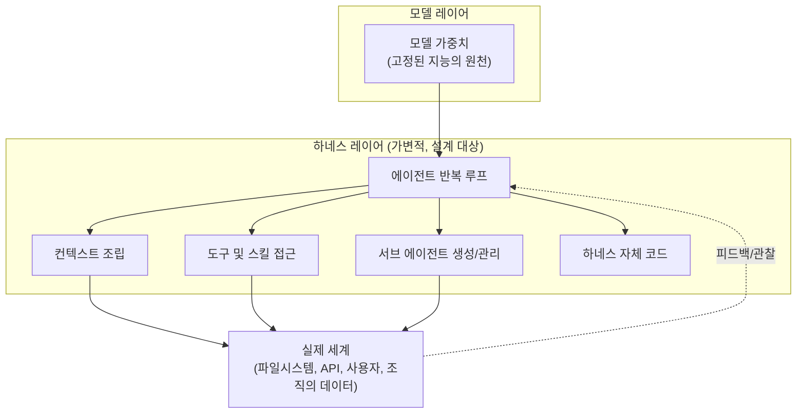
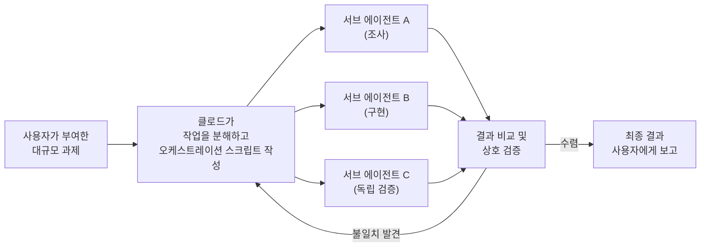
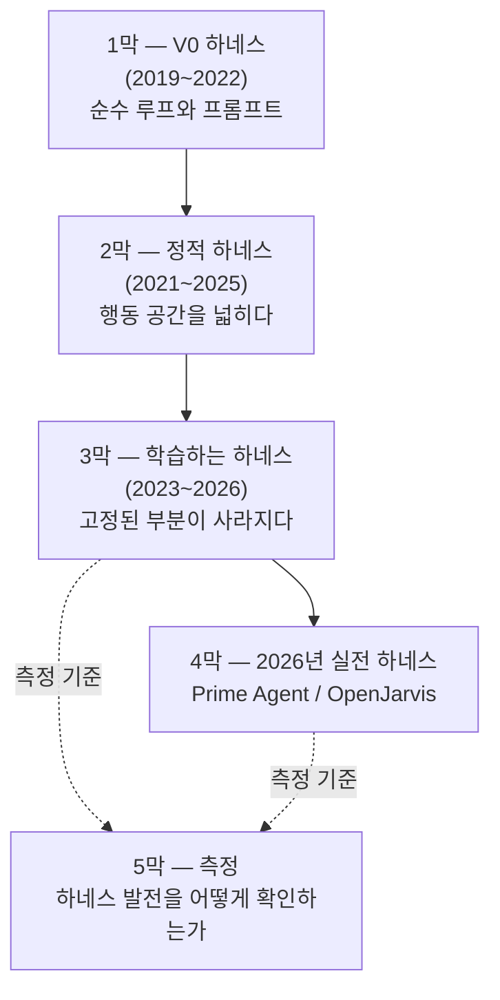

- 원문: [x.com/omarsar0/status/2099208894866178204](https://x.com/omarsar0/status/2099208894866178204)
- 작성일 기준 최신 정보 반영: 2026년 9월 14일

> 
> Should you build an agent harness?
> 
> I see lots of opinions about it.
> 
> My thoughts:
> 
> As an AI engineer, learning how to build a harness is one of the best ways to stay ahead and unlock unique value from agents.
> 
> If you understand how to build one, you can, at a minimum, transfer that knowledge to tune whatever harness or set of harnesses (closed or open) you use. 
> 
> In the best case, you apply your domain expertise to build domain-specific harnesses that unlock unique real-world value and solve reliability issues other companies just aren't willing to invest time in. If you haven't noticed, many companies and startups have already started doing this. Harnesses are enablers in that way.
> 
> I don't see any drawbacks in learning to build one. 
> 
> The main pushback against building a custom harness is that models will get better at generating them on the fly, so why build one? Or that companies will provide harness-as-a-service, etc. Now, ask yourself: will you have the level of customization that a proper harness requires? See, you are not building a wrapper here; you are building an important part of your intelligence stack. Something you want to control completely. 
> 
> Like automated prompt engineering, evals, and many other areas requiring extensive domain knowledge, harness engineering isn't something models are great at (see dynamic workflows from ant as an example). We assume too much that tools will remain static, data won't change, or knowledge will not evolve. A custom harness lets you own these issues and solve them at your desired pace. You simply cannot afford to sit back and wait for model providers to solve this problem for you. The harness is too important to offload.
> 
> While general frontier models get better at verifiable (math, code, and the like) tasks, I haven't seen evidence that they solve reliability issues when you apply them to domain-specific and more dynamic environments. This is why you want to understand how the harness works and potentially build your own. I see a lot of companies already doing this in bio, health, legal, and finance. 
> 
> My other concern about just relying on a model provider to solve the harness for you is vendor lock-in. Right now, we mostly use single models for most tasks, but it's not hard to see a world where we leverage a set of frontier models (open and closed) to address issues like cost and diversity of intelligence. Are you going to rely on some company to build that harness solution for you, or, even worse, trust a single model to do that for you?
> 
> I can go on and on. 
> 
> Building your own harness is about working towards building your own intelligence stack. I don't think that's optional where things are headed if you really want to have a differentiated business or offering. 
> 
> So where do you get started?
> 
> I suggest feeding this list of seminal harness engineering papers to your agent: [https://academy.dair.ai/papers/collections/harness-engineering](https://t.co/nOPcXIaITT)
> 
> You can start with something like: "Summarize the main components of an agent harness by researching this list of papers and tools: [https://academy.dair.ai/papers/collections/harness-engineering](https://t.co/nOPcXIaITT). Then put together a set of visual notes on where to get started to build my own minimal harness using <language_of_your_choice>."
> 
> Your thoughts? I want to keep this as an open discussion. Please share any concerns or thoughts. I'll share more thoughts as the conversation evolves.
> 

---

## 목차

1. 이 문서의 목적과 접근 방식
2. 발언자는 누구인가 — Elvis Saravia와 DAIR.AI
3. "하네스(Harness)"란 정확히 무엇을 가리키는 말인가
4. 원문 트윗의 핵심 논지 전체 해설
5. "ant의 dynamic workflows" — 이 레퍼런스가 실제로 가리키는 것
6. DAIR.AI 하네스 엔지니어링 논문 컬렉션 — 21편, 5막 구조 전체 가이드
7. 2026년 하네스 엔지니어링 생태계 스냅샷 — 업계는 이미 움직이고 있다
8. 이 논의가 실무자에게 남기는 시사점
9. 출처 투명성 표
10. 참고문헌

---

## 1. 이 문서의 목적과 접근 방식

이 문서는 AI 엔지니어링 커뮤니티에서 활발히 활동하는 Elvis Saravia(엑스 아이디 @omarsar0)가 올린 한 편의 트윗을 출발점으로 삼아, 그 안에 담긴 주장을 하나씩 뜯어보고 그 배경이 되는 논문과 실제 제품 동향까지 함께 정리한 자료다. 단순히 트윗 문장을 번역해 옮기는 데 그치지 않고, 그가 인용한 자료(다이르에이아이 아카데미의 논문 컬렉션 링크)를 직접 확인하고, 그가 지나가듯 언급한 "ant의 dynamic workflows"라는 표현이 실제로 무엇을 가리키는지도 웹 검색으로 교차 확인했다. 확인이 되지 않는 부분은 추측으로 채우지 않고 "개인적 해석"이라고 명시했으며, 문서 말미의 출처 투명성 표에서 어떤 문장이 확인된 사실이고 어떤 문장이 해석인지 구분해 두었다.

## 2. 발언자는 누구인가 — Elvis Saravia와 DAIR.AI

Elvis Saravia는 DAIR.AI(Data as AI Resource)의 공동 창업자로, 이 조직에서 AI 연구·교육·엔지니어링 전반을 이끌고 있다. 그는 지금까지 7만 개 이상의 깃허브 스타를 받은 "Prompt Engineering Guide"의 저자이자, "AI Agents Weekly"라는 뉴스레터의 발행인이기도 하다[8]. 이번에 창업하기 전에는 메타(Meta) AI에서 기술 제품 마케팅 매니저로 일하며 FAIR, 파이토치(PyTorch), Papers with Code 같은 팀들을 지원했고, 오픈소스 대형언어모델인 갤럭티카(Galactica)를 공동 개발한 이력도 있다[8]. 벨리즈 출신으로 대만 국립칭화대학교에서 정보시스템 및 응용 박사 학위를 받았으며, 박사 과정에서는 소셜미디어 텍스트에서 감정과 정신건강 신호를 탐지하는 공감형 AI를 연구했다[8].

그의 엑스(X, 구 트위터) 계정은 프롬프트 엔지니어링 초창기부터 지금의 에이전트·하네스 엔지니어링 담론까지, AI 개발 실무자 커뮤니티에서 상당한 영향력을 가진 채널로 꼽힌다. 최근 몇 주 사이에도 그는 하네스를 즉석에서 자동 생성하는 연구(JIT-Agent), 오픈소스 하네스 프로젝트(TrueForge) 등을 잇달아 소개하며 "하네스 레이어"라는 주제를 반복해서 제기해 왔다[9][10]. 이번에 살펴볼 트윗은 그런 연속된 발언들 가운데 가장 정면으로 "그래서 직접 하네스를 배워야 하는가, 말아야 하는가"라는 질문에 답한 글이라 할 수 있다.

## 3. "하네스(Harness)"란 정확히 무엇을 가리키는 말인가

본론에 들어가기 전에 용어를 먼저 정리할 필요가 있다. 원문 트윗은 하네스가 무엇인지 정의하지 않고 곧바로 논지로 들어가는데, 이는 저자가 이미 이 개념을 반복적으로 다뤄온 청중을 전제하고 있기 때문이다. 다이르에이아이 아카데미가 정리한 정의를 빌리면, 하네스란 모델 가중치와 실제 세계 사이에 존재하는 모든 것을 가리킨다. 구체적으로는 에이전트가 도는 반복 루프(loop), 그 루프에 채워 넣는 컨텍스트, 에이전트가 손을 뻗어 쓸 수 있는 도구와 스킬, 필요할 때 새로 만들어내는 서브 에이전트, 그리고 최근에는 하네스 자신의 코드까지도 포함된다[1].

같은 모델 가중치 파일이라도 그것을 감싼 하네스가 무엇이냐에 따라 동일한 벤치마크에서 30점을 받을 수도, 95점을 받을 수도 있다는 것이 이 개념이 최근 주목받는 이유다[1]. 이는 모델 성능과 하네스 설계가 서로 다른 두 개의 축이며, 같은 모델이라도 하네스가 바뀌면 결과가 크게 달라질 수 있다는 뜻이다. 아래 그림은 모델 레이어와 하네스 레이어의 관계를 단순화해서 보여준다.

이 정의를 염두에 두면, Elvis가 "하네스는 래퍼(wrapper)가 아니라 지능 스택(intelligence stack)의 중요한 일부"라고 말하는 대목의 무게가 더 분명해진다. 하네스를 얇은 껍데기가 아니라 조직의 지능이 실제로 작동하는 방식 그 자체로 보고 있는 것이다.

## 4. 원문 트윗의 핵심 논지 전체 해설

원문은 "하네스를 직접 만들어야 하는가"라는 질문을 던지고, 저자 본인의 입장을 여러 각도에서 풀어낸다. 아래에서는 트윗에 담긴 논지를 순서대로, 각 단락이 실제로 말하고자 하는 바를 풀어서 설명한다.

### 4.1 왜 직접 만들어봐야 하는가 — 최소한의 이득과 최대치의 이득

Elvis는 논지를 두 단계로 나눠 제시한다. 첫째, AI 엔지니어로서 하네스를 직접 만들어보는 경험은 그 자체로 남들보다 앞서 있을 수 있는 방법 중 하나이며, 에이전트로부터 고유한 가치를 끌어내는 핵심 수단이라고 말한다. 그리고 최소한의 이득으로, 설령 앞으로 남의 하네스(폐쇄형이든 개방형이든)를 계속 쓰게 되더라도, 직접 만들어본 경험에서 얻은 지식을 그 기성 하네스를 튜닝하는 데 그대로 옮겨 쓸 수 있다고 짚는다. 즉 "내가 만든 것을 평생 쓴다"는 전제가 아니라, "만들어본 사람만이 남의 것도 제대로 조정할 수 있다"는 논리다.

둘째, 최선의 시나리오로는 자신의 도메인 전문성을 하네스 설계에 그대로 녹여, 다른 기업들이 시간을 들이려 하지 않는 신뢰성 문제를 해결하고 실질적인 비즈니스 가치를 만들어내는 상황을 제시한다. 그는 이미 많은 기업과 스타트업이 이런 방식으로 움직이고 있다고 지적하며, 하네스를 "가능하게 하는 것(enabler)"이라고 표현한다. 이 대목에서 그는 하네스를 배우는 데 아무런 단점을 찾지 못하겠다고 단언한다.

### 4.2 두 가지 흔한 반론과 그에 대한 반박

트윗은 곧바로 "그렇다면 왜 배우지 않는 사람들이 있는가"라는 반론을 스스로 제기하고 답한다. 첫 번째 반론은 모델이 점점 좋아져서 하네스를 즉석에서(on the fly) 알아서 생성하게 될 텐데 왜 굳이 미리 배우느냐는 것이다. 두 번째 반론은 기업들이 하네스를 서비스 형태(harness-as-a-service)로 대신 제공해 줄 것이라는 전망이다.

이에 대한 Elvis의 반박은 하나의 질문으로 요약된다. 제대로 된 하네스가 요구하는 수준의 커스터마이징을, 외부에서 제공받는 서비스나 모델이 즉석에서 만들어주는 결과물이 과연 갖출 수 있겠느냐는 것이다. 그는 하네스를 단순한 래퍼가 아니라 완전히 통제하고 싶은 지능 스택의 핵심 부분으로 규정한다. 자동화된 프롬프트 엔지니어링, 평가(evals) 등 폭넓은 도메인 지식을 요구하는 다른 영역들과 마찬가지로, 하네스 엔지니어링 역시 모델이 잘 해내는 영역이 아니라고 주장하며, 그 근거로 "ant의 dynamic workflows" 사례를 언급한다(이 부분은 5장에서 별도로 깊이 다룬다).

이어서 그는 도구가 고정되어 있고 데이터가 변하지 않으며 지식이 진화하지 않을 것이라고 너무 쉽게 가정하는 경향을 경계해야 한다고 말한다. 직접 만든 하네스가 있어야 이런 변화를 자신이 원하는 속도로 소유하고 해결할 수 있으며, 모델 제공사가 이 문제를 대신 풀어줄 때까지 손 놓고 기다릴 여유가 없다고 강조한다.

### 4.3 "래퍼가 아니라 지능 스택" — 신뢰성 문제의 소재지

트윗에서 가장 단단한 주장은 다음 부분이다. 범용 프런티어 모델들이 수학이나 코드처럼 정답을 검증할 수 있는(verifiable) 과제에서는 계속 좋아지고 있지만, 그 모델을 도메인 특화적이고 더 동적인 환경에 적용했을 때 신뢰성 문제까지 해결해 준다는 증거는 보지 못했다는 것이다. 그래서 하네스가 실제로 어떻게 작동하는지 이해하고, 가능하다면 직접 만들어봐야 한다고 그는 말한다. 그는 이미 바이오, 헬스케어, 법률, 금융 분야에서 많은 기업들이 이런 흐름을 따라가고 있다고 관찰한다.

### 4.4 벤더 락인에 대한 우려 — 다중 모델 시대의 하네스

또 다른 축의 우려는 벤더 락인(vendor lock-in)이다. 현재는 대부분의 과제를 단일 모델로 처리하는 경우가 많지만, 비용과 지능의 다양성이라는 문제를 해결하기 위해 개방형·폐쇄형을 아우르는 여러 프런티어 모델을 함께 활용하는 방향으로 흘러갈 것은 어렵지 않게 예측할 수 있다고 그는 말한다. 그런 세계에서 그 조율(orchestration) 솔루션을 어느 한 회사에 맡길 것인지, 아니면 더 나쁘게는 단일 모델 하나에 그 역할을 믿고 맡길 것인지를 그는 되묻는다.

### 4.5 결론과 시작 방법 — 논문 리스트를 에이전트에게 먹이기

결론적으로 그는 자신만의 하네스를 만드는 일이 곧 자신만의 지능 스택을 향해 나아가는 일이라고 정리한다. 그리고 차별화된 비즈니스나 제품을 만들고자 한다면 이는 더 이상 선택 사항이 아니라고 잘라 말한다.

그가 제시하는 시작점은 실용적이다. 다이르에이아이 아카데미가 정리한 "하네스 엔지니어링" 주제의 핵심 논문 모음집 링크(`academy.dair.ai/papers/collections/harness-engineering`)를 자신의 에이전트에게 입력으로 주고, 이 목록에 담긴 논문과 도구들을 조사해 하네스의 주요 구성 요소를 요약하게 한 다음, 원하는 프로그래밍 언어로 최소 하네스를 직접 만들어보기 위한 시각적 노트를 정리하도록 지시하는 방식을 제안한다. 그는 이 글을 하나의 논의의 출발점으로 열어두면서, 사람들의 생각과 우려를 계속 듣고 싶다고 마무리한다.

## 5. "ant의 dynamic workflows" — 이 레퍼런스가 실제로 가리키는 것

원문에서 신뢰성 문제의 근거로 짧게 언급된 "dynamic workflows from ant"라는 표현은 맥락 없이 보면 다소 모호하다. 이 문서에서는 이를 추측으로 넘기지 않고 직접 웹 검색으로 확인한 결과를 근거로 설명한다.

먼저 결론부터 말하면, 여기서 "ant"는 앤트로픽(Anthropic)을 가리키는 업계의 약칭으로 해석하는 것이 가장 근거가 탄탄하다. "Anthropic"이라는 사명 자체가 "Ant"로 시작하기 때문에 AI 개발자 커뮤니티에서는 종종 이런 식으로 줄여 부르는 관행이 있으며, 실제로 앤트로픽은 2026년 5월 28일 클로드 코드(Claude Code)에 "다이내믹 워크플로우(Dynamic Workflows)"라는 이름의 기능을 발표했다[11][12][13]. 이 기능명이 트윗의 표현과 정확히 일치한다는 점, 그리고 Elvis가 평소 클로드 코드를 포함한 여러 하네스를 직접 다뤄온 인물이라는 점을 종합하면 이 해석의 개연성은 매우 높다. 다만 트윗 원문 자체가 "ant"라는 표현이 무엇의 약자인지 명시적으로 밝히지 않았으므로, 이 부분은 확인된 사실이 아니라 문맥에 근거한 합리적 해석이라는 점을 분명히 밝혀둔다.

이 해석이 맞다면, Elvis가 이 사례를 든 이유도 이해하기 쉬워진다. 다이내믹 워크플로우는 앤트로픽이라는 프런티어 모델 제공사 본인이 직접 만들어 배포한, 업계에서 가장 정교하다고 평가받는 공식 하네스 기능 중 하나다. 그런 공식 기능조차 "신뢰성 문제를 알아서 다 해결해 주는 만능 해법"은 아니라는 점을 보여주는 사례로 인용한 것으로 볼 수 있다.

### 5.1 다이내믹 워크플로우란 무엇인가

앤트로픽은 2026년 5월 28일 클로드 코드에 다이내믹 워크플로우 기능을 리서치 프리뷰로 공개했고[12], 이후 2026년 6월 21일 무렵 클로드 코드 CLI, 데스크톱, VS 코드 확장에서 프로, 맥스, 팀, 엔터프라이즈 플랜에 걸쳐 정식(GA)으로 제공되기 시작했다[15]. API, 아마존 베드록, 버텍스 AI, 마이크로소프트 파운드리를 통해서도 접근할 수 있다[10].

이 기능의 핵심은, 사용자가 과제를 설명하면 클로드가 그 과제에 맞는 자바스크립트 오케스트레이션 스크립트를 직접 작성하고, 이를 통해 수십에서 수백 개, 많게는 최대 1,000개에 이르는 서브 에이전트를 동시에 병렬로 실행한다는 점이다[9][10][15]. 각 서브 에이전트는 조사, 검증, 통합처럼 서로 다른 역할을 맡을 수 있고, 결과가 사용자에게 도달하기 전에 내부적으로 비교·검증하는 단계를 거친다[15]. 실행 방식은 대화창에서 "워크플로우를 만들어줘"라고 직접 요청하거나, 이펙트(effort) 메뉴에서 "울트라코드(ultracode)"라는 설정을 켜서 클로드가 필요하다고 판단할 때 자동으로 워크플로우 방식을 쓰도록 맡기는 두 가지가 있다[15].

앤트로픽이 공개한 실사용 사례로는, 번(Bun) 자바스크립트 런타임의 제작자인 재러드 섬너(Jarred Sumner)가 약 100만 줄 규모의 지그(Zig) 코드를 러스트(Rust)로 이식하는 작업을, 기존 테스트 스위트를 통과 기준으로 삼아 6일 만에 마쳤다는 사례가 있다[12]. 다른 보도에서는 이 작업 규모를 약 75만 줄로 표기하기도 했다[10][16]. 두 수치 사이에 다소 차이가 있는데, 이는 보도마다 "포팅된 총 줄 수"와 "영향을 받은 줄 수"를 다르게 집계했을 가능성이 있어 보이며, 이 문서에서는 두 수치를 모두 병기해 어느 한쪽으로 단정하지 않았다.

앤트로픽 측은 이 기능이 단일 컨텍스트 창에서 오래 실행되는 과제가 겪는 전형적인 실패 양상, 즉 "에이전트가 게을러지는 현상(agentic laziness)", 자기 선호 편향(self-preferential bias), 목표 이탈(goal drift) 같은 문제를 완화하기 위해 큰 목표를 독립된 하위 과제로 쪼개는 방식을 택했다고 설명한다[17]. 활용 사례로는 코드베이스 전역의 버그 사냥, 프로파일러 기반 성능 감사, 보안 감사, 대규모 프레임워크 마이그레이션 등이 제시되었고[15], 이후에는 슬랙 로그에서 반복되는 이슈를 분석하거나, 이력서 더미에서 지원자 순위를 매기거나, 블로그 초안의 기술적 주장을 적대적으로 검증하는 등 비개발 업무로도 활용 범위를 넓혀가는 시연이 이뤄졌다[17]. 다만 앤트로픽은 다이내믹 워크플로우가 일반적인 클로드 코드 세션보다 토큰을 훨씬 많이 소비할 수 있다는 점을 명시하며, 우선 범위가 제한된 과제로 시험해 비용 감을 잡아볼 것을 권고하고 있다[10].

### 5.2 이 사례가 Elvis의 논지에 주는 함의

이 기능은 분명 인상적인 결과(75만~100만 줄 규모의 코드 포팅을 6일 만에)를 보여주었지만, 동시에 앤트로픽 스스로 "토큰 비용이 크게 늘어날 수 있다", "먼저 좁은 범위로 시험해보라"는 식의 실무적 경고를 함께 붙였다는 점이 눈에 띈다. 이는 아무리 정교한 공식 오케스트레이션 기능이라도, 그것을 조직의 특정 도메인과 데이터, 리스크 허용 범위에 맞춰 적용하는 과정에서는 여전히 사람의 판단과 커스터마이징이 필요하다는 것을 시사한다. Elvis가 이 사례를 "모델이 신뢰성 문제까지 해결해 준다는 증거는 못 봤다"는 맥락에서 인용했다면, 이 지점, 즉 범용 기능과 도메인 특화 신뢰성 사이의 간극을 지적한 것으로 읽을 수 있다. 다만 이 마지막 해석 역시 트윗 저자의 의도를 문맥상 추론한 것이며, 저자 본인이 직접 밝힌 바는 아니라는 점을 다시 한 번 밝혀둔다.

## 6. DAIR.AI 하네스 엔지니어링 논문 컬렉션 — 21편, 5막 구조 전체 가이드

트윗이 링크한 `academy.dair.ai/papers/collections/harness-engineering` 페이지를 직접 확인한 결과, 이는 2026년 8월 26일 녹화된 "YC 페이퍼 클럽: 하네스 특집(YC Paper Club: Harness Edition)"이라는 행사 내용을 바탕으로 정리된 21편의 논문 컬렉션이었다[1]. 이 페이지는 논문들을 하네스가 진화해온 순서에 따라 다섯 개의 장으로 나누고 있는데, 그 구조 자체가 "하네스란 무엇이고 왜 지금 중요한가"에 대한 하나의 완결된 서사를 이룬다. 아래에서 각 장을 순서대로 정리한다.

### 6.1 1막 — V0 하네스: 순수 루프와 프롬프트

이 장은 무언가를 "하네스"라고 부르기도 전의 원형을 다룬다. GPT-2를 소개한 "Language Models are Unsupervised Multitask Learners"(Alec Radford 외, 2019)는 도구 호출도, 스킬도, 메모리도 없이 그저 문장이 끝날 때까지 반복하는 루프와 확률적 샘플링, 그리고 구분자 뒤에 오는 내용을 채점하는 환경만 존재하는 가장 기초적인 형태를 보여준다[1]. 이어서 "Language Models are Few-Shot Learners"(Tom B. Brown 외, 2020)는 GPT-3 논문으로, 풀이된 예시를 질문 위에 붙여넣는 것만으로 정확도가 달라진다는 사실을 보여주며 컨텍스트 창이 시스템 설계자가 처음으로 공을 들일 수 있는 지점이 되었음을 알린다[1]. 마지막으로 "Chain-of-Thought Prompting Elicits Reasoning in Large Language Models"(Jason Wei 외, 2022)는 한 번에 답을 요구하는 대신 계산 과정을 더 많은 토큰에 걸쳐 풀어내게 하는 최초의 출력 공간 개입으로, 이후의 모든 하네스가 호출 횟수가 아니라 토큰을 예산으로 삼게 된 계기가 되었다[1].

### 6.2 2막 — 정적 하네스: 행동 공간을 넓히다

이후 몇 년은 하나의 동작이 반복되는 시기로 요약된다. 루프에게 새로 할 수 있는 일을 하나씩 쥐어주는 것이다. 웹을 검색하고, 도구를 부르고, 행동한 뒤 관찰하고, 스스로를 비평하고, 코드를 실행하고, 동료를 새로 만들어내고, 스킬을 문서로 남기고, 자신의 메모리를 고쳐 쓰고, 재귀적으로 자신을 호출하는 식이다. 이 시기 내내 하네스는 점점 더 많은 기능을 갖추게 되지만, 하네스를 이루는 코드 자체는 고정되어 있었다는 점이 이 장 전체의 공통점이다[1].

구체적으로는, 모델에게 처음으로 브라우저를 쥐여주고 사람의 피드백으로 사용법을 가다듬은 "WebGPT"(Reiichiro Nakano 외, 2021)를 시작으로, 도구 호출이라는 개념 자체의 근원이 된 "Toolformer"(Timo Schick 외, 2023), 사고와 행동을 번갈아 수행하는 오늘날 거의 모든 에이전트 루프의 기본형을 제시한 "ReAct"(Shunyu Yao 외, 2022)가 이어진다[1]. 이후 같은 모델이 스스로의 초안을 채점하고 다시 쓰는 가장 값싼 피드백 루프를 보여준 "Self-Refine"(Aman Madaan 외, 2023), 환경에서 얻은 실제 보상 신호를 말로 바꿔 컨텍스트에 다시 써넣는 방식으로 실패한 에피소드를 낭비하지 않게 만든 "Reflexion"(Noah Shinn 외, 2023)이 등장한다[1].

행동이 코드가 되는 순간 도구 목록은 더 이상 유한하지 않게 되는데, 이를 실행 피드백이 있는 표준 환경으로 만든 것이 "InterCode"(John Yang 외, 2023)다[1]. 서브 에이전트를 새로 만드는 일이 그저 하나의 도구 호출이 되도록 만든 "Multi-Agent Collaboration"(Yashar Talebirad, Amirhossein Nadiri, 2023), 마인크래프트 안에서 도구를 하나의 루틴으로 엮고 검증한 뒤 나중에 다시 찾아볼 수 있는 라이브러리에 기록하는 "Voyager"(Guanzhi Wang 외, 2023)는 오늘날 저장소 안의 SKILLS.md 파일이 어디서 왔는지를 보여준다[1]. 컨텍스트에 단순히 이어붙이는 것만 가능했던 방식을 넘어, 자신의 컨텍스트 일부에 대해 만들고 읽고 고치고 지우는 권한을 부여한 "MemGPT"(Charles Packer 외, 2023)는 대화 기록을 관리되는 상태(state)로 바꾸는 전환점이었다[1]. 이 장의 마지막인 "Recursive Language Models"(Alex L. Zhang, Tim Kraska, Omar Khattab, 2025)는 REPL 안에서 LLM 호출이 다시 LLM 호출을 부르는 방식으로, 너무 커서 한 번에 읽을 수 없는 문서를 프로그래밍 가능한 자원으로 다루게 만든 재귀 구조다[1].

### 6.3 3막 — 학습하는 하네스: 고정된 부분이 사라지다

이 장부터는 그동안 고정되어 있던 부분, 즉 프롬프트, 그다음은 스캐폴딩(scaffolding), 마침내는 하네스 코드 자체가 최적화 대상이 되는 과정을 다룬다. "DSPy"(Omar Khattab 외, 2023)는 프롬프트를 역전파할 수 없으니 작은 학습 데이터셋에 대해 프롬프트 자체를 탐색하는 방식을 택하며, 시스템 프롬프트가 저자의 직관이 아니라 최적화된 산출물이 되는 최초의 전환점을 보여준다[1]. "GEPA"(Lakshya A Agrawal 외, 2025)는 실패한 실행 기록을 자연어로 읽고 그로부터 프롬프트를 변이시켜, 훨씬 적은 시도 횟수로 강화학습을 능가하는 성능을 낸다[1].

이어서 "Darwin Godel Machine"(Jenny Zhang 외, 2025)에서는 하네스 코드 자체가 편집 대상이 된다. 에이전트들이 자신의 조상 아카이브에서 샘플링하고, 자신의 스캐폴딩을 다시 쓰고, 코딩 벤치마크에서 점수를 받은 뒤 다시 아카이브로 돌아가는 구조다[1]. "Meta-Harness"(Yoonho Lee 외, 2026)는 하네스를 만들어내는 일을 임무로 삼는 메타 하네스로, 코딩 에이전트에게 탐색 이력, 소스코드, 실행 기록, 점수를 모두 넘겨주고 검색·메모리·프롬프트 조립 코드를 고정된 모델 주위에서 다시 쓰게 하여, 가중치를 건드리지 않고도 터미널벤치 2(Terminal-Bench 2)에서 최고 성능을 기록했다[1]. 마지막으로 "Continual Harness"(Seth Karten 외, 2026)는 온라인 학습으로 넘어가기 직전 단계로, 궤적 전반에 걸쳐 이력·메모리·스킬·프롬프트·서브 에이전트 사양을 유지하면서 에이전트가 실행되는 동안 이를 변이시키고, 더 나아가 방금 일어난 일로부터 DAgger 방식으로 가중치까지 갱신한다[1].

### 6.4 4막 — 2026년에 실제로 출시된 하네스: Prime Agent와 OpenJarvis

이 장은 앞선 모든 내용을 바탕으로 실제로 만들어져 공개된 두 개의 시스템을 다룬다. "Prime Agent"(Seth Karten 외, 2026)는 지속적으로 유지되는 아이파이썬(IPython) REPL, 작업을 마친 뒤에도 계속 주소를 지정해 부를 수 있는 재귀적 서브 에이전트, 그리고 프롬프트와 스킬을 지속적으로 다듬어가는 구조를 갖췄다. 동일한 모델 가중치를 그대로 둔 채로 ARC-AGI-3 벤치마크 점수를 30%에서 95.5%까지 끌어올렸다는 결과가 이 컬렉션 전체가 논쟁하고 있는 핵심 수치다[1]. "OpenJarvis"(Jon Saad-Falcon 외, 2026)는 같은 주장을 개인 기기 쪽에 적용한 사례로, 개인용 AI 스택을 다섯 개의 기본 요소로 분해한 뒤 클라우드의 프런티어 모델이 그 사양을 탐색하게 하고, 실제 추론은 로컬에서 전부 처리하게 함으로써 한계 비용을 약 800분의 1 수준으로 낮췄다고 보고한다[1].

### 6.5 5막 — 이 모든 것이 실제로 작동했는지 어떻게 아는가

마지막 장은 측정 도구에 관한 것이다. "Measuring AI Ability to Complete Long Software Tasks"(Thomas Kwa 외, 2025)는 단발성 점수 대신 시스템이 완수할 수 있는 과제의 길이를 능력의 척도로 삼는데, 이 관점이야말로 하네스의 발전을 눈에 보이게 만드는 핵심이라고 컬렉션은 설명한다. 정적 하네스 시대와 자기 개선 하네스 시대는 이 하나의 그래프 위에서 서로 다른 두 개의 기울기로 나타난다는 것이다[1].

이 페이지는 논문 외에도 실제로 돌려볼 수 있는 코드와 벤치마크를 함께 안내하고 있다. Prime Agent의 깃허브 저장소, OpenJarvis의 깃허브 저장소, YC의 다중 사용자 에이전트 하네스인 QM(MIT 라이선스로 공개, "브레인"을 샌드박스에서 꺼내 포스트그레스큐엘로 옮긴 것이 특징), 30%에서 95.5%로의 도약을 보여준 ARC-AGI-3 벤치마크, 다윈 괴델 머신의 참조 구현, 메타 하네스의 참조 코드, 그리고 GEPA가 탑재된 DSPy 프레임워크가 그것이다[1].

## 7. 2026년 하네스 엔지니어링 생태계 스냅샷 — 업계는 이미 움직이고 있다

Elvis가 트윗에서 "많은 기업과 스타트업이 이미 이렇게 하고 있다"고 말한 부분을 뒷받침하는 최근 사례들을 추가로 확인했다. 아래 사례들은 이번 트윗 이전 몇 주 사이에 그가 직접 다루었거나, 독립적으로 업계에서 보도된 것들이다.

첫째, 그가 바로 직전에 소개한 "JIT-Agent: Scaling Harness Intelligence via Just-in-Time Harness Evolution"(Guibin Zhang 외, 2026년 8월)은 하네스를 만드는 모델이라는 개념을 제시한다. 메모리 관리, 계획 전략, 행동 프로토콜, 도구·스킬 조율이라는 네 가지 모듈로 하네스를 형식화한 뒤, 임의의 기성 에이전트형 모델에 맞춰 그 자리에서 하네스를 합성하도록 훈련시킨 모델이다[18][19]. 실행 중 하네스를 스스로 수리하고, 과거 하네스 구성들이 쌓인 저장소에서 성능 신호를 추출해 스스로 진화하는 기능도 갖췄다. 성능 측면에서는 DeepSeek-V4-Flash에 이 하네스를 붙였을 때 DeepSearchQA에서 GPT-5.6을 9.1점 차이로, OdysseyBench에서 4.3점 차이로 앞질렀고, GLM-5.2에는 최대 20.2점의 성능 향상을 가져왔다고 보고되었다[18][19][20]. 18개의 백본-벤치마크 조합 전체에서 기본 스캐폴딩을 JIT가 생성한 하네스로 교체했을 때 예외 없이 성능이 개선되었으며, 과제당 API 비용도 평균 36% 절감되었다는 결과도 함께 제시되었다[19]. 흥미로운 점은, 이 JIT가 생성한 하네스가 클로드 코드, 코덱스(Codex), 오픈코드(OpenCode), 헤르메스(Hermes), 나노봇(NanoBot) 같은 기존의 성숙한 하네스들과 견주어도 성능 면에서 경쟁력이 있었다는 것이다[19][20].

이 결과는 Elvis의 두 가지 반론에 대한 반박, 즉 "모델이 하네스를 알아서 만들어줄 것"이라는 전망을 정면으로 겨냥한 연구이기도 하다. 흥미롭게도 이 연구 자체는 "모델이 하네스를 잘 만든다"는 걸 보여주지만, 동시에 그 결과물이 도메인·과제별로 다시 훈련되고 튜닝되어야 하는 별도의 지능 스택이라는 점에서, Elvis의 "하네스는 여전히 통제해야 할 대상"이라는 주장과 상충하지 않는다고 볼 수 있다.

둘째, 오픈소스 하네스 진영에서는 트루파운드리(TrueFoundry)의 트루포지(TrueForge)가 최근 공개됐다. 어떤 모델 제공사에도 종속되지 않고 오픈AI, 앤트로픽, 구글 모델은 물론 키미(Kimi), GLM, 딥시크(DeepSeek) 같은 오픈웨이트 모델까지 동일한 하네스 위에서 구동할 수 있도록 설계됐다[10]. 이는 앞서 4장에서 다룬 벤더 락인 우려에 대한 업계의 실제 대응 사례로 볼 수 있다.

셋째, 대형 프레임워크 진영에서도 "하네스"라는 표현이 공식 용어로 자리 잡고 있다. 랭체인(LangChain)은 "How to Build a Custom Agent Harness"라는 글에서, 딥 에이전트(Deep Agents)나 클로드 에이전트 SDK 같은 기성 하네스가 메모리·컨텍스트 관리·샌드박싱 같은 미들웨어를 이미 갖춘 채로 제공되어 빠르게 프로덕션에 도달할 수 있게 해주지만, 많은 에이전트는 커스텀 프롬프트, 비즈니스 로직, 가드레일처럼 더 세밀한 커스터마이징을 필요로 한다고 설명하며, 자체적으로는 에이전트 루프의 핵심만 구현하고 미들웨어를 커스터마이징의 기본 단위로 노출하는 최소주의적 접근(`create_agent`)을 취하고 있다고 밝혔다[21]. 오픈AI 역시 엔지니어링 블로그에 "Harness engineering: Leveraging codex in an agent-first world"라는 글을 2026년 2월에 게시한 바 있어[41], 하네스 엔지니어링이 이제 특정 스타트업이나 연구자만의 용어가 아니라 주요 모델 제공사들이 공식적으로 쓰는 용어로 자리 잡았음을 보여준다.

넷째, 앤트로픽 자신도 다이내믹 워크플로우(5장 참고) 외에 "매니지드 에이전트(Managed Agents)"라는 별도 기능을 통해 프로덕션 환경에서의 하네스 운영을 더 빠르게 지원하겠다고 밝힌 바 있다[10]. 이는 5장에서 살펴본 것처럼, 모델 제공사가 공식 하네스 기능을 계속 강화해 나가는 동시에, 여전히 사용자가 세부 튜닝과 검증을 직접 책임져야 하는 영역이 남아 있다는 이중적인 상황을 보여준다.

## 8. 이 논의가 실무자에게 남기는 시사점

이 트윗과 그 배경 자료들을 종합하면, 2026년 하반기 현재 AI 엔지니어링 담론의 중심축 하나가 "모델 대 하네스"에서 "모델과 하네스, 두 개의 독립적인 축"으로 옮겨가고 있음을 알 수 있다. 같은 모델이라도 하네스에 따라 성능이 크게 달라진다는 사실은 더 이상 몇몇 연구자만의 주장이 아니라, Prime Agent의 30%에서 95.5%로의 도약, JIT-Agent의 벤치마크별 5점에서 20점대 개선처럼 구체적인 수치로 반복 확인되고 있다.

동시에 이 담론에는 두 개의 서로 다른 방향이 공존하고 있다는 점도 짚어둘 만하다. 한쪽에는 Elvis가 대변하는 "하네스를 직접 설계하고 소유해야 한다"는 방향이 있고, 다른 한쪽에는 JIT-Agent나 앤트로픽의 다이내믹 워크플로우처럼 "하네스 자체를 모델이나 플랫폼이 대신 만들어준다"는 방향이 있다. 흥미로운 점은 이 두 방향이 반드시 배타적이지 않다는 것이다. 다이내믹 워크플로우처럼 공식 하네스 기능이 강력해질수록, 그 기능을 어떤 과제에 언제 어떻게 적용할지, 그리고 그 결과를 어떻게 검증할지를 판단하는 역할은 오히려 더 중요해진다. 이는 하네스 설계의 무게중심이 "루프와 도구를 직접 코딩하는 일"에서 "팀 구조와 평가 설계"로 옮겨가고 있다는 관측과도 맞닿아 있으며, 도메인 전문가의 판단이 결과물의 신뢰 여부를 가려내는 역할로 이동하고 있다는 최근의 논의와도 방향이 겹친다.

## 9. 출처 투명성 표

| 구분 | 내용 | 근거 |
|---|---|---|
| 확인된 사실 | 트윗 저자 Elvis Saravia는 DAIR.AI 공동창업자이며 Prompt Engineering Guide 저자, AI Agents Weekly 발행인이다 | [8] |
| 확인된 사실 | 하네스 정의(모델 가중치와 세계 사이의 모든 것)는 DAIR.AI 아카데미 페이지 원문에 명시되어 있다 | [1] |
| 확인된 사실 | 하네스 엔지니어링 논문 컬렉션은 21편, 5개 장으로 구성되며 2026년 8월 26일 YC 페이퍼 클럽 녹화를 바탕으로 정리됐다 | [1] |
| 확인된 사실 | Prime Agent는 동일 가중치로 ARC-AGI-3 점수를 30%에서 95.5%로 끌어올렸다 | [1] |
| 확인된 사실 | 앤트로픽은 2026년 5월 28일 클로드 코드에 "다이내믹 워크플로우"를 리서치 프리뷰로 발표했고, 이후 정식 제공됐다 | [10][12][15] |
| 확인된 사실 | JIT-Agent는 DeepSeek-V4-Flash와 GLM-5.2에 각각 유의미한 벤치마크 성능 향상을 가져왔다 | [18][19][20] |
| 단일 출처 주장 | 번(Bun)의 지그→러스트 포팅 규모를 "약 100만 줄"로 보도한 매체와 "약 75만 줄"로 보도한 매체가 갈린다 | [12] vs [10][16] |
| 개인적 해석 | 트윗의 "ant의 dynamic workflows"가 앤트로픽의 공식 기능인 "Dynamic Workflows"를 가리킨다는 판단 | 문맥 기반 추론(원저자가 직접 확인한 바 아님) |
| 개인적 해석 | 앤트로픽이 이 사례를 신뢰성 문제의 예시로 들었을 것이라는 해석 | 문맥 기반 추론 |
| 벤더 자체 보고 | JIT-Agent, Prime Agent, OpenJarvis, 다이내믹 워크플로우의 구체적 성능 수치는 모두 해당 연구팀 또는 앤트로픽이 자체 발표한 수치이며, 독립적인 제3자 재현 검증 결과는 이번 조사에서 별도로 확인되지 않았다 | [1][10][18][19] |

## 10. 참고문헌

[1] DAIR.AI Academy, "Harness Engineering Paper Collection," academy.dair.ai/papers/collections/harness-engineering (2026년 확인)

[8] YesPress, "Elvis Saravia - Co-Founder, DAIR.AI," yespress.io/elvis-saravia (2026년 4월 21일)

[9] elvis(@omarsar0), X 게시물(JIT-Agent 소개), x.com/omarsar0/status/2093056965568332236

[10] Reworked, "Anthropic Rolls Out Dynamic Workflows Across Claude Code Tools," reworked.co/digital-workplace/anthropic-announces-dynamic-workflows-in-claude-code (2026년 5월 29일)

[11] Blockchain.News, "Anthropic's Claude Code Gains Dynamic Workflow Capabilities," blockchain.news/news/anthropic-claude-code-dynamic-workflows

[12] Medium(lassiecoder), "Claude Code's Dynamic Workflows: The AI agent architecture that just rewrote 750,000 lines of code in 6 days," medium.com/illumination (2026년 5월 31일)

[13] InfoQ, "Claude Code Adds Dynamic Workflows for Parallel Agent Coordination," infoq.com/news/2026/06/dynamic-workflows-claude-code (2026년 6월 1일)

[14] Anthropic, "Introducing Claude Opus 4.8," anthropic.com/news/claude-opus-4-8

[15] Claude by Anthropic, "Introducing dynamic workflows," claude.com/blog/introducing-dynamic-workflows-in-claude-code (2026년 6월 21일)

[16] TestingCatalog, "Anthropic launches dynamic workflows for Claude Code," testingcatalog.com/anthropic-launches-dynamic-workflows-for-claude-code

[17] Medium(Gao Dalie), "How To Build a Claude Dynamic Workflows Better Than 99% of People," medium.com/data-science-collective (2026년 6월 4일)

[18] arXiv, Guibin Zhang 외, "JIT-Agent: Scaling Harness Intelligence via Just-in-Time Harness Evolution," arxiv.org/abs/2608.25593 (2026년 8월)

[19] alphaXiv, "JIT-Agent: Scaling Harness Intelligence via Just-in-Time Harness Evolution," alphaxiv.org/abs/2608.25593

[20] elvis(@omarsar0), X 게시물(JIT-Agent 상세), x.com/omarsar0/status/2093056965568332236

[21] LangChain, "How to Build a Custom Agent Harness," langchain.com/blog/how-to-build-a-custom-agent-harness (2026년 6월 4일)

[41] arXiv, "Code as Agent Harness"(참고문헌 목록 중 오픈AI 블로그 "Harness engineering: Leveraging codex in an agent-first world," 2026년 2월 인용), arxiv.org/pdf/2605.18747
