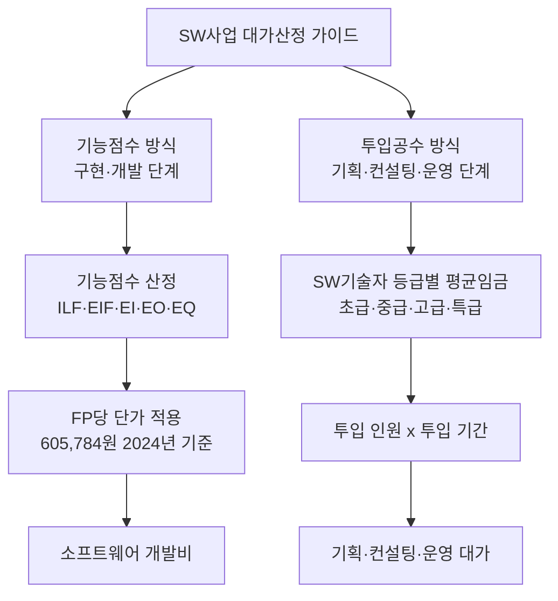
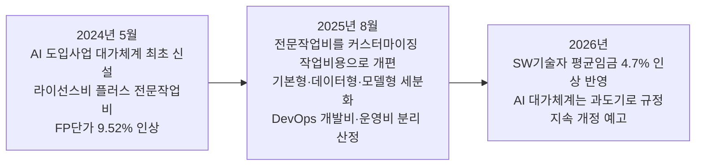
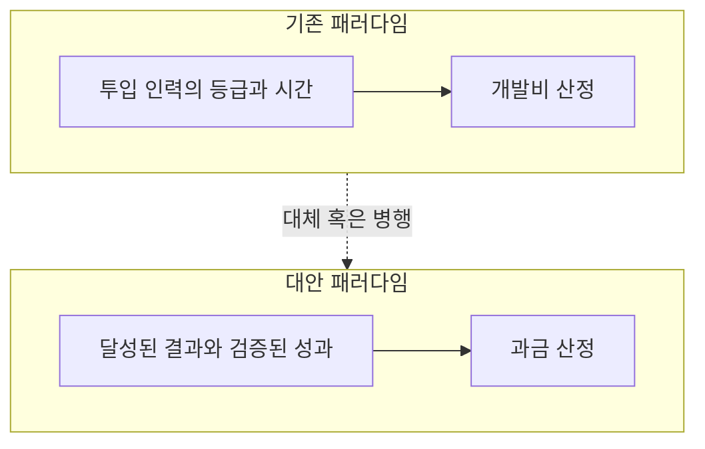

>
>**오늘의 개발자 생각**
>
>AI 시대, 소프트웨어 표준단가가 위협받고 있습니다.
>
>개발 프로젝트 미팅에서 이런 질문이 나오기 시작합니다.
>
>- “AI가 코딩해주는데 개발비가 왜 그대로죠?”
>- “AI를 쓰는데 왜 개발기간이 이렇게 길죠?”
>
>기존 소프트웨어 사업은 오랫동안 개발자 등급, 투입 인원, 개발 기간 같은 인력 투입량을 비용 산정의 중요한 기준으로 사용해왔습니다.
>
>그런데 AI가 이 전제를 흔들고 있습니다.
>
>개발자 한 명이 AI를 활용해 과거보다 훨씬 많은 코드를 작성하고, 테스트·디버깅·문서화까지 빠르게 처리할 수 있다면 발주자는 당연히 묻게 됩니다.
>
>“그렇다면 기존 표준단가는 여전히 유효한가?”
>
>여기서 중요한 건 개발자가 필요 없어졌다는 이야기가 아닙니다.
>
>개발자의 ‘시간’을 기준으로 소프트웨어의 가격을 설명하기가 점점 어려워지고 있다는 것입니다.
>
>https://www.threads.com/share/BATS5QeCwA/
>

## 목차

- [서론: "AI가 코딩해주는데 왜 개발비가 그대로죠?"](#서론)
- [1장. 한국 소프트웨어 가격은 어떻게 매겨져 왔는가 — 두 개의 축](#1장)
- [2장. 2026년 현재, 숫자로 보는 표준단가 체계](#2장)
- [3장. AI는 무엇을 흔드는가 — "개발자의 시간"이라는 가정의 붕괴](#3장)
- [4장. KOSA는 이미 움직이고 있다 — AI 도입사업 대가체계 3년의 진화](#4장)
- [5장. 해외의 대안 모색 — 성과 기반·가치 기반 가격으로의 이동](#5장)
- [6장. 쟁점 정리 — 표준단가는 폐지될 것인가, 진화할 것인가](#6장)
- [7장. 정리하며](#7장)
- [출처 투명성 표](#출처-투명성-표)
- [참고문헌](#참고문헌)

---

## 서론: "AI가 코딩해주는데 왜 개발비가 그대로죠?" {#서론}

발주 미팅 자리에서 이런 질문이 나오기 시작했다는 이야기가 있다. AI가 코드를 대신 짜주는데 개발비는 왜 그대로인지, AI를 쓰는데 개발 기간은 왜 여전히 긴지를 발주자가 묻는다는 것이다. 이 질문이 향하는 곳은 소프트웨어 산업이 수십 년간 의지해온 가격 산정의 뿌리, 즉 개발자 등급과 투입 인원, 개발 기간이라는 '인력 투입량'을 비용의 근거로 삼아온 관행이다.

이 글이 다루려는 것은 개발자가 필요 없어졌다는 이야기가 아니다. 오히려 정반대에 가깝다. 개발자의 '시간'을 기준으로 소프트웨어의 가격을 설명하는 일이 점점 어려워지고 있다는 것, 그리고 그 균열이 이미 한국의 공식 대가산정 제도 안에서도, 해외의 AI 프라이싱 시장에서도 구체적인 숫자와 정책 변화로 나타나고 있다는 것이 이 글의 실제 내용이다. 아래에서는 한국의 소프트웨어 표준단가 체계가 실제로 어떤 구조로 작동해왔는지, 2026년 현재 그 체계가 어떤 숫자로 유지되고 있는지, AI가 구체적으로 어떤 전제를 흔드는지, 그리고 이에 대응해 업계와 제도가 어떤 방향으로 움직이고 있는지를 순서대로 짚어본다.

---

## 1장. 한국 소프트웨어 가격은 어떻게 매겨져 왔는가 — 두 개의 축 {#1장}

한국의 소프트웨어사업 대가산정 체계는 크게 두 개의 축으로 이루어져 있다. 하나는 '노임단가' 혹은 'SW기술자 평균임금'이라고 불리는 인건비 기준이고, 다른 하나는 '기능점수(Function Point, FP)'라는 산출물 규모 기준이다. 이 둘은 서로 다른 층위에서 작동하지만, 결국 둘 다 사람이 얼마의 시간을 투입했는지, 혹은 투입해야 하는지를 계산의 뼈대로 삼는다는 공통점을 가진다.

SW기술자 평균임금은 한국인공지능·소프트웨어산업협회(KOSA, 옛 한국소프트웨어산업협회)가 소프트웨어진흥법 제46조의 '적정 대가 지급' 조항에 근거해 매년 조사·공표하는 통계다. 이 통계는 소프트웨어사업자로 신고한 업체와 협회 회원사를 대상으로 실제 임금 실태를 조사한 뒤, 초급·중급·고급·특급 등 기술 등급별로 월평균·일평균·시간평균 임금을 산출한다. 등급 구분은 학력·경력·자격이라는 세 가지 조건을 동시에 충족해야 하는 방식으로 정해지며, 이 수치는 공공 소프트웨어사업에서 투입공수(맨먼스, M/M) 방식으로 인건비를 산정할 때 사실상 유일한 공식 기준으로 쓰인다.

기능점수 방식은 이와 결이 다르다. 이 방식에서는 소프트웨어가 사용자에게 제공하는 기능을 데이터 기능(내부논리파일 ILF, 외부연계파일 EIF)과 트랜잭션 기능(외부입력 EI, 외부출력 EO, 외부조회 EQ)이라는 정해진 유형으로 정량화한 뒤, 여기에 'FP당 단가'를 곱해 전체 개발비를 산출한다. 즉 사람이 며칠 일했는지가 아니라 결과물의 기능 규모가 계산의 출발점이 되는 구조다. 그런데 이 FP당 단가 자체도 결국 SW기술자의 인건비 상승분을 반영해 주기적으로 개정되는 값이기 때문에, 두 축은 완전히 독립적이라기보다는 인건비라는 공통의 뿌리에서 갈라져 나온 두 갈래에 가깝다.

기획, 정보전략계획(ISP), 전사적 아키텍처 수립(EA/ITA), 정보보안 컨설팅처럼 정형화된 기능으로 나누기 어려운 업무는 지금도 투입공수 방식, 즉 등급별 인건비에 투입 인원과 기간을 곱하는 전통적인 방식으로 대가를 산정한다. 결국 공공 소프트웨어사업의 예산은 상당 부분이 '몇 등급의 기술자가 몇 명, 몇 개월 투입되는가'라는 질문에 대한 답으로 짜여진다.

---

## 2장. 2026년 현재, 숫자로 보는 표준단가 체계 {#2장}

이 체계가 지금도 살아서 작동하고 있다는 것은 최근 발표된 수치를 보면 분명해진다. 한국인공지능·소프트웨어산업협회는 2025년 12월 19일, 2025년 SW기술자 임금실태조사 결과를 바탕으로 2026년 1월 1일부터 적용되는 SW기술자 평균임금을 공표했다. 전체 SW기술자의 일평균 임금은 41만 4,762원으로, 전년 대비 4.7% 인상된 값이다. 응용SW개발자의 경우 시간평균임금이 약 4만 7,281원 수준으로 파악되며, IT컨설턴트는 월평균 약 1,070만 원, 정보보안전문가는 월평균 약 1,041만 원으로 공표되어 있다. 여기서 흥미로운 지점은 KOSA 스스로 이 통계를 해설하며 밝힌 흐름이다. 개발보다 기획·품질·감리 역할의 비중이 커지면서 관련 직무의 임금 인상폭이 두드러졌고, 반대로 직접적인 SW 개발 직무의 임금 인상은 상대적으로 정체된 모습을 보였다는 것이다. 클라우드 기반 시스템 확산과 개발 프레임워크 표준화, 플랫폼 서비스 확산으로 개발 인력의 대체 가능성이 커졌다는 분석도 함께 제시되었다.

기능점수 단가 쪽을 보면 구조가 조금 다르게 드러난다. FP당 단가는 2014년 51만 9,203원, 2020년 55만 3,114원을 거쳐 2024년 5월 13일 개정판에서 9.52% 인상된 60만 5,784원으로 조정되었다. 이 인상폭은 과거 두 차례 인상률과 비교해 이례적으로 큰 폭이었는데, KOSA는 코로나19 팬데믹 이후의 물가상승과 SW기술자 인건비 상승분이 반영된 결과라고 설명했다. 그런데 이후 2025년, 2026년 개정판에서는 SW기술자 평균임금(노임단가)은 매년 갱신되어 발표되는 반면, FP당 단가 자체를 별도로 인상했다는 공식 발표는 확인되지 않는다. 즉 '표준단가'라는 하나의 표현 아래에 실제로는 매년 자동으로 갱신되는 인건비 기준과, 몇 년 단위로만 개정되는 개발비 산정 기준이라는 서로 다른 속도의 두 지표가 함께 존재하고 있는 셈이다. 이는 이 글이 다루는 논쟁의 배경을 이해하는 데 중요한 사실이다. AI로 인한 생산성 변화가 이 체계에 반영되려면, 매년 자동 갱신되는 인건비 지표가 아니라 몇 년에 한 번 개정되는 산정 방법론 자체가 바뀌어야 하기 때문이다.

아래 그림은 현재 한국의 SW사업 대가산정이 실제로 어떤 두 갈래 구조로 이루어지는지를 정리한 것이다.

---

## 3장. AI는 무엇을 흔드는가 — "개발자의 시간"이라는 가정의 붕괴 {#3장}

두 축이 공유하는 전제는 단순하다. 결과물의 양과 질은 대체로 투입된 사람의 시간과 등급에 비례한다는 것이다. 이 전제가 성립하는 한, 발주자는 '몇 등급의 인력이 몇 개월 일했는가' 혹은 '얼마나 많은 기능을 구현했는가'를 근거로 가격의 타당성을 납득할 수 있었다. 문제는 생성형 AI 코딩 도구가 이 비례관계 자체를 흔든다는 데 있다. 개발자 한 명이 AI를 활용해 과거보다 훨씬 많은 코드를 짧은 시간에 작성하고, 테스트와 디버깅, 문서화까지 상당 부분을 자동화할 수 있게 되면서, 같은 시간을 투입해도 산출되는 기능점수나 코드량이 과거와 달라진다.

이 변화를 다소 극적으로 보여주는 사례가 브런치에 소개된 뉴욕타임스 매거진 기사의 요약이다. 이 요약에 따르면 AI가 코딩을 자동화하면서 개발자의 업무량이 크게 줄었고, 과거 하루 종일 걸리던 작업을 AI가 30분 만에 끝내는 경우도 있다고 한다. 개발자는 이제 직접 코드를 짜기보다 AI에게 지시하고 결과를 검토하는 데 더 많은 시간을 쓰게 되었으며, 생산성이 10배에서 100배까지 늘었다는 표현과 함께 개발자의 역할이 '건설 노동자'에서 '건축가'에 가까워졌다는 비유가 제시된다. 다만 이 내용은 원문 기사를 요약해 소개한 2차 자료이므로, 구체적인 배율 수치는 하나의 관찰적 주장으로 받아들이는 것이 적절하다.

그러나 이 생산성 향상이 곧바로 개발비 하락으로 이어지지는 않는다는 반박도 국내 개발 현장에서 나온다. 한 개발 대행사가 자사 블로그에서 제시한 'AI 비용 역설'이라는 개념이 이를 잘 보여준다. 이 설명에 따르면 AI가 코드를 빠르게 작성해도 그 코드를 검수하고, 디버깅하고, 보안 검토를 하는 공수는 그대로 남아 있다. 전체 개발 공정에서 코드 작성이 차지하는 비중 자체가 크지 않기 때문에, 코드 작성 단계에서 30~50%의 시간을 절감하더라도 이를 전체 견적으로 환산하면 한 자릿수 후반에서 10%대 초반 수준의 절감으로 희석된다는 것이다. 더 나아가 검수를 건너뛰고 그대로 배포했다가 결제 모듈 오류나 보안 취약점 같은 문제가 발생하면, 원래 견적의 20~40% 수준에 달하는 추가 비용이 긴급 재작업의 형태로 되돌아올 수 있다고 이 자료는 지적한다. 이는 특정 업체의 자체 경험에 기반한 벤치마크이므로 일반화하기보다는 하나의 업계 관찰로 다뤄야 하지만, 왜 'AI가 코드를 짜주는데 개발비가 그대로인가'라는 질문에 대한 현장의 답이 존재하는지를 잘 설명해준다.

정리하면 AI가 흔드는 것은 두 가지로 나눠볼 수 있다. 첫째는 '코드 작성'이라는 특정 공정의 소요 시간이며, 이 부분은 실제로 큰 폭으로 줄어들고 있는 것으로 보인다. 둘째는 '검증·책임·통합'이라는, 코드 작성을 감싸고 있는 나머지 공정으로, 이 부분은 AI가 대신하기 어렵거나 오히려 새로운 검토 부담을 만들어낸다. 표준단가 논쟁의 핵심은 결국 이 둘 중 무엇을 가격의 기준으로 삼을 것인가라는 질문으로 좁혀진다.

---

## 4장. KOSA는 이미 움직이고 있다 — AI 도입사업 대가체계 3년의 진화 {#4장}

흥미로운 점은 이 논쟁이 추상적인 담론에 머물러 있지 않다는 것이다. KOSA는 이미 2024년부터 매년 'SW사업 대가산정 가이드'를 개정하면서 AI 관련 대가체계를 새로 만들고 다듬어왔다.

2024년 5월 13일 공표된 개정판에서 KOSA는 AI 도입사업에 대한 대가 산정체계를 처음으로 공개했다. 이 체계는 AI 서비스에 대한 라이선스 비용(구독료)과, 알고리즘 조정·데이터 수집 및 전처리·데이터 학습·테스트 및 검증·사용자 교육 등을 아우르는 '전문작업비'를 투입공수 방식으로 별도 산정하는 구조였다. KOSA는 당시 이 체계가 아직 초기 모델 단계이며, 개정 연구를 통해 다음 해에 보완하겠다고 밝혔다.

2025년 8월 11일 공표된 개정판에서는 실제로 이 약속이 이행되었다. '전문작업비'라는 명칭은 '커스터마이징 작업비용'으로 바뀌었고, 그 세부 작업 요소가 구체화되었다. 커스터마이징 사업 유형은 기본형, 데이터형, 모델형으로 세분화되어 요구사항 분석, 설계, 데이터 구축, 모델 구현 및 학습, 검증 및 안정화라는 주요 작업 항목이 유형별로 명시되었다. 이는 공공부문 AI 사업의 과업 범위와 비용 산정의 현실성을 높이려는 시도로 해석된다. 같은 개정판에서는 개발과 운영을 통합해 추진하는 데브옵스(DevOps) 방식의 확대를 예상해, 개발비는 기능점수 방식으로, 운영 및 유지관리비는 투입공수 방식으로 각각 산정한 뒤 합산하는 별도 기준도 함께 마련되었다.

KOSA는 이 개정판을 발표하며 스스로 "AI 사업은 아직 시장과 제도 간 정합성을 조율해 나가는 과도기에 있다"고 평가했고, AI 사업 대가와 관련된 비용구조와 산정기준에 대해 지속적인 연구와 관계자 의견 수렴을 통해 가이드를 주기적으로 업데이트해 나가겠다고 밝혔다. 즉 협회 스스로도 지금의 대가체계가 최종 형태가 아니라 계속 손을 봐야 하는 잠정적인 모델이라는 점을 인정하고 있는 것이다.

아래 흐름도는 이 3년간의 개정 흐름을 정리한 것이다.

---

## 5장. 해외의 대안 모색 — 성과 기반·가치 기반 가격으로의 이동 {#5장}

한국의 대응이 기존 체계 안에서 AI 관련 항목을 추가하는 방식이라면, 해외에서는 좀 더 근본적인 가격 패러다임 자체를 바꾸려는 움직임이 빠르게 확산되고 있다. 이른바 '성과 기반 가격(outcome-based pricing)'이다. 이 모델은 라이선스나 좌석 수, 사용량이 아니라 미리 정의된 측정 가능한 결과가 실제로 달성되었을 때에만 비용을 청구하는 방식이다. 예를 들어 세일즈포스의 Agentforce는 대화 건수를 기준으로, 인터콤의 Fin은 성공적으로 해결된 티켓 건수를 기준으로 요금을 부과하는 식이다.

2026년 업계 동향을 정리한 여러 분석에 따르면 이러한 전환은 이미 상당히 진행된 상태다. 한 분석은 성과 기반 가격이 2025년 기준 신규 아웃소싱 계약의 43%를 차지하며 가장 빠르게 성장하는 계약 유형이 되었다고 보고했고, 가트너의 전망을 인용해 2026년 말까지 개발자의 75%가 직접 코드를 작성하기보다 AI를 오케스트레이션하는 역할로 이동할 것이라는 예측도 함께 제시했다. 다른 분석에서는 2026년 기준 좌석당 과금(per-seat) 방식이 SaaS 계약의 21%에서 15%로 줄어드는 반면, 구독료에 사용량 기반 초과 요금을 더하는 하이브리드 모델이 41%로 업계 표준이 되고 있다고 전한다. 성과 기반 과금은 아직 AI 에이전트 영역에서 가장 빠르게 성장하는 모델로 꼽히지만, 여전히 전체 SaaS 시장 전반을 대체하기보다는 좌석 기반·사용량 기반 모델과 공존하는 확장된 도구상자의 하나로 자리잡고 있다는 평가가 더 일반적이다.

이 전환이 결코 간단하지 않다는 점도 함께 짚을 필요가 있다. 딜로이트가 2026년 6월 발표한 기술 분야 회계 해설 자료는 성과 기반 가격을 채택하는 에이전트형 AI 소프트웨어 기업들이 수익 인식 회계 처리에서 새로운 판단 문제에 직면하고 있다고 설명한다. 무엇을 '성공적으로 완료된 작업'으로 볼 것인지, 고객이 제공한 데이터를 대가로 받은 것을 어떻게 회계상 자산으로 처리할 것인지 같은 문제들이 아직 정리되지 않은 채 남아 있다는 것이다. 고객 서비스 업계를 대상으로 한 다른 해설 자료 역시, 성과 기반 가격이 작동하려면 양쪽이 '성공'이 무엇을 의미하는지에 대한 명확하고 신뢰할 수 있는 정의와 측정 방법에 합의해야 한다는 점을 전제 조건으로 제시하며, AI가 부분적으로만 성공했을 때 발생하는 분쟁 처리가 이 모델을 실제로 운영하는 데 있어 가장 어려운 대목이라고 지적한다.

다음 그림은 인력 투입 기준 가격 체계와 성과·가치 기준 가격 체계가 각각 무엇을 계산의 출발점으로 삼는지를 비교한 것이다.

---

## 6장. 쟁점 정리 — 표준단가는 폐지될 것인가, 진화할 것인가 {#6장}

지금까지 살펴본 사실들을 종합하면, "AI 시대에 인력 투입 기반 표준단가가 곧 폐지될 것이다"라는 단순한 결론으로 가기는 어렵다. 오히려 한국과 해외 모두에서 관찰되는 공통된 흐름은 '폐지'가 아니라 '병행과 세분화'에 가깝다.

폐지론에 힘을 싣는 근거는 분명하다. 개발자 한 명의 시간당 산출량이 AI로 인해 크게 달라진 상황에서, 여전히 몇 년 단위로만 손질되는 등급별 인건비와 기능점수 단가를 그대로 곱해 개발비를 산정하는 것은 발주자 입장에서 점점 설득력을 잃어가는 논리가 될 수 있다. 실제로 KOSA가 발표한 SW기술자 평균임금 통계에서도 직접 개발 직무의 임금 인상이 상대적으로 정체되고, 기획·품질·감리 역할의 비중이 커지는 흐름이 이미 나타나고 있다. 이는 시장이 스스로 '무엇에 대가를 지불할 것인가'라는 질문에 답을 조정해가고 있다는 신호로 읽을 수 있다.

반대로 기존 체계가 쉽게 사라지지 않을 것이라는 근거도 만만치 않다. 첫째, 공공조달 체계는 예산 편성과 계약, 정산의 전 과정에서 예측 가능하고 감사 가능한 근거를 요구하는데, 성과 기반 가격은 '성공'의 정의와 측정 방법에 대한 합의가 선행되어야 하며 이 합의 자체가 쉽지 않다는 점을 해외 사례들도 인정하고 있다. 둘째, 코드 작성이 짧아져도 검수·디버깅·보안 검토·통합이라는 나머지 공정의 공수는 크게 줄지 않는다는 국내 개발 현장의 관찰은, 결과물의 완성도와 안정성에 대한 책임을 여전히 사람이 떠안고 있다는 사실을 보여준다. 셋째, KOSA의 실제 대응 방식 자체가 이미 답을 예고하고 있다. 협회는 기존 체계를 폐기하는 대신 AI 도입사업이라는 새로운 항목을 추가하고, 개발비는 기능점수 방식으로 운영비는 투입공수 방식으로 나누어 합산하는 식으로 기존 틀 안에 AI를 편입시키는 전략을 택했다. 해외에서도 좌석 기반과 사용량 기반, 성과 기반 요소를 섞은 하이브리드 모델이 41%로 가장 널리 쓰이는 형태라는 점은, 순수한 성과 기반 모델로의 전면 이행보다는 여러 계산 방식이 공존하는 쪽으로 시장이 수렴하고 있음을 시사한다.

결국 이 논쟁에서 실제로 벌어지고 있는 일은 '표준단가의 소멸'이라기보다 '표준단가가 무엇을 재는 자인가에 대한 다툼'에 가깝다. 인시(人時)를 재는 자에서 검증된 결과와 책임을 재는 자로, 계산의 눈금 자체를 다시 새기는 작업이 한국의 공공 대가산정 가이드 개정과 해외 AI 프라이싱 시장 양쪽에서 동시에 진행되고 있는 셈이다.

---

## 7장. 정리하며 {#7장}

"AI가 코딩해주는데 개발비가 왜 그대로죠?"라는 질문은 얼핏 단순해 보이지만, 그 안에는 소프트웨어 가격이 무엇을 근거로 매겨져야 하는가라는 오래된 질문이 다시 열려 있다. 이 글에서 확인한 사실들을 다시 짚어보면, 한국의 SW기술자 평균임금과 기능점수 단가는 2026년 현재도 매년 갱신되며 살아서 작동하고 있고, KOSA는 이 체계를 폐기하는 대신 AI 도입사업이라는 새로운 항목을 만들어 3년째 다듬는 중이다. 동시에 해외에서는 성과 기반 가격이라는 다른 계산법이 빠르게 세력을 넓히고 있지만, 이 역시 아직 회계 처리와 성과 정의라는 근본적인 과제를 안은 채 하이브리드 모델과 공존하는 단계에 머물러 있다.

개발자가 필요 없어지는 것이 아니라, 개발자의 무엇에 대가를 지불할 것인가라는 질문의 답이 바뀌고 있다는 원래 글의 문제의식은, 이렇게 구체적인 제도와 시장의 숫자로 확인해보아도 여전히 유효한 진단으로 남는다.

---

## 출처 투명성 표

| 구분 | 내용 |
|---|---|
| 확인된 사실 (공식 통계·공표 자료) | KOSA/한국인공지능·소프트웨어산업협회의 SW기술자 평균임금 공표 수치(2026년 적용, 일평균 41만 4,762원, 전년 대비 4.7% 인상), FP당 단가 이력(2014년 51만 9,203원 → 2020년 55만 3,114원 → 2024년 60만 5,784원, 9.52% 인상), 2024·2025년 SW사업 대가산정 가이드 개정 내용(AI 도입사업 대가체계 신설 및 커스터마이징 작업비용 개편), 소프트웨어진흥법 제46조 근거 |
| 단일 출처 주장 (업계 분석·전망) | 성과 기반 가격이 2025년 신규 아웃소싱 계약의 43%를 차지한다는 수치, 가트너의 "2026년 말 개발자 75% 오케스트레이션 전환" 전망, 좌석당 과금 21%→15% 및 하이브리드 41% 채택률 수치 — 모두 개별 업계 리포트의 추정치로, 교차 검증된 공식 통계는 아님 |
| 벤더·업체 자체 보고 데이터 | 그릿지의 'AI 비용 역설' 벤치마크(코드 작성 단축이 전체 견적에서 한 자릿수 후반~10%대 초반 절감으로 희석된다는 수치), 하이텍소프트웨어·씽스워크샵 등 개발 대행사 블로그의 비용 해설 — 자사 서비스 마케팅을 겸한 자료로, 특정 업체의 프로젝트 경험에 기반한 추정치임 |
| 해석·2차 요약 자료 | 브런치에 소개된 뉴욕타임스 매거진 기사("Coders Coded Their Job Away")의 요약 — 원문 기사를 국내 필자가 요약·번역한 2차 자료이며, 생산성 10~100배라는 수치는 해당 기사 속 인상적 표현으로 이해해야 함 |
| 사용자 제공 원문 | "오늘의 개발자 생각" Threads 게시글 — 이 글의 문제의식과 출발점이 된 원문으로, Threads 자체 정책상 자동 접근이 차단되어 있어 사용자가 제공한 본문 텍스트를 근거로 삼았음 |

---

## 참고문헌

1. Threads 게시글, "오늘의 개발자 생각" — https://www.threads.com/share/BATS5QeCwA/ (사용자 제공 원문, 직접 접근 불가)
2. 아이티데일리, "SW기술자 일평균 임금 41만 4,762원…개발보다 '기획·관리' 부각" — http://www.itdaily.kr/news/articleView.html?idxno=237042
3. 04noti, "2026년 소프트웨어(SW)기술자 노임단가(노무비 기준)" — https://04noti.com/2026%EB%85%84-%EC%86%8C%ED%94%84%ED%8A%B8%EC%9B%A8%EC%96%B4-%EA%B8%B0%EC%88%A0%EC%9E%90-%ED%8F%89%EA%B7%A0%EC%9E%84%EA%B8%88-%EB%85%B8%EC%9E%84%EB%8B%A8%EA%B0%80/
4. 한국물가정보(KPI), "2026년도 적용 SW기술자 노임대가 적용기준" — https://www.kpi.or.kr/www/price/wage_basis_detail.asp?CATE_CD=701611&WAGE_NO=243
5. 한국산업평가연구원, "2026년 SW기술자 평균임금" — https://www.kine.or.kr/bbs/board.php?bo_table=law&wr_id=146
6. Hitek Software 블로그, "2026년도 적용 소프트웨어기술자 노임단가" — https://hiteksoftware.co.kr/blog/software-development-cost/
7. 디지털투데이, "KOSA, SW사업대가 산정 개정판 공표...AI 사업 대가 체계도 내년부터 반영" — https://www.digitaltoday.co.kr/news/articleView.html?idxno=517431
8. CIO, "KOSA, SW사업 대가산정 가이드 개정판 공표 '단가 9.5% 인상'" — https://www.cio.com/article/3521303/
9. 아이티데일리, "SW 기능점수(FP) 단가 9.5% 인상한 605,784원…4년 만에 조정" — http://www.itdaily.kr/news/articleView.html?idxno=223088
10. 정보통신신문, "'SW사업 대가산정 가이드' 2025년 개정판 공표" — https://www.koit.co.kr/news/articleView.html?idxno=201273
11. 전자신문, "KOSA, AI사업 개선한 'SW사업 대가산정 가이드' 개정판 공표" — https://www.etnews.com/20250811000101
12. 씽스워크샵 블로그, "소프트웨어 외주 개발 비용·단가 - 실제 견적 3건 공개 [2026]" — https://thingsw.com/blog/software-development-cost-guide
13. 그릿지 블로그, "AI 개발 비용의 진실 | AI 쓰는 개발사인데 견적이 왜 안 내려갈까" — https://blog.gridge.co.kr/ai-development-cost/
14. 브런치(카멜레온), "[마음은 뉴욕에] 코더가 신난 이유" (뉴욕타임스 매거진 기사 요약) — https://brunch.co.kr/@thechameleon/944
15. Deloitte, "Technology Spotlight — Accounting for Outcome-Based Pricing in an Agentic AI Software Product" — https://dart.deloitte.com/USDART/home/publications/deloitte/industry/technology/accounting-outcome-based-pricing-agentic-ai
16. First Line Software, "AI Software Development: What Changes from 2026 to 2035" — https://firstlinesoftware.com/blog/ai-software-development-2026-2035/
17. Lago 블로그, "7 AI Pricing Models: What Works, What Breaks" — https://getlago.com/blog/ai-pricing-models
18. Zendesk, "Understanding outcome-based pricing: A results-driven framework" — https://www.zendesk.com/blog/ai/agentic-ai/outcome-based-pricing/
19. Korix, "The 6 AI Pricing Models, Ranked by Real 3-Year Cost (2026)" — https://korixinc.com/learning-center/ai-pricing-models-2026
20. Mak It Solutions, "Outcome-Based Pricing SaaS: The AI Pricing Shift" — https://makitsol.com/outcome-based-pricing-saas-the-ai-pricing-shift/
