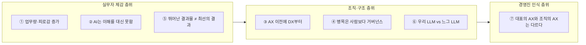
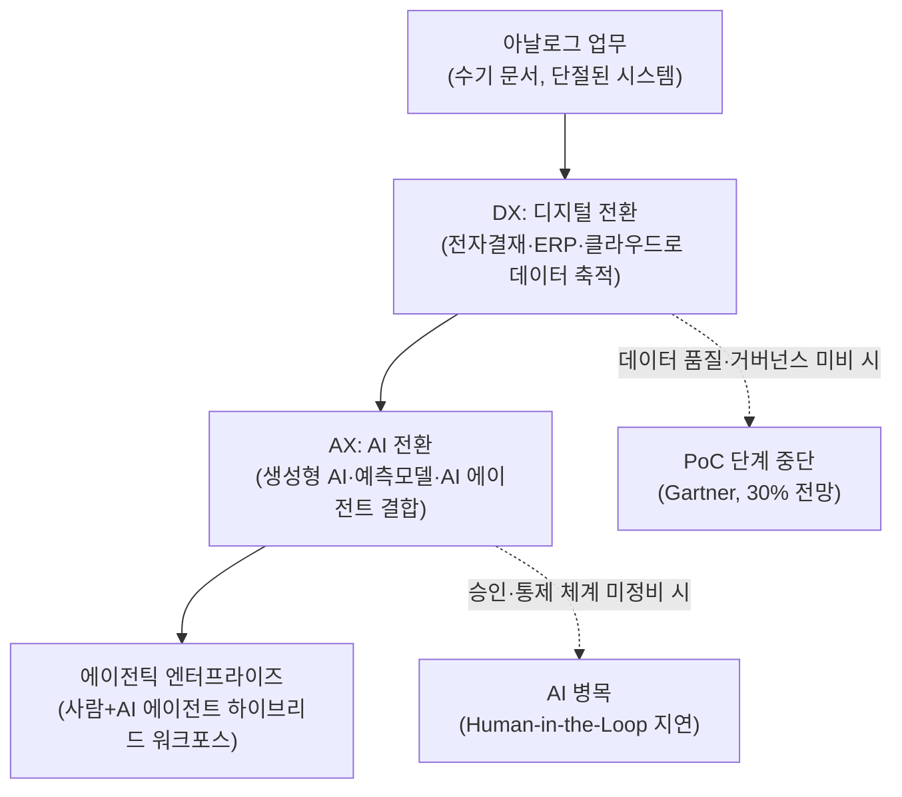

>
>DevOps엔지니어가 AX팀으로 발령 받고 난 뒤 3개월 차에 적어보는 지극히 개인적인 소회
>
>1. AI의 도입으로 업무 피로감과 업무량은 오히려 늘었다.
>2. AI가 사용자의 이해를 대신 해주지 않는다.
>3. AX이전에 DX부터 되어 있어야 한다.
>4. AX의 병목은 사람보다 거버넌스다.
>5. 뛰어난 결과물이 항상 최선의 결과를 가져다 주지 않는다.
>6. 전문가 vs 비전문가의 ChatGPT 싸움에서 이제는 우리 LLM vs 느그 LLM 싸움으로 바뀌어간다.
>7. 대표가 바라는 AX와 AX조직이 생각하는 AX는 다르다.
>
>https://www.threads.com/share/BAWhYVgI4w/
>

## 들어가며

이 글은 Threads에 올라온 한 편의 글에서 출발한다. DevOps 엔지니어로 일하던 한 실무자가 AX(AI Transformation, AI 전환) 조직으로 발령받은 뒤 3개월이 지난 시점에서, 지극히 개인적인 소회 일곱 가지를 정리해 공유한 게시물이다. 채용 공고에서나 경영진의 컨퍼런스 발표에서는 AX가 거의 예외 없이 장밋빛으로 그려지지만, 실제로 그 조직에 발을 들여 3개월을 보낸 실무자의 눈에는 전혀 다른 풍경이 보였다는 것이 이 글의 출발점이다.

이 문서는 원문의 일곱 가지 소회를 하나씩 짚으면서, 그것이 단순히 한 사람의 개인적인 불만인지 아니면 국내외 조사와 보고서에서도 반복적으로 확인되는 구조적인 현상인지를 최대한 근거를 찾아 검증했다. 원 게시물은 어디까지나 저자 한 사람의 경험과 관찰에 기반한 주관적인 기록이므로, 이 문서에서는 원문의 표현을 그대로 옮기기보다 그 안에 담긴 문제의식을 국내외 자료와 대조해 가며 풀어 썼다. 원저자의 관찰과 외부에서 확인되는 데이터는 구분해서 서술했고, 어느 쪽이 옳다고 단정하기 어려운 논쟁적인 지점은 양쪽 입장을 함께 소개했다.

## 전체 구조 한눈에 보기

일곱 가지 소회는 크게 세 층위로 나누어 볼 수 있다. 첫째는 실무자가 매일 몸으로 느끼는 층위(①, ②, ⑤), 둘째는 조직과 구조에 관한 층위(③, ④, ⑥), 셋째는 경영진의 인식에 관한 층위(⑦)다.

DX(디지털 전환)와 AX(AI 전환)가 어떻게 이어지는지를 먼저 정리하면 이후 내용을 이해하기 쉽다. 살포스코리아 블로그(2026.7.29)는 DX가 업무 프로세스를 디지털화하는 전환이라면 AX는 그 위에서 의사결정과 업무 방식 자체를 AI 중심으로 재설계하는 한 단계 높은 전환이라고 설명한다. AX가 완성된 조직을 흔히 '에이전틱 엔터프라이즈(Agentic Enterprise)'라고 부르는데, 이는 사람과 자율형 AI 에이전트가 한 팀처럼 협업하는 '사람+에이전트' 하이브리드 워크포스 구조를 가리킨다.

---

## ① AI의 도입으로 업무 피로감과 업무량은 오히려 늘었다

AX 조직으로 옮긴 뒤 가장 먼저 체감한 변화가 '일이 줄었다'가 아니라 '일이 늘었다'는 감각이었다는 진술이다. 이는 개인의 착각이 아니라 국내 설문 조사에서도 비슷한 패턴이 확인된다.

시민단체 직장갑질119가 2026년 5월 3일 공개한 조사 결과에 따르면, 직장인 1000명 중 47.1%가 자신의 일터에 AI가 도입됐거나 도입 중이라고 답했다. AI가 도입된 사업장의 응답자 471명을 기준으로 보면, 업무량에 변화가 없다는 응답이 54.1%로 가장 많았지만 늘었다는 응답(26.7%)이 줄었다는 응답(19.1%)보다 많았다. 이 단체는 AI로 자동화된 영역이 생겨도 그것이 곧바로 노동시간 단축으로 이어지지 않고, 오히려 새로운 업무가 추가로 부여되면서 노동 강도가 높아지는 경향이 있다고 분석했다.

이 현상을 이해하는 데는 맥킨지의 조사도 참고할 만하다. 포브스코리아가 소개한 맥킨지의 'State of AI 2025' 보고서(2026.1.2 보도)를 보면, 105개국 기업 종사자 1993명 가운데 88%가 하나 이상의 업무 기능에서 AI를 정기적으로 활용한다고 답했다. 2024년의 78%보다 10%포인트 늘어난 수치다. 그런데 이 가운데 60%는 AI 활용이 여전히 실험이나 시범 운영 단계에 머물러 있다고 답했다. 캐럿글로벌이 국내 기업 약 300여 곳의 HRD 담당자를 대상으로 실시한 '2026 한국기업 AI 활용 현황' 조사(2026.1.23 보도)에서도 비슷한 그림이 나온다. 생성형 AI를 도입한 기업은 61.1%에 달했지만, 전사 차원에서 AI가 완전히 내재화됐다고 답한 기업은 6.7%에 불과했다. 가장 비중이 높은 단계는 아직 본격적인 활용 이전인 탐색·준비 단계(34.8%)였다.

두 조사를 겹쳐 놓고 보면, 많은 조직이 AI를 '전사 표준 업무 체계'로 완전히 흡수하지 못한 채 개인 단위로 파편적으로 쓰고 있는 상태라는 것을 알 수 있다. 이런 과도기에는 기존 업무 절차가 그대로 남아 있는 위에 AI 활용과 검증이라는 새로운 업무가 얹히기 쉽고, 그 결과가 '일이 줄지 않고 오히려 늘었다'는 체감으로 나타나는 것으로 해석할 수 있다.

## ② AI가 사용자의 이해를 대신 해주지 않는다

이 항목은 AI가 아무리 정교한 답을 내놓아도, 그 업무가 왜 필요한지·누구를 위한 것인지·어떤 제약 조건이 있는지를 이해하는 일은 결국 사람의 몫으로 남는다는 관찰이다.

보안·거버넌스 플랫폼 제니티(Zenity)의 AI 보안·정책 옹호 책임자 케일라 언더코플러는 CIO.com과의 인터뷰(2025.12.9 보도)에서, 요구사항을 사전에 명확히 정의해 두면 겉보기에는 매력적이지만 실질적인 비즈니스 기반이 부족한 AI 프로젝트에 불필요하게 매달리지 않을 수 있다고 설명했다. 그는 AI 프로젝트를 총괄하는 조직(AI CoE)에 현재의 AI 리스크 환경을 충분히 이해하는 담당자가 반드시 필요하다고 덧붙였다. 결국 AI가 좋은 답을 내기 위한 전제 조건인 '무엇을 물어야 하는가'를 정의하는 작업 자체는 AI가 대신해 줄 수 없다는 뜻이다.

협업 플랫폼 flex의 블로그(연도 미상, 데이터 거버넌스 조사)에서는 응답자의 82%가 '구성원이 데이터 기반으로 의사결정을 할 수 없으면 데이터는 낭비된다'고 답했다는 조사 결과를 소개하면서, 데이터가 잘 정리되어 있는지보다 누가 언제 어떤 맥락에서 그 데이터에 접근하고 해석할 수 있는지가 AI 성과의 핵심이라고 짚었다. 분절된 데이터 위에서는 AI가 업무 맥락을 제대로 이해하지 못한 채 명령을 그대로 실행하는 데 그친다는 것이다.

같은 맥락에서 AI 프로젝트 실패 요인을 다룬 여러 글은 '기대치 인플레이션'이라는 표현으로 이 문제를 설명한다. AI 리터러시가 부족한 조직일수록 AI를 만능 도구로 여기고, 프로젝트가 본래 가진 실험적이고 반복적인 성격을 이해하지 못한 채 즉각적인 성과를 요구하게 된다는 지적이다(Medium, 2025.10.8). 도구가 아무리 발전해도 '이 조직에 지금 필요한 문제가 무엇인가'를 정의하는 능력은 여전히 사람에게 달려 있다는 점에서, 원문의 두 번째 소회는 여러 업계 관찰과 방향이 일치한다.

## ③ AX 이전에 DX부터 되어 있어야 한다

이 항목은 업계에서도 실제로 가장 뜨겁게 논쟁 중인 주제다. MSAP.ai의 정리 글(2026.7.29)에 따르면 이를 둘러싼 입장은 크게 두 갈래로 나뉜다.

'선행론'은 데이터와 업무 프로세스가 정비되지 않은 상태에서 AI를 얹으면 실패한다고 본다. 실제로 가트너는 생성형 AI 프로젝트의 30%가 개념검증(PoC) 이후 중단될 것으로 전망했는데(Gartner, 2024), 그 첫 번째 원인으로 데이터 품질 미흡을 꼽았다. 흩어진 문서와 뒤섞인 권한 체계 위에서는 어떤 모델도 신뢰할 만한 답을 낼 수 없으므로, 기초 공사인 DX를 먼저 마쳐야 한다는 논리다. 반대로 '병행론'은 전사 데이터가 완벽해지는 시점은 영원히 오지 않으며, 이미 데이터가 준비된 업무 영역부터 AX를 시작해 성과와 학습을 쌓아가는 편이 현실적이라고 본다.

이글루코퍼레이션의 글(2026.1.6)은 AX를 DX보다 한 단계 확장된 개념으로 정의한다. DX가 아날로그 업무를 디지털 도구로 대체하는 데 초점을 맞췄다면, AX는 데이터·모델·자동화가 조직의 판단과 실행 전반에 직접 관여하도록 만드는 전환이라는 것이다. 데이터가 디지털 형태로 쌓여야 그것이 AI의 원료가 될 수 있다는 점에서, DX는 AX의 전제 조건이라는 설명(IBM Think 인용, MSAP.ai 2026.7.26)에는 상당한 공감대가 있다.

국내 상황을 보면 이 간극이 더 뚜렷하다. 전자결재나 ERP, 클라우드 같은 DX 기반 인프라는 폭넓게 보급됐지만, AI를 실제 업무 판단에 편입한 사례는 일부 대기업과 앞선 공공기관에 몰려 있다는 것이 MSAP.ai의 진단이다. 공공기관과 금융 등 규제 산업은 개인정보보호법상 국외 이전 제한, 국가정보원 보안 가이드라인, 국가망 보안체계(N²SF) 같은 통제가 겹치면서 외부 SaaS 형태의 AI 서비스를 그대로 쓰기 어려운 구조적 제약도 있다. 참고로 국내에서는 2024년 12월 AI 기본법(인공지능 발전과 신뢰 기반 조성 등에 관한 기본법)이 국회를 통과해 2026년 1월부터 시행되고 있으며, 정부는 산업 전반의 AX 확산을 국가적 의제로 추진하고 있다.

요약하면, '기초 공사 없이 지붕부터 얹을 수는 없다'는 원문 저자의 문제의식은 업계의 '선행론'과 정확히 같은 방향이지만, 이것이 유일한 정답은 아니며 '데이터가 준비된 영역부터 시작하자'는 반론도 상당한 힘을 갖고 있다는 점은 함께 짚어둘 필요가 있다.

| 구분 | DX (디지털 전환) | AX (AI 전환) |
|---|---|---|
| 초점 | 업무 프로세스의 디지털화 | 의사결정·업무 방식의 AI 중심 재설계 |
| 핵심 산출물 | 전자결재, ERP, 클라우드, 축적된 데이터 | 생성형 AI, 예측모델, AI 에이전트 |
| 조직 형태 | 사람 + 디지털 도구 | 사람 + AI 에이전트(하이브리드 워크포스) |
| 실패 시 원인으로 자주 지목되는 것 | 비용·보안 이슈, 전사 확산 부담 | 데이터 품질, 업무 흐름과의 미결합, 거버넌스 공백 |

## ④ AX의 병목은 사람보다 거버넌스다

네 번째 소회는 업계에서 가장 최근에, 그리고 가장 구체적으로 다뤄지고 있는 주제이기도 하다. 디지털데일리(2026.5.25, 오병훈 기자)는 가트너가 발표한 보고서 '아무도 인정하고 싶어 하지 않는 AI 병목: 루프 속 인간(Human in the Loop)'을 소개하면서, AI 네이티브 업무 프로세스가 표준으로 자리 잡을수록 기업 운영 방식 자체가 바뀌어야 한다고 전했다.

이 보고서의 핵심 논리는 이렇다. 사람은 출근 시간, 회의 일정, 결재 절차, 업무 우선순위에 따라 움직이지만, AI 에이전트는 업무 시간과 무관하게 여러 시스템을 넘나들며 초 단위로 판단하고 실행한다. 그런데 기업의 의사결정 구조는 여전히 회의와 보고, 승인, 검토위원회 같은 사람 중심 절차에 머물러 있다. 빠른 엔진을 달아 놓고 매 순간 수동으로 제동을 거는 셈이라는 것이다. 보고서는 이 문제를 풀기 위한 열쇠로 '제한된 자율성'을 제시한다. AI가 단독으로 처리해도 되는 저위험 업무와, 고객 피해나 법적 책임이 걸린 고위험 업무를 미리 구분해서 시스템 안에 규칙으로 심어 두어야 한다는 것이다. 정책을 문서 파일 속에 남겨 두지 말고 '개인정보는 외부 도구로 보내면 안 된다', '일정 금액 이상 거래는 사람 승인이 필요하다'처럼 업무 흐름 안에서 자동으로 작동하는 '코드로서의 거버넌스'로 바꿔야 한다는 제언이다. 보고서는 AI 인재 병목의 본질도 모델 개발자 부족이 아니라, 업무 절차를 이해하고 위험 기준을 정하고 AI 권한 범위를 설계할 수 있는 사람의 부족이라고 짚었다.

이 진단을 뒷받침하는 조사도 있다. TrendAI가 250명 이상 규모 조직의 비즈니스·IT 의사결정권자 3700명을 대상으로 실시한 조사(byline.network, 2026.3.30 보도)에 따르면, 응답자의 66%가 보안 우려가 있는 상황에서도 경영진 압박이나 시장 상황 때문에 AI 도입을 서둘러야 한다는 압박을 경험했다고 답했다. 포괄적인 AI 정책을 이미 갖추고 있는 조직은 38%에 그쳤고, 41%는 불명확한 규제나 컴플라이언스 기준을 AI 도입의 장애 요인으로 꼽았다. IT 의사결정권자의 22%는 조직 내 AI 사용 현황을 부분적으로만 파악하고 있다고 인정했는데, 이는 비인가 AI 사용, 이른바 '섀도우 AI(Shadow AI)'가 늘어나는 배경이기도 하다.

이보다 앞서 한 블로그(디지털마케터, 2026.8.2)가 소개한 MIT NANDA의 보고서 'The GenAI Divide'(2025년 7월 발표, 원 보고서는 사례 300여 건 검토와 경영진 인터뷰 52건, 설문 153건을 근거로 함)도 비슷한 결론을 낸다. 기업의 생성형 AI 도입 시도 가운데 약 95%가 재무 성과로 이어지지 못했는데, 그 원인으로 모델 성능이 아니라 도구가 사용자의 피드백을 기억하지 못하고 실제 업무 흐름에 결합되지 못한 점을 지목했다는 내용이다. 다만 이 수치는 원 보고서를 인용한 2차 자료를 통해 확인한 것이라는 점을 밝혀 둔다.

CIO.com의 칼럼(2025.11.4)은 이 지점을 조금 다른 각도에서 설명한다. 스타트업은 대충 지은 집에서도 버틸 수 있지만 은행은 그럴 수 없다는 비유를 들며, 기업의 복잡한 승인 절차가 단순한 비효율이 아니라 보안과 개인정보, 규제 준수가 실제로 중요하기 때문에 존재하는 것이라고 짚었다. 규모가 작은 조직은 이런 요소를 가볍게 여길 수 있지만, 바로 그 때문에 대부분 PoC 단계에 머물고 본격적인 상용화에는 이르지 못한다는 것이다. 결국 병목을 '없애야 할 장애물'로만 볼 것이 아니라, AI의 속도에 맞춰 다시 설계해야 할 대상으로 보는 시각이 최근 업계 논의의 공통된 방향이라고 할 수 있다.

## ⑤ 뛰어난 결과물이 항상 최선의 결과를 가져다주지 않는다

다섯 번째 소회는 AI가 만들어내는 결과물의 '기술적 완성도'와 그것이 실제 업무에 가져다주는 '실용적 가치'가 반드시 일치하지 않는다는 관찰이다. 업계에서는 이를 흔히 '오버엔지니어링(Over-engineering)'이라는 용어로 설명한다.

주간경향의 IT 칼럼(2026.7.3)은 생성형 AI 시대의 개발자들이 '망치를 든 사람 증후군'에 빠져 있다고 지적한다. 정규표현식 몇 줄이면 끝날 텍스트 추출 작업이나 가벼운 조건문으로 충분한 판단 로직에도 수천억 개의 매개변수를 가진 대형언어모델의 API를 호출하는 식이다. 이렇게 시스템이 복잡해질수록 지연 시간이 늘어나고, 환각 현상을 잡기 위해 검증용 AI를 하나 더 덧붙이는 미봉책이 쌓이면서 전체 시스템이 카드로 쌓은 집처럼 불안정해진다는 것이다. 다만 이 칼럼은 최근 업계에서 이런 과잉에 대한 자성과 함께 실용주의로 돌아가려는 흐름도 감지된다고 덧붙였다.

이 문제를 보여주는 상징적인 사례로 자주 언급되는 것이 2017년의 Juicero 사건이다. 브런치의 관련 글(2025.12.21)에 따르면, 699달러짜리 스마트 주서기 Juicero는 테슬라 두 대를 들어 올릴 수 있는 압력 기술에 몰두했지만, 블룸버그 기자들이 직접 손으로 짜도 비슷한 결과가 나온다는 사실을 확인하면서 실리콘밸리에 충격을 안겼다. 이 사례는 엔지니어가 '할 수 있는가'에 집중하는 사이 고객은 그저 '필요한가'를 묻고 있었다는 점을 잘 보여준다. NASA는 실제로 '과도한 기능'을 개발 프로젝트 실패의 상위 10대 위험 요인으로 꼽았고, Mercedes-Benz는 오작동과 고객 불만을 이유로 600개의 비필수 기능을 차량에서 제거한 적이 있다.

DevOps와 개발 영역으로 좁혀 보면 이 문제는 더 구체적으로 드러난다. CIO.com의 칼럼(2026.2.2)은 AI 도구가 보급된 이후 오히려 뛰어난 시니어 엔지니어일수록 속도가 느려지는 역설을 다루면서, 코드 줄 수나 하루 커밋 수처럼 산출물 중심의 지표로 성과를 측정하는 방식을 멈춰야 한다고 제안한다. 대신 시니어 엔지니어가 한 달 동안 코드를 한 줄도 작성하지 않았더라도 특정 유형의 운영 환경 버그를 원천 차단하는 설계를 했다면 그것을 더 큰 성과로 인정해야 한다는 것이다. 즉 '더 많이, 더 정교하게 만들어낸 결과물'이 아니라 '문제를 애초에 만들지 않은 결과'를 기준으로 삼아야 한다는 제언인데, 이는 원문 저자가 말한 '뛰어난 결과물이 항상 최선의 결과를 가져다주지 않는다'는 소회와 정확히 맞닿아 있다.

## ⑥ 전문가 vs 비전문가의 ChatGPT 싸움에서 이제는 '우리 LLM vs 느그 LLM' 싸움으로

여섯 번째 소회는 AI를 둘러싼 경쟁 구도의 무게 중심이 바뀌고 있다는 관찰이다. 초기에는 같은 ChatGPT를 두고 누가 더 능숙하게 프롬프트를 쓰는지, 즉 개인의 활용 역량 차이가 경쟁력을 갈랐다면, 이제는 어느 조직이 더 나은 자체 LLM 또는 전용 AI 체계를 보유하고 있는지가 경쟁의 축으로 옮겨가고 있다는 것이다. 이 프레이밍 자체는 원문 저자의 독자적인 해석이지만, 그 배경이 되는 흐름은 국내 시장에서도 실제로 뚜렷하게 나타나고 있다.

알케라의 시장 동향 글(2025.10)에 따르면 국내 기업들은 이미 자체 LLM 개발에 적극적으로 나서고 있다. LG AI연구원은 2024년 8월 78억 개의 매개변수를 가진 엑사원(EXAONE) 3.0을 공개했고, 업스테이지는 SOLAR 모델을, 카카오는 카나나(Kanana) 서비스를 통해 자체 LLM을 활용하고 있다. MSAP.ai의 국내 LLM 비교 글(2026.2.3)은 여기에 네이버의 HyperCLOVA X SEED를 더하면서, 업스테이지의 SOLAR 10.7B는 Apache License 2.0을 적용해 기업이 자체적인 상용 솔루션을 개발하고 소스 코드를 공개하지 않을 권리를 가질 수 있도록 하는 등 라이선스 전략에서도 기업별로 차별화가 이뤄지고 있다고 설명한다.

같은 흐름은 통신·플랫폼 기업에서도 확인된다. ZDNet Korea의 관련 기사 모음을 보면 SK텔레콤은 중소벤처기업부가 주관하는 '2026년 모두의 챌린지 AX-LLM' 사업에 참여해 국내 스타트업의 국산 AI 모델 도입을 지원하고 있으며, 자체 개발한 A.X K2 모델을 두고 "한국이 설계부터 학습까지 자체 기술로 개발한 AI 모델이 글로벌 최고 수준에 도달할 수 있다는 가능성을 보여준 사례"라고 자평하고 있다. 국내 AI·LLM 시장 트렌드를 정리한 메이크봇의 글(2026.1.9)은 2026년 이후 엔터프라이즈 AI 경쟁의 축이 모델 성능 자체보다 Human-in-the-Loop를 얼마나 체계적으로 구현하는가로 옮겨가고 있다고 진단한다.

이 흐름을 종합하면, 개인이 얼마나 AI를 잘 쓰는지를 겨루던 무대에서 이제는 조직이 어떤 LLM을 보유하고 그것을 업무 프로세스에 얼마나 깊게 통합했는지를 겨루는 무대로 옮겨가고 있다는 원문 저자의 관찰은, 국내 사내·국산 LLM 구축 경쟁이라는 실제 산업 동향과 상당 부분 맞닿아 있다고 볼 수 있다. 다만 '우리 LLM vs 느그 LLM'이라는 표현 자체가 데이터로 검증된 개념이라기보다 저자 개인의 위트 있는 비유라는 점은 밝혀 둔다.

## ⑦ 대표가 바라는 AX와 AX조직이 생각하는 AX는 다르다

마지막 소회는 경영진과 실무 조직 사이의 인식 격차에 관한 것이다. 이 주제는 여러 국제 조사에서 가장 일관되게 확인되는 패턴 중 하나이기도 하다.

CIO.com이 소개한 구글 워크스페이스의 설문 조사(2025.12.24 보도)에 따르면, 경영진은 AI가 자사에 의미 있는 긍정적 영향을 미쳤다고 답할 가능성이 직원보다 15%포인트 더 높았다. 반면 AI로 인한 변화에 적응할 준비가 되어 있다고 답한 직원은 3명 중 1명에 그쳤다. 구글 워크스페이스의 제품 마케팅 디렉터 데릭 스나이더는 이 격차의 원인을 직원 개개인의 역량 부족이 아니라 리더십의 실패로 규정했다. 직원들은 AI에 대한 과열된 기대는 접하고 있지만, 정작 실제 업무에서 어떤 도구를 어떻게 써야 하는지에 대한 체계적인 교육과 로드맵이 부족하다고 느끼고 있다는 것이다.

이 격차를 좁히기 위한 실제 사례도 함께 소개됐다. CIO.com의 다른 기사(2025.8.11 보도)에서 이그나이트텍(Ignite Tech) 관계자 본(Bourne)은 이 문제를 기술이 아니라 리더십의 문제로 규정하며, 생산성뿐 아니라 직원의 '참여도'를 함께 측정해야 한다고 강조했다. 그는 직원들이 도입된 도구에 호기심을 느끼지 않는다면 실질적인 변화는 일어난 것이 아니라고 말하면서도, 이그나이트텍에서 이런 문화 변화가 자리 잡기까지 1년 이상이 걸렸다고 전했다. 처음에는 AI에 회의적이던 직원들이 시간이 지나면서 스스로 새로운 활용 아이디어를 제시하는 수준까지 바뀌었다는 것이다.

이 격차는 기업 규모에 따라서도 다른 양상을 보인다. EBN 뉴스(약 1개월 전 보도)는 대기업의 경우 인사·교육·IT 등 전담 부서가 AX를 체계적으로 주도하는 반면, 중소기업은 74%가 경영진 개인의 의지에 의존하고 있다고 전했다. 기사에 인용된 한 교수는 단순히 도구 사용법을 익히는 것과 그것을 실제 업무 프로세스에 접목하는 것은 완전히 다른 차원의 문제이며, 그 사이를 메우는 시행착오의 시간이 여력이 부족한 중소기업 실무진에게는 큰 비용이자 장벽으로 작용한다고 짚었다.

뉴스밸류의 심층 분석 기사(2026.9.12 보도)는 이 문제를 리더십의 관점 전환이라는 틀로 설명한다. 경영진이 AI를 단순히 비용 절감 수단으로만 접근하면 조직 구성원은 이를 인력 감축의 신호로 받아들이게 되지만, 반대로 AI를 구성원의 생산성과 의사결정 능력을 높이는 도구로 설계하고 재교육·직무 전환을 병행하면 조직의 수용성을 높일 수 있다는 것이다. 결국 AX가 성공하느냐는 기술을 얼마나 많이 들여왔는지가 아니라, 그로 인한 생산성 향상을 조직 구성원의 새로운 역량과 어떻게 연결하느냐에 달려 있다는 진단이다. '대표가 바라는 AX'와 '실무 조직이 체감하는 AX' 사이의 간극은 한 사람의 특수한 경험이 아니라, 국내외 여러 조사에서 공통적으로 확인되는 구조적 현상이라고 볼 수 있다.

---

## 일곱 가지 소회 종합 정리

| 번호 | 소회 요약 | 성격 | 뒷받침하는 주요 근거 |
|---|---|---|---|
| ① | AI 도입 후 업무 피로감·업무량 증가 | 개인 경험 + 외부 데이터로 검증됨 | 직장갑질119(2026.5), 맥킨지 State of AI 2025, 캐럿글로벌 조사(2026.1) |
| ② | AI는 사용자의 이해를 대신하지 않음 | 개인 경험 + 다수 전문가 견해와 일치 | Zenity(CIO.com, 2025.12), flex 블로그, Medium 기고(2025.10) |
| ③ | AX 이전에 DX가 선행되어야 함 | 업계 내 '선행론 vs 병행론' 논쟁 중 | MSAP.ai(2026.7), Gartner PoC 중단률 전망, 이글루코퍼레이션(2026.1) |
| ④ | AX의 병목은 사람보다 거버넌스 | 최근 업계에서 강하게 부상 중인 진단 | Gartner 보고서(디지털데일리, 2026.5), TrendAI 조사(2026.3), MIT NANDA(2차 인용) |
| ⑤ | 뛰어난 결과물이 최선의 결과는 아님 | 오버엔지니어링 담론과 일치 | 주간경향(2026.7), CIO.com 칼럼(2026.2), Juicero 사례 |
| ⑥ | '우리 LLM vs 느그 LLM' 구도로 전환 | 저자의 비유적 해석, 배경 산업동향은 실재 | 국내 사내·국산 LLM 구축 경쟁(EXAONE, SOLAR, Kanana, A.X K2) |
| ⑦ | 대표의 AX와 AX조직의 AX는 다름 | 국제 조사에서 반복 확인되는 패턴 | Google Workspace 설문(CIO.com, 2025.12), EBN(2026), 뉴스밸류(2026.9) |

## 마무리

일곱 가지 소회를 하나씩 뜯어보면, 이 글이 그저 한 실무자의 넋두리로 치부하기 어려운 이유가 드러난다. 업무량 증가, AI 도입 이후에도 여전히 사람에게 남는 맥락 이해의 책임, DX와 AX의 선후 관계 논쟁, 사람의 승인 절차에 막힌 AI 에이전트, 결과물의 완성도와 실용성 사이의 괴리, 자체 LLM 구축 경쟁, 경영진과 실무 조직 사이의 온도차까지, 모두 국내외 조사기관과 컨설팅사, 학계 보고서에서 최근 1~2년 사이 반복적으로 다뤄지고 있는 주제들이다.

다만 이 모든 근거는 어디까지나 원문 저자의 개인적인 소회에 맥락과 데이터를 더해 살펴본 것일 뿐, 그가 속한 조직의 상황을 그대로 대변하거나 모든 AX 조직에 똑같이 적용되는 일반 법칙이라고 단정할 수는 없다. AX는 여전히 조직마다, 산업마다 전개 속도와 양상이 크게 다른 현재진행형의 전환이며, 3개월이라는 시간은 그 흐름의 아주 초기 국면을 관찰한 스냅샷에 가깝다는 점도 함께 유념할 필요가 있다.

---

작성일: 2026년 9월 16일
