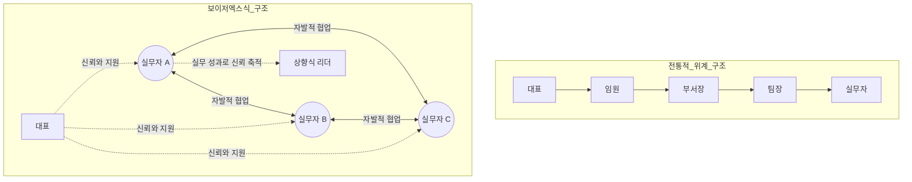
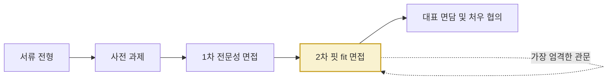
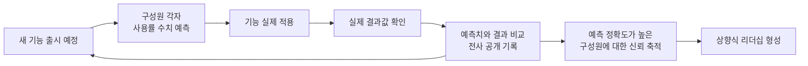
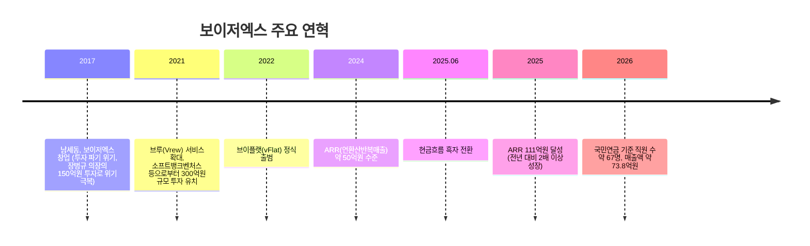

### — 남세동 대표 페이스북 게시글 상세 해설 —

> 
> 보이저엑스에서는 팀 간, 직군 간, 직무 간 벽 없이 일한다. 개발자가 디자인하고, 디자이너가 개발하고, QA가 기획하는 것이 자연스럽고 환영받는다.
> 
> 보이저엑스에서는 구성원들이 서로 많은 정보를 공유한다. 개인 보상 등의 기밀 정보 외에는 사업과 서비스의 좋고 나쁜 소식을 바로바로 공유한다.
> 
> 보이저엑스에는 중간 관리자가 거의 없다. 상향식으로 자연스럽게 정해진 리더들이 있는데 이 리더들은 실무에 모범이 되는 사람들이다. 
> 
> 보이저엑스는 구성원이 하고 싶은 일이 회사의 가치와 맞기만 하다면 그 일을 마음껏 할 수 있도록 물심양면으로 지원한다. 
> 
> 보이저엑스는 지식과 경험이 아무리 많더라도 팀워크나 언러닝에 대한 우려가 해소되지 않으면 채용하지 않는다.
> 
> 보이저엑스의 이 모든 철학과 문화와 정책은 인공지능과 무관하게 가꾸어 온 것이었다. 
> 
> 그런데 이제 보니 인공지능 시대에 필요한 것들이었다.
> 
> 천운이라 생각한다.
> 
> https://www.facebook.com/share/p/19GES98TiN/
> 

---

## 0. 이 문서에 대하여

이 문서는 보이저엑스(VoyagerX) 남세동 대표가 페이스북에 올린 조직문화 관련 게시글(원문 링크: `facebook.com/share/p/19GES98TiN`)을 상세히 풀어 설명하기 위해 작성되었다. 해당 게시글의 요지는 다음 다섯 가지 문장으로 요약된다.

1. 팀·직군·직무 간 벽 없이 일한다. 개발자가 디자인하고, 디자이너가 개발하고, QA가 기획하는 것이 자연스럽고 환영받는다.
2. 구성원들이 개인 보상 등 기밀 정보를 제외한 사업·서비스의 좋고 나쁜 소식을 즉시 공유한다.
3. 중간 관리자가 거의 없다. 리더는 상향식으로 자연스럽게 정해지며, 실무의 모범이 되는 사람들이다.
4. 회사의 가치와 맞는 한, 구성원이 하고 싶은 일을 마음껏 할 수 있도록 물심양면으로 지원한다.
5. 지식과 경험이 많아도 팀워크나 언러닝(unlearning)에 대한 우려가 해소되지 않으면 채용하지 않는다.

그리고 남 대표는 이 모든 철학과 문화, 정책이 인공지능과 무관하게 오랫동안 가꾸어온 것이었는데, 돌아보니 인공지능 시대에 꼭 필요한 것들이었다며 이를 "천운"이라 표현했다.

**먼저 밝혀둘 점**: 페이스북(Facebook)은 로봇 배제 표준(robots.txt)에 의해 외부 자동 접근이 차단되어 있어, 게시글 원문에 직접 접속해 전체 맥락(사진, 댓글, 정확한 게시 일자 등)을 확인하는 것은 불가능했다. 따라서 이 문서는 (1) 사용자가 제공한 게시글 본문 텍스트를 원문 그대로의 근거로 삼고, (2) 그 안에 담긴 각 주장이 보이저엑스에 대한 기존의 공개된 인터뷰·기사·채용공고·재무자료와 실제로 얼마나 부합하는지를 교차 검증하는 방식으로 작성되었다. 즉 이 문서는 게시글 자체의 사실 여부를 판정하는 글이 아니라, 게시글의 각 주장이 그동안 언론과 채용 자료를 통해 알려진 보이저엑스의 실제 운영 방식과 어떻게 연결되는지를 촘촘히 짚어보는 해설 자료다. 검증이 어려운 부분(예: 게시 정확한 날짜, 게시글에 달린 반응)은 추측하지 않고 "확인 불가"로 명시했다.

---

## 1. 보이저엑스는 어떤 회사인가

### 1.1 창업자와 창업 배경

보이저엑스는 개발자 남세동이 2017년 3월 8일 설립한 인공지능 소프트웨어 스타트업이다. 남세동 대표는 카이스트 전산과 출신으로, 1998년 네오위즈에 인턴으로 입사해 웹 채팅 서비스 '세이클럽'을 만들었고, 이후 검색 스타트업 '첫눈'의 창업 멤버로 참여해 이 회사를 네이버에 350억원에 매각한 이력이 있다. 네이버로 이직한 뒤에는 카메라 애플리케이션 'B612'와 'LINE camera'의 개발·운영을 총괄했으며, 8개월 만에 다운로드 1억 건을 달성하는 등의 성과로 '천재 개발자'라는 수식어가 따라붙었다. 2015년 네이버를 퇴사하고 2년의 준비 기간을 거쳐 2017년 보이저엑스를 창업했다.

창업 초기에는 투자 계약이 성사 직전에 일방적으로 파기되는 위기를 겪었는데, 이때 네오위즈 공동창업자이자 카이스트 전산과 선배인 장병규 크래프톤 의장이 개인 자금 150억원을 투자해 회사를 구제한 일화가 여러 매체를 통해 알려져 있다. 이 경험은 남세동 대표가 이후 스타트업 투자 관행의 불투명성을 공개적으로 문제 제기하는 계기가 되기도 했다.

### 1.2 주요 제품

보이저엑스는 딥러닝 기술을 활용해 실생활에 도움이 되는 소프트웨어를 만드는 것을 지향한다. 주요 제품은 다음과 같다.

| 제품명 | 분야 | 핵심 기능 |
|---|---|---|
| 브루 (Vrew) | AI 영상 편집기 | 음성을 텍스트로 자동 변환(STT)해, 마치 문서를 편집하듯 자막·영상을 편집할 수 있게 함 |
| 브이플랫 (vFlat) | AI 모바일 스캐너 | 책이나 문서를 스마트폰 카메라로 왜곡 없이 스캔 |
| 온글잎 | AI 폰트 생성 | 개인의 손글씨를 학습해 디지털 폰트로 변환 |
| VOC STUDIO | 고객 문의 분석 솔루션(B2B) | 기업의 고객 문의 데이터를 분석 |

이 중 브루와 브이플랫이 매출의 90% 이상을 차지하는 핵심 사업이며, 두 제품 모두 오랜 무료 서비스 기간을 거쳐 유료 구독 모델로 전환하는 전략을 취했다.

### 1.3 최근 사업 현황 (2025~2026년 기준)

- 2026년 국민연금 가입자 기준 직원 수는 약 67명이며, 2025년 매출액은 약 73억 8,171만 원으로 집계된다.
- 업계 분석 자료에 따르면 보이저엑스는 브루·브이플랫·VOC 스튜디오 세 제품으로 연환산반복매출(ARR) 111억원을 달성했으며, 2025년 6월 현금흐름 흑자로 전환했다. ARR은 2024년 5월 약 50억원에서 2025년 5월 약 111억원으로 1년 새 두 배 이상 성장한 것으로 파악된다.
- 채용 공고 자료(2025년 기준)에 따르면 조직 구성은 개발자 약 40명, 기획자 5명, 디자이너 5명, QA 4명, 사업 1명, HR 2명, 재무 2명, 마케팅 2명 등 총 약 60명 규모였다. 즉 개발자가 조직의 다수를 차지하지만, 기획·디자인·QA·마케팅 등 비개발 직군도 고르게 존재하는 균형 잡힌 구조다.
- 보이저엑스는 5년에 가까운 무료 서비스 기간을 거쳐 유료 전환을 단행했음에도 이용자 이탈 없이 구독 매출로 안착시킨 사례로 업계에서 주목받고 있다.

이러한 성장 곡선을 배경에 둔 채로 게시글에서 언급된 다섯 가지 조직문화 원칙을 하나씩 짚어보면, 왜 이 문화가 "성과와 무관하게 지켜온 신념"이 아니라 "성과를 실제로 만들어낸 운영 체계"로 읽히는지가 드러난다.

---

## 2. 게시글의 다섯 가지 원칙 상세 해설

### 2.1 "팀 간, 직군 간, 직무 간 벽 없이 일한다"

게시글의 첫 문장은 개발자가 디자인하고, 디자이너가 개발하고, QA가 기획하는 것이 자연스럽고 환영받는다고 말한다. 이는 단순한 구호가 아니라 실제 채용 공고 문구에서도 일관되게 드러나는 원칙이다. 보이저엑스의 디자이너 채용 공고에는 "기획, 개발, 사업, 마케팅 등 다양한 직군의 동료들과 협업합니다"라는 항목이 공통적으로 들어가며, 채용 면접 제도 자체에도 이 원칙이 구조적으로 심어져 있다.

한국일보 인터뷰에 따르면 보이저엑스의 면접관 조는 총 4명(직군 면접관 2명, 비직군 면접관 1명, 참관인 1명)으로 구성되는데, 이때 비직군 면접관을 반드시 포함시키는 이유가 바로 "스타트업의 모든 일의 기본 문법이 팀워크"이기 때문이라고 설명한다. 예컨대 개발자를 뽑는 면접에 현직 디자이너가 면접관으로 들어가 서로 다른 언어를 쓰는 두 사람이 같은 그림을 그려나갈 수 있는지를 미리 점검하는 식이다. 이는 직군 간 벽을 허무는 문화를 채용 단계에서부터 제도화한 사례로 볼 수 있다.

또한 신입사원은 입사 후 브루, 브이플랫, 온글잎 등 각 팀에 대한 설명을 들은 뒤 스스로 일할 팀을 선택하며, 팀이 맞지 않는다고 느끼면 이유를 따지지 않고 언제든 팀을 옮기거나 떠날 수 있는 구조다. 이런 유동성은 한 사람이 하나의 직무·팀에 고정되지 않고 여러 영역을 넘나들 수 있는 조직 설계와 맞닿아 있다.

### 2.2 "구성원 간 정보를 투명하게 공유한다"

게시글은 개인 보상 등 기밀 정보 외에는 사업과 서비스의 좋고 나쁜 소식을 바로바로 공유한다고 말한다. 이와 직접적으로 연결되는 사례가 보이저엑스의 '반성 프로세스'다. 새로운 기능이 추가될 때마다 팀의 모든 구성원이 이 기능을 사용자가 얼마나 사용할지 수치로 예측하고, 실제 결과가 나오면 예측치와 대조하는 절차를 거친다. 이 예측과 결과의 기록은 회사 전체가 함께 쓰는 협업 툴(노션)의 데이터베이스에 남으며, 다른 팀의 반성 프로세스 결과값까지 누구나 클릭 몇 번으로 조회할 수 있다고 한다. 즉 특정 기능의 성공과 실패, 그리고 누가 그것을 잘 예측했는지가 조직 전체에 투명하게 공개되는 구조다.

이러한 투명성은 계급이나 연차와 무관하게 작동한다. 신입이든 대표든 이 기록 앞에서는 동일한 기준으로 평가받으며, 남세동 대표 스스로도 "대표고 리더고 신입이고 할 것 없이 우리 모두가 매일 틀린다는 사실을 알게 된다"고 밝힌 바 있다. 좋은 소식이든 나쁜 소식이든 숨기지 않고 기록에 남기는 이 문화가, 게시글에서 말하는 "정보 공유"의 실질적인 작동 방식으로 이해할 수 있다.

### 2.3 "중간 관리자가 거의 없으며, 리더는 상향식으로 정해진다"

보이저엑스 채용 페이지에는 다음과 같은 문구가 실제로 등장한다.

> "보이저엑스에서는 일을 시키는 사람이 따로 없습니다. 완전히 그런 것은 아니고 대략 그렇습니다. 팔십프로 정도랄까요. 중간관리자도 없습니다."

프로젝트가 시작되는 방식도 상명하달이 아니다. 누군가 해보고 싶은 프로젝트를 제안하거나 기존 프로젝트 목록 중 하나를 선택해 본인이 시작해보겠다고 나서고, 관심 있는 사람들이 모여 이것이 회사가 해볼 만한 일인지 토론한 뒤 진행 여부를 정한다. 리더 역시 직위로 임명되는 것이 아니라, 사용자 행동을 가장 정확히 예측한 사람이 자연스럽게 신뢰를 얻는 반성 프로세스처럼, 실무에서 반복적으로 옳은 판단을 내린 사람이 상향식으로 신뢰를 축적하며 리더가 되는 구조에 가깝다. 실제 서비스 소개 자료에도 vFlat과 Vrew 각각에 대표(CEO)가 아닌 "리더"라는 직함이 쓰이는 것이 확인된다.

이런 구조에서 새 프로젝트를 제안했는데 아무도 자원하지 않으면 그 프로젝트는 자연스럽게 폐기(kill)되고, 반대로 아무리 특이해 보이는 프로젝트라도 자원자가 모이면 대표나 리더가 막지 않는다는 것이 인터뷰를 통해 소개된 원칙이다. 이는 "리더가 일을 배분하는" 전통적 위계가 아니라, "구성원의 자발적 참여가 곧 프로젝트의 존속 여부를 결정하는" 시장 논리에 가까운 운영 방식이다.

### 2.4 "하고 싶은 일이 회사 가치와 맞으면 마음껏 지원한다"

이 원칙은 앞서 설명한 상향식 리더십 구조와 맞물려 작동한다. 신입사원이 입사 직후 가장 먼저 받는 질문이 "어떤 일이 하고 싶어요?"이며, 실제로 1지망 팀에 배정되는 비율이 80%에 달한다고 알려져 있다. 또한 원한다면 언제든 이유 없이 100% 팀을 옮기거나 떠날 수 있다.

한 사례로, 브루 팀 내부에서 '자막 생성 기능을 더 강화하자'는 의견과 '새로운 기능(무료 라이브러리, TTS 등)을 추가하자'는 의견이 갈려 합의가 되지 않았을 때, 회사는 양쪽 모두에게 자원을 배분해 동시에 진행하도록 했고 1년 후 두 방향 모두 성공(수치 기준 10배 이상 성장)했다는 사례가 소개된 바 있다. 이는 '해보고 싶다'는 구성원의 의지를 꺾지 않고 검증의 기회를 주는 방식이 실제 성과로 이어진 사례로 언급된다.

다만 이 자유는 무조건적인 것은 아니다. 게시글 원문에도 "회사의 가치와 맞기만 하다면"이라는 전제가 붙어 있다. 즉 보이저엑스가 중요하게 여기는 3대 가치인 사용자, 팀워크, 성장이라는 틀 안에서의 자유이며, 이 틀을 벗어나는 제안까지 무제한으로 지원한다는 의미는 아니라는 점에 유의할 필요가 있다.

### 2.5 "팀워크나 언러닝에 대한 우려가 해소되지 않으면 채용하지 않는다"

이 항목이 다섯 가지 원칙 중 채용 과정에서 가장 구체적이고 엄격하게 제도화되어 있는 부분이다. 보이저엑스의 채용 단계는 서류 → 사전과제 → 1차 전문성 면접 → 2차 핏(fit) 면접 → 대표 면담 및 처우 협의의 5단계로 구성되는데, 이 중 다른 회사에서는 흔히 형식적인 통과의례로 취급되는 '핏 면접' 단계가 보이저엑스에서는 그 이전까지의 모든 결과를 뒤집을 수 있을 만큼 가장 단호하고 엄격한 관문으로 운영된다고 한다.

핏 면접에서는 두 가지 질문 원칙이 적용된다. 첫째, 납득되지 않는 답변은 구체성이 드러날 때까지 계속 캐묻는다. 둘째, 미래에 대한 포부보다 과거의 실제 경험을 집요하게 확인한다. 예컨대 "가장 성실했던 경험"을 묻고 답을 들은 뒤 세부사항을 재차 확인하는 방식으로 지원자의 실제 몰입 수준과 진정성을 가려낸다.

지원율 대비 채용률도 매우 낮은 편으로, 분기당 500~1,000명이 지원해 5명 안팎만 최종 채용되는 것으로 알려져 있다(약 1/100~1/200 수준). 남세동 대표는 "지원자가 적어서가 아니라, 아무리 일손이 급해도 절대 채용 기준을 낮추지 않겠다"는 방침을 유지한다고 밝혔다.

'언러닝(unlearning)' 개념은 보이저엑스 채용에서 각별히 강조되는 기준이다. 2021년 포브스코리아 인터뷰에서 남세동 대표는 이렇게 설명한다.

> "기술 발전 속도가 너무 빨라서 내가 알고 있는 딥러닝 지식이 3년도 채 안 돼 가치가 사라진다. 그래서 끊임없이 배우는 사람만 살아남을 수 있다. … 이런 산업의 특성 때문에 우리가 인재 채용 시 가장 중요하게 생각하는 능력은 언러닝이다. 자기가 이미 알고 있는 기술과 지식에 집착하지 않고 계속 업그레이드할 수 있는 사람들만 함께하고 있다."

즉 언러닝은 단순히 "새로운 것을 배우는 능력"이 아니라, "이미 옳다고 믿었던 자신의 지식과 판단을 스스로 폐기할 수 있는 능력"에 가깝다. 이는 앞서 설명한 반성 프로세스—모두가 예측하고, 틀렸음을 확인하고, 그 틀림을 기록하는 문화—를 통해 조직 차원에서 반복적으로 훈련되는 역량이기도 하다.

---

## 3. 왜 "천운"인가: 오래된 문화와 AI 시대의 우연한 정합성

게시글의 마지막 문장, 즉 "이 모든 것은 인공지능과 무관하게 가꾸어온 것이었는데, 이제 보니 인공지능 시대에 필요한 것들이었다"는 대목은 이 게시글 전체의 핵심 메시지라 할 수 있다. 이를 뒷받침할 만한 근거를 정리하면 다음과 같다.

**첫째, 언러닝이라는 채용 기준 자체가 AI 산업의 특성에서 비롯되었다.** 앞서 인용한 것처럼 남세동 대표는 이미 2021년부터(즉 생성형 AI 붐이 본격화되기 이전부터) "3년도 안 되어 지식이 무가치해지는" 딥러닝 업계의 특성 때문에 언러닝을 최우선 채용 기준으로 삼아왔다고 밝혔다. 이는 오늘날 "실행 능력은 AI가 빠르게 흡수하고, 사람에게 남는 차별화 요소는 기존 지식에 대한 집착을 내려놓고 계속 업데이트하는 능력"이라는 인식과 정확히 맞닿아 있다.

**둘째, 중간관리자가 거의 없는 구조는 원래 스타트업의 속도를 위해 채택된 것이지만, 결과적으로 AI 도구를 실무자가 직접 판단하고 즉시 적용할 수 있는 여지를 넓혀준다.** 지시를 기다리는 위계 구조가 아니라 "하고 싶은 사람이 자원해서 진행하는" 구조에서는, 실무자 개개인이 새로운 AI 도구나 작업 방식을 스스로 시도하고 그 결과를 곧바로 조직에 공유하는 일이 훨씬 자연스럽게 일어난다.

**셋째, 직군 간 벽이 없는 협업 방식은 생성형 AI로 인해 각 직무의 실행 장벽이 낮아진 환경과 구조적으로 맞아떨어진다.** 개발자가 디자인 도구를 다루고 디자이너가 코드를 다루는 일이 예전보다 훨씬 쉬워진 시대에, 애초부터 직군 간 이동과 겸업을 자연스럽게 여겨온 조직 문화는 이러한 변화에 적응할 준비가 이미 되어 있었던 셈이다.

**넷째, 반성 프로세스로 대표되는 투명한 정보 공유와 결과 기록 문화는, 조직이 새로운 기술이나 업무 방식을 도입했을 때 그 효과를 왜곡 없이 빠르게 검증하고 다음 판단에 반영할 수 있게 해주는 인프라 역할을 한다.** 이는 특정 기술 하나가 아니라 조직의 학습 속도 자체를 높이는 장치라는 점에서, 기술 변화 주기가 매우 짧은 AI 시대에 특히 유효한 자산이 된다.

정리하면, 남세동 대표가 "천운"이라고 표현한 것은 다음과 같은 의미로 해석할 수 있다. 보이저엑스는 애초에 AI 시대를 예측하고 이런 문화를 설계한 것이 아니라, 좋은 조직을 만들기 위한 나름의 원칙(사용자, 팀워크, 성장이라는 3대 가치와 언러닝이라는 채용 기준)을 오랫동안 쌓아왔을 뿐인데, 결과적으로 그 원칙들이 지금의 AI 전환기 조직에 요구되는 조건들과 상당 부분 겹쳤다는 뜻이다.

---

## 4. 조직 구조를 도식으로 보면

### 4.1 전통적 위계 구조와 보이저엑스식 구조 비교

전통적 위계 구조에서는 정보와 지시가 위에서 아래로 흐르고, 중간 단계마다 여러 명의 관리자가 존재한다. 반면 보이저엑스식 구조에서는 대표가 실무자를 직접 신뢰하고 지원하는 형태로 연결되며, 리더는 직위 임명이 아니라 실무에서 쌓은 신뢰를 통해 상향식으로 형성된다. 실무자들 사이의 협업 역시 직군의 경계 없이 자발적으로 이루어진다.

### 4.2 채용 프로세스 흐름

핏 면접(2차)은 이전 단계의 좋은 평가를 뒤집을 수도 있을 만큼 결정적인 단계로, 팀워크와 언러닝 역량을 집중적으로 검증하는 관문이다.

### 4.3 반성 프로세스(예측-검증-기록) 순환 구조

이 순환 구조는 한 번의 이벤트로 끝나지 않고 기능이 추가될 때마다 반복되며, 그 기록이 누적되어 조직 내 신뢰와 리더십의 근거가 된다는 점이 특징이다.

### 4.4 보이저엑스 약사(略史) 타임라인

---

## 5. 게시글에서 검증이 필요하거나 확인되지 않은 부분

이 문서는 사실과 추측을 명확히 구분하는 것을 원칙으로 삼는다. 다음 사항은 이번 조사 과정에서 확인하지 못했거나, 시점에 따라 달라질 수 있는 정보이므로 별도로 밝혀둔다.

- 게시글의 정확한 게시 일자는 페이스북 원문에 직접 접근하지 못해 확인할 수 없었다.
- 2021년 포브스코리아 인터뷰에는 장병규 크래프톤 의장이 보이저엑스의 "공동대표"를 맡았다는 표현이 등장하지만, 2026년 기준 사람인(saramin) 기업정보에는 대표자명이 남세동 단독으로 명시되어 있다. 즉 장병규 의장의 정확한 현재 직함(이사회 참여 여부, 공동대표 유지 여부 등)은 시점에 따라 변경되었을 가능성이 있으며, 이 문서에서는 "2017년 투자 위기 당시 개인 자금을 투자해 회사를 구제한 인물"이라는, 여러 자료에서 공통적으로 확인되는 사실까지만 명시했다.
- "남우리"라는 인물이 일부 언론 인터뷰에서 "대표"로 언급되었으나, 정확한 직책과 역할은 이번 조사에서 명확히 확인하지 못했다.
- 반성 프로세스, 팀 자유 이동, 핏 면접 등 구체적 운영 방식에 대한 근거는 2021~2023년 사이의 인터뷰에 기반한 것으로, 2026년 현재 시점에도 동일한 방식으로 운영되고 있는지는 별도로 확인되지 않았다. 다만 채용 공고 등 최신 자료에서도 "다양한 직군과의 협업"을 강조하는 문구가 일관되게 유지되고 있어, 기본 방향성 자체는 이어지고 있는 것으로 보인다.

---

## 6. 용어 정리

| 용어 | 설명 |
|---|---|
| 언러닝 (Unlearning) | 이미 습득한 지식이나 기존의 판단 방식에 집착하지 않고, 그것이 틀렸음을 인정하며 새로운 방식으로 계속 업그레이드하는 능력. 보이저엑스가 채용에서 가장 중요하게 보는 역량 중 하나 |
| 반성 프로세스 | 새 기능을 출시하기 전 구성원 각자가 그 기능의 사용률 등을 수치로 예측하고, 실제 결과와 대조해 기록하는 보이저엑스의 자체 프로세스. 사내에서는 '무당 뽑기'라는 별칭으로도 불린다 |
| 핏(fit) 면접 | 지원자가 조직의 가치(사용자, 팀워크, 성장)와 실제로 맞는 사람인지를 검증하는 면접 단계로, 보이저엑스 채용 절차에서 가장 결정적인 관문으로 운영된다 |
| 자기 동력 | 외부의 지시 없이도 스스로 일의 주도권을 쥐고 움직이는 성향. 보이저엑스가 추구하는 핵심 인재상 |
| ARR (Annual Recurring Revenue) | 연환산반복매출. 구독형 서비스에서 향후 1년간 반복적으로 발생할 것으로 예상되는 매출을 연 단위로 환산한 지표 |

---

## 7. 출처 신뢰도 표기

이 문서에서 사용한 근거 자료는 신뢰도에 따라 다음 네 단계로 분류할 수 있다.

**[1단계: 공식 1차 출처]**
- 보이저엑스 공식 채용 페이지 및 채용 공고 문구(원티드, 슈퍼루키, IN THIS WORK 등에 게재된 원문 인용)

**[2단계: 복수 매체 교차검증]**
- 한국일보 커리업 인터뷰(2023), 포브스코리아 인터뷰(2021), zum·네이트 뉴스 공동 배급 인터뷰(2021) 등 여러 매체에서 공통적으로 확인되는 남세동 대표의 발언(예: 언러닝 강조, 중간관리자 최소화, 자기 동력 인재상)

**[3단계: 단일 출처]**
- 데모데이(demoday.co.kr)의 보이저엑스 비즈니스 모델 분석 기사(2026년 4월)에 기반한 ARR·현금흐름 흑자 수치
- 조이너리(joinery.kr) 채용 페이지에 인용된 "중간관리자도 없습니다" 남세동 대표 발언 원문
- 인더트리스워크(inthiswork.com) 채용 공고에 기재된 직군별 인원 구성(2025년 기준)

**[4단계: 분석적 종합·편집 판단]**
- 3장("왜 천운인가")의 해석은 남세동 대표의 실제 발언과 보이저엑스의 공개된 운영 방식을 근거로 하되, 그 인과관계와 함의를 문서 작성자가 종합적으로 정리한 분석이다. 이는 보이저엑스 측이 공식적으로 표명한 해석이 아니라는 점에 유의할 필요가 있다.

---

## 8. 참고문헌

1. 한국일보 커리업, "'응 너 틀렸어, 그게 당연해'- 남세동 맨땅브레이커 하편" (2023.05.10) — https://www.hankookilbo.com/careerup/v/2023051101/
2. 포브스코리아, "김익환이 만난 혁신 기업가(30) 남세동 보이저엑스 대표" (2021.11.25) — https://www.forbeskorea.co.kr/news/articleView.html?idxno=334968
3. ZUM 뉴스, "보이저엑스 남세동 '좋은 회사 많아지면 좋은 AI 서비스도 많아져요'" (2021.09) — https://m.news.zum.com/articles/70819759
4. 네이트 뉴스(동일 인터뷰 배급본) (2021.09.18) — https://news.nate.com/view/20210918n13276
5. 조이너리(Joinery) 보이저엑스 채용 페이지 — https://www.joinery.kr/companies/voyagerx
6. IN THIS WORK, "보이저엑스｜프로덕트 디자이너 채용" / "보이저엑스｜개발 인턴 채용" (2025) — https://inthiswork.com
7. 데모데이(Demoday), "보이저엑스 수익구조 분석: ARR 111억·현금흐름 흑자로" (2026.04.13) — https://demoday.co.kr/bm-analysis/173
8. 사람인, "(주)보이저엑스 2026년 기업정보" — https://www.saramin.co.kr
9. THE VC, "보이저엑스(브루) 기업정보" — https://thevc.kr/voyagerx
10. 넥스트유니콘, "(주)보이저엑스(브루(Vrew)) 기업정보" — https://www.nextunicorn.kr/company/4fe12d3bc4c37cd8
11. 채널톡 블로그, "보이저엑스 남세동 대표, 인공지능 회사의 의외의 비밀무기는?" (2023.06.20) — https://channel.io/ko/blog/articles/74a824aa
12. 사용자가 제공한 페이스북 게시글 원문 텍스트 (남세동, 보이저엑스 대표) — https://www.facebook.com/share/p/19GES98TiN/ (자동 접근 차단으로 원문 직접 확인 불가, 본문 텍스트는 사용자 제공)

---

*이 문서는 2026년 9월 기준으로 검색 가능한 공개 자료를 바탕으로 작성되었으며, 이후 보이저엑스의 조직 운영 방식이나 재무 상황이 변경되었을 가능성이 있다.*
