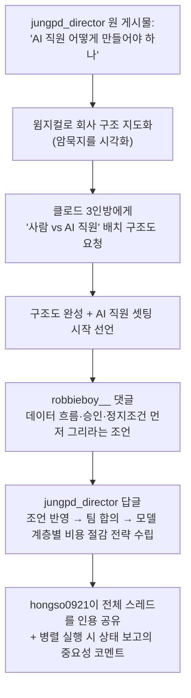
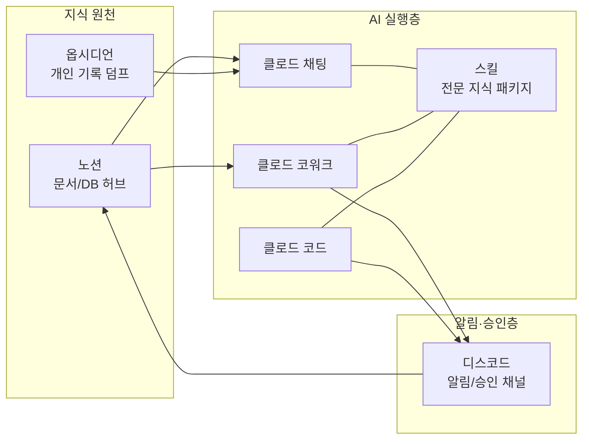
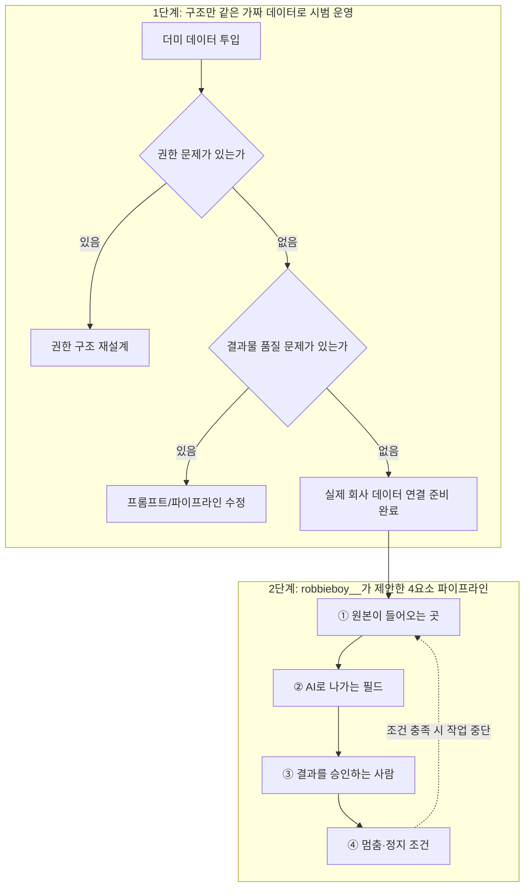
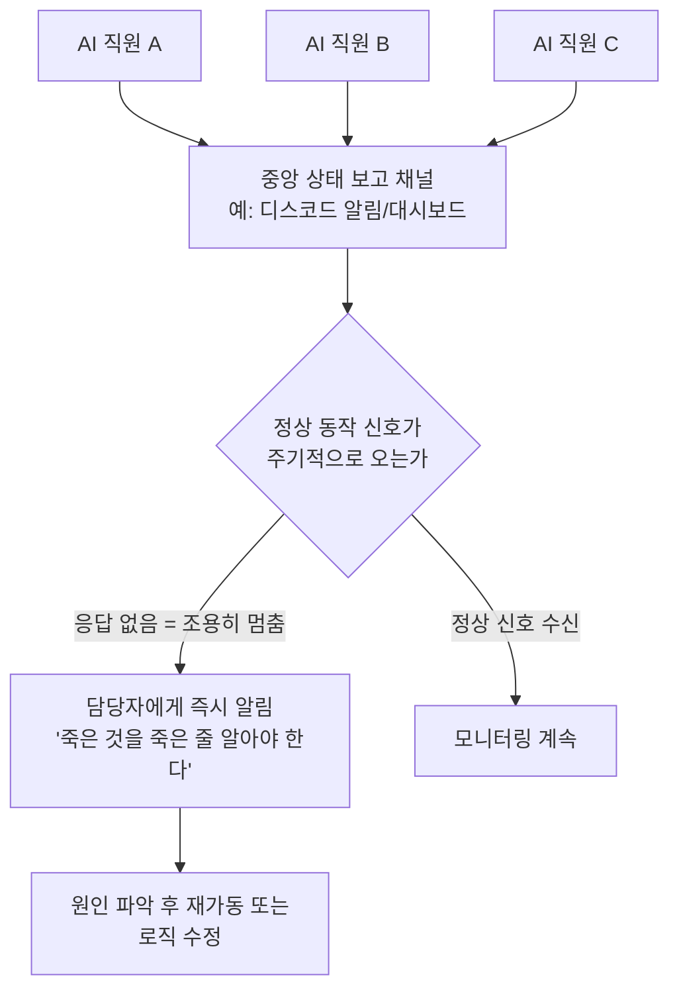

```

AI 전환 실무: 이분이 진짜 해본분 같음. 특히 회사 암묵지(혹은 예전 실데이터들)로 테스트 가보면서 플로우 수리하고 가는거.

당연히 하고 계시겠지만, 여기서 멈춘 순간 조용해지지 않게 리포트를 받아야 됨. 
여러개를 굴려나가면 멈춘순간 죽는것도 일이 돌아가는 줄 알게되서 낭패가 제법 있었음.

 https://www.threads.com/share/BBZ4bnATEq/

—-

남들 다한다는 ai 직원들 그래서 어떻게 만들어야 하나!!!
Ai 직원들이 일한다는 이야기는 수도없이 봤는데 기초 개념도 모르겠고

윔지컬에 내가 생각하는 회사 구조 - 뇌에 있는 암묵지
노션, 클로드 ai, 스킬, 코워크, 클코, 옵시디언 덤프, 디스코드 
[지도]를 그리니 이제서야.. (윔지컬 추천글은 이전 스레드봐주세요)

[어디서] 나에게 ai 직원이 필요한지 보이더라구요 ㅠㅠ
체한느낌이였는데 이제 반만 체한느낌 ㅋㅋㅋ 

그래서 클로드,클코,코웍 에게 
지금 이렇게 구조가 되어있으니 ai 직원과 사람을 어디에 붙일지 
구조도를 짜라고했어요

그랬더니 왼쪽처럼 짜주더라구요. 오늘부터 ai 직원 셋팅에 들어가구요
다만… (이어서)

Ai 직원이 뭔지 개념부터 알고싶어서
관련 영상을 보고, 제미나이에게 전문 텍스트 md 파일로 추출

그리고 클로드 3인방에게 다 읽어오라고 했어요
```


## 이 문서에 대하여

이 문서는 사용자가 전달한 세 장의 게시물 자료 — ① hongso0921 님이 원 게시물을 인용·공유하며 남긴 코멘트, ② 원 게시자 jungpd_director 님이 올린 "AI 직원을 어떻게 만들어야 하나"라는 질문형 게시물과 거기에 첨부된 구조도, ③ 그 아래에 달린 robbieboy__ 님의 댓글과 jungpd_director 님의 답글 — 을 하나의 흐름으로 재구성하고, 그 안에 등장하는 도구와 개념(윔지컬, 노션, 클로드 3인방, 스킬, 코워크, 클로드 코드, 모델 계층 등)을 실제로 검증 가능한 최신 정보와 함께 풀어서 설명한 것입니다.

원문은 Threads라는 SNS의 개인 게시물이기 때문에, 게시자 본인의 주장이나 경험담 자체(예: "실제로 이렇게 해서 문제가 절반으로 줄었다")는 제3자가 사실 여부를 검증할 수 없습니다. 이 문서는 그런 개인적 경험담은 "본인이 이렇게 말했다"는 사실로만 다루고, 그 안에 언급된 도구·제품·업계 관행에 대해서는 별도로 웹 검색을 통해 사실관계를 확인한 뒤 서술했습니다. 어디까지가 확인된 사실이고 어디부터가 게시자의 주관적 경험담인지는 각 절 끝에 표시해 두었고, 문서 맨 끝 부록에 출처 신뢰도를 4단계로 정리했습니다.

---

## 1. 무슨 대화가 오갔는가 — 전체 그림 먼저 보기

이 세 게시물을 시간 순서로 정리하면 다음과 같은 하나의 이야기가 됩니다.

1. jungpd_director라는 계정을 쓰는 사람이 먼저 "다들 AI 직원, AI 직원 하는데 나는 개념도 못 잡겠다"는 답답함을 토로하는 글을 올립니다.
2. 그는 윔지컬(Whimsical)이라는 다이어그램 도구를 이용해서 "머릿속에 있던 회사 구조(=암묵지)"를 시각적인 지도로 그려봅니다. 이 지도에는 노션, 클로드 AI, 클로드의 스킬 기능, 클로드 코워크, 클로드 코드("클코"), 옵시디언에 쌓아둔 기록, 디스코드 같은 도구들이 등장합니다.
3. 지도를 그려 놓고 보니 비로소 "회사의 어느 지점에 AI 직원을 배치해야 하는지"가 눈에 보이기 시작했다고 말합니다.
4. 그는 이 지도를 근거로 클로드 AI·클로드 코워크·클로드 코드(그는 이 셋을 "클로드 3인방"이라고 부릅니다)에게 "사람과 AI 직원을 어디에 배치할지 구조도를 짜 달라"고 요청했고, 그 결과로 나온 구조도를 자신의 게시물에 함께 올립니다.
5. 이 게시물에 robbieboy__라는 사람이 댓글로, "AI 직원을 붙이기 전에 한 장을 더 그려서 데이터 흐름과 승인·정지 지점을 먼저 명확히 하라"는 실무 조언을 남깁니다.
6. jungpd_director는 이 조언에 감사를 표하고, 그 조언을 반영해서 팀원들과 생각을 맞춘 뒤 실제 구조도를 확정했고, 비용을 아끼기 위해 기획 단계에만 최상위 모델(페이블)을 쓰고 실행 단계로 갈수록 오푸스에서 소넷으로 모델 등급을 낮추는 전략을 쓰겠다고 밝힙니다.
7. 시간이 좀 지난 뒤, hongso0921이라는 다른 사람이 이 게시물 전체를 인용해서 공유하면서, "이분은 실제로 해본 사람 같다"는 평가와 함께 자신의 실무 경험에서 나온 추가 조언 — 여러 개의 AI 작업을 동시에 돌릴 때는 하나가 조용히 멈춰 죽어도 알아차리기 어렵기 때문에 반드시 상태 보고 체계를 갖춰야 한다 — 를 덧붙입니다.

아래에서는 이 흐름을 단계별로 더 자세히 풀어보고, 그 사이사이에 등장하는 도구와 개념을 하나씩 검증하겠습니다.



---

## 2. jungpd_director의 문제의식: "AI 직원"이라는 유행어와 실제 착수의 간극

원 게시자는 게시물 서두에서, 다들 "AI 직원"을 부린다는 이야기는 많이 들리는데 정작 자신은 그 기초 개념조차 잡지 못하고 있었다는 답답함을 솔직하게 밝힙니다. 이는 2026년 현재 한국 AI 커뮤니티에서 실제로 자주 관찰되는 정서이기도 합니다. "AI 에이전트", "AI 직원"이라는 표현은 개발자 커뮤니티뿐 아니라 일반 지식노동자 사이에서도 빠르게 확산되었지만, 그 실체 — 즉 "정확히 무엇을 어떤 도구로, 어떤 권한 범위 안에서 자율적으로 시키는가" — 는 회사마다, 개인마다 크게 다릅니다.

이 게시물이 흥미로운 지점은, 그가 이 막연함을 해소하기 위해 택한 첫 단추가 "AI 도구를 바로 켜는 것"이 아니라 "자기 머릿속에 있는 회사 구조를 먼저 그려보는 것"이었다는 점입니다. 그는 이를 "뇌에 있는 암묵지"라고 표현합니다.

### 암묵지란 무엇이고, 왜 AI 전환의 첫 병목이 되는가

암묵지(暗默知, tacit knowledge)는 매뉴얼이나 문서로 명시화되어 있지 않지만 실무자의 머릿속·습관·판단 속에 녹아 있는 지식을 가리키는 경영학·지식경영 분야의 오래된 개념입니다. "이 보고서는 이런 순서로 검토받아야 승인이 난다", "이 고객 문의는 이 담당자를 거쳐야 사고가 안 난다" 같은, 굳이 문서화하지 않아도 조직 구성원들이 몸으로 알고 있는 규칙들이 여기에 해당합니다.

AI에게 업무를 위임하려는 시도가 흔히 실패하는 지점이 바로 여기입니다. AI는 명시적으로 주어지지 않은 암묵지를 알지 못하기 때문에, 암묵지를 문서화하지 않은 채 AI를 투입하면 "겉보기엔 그럴듯하지만 실제 조직의 관행과는 어긋나는" 결과물을 만들어내기 쉽습니다. jungpd_director가 AI 도구 자체보다 먼저 "구조 지도"를 그리려 한 것은, 결국 이 암묵지를 시각적으로 명시화하는 작업이었다고 볼 수 있습니다. 이 부분은 본 프로젝트에서 반복적으로 확인되어 온 관찰 — 조직의 AI 전환에서 진짜 병목은 AI의 실행 능력이 아니라 판단층(무엇을, 왜 해야 하는지)을 얼마나 명확히 정의해 두었는가에 있다는 것 — 과도 정확히 맞닿아 있습니다.

### 윔지컬(Whimsical): 왜 하필 이 도구로 지도를 그렸을까

게시자가 사용한 윔지컬은 실제로 존재하는 협업형 다이어그램 도구입니다. 공식 도움말 문서에 따르면 윔지컬은 화면 왼쪽 도구모음의 별 모양 아이콘(또는 단축키)을 눌러 "AI로 생성하기" 기능을 열고, 자연어 프롬프트를 입력하면 순서도·마인드맵·스티키노트·시퀀스 다이어그램 형태로 아이디어를 자동으로 시각화해 주는 방식으로 작동합니다. 최근에는 보드나 문서를 벗어나지 않고 채팅으로 대화하면서 다이어그램을 만들고 고쳐나갈 수 있는 에이전트 기능도 추가되었고, 노션·지라·피그마 같은 도구와도 연동됩니다.

즉 게시자가 말한 "윔지컬에 내가 생각하는 회사 구조를 그렸다"는 것은, 별도의 코딩이나 복잡한 설정 없이 자연어로 조직 구조에 대한 생각을 던지면 AI가 이를 시각적인 다이어그램으로 정리해 주는 도구를 활용해, 머릿속에서만 맴돌던 암묵지를 눈에 보이는 형태로 꺼내는 작업을 했다는 의미로 이해할 수 있습니다.

첨부된 구조도 이미지를 살펴보면(다만 세부 글자는 작아서 정확히 판독하기는 어렵다는 점을 미리 밝혀둡니다), 화면 왼쪽에는 위에서 아래로 단계적으로 펼쳐지는 목록형·계층형 구조가, 오른쪽에는 여러 개의 색깔로 구분된 노드들이 서로 복잡하게 연결된 좀 더 밀도 높은 흐름도가 배치되어 있고, 그 사이를 손으로 그린 듯한 화살표가 오른쪽에서 왼쪽 아래로 이어주고 있습니다. 이는 "복잡하게 얽혀 있던 원래의 업무 흐름(오른쪽)"을 "실제로 손을 댈 수 있는 단순화된 목록(왼쪽)"으로 정리해 나가는 과정을 시각적으로 표현한 것으로 짐작할 수 있지만, 각 박스 안에 정확히 어떤 문구가 쓰여 있는지까지는 이 문서에서 단정하지 않겠습니다.

**검증 상태**: 윔지컬이라는 도구의 존재와 기능(자연어 기반 다이어그램·마인드맵 자동 생성, 에이전트 채팅 기능, 노션 등과의 연동)은 윔지컬 공식 도움말 페이지를 통해 확인된 사실입니다. 다만 "이 방법으로 실제 본인의 답답함이 풀렸다"는 부분은 게시자 개인의 주관적 경험 서술입니다.

---

## 3. "클로드 3인방"에게 구조도를 맡기다

지도를 그린 다음 게시자가 취한 행동은, "클로드, 클코, 코웍"이라고 부르는 세 가지 대상에게 "지금 이런 구조이니, AI 직원과 사람을 어디에 배치할지 구조도를 짜 달라"고 요청한 것이었습니다. 여기서 "클로드"는 일반적인 대화형 클로드(claude.ai / 클로드 앱), "클코"는 클로드 코드(Claude Code), "코웍"은 클로드 코워크(Claude Cowork)를 가리키는 것으로 보입니다. 이 세 가지가 실제로 무엇이고 어떻게 다른지, 최신 정보로 확인한 내용을 정리하면 다음과 같습니다.

### 클로드(Claude.ai / 클로드 앱) — 대화형 인터페이스

가장 널리 알려진 형태로, 사람이 채팅을 통해 클로드와 대화하며 질문하고 문서·이미지·표 등을 만들어내는 기본적인 사용 방식입니다.

### 클로드 코드(Claude Code) — 개발자용 터미널 에이전트

클로드 코드는 앤트로픽이 만든 터미널 기반의 자율 코딩 에이전트로, 자연어 지시만으로 코드 작성·수정·테스트·커밋까지 프로젝트 전체를 직접 다룰 수 있습니다. 하나의 특징은 "서브에이전트"라는 개념인데, 이는 메인 대화와는 별도의 컨텍스트(기억 공간)와 도구 권한을 가진 전담 보조 에이전트를 가리킵니다. 예를 들어 코드 리뷰만 전담하는 에이전트, 테스트 실행만 전담하는 에이전트를 따로 정의해 두면, 메인 대화의 기억 용량을 아끼면서도 여러 전문 작업을 동시에(병렬로) 처리할 수 있습니다. 이 서브에이전트 구조는 뒤에서 다룰 "모델 등급별 비용 절감 전략"과 직접 연결됩니다.

### 클로드 코워크(Claude Cowork) — 비개발자를 위한 백그라운드 에이전트

클로드 코워크는 클로드 데스크톱 앱 안에서 "채팅(Chat)", "코드(Code)"와 나란히 놓인 세 번째 탭으로, 2026년 1월 12일 맥OS용 연구 프리뷰(research preview)로 처음 공개되었고, 같은 해 1월 16일 프로(Pro) 요금제, 1월 23일 팀·엔터프라이즈 요금제로 확대되었으며, 2월 10일에는 윈도우에서도 동일한 기능으로 제공되기 시작했습니다. 채팅이 텍스트를 생성하고 코드가 소프트웨어를 작성한다면, 코워크는 사용자가 지정한 폴더 안에서 파일을 직접 읽고, 편집하고, 만들어내며 여러 단계로 이루어진 작업을 사람이 자리를 비운 사이에도 끝까지 수행하는 도구입니다. 목표만 말해두면 코워크가 계획을 세우고, 여러 하위 작업으로 쪼개 병렬로 처리한 뒤, 사용자가 검토할 수 있는 완성된 결과물을 가지고 돌아오는 방식입니다. 2026년 2월 말에는 영업·재무·법무·마케팅·인사·엔지니어링 등 분야별로 스킬·커넥터·서브에이전트를 한 번에 묶어주는 "플러그인" 기능과 조직 단위 관리 기능도 추가되었습니다.

흥미로운 점은, 게시자가 이 셋을 "3인방"이라고 부른 표현이 실제로 앤트로픽이 자신들의 데스크톱 앱 구조를 설명하는 방식 — 채팅·코드·코워크라는 세 개의 탭 — 과 정확히 일치한다는 것입니다. 즉 이 표현은 단순한 비유가 아니라, 실제 제품 구조를 그대로 반영한 표현이라고 볼 수 있습니다.

| 구분 | 주 사용자 | 실행 위치·방식 | 대표 용도 |
|---|---|---|---|
| 클로드(Chat) | 누구나 | 대화창에서 즉시 응답 | 질의응답, 문서·이미지 즉석 생성 |
| 클로드 코드(Code) | 개발자 | 터미널, 코드베이스 전체 탐색 | 코드 작성·리팩터링·테스트·커밋, 서브에이전트 병렬 처리 |
| 클로드 코워크(Cowork) | 비개발자 포함 모든 지식노동자 | 데스크톱 앱의 지정 폴더, 백그라운드 자율 실행 | 파일 정리, 보고서·스프레드시트 작성, 여러 단계 업무를 사람이 자리를 비운 사이 완료 |

**검증 상태**: 클로드 코드의 서브에이전트 개념, 클로드 코워크의 출시일(2026년 1월 12일 연구 프리뷰, 1월 16일 프로, 1월 23일 팀·엔터프라이즈, 2월 10일 윈도우, 2월 말 플러그인 도입)은 앤트로픽 공식 발표와 세킹알파(SeekingAlpha) 등 복수의 독립적인 매체 보도가 서로 일치하여 교차 검증된 사실입니다. 다만 게시자가 이 도구들에게 "구조도를 짜 달라"고 요청해서 실제로 어떤 결과물이 나왔는지, 그 결과물의 품질이 어느 정도였는지는 게시자 본인의 진술 외에 확인할 방법이 없습니다.

### 스킬(Skills) — 이 셋을 "전문가"로 만들어주는 지식 패키지

게시자의 도구 목록에는 "스킬"도 별도로 언급되어 있습니다. 클로드의 스킬(정식 명칭은 Agent Skills)은 2025년 말에 도입된 기능으로, 클로드가 특정 작업을 수행할 때 필요에 따라 불러오는 지침·스크립트·참고자료가 담긴 폴더입니다. 예를 들어 엑셀 작업이나 회사 고유의 브랜드 가이드라인을 따르는 작업처럼 전문성이 필요한 영역에서, 매번 같은 설명을 반복하지 않고도 클로드가 일관된 방식으로 결과물을 만들어내도록 해줍니다. 스킬은 여러 개를 조합해서 쓸 수 있고(조합형), 클로드 앱·클로드 코드·API 어디에서나 동일한 형식으로 작동하며(이식성), 실제로 필요한 순간에 필요한 내용만 불러온다는(효율성) 특징이 있습니다. 2025년 12월에는 조직 전체 단위로 스킬을 관리하는 기능과, 다른 플랫폼에서도 동일한 형식을 쓸 수 있도록 개방형 표준으로 공개하는 조치도 이루어졌습니다.

**검증 상태**: 앤트로픽 공식 블로그, 그리고 이를 재해설한 복수의 독립적인 기술 매체(Maxim AI, Chipp AI 등)가 스킬의 구조와 특징에 대해 서로 일치하는 설명을 하고 있어 교차 검증된 사실입니다.

---

## 4. 노션 · 옵시디언 · 디스코드: AI 직원 사이를 잇는 "배관"

게시자의 도구 목록에는 클로드 계열 외에도 노션(Notion), 옵시디언(Obsidian) 덤프, 디스코드(Discord)가 등장합니다. 이 셋은 그 자체가 AI 모델은 아니지만, AI 직원 체계를 만들 때 실제로는 모델 자체보다 더 중요한 역할을 하는 경우가 많습니다.

- **노션**은 문서·데이터베이스·위키를 한곳에 모아두는 협업 툴로, 여기서는 회사의 지식과 업무 기록이 쌓이는 "지식 허브" 역할을 하는 것으로 보입니다. AI 직원이 참고해야 할 원본 자료가 정리되어 있는 곳이자, 동시에 AI가 만들어낸 결과물이 쌓이는 곳이기도 합니다.
- **옵시디언 덤프**는 개인이 마크다운 파일 형태로 생각과 기록을 쌓아두는 개인용 노트 도구인 옵시디언에, 정제되지 않은 메모나 자료를 일단 던져놓는("덤프") 행위를 가리키는 것으로 보입니다. 이는 앞서 언급한 암묵지 중에서도 아직 구조화되지 않은, 개인 차원의 기록을 가리키는 것으로 해석됩니다.
- **디스코드**는 원래 커뮤니티·게임용 메신저로 널리 쓰이지만, 실무에서는 봇(Bot)과 웹훅(Webhook)을 연결해 특정 작업이 끝났을 때 알림을 보내거나, 사람이 승인·거절 버튼을 눌러 다음 단계를 진행시키는 간이 알림·승인 채널로도 널리 활용됩니다. 뒤에서 살펴볼 robbieboy__의 조언에 등장하는 "승인하는 사람"이 실제로 작업을 확인하고 반응하는 창구가 바로 이런 채널일 가능성이 높습니다.

이 세 도구는 이름은 다르지만 공통적으로 "AI가 일하는 동안 사람이 어디서 원본을 넣고, 어디서 결과를 받아보고, 어디서 승인 버튼을 누르는가"라는, 다음 절에서 다룰 파이프라인 설계의 실제 구현체 역할을 합니다.



---

## 5. robbieboy__의 조언: "AI 직원을 붙이기 전에 배관도를 먼저 그려라"

게시물에 달린 댓글 중 가장 핵심적인 조언은 robbieboy__가 남긴 것입니다. 그는 AI 직원을 실제 업무에 연결하기 전에, 노션·클로드·디스코드 같은 도구들 사이에 다음 네 가지를 명확히 정의한 한 장의 다이어그램을 먼저 그려두면 나중에 일이 덜 꼬인다고 조언합니다.

1. **원본이 들어오는 곳**: 실제 데이터나 요청이 시스템에 처음 들어오는 지점
2. **AI로 나가는 필드**: 그 원본 중 어떤 항목이, 어떤 형태로 AI에게 전달되는지
3. **결과를 승인하는 사람**: AI가 만들어낸 결과물을 최종적으로 확인하고 통과시키는 담당자
4. **멈춤(정지) 조건**: 어떤 상황이 벌어지면 자동으로 작업을 멈춰야 하는지에 대한 규칙

그리고 특히 회사의 암묵지를 다루는 작업에 대해서는, 처음부터 모든 시스템을 실제로 연결하지 말고, 구조만 동일한 가짜 자료(더미 데이터)로 업무 하나를 먼저 시범 삼아 돌려보라고 권합니다. 이렇게 하면 권한 문제(누가 무엇에 접근할 수 있는지)와 품질 문제(결과물이 실제로 쓸 만한지)가 실제 데이터를 위험에 노출시키지 않고도 빠르게 드러난다는 것입니다.

이 조언은 소프트웨어 공학에서 오랫동안 쓰여온 원칙들 — 데이터 흐름도(data flow diagram)를 먼저 그리고 시스템을 설계한다는 원칙, 그리고 실제 운영 환경에 배포하기 전에 스테이징(staging) 환경이나 합성 데이터(synthetic data)로 먼저 검증한다는 원칙 — 을 AI 에이전트 도입이라는 맥락에 맞게 응축한 것으로 볼 수 있습니다. AI 자체의 성능과는 별개로, "AI에게 무엇을 넘길지, 누가 결과를 책임지고 확인할지, 언제 멈출지"를 문서화하는 이 네 가지 질문에 대한 답이 없으면, 아무리 뛰어난 모델을 붙여도 사고가 나기 쉽다는 실무적 통찰입니다.



**검증 상태**: 이 절 전체는 robbieboy__ 개인이 댓글로 남긴 조언이며, 앤트로픽이나 다른 공식 기관이 발표한 방법론이 아닙니다. 다만 조언의 내용 자체(데이터 흐름 지점·처리 지점·승인 지점·중단 조건을 사전에 문서화하는 접근, 실 데이터 이전에 합성 데이터로 파이프라인을 검증하는 접근)는 소프트웨어 공학·데이터 엔지니어링 분야에서 일반적으로 통용되는 원칙과 부합하는 내용이라는 점만 밝혀둡니다.

---

## 6. jungpd_director의 후속 작업: 합의된 구조도와 모델 비용 최적화

robbieboy__의 조언에 감사를 표한 뒤, jungpd_director는 이렇게 답합니다. 조언을 반영해서 팀원들과 서로의 생각을 맞춘 다음, 지금 회사에 어느 지점에 AI 직원이 필요한지 합의를 이루었고, 그 결과로 게시물에 첨부된 왼쪽과 같은 구조도를 만들었다는 것입니다. 그리고 이어서 비용에 관한 언급이 나옵니다. "토큰이 아까워서, 계획을 세울 때만 페이블을 쓰고 나머지는 오푸스에서 소넷으로 점차 낮추려 한다"는 것입니다.

여기 등장하는 "페이블", "오푸스", "소넷"은 모두 앤트로픽 클로드 모델의 등급 이름입니다. 2026년 상반기 기준으로 이 세 등급은 대략 다음과 같은 위상을 가지고 있는 것으로 확인됩니다.

- **소넷(Sonnet)**: 속도와 성능, 비용의 균형이 가장 좋은 "기본값" 모델로, 실무 업무의 대다수(여러 분석 자료에서는 전체 작업의 8할 안팎이라고 추정합니다)를 이 등급으로 처리하는 것이 권장됩니다.
- **오푸스(Opus)**: 복잡한 문제나 장시간에 걸친 에이전트 작업, 깊이 있는 추론이 필요한 경우에 쓰는 상위 등급입니다.
- **페이블(Fable)**: 오푸스보다도 더 위에 있는 최상위 등급으로, 아무도 다뤄보지 못한 새로운 영역을 처음 파악하거나, 며칠씩 이어지는 초장기 에이전트 작업, 아주 방대한 자료를 다루는 고난도 작업에 투입됩니다. 다만 그만큼 비용도 가장 비쌉니다. 여러 가격 비교 자료에 따르면 페이블은 오푸스의 약 2배, 소넷의 약 3배 이상 비용이 든다고 보고되어 있습니다.

이런 가격 차이 때문에, 2026년 클로드 코드 사용자 커뮤니티에서는 "판단과 설계처럼 어려운 일은 가장 비싼 최상위 모델에게 맡기고, 일단 방향이 잡히고 나면 그 계획을 실제로 실행에 옮기는 단순 반복 작업은 저렴한 하위 모델에게 넘긴다"는 위임 전략이 널리 퍼져 있습니다. 실제로 클로드 코드에는 계획(plan) 단계는 오푸스가, 실행 단계는 소넷이 맡도록 하는 내장 하이브리드 모드까지 존재하며, 페이블까지 포함한 3단 전략(새로운 영역을 파악할 때는 페이블 → 본격적인 작업은 오푸스 → 기계적인 반복 작업은 소넷이나 그 이하 모델의 서브에이전트에게 위임)을 소개하는 실무 가이드들도 여럿 확인됩니다.

jungpd_director가 "기획만 페이블로 하고 나머지는 오푸스에서 소넷으로 낮추겠다"고 말한 것은, 바로 이 널리 알려진 비용 최적화 전략을 정확히 따르고 있는 것으로 보입니다. 즉 이 부분은 게시자 개인의 즉흥적인 아이디어라기보다는, 2026년 상반기 클로드 사용자들 사이에서 이미 상당히 체계화되어 있던 실무 관행에 해당한다고 볼 수 있습니다.


**검증 상태**: 클로드 모델 등급이 소넷 < 오푸스 < 페이블 순으로 비용과 성능이 높아진다는 위계, 그리고 "설계는 상위 모델·실행은 하위 모델"이라는 위임 전략은 여러 독립적인 기술 매체와 커뮤니티 가이드에서 공통적으로 확인되는 내용입니다. 다만 정확한 가격표(1백만 토큰당 입력·출력 비용)나 최신 모델 번호는 시점에 따라 계속 바뀌므로, 이 문서에서는 상대적인 비용 순서와 위임 전략의 존재 자체만을 확인된 사실로 다루고, 특정 시점의 정확한 달러 금액을 단정적으로 제시하지는 않습니다.

---

## 7. hongso0921의 인용과 추가 조언: "멈춘 순간을 놓치지 마라"

시간이 좀 지난 뒤, hongso0921이라는 다른 계정이 이 게시물 전체를 인용해서 자신의 타임라인에 다시 올립니다. 그의 코멘트는 두 부분으로 나뉩니다.

첫째, 그는 이 게시물의 저자가 "진짜로 해본 사람 같다"고 평가합니다. 그 근거로 든 것이, 회사의 암묵지(또는 예전에 실제로 쌓인 데이터)를 가지고 테스트를 해보면서 그 과정에서 드러나는 문제점을 바탕으로 흐름을 계속 고쳐나가는 방식입니다. 이는 앞서 robbieboy__가 조언했던 "가짜 자료로 먼저 한 업무를 돌려보고 문제를 찾는다"는 접근과 정확히 같은 맥락의 실천을 가리키는 것으로 보입니다.

둘째, 그는 여기에 자신의 실무 경험에서 나온 조언을 하나 덧붙입니다. "당연히 이미 하고 계시겠지만"이라는 전제를 달면서도, AI 작업이 어느 순간 멈춰버렸을 때 그 사실이 조용히 묻히지 않도록 반드시 상태 보고(리포트)를 받는 체계를 갖춰야 한다고 강조합니다. 그리고 그 이유로, 여러 개의 AI 작업을 동시에 돌리다 보면 그중 하나가 멈추거나 죽어버렸는데도 마치 일이 계속 정상적으로 돌아가고 있는 것처럼 착각하게 되어, 실제로 낭패를 본 경우가 꽤 있었다고 밝힙니다.

이 조언은 여러 개의 자율 에이전트를 동시에 운영하는 환경에서 실제로 자주 보고되는 문제와 정확히 일치합니다. 에이전트 하나하나가 사람의 개입 없이 스스로 작업을 진행하도록 설계되어 있을수록, 역설적으로 그 에이전트가 오류로 인해 멈추거나 잘못된 방향으로 폭주했을 때 사람이 이를 알아차리기까지 걸리는 시간이 길어지는 경향이 있습니다. 앞서 살펴본 클로드 코드의 서브에이전트나 클로드 코워크의 "여러 하위 작업을 병렬로 처리한다"는 기능 역시, 동시에 여러 흐름을 처리할 수 있는 만큼, 그중 하나가 조용히 실패했을 때 이를 감지할 수 있는 별도의 모니터링·알림 체계가 함께 설계되어 있지 않으면 똑같은 함정에 빠질 수 있습니다. 실제로 코워크 같은 도구는 작업 진행 상황을 단계별로 보여주고 사용자가 언제든 확인할 수 있게 하는 기능을 갖추고 있지만, 그 확인을 사람이 능동적으로 챙기지 않으면 결국 hongso0921이 지적한 문제, 즉 "멈춘 것을 멈춘 줄 모르는" 상황이 그대로 재현될 수 있습니다.



**검증 상태**: hongso0921의 평가("진짜로 해본 사람 같다")와 개인적 경험담("낭패가 제법 있었다")은 검증할 수 없는 1인칭 진술입니다. 다만 "여러 자율 에이전트를 병렬로 운영할 때 하나의 조용한 실패를 알아차리기 어렵다"는 일반적인 현상 자체는, 여러 작업을 동시에 큐에 넣어 병렬로 처리한다고 공식적으로 설명하고 있는 클로드 코워크·클로드 코드의 서브에이전트 구조를 고려할 때 충분히 개연성 있는 지적이며, 자율 에이전트 운영 전반에서 실무자들이 널리 공유하는 우려이기도 합니다.

---

## 8. 전체를 관통하는 하나의 틀: 판단층과 실행층

이 세 게시물을 관통하는 하나의 축을 뽑아보면, 결국 "AI에게 판단(무엇을, 왜)을 맡길 것인가, 실행(어떻게)을 맡길 것인가를 구분해서 설계하라"는 메시지로 요약할 수 있습니다.

- 윔지컬로 암묵지를 지도화한 것은, 판단층에 해당하는 "회사가 실제로 어떻게 돌아가는가"를 사람이 먼저 명시적으로 정리하는 작업이었습니다.
- 클로드 3인방에게 배치 구조도를 맡긴 것은, 이 판단 재료를 바탕으로 "AI와 사람을 어디에 배치할지"라는 설계를 다시 AI의 도움을 받아 구체화하는 작업이었습니다.
- robbieboy__의 조언(원본 입력 → AI 처리 → 승인자 → 정지조건)은, 실행층에서 AI가 함부로 판단을 넘어서지 못하도록 사람이 반드시 개입하는 지점을 미리 박아두는 안전장치 설계였습니다.
- 페이블·오푸스·소넷을 단계적으로 낮추어 쓰는 전략은, 판단이 많이 필요한 구간에는 가장 비싸고 신중한 모델을, 이미 판단이 끝나고 실행만 남은 구간에는 저렴하고 빠른 모델을 쓰는, 판단층과 실행층을 비용 구조에도 그대로 반영한 설계였습니다.
- hongso0921의 상태 보고 조언은, 실행층이 자율적으로 돌아가는 동안 판단층(사람)이 그 상태를 놓치지 않도록 하는 감시 체계에 대한 지적이었습니다.

결국 이 세 게시물이 공통적으로 말하고 있는 것은, "AI 직원"이라는 것이 특정 제품 하나를 설치한다고 완성되는 것이 아니라, 조직의 암묵지를 명시화하고, 데이터와 승인과 정지 조건이 흐르는 경로를 설계하고, 비용과 신뢰도에 맞게 모델 등급을 나누어 쓰고, 그 전체가 조용히 멈추지 않는지 계속 확인하는 일련의 설계 작업 전체를 가리킨다는 점입니다.

---

## 9. 실무에 적용해볼 수 있는 체크리스트

이 세 게시물의 내용을 실제로 자신의 업무나 조직에 적용해보고 싶다면, 다음과 같은 순서로 접근해볼 수 있습니다. 다만 아래 항목은 이 문서가 앞선 내용을 바탕으로 정리한 실무 제안이며, 원 게시물 저자들이 직접 제시한 목록은 아니라는 점을 밝혀둡니다.

1. AI 도구를 켜기 전에, 지금 조직(혹은 자기 자신)의 업무가 어떤 순서와 암묵적 규칙으로 돌아가는지 다이어그램 도구로 먼저 그려본다.
2. 그 지도를 놓고, "지금 이 지점은 사람이 계속해야 하는가, AI에게 맡길 수 있는가"를 하나씩 표시해본다.
3. AI에게 맡기기로 한 지점마다, 원본이 들어오는 곳·AI로 나가는 데이터·결과를 승인할 사람·자동으로 멈춰야 할 조건 네 가지를 먼저 문서화한다.
4. 실제 데이터를 연결하기 전에, 구조만 같은 가짜 데이터로 한 업무를 시범 운영해서 권한과 품질 문제를 먼저 걸러낸다.
5. 반복적으로 여러 업무 흐름을 함께 굴리게 된다면, 각 흐름이 여전히 살아있는지 확인할 수 있는 별도의 상태 보고 체계를 처음부터 함께 설계한다.
6. 비용이 부담된다면, 새로운 영역을 파악하거나 설계하는 단계에만 상위 모델을 쓰고, 방향이 정해진 뒤의 반복 실행 단계는 하위 모델로 낮추는 방식을 검토한다.

---

## 부록 A. 출처 신뢰도 4단계 평가

| 등급 | 해당 내용 |
|---|---|
| ① 공식 1차 출처 | 클로드 코워크 공식 제품 페이지 및 공식 블로그 공지(claude.com), 클로드 스킬 공식 블로그(claude.com/ko/blog/skills), 윔지컬 공식 도움말(help.whimsical.com, whimsical.com) |
| ② 복수 매체 교차검증 | 클로드 코워크 출시 일정(SeekingAlpha, morphllm.com, clickforest.com, medium.com 등 다수 매체 일치), 클로드 스킬의 구조적 특징(Maxim AI, Chipp AI 등 다수 매체 일치), 클로드 모델 등급별 위상과 "설계는 상위 모델·실행은 하위 모델" 위임 전략(복수의 독립적인 클로드 코드 실무 가이드에서 공통적으로 확인) |
| ③ 단일 출처(참고용) | 클로드 페이블의 정확한 1백만 토큰당 가격, 특정 시점의 프로모션 종료일 등 일부 세부 수치는 개별 커뮤니티 블로그 한 곳에서만 확인되어, 이 문서에서는 상대적 순서·경향만 서술하고 절대 수치는 단정하지 않았습니다. |
| ④ 분석적 종합·편집 판단 | 세 게시물의 순서 재구성, 각 단계에 대한 개념적 해설, "판단층·실행층"이라는 틀로의 재해석, 마지막 체크리스트 |
| 검증 불가(개인 진술) | jungpd_director의 실제 업무 성과, 팀 내부 합의 과정, hongso0921의 "이분은 해본 사람 같다"는 평가와 개인적 경험담 — 이는 모두 게시자 본인의 1인칭 주장으로, 이 문서는 이를 사실로 단정하지 않고 "이렇게 말했다"는 진술로만 다루었습니다. |

## 부록 B. 한국어-영어 용어 정리

| 한국어 | 영어 | 설명 |
|---|---|---|
| 암묵지 | tacit knowledge | 문서화되지 않았지만 구성원들이 체득하고 있는 지식 |
| AI 직원 | AI agent / AI worker (비유적 표현) | 특정 업무 프로세스를 자율적으로 수행하도록 위임받은 AI 에이전트를 가리키는 비유적 표현 |
| 윔지컬 | Whimsical | AI 기반 다이어그램·마인드맵 협업 도구 |
| 구조도 | structure diagram / org chart | 역할·업무·시스템 간 관계를 나타낸 도식 |
| 클로드 3인방 | "The three Claudes" (Chat / Code / Cowork) | 클로드 데스크톱 앱의 채팅·코드·코워크 세 축을 가리키는 표현 |
| 클로드 코워크 | Claude Cowork | 비개발자 대상의 백그라운드 자율 실행 에이전트 |
| 클로드 코드(클코) | Claude Code | 개발자 대상의 터미널 기반 자율 코딩 에이전트 |
| 스킬 | Agent Skills | 클로드가 필요 시 불러오는 지침·스크립트 패키지 |
| 서브에이전트 | Subagent | 별도 컨텍스트·권한을 가진 전담 보조 에이전트 |
| 승인자 | approver / human-in-the-loop | AI 결과물을 최종 확인·통과시키는 사람 |
| 정지조건 | stop condition / kill switch | 자동으로 작업을 멈춰야 하는 규칙 |
| 페이블 | Fable | 클로드의 최상위 등급 모델 |
| 오푸스 | Opus | 클로드의 상위 등급 모델 |
| 소넷 | Sonnet | 클로드의 기본(균형) 등급 모델 |
| 판단층 / 실행층 | judgment layer / execution layer | 무엇을·왜 할지 정하는 층위와 어떻게 실행할지 다루는 층위를 구분하는 분석틀 |

## 부록 C. 참고 자료

- Anthropic, "Claude Cowork" 공식 제품 페이지 (한국어): https://claude.com/ko/product/cowork , https://claude.com/ko-kr/product/cowork
- Anthropic, "Cowork: Claude Code for the rest of your work" 공식 블로그: https://claude.com/blog/cowork-research-preview
- SeekingAlpha, "Anthropic unveils new Cowork tool to make Claude Code more accessible" (2026.1.12): https://seekingalpha.com/news/4538560-anthropic-unveils-new-cowork-tool-to-make-claude-code-more-accessible
- ClickForest, "Claude Cowork explained: what it is, what it costs and how it relates to Claude Desktop": https://www.clickforest.com/en/blog/claude-cowork-explained
- MorphLLM, "What Is Claude Cowork": https://www.morphllm.com/claude-cowork
- Anthropic, "Agent Skills 소개" 공식 블로그 (한국어): https://claude.com/ko/blog/skills
- Maxim AI, "Claude Skills: How Anthropic's Agent Skills Work": https://www.getmaxim.ai/articles/claude-skills-how-anthropics-agent-skills-work/
- Whimsical 공식 도움말, "Getting started with Whimsical AI": https://help.whimsical.com/get-started/ai , https://whimsical.com/learn/ai/whimsical-ai
- 오픈위키(wikidocs), "Claude Code 서브에이전트 만들기와 활용법(2026)": https://wikidocs.net/blog/@openwiki/21549/
- 오픈위키(wikidocs), "Claude Code 토큰 아끼는 법: '판단은 비싼 모델, 실행은 싼 모델' 서브에이전트 위임 전략(2026)": https://wikidocs.net/blog/@openwiki/21815/
- MCP Directory, "Fable 5 in Claude Code: Model Routing, Limits, and When to Still Use Opus": https://mcp.directory/blog/fable-5-claude-code-model-routing-guide-2026
- SecondTalent, "Claude Fable vs Opus vs Sonnet": https://www.secondtalent.com/resources/claude-fable-vs-opus-vs-sonnet/
- 사용자가 제공한 Threads 원 게시물 링크(자동 접근 불가, 게시자가 제공한 텍스트로 대체 확인): https://www.threads.com/share/BBZ4bnATEq/

---

*이 문서는 사용자가 제공한 세 건의 개인 SNS 게시물 자료와, 그 안에 언급된 도구·개념에 대한 웹 검색 기반 사실 확인을 결합하여 작성되었습니다. 게시자 개인의 경험담과 주관적 평가는 사실로 단정하지 않고 "그렇게 진술했다"는 형태로만 서술하였으며, 검증 가능한 제품·기능 정보는 출처를 표기하였습니다.*
