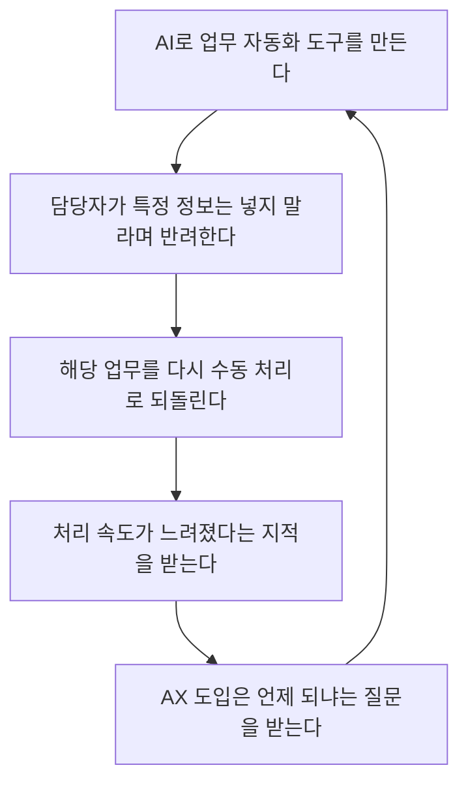
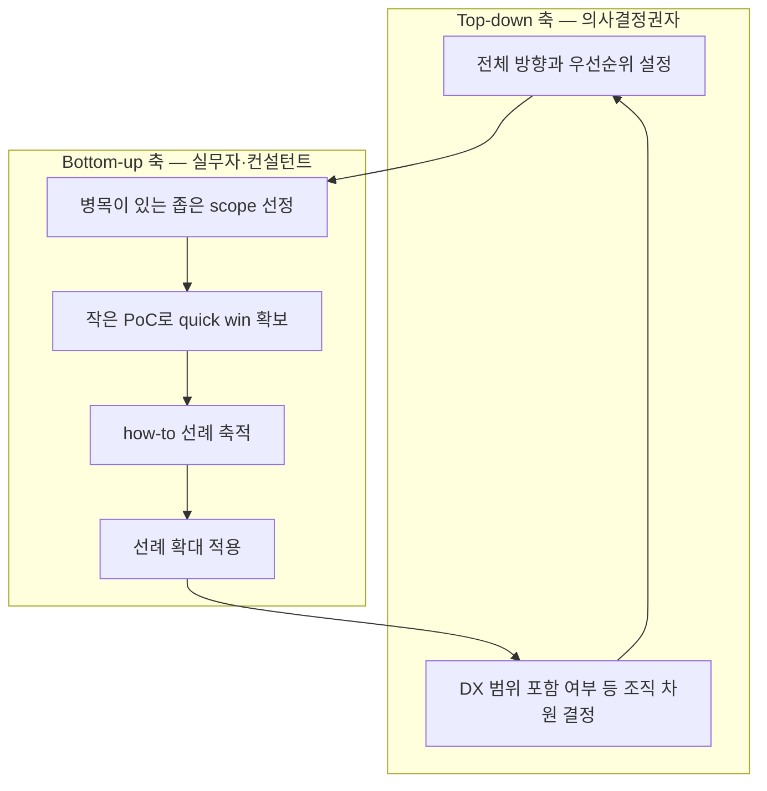

> 
> DX가 끝날 때까지 기다리면
> AX는 영원히 시작하지 못할지도 몰라.
> 
> - “데이터가 없어서…”
> - “프로세스가 없어서…”
> - “타 부서가 안 해줘서…”
> 
> 나도 PI와 ERP를 추진하며
> 정말 많이 들었던 말이야.
> 
> 하지만 이건 AX를 못 하는 이유가 아니라
> AX가 풀어야 할 문제 아닐까?
> 
> 데이터가 없으면 필요한 것부터 모으고,
> 프로세스가 없으면 작은 업무부터 정리하는 것.
> 
> AX는 DX를 기다리는 게 아니라,
> 필요한 DX를 함께 끌고 가는 일이라고 생각해.
> 
> 치니들은 어떻게 생각해?
> 
>  https://www.threads.com/share/_nzbGOiY1/
> 

---

## 목차

1. 들어가며 — 이 문서가 다루는 내용
2. 논쟁의 출발점 — 원문 게시물의 문제의식
3. 배경 지식 — DX와 AX는 어떻게 다른가
4. 첫 번째 쟁점 — "이건 AX가 아니라 의사결정권자가 풀 문제다"
5. 두 번째 쟁점 — 종으로 뚫는 전략과 부분 최적화의 딜레마
6. 세 번째 쟁점 — 툴보다 프로세스, 그리고 도입 만능주의 경계
7. 네 번째 쟁점 — 롤백과 질책의 무한반복
8. 다섯 번째 쟁점 — "AX는 명분이다": DX를 견인하는 수단론
9. 토론 구조 한눈에 보기
10. 정리 — 이 토론이 남긴 질문
11. 출처 및 신뢰도 구분표
12. 참고 자료

---

## 1. 들어가며 — 이 문서가 다루는 내용

이 문서는 Threads에서 진행된 하나의 토론 글타래를 처음부터 끝까지 풀어서 정리한 것이다. 원글을 올린 사람은 tanya9999427이라는 계정이며, 이 계정이 던진 질문에 여러 사람이 댓글로 자신의 경험과 의견을 붙이면서 대화가 이어졌다. 주제는 한 문장으로 요약하면 이렇다. "회사가 아직 DX(디지털 전환)를 제대로 끝내지 못했는데, 그 상태에서 AX(AI 전환)를 시작해도 되는가, 아니면 DX가 끝날 때까지 기다려야 하는가." 이 질문 자체는 특별히 새로운 것은 아니지만, 댓글들이 서로 다른 각도에서 파고들면서 실제로 조직에서 AX를 추진해본 사람들이 부딪히는 현실적인 쟁점들이 촘촘하게 드러난다. 그래서 이 문서는 단순히 원글만 요약하는 것이 아니라, 댓글로 이어진 다섯 가지 하위 논쟁을 각각 별도의 장으로 나누어 그 논리 구조를 최대한 자세히 풀어보려 한다. 아울러 DX와 AX라는 용어 자체가 아직 업계에서도 완전히 통일되어 쓰이는 개념이 아니기 때문에, 3장에서는 외부 자료를 근거로 두 용어의 차이를 먼저 정리했다. 이 문서에 등장하는 모든 발언은 실제 대화 참여자들이 남긴 내용을 옮기거나 풀어쓴 것이며, 추측이나 임의로 지어낸 내용은 포함하지 않았다.

## 2. 논쟁의 출발점 — 원문 게시물의 문제의식

tanya9999427이 올린 원글의 핵심 주장은 이렇다. 만약 조직이 "DX가 끝날 때까지 기다렸다가 AX를 시작하겠다"는 태도를 취한다면, AX는 영영 시작되지 못할 수도 있다는 것이다. 그 근거로 원글은 실무에서 반복적으로 듣게 되는 세 가지 변명을 든다. 데이터가 없어서 안 된다는 말, 프로세스가 정리되어 있지 않아서 안 된다는 말, 그리고 다른 부서가 협조해주지 않아서 안 된다는 말이다. 원글 작성자는 본인이 PI(Process Innovation, 프로세스 혁신)와 ERP(전사적 자원관리 시스템) 도입 프로젝트를 추진하면서 바로 이 세 가지 말을 정말 많이 들었다고 밝히고 있다. 그런데 원글은 이 지점에서 발상을 뒤집는다. 데이터가 없다는 것, 프로세스가 없다는 것은 AX를 하지 못하는 이유가 아니라, 오히려 AX 프로젝트 자체가 풀어야 할 과제로 봐야 하지 않느냐는 것이다. 데이터가 없으면 필요한 데이터부터 모으면 되고, 프로세스가 없으면 작은 업무 단위부터 정리하면 된다는 논리다. 그래서 원글은 "AX는 DX가 끝나기를 기다리는 일이 아니라, 필요한 DX를 AX와 함께 끌고 가는 일"이라는 문장으로 마무리되며, 다른 사람들의 생각을 묻는 질문으로 끝난다. 이 원글이 던진 프레임, 즉 DX 미비를 AX의 전제조건 결핍으로 볼 것인가 아니면 AX가 해결해야 할 과제로 볼 것인가 하는 이분법이 이후 모든 댓글 논쟁의 출발점이 된다.

## 3. 배경 지식 — DX와 AX는 어떻게 다른가

본격적인 댓글 분석에 들어가기 전에, DX와 AX라는 두 용어가 실제로 어떻게 구분되는지 짚어볼 필요가 있다. 여러 산업 자료를 종합하면, DX는 종이 문서나 수작업, 분절된 시스템으로 이루어져 있던 업무를 디지털 기반으로 옮기고, 그 과정에서 조직 안에 데이터가 생성되고 쌓이고 서로 연결될 수 있는 토대를 마련하는 과정으로 설명된다[1]. 반면 AX는 그렇게 DX를 통해 구축된 데이터와 디지털 시스템 위에 AI를 결합해서, 조직의 업무와 의사결정 자체를 지능화하는 과정으로 정의된다[1]. 즉 DX가 "디지털로 옮기고 연결하는 단계"라면, AX는 "그 위에서 분석하고 예측하고 자동으로 판단하는 단계"에 가깝다.

이 둘의 실행 방식에도 뚜렷한 차이가 있다는 분석도 있다. DX는 조직 전체의 운영 방식을 근본적으로 재설계하는 장기 프로젝트로, 통상 3년에서 5년 정도가 걸리고 경영진의 전사적 주도와 상당한 투자가 필요하다고 설명된다[2]. 반면 AX는 특정 업무 영역, 예를 들어 품질 검사, 고객 응대, 수요 예측 같은 좁은 범위를 AI로 지능화하고 자동화하는 데 초점을 맞추기 때문에 몇 개월 안에 파일럿을 마치고 성과를 확인할 수 있으며, 조직 전체가 준비되지 않아도 특정 부서나 팀 단위로 먼저 시작할 수 있다는 특징이 있다고 설명된다[2]. 이 차이는 이번 토론에서 반복적으로 등장하는 "작은 범위부터 시작하는 것이 가능한가"라는 질문과 직접 연결된다.

한편 DX와 AX를 완전히 순차적인 단계로 보지 않는 시각도 있다. 두 개념이 연속선 위에 있으며, AI가 제 가치를 내려면 결국 그 아래에 디지털 데이터와 인프라가 받쳐줘야 하지만, 거꾸로 AX 없이는 DX도 한계에 부딪힐 수 있다는 설명이다. 디지털 도구를 도입하는 것 자체는 이미 보편화되어서 더 이상 경쟁 우위가 되지 못하며, 업무 구조와 의사결정 방식을 근본적으로 바꾸는 자동화·지능화가 있어야 진짜 전환이 완성된다는 논리다[3]. 이 시각은 이번 Threads 토론에서 dev.beside와 tanya9999427이 마지막에 도달한 결론, 즉 "AX가 오히려 미진한 DX를 보완하는 수단이 될 수 있다"는 주장과 맥이 닿아 있다.

마지막으로, 국내 기업 사례를 다룬 자료들은 AI 도입을 전사적으로 한 번에 밀어붙이기보다 파일럿부터 시작해서 효과를 검증하고, 그 경험을 다른 부서로 확대 적용하는 방식이 효과적이라고 반복해서 강조한다. 작은 성공 사례가 쌓이면서 조직 전체의 AI에 대한 신뢰도가 높아진다는 설명도 함께 제시된다[4]. 이는 아래 5장에서 다룰 "종으로 작게 뚫는 전략" 논쟁의 배경이 되는 일반적인 업계 통념과 일치한다.

## 4. 첫 번째 쟁점 — "이건 AX가 아니라 의사결정권자가 풀 문제다"

원글에 처음 달린 굵직한 반응은 getsxxtdone의 댓글이었다. 요지는 명확하다. DX 미비로 AX가 막히는 문제는 AX 담당자나 실무자가 풀어야 할 문제라기보다, 애초에 의사결정권자들이 풀어줘야 하는 문제라는 것이다. 이 댓글은 원글의 "AX가 DX 부족을 해결해야 한다"는 낙관적인 프레임에 곧바로 제동을 거는 역할을 한다.

이에 대해 tanya9999427은 상당 부분 동의하는 방향으로 답한다. DX를 프로젝트 범위에 포함시킬 것인지 말 것인지는 결국 톱다운 방식의 조직 차원 의사결정 사항이며, 실무 담당자나 외부 컨설턴트 선에서 결정하기는 어려운 문제라는 점을 인정한 것이다. 이 답변은 원글의 주장을 완전히 철회하는 것은 아니지만, 최소한 "DX 범위를 프로젝트에 포함할지 말지"와 같은 조직 구조적 결정은 실무 차원에서 임의로 밀어붙일 수 없다는 현실적 한계를 인정하는 태도로 읽힌다. 즉 원글의 이상론과 getsxxtdone의 현실론이 만나서, "AX 실행 자체는 실무에서 밀어붙일 수 있지만, DX 범위 확장 같은 큰 그림의 결정은 결국 위에서 내려와야 한다"는 절충점으로 좁혀지는 흐름이다.

## 5. 두 번째 쟁점 — 종으로 뚫는 전략과 부분 최적화의 딜레마

이어지는 댓글 흐름에서는 실행 전략에 대한 좀 더 구체적인 제안이 등장한다. 한 참여자는 조직 전체의 업무 영역을 가로로 넓게 다 채우려고 하지 말고, 세로로 좁게 파고드는 방식이 더 빠르다고 조언한다. 이렇게 하면 업무 전반에 걸쳐 있는 병목 지점들 대부분이 작은 스코프 형태로 하나씩 관통되고, 그 과정에서 만들어진 how-to와 퀵윈 선례들을 계속 확대해나가면 결국 그것이 DX로 이어진다는 논리다. 이 참여자는 실제로 그런 방식으로 일하고 있다고 밝힌다.

이 제안에 대해 tanya9999427은 상당히 긴 답변을 남기는데, 이 답변이 이번 토론 전체에서 가장 사려 깊은 지점 중 하나로 보인다. 우선 그는 이 방식을 "작은 PoC를 성공시키면서 AX에 대한 조직 내부의 확신을 쌓아가는 바텀업 방식"으로 정리하고, 이 접근이 AX에 대한 신뢰를 현장에서부터 확장해나간다는 점에서 매우 현실적이라는 데 동의한다. 이는 앞서 3장에서 소개한, 파일럿을 먼저 성공시켜 신뢰를 쌓은 뒤 확대 적용한다는 일반적인 업계 통념과도 일치하는 부분이다.

그런데 tanya9999427은 여기서 한 가지 고민을 덧붙인다. 한 공정의 병목을 AI로 해결하면, 그다음 병목은 다른 공정이나 다른 부서로 옮겨간다는 것이다. 이렇게 병목을 하나씩 해결해나가다 보면 각 부분은 최적화되지만, 조직 전체로 보면 전체 최적화와는 오히려 멀어질 수도 있다는 우려다. 이것은 생산관리 이론에서 오래전부터 논의되어 온 국소 최적화와 전역 최적화의 긴장 관계와 본질적으로 같은 문제의식이다. 한 지점의 제약을 풀면 병목이 다른 지점으로 옮겨갈 뿐, 시스템 전체의 처리량이 개선되지 않을 수 있다는 것이다. tanya9999427은 이 딜레마에 대한 나름의 절충안으로, 큰 방향과 전체 프로세스는 톱다운으로 조망하되, 실제 실행은 작은 PoC에서부터 바텀업으로 시작하는 방식이 더 현실적일 것 같다고 제안한다. 다만 이것이 정답이 하나로 정해진 문제는 아니라는 점도 함께 밝히며, 스스로도 계속 고민 중이라는 태도를 유지한다.

## 6. 세 번째 쟁점 — 툴보다 프로세스, 그리고 도입 만능주의 경계

waawoo4의 댓글은 이번 토론에서 가장 직설적인 어조를 띤다. 요지는, 회사에서 실제로 make나 n8n 같은 노코드 자동화 도구를 사용할 줄도 모르는 상태라면 AX 도입 검토 자체를 하지 않는 편이 낫다는 것이다. 자신이 어떤 프로세스에서 어떤 데이터를 쓸지도 모르고, 트리거를 어떻게 설정해야 하는지도 모르면서 AX를 논하는 것은 순서가 잘못됐다는 지적이다. n8n이나 Make 같은 도구는 실제로 노드와 노드를 연결해 트리거가 발생하면 데이터를 이동시키고 특정 작업을 자동으로 실행하는 구조로 동작하는 워크플로 자동화 플랫폼이며[5], 이런 도구를 다루려면 애초에 자신의 업무 프로세스와 데이터 흐름을 스스로 파악하고 있어야 한다. waawoo4는 지금 당장 가장 효율적인 방법은 거창한 자동화보다, 우선 지식을 정리해서 에이전트에게 알려주는 수준의 작업이라고 제안한다. 또한 최소한 PMO(프로젝트 관리 조직)나 프로세스 혁신 조직이 있는 회사라면, 다음 도약을 위해 빠르게 자동화할 수 있는 부분이 무엇인지 검토하고, 필요하다고 판단되는 지점만 뾰족하게 찌른 뒤 점점 넓혀가면 된다고 말한다. 그러면서 "뭐가 도입이 어렵다는 건지 이해가 안 된다"는 냉소적인 평가와 함께, 실제로 도입이 필요한 것이 맞는지부터 검토해야 하며, 남들이 다 한다고 따라 하다가는 무리하게 된다는 취지의 경고("가랑이 찢어짐")를 덧붙인다.

이에 대해 tanya9999427은 이 댓글의 핵심을 "도구보다 AX는 프로세스 개선이 중요하다"는 메시지로 요약하고, 여기에 동의한다는 짧은 답을 남긴다. 이 교환은 토론 전체에서 반복적으로 등장하는 하나의 축, 즉 "화려한 자동화 도구를 도입하는 것 자체가 AX가 아니라, 자신의 업무 프로세스와 데이터를 얼마나 명확히 이해하고 있느냐가 먼저"라는 관점을 잘 보여준다.

## 7. 네 번째 쟁점 — 롤백과 질책의 무한반복

kaerr57의 댓글은 앞선 논의보다 훨씬 더 냉소적인 톤으로, 실제 조직에서 흔히 벌어지는 패턴을 짧게 압축해서 보여준다. 누군가 AI로 무언가를 만들면, 다른 누군가는 "여기에 이 정보를 넣으면 안 된다, 다시 수동으로 하라"며 반려한다. 그렇게 롤백을 하고 나면, 이번에는 "왜 이렇게 늦냐, AX 도입 안 하냐, 언제 자동화되냐"는 질책이 돌아온다. 그리고 다시 처음부터 같은 과정이 무한히 반복된다는 것이다. 이 짧은 댓글은 AX 추진 실무자들이 조직 안에서 자주 겪는 모순적 상황, 즉 보안이나 규정을 이유로 자동화를 막아놓고서는 동시에 자동화가 느리다고 질책받는 상황을 압축적으로 드러낸다.

바로 아래에 달린 y_sanghyuk의 댓글은 이 문제를 조금 더 구조적으로 짚는다. 애초에 DX가 부진하다는 이유로 AX 지연에 대한 양해를 구할 수 없는 구조라는 것이다. 왜냐하면 AX 조직을 만든 누군가는, 그 AX 담당 조직이 추진 과정에서 부딪히는 모든 문제를 알아서 다 풀어내고 결국 AX를 완성해내기를 기대하기 때문이라는 설명이다. 이 지적은 4장에서 다룬 getsxxtdone의 문제의식과 사실상 같은 방향을 가리킨다. AX가 막히는 근본 원인이 조직 구조와 의사결정 체계에 있는데도, 그 책임이 실무를 담당하는 AX 조직 한쪽으로만 쏠리는 구조적 불균형이 있다는 것이다.

## 8. 다섯 번째 쟁점 — "AX는 명분이다": DX를 견인하는 수단론

토론의 마지막 축은 dev.beside의 댓글에서 시작된다. 그는 AX를 사실상 하나의 명분으로 본다는 견해를 밝힌다. AX라는 명분을 내세우면, 그동안 미진했던 DX 작업까지 함께 추진할 수 있다는 것이다. 그리고 이 과정에서 보안상 어디에 구멍이 있는지 같은 문제들도 더 이슈화되고, 그것을 메울 수 있는 추진력을 얻게 되는 좋은 수단이 될 수 있다고 설명한다. 즉 AX 도입이라는 목표 자체가, 조직 내부에서 오랫동안 방치되어 있던 DX 관련 문제들을 수면 위로 끌어올리고 예산과 관심을 확보하는 지렛대 역할을 할 수 있다는 관점이다.

tanya9999427은 이 견해에 공감을 표하며 토론을 마무리하는 성격의 답을 남긴다. DX가 안 되어 있어서 AX가 안 되는 것이 아니라, 미진한 DX를 보완해가면서 오히려 제대로 된 AX를 구축할 수 있다는 것이다. 이 결론은 2장에서 소개한 원글의 최초 주장, 즉 "AX는 DX를 기다리는 것이 아니라 필요한 DX를 함께 끌고 가는 일"이라는 문장으로 다시 돌아가는 구조를 취하고 있다. 다만 토론을 한 바퀴 거치면서, 이 결론에는 getsxxtdone과 y_sanghyuk이 지적한 "이것은 결국 의사결정권자의 몫이기도 하다"는 단서와, waawoo4가 지적한 "도구보다 프로세스 이해가 먼저"라는 단서, 그리고 tanya9999427 스스로 제기한 "부분 최적화가 전체 최적화를 해칠 수 있다"는 단서가 함께 붙어 있다는 점에서, 원글보다 훨씬 입체적인 결론이 되었다고 볼 수 있다.

## 9. 토론 구조 한눈에 보기

이번 토론에서 반복적으로 등장한 두 가지 구조를 다이어그램으로 정리하면 다음과 같다. 먼저 kaerr57이 지적한 조직 내 악순환 구조는 아래와 같은 순환 고리로 표현할 수 있다.

이 순환 고리는 자동화를 막아놓고서 동시에 자동화의 결과물을 요구하는 조직의 이중적 태도를 보여준다. 이 구조가 끊어지려면 y_sanghyuk이 지적한 것처럼, AX 조직 혼자서 모든 것을 떠안는 구조가 아니라 의사결정권자 차원에서 규정과 권한을 함께 정비해주어야 한다.

두 번째로, tanya9999427이 5장에서 제안한 절충안, 즉 큰 방향은 톱다운으로 보고 실행은 바텀업 PoC로 시작한다는 구조는 아래와 같이 표현할 수 있다.

이 다이어그램에서 화살표가 다시 위로 올라가는 구조, 즉 선례가 쌓이면 그것이 다시 의사결정권자의 조직 차원 결정에 영향을 주는 순환 구조로 그려져 있는 점에 주목할 필요가 있다. 이것이 바로 dev.beside가 말한 "AX라는 명분이 DX 추진 동력을 만든다"는 주장과 tanya9999427의 마지막 결론이 만나는 지점이다. 다만 이 통합 다이어그램은 토론 참여자들의 개별 발언을 근거로 이 문서가 재구성한 해석이며, 원문에서 이 두 축이 이런 도식으로 명시적으로 결합되어 언급된 것은 아니라는 점은 분명히 해둘 필요가 있다.

## 10. 정리 — 이 토론이 남긴 질문

이 토론을 처음부터 끝까지 따라가 보면, 하나의 명쾌한 정답으로 수렴하기보다 서로 다른 층위의 문제들이 겹쳐 있다는 것이 드러난다. 첫째는 권한의 문제다. DX 범위를 어디까지 포함할지, AX 조직에 얼마나 많은 재량과 예산을 줄지는 실무자가 혼자 결정할 수 없는 조직 구조의 문제이며, 이 부분에 대한 책임을 실무 조직에만 지우면 kaerr57이 묘사한 무한반복 구조가 만들어진다. 둘째는 실행 전략의 문제다. 넓게 벌이기보다 좁고 깊게 파고들어 작은 성공 사례를 쌓아가는 접근이 신뢰 구축에는 효과적이지만, 그 과정에서 병목이 다른 부서로 옮겨가며 부분 최적화에 그칠 위험이 있다는 tanya9999427의 지적은 실행 전략을 설계할 때 반드시 염두에 두어야 할 현실적인 제약이다. 셋째는 태도의 문제다. waawoo4가 지적한 것처럼, 자신의 프로세스와 데이터를 이해하지 못한 채 도구부터 도입하려는 태도, 그리고 남들이 한다고 따라 하는 태도는 도입 실패의 흔한 원인으로 지목된다. 마지막으로 넷째는 프레이밍의 문제다. AX를 DX 완료 이후에나 가능한 다음 단계로 볼 것인지, 아니면 미진한 DX까지 함께 끌고 가는 명분이자 지렛대로 볼 것인지에 따라 프로젝트를 대하는 태도 자체가 달라진다는 것이 dev.beside와 tanya9999427이 도달한 결론이다. 이 네 가지 층위는 서로 배타적이지 않으며, 실제 조직에서는 동시에 다뤄야 하는 문제로 보인다.

## 11. 출처 및 신뢰도 구분표

| 구분 | 내용 | 근거 |
|---|---|---|
| 확인된 사실(1차 자료) | 이 문서에 정리된 원글과 모든 댓글의 발언 내용 및 발언 순서 | 사용자가 직접 공유한 Threads 대화 원문. 해당 게시물 링크(https://www.threads.com/share/_nzbGOiY1/)는 Threads의 접근 제한 정책상 직접 열람이 되지 않아, 사용자가 제공한 원문 텍스트를 1차 자료로 삼아 정리함 |
| 확인된 사실(외부 자료) | DX는 데이터·업무의 디지털 기반을 구축하는 과정, AX는 그 위에 AI를 결합해 지능화하는 과정이라는 개념 구분 | 복수의 산업 자료([1][2]) |
| 확인된 사실(외부 자료) | DX는 통상 장기간·전사 차원 프로젝트, AX는 부서 단위로 단기간에 파일럿이 가능하다는 실행 방식의 차이 | 업계 비교 자료[2] |
| 확인된 사실(외부 자료) | n8n·Make는 노드와 트리거 기반으로 앱 간 데이터 흐름을 자동화하는 워크플로 자동화 도구라는 기술적 설명 | n8n 관련 튜토리얼 및 문서[5] |
| 해석·분석(이 문서의 재구성) | 9장의 두 다이어그램, 그리고 10장의 "네 가지 층위" 정리는 개별 댓글들을 근거로 이 문서가 종합한 해석이며, 대화 참여자가 이런 형태로 명시적으로 정리해 말한 것은 아님 | 이 문서 작성자의 분석 |
| 벤더 자사 콘텐츠 성격 포함 | DX·AX 개념 설명과 도입 전략을 다루는 일부 참고 자료는 AI 솔루션 기업이 운영하는 블로그의 콘텐츠로, 자사 서비스 홍보 목적이 일부 반영되어 있을 수 있음 | [2][4] 등 |

## 12. 참고 자료

[1] "DX와 AX의 차이부터 AI 전환 시대의 기업 전략까지", brunch.co.kr, https://brunch.co.kr/@publichr/187

[2] "DX와 AX의 결정적 차이점, 디지털 혁신의 두 가지 경로", alchera.ai, https://www.alchera.ai/resource/blog/DX-and-AX-critical-difference

[3] "보안 101: 인공지능 전환(AX)이란 무엇인가요", igloo.co.kr, https://www.igloo.co.kr/security-information/%EB%B3%B4%EC%95%88-101-%EC%9D%B8%EA%B3%B5%EC%A7%80%EB%8A%A5-%EC%A0%84%ED%99%98ax%EC%9D%B4%EB%9E%80-%EB%AC%B4%EC%97%87%EC%9D%B8%EA%B0%80%EC%9A%94/

[4] "AI는 깔았는데 일은 그대로라면? 기업 AI 내재화 실무 확산 전략이 관건", alchera.ai, https://www.alchera.ai/resource/blog/ac-enterprise-ai-internalization-practical-expansion-strategy

[5] n8n 관련 워크플로우 자동화 설명 자료 종합 — "워크플로우: 자동화의 심장", wikidocs.net, https://wikidocs.net/290941 ; n8n 실습 튜토리얼, github.com/haedalprogramming/n8n-tutorials, https://github.com/haedalprogramming/n8n-tutorials

원문 게시물: Threads, tanya9999427, https://www.threads.com/share/_nzbGOiY1/
