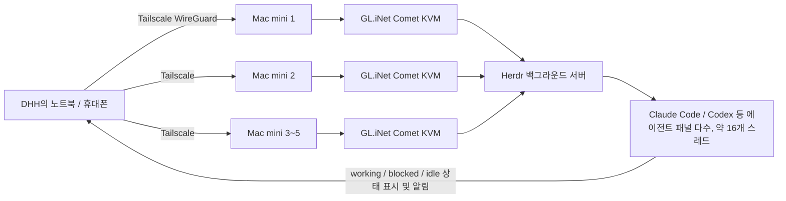
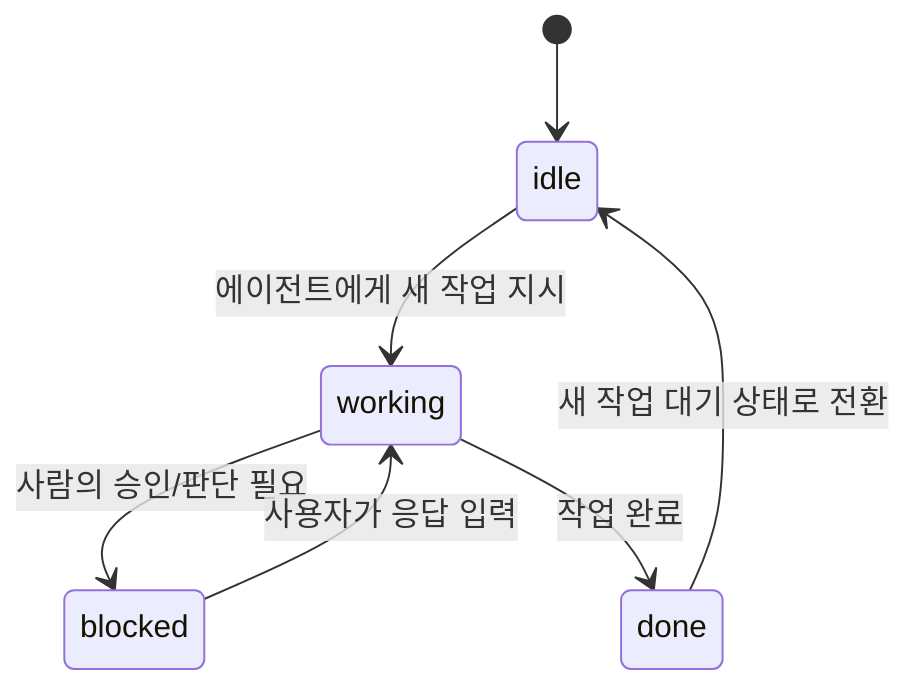

```
요즘 AI Agent 1개만 사용하는 경우는 거의 없는 것 같다.
대부분 Claude Code와 Codex를 함께 쓴다.
2개 이상의 에이전트를 함께 사용하다 보면 귀찮은 일들이 많다.
어느 에이전트가 작업을 끝냈는지,
누가 답변을 기다리는지 확인하고,
작업이 끝난 에이전트의 결과를 다른 에이전트에 넘겨준다.

보통 이게 귀찮아서 tmux로 화면을 나눠 쓰거나 오케스트레이션 ADE인 Orca를 사용한다.

그러다가 최근 Ruby on Rails를 만든 DHH의 Lex Fridman 인터뷰에서 tmux 대신 Herdr를 이야기하는 것을 봤다.
tmux로 화면을 나눠 여러 에이전트를 돌리다가 여러 컴퓨터에서 에이전트를 실행하기 시작하니, 
tmux만으로는 각 작업의 진행 상황을 확인하기 어려워졌다고 한다.

Herdr는 에이전트가 일하는 중인지 보여주고,
작업이 끝나거나 사람의 판단이 필요할 때 알림을 준다.
DHH는 이를 "tmux에 에이전트 알림을 더한 도구"라고 설명했다.

Herdr는 쓰던 터미널 안에서 여러 에이전트의 작업을 관리하는 도구다.
tmux처럼 화면을 나누고 세션을 유지하고,
에이전트가 CLI로 다른 화면의 작업 내역을 읽을 수 있다.
한쪽에 구현을 맡기고 다른 쪽에는 그 결과를 읽어 리뷰하도록 지시할 수 있으니, 사람이 매번 복사해서 전달하지 않아도 된다.

Orca가 편집기와 리뷰 화면까지 한 앱에 묶어 제공한다면, Herdr는 기존 터미널과 편집기를 유지하고 싶은 경우에 잘 맞는다.

내 입장에서 Orca는 좀 과하고,
tmux는 예전부터 쓰던 도구이니 익숙하긴 한데,
이것보다 좀 더 다음 단계의 에이전트 오케스트레이션 관리 도구가 필요하다고 생각했을 때 딱 맞는 도구가 Herdr였다.

마침 "하루만에 끝내는 Herdr" 강의가 출시되었다.
설치와 기본 조작부터 익힌 뒤, Codex에게 파이썬 가위바위보 게임을 만들게 하고 Claude에게 작업 내역을 읽고 리뷰하게 한다.
ToDo 앱의 기본 기능과 다크 모드는 Git worktree로 나눈 별도 폴더에서 동시에 개발한다.
작업을 바꿀 때마다 stash하고 브랜치를 오가는 수고를 줄이고, 나눠 작업한 결과를 합치는 과정까지 실습한다.

원격 실행도 Tailscale과 SSH 설정부터 따라간다.
맥 미니에서 Herdr와 에이전트를 실행해두고, 노트북이나 아이폰으로 접속해 작업을 확인하는 구성이다.
맥 미니와 그 안의 Herdr가 계속 실행 중이면 노트북을 덮거나 연결이 끊겨도 작업은 유지된다.
tmux로 여러 작업을 관리하던 분들, Orca처럼 여러 에이전트를 함께 쓰는 환경이 궁금했던 분들께 추천하고 싶다.

https://inf.run/dPckn

 https://www.threads.com/share/BAga_Vm_jH/


```


## 1. 왜 "에이전트 여러 개를 동시에 돌리는 문제"가 새로운 화두가 되었나

Claude Code 하나만 쓰던 시절에는 터미널 창 하나로 충분했다. 그런데 Codex, OpenCode, Kimi 같은 코딩 에이전트를 동시에 여러 개 돌리는 작업 방식이 자리잡으면서, 어느새 사람이 관리해야 할 터미널 창이 대여섯 개씩 늘어나는 일이 흔해졌다. 문제는 창의 개수 자체가 아니라, 지금 어떤 에이전트가 일하고 있고 어떤 에이전트가 사람의 승인을 기다리며 멈춰 있는지를 창을 일일이 넘겨가며 확인해야 한다는 데 있다. 한 에이전트가 작업을 끝내면 그 결과를 다른 에이전트에게 넘겨주는 과정도 사람이 직접 복사해서 전달해야 하는 경우가 많다.

이 문제를 풀기 위해 그동안 개발자들은 주로 두 가지 방식을 택해왔다. 하나는 기존에 쓰던 tmux 같은 터미널 멀티플렉서로 화면을 나눠 쓰는 방식이고, 다른 하나는 Orca처럼 편집기와 리뷰 화면까지 하나의 앱으로 묶어낸 오케스트레이션 ADE(Agent Development Environment)를 쓰는 방식이다. 그런데 최근 이 둘 사이의 빈틈을 메우는 도구로 Herdr가 주목받고 있다. Ruby on Rails를 만든 David Heinemeier Hansson(DHH)이 Lex Fridman과의 인터뷰에서 자신의 실제 작업 환경으로 Herdr를 소개하면서 관심이 한층 커졌다.

## 2. Herdr란 무엇인가

### 2.1 기본 개념

Herdr는 "코딩 에이전트가 사는 런타임(the runtime your coding agents live on)"이라는 문구로 스스로를 소개하는 도구다. 공식 GitHub 저장소와 herdr.dev 문서에 따르면, Herdr는 Rust로 작성된 단일 바이너리이며 Electron 같은 GUI 프레임워크를 쓰지 않고, 사용자가 이미 쓰고 있는 터미널(Ghostty, iTerm2, Kitty, WezTerm, 심지어 tmux 안에서도) 안에서 그대로 실행된다. 라이선스는 Apache 2.0으로 공개되어 있다.

tmux처럼 하나의 백그라운드 서버가 세션과 패널, 그 안에서 도는 프로세스 상태를 소유하고, 사용자가 실행하는 클라이언트는 그 서버에 붙어 화면을 그려주는 역할만 한다는 점에서 구조적으로는 tmux나 zellij와 크게 다르지 않다. 클라이언트를 닫아도(detach) 서버 쪽 프로세스는 계속 실행되며, 나중에 다시 herdr를 실행하면 같은 세션에 그대로 재접속(attach)된다.

Herdr가 기존 멀티플렉서와 구별되는 지점은 패널 안에서 돌아가는 프로세스를 단순한 텍스트 스트림으로 보지 않는다는 데 있다. Claude Code, Codex, Cursor, OpenCode, Grok 같은 코딩 에이전트가 패널 안에서 실행되고 있다는 사실을 감지하고, 그 에이전트가 지금 일하는 중(working)인지, 사람의 입력이나 승인을 기다리며 멈춰 있는지(blocked), 작업을 마쳤는지(done), 아니면 그냥 놀고 있는지(idle) 사이드바에 실시간으로 표시해준다. 이 상태는 패널 단위에서 탭, 나아가 워크스페이스 단위까지 위로 합쳐져서, 워크스페이스 안의 에이전트 하나라도 승인을 기다리고 있으면 그 워크스페이스 전체가 blocked로 표시되는 방식이다.

화면 구조는 세션(Session) 아래 워크스페이스(Workspace), 그 아래 탭(Tab), 다시 그 아래 패널(Pane)이 오는 4단 구조로 되어 있다. tmux에서 프로젝트별로 세션을 따로 만들어 attach를 오가며 쓰던 습관을, Herdr에서는 하나의 세션 안에 여러 워크스페이스가 동시에 존재하는 방식으로 대체한 것이다. 재접속할 필요 없이 사이드바에서 곧바로 다른 프로젝트로 이동할 수 있다.

### 2.2 에이전트가 Herdr 자체를 조작할 수 있다는 점

Herdr의 특징 중 눈에 띄는 부분은 로컬 소켓 API와 CLI를 통해 에이전트 스스로가 Herdr를 조작할 수 있도록 설계되었다는 점이다. 한 패널에서 돌고 있는 에이전트가 herdr 명령어를 호출해 새 워크스페이스나 패널을 만들고, 다른 패널에 프롬프트를 주입하고, 그 패널의 에이전트가 실제로 작업을 마칠 때까지 기다리는 식의 흐름을 짤 수 있다. 예를 들어 한쪽 패널에 구현을 맡기고, 다른 쪽 패널에는 그 결과물을 읽어 리뷰하도록 지시하는 흐름을 사람이 매번 복사해 전달하지 않고도 구성할 수 있다는 뜻이다. Herdr 공식 저장소는 이를 "agent-native"라는 표현으로 설명하며, 별도의 "agent skill" 예시를 함께 제공하고 있다.

설치는 `curl -fsSL https://herdr.dev/install.sh | sh` 스크립트, Homebrew(`brew install herdr`), mise(`mise use -g herdr`) 등 여러 경로로 가능하며, Windows는 프리뷰 채널로 지원된다. 기본 조작은 tmux와 동일하게 프리픽스 키(기본값 Ctrl+B)를 사용하지만, Herdr는 처음부터 마우스로도 패널·탭·워크스페이스 이동과 분할을 전부 처리할 수 있도록 설계되어 있어 단축키를 다 외우지 못해도 진입 장벽이 낮은 편이다. SSH를 통한 원격 접속(`herdr --remote <ssh-target>`)도 기본 기능으로 지원된다.

## 3. DHH가 Lex Fridman 인터뷰에서 밝힌 실제 워크플로

### 3.1 "tmux에 에이전트 알림을 더한 도구"

2026년 8월 공개된 Lex Fridman 팟캐스트 501화 "DHH: Future of Programming, AI, Agentic Engineering, Vibe Coding & Linux"에서, DHH는 자신이 에이전트를 다루는 방식이 어떻게 바뀌었는지를 상세히 설명했다. 그는 처음에는 tmux로 패널을 나눠 여러 에이전트를 돌렸지만, 에이전트를 한 대의 컴퓨터가 아니라 여러 대의 컴퓨터에서 동시에 돌리기 시작하면서 tmux만으로는 각 작업의 진행 상황을 따라가기가 부족해졌다고 말했다. 이 대목에서 그는 최근 옮겨간 도구로 Herdr를 언급하며 다음과 같이 설명했다.

> "Herdr는 본질적으로 tmux에 에이전트 알림 기능을 더한 것이다. 에이전트가 작업을 마치고 사람의 판단이 필요할 때마다 알림음이 울려서, 지금 사람의 결정을 기다리고 있다는 걸 알려준다. 그리고 지금 작업 중인 상태인지 아닌지도 계속 추적해서 보여준다."

이 표현은 이번 대화에서 다루려는 Herdr의 정체성을 가장 압축적으로 보여준다. Herdr는 새로운 에이전트도 아니고 기존 에이전트를 대체하는 도구도 아니다. tmux가 하던 일(터미널 세션 유지, 화면 분할)에 에이전트 상태 인식과 알림이라는 레이어 하나를 얹은 것뿐이라는 게 DHH 본인의 설명이다.

### 3.2 Mac mini 여러 대와 Tailscale로 구성한 원격 에이전트 팜

DHH가 설명한 설정은 단순히 로컬 컴퓨터 한 대에서 여러 패널을 돌리는 수준을 넘어선다. 그는 에이전트를 한 대의 컴퓨터에서만 돌리는 게 마치 코어 두 개짜리 컴퓨터로 멀티코어 프로그래밍을 하는 느낌이었다고 표현하면서, 창고에 방치되어 있던 여분의 미니 PC들을 꺼내 GL.iNet Comet이라는 소형 KVM 장치와 연결했다고 밝혔다. 이 장치는 HDMI와 USB를 컴퓨터에 연결하기만 하면 웹페이지에서 로그인 한 번으로 원격 제어가 가능해지고, Tailscale의 WireGuard 기반 네트워크(테일넷)에 바로 편입시킬 수 있다는 점에서 골랐다고 설명했다. 이렇게 구성해 놓으면 방화벽에 구멍을 뚫거나 복잡한 VPN을 설정할 필요 없이, 마치 옆자리에 있는 컴퓨터처럼 어디서든 접근할 수 있다는 것이다.

이렇게 컴퓨터 네다섯 대를 Tailscale 네트워크로 묶고 각 컴퓨터 위에서 여러 에이전트를 돌리되, 그 전체를 관리하는 창구로 Herdr를 쓴다는 것이 DHH가 소개한 구성이다. 그는 이 구성으로 한 번에 대략 16개의 에이전트 스레드를 동시에 운용할 수 있었고, 그 이상으로 늘리면 정작 사람이 판단해서 따라가지 못하는 병목이 생긴다고 언급했다. 즉 "사람이 한계"라는 표현으로, 컴퓨팅 자원보다 사람의 인지적 대역폭이 먼저 한계에 부딪힌다는 점을 짚었다.

DHH는 이 기간 동안 진행한 Linux 배포판 프로젝트 Omarchy의 새 버전 "Quattro"를 예로 들며, 자신이 이 버전에서 작성한 코드는 사실상 없다고 말했다. 대신 아키텍처의 큰 그림과 핵심 모델 계층의 개별 라인들만 직접 검토했고 나머지는 에이전트에게 맡겼다는 것이다. 그는 Quattro가 출시 직후 며칠 만에 수만 명이 내려받았고, 플러그인 마켓플레이스가 사흘 만에 330개로 늘었으며, 지난 석 달 동안 1,000건이 넘는 풀 리퀘스트를 병합했다고 밝혔다. 이때 각 풀 리퀘스트의 1차 검토와 요약은 에이전트가 맡고, 병합할지 말지를 정하는 최종 판단만 자신이 내린다고 설명했다.

아래는 DHH가 설명한 구성을 도식으로 정리한 것이다.



## 4. Herdr와 Orca: 터미널형과 ADE형의 갈림길

Herdr와 자주 비교되는 도구로 Orca가 있다. Orca는 Stably AI가 만든 오픈소스 ADE(Agent Development Environment)로, Claude Code·Codex·OpenCode·Cursor CLI 등 여러 코딩 에이전트를 각각 독립된 Git worktree 안에서 나란히 실행하고 하나의 화면에서 관리할 수 있게 해주는 도구다. Monaco 기반 편집기, 내장 브라우저와 엘리먼트 피커, iOS 시뮬레이터, GitHub·Linear 연동, 모바일 동반 앱까지 하나의 데스크톱 애플리케이션 안에 통합되어 있다는 점이 특징이다. Orca는 별도의 프록시 서버를 거치지 않고 사용자가 이미 가진 Claude나 Codex 구독을 그대로 사용하는 구조라는 점도 여러 소개 글에서 공통적으로 확인된다.

Herdr와 Orca는 둘 다 "여러 에이전트를 동시에 관리한다"는 목표는 같지만 접근 방식이 다르다. Orca는 편집기, 브라우저 미리보기, 리뷰 화면을 하나의 GUI 앱으로 묶어 제공하는 반면, Herdr는 사람이 이미 쓰던 터미널과 편집기를 그대로 유지한 채 그 위에 에이전트 인식 레이어만 얹는 쪽을 택했다. 이 차이 때문에 Herdr는 원격 서버, VM, 헤드리스 환경처럼 GUI가 없는 곳에서도 SSH 하나로 동일하게 동작한다는 장점이 있고, Orca는 반대로 시각적인 리뷰와 온보딩이 더 매끄럽다는 장점이 있다. 실제로 한 개발자 후기는 Orca를 한 번 설치해 실행해보고 곧바로 지웠다면서, GUI 기반 도구보다 기존 불편함을 시작부터 해결해준 Herdr 쪽이 자신의 작업 방식에 더 맞았다고 적었다.

두 도구와 기존 tmux를 함께 놓고 비교하면 다음과 같이 정리할 수 있다.

| 구분 | tmux | Herdr | Orca |
|---|---|---|---|
| 형태 | 순수 터미널 멀티플렉서 | 터미널 안에서 실행되는 단일 Rust 바이너리 | 별도의 데스크톱 GUI 애플리케이션(Electron 기반 아님, VS Code 기반 에디터 포함) |
| 에이전트 상태 인식 | 없음(모든 프로세스를 동일한 텍스트 스트림으로 취급) | working / blocked / idle / done 상태를 사이드바에 실시간 표시 | 각 에이전트를 독립된 Git worktree로 분리해 상태 추적 |
| 원격/헤드리스 환경 | SSH로 접속해 기존 세션에 재접속 가능(원조 방식) | SSH 원격 접속을 기본 지원(`herdr --remote`), GUI 없이도 동일하게 동작 | SSH 원격 worktree 기능 제공하나 기본적으로 데스크톱 앱 중심 |
| 설치 형태 | C로 작성된 단일 바이너리 | Electron 없는 Rust 단일 바이너리 | 데스크톱 앱 설치(브라우저, 편집기, 시뮬레이터 등 포함) |
| 모바일 동행 | 없음(SSH 클라이언트 앱을 별도로 사용해야 함) | 없음(SSH 클라이언트 앱을 통해 접근) | 공식 iOS/Android 동반 앱 제공 |
| 적합한 사용자 | 이미 tmux에 익숙하고 최소한의 도구만 원하는 개발자 | 기존 터미널·편집기 워크플로를 유지하면서 에이전트 상태만 추가로 보고 싶은 개발자 | 편집기·브라우저·리뷰 화면을 한 앱에서 처리하고 싶은 개발자 |

## 5. 설치와 기본 사용법

Herdr를 처음 실행하면 짧은 온보딩 화면이 뜨고, 이후에는 기존 세션이 있으면 그 세션에 바로 재접속하고 새 세션이면 바로 조작 모드로 진입한다. 기본적인 흐름은 다음과 같다.

- 작업 디렉터리에서 `herdr` 명령으로 세션을 시작하거나 기존 세션에 붙는다.
- 프리픽스 키(기본 Ctrl+B)를 누른 뒤 새 워크스페이스를 만들고, 그 안에서 `claude`, `codex` 같은 에이전트 명령을 실행하면 Herdr가 자동으로 해당 패널을 에이전트로 인식한다.
- 패널을 나누고(세로/가로 분할), 탭을 추가해 프로젝트별로 작업 영역을 구분한다.
- 사이드바에서 어떤 패널이 지금 일하고 있는지, 어떤 패널이 사람의 응답을 기다리고 있는지 한눈에 확인한다.
- 작업을 다 마치면 Ctrl+B, Q로 클라이언트만 종료(detach)한다. 이때 서버 쪽 에이전트 프로세스는 계속 실행된다.

패널의 상태는 대략 다음과 같은 흐름을 따라 바뀐다.



Herdr는 Claude Code, Codex, OpenCode, Cursor Agent CLI, GitHub Copilot CLI, Devin CLI, Droid, Kimi Code CLI 등 여러 코딩 에이전트에 대한 공식 통합(integration)을 제공하고 있으며, 공식 통합이 설치된 경우에는 서버가 재시작되더라도 해당 에이전트의 네이티브 세션 식별자를 이용해 작업을 이어서 복원할 수 있다. 반대로 통합이 없는 도구는 프로세스 이름과 터미널 출력만으로 상태를 추정하는 방식으로 동작한다.

## 6. 원격 실행: Tailscale과 SSH를 결합한 구성

Herdr의 실질적인 장점 중 하나로 자주 언급되는 부분이 원격 실행이다. Herdr는 애초에 서버가 모든 상태를 들고 있고 클라이언트는 그저 화면을 그려주는 구조이기 때문에, 노트북을 덮거나 네트워크 연결이 끊어져도 서버가 돌아가고 있는 컴퓨터에서는 작업이 그대로 이어진다. 이 서버가 항상 켜져 있는 별도의 컴퓨터(예를 들어 맥 미니)에서 실행되고 있다면, 노트북이나 휴대폰에서는 SSH로 접속해 Herdr 클라이언트만 새로 띄우는 방식으로 언제든 같은 작업 화면에 다시 들어갈 수 있다.

DHH가 자신의 설정에서 활용한 조합, 즉 맥 미니 여러 대를 GL.iNet Comet 같은 KVM으로 원격 제어 가능하게 만들고, 그 전체를 Tailscale의 테일넷으로 묶은 뒤, 각 컴퓨터 위에서 Herdr 서버를 띄워두는 구성이 바로 이 원격 실행 패턴의 대표적인 예다. 이런 구성에서는 맥 미니와 그 위의 Herdr 서버가 계속 실행 중이기만 하면, 노트북을 덮거나 이동 중에 연결이 끊겨도 에이전트들의 작업 자체는 멈추지 않는다.

## 7. 실습 강의가 다루는 내용

공유된 게시물에서는 "하루만에 끝내는 Herdr"라는 이름의 실습형 강의가 소개되고 있다. 게시물의 설명에 따르면 이 강의는 다음과 같은 순서로 진행된다.

- 설치와 기본 조작을 먼저 익힌다.
- Codex에게 파이썬으로 가위바위보 게임을 만들게 하고, Claude에게는 그 작업 내역을 읽고 리뷰하도록 지시하는 실습을 통해 한 에이전트의 결과를 다른 에이전트가 이어받는 흐름을 직접 구성해본다.
- ToDo 앱을 예제로 삼아, 기본 기능 구현과 다크 모드 구현을 Git worktree로 나눈 별도 폴더에서 동시에 개발하는 방식을 실습한다. 이 방식은 작업을 바꿀 때마다 `git stash`로 변경 사항을 임시 저장하고 브랜치를 오가는 수고를 줄여주며, 나눠 작업한 결과를 다시 합치는 과정까지 다룬다.
- 원격 실행 설정을 Tailscale과 SSH 설정부터 따라가면서, 맥 미니 같은 별도 컴퓨터에서 Herdr와 에이전트를 계속 실행해두고 노트북이나 휴대폰으로 접속해 작업 현황을 확인하는 구성까지 실습한다.

이 강의 내용은 게시물 작성자가 직접 소개한 커리큘럼이며, 강의 플랫폼 페이지 자체를 확인하지는 못했다는 점을 밝혀둔다. tmux로 여러 작업을 관리해오던 개발자이거나, Orca처럼 여러 에이전트를 함께 쓰는 환경을 살펴보고 싶었던 개발자에게 적합한 입문 경로로 소개되고 있다.

## 8. 정리

정리하면, Herdr는 새로운 코딩 에이전트가 아니라 이미 여러 개의 코딩 에이전트를 쓰고 있는 사람을 위한 "관제탑" 역할의 터미널 도구다. tmux가 갖고 있던 세션 유지와 화면 분할 기능은 그대로 두고, 그 위에 에이전트별 작업 상태 인식과 알림이라는 레이어를 얹었다는 점에서 DHH의 표현대로 "tmux에 에이전트 알림을 더한 도구"에 가깝다. Orca처럼 편집기와 브라우저, 리뷰 화면까지 하나로 묶은 종합 ADE를 원한다면 Orca 쪽이 더 잘 맞고, 기존 터미널과 편집기 워크플로를 그대로 유지하면서 에이전트 상태 관리 기능만 얹고 싶다면 Herdr 쪽이 더 가벼운 선택지가 된다. 그리고 이 도구의 가치는 로컬 컴퓨터 한 대에 그치지 않고, DHH의 사례처럼 여러 대의 컴퓨터를 Tailscale 같은 네트워크로 묶어 원격 에이전트 팜을 구성할 때 더 분명하게 드러난다.

---

## 팩트체크

| 항목 | 확인 상태 | 근거 |
|---|---|---|
| Herdr는 Rust로 작성된 단일 바이너리이며 Apache 2.0 라이선스로 공개되어 있다 | 확인됨(공식 저장소 기준) | herdr.dev 공식 GitHub 저장소(herdrdev/herdr) 및 설치 문서 |
| Herdr는 패널 안의 에이전트를 working / blocked / idle / done 상태로 실시간 표시한다 | 확인됨(공식 소개 기준) | herdr.dev 공식 저장소 소개문, herdr.dev 통합(Integrations) 문서 |
| Herdr는 소켓 API와 CLI를 통해 에이전트가 직접 워크스페이스를 만들고 서로에게 작업을 넘길 수 있다 | 확인됨(공식 문서 기준) | herdr.dev 공식 저장소 및 문서의 "agent-native" 설명 |
| DHH가 Lex Fridman 팟캐스트 501화에서 "Herdr는 본질적으로 tmux에 에이전트 알림을 더한 것"이라고 말했다 | 확인됨(원문 트랜스크립트 인용) | Lex Fridman 공식 트랜스크립트 페이지(lexfridman.com/dhh-2-transcript, 2026년 8월 공개) |
| DHH가 GL.iNet Comet KVM과 Tailscale로 맥 미니 여러 대를 묶어 약 16개의 에이전트 스레드를 동시에 운용했다 | 확인됨(원문 트랜스크립트 인용) | 위와 동일 |
| Omarchy Quattro의 플러그인 마켓플레이스가 사흘 만에 330개로 늘었고, 최근 석 달간 1,000건 이상의 풀 리퀘스트가 병합되었다 | 확인됨(DHH 본인 발언) | 위와 동일 |
| Orca는 Stably AI가 만든 오픈소스 ADE로 MIT 라이선스이며 여러 코딩 에이전트를 Git worktree 단위로 병렬 실행한다 | 확인됨(다수 독립 소식통 교차 확인) | GitHub 공식 저장소(stablyai/orca), 여러 소개 글(daily.dev, moge.ai 등) |
| Herdr가 2026년 6월 말 GitHub 트렌딩 Rust 부문 1위를 기록했고 8월에 YC 배치에 합류했다는 서술 | 단일 출처, 미확인 | 특정 블로그(dev-post.com) 서술로, 다른 독립 소스로는 교차 확인하지 못함 |
| Herdr의 GitHub 스타 수, Omarchy Quattro에서의 "기본 채택" 여부에 대한 구체적 수치 | 출처마다 수치가 달라 특정 수치를 단정하지 않음 | 여러 블로그 소스 간 수치 불일치(예: 스타 수 서술이 자료마다 다름) |
| "하루만에 끝내는 Herdr" 강의의 구체적 커리큘럼 | 게시물 작성자의 소개에 근거, 강의 페이지 자체는 직접 확인하지 못함 | 사용자가 공유한 게시물 설명 |

---

작성일자: 2026년 9월 17일

---

**Harness**에 넣는 게 가장 맞다.

Herdr는 코딩 에이전트(모델)도 아니고 특정 하네스(Claude Code, Codex 같은)도 아니다. 그 하네스들이 여러 개 동시에 돌아가는 세션을 유지하고, 상태를 인식하고, 알림을 주는 "하네스를 둘러싼 실행 환경/오케스트레이션 레이어"다. DHH도 인터뷰에서 이걸 "agent harness question"의 연장선으로 설명했고, 기존 블로그에서 "하네스가 흔들리면 에이전트는 더 흔들린다"처럼 하네스 엔지니어링을 모델 선택과 별개의 축으로 다뤄온 것과도 결이 맞는다.

굳이 다른 후보를 검토하면:
- **AI Agent** — 너무 일반적이라 Herdr의 "터미널 런타임" 성격이 묻힌다.
- **Platform & Framework** — 가능하지만, 이 카테고리는 보통 좀 더 무거운 플랫폼/프레임워크(VIP, RAG 아키텍처류)에 쓰인 듯하다.
- **Loop Engineering** — Herdr 자체가 루프를 도는 건 아니고, 여러 하네스를 병렬로 감독하는 쪽이라 결이 다르다.

Orca도 같은 글에서 다뤘다면 동일하게 Harness에 넣는 게 일관성 있다.