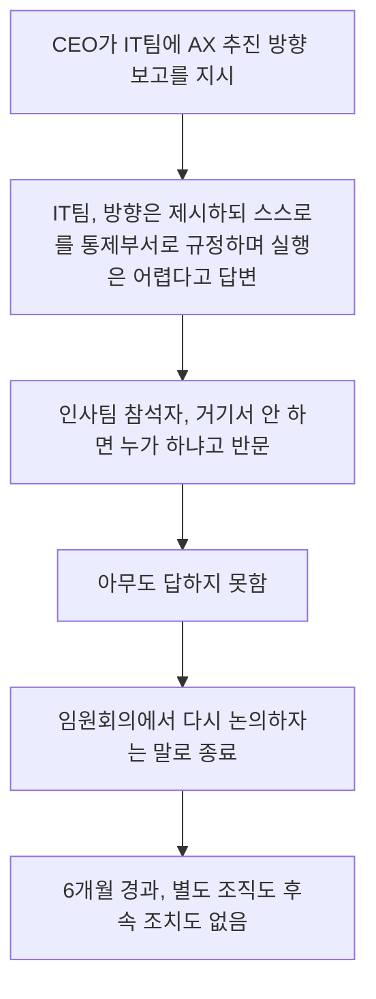
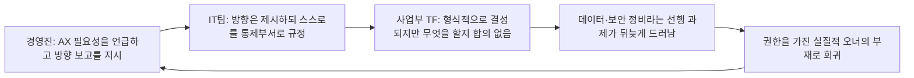
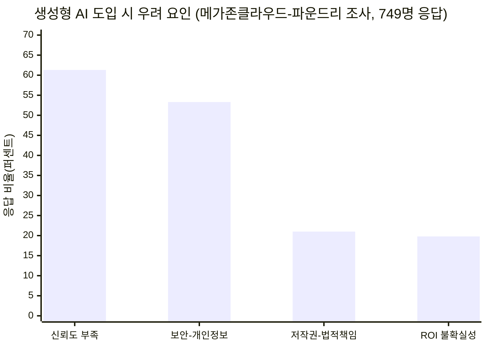
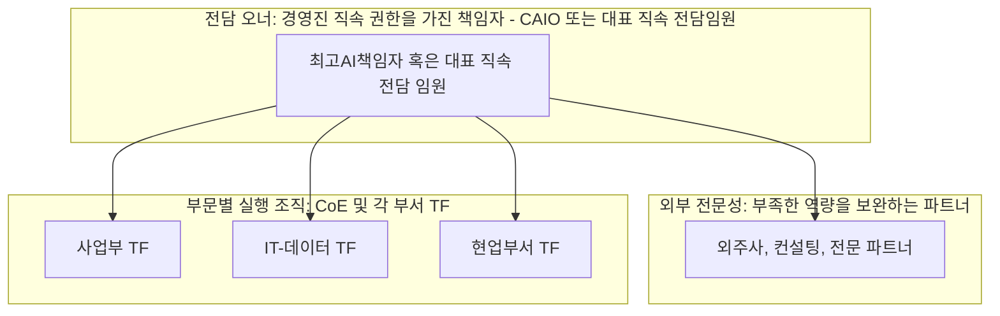

```
AX 하자고 모인 회의, 결론은 '아무도 안 함'이었다.

6개월 전 얘기

CEO가 IT팀을 불러서 말했다.
"경쟁사들은 다 AX 한다는데
우리도 어떻게 할지 준비해서 보고해주세요."

IT팀이 준비해서 보고했다.
"이런 방향으로 하면 될 것 같습니다.
그런데 저희는 통제부서라 AX를 직접 하기는 어렵습니다.
여력도 없고, 별도 조직이 필요합니다."

나도 그 자리에 인사팀으로 있었는데
듣다가 한마디 했다.

"근데 그럼 거기서 해야죠.
거기서 안 하면 누가 합니까?"

아무도 대답을 안 했다.

결국 "임원회의에서 다시 논의합시다." 로 종료.

그리고 6개월이 지난 지금까지
아무 일도 없음....

생각해보면 기업에서 AX가 어려운 이유가
기술 때문만은 아닌 것 같다

다들 필요하다고는 하는데 막상 주인이 없다..

그래서 궁금함..
AX는 도대체 누가 하는 거임 ?

 https://www.threads.com/share/BARqe58taE/

```

---

## 목차

1. 들어가며: 이 문서가 다루는 것
2. 원문 재구성: 6개월 전, 그 회의실에서 있었던 일
3. 댓글 스레드가 드러낸 다섯 개의 현실
4. 이 이야기는 왜 낯설지 않은가 — 데이터로 보는 한국 기업의 AX
5. 스레드 속 두 가지 장벽을 다시 들여다보다: 규제와 보안
6. "그래서 AX는 누가 하는가" — 실제 기업들이 내놓은 답
7. 정리하며
8. 출처 투명성
9. 참고 자료

---

## 1. 들어가며: 이 문서가 다루는 것

이 문서는 소셜미디어 서비스 Threads의 AI 관련 커뮤니티 "AI Threads"에 people_choi라는 사용자가 올린 게시물과, 그 아래 달린 댓글 스레드 하나를 분석 대상으로 삼는다. 게시물의 제목은 "AX 하자고 모인 회의, 결론은 '아무도 안 함'이었다"이며, 글쓴이는 6개월 전 자신이 인사팀 구성원으로 참석했던 한 사내 회의를 회고하는 방식으로 이야기를 풀어낸다. 이 글에 달린 댓글들은 서로 다른 회사, 다른 직무에 있는 사람들이 각자의 현실을 짧게 공유하면서, 결과적으로 "AX(인공지능 전환, AI Transformation)는 조직 안에서 누가 맡아야 하는가"라는 하나의 질문을 여러 각도에서 되비추는 구조를 이루고 있다.

먼저 분명히 해 둘 부분이 있다. 이 게시물과 댓글들은 익명에 가까운 개인 계정들이 남긴 경험담이며, 언급된 회사명이나 구체적인 수치는 외부에서 검증할 수 없다. 따라서 이 문서의 앞부분(2장, 3장)은 어디까지나 "그런 게시물과 댓글이 실제로 존재하며, 그 내용이 이러하다"는 사실을 정리한 것이지, 그 안에 담긴 개별 경험의 진위를 판정하는 것은 아니다. 대신 이 문서의 뒷부분(4장 이후)에서는 그 경험담이 짚고 있는 문제—AX 오너십의 공백, 데이터·보안 정비의 부담, 금융권 규제, 기밀정보 유출 우려, 그리고 실제로 이 문제를 해결한 기업들의 조직 설계—를 웹 검색을 통해 확인 가능한 자료들로 교차 검증하며 살펴본다.

## 2. 원문 재구성: 6개월 전, 그 회의실에서 있었던 일

people_choi가 전하는 이야기는 이렇다. 어느 날 CEO가 IT팀을 불러 "경쟁사들은 다 AX를 한다는데, 우리도 어떻게 할지 준비해서 보고해 달라"고 지시했다. IT팀은 준비한 안을 들고 와서 방향성은 제시했지만, 곧바로 단서를 덧붙였다. 자신들은 "통제부서"이기 때문에 AX를 직접 실행하기는 어렵고, 여력도 없으며, 별도의 조직이 필요하다는 것이었다. 이 자리에 인사팀 구성원으로 배석해 있던 글쓴이는 "그럼 거기서 해야죠. 거기서 안 하면 누가 합니까?"라고 물었지만, 아무도 답하지 못했고, 회의는 "임원회의에서 다시 논의하자"는 말로 마무리됐다. 그리고 6개월이 지난 지금까지 별다른 후속 조치는 없었다고 한다.

글쓴이는 이 경험을 통해 "기업에서 AX가 어려운 이유가 기술 때문만은 아닌 것 같다"고 정리하면서, "다들 필요하다고는 하는데 막상 주인이 없다"는 관찰과 함께 "AX는 도대체 누가 하는 거임?"이라는 질문을 던지며 글을 맺는다.

이 흐름을 시간순으로 정리하면 다음과 같다.



이 도식에서 눈에 띄는 지점은, 회의가 실패로 끝난 게 아니라 애초에 "결정을 내리는 회의"가 아니었다는 점이다. CEO는 방향을 물었고 IT팀은 방향은 제시했지만 실행 주체를 자임하지 않았으며, 그 공백을 메울 다음 단계—누가 실행할지를 정하는 절차—자체가 마련되어 있지 않았다. "임원회의에서 다시 논의하자"는 문장은 표면적으로는 결정을 미루는 말이지만, 실질적으로는 이 안건을 다룰 주체가 없다는 사실을 다른 표현으로 확인한 것에 가깝다.

## 3. 댓글 스레드가 드러낸 다섯 개의 현실

원문 게시물 아래에는 여러 사용자가 각자의 경험과 조언을 남겼다. 이 댓글들을 하나씩 따라가 보면, "주인이 없다"는 현상이 단일한 원인이 아니라 최소 다섯 개의 서로 다른 층위에서 동시에 발생하고 있다는 것을 알 수 있다.

**첫 번째는 데이터와 보안이라는 물리적 장벽이다.** y_sanghyuk는 자신의 회사에서도 비슷한 상황이 벌어져 DevOps팀에서 인력이 차출되어 AX 태스크포스(TF)가 꾸려졌지만, 시작하자마자 전자금융거래법 때문에 로컬 모델이 아니면 LLM이 아예 접근할 수 없는 환경이라는 제약에 부딪혔고, 정리되지 않은 데이터가 산더미처럼 쌓여 있어 AX를 시작하기 전에 치워야 할 것이 너무 많다고 토로했다. 이에 대해 people_choi는 데이터와 보안 정리가 AX 자체보다 더 큰 과제일 수 있다는 데 공감하면서, 자신도 우선 자기 팀 단위에서 데이터 체계와 문서 기준을 잡아 마크다운 형태로 정리하는 중이며, 전사 차원은 몰라도 자기 팀의 데이터부터 AI가 다루기 좋은 형태로 만들어 보고 있다고 답했다.

**두 번째는 "당신 부서는 준비됐는가"라는 반문이다.** dev.beside는 IT팀이 전략팀이나 거버넌스 팀처럼 보인다며, 오히려 역으로 IT팀에 "우리가 AX를 감당할 만큼의 보안과 데이터가 준비되어 있는지"를 먼저 물어보고, 진짜 필요가 있다면 외주를 써서라도 실행 계획을 수립해 달라고 요청하는 편이 현실적이라고 조언했다. 이에 people_choi는 조언에 감사를 표하면서도, 자신의 회사는 전략팀이나 거버넌스 팀이 아니라 실제 개발·운영은 그룹사에 외주를 주고 내부적으로는 PM·관리 역할에 가까운 구조이며, AX를 위한 보안이나 데이터 기반도 아직 갖춰지지 않았다고 답했다. 결국 그 기반을 누가 만들고 누가 실행을 끌고 갈지가 문제로 남는다는 것이다.

**세 번째는 "TF는 만들어지는데 왜 굴러가지 않는가"라는 지점이다.** rider_linus는 짧게 "TF를 꾸립니다"라고 댓글을 남겼고, people_choi는 실제로 자신의 회사에서도 사업부별로 TF가 각각 꾸려져 있다고 답했다. 그러자 r_for_venta는 무엇을 어떻게 할지에 대한 생각도 없이 IT팀에 떠넘기기만 하면 결국 아무도 하지 않게 된다고 지적했다. 즉 조직 구조상 TF라는 형식적 틀은 만들어지더라도, 그 TF가 무엇을 해야 하는지에 대한 구체적 합의가 없으면 형식만 남고 실행은 비어 있는 상태가 반복된다는 것이다.

**네 번째는 직접 몇 달간 실행해 본 사람의 체감이다.** warkingmamiya는 회사 규모가 작다면 대표가 직접 나서야 하고, 조직이 크다면 대표급 권한을 가진 전담 직원(필수), 전문 외주사, 그리고 각 파트별 TF가 함께 있어야 제대로 진행될 것 같다고 밝혔다. 자신은 작은 조직이라 직접 AX를 맡아 몇 개월을 해봤는데, 기술도 중요하지만 정리하고 의사결정을 내려야 할 사안이 훨씬 많았고, 가장 크게 느낀 것은 "실무 직원들이 기존 업무를 하면서 AX까지 같이 하기는 쉽지 않다"는 점이었다고 전했다. people_choi는 이 조언에 깊이 공감하며, 결국 권한을 가진 전담 오너, 외부 전문성, 각 부서 TF라는 세 요소가 함께 있어야 하고, 자신의 회사는 아직 관심 있는 사람들이 각자 시도해보는 수준이라 이 구조 자체를 만드는 것이 남은 숙제라고 정리했다.

**다섯 번째는 보안에 대한 두려움과, 검증되지 않은 외부 링크다.** mad_mozo는 "LLM에게 흘려보낸 회사 기밀이 노출될 것이라는 걱정"을 한 줄로 남겼고, 별도로 bbetterchoice는 "AX팀을 신설하는 이유"라는 문구를 남겼는데 이어지는 내용은 캡처 범위 밖이라 확인할 수 없었다. 한편 i_read.travel.love는 "외부업체요"라는 답과 함께 특정 웹사이트 주소를 함께 남겼는데, 이 링크는 형식이 온전하지 않고 출처나 실체를 확인할 수 있는 정보가 없어 이 문서에서는 특정 업체에 대한 권유나 평가로 인용하지 않는다. 스레드 안에서 이런 형태의 자기 홍보성 댓글이 섞여 있다는 점 자체도, AX를 둘러싼 불안과 수요를 겨냥한 영업이 활발하다는 정황으로 참고할 수 있을 뿐이다.

이 다섯 갈래를 한 장의 그림으로 정리하면, 왜 "아무도 하지 않는" 상태가 유지되는지가 드러난다.



## 4. 이 이야기는 왜 낯설지 않은가 — 데이터로 보는 한국 기업의 AX

원문 스레드는 하나의 개인적 경험담이지만, 댓글 여러 개가 비슷한 패턴을 이야기한다는 사실 자체가 이것이 특정 회사만의 문제가 아닐 가능성을 시사한다. 실제로 국내 기업의 AI·AX 도입 현황을 조사한 여러 자료를 보면, 이 스레드가 그리는 풍경과 상당히 겹치는 지점들이 확인된다.

먼저 "AI를 얼마나 쓰고 있는가"라는 질문에 대해서는 도입률 자체는 이미 높다는 결과가 여러 조사에서 공통적으로 나타난다. 메가존클라우드가 파운드리(옛 IDG)와 함께 국내 기업 AI·IT 담당자 749명을 대상으로 진행한 조사에 따르면, 응답 기업의 55.7%가 이미 생성형 AI를 업무에 활용하고 있었고, 이 중 전사적으로 도입한 경우가 22.4%, 일부 부서에서만 활용하는 경우가 33.2%였다. 현재 구현 중이거나 1~2년 내 도입을 계획하는 기업까지 포함하면 2026년에는 도입률이 85%를 넘어설 것으로 전망됐다. 다만 기업 규모별 격차는 뚜렷해서, 대기업의 전사적 활용률(35.1%)은 중소·중견기업의 두 배가 넘었다[1][2]. 같은 조사에서 생성형 AI 활용의 가장 큰 우려 사항으로는 "잘못된 정보 생성 및 결과 신뢰도 부족"이 61.3%로 1위를 차지했고, "보안 및 개인정보 유출 위험"이 53.3%로 뒤를 이었다.



도입률은 이렇게 높은데도 왜 실제 성과로 이어지지 않는가에 대해서는, 한국인공지능·소프트웨어산업협회(KOSA)가 언급한 수치가 하나의 단서를 준다. 국내 제조업의 AI 활용률은 17.9% 수준에 머물러 있으며, AI를 도입하지 못하는 가장 큰 원인으로는 "AI 도입 영역과 공정 파악의 어려움"이 41.6%로 꼽혔다[3]. 초거대AI추진협의회가 발간한 'AX 사례집'은 AX가 실패하는 원인을 네 가지로 정리했는데, 책임 소재(R&R)가 불명확한 것, 운영 단계에서의 모니터링이 부재한 것, 현장의 데이터 편차에 대응하지 못하는 것, 그리고 거버넌스 부재로 도입 자체가 가로막히는 것이 그것이다. 이 보고서는 개념검증(PoC) 단계에서는 문제가 없다가도 실제 운영 단계에 들어서면 책임 소재가 불분명해 현장의 신뢰를 얻지 못하고 흐지부지되는 경우가 반복된다고 지적하면서, 한 시점의 테스트 성공이 계절과 설비, 환경이 바뀌는 실제 운영 전체를 보장하지는 않는다는 점을 강조했다. 같은 보고서에 담긴 한 사례에서는, 업무에 쓸 자료가 한글(HWP) 파일 형태로 들어오는 순간 프로젝트의 상당 부분이 콘텐츠 생성이 아니라 파일 형식을 처리하는 데 소모된다는 지적도 나왔다. 공공기관 문서 대부분이 HWP 형식인 한국적 환경에서는, AI 도입의 첫 장벽이 모델의 성능이 아니라 입력 데이터의 형식에 있다는 뜻이다[3][4].

이 문제를 "책임 소재"라는 키워드로 좀 더 직접적으로 짚은 발표도 있다. 삼성SDS의 허필현 그룹장은 한 컨퍼런스에서 엔터프라이즈 AI 프로젝트의 약 95%가 실패한다는 진단을 내놓으면서, 그 원인으로 운영 상황을 고려하지 않은 도입 전략, 기업 고유의 맥락이 빠진 에이전트 구축, 그리고 경영진·현업·엔지니어링을 아우르는 통합 조직의 부재를 꼽았다[4][5]. 이 발표는 하나의 언론 보도를 통해 확인된 단일 발표 내용이므로 업계 전체의 공인된 통계로 단정할 수는 없지만, 앞서 살펴본 초거대AI추진협의회의 4대 실패 요인과 방향이 겹친다는 점은 눈여겨볼 만하다.

원문 스레드가 묻는 "왜 주인이 없는가"라는 질문에 대해서는, 변화관리를 전문으로 하는 연구기관 Prosci가 1,107명을 대상으로 진행한 조사가 참고가 된다. 이 조사에서는 AI 도입 실패 원인의 43%가 "경영진 스폰서십의 불충분함"으로 나타났고, 전체 실패 원인의 63%가 기술적 요인이 아니라 인적 요인이었으며 기술적 요인은 16%에 그쳤다. 다만 이 수치는 국내 매체가 해외 연구를 재인용한 형태로 확인한 것이라, 원 조사 결과를 직접 확인한 것은 아니라는 점을 밝혀둔다[6]. 비슷한 맥락에서 한국마이크로소프트가 발표한 2026년 업무동향지표는, 한국 직장인들이 AX에 대한 위기의식은 강하게 느끼면서도 정작 조직이 그 요구를 실행으로 옮기는 속도는 따라가지 못하고 있다는 결과를 보여줬다. 이 조사를 소개하며 한국마이크로소프트의 오성미 디렉터는 이런 흐름을 '불안'이라기보다 변화를 적극적으로 받아들이려는 한국 직장인 특유의 강한 열망으로 해석하면서, 이를 AI 전환의 동력으로 삼으려면 경영진의 명확한 의지 표명, 조직 내 변화를 주도할 전문가 육성, 실무를 독려할 중간 관리자의 역량 강화가 시급하다고 덧붙였다[7].

이렇게 놓고 보면, 원문 게시물의 "다들 필요하다고는 하는데 막상 주인이 없다"는 문장은 개인의 인상비평이 아니라, 여러 조사가 공통적으로 짚는 구조적 현상—경영진의 스폰서십 부족, 책임 소재 불명확, 통합 조직의 부재—을 압축적으로 표현한 것에 가깝다.

## 5. 스레드 속 두 가지 장벽을 다시 들여다보다: 규제와 보안

댓글 스레드에서 특히 구체적으로 언급된 두 가지 장애물, 즉 전자금융거래법으로 인한 로컬 모델 제약과 회사 기밀 유출 우려는 각각 실제로 근거가 있는 제약과 우려인지 확인해 볼 필요가 있다.

**첫째, 전자금융거래법과 망분리 규제.** y_sanghyuk가 언급한 상황, 즉 전자금융거래법 때문에 로컬 모델이 아니면 LLM이 회사 데이터에 접근할 수 없다는 제약은 실제로 근거가 있는 이야기다. 금융회사에는 오랫동안 내부 업무망과 외부 인터넷망을 물리적·논리적으로 분리하는 '망분리' 규제가 적용되어 왔고, 이는 전자금융거래법 제21조와 전자금융감독규정 제15조에 근거를 둔다. 다만 이 규제는 최근 몇 년 사이 상당히 완화되는 흐름을 보이고 있다. 2025년 2월 5일 시행된 개정 전자금융감독규정은 금융 보안 규제를 세세한 규칙 중심에서 원칙 중심으로 전환해, 금융회사가 스스로 보안 위협을 진단하고 유연하게 대응할 수 있는 여지를 넓혔다[8]. 이어 금융위원회는 클라우드 기반 소프트웨어(SaaS)를 금융회사가 손쉽게 활용할 수 있도록 망분리 규제를 개선하는 방안을 발표했고, 2023년 9월부터 규제 샌드박스를 통해 32개 금융회사가 85건의 SaaS 관련 혁신금융서비스를 운영해 온 축적된 사례를 근거로 이를 상시적인 규제 예외로 제도화했다[9]. 그 결과 2026년 4월 20일부터는 금융회사가 일정 요건을 충족하는 SaaS에 대해서는 개별 규제 샌드박스 지정 없이도 내부 업무망에서 클라우드 서비스를 이용할 수 있게 되었는데, 다만 이 예외를 적용받으려면 침해사고 대응기관(금융보안원 등)의 평가를 거친 SaaS를 사용하고, 접속 단말기에 대한 보호 대책을 마련하며, 반기에 한 번씩 정보보호통제 이행 여부를 평가해 정보보호위원회에 보고하는 등의 엄격한 통제 장치를 갖춰야 한다[10]. 요약하면, 금융권에서 LLM을 자유롭게 쓰기 어려운 것은 실재하는 규제 때문이 맞지만, 그 규제 자체가 최근 들어 원칙 중심·단계적 완화의 방향으로 움직이고 있다는 점도 함께 볼 필요가 있다. 다만 이런 완화는 어디까지나 엄격한 보안 통제를 전제로 한 예외 확대이지, 망분리 원칙 자체가 폐지된 것은 아니므로, y_sanghyuk가 말한 "치워야 할 게 너무 많다"는 체감은 여전히 유효한 현실로 보인다.

**둘째, 기밀정보 유출에 대한 우려.** mad_mozo가 짧게 언급한 "LLM에게 흘려보낸 회사 기밀이 노출될 것이라는 걱정"은 여러 보안 관련 설문에서 반복적으로 확인되는 주제다. 이스트시큐리티가 국내 기업 보안 담당자와 실무자 약 200명을 대상으로 진행한 설문에서는, 응답자의 64.5%가 LLM 도입 시 민감 데이터 유출을 가장 큰 우려로 꼽았고, 79%가 중간 이상 수준의 우려를 나타냈다. 이 조사에서 이미 생성형 AI를 업무에 적용 중이라고 답한 응답자는 절반에 달했는데, 활용 분야로는 데이터 및 의사결정 지원이 42%로 가장 많았다[11]. 2026년에 발표된 한 문서보안 관련 설문에서는 더 구체적인 수치가 나온다. 응답자의 52.9%가 생성형 AI를 활용하는 과정에서 사내 문서를 직접 입력해 본 경험이 있다고 답했고, 84.8%는 생성형 AI 도입 이후 보안사고 가능성이 높아졌다고 느낀다고 답했다. 가장 우려되는 문제로는 기밀문서 유출(45.7%)이 가장 많이 꼽혔고, 개인정보 유출(21.7%)과 AI 학습데이터 활용에 대한 우려(17.4%)가 뒤를 이었다[12]. 보안 솔루션을 제공하는 한 업체의 블로그에서는 2024년 한 해 동안 생성형 AI 관련 데이터 유출 방지(DLP) 사고가 전년 대비 2.5배 증가했고, 기업 직원의 38%가 승인 없이 민감한 업무 데이터를 AI에 입력한 적이 있다는 수치를 인용하고 있는데, 이 수치는 로컬 LLM 도입을 권장하는 마케팅성 글에서 인용된 것이므로 다른 독립적인 출처로 교차 확인하지는 못했다는 점을 밝혀둔다[13].

이 두 가지를 종합하면, 스레드에서 언급된 두 장벽—법적 제약과 유출 우려—모두 허구의 걱정이 아니라 실제로 여러 조사가 뒷받침하는 현실적인 문제라는 것을 확인할 수 있다. 동시에, 이 문제들은 기술 도입 이전에 데이터 거버넌스와 보안 통제 체계를 먼저 정비해야 한다는 하나의 결론으로 수렴한다는 점에서, 3장에서 y_sanghyuk와 people_choi가 나눈 대화—"데이터/보안 정리가 진짜 더 큰 일"이라는 말—과 정확히 맞닿아 있다.

## 6. "그래서 AX는 누가 하는가" — 실제 기업들이 내놓은 답

원문 스레드의 결론부에서 던져진 질문, 즉 "AX는 도대체 누가 하는 것인가"에 대해, 규모가 큰 국내 기업들은 최근 1년 사이 비교적 뚜렷한 답을 내놓고 있다. 핵심은 "경영진 직속의 전담 책임자를 두고, 그 아래 부문별 실행 조직을 배치한다"는 형태로 수렴하는 모습이다.

SK AX(옛 SK C&C)는 2025년 12월 조직 개편을 통해 최고AI책임자(CAIO) 직위를 CEO 직속으로 신설하고 차지원 부사장을 CAIO로 선임했다. 이와 함께 미래 핵심 과제를 전담하는 '성장 스쿼드'를 새로 만들고, 각 사업 부문 직속으로 전문역량센터(CoE, Center of Excellence)를 배치해 부문별 AX 핵심 과제를 집중적으로 수행하도록 했으며, 이 CoE 과제 전체를 CAIO가 총괄하는 구조를 갖췄다. SK AX 측은 이 개편이 AI 선행 기술 연구와 상품의 전체 수명 주기 관리, 그리고 실행 조직을 하나의 흐름으로 연결하기 위한 것이라고 설명했다[14][15]. 삼성그룹 역시 2026년 6월 이재용 회장 주도로 관계사 전반에 AI를 전면 도입하는 'AI 대전환' 전략을 선언한 이후, 삼성디스플레이와 삼성전기 등 계열사에 CAIO 직급을 신설했고, 삼성전자는 기존 AX팀을 AX/PI(프로세스 혁신)센터로 격상해 업무 전반의 개선과 AI 표준화를 전담하도록 했다[16]. LG유플러스도 2026년 조직 개편에서 전략·AX 조직을 CEO 직속으로 올려 의사결정 속도를 높이고, AX 부문을 사업을 총괄하는 조직과 상품 출시를 담당하는 조직으로 재편했다[17].

이런 흐름은 민간 대기업에 국한되지 않는다. 공공 부문에서도 비슷한 논의가 이어지고 있다. 행정안전부는 2025년 4월 부처와 지방자치단체, 공공기관 전반에 최고AI책임자(CAIO) 지정을 의무화하는 방안을 추진한다고 밝힌 바 있으며[18], 이후 2025년 9월 대통령 직속 국가AI전략위원회가 출범해 AI 인프라 확대와 공공부문 AI 도입에 속도를 내고 있다는 보도가 이어지고 있다[20]. 2025년 8월 국회에서 열린 한 세미나에서도 학계 발제자가 대통령실부터 지방자치단체까지 CAIO 중심의 거버넌스 체계를 구축하는 것이 AI 정부 실현의 필수 조건이라고 강조한 바 있다[19]. 다만 이 문서를 작성하는 시점을 기준으로, CAIO 지정이 전 공공기관에 실제로 법적으로 의무화되었는지 여부까지는 확인하지 못했으며, 위 내용은 어디까지나 추진 방침과 논의 단계로 이해하는 것이 정확하다.

이렇게 실제 조직 개편 사례들을 정리하고 나면, 흥미로운 지점이 하나 드러난다. 3장에서 살펴본 warkingmamiya의 댓글—"권한 있는 전담 오너 + 외부 전문성 + 각 부서 TF 구조가 있어야 한다"는 결론—이, 대기업들이 실제로 채택하고 있는 'CAIO + CoE + 부문별 TF' 구조와 거의 정확히 겹친다는 점이다. 규모가 전혀 다른 조직임에도 불구하고, 몇 달간 직접 AX를 맡아본 실무자의 경험적 결론과 대기업의 공식 조직 개편 방향이 같은 지점으로 수렴하고 있는 셈이다.



물론 이 구조를 그대로 옮겨온다고 해서 문제가 자동으로 풀리는 것은 아니다. dev.beside와 people_choi의 대화에서 드러났듯, 애초에 전략팀이나 거버넌스 팀 자체가 없는 조직, 개발과 운영을 통째로 그룹사에 외주 주고 내부는 PM·관리 기능만 남아 있는 조직이라면 'CAIO'라는 직함 하나를 만든다고 데이터와 보안 기반까지 저절로 갖춰지지는 않는다. 다만 원문 스레드가 던진 질문—"주인이 누구인가"—에 대해서는, 적어도 규모가 있는 기업들이 택한 답이 "특정 부서에 떠넘기는 것이 아니라, 경영진 직속의 전담 권한을 가진 자리를 새로 만드는 것"이라는 점은 비교적 분명해 보인다.

아래 표는 원문 스레드가 묘사한 정체된 상태와, 지금까지 살펴본 조사·사례들이 보여주는 작동 구조를 나란히 놓은 것이다.

| 구분 | 스레드 속에서 정체된 조직의 모습 | 조사·사례가 보여주는 작동하는 구조 |
|---|---|---|
| 오너십 | 임원회의로 안건을 넘기고 6개월간 후속 조치 없음 | 대표 직속 CAIO 또는 전담 임원이 전권을 갖고 총괄 |
| 실행 조직 | IT팀은 통제부서를 자임하며 실행을 사양, 사업부 TF는 방향 없이 형식적으로만 결성 | 부문별 CoE가 핵심 과제를 맡고, TF는 오너의 지시 아래 구체적 과제를 수행 |
| 데이터-보안 | 정리되지 않은 데이터가 쌓여 있고, 망분리 규제로 LLM 접근 자체가 막혀 있음 | 데이터 표준화와 접근권한 정비를 AI 도입에 앞선 선행 과제로 명시 |
| 외부 자원 | 필요성은 언급되나 구체적으로 검토되지 않음 | 전문 외주-컨설팅과 결합해 부족한 역량과 인력을 보완 |

## 7. 정리하며

people_choi의 게시물은 한 회사의 사례를 담담하게 전달하는 짧은 글이지만, 그 아래 달린 댓글들과 이를 뒷받침하는 여러 조사 자료를 함께 놓고 보면 이 이야기가 특정 조직만의 예외적인 실패담이 아니라는 것이 드러난다. 국내 기업의 절반 이상이 이미 생성형 AI를 어떤 형태로든 쓰고 있다는 조사 결과와, 그럼에도 불구하고 제조업 AI 활용률이 20%에 못 미치고 엔터프라이즈 AI 프로젝트의 대다수가 성과로 이어지지 못한다는 진단이 동시에 존재한다는 사실 자체가, "쓰고는 있는데 전환은 안 된다"는 이 스레드의 정서를 그대로 뒷받침한다. 그리고 그 원인으로 여러 조사가 공통적으로 지목하는 것은 기술의 완성도가 아니라 책임 소재, 경영진의 스폰서십, 통합된 실행 조직의 유무였다.

동시에 이 스레드는 두 가지 현실적인 장애물—금융권 등에 적용되는 망분리 규제, 그리고 기밀정보 유출에 대한 두려움—을 구체적으로 짚었는데, 이 두 가지 모두 근거 없는 걱정이 아니라 실제 규제 조항과 여러 설문 조사로 뒷받침되는 현실이었다. 다만 망분리 규제는 최근 원칙 중심으로, 그리고 엄격한 통제를 전제로 한 단계적 완화의 방향으로 움직이고 있다는 점도 함께 확인됐다.

마지막으로, "AX는 누가 하는가"라는 원문의 질문에 대해 규모 있는 국내 기업들이 실제로 택한 답은 비교적 일관됐다. 경영진 직속의 전담 권한을 가진 책임자를 두고, 그 아래 부문별 실행 조직과 외부 전문성을 결합하는 것이다. 이는 공교롭게도 작은 조직에서 몇 달간 직접 AX를 담당해 본 한 댓글 작성자가 스스로 도달한 결론과 같은 방향을 가리키고 있었다. 결국 이 스레드가 남긴 진짜 메시지는, AX가 멈추는 이유는 대개 어떤 도구를 골랐는지가 아니라 누가 그 도구를 쓸 권한과 책임을 지고 있는지가 정해지지 않았기 때문이라는 것으로 요약할 수 있다.

## 8. 출처 투명성

이 문서에 인용된 정보는 검증 가능성의 수준이 서로 다르므로, 다음과 같이 구분해 표기한다.

**여러 독립된 언론·기관 자료로 교차 확인된 사실**: 메가존클라우드-파운드리의 국내 기업 AI 도입률 조사 수치, KOSA의 제조업 AI 활용률 통계, 전자금융감독규정 개정 시행일과 2026년 4월 20일 SaaS 망분리 예외 시행 내용, SK AX-삼성-LG유플러스의 CAIO-AX 조직 개편(각각 복수의 언론사가 동일 사실을 보도).

**단일 출처로만 확인된 주장**: 삼성SDS 허필현 그룹장의 "엔터프라이즈 AI 95% 실패" 진단(디지털데일리 1건의 컨퍼런스 보도를 통해서만 확인), 초거대AI추진협의회 'AX 사례집'의 세부 사례(동일 보도자료 계열의 기사 2건을 통해서만 확인).

**벤더의 자체 발표·마케팅 성격이 있는 자료**: Salesforce 블로그의 AX 전환 실패 원인 분석(자사 플랫폼 홍보를 목적으로 작성됨), flex 블로그의 데이터 기준 관련 주장(자사 서비스와 연결된 기고문), 피카부랩스 블로그의 DLP 사고 증가율 및 승인 없는 데이터 입력 비율(로컬 LLM 서비스를 권장하는 맥락에서 인용된 수치로, 원 출처를 별도로 확인하지 못함), Sphinx AI 관련 블로그의 유출 사례 설명(자사 보안 솔루션 홍보를 겸한 글).

**2차 인용으로 확인된 자료(원 출처 미확인)**: Prosci의 1,107명 대상 변화관리 조사 결과는 국내 블로그(ucanlabs)가 재인용한 수치를 통해 확인했으며, Prosci의 원 보고서를 직접 확인하지는 못했다.

**해석적 분석 및 검증 불가능한 진술**: 원문 Threads 게시물과 댓글에 담긴 개인적 경험담 전체(회사명, 구체적 상황이 외부에서 검증 불가능), 그리고 i_read.travel.love가 언급한 외부 업체 및 링크(출처와 실체를 확인할 수 없어 특정 업체에 대한 권유로 인용하지 않음).

## 9. 참고 자료

[1] CIO, "2026년 국내 기업 85%가 생성형 AI 도입…10곳 중 8곳 예산 확대" — https://www.cio.com/article/4045735/2026%EB%85%84-%EA%B5%AD%EB%82%B4-%EA%B8%B0%EC%97%85-85%EA%B0%80-%EC%83%9D%EC%84%B1%ED%98%95-ai-%EB%8F%84%EC%9E%8510%EA%B3%B3-%EC%A4%91-8%EA%B3%B3-%EC%98%88%EC%82%B0-%ED%99%95.html

[2] 다음뉴스(메가존클라우드), "국내 기업 85%, 2026년까지 생성형 AI 활용 전망" — https://v.daum.net/v/20250826142538487

[3] 아주경제, "AX에 실패하는 기업들..."도입 넘어 운영 재설계가 필수"" — https://www.ajunews.com/view/20260511141644195

[4] 디지털데일리, "제조산업에서 'AX 혁신'이 성공하기 힘든 이유…해법은 무엇일까" — https://m.ddaily.co.kr/page/view/2026041809070827010

[5] ucanlabs, "우리도 AI 했는데 왜 안 바뀔까 — 2026년, AX 성공과 실패" — https://ucanlabs.kr/blog/ucanlabs-e2e-ax-episode0/

[6] (5번과 동일 출처, Prosci 조사 재인용 부분)

[7] 네이트뉴스, "직원들은 AX 위기의식 강하지만 조직이 실행에 더뎌"(한국마이크로소프트 2026 업무동향지표) — https://m.news.nate.com/view/20260615n24779

[8] 김·장 법률사무소, "개정 '전자금융감독규정' 시행 – 클라우드 관련 변경사항을 중심으로" — https://www.kimchang.com/ko/insights/detail.kc?sch_section=4&idx=31392

[9] 금융위원회 보도자료, "금융사들이 손쉽게 클라우드 기반 소프트웨어를 활용하도록…" — https://www.fsc.go.kr/no010101/86080

[10] 금융위원회 보도자료, "4월 20일부터 금융회사는 내부 업무망에서 클라우드 기반…" — https://www.fsc.go.kr/no010101/86745

[11] 아이티데일리, "국내 기업 64%, LLM 도입 시 민감 데이터 유출 우려" — https://www.itdaily.kr/news/articleView.html?idxno=230782

[12] 보안뉴스, "[2026 문서보안 솔루션 리포트] 문서를 읽기 시작한 AI, 기업 문서는 과연 안전한가" — https://www.boannews.com/news/articleView.html?idxno=144201

[13] 피카부랩스 블로그, "ChatGPT 기밀 유출 사고 2.5배 급증, 로컬 LLM이 유일한 해답인 이유" — https://peekaboolabs.ai/blog/chatgpt-data-breach-local-llm

[14] 시사저널e, "SK AX CAIO 직제 신설···차지원 부사장 선임" — https://www.sisajournal-e.com/news/articleView.html?idxno=417582

[15] 머니투데이, "SK AX, 최고AI책임자 중심 AI사업 가속화... 임원인사 단행" — https://www.mt.co.kr/tech/2025/12/04/2025120413475921559

[16] ZDNet Korea, "삼성, 'CAIO' 직급 신설…AX 전략 속도 낸다" — https://zdnet.co.kr/view/?no=20260813100301

[17] 메트로신문, "LG유플러스, 2026년 조직 전면 재편…AX 중심 구조로 '초민첩체제' 구축" — https://www.metroseoul.co.kr/article/20251201500392

[18] 전자신문, "공공 AX 이끌 '최고AI책임자(CAIO)' 지정 의무화 추진" — https://www.etnews.com/20250423000265

[19] 디지털데일리, "이제는 'K-행정' 시대…국가 CAIO 주도 'AI혁신정부 종합대책' 마련해야" — https://www.ddaily.co.kr/page/view/2025080616144277649

[20] 뉴스토마토, "공공부문 AI 도입 확산…기본권 침해-도입실태 파악 미흡" — https://newstomato.com/ReadNews.aspx?no=1287539

[원문] Threads, people_choi, "AX 하자고 모인 회의, 결론은 '아무도 안 함'이었다" — https://www.threads.com/share/BARqe58taE/
