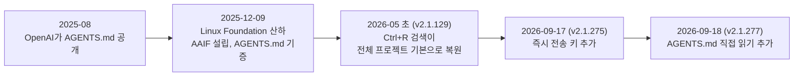
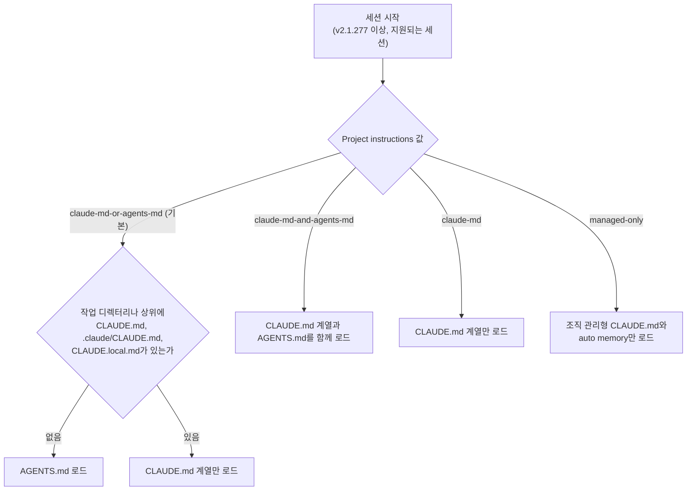
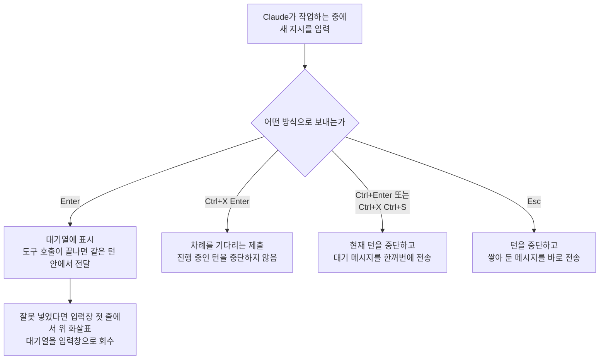

> 기준일: 2026-09-19 / 확인한 최신 버전: v2.1.277 (2026-09-18 공개)

> 
> 에이전트 운영 관점에서 Claude Code 최신 버전에 매우 편리한 두 가지 기능이 생겼습니다. 사실 Codex 에서는 이미 되던건데...
> 
> 1) 프로젝트 폴더에 CLAUDE.md 가 없을 때 AGENTS.md 를 읽음. 즉, 예전에는 클로드 코드와 다른 모델 하네스를 (codex, agy 등) 같이 쓸 때 alias 를 쓴다든가 @ 블록으로 읽게 한다든가 해서 어느 모델을 쓰던 동일한 가이드라인을 셋팅하곤 했었는데, 이제 간편하게 AGENTS.md 로 대동단결할 수 있게 됐습니다. 혼자서 굳이 유아독존하려는 모습이 좀 그랬는데, 이제 깔끔해졌네요.
> 
> 2) Codex 는 steering 기능이 있어서 메인 에이전트가 뭔가 작업중이더라도 새로운 프롬프트를 밀어넣어서 같이 고려하게 할 수 있어서 효율적이었는데, Claude Code 는 btw 로 급하게 완전 별개의 임시 컨텍스트 창에서 체크하거나 물어볼 수는 있었지만 동일 컨텍스트에 새 지시를 밀어넣을 수는 없었습니다. 드디어 해당 기능이 추가됐습니다.
> 
> 작업이 진행중일 때 프롬프트를 넣으면 회색으로 대기열에 쌓이는게 눈에 보이고, 앞의 작업이 끝나거나 혹은 자기가 알아서 판단해서 중간중간 대기열의 것들을 체크하곤 했는데, 대기열이 쌓인 상태에서 맥에서는 Ctrl + Enter 윈도우에서는 Ctrl+X 나 Ctrl+S 를 누르면 대기열에 있던 프롬프트가 즉시 현재 진행 컨텍스트에 주입됩니다. 
> 
> 참고로, 프름프트 입력 창에 뭔가 타이핑하다가 Ctrl + S를 누르면 임시 보관 슬롯에 저장되고(stashed), 입력창은 비워지고, 다시 Ctrl + S 를 누르면 임시 보관 슬롯에 있던 텍스트로 입력창이 대체되는 기능도 있습니다. 
> 
> 관련해서 유용한 팁 하나 더 말씀드리면, 앞에서 입력한 프롬프트를 찾아서 보거나 재활용할 때, 방향키를 위로 여러번 눌러서 하는 방법도 있지만, Ctrl+R 을 하면 터미널 하단에 아래와 같이 괜찮은 UI 로 세션내 모든 프롬프트 이력을 보면서 심지어 필터까지 걸어서 바로 찾아서 체크하고 재활용할 수 있습니다. 사실 세션 내에서만이 아니라 이 상태에서 Ctrl+S 로 토글하면서 검색 범위를 세션, 프로젝트, 전체로 변경할 수 있는데 상당히 강력합니다. 
> 
> 이 기능은 오히려 Claude Code 데스크톱앱에서는 적절한 UI로 제대로 구현하지 못했는데 터미널에서는 완벽하게 구현되어 있네요. 터미널에서 구현한 것처럼 데스크톱앱 버전에서도 하면 좋을텐데 왜 현재같이 했는지...
> 
> #ai #agent #claudecode #cli #tip #hack #gonnector #고넥터
> 
> https://www.facebook.com/share/p/19UshGXGoi/
> 


## 이 글의 기준과 범위

이 글은 SNS에 공유된 짧은 글 한 편이 소개한 세 가지 내용을 풀어서 설명합니다. 첫째는 프로젝트 폴더에 CLAUDE.md가 없으면 Claude Code가 AGENTS.md를 읽게 된 변화이고, 둘째는 Claude가 작업하는 도중에 새 지시를 넣을 수 있는 대기열과 그것을 즉시 보내는 단축키이며, 셋째는 Ctrl+S(입력 임시 보관)와 Ctrl+R(프롬프트 이력 검색)이라는 두 가지 편의 기능입니다.

확인 방법은 다음과 같습니다. Claude Code 공식 변경 이력(code.claude.com, v2.1.277은 2026-09-18, v2.1.275는 2026-09-17 항목)과 공식 문서의 memory, interactive mode, keybindings, fullscreen 페이지를 직접 읽었고, GitHub 릴리스 페이지, Linux Foundation과 OpenAI의 발표문, OpenAI Codex 공식 문서를 교차 확인했습니다. 게시글 원문 페이지는 자동 접근이 차단되어 열 수 없었기 때문에, 전달받은 본문 텍스트를 기준으로 삼았습니다. 확인하지 못한 부분과 단일 출처에만 의존한 부분은 본문에서 그렇게 표시했습니다.

## 먼저 결론

가장 큰 변화는 Claude Code가 이제 CLAUDE.md가 없는 프로젝트에서 AGENTS.md를 직접 읽는다는 점입니다. 공식 변경 이력은 v2.1.277에서 이 지원이 추가되었고, /config의 "Project instructions" 항목에서 동작을 바꿀 수 있다고 적고 있습니다. 여러 코딩 에이전트를 함께 쓰는 사람에게는 지침 파일을 하나로 통일할 수 있게 된 셈입니다. 다만 기본 규칙은 "CLAUDE.md 계열 파일이 하나라도 있으면 AGENTS.md는 읽지 않는다"이고, Bedrock, Vertex, Foundry 같은 일부 세션에서는 아직 지원되지 않습니다. 이 조건을 모르고 넘어가면 지침이 조용히 빠지는 함정이 생깁니다.

두 번째 변화는 v2.1.275에서 추가된 즉시 전송 키입니다. 게시글은 이것을 "Codex의 steering이 드디어 생겼다"는 식으로 소개하지만, 공식 자료를 따라가 보면 조금 다른 그림이 나옵니다. 작업 중에 Enter로 넣은 메시지가 도구 호출이 끝나는 대로 같은 턴 안에서 전달되는 동작은 공식 문서에 이미 설명되어 있었고, 새로 생긴 것은 현재 턴을 중단하고 대기열 전체를 한꺼번에 보내는 단축키입니다. 이 차이는 뒤에서 자세히 다룹니다.

세 번째로 Ctrl+S와 Ctrl+R은 공식 문서에서 그대로 확인됩니다. 다만 Ctrl+R의 범위 전환은 전체화면 렌더링이라는 표시 방식에서만 동작한다는 조건이 붙습니다.

## 게시글 내용 사실 확인

아래 표는 게시글의 주장을 하나씩 공식 자료와 맞춰 본 결과입니다. "확인됨"은 공식 변경 이력이나 공식 문서에서 같은 내용을 찾았다는 뜻이고, "부분 확인"은 방향은 맞지만 표현이나 세부 조건이 다르다는 뜻입니다.

| 게시글의 내용 | 판정 | 근거와 보충 |
| --- | --- | --- |
| CLAUDE.md가 없으면 AGENTS.md를 읽는다 | 확인됨 | v2.1.277 변경 이력(2026-09-18)과 공식 memory 문서의 AGENTS.md 전용 섹션 |
| /config에서 조정할 수 있다 | 확인됨 | "Project instructions" 항목, 값 4가지 (2장에서 설명) |
| 예전에는 alias나 @ 블록으로 우회했다 | 확인됨 | 갱신 전 문서 사본이 @AGENTS.md 가져오기와 심볼릭 링크를 공식 우회책으로 안내 |
| 이제 AGENTS.md로 통일할 수 있다 | 조건부 확인 | 기본값에서는 CLAUDE.md, .claude/CLAUDE.md, CLAUDE.local.md가 하나도 없을 때만 해당. 버전과 세션 종류 조건도 있음 |
| Claude Code는 동일 컨텍스트에 새 지시를 넣을 수 없었다 | 보완 필요 | 즉시 전송 키가 없던 시점의 문서 사본에도, 작업 중 Enter로 넣은 메시지가 도구 호출이 끝나는 대로 같은 턴 안에서 전달된다는 설명이 있음. 새로 추가된 것은 즉시 전송 단축키 |
| 대기열 프롬프트가 회색으로 쌓인다 | 확인됨 | v2.1.275: 보낸 메시지와 대기 중인 메시지는 모델이 받기 전까지 회색으로 표시 |
| 모델이 알아서 판단해 대기열을 확인한다 | 표현이 다름 | 공식 문서는 모델의 판단이 아니라 Claude Code가 도구 호출이 끝나는 시점에 전달한다고 설명 |
| Ctrl+Enter를 누르면 대기열이 즉시 현재 컨텍스트에 주입된다 | 부분 확인 | 변경 이력은 "현재 턴을 중단하고 대기 메시지를 한꺼번에 전송"이라고 기술. 중단 없이 끼워 넣는다는 설명은 아님 |
| Windows는 Ctrl+X 또는 Ctrl+S | 부분 확인 | 변경 이력의 표기는 "ctrl+x ctrl+s", 즉 두 키를 차례로 누르는 조합. Ctrl+S 단독은 입력 임시 보관 기능. 운영체제별로 키가 나뉜다는 설명은 공식 자료에서 찾지 못함 |
| Ctrl+S로 입력을 임시 보관하고 다시 눌러 복원한다 | 확인됨 | interactive mode 문서, 키바인딩 문서의 chat:stash |
| Ctrl+R로 이력을 검색하고 Ctrl+S로 세션, 프로젝트, 전체 범위를 바꾼다 | 확인됨 (조건부) | 범위 전환은 전체화면 렌더링에서만 동작. 기본 렌더러의 인라인 검색은 항상 전체 프로젝트 대상 |
| 데스크톱 앱은 이 UI를 제대로 구현하지 못했다 | 확인 불가 | 평가의 영역. 공식 문서는 Ctrl+R 이력 검색을 터미널 CLI 기능으로 설명. 3장 끝과 6장 참고 |

## 1. 어떤 순서로 바뀌어 왔나

세 가지 변화는 서로 다른 시점에 쌓인 것입니다. 아래 도해는 이 글에서 다루는 사건을 시간순으로 놓은 것입니다.



AGENTS.md가 처음 나온 것은 2025년 8월입니다. Linux Foundation의 2025-12-09 발표는 AGENTS.md가 OpenAI에 의해 2025년 8월에 공개되었고, MCP, goose와 함께 새로 만들어진 Agentic AI Foundation(AAIF)에 기증되었다고 밝힙니다. Ctrl+R의 전체 프로젝트 검색은 Claude Code 공식 주간 요약(2026년 19주차, 5월 4~8일)에 v2.1.129 항목으로 소개되어 있습니다.

## 2. AGENTS.md를 직접 읽게 된 변화

### 2.1 무엇이 문제였나

코딩 에이전트가 늘어나면서 프로젝트 지침을 담는 파일의 이름이 도구마다 갈라졌습니다. Claude Code는 CLAUDE.md를 읽고, 다른 여러 도구는 AGENTS.md를 읽는 구조였습니다. AGENTS.md는 agents.md 사이트가 "에이전트를 위한 README"라고 소개하는 개방형 형식으로, 사이트는 6만 개가 넘는 오픈소스 프로젝트가 쓴다고 밝히고, 하위 패키지마다 파일을 두면 에이전트가 가장 가까운 파일을 읽어 그것이 우선한다고 설명합니다. OpenAI의 발표문은 OpenAI가 Anthropic, Block과 함께 AAIF를 공동 설립했다고 적고 있고, Linux Foundation의 발표에서는 Anthropic이 플래티넘 회원으로 나옵니다.

그런데도 v2.1.277 이전의 Claude Code 공식 문서는 CLAUDE.md만 읽는다고 분명히 적고 있었습니다. 대신 두 가지 우회책을 안내했습니다. 하나는 CLAUDE.md 안에 `@AGENTS.md`라고 적어 파일을 가져오는 방법이고, 다른 하나는 `ln -s AGENTS.md CLAUDE.md`로 심볼릭 링크를 만드는 방법입니다. 게시글이 말하는 "alias"나 "@ 블록"은 바로 이 계열의 우회책입니다.

수요가 컸다는 정황도 있습니다. 2026-03-01에 외부 기여자가 AGENTS.md 폴백을 제공하는 플러그인을 제안하는 풀 리퀘스트(anthropics/claude-code #29833)를 올렸고(현재는 닫힘), 설명문에 이것이 저장소에서 가장 추천을 많이 받은 이슈를 겨냥한 것이라고 적었습니다. 다만 이것은 기여자 본인의 서술이며 직접 집계한 수치가 아니므로 참고 정도로만 받아들이시기 바랍니다.

### 2.2 v2.1.277에서 바뀐 규칙

공식 변경 이력(2026-09-18)은 CLAUDE.md가 없는 프로젝트에서는 Claude Code가 대신 AGENTS.md를 읽고, 이 동작을 /config의 "Project instructions"에서 바꿀 수 있으며, Bedrock, Vertex, Foundry에서는 아직 지원하지 않는다고 적고 있습니다. 공식 memory 문서에는 이 기능을 설명하는 전용 섹션이 새로 생겼고, 기본값에서 저장소의 파일 구성에 따라 무엇을 읽는지 아래처럼 정리합니다.

| 저장소의 파일 구성 | Claude가 읽는 것 |
| --- | --- |
| AGENTS.md만 있고, 작업 디렉터리와 그 상위 디렉터리에 CLAUDE.md, CLAUDE.local.md가 없음 | AGENTS.md |
| AGENTS.md와 함께 CLAUDE.md 또는 CLAUDE.local.md가 작업 디렉터리나 상위에 있음 | CLAUDE.md 계열만 |
| CLAUDE.md가 이미 @AGENTS.md를 가져오고 있음 | CLAUDE.md, 그리고 가져오기를 통해 포함된 AGENTS.md |

X(구 트위터)에 올라온 Thariq 계정의 안내 글도 같은 내용을 전합니다. 이 글은 v2.1.277부터 폴더에 CLAUDE.md가 없으면 AGENTS.md를 확인해 쓰고 /config에서 켜고 끌 수 있다고 하며, 이 기능이 "Claude Code mods"라는 앞으로 공개될 하네스 사용자화 방식 위에서 만들어진 내장 mod라고 설명합니다. 공식 문서 쪽에서는 이 기능이 `agents-md@builtin`이라는 내장 플러그인의 옵션으로 다뤄집니다.

### 2.3 판단 흐름

세션이 시작될 때 Claude Code가 어떤 지침 파일을 고르는지를 한눈에 보면 아래와 같습니다. 공식 문서의 설명을 도해로 옮긴 것입니다.



### 2.4 "CLAUDE.md가 있다"의 기준

기본값에서 AGENTS.md를 읽을지 말지는 CLAUDE.md 계열 파일이 있는지로 갈리는데, 무엇을 "있다"로 치는지가 중요합니다. 공식 문서에 따르면 작업 디렉터리 또는 그 위쪽 디렉터리에 있는 CLAUDE.md, .claude/CLAUDE.md, CLAUDE.local.md는 "있다"로 칩니다. 반면 홈 디렉터리의 ~/.claude/CLAUDE.md, 조직이 배포한 관리형 CLAUDE.md, .claude/rules/ 아래 파일들은 "있다"로 치지 않으며 AGENTS.md와 함께 계속 로드됩니다.

### 2.5 무엇을 읽고, 어떻게 확인하는가

지침이 없다고 판단되면 세션 시작 시 작업 디렉터리와 그 위쪽 디렉터리에 있는 모든 AGENTS.md와 .claude/AGENTS.md를 읽습니다. 작업 중에 하위 폴더의 파일을 Read 도구로 열었을 때 그 폴더에 CLAUDE.md 계열 파일이 없다면 그 폴더의 AGENTS.md도 읽습니다. AGENTS.md 안의 `@경로` 가져오기와 claudeMdExcludes 패턴은 CLAUDE.md와 똑같이 적용됩니다. 반대로 AGENTS.local.md, AGENTS.override.md, .agents/ 디렉터리 아래의 파일은 읽지 않습니다. Codex 쪽에서 쓰는 개인용, 덮어쓰기용 파일 관례가 Claude Code에는 적용되지 않는다는 뜻입니다.

확인은 두 가지 방법으로 할 수 있습니다. 대화형 세션 시작 시 "no CLAUDE.md found; AGENTS.md loaded" 뒤에 경로가 붙은 안내 줄이 나타납니다. 그리고 주의할 점으로, 이렇게 직접 읽은 AGENTS.md는 /memory 목록이나 /context의 Memory files 목록에 나타나지 않습니다. 목록에 없다고 안 읽힌 것으로 오해하면 안 됩니다. 시작 안내 줄을 보거나 Claude에게 프로젝트 지침이 무엇인지 물어보는 방법이 공식 문서가 권하는 확인법입니다.

### 2.6 /config의 Project instructions 값

동작을 바꾸려면 세션에서 /config를 열고 "Project instructions"를 아래 네 값 중 하나로 설정합니다. 바꾼 값은 다음 메시지부터, 그리고 모든 새 세션에서 적용됩니다.

| 값 | Claude가 읽는 것 |
| --- | --- |
| claude-md-or-agents-md (기본) | CLAUDE.md 계열. 단, CLAUDE.md와 CLAUDE.local.md가 하나도 없으면 AGENTS.md |
| claude-md-and-agents-md | CLAUDE.md 계열과 AGENTS.md를 함께. 각 디렉터리에서 CLAUDE.md 계열이 먼저, AGENTS.md가 그다음. 이미 로드한 AGENTS.md는 다시 읽지 않아 이중 로드가 생기지 않음 |
| claude-md | CLAUDE.md 계열만 |
| managed-only | 조직 관리형 CLAUDE.md와 auto memory만. 프로젝트, 로컬, 사용자 CLAUDE.md와 rules, 모든 AGENTS.md를 제외 |

설정 파일로 직접 지정할 수도 있습니다. 내장 플러그인 ID 아래에 값을 넣는 방식이고, 사용자 설정(~/.claude/settings.json), `--settings` 파일, 관리형 설정에서만 유효합니다. 프로젝트 설정과 로컬 설정 파일에 넣은 값은 무시됩니다. 저장소에 커밋해서 팀 전체에 강제할 수는 없다는 뜻입니다.

```json
{
  "pluginConfigs": {
    "agents-md@builtin": {
      "options": { "instructionFiles": "claude-md-and-agents-md" }
    }
  }
}
```

### 2.7 지원되지 않는 경우

공식 문서는 다음 경우에 Claude가 CLAUDE.md만 읽고 /config에도 "Project instructions" 항목이 나타나지 않는다고 밝힙니다. v2.1.277 미만 버전이 그 첫째입니다. 둘째로 Anthropic으로부터 기능 플래그를 받아 오지 않는 세션, 예를 들어 Amazon Bedrock 같은 제3자 제공자를 쓰거나 텔레메트리를 끈 경우가 있습니다. 셋째로 설치나 업그레이드 직후의 첫 세션인데, 이때는 다음 세션부터 읽습니다. 넷째로 disableAllHooks나 allowManagedHooksOnly가 켜져 있거나 내장 agents-md 플러그인을 /plugin에서 끈 경우입니다. 이런 세션에서 AGENTS.md를 쓰려면 CLAUDE.md에서 `@AGENTS.md`로 가져오는 기존 방식을 그대로 써야 합니다.

### 2.8 AGENTS.md와 CLAUDE.md가 다르게 다뤄지는 곳

설정을 통해 직접 읽은 AGENTS.md는 CLAUDE.md와 완전히 같지 않습니다. 앞서 본 것처럼 /memory와 /context의 Memory files 목록에는 나타나지 않습니다. InstructionsLoaded 훅도 발동하지 않는데, CLAUDE.md가 가져오거나 링크한 AGENTS.md에서는 평소처럼 발동합니다. `--add-dir`로 추가한 디렉터리의 CLAUDE.md는 환경 변수를 설정하면 로드되지만 그 디렉터리의 AGENTS.md는 로드되지 않습니다. 마지막으로 작업 디렉터리 밖 파일에 대한 `@경로` 가져오기는, CLAUDE.md에서는 승인 창을 띄우지만 AGENTS.md에서는 이미 그 프로젝트의 외부 가져오기를 승인한 경우에만 묻지 않고 로드됩니다.

### 2.9 기존 우회책은 어떻게 할까

공식 문서는 이전에 AGENTS.md 때문에 만들어 둔 장치를 어떻게 정리할지도 안내합니다.

| 기존 방식 | 안내 |
| --- | --- |
| CLAUDE.md에 `@AGENTS.md`만 적어 둠 | 그대로 둬도 됨. 어떤 설정값에서도 AGENTS.md를 두 번 읽지 않음. 내용이 그것뿐이면 지워도 되고, 직접 읽기가 안 되는 세션이 있다면 남겨 둠 |
| CLAUDE.md에 "AGENTS.md를 읽어라"라고 문장으로만 적어 둠 | Claude가 스스로 파일을 열기로 결정해야만 읽히는 방식. CLAUDE.md를 지워 직접 읽게 하거나, 문장을 `@AGENTS.md` 가져오기로 교체 |
| CLAUDE.md를 AGENTS.md로 심볼릭 링크 | 그대로 두거나 링크를 삭제. 어느 쪽이든 내용은 한 번만 읽힘 |
| SessionStart 훅이 AGENTS.md를 출력 | 삭제. 직접 읽기와 겹쳐 컨텍스트에 사본이 하나 더 들어감 |

심볼릭 링크에는 따로 유의할 점이 있습니다. Edit, Write 도구가 링크를 통해 파일을 쓰는 것을 거부하고 링크 대상인 AGENTS.md를 수정하라고 안내한다고 문서는 적고 있습니다. Windows에서는 심볼릭 링크를 만들려면 관리자 권한이나 개발자 모드가 필요하고, Git이 링크를 일반 텍스트 파일로 체크아웃해 한 줄짜리 CLAUDE.md만 남기는 경우가 있어 `@AGENTS.md` 가져오기를 쓰라고 안내합니다.

### 2.10 조심해야 할 세 가지 함정

첫째는 CLAUDE.local.md입니다. 개인용 미커밋 지침을 두려고 CLAUDE.local.md를 하나 만들면, 이 파일도 "CLAUDE.md가 있다"로 취급되어 기본값에서는 AGENTS.md가 읽히지 않습니다. AGENTS.md와 개인 지침을 함께 쓰려면 앞서 본 claude-md-and-agents-md로 바꿔야 합니다.

둘째는 얇은 CLAUDE.md입니다. 저장소에 Claude 전용 메모만 담은 CLAUDE.md를 두고 AGENTS.md는 가져오지 않았다면, 기본값에서는 CLAUDE.md만 읽히고 AGENTS.md는 무시됩니다. 두 파일을 함께 두는 구성이라면 CLAUDE.md 첫 줄에 `@AGENTS.md`를 넣는 것이 문서가 권하는 방식입니다.

셋째는 팀 단위의 버전 차이입니다. AGENTS.md 직접 읽기는 v2.1.277 이상에서만 동작하므로, 팀원 중 낮은 버전을 쓰는 사람이 있다면 그 사람의 세션에는 프로젝트 지침이 전혀 들어가지 않을 수 있습니다. 버전은 `claude --version`으로 확인하고, 업데이트는 `claude update`로 할 수 있습니다.

## 3. 작업 중에 새 지시를 넣는 방법

### 3.1 원래 있던 대기열

Claude가 작업하는 동안 메시지를 입력하고 Enter를 누르면, Claude Code는 진행 중인 턴을 끊지 않고 그 메시지를 대기열에 넣고 입력창 위에 목록으로 보여 줍니다. 공식 interactive mode 문서가 설명하는 전달 시점은 종류마다 다릅니다.

일반 메시지는 Claude가 도구 호출을 실행 중이라면 그 호출이 끝나는 대로 같은 턴 안에서 Claude에게 전달됩니다. 턴이 끝났는데 대기 중인 메시지가 남아 있으면 가장 오래된 것 하나만 다음 턴으로 보내고, 나머지는 같은 규칙을 따릅니다. 반면 슬래시 명령과 `!`로 시작하는 셸 명령은 턴이 끝날 때까지 붙잡아 두었다가 하나씩 실행합니다. /model, /effort, /fast처럼 설정을 바꾸는 일부 명령은 대기열에 넣지 않고 바로 실행됩니다.

여기에 대기열을 다루는 보조 동작이 있습니다. Esc를 누르면 턴을 중단하고, 쌓아 둔 메시지를 바로 보냅니다. 입력창 첫 줄에서 위 화살표를 누르면 대기 중인 메시지와 명령을 입력창으로 되돌려 수정할 수 있습니다. 또 Ctrl+X 다음 Enter는 키바인딩 문서에 chat:queueSubmit으로 등록된 조합으로, 메시지를 "자기 차례를 기다리는 것"으로 표시해 제출하며 진행 중인 턴을 절대 중단하지 않습니다(v2.1.247 이상). Enter와 이 조합이 실제로 전달되는 시점이 어떻게 다른지는 문서에 명시되어 있지 않아 여기서는 단정하지 않습니다.

### 3.2 v2.1.275에서 추가된 즉시 전송 키

공식 변경 이력(2026-09-17)에 따르면 v2.1.275는 ctrl+enter 또는 ctrl+x ctrl+s로 누르는 "즉시 전송" 키를 추가했습니다. 이 키는 현재 진행 중인 턴을 중단하고 대기열에 쌓인 메시지를 한꺼번에 보냅니다. 같은 항목에는 보낸 메시지와 대기 중인 메시지가 모델이 받기 전까지 회색으로 표시된다는 설명도 붙어 있습니다. 게시글이 "회색으로 대기열에 쌓이는 게 눈에 보인다"고 한 것이 이 부분입니다.

두 번째 조합인 "ctrl+x ctrl+s"는 Ctrl+X를 누르고 이어서 Ctrl+S를 누르는 연쇄 입력으로 읽는 것이 자연스럽습니다. 문서의 다른 Ctrl+X 조합인 Ctrl+X Ctrl+K, Ctrl+X Ctrl+E와 표기 방식이 같고, 키바인딩 문서는 연쇄 입력의 각 키를 앞 키로부터 3초 안에 눌러야 하며 늦으면 취소되고 짧은 안내가 표시된다고 설명하기 때문입니다. Ctrl+S 하나만 누르는 것은 입력 임시 보관이므로 4장에서 다룹니다.

같은 릴리스 계열에서 v2.1.277은 작업 중에 입력한 메시지를 모델이 가끔 무시하던 문제를 고쳤다고 적고 있어, 대기열 동작이 이 기간에 계속 다듬어지고 있음을 알 수 있습니다.

### 3.3 입력 방식 한눈에 보기



정리하면 급하지 않은 보충 지시는 Enter로 넣어 두면 되고, 지금 하던 일을 끊더라도 당장 방향을 바꿔야 할 때는 즉시 전송 키를 쓰는 식으로 구분해서 쓸 수 있습니다. 지금 하던 일을 절대 건드리지 않고 순서만 예약하고 싶다면 Ctrl+X Enter가 그 용도로 문서에 등록되어 있습니다.

### 3.4 Codex와의 비교

게시글은 이 기능을 Codex의 steering에 빗대었으므로 Codex 쪽 공식 설명과 나란히 놓아 보겠습니다. OpenAI의 Codex CLI 공식 문서는 Codex가 작업하는 동안 Tab을 누르면 후속 프롬프트나 명령을 다음 턴용으로 대기열에 넣고, Enter를 누르면 새 지시를 현재 턴에 주입한다고 설명합니다. Codex 저장소의 이슈 #38977(2026-08-17)에 인용된 화면 안내 문구는 Enter로 넣은 메시지가 다음 도구 호출 뒤에 제출되고 Esc를 누르면 중단하고 즉시 보낸다는 취지입니다. 이것은 버그 보고서에 인용된 문구이므로 단일 출처로 취급하시기 바랍니다.

| 상황 | Codex CLI | Claude Code |
| --- | --- | --- |
| 작업 중 Enter | 현재 턴에 지시를 주입 (공식 문서 표현) | 대기열에 표시되고, 도구 호출이 끝나면 같은 턴 안에서 전달 (공식 문서 표현) |
| 다음 턴으로 미루기 | Tab | Ctrl+X Enter (v2.1.247 이상) |
| 중단하고 즉시 보내기 | Esc (이슈 인용 문구 기준) | Ctrl+Enter, Ctrl+X Ctrl+S (v2.1.275 이상), 또는 Esc |

문서상 표현이 다를 뿐, 두 도구 모두 기본 동작은 진행 중인 턴에 도구 호출 경계에서 새 지시를 반영하는 방식으로 설명됩니다. 그래서 "Claude Code에는 steering이 없었다"는 서술은 정확하지 않고, "Claude Code에 즉시 전송 단축키가 생겼다"가 공식 자료에 부합하는 표현입니다. 이것이 Codex의 동작과 세부까지 같다는 뜻은 아닙니다. 내부 구현을 비교할 수 있는 자료는 찾지 못했습니다.

### 3.5 /btw는 어디에 쓰나

게시글이 언급한 /btw는 성격이 전혀 다른 도구입니다. 공식 문서에 따르면 /btw는 지금까지의 대화에 담긴 내용만으로 답하는 곁다리 질문입니다. Claude가 작업 중일 때도 실행할 수 있고 진행 중인 턴을 방해하지 않지만, 도구를 쓸 수 없고 질문과 답이 대화 기록에 들어가지 않습니다. 즉 /btw는 "이미 아는 것을 물어보는" 용도이고, 대기열과 즉시 전송 키는 "진행 중인 작업에 새 지시를 반영하는" 용도입니다. 게시글이 "완전 별개의 임시 컨텍스트 창"이라고 표현한 것은 이 성격을 잘 짚은 설명입니다.

### 3.6 아직 문서로 확인되지 않은 부분

즉시 전송 키에 대해서는 확인하지 못한 점이 몇 가지 있습니다. 첫째, 제가 확인한 시점의 interactive mode 문서와 keybindings 문서에는 이 키가 아직 표에 없었고, 오직 변경 이력에만 실려 있습니다. 둘째, 도구가 실행 중일 때 이 키를 누르면 그 도구 호출이 어떻게 처리되는지는 문서에 나와 있지 않습니다. 변경 이력이 "현재 턴을 중단한다"고 적고 있으므로 진행 중인 작업이 끊길 수 있다고 염두에 두고, 중요한 작업에서는 직접 시험해 보시기를 권합니다. 셋째, 두 조합의 운영체제별 구분은 공식 자료에 없습니다. 문서는 단축키가 플랫폼과 터미널에 따라 다를 수 있다고만 안내하므로, 본인 환경에서 실제로 동작하는 쪽을 쓰시면 됩니다. 넷째, 데스크톱 앱의 Code 탭에서는 같은 키가 다르게 동작한다는 사용자 보고가 GitHub에 여러 건 올라와 있습니다(예: anthropics/claude-code #92988, #93402, 2026년 9월 초). 사용자 보고이므로 단일 유형의 출처이며, 이 글의 설명은 터미널 CLI 기준입니다.

## 4. Ctrl+S: 입력 임시 보관

공식 interactive mode 문서에 따르면 입력창에 글자가 있을 때 Ctrl+S를 누르면 그 내용을 임시 보관하고 입력창을 비웁니다. 입력창이 빈 상태에서 다시 누르면 보관했던 텍스트와 커서 위치, 붙여넣은 내용까지 복원합니다. 키바인딩 문서에서는 chat:stash라는 이름으로 등록되어 있고 기본 키가 Ctrl+S입니다. 긴 프롬프트를 쓰다가 급한 질문을 먼저 던져야 할 때 유용한 기능입니다.

같은 Ctrl+S가 문맥에 따라 다른 일을 하기 때문에 헷갈릴 수 있습니다.

| 상황 | Ctrl+S의 동작 | 근거 |
| --- | --- | --- |
| 일반 입력창, 글자가 있을 때 | 입력을 임시 보관하고 입력창을 비움 | interactive mode 문서, chat:stash |
| 일반 입력창, 비어 있을 때 | 임시 보관했던 입력을 복원 | 같은 문서 |
| 전체화면 렌더링의 Ctrl+R 검색 대화창 | 검색 범위를 세션, 프로젝트, 전체로 순환 | 키바인딩 문서 historySearch:cycleScope |
| agent view(claude agents) | 세션 묶음 기준을 상태와 디렉터리 사이에서 전환. chat:stash보다 우선 | 키바인딩 문서 agents:switchView |
| Ctrl+X 다음 Ctrl+S | 대기열 즉시 전송 | v2.1.275 변경 이력 |

## 5. Ctrl+R: 프롬프트 이력 검색

### 5.1 두 가지 렌더러

Ctrl+R로 프롬프트 이력을 검색하는 기능은 Claude Code가 화면을 그리는 방식에 따라 모양이 다릅니다. 게시글이 묘사한 "터미널 하단의 검색 UI에서 필터를 걸고 범위를 바꾸는" 모습은 전체화면 렌더링에 해당합니다.

| 항목 | 전체화면 렌더링 | 기본(클래식) 렌더러 |
| --- | --- | --- |
| Ctrl+R을 누르면 | 검색 대화창이 열림 | 입력창 안에서 인라인 검색 |
| 검색 범위 | Ctrl+S를 누를 때마다 세션, 프로젝트, 전체 프로젝트로 순환 | 항상 전체 프로젝트의 프롬프트 |
| 후보 이동 | 위, 아래 화살표 | Ctrl+R을 다시 눌러 더 오래된 일치로 이동 |
| 선택 | Enter 또는 Tab으로 입력창에 채움, Esc로 취소 | Tab 또는 Esc로 수락 후 편집 계속, Enter로 수락과 동시에 실행, Ctrl+C로 취소하고 원래 입력 복원 |

범위 전환 키의 동작은 키바인딩 문서가 historySearch:cycleScope로 명시하며 전체화면 렌더링에서만 효력이 있다고 밝힙니다. 공식 주간 요약은 v2.1.129에서 Ctrl+R 검색의 기본 범위가 다시 전체 프로젝트로 바뀌었고, 세션이나 프로젝트로 좁히려면 검색 중에 Ctrl+S를 누르면 된다고 소개합니다. 이 항목은 v2.1.124 이전의 동작을 복원한 것이라고 적혀 있습니다.

### 5.2 전체화면 렌더링을 쓰고 있는지 확인하는 법

전체화면 렌더링은 현재 연구 미리보기 단계입니다. `/tui`를 인자 없이 실행하면 지금 어떤 렌더러를 쓰는지 알려 주고, `/tui fullscreen`으로 전환하며 `/tui default`로 되돌립니다. 전환할 때 대화는 유지된 채로 다시 시작됩니다. 공식 문서에 따르면 Anthropic으로부터 기능 플래그를 받는 세션에서 2026년 5월 6일 이후 처음 Claude Code를 사용한 경우 기본이 전체화면이고, 그 밖의 경우에는 기본이 클래식이며 저장된 tui 설정이 있으면 그것을 따릅니다. 따라서 오래전부터 쓰던 환경이라면 게시글이 묘사한 대화창이 아니라 인라인 검색이 보일 수 있고, 그때는 `/tui fullscreen`을 실행해 보시면 됩니다.

### 5.3 위 화살표 이력과의 관계

Ctrl+R을 쓰지 않아도 위 화살표로 이전 프롬프트를 불러올 수 있고, 이 이력은 작업 디렉터리별로 저장됩니다. /clear를 실행하면 새 세션이 시작되고, 이후 이력 호출에서는 새 세션의 프롬프트가 먼저 나온 뒤 이전 세션의 프롬프트가 이어집니다. 같은 프롬프트를 연달아 두 번 보내면 이력에는 한 번만 기록됩니다. 여러 프롬프트를 오가며 찾고 싶을 때는 위 화살표를 반복해서 누르는 것보다 Ctrl+R 검색이 빠르다는 게시글의 평가는 이런 구조에서 나온 것입니다.

## 6. 데스크톱 앱에 대한 언급

게시글은 마지막에 이 이력 검색 UI가 터미널에서는 잘 구현된 반면 Claude Code 데스크톱 앱에서는 아쉽게 되어 있다고 평가합니다. 이 부분은 평가의 영역이라 사실 확인이 어렵습니다. 제가 읽은 공식 문서에서 Ctrl+R 이력 검색은 터미널 CLI의 기능으로 설명되어 있었고, 데스크톱 앱에 대응하는 이력 검색 기능이 있는지에 대한 설명은 찾지 못했습니다. 단일 사용자 보고(anthropics/claude-code #70678, Claude Code 2.1.181 표기)는 채팅 화면에서 위 화살표로 이전 입력을 순환하던 기능이 데스크톱 앱에서 제거되었다고 언급하지만, 이것은 한 명의 서술이라 검증하지 못했습니다.

## 7. 운영 관점의 적용 가이드

지금까지의 사실을 바탕으로, 여러 에이전트 하네스를 함께 굴리는 환경에서 어떤 구성이 어떤 조건에서 적합한지를 정리했습니다. 아래는 공식 문서의 동작 설명에서 도출한 권장 구성이며, 문서가 직접 이 표를 제시한 것은 아닙니다.

| 상황 | 권장 구성 | 유의점 |
| --- | --- | --- |
| Claude Code 전용 지침이 따로 없고 모든 도구가 AGENTS.md를 읽음 | AGENTS.md만 두고 CLAUDE.md는 만들지 않음 (기본값) | 팀 전원이 v2.1.277 이상이고 지원되는 세션이어야 함 |
| Claude Code 전용 지침이 필요함 | CLAUDE.md 첫 줄에 `@AGENTS.md`를 두고 그 아래에 Claude 전용 내용을 작성 | 문서가 권하는 방식이며 어떤 버전, 어떤 세션에서도 동작 |
| CLAUDE.local.md 같은 개인 지침도 함께 쓰고 싶음 | Project instructions를 claude-md-and-agents-md로 변경 | 설정은 사용자 설정, --settings, 관리형 설정에서만 유효 |
| Bedrock, Vertex, Foundry를 쓰거나 텔레메트리를 꺼 둠 | 기존의 `@AGENTS.md` 가져오기를 유지 | 이 세션들에서는 직접 읽기가 아직 지원되지 않음 |
| 여러 명이 쓰는 저장소 | 최소 버전을 공지하거나, 당분간 얇은 CLAUDE.md의 가져오기를 유지 | 낮은 버전에서는 AGENTS.md가 무시되어 지침이 빠질 수 있음 |

작업 중 입력에 대해서는 이렇게 쓰시면 무난합니다. 긴 작업이 진행되는 동안 떠오른 보충 지시는 Enter로 넣어 대기열에 두고, 방향이 틀렸다는 것을 알아챘다면 즉시 전송 키로 끊고 보내며, 잘못 넣은 것은 위 화살표로 회수합니다. 다만 즉시 전송 키가 도구 실행 중에 어떻게 처리되는지는 문서로 확인되지 않았으므로, 되돌리기 어려운 작업 중에는 먼저 Esc로 멈추고 상황을 본 뒤 보내는 편이 안전합니다. 이 마지막 문장은 문서의 사실이 아니라 불확실성에 대한 조언입니다.

## 8. 확인하지 못한 것과 유의점

첫째, 게시글 원문 페이지에는 접근할 수 없어서 본문 텍스트만 기준으로 삼았습니다. 게시글의 표현이 원문과 조금 다를 수 있습니다.

둘째, 이 분야의 문서는 매우 빠르게 바뀝니다. 제가 확인한 시점에 이미 memory 문서는 AGENTS.md 섹션이 반영되어 있었지만, interactive mode와 keybindings 문서는 즉시 전송 키가 아직 반영되지 않은 상태였습니다. 문서 페이지의 사본에 따라 갱신 전 내용이 보일 수도 있습니다. 실제 동작은 사용 중인 버전에서 `?` 도움말과 /config를 열어 확인하시기 바랍니다.

셋째, 즉시 전송 키의 세부 동작, 운영체제별 키 차이, 데스크톱 앱과의 관계는 앞서 밝힌 대로 공식 자료에서 확인하지 못했습니다. 이 글에서 "확인됨"으로 표시한 항목은 공식 변경 이력이나 공식 문서에서 같은 내용을 찾은 것에 한정됩니다.

---

작성일: 2026-09-19
