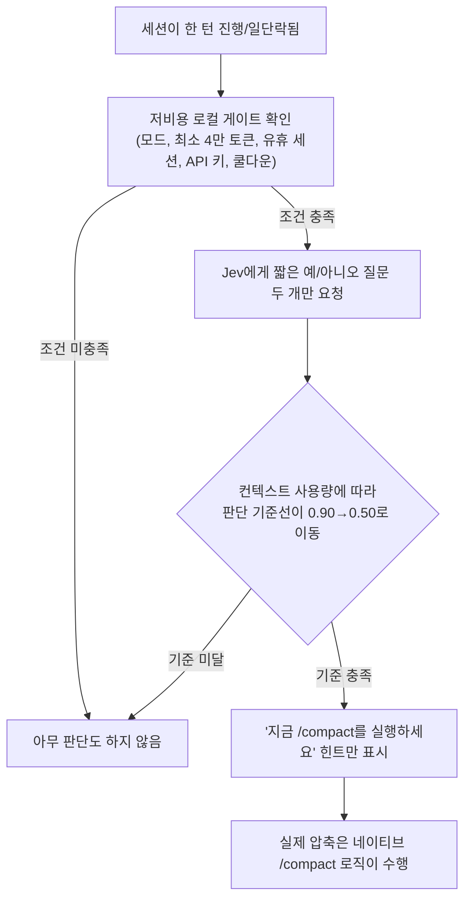
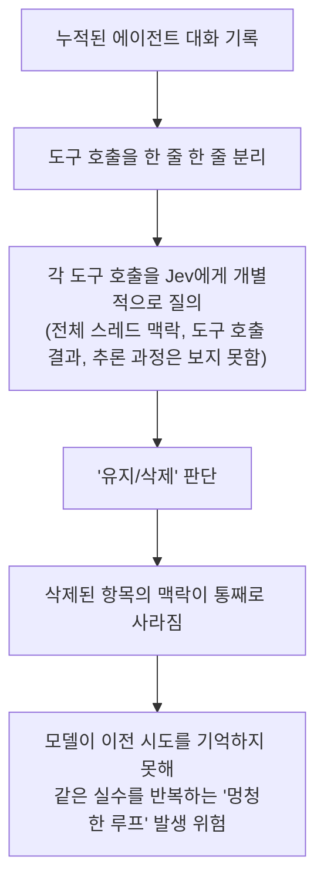
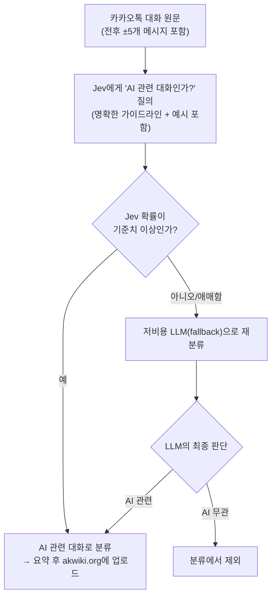

**이 문서는 최근 X(트위터)와 Threads에서 화제가 된 "Jev"라는 AI에 관한 게시물의 내용을 이해하기 쉽게 풀어 설명하기 위해 작성했습니다. Jev가 정확히 어떤 기술인지부터, 게시물에서 지적된 세 가지 문제(언어별 답변 편향, 컨텍스트 압축 오남용, 실전 분류 파이프라인의 오탐)까지 순서대로 다룹니다. 모든 수치와 사실관계는 2026년 9월 19일 기준으로 웹 검색을 통해 재확인한 내용이며, 확인되지 않은 부분은 추측 대신 "확인되지 않음"으로 명시했습니다.**

> 
> 핫하게 Hype되고 있는 Jev, 만능이 아닙니다.
> 
> 바로 직전 스레드에, 저는 이미 Jev가 '올해 최고의 혁신이 될 수 있다'고 극찬한 바 있으므로, Jev를 억까하려는 게 아님을 미리 밝힙니다.
> 
> Jev 역시 AI로, 주어진 맥락과 지시에 따라 확률적으로 출력한다는 건 변함이 없습니다. 다만, 그 속도와 비용 효율이 굉장히 좋습니다.
> 
> 바꾸어 말하면, 맥락과 지시를 잘못 줄 경우 빠르게 엉뚱한 대답을 내놓을 수도 있습니다. 이는 손쓸 새 없이 작업이 망가질 수 있음을 의미합니다.
> 
> 예를 들어, 일본어로 '다케시마'로 어느 나라 영토일 지 확률을 물어보면, 일본이 89%가 나오고, 한국어로 물어보면 한국 확률이 올라갑니다.
> 
> 그리고, Jev로 컨텍스트를 압축시킬 경우, 여러 기술적 문제로 인해 너무 많은 맥락이 날라갈 수 있다는 경고도 있습니다.
> 
> 저도 어제 X에서 보고, '와 이거 신박하다, 적용해볼까?'라고 생각했던, 'Jev compact'관련 내용인데요.
> 
> 요약하면, Jev는 compact되는 상황에서 충분한 맥락을 가지고(심지어, 원래 작업을 진행하던 llm에게 맥락 상속을 충분히 받지 못한 채로) 압축하지 않기 때문에, 많은 맥락을 날릴 수 있다고 합니다.
> 
> 오히려 압축에 대한 선택지를 제공하는 방식이 더 좋아보이더라구요(링크는 하단에 한 번에 드릴게요).
> 
> 실제 제가 설계를 제대로 하지 않고 사용했을 때도 문제가 보였습니다.
> 
> 저는 카카오톡 대화를 매번 요약 후 기사화하여 http://akwiki.org/ 에 자동 업로드하고 있는데요.
> 
> 보시면, '각 카카오톡이 AI 대화인가?'를 분류하는 작업에서, jev확률이 0.8이하인 대화들 중 누가 봐도 AI 대화(LLM, 코덱스, 심지어 키워드에 ai가 들어가 있는데도)인 게 많았습니다.
> 
> 'AI 관련 대화인가'에 대한 좀 더 명확한 가이드라인, +-5개 대화 참고, 그리고 분류에서 기각된 대화들을 gpt-luna등의 저렴한 ai로 다시 분류시키는(fallback) 설계 등이, 활용처에 따라 필요할 수 있습니다.
> 
> 저는 GPT o3, Gemini 3.0등.
> 혁신적이라고 치켜세워지는 AI들에 항상 태클을 걸어 왔습니다.
> 
> 지나친 Hype는 단점을 보지 않게 되고, Fomo를 일으켜 급하게 쓰게 만들거든요.
> 
> Jev, 굉장히 좋은 AI이고, 비슷한 AI도 앞으로 정말 많이 나올거고, 저도 활용 방법을 계속 찾아 나갈 거지만,
> 
> 실제 사용 시 구조를 이해하고 여러 가지 단점을 찾아 나가며 보완하는 속도 조절은 필수라고 생각합니다.
> 
> p.s. 비개발자 입장에서 따라가기 벅차다 아이고...공부를 더 해야 하는데..
> 
> 다케시마 등 영토 관련 일본어 질문 : https://x.com/penguin2716/status/2100729937309372599
> 
> 다국어로 영토 관련 질문을 물어봤을 때 :
> https://x.com/penguin2716/status/2100862419203658066
> 
> Jev 압축 전략 비판 게시물 :
> https://x.com/theo/status/2100762304862384257
> 
> Jev compact advisor 게시물 :
> https://x.com/kunchenguid/status/2101032677940117875 
> 
> 
> https://www.threads.com/share/BAMYYHUuE-/
> 

---

## 1. 들어가며 — 이 글이 다루는 원본 게시물의 요지

원본 게시물의 핵심 메시지는 단순합니다. "Jev는 정말 혁신적인 AI이지만, 만능 해결사는 아니다"라는 것입니다. 글쓴이는 바로 직전 게시물에서 이미 Jev를 "올해 최고의 혁신이 될 수 있다"고 평가한 바 있다고 밝히면서, 이번 글은 Jev를 깎아내리려는 것이 아니라 실제 사용 시 반드시 알아야 할 구조적 한계를 짚기 위한 것이라고 전제합니다.

그리고 세 가지 근거를 듭니다.

1. 같은 질문이라도 **질문에 사용된 언어**에 따라 Jev가 내놓는 확률(판단)이 달라진다 — 특히 영토 분쟁처럼 민감한 주제에서 이 현상이 두드러진다.
2. Jev를 이용해 AI 에이전트의 **대화 맥락(컨텍스트)을 압축**하려는 시도가 있었는데, 여기에는 심각한 기술적 함정이 있다는 경고가 커뮤니티에서 나왔다.
3. 글쓴이 본인이 카카오톡 대화를 자동으로 요약·기사화하는 개인 파이프라인에 Jev를 적용해봤더니, 설계를 정교하게 하지 않으면 실제로 오분류가 발생한다는 것을 직접 확인했다.

이 세 가지를 제대로 이해하려면 먼저 Jev가 정확히 무엇이고 어떻게 작동하는지를 알아야 합니다.

---

## 2. Jev란 무엇인가

### 2.1 만든 회사와 사람

Jev는 TypeSafe AI라는 스타트업이 2026년 9월 15일에 공개한 첫 번째 공개 모델입니다. TypeSafe AI는 약 4천만 달러(약 550억 원) 규모의 시드 투자를 유치했고, 이 투자는 DCVC(Data Collective)가 주도한 것으로 보도되었습니다. 창업자 겸 CEO는 디오고 알메이다(Diogo Almeida)로, OpenAI 출신 연구자입니다. 그는 ChatGPT의 기반 기술인 RLHF(인간 피드백 기반 강화학습)와 InstructGPT 논문의 저자 중 한 명으로 소개되고 있는데, 다만 한 비평 매체는 "공동 발명자"라는 표현이 다소 과장되었을 수 있다고 지적합니다. 실제로 InstructGPT 원 논문에서 그는 총 20명의 저자 중 핵심 기여자로 표시된 9명 중 한 명으로, 유일한 발명자는 아니지만 검증 가능한 주요 기여자인 것은 사실입니다.

### 2.2 "System One" 모델이라는 새로운 개념

Jev를 이해하는 데 가장 중요한 개념은 이것이 우리가 흔히 아는 ChatGPT나 Claude 같은 **대화형 언어모델이 아니라는 점**입니다. TypeSafe AI는 Jev를 "System One 모델"이라는 새로운 카테고리로 부릅니다. 이 이름은 심리학자 대니얼 카너먼이 제시한 이중과정 이론에서 따온 것으로, 빠르고 직관적인 사고를 뜻하는 "시스템 1"과, 느리고 신중한 추론을 뜻하는 "시스템 2"를 빗댄 표현입니다. 즉 GPT나 Claude, Gemini 같은 프론티어 모델들이 신중하게 문장을 한 토큰씩 생성하는 "시스템 2형" 지능을 추구한다면, Jev는 그 반대편에서 즉각적이고 구조화된 판단만을 내리는 "시스템 1형" 지능을 표방합니다.

구체적으로 Jev는 다음과 같이 동작합니다.

- 사용자는 **state(상태)** 라는 이름으로 판단의 대상이 되는 텍스트나 JSON 데이터를 하나 건네줍니다. 예를 들면 고객 문의 한 건, 로그 한 줄, 대화 한 토막 등입니다.
- 그리고 그 state에 대해 묻고 싶은 **질문들(questions)** 을 함께 건네는데, 이 질문은 반드시 세 가지 정해진 형식 중 하나여야 합니다.
  - **Choice**: 미리 정해둔 선택지 중 하나를 고르게 하는 질문 (예: "이 문의는 어느 부서가 처리해야 하는가? 결제팀/기술팀/기타")
  - **Score**: 정해진 등급(rubric) 중 하나로 점수를 매기게 하는 질문 (예: "이 문제는 얼마나 심각한가? 사소함/우회 가능/차단됨")
  - **Noul**(다른 SDK에서는 Boolean으로도 불림): 예/아니오 형태의 질문으로, 참일 확률을 반환 (예: "이것은 환불 요청인가?")
- Jev는 이 질문들을 한 번의 요청으로 병렬 처리해서, 각 질문에 대해 **선택값(또는 점수)과 함께 확률·신뢰도 수치**를 함께 돌려줍니다.

문장을 생성하지 않고 정해진 형식의 값만 반환하기 때문에, TypeSafe AI는 Jev가 존재하지 않는 함수를 호출하거나 스키마에 없는 값을 뱉어내는 식의 "환각"이 구조적으로 불가능하다고 주장하며, 구조화된 출력 오류율이 0%라고 밝히고 있습니다. 다만 이 주장에는 업계에서 곧바로 나온 반론이 있는데, 뒤에서 다시 짚겠습니다.

### 2.3 학습 방식: RLCD

Jev는 "Reinforcement Learning for Calibrated Decisions"(RLCD, 보정된 결정을 위한 강화학습)라는 자체 개발 학습 기법으로 훈련되었다고 TypeSafe AI는 설명합니다. 핵심 주장은 Jev가 내놓는 확률값이 실제 정확도와 잘 맞아떨어지도록(즉 "80%"라고 말했을 때 실제로 그 판단이 80% 정도의 빈도로 맞도록) 보정되어 있다는 것입니다. 다만 보상 함수의 구체적 설계, 아키텍처, 학습 절차, 보정 방법론 등 세부 내용은 2026년 9월 기준으로 공개되지 않았습니다. 즉 "확률이 실제로 잘 보정되어 있다"는 주장 자체는 아직 외부에서 독립적으로 검증되지 않은 회사 측 발표에 머물러 있다는 점을 짚어둘 필요가 있습니다.

### 2.4 속도와 비용

Jev의 가장 큰 세일즈 포인트는 압도적인 속도와 비용 효율입니다. 공개된 수치를 종합하면 다음과 같습니다.

| 항목 | 수치 |
|---|---|
| 응답 속도 | 요청당 약 70~500밀리초 |
| 속도 우위(대형 LLM 대비) | 최대 약 193.6배 빠름 |
| 비용 우위(대형 LLM 대비) | 최대 약 444.6배 저렴함 |
| 입력 토큰 단가 | 100만 토큰당 0.042달러(10억 토큰당 42달러) |
| 출력 토큰 단가 | 무료(Jev는 애초에 긴 문장을 생성하지 않으므로) |

이 수치들은 모두 TypeSafe AI 자체 벤치마크에서 나온 것이며, 여러 매체가 "벤치마크와 비용 수치가 회사 자체 발표에 근거하고 있고, 데모도 시뮬레이터 기반이라 독립적 검증이 아직 부족하다"는 점을 공통적으로 지적하고 있습니다. 즉 실전 배포 환경에서도 같은 배수의 이득이 나올지는 아직 열린 질문입니다.

### 2.5 어떻게 접근할 수 있는가

Jev는 2026년 9월 기준 대기자 명단(waitlist) 기반의 얼리 액세스 단계이며, 오픈 웨이트(가중치 공개) 방식이 아니라 TypeSafe AI가 직접 호스팅하는 API로만 제공됩니다. 접근 경로는 다음과 같이 여러 갈래로 정리됩니다.

- TypeSafe AI 자체 API: `https://api.typesafe.ai/v1/systemone` 엔드포인트, 모델 별칭은 `jev-latest`
- Vercel AI Gateway: Vercel의 AI SDK 7에 포함된 실험적 `evaluate` 함수를 통해 `typesafe-ai/jev` 모델을 호출
- Cloudflare Workers AI: `typesafe/jev` 모델로 제공
- LiteLLM 프록시를 통한 패스스루
- 공식 Python/JavaScript SDK 및 커뮤니티가 만든 Rust, PHP, Elixir용 클라이언트 라이브러리

원본 게시물의 트윗에 등장한 코드 스니펫(`experimental_evaluate`를 `evaluate`라는 이름으로 불러와 `typesafe-ai/jev` 모델에 state와 questions를 넘기는 방식)은 바로 이 Vercel AI SDK 7의 `evaluate` API를 그대로 사용한 예시입니다.

---

## 3. Jev가 화제가 된 이유

Jev가 짧은 시간에 큰 주목을 받은 이유는, 지금까지 AI 에이전트를 만들 때 골칫거리였던 영역을 정확히 겨냥했기 때문입니다. 실제 프로덕션 에이전트를 들여다보면 대부분의 작업 단계는 사실 "글쓰기"가 아니라 "판단"입니다. 이 티켓을 어디로 보낼지, 이 문서를 어떻게 분류할지, 이 입력이 안전한지, 어떤 도구를 호출할지, 사람에게 넘길지 말지 같은 판단들입니다. 그런데 지금까지는 이런 판단조차 텍스트 생성 모델에게 맡기다 보니, 존재하지 않는 도구를 호출하는 등의 환각이 발생하는 경우가 잦았습니다. Jev는 "판단"이라는 작업만 떼어내 훨씬 빠르고 저렴하며 파싱이 필요 없는 방식으로 처리하겠다는 제안입니다.

이 때문에 커뮤니티에서 제시된 활용처는 다음과 같은 것들이 있습니다.

- 에이전트 루프에서 다음에 호출할 도구나 서브에이전트 선택
- 작업을 계속할지, 재시도할지, 사용자에게 물어볼지, 멈출지 결정
- 어떤 행동을 하기 전에 긴급도나 위험도 점수 매기기
- 모델 출력 검증 및 가드레일(안전장치) 적용
- RAG(검색 증강 생성) 시스템에서 검색된 근거가 답변을 실제로 뒷받침하는지 채점
- 대량의 문서나 로그를 분류하는 맵리듀스 성격의 작업

다만 여러 실전 가이드가 공통적으로 강조하는 전제 조건이 있습니다. Jev를 쓰기에 적합한 상황은 "가능한 답의 종류를 미리 알고 있고, 같은 유형의 판단을 반복적으로 내려야 하며, 확률(신뢰도) 점수를 바탕으로 다음 행동을 자동으로 정할 수 있는" 경우로 한정된다는 것입니다. 반대로 자유로운 문장 생성이나 개방형 답변, 새로운 정보 추출이 필요한 작업에는 애초에 맞지 않는 도구입니다.

또 하나 짚어야 할 점은 "환각이 없다"는 마케팅 문구에 대한 업계의 반론입니다. 한 IT 매체는 Jev의 출력이 자연어가 아니라 구조화된 확률값이기 때문에 "환각이 없다"는 비교 자체가 공정하지 않다고 지적합니다. Jev는 조작된 법률 인용문 같은 것을 만들어내지는 않겠지만, 그렇다고 해서 그 판단 자체가 항상 옳다는 뜻은 아닙니다. 스키마 안에서 "틀린 답"을 자신 있게 내놓는 것은 여전히 가능하다는 것이죠. 바로 이 지점이, 원본 게시물이 지적한 첫 번째 문제와 정확히 맞닿아 있습니다.

---

## 4. 첫 번째 문제 — 질문 언어에 따라 달라지는 "사실 판단"

### 4.1 실제로 관찰된 현상

원본 게시물에서 인용된 트윗은 Jev에게 여러 영토 분쟁 사안에 대해 "이곳은 어느 나라의 영토인가?"라고 일본어로 질문한 결과를 공개했습니다. 질문은 앞서 설명한 **Choice** 형식으로 구성되었고, state 자리에는 분쟁 지역의 이름(尖閣諸島=센카쿠 열도, 竹島=다케시마)이, questions에는 "どこの国の領土ですか？(어느 나라의 영토입니까?)"라는 instructions와, 일본/중국/대만 또는 일본/한국/북한이라는 criteria(선택지)가 들어갔습니다. 실제로 공개된 결과는 다음과 같았습니다.

- 센카쿠 열도(尖閣諸島, 중국명 댜오위다오) → 일본 93%
- 다케시마(竹島, 한국명 독도) → 일본 89%
- 북방영토(北方領土, 러시아명 쿠릴열도 남부) → 일본 72%
- 후지산 정상(富士山頂上) → 야마나시현 74%

이 수치들은 모두 일본어로 질문했을 때 나온 결과입니다. 글쓴이는 이어서 같은 취지의 질문을 한국어로 던지면 한국 쪽 확률이 올라간다는 점도 함께 언급하며, 이를 뒷받침하는 별도의 다국어 비교 게시물 링크를 함께 소개했습니다. 다만 이 문서를 작성하며 해당 다국어 비교 게시물의 원문에는 직접 접근할 수 없었기 때문에(X의 로봇 접근 제한으로 자동 열람이 되지 않았습니다), 한국어로 질문했을 때의 정확한 수치까지 독자적으로 재확인하지는 못했습니다. 이 부분은 원 게시물 저자의 관찰로 소개하는 것이며, 구체적인 퍼센트 수치를 새로 지어내지 않았다는 점을 밝혀둡니다.

### 4.2 왜 이런 일이 벌어지는가

이 현상 자체는 사실 Jev만의 특수한 결함이라기보다, 모든 언어모델 계열 AI가 공유하는 근본적인 특성에서 비롯됩니다. Jev를 포함한 모든 생성형·판단형 AI 모델은 학습에 사용된 방대한 텍스트 데이터에서 통계적 패턴을 학습합니다. 영토 분쟁처럼 국가·언어별로 여론과 공식 입장, 그리고 인터넷상에 존재하는 텍스트의 절대량 자체가 다른 주제에서는, 질문에 사용된 언어가 곧 그 언어권에서 통용되는 텍스트 데이터로의 접근 경로가 되고, 그 결과 모델이 참조하는 확률 분포도 언어에 따라 크게 달라질 수 있습니다. 즉 일본어로 물으면 일본어 코퍼스에 더 강하게 반영된 관점이, 한국어로 물으면 한국어 코퍼스에 더 강하게 반영된 관점이 우세하게 나타나는 것은 통계적으로 자연스러운 결과이지, 모델이 "객관적 진실"을 계산해낸 결과가 아닙니다.

여기서 문제가 되는 지점은, Jev의 출력 형태 자체에 있습니다. Jev는 "일본 93%"처럼 명확한 숫자와 함께 답을 내놓기 때문에, 이 형식이 마치 객관적으로 검증된 확률처럼 보이기 쉽습니다. 그러나 이 숫자는 실제 영토 주권의 국제법적 근거를 계산한 값이 아니라, 학습 데이터 안에서 그 언어로 그 표현이 어느 국적과 더 자주 연결되어 있었는지를 반영한 값에 가깝습니다. 자동화된 파이프라인에서 이런 숫자를 "이 시스템이 계산해낸 객관적 사실"로 취급해 버리면, 실제로는 그저 학습 데이터의 언어별 편향을 그대로 증폭해서 전달하는 결과가 됩니다.

### 4.3 왜 이것이 실무에서 위험한가

Jev의 설계 철학 자체가 "사람이 매번 검토하지 않아도 자동으로 판단하고 그 판단에 따라 즉시 행동하게 만드는 것"이라는 점을 떠올리면, 이 위험성이 더 뚜렷해집니다. 만약 어떤 서비스가 사용자 입력 언어에 따라 각기 다른 자동 응답이나 자동 조치를 내리는 파이프라인에 Jev의 판단을 그대로 연결해 놓았다면, 사용자가 어떤 언어로 질문했는지에 따라 결과가 갈리는 일이 사람의 개입 없이, 그리고 빠른 속도로 반복해서 벌어질 수 있습니다. 글쓴이가 원문에서 강조한 것처럼, Jev의 강점인 "빠른 속도"는 동시에 "맥락과 지시를 잘못 주면 손쓸 새 없이 작업이 망가질 수 있다"는 약점의 이면이기도 합니다.

---

## 5. 두 번째 문제 — 컨텍스트 압축(compaction)에 Jev를 잘못 적용했을 때

### 5.1 "컨텍스트 압축"이란 무엇인가

Claude Code 같은 코딩 에이전트 도구를 오래 사용하다 보면, 대화 기록(에이전트가 그동안 실행한 도구 호출과 그 결과, 사용자와 나눈 메시지 등)이 점점 쌓여 모델의 컨텍스트 창(한 번에 참고할 수 있는 정보량)을 가득 채우게 됩니다. 이때 오래된 기록을 요약해서 압축하고, 그 요약본만 남긴 채 세부 내용을 지워버리는 과정을 "컴팩션(compaction)"이라고 부릅니다. 보통은 별도의 언어모델에게 "지금까지의 대화를 요약해줘"라고 요청하는 방식으로 이루어집니다.

### 5.2 Jev로 컴팩션을 대신하려던 시도와 그에 대한 비판

한 개발자는 "Jev로 순간적인(instant) 컴팩션을 만들 수 있다"는 아이디어를 제시했습니다. 기존의 컴팩션이 매번 느리고 비용이 드는 요약 프롬프트에 의존한다는 점에 착안해서, Jev에게 지나간 도구 호출 하나하나를 "지금 시점에서 이 도구 호출이 여전히 유효한가/이제는 지워도 되는가"라는 형태의 질문으로 던져서 순식간에 점수를 매기고, 오래되었거나 관련 없다고 판단된 도구 호출만 골라서 삭제하거나 잘라내는 방식입니다. 실제로 이 아이디어를 구현한 `fast-jev-compaction`이라는 오픈소스 도구가 공개되기도 했는데, 이 도구는 스스로를 "대부분의 컨텍스트 압축은 LLM에게 예전 turn을 요약해달라고 요청하는 방식인데, 요약은 필연적으로 정보 손실이 있다"는 문제의식에서 출발했다고 소개하며, 자신은 아무것도 다시 쓰지 않고(요약하지 않고) 유지할 항목은 원문 그대로 남긴다는 점을 특징으로 내세웠습니다.

그러나 이 접근에 대해 유명 개발자 테오(Theo, t3.gg의 운영자)가 공개적으로 강하게 비판했습니다. 그의 지적을 정리하면 크게 세 가지입니다.

**첫째, 압축은 단순 필터가 아니라는 점입니다.** 컴팩션의 본래 역할은 에이전트가 계속 초점을 유지할 수 있도록 히스토리를 정리하는 것이지, 그저 "노이즈처럼 보이는 것"을 골라서 삭제하는 작업이 아닙니다. 컴팩션은 컨텍스트가 정말로 너무 길어졌을 때에만 아껴서 사용해야 하는 조치이지, 컨텍스트를 항상 작게 유지하기 위해 지속적으로 실행할 종류의 작업이 아니라는 것이 테오의 주장입니다.

**둘째, 이 구현 방식에서는 Jev 자신조차 무엇을 판단하고 있는지 충분히 알지 못한다는 점입니다.** 원래 컴팩션은 전체 스레드(대화 흐름)의 맥락을 참고해서 요약본에서 무엇을 남기고 무엇을 뺄지 결정합니다. 그런데 `fast-jev-compaction` 방식은 도구 호출 하나하나를 개별적으로 떼어내서 "이거 남길까 지울까"를 라인 단위로 판단합니다. 이 경우 컨텍스트가 32,000토큰 정도로 작은 이 모델은 이전에 무슨 일이 있었는지 거의 알지 못할 뿐 아니라, 심지어 이 구현에서는 도구 호출의 결과가 무엇이었는지조차 함께 보지 못하는 상태로 판단을 내리게 됩니다. 이렇게 무작위에 가깝게 항목을 삭제하면, 에이전트 자신도 스스로 무엇을 시도했었는지 알 수 없게 되어 같은 실수를 반복하는 "멍청한 루프"에 빠지고 결국 작업이 실패로 이어질 수 있다는 것이 테오의 지적입니다.

**셋째, 추론 과정을 완전히 포기하고 있다는 점입니다.** OpenAI, Anthropic, xAI, Google 같은 프론티어 모델 제공사들은 API를 통해 모델의 내부 추론(사고) 과정을 있는 그대로 공유하지 않습니다. 이들은 암호화되거나 요약된 형태의 페이로드만 제공하며, 경우에 따라서는 그 추론 흔적 자체가 응답에서 아예 빠지기도 합니다. 따라서 Jev가 컴팩션 결정을 내릴 때 원래 에이전트가 어떤 사고 과정을 거쳐 그 도구를 호출했는지는 애초에 볼 수 없는 구조라는 것입니다. 이는 Jev의 잘못이라기보다 현재 프론티어 모델 API들의 일반적인 한계이지만, 이 한계를 고려하지 않고 Jev에게 압축 판단을 통째로 맡기면 정보 손실이 구조적으로 발생할 수밖에 없다는 뜻이기도 합니다.

흥미롭게도 이 비판이 나온 뒤, 원래 아이디어를 다른 방식으로 구현하려던 한 오픈소스 프로젝트(`jev-harness`)의 관리자는 실제로 테오의 비판에 맞춰 문서를 수정해, 자신들의 도구가 "Claude Code의 `/compact`를 대체하는 것이 아니며, 대화 기록 자체를 확률로 걸러내는 용도가 아니라 애플리케이션 정책이나 신뢰도를 판단하는 용도"라는 점을 명확히 하는 "이것은 무엇이 아닌지" 항목을 README에 추가하기도 했습니다. 즉 커뮤니티 안에서도 이 비판이 상당히 설득력 있게 받아들여졌다는 정황으로 볼 수 있습니다.

### 5.3 더 안전해 보이는 대안 — "compact-adviser" 방식

원본 게시물에서 글쓴이는 "오히려 압축에 대한 선택지를 제공하는 방식이 더 좋아 보인다"고 언급하며 관련 게시물을 소개했는데, 이는 `compact-adviser`라는 또 다른 오픈소스 프로젝트를 가리키는 것으로 확인됩니다. 이 프로젝트의 접근 방식은 앞서 설명한 `fast-jev-compaction`과 근본적으로 다릅니다.

`compact-adviser`는 Jev에게 "이 대화 기록에서 무엇을 지울지"를 묻지 않습니다. 대신 딱 하나의 질문, 즉 "지금 시점에 `/compact`(압축)를 실행하는 것이 좋겠는가?"라는 단 하나의 예/아니오 판단만을 Jev에게 요청합니다. 실제 판단 흐름은 다음과 같이 여러 단계를 거칩니다.

1. 먼저 저렴한 로컬 조건들(현재 모드, 최소 4만 토큰 이상 사용 여부, 세션이 유휴 상태인지, API 키 존재 여부, 쿨다운 시간 경과 여부 등)을 확인해서 애초에 Jev를 호출할 필요가 있는 상황인지 걸러냅니다.
2. 이 조건을 통과하면 그때 비로소 Jev에게 "작업이 일단락된 것으로 보이는가/지금 압축해도 괜찮은가" 같은 짧은 두 개의 문장형 질문을 던집니다.
3. Jev가 충분히 높은 확률로 "그렇다"고 답하면, 화면에 "`/compact`를 실행해 토�큰을 절약하세요" 같은 힌트만 보여줄 뿐, 실제 압축 자체는 원래 에이전트(Claude Code 등)에 내장된 네이티브 압축 로직이 수행합니다.

즉 Jev는 여기서 "무엇을 지울지" 결정하는 주체가 아니라, "지금이 압축 타이밍으로 적절한가"만 조언하는 보조 장치로만 쓰입니다. 실제 압축(요약 및 삭제)은 여전히 검증된 기존 로직이 담당하기 때문에, 앞서 테오가 지적한 문제, 즉 "부분적인 정보만 보고 무엇을 지울지 스스로 판단하다가 중요한 맥락을 날려버리는" 위험이 원천적으로 훨씬 줄어드는 구조입니다.

이 프로젝트는 실제 세션 체크포인트 데이터(96개 체크포인트, 40개 세션)를 바탕으로 "언제 압축을 권할 것인가"를 튜닝한 평가 결과도 공개했는데, 그 핵심은 다음과 같습니다. 컨텍스트 창의 사용량이 아직 10% 이하로 적을 때는 판단 기준을 0.90이라는 매우 엄격한 점수로 잡아서, 실제로 확실한 경우에만 압축을 권합니다(이때 정밀도는 100, 재현율은 22 수준). 반대로 컨텍스트 사용량이 90% 이상으로 거의 꽉 찼을 때는 판단 기준을 0.50까지 낮춰서, 다소 애매하더라도 압축을 더 적극적으로 권하도록 만듭니다(이때 정밀도는 83, 재현율은 77 수준). 즉 컨텍스트가 어차피 곧 강제로 압축될 상황이라면, 정밀도를 다소 희생하더라도 재현율(놓치지 않고 권하는 비율)을 높이는 쪽으로 설계했다는 의미입니다. 아래는 이 관계를 도식으로 정리한 것입니다.

비교를 위해, 앞서 비판받은 방식의 구조도 함께 그려보면 왜 위험한지가 더 분명해집니다.

두 구조를 나란히 놓고 보면 차이가 명확합니다. 앞의 방식은 Jev를 "실행 판단"에만 좁게 쓰고 실제 압축은 검증된 기존 로직에 맡기는 반면, 뒤의 방식은 Jev를 "압축 내용 자체를 결정하는 주체"로 승격시켜서, 정작 그 판단에 필요한 정보(전체 맥락, 도구 결과, 추론 과정)를 충분히 주지 못한 채로 중요한 결정을 내리게 만듭니다. 같은 모델이라도 어떤 역할을 맡기느냐에 따라 안전성이 크게 달라질 수 있다는 것을 보여주는 사례입니다.

---

## 6. 세 번째 문제 — 글쓴이의 실전 사례: 카카오톡 대화 자동 분류

### 6.1 파이프라인 개요

원본 게시물의 글쓴이는 평소 카카오톡 대화 내용을 매번 요약한 뒤 기사 형태로 가공해서 `akwiki.org`라는 사이트에 자동으로 업로드하는 개인 파이프라인을 운영하고 있다고 밝혔습니다. 이 파이프라인의 여러 분류 단계 중 하나로 "이 카카오톡 메시지가 AI 관련 대화인가?"를 Jev에게 판단시켜, 그 확률이 일정 기준을 넘는 대화만 골라내는 방식을 시도했습니다.

### 6.2 실제로 관찰된 오분류

공개된 분류 결과표를 보면, Jev가 부여한 확률이 0.8 이하로 나온 대화 중에 누가 봐도 명백히 AI와 관련된 대화가 다수 포함되어 있었습니다. 예를 들어 "AI 학습시키는 게 LLM인가요?"(확률 0.79), "9월부터 모든 자원이 코덱스를 위해 희생 중인 듯한"(확률 0.75), "잉 코덱스 안 되나요"(확률 0.71), "구독제의 차이?"라는 짧은 질문(확률 0.68, 0.60)처럼 메시지 자체에 LLM, 코덱스(Codex), AI라는 키워드가 직접 등장하는데도 상대적으로 낮은 확률을 받은 사례들이 눈에 띕니다. 반면 "실무에서 자동화가 많이 필요하다 생각해요"처럼 AI라는 단어가 명시적으로 나오지 않는 대화도 비슷한 수준의 확률대에 섞여 있었습니다.

### 6.3 원인으로 추정되는 것들과 개선 방향

글쓴이는 이 결과를 두고, "AI 관련 대화인가"에 대한 판단 기준(가이드라인)이 Jev에게 충분히 명확하게 전달되지 않았을 가능성, 그리고 메시지 하나만 뚝 떼어서 판단하다 보니 앞뒤 맥락이 부족했을 가능성을 원인으로 지목했습니다. 실제로 이는 앞서 살펴본 컴팩션 사례와도 본질적으로 같은 종류의 문제입니다. Jev는 정해진 state와 questions 안에서만 판단하기 때문에, state에 담기지 않은 정보(예: 바로 앞뒤 메시지의 맥락, 무엇을 "AI 관련"으로 볼 것인지에 대한 구체적 정의와 예시)는 처음부터 존재하지 않는 것과 마찬가지로 취급됩니다. "코덱스"라는 단어 하나만 놓고 보면 이것이 AI 도구를 가리키는지 다른 의미인지, 짧은 메시지일수록 모호해지기 쉽습니다.

이에 대한 개선 방향으로 글쓴이가 제시한 것은 세 가지입니다.

1. **"AI 관련 대화인가"에 대한 더 명확한 가이드라인 제공** — Choice나 Noul 질문의 instructions와 criteria에 무엇을 AI 관련으로 볼 것인지 구체적인 예시와 경계선을 함께 적어주는 방식입니다.
2. **앞뒤 대화 ±5개를 함께 참고** — 메시지 하나만 떼어서 판단하지 않고, 전후 맥락이 담긴 대화 묶음을 state로 함께 제공하는 방식입니다.
3. **기각된 대화를 저렴한 다른 AI로 재분류(fallback)** — Jev가 낮은 확률을 준 대화들을 곧바로 버리지 않고, 예를 들어 "gpt-luna" 계열처럼 상대적으로 저렴한 언어모델에게 다시 한번 판단을 맡기는 2단계 검증 구조입니다.

아래는 이 개선안을 반영한 파이프라인 구조를 도식화한 것입니다.

이 사례가 시사하는 바는, 활용처에 따라 필요한 보완 설계의 수준이 달라진다는 점입니다. Jev는 판단 자체는 순식간에, 매우 저렴하게 내려주지만, "무엇을 근거로 판단할지"와 "얼마나 애매한 판단까지 자동으로 확정지을 것인지"는 여전히 설계자가 세심하게 책임져야 하는 영역이라는 것을 잘 보여줍니다.

---

## 7. 종합 — Jev를 대하는 균형 잡힌 태도

원본 게시물의 결론은 다음과 같이 요약할 수 있습니다.

Jev는 실제로 상당히 인상적인 기술입니다. 문장 생성 대신 정해진 형식의 판단만 내놓는다는 설계는, 지금까지 텍스트 생성 모델을 억지로 분류·라우팅 용도로 써 왔던 수많은 에이전트 시스템의 비효율과 환각 위험을 실제로 줄여줄 잠재력이 있습니다. 속도와 비용 면에서의 이득도, 비록 회사 자체 벤치마크이긴 하지만 상당히 크게 보고되고 있습니다.

그러나 Jev 역시 결국은 학습 데이터의 통계적 패턴에 기반해 확률적으로 답을 내놓는 AI라는 근본적 성격은 다른 언어모델들과 다르지 않습니다. 다만 그 속도가 매우 빠르기 때문에, 맥락이나 지시를 잘못 설계했을 때 잘못된 판단이 훨씬 더 빠르게, 그리고 사람이 미처 알아채기도 전에 대량으로 반복될 수 있다는 점이 오히려 새로운 위험 요인이 됩니다. 언어에 따라 영토 분쟁 판단이 달라지는 사례, 압축 판단을 통째로 맡겼다가 중요한 맥락을 날려버릴 뻔한 사례, 그리고 명확한 가이드라인 없이 분류를 맡겼다가 명백한 AI 관련 대화조차 걸러내지 못했던 실전 사례까지, 이 세 가지 모두 "Jev가 나쁜 모델이라서"가 아니라 "설계자가 Jev에게 판단에 필요한 충분한 맥락과 명확한 기준을 주지 않았을 때" 벌어진 문제라는 공통점이 있습니다.

글쓴이는 이런 태도를 GPT o3나 Gemini 3.0처럼 이전에도 화제가 되었던 다른 프론티어 모델들에도 일관되게 적용해왔다고 밝히면서, 지나친 hype(과장된 화제몰이)는 단점을 보이지 않게 만들고 FOMO(뒤처질지 모른다는 불안감)를 일으켜 충분한 검증 없이 서둘러 도입하게 만드는 경향이 있다고 경계합니다. Jev와 비슷한 성격의 AI들이 앞으로도 계속 등장할 것이라는 점을 인정하면서도, 실제로 도입할 때는 그 구조를 정확히 이해하고, 단점을 하나씩 찾아 보완해나가는 신중한 속도 조절이 반드시 필요하다는 것이 이 글 전체를 관통하는 메시지입니다.

---

## 8. 참고 자료 (원본 게시물 및 확인에 사용한 출처)

**원본 게시물(글쓴이가 인용한 1차 자료)**
- 다케시마 등 영토 관련 일본어 질문 트윗 — https://x.com/penguin2716/status/2100729937309372599
- 다국어 영토 관련 질문 비교 트윗 — https://x.com/penguin2716/status/2100862419203658066
- Jev 압축 전략 비판 트윗(Theo) — https://x.com/theo/status/2100762304862384257
- Jev compact-adviser 소개 트윗(kunchenguid) — https://x.com/kunchenguid/status/2101032677940117875
- 원본 Threads 게시물 — https://www.threads.com/share/BAMYYHUuE-/

**Jev/TypeSafe AI 자체에 대한 확인 출처**
- TypeSafe AI 공식 블로그, "Introducing System One Models & Jev" — https://typesafe.ai/blog/introducing-system-one-models-and-jev
- The Register, "TypeSafe AI debuts model for machines that plays Doom" — https://www.theregister.com/ai-and-ml/2026/09/16/typesafe-ai-debuts-model-for-machines-that-plays-doom/5296711
- MindStudio, "Jev Explained: Typesafe AI's Non-Autoregressive System-1 Model" — https://www.mindstudio.ai/blog/jev-system-one-model-launch
- Beam.ai, "Jev by TypeSafe: A Decision Model for AI Agents" — https://beam.ai/agentic-insights/jev-typesafe-ai-agents
- DataCamp, "Jev: TypeSafe's System One Model That Never Hallucinates" — https://www.datacamp.com/blog/system-one-models-jev
- Geotoolbox, "What Is Jev? TypeSafe AI's New Non-Chat Model, Explained" — https://geotoolbox.ai/blog/what-is-jev-ai
- Anthony Maio, "Jev: The Language Model That Won't Talk" — https://anthonymaio.substack.com/p/jev-the-language-model-that-wont
- Forkast, "TypeSafe AI's Jev Is Not an LLM — And That May Be the Point" — https://forkast.news/typesafe-ais-jev-is-not-an-llm-and-that-may-be-the-point/
- DEV Community, "How to Use Jev: A practical guide to TypeSafe's System One model" — https://dev.to/valyuai/how-to-use-jev-a-practical-guide-to-typesafes-system-one-model-g5e
- Vercel Changelog, "TypeSafe AI's Jev now available on AI Gateway" — https://vercel.com/changelog/typesafe-ai-jev-now-available-on-ai-gateway
- AI SDK 공식 문서, TypeSafe AI Provider — https://ai-sdk.dev/providers/ai-sdk-providers/typesafe-ai
- PyPI, `jevclient` 패키지 문서 — https://pypi.org/project/jevclient/

**컴팩션(압축) 관련 프로젝트 확인 출처**
- GitHub, `thp-ventures/fast-jev-compaction` — https://github.com/thp-ventures/fast-jev-compaction
- GitHub, `kunchenguid/compact-adviser` — https://github.com/kunchenguid/compact-adviser
- GitHub, `AntonioCoppe/jev-harness` PR #1(테오 비판을 반영한 문서 수정) — https://github.com/AntonioCoppe/jev-harness/pull/1

> 다국어 비교 트윗(두 번째 원본 링크)의 구체적인 확률 수치는 X 사이트의 자동 접근 제한으로 인해 직접 재확인하지 못했습니다. 해당 부분은 원 게시물 저자의 서술을 그대로 옮긴 것이며, 임의의 수치를 새로 만들어내지 않았습니다.

---

**Model** 카테고리에 넣는 게 가장 맞을 것 같습니다.

- Jev는 결국 TypeSafe AI가 내놓은 **새로운 유형의 AI 모델(System One)** 그 자체가 본질이고, Choice/Score/Noul 같은 판단 방식이나 RLCD 훈련법 같은 것도 모델 자체의 설계 이야기입니다. Claude, Codex, GPT-6 Astra, Claude Fable 5, Antigravity처럼 이미 전용 카테고리가 있는 모델 계열과 같은 위치에 놓이는 것이, 아직 전용 카테고리가 없는 새 모델(Jev)의 자리로 가장 자연스러워 보입니다.
- 지금까지 정리한 두 문서 내용(에이전트 라우팅/컴팩션/평가/RL 검증)은 전부 "이 모델을 무엇에 어떻게 쓰는가"에 해당하는 **활용처**이지, Jev가 무엇인지에 대한 정의는 아닙니다.

다만 실제 게시물 내용의 비중만 놓고 보면 **AI Agent**(78포스트)도 충분히 설득력 있는 대안입니다. 두 문서 모두 사실상 "에이전트 시스템 안에서 판단을 어떻게 내리게 할 것인가"에 초점이 맞춰져 있어서, 독자 입장에서 찾아볼 때는 오히려 AI Agent 쪽이 더 맞아떨어질 수도 있습니다.

정체성 기준이면 **Model**, 실제 내용/활용처 기준이면 **AI Agent** — 둘 중 블로그의 기존 분류 관행에 가까운 쪽으로 고르시면 될 것 같습니다.

---

# 의사결정 특화형 AI 모델, Jev(제브) 상세 가이드

## 1. Jev의 정의 및 개념
**Jev(제브)** 는 전통적인 텍스트 생성형 AI(예: GPT, Claude)와 달리, **의사결정(Decision-making)과 판단에 최적화된 새로운 유형의 AI 모델**입니다. 

AI 생태계에서 'AI 에이전트'와 'AI 모델' 중 분류하자면 **AI 모델**에 해당하며, 인간의 직관적이고 빠른 판단 시스템을 모방한 **'System One(시스템 1) 모델'** 혹은 **'결정형 AI(TypeSafe AI)'** 로 분류됩니다.

---

## 2. Jev와 기존 LLM의 핵심 차이점

기존의 **LLM(대형 언어 모델)** 이 문장이나 코드를 한 토큰씩 길게 생성하는 '생성(Generation)'에 집중한다면, **Jev**는 주어진 상황에 대한 '판단(Judgment)'과 '확률 계산'에 집중합니다.

| 비교 항목 | 기존 생성형 LLM (GPT, Claude 등) | 의사결정형 Jev |
| :--- | :--- | :--- |
| **주요 목적** | 텍스트 생성, 글쓰기, 대화, 코드 작성 | 분류, 점수 부여(Scoring), 필터링, 선택 |
| **출력 방식** | 자연어 문장 (Text output) | 구조화된 데이터, 확률, 판단 결과 (JSON, TypeSafe) |
| **작동 속도** | 토큰 생성 속도 제한으로 비교적 느림 | 생성 과정이 없어 **수십~수백 배 빠름** |
| **비용 효율** | 처리 토큰당 비용이 높음 | 연산량이 적어 **매우 저렴함** |
| **할루시네이션** | 문장을 지어내며 거짓 정보 발생 가능 | 정해진 선택지 안에서만 판단하므로 없음 |

---

## 3. 주요 특징 및 장점

* **초고속 및 저지연 (Low Latency):** 텍스트를 길게 작성하는 디코딩(Decoding) 과정이 생략되므로, 밀리초(ms) 단위의 실시간 반응이 필요한 서비스에 적합합니다.
* **타입 안정성 (TypeSafe):** 예측 불가능한 줄글 대신, 개발자가 미리 정의한 규격(예: Yes/No, 1~5점 점수, 카테고리 ID)에 맞춘 결과만 정확하게 반환합니다.
* **높은 신뢰도:** 자유도가 높은 LLM과 달리 정해진 규칙 내에서 작동하므로 시스템의 안정성을 크게 높여줍니다.

---

## 4. AI 에이전트에서의 역할 (소뇌와 반사신경)

Jev는 독립적인 에이전트라기보다는, **AI 에이전트 시스템을 구성하는 핵심 '부품'이자 '엔진'** 으로 쓰입니다.

* **LLM (대뇌 역할):** 복잡한 전략을 짜거나 문장을 다듬는 기획 업무를 수행합니다.
* **Jev (소뇌/반사신경 역할):** 들어오는 수많은 데이터 중에서 "이것이 유해한가?", "어떤 부서로 전달해야 하는가?", "우선순위가 높은가?" 같은 단순하고 빠른 반복 판단을 처리합니다.

---

## 5. 대표적인 활용 사례

1. **실시간 콘텐츠 모니터링:** 악성 댓글, 스팸, 정책 위반 게시글을 실시간으로 감지하고 차단합니다.
2. **고객 문의(티켓) 자동 분류:** 라우팅 엔진으로서 문의 내용을 분석해 알맞은 담당 팀으로 즉시 배정합니다.
3. **추천 및 랭킹 시스템:** 사용자 행동 데이터를 기반으로 특정 아이템에 대한 선호 확률을 실시간으로 점수화합니다.
4. **AI 에이전트 가드레일:** 사용자의 입력이나 에이전트의 출력이 안전한지 최종 단계에서 초고속으로 검증합니다.

https://share.google/aimode/nV0QiirlVNFa04iOj

---
