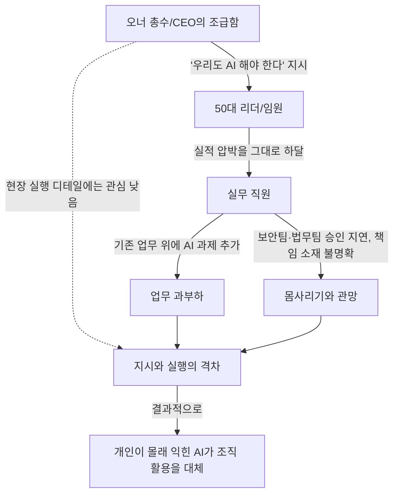
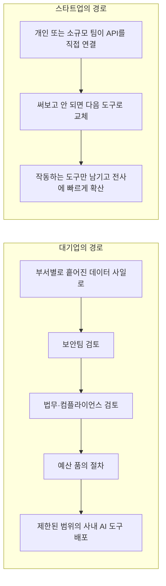

> 
> **대기업 AI 현실**
> 
> 1.오너만 급함, 50대 리더들은 오너가 급하다니까 부하직원들한테 혁신하라고 닥달중
> 
> 2.부업이든 취미든 엮여있어서 딥하게 써봤던 사람들이 어쩌다보니 조직내에서 AI 가장 잘 쓰는 사람으로 포지셔닝 중
> 
> 3.대기업에서 AI 쓰기 쉽지 않음. 업무파편화가 생각보다 많이되어있고, 권한과 책임의 문제도 있으며 가장 심각한건 보안때문에 나중에 책잡힐까 싶어 나대지 말자는 분위기 형성
> 
> 4.스타트업 친구들은 한달에 크레딧 200만원어치 쓴다는거보면 격세지감임. 
> 
> 5.보안(허상이라고 생각하지만) 신경 안쓰고 속도에 치중하는 집단이 혁신의 동력을 얻는 세상에서 대기업은 너무너무 느림... 밥그릇 지키는 집단으로 보임
> 
> 6.개인적으로라도 AI를 계속 써야 따라잡을수있음. 대기업 갔다고 손놓고 살면 백수되기 딱 좋은 세상임
> 
>  https://www.threads.com/share/BAX08i-ZCX/
> 

## 이 문서에 대하여

이 문서는 사용자가 제시한 Threads 게시물(원문 URL: https://www.threads.com/share/BAX08i-ZCX/)의 내용을 원문 그대로의 주장으로 두고, 그 안에 담긴 여섯 가지 진술 각각을 국내외 설문조사, 업계 보고서, 언론 보도와 대조해 사실관계를 확인한 결과물이다. Threads는 로봇 배제 규칙상 페이지를 직접 열람할 수 없어, 사용자가 붙여넣은 원문 텍스트를 1차 자료로 삼았다. 게시자의 신원이나 소속은 확인되지 않았으므로, 그가 말한 개인적 경험과 주변 사례는 어디까지나 한 사람의 관찰로 다루었고, 검증 가능한 부분에는 공개된 통계와 보고서를 덧붙였다. 글 말미에는 어떤 문장이 확인된 사실이고 어떤 문장이 단일 출처의 주장이나 해석에 가까운지를 표로 구분해 두었으니, 판단은 그 표를 참고해 읽는 사람이 직접 내리면 된다.

## 목차

1. 원문이 말하는 여섯 가지 현상
2. "오너만 급하다" — 위에서 내려오는 신호와 현장의 온도차
3. 취미로 파고들던 사람이 조직의 AI 에이스가 되는 구조
4. 대기업에서 AI를 쓰기 어려운 진짜 이유
5. 스타트업과의 체감 격차 — 크레딧 이야기의 실체
6. "보안은 허상"이라는 주장, 데이터로 반박해보기
7. 개인 생존론 — 대기업에 다닌다고 안심할 수 없는 이유
8. 구조를 그림으로 정리하기
9. 종합 판단
10. 출처 투명성 표
11. 참고 자료

## 1. 원문이 말하는 여섯 가지 현상

원문은 대기업에서 AI를 도입하는 과정을 지켜본 한 사람의 짧은 메모 형식의 글이다. 여섯 문장으로 이루어져 있는데, 요약하면 이렇다. 오너(총수 또는 최고경영자)만 AI 전환에 조급함을 느끼고, 50대 리더들은 그 조급함을 그대로 아래로 전달해 부하 직원들을 다그친다는 것이 첫 번째다. 두 번째는 회사 업무와 무관하게 부업이나 취미로 AI를 깊이 파본 사람들이 어쩌다 보니 조직 안에서 AI를 가장 잘 다루는 사람으로 자리매김하고 있다는 관찰이다. 세 번째는 대기업에서 AI를 실제로 쓰기가 생각보다 어렵다는 것인데, 그 이유로 업무가 지나치게 잘게 쪼개져 있다는 점, 누가 결정하고 누가 책임질지가 애매하다는 점, 그리고 가장 심각하게는 보안 문제로 나중에 책잡힐까 봐 몸을 사리는 분위기가 조성되어 있다는 점을 든다. 네 번째는 스타트업에 있는 지인들이 한 달에 200만 원어치 AI 크레딧을 쓴다는 이야기를 들으며 느낀 격세지감이다. 다섯 번째는 보안을 신경 쓰지 않고(글쓴이는 이를 "허상"이라 표현했다) 속도에만 집중하는 집단이 혁신의 동력을 얻는 세상에서, 대기업은 너무 느려서 마치 밥그릇을 지키는 집단처럼 보인다는 평가다. 여섯 번째는 개인적으로라도 AI를 계속 써야 시대를 따라잡을 수 있으며, 대기업에 들어갔다고 손을 놓고 있으면 오히려 실업자가 되기 딱 좋은 세상이라는 결론이다.

이 여섯 가지는 성격이 서로 다르다. 첫째와 둘째, 다섯째와 여섯째는 글쓴이의 경험과 가치판단이 강하게 섞인 진술이고, 셋째와 넷째는 정도의 차이는 있지만 공개된 자료로 어느 정도 교차 확인이 가능한 진술이다. 아래에서는 이 순서를 재구성해 하나씩 짚어본다.

## 2. "오너만 급하다" — 위에서 내려오는 신호와 현장의 온도차

한 IT 전문지가 국내 기업을 대상으로 실시한 2026년 IT 전망 조사에 따르면, 이미 시행 중이거나 1~2년 내 도입을 계획한 기업까지 포함하면 2026년에는 국내 기업의 85퍼센트 이상이 업무에 생성형 AI를 활용하게 될 전망이라고 한다. 그런데 같은 조사에서 기업 규모별로 나눠 보면, 대기업의 전사적 활용률은 35.1퍼센트로 중소·중견기업의 두 배가 넘는 수준이었다[1]. 여기서 눈여겨볼 대목은 "도입을 검토하거나 계획 중"이라는 응답과 "전사적으로 실제 활용 중"이라는 응답 사이의 간극이다. 우선순위가 높다고 답한 기업이 60.3퍼센트, 전년 대비 투자를 늘렸다는 기업이 74.0퍼센트에 달하는 것을 보면 경영진 차원의 관심과 투자 의지는 분명히 존재한다[1]. 문제는 그다음이다. 같은 조사에서 응답 기업의 49.8퍼센트가 생성형 AI 도입의 가장 큰 장애 요소로 기술 인력 부족을 꼽았고[1], 뒤이어 소개할 다른 조사에서는 인력·기술 확보 같은 실행 역량의 어려움이 반복해서 언급된다.

이런 정황은 원문의 첫 번째 진술, 즉 "오너만 급하다"는 인상과 대체로 들어맞는다. 경영진 수준의 투자 의지와 우선순위 인식은 통계로도 확인되는 반면, 그것이 현장의 실행 역량으로 자연스럽게 이어지지는 않는다는 것이 여러 조사에서 공통으로 드러나는 패턴이다. 다만 "50대 리더들이 부하 직원들을 닦달한다"는 부분은 조직 내부의 구체적인 압박 방식에 대한 진술이라, 설문조사로 직접 검증되지는 않는다. 이는 글쓴이 개인이 목격한 조직 문화에 대한 관찰로 보는 것이 정확하다. 다른 실무자의 글에서도 비슷한 정서가 발견되는데, AI 코딩 도구의 확산을 다룬 한 블로그 글쓴이는 "지금이야말로 가장 많이 써 본 사람과 조직이 가장 앞설 시점인데, 무거운 곳은 점점 무거워지는구나. 노키아, IBM처럼 되는구나"라며 몸집이 큰 조직일수록 실행이 느려지는 현상을 안타까워했다[12]. 이는 익명의 개인 의견이라는 점에서 원문과 같은 성격의 자료이지만, 적어도 이런 인식이 특정인 한 명만의 것은 아니라는 정황 증거는 된다. 같은 2026년 IT 전망 조사의 다른 대목에서는 이미 70퍼센트에 달하는 기업이 생성형 AI를 도입했거나 추진 중이라고 밝히면서도, 예산과 투자의 한계, AI·데이터 인재 부족, 성과 측정 기준의 불명확성, 그리고 무엇보다 "경영진 기대와 현실의 격차", "책임 조직과 리더십의 모호함"을 대표적인 과제로 꼽았다[2]. 이는 원문이 말한 "오너만 급하다"는 인상을 그대로 뒷받침하는 대목이다. 지시와 실행 사이의 간극은 국제적으로도 관찰되는 현상이다. 같은 흐름을 다룬 다른 분석은 맥킨지의 조사를 인용해, 기업의 90퍼센트가 AI에 투자하고 있지만 실제로 재무 성과를 거둔 기업은 40퍼센트 수준에 그치며 그 원인으로 워크플로 재설계의 실패를 꼽았다고 전했다. 아울러 가트너는 2025년 6월 전망에서 이른바 "에이전트 워싱", 즉 실질적인 변화 없이 이름만 에이전트로 포장하는 관행을 지적하며 2027년 말까지 에이전트 프로젝트의 40퍼센트 이상이 중단될 것으로 내다봤다[3].

## 3. 취미로 파고들던 사람이 조직의 AI 에이스가 되는 구조

두 번째 진술, 즉 개인적으로 AI를 깊이 써본 사람이 조직 내 AI 활용의 중심인물로 떠오른다는 관찰은 "섀도우 AI(Shadow AI)"라는 현상과 맞닿아 있다. 섀도우 AI란 회사가 공식적으로 승인하거나 관리하지 않는 생성형 AI 서비스를 직원이 개인 계정으로 업무에 끌어다 쓰는 현상을 가리키는 용어로, 승인 없이 소프트웨어나 클라우드 서비스를 쓰는 "섀도우 IT"라는 개념에서 확장된 것으로 소개된다[23]. 가트너가 2025년에 사이버보안 리더 302명을 대상으로 실시한 조사에서는 응답자의 69퍼센트가 자사 직원들이 금지된 공개 생성형 AI 서비스를 사용하고 있다고 의심하거나 실제 사용 근거를 확보했다고 답했다[7]. 한 스타트업 대상 보안 분석 자료는 조직 차원의 AI 도입 논의가 진행되는 동안에도 이미 조사 대상 기업의 98퍼센트에서 직원들이 승인되지 않은 AI 애플리케이션을 쓰고 있으며, 직원 1000명당 평균 269개의 미승인 AI 도구가 사용되고 있다는 수치를 제시했다. 특히 조직 규모가 작을수록 이런 밀도가 높아, 11명에서 50명 규모의 스타트업에서 대기업보다 훨씬 밀집된 사용 패턴이 나타난다고 한다[9].

이런 배경에서는 회사의 정식 교육이나 지침보다 앞서 개인적으로 도구를 파고든 직원이 자연스럽게 사내 최고 활용자로 떠오르는 구조가 생길 수밖에 없다. 회사가 공식적으로 무엇을 가르쳐주기 전에 이미 개인 계정으로 실전 경험을 쌓은 사람이 존재하기 때문이다. 국내 한 IT기업의 인사이트 리포트도 직원들이 생성형 AI 같은 신기술을 업무에 활용하고 싶어하는 것은 자연스러운 욕구이며, 문제는 직원이 적절한 채널을 거치지 않고 단순히 좋아 보이거나 들어본 도구를 골라 쓰는 데서 생긴다고 짚었다[6]. 다만 이 현상에는 위험도 함께 따라온다. 섀도우 AI로 인한 보안 사고는 평균적으로 약 67만 달러, 원화로 9억 원 안팎의 추가 비용을 발생시킨다는 분석이 있고[9], AI 도구에 입력되는 데이터 가운데 27.4퍼센트가 소스 코드나 고객 개인정보, 미공개 재무 수치 같은 민감 정보로 분류된다는 통계도 함께 제시되었다[9]. 즉 개인적으로 AI를 깊이 파본 사람이 조직의 에이스가 되는 것은 순기능이지만, 그 이면에는 통제되지 않은 정보 유출 경로가 함께 넓어진다는 문제가 있다는 뜻이다. 이는 뒤에서 다룰 세 번째, 다섯 번째 진술과도 직접 연결된다.

## 4. 대기업에서 AI를 쓰기 어려운 진짜 이유

원문이 짚은 세 가지, 즉 업무 파편화, 권한과 책임의 불명확성, 그리고 보안 관련 문책에 대한 두려움은 실제로 여러 자료에서 반복해서 등장하는 대기업 AI 도입의 병목이다. 대기업의 AI 도입이 느린 이유를 다룬 한 분석은 글로벌 리서치를 인용하며, IBM의 연구에서 기업의 42퍼센트가 데이터 품질 문제로 AI 모델을 제대로 맞춤화하지 못하고 있고, 보스턴컨설팅그룹은 기업의 74퍼센트가 데이터 거버넌스와 접근성 문제로 AI 확산에 어려움을 겪는다고 밝혔다는 점을 소개했다. 이 분석은 문제의 뿌리를 부서마다 따로 쌓인 데이터 사일로, 통일되지 않은 스키마와 포맷, 느리게 도는 배치 처리 파이프라인으로 설명한다[10]. 이는 원문이 말한 "업무 파편화"와 정확히 같은 이야기다. 부서별로 데이터와 업무 프로세스가 갈라져 있으면, 아무리 좋은 AI 도구가 있어도 그것을 조직 전체에 걸쳐 유기적으로 연결하기가 어렵다.

권한과 책임의 문제 역시 실제 사례로 확인된다. 데이터독코리아의 한 임원은 국내 언론과의 인터뷰에서, AI를 도입한 기업 열 곳 중 일곱 곳이 세 개 이상의 대형언어모델을 병행해서 쓰고 있으며, 에이전트 활용이 늘면서 사용량도 기하급수적으로 증가해 비용을 통제하기 어렵고 장애가 발생했을 때 그것이 모델의 문제인지 인프라의 문제인지조차 파악하기 어려운 상황에 놓인다고 지적했다[11]. 여러 모델을 동시에 쓰다 보니 오히려 책임 소재가 더 모호해지는 역설이 발생하는 셈이다. 보안 문제로 인한 위축 분위기에 대해서는 국내 보안 전문지가 2026년 6월에 구독자 246명을 대상으로 실시한 설문이 구체적인 숫자를 보여준다. 응답자의 52.9퍼센트는 생성형 AI를 쓰는 과정에서 실제로 사내 문서를 AI에 입력한 경험이 있다고 답했고, 84.8퍼센트는 생성형 AI 도입 이후 보안사고 가능성이 높아졌다고 느낀다고 답했다. 가장 우려되는 문제로는 기밀문서 유출이 45.7퍼센트로 가장 많이 꼽혔다[4]. 문서 유출 경로에 대한 인식에서도 이메일이 63.0퍼센트로 여전히 가장 위협적이라는 응답이 많았지만, 클라우드가 43.5퍼센트, 생성형 AI가 35.5퍼센트로 뒤를 이었고, 특히 생성형 AI는 USB 같은 이동식 저장장치보다도 높은 34.8퍼센트를 넘어서며 새로운 유출 경로로 인식되고 있었다[4]. 이런 인식이 조직 안에 팽배해 있다면, 실무자 입장에서 굳이 먼저 나서서 AI를 적극적으로 쓰다가 문제가 생기면 책임을 뒤집어쓸 수 있다는 판단을 하게 되는 것도 무리는 아니다. 원문이 말한 "나대지 말자는 분위기"는 이런 배경에서 이해할 수 있다.

한편 이런 도입 지연에는 한국 특유의 노동 구조도 작용한다는 시각이 있다. 한 실무자는 AI 도입의 핵심이 결국 업무 자동화와 효율화인데, 국내 법 체계상 사람을 쉽게 줄이기 어려운 현실이 걸림돌이 된다고 지적하면서, 아주 큰 회사일수록 자의로든 타의로든 도입 속도가 느려질 수밖에 없고, 반대로 이제 막 인력을 늘리며 성장하는 회사들은 오히려 AI를 적극적으로 받아들일 수밖에 없다는 견해를 밝혔다[12]. 이 견해는 개인 블로그의 의견이라 통계로 뒷받침되지는 않지만, 앞서 확인한 여러 구조적 요인들과 결을 같이한다.

## 5. 스타트업과의 체감 격차 — 크레딧 이야기의 실체

원문에서 언급한 "스타트업 친구들이 한 달에 크레딧 200만 원어치를 쓴다"는 이야기는 글쓴이 주변의 특정 인물들에 대한 개인적인 전언이라 그 금액 자체를 외부에서 확인할 방법은 없다. 다만 이 진술이 놓인 맥락, 즉 AI 코딩 도구 사용량과 비용이 가파르게 늘고 있다는 큰 흐름은 여러 자료로 뒷받침된다. 우선 AI를 활용해 코드를 작성하는 이른바 "바이브 코딩"이 실제로 거대한 산업적 흐름이 되었다는 점부터 살펴볼 필요가 있다. 부업으로 AI 코딩 툴을 만든 한 개발자의 스타트업이 설립 6개월 만에 약 1000억 원 규모로 인수된 사례가 2025년에 보도된 바 있다[13].

비용 구조 면에서 보면, 2026년 들어 AI 코딩 도구 업계 전반에서 정액 구독제에서 실사용량 기반 과금제로 전환하는 흐름이 뚜렷해졌다. Anthropic은 2026년 5월, 자동화나 API 기반 사용에 대해 월간 크레딧 제도를 도입했는데, Pro 요금제 사용자는 20달러, Max 5x는 100달러, Max 20x는 200달러 상당의 크레딧을 받으며 이를 초과하면 별도로 구매해야 하는 구조로 바뀌었다[15]. 이 조치에 앞서 Anthropic은 서드파티 도구에서의 사용이 더 이상 기존 구독에 포함되지 않는다고 공지하기도 했다[15]. 이런 변화가 일어난 배경에는 사용량 폭증이 있다. Claude Code는 2025년 출시 이후 Anthropic 성장의 핵심 동력이 되었고, 2026년 2월 기준 연환산 매출이 25억 달러, 원화로 3조 7000억 원을 넘어설 정도로 인기를 끌었는데, 문제는 이 서비스가 단순 대화보다 훨씬 많은 컴퓨팅 자원을 소비한다는 점이었다. 사용량이 폭증하면서 서비스 자체가 자주 끊기는 일도 발생했고, 결국 소수의 헤비 유저가 전체 비용 구조를 흔드는 상황에 이르렀다는 분석이 나왔다[14]. 이와 비슷한 흐름은 GitHub Copilot에서도 나타나, 채팅형 짧은 질의와 몇 시간씩 이어지는 자율 에이전트 코딩 세션이 같은 비용으로 처리되는 기존 구조가 지속 가능하지 않다는 판단 아래 크레딧 기반 과금제로 전환되었다[16].

업계 분석 매체는 이런 흐름을 두고 "개발자 연봉을 넘어서는 AI 코딩 비용"이라는 표현을 쓰며, 실제 사용량을 뒤로 숨겨왔던 정액제 상품들이 사용량 기반 과금으로 바뀌면서 많은 조직에 예상치 못한 비용 부담이 닥치고 있다고 지적했다[17]. 이런 흐름을 종합하면, 원문에서 언급한 "한 달에 200만 원"이라는 구체적인 금액 자체는 검증할 수 없는 개인적 전언이지만, AI 에이전트를 적극적으로 활용하는 개인이나 소규모 팀이 월 20달러 수준의 기본 구독료를 훨씬 뛰어넘는 비용을 지출하게 된 것은 2026년 상반기 이후 업계 전반에서 실제로 벌어진 변화와 일치한다. 다시 말해 액수의 정확성은 확인할 수 없어도, "스타트업 쪽 사람들은 AI에 그만큼 돈을 쓸 정도로 몰입해 있다"는 정성적 인상 자체는 근거가 없는 이야기는 아니라고 볼 수 있다.

## 6. "보안은 허상"이라는 주장, 데이터로 반박해보기

원문에서 가장 논쟁적인 대목은 다섯 번째 문장, 즉 보안을 "허상"이라 표현하며 이를 신경 쓰지 않고 속도를 낸 집단이 혁신의 동력을 가져가는 세상이라고 평가한 부분이다. 이는 글쓴이의 가치판단이며, 지금까지 찾은 자료들을 종합하면 이 판단에는 재고할 여지가 있다. 앞서 소개한 국내 보안 전문지의 설문에서 응답자의 84.8퍼센트가 생성형 AI 도입 이후 보안사고 가능성이 커졌다고 느꼈다는 점, 그리고 52.9퍼센트가 실제로 사내 문서를 AI에 입력한 경험이 있다고 답했다는 점은 보안 우려가 단순한 기우가 아니라 실제 데이터 유출 경로로 작동하고 있음을 시사한다[4]. 세계경제포럼이 발간한 2026년 글로벌 사이버보안 전망 보고서를 다룬 한 칼럼은, 한국이 AI 도입 속도가 빠르고 글로벌 공급망 의존도가 높으며 지정학적 긴장에 구조적으로 노출된 국가인 만큼, AI가 한국 기업에게 가장 강력한 혁신 수단인 동시에 구조적 리스크로 작용하고 있다고 지적했다[5]. 같은 보고서는 기업 규모에 따른 "사이버 양극화"가 임계점에 도달했다고 경고하며, 규모가 작은 조직이 대기업에 비해 사이버 회복탄력성이 부족하다고 답할 확률이 두 배나 높았고, 소규모 조직의 46퍼센트가 숙련된 보안 전문가 부재로 운영에 어려움을 겪고 있다고 밝혔다[5]. 즉 속도를 우선시하는 작은 조직일수록 오히려 보안 대응 역량이 취약하다는 뜻이며, 이는 "보안을 신경 쓰지 않는 쪽이 유리하다"는 원문의 주장과는 결이 다른 결론이다.

물론 이것이 대기업의 보안 관련 몸사리기 문화가 전적으로 정당하다는 뜻은 아니다. 지나치게 엄격한 통제 정책은 오히려 직원들이 보안망을 우회하거나 개인 기기로 AI를 사용하도록 유도해 민감한 기업 데이터 유출 위험을 도리어 높일 수 있다는 지적도 함께 존재한다[8]. 실제로 범용 생성형 AI를 전면 차단한 조직은 16퍼센트, 내장형과 맞춤형 AI까지 차단한 조직은 9퍼센트에 그쳤다는 조사 결과는, 완전한 차단이 현실적인 해법이 아니라는 업계의 공감대를 보여준다[8]. 종합하면, 보안 우려 자체는 허상이 아니라 실체가 있는 리스크로 확인되지만, 그 리스크에 대한 대기업의 대응 방식, 즉 "일단 아무것도 하지 않는" 방어적 태도가 최선의 해법은 아니라는 점에서는 원문 글쓴이의 문제의식과 상당 부분 맞닿아 있다고 볼 수 있다. 다시 말해 "보안이 허상이니 무시해도 된다"는 결론에는 근거가 부족하지만, "보안을 핑계로 아무 시도도 하지 않는 문화가 문제"라는 비판에는 근거가 있는 셈이다.

## 7. 개인 생존론 — 대기업에 다닌다고 안심할 수 없는 이유

원문의 마지막 문장, 즉 개인적으로라도 AI를 계속 써야 시대를 따라잡을 수 있고 대기업에 들어갔다고 손을 놓으면 실업자가 되기 쉽다는 경고는 최근 노동시장 동향과 맞닿아 있다. 2025년 하반기 미국에서는 아마존이 전체 화이트칼라 인력의 약 4퍼센트에 해당하는 1만 4000여 명의 사무직 일자리를 감축한다고 발표했는데, 이는 AI가 공장 노동자보다 오히려 중간 관리직을 먼저 겨냥하고 있다는 분석과 함께 보도되었다. 컨설팅 회사 가트너의 분석가들은 2026년까지 다섯 개 조직 중 하나가 AI를 활용해 관리 계층을 절반 이상 줄일 수 있을 것으로 전망했다[18]. 월스트리트저널은 AI가 단순 노무직이 아니라 화이트칼라 직종부터 대체하고 있다고 보도하며, 아마존이 전체 사무직 인력의 최대 10퍼센트까지 줄일 수 있다고 밝혔고 UPS도 22개월 동안 관리직 1만 4000개를 줄였다고 전했다[19]. 2026년 초에는 모건스탠리가 사상 최대 실적을 낸 직후임에도 전 세계 인력의 3퍼센트를 감원했으며, 금융기술 기업 Block은 AI로 인한 효율성 증가를 이유로 전체 인력의 약 40퍼센트에 해당하는 4000명 이상의 감원 계획을 발표하기도 했다[20].

한국의 상황도 예외는 아니다. 한국고용정보원의 고용동향 브리프에 따르면 2025년 하반기 전문서비스업 취업자는 59만 6000명으로 1년 전보다 2000명 줄었는데, 이는 2021년 이후 꾸준히 늘어나던 이 업종의 취업자가 처음으로 감소세로 돌아선 것이다. 그중에서도 회사본부 및 경영컨설팅 서비스업 취업자가 24만 8000명에서 23만 2000명으로 1만 6000명 줄었으며, 특히 30대에서 전년 대비 8000명이 줄어 감소세를 주도했다. 한 대기업 인사팀 부장은 언론 인터뷰에서 전체 신입 채용 규모는 유지하되 경영기획이나 전략기획 부서로 배치하는 인원은 줄였다며, 서류 작업에 AI를 활용해 생산성이 높아지면서 퇴사 인원을 보충하지 않는 분위기라고 설명했다[21]. 이는 대기업 본사의 경영기획, 전략기획, 인사, 재무 부서처럼 전통적으로 대졸 신입이 가장 선호하던 화이트칼라 일자리에서 AI로 인한 채용 축소가 이미 시작되었다는 구체적인 국내 사례다. 다만 같은 자료는 AI 노출도가 높은 전문서비스, 정보서비스, 소프트웨어 개발, 연구개발 산업 전체로 보면 고용이 늘어난 반면 29세 이하 청년층에서만 고용이 줄어드는 양상이 나타난다고 덧붙여, AI로 인한 고용 변화가 업종 전체의 축소라기보다는 신입 채용 통로의 축소에 가깝다는 점도 함께 짚었다[21].

이런 흐름을 보면 원문의 마지막 경고, 즉 대기업에 들어갔다고 안심할 수 없다는 진술은 단순한 불안 조장이 아니라 실제로 확인되는 추세에 근거한 것으로 볼 수 있다. 2026년 한 해 동안 전 세계 기술기업의 감원 규모가 15만 명을 넘어섰다는 집계도 있는데, 이 분석은 이런 감원이 단순한 성장 둔화 때문이 아니라 AI 전환을 명분으로 한 구조조정의 성격이 강하다고 진단했다[22]. 다시 말해 AI는 감원의 원인이라기보다는, 기업이 조직을 다시 설계하는 명분으로 활용되고 있다는 것이다.

## 8. 구조를 그림으로 정리하기

원문이 묘사한 조직 내 압박의 흐름을 도식으로 정리하면 다음과 같다. 오너의 지시가 실무진까지 내려오는 동안 실행의 디테일에 대한 관심은 옅어지고, 현장에서는 업무 과부하와 몸사리기라는 두 갈래의 반응이 동시에 나타나면서 결국 지시와 실행 사이의 격차로 귀결되는 구조다.

한편 대기업과 스타트업이 AI 도구를 조직에 들이는 경로 자체가 구조적으로 다르다는 점도, 지금까지 살펴본 자료들을 종합해 도식화할 수 있다.

이 두 그림은 원문의 세 번째 진술, 즉 대기업에서 AI를 쓰기 어려운 이유를 시각적으로 요약한 것이며, 검증된 개별 사실들을 하나의 흐름으로 재구성한 해석적 도식이라는 점을 밝혀둔다.

## 9. 종합 판단

여섯 가지 진술을 종합해 보면, 원문은 개인의 경험담이 상당 부분을 차지하지만 그 경험담이 놓인 큰 맥락은 공개된 통계와 상당히 일치한다. 경영진의 관심과 현장 실행력 사이의 괴리, 섀도우 AI로 대표되는 개인 주도 학습이 조직 내 전문성으로 전환되는 현상, 데이터 사일로와 권한 불명확성과 보안 우려가 만들어내는 도입 지연, AI 에이전트 사용량 증가에 따른 비용 구조의 변화, 그리고 AI를 명분으로 한 화이트칼라 채용 축소까지, 이 모든 항목은 2025년 말부터 2026년 사이에 실제로 보도되고 조사된 내용들과 맞닿아 있다. 다만 보안을 "허상"으로 치부하며 이를 무시하는 쪽이 우위에 선다는 평가는 재검토가 필요하다. 보안 리스크 자체는 실재하며, 오히려 규모가 작고 속도만 앞세우는 조직일수록 보안 대응 역량이 취약하다는 근거도 함께 존재하기 때문이다. 결국 이 글이 던지는 가장 타당한 메시지는 "보안을 무시하라"는 것이 아니라 "보안을 핑계 삼아 아무것도 하지 않는 대기업의 방어적 문화가 결과적으로 조직의 경쟁력과 구성원 개개인의 시장 가치 모두를 갉아먹고 있으니, 조직의 속도와 무관하게 개인 차원의 AI 학습을 게을리해서는 안 된다"는 쪽에 가깝다고 볼 수 있다.

## 10. 출처 투명성 표

| 구분 | 해당 내용 |
|---|---|
| 확인된 사실 (복수 출처 또는 공신력 있는 조사기관 자료) | 국내 기업의 생성형 AI 도입률과 대기업 전사 활용률 격차[1], 대기업 도입을 가로막는 데이터 거버넌스 문제에 대한 IBM·BCG 인용 통계[10], 가트너의 섀도우 AI 관련 사이버보안 리더 설문 결과[7], 국내 보안 전문지의 문서보안 설문(응답 246명)[4], Anthropic의 크레딧 기반 과금 전환 발표[15], 아마존·모건스탠리·Block 등 해외 기업의 AI 관련 감원 발표[18][19][20], 한국고용정보원의 전문서비스업 취업자 감소 통계[21] |
| 단일 출처 주장 (검증되지 않았거나 한 매체·개인의 진술) | 원문 게시자의 개인적 경험과 주변 지인의 크레딧 지출 액수, "가장 많이 써본 사람과 조직이 앞선다"는 개인 블로그의 견해[12], 노동법상 인력 감축이 어려워 대기업 도입이 느리다는 개인 블로그의 해석[12] |
| 벤더·업체 자체 발간 자료 (해당 기업의 이해관계가 반영될 수 있는 자료) | 삼성SDS의 섀도우 AI 설명 자료[6], 보안 솔루션 업체 클로브(Clobe)의 섀도우 AI 통계 및 사고 비용 추정치[9], 데이터독코리아 임원의 인터뷰[11] |
| 해석적 분석 (본 문서 작성 과정에서 여러 사실을 종합해 구성한 평가) | 원문의 "보안은 허상"이라는 주장에 대한 반박적 평가, 대기업과 스타트업의 AI 도입 경로를 비교한 두 개의 도식, 9장의 종합 판단 |

## 11. 참고 자료

[1] CIO, "2026년 국내 기업 85%가 생성형 AI 도입…10곳 중 8곳 예산 확대" — https://www.cio.com/article/4045735/2026%EB%85%84-%EA%B5%AD%EB%82%B4-%EA%B8%B0%EC%97%85-85%EA%B0%80-%EC%83%9D%EC%84%B1%ED%98%95-ai-%EB%8F%84%EC%9E%8510%EA%B3%B3-%EC%A4%91-8%EA%B3%B3-%EC%98%88%EC%82%B0-%ED%99%95.html

[2] CIO, "'생성형 AI가 IT 전략을 바꾼다' 2026 IT 전망 조사 결과" — https://www.cio.com/article/4111617/%EC%83%9D%EC%84%B1%ED%98%95-ai%EA%B0%80-it-%EC%A0%84%EB%9E%B5%EC%9D%84-%EB%B0%94%EA%BE%BC%EB%8B%A4-2026-it-%EC%A0%84%EB%A7%9D-%EC%A1%B0%EC%82%AC-%EA%B2%B0%EA%B3%BC.html

[3] TableFlip, "한국 기업 AI, '전사 에이전트' 전환기 — 성패는 기술 아닌 조직 준비도" — https://tableflip.kr/research/korea-enterprise-ai-agent-readiness-2026-07

[4] 보안뉴스, "[2026 문서보안 솔루션 리포트] 문서를 읽기 시작한 AI, 기업 문서는 과연 안전한가?" — https://www.boannews.com/news/articleView.html?idxno=144201

[5] 보안뉴스, "[이슈 칼럼] 2026 글로벌 사이버보안 전망: AI, 지정학, 그리고 사이버 복원력의 시대" — https://m.boannews.com/html/detail.html?tab_type=1&idx=141499

[6] 삼성SDS, "생성형 AI의 또 다른 명칭, 섀도우 AI" — https://www.samsungsds.com/kr/insights/shadow-ai.html

[7] 디지털데일리, "직원이 회사 몰래 쓰는 AI?…위험천만한 '쉐도우 AI', 경고음" — https://www.ddaily.co.kr/page/view/2026053000495521842

[8] 컴퓨터월드, "[전문가 기고] '섀도우 AI' 리스크, 지금 관리해야 하는 이유" — https://www.comworld.co.kr/news/articleView.html?idxno=51665

[9] 클로브 블로그, "직원 98%가 AI를 몰래 사용한다: '섀도우 AI'의 실체" — https://clobe.ai/blog/startup-shadow-ai-risks-and-governance

[10] SLEXN, "대기업 AI 도입이 어려운 이유 6가지와 해결 방안" — https://www.slexn.com/enterprise-ai-adoption-challenges/

[11] 네이트 뉴스, "단순 AI 도입은 이제 그만…韓기업 'AI 거버넌스' 확립 고민해야" — https://m.news.nate.com/view/20260629n26481

[12] insighter050 substack, "Cursor 뚝딱! 요새 기업들은?" — https://insighter050.substack.com/p/cursor

[13] ZDNet Korea, "혼자 만든 AI 코딩툴, 6개월 만에 1천억원에 팔렸다…'바이브코딩'이 뭐길래" — https://zdnet.co.kr/view/?no=20250620090112

[14] Daum(뉴스 재배포), "'월 20달러 짜리' AI 코딩이 사라지고 있다" — https://v.daum.net/v/20260423120209335

[15] CIO, "앤트로픽, 클로드 에이전트 과금 전환…'무제한 AI' 시대 막 내리나" — https://www.cio.com/article/4171503/%EC%95%A4%ED%8A%B8%EB%A1%9C%ED%94%BD-%ED%81%B4%EB%A1%9C%EB%93%9C-%EC%97%90%EC%9D%B4%EC%A0%84%ED%8A%B8-%EC%9C%A0%EB%A3%8C%ED%99%94-%EC%A0%84%ED%99%98%EC%A0%95%EC%95%A1.html

[16] 디지털인사이트, "깃허브 코파일럿, AI 크레딧 도입으로 과금 체계 전환" — https://readtrends.com/ko/github-copilot-ai-credits/

[17] SLEXN, "개발자 연봉을 넘어서는 AI 코딩 비용, 기업은 어떻게 대비해야 할까?" — https://www.slexn.com/ai-coding-costs-exceeding-developer-salaries-how-should-companies-prepare/

[18] 라디오코리아, "AI, 공장 노동자 보다 '중간 관리직' 먼저 해고" — https://www.radiokorea.com/news/article.php?uid=486017

[19] 애틀랜타 중앙일보, "'AI 침공' 현실로...화이트칼라 일자리부터 삼킨다" — https://www.atlantajoongang.com/121418

[20] 뉴스비전e, "모건스탠리, 전 세계 인력 3% 감원…AI 확산 속 '화이트칼라 구조조정' 가속" — https://www.nvp.co.kr/news/articleView.html?idxno=317393

[21] 네이트 뉴스, "화이트칼라 밀어낸 AI…경영전략·기획 인력부터 줄였다" — https://m.news.nate.com/view/20260713n32320

[22] edumorning, "2026년 기술기업 감원 15만 명 돌파… '성장 둔화' 아닌 AI 전환형 구조조정" — https://edumorning.com/articles/1900

[23] SK ecoplant Newsroom, "<용어사전> 섀도우 AI(Shadow AI), 기업은 왜 '몰래 쓰는 AI'를 걱정할까" — https://news.skecoplant.com/board/19258

원문 게시물: Threads, https://www.threads.com/share/BAX08i-ZCX/ (게시자 미상, 사용자가 제공한 원문 텍스트를 1차 자료로 사용)
